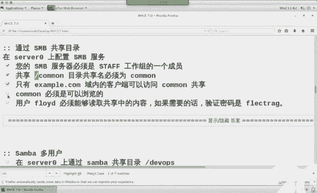

# 红帽RHCE7培训课程：P19：NFS与Samba高级配置教程


## 概述
在本节课中，我们将学习NFS（网络文件系统）和Samba（SMB/CIFS）服务的高级配置。重点包括如何为NFS服务配置Kerberos（krb5）票据认证以增强安全性，以及如何在Samba服务中配置多用户（multi-user）挂载以实现凭据切换。课程内容将涵盖核心概念、配置文件修改、服务管理及排错思路。

---

## 回顾昨日内容

上一节我们介绍了通过命令行配置防火墙规则以及邮件服务（Postfix）的配置。本节中，我们来看看昨天涉及的iSCSI存储服务的关键点。

iSCSI实验的核心步骤和注意事项如下：

*   **服务器端配置**：使用 `targetcli` 命令进行配置。主要操作包括创建后端存储（backstore）、创建iSCSI目标（target）、创建ACL（访问控制列表）以限定访问者，最后保存配置。
*   **客户端配置**：安装 `iscsi-initiator-utils` 包，修改 `/etc/iscsi/initiatorname.iscsi` 文件中的 `InitiatorName`，使其与服务器端ACL中定义的名称匹配，然后重启 `iscsid` 服务。
*   **客户端连接**：使用 `iscsiadm` 命令发现（`--mode discovery`）并登录（`--mode node`）服务器端的共享。成功后，本地会出现新的块设备（如 `/dev/sdb`）。
*   **分区与挂载**：对新设备进行分区、格式化，并使用UUID在 `/etc/fstab` 中配置永久挂载，选项需包含 `_netdev`。
*   **重要排错点**：在培训环境中，客户端（desktop0）首次重启服务可能需要较长时间，这是正常现象。考试环境无此问题。

---

## 今日课程核心：NFS与Samba

本节我们将深入探讨NFS和Samba服务的高级功能。

### NFS服务与Kerberos认证

NFS（Network File System）用于在网络中共享目录。与简单的NFS共享相比，高级配置引入了Kerberos认证，这比仅依赖IP或主机名更安全，因为它基于加密票据。

**核心配置流程如下：**

1.  **环境准备**：确保所有主机（Kerberos服务器、NFS服务器、NFS客户端）主机名正确、时间同步，并已加入同一个Kerberos域。培训环境中可使用提供的 `lab nfskrb5 setup` 脚本完成。
2.  **NFS服务器端配置**：
    *   修改 `/etc/exports` 文件，定义共享目录及权限。启用Kerberos安全选项：`sec=krb5p`。
    *   修改 `/etc/sysconfig/nfs` 文件，设置 `RPCNFSDARGS="-V 4.2"`。此设置可简化SELinux配置，避免手动修改上下文和布尔值。
    *   从Kerberos服务器下载主机的keytab文件：`wget -O /etc/krb5.keytab http://classroom.example.com/pub/keytabs/server0.keytab`
    *   启动并启用相关服务：`nfs-secure-server` 和 `nfs-server`。
    *   配置防火墙：需放行 `nfs`, `rpc-bind`, `mountd` 三个服务，客户端才能查看并挂载共享。
3.  **NFS客户端配置**：
    *   编辑 `/etc/fstab` 文件实现永久挂载。选项需与服务器端对应，包含 `sec=krb5p` 和 `v4.2`。
    *   从Kerberos服务器下载客户端的keytab文件。
    *   启动并启用 `nfs-secure` 服务。
    *   执行 `mount -a` 测试挂载。

**常见排错点：**
*   **主机名错误**：确保所有机器的主机名符合要求。
*   **时间不同步**：Kerberos对时间敏感，需保持各主机时间基本一致。
*   **Keytab文件问题**：如果票据文件损坏或不对应，可以从Kerberos服务器重新生成并下载。

**Keytab文件修复示例（在Kerberos服务器上）：**
```bash
kadmin.local
# 进入kadmin交互模式后，删除旧keytab，添加新的
ktadd -k /var/www/html/pub/keytabs/server0.keytab host/server0.example.com
ktadd -k /var/www/html/pub/keytabs/server0.keytab nfs/server0.example.com
quit
# 修改文件权限，供客户端下载
chmod 644 /var/www/html/pub/keytabs/server0.keytab
```

### Samba服务与多用户挂载

Samba实现了SMB/CIFS协议，用于与Windows系统共享文件和打印机。`multi-user` 挂载允许在已挂载共享的情况下，切换访问身份，而无需重新挂载。

**核心配置流程如下：**

1.  **Samba服务器端配置**：
    *   安装所需软件包：`samba`, `samba-common`, `samba-client`。
    *   编辑主配置文件 `/etc/samba/smb.conf`。
        *   在 `[global]` 部分设置 `workgroup`（工作组名）。
        *   创建共享段落，如 `[develop]`，指定 `path`（共享路径）、`valid users`（允许访问的用户）、`write list`（拥有写权限的用户）等参数。
    *   将系统用户（如 `kenji`, `chihao`）添加为Samba用户并设置密码：`smbpasswd -a username`。
    *   设置共享目录的SELinux上下文：`semanage fcontext -a -t samba_share_t "/sharedir(/.*)?"` 然后 `restorecon -Rv /sharedir`。
    *   启动并启用 `smb` 服务，配置防火墙。
2.  **Samba客户端配置（实现multi-user挂载）**：
    *   安装 `cifs-utils` 包。
    *   创建凭据文件（如 `/root/smb.cred`），内容为用户名和密码：
        ```
        username=kenji
        password=redhat
        ```
        并设置严格权限：`chmod 600 /root/smb.cred`。
    *   在 `/etc/fstab` 中配置永久挂载，使用 `multi-user` 和 `sec=ntlmssp` 选项，并指向凭据文件：
        ```
        //server0.example.com/develop /mnt/multiuser cifs credentials=/root/smb.cred,multiuser,sec=ntlmssp 0 0
        ```
    *   执行 `mount -a` 进行挂载。
3.  **客户端身份切换**：
    *   初始挂载后，访问身份是凭据文件中定义的用户（如kenji）。
    *   要切换为其他Samba用户（如chihao），使用 `cifscreds` 命令：
        ```bash
        cifscreds add -u chihao server0.example.com
        # 输入chihao的Samba密码
        ```
    *   之后，在该挂载点上的操作将以 `chihao` 的身份进行。

**关键选项说明：**
*   `multiuser`：启用多用户支持，允许挂载后切换用户凭据。
*   `sec=ntlmssp`：指定安全认证方式，与 `multiuser` 配合使用。
*   `credentials=file`：将用户名和密码存储在外部文件中，比直接写在 `/etc/fstab` 中更安全。

---



## 总结
本节课我们一起学习了NFS和Samba服务的高级配置。对于NFS，我们掌握了如何集成Kerberos（krb5）认证来提升共享访问的安全性，并熟悉了相关的服务管理、防火墙配置和关键排错方法。对于Samba，我们学习了如何配置共享权限，并通过 `multi-user` 和 `sec=ntlmssp` 选项实现了客户端挂载后的用户身份动态切换，这增强了共享访问的灵活性。理解这些概念和步骤，对于构建安全、可控的企业级文件共享服务至关重要。