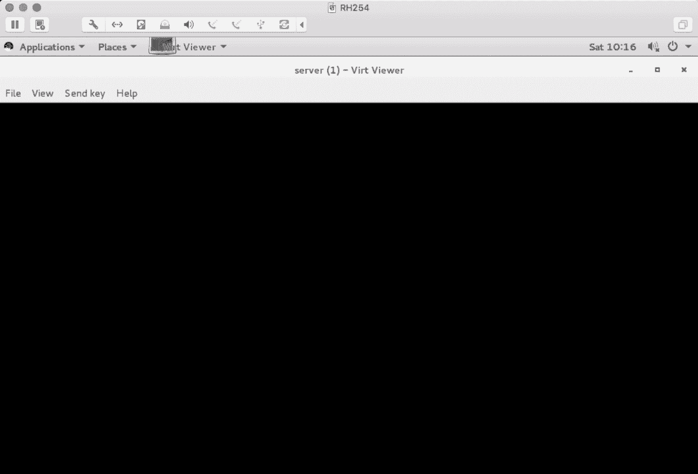
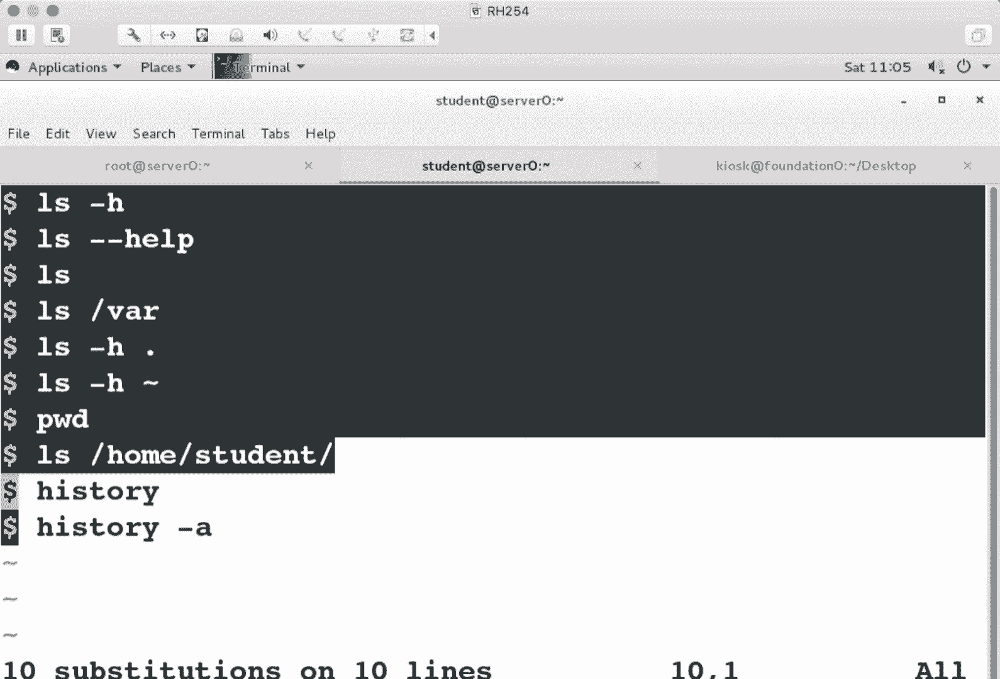

# 红帽Redhat RHCE7培训课程+RCHE7实战参考教程+红帽8.0教材电子版+模拟环境及辅导 - P1：1 - 16688888 - BV1zu41197p6

Oh。对于红包荣赵而言呢？😡，我们一共有三个级别。第一个级别。找2CSA。第二个级别叫2CE。第三个级别呢叫2CA。三个级别。在我们的整门课程当中啊。一共是12天，培训完之后啊，你会获得两人证。当然了。

得参加考试是吧啊，参加考试。一共有三本教材啊三本教材叫系统管理123。那么三本教材学完之后呢，如果你想参加考试的话，可以获得两个认证啊，两个认证。一个是上午考试的认证叫R4IC。

它叫做红帽认证的系统管理员叫ser系统管理员。那么CE呢叫做。认证的工程师啊认证工程师CA呢叫做红帽认证的架构师啊架构师。三个区别。那么他们的。为地位。RC啊是初级人证啊，CE呢是中级人证。

CA是高级印证。这三个人证。那么我们当前这门课程啊，学完之后。你会获得两个人的啊。参加完考试之后，你会获得两安证。那有同学经常问我问题是说我没有类那个次基础，学完了之后，我考试能不能过。

或者是通过率是多少？在我们整门课程上有这么一个标准。如果你能达到我们要求标准的话，我可以保证你百分之百通过。大家知道什么叫百分之百吗？😡，那他说那考试通过率是百分之百吗？不是。呃，我很诚实是吧？

通货率不是百分之百，为什么呢？😡，你课上相关的实验呢，你一看哎看着都眼熟都会。你看着都会和坐着都会，这是两个事儿。能理解吧？你看着都会，因为学过看着都会，但是你能不能不看答案啊，很快能做出来。

那我们先说一下标准。如果你能达到这个标准，我可以保证你能百分之百获得这两个人证啊，那标准是什么呢？我们在课上会讲一些考试的类型题。考试另用题。那么任意一道题。不看答案。15分钟内完成。咱们课程当中啊。

😡，就这一个标准。那就是说那一共多少道题啊？😡，上午加下午的题啊加一起4十多道啊，4十多道，45道以内啊，45道以内。那根据你每次因为考试的时候好几道题，好几套题呀。我们会覆盖所有的考点。

整个考点呢一共是45道题。不会超过45道题。你把这45道题呀考点给练熟了，你会发现哎考试很容易通过。但是有个前提呀，你得达到这个标准。如果你达不到这个标准的话，我也保证不了。OK吧。

先明确一下你的目标是什么，你的目标。有同学说就45道题，如果想15分之内完成任何的一道题。当你练熟了之后啊，这个是很容易完成的。但是如果你练过手呢，这个确实有些难度。换句话说。

在我们当前呢常见的一些认证当中，红帽它的含金量啊还是比较高的，因为它需要上机。你像微软认证啊，华为斯科，他们只有到高级认证的时候，才需要去上机操作，剩下都是选择题，拿鼠标选一选就完事。什么概念呢？

你找背背题都能过。但是对于红帽定制课程上，你必须得去有实际的操作。这道题必须理解。如果你不理解的话，想15分钟之内完成了，这个不太容易啊不太容易。第一门课呢主要讲的是一些基础啊。把基础打好了。

后面课要容易一些。所以说我们在这周和下周啊讲的课程内容啊会稍微慢一些啊，稍微慢一些。因为我们之间呢也有一个磨合的过程，是吧？Okay。这个是RC。那我说班级要有一个微信群。有个微信群。

微信群的作用是什么呢？沟通是吧。你课上有问题啊，你可以直接问啊，你在里面问，我看着就回答了。😡，这第一个。那如果你问一些跟这个别的课程有关的呀啊，一般你们的客户经理啊会给你们答复啊。

每个班都有一个类似于班主任这么一个职位，也在群里边啊，也在群里边。没加微信群的同学都加一下。呃，另外一个，如果平时有事儿的话呀，你可以。请个假啊，在里面吱一声啊在里面吱一声。OK了吧。呃。

这片当中啊主要是介绍我的哈啊，我姓苏啊，说了半天不知道我是谁啊，我姓苏叫苏震。😊，这个镇是提手旁的镇是吧，为什么是提手旁的呢？😡，主要想强调一个叫动手能力吧。多做练习啊多做练习。嗯。这个酥也挺好记是吧？

有一道非常著名的菜。叫东坡肉嗯。豆坡肉里面还没有酥是不是？苏东坡肉啊。哦。那这个里面你要记一个QQ号。27533431啊，QQ号。那为什么要记QQ号呢？在我们的课上啊会有一些课堂笔记。

我会给大家写一些课堂笔记。当然了，你要是自己整理更好啊。😊，那另外一个呢，我们会有课堂录像啊，课堂视频。有的学说，哎，老师，你有课大视频，我是不是就可以不来了呢？😊，不是。科大视频是干什么用的呀？😡。

课上在听课的过程当中，有的时候大家可能会溜号。那么你6号了怎么办？你可以回去翻视频是吧？哎，刚刚那个地方有6号了，听一下。当然了，如果你整门课程都能听下来啊，一门课一天不落啊。即使不看视频也无所谓。

即使不看视频无所谓，那视频主要是给哪些人用的呢？上课经常留号的人。或者说这个。只有微软的windows接触linux没有使用过，刚听的时候可能是呃不太适应啊不太适应。你可以看一下视频，巩固一下。

那为什么要提QQ号要提这个课堂笔记和视频呢？呃，因为现在网上啊在分享文件的时候，通常会用什么方式来分享啊？我们在分享文件的时候，通常用什么分享？网盘是吧。有朋友说，你为什么非要把你名写在笔记里面呢？

因为你QQ啊在加我好友的时候，他需要用到一个验证。那个验证的答案呢就是苏振。别写你的名哈，写我的名。因为我QQ里面都是我认识的人啊，不对，都是认识我的人。就咱们这么多同学呀，我可能还认不全啊，但不要紧。

你写上这个名人就能加进来。😡，有的人说为什么要加你的QQ？加QQ的原因本来啊我是想直接告诉你们百度盘地址的，但是呢百度盘地址会遇到这样的情况，经常由于放一些文件呢，链接失效了，是吧？啊，我告诉你们。

过两天链接失效了，你们是不是还得再问我呀？😡，所以说当有人跟我讲说，链接失效了之后，我就会把QQ签名更新一下。KQ签名是什么东西啊？听说签名就是网盘的地址。QQ签名。QQ签名就是网盘的地址。

那么在这个里面都是什么内容呢？我们课堂上用的培训环境。线下培训环境或叫离线培训环境。在百多块当中。那还有什么呢？😡，课堂笔记。课堂视频。就是上课呀，你要用到的内容都在百度盘里啊，有朋学说啊。

老师那线下环境那么大，我要下载的话，得一天一宿啊，还下不来。呃，因为咱们都是在本地是吧，本地是不是有一个非常方便的东西叫局域网啊？😊，可以通过网络拷贝吧。有同学说了，那网络拷碑的话，我也觉得麻烦。

我们是不是有U盘呢啊也可以拿U盘来拷碑啊，都行。😊，呃，下面是我的手机号。呃。一般你打的话呀。我要是看着了，我可能会接，也可能不接。所以说别紧张哈，因为经常有人骚扰我。谁发了我啊。

各种推销啊、广告啊啊所以说我也不知道是谁。如果你手机号被人标记为。这个类号码的话我可能不会接啊，如果说是个正常手机号，我会接哈。当然了，我要是上课的时候呢，我也不会接电话，除非你打两遍。😊。

打两面肯定是一个很急的事儿是吧？啊，我可能会急。那这篇当中你主要记两个东西，一个是我的QQ号，一个是我的姓名嗯，OK。那上面呢介绍一下我的工作经历啊，我们管呢就是职业生涯。

那我最开始的一份工作呀是在加日起啊，是在加日起，在大连。😊，呃，这假日期主要做是一些电子元器件啊，是一家工厂，在大连一家工厂。呃，叫欧姆龙。那当时在这个公司啊，主要负责是网络系统数据库这块啊。有没说。

那你到底负责是啥呀？😡，你说负责是网络呀，你说网络没事，老坏嘛？😡，也不老坏是吧？所以说偶尔弄一下网络，那弄的比较多的呢，还是系统和数据库啊，系统和数据库。那到后来呢，在一家这个培训机构啊。

是清华大学呀下属的一家培训机构啊，专门做培训。也是在大连大连又待了一段时间之后啊，到11年的时候啊，11年的时候来的北京，11年的时候正好是虚拟化比较。😊，比较这个流行的一年吧啊一年。呃。

当时这家软件公司呢也是专门来做虚拟化的，呃，是一个类似于大壳的一个软件啊，windows版的大壳吧。那到15年的时候啊，到这个。呃，东方瑞通啊东方瑞通在东方瑞通呢主要讲红猫的课程。

这意思home认识吧啊。在这培训基本都认识。那么在我的课上呢，希望大家有这么几点啊要求啊。三点要求三点要求当中啊，最基本的就是一个信念啊，信念信念是个什么概念呢？你在学习任何一个新知识的时候啊。

大多数人都会有一个。潜意识的抵触情绪。比如说为什么一个工作你干了10年，你就没想过换工作呢？😡，因为对一个新的环境啊，大多数人都有抵触的情绪，这是正常的。所以说你在学习的过程当中啊。

你要不断的给自己暗示啊，我一定能学会这门课很容易。这门课真的很容易。前提是你得练，你得每个时验呢至少练个五遍，三遍到五遍，你就会发现它很容易。如果你光是听的话呢，你就会发现听着听着就觉得很难。

但是当你练习了之后，你会发现越练越容易啊，越练越简单。😊，信鲜很重要啊，哎我们想啊，在一在这个非常落后的地区啊，有个很厉害的职业叫巫医是吧？那个炒根。😊，焖个草根烧成灰，和霍水，一喝病就好了，为什么呀？

因为那时候人都很愚昧，他认为喝完这个水他病就好了是吧？他认为好了，病就好了，这就是人信念的事儿。你像在中国呀，最近标一个啊头几年很流行的组织，叫法轮功是吧？法轮功最厉害的什么？也是信念。

就不管你做什么事儿。如果你有信念说这个事儿啊一定okK你就能学会啊。前提是你觉得也能学会。如果觉得说这个事儿我能学会吗？你如果是对自己怀疑的话，那么这个事儿你也有可能学会，但是很慢很慢，要更浪费时间。

😊，再样呢就是沟通和助教啊，沟通和助教。那么什么叫沟通呢？简单来说呀，我在讲的过程当中，我努力的去给你们讲明白。但有的同学啊可能是觉得哎老师你家是不是东北的呀啊，你家是不是辽宁的呀，可能觉得有口音是吧？

啊，不管有什么口音，我尽量讲普通话啊，尽量讲普通话，虽然不太标准啊。至少没讲这个朝鲜语是吧？啊，至少没讲朝鲜语OK。我尽量说明白，大家尽量听明白啊，我们尽量节约这个。沟通的时间要会问。

有问题的时候一定要会问。因为我们在做实验的时候呢，咱俩整门课程上了，基本上有一半的时间你们在做练习，一半的时间我在做讲解，基本上是1比1啊，不是说我一直在讲啊啊。😊，那么你在做练习的时候呢。

你肯定会有问题。不可能没有问题。你问我最好，你要不愿问我的话，那谁呀？问同桌啊，问同桌有同桌老师我同桌没有人啊，我同桌没有活人那怎么办？你说前后桌啊啊，有前后桌最那同桌弄一个活人啊，有问题多问啊。

用心多问O。😡，这是课上的一个要求。这篇要求当中啊，最主要的就是一个信念。你要确定你一定能学会考证一定能过OK。再按呢我们的目标。咱们当天IRCE的培训呢，一共是12天。四天一本教材啊四天一本教材。

换句话说。两周两周一门课啊两周一门课，尽量被全课。如果是实在是要出差，没办法。缺课一天两天也能跟得上，也别紧张。当然了，视频和课堂笔记一定要做，一定要看啊，一定要做一遍看。那我们的目标很简单。

每天学过的内容，如果是考点的话，练熟。不是考点的话，照着笔记能做出来就行。😡，为什么呢？大家想考试的时候让你带笔记嘛？😡，不让带是吧？工作当中可不可以打电话，可不可以看笔记啊，可以吧？

所以说工作当中你要用到这个技术了，你可以照着文档的思路啊自己做出来，这就OK。但是在考试的时候呢，对于考点而言是要求必须掌握的。这个时候你看不到笔记啊啊，那就得多练。如果想进入一个实验的话呀。

最简单的办法就是多练习啊，最简单办法，换句话说，每天讲过的内容。😊，只要是考点啊只要是考点多练啊，那么你到整门课学完之后啊，我们还会有两天的考前辅导。考前辅导的时间呢，你们的课程顾问啊。

客户经理会跟你们沟通啊，会告诉你们什么时间啊，那个是额外的两天不占这12天当中。呃，每周啊每周的话，你把。这周学过的内容再捋一下啊，因为学习的过程当中就是无数次回忆的过程。无数次回忆的过程。

什么叫无数次回忆呢？问大家一个问题，你喜欢看喜剧还是喜欢看悲剧啊？都要看喜剧哈。😊，因为人放松的时候啊觉得很快乐啊觉得很快乐。就像好多人愿意去旅游也是一样，可以放松。😊，那你是愿意当喜剧的主角呢。

还是愿意当悲剧的主角呢？都愿当喜剧的主角是吧？喜剧多好啊，快乐人生。😊，但是你会发现在人的一生当中啊，有很多事儿，你印象最深的永远不是喜事儿。😡，什么概念呢？你印象最深的都是比如说别踩你脚。😡。

你打编一下，这是两个概念。别人踩你脚的话，你疼是吧？你打别人还别人疼。😡，换句花是什么概念？人对悲伤的事印象特别深刻啊印象特别深刻。换句话说什么概念呢？在学习的过程当中，虽然说我们会营造一个轻松的氛围。

让大家尽可能去把这个过程给学下来。但是呢。学习的过程当中确实有些内容啊，因为在反复的练习同一个实验，稍微有些苦恼。所以说要多练习啊多练习。OK这三门课。那对于巩固学习的方法呀，我们一般每天早晨呢。😊。

9点到9点半之间。课台员提问，简单来说就是回忆上次课讲的内容。每天都9点上课啊，尽量别迟到尽量别迟到。那然后呢，课堂讲解啊，一般是讲解到下午的4。4点多一点啊，4点多1点，4。4点10分15分之样啊。

那剩下的时间呢一般是做练习。我们的课堂安排呀基本上是9点半。9点上课是吧，9点上课几点放学呀？9点上课。5点半放学。啊，5点半有的学说啊，老师，我就家离的远，我就下午5点走行不行啊，也可以啊，也可以。

如果是课堂给时间呢，你没有做练习的话，回家做练习可不可以啊，也行啊也行。那我们基本上是9点上课之后到9点半。9点20左右啊，有可能是9点15，有可能9点半。呃，这段时间主要是来做复习啊复习。

昨天讲的内容做一道提问。然后呢，基本上是一个半小时一休息。基本上是一个半小时一休息。那么如果是一个半小时一休息的话，9点到几点了？十点半吧。9点到10点半休息。10点半休息，一般休息10分钟啊。

休息10分钟。然后呢，10点40到几点了？到12点。到12点就可以吃饭了。啊，一天中最重要的一件事是吧？吃饭啊。呃，吃完饭下午几点上课呀？一点。休息一小时啊，中午别吃太多了啊。为什么呢？

现在天气越来越热乎了是吧？如果你中午吃多了，你会发现下午你只看着我嘴在动，但是听不到我在讲什么。因为你已经在休息了啊，你那肠子也把你那所有的精力都给抓走了啊。你如果想到听听课的话，尽量别吃饱。

但一定要吃饭啊，一定要吃饭，别饿晕了哈。OK那么一点到几点了？😊，两点半啊，来点半。然后2点40到。几点。到4点。哎。到4点。那剩下4点10分到5点半。基本上就给练习了是吧？啊，同学说。

那我一天就这么点时间做练习吗。😡，每天中午吃完饭回来之后啊，下午的第一堂课我也不讲。😡，下午第一堂课是你在做练习或说在消化的时间。你消耗段时间因为听不进去课呀，所以说我讲的少啊我讲的少也会稍讲点。

但大多数的时间呢都做练习。这个时间和这个时间是练习时间，其他时间基本上都是讲解时间。当然了呃。4点到5点之间呢也会讲一些内容啊也会讲一些内容。OK这个是大概的时间安排。😊，那在学习的过程当中呢。

有这么个三多啊三多。三多的话我。这个有个人挺厉害，叫许三多是吧？啊，许三多都听过吗？啊，没听过的话，去看看电视剧。叫傻根儿是吧？啊，不对，是傻根演的吧啊，王宝强演的个片儿。好，这三多是什么多呢？哪三多？

第一个多思考。首先问一下各位同学，咱班有没有2岁以里的，小于20岁的举下手。哎，没有陈号。没有的话，你就多思考吧，为什么呢？因为人在小于2岁的时候啊，人的记忆很简单。😊，人的鸡很简单。

都是死记硬背的东西，不用考虑为什么。我们上小学的时候，老师说。有个数字读零。有个字母读A，有个字母读R，你问过为什么吧？😡，没问过是吧，那你会发现你现在是不是都能记得住啊？😡，但是人在过20岁之后。

记忆方法变了。如果你不掌握记忆方法的话，你会发现很容易忘记，很容易忘记。只是能啊听过见过有个印行，但是很容易忘记。所以说你既然是超过了20岁，那么请多思考。都想为什么，我们课上了也会给大家讲为什么啊。

因为我也超过20岁了，我也知道这个东西怎么记更容易一些。所以说呢会给大家去讲方法啊，讲思路。😡，多思考。那除了多思考之外呢，你还要多提问啊，多提问，多问啊，多问，你只有思考了才会问。

你只有做练习了才会问。在我的课上啊，经常会有同学从第一天到第12天。一句话没跟我说过。😡，那你一句话没跟我说过的话，肯定是一个问题没问过是吧？那既然没问过问题，我只能说明一点啊，你肯定是没做练习。

或者说你实在是很有经验啊很有经验。可能不问，否则的话都会问我啊，因为你在做练习的时候，肯定会遇到各种奇怪的现象。你要问为什么啊，多提问。再有呢多练习啊多练习。来那个是这门课就一点多练啊多练。

我们课程上不管怎么讲解呀啊，不管怎么思考，怎么提问。如果你不练的话，这个东西很容易忘记。😡，因为来那个这门课，他叫做熟练工种。问大家去简单一个问题啊。😡，你想没想过呼吸的时候应该怎么呼吸呀？😡。

身上先是先呼气还是先吸气呀？想过吗？没想过是吧？因为你从刚出生开始啊，已经习惯了啊，呼吸啊呼吸先呼先吸啊，到底是先怎么操作，这个已经变成一个习惯了。就像我们在用些输入法的时候也是一样的。😊。

咱们有没有同学会5笔输入法的呀？有没有？啊，有。啊，能备注字根吗？啊，备不住，有能备注5笔书法字根的同学吗？😡，能被护人都不会无笔。当然会有比的人都背物资格，为什么呀？😡，因为富裕无比的人呢。

他是拿手扶了，大家知道什么叫扶了吗？😡，打某个字儿，它就叫肌肉肌。就像你在敲一些命令的时候，如果这个命令很熟，你只要想受我创建个文件夹啊，结局拿手去摸去了。你没有想那个命令到底是啥？😡。

这个肌肉机lenings这颗呢和微软的windows不太一样。微软这门课程上啊就会个鼠标就得了。找个地方鼠标右键啊，windows就选完了，你这是微软的课，但是linux不是有好多的密令。

在我们的课程上啊啊学的命令也比较多。有朋友说那学那么多命令，我们能都背得住吗？😡，啊，都很容易背，都是一些简单的英文单词，加一些相应的规则。然后呢又发现啊这个就是命令，它能去做相应的操作。

多练习啊多练习。那如果你把这三多都理解了之后啊。我们整门课程上啊，你就会发现很容易啊很容易。那我们当看这个教室的环境，咱们物理机是什么系统啊？当时人没走他是吧。windows有个密码password啊。

passwordpassword这个词翻译成中文，是不是密码的意思？我们把这个密码做了一些。规则变换啊规则替换。单出的第一个字母，我们把它变成了大写字母。😊，8P吧。

然后A一这个字母呢换成了特殊字符it啊it。O这个字母长得和数字零很像，我们把它换成了0。那这个就是我们的windows密码。pass word啊pass word。有同友说你告诉我们这个密码干嘛呀？

一开机是不我们要密码啊？😡，你开机是不是自动登录啊？对吧都自造导购，但是你中午吃完饭之后呢，你会发现它就有一个屏保。😊，中午吃完饭之后是不是有个屏保啊？开机一段时间之后不操作，自动运行。

那么屏保一启动了之后，哎，你得需要这个密码才能重新登录。pass wordWP eightSSW0RD啊密码。O。😊，呃。给你们写一下啊。啊，这是克拉米。那下面呢我们来说一下培训环境。呃，培训环境。

在百度盘当中啊。有这么几个文件啊这么几个文件。你们使用最多的呢是这个文件。Excel。excel文件。我把这个文件打开啊，给大家看一下这里面是啥。🤧嗯。那大家可以看到这个里面有好多呀。

IP加动款号IP加动口号。首先问一下各位同学听没听过VNC这个软件啊？听过windows的远程桌面吗？原生管理了是吧，那我们的线上环境啊，都是在楼上有个机房。在计划中有好多的服务器啊都在服务器上。

我们是通过VNC这个软件远程的来连接到相应的服务器来做管理，来做配置。换句话说，你得需要知道服务器的IP和端款号。服务器的IP和短号。嗯，我们来分一下啊，1234。一个。四组啊那四组的话呢。

你们分是这么来分啊，12345678910。😊，🤧う。1台机器算一组啊十0台机器算一组。那从从门口那边开始数吧，1到10。有的人说就6个人怎么能1到10呢？啊，每组给你复一两台吧啊，每组复一两台。😡。

123456，然剩下剩下4台愿意用谁用谁随便OK吧。然后呢，第二组是11到20。21到3031到40okK吧。你在用的时候呢，VC这个软件啊，它有个特点。什么特点呢？可以一堆人用同一台机器吧。

如果你发现这个鼠标在晃，有人在敲字儿，你就换一台机器。😡，越来而小。啊，两人抢的话，这个挺痛苦一件事。哎，这个鼠标落晃这个。就像两个人在玩游戏的时候一样，在抢鼠标啊，就这感觉。O。

那么VNC这个软件在哪儿呢？在百度盘中啊，大家看有没有过这个软件。叫VC view。VC viewer看到了吧？用这个软件，然后呢打开excel当中相应的。地址啊。比如说对于教师机而言。

我是不是应该连59000啊？59320啊，那么我需要用到minC这个软件啊连接。

在第一次连接的时候啊，它可能是黑屏啊，黑屏不要紧的，你可以动动鼠标或者说呃。

直接给它关了，重新开一下。VC打开之后啊，要求你用的就是这个IP和动口号。比如说10点。10。3点。0点儿。15。冒号593个0。然后呢，一挥车。VC啊，我们没有给他去设置密码啊，没有给他设置密码。

那进来之后啊，大家会发现是不是看到这么一个桌面啊？😡，这个是linux的桌面，然后呢，在桌面上我们会发现有些文件夹，有些文件夹。😊，呃，这个是linux的桌面。这是线上环境。还有一个。

对于线上环境而言呢，你需要知道这么两点。第一个。你需要知道的excel文件。线上完毕。你需要知道这个excel文件。然后呢，你还需要知道一个软件，这个软件叫什么名啊？叫VC6啊VC6。VC6啊。

这两个东西啊在百度款里都有。他们都在百度盘里啊都在百度盘里。啊，百度盘地址也给你们写一下吧。百度盘地址。哦。百托盘地址在QQ签名里。不好。在路盘。这个东西不建议拿手敲啊，因为它区根大小写是吧？啊。

尽量复制粘贴。Okay。这是线上环境。在学习的过程当中啊，建议大家使用线下环境。为什么要建议使用线下环境呢？大家都有笔记本吧。明天上课最好自己都背着啊，最好自己都背着。为什么建议属用线下环境原因？

线下环境的话，你可以随身携带啊，你可以随身携带。咱俩都能做练习，线上环境的话，你只有连到学校才能做练习吧。你能不能在家没事往学校来连呢也行啊，我们有个远程桌面可以来连到体域网。但不是任何时间都能连上。

因为好多班的学生是吧，大家可能会抢来抢去啊，非上课时间，非上课时间会抢来抢去。所以说最好是准备一套线下环境。线上环境，那线下环境既然是要带笔记本的话，它是有些硬件和软件的要求啊。

我们看一下线下环境的要求。尽量都把自己的笔记本带了啊，那笔记本吧就两点要求，一个是你的CPU。CPU要支持什么技术啊？虚拟化叫VTX吧。CPU必须支持虚拟化技术。那还有呢？你的内存。4G以上。

如果内存没到4G的话呀，去买个内饰条加。笔记本最大都支持到4G啊，有的人说那我的CPU支不支持VTX呀？2000年之后的笔记本都支持，现在是2017年是吧？我不相信你还用2000年之前的笔记本。

当然有可能是吧，有可能。2000年之前的笔记本啊，你换个CPU也支持啊，你换个CPU也支持。换个CPU的8090块钱吧啊，2000年之前的笔记本，如果想支持VTX的话。内存的话呃。就200块钱。

这些都搞定了啊，200到300之间啊。okK线下环境硬件和软件的要求。那么软件的要求什么呢？我们需要安装一个软件叫VMR啊，这个软件大家都听过吧。没用过的同学举手。都用过呀。啊，不太正常是吧？

这个没用过，别不好意思哈，没用过就是没用过啊，你没用过，就强调一下。那，为什么要用VMM这个软件呢？因为这个软件它属于跨平台的软件。不管你为是windows。😡，就物理机系统是windows也好。

还是linux，还是mro OS。不管你用的是哪一个平台，都支持这个软件。OK吧。😊，都支持这个软件的功能啊叫做虚拟机啊，虚拟机它是不是可以来模拟？各种硬件啊。然后我们可以在上面装不同的系统啊。

VM one啊VM one。这个软件如果你想下载的话呀。呃，我们有个网站。这个网站。Okay。大家看左侧有个下载吧。左侧啊这可能看不着我鼠标挪总能看着吧。直接下载就行。

根据你使用的版本不同啊，你下载的内容不一样。

那大家可以看一下下面这个位置，有个叫fuion，有个叫worktation。看到了吧。

呃，你要用微软的windows版本的话，就worktation。

你如果是m5S的话呢，就用复审啊，就用复审。根据你的操作系统版本不同，你用到这个软件呢。

不太一样啊。软件不太一样。这个是他的网址。连玩的管吗。确认下载就行，下载完了之后啊，是不是得注册呀啊，得注册。呃。你可以单独QQ问我要哈，我可以发给你。但是百度号我放不了，因为这个。

现在国家呀对什么什么的打击力度比较强是吧？百度盘主要是一放这个东西啊，一放什么P根之类的文件，直接就百度盘链接就失效。OK吧。就像我为什么说我们的百度盘体史。为什么要放在QQ签名里啊？

就因为也有同学老要我老跟我要东西，我一放在百度盘里边呢，共享给他老失效。后来啊我就QQ传吧，谁需要的话，就QQ要一下啊，QQ要一下。😊，Okay。那么这个软件的功能啊，它可以打开虚拟机是吧？

他可以打开别人做好的虚拟机。呃，我们百度盘上啊有做好的虚拟机。百度网盘。在百度盘中啊，有个叫仿对心零。这个是做好的续云机啊。那如果你今天带了移动硬盘之类的呀，我可以copy给你，你就不用回家下载了。

这个你要下载到明天呢，也不一定能下载完。或者是我这有个U盘啊，你们可以一会儿下课的时候啊，过来copy一下。😊，过来capy一下也行。那一部分是什么呢？这个东西是电子版的教材。电子版的教材。

大家手里都有教材是吧？有同学说觉得天天背教台太沉了啊，那家可以换成背笔记本儿。😊，啊，那背笔本是不是就清了呀，不是。😡，背笔记本的话是建议大家呀把这个培训环境内随时携带，随时练吧啊随时练。呃。

下面这个呢。这3个PDF文件是上课我们用的课件。咱们一共是三门课吧。上面扣的客人代码是124134254。咱们这两周。是124这门课啊，这两周是124这门课。然后下中间两周呢是134，最后两周是254。

那既然是讲到了三门课程，三门课程的内容它是由浅入深啊由浅入深。有的说那浅的地方我用不用好好学呀？😡，浅的定位是基础。学的全是零件，你把零件学完了之后呢，到第二门课就是有些用零件的实验了。

到第三门课呢会用到第一门课和第二门课的内容。所以说你想把整门课很容易能学下来啊，第一门课要注意啊，第一门课要注意。😊，呃，再有。呃，这个呢是刚刚说的VNC6的那个软件。VNCPU的软件。

你可以上VNC的官网上去下载，官网就有。但是呢他这个版本号啊要注意不要超过5。2。不要超过5。2，为什么呢？因为咱们线上环境啊线上环境的它的那个。服务器的版本号啊，跟它这个只到5。2接容，超过5。

2的时候看着花屏。线上环境看着滑屏，所以说到5。2，现在不是最新版啊。OK这个是百布函中的内容。那线下环境怎么用？

呃，我现在用的呀是一个fuction版本。🤧这是。就用那个复神版本。在麦克系统当中啊。我做了一些虚拟机啊，我做了一些虚拟机。我们这门课呢是254啊，124134254。到最后一门课是254是吧？

所以说你可以给它起名称，findition0，也可以给它改成IH254，随便这个就是个文件夹。然后呢，如果是麦克 OS系统的话，我们可以看一下它里面的内容。大家会发现。我按一下种类排下序。

它里面是不是有好多。有个叫VMDK的文件吧，VMDK是虚拟机的磁盘文件硬盘。然后呢，你会发现是不是有个叫VMX文件。这个文件呢是它的配置文件，虚拟机的配置文件。什么叫配置文件呢？

你再将你这个虚拟机啊去做硬件的设置的时候，就是在改那个配置文件。能理解吧，就在改配置。换句话说，你直接打开你刚刚那个文件呢，然后启动。

我关。

这个就是一个线下环境，用VMR软件打开一个已经做好的训拟机啊，打开一个已经做好的训拟机。嗯。

那现在我们看到这个过程呢是迅机启动的过程，或者说是linux启动过程。对于复顺版本呢，因为它是在一个m克 OS上运行的一个系统。然后呢，我用的是紧主机模式。他会出现一些这个提示。

windows版本没有啊，windows版本没有。输入你相应用户名和密码。不输取消也行哈，不输取消也行。就是取消了之后啊，你物理机和虚拟机不能联网啊，不能联网，敲完密码之后能联网就这区别。😊。

那大家可以看一下这个桌面跟我们刚刚看到那个线上版本的是不是一样的呀？线上的培训环境是一样的，是不是也是一个桌面啊，也是一个桌面。不管你用线上环境也好，还是线下环境也好。仿定0和RH254。

它都是线下环境，就是文件夹名不一样啊文件夹名不一样。O。这个VY版本呢建议大家更新到最新的版本。因为我当时做的时候啊，用的是VRL12以后，12。0以后的版本。所以说你要用VYD版本的话，也打不开。

就像我们在用office的时候，如果你用的是office2007，能不能打开office2016的文档啊？打不开吧，是不是去安装第三方的组件啊？第三方组件默认打不开啊，线下环境。

线上环境线上环境怎么用知道了吧。呃，咱们中午啊吃完饭回来之后，你至少要能连上一个线上环境。OK吧，如果带笔记本的同学呢，你可以过来copy一份啊，线下环境。😊，带移动硬盘的同学呢。

是不是也可以co一分啊？我可以看了一份。那另外一个内容啊，另外一个课外的内容啊。另外一个课外内容。有同学说，哎，老师，我不愿背笔记本啊，这不有电脑吗？用这个电脑行不行啊？😡，也行是吧？也能用。

但是这个电脑的系统啊是不是都别人的系统。我如果想保证随时都能做实验的话，那怎么办？微软呢它到win8的时候出了一个功能，叫做windows to go。听过吧。没听过。运度是不够。这个功能是干嘛的呢？

😡，winow4系统可不可以调在移动硬盘上？可以吧？微软到WN8的时候啊，就支持安装在移动硬盘上了。当然你的U盘如果足够大的话，也可以装在U盘。什么概念呢？啊，把你的系统装在一个移动硬盘上，然后呢。

只要用这个移动硬盘启动，是不是就是你的windows系统啊？然后你的环境，因为对于大多数搞IT的人而言呢，他还是习惯于自己的环境。换一台机器，最基本的输法是不太习惯的。我用五笔，你非要用拼音啊。

当然我也会拼音是吧？只不过是因为近视不太愿意打拼音而已。😡，打拼音的时候是不是出码太多呀，你就老是敲唉，哪个字儿啊，累眼睛，所以说去学校无笔。😡，OK那这个东西它的功能啊就是可以把。😊。

一个windows系统装在一个。移动硬盘上。家是不是也不用带笔记本啊？到哪一插一硬盘都是自己的培训环境啊，都可以多练习。啊，这个是额外内容啊，了解一下。呃，刚刚呢我们讲了一下线上环境和线下环境啊。

线上和线下。O。😊，呃，下面呢我们开始第一门课内容。夹了一个小时，专门讲什么了呀？专门来讲环境了是吧？毕业门克124。嗯好。发问命令。啊，访问命令行，有的说那我们怎么上来就讲命令行啊。

雷美公司在管理的时候啊，大多数用的都是命令。有同学说那支不支持桌面啊，也支持啊也支持。但是在做远程维护管理的时候，还用的命令还比较多，图形用的较少啊，图形用的较少。

在这章当中要求各位同学呢掌握我们命令的特性啊命令特性。或使用一些简单的命令啊。再看这组实验的时候呢，我要先给大家看一个东西啊。在咱们的培训环境中啊。有三台机器。我们先来看一下这个位置哈。

在applications当中。😊，系统工具。最后一行有一个叫做虚拟机管理器。

因为我们当前呢默认是用一个普通用户身份来登录，而这个软件呢只能通过管理员的身份才能访问。Lux当中默认的管理员用户名叫什么？😡。

root啊root它的密码是大ASIMOV。这个密码在哪写着呢？在你们。那个excel表还记得吧。excel表里写的密码是啥？大ASIMOV。亚洲是什么意思呀？😡，亚洲的英文是不是H2啊，亚洲。

移动到了亚洲啊，这个英文是倒着说话是吧？我们当门这套培训环境啊是长茂标准官方培训教培训环境。帽官方做的。这不管你是去哪个红帽的培训中心呢，去培训，用的都是这套环境，密码都是他啊密码都是他。

Aer MOV。🤧Okay。那我们回头他来，大家看一下，这个里面有三台小电脑是吧？三台小电脑在培训环境中啊，我们主要用的是三台机器。Cl拉斯 roomso。但是个套。这三台也是虚拟机。

刚刚我们提到了VNYVNY是不是虚拟机呀？听过KVM吗？KVM也是虚拟机，它是勒宁斯自带的吧。le斯自带的熏音机。那这三个虚拟机啊，它都是在KVM当中啊。AVM当中的寻。可良。

那我们最外层的这个虚拟机啊，是用VIY来做的。万做的这个虚拟机啊叫防飞。放啲水。你用的虚拟机不同，反对式Iso啊 desktoptop ID各不相同。ID比如说我们这套环境啊叫做fin0。

大家看这个位置，我随便打开个终端，看到访定是零了吧。你登录的纺不同啊，那么它那个ID记得有变化。如果是纺8的话，就是so8，但是top8。OK吧，整套培训环境中只有一个classroom。

class room的作用是什么呢？它上面主要是提供了一些服务，比如说DSCP。干嘛的呀？分配IP地址的是吧，他给serv但是top分配IP地址。比如说DNS干嘛的呀？

做名声解析的sole和但是 top，他们都用class room来做名声解析。class room尽量不要修改。尽量不要修改，反对申尽量不要修改。我们课上做的所有实验呢用的都是serv套。

课上做的所有选用的都是卡俩。那么对于他俩而言呢，他俩就是一个培训环境。在考试的时候，反对渗是安装在物理机上，一开机直接就是反对渗。考试环境下，法对身是安装在物理机上。

那为什么我们要把它安装在VNY2里呢？你说方便移动啊？到哪是不是说安装一个wifi软件，打开就能用啊，打开就能用。为什么我们非要用虚拟机？另外一个条件使用虚拟机的时候。

我是不是可以弄多台机器来做一些网络上的实验？一台物理机可不可以安装多个系统？我C盘装到windows，D盘装个lininux可以吧，但是他们能同时运行吗？不能虚拟机的话是不是得同时运行？

这是为什么用虚拟的原因啊，你可以带这套培训环境随便走啊，随便走。那么续机另外一大特点是什么呢？它是不是有快照啊？可以快速恢复，就像我们在用物理机的时候，大家听过gst他吗？😊，我们把一台机器安装系统。

安装驱动，安装应用啊，然后呢做个goose。中病毒了，崩溃了，构思一恢复完事吧，很快。快照也是一样的。在训集当中啊有这样的功能啊。

我给大家做了一个初始化的拍照，叫INIT啊，initIIT初始化的拍照。如果你反对身出问题了，inning的快照回复一下，整个培训环境是不是恢复到最开始的状态了啊？

在做宣案的时候。那我里面的虚拟机啊用的是不是KVM啊？如果KVM做的这两个虚拟机出问题了。我们也可以用一些命令来给它恢复啊，来给它恢复。在给大家写笔记的时候呢，如果你看到了这样的提示。

是说明下面的实验呢是在纺备身上做的。如果你看到了这样的提示，是说明下面的实验是在serv那个虚拟机里做的。OK吧，这是一个标记啊，label。那么在反对面上，我们来看能做什么。

那刚刚我们看到了你是不是有1233台虚拟机啊？报告。反对身是你当天VMM虚拟机class roomso，但是套，这个是KVM虚拟机，是不是虚拟机里面又塞了3个虚拟机？四台机器啊4台机器。换句话说。

你内存如果小于4G的话，这个。跑不起来了吧嗯，带个司机啊。ok。那这两个虚拟机默认是不是关闭的呀啊，默认关闭的。对的。在桌面空白位置鼠标键，有个叫open in terminal。

打开终端桌面空白位置鼠标键。oppen inal打开终端。打开终端之后呢，我们可以去敲一些命令啊，可以去敲一些命令。这交。新版。好。し。对于KVM虚拟机啊，在培训环境当中给我们做一些脚本。

叫做IHTVM controll。IGT呢叫做。RH叫红帽的意思，ride aheadT代表是tuch啊，培训啊，教育VM叫虚拟机cttrol叫控制。培训环境中寻拟控制命力。

这个命令只有在培训环境和考试环境中有实际工作中没有。能听懂吧？培训环境和考试环境都有。实际工作中没有。这条命令用不用记全了呀？你就记个IT就行了。😡，对于整门课目而言。

要求大家记住的就是命令的头2到3个字母。头2到3个，有同学说老师我就记一个字母行不行？Yeahやで。一个字母这挺困难，为什么呢？一个字母开头的命令太多。😡，2到3个，大家想我们的姓名一般是几个字儿。

最少几个字儿。最少俩字吧，你命令最少记两个字母。OK吧。别第一个字母哈别第一个字母。😊，制造剂两个按开包键。当你摁两下的时候，大家会发现他说会列出好多命令。一对吧。OK那如果我是G个RGT。😊。

还是开包键。是不就一瓶就能厉害了。你记的命令越全啊。那么越容易来查找。我们可以看一下刚刚我们那个命令是不是他呀。OK吧。😊，在linux当中，你必须掌握的一个内容就是tableable键啊table键。

IHT。开播键按两下。黑波胶按两下什么作用？列出吧，命令支持列出。然后呢，我们接着tableable。都是这。接着提步。VM control。但位发现是不是列出的一些子命令。在企业版7当中。

它一个最大的一个特性啊，就支持子命令的补全列出7之前的版本，咱们当才讲的版本是企业版7哈EL7。呃，7之前的版本呢只支持命令和路径的列出和不全，不支持死命令。我们可以看这个里面有没有个叫resite呀？

reside什么意思？重置。那star呢？启动stop停止。power off关机。tature是状态。6呢查看打开啊查看打开。那这条命令啊可以对我们的server desktoptop来做设置啊。

来做设置恢复。我们首先来tatus。如果是STAT。这是不是就唯一了呀？安泰播键。是不可以补全？如果不是V一的话，按table键一下没反应吧，摁两下。是不是列出啊？如果前面这个字符是V一的话，摁一下。

他的功能说不全。开le键有两个功能，第一个功能叫做列出，第二个功能叫做补全啊，第一个功能叫列出，第二功能叫补权。那么在一个table。大家会发现我们查看状态的话，可以看谁的状态呀。呃，看谁都行是吧。

我看看out。看好了之后，他会发现有几个missing啊。两个我们刚刚看KBM那个管理器虚拟机管理器的时候，他俩是我没有启动。这个状态如果你把这两个虚拟机搞崩溃了，那么我们应该怎么办呢？The set。

它就有点类似于VMY当中的快照恢复。你把这两个虚拟机搞崩溃了，就得s一下。Yes。😊，正在recycling啊，先关机，然后重置重置的时候呢，他把它的磁盘文件呢给做了个替换。你虚拟机如果坏了的话。

把它的磁盘文件给恢复回来，虚拟机是不是恢复了呀啊，他这么一个思路啊，怎么做的快照。呃，刚刚呢我们介绍了两个命令。叫RTVM controll。咱们第一门课呀只会用到server这个虚拟机。

你把它启动就可以。如果你不用res的话，直用star可不可以啊？也行是吧？你没用过的情况下，start就可以啊，s就可以。Okay。那么当你的讯机启动了之后，我们再次来查看一下状态。说变软景了呀。

边running。那如果你想查看这个虚拟机怎么看呢？我们刚刚是不是有个叫view啊？😡。

6。Vi server。大家看到这个界面了吗？看标题ser。Sour。这个人是不是叫stdent呀？啊，st的密码是什么？sdent密码就是student。student的密码就是student。

好，那切换到server这个虚拟之后，你可以打开终端。

大家看一下这台机器名叫什么？s0，你要用的是仿定线8的话，它叫serv8。同意。能理解吧，最后一个值不一样，为什么值要不一样呢？

大家想在一个局域网当中，我们这么多主机，主机没一样的话是不是冲突啊？对面冲突。O。😊，你还可以用view这条命令来打开你的虚拟机。这几条命令。他们都是在培训环境中能使用的命令。只有在培训环境中能使用。

一个tableable键能补全，两个tableable键能列出啊，tableable键的作用。那我么会发现L斯当中这个命令啊，脚本是不是都有些特殊的含义啊？都些特殊的含义。这能跟上吧。O。

那下面呢我们要给大家介绍一条秘令。叫做浩斯特。哈斯特。浩斯特这条命令的作用是什么呢？它是专门来做DNS解析的啊，DNS解析。在培训环境中，如果你每次都预销4520，这个你们查不查？很长是吧？

大家在上网的时候，你是不是经常说什么3W点百度点com之类的？那那台服务器名就叫3W吗？不是吧。有可能叫别的名，3W是个别名啊，3W是个别名。同理，我们当前4O20它的别名是什么呀？S0。

他的别名是S0。换句话说，你并名是S0，我每次访问S0是不就可以了？只要是DNS能解析的话，我访问S0，是不是就能找到0。11这个主机呀？如果你是纺对圈8的话，那么你这个位置是8。11。能看到区别吧。

把零换算成你相应的ID啊，零换成相应的ID我当年是不是仿对些零啊？那么我用的就是4200。11。如果你是纺定针8的话，那么就是S8。4528点咱们点CO。8。11。OK吧。这是培训环境中我们的区别。

ok。那既然S0就是serv0，我们有个命令叫SSH。他们有个命令叫SSH大家听过car night吗？他要卖在什么作用？嗯。他那个和原生桌面的区别是什么？远程桌面是图形远程管理吧。

powernet是字符远程管理。那为什么我们不用powernet用SSH呢？SSH是密文传输。我们在网上啊经常用HTTB协议，后来呢。我们会发现好多网站是变成HTDBS协议了。那个S是什么呀？

是SSL啊。它的特点呢叫加密团书。客户端和服务器端数据是以密文的形式传输。大家听没听过修台器？中国小局俗语叫隔墙有耳是吧？我们在聊天嗯说那个女老师坏话。然后女老师在门口，他是不能听到咱们说什么呀？

然后呢，咱们用这个。另外一种语言来说，他听不懂啊，是不是叫密文传输啊啊，密文传输。在现实生活当中啊。中国有一些少数民族，比如说这个朝鲜啊。这个朝鲜族鲜族啊，鲜族人说话呀，他第一句都是中文。哎。

你也是抄明人呐，后面那句咱们就听不懂了啊。😡，后面那一趟就开始低头都一串啊。都听不懂啊，那什么概念呢？密文传输是吧？那如果你知道他加密算法的话，你是不是也能听得懂啊？但是在互联网上，我们的SSH也好。

HTPSS也好，他们用的是证书SS32来做加密。而这个证书呢，如果要破解的话，1024位的证书破解的需要十年啊，十年，按照十年是什么概念嘛？那个密码破解已经没有意见了。一般情况下密码是3个月就改是吧？

你十年才亏欠出来，你马早改了。🤧O。那SSA是后面的，接的是用户名。要用哪一个身份？A连接哪台机器？配连接哪台机器？那大家可以看下秦道图。这个位置变成420了。要用哪一个身份来连接哪一台机器。那这个。

OK那我登录的时候要密码了吗？😊，说没要密码。我们在第一门课的后半后半的部分会讲到SSH两种验证方式。一种是通过公钥私钥。另外一种呢是通过账号名和密码。因为在dondition上已经保存了420的钥匙。

所以说当你登录420的时候，直接就进去了。你现在回家的时候敲门吗？你回家为什么要敲门？是因为你没带门钥匙。😡，能理解吧？带门钥匙有敲门的吗？没有吧，那因为林东太多嗯，但方没有敲门的。OK这个也是一样的。

SSC是默认我们当地培训环境中给他使用了公钥和私钥，而他已经有了私钥。所以说在登录的时候就不需要密码，直接就进去了。不用敲门了。这个内容当中你需要知道了。第一个浩斯特。你们那做实验的时候啊。

用的都是零吗？😡，不是吧嗯。这个是你的法对生ID哈是你的法对生ID。😊，SSH用root的身份来登录。来登录。我通过fin内审是不是可以远程关理我的搜O这台机器啊？能直接登录。同理。

ctrorl shift的T是干嘛的呀？😡，大家看上面这个位置是不是多了个table。大家在用浏览器的时候，你会发现我们很久以前用的浏览器是一个浏览器，是不是一个应用？用着很不方便。

到后来是一个浏览器上面很多table点着很方便吧，切换很方便。肯定shift的T的功能呢是说新开一个table。新开一个table。大家看清到图。这是谁呀？是不是还是法定权0啊？那如果你嫌字儿太小的话。

怎么把字儿变大？我们有个快捷键。叫做cttrol。说服他。等号。我以前讲课呀，我都说conttrol加号。然后有同学就摁不出来。所以说后来我就给改了一下。ctrol shift等号。啥意思呢？🤧嗯。

你低头瞅一眼你的键盘，cttrol shift的等号，摁的是不就ctrl加号。能理解吧？看着可成加号。那么说它相对应的，如果你把字弄的太大了，是不是想变小点？变小点应该是什么？😡，诶。填抽减号是吧。

填抽减号变小点。这个不认shiftve的了哈。😊，减号不按shift它，你摁shift它那不是减号，那是下划线。😊，下划线中划线的区别cttrol减号变大变小。那为什么要把你的终端字体变大变小呢？

好多同学在做实验的时候，他们习惯于用默认的大小。我如果这么讲课的话，你能受得了吗？你要不近视的话无所谓是吧？但近视同学真受不了。那怎么办？我们是不是应该把字体调大一点？OK吧，调大一点。

但你现在这个调大调小，它是临时的还是永久的？临时的我们有一个概念叫做临时和永久。在linux当中，你把这个概念分清了。临时是说指当前有效。重启后失效，或者说再次打开这个应用时效都要临时。

你这个概念分清啊，整门课程就很容易学。啊，临时，那我怎么让它永久生效呢？如果你想把这个字体啊设置永久这么大。我们有个办法。大家看菜单栏有没有一个叫做首选项啊？两个吧。你改哪个属选项，结果是相同的。

比如说我改上面这个属选项。profile大家看到这个有个收选箱可以编辑了吧。或者是说你直接去编辑菜单，下面配置收选项。编辑的是一个东西。能理解吧，该哪个首选项都行。在首选项当中，我们有这么一个词儿。

叫做customer font。自定义的字体吧。你把字体给改一下。大家看一下默认字体。很细是吧？嗯很细。这是默认则字体。呃，我把这个字体啊。一般建议啊各位同学用COU。C o u 。

这个词翻译成中文的叫靠啊。靠是牛的意思是吧？COU啊。这个大小到底是几号呢？看你心情啊，看你心情。C o u。上面这是鞋体呀啊下面这个是正常，不是鞋体，然后把大小改一下。你这个到时改完了之后啊。😡。

下面有个close。这个功能是永久生效。敌人把这个终端关了，再开开也是这么大。OK了，永久生效。编辑菜单。Profile。Preference。永久生效。编辑菜单。Profile。这个呢叫做永久成长。

Yeah。临时和永久的区别。回头头来。我们现在呢用一个stu的身份。登录S40。大家会发现是不是也没有密码啊？但是st的和ror登录的时候，秦岛福长得一样吗？不要。这是16的的千岛福。嗯。我。

root的千导数。他的。まだ？我们来对比一下啊。艾特艾作为分割符，艾前面呢是用户名。如果你用的是root身份来登录，那么你的前岛图是不是root？如果用sudder的来登录，你的签到是用sudder。

艾作为分格符，艾后面是你的主机名。你登录的是420，它显示就420。你登录的如果是428，它显示就428主机名。后面这个波阳线呢代表是你当前所在目录。你当年所在目录。那它代表的就是用户的主目录。

🤧用户的组合度。好，那么每天呢不管是上班也好，还是学习也好。你晚上都要去哪？都要回了。回家是吧嗯。你登录服务器默认就是他的假目录。波拉线。代表他的加目录啊加目录。那么我们在后面呢看到的顶和刀er。

顶和刀分别代表着权限。权限root是井是吧？st是刀。那权限什么不同呢？警察和谁的区别你知道吗？警的权限高还是匪的权限高？警了悬限刀是吧，井着拿枪啊。谁能拿枪吗？谁只能拿刀啊。等方说不对呀，你在美国。

也能拿枪啊。啊，我们在中国是吧？玩过CS吧。啊，那倒倒是匪呀啊，普通权限仅是管理员权限。他们权限的区别。那为什么我们非要强调一下前岛服？在实际工作当中，如果你管理一堆服务器的话。

你是不是可能可能用一个终端连接到好多服务器上？你在敲一条命令的时候，一定要慎重。先看一眼秦老夫。为什么呢？比如说你关机手一兜嗦命令敲完了就回车。有可能关错服务器了。能听懂吧。一定要注意现场服务。

另外一个陈老师的重要性。在RCE考试的时候啊，下午考试的环境，你有两台机器需要配置，两台KBM虚拟机。那么这两台机配置的时候，要求一台做服务器，一台做客户端。如果你配反了的话，不得分。能听懂吧。

所以说一定要看群长说配谁提中要求说设置谁，你就在谁上面多配置。要求设谁看谁上面做配置，我怎么确认是谁呢？看钱老夫，看主地名。看清一点。我们在做大多数实验的时候，千岛福都是9号。

因为普通用户基本上没有权限，只能看。普通用户只能看。你想你在配一个服务的时候，你在做一个分区实验的时候，是不是都得有管理员权限嘛？包括我们今天获讲到改时间，普通用户能改时间吗？改不了，没权限。

时间很重要啊时间很重要。那刚才我们讲的这段内容当中啊，要求大家知道的就是签到福。第一个第二个会打开终端，会打开终端，会远程管理啊会远程管理。看虚拟控制台。虚拟考看。那，我们在上堂课啊看到了终端。

在图形下鼠标右键，我是不是可以开很多的终端呢？看以看很多的table。那什么时候用虚拟控制台？首先来问大家一个问题。微软的产品。如果一个程序未响应，整个桌面都被响应了，你怎么办？😡，情况。重情。啊。

有同学说重启是吧？好，下面我们来说一下windows和linux的区别。对于微软的系统而言。微软微软它叫做分时。分时处理系统。linux呢它叫做实时处理系统。他们的特性啊都是多任务。

他们的特性都是多任务。你在windows当中是不是能打开一堆程序？😡，来那个测里面也可以打开一堆程序，他们都是躲任务，但他们的区别呢一个要实时，一个要分时。大家走过红绿灯吧。我们到红绿灯的时候会发现哎。

看到红多屏，然后绿灯行是吧？微软的系统就是你看着是这些程序都在运行，但它的过程啊就是一个类似于红绿灯的过程。拿个时间先执行word，拿个时间执行office执行excel。然后你根本一直在循环的过程。

😊，当有一个成因未响应的时候，你是不是会发现好多未响应啊？红绿灯当有一个发现塞车的时候，是不是塞了一堆呀一个概念，这是微软的系统。那么linux呢，它叫做实时处理。什么叫实时啊，这些程序是并行的。

只要是人开发的程序，他都有bug都会荡掉。会遇到某种情况。都会荡掉啊，都会被响应linux也是一样。大家想linux作为服务器，如果它这个程序当了，你怎么办？要是windows一堆未响应的。

我们怎么解决啊？有同学说直接重启是吧？😡，呃，control shiftESC啊，对于微软的系统啊，对于微软的系统。微软的系统，你要记个这个组合键。这个是干嘛的呀？用过吗？任务管理器是吧？

如果你桌面都over了，ctl shiftESC是不是能调出任务管理器啊？然后运行什么？X超格吧。桌面是不是有了，你就可以去干一点事儿啊，比如说把未想应的成语给它干掉啊，未想成语干掉。

那么对应了那个孙然呢。如果是你有一个。终端被响应了，我们怎么解决？我们可以打开另外一个终端嗯。

我们当现在桌面上是吧？Control out。F2。大家看是不是到一个黑底白色的界面了。砍超台3。F4FF6。F1到F6都可以。那么我再次F1。

是不又会图形了呀，又会图形了。在Lux当中啊，默认开启了F1到F66个终端。那一的话，F一默认是谁呀？F一默认是谁？人。空行。嗯。control out FRcontrol F。它的功能啊是切换到。

支服。字符中断。是合种的。那你小回途径中端吧。ctraltF1。图形中的。哦。户形中单和字付中的区别。那你的取得范围呀。我们给它改成X。X的取值范围呢是2到6。2到6。X的取值范围。2到6啊2到6。

切完过去之后，你想用哪一个账号来登录啊，随便是用root也好，还是stdent都可以。只要是系统中存在这个账号就可以登录。Yeah。那为什么要有这么多终端？😡，当你某个终端荡掉了之后。

你可以迁到另外一个终端，把荡掉那个终端给它干掉。能理解吧？这下Ywindows demo，你是不是可以cttrolshiftESC呀一个概念啊一个概念。终端的切换。那，这个是在。企万7当中。7把7到。

如果你用的是。7之前的版本。Ctrol out。F7。是凸血。如果你用7之前的版本呢，F7是图形。到期的时候，F一是图形。有区别是吧啊，有区别。conttrol out F7。那有同学在做实验的时候啊。

发现了这样的问题。你已经切换到了字符终端之后。如果你不用conttrorl out V1。你直接用澳台会议。也能切回图形。嗯也能写我都行。那为什么在图形下想切换到字符终端，必须得加一个outt键呢。

必须得加个cttrol键呢。这是为什么？这个位置直接有alt，不用cttrol也行。为什么啊，原先这样的。我们在图形界面下。たし。再拖延下。奥特。奥台和一。大家看打开的什么呀？奥特F一打开的什么？

你多钱。应用菜单对于微软的系统而言呢，我们是不是打开就要开始菜单？微软那个叫开始菜单，letning个是叫应用菜单，他们是一个东西啊一个东西。O那我看二排放。😊，打开打开那什么？请输入个命令。

在微软的系统当中啊，我们是不是用过windows这些R键呢？敲个命令吧。敲个命令。换句话说，在图形界面下。澳台F一。和奥排画，他们是不是已经被占用了呀？所以说你想切换到字符终端，是不是加个ctrl键？

图形界面下outtF一，它代表的是应用菜单。奥台Y2代表的是开始运行。行它相当于windows的R键。它相当于windows键。OK吧，就是为什么要加一个conttrol键的原音啊。

为什么加cttrol键？因为在图形下，他俩已经被占用了。那么在字符终端下，直接不用ctrl键，用outt也可以。alt F1alt F2outt F3可以直接切换。在字符终端下，你可以直接来进行切换。

嗯。然后。这告件能跟上吧？🤧了解内容哈了解内容。😊。

Okay。

然后。这是虚拟控制台终端的切换。那下面呢我们来看一下命令的组成部分。在12下，命令是由三部分来组成。命令选项和参数。命令选项和参数。前脑和后面第一个开始的永远是命令。永远是命令开头。

在它的后面呢接选项和参数。选项和参数的顺序啊。可以干啊可以更改。可以先写选项，后选参数，也可以先写参数和选选项。所以但是一般情况下，我们的标准格式是命令选项参数。什么叫选项呢？可选。可有可无叫选项。

在微软的系统当中，CMD下我们有好多命令是吧？是不是都是斜杠啊，斜杠式选项，那那个是是减杠做选项，为什么呢？因为我们的路径是跟。你看我们的路径是根。下面举几个例子啊，帮大家理解命令选项参数的区别。嗯。

OK好吧，现在在搜网上是吧？😊，现在在s瓦。那讲到这个位置了，我们就已经到server了啊。到时晚上我们看几条命令。首先第一个。如果你是普通用户的话，我再给大家写文档的时候啊，前面就只会带do了或井号。

那么如果你看到刀了的话，代表他是个普通用户。如果你看到井号呢，代表管理员OK了？首先我们来看一条命令LS。LS这个命令啊。它是一个英文单词，叫做list LIST。他翻译成中文呢叫列出啊。

翻译成中文叫列出。我们当时个看一下。🤧嗯。刚刚ha。大家会发现呢。我们的选项有两种。一种是一个减号，一种是两个减号。他们都叫做选项。那么这个选项代表的含义啊各不相同啊各不相同。杠H代表什么含义啊？

这个杠杠。大家看这个是不是一个单词儿。那这个喝是个缩写。两个减号在Lux选项当中，两个减号一般是个单词，一个减号一般是个缩写。这有说词啊，一般范围没定说比较特别。犯的命令一个简号是单词啊。

犯的命令比较特别，大多数情况下。两个减号是个单词，我们看一下它的用法。🤧L密令后面是不是接选项，方括号叫可选项，可有可无。点点点代表是说有一堆选项。有一堆选项。那后面的参数它可以接个文件。

也可以接一堆文件。是不是可以后面什么都不写呀，光写IS。这个呢代表是说它的作用。啊，它的作用。大家可以看这个词儿，利斯特利斯特就是LS这个单词。类斯特阿拉斯单词，我们命令啊在缩写的时候有这么一个规则。

原因省略。辅音审略。什么叫原因呢？😡，REYO叫原因。什么叫辅音呢？发不出声来叫辅音。或者说跟没发生差不多的比较复音。那它一省略是不就变成了LS啊？这个是利斯特怎么来的？Alless。

那我么在下面呢你再来找一下。喝。刚H什么意思啊？humanre便于人类读的单位显示是吧啊，便于人类读单位显示。这。你看这个里面有没有刚刚哈弗的解释啊？有吗？在这儿呢吧。是不是显示帮助和退出啊？啊。杠杠。

这个里面主要是两个杠的，是不全是个单词儿。我人。一个杠呢全是个缩写啊，这是通性啊通性。O。这是选项，如果不接选项的话，可以直接进行命令啊，不接选项。再然后。我们有这一些参数。

MS相当于在dos命令中或者windows4MD中的DR命令啊，相当于DR它可以列出指定目录下的文件。那默认情况下列出是当前目录。没有说路径是吧，当前目录有什么啊，当前目录有什么？那家如果加大路径呢。

跟VR录像有什么啊？命令选项参数，你也可以直接写。点代表什么呀？当前目啊，当前目录是吧？那如果你不写点的话，我写波浪线行不行？是不是一样啊？波浪线也是当前目录，为什么呢？你看到千岛服了吧。😡。

波浪线也是大线不够，那波浪线是哪儿呢？😡，我们有个命令叫PWD。PWD叫做print working directory，叫打印当前工作目录。当前工作目录是跟ho student。

那么你莱看一下跟ho student。是不是也长这样？波浪线就代表这个东西。普通用户的瞩目录都在跟home讲。普通用户的主目录。那么管理员的主目录呢？咱俩的总目录再跟一下跟一路。

管理园跟普地户主目路不一样地方是吧？管理员和普龄户，他们总目的都在哪？呃，刚刚我们讲到了一条命令，叫LS。

命令选项参数。

SLS命令你可以直接使用。光写个命令吧。在命令的后面是不是可以接选项？对于选项而言，女需要知道两点，一个减号通常是缩写。缩写。两个减号通常是一个完整的单词。在命令的后面呢，我们也可以接参数。看哪啊看哪。

然后呢，也可以命令选项加参数。点代表当前路径，波浪线代表是用户的主目录。默认我进来之后，他俩的结果是一样的，是吧？前保幅就波浪线。那波浪线代表什么含义呢？波浪线代表就是跟home still。

他的结果和他的结果都是一样的。默认他们其实都是相同啊，默认是他们相同。就表示方法不一样。呃，大家听过什么叫瓜子儿吗？吃过吧。啊，听过毛课吗？可能有同学听过，有同学没听过是吧？听过向日葵吗？应该都停了吧。

啊，说白了呀，他们这个点儿也好，波浪线也好。区别就是名称不一样。代表的含义之一，但是在当前情况下是相同。因为当前默认我登录之后，s student人登录之后是不是在他的主目录下？

那么student的组目录就跟home student你。波浪线跟它值是相同的，用户的主目录。而你当天默认所在位置呢就在这个里面，所以说当天结果是一样的啊，它的含义。那你要是用root来登录。井号是吧。

root它的总目路是跟root啊跟root。你可以做个对比。我们来看一下。お。当前我入座的总目录。跟入啊跟入，然后呢，阿拉斯。八拉线。LS跟root。内容一不一样，都是一个文件是吧啊。

那看拿TS的CFG。爆浪线代表当前用户的宿主目录啊。这是命令选项参数。那我们在看L命令的时候，大家会发现这些文件和文件夹呀是不是有不同的颜色呀？😊，颜色什么含义？我们看到最多的呢就是文件和文件夹。

大家看跟VR下是不是都蓝色的东西。蓝色都是文件夹。那么我们刚刚还看到的一个文件。这黑色的吧。文件一般都是黑色的。那这个青色的是什么东西呢？清说的是快捷方式。快捷方式在微软的产品当中啊。

我们是不是在桌面上经常会放些快捷方式啊？为什么？方便快是不是双击就找到了啊，快捷方式的作用。黑色、蓝色、青色啊。基本颜色。蓝色。文件夹。黑色。文件。青自。快捷方式。这是常见的几种颜色。蓝色青色。

face死。很你死了。Okay。🤧嗯。啊。刚刚我们看到了杠杠号可以看帮助啊。再看帮助。在命令当中啊，大多数的命令都自带的帮助。大多数的命令都可以杠杠海。不是拳头大哈。

是大多数啊大多数都可以看当个号看包子。那下面我们来看一下cttrol shift T。唉，这个是干嘛了的？😊，是个。在终端中先开个table是吧，新开个标签啊。Cttrol D。砍到地上的都有。

我们有个英文单词叫做大。度是什么意思？做办是什么意思？做完了啊做完了。那么在一个终端当中。在这中端当中，大家看一下青岛服在这闪是吧？我直接啃着地。大家会发现又回到哪儿了呀？一定在个。回到访内申了是吧。

我刚刚是不是访内申登录到了serv20？然后敲了一些命令，controlDD代表完成，它相当于注销exit。相当于exist或者quiit me。D代表是完成啊，那么既然有D。

同理它有个对应的单词叫做CC代表是cancel。🤧。看守什么意思。取消啊取消。如果想一个命令正常完成，cttrol D，想让一个命令异常完成cttrol C。Andtro C。比如说我这敲了个命令。

命令个敲了一半啊，我不想让他执行了，那我ctrl C。是不是又新开了一个文东环新区啊？天做C的左右。嗯。有同学说这个没啥用，我直接推根键扇一扇是不是就没了呀？那我们再来举个例子，大家用个P命令吧。

PS0。在微软网的系统中，默认是拼4个包啊，win当中默认是连续拼。你怎么让他完成？😡，有的友说cttrol D。ctrl D啊，没反应。Cttrol C。能看懂吗？陈东西是干嘛的？看ancel。

Ctrol C，看l。记组合键的时候，一对一对记，你敢用cttrol D，那么我就敢用conttrol C啊，它俩一对D是正常完成。C是异常终止啊，应该是正常一个异常。嗯。这个案件还有问题没？那个人吗？

干不上吱声哈。下面我们来看桌面。🤧。我把它变小点啊。这个。嗯O。我们先来看一下最左侧。对于微软的产品，它的菜单栏。任务栏在地上。在最下面是吧，屏幕的最下面linux呢，它的菜单栏色最上面。啊。

菜单栏最上面位置不太一样是吧？但不管怎么样。😡，微软是左下角是开始，let那个是是左上角是音用采答，这个是对应的吧。P。poliice当中放着的是常用的路径，你正常用哪几个文件夹，用户的主目录文档下载。

常用的主目录，那这个里面有个叫computer。computer相当于在windows登着资源管理器。打开C盘跟目录啊，C盘。那么我在compue当中，大家可以看一下这个里面是不是有这么多东西啊？

这个路径就相当于C盘。这个路径就相当于C盘computer。我们在右侧。在右时我们会看到有个叫时间。声音。我解呢个管理。关机。锁定设置用户。用户可以注销是吧？啊，有线网络。蓝牙。在微软的产品中。

右下角是不是有网络设置啊，也有声音设置。所有操作系统图形界面都是一样的思路。O。那回头来，我们来看一下应用菜单。我大概给大家捣过一遍啊，这都什么东西。呃。第一个。第一个是。收藏啊你的收藏你的最爱。

我们用到最多的一个功能，是不是叫工端呢？这里面有。那在图形界面上，如果要上网的话，是不是有个火狐浏览器？windows产品中使用频率最高的一个应用，是不是叫IE呀？对应的啊都是浏览器上网用的。

ss呢就相当于windows的资源管理器啊，资源管理器。application installer安装程序安装程序。在另外产品中啊，我们是不是有个要添加删除软件啊，控制面板添加删除软件帮助。なるこも。

书架。windows里有计算器吗？😡，有吧leux也有window4有时钟吗？也有啊，windows有记事本写字板吗？😡，一样的吧啊一样的那我们多了个联系人，微软是到WI8开始之后出现个联系人吧。

你可以往里添联系人。天气啊天气。那GIit这个东西啊，相当于windows当中的记事本。写字板。文档。当天我们这个是写完几啊？R17就是这几个单词，好帽enterprilinux7。

我们经常说红帽七红帽七以前呢红帽它还有个个人版漆，红帽个人版到9。0开始之后啊，就不做个人版了，直接做企业版了，为什么？为什么红帽做到个人版9。0的之后？Right， head。7。08。0。9。0。

他就不做个人版了，变企业版了。😡，こか。以前呢也有个红包期，但那个年代是个人版7。0啊，个人版7。0。红码做到个人版7。0之后啊，他把个人版就给一个叫做federal。这个听过吗？

它也是红帽的一个发行版本。对于个人用户而言，它上面的应用都是最新的。应为都是最新的。但不是最稳定了啊，21条是对服务器要求稳定性是吧？D然是稳定。那为什么他做做个人版，直接跑企业版去了呢？

因为豪妈卖的是服务。淘帽卖的是服务。他卖的不是软件，什么概念？他的软件可以随便用吗？可以。大家听没听过汕头S。你发没发现finOS跟红包可像了。下到什么程度？除了lessense基本上完全一样吧。

除了license。红帽它主要卖服务，你可以随便用它的软件。你可以随便来修改随便来修改，包括3W是是把红帽的软件给改个license就出来了。黄茂美出一个版本之后。

隔个半年左右会出一个stoS相应的版本。那半年他干什么了呢？😡，该 licenseense。然后修改一下内容啊，修改一下内容，对sos。在公司里面，如果你不使用红包服务的话呀。

红包产品也可以随便用啊也可以随便用。但是呢生产环境啊。为什么好多生产环境，我们会发现汕头S比红帽用的多。因为大家可能是对微软用的比较习惯，微软是卖的什么呀？微软卖产品，你买了一个微软产品之后啊。

你也可以随便装是吧？大是不是只能装几台机器啊啊，别装太多啊，没太多。那为什么猴旺要卖服务呢？他说的是服务费啊，他说服务费。如果你用的是生产环境，用红帽产品的话，强烈建议各位同学去购买红帽的服务。

红帽的服务一年。1万多点啊1万多点啊，看他的license它不太一样哈，也可能2万多，它有好几个版本。那根据他licen的不同，服务费不一样啊，服务费不一样。那他提供一个承诺呀。

就是说如果你遇到了一个问题。他承诺是两个小时之内把决。啊，两个小时之内。大家知道什么叫两个小时之内吗？我们平时工作当中，当你遇到一个问题的时候，两个小时还不一定能查到为什么是吧？

但荷帽给你承诺两个小时内可你解决。他慢边服。O。那为什么出现了企业版呢？因为个人版有人买服务嘛。😡，请问你买过正版软件吗？😡，我不说公司啊，咱就说个人，你买过正版软件吗？买过的同学举手。很少是吧嗯很少。

为什么一般没人买？😡，因为我们会发现呢同样的功能，免费软件是不是好多呀？比如说压缩软件。以前有个压缩软件叫什VRR。在历史上呢，VRR用的应该是最多的。最开始都免费。后来当VR收费了之后啊。

用VRR人少了。用的人少了啊，都用什么破解版啊，破解版。呃，现在用的比较多都7Z是吧？啊，其次也能解压，也能压缩，还免费开员。这他们区别。okK那我们看下面。😊，在下面我们看到。

你只要是运行的程序是不是都在这个位置啊？

运行的任务。那么右下角。有几个桌面。4个微软是从win8开始之后，是不是出现多桌面的概念了？微远是从win巴开始，雷ning公斯是从。一开始有的时候。从个人版的时候啊，就15年17年之前。

就一直有啊四个桌面。那我们这个四个桌面怎么来切换呢？conttrol out下下下。上上上。

四个桌面切换用的是ctrorl al加上下。四个桌面。切碗期当中。Control out。加上上下。嗯。上下来切换。流量。多桌面切换上下。那如果用的是7之前的版本呢。他用的是左右。左右来切换。确。个。

都是四个桌面，区别就是切换的快捷键不一样，拿鼠标都是右下角点一点就可以切换。上下左右。桌面的切换。OK回过头来。😊，嗯。😊，在应用菜单。好，我们继续啊，烟特麦。大家看到这个蕊木头view吧。远程查看器。

这个功能啊跟我们的远程桌面很类似。但是有点区别。微软的远程桌面用的是RDP协议。在另一个事当中呢，有一个叫做spice协议。spaceice SPICE啊，spaceice协议。spaceice协议啊。

它也是看远程桌面的，但和windows远程桌面不太一样，它看不了windows影桌面。因为windows和远程桌面用的是RDP协议。le是也有自己的演究面，用的是spaceice协议。

那上面这个呢是它的聊天工具啊，红帽的聊天工具。声音。我们可以视频。可以看片儿。操作系统最常用的功能是吧？视个频看个片儿。呃，在三追当中啊，我们看的比较多的就是防火墙。放枪大嘎抓包工具。

这个奥卡是干什么呢？奥卡是改文件的啊，改文件的。在windows当中啊，有些ESE文件是吧？我们想直接用一些软件来编辑，咱可以用它来做编辑。SElinux呢是监测SElinux。

提示的啊提示排错用啊排错用。在切板器当中。多了一个内容SElin这个是第二门第三门课讲的一个重点啊，讲的一个重点。在RSC1期之前呢。这个东西已经存在十年了，从来没考过。但是到红帽七的时候开始考啊。

而且一考就考四道题。二是。C17的考试S1linux。它叫做安全增强的linux啊安全增强的linux。第二门第三门课的重点。先知道这么东西。卸毒工具。在系统工具当中啊，我们用到最多的是sings。

微软的产品，大家是不是经常用控制面板的？对应的微软的产品。fing设置相当于windows的控制面板。有这么几项常改的内容。第一个powerpower什么意思？边样。大家看这个位置。

black screen never，如果你用的是线上环境，默认是5分钟。线上环境默认5分钟，5分钟不动的话，自动就锁屏啊，自动锁屏。你给谁给他改成那我啊，不锁屏。看这个左箭头了吧。返回来。

另外一个我们常用的功能啊叫做display。desplay的作用啊叫做显示器尺寸啊显示。对应能显示细而眼呢。😡，这是他支持的分辨率可以修改。什么时候要修改这个分辨率？我当前的这个显示器呀啊显示器有点小。

为啥大家看的比较清楚呢，分辨率设的有点小。我们在做有些实验的时候呢，窗口太大了，放不下，你需要改分辨率啊，一般情况下不需要修改。M。两个对长改的位置。除了它俩之外呢，我们看下面有没有个叫做user呀。

用户。那用户里面大家可以看这个用户。默认自动登录。如果你不想让它自动登录的话，你需要给它改成off。那怎么改呢？看到天上是不是感叫unlog。😊。

取消锁定要谁的密码。管理员的密码。管理员密码就是root的密码，root密码是什么来着？😡。

大ASIMOV。你可以改密码吧。你可以让它自动登录，不自动登录啊，这它的设置。就是最常改的几个位置啊。那有同学说我就是想用中文。你可以把语言。输入语源和系统语言都改成中文。看到汉语了吧。赶上中文之后呢。

你就会发现这个里面大部分的内容都变成了中文。注意只是大部分内容，不是全部啊不是全部。网络我们可不可以拍IP啊？可以PIP吧。通过小齿轮来配啊。那当年这个赛ing是呀。

它和windows的控制面板基本上完全一样。工具。磁盘分析磁盘工具。在windows当中有没有磁盘管理器啊？跟它功能是一样的。远程桌面。还么。但他这个协议。这个远程桌面。

如果你要连windows的主机RDP吧。如果你要连VNC。是不是也支持啊？spaceiceSSH是不是也支持啊，那它的特点是什么呢？它的特点是可以保存到一个列表当中吧。每次双击就得了它的特点。变生桌面。

你不懂。这样呢截屏吧。截屏。终端。那么我们在最下面activ over view。activities our view，这个是给谁用的呢？

大家看这个面板，看到四个桌面没？看到当前开的应用了吧，看左侧，你看下面这几个小点，你能想起什么吗？

用过pad用过手机吗？你会发现这些图标都特别大是吧？硕大。😡，因为手术是不是巨粗啊？这个功能是给触摸屏用的。能听懂吧？给触摸屏什么的触摸设备。那如果你用的不是触摸设备。一般都是在这儿用鼠标吧。

拿鼠标点了飞点G，触摸设备呢一般在这儿来用的比较多，点什么东西。有没有终端吗？也有吧，包括路玛斯。

刚刚我们看的是桌面的命令行桌面。那桌面看完了之后啊，我们会发现如果想访问。

打开一个终端的话，你有几种方法呀？最常用的方法。第一种是不是桌面空白处鼠于邮件。第一种吧。第二种application。这能开开吧。

或者是去工具中也有吧。再或者。我们是不是有一个叫做。how are you啊，这是不是也有啊？就你愿意到这在哪打开，随便啊，在哪打开随便。呃，考试的时候，如果你发现哎。

我桌面鼠标键没有这个东西，没有open in terminal怎么办？😡，能看懂吧？在这儿打开。在这打开。不过现在的考试环境啊，仿对身都已经更新到7。3了。7。3的话都有。在之前的考试当中啊。

仿背身的环境是6。2啊6。2鼠标键然没有。也就是说，你们公司如果用的是R7165的话，鼠标键没有open terminal，你得去哪开呀？去这里吧。区别啊，打开终端。有同学说，老师，我我习惯于敲命令。

我们有没有二排花啊？这那侧没 now。没收到。一样了吧。就打开终端的好多种方法，到底有哪一种随便？只不过用这种方法呀来打开的人很少。为什么呢？在微软的系统中，CMD3个字母很短是吧？你敲明一令。

我还能理解你在这块要敲明一令，我觉得这个不太正常啊，太长。这儿一般用的比较多的就卡。OK吧，打开灯关。那，这个菜单如果由快捷键打开的话，就是windows键。windows键。看到了吧。还一下阿米诺2。

栽一下呢。是不是还原了？或者你按一下ESC键。ES键的功能是不是看手啊？取消的意思啊取消的意思。cal上下是不是可以来改变你的桌面啊？我们这个里面也管它叫做工作区。下面我们来看几条命令。

bate password。带他没练什么作用？对他这个词翻成中文啥意思？日期他可以看日期和你的时间。那pass word这个词翻译成中文什么意思？

密码我们会发现的password centralO和R省略了。O是不是发原音呢？原因省略就变成了passWD。但是命令。daate呢很短，没有变A和E还存在date。下面我们来看一下两头命令啊。

首先大家第一个。我们依然在serv上来做实验。对。好。贝塔杠油。大家看一下这俩时间啥区别。一个是。标准时年。一个是当前时间。啊，半个小时。今天周几啊？周六今天几号，号。4月8号现在几点？11点36。

2017年是吧。这个也是。哎，3点36，他俩差几个小时。8个小时，中国是不是在东八区啊？和格林离职时间差8个小时啊。大家知道什么叫时区吧？啊，中国都在一个市区里吗？不是吧。比如说你跑新疆去旅游，发现哎。

怎么时间变了呢？然后一打电话说，哎，哥们儿干啥呢？喝酒呢啊，几点了啊，差俩小时。在中国呀，好多地区不是说都在一个市区里哈。一般情况下，一个国家是不是在一个市区里，对吧？一般情况下是。

但中国地地图太大了啊，还有个新疆。新疆跟我们不在一个市区呀，差2小时。那这个CSP和UTC。UTC。大家听过USB吧。USB是么应思？universal通用标准接口吧。UTC就是标准时间啊。

隔离一址时间。这个C呢就是中国的时界啊。拆ina。OK时间。那我们再来看一下。在TPT上啊又提到了个加号。百分R加号百分X，它们代表的是格式。显示的格式啊。显示的格式。我们在用贝命令的时候。

这是不是显示了一堆呀？大家想在实际工作当中有没有这样的情况？你想备份个文件。然后呢，做了个计划任务。每天晚上自动备份，那么每天晚上自动备份那个文件名一般是不会带个日期呀？换句话说。

你是不是该把日期的取出来，哪年哪月哪日。那这个时候我怎么取？😡，备份命令啊，它支持格式。好，支持格式。我们有个命令叫做慢。M人啊MN。慢这个词儿啊，它翻译成中文是手册的意思啊。

manu啊manu手册的意思，我们取出了头三个字母啊头三个字母男人是吧？男人手册啊男人手册。我们可以来看命令的帮助。在这个里面呢，我们来查找。斜杠是查找的意思，百分R。白发代表什么含义啊？几点几分？

我们再来查一下百分X。百分X代表什么含义？月日年。能看到吧，这他们的含义。Okay。date加上百分R。11点40。X月日年。能看懂吧。不符合我们要求，我想要的是不是就几年几月几日点文件名嘛？

那如果想就弄出年月日的话，万一。17年吧。月呢。嗯。你要不知道的话呀，你就上那个帮助里面去查，都有。这呢。OK吧。另外，顺道讲一句，在类那个词当中严格区分大小写。比如说你大Y。大概是在世纪了是吧？

大M呢。41。大夫不是月了，它是分钟。深登也是M是吧？啊。大哥呢？大的是不是另外一个格式啊，另外一个day的格式，日期的格式。注意大家写在这儿啊。不光你的选项参数支持大小写，命令也区分大小写。比如说。

这个命令认识吧？大了。他说什么？我好好。命令不存在，比较像的就是他。小写吧，他告诉。比如说大S4。是不是也说命令不存在呀？命令原告去哪些？对于第一门课而言吧，大家只要记得就是一个table键。第二个呢。

会看命令的会写。每个命令敲完了之后，请看完回险再去干下一个事儿。为什么要看回写？如果命令没有回险的话，一般情况下代表命令执行成功乐。😡，命令没有回险，一般的软听出现了。那有同学说，哎，老师。

你这条命令也有回险的。真人成没成功。法官最。这个也是成功了是吧啊，那如果是提示刚才什么命令不存在的那是不命令没成功啊？😡，那个叫错误回线啊错误回线。要会看回显哈，第一门课你会看回显呢，后面的课容易些。

😊，为什么呢？因为我们从第二门课开始了，你做一个实验可能要敲5条到6条命令。其中有一条，如果你必然的敲。大家知道什么叫盲哪吧？有同学就是照着实验笔记敲完了，老师我做完了。那个只敲完了，不是做完了。

能听懂吧，看回血。虽然说你这个手指头你能控制它，先出谁后出谁，但是这个手指头它先后顺序有可能一嘚嗦，顺序反了。命令执行的时候差一个字母，结果差异很大，我们是不是区分大小写呀？慎重啊慎重看回显看回险。

别着急做。Okay。呃，刚刚我们讲的内容是daate命令。可以看时间吧。可以看时间。可以使用格式。那么讲待词命令的时候呢，还讲到了一个慢命令。生刀丑呀，慢命令是干什么的？慢命令是哪个单词啊？Mus手册。

这段内容你要掌握。命令的思路。我们刚刚接触到了一些命令。如果你想把这些命令备注的话。你光练是。不太现实啊，首先要想这个命令怎么来起。我们会发现命令是不是都有些缩写的思路啊？缩写的方法一般情况下。

我们要记住这么几步。1234。嗯，这么四步。第一步。第一步你需要先知道。命令对应的单词。我们用L给大家举例子。首先呢你需要去查到他的单词。怎么查到单词啊？😡，可以慢吗？my阿拉斯能查到单词。

或者是阿拉斯杠杠ha。我是不是都能查到L对应的单词是利斯特呀？第一步查单词。第二步。你需要知道单词的含义。单词的含义。这个单词什么意思？在应文当中啊，一个单词是不是好多含义呀？有那么多含义。

你不用全背背什么呢？😡，这个命令什么作用？你把命令的作用和命令单词的含义往前靠，哪个更接近？注意我说的词儿叫接近哈啊接近哪个更接近。比如说类似的这个单词的含义。😊，是不是有列殊的含义啊？

还有列表的含义是吧？我们这个里面就是列出，它的作用啊，是不是就是列出啊？他俩接近吧啊他俩接近。到时候呢你需要知道命令缩写的规则。缩写规则。他的规则是什么呀？原因省略。原因上的。什么叫原因呢？REOIO。

原因就5个呀啊原因省略。除了原因省略之外呀，我们这个里面是不是属音音省略了呀？啊，死印也少不了。辅音。你识你。这明。原因和4民多生的。爱莱。Okay。后面每接触一个密令，请大家都按照这个方法。

来去记命令来去记命令。然后呢，你会发现当我们命令学完了之后啊，你会了好多英文单词。嗯，然后命令也能记得录忘不了啊。为什么呢？不管你这个命令怎么省略，大家会发现它单词的头1到2个字母永远不会给干掉啊。

1到2个字母。😡，像这个栗色的它比较特别哈，L是不会变嘛，永远是L啊，永远是L，剩下原因省略变成LS。😊，这是他的规则。呃，再有。你要知道一个慢名令。ま。买慢慢这个命令啊，它对应的就是慢腰手册。

在Lux当中，看帮助有两种方法，第一种是慢，第二种是什么呀？杠杠号。命令的后面可以加杠杠 help选项来查看帮助。那如果你又慢慢看帮助的时候，它里面是不是好多的内容啊？退出怎么退出呢？Q。

Q对应的单词是quiate QUIT啊QUIT。我们讲了个示例背。用da命令的时候，缓灯上是不是看到了一个百分R百分X呀？我怎么能快速查找到他？😡，我们用一个斜杠。卖手册当中斜杠是查找。百分2。

你是不是能查到百分R啊，它的含义。鞋杠的功能是查找。呃，如果是不是你想要的，你想查下一个，那么就N。那个代表是max的下一个。万一手一哆嗦摸过头了怎么办？😡，大摸。挪个头大挪是往前呢。

小摸往后啊小摸往后。最初的话呢Q啊最初的话Q。这是查找啊查找。然后呢，我们看了一下data。加上百分R。Bate。加上。百分X。到之后我们又用了一个。YM。B。年月日吧。当前的日期。

你要把什么分钟之类的也取出来呀，也行啊，大M。带是大M。大S。小时分钟秒啊，卖手册里都有啊，卖手册里都有，你猜能猜出来呀，小时是阿我是吧？分钟是 minutes。O。😊，然后呢。

顺道我们又强调了一个知识点。在Ling词sha下区分他要写吗？区分哪些？区分大小写。上一下就是你敲命令的那个界面就要上。下翻译中文叫壳类意思。你买个鸡蛋。😡，买鸡蛋壳儿吗？有的人说老是不买鸡蛋壳。

我买都散那么大，都没有壳鸡蛋。那容易坏是吧？你要当天吃无所谓也好，但一般买鸡蛋都是买带壳的鸡蛋。就让你买台电脑，你买键盘吗？老师，我买的是surface。触摸版那是不是有软键盘吗？能理解吧？

就是说人和不任何一个人之间都得有交互的接口。我们站在地上，你是不是站在地壳上啊？啊，地壳上还是扇啊还是扇儿。啥样的意思啊，他壳的意思。🤧嗯。再讲一下命令pass word。

pass word的命令什么作用？叫修改密码。修改密码，我们来看一下啊。我们用两个身份分别来执行一下这条命令，缓灯上是不是应个普通用户啊？student啊，我用student来看一下。

passwords one。他说说改谁的密码？16万人是不是当前用户？嗯。首先他问我carrot currentt什么意思？😡，现在的当前的生效的。原密码吧，silen的密码就是stuin。

敲密码的时候它显示吗？😡，不显示。如果正确了，他要求你输入新密码。我们windows密码什么来的？😊，大P艾SSW0RD。可以吗？他说太破了。为啥呀？他说这个密码呀在字眼中存在。😡，4点钟已经有了。

那我么换个密码。123456大A小A。可以吗？也太破了吧，有数字，有字母，有大写也不行，太简单，我再换个密码，大P艾33W0RD。可以吗？大P艾33W0RD。看包没？看完了吧。喂。依然是sing的哈。

大家做实验的时候看清到符，这个符号就代表普通用户。在系统中培训环境中有个普通用户stdent默认默认你安装完的系统啊，没有普通用户。能理解吧，默认你装的是没有啊。pas word。

首先呢是不是要求输入源密码啊？原密码是什么？16的。然后是不是要求你输入新密码啊？winindows新密码IP艾特SSW点ID。可不可以啊？不行，123456大A小A行不行啊？也不行。

大P艾33W0ID可以吗？可以吧？可以之后敲两遍。密码是不是改成功了？我怎么知道改成功了？😡，你看这位置有个提示，看上这个词儿没？这个词儿代表着成功的意思。啊。嗯。有同学说老师，我想验证一下嗯。

我想验证一下。O。😊，S， S，H student。8 local house斯特。这他命令啥意思？用死6的身份登录谁？本机。第一次登录的时候呢，他说你没访问过这台主机，你保留指纹吗？😡。

就跟我们看地图的时候都是一样的。你搜索了一个地方，他问你收藏吗？用过地图吧。我百度地图啊，谷歌地图用过吧。啊，还有叫高德地图。Yes。😊，他们那是E3 no是吧？😡，问的不是Y或N。

所以说你要回答什么呀？Yes。你们做实验的时候啊，肯定有同学NY。一直歪他不勒你，他问那是yso no问问的不是Y或N有区别啊。你晚上什么？大T艾33W0RD。登到时没？砍超的。

是不是退出了这个SSH啊？砍照得是退出。呃，验证的话，SSH。Student。8 local host。是不是在自己登录自己的？密码是大T艾33W点RD。登录成功之后，我想退出这个SSH。

是不是可以conttrol B呀？啊，可以看到地。其他的内容有问题没？O。

