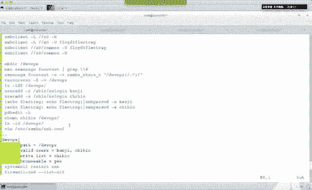
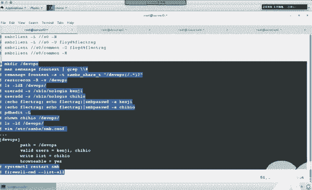
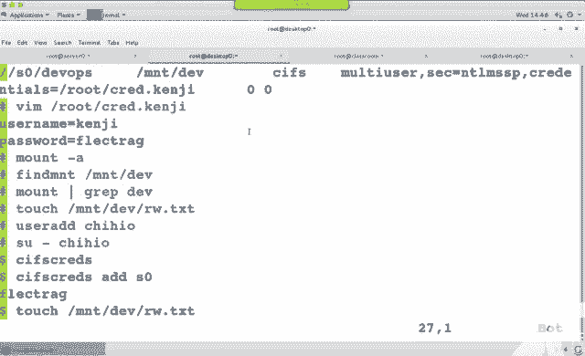
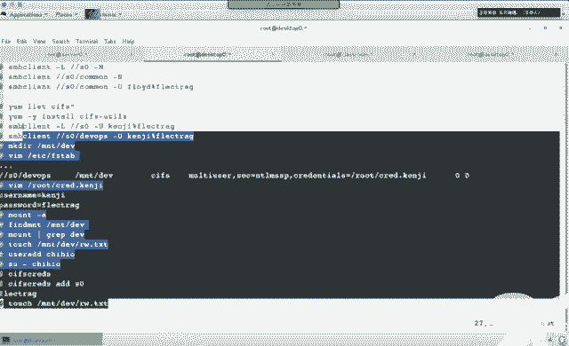
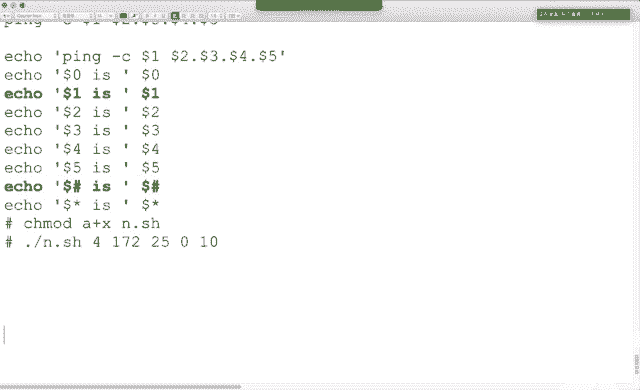
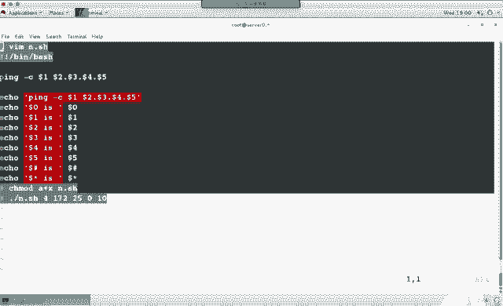
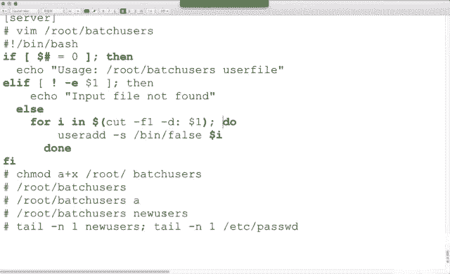

# 红帽Redhat RHCE7培训课程+RCHE7实战参考教程+红帽8.0教材电子版+模拟环境及辅导 - P20：6 - 16688888 - BV1zu41197p6

呃，我们来看一下上榜。对于上马伏而言，我们需要配服务器端。需要配客户端。看下怎么做。按照T的要求。敲门共享。弗洛伊德密码。那看一下这个题怎么做哈。首先插包。服务器端的话差几个包。三个吧。当然了。

做的时候你不用特意去背报名行就得了，是吧？哪个包没装啊？三包包没说，看到的外包了吧。30装那种。三把卡烂的时候也没做。哎呀。谁念的我呀？哦。包装了之后做什么呢？他配什件吧。然后是不是要按照提要求？

创建共享啊。又因为是顶级目录，我们是不是要去更改商人关系类型啊？三方关于类型改成什么呢？上把下踢类型。打完了之后呢，是不是要确认？到这能个是吧？到时候编辑sm的配置文件。首先找到work group。

按照T的要求。看到89行了吧。你的工作组要求改成什么名，你就写什么名。给你大写，你就写大写。复制粘贴，别自己敲哈。再然后第一生是不是要求说谁以能访问呢？因为我们这个实验主要讲的是不是散班服务。

所以说我就不用方火墙给大家演示。考试的时候，按照这个提意的说明，你是不是可以用方火墙来做也行吧。呃，127点，这个是不是本地的1270。0。1网段啊？那你还想再加一个网段，我们是不是17225网络啊？

第二结尾，谁能访问吧？大G。按照其要求，你的郭海名叫什么？敲门吧。按照题要求。你说把谁共享？敲门吧，等号前后有空格吗？有方括号是不是顶头写？再然后我们说这个文家谁能读？是不都能看？你好自可漏。

已经限定那个域了，对吧？这个狱中的人都能访问public等于yes，你写gues ok等于yes，随便。如果不会写的话，查找去YY，然后回过来批。也可以。再然后我们说这个文件夹是不是都可浏览。

是不是一个叫做gross的词儿啊？Profitable。是不是就最行大GP。Yes。😊，能浏览吧。第。做完了之后。题中是不是提示了一个弗洛伊德账号啊？弗乐伊德账号，你要先来看一下弗乐伊德有这人没？

考试的时候有。恒讯环境中没有，我们就塞一个。为什么添用户的时候，我们设置它为no login呢？不能登录，只能通过网络来使用，不能SSH。然后用一个命令s把password杠A把这个人变成s把用户。

那回车的时候呢，你会发现是不是要敲密码啊？敲两遍吧。然后。呃，我们服务配完了之后，你是不是要把我的服务重启啊？再然后呢，你是不是要把我的服务开机自动启动？墙让其他人能反我的服务，是个防火墙。

是不是要立即生效？然后本地测试一下吧，s半可lan本地测试一下。带海水漏的快不快？你这个里面。规则越多，relow的越慢。或者说你磁盘越大越漏的越慢。因为我现在正在下载。我正在上传。嗯。Okay。😊。

在下面上吧卡烂。嘎乐。能看到共享名吗？Common。能看到吧？棒忧。弗洛伊德。blck和 red和。这个都能看到共海面。然后呢，访问共享。Common。阿拉斯。能看到吧。那个。如果你不用这个人的话。

我们是不是还有个肛摸呀？一样吧。这个都可浏览，都可访问。符合题要求吧。第一题。第二题。多用户。在服务器端再弄个共享，叫做德瓦勒库斯。那你是不是也在创建呢？然后这个里面是不是出来两个人？一个啃鸡。

一个吃海。吃海。吃海哦哦吃海。默认用肯机来登录。看这个怎么做。回到服务器端。在第一道题当中，要不要求它挂载永久生效啊？没要求啊。说明要求他要求能返问就得了，做到事儿就完事儿。顶他到客户端再测一遍。

客户端，你是不是得装俩个包啊？如果你只是为了做测试的话，中它就行了吧。但是你要改FI table的话，是不是还要装1个CFIQ包？三把可拉的段露。这台机器。不要账号密码，能看到共享吧。看到史大夫没？嗯。

ok然后我们是不是可以来访问这台机器上的这个共享？不用账号名密码。可以访问吧。或者是我也可以杠优。弗洛伊德。我赖克车赖哥。也可以吧。这第一题。第二题。第二题当中，你既然是敢共享一个。BE V OPS。

再创建一个吧。哎，哪错了？一看这写脏话写多了是吧？嗯，马德。没壳的呀，别写反了啊。经常上论坛骂人，缩写MD。骂人脏话，你看论坛里好多人缩写呀啊，他们都是为了不说脏话是吧？O。创建文件夹之后。

那我们是不是可以通过另外一种方式来修改它的双下门关系啊？可以吧，但是这条命令太长了，我也备不住怎么办？我就知道F context。那怎么办？我们有没有的叫慢灭令啊？好吧。然后慢命令。

这个里面是不是有些示例？那些实例当中。带井号吧。看到没？O。这条。这条。都行，它俩V的区别是什么呢？如果你这个写了个外部文件夹，然后斜杠点星，这个代表是说它下面说的子目录。子目录子文件夹都包含。

那这种写法的话呢，只代表说这一个文件夹，它下面的子文件夹不管。能看懂吧。ok。你到底用哪种写法随便哈。呃，我们这个文件夹叫什么名？DVOPS吧，类型是啥？3832T类型吧。然后想让他立即生效。

用哪个命令？re star contact了是吧？哪个文件夹。DVOPS。看下面这变过来没？他说resite了，我怎么知道你reite了呢？你是不是可以瞅一眼？变过来了吧。

到底用change contacts还是SE manageage看心情。上一门关系改完了之后。在这个题议当中啊，是不是还出现了两个人呢？一个叫做。趁鸡。一个叫做。池海哦。

然后我们是不是应该把它变成三把用户啊？那正常情况下用这条命令，你是不是可以把它。直接变成300元货。我想直接设置密码。我们可以在前面。成功没啊？没成功，为啥呀？刚刚属于得瑟呀。变成啃你鸡了是吧？

多打个字儿。给用户改名怎么改？刚乐 log给 name。改名成肯基。欢译。And。擀完面之后，我们再次来。成功了吧。它提示哈它提示id date的成功了，fe有的没成功。O。用户变成了萨班用户同理。

我们是不是还有一个叫池海澳的用户？确认PDV edit杠6。OK吧。再然后那我们这个题中要求是说池海澳是个血平线。怎么让PL就写权限？陈亚号是不属于阿？otherO加W可以。

我把这个文件夹改成chout缩有行不行？也行吧，赛载FACL行不行也行。随便啊，你愿意怎么弄怎么弄。我把这个文夹变成他所属，池羊是不是有写前现了？本地游戏。赛尔号。呃，你既然是想新建共享，是不是要编辑？

sm的配什件了。发括号共享名吧。Pass。共享路径。谁能访问呢？外的user4。我忘了咋写了。查找一下YY。P。把3号删除生效吧。谁能访问呢？我们说。拳鸡。和。1海奥是不是都能访问？多少分割。

或者是说你把这两个人吸到一个组里，这个位置写个A组名。也行啊。谁有写权限吗？看到320了吧。320。拜拜。P。谁有写权限？迟海哦。服务的写前件吧？然后说这个目录是不是可浏览呢？YY。P。

因为这两个共享是不是说都是那个域能访问，题中会告诉你那个域的网段是多少。你要不然在格楼部当中写好车漏，要把那个好车漏啊复制到comment和develop里面也可以。结果都一样哈。做完了之后呢。

这个服务要重启。英不配方火墙。上个时间配了吧，那你这个时间是不是就瞅一眼就得了。看到没？OK吧。这故性配完了，那么多用户指的什么呀？多用户主要指的是客户端。在客户端。

你需要去装一个叫CFS有choose的包。确。然后编辑FItable文件。在编辑之前吧，我们可不可以通过s cl杠乐。这台机器上。啃鸡。black和外壳。能看到共享吧。然后呢，我们来访问一下。

D v o。能访问共享吗？你确认能看能访问之后，你再往下做。有同学闭着眼睛啊，直接就往下配，结果发现怎么也不成功，他又使劲看FI table哪错了。嗯，你再使劲也看不出来哪错了。要确认啊。

服务器端没问题。能看到吧？能看到共享，能访问共享，做到这步能确认服务器倒没问题。那么实间再有问题，肯定是客户端的事儿。有同学就把这个FI table啊看了很长时间。跟apptable没关系。

那是服务器有问题。O吧，这俩不一定做哈。确认的步骤是为了排错。在之后做什么呢？你要永久生效的话，是不是挂在指定的目录下？那我们要是挂了跟MTDV一下吧。B。编辑Ffi table。杠杠。

访问三8共享是不是该写杠杠啊？共享名是啥？挂在本地的哪？文件性类型是什么？如果CFS有ts包没装，这个位置不认识。然后选项选项我是不是要做多用户啊？Mti user。56S。忘了忘了怎么办？😡。

我们可不可以再开个终端？登录S0。地俩。可以登录吧，登录之后你可不也慢。mount贼。CF。在这个里面来查markety user。看到没？手嘚瑟的话，复制粘贴就知道有没有S了。O。😊，另外。

那我们是不是还有一个叫安全呢？NTLMSSP吧。这个备不住的话，你是不是也可以out4。斜杠SEC等号。那个。大名个。大门啊大门啊。看到NTL吗？SSP了吧。再有，我们是不是还有验证啊？克莱德寿司啊。

快。诶。😊，多了个密反斜杠，那是我写的。C surprise则。能看到吧？别自动加符号哈。cd后面是啥？Cent tails。是。忘了咋办？斜杠克莱德。那呢呢呢呢呢。摸过头了，往上呢。大哥。看到没？

presentdon。克莱登。Tils。等于手写一个文件吧，文件放在哪了？因为你默认呢是要用肯基来登录，我给它的名起名就叫克莱德点肯基。肯积一点可爱德叫什么名，随便你自己起。然后呢。

是启用日证文件系统吗？不需要检测吗？不检测，那你做了个这么个文件，这文件存在吗？不存在。一会儿是弄一份出来。我的习惯呢是先给它复制。然后保存。为什么要复制呢？这肯定不要写错了。有同学可能做着做实验，哎。

是肯基点克莱德呀，还是克莱德的肯基自己忘了，忘了再看他一遍是吧？复制粘贴不再出错。这个文件中两行两行是啥？用户名和密码吧。看到没？是不是都是等号对齐呀？O。叼这啊。右格内等于。统计。Pass word。

等于。black的外壳。等号签号没空格哈。😊，最后一位也没有空格，你别乱加空格。都做完了之后。M克A是不是让它立益生效测试啊？报错了没。卡了吗？没卡。确认buMNT。挂成功了吧。你看后面有没有这个选项。

有吧，你如果是把选项看全了怎么看？用漫画来看。大家看到后面这一堆选项了吧，有没有market user啊？有吧，有没有SEC。也有吧，账号没密码有吗？没有。那个药有时不是太吓人了啊。Okay。

下面是要测试一下。阿拉斯跟MT谁办了？是不能看能写吗？是不写不了。怎么样才能写呢？我们要苏到一个身份。有同学说，哎，老师。你直接用s as correct。我们这个里面有没有杠油？用谁来登录啊？

但是这条命令。有时候好用。大招什么有时不好用吧。不是总好用。那为了总好用怎么办呢？艾德是添加up date是更新，可列是清除。那如果你想做好用的话，你要添一个用户。池海澳。考试的时候呢。

这个用户都是Ld夫用户，直接能缩过去。ID存在。考试环境培训环境中不存在，你是不是添一个呀？出不过来。现在本地用户是不是吃？当你用CFSc这条命令切换散发用户身份的时候。杠优优泽名可以省略。

默认就是持海澳用户。连接谁呢？搜我零，问你密码吧。弗莱可车ra哥。没报错吧。测试touch跟MNTdevelopRW点TIT。能写吗？我说给随时切换写的权限了。用不用写载？

不用这个实验主要考的是may user和cd。CF快子命令。主要考的是他俩。如果你妈PU座那个选项不加，这个切换不了。能理解吧？如果你想删除这个权限的话呢，Cllear。想更新吗？update。谁完他。

这些看懂了吗？就夸俩选项啊。😊，呃，这组实验用整理吗？用。啊，大家整理一下。我寻思那个考试题上写了。类型品上写的这个不争理。那一会就整理一下啊。我整理的时候啊，你们也就跟着看看我都干嘛了。服务器端。嗯。

从这儿。首先呢说茶包。装包卡配置文件，创建共享，看听着contex怎么弄，然后更改商页份关系，确认编辑sber的配置文件。30的配置文件中都改了什么？第一个我们改的是不是工作组啊？对吧。第二个我们改的。

是不是好四思的漏啊？哎呀，这带耗车漏的好真多是吧？一堆。好是吃。中间我忘了是空格还下线了。啊，空格。い。然后呢。几行。然后我们是不是在这个文件中塞了。几行啊？十行吧。整个实验做完了，是不是塞了十行。

但我是不是只想要它的头五行？后十行的扣5行。你好，还不是1号。扣十行了头四行。能下到啊。做完了之后。确认用户。不存在添加考试的时候，用户存在，你就别添加了啊。把它变成38密码。这个命令敲完了之后。

是不得敲两遍呢？服务重启开机自启防火墙本地测试吧，当当当本地测试。做到这儿之后，这是不是第一组实验？客户端。在客户端当中。第一个时间，他没要求你永久挂载。所以说你是不是就直接。茶香的包。安装看共享。

访问共享。绑了共享之后呢，L能看okK吧。做到这儿，第一个实验术完成。第二实验第二实验是不是做多用户啊？30。创建文件夹。那我们更改上份关系的时候，除了用change context之外。

是不是也可以用SE manage restorestore context来做，那么就慢看怎么用。确置设置确认。天用户。天气货的时候啊，手臂嘚瑟啊，别多压字。然后呢，把本地用户变成30用户。

本地用户变成300元户，确认300用户。再之后呢。把你这个文件啊改成吃养奥佛鼠。为了让他有血权限。确认。编辑30的赔偿意件。原来的内容别变。我们添了。一行啊。添了。啊，最后有行空行是吧。

我说怎么数数不对？好，填了123456行。服务重启确认。服务器当然配完了吧，客户端。插包装包。确认。38克烂。登录测试，创建过来点编辑FI table文件。FI table文件中。

我们是不是又塞了列行啊？建行C完了之后，你是不是说markety user安全和验证啊，验证的文件是啥？你写的叫什么名，是不是就写什么名？里面必须有账号和密码。然后mt杠A立即生效，生效了之后呢。

用发MT来确认，用mta来确认都可以。用当前的身份你去touch能touch吗？默人是不是用肯鸡的身份挂买的呀？啃鸡是不是只毒？即使你是root，你也踏实不了。上巴用户是啃基。怎么办呢？

我们可以用这条命令来切换身份。See are best surprise。首先我先添个用户是海考试的时候，这个用户不用填，直接输过去就可以。考试的时候，他是I代用户，搜到这个身份。收到这个身份之后。

没权限。点儿拜是history。读入跟 home。说好。Flash later。2425替换。搜到这个身份之后。我们先用CFScra命令瞅一眼这个命令的用法。那你知道用反了之后是不是可以添加？

添加的时候，他是不是要求你写密码？密码是什么？我 like再 drag吧。密码如果正确了之后，我们去touch，让不让你写。让吧实验完成。这是干护实验。我把本档内容给大家 copy背出来。

这是第一个实验。客户端测试。第一个是。第二个实验。好。是。

这是第二个时点。

我回。

第二个是。

C端测市。这段内容OK吧。这是30。嗯，我再讲会脚本。考试的时候，对于脚本题啊，脚本题应该是说在整么考试当中啊最简单的两道题。最简单的两道题，为什么呢？因为他有实例啊，他有实力，你找实力改了改吧。

就是脚本内容。那么考试的时候主要考的知识点有哪几个？我先把脚本的知识点给大家强调一下。脚本儿。在做脚本的时候，你是不是脚本的第一行要写井号、叹号、彬彬、半师？然后脚本是不是要加上？执行权限。我写全了啊。

脚板要加执行权限。再然后脚本在执行的时候，我们是不是要指明路径？来执行吧，第二代表当前路径吧。这是123。教本你得知道三个内容。再然后。在系统当中啊有一些文件。

记不记得我们在之前讲过一个叫alize命令？想做一个开机自动生成的脚本别名，你是不是在一个拜杀C文件里加个balize等于什么？the live什么等西事。OK这个里面有两个文件。跟ETC带杀C。

K ET C profile。这两个文件都代表开机脚本。啊，都代表拆写本。我们当时做实验的时候，是不是让大家用的是这个文件？你用profile可不可以？也行啊也行。那么在这个里面呢。

alline那个实验考的是它我们。脚本实验两道题，你把这个文件弄懂，两道题也很容易，为什么呢？考试的时候，我们主要考if附命令。考case。好好循环。考试是主要考的他们。那么你既然考的是这几种条件判断。

他们在这个文件中都有失例。能理解吧？在这个文件中都有实例。你可以在它里面来查找。斜杠的作用是不是查找啊？你得看视力，视力能看懂照猫化虎实验时么做出来的。这第一个。那如果你不想看视力，就想看格式的话。

怎么办呢？平时我们在看慢手册都慢什么慢命令是吗？命令没有手册，你怎么办？if case for都属于内部命令。大家知道什么叫内部命令吗？比如说在windows当中有个CB命令是内部命令吧。

它是不是存在于comm点ESE里边。雷尼克斯当中，这三个也是内部命令，他们存在哪里边呢？拜学历。如果你就是想看格式的话。你去拜事里面去查。也行。这个是看格式，会看格式，会看事例。那么不管题怎么变。

我是不是就都会做了？我们来看一下。呃，上面不用的贴吧，我都给它关了哈。😊，要不他占一行，你这个开怎么调了？不是调出来的，是摁出来。control shift的 T。control shift T。你啊。

讲第一堂课讲了吧。周一。往前跑，中一的时候讲。周一般每次上课也第一天主要讲的就是些技巧啊。剩下就是一直在用那些技巧，用熟了就会了。用不手也没事，反正考试不用也行啊。你说考试考cttrol加T吗？

你要用的话就考呗，你不用就不考。OK吧，就看用不用。我们首先呢慢一下拜事。大家看就说拜是什么什么东西啊，数一读一吧。在这个里面我们来查if。么么么么么么么么么么么么么。那样时候好多呀。

跟意术有关的词儿太多了。你看衣服还没看着，我都看着fo。看到没？嗯。えい。衣服没看着，都看着cases了。看看。哎呀，终于找到衣服了，真不容易啊。衣服如果怎么怎么样，分号代表什么？回车吧。纳么怎么样。

是不条件为真怎么样啊，否则的话中间是不是叫可选项？可选项。那我们会发现唉这个FI呃跟IF挺像的吧。像不像？反血吧反血。如果飞的话。条件为真怎么样啊，可以写一个条件。那如果非的话，就al。

如果里面还要写嵌套条件的话，可以IE。不好一，这它的句话格式。那么你既然有if服，我们再来看一下case。往上翻哈，cases一个值，印一个范围。看原括号没？怎么怎么样，看到俩分号没？一个3号代表什么？

会车吧。回打车，为啥一会儿我们看。K4结尾。哎，挺有特点是吧，是不还反着的呀，还是反。再往天上找衣服case看完了之后，我们说话有叫f的东西。看到放。报一个条件，度一个事儿办完成。

分号分号是不是代表回车呀？就他们的格式。格式如果你实在是看不懂的话，那么你就去看一下拜12RC文件。我们首先来看一下case。看到5四行了吧。case一个东西，他说如果这个东西是他他他的话，怎么怎么样。

如果不是他们的话。怎么怎么样？能看到格式吧，花括号半圆半圆代表什么呀？条件值是多少？看不懂的话呢，你那个接着往下看。十四行case，如果这个东西它的值是。谁谁谁的话怎么怎么样。然后往下翻。

是scr星的话又怎么怎么样。如果不是上面两个值的话，怎么怎么样。分号分号EIC。能看到格式吧。O。😊，那下面呢我们还需要知道这么一段内容，就是到了一。1234789。景和星它们的区别。那为了了解区别呢。

我们有个小实验。编辑。P的SH。啊，咱这吧。N S。小本的第一行是不是型号？暗号真兵赛事。跟边拜师。我把行号显示出来啊。大家用过P命令吗？正常情况下，我们拼。OK吧。我把这个东西啊都给变了。

到了一到了2。到了3。到了4。8。5。123458。OK然后在下面艾le。到了0is。到了0。没写到那里是吧。刀了一大了2刀乱3。2到32到4。Hello。Hello。然后这边呢也是一样的。

到了一到了二到了三到了四到了5。hello。12345。然后呢，你再多做两个。到了姐。找吧行。这个实验呢是帮大家理解他们分别代表含义。数值是0到9啊数值是0到9。脚板做完了之后，我是不是给它加权限呢？

发权限。然后是要执行了。그。脚板在后面是不是可以加参数？从这儿开始，12345代表脚本后的12345个参数。到了0代表的是谁？自己吧。到了能代表自己。这个是不是杠C后面那个？大概一。234。5。

是不是你挨批呀？再然后我们刚刚一共敲了几个参数。是不是5的。55个参数是啥？大了井和到了星理解了吧。那么在这组实验中，你必须要知道道德一和道德井代表什么含义。刀了一和刀了井用的是最多的。OK吧。

编辑个文件。呃，如果大家想把这行也能看到的话。我可不可以这么写呀？Iical。爱le是不是又拼什么什么什么？那我如果就想上这个位置显示的是道了一，你是不是前面要加个隐单引呢？たが大。也行吧。

看着更直观一些，做个对比。执行。这组实验是为了帮大家理解刀了一和刀井的含义。刀轮一代表什么含义？第一个。脚本后的第一个参数。你得知道什么叫道一。脚本后的第一个参数。另外呢知道什么叫道德井。

道德井代表什么含义？什么。嗯，参数的个数。

后面几个参数参数的个数。这道内容理解了，我们来看一下这道题。

脚本题。Kiss。In case。写在上面脚本。啊好。跟root一下做个脚本，叫这个名VI吧。当你执行脚本空格咔的时候。脚板后面接了个这个东西，是不是叫刀2一呀？对吧道轮一是read has的时候。

输出为他是外靠它。道轮一是它的时候是外靠它。能看到吧？那如果都不是的话，是不是显示它？这道题考试case。看一下怎不么做。大家在写脚本实验的时候，养成习惯，先写格式，先写语法。什么意思呢？按照T的要求。

你是不是要编辑一个这个文件？脚本低行，顶套号跟别拜事。OK吧。然后是不写格式啊，case什么东西in什么范围。如果是他的话。怎么怎么样？如果是他的话。怎么怎么样。如果不是他俩啊，是他的话。怎么怎么样？

ESAC。是不是格式？我们先把格式写出来。写完了之后看一下那个题啊，它是不是说道位一是不同的值怎么怎么样啊，那么这个X应该换成什么？do一到一如果是readdhead的话。ile。是不发多少呀？

那如果是fder的话。是不是read ahead呀？如果不是他俩的话。是不是又爱考一个内容。Ile的内容啊。复制。粘贴。大家注意这个位置是否有竖现？受线啥意思？你在这个里面icle是个命令是吧？

命令在执行它的时候，他是不是认为这个是管道了？所以说你要不给他一棍子，要不加个单印。能理解吧？这个位置还有个坑哈。还有他。抓完了之后。就给大家写。做完了之后，我需要给大家执行权限。点斜杠执行吧。

如果是righthead的话。是不是显示federa？对呀，刚刚写错了是吧？赶紧改。考试的时候差一个字母都不对哈，虽然你意思对了。我只是做课程讲解的话，这么讲没问题，意思对了是吧？考试的时候。

这道题不算对，能理解吧？O出来。当你写right ahead的时候，是不是显示federal？当你写federal的时候。是不是显示出来 the high？当你什么都不写的时候，是不是显示格式？

当你写不是它的值，是不是也显示那格式？符合提要求吧。下完草。这个呢是第一道题，ts。编辑文件。加执行权限。立即生效。这都测试吧。这どかし。嘘。我是写时。可以。啊，关于这个分号啊，我强调一下它是什么含义。

分号是不是代表回车呀？第一个分号呢代表是ic cold的黑撤。第二个分号代表是case结束。如果case不结束的话，他是不是一直在这里面找找找找啊？我这个都已经匹配了，我们之前讲过ACL的权限。

是不是匹配执行啊？匹配了你case就完事了，做以出分号，这个是case的分号，这个分号是。爱口的粉啊。两个分。那你要是给他单独写一行吗？也行。都可以啊。作意格式。好，我们看下道题。下道题主要考的是。

If服。放。if服和放。嗯。方胸好，我们之前讲过吧。是不放一个变量，印一个范围度。学完成蛋OK吧。造循环。那这个里面。我们来看一下个提议啊。创建用户脚本。我们在之前是不是讲过一个放循环创建用户脚本了？

但是这个题当中它多了一些条件。如果如果如果如果翻译成英文的话，是不是叫意思？如果。Yeah。意思如果。O。😊，那他给了我们一个文件。说你可以用这个文件测试。考试的时候呢也会给你个文件。

考试当中给你的文件呢只有一列用户名。你想把用户名读出来，是不是用fo循环可以读出来啊？for循环可以读出来ca命令加for循环。那我们当前这个实验。我给大家这个文件呢它比较复杂。扩达到什么程度呢？

W干干嘛的？下载吧。太有命令，啥意思？我看。看后几行后四行，大家可以看一下这个文件中是不是好几例。按冒号的分个符。第一列，我们说是用户名，我是不是想把第一列取出来？德瑞副命令是干什么的？我就。

grape过滤的是什么？行吧。看命令。他过滤的实力。Yeah。F代表是field的。秀的。旧的一第一列吧。第一代表风格符，我怎么知道谁是一列呀，冒号是分割符吧。在这个文件当中过滤。因为内容太多了。

我只给大家看一下后四行。能看到吧？cut命令cut翻译成中文是什么意思？减切啊减切。如果你实在不理解的话，就拿个剪子啊，剪切啊。呃，大家吃过带鱼吗？你收拾过带鱼吗？大于我们是不是该把它弄一段段了。

怎么弄是拿菜刀吗？剪刀用剪刀是吧，剪切啊。看看命令记步的同学呀，晚上去买条带鱼。你回去家嗯cut cut cut就寄过了啊。别买太多哈，一顿啥玩意儿吃多了也受不了。他满一调整好。哪一条正好。

带鱼有保鲜的，有冷冻的是吧？买保鲜的哈，保鲜的带有好吃。都差2块钱了。哎呀又想带鱼去了啊，回头再来看看啊，看看你别把带鱼记住来，看它吧嗯。Okay。那上面呢。你想用放循环来读入一个内容。

可以和ca配合考试的时候呢，因为文件就一列，用ca。能理解吧？考试的时候。这稍点区别啊。下面按照这道题，我们来做if。按照题要求编辑脚本。脚本是不是说叫这名儿？在搜我是吗？看千道福是不是死晚上？

别坐错地方了哈，考试的时候，你手艺嘚会啊。在dtop0上，即使做对了，不得分，4520哈。交会来第一行是不是井号叹号跟别拜师。我加个行号。if if的格式。M。😡，编你吧。812C。Yes。😊。

大家看454647if副什么什么ZFI这是最简单的if付啊N。如果怎么怎么样。认。😡，分号是吧，认怎么怎么样。然后呢，在下面。啊，这这么长。看这组吧，这组简单一点，如果怎么怎么样，分号认。

否则的话怎么样？看到条件没？番块当中是什么呀？条件吧。呃，如果UID大于199GID和UID又相等，那么它的UIU mask是多少，否则的话是多少。这个时候就判断是不是系统用户啊。是系统用户用ma值。

不是系统用户用ma值root和tdent用ma值是不不一样。啊，这么来判断ok。那既然我们看到了格式之后啊，我们就可以来写。方括当中是条件吧。这是要俩空格。怎么样？O。wifi设是这么个格式。如果。

看你。条件哈。这个脚本后面呢要求提供一个参数，是不是得有倒数一呀？能理解吧？提供一个参数，这个就跟刀德有关了。这个参数呢包含。文件名的。用户名的一个列表文件。然后如果没有参数。怎么来表示有参数没参数呢？

到了井等于0，有没有参数？到了井等于0，到了井代表啥？是不是参数个数啊，参数个数如果是零，是不是代表没有参数？O。那么它显示这个内容。复制吧。如果。到来讲。等于0。是不代表没有参数？显示这个。能看到吗。

啊，他个ic口是吧？OK吧，你如果想表示它是个整体，是不是加个单页？因为里面没有特殊符号，加不加随意。啊，加不加都对。这都在是吧？如果提供了一个不存在的文件。怎么来判断存不存在呢？这个题中是说。

如果提供了不存在的文件是不是显示他。Oh。解释文件不存在，咱们来判断文件存不存在。接着编辑。白刷C。还看一服。大家看一下，在这个位置啊，有个杠EE是啥意思呀？意制一个单词叫exist。exist叫存在。

后面是不是写了个文件呢？说如果他存在怎么怎么样。如果它存在怎么怎么样。O。那我们在里面可不可以支持嵌套啊？衣里面写嵌套。衣腐。问。Ouse。拜拜。如果。道二一是谁呀？大一代表是脚本后第一个参数吧。

如果这个文件存在，E是不是exist是存在的意思呀？如果它存在怎么样，但是我们这个提要求啥？不存在。我们之前在讲通配符的时候提到过方块中加叹号加密，是不是都是C的意思呀？有印象吗？你回过头来。

你看一下我们这个意封里面。你去查衣服，看有没有叹号，有没有。喂。看到5一行了吧。叹号这个代表是非的意思。看到闹上了。闹腾饿ok那么如果非。看哈。按照题意走。如果不存在的话，怎么样？这样的意思。嗯。

行问题。あめじゃ。啊。有同学说老师我这不写，我把下面两个条件调过来是不是也行啊？结果也对是吧，结果也对，我们尽量家提意走哈，如果C的话，这个位置如果是R的话呢，代表说文件是只读权限。

W是说文件是写权限X呢是文件执行权限。F的话代表说它是文件，并且存在。b的话是代表它是文件夹，并且存在。E的话是只看存不存在。好几种是吧？因为这道题它只会说存不存在了，你写杠E杠F随便看你心情啊。

F和D的话就多了个类型的设置。那如果不存在的话，ic口。哎。你反人。我给大家写啊。Iical。是不是文件不存在呀，如果存在怎么样呢？し。如果存在，是不是要创建用户？看到这个东西没？

天下用户指定sha是啥意思？这个考的是啥？是不是有时爱的？加上用户名吧。那么如果你指明是儿的话，是不是要杠S？这个。能看到吗？继续。不用设置密码，这道题就给分哲题。是不是不用pass word了呀？

password杠刚死stand，然后去说这意思。那这个用户呢要从这个位置来读出来啊，这个位置读出来。我们给大家这个文件呢，是不是得取出第一列？考试的时候直接去。看太就可以吧，看着可以。怎么读呢？不是。

那如果你有100个用户，这个位置是不是要编140？是不是得放了一个。放循环中啊。泡循分钟。好。定一个变量，印一个范围。应该大围。度开始循环吧。是不喜欢阿成？那为了看着好看呢，尽量缩进。为什么要缩尽呢？

你能分清谁和谁是一对。比如说我一看这个FI它跟谁是一对儿啊？第六行是一对儿。能看到吧，缩金的目的。那我们这个里面你定一个变量，印一个范围，在下面这个位置怎么引用变量？到了啥？到了爱吧。

你变了名叫啥就引用啥。这个位置。这个位置是不是要读出所有的用户名啊？所有人用后面。我怎么来引入变量？我们之前讲没讲过刀德括号。有印象吗？是不是叫命令的替换？或者是说用来返。明白也可以写命令吧。

那为什么我非要给大家用这种方法来写呢？不是因为能签套，是因为我写反引呢，有的同学老我写单引号。能理解吧？他俩都对，之所以写这种啊，是因为不容易出错。我们了讲。啊，对，功能是比较强。

那我们在里面是不是cutt取出来第一列。风格符是什么冒号从哪里面取啊？是不是脚本后的第一个文件？整个写完了之后，你会发现在我们慢手册当中，除了if服能签套之外，说还有叫I if啊。

I if就相当于你把第五行和第六行。连在一起了，这个叫AL衣。如果你这个变成暗衣服了，现在你有几个衣服。只有一个吧，那么下面这个FI就干掉一个。能啱冇啊。总结一下，如果你的参数个数没有参数的话，显示它。

如果你这个文件不存在的话，显示它。如果存在的话。把用户给添加出来。OK吧。脚本做完了之后，我们是不是要把脚本儿？加上什么权限？执行吧。刚刚那个文件叫这个名。下面是不是测试啊？测试。

脚本后面是不是得要接一个参数啊？要几个参数。如果没有参数显示UC是吧？没收到。然后呢。如果提供了不存在的文件名。A。是不是显示不存在啊，文件不存在。如果。提示是一个存在的文件名，我们是不是填用户啊？

这个文件我是不是刚刚Wge下载了。存在的文件，我table都能补全，肯定是存在的，是吧？大会发现哎。他说闪那闪那闪，他在干什么呢？他在添用户呢。我慢 tail。看一下后四个人。New users。

后四个人是不是什么咖C穿特之类的？我们再来看一下。pa索尔的文件。靠4个人是不是咖C串特呀？你看一下它的下是否be false。实验完成吧。根据题的要求，你都做出来就OK了。那么整个题当中啊。

整个脚本题。我给大家写答案的时候呢。这个位置也可以写杠1Q。大EQ什么意思呀？等于。等于。O。整个实验当中的考点我强调一下。第一个考点。道了一是啥？第二考点，case的格式是什么？分号。分音号。圆括号。

香。case结束。它的格式。印度。执行测试。第二考点，if。认。方块代表什么？条件吗。到了想代表啥？参数的个数。I衣。如果你用到了I if。是不是就一组wifi就可以了？

再有us us代表否则的意思啊否则的意思。碳号代表。飞。F代表文件存不存在？判断存不存在，判断是不是文件类型。如果是异的话呢，只判断存不存在。这个用E和F随意啊随意。放循环你得知道刀了括号的作用。

命令的替换吧。当你定一个变量之后，是不是要引用变量啊？如果你敢用f循环的话，它要印一个范围度开始循环半循环完成。这个你要是写了一行的话呢，也是分号。账号是不是会车呀，写了一行的话。执行啊。实验完成。

OK吧。