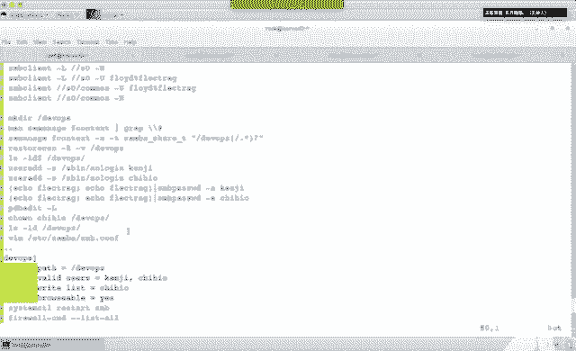
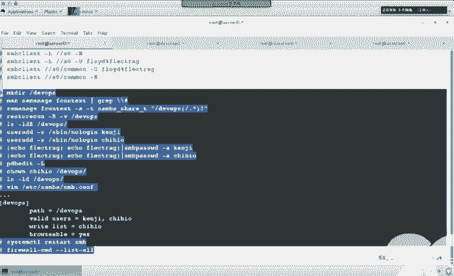
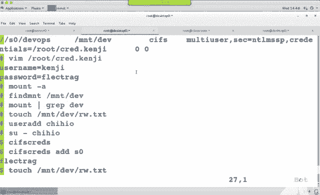
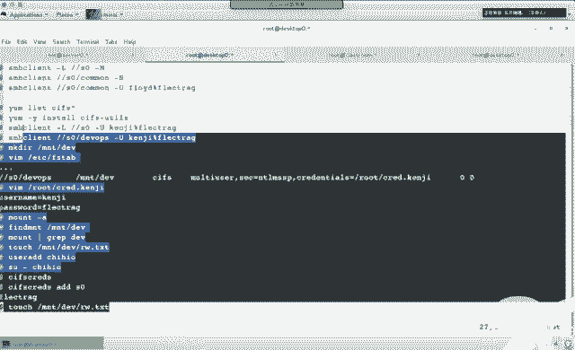
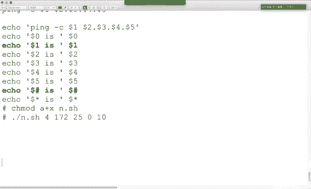
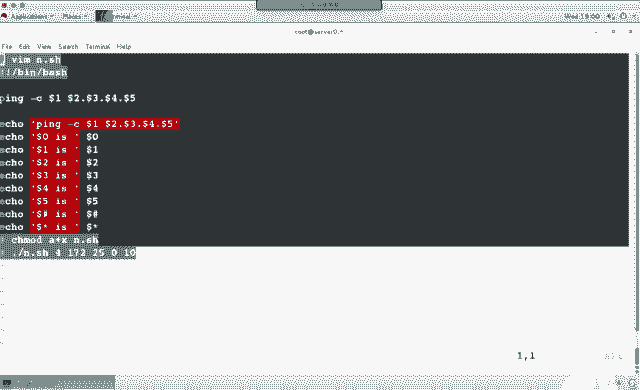
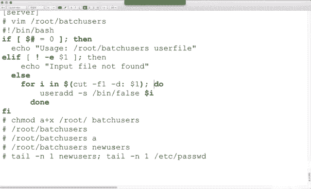

# 红帽RHCE7培训课程：P20：Samba服务配置实战教程


在本节课中，我们将学习如何配置Samba服务，包括服务器端和客户端的设置，以实现文件共享。课程内容涵盖基本共享、多用户挂载以及相关脚本编写的基础知识。

## 服务器端基础配置

上一节我们介绍了Samba服务的基本概念，本节中我们来看看如何配置服务器端。

首先，需要在服务器端安装必要的软件包。

以下是需要安装的软件包列表：
*   `samba`
*   `samba-client`
*   `samba-common`

安装命令示例：
```bash
yum install -y samba samba-client samba-common
```

软件包安装完成后，需要按照题目要求创建共享目录并设置正确的SELinux上下文类型。

创建共享目录并将SELinux上下文类型改为`samba_share_t`：
```bash
mkdir /common
semanage fcontext -a -t samba_share_t '/common(/.*)?'
restorecon -Rv /common
```

接着，编辑Samba的主配置文件`/etc/samba/smb.conf`。

以下是需要修改的配置项：
*   将`workgroup`工作组名称改为题目要求的值。
*   在`hosts allow`行中添加允许访问的网段，例如`127. 172.25.`。
*   在文件末尾添加共享定义部分。

一个共享定义的配置示例：
```plaintext
[common]
        path = /common
        browseable = yes
        public = yes
        guest ok = yes
        writable = yes
```

配置文件中，`[common]`是共享名，`path`指定共享路径，`browseable`控制是否可浏览，`public`和`guest ok`允许匿名访问，`writable`允许写入。

然后，需要处理Samba用户。题目中提到的用户（如`floyd`）若不存在，需先创建系统用户并设置为不可登录，再将其添加为Samba用户。

创建用户并设置Samba密码：
```bash
useradd -s /sbin/nologin floyd
smbpasswd -a floyd
```

最后，启动Samba服务，设置开机自启，并配置防火墙允许Samba流量。

启动服务并配置防火墙：
```bash
systemctl restart smb
systemctl enable smb
firewall-cmd --permanent --add-service=samba
firewall-cmd --reload
```

完成上述步骤后，可以在服务器本地使用`smbclient`命令测试共享是否可访问。

## 客户端访问测试

服务器配置完成后，我们来看看客户端如何进行访问测试。

首先，在客户端安装必要的软件包。

以下是客户端需要安装的软件包：
*   `samba-client` （用于`smbclient`测试）
*   `cifs-utils` （用于挂载CIFS文件系统）

安装命令示例：
```bash
yum install -y samba-client cifs-utils
```

然后，使用`smbclient`命令列出并访问服务器上的共享。

列出并访问共享：
```bash
smbclient -L //server_ip -U floyd
smbclient //server_ip/common -U floyd
```



如果题目未要求永久挂载，那么客户端测试到此即可。







## 多用户挂载配置

现在，我们来学习更高级的多用户挂载配置。

首先，在服务器端创建第二个共享目录，并设置SELinux上下文。

创建目录并修改上下文：
```bash
mkdir /devops
semanage fcontext -a -t samba_share_t '/devops(/.*)?'
restorecon -Rv /devops
```

接着，创建题目要求的用户（如`kenji`，`chihao`），并将他们添加为Samba用户。

创建用户并添加至Samba：
```bash
useradd -s /sbin/nologin kenji
useradd -s /sbin/nologin chihao
smbpasswd -a kenji
smbpasswd -a chihao
```

为了让`chihao`用户对`/devops`目录有写权限，可以更改目录的所有者。

更改目录所有者：
```bash
chown chihao /devops
```

然后，编辑`/etc/samba/smb.conf`文件，添加第二个共享定义。

`/devops`共享配置示例：
```plaintext
[devops]
        path = /devops
        valid users = kenji, chihao
        write list = chihao
        browseable = yes
```

配置中，`valid users`指定允许访问的用户，`write list`指定拥有写权限的用户。





编辑完成后，重启Samba服务使配置生效。

接下来，在客户端配置多用户挂载。首先确保已安装`cifs-utils`包，然后编辑`/etc/fstab`文件实现永久挂载。

`/etc/fstab`中的挂载项示例：
```plaintext
//server_ip/devops /mnt/demo cifs multiuser,sec=ntlmssp,credentials=/root/smb.kenji 0 0
```

其中，`multiuser`选项启用多用户支持，`sec=ntlmssp`指定安全模式，`credentials`指向包含登录凭据的文件。

凭据文件`/root/smb.kenji`的内容格式：
```plaintext
username=kenji
password=redhat
```

使用`mount -a`命令测试挂载配置。挂载成功后，默认以`kenji`用户身份访问，该用户只有读权限。若需以`chihao`用户身份获得写权限，需要使用`cifscreds`命令切换凭据。

添加`chihao`用户的凭据并测试写入：
```bash
cifscreds add -u chihao server_ip
touch /mnt/demo/testfile
```

## Shell脚本基础

在配置服务之余，我们还需要掌握一些基本的Shell脚本知识，这在自动化任务中非常有用。

首先，脚本的第一行需要指定解释器，并需要给脚本文件添加执行权限。

脚本基本格式与权限设置：
```bash
#!/bin/bash
chmod +x script_name.sh
```

脚本中的特殊变量`$1`代表第一个参数，`$#`代表参数的个数。

一个演示特殊变量的脚本示例：
```bash
#!/bin/bash
echo “The first arg is: $1”
echo “The number of args is: $#”
```

在条件判断中，`if`语句用于基于条件执行不同分支。

`if`语句的基本结构：
```bash
if [ condition ]; then
    commands
elif [ another_condition ]; then
    other_commands
else
    default_commands
fi
```

`case`语句则用于匹配一个变量的不同值。

`case`语句的基本结构：
```bash
case $variable in
    pattern1)
        commands1
        ;;
    pattern2)
        commands2
        ;;
    *)
        default_commands
        ;;
esac
```

`for`循环用于遍历一个列表并执行操作。

`for`循环的基本结构：
```bash
for var in list; do
    commands
done
```

例如，一个读取文件并创建用户的脚本可能结合`for`循环和`useradd`命令。

读取文件创建用户的脚本片段：
```bash
for user in $(cut -d: -f1 userlist.txt); do
    useradd $user
done
```



在本节课中，我们一起学习了Samba服务器和客户端的完整配置流程，包括基础共享、多用户挂载，并了解了Shell脚本中`if`、`case`、`for`等基本结构的使用方法。掌握这些技能对于在Linux环境下实现和管理文件共享服务至关重要。