# 红帽Redhat RHCE7培训课程+RCHE7实战参考教程+红帽8.0教材电子版+模拟环境及辅导 - P21：7 - 16688888 - BV1zu41197p6

。我们先来回一下昨天讲的内容。对于NFS而言呢。考试的时候主要考的是一个cs。cars实验对于萨ber而言呢，考试的时候主要考的是什么一个market user。对脚本而言呢。

考试的时候主要考的是一个叫tss。还有衣服。对。非NS。你需要知到的内容，它有两个配置文件。跟ETC有个pose。AETC。这con这が。NFS。那对于apppo文件而言呢，它里面写的是共享。

你像将谁共享。这又是绝对路径，又是共享名。后面呢是主机名，如果是域名的话呢。example。权限权限是什么？如果你要做一个读写权限RW。然后设定一个启用科包45。科包45P。啊，这个代表是服务的权限。

这个东西如果你要看的话呢，我们可以用m来查。在这个里边来查什么呢？来查SEC你就能查到。你做了一个服务的权限，那为什么我们要修改NFS呢？在NFS当中，我们是不是写了个V4。2啊？V14。2。

那它的原因是因为我不想去修改SElin的布尔值，还有文件夹的上下文关系。所以说把它的值做一个修改。这个呢是SElinux权限，相当于SElin权限。这个呢是服务的权限。那如果想让这个人就有写权限的话。

我们在本地是不是还应该给他设定一个写呀？在实验当中，我是不是用的轻是O呢？把这个文件夹。哎い。とか。啊。刚才又没了是吧？O。设定本地用户的权限。钦州稳。Paス。改成谁所有，那么他有本地的权限。

本地文件系统的权限服务的权限IElinux权限，是不是还有个防火墙权限吗？防我墙权限。你会发现呢我们在做实验的时候，是不是不管做哪个实验，都涉一个四个权限。唯一的区别，四个权限到底怎么改，看实验环境啊。

看实验环境。Okay。那么在这个实验当中，因为你说启用了科45。那你是不是得有相应的服务啊，要不然他不认识。我们能启动哪个服务？exportse文件的修改，你需要启动的是一个叫做NFSserv的服务。

SEC刻包是5P这个选项你需要启用一个叫做。And I buy the security server。那这个服务在启动的时候啊，它还需要用到t table文件。키 table文件。Tpa文件在哪呢？

我们应该下载了吧。电 t c。第2比5点Ttable。到底从哪下载呀？是根据提议是吧，搜人间贴。O。服务重启之后，你是不是都得去做内保啊？都不忘了，也那部啊，我就会给你们写了。那么对于方火强而言。

我们要添几个服务。三个虎。拿三个服啊。NFS1个。RBC办的一个。刚才的一个。这三个服务如果想不起来的话，是不是有个命令叫RPCinfer啊，他会告诉我，当然RPCinfer你就是不会的话呀。

能记入三个服务也行。OK吧，你要不会RPC验活，因为在学习的过程当中啊，如果想备个东西，说实话。挺困难啊挺困难。但是你要把思路给捋清了，这个时间就很容易。啊，每个时验段做完之后啊。

一定要先闭目养神5分钟，想想刚才你都干什么了。刚才都干什么？Okay。呃，这个在做完了之后呢，该做客户端了吧。客户端也是相同的。那么对于客户端而言。你是不是要编辑哪个文件？Ffi table啊。

在FI table当中，你是不是要多挂在底？所以说你是不是应该先创建相应的。文件夹画在点呢。它里面写什么呢？奶台机器。お。什么共享？挂在本地的哪个目录下？文件系统类型是绳木，然后选项吧。

你在服务器端是不是写了一个。读写权限。然后SEC等于C2B5P。V4。2。这都服务器段对应了吧。然后呢，后面什么。靓亮。做完了之后，我说我忘到登了立即生效，结果生效不了，为啥？因为你是不是在这个之前呢。

你必须得启动一个服务啊。叫什么名？啊，还有SQ也不是吧？这个服务名别弄反了，而这个服务啊，他又需要谁呀？是不依然需要一个。KK播文件呢。你服务器端下载的是服务器端的key table。

客户端下载是客户端的key table。那么这个都有了之后，我一慢他单位是不是挂成功了？那你想使用这个人的身份，我们需要用到SSH。挨个大 u个08。SSH是来切换。针对c用书切不过去。为什么呢？

你酥的话切实是环境变量。不会切TT。能理解吧。或者是你注销了之后啊，再用安6代回有可0登录也行，但是不能输啊不能用输。你切换了之后啊，你用LW点0去写一个文件，是不是就能写进行了？为什么能写进来呢？

因为本地文件系统是个写权限。服务是不是有写权限？再一个SElin有写权限，防火墙也有写权限。OK4个权限都给了，是不是最终能写进去，实验完成。这个呢是NFS purpose。大概的思路啊。

你们每个时间在做熟了之后啊，你找张纸儿啊，serv和单词套款，你做个对比，你把这个过程写一写。我不要求你们把这些东西都能写出来，但是把思路能写出来也可以。剩下的是命令的头2到3个字母配不件吧。O。

上班妈听着。那么对于服务器端而言。就是做一个共享。啊，就是做为共享。你首先应该来插包。然后呢，装包。再之后呢改配置文件了。有同学说，你不是应该查配置文件吗？如果服务很熟的情况下，手一嘚啵配置钱就出来了。

啊，你这手一敲啊，你自己就找着了，都不用去查啊。配置文件当中。我们有这么几个位置要注意。第一个温和。这个是啥意思呀？工作组。第二个house是吃楼。这啥意思啊？允许谁来访问是吧？

网告别忘了点结尾啊点结尾。在之后呢，你是不是要写共享名啊？共享名要求是啥就写啥。然后呢，我们是不是要写路径吗？把谁共享？呃，如果你要共享某个文件夹的话，这个文件是不是存在呀？OK吧？那么对于上半幅而言。

他是不是又考到了上下文关系？上下边关系你是不是又得。Yeah。青真末的。牵着O随便吧，都可以啊，都可以。关键呢是不是得加个W权限呢？谁有写权限啊。主要是为了写权限哈。Okay。再然后。

你有本地文件系统的权限，你是不是还得有一个叫。上下班关系啊。如果你这个文夹下面本身有文件了，你是不是还得加一个。当R选项。如果是刚刚创建的文件夹，空文空的文件夹里面啥没有R加不加随意看心情。

okK再然后呢。😊，到时候。服务的权限吧。如果你想让谁有写权限的话，那我们是不是right。累死他。没有写权限吗？这个中间下号线空制。空格吧。一般我们在写权限之前呢，会先声明。谁能访问？找外来的。

外类的6点丝一堆人是吧？我是不是可以写一个。谁能访问呢？你也可以写个组。啊，你也可以洗个澡都行。那谁能写呢？如果有多个人能访问的话，用逗号来分割。呃。这些人叫啥来着？啊，啃鸡是吧？这个你要调好记。

考试的时候啊都是这种奇怪的名，什么汤姆杰瑞啊，我们熟悉的小伙伴都没有啊。他们和杰瑞都认识吧。你要是没有的话，不认识，就是没有童年呢。小说应该都看过，汤姆和杰瑞。O。好，谁能访问。那另外一个在T议中啊。

受害有叫做。不让s啊。对吧可溜了。配置文件改完之后，那么这个叫服务的权限。然后呢，这个是不也是服务的权限吗？跟方火墙的功能类似是吧？在上面这个呢是上家关系SE learning权限。

这个呢是本地文件系统的权限。1234啊，还有个防火墙是吧？你方小翔是不是要允许那个叫什么散把服务啊？四个权限。在之后你服务器端的服务是不是应该让它重启呀？塞什么很臭。SIB是不是也得去enble一下嗯。

Enble一下。OK吧。Okay。扣吧。呃，mary user呀，它实际上主要考的是客户端。mary user这个选项的作用是什么呢？选项的作用啊就是说。我们在客户端已经挂载了一个文件夹。

你可以随时来切换身份。那么切换到不同的身份，是不是就有写权限了？加目多时候有写平线。在这个题当中，你出现了几个算法用户。那么这些算法用户啊考试的时候，你需要自己下来判断。他们存不存在？如果不存在的话。

你是不是得添加一个？当然了，考试环节中都是存在的，都是L代用户。就跟我们的LWU40一样，他们都是LW用户。在培训环境中，我们是不是得自己。来添加一个呀。培训环境中，你自己得评加考试环境中不用。

考试完成当中，你要干什么呢？确认是不是本地用户确认是不是3班用户。然后你发现呢这个三班用户存在吗？不存在。呃不存那，你要干嘛？刚好。是把他们变成上班用户啊。如果你想直接输入他们3班密码的话。

那你是不是可以。画括号icical。OK吧。同理肯基是不是还有叫吃海澳啊？也相同的操作啊，把它变成上把用户。那么对于客户端而言。你需要装两个包。上吧。Clt。CF有Qs。包装完了之后呢。

你需要去编辑它的配置文件。编辑它的配置文件，客户端配置文件叫啥？叫FS table吧，永久生效。那么在永久生效之前呢，强烈建议各同学。看一下服期咱的共享啊。然后呢，访问一下同学。OK吧。

一定要访问一下啊。这个人共享。是的。附见。共享明啊，你通过网上邻居看到的是啥？你想想windows，你是不是先网上连居？然后那台机器名再双击，是不是共享这上。OK吗？为什么一定要做这步？

这步我是不是能确认账号名密码没错呀。能理解吧，能确认账号密码没错，并且也是能确认共享名是啥。你确认没问题了之后，你再来编辑这个文件。很多同学啊老把这两步省略，那你这两步省略的话，你为啥要装这个包？

能理解吧？一定要先确认服务器端没问题哈，你会必然在这敲我，到最后判断不了哪的问题。当你这一步完成之后，我就能确认扶妻，那肯定没问题。OK吧。那下面我要写什么呢？在这个文件当中，我需要写这台机器。

这个共享把它挂到哪儿呢？你本地的哪个目录下？那这个目录不存在，你是把它重建一个呀？在漫号杠R之前创建一个。然后呢，文件系统类型是啥？CFS它是不是跟他是不是对应的？这个包不装，这个文件系统不认识选项。

M user。当我启用多用户之后，我是不是要启用一个叫NTLMSSSP的验证方式啊？这个是微软的一个验证方式啊，微软微软跟用共享的时候啊，它就用NTI栏NTR栏。大家好。

那么因为FI table文件是所有人都有读的权限。所以说我们是不是建议把它cideen。Tlls。指定个验证文件吧？验证文件建议放在哪？Yeah。建议放在根 rootot下。

因为根 rootot是不是只有root才能看别人看不到，最后不启用日志，不检查。都抓了之后呢。曼达杠是不立即生效？但是你现在慢到刚A呀，它申请不了。为什么呢？你刚刚是不是还说了有一个叫验证文件。

那个文件存在吗？不存在吧。那个文件叫什么名，你就VI什么名。跟文店定义的来走，做完了之后，它里面是不是得有user name？叫啥名来着？拳じ。是不是得有pass word？这两个单词一边长吧。

等号相等啊，等号对应。抓了之后生效。生效了呢，你是不是要来验证默认是不是用肯基身份挂载的，只能看吧，写不了。你要想切换到那个身份，考试的时候啊，直接输就行。直接稣。在两台机器呀考试环境中下午的考试环境。

两台机器都加入了戴。已经加完了，直接用就行。两面都有啊肯基都有池豪啊，都有弗洛伊德这样的用户都存在。切换过去之后呢，我们是不是有个叫做CFSpri命令。这个命令就是切换身份的，然后呢添加你要连谁。

输密码吧。你那个密码是什么，你就写什么。再之后呢，你切换到这个身份，你会具有相应的写的权限嗯，实验完成。对于脚本而言，你必须知道两个东西。第一个。再跟ETC还是个拜师2C文件。这个问题应该知道。第二个。

你是不是得会看曼拜。他俩任意汇总就行啊，一般我们看这个比较多，为什么呢？这个里面是不是有很多事例呀？你能看到视例，然后呢，你还知道到了一到了九代表什么含义。啊，我这个脚本就不O了。在写脚本的时候呢。

脚本的第一行是不是都井号叹号跟兵拜师？呃，如果我做case。首先是case的格式吧。case开头结尾。case一个东西。印一个范围。然后呢，如果是红帽的话。Ecle， federal。如果是斐多软的话。

I call一个内容头帽。如果不是他俩的话。艾ical一个内容。这个内容当中啊，如果出现了这样特殊符号的话，你是不是得加个单引啊两边。如果你直接这么手写的话呀，很容易把方法给忘记。

所以说建议先写格式再写内容。同理。我们是不是还有个衣服啊？也是警号叹号跟彬拜是吧？在写if语音的时候，我们是不是写if一个条件。问结果。Ose。拜拜。格式吧。然后呢，它里面既然支持嵌套的话。

我是不可以接着一付。Then。😊，2匙。拜快啊。那么对于题中的要求说，如果没有参数的话，怎么表示没有参数？嗯。脚本后没有参数，怎么表示？嗯。嗯嗯讲。啊，感叹号井是。空格安。这是判断不存在是吧？

我们说那个参数参数个数为0，没有参数的情况下。当时人。咱俩井。等于00。ele一个内容。那判断文件存不存在，怎么来表示？杠一。杠F都行是吧？大二一代网上么呀？一个。脚本后的第一个参数啊，不存在叹号吧。

不存在的话，是不是显示不存在呀？那如果存在的话，我们是不是添加用户？但是你用户名是不是好多？用户名好多的话，是不是得用号循环？得方循环吗，定着变量印一个范围度开始循环。待选好完成。这样吧。那么。

在题中要求了你的是。是不是叫这个名？I是变量，引用I的话是不都是I。你这个范围怎么写呢？考试的时候啊，给你的文件就是一个账号列表，是不是就ca就得了。OK吧。最后这些脚本啊。

我们是不是应该都给它加执行权限，然后。测试一下吧，测试是不是就T议啊，你按照T议走一遍就可以了。然后TE走一遍OK。这是脚本的内容。那下面呢我们来看一下。今天啊。我们要学习的内容。

今天我们要学两个内容啊，一个叫什么玩VITB一个叫做。阿帕奇啊阿帕奇。首先呢咱们来说一下马瑞亚BB。🤧咳。呃，提到买IDB啊，可能大多数人都没听过。但是提到mysq的话。

大家应该都听过买erIDB和mysq啊除了报名不一样，基本上都一样。他怎么来的呢？在这章当中啊，我们会讲到它的来源。了解。要求大家掌握的是你会恢复数据库。然后呢。你会创建用户。你会创建用户。

你会给用户设权限。你会创建数据库。还有你的会什么呀？你得会select语句啊，就是这章的重点是什么？首先呢我们来看一下它的历史。M2DB是怎么来的？😡，那在去年呢有那么一个事儿啊。

就是orracle公司啊。他把买cirl给收购了啊。他还说过了个什么呢？大家听没听过一个软件叫做vi box。那是啥呀？熏机嗯熏机。然后呢，奥瑞克公司现在也开始做类那个事了。也开始做了那个事。

微软也做类那个事。微软主要做windows试吧，他以前一直说这个跟linux啊他们一直在竞争呢，但是现在微软也在做linux。他们也学微软也拿钱呢，专门找这个老师去他们讲L叫毫猫认证，为啥呀？

挺奇怪是吧？竞争关系他也学linux。因为在操作系统当中啊，微软的技术啊，它对内存控这块还是不是太理想啊，还是不太理想。所以说他想把这个linux东西给拿过来之后，然后呢再开发自己的产品。那马瑞亚DB。

lininux当中，我们最常用的叫做mysq互联网上用的最多的数据服务器，也是mysq。为什么呢？因为这个东西开源。大家想他被奥瑞克公司收购了之后，这个东西还能开远了。不好说了是吧？

所以说呢这个买CQ的创始人呢。有个创人啊，出来了。他又把原来的买C口啊给改吧改吧。做了一个新的包啊，新的服务叫做马瑞DB啊马DB那马IDB这个来源什么呢？它有个。她有个小姑娘啊啊，她有个女儿叫做马瑞亚。

啊，叫到马瑞亚。那他的大女儿叫什么名啊？叫mysq是吧？大女儿叫买sQ。还真不知道他大女儿叫什么名。只不是开个玩笑啊，我们会发现他有俩女儿是吧，两个东西是一个东西。换句话说，如果你会买CQ的话。

拿上IDPD章很容易学。哎，报名是什么？基上就讲完了。对呀，10亿美元呢。这钱不多是吧，为啥不多呢？也不是给咱们的。如果是进你口袋的话，觉得挺多啊，不进自己口袋多不多。ok我们看他的包名。😊。

马瑞IDB啊马DB我们的报名有两个，一个叫马IDBs，另外一个叫马IDB。YYDBserv的话，它代表什么呢？这个用的是broing style是吧？那我们来瞅一眼。亚姆利。对于各位同学而言。我们的。

操作系能版本一直在升级是吧？它的包名一直有这样的特点。如果你记不住报名的话，你就别记了，你就记马家星。大家看一下。下面呢会列出来一些服务报名。一些服的报名，我把字体稍微弄小一点。

这一堆你看哪个像服务器端的包。是不是挺有特点的？啊，那你既然是有福气，哪个像客户端？系。看到他没？能看到吧？这个是客户端啊，这个是服务器端的包，这个是客户端的包。两个包。🤧你把他俩装上就行。

你像那些什么得外老婆，得外老婆跟你有关系吗？没关系，对外来婆是开发用的。比如说好多人呢想做二次开发是吧，他需要用它一些源码的内容，对外了。呃，下面太死的。测试用的吧，las。

这个是库library是库啊，在windows当中是不是有好多这个BLL文件呢？动态链接库link library。这个东西你也不用管，因为用样板安装的时候，它是不是自动会安装关联包啊？

如果你就想看这些包的作用是什么，我们有个命令叫ym infer。亚么infer加报名，他会告诉你它的作用是什么。看到smer月了吧。它这个一个通讯工具啊，通讯工具。买cyclcle的通讯工具。

这个客户单程序。description当中呢，它是一个详细的描述，它是干嘛的？详细的描述。Okay。😊，朋友快来。🤧嗯。帮明知道了之后呢，我们来看一下防火墙，大家会发现防火墙添这个服。是不还叫买sQ啊？

为什么呢？因为做防火墙这个。成序员和做马月DB的程序员，他们不是一家公司的，是吧？我们这个位置只写服务，他你如果不写服务的话，是不是写端口号和协议呀？马瑞亚DB和mysq他们端网号协议是一样的。

都是TCP3306。我们在之前是不是学了一个S服务，他的端网号是3。260啊，哎3乘2得63加3也得6是吧，挺有特点。都两个三开头的端口。改完了之后呢，服务重启。我们这个70天的买sr服。

再来看配置文件。mys服它比较特别，特别到什么程度呢？即使你没有网卡。你的这个服务也能启动。即使也没有网卡。我们在麦点CFG当中，哎，这个是不是肯fi个缩写啊？

添加一行skip network等于一sk什么意思？嗯，跳过忽略网络。一是一和零是不是叶sno的意思呀？是互务联网络，即使也没有网卡，我的服务也能启动。O我们来瞅一眼。

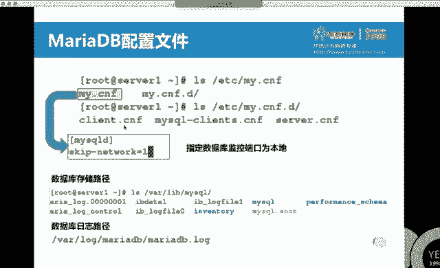

🤧。有冇讲位。安装。啊，我们的服务名叫马瑞亚DB。骚娃是吧。马瑞呀CB。大家会发现他说装了很多破包啊。破包啊，中文名叫破包是吧？pro也是一种语言啊，它也是一种语言，一种开发语言。

在中国呀没有专门的培训机构讲这门语言。因为学的人少。这面语言全靠自学。那为什么好多人还要自学他呢？因为有些这个外包公司软件外包公司听说吧，国外呀国外的一些软件会用到普语言。

那如果你们公司想承接人家的外包这个活的话，你是不是有人会这个语言呢？如果你们之后啊想去自己开发一些门件的话。嗯，想去开发一些自己的软件，你有两个选择。第一个选择呢就是。会一个大家都会的语言。

什么叫大家都会呢？啊，什么VBBC之类的啊，大家都会的语言。单儿飞呀啊戴尔飞pyython呢。大都会。或者是会一个很少有人会的语言。为什么呢？要不最好要不最不好，区别是什么？在1015年啊。

大约15年左右啊，那会我在大连啊。在大连的时候，有，因为大连很多外包转让公司。当时呢有一个。就持续段时间呢就能有那么一个报道一个。没上过大学的小孩儿啊，别的都不会啊，没上过大学就会个普洱言自学啊。

那个时候年薪是多少钱呢？那时候年薪是20万。你说十多年前20万啥概念？北京能买个房子是吧？🤧啊，好喂。就说一个语言的事儿。我们继续。那装完了之后，那正常我们是要启动服务啊。我先不改配置文件哈。

直接启动服务。这个服务名叫什么呢？马瑞呀DB。其他还没有报错，我顺手是不是给它enable一下？开机之起。再然后我们在之前呢讲没讲这命令，看服务的端口。现在开启了哪些端口，判断服务启没启动。

又有哪个命令啊？用SS00。大。A。NLP。A代表是奥。N代表是number数值l代表是list斯特listen。P的话代表是process进程。我们在这个里面呢就来查一个叫32。3啊，3306啊。

差点给拐跑了是吧？嗯，张本山最出名的就拐了是吧？拐了拐了啊，OK那我们会发现当年服务用的是不是3306端口。启用了吧。那现在呢我们去编辑它的配容文件。在它的配置文件中呢，我们会发现第第一行一直到第十行。

这个叫做mycyclqD。第十一行到往后叫做mycycl safe。安全模式吧。为什么买cyclq当中也有个安全模式呢？大家想对于一个数据库而言，大家都在用，它是不是也得有账号来跟进。

满30的管理员账号也要。也叫root跟我们系统管理员的用户名一样。那么它的密码默认为空。刚装完之后默认为空，默认没有密码吧。那我们在这个里面，大家想实际工作当中，如果这个数据库入台密码让人给改了怎么办？

改吹这个配置文件哎。改这个配置文件呢，添加相应的值。服务重启。你会进入一个安全模式。就点类似于单护车密码的概念，直接就进去了。然后是不是改成密码就OK了来嗯看。这个配置文件的另外一个作用。

那刚刚呢我们看到了说在这个里面你是不是可以来添加一个叫sg。network等于1。配置文件改完了之后，必须干嘛呀？🤧。重启生效吧。必须重启生效。O。服务程序。服务重启之后呢，我们再次思思。思思一下哎。

没了是吧。端口没了，端口的作用是什么呀？端口的作用是不是说你和客户端连接的时候要连那个端口。主要是给别人用的。当你写了sk networkwork等于一之后，你发现没有这个端口了。

但是呢我们是不是有个叫stats命令？现在服务运行了吗？是不是还在运行啊？换句话说，我用mycyclq回车。可不可以连接？我写用户名了吗？没写默认用的就是root，但我们这个是叫数据库的管理员root。

不是本地的管理员入的，这是俩人哈，只不过名叫做一样啊，名叫做一样。O。再时后。啊，退出给个字。我们会发现呢，你当天的服务依然是在running，是不是只能自己用啊，只能自己用。

在RCE马瑞亚DB这个题当中啊，他要求就是你的这个服务器只能自己用。你需不要填个sk network work等于一呀？然后呢，root也只能自己用，root也只能自己用，我们还得怎么弄呢？

我们先往下看。既然你是数据库，你要有些数据库的文件跟VR labmyse下。在VR lab mycycl下，除了你要有些自己的数据库文件之外呢，你是不是还得有些自己的日志啊。

这一条就是跟VRlogMIDBMIDB log。这是它的路径，我们会发现和服务主配文件相关的文件是不是都在跟VR下？都在这VR下，一般我们用的最多是不是跟VR唠纹似啊。不管你是做KVM虚拟机。

还是做mysq，他们都会用到根VR lab。你迅机默认也存在这个目录下lab是什么意思呀？酷。很多公司都有仓库，仓库它的作用是什么？放东西吧，储存放东西。它的功能有点类似于什么呢？

有点类似于我们平时操作系统中分个C盘，分个D盘，C盘发系统，D盘说换你的文件呢，有点类似于这个概念。下面呢我们要学一条命令，叫做myse security installation。

叫mysqQ安全安装设置向导。安全安装设置行导secure这个词又看着了吧。啊。SE类那个是那个S是哪个词儿啊？Security。跟他一个意思安全啊安全。ok。这条命令很长，我也背不住。

我们有个很厉害的剑，听不得见吧。按两下啊。你看一个很长的命令了吧。安全安装设置相导，这个也很长，不过这个叫做啥？转换表格式吧啊。如果你想给root设密码。跟安全相关的东西是不是都可以用它来做呀？

O中滑线下划线。下划线mycyclql安全table。回车。输入当前的root密码。刚刚我们把它登购回复，是不是直接就？写密码了吗？没写，没说没密码，你想设置住它密码吗？

大家会发现后面这个Y和N有大小写区别吧，Y就能默认值直接回车就相当于Y，要不你Y回车也行。新密码。那为了省事儿，我把新密码写成一个密码。确认密码。他说删除匿名用户吗？灰色删除。禁止root远程都登录吗？

我们上昨天啊昨天上讲三八服务的时候，是不是讲cosallo啊，allo是不是允许啊？thisasealdiceable a不允许不允许入制眼示登录。回车。删除测试数据库。删除测试数据库回车。

重新载入权限prival这个词啥意思？权限嘛。啊，权限重新载入权限表。那当你做了一个权限修改了之后啊，你是不是想让这个权限立即生效啊？刚刚是不是说删除用什么什么用户，设置密码了吧。

你在这个里面所有操作基本全回车，都默认值吧。都按默认指走，就root是不是改了个密码？root改完密码之后，我们再次来看我们原来这样是不是能冲进去？现在充不进去了。刚油。还充不进去吧，必须写什么？

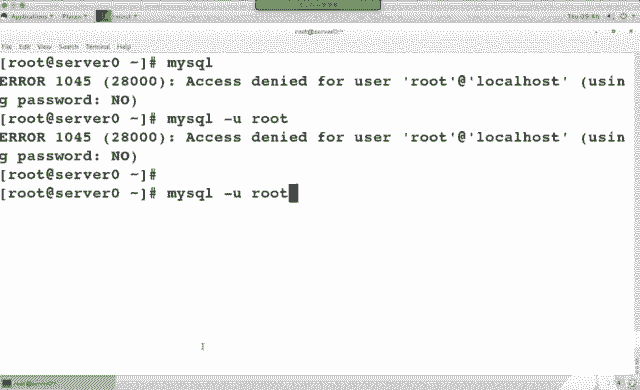

密码。P代表什么嗯？pass word密码。好，myseq security installation。OK吧，考试的时候肯定有这道题给root用户设密码。用他来说。能干好几个事儿。

那下面我们再来看一下seQ语言。在Q言看上红色的几个字了吧。创建修改删除重命名。选择插入更新删除授权授权。

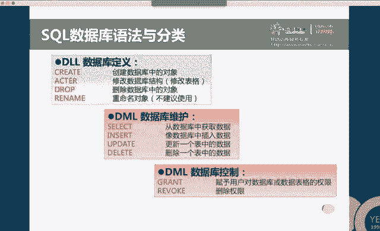

呃，马瑞亚DB它属于SQL语句啊，SQL语句。SKR的有券，它分成三大类嗯，第一类这个D。DDM dDL。DMLDCL。第一种叫做数据控制语言。第二种呢叫做数据操纵语言。操纵点。

第三种呢叫做数据控制语言。三中园。那对于第一种语言而言呢，它主要针对的是我们的结构。嗯嗯。DML呢它主要针对的是内容。数据。或要内容。DCL呢主要针对是权限。权限。可以怎么来理解呢？我们早上来之后啊。

大家是不是都要签到啊？你是不是在某一行去做一个。修改的操作。那么你修改这个操作呀，就是做了一个数据操作语言，做了个什么操作呢？我们管它叫upd date。你是不是把某个位置更新了一下？嗯。

那这个表是谁做的？😡，表示某个人做的是吧，那你会发现他是不是有个结构啊？到底几列几行有个结构。对于它结构的定义。Great。结构的定义。那么谁有权限呢？Grant。Grant。授权。这个词儿记住了啊。

我们讲阿帕奇服务时还会讲到。你既然是能创建一个对象。那我是不是就可以。删除一个对象。那如果你不想删除的话，是吧，可以。修改呀。Outer修改。创建修改删除啊，创建修改删除。对于数据操纵语言呢。

我们用最多的叫做select。谁来看他啥意思？啊。选择。Q也是查询啊，写来看是选择的意思，选择一个东西出来，结果是也是查询的意思是吧？但那个词叫做选择。你是不是可以把。你想一个表中有这么多内容。

我想把所有男生都列出来。如果用肉眼来查的话，慢不慢呢？很慢是吧？那如果用语句的话，是不是就很容易写。谁来的话一个条件万儿难。性别是难就完事儿。那我如果是又有来了一个新学而的，你是不是在表中呢插入一行了？

再新插入一行吧，来个新学生啊。那如果这个学生又走了。你是不是要把这条给删了呀？delete都针的是表的内容吧。查询插入更新删除。那么对于授权而言呢，它对应的就是收权。Reokeoke。你能授权。

那么就能授权。瘦和瘦是一对。稍微稍吃一顿。Yes。

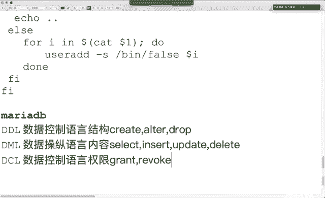

好的。这是我们三类语言。对于这三类语言而言呢，那要求大家必须记住的就这几个。考试的考点。啊，考试的考点。他们三个区别能理解吧？创建一个数据库，create database，创建一个表。

create table。创建的所有逻辑对象都是create。那如果你现在表中插入内容呢，iner。你要在表中改什么呢？update。你要刚才把表中的内容给删了，delete。

你要想看表中的内容select。如果你想把这个表给谁有什么权限的话，你要把那个权限收回来rework。和它的区别权限的定义。🤧。要买sq杠Uroot，我们是不是可以来登录啊，前提是没有密码啊。

而且没有密码的时候，是不是刚就入这可省略？因为你当前是不是root。那你要给root设密码，我们有条命令叫做myecure a me嗯，myec杠U。

rootpass wordpas word是不是一个子命令啊？他这个紫没令，12356说密码吧，让他设密码。那如果是我。不会这条命令。

用myseq security installation设为可以设入它密码。两种方法吧，这种也行啊。看下面有实例。如果你加一个杠P的话，一回车是不是要求输入密码了？可以输入密码。

你可以进入mysq客户端模式。用describe my secure their user，它的功能是看表的结构。我们刚刚是不是能create创建表的结构？是不是能aler修改，能照火删除。

那你可以查看啊查看。这个里面区问大家写吗？猜。不区分大写。那为什么他给我们弄个大小写呢？😡，他告诉你这是关键词。他是个命令。my cycle当中的命令。你会发现它结尾是不是加了个分号？

我们之前学过1二下3号的作用是啥？会说吧。那买seQ语句，你可以写很多行。当你写分号回车的时候，他再给你写完了。你不写3号，他认为也没写完。那呢日啊。语句儿以C号结尾。有些命令啊，你可以不以分号结尾。

他也认识，但是大多数的命令必须以分号结尾。记住分号哈，在oracle当中，如果你也用。这个语句的话也得引分号结尾。s database basis显示数据库。Created the base。

创建一个数据库，大家会发现显示数据库的时候，你是不是多得改S？一堆吧复数一堆数据库创建数据库。那么你如果想切换数据库呢，我们用的一个命令叫柚子。切换之后，看它前岛图变了吧。切换到哪个数据库。

OK那这回啊我们也来登录。大家看P和后面的密码有空格吗？没有是吧，买sQ的用法比较特别，正常情况下，选项和参数之间是不是得有空格？这个是我们所接触的命令中唯一个比较特别的挨着的。距离产生美。

人家也没有距离啊。如果你写个空格密码的话，你的密码就是空格密码。能听懂吧。接来之后。嗯。Show databases。看到数据库没？几个。三个吧，如果我想创建数据库的话，datab。

后面呢是不是你的库名？比如说我创一个叫马瑞呀DB。3号。大家会发现我写语句的时候是不是都分号结尾？你不写分号的话怎么办？看到没？啥时候写分号都写。能看到吧。Yeah。创建成功没？出我了吧。创建成功了。

那在最后做什么呢？😡，我说要看一下有没有这数据库。So database。4。3号。有没？懂了吧？我要想切换到这个数据库。大家注意青岛伏的变化啊。看清老数变了吗？你现在站在哪？在这个数据库里。

这能跟上吧？🤧继续。在数据库当中，如果想查看表的话，依然是受。这个时相当于我们平时用的LS命令，看里面有啥吧。还到有啥。tableables。显示所有的表。So tables。有表吗？没有。走表吗？

新创业的库没有表。那如果一会儿你做了一个恢复的操作，这个数据库中是不是就有表了？等你有啦。区别哈。你想把表删除jo table，你想把数据库删除job database。你想山水就照顾水。

那刚刚呢我们创建了一个数据库，用瘦的话可以来查看到数据库。那我们再来看select。谁赖着他作用什么呢？查询。从一个表当中来查询指定的列。从一个表当中来查询指定的列。🤧Yeah。如果你不写列名的话。

写什么名啊？写星嗯写星谁 like的星星代表所有力。你表中有多少列全列出来。先代表通佩符所有的列名。其这。那我们也来看个事例。🤧嗯。🤧在在这个表中啊，这个数据库中有没有个user表啊？

Se like the星 from user。🤧写分号吧。大家看到表中的内容了吗？是不是看的有点乱？你把这个字儿弄的足够小啊，它是一个类似于表格的形式。字儿弄的足够小。那为什么有足够小呢？

因为它这个表格太长了。你看这个越小是不是看着越整齐呀？当然了，你们已经看不清了，我也看不清啊。那怎么办呢？我是不是只对其中某几列感兴趣啊？Yeah。实际工作中有这么多列，我不可能都感兴趣。

我只对其中某几列感兴趣。比如说我对什么感兴趣呢？我就对头三列感兴趣，主机名、用户和密码，那么就写来他什么。主机。用户。密码。对，级别相同是不是逗号分割呀？投哪个表啊，刚刚的这个表吧。刚刚的表名叫啥来着？

什么叫user啊？加油字吧。分号回去。能看到吧？我只对这三列感兴趣。有同学说，那我手艺哆嗦。我忘写主机名了，我把主机名给写后边了。能看到区别吧？你看的时候，你主要是看user，把user放前面。

你主要看那主机，把主机放前面。因为正常人的顺序是不是从左往右看？正常哈正常。如果你穿越到古代的话呀，不是从头往右看。啊，古代的字儿怎么写啊？竖着写。为什么？因为以前的时候是竹简。能理解吧？拿出一根棍儿。

这个是一句话。要不然把他们给扯折了，这么横着是一段话，你不拿好几根棍儿啊。多好玩。为什么古代是竖着写哈，但正常人的写的是顺序是从左往右写。因为我们现在是不是都用的纸啊啊这区别。🤧嗯。就不管是什么现象啊。

你多想想为什么，你就发现啊，为什么他们非要从右往左写，为什么非要从左往右写？都有点区别，都有原因的。O。😊，我们继续。🤧嗯。这是select。Inert。我们可以在表中插入内容。

如果你写了一个哪个数据库中的哪个表，然后一列两列写了两列。那么呢你需要有vios相应的名对应。他这个是往表中插入内容。如果你不写这个表中哪几列的话，你的Y6值必须是按照顺序。比如说你这个表中只有两列。

那么你er的时候呢，你可以不写括号那个列名。外流斯它的顺序必须是按照这个顺序来写用户名和密码。这它的区别。谁外的时候呢，还支持一个外条件。没样条件，谁来跟他星匹配的是不是厉害呀？外条件匹配的是好。

我们在之前是不是讲过grape和cut？格瑞坡看的区别什么？一个是过滤列，一个是过滤行是吧？行和列的区别。那么s莱它与星是不是过滤哪几列出来？那外条件呢是过滤哪几行出来，过滤哪几行出来，我们也来瞅一眼。

那在刚刚啊，我是不是过滤了。这三列出来啊。这个表中一共就三行一共就三行。下面我是不是想过滤出哪三行啊？喂。select格式哈，select从哪过滤？肉er。Y呢是条件。条件是什么呢？浩斯特。等于。

local浩斯特。3号。这个什么意思呢？过滤主机是locco house特恶行。过滤主机是local house的好几行啊。你好，这个里面要注意一下我这个写法啊。为什么他前后要加个单印？因为这个是字母。

如果它是数值的话，单音可以省略。如果是数值的话，单音可以省略。大还出就这行出来了。外汇率的是行。谁大它后面那个过滤的是力。有区别吧？大家想一个表当中有好多内容，你想过滤书指定的内容是不是要用到星。

要用到where啊，他俩都要用。这是外的作用。一个是行一个列。啊，不对。updated的功能啊，它可以来更新表的内容，更新表的内容，更新oss数据库userers表。更新谁呢？更新用户的密码。

把用户的密码改成什么呢？改成加密的123456。改谁的密码呢？vius。利食。我们把ZC的密码改成加密的123456。能看懂吧？这个语句一般什么时候用啊？大家是不是经常在一些网站上可以去创建一个用户？

创建完用户之后，你原来有个密码，你是不是想把密码给改了？当你用鼠标去单击更改命令按钮的时候，后台就干了这么个事儿。他去找到你的数据库这一条，然后呢把你的密码改成了什么。ok。那我们看下面这条。

mycyclq库us唉，这个看着很眼熟是吧？是我们刚刚看的这个数据库中的这个表啊，这条命令它的作用也是说给root改密码。给路的改密码几种方法。三种。

第一种是不是买se secure installation？对吧安全安装上导。第二种呢是我mycyclq at me管理命令。第三种呢就用update语句。三种都可以。但是当你用upate语句的时候。

改完权限，必须要去flash一下。这个词叫什么呀？刷新。privile这个词看这么眼熟呢。权限我们刚刚在myseq security installation的时候，你去做了一下权限之后。

是不是做个reloadpri啊，刷新权限的操作为的区别我们的敲个命令语句啊叫flash。改权限的时候要刷新权限，让它生效吧。这个语句如果你背不住的话，还有另外一种方法把你的数据库服务重启。

S term control risk start。马瑞亚弟弟。也可以。OK吧。delete from从数据库中删除什么内容啊，从数据库中删除什么内容。YR条件删谁。from后面是表明，Y后面是条件。

update后面是表明set后面是改成什么，外后面依然是条件，大家会发现ID等于5ID等于一等号后面这个数它有引号吗？没有，因为它是数值可以省略。当然你加引号也行啊，加引号也可以。那我们再来看一下授权。

显示权限呢叫how显示权是howhow database show tables show grants啊，how grants显示谁的权限。那我们在这个里面大家会发一个符号，看到百分号没？

百分号相当于平时我们用到的星。他代表通佩福。说ban night点儿com。我们平时写域名的时候说星点什么什么域名啊，这个是用百分号啊，百分号。at前面是用后名，at后面是主机名，主机名的话。

你可以写域名。如果有通配符的话，你可以通配符。这个版分号相当于星的概念。那么这个星点星是啥意思呀？点儿前面是库名，数据库名表儿点儿，后面是表明啊表明。grant是授权，reoke呢是授权啊。

reoke授权。看一下创建用户。创建呢全是create。创建数据库叫create database。创建用户呢叫create user，然后谁。identityified by后面这个呢是你的密码。

Identify， side。by这个是你的密码。创建的用户这个用户指什么用户啊？数据库用户数据库用户，他的级别有点类似于操作系统中的student。类似于操作系统中的student。

大家看下面这个位置，级别相同的时候，是不是逗号分割呀？之所以给我们询问大家写的原因是因为这些是关键词儿。小写的字母都可以换，从哪个表中啊，条件是什么？用mysql来连接，你可以去做一些相应的操作。授权。

那如果是out grant授予权限的话，如果你写个out。privas代表说把所有的权限都给了谁。考试的时候呢，它只要求是你赋予某一个具体的权限。比如说select的权限，选择top的权限删除啊。

考试的时候，它主要考的试select的权限。那如果是给他一个使用柚子的频件呢，usage啊usage。实际工作当中，我们是不是经常要去做一个备份数据库的操作？那我们用的是mycyclq dump命令。

用谁的身份备份呢？root的身份备份。大家看这个位置么加了杠P呀。你家刚皮之后一回车是得输入密码。备份哪一个数据库呢？后面是不是写了数据库名？一挥车备份到你当前的终端上了。

我如果想把这个数据库备份到指定的目录下。看到大于号没？充电下吧。从内下大包文件当中。如果想把所有数据库都备份all databases。所有数据库都备份。All databases。看一下下面这个恢复。

备份这个实际工作中，你倒着敲能敲出来就可以。考试的时候呢，它主要考的是你恢复。刚刚我们是不是创建了个空数据库啊？create database marDB。那我们需要恢复一个数据库，考试的时候呢。

他会给你个已经备份好的库文件。你要把它恢复回来，你备份的时候大于号，恢复的时候得用。小于号是不方向正好相反呢，一除一啊一除一进。恢复到哪一个库中。如果是恢复所有的数据库，说不写库名。哦。O。

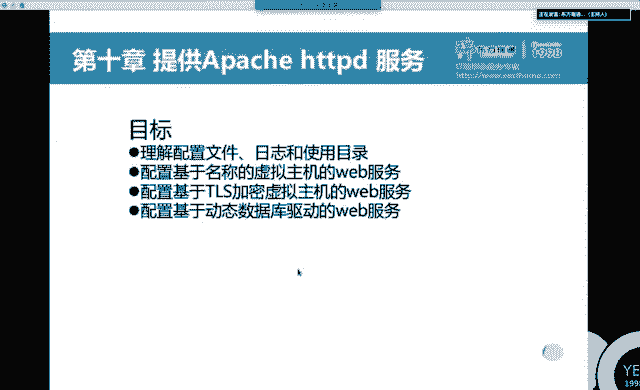

呃，下面呢。咁啊。来看一下。我们针对这个题来给大家做讲解。考试的时候，马上第B两道题，最后两道题。搭建一个。要求是只能自己登录吧。只能自己登录考的时候skip network等于一啊。然后服务重启。

我们在my secureq secure installation当中，是不是有那么一条叫diallow rootot登录啊？root remote有印象吧？不允许root远程登录。

是不是也只能本地登录啊？然后呢，用mysq secure installation的时候，可不可以入它设密码啊？可以吧。那是第一道题。第一道题要求我们做的操作呢。把它俩装上。启动服务。

执行mycyclqcle screen installation，我们是不是可以给root设密码啊？是不是就可以禁止root远程登录啊？之后是不得刷新了？除了这个我刚刚选择的这一步，别的你选no也行。

OK吧，他没有要求。那默认情况下，我们服务启动了，是不是接听了本地的3306端口？当你修改了配置文件，添加了sk net work等级之后。添加了它之后再重启，还监听3306端口了吗？没了吧。

但是我的服务是不是依然是运行状态，可以登录啊。可以访问。那访问之后，我们是不是能看到你当信数据库？我是不可以来创建数据库？如果你记不住这个词儿的话。可瑞，你是不是得记住啊？我们有个命令叫help。

看create的帮助，他会告诉你，你能create usercreate databasecre table一堆。你在里面是不是能找到这个词儿啊？创建数据库数据库是谁？其中要求叫什么名，起什么名儿推出。

既然要求你恢复数据库，你是不是得从一个地方来恢复啊？那么在题中会不会告诉我们。在哪呀？看到了吧。复制。Cooffpy。呃，下载用啥命令了？W盖上。下载。下载完之后干嘛呢？恢复吧，用mysr命令杠U。

能连接啥刚P。密码，然后呢。这个是不库名啊，恢复到哪个库小于号吧。是不是从这个备份文件恢复到这个数据库？能看懂吧？在之后呢。回说。大家看一下你的签岛服。是不不用柚子了？你这写库名就直接进来了。

你不写库名，前面是不是那？进来了之后。我们设 databases。买RDB刚刚我已经创建完了，已经恢复了。既然恢复完了之后，你是不是应该收 cables？看一下是不是多了一个几个表啊，几个表。

三个表三个表的内容，我们看这个名哈，product翻译中文是啥意思？这不是叫产品表啊？我把字儿稍弄小点。大看产品表。ID名价格库存IDID。哎，这2个ID看着很眼熟啊，是不是另外两个表的ID啊？看到没？

Select。Hereing from categorybury。啊，这个表是不是就累型了？网络设备服务器SSID。他就是它类型。我们还有个表叫什么名呢？

manufactture这个表名我能背下来它叫什么名吗？嗯。大家用table键呢支持补全来。M table。看到没？A table。The table。是不是就这个表啊？这个秒当中。

这个叫这词分中文啥意思？供应商吧。考试的时候也会给你几个表。他们的表名基本上就是这个表的作用。基本上这个表的作用。供应商供应商名。闪迪金士顿、华硕索尼。他们的销售。约翰迈克啊一堆。电话号码一堆。

首先呢你要知道三个表大概是干嘛。然后那才做后面的题。OK吧。🤧最后一道题就考select语句儿。三个表，如果你看不懂的话，select语句。好困难啊很困难。快快快来。恢复数据库了。

那下面呢我们是不是想着要干嘛呀？🤧添加个用户。还要干嘛？给他设个密码吧。你是不是还得会crant，会grant呀？create grant create什么意思啊？创建grant什么意思啊？

授权我们看怎么做。太。对于很长的语句而言呢，不建议大家去背，建议大家去。看慢手册，看帮助，看帮助。那我最终是不是想授权？Hap吧。🤧然后呢，你往天上找。看到这块examp跑了吧。这段有个烂婆，他说啥？

他说，创建个用户jeffrey。只能在本地来登录减飞的密码是啥？然后呢，是不是可以授权？授予所有权限，授予选择权限，授予使用权限。on在哪一个表上？点前面是不是数据库名，点后面是不是表名？2。吐谁？

这个是丐帮的必杀技是吧？丐帮最厉害的是么？兔兔嘛？丐帮逼杀技兔兔谁兔谁是不是给谁呀嗯。Okay。这为什么提到盖帮子呢？因为我看有同学眼睛比较直。可能神有天外了。嗯。OK再坚视2分钟啊，马上讲完了。😊。

咱们正好10点半之前呢，这个时间能讲完。给谁这个人呢，是不是你刚刚添加了这个人呢？你想这么两条语句，你也不用去背，是不是就记一个hyper grant就可以了，有实例。照着视例复制粘贴修改，写完成。七。

复制。妈呀，这年前他什么呀？回去重新复制哈。😊，选择。那你要的用户名叫什么名？特不叫marray。对吧。那他的密码是什么？这不是叫marry下好线pass world。刚刚复制过来的时候啊。

我们会发现少复制个字母吧。复制叫什么名来的？可瑞特吧C开头哈。O没？OK然后你要干什么呀？授权吧。看一下题议的要求。啥权限？选择的权限是不是select它？要删除的权限是不是就照他？看一下删什么。

删结构呢，jo删内容就是delete。Okay。那既然要选择的权限，你看这条是不是就grant select。哪个库，哪个表给谁。不是吧。我们这个人呢是不是叫marry呀？哪个库，哪个表啊。

是不是叫做马瑞啊DB这个库中所有表。选择的权限。嗯。做完了之后，我们用之前的思路来理解呀，当你添加完用户设置完权限之后，你是应该要刷新权限，让它立即生效啊。要不然就退出把服务从启业。

要不然呢是不是该就flash的东西。flash那个词我能被他住，但是权限那个词太长。这个里面有吗？也有吧，复制。拉。YY来着。P villages。刷进了之后，你是不是要来验证嘛，怎么验证呢？

原来我们用这套命令是不开来登录。现在呢我们这个用户名叫什么？Marray。密码叫什么？marry下划线pass word。能登录吗？So tables。能看到表吧，谁like他行。From。그 딱。

能塞来个啥吧。Great， take a base。创建不了吧。是不是只能选择呀？嗯。这个内容有问题没？这是第一题。考试当中第一题要求大家知道的，你会安装。亚么instore吧，你会启动start吧。

然后呢只能自己动是不买你要修改卖点CNF文件，sscape networkwork等于一myseqq secure installationW get下载，myseq小于号恢复到数据库吧。

那么你在恢复之前，是不是得先去create数据库，然后呢恢复这个数据库。你下面这个实验实际上考的是不是就是hy grant？hi for。那下面这道题专门考的就是select。他考的就是select。

查询查询考试的时候呢，在网页上会有两个扣，你把查询的值啊填在里面就可以。他不管你怎么写的语句儿。😡，他要求的就是你把这个值给填里面就可以。查询。或者是说你看一下同桌哎。写的数值是2，你把二给填上就得了。

最快的方法是吧？但是这个方发有个问题哈，哎这边同学写的是3。😊，那边行啊。这是最痛苦的事儿啊嗯。所以说你最好自己做一下。当然了，这个很快嗯，这个方法确实很快，但你们提也不一定是一样的吧。我能理解吧？

所以说你会select，有同学说老师我不会select的语句。你写的要稍微复杂一些，我也看不懂，我就看三个表，我用肉眼去查行不行也行。又浪费时间是吧，也能查出来。考试的时候给你们的表呢。

一个表里面二三十条记录，你用肉眼慢慢去查也能查着。这个是谁来小志，他只要求答案，不管你怎么写。那我们来看一下啊。他说查询这个产品，他的供应商叫什么名？我们先用肉眼去查。

你既然要查询一个产品要用到哪个表啊？稍微用到产品表啊，你既然要用到供应商，你该查的哪个表啊。这俩表吧，大会发现我一行文明反冲区中是不是可以写多条语句？首先。我们刚刚是不是说这个产品。

他的供应商叫什么名吧，你往后面找，看着他的供应商ID没？3、然后呢你再用供客商ID来查它的名是什么，是不是法数啊？然后呢，你把华硕复制一粘贴，这道题就做完了。有人说这多简单呢，肉眼一看能看到。

这个一个文件里面就四行。能理解吧？那考试的时候给你弄个1000条呢，哎，三个半点就看表了。尽量会写语句哈，那么这个语句应该怎么写？Select。他让你查什么，你就se like什么，他让我查什么呀？

供应商名吧，供应商名是啥？是不是内幕？看到没？就是内幕，但是这个表中是不是也有内幕？我怎么来表示是这个内幕，不是那个内呢？是不是？这个表中的内容。做个区分吧。从哪查呀？咱们刚刚在用肉眼来查的时候。

你用了几个表。两个表吧。那你就from几个表。逗号空格。不写空格行不行也行，不写空格不支持推不进。Product。你把键盘摁碎下了，它也贴不不出来。空格和 dark。没啥区别吧。按空格啊。条件是什么？

是不是说产品名是他的呀？那产品名怎么表示？是不是产品表中的名啊？嗯。产品表中的名是他。怎么写产品表呢？是不是叫pro。productduct name等于。你是不是字母啊，加单音。刚刚我们在查的时候。

是不是还说那个表中是三，这个表中是3。是不是有个值是相等的东西啊？换句话，如果你怕得写个条件。同时满足的条件要按。如果是货。满足一个的条件用2。OK吧。那我们是不是产品表中的？1个什么ID呀，买个。

manu factor和。谁想到？供应商表中的谁想到了？ID想到吧。语句写完了之后，用什么结尾？3家号。什么话硕呀？ok。😊，哎呀，方间上，我们最终要查的是不是供应商等中的名字。

manufact name要查什么，你就 select like什么from你当前查询的条件也好，结果也好，涉及到几个表from几个表。涉及到几个表，双几个表外绕条件。给你什么条件，你就写什么条件喂。

给什么条件就写什么条件。那么在这个里面呢，还有一个叫做等值连接，是不是那个表中的三和那个表中的三一样啊？谁和谁相等，这叫等值连接。他俩是不是同时满足的条件？暗的。后面都是条件啊后面都是条件。

我们在之前呢用不用过gri？是不是过滤行啊，过滤行完之后，你就会加管道，接着group呀。就这么个概念啊。最后一道题。查询类型是斯尔沃斯，供应商是索尼的产品有多少？那你这个查询的时候。涉及到产品了吧。

有多少种的话，你涉及到产品涉及到供应商，涉及到了类型，涉及到三个表吧。是不是from三个表。然后这个是一个条件，这个是一个条件。是不是得有外面两个条件？三个表是不是两两等值连接？还有两个相等啊。

这是这道题好，我们来看一下啊。我们先用肉眼来看一下它的。有几种啊，产品有几种，先要肉点来查。Select。So from。呃，类型供应商产品。先看类型。再看供应商。再来看。产品。那我们先来看一下要求哈。

类型是塞罗斯。看一下第一个表类型是s罗斯，s罗斯大于B是多少？2。然后呢，你去产品表中，你去找类型是二的，现在有几个。类型是二的，现在几个。有两个吧，然后呢，他还有要求。供应商是索尼。供应商是索尼。

ID是不是4？看到没？然后你过来看供应商索尼ID是不是4。O。同时满足条件有几种。两种产品。都是索尼。能看到吧？索尼服务器。这是不是用肉眼来查呀？记录很少，肉眼来查是能查到的。

那么不用肉眼茶的话怎么办呢？吃那粉。你是要查有几种啊？那我们查个数用的是count，它叫做聚集函数。聚集函数是计数的。from充几个点。还有个表示啥名字？类型是吗？条件。😊，什么条件呢？Yes。

类型是塞尔沃斯是吧？类型是serv沃斯。类型名是斯罗斯的。是不是在这个表中啊？娘是。他的。同时。还有什么条件呢？供应商是索尼。供应商名是索尼的吧。供应商名。是。说尼。同时一共有三个表。

是不是两两个表要做等值连接呀？一个是2，一个是4，两两个表走着连接。产品表的。ID和。供应商表的ID相等。同时呢产品表的。类型和类型表的ID相等。到小安了之后呢，回车。支出来了吧。考试的时候。

不管你让你做什么，你就se like什么。他给你的条件和结果涉及到几个表，你就from几个表。他给你的条件是什么？纽拜尔条件是什么？那么后面这个条件呢，它实际上是一个隐含条件，等值连接吧。等值连接。

如果你不写Y等值连接条件的话，它默认是会做广义离卡尔机。不符合要求。实际工作当中啊，我们一般用的都是等值连接和自然连接。这是。马亚弟B。首先插包。然后装宝。接到报名，报名忘了的话。

类似的行来查看启动服务开机自动启动。然后呢，我们可以用myseq security installation来设置root的密码。那要求注册密码是什么，你就设置什么。设置密码。今日呢他远程登录。

立即生效。这个是设置它密码，禁止远程登录，只能本地使用。那么它既然又限定了本地使用，我们需要添加一行。在买sqq mariaDB它的配置文件中添加一个st networkwork等于1。添加完了之后呢。

服务重启。重启完之后能不能登录啊？你会发现端口不存在了，但是呢我们还能登录。密码是什么？P后面没有空格哈，没有空格，直接写密码，显示数据库。如果你忘了这个词儿怎么写，dtabase怎么写的话。

那么你需要用hap create。查看他会告诉你create什么。数据库创建完之后退出。按照T的要求，是不是得下载相应数据库啊？给你什么内容，就W get什么内容。

这个位置我们有没有杠O和杠P这类的选项？没有吧。如果说你要把这个文件下载到其他目录下杠P。如果你想把这个文件。下载并筹命名的话，杠O啊下载并重名杠O。就下来WK。下载完之后呢，用myacq身份来连接。

指定的数据库。恢复。小于号啊回复。然后呢。连接。连接。链接之后，我们可以用show tables来查看。有几个表。查一下grant怎么用。创建用户。密码。这里面呢这套比较关键。

如果你hyper grand会下面这两个呢都能查到。给谁？跟你谁。什么密码？哪个数据库中的哪个表。给谁权限？权限是什么？做完了之后呢，要去干一个事儿，让权限立即生效。然后呢。

我是不是就可以用这个身份来测试了，杠U杠P。show databases呢可以来查看数据库use来可以来使用数据库。show tables呢可以看到你的表，你可以select。但是你像什么别的操作呀。

对于结构的操作是不是都干不了啊，创建用户啊，创建对象都创建不了啊，都没有你只有select的权限。这个呢是第一道题。第二道题。第二道题考的就是select语句。第二道题考的就是select一致。No。

Select。让你查什么，你就select他什么。那我们要求查的什么呀？是不是一个什么名啊？但是你from的这个表，两个表中是不是都有name？为了说明就是供应商的表。

这个表中的名那些manufture点没有。从几个表。从几个表。根你的条件用到几个表，你就从几个表。用到几个表，你就from几个表。条件。条件是什么啊，你就写什么。条件是什么？就写好。

那么在这个里面呢有个隐含的条件。谁和谁相等吧。谁和谁相等？那为什么这个位置没有写表明？因为ID manufacturer这个列名在两个表中是唯一的呀？表明可以省略，你不想省略的话呢。

你可以把这个表明product点，它写上，也可以看心情。执行之后呢，就是你的结果，别忘了什么结尾。分号结尾。🤧同理。在那个是。那么最后一道题啊。考试的时候有可能考的是一道塞来的题，也可能考两道。

不一定哈啊不一定看你做的是哪套题啊，看你做哪套题。那最后一道题考的是聚集函数。他说有几种设备啊，有几个产品是服务器索尼公司的啊，索尼公司的服务器，我们有几种产品。那我们就看到星聚集函数from几个表。

用几个表就from几个表。那么这个位置有没有空格啊？🤧嗯。有空格吧，逗发后有空格，为什么我非要加空格呢？是不是为了用k键呢？🤧推able键表明推able键表明能推不出来。如果不加空格的话。

推able键出不来，一定注意空格的问题。再有Y绕条件。按照题的要求。一。😊，提议中是不明确的要求的说你的类型名是什么？你的供应商名是什么？OK吧，按照提要求走。那么在这个里面是不是还有个隐含的题呀？

你三个表中是不是两两个表要做等值连接呀？C和谁相等啊，C和C相等，两点表做等式A接用到几个表呢，就from几个表。这道题考的是聚集函数，看到清。如果他求和的话，那，就上。some什么东西？

平行值叫AVG啊，平行值AVG。这是常用的一些函数啊，考试的时候主要考试count。退出呢A个Z。对于这个里面出现的所有的语句。select也好，柚子瘦f也好，我们都可以用hap来查看。

都可以用hap来查看，但是你必须得知道关键词是什么才能help。就像你用卖手册的时候，你是得卖什么呀，卖什么。好，这是马瑞亚DB。嗯。这个你好有问题没？呃，下午吃完饭回来之后啊，第一个实验。

下午吃完饭回来之后，第一个时验。从这儿开始做哈。从这儿开始做。系统函数怎么查？系统函数。你是指聚集函数吗？还是说命令啊？这问的是啥？拒集函数。啊。具体函数怎么查呀？😡，如果你要是查聚集函数的话。

我们可以刚刚是不是select当中有聚集函数了。那么你是不是就看看一下se like的用法啊，ha select like。在这个里面呢，我们会发现有很多。有很多内容。s like的什么内容？

谁来给他头不可以写表达式啊？这个东西呢就是我们刚刚说的聚集函数，它的表达式from哪个表外来条件。在Y条件当中呢，我们还会发现有些其他的值吧。

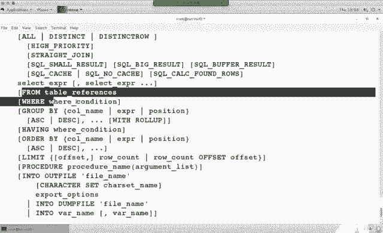

其他的选项。

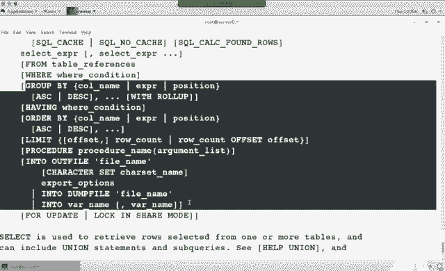

这个呢是它的。官网地址啊官网地址。helper youi嗯。然后。Have a join。帮助外耳的条件。这个东西要查的话，得上码了，是吧？看一下本地有没有手册。ま。我们在之前安装了几个包啊。两个包吧。

马瑞DB。玛瑞亚迪弟so我。我们看这个里面是不是有些慢手册呀。Mythan you我 me。啊，这个是不是改密码的呀？那我们来看一下这个语句儿，这个是它的用法。然后read me。你报。这个里面没有。

Soer。

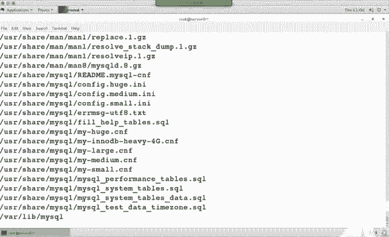

慢。

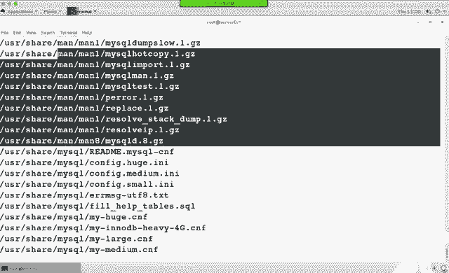

M IQ技。这都是命令的帮助了哈，于俊的帮助只能去那里边找啊。只能在。这个里面找吧。聚集函数。ha一个内容嗯，ha一个内容。应该是hap什么东西哈。H跑。看了。哦。这个。这个只能上网查了是吧？

要不然的话，他是不是只列出了他的一个事例，然后它的一个用法啊。我们是不是想知道都有哪些聚集函数啊？Hle content。Content。嗯。账号管理数据库类型。这个查按一下吧，这还有什么东西。

聚集函数。AVD。他都列出的是个网址的嗯。

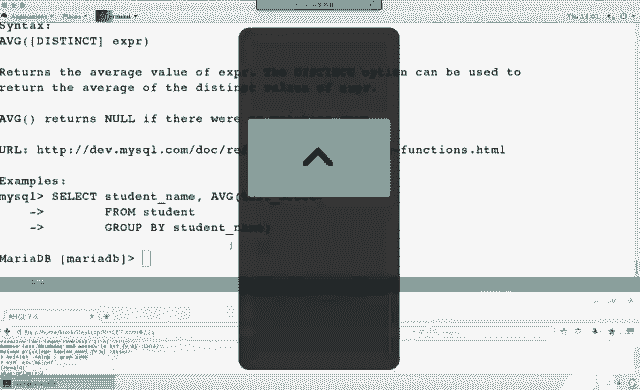

第十张。对于第四章而言呢，是下午考试啊一个重点。嗯，下午考试一个重点，为什么叫做重点呢？因为在下午的考试当中啊。这个。阿帕西服务3到4道题。下午考试一共就20道题左右，可能十8道题可能2十道题。

可能是22道题。那你想阿帕奇他会考那么多实验，而那么多实验呢全是虚拟主机实验。全是虚拟主机实验。大家看一下这片儿。🤧说的一个理解是不是都是配置啊，配置什么配置什么配置什么。

而它配置这一堆东西啊都是虚拟主机，它们的区别是什么呢？金玉名称了许主机。基于名称的寻拟记。换句话说，IP1样，名不一样。IP样名不一样，基于名称的虚主机。那还有呢。基于端口的虚拟主机。第三个啊第3个。

基于端口的寻主机。那么对于第二个而言呢，第二个他是不是说叫做什么？叫做加密的主机是吧？加密的主机呢这个也是做的虚拟主机，嗯，它也是做的虚主机。那么它做的依然是基于端口，基于端口，基于名称都可以。

记端口记能账。那么什么叫虚拟主机呢？正常情况下，一台机器可以做几个外面点啊。默认做一个是吧？但是一台机器只做一个外部站点的话，浪不浪费资源呢？你的CPU内存现在都很强劲，你只做一个外边点，很浪费资源。

那我们可以怎么做呢？可以用不同的DNS名来访问。访问的时候呢，同1个IP不同的DN名，然后呢访问的是不同的结果。这个是一种叫记忆名称的虚补题。第二种呢。在互联网上啊，是不是有好多HTTPSS的网站？

HTTPS的网站，它和ATTP什么区别？加密啊加密的大入站点。HTTP和HTVS它俩主要区别的断号不一样。HCDB是80。HTTPS是443啊，443问号不一样。那么动态到外部站点呢。

在网上是不是有些什么PHP呀？WSDI呀ASP呀动态网站吧啊动态网站。这是这上的内容。要求大家掌握的。那么对于这招而言呢，我们主要会讲这么几个实验。Yeah。寻主机。Me tour house。

H70 p。加密的外部干点。WSGI。动态外边人的。那么在之前呢，我们是不是还讲过一个叫。默认外部站点啊。我们之前做实验的时候，是不是经常要装一个阿帕奇启动就完事儿了？没改过配置吧，没改过配置。

除了这四个实验之外呢，我们还会专门讲一个叫安全。还没写。这是阿帕奇的内容。那我们来看一下。首先来看一下理论部分吧。为什么他叫阿帕奇呢？😡，78287我们能想到什么？😡，其他帕7我们应该能想到直升机。

阿帕奇最早出现在我们的视野当中呢，就是它是一个美国军方的直升机。而这个东西它是在哪来的呢？有个叫非洲。非周原始不录。非洲原始部落啥意思？一说非洲岩始不落，你能想到啥？是。能想到吃人呢。嗯。

咱们能想到这个原始葫芦肯定以打猎为生，是吧？达类卫生是不是成天跑来跑去啊啊。啊，这个部落非常骁勇善战啊骁勇善战。我们能想到就是非洲黑人是吧？不穿衣服，不对，穿的很少啊，然后呢跟动物赛跑。不是动物吃它。

就它吃动物啊。因为在这种环境下，你不吃动物就动物吃米，所以说都非常骁勇善战。那后来呢，美国有个军人用的直升机。也很厉害，也非常骁勇善战，也启蒙个阿发西。再说来呢。随着互联网的发展。

那那个是当然是给外部服务啊。有个外部服务也叫什么人啊？阿帕奇啊，他这么来的。那我们现在发现个问题啊，他们都叫阿帕7，阿帕7有版权的事儿吗？有商标的事儿吗？我们也去生产阿帕奇，可不可以？可不可以？

商标这个事儿啊，它主要跟版权跟行业有关。大家都道什么叫行业吧。比如说康师傅一说康师傅也是不是能想到吃的呀啊，你去生产一个康师傅鞋垫儿。这个侵犯版权吧。不侵犯是吧？在讲服务的时候呢。

通常我们都会先讲一下报名。嗯，讲一下报名。阿帕西夫的报名。多不多啊？几个宝。四个包钱。考试的时候啊，你会考到四个报名，为什么？我说一下他们的作用。HTDPD呢这个是它的服。或要程序。

HTTBD manual呢。猜。手册。手册。mododeSSL呢，我们是不是有个叫HTBS的实验？他的装支持。模块。那我们还有一个叫。动态网站吧。WCGI模块的支持。那有同学说了，我这个手册不装行不行？

理论上可以。不装不影响。但是大家现在想个问题，考试的时候呢，你要去配一些服务的安全性设置。2。4和2。2版本不一样啊不一样。什么叫不一样？我们当前用的这个是2点几版本。2。4在企业版6之前2。2。2。

4和2。2在服务安全性这个位置设置方法不同。设置方法不同导致个什么情况啊？如果你之前考过RSRC16的人证，到RSRC17的这个题还是不会做，因为它变了，写法不一样，关键词不一样。

所以说为了知道这个东西怎么用。你要把这个包装。也就是咱们最后一个实验per。他们先要用到这个包。社包的作用理解了吧。社包的作用。Okay。那在做第一个实验的时候，因为我只想做这个服务，我是不是就把。

他装上就行了。我用谁装谁吧。安装。安装完之后呢，我们来查询包。好多配置文件是吧？那一般情况下，配置文件都是以什么结尾啊？看这个结尾。中间这一堆是不都叫模块啊？模块的配置文件。除了这一堆之外。

除了这一杯之外，干什么，唱主一是吧？除了这对之外，是我们的配置件。confi点D这个目录呢是叫子配置文件。confi下面呢，这个叫做配置文件。他们都生效。能听懂吗？都生效。换句话说。

你当年去做一个配置修改的时候，你到底该哪个文件随意？那为什么我们在做实验的时候，非要给他们分成多个文件？模块化的思路。一个文件1000行手一读和改错的某一行，你是不是得去找哪行改错了？我给它分成十份。

每个文件就十行，就100行，我去排错是更容易一些吧。刚刚改过这个文件，服务出问题了，肯定是这个文件有问题。OK吧，模块化的思路。在二战期间呢。有一个非常厉害的外国人。207年都外国人是吧。

没中过的事儿啊。德国有个很厉害的人，谁呀？希特勒是吧？为什么二战希特勒那么厉害？😡，知道吗？因为他在那个年代呀就已经有模块化的思路了。怎么弄出来的呢？大家知道流水线吧，生产线。

那我们都知道在传统工艺上啊，如果一个铁匠是干一个事儿的话，当当当他能造一把枪是吧？但是后来。流水线这个东西啊，最早是希特勒弄出来的。他说哎。你就给我造子弹，你就给我造枪坡，你就给我造枪管。

一个铁匠只干一个事儿。效能提升吧，然后后面有个生产线去组装。就是所有的工厂啊，最早都跟希特勒学的流水线的概念。因为当时他产能上来了，武器是不是能跟得上啊，所以说很厉害。到后来为什么失败了呢？

因为天气的原因。他是很厉害，但是打到苏联的时候，苏联太冷。他不是被苏联打败了，是被天启打败了。嗯，这是希特勒的一生啊。所以说他应该去研究天气预报是吧嗯。O。😊，回过头来，那么既然模块化有这么多优点。

在企业板7的时候，依然选用模块化的概念。我们会发现好多配置文件是不分成的多块都生效啊都生效。那么这些配置文件中谁是主配置文件呢？这行吧，它是主配成件。ok。😊，我们来看一下主配文件内容。把行号加上。

放眼望去啊，这一篇是不是都是朱市行啊？都是主持哈。Ctrl F。翻页。看到三十一行了吧。31行代表什么？server root它代表是说我这个程序装在哪个目录下。程序所装的位置。乘序存长的位置。

ctrF。看到42行了吧。listen它代表我当前这个服务监听的多少号是多少？默认多少？80。Crl F。看到56行了吧。config点model点D轻点config。

刚刚我们是不是看到有好多模块的配置文件。这是模块的配成件。看到6667没？66得7是不是代表阿帕奇和阿帕奇组。阿帕奇用户阿帕奇组。哎，这个里面提了用户和组的概念。阿帕奇服务属不属于共享服务？

他是不是也是共享啊？我可以共享一个文件夹，然后呢，你通过这个浏览器来访问共享，你是不是也可以下载文件？如果是动态网站的话，是不是也能交互，我也能往服务器上存文件吧。如果是动态网站的话，换句话说。

你既然是也提到了共享，那么是不是也应该有用谁的身份来共享啊？他用的就是阿帕奇用阿帕基组的身份，然后呢，他要能访问你那个共享文件夹，把共享文件内容共享出去。换句话说，你本地的那个文件夹。

阿帕奇用户阿帕基组是不是得有读和执行的权限？你得能进去，你得能读吧，你才能发布出来。这是他俩的区别。用户和组。86行so me。这个代表是服务器管理员邮箱。当我们访问一个站点的时候。

如果这个服务器出问题了，它是不是会下面有那么一行给CC谁发邮件了？啊，从这儿读出来的。弹窗F。ctrlF是向下反页，那ctl什么是向上反页？back up controll B。啊，control比。

那我们看下面这段内容，看到102到105了吗？directory斜杠斜杠directy。directory呢代表是目录。给外推代表是目录。你既然也是做共享，那么是不是得有服务的权限呢？你共享这个文件夹。

谁有权限？我们下面有个词儿。大家看这个这个是哪个目录？根目录。阿帕奇服务能访问跟目录吗？看下面require需要out。全部得耐拒绝吧，全都拒绝什么含义啊，所有人都不能反问跟目录。

不能通过外部服务来访问跟目录，这是外部服务的权限，安全性能设施吧？如果你这个位置写个能能访问了，那么是不是你可以把外部组目录放在钉钉下面？那如果你说拒绝了，即使你把外部服务目主目录放在根下面也访问不了。

没权限，这个代表服务的权限。服务的权限。这是一组吧。标记语言directory。以什么结尾？斜杠directy标记语言。119。119行，看着也不眼熟。貌似在哪见过。119行代表的是。

文档的主目录简单来说，你共享的是谁？或者说你的缩引页放在哪？你的索引页放在哪？接着翻页。124到128。我们是不是又看到了一组directy呀？依然是服务的权限。这组权限它设定什么呢？跟VR3W。哎。

这个词看着来很眼熟，grant什么意思啊？授权。grant是授权的含义，它代表着说。我们通过外部服务。有访问VR3W的权限。能看懂吧？有访问VR3W的权限。grant授权grant叫做被授权乐。

谁呢奥苏人都被收下了。再往下131。唉，这个目录看着很眼熟啊。跟VR3WATML刚刚你是不是说主目都是卡？然后你是不是又说了这个目录的权限是啥？这个目录什么权限呢？他支持所以。支持链接。

我们在网页上是不是可以点来点去啊？那个要支持链接，支持缩引是什么意思呢？它支持index点ATML文件。然后在它的后面呢，你会发现到157行directy是不是代表的是这组目录，它的权限？OK吧。

这组目录的权限。再往下。一父 mod一副 mod。它是一个目录的模块，我们会发现有个词儿叫directory index目录的索引吧，所引名叫什么名儿？index点ATML。

我们平时在做实验做测试的时候，是不是都在跟VR3W下生成这个文件？这VR3W天8都下屏了这软件。🤧嗯。如果你有多个索引件的话，你可以在后面空格往后写。空格空格空格写多个索引页。索引页的作用是什么呢？

我们在访问3W点163的时候，大家写后面的索引页明了吗？没有吧，说它默认显示的那一页啊，我们管它首页输引页，微软管它叫做default默认页啊，默认。这个里面呢又有一个知识点啊。叫做index。

索影叶的话，我们有两种苗。一种叫default。一种叫index。这两个呢都是索引页面。对于微软的产品，微软是不是有个东西叫IS？IS它的索引页默认叫啥名？默认叫你fat。那阿帕奇模人叫什么名？

默认叫index它俩个区别。那么点HTM是什么意思啊？超文本标预眼，它是静态网页。什么叫静态呢？你看着什么样就是什么样。静态有人说不对啊，上面可以放GF图片呢，它也在变。我们指的是数据的交互。

数据的变化。那么动态网页有什么呢？在微软的产品中有一个叫做。ASP的东西。或者ESPX。这是微软的产品，在IS当中通常和AP配合。当然，通过安装一些插件和模块啊，阿帕奇也可以支持AP。

只不过很少有人用而已。因为性能。性能不太好。ASP是微软的产品是吧？包括ASPX都是微软产品。你如果用阿帕奇的话，它主要去做一个转换的过程，转换的过程翻译的过程。那么在阿玛基当中，我们用的是什么呢？

P尔系。也是动态网站吧。动态网站客户和服务器之间，你有交互的过程，你是不是可以注册一个账号啊？你是不是可以通过浏览器搜索一个内容啊？可以通过百度谷歌搜索的内容啊。

这叫PPASP它们叫动态HTML呢这叫做静态。跟他们的区别。那么在阿帕奇当中啊，它还支持模块。WS之间。也是动态交互性的脚本。动态WSGI。这个是我后面要做的这一个实验啊，怎么让它支持。

那怎么让它支持PP呢？要么int到PP。他要支持PP了。好，我们继续。完了。171173fis。在ss当中呢列出了一个点儿HT星点儿在目录中文件名义点开头是不是代表隐藏文件？下不要一长文件。好。

这个文件当中啊，如果看到这个文件，这个文件中存在的人全拒绝。全拒绝。为什么提到个人的概念呢？既然是提到个共享，大家现在想着个问题，在共享当中，我们做共享的时候，是不是经常讲说共享给人？共享给主机名。

还是共享给谁？有个对象吧，共享给谁？对于阿帕奇服务而言，我们在访问一个外部站点的时候，是不是都能访问？大家遇没遇到过某些网站，访问的时候，啪弹出个窗口，让你输入用户名密码。有这样的网站吧？

比如说我们家里面无线路由，你在做远程管理的时候，是不是要敲账号名和密码？或者是纸敲密码。那么这个身份呢，它叫做访问阿帕奇的账号，那个是系统本地账号吗？不是。那个不是系统本地账号。

大家记不记得我们之前呢在讲gra实验的时候。你可不可以在G子菜单里添加一个账号？那个账号是本地账号吗？不是吧，是不是你随便写的一个单号？okK那么在点儿HTac文件中，你可以来添加谁。

访问这个站点这个目录的时候，用什么权限来访问，你可以在这个文件当中来设定。访问外部站的账号。那为了考虑他女性啊，默认都拒绝了。妈多几。airal log错误的是。错个日子了。日志警告级别。

Morning level。模块日志的模块。那么关于你日志配置模块呢，主要来定义的是你的格式。for麦格式。格式是什么啊，然后呢。咦。😊，各种格式吧各种格式。前面是格式，后面是格式名。再然后。

the赖是什么意思呀？这词很眼熟啊。别名。Yeah。那我们可以看一下这个里面。跟CDI关闭。后面这个路径是不是本地一个路径啊？看到了吧？前面这个路径是啥意思呢？它代表的含义啊是说当你用浏览器。

再举个例子啊。当你用浏览器敲HTDP。访问S0的时候。你在这个位置可以写CGR杠D。能看到吧？当你访问这个拧的时候。它会自动给你找到本地的这个路径下。能理解吧？它叫什么呀？叫别名。

IS当中管它叫做虚拟目录。IS当中管它叫做虚拟目录。就说本身在跟VR3WATML下没有这个文件夹。但是你这个访问的时候呢，可以访问这个文件夹。那阿巴奇呢是用一个别名来实现的。李言明Scrip。

Alice。接着翻。那你既然说共享了这个目录，那是不是也得给这个目录设定权限嘛？所有权限。都有吧。对我想想。甘えもいい。MIME类型。它代表的含义。M品。Y屏映射的意思吧。映射。文件的扩展名。

映射文件的快容。这个代表什么含义？我们在访问一个外边站点的时候。上面如果有些文件，你可不可以下载啊？是不是所有的扩展名文件都支持下载了？不是。就默认系统认识的它只是下单，还有些系统认识，他不支是下单。

为什么呢？安全性格说。看看你通过这样的HTP服务下载一些文件。他只让你下载指定格式的理件，看的是扩展名。比如说你配了个IS，然后呢，我服务器上放在很多ISO，你想通过IS来下载SO默认不让下。

你得在服务器的I。MIME类型当中设定ISO类型支持。在阿帕奇当中也是设MIMG类型知识。支持ISO之后呢，你才能通过浏览器来下载ISO件。允许的那些叫MI。看到一个叫文件扩展条了吧。

它主要来限定的就是按扩展名来选理文件，哪些文件你能下载，通过浏览器下载，哪些不支持。嗯。大家看下面这一堆呀，是不是有什么点Z呀，点JZ呀。看到了吧？哪些文件能下载？316。添加默认的字符集。

添加默认的字符机。如果你做的是一个中文的外部站点。那么这个这负几啊。你可以去设成chinese啊中文。或者是设成UCF8，它也支持大号码，也支持中文。也折腾了。并且呢在你的网页当中啊。

网页当中是不是也要设定你默的语言呢？语言编码格式是什么？然说那默认这个颜的嘛多是。2块设置哈，如果你们以后啊要去做网站的话啊，要做网站的话，语言编码这个位置要注意。语言编码。看最后哈。

include包含选项。啃飞个点地下星点舔这个。我们刚刚看所有的只配这文件，是不是都在啃这个点地下？扩展名是不是都是点肯fi个？这是所有生肖的子平。Okay。刚刚我们看到的呢是它的配置件。O。咱们继续。

他的首富进程名HTTBD。阿帕奇默认多少号是80，我们刚刚在配置文件里看到雷森80了吧。看到雷声43没？还没有，因为冒的SSR包还没装呢，是吧？啊，讲那个实验室就看到了。他用的默认是TCP协议。

那我们做默认外部站点的话呢，你只需要做HTTP这个包就可以。后面这个包可以不装暂时。但是当你做权限设置的时候，你就必须得装了。为什么呢？不抓的话不会写。啊，当然了，你要是会写的话，你也不用装。

就像我们在之前是不是用慢手册能查帮助啊？比如说慢NMC lamp，你要能记得住的话，直接慢就行。记不住的话，是咱慢刚K一下啊。注意啊，directory斜杠directory这个是一组。

它代表是服务的权限，服务的权限。第一个时间配置一个默认的外部软件装包。在默认主目录下生成索引页，启动服务，防火箱允许访问测试实验完成。默认的外部站点。我们之前是不是做了很多次摸认来软点啊？嗯。

那这个里面它提到一个浏览器，浏览器我们平时用的是不好活？如果你的服务器上只装了字符模式。火锅浏览器能运行吗？运行不了。头像不支持。那这个时候呢，你需要装一个软件，叫做elink。它叫做字符浏览器。

自服了达器。既然叫字符浏览器，它能显示图片吗？不能啊不能。我们在测试的时候是不是还会经常用到CURL啊？COUL它只具有简单的浏览器功能。简单的浏览器统，它只能去返回一些简单的纸。

如果你这个浏览器当中内容比较复杂的话，CORL返回的是标易员。HTML那个标具。比较复杂的话，它仿佛就是标记语言。Okay。那如果你创建的主目录，不再跟VR3W下。在其他的目录下。

那你是不是还应该去考虑上下文关系啊？真系冇关事。而且呢你还要考虑服务的权限。你是不是额外要考虑两个权限的事儿？服务的权限是不是在配置文件中，directory一个什么什么东西。

grant or granted这叫服务的权限吧。谁能访问能访问哪个目录。上下边关系，如果你不把这个类型改成HTPBD它能访问的类型。阿帕奇夫阿哈奇俗也读不出来。所以说在考试的时候。

题中没有明确的告诉你说，放在其他目录下的话，是不是建议大家放在跟VR3W下？他的上门关系。他的权限默认都有吧。你能少做两步。那说到了？别给自己挖坑啊。当然了。这个东西得知道要有一个印象。

我们有四个权限吧。上下边关系。这的关系服务的权限。虽然说你可以不敢，但是想知道。虚拟主机。虚拟主机的话，你可以做域名的虚拟主机。1个IP不同的DS名，你可以做基于IP的驱拟机。

一台机器可不得配多个IP地址？我1个IP1个网卡能配多个IP吧，也可以每个IP对应1个寻主机。基于端口的，你访问80是一个站点。你访问8089是另外一个站点，同1个P同1个DS。那么在虚拟主机当中啊。

大家看这两个词儿，V戳浩斯特V戳浩斯特看到这写上了吧。这个呢是一组虚域路径。换句话说，你这个既然叫做一组，我是不是能做多个虚拟机啊？可以做多个巡视。虚拟主机当中document root。

这个叫文档的根目录。你既然是做共享的话，不同的虚拟机共享是不同的目录。那么你后面要写一个路径。再然后你这个虚主机如果放到路径是这个下面。这个是VR3W吗？不是吧，那你是不是还应该考虑服务的权限？

directory什么什么权限，你是不是还应该考虑上下班关系？如果路径不是跟VR3W的话，你还额外要考虑两个权限。服务的权限和商下的关系。右侧。右侧这个呢是另外一个虚拟主机。我们可以做多个寻度器。

每个虚序主机呢，你都可以来设定它服务的权限，上下门关系。你可以来说定它的serv name。serv name叫什么含义？主机名吧。so what lies呢别名吧。

document root呢是不是哪个目录啊啊用的哪个目录，下面是你的日志。O。😊，灰色区域和蓝色区域，这个呢是做了两个循速机啊两个巡复机。两个虚拟主机他们的主目都是不同。他们的名是不同。啊，名不同。

那我们下午呢还会讲到PKIHTTPS实验。HTTPS和HTP它们的区别是不是一个是密文，一个是铭文的。HTPS是密文传输。怎么能密文传输呢？你在访问这个站点的时候，会先到这个站点里面去下载一个公票公西。

然后呢，你所有的账户名密码用这个公交证出来加密。通过网络安全传输，到服务器之后，它有没有对应的私钥啊？可以解密，能看到你的账号能密码。这么一个过程。HTPP和ATPS它们的区别就是明文和密文传输的区别。

我们在互联网上啊，大家会发现从什么时候开始，好多网站都变HTTPS。什么时候开始？最开始我们上网的时候都HTTP吧。最开始都也提。忽然之间你会发现，只要跟账号密码有关的。

只要是跟钱有关的网站都变HTPS。为什么呢？在网络当中有那么一个工具叫做嗅探工具。一类工具啊，速炭工具锈炭工具什么含义呢？举个例子啊。网上是不是有好多免费的VPN服器？请问免费的VPN服器靠什么挣钱？

靠什么挣钱？免费的VP服器。你想过没？我电脑开着，我给你用，我至少用用电脑。然后我电脑。浪费这个电，这个店也不少钱嘛。天天把车手开的也挺闹的。风扇朦我。为了什么？为了费电。为了中介费。想过没？

有原因是吧？VPN服务器是不是说你通过它可以访问另外一个网络呀？换句话说，你所有的数据包是不是都要走？如果是灵文的数据包，在我这台机器上安装了一个速看器的话，我是不是能看到你里面的账号名密码？

然后是不是可以帮助你用你的账商密码去干什么事？你会发现现在很多网络跟钱有关的机制是不是都有短信验证啊？为什么光有账号密密码也不行了，是吧？只能看如果要有写操作，有交易的话，这还得有什么短信验证之类的。

邮件验证。他是怕别人知道你当你骂。那你的钱如果是被人花了，这事儿谁受得了啊？谁也受不了是吧？花100块钱也受不了，何况还有人花好几万呢。有吗。害有人花好几十万呢。清华大学某个老师。网上好多样新闻吧。

当然了，那个就涉及到跟诈骗有关的那个。但是在网络当中，如果你用一些免费的维权服务器。访问一些网站，浏览的话无所谓，不要去做一些跟钱有关的。OK吧，不要说跟钱有关的。另外呢就二维码的事儿。

二维码能随便扫吗？不能吧。不能随便扫。以后讲课的时候啊，我应该把那个二维码改了，扫一下，能有钱。唉，哎，大家看一下，这个是我们班的二维码，咔咔都在扫，今天是两宝很好。二维码挺方便的吧，都方便都方便。

OK大家合作出来，那说了半天，证书啊，公钥私药。那PKI是什么东西？PKI我们管它叫做工钥基础架构。工钥基术架构。你可以把它理解成是一个公司用的一门技术啊用的一门技术。在互联网上啊。

有好多公司专门来做什么呀？专门来做证书，卖证书啊，卖证书电子证书。比如说。有一个公司叫赛门匹克，听过吧？他们公司有一项业务就专门卖证书的，做证书，卖证书，证书有效期是吧？那为什么卖证书有人买的？

但证书有什么用？你弄一个证书之后，第一个人叫做身份一证。我们在电脑里面可以装软件吧，可以装驱动吧。你见没见过一些驱动说啊，这个没有什么证书。这样过吧，是因为那个证书啊不是通过这样三维体测家样软件。

你购买的证书，它是自己做的证书。所以说这个证书呢我们不认识。这个软件呢我们认为不合法。如果你就知道它就是你要用的驱动，是不就闭眼装啊，也能用啊，就能用，就是没有经过认证啊，那什么叫身份认证。

第二个完整性啊完整性。我们在做这个。RPM实验的时候，做亚米棉实验，是不是用RPM导入了一个中药P呀？懂一下吧？你每安装一个包的时候，它实际上都有一个验证的过程。如果你这个文件锁坏了。

它生成的签名的值和你导入那个值它对不上。他认为这个文件小怪。或者说你们在网上下载好多大的文件，旁边是不是都会有个MD50啊？30万之后，你是不是你把这个东西MT50做一个比较，一样的话。

是不是代表这个文件和那个文件是。不一样的话，这个文件已所换啊，完整性。机密性的。HTDB它就是机密性。你先用呢你的公钥下载下来，把数据加密密文传输啊，叫机密性HTV。操作不可否认性。

供钥和饲另外一个功能叫不可否认性。什么叫不可否认性呢？我见过你的公钥签名什么样？大家用过信用卡吧？我们信用卡刚办完之后，是不是要求在备面先写上名？你每次刷卡的时候，正常情况下。

收银员应该看一下你签的名和信用卡的名一不一样。如果是一致的话，他认为这个卡是你的卡。只不过现在的收银员一般不看收银员只看钱，对不对。正常应该有那个流程哈，扫描的流程叫不可否认性。

为什么我们干好多事儿非得签名啊？就是不可否认性？为什么公司签合同非得盖章啊，不可否认性，一个概念。公要和使用。公钥和私钥是一对吗？想想我们之前做SSH实验，是不是用到了公药和私药？你生成了一个钥匙环。

有公钥，有私钥，然后你把谁给放在服务器上了，公钥还是私钥。你把公钥放服务器上了吧。锁头啊，你拿着撕药，他一对儿。公药专门负责加密，私药用于解密。不能根据一个私钥来推出公钥，也不能根据公钥推出私钥。

这是它的安全性。非对称压力。公药对外公开，私药只能自己来持有。私钥很重要，所以说我们可不可以给私钥设一个密码啊？可以吧，你可以给私钥设一个密码。数一下密。这个就是HTTPSS的过程啊。

HTTPSS的过程。客户端在访问一个外部站点的时候。他会先下载服务器端的功料。把你这个数据铭文的数据加密，密文在网络中安全的传输。当到达客户端之后，当到达服务器的时候，服务器有它对应的私钥来解密。

变成铭文，是不是又能看到你的账号名密码啊？铭文的账号。数字签名。呃。现在公司里面用不用数字签名啊？电子签章啊，有些公司在用了是吧？他这要优点是什么呀？环保吧，生值。原来我们办公的时候是不是都要打印出来。

签字盖章啊？现在如果有电脑的话，我是不是直接用电脑哎电子签章就可以。啊，这区别。用私钥来签名。私钥来签名，对方有你的公钥，然后用公钥来验证。你信用卡上对应的是不是就公钥啊，那你签名就公钥。

我们再去坐火车的时候，是现在是不是都要拿身份证，你会发现检票员是不是都要看一下你的身份证，再看一眼你啊。为什么身份证上是公钥私要？公药你的脸是私药。能理解吧？为什么我们的身份证有效信都不一样？

你们身份证有效期是几年了？啊，十年，你们知不知道你们父亲父母的身份证有效期是几年的？嗯，有区别是吧？为什么呢？因为人在年轻的时候啊。😡，你越年轻，身份证有效期时间越短。因为人在年轻的时候，人长了一个样。

随着时间的推移，这个人一直在变是吧？尤其是去趟韩国之后。比如说。这个有个女的叫angelababy是吧？大家看在网上看到很多他的照片。你像这种情况啊，这个你的公钥跟私钥差距很大的时候。

身份证是不是经常换了？有效期没过，能换身份证吗？可以换吗？交钱呗嗯，交钱，你就说身份证丢了，人能不给你换吗？是不是好多人手里好几个身份证？嗯，别弄太多哈，弄太多，这玩意儿也危险。

一个人的身份证能干好多事儿啊。比如说帮你办个信用卡啥的。能理解吧，然后人家再帮你透支个啥的。做出个身份证别弄太多啊，别乱借人啊别乱借人。🤧嗯。PKI技术当中使用的最多的SSLSSL叫做安全的套近制层。

那么它和谁可以做配合呢？HTPP。H且DDBS这个S就是SSL，S有SSL。那么在以前呢。IP secrett它用的也是SSL。那什么是证书呢？电子证书它别格式。它具有标准的格式。

我们用证书可以做什么呢？可以做验证。HTB。这条命令去生成一个自己的证书。什么含义？大家访问过12306吧。买火车票。你第一次访问这个网站的时候，是不是它会提示你什么证书之类的一些问题呀？

然后他说请下载一个什么跟证书，跟证书量导入怎么操作导入是不是就好了？你访问招商银行的时候，也要做类似的操作吗？没有吧。招商银行他们是去相应的证书办案中心去购买的证书。

不是自己做的那个证书呢是在证书链当中是认可的，大家都认可的证书。而用这条命令，生请证书只能自己用。别人不认可，就跟12306是1样的。你说12306那么大个网站，他为啥不买个证书呢？

他花了很多钱去过这个网站，办他不买个证书，非得去自己生成的证书。这是为啥？😀呵呵。😊，系啊。这个这个到底啥原因，我还真不知道看。男也很多。不是证书太贵的意思哈，那你想招商银行，他为什么要去买呢？

因为他可以给你。对你。HTDPS的时候，客户端没有P也可以，我只验证服务器的身份。也行啊。我访问一个站点，3W点163点com。如果你访问那个DNS名和这个站点对不上的话。

它会提示证书不许配和你的DNS名不匹配。它会有个提示的作用。只是没有加密功能而已啊，只是没有加密功能。为什么12306不买的原因呢？自己做的原因啊，到现在我也不理解。这么大个网站是吧？还是政府。

也不能叫政府的，叫国家的是吧？Okay。🤧嗯。那对于TTPS这个实验呢，你需要安装一个mododeSSL包。装这么一个包。大家看一下这个里面几个关键的词儿，看到viual house没？

看到这个公款号没？HTPS是不是也是虚拟主机呀？那你既然要用到了证书，看到这三行。So it是fi的 file。T file。一个是公钥证书，一个是私药证书。还有一个呢叫做证书量。

你访问12306的时候，他是不是让你下载1个CA文件？那个就是证书量。那个证数链呢，它里面认识公药和私药。他俩是一对，一个专门负责加密，一个专门负责解密吧。你只要访问这个站点。是不是下载这个增幅啊？

那为什么我们在用网银的时候都要去申请一个U盾？为啥呀？他会把你的私钥。每个人的死要放在了U盾里。这标识是你的呀。标识你的身份。这段内容啊是自己生成。嗯嗯。那下午我们做的动态外边站点的实验呢。

用的就是WSGI。他用到了什么呀？别名。别名指定个路径。那如果你要用PP的话呢，安装个PP啊，安装个PP。默odeWSGI要用到的包。okK今天上午就这些内容。

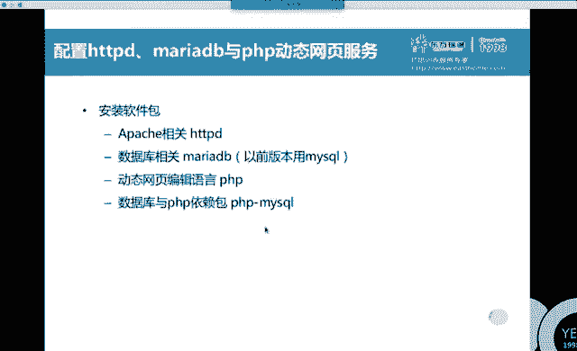