# 红帽Redhat RHCE7培训课程：P21：7 - 16688888


## 概述
在本节课中，我们将要学习NFS、Samba、脚本以及MariaDB数据库服务的核心概念与配置方法。课程将重点回顾NFS和Samba的权限配置思路，讲解脚本编写的基础，并详细介绍MariaDB数据库的安装、配置、用户管理及SQL查询语句。

## 回顾NFS服务配置

上一节我们介绍了NFS服务的基本概念，本节中我们来看看其配置的核心要点。

NFS服务在考试中主要考察客户端/服务器（C/S）架构的配置。其核心配置文件是 `/etc/exports`。在该文件中，你需要指定共享的目录、允许访问的主机以及权限。

以下是 `/etc/exports` 文件的基本格式：
```
共享目录路径 主机名或IP(权限选项)
```
例如，共享 `/sharedata` 目录给 `client.example.com` 主机，并赋予读写权限：
```
/sharedata client.example.com(rw,sync)
```

配置NFS服务时，需要综合考虑四个层面的权限：
1.  **本地文件系统权限**：使用 `chown` 或 `chmod` 命令设置共享目录的本地用户和组权限。
2.  **NFS服务权限**：在 `/etc/exports` 文件中通过 `rw`、`ro` 等选项控制。
3.  **SELinux安全上下文**：确保共享目录的SELinux上下文类型正确，例如 `public_content_rw_t`。
4.  **防火墙权限**：在防火墙中放行 `nfs`、`rpc-bind`、`mountd` 三个服务。

服务配置完成后，需要启动 `nfs-server` 服务，并设置开机自启。客户端则通过编辑 `/etc/fstab` 文件或使用 `mount` 命令进行挂载。

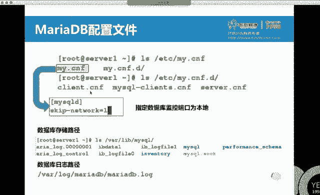

## 回顾Samba服务配置

对于Samba服务，考试重点考察多用户（`multiuser`）挂载的配置。

Samba服务同样涉及四个权限层面，但其配置文件和命令与NFS不同。服务器端的核心配置文件是 `/etc/samba/smb.conf`。

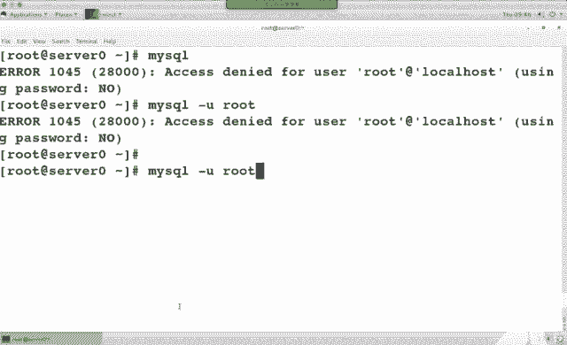

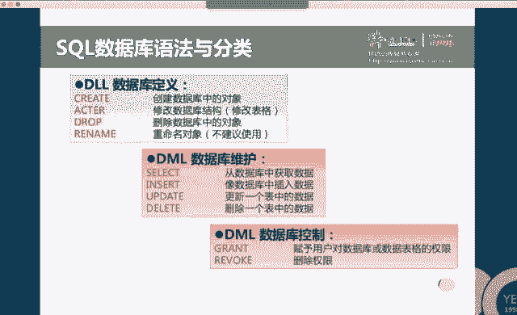

以下是配置Samba共享的基本步骤：
1.  **安装软件包**：`yum install samba samba-client`
2.  **编辑配置文件**：在 `/etc/samba/smb.conf` 的 `[global]` 部分设置工作组，在文件末尾添加共享定义。
    ```
    [shared]
        path = /sambashare
        valid users = @smbgroup
        writable = yes
    ```
3.  **创建本地目录并设置权限**：`mkdir /sambashare` 并设置合适的 `chmod` 和 `chown`。
4.  **设置SELinux上下文**：`chcon -t samba_share_t /sambashare`
5.  **创建Samba用户**：使用 `pdbedit -a -u username` 命令将系统用户添加为Samba用户并设置密码。
6.  **配置防火墙**：放行 `samba` 服务。
7.  **启动服务**：`systemctl start smb` 并 `systemctl enable smb`

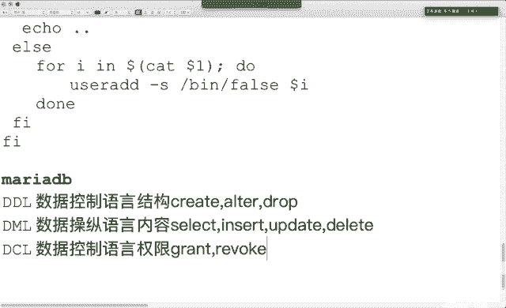

在客户端，配置多用户挂载的步骤如下：
1.  安装 `cifs-utils` 包。
2.  创建挂载点目录。
3.  编辑 `/etc/fstab` 文件，添加挂载项，使用 `multiuser` 和 `sec=ntlmssp` 选项。
    ```
    //server_ip/shared /mnt/myshare cifs multiuser,sec=ntlmssp,credentials=/root/smb.cred 0 0
    ```
4.  创建凭据文件 `/root/smb.cred`，内容为用户名和密码。
5.  使用 `mount -a` 挂载。挂载后，可以使用 `cifscreds add server` 命令切换访问身份。

## 回顾Shell脚本编写

脚本部分主要考察对 `case` 和 `if` 条件判断语句的掌握。

脚本的第一行通常是shebang，指定解释器：
```bash
#!/bin/bash
```

以下是 `case` 语句的基本格式，用于根据不同的输入执行不同的操作：
```bash
case $变量 in
    模式1)
        命令序列1
        ;;
    模式2)
        命令序列2
        ;;
    *)
        默认命令序列
        ;;
esac
```

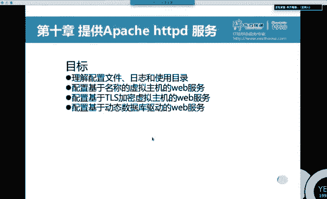

以下是 `if` 语句的基本格式，用于条件判断：
```bash
if [ 条件1 ]; then
    命令序列1
elif [ 条件2 ]; then
    命令序列2
else
    默认命令序列
fi
```

常用条件判断：
*   `$#`：表示传递给脚本的参数个数。
*   `$1`：表示第一个参数。
*   `-f 文件名`：判断文件是否存在且为普通文件。
*   `-z 字符串`：判断字符串长度是否为0。

例如，判断脚本是否无参数：
```bash
if [ $# -eq 0 ]; then
    echo "没有提供参数"
    exit 1
fi
```

## 学习MariaDB数据库服务

上一节我们回顾了共享服务和脚本，本节中我们来看看数据库服务MariaDB。

### MariaDB简介与安装
MariaDB是MySQL的一个分支，由MySQL的原始开发者创建，两者在命令和用法上高度兼容。在RHEL 7中，默认的MySQL包已被MariaDB替代。

安装MariaDB需要两个主要软件包：
*   `mariadb-server`：服务器端软件包。
*   `mariadb`：客户端软件包。

使用以下命令安装：
```bash
yum install mariadb-server mariadb
```

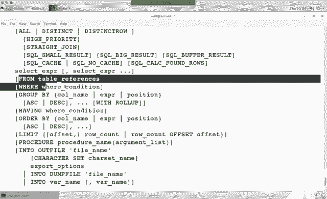

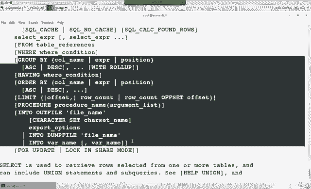

安装后，启动服务并设置开机自启：
```bash
systemctl start mariadb
systemctl enable mariadb
```

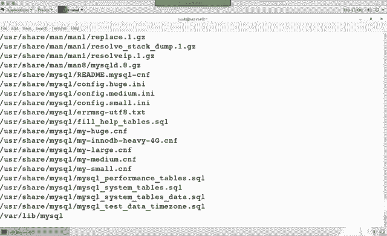

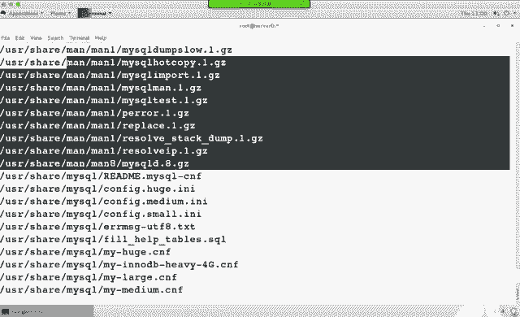

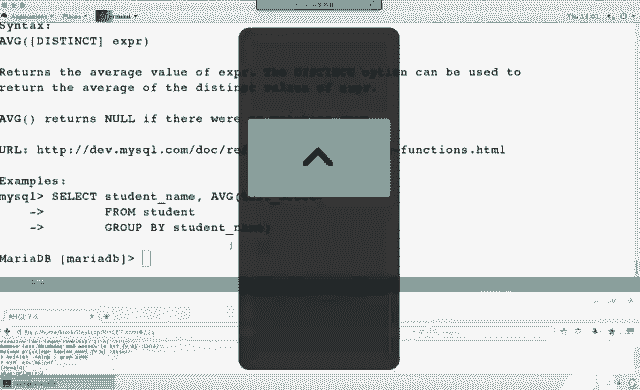

### 基本配置与安全加固
MariaDB的主配置文件是 `/etc/my.cnf`。为了安全，可以配置服务仅监听本地连接，在 `[mysqld]` 部分添加：
```
skip-networking=1
```
修改配置后需重启服务：`systemctl restart mariadb`。

初始安装后，root用户密码为空，存在安全风险。使用 `mysql_secure_installation` 命令进行安全加固，该向导会执行以下操作：
*   设置root用户密码。
*   删除匿名用户。
*   禁止root用户远程登录。
*   删除测试数据库。
*   重新加载权限表。

### SQL语言基础与操作
SQL语言主要分为三类：
1.  **DDL (数据定义语言)**：用于定义和管理数据库结构，如 `CREATE`, `ALTER`, `DROP`。
2.  **DML (数据操纵语言)**：用于操作数据库中的数据，如 `SELECT`, `INSERT`, `UPDATE`, `DELETE`。
3.  **DCL (数据控制语言)**：用于控制数据库的访问权限，如 `GRANT`, `REVOKE`。

以下是核心操作示例：

*   **连接数据库**：
    ```bash
    mysql -u root -p
    ```

*   **显示数据库**：
    ```sql
    SHOW DATABASES;
    ```

*   **创建数据库**：
    ```sql
    CREATE DATABASE mydb;
    ```

*   **使用数据库**：
    ```sql
    USE mydb;
    ```

*   **创建用户并授权**：
    ```sql
    CREATE USER 'myuser'@'localhost' IDENTIFIED BY 'mypassword';
    GRANT SELECT ON mydb.* TO 'myuser'@'localhost';
    FLUSH PRIVILEGES;
    ```

*   **查询数据**：
    ```sql
    SELECT column1, column2 FROM tablename WHERE condition;
    ```
    例如，查询产品表中供应商ID为3的产品名称：
    ```sql
    SELECT product_name FROM products WHERE manufacturer_id = 3;
    ```

*   **多表关联查询**：
    当需要从多个表中获取信息时，使用 `JOIN` 或直接在 `FROM` 后列出表，并用 `WHERE` 指定关联条件。
    ```sql
    SELECT p.name, m.name
    FROM products p, manufacturers m
    WHERE p.manufacturer_id = m.id AND p.name = '某产品名';
    ```

*   **使用聚集函数**：
    `COUNT()` 函数用于统计行数。
    ```sql
    SELECT COUNT(*) FROM products WHERE category_id = 2 AND manufacturer_id = 4;
    ```

*   **备份与恢复数据库**：
    *   备份：`mysqldump -u root -p database_name > backup.sql`
    *   恢复：`mysql -u root -p database_name < backup.sql`

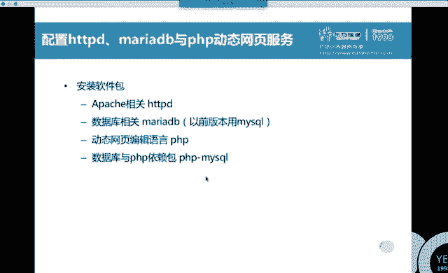

## 总结
本节课中我们一起学习了NFS和Samba共享服务的权限配置模型，复习了Shell脚本中 `case` 和 `if` 语句的编写，并深入探讨了MariaDB数据库的安装、安全配置、用户管理以及基础的SQL数据查询与操作。掌握这些服务的配置思路和核心命令，是完成RHCE认证相关任务的关键。