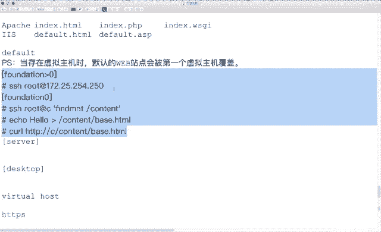

# 红帽Redhat RHCE7培训课程+RCHE7实战参考教程+红帽8.0教材电子版+模拟环境及辅导 - P22：8 - 16688888 - BV1zu41197p6

看一下第一道题，设值。外部服务器。在这道题当中啊，说从classroom上下载一个文件。文件下载下来之后重命名再去改名，然后呢，把这个文件放在你外部服务器主目录下。你要是按照这个提议来做的。

默认下载到当前目录。你在MV移过去，上一边关系是不是会跟着走啊，那你是不是还得去做一个re context操作？或者说 change着 context吧。那我可不可以直接Wge下载到指定的目录下呀？

可以吧，省得去改啥关系了。那么在这道题当中还限定一个权限，说谁能访问，谁不能访问。关于这个安全性啊，我们最后一个时间一个讲O吧。那我们先来看这个题怎么做。设置一个外部服务。那如果你是从上往下呀。

顺着说的话，配置默认的外边站点。和你配完W面俩之后，再去配熏主机。有区别有什么区别呢？我们有一句话。当存在虚拟主机时。当然。存在虚拟主机时。默认外部点会被第一个虚拟主机覆盖。默认。默认的。卖不赚点。

会被。第一个。虚拟主机。覆在。有这么一句话哈有这么一句话。那如果你还想让你的默认wifi在哪好用，你就再做一个虚拟机。第一个虚拟主机指向默认的版本量。那下面我们做的这个实验呢，就是来说明这个这句话。

大家看现象。如果你是按照这个提议啊，从上往下来做的话，你会发现做末认外部站点是这么做，做虚主是这么做。最后啊这个。你会发现按照提议这么来走的话，你第一个外边在哪没了。你这个还得再做一个吧。O。

我们来看一下现象。首先插包。嗯。第一个实验的装这个吧。已经安装了吧。然后啥配置文件，配置文件我也知道在哪了。我就不查了。在这个里面呢，我们需要去看几个东西。第一个。Document root。

跟VR3W。第二个。Diiry index。我要给你带个42钱买不。按照T的要求，他有没有说你的主目录必须得放在哪呀？没说吧没说的话，用默认总目录可不可以？可以吧？如果你不使用VR3WVR的话。

那么你还得去更改上下方关系。他得去设服务的权限。额外多做两步吧。考试的时候下午就三个半小时。那你做的步骤越多呢，这个时间越紧张。所以说我们用默认的目录。按照T的要求，他是不是让你下载一个文件？

这个文件现在有吗？在考试环境中默认就有。但是在培训环境中说没有啊。没有怎么办？我们生成了一个啊我们生成一个。他说这个文件要放在哪？classroom的count衡一下吧。classroom的考什一下。

在class room上。我们去执行一个fMT命令。你看一下classclass room content他干了什么事儿。他把谁挂在跟康城的下了？是不是防电线零的content啊？能看到吧？换句话说。

如如果你想在counttain下弄个文件出来，我是不是在仿对些零的counttain下生成这个文件，classroom的counttain下是不是就有了？I call。切换到管理员。Ile。

 hello。Cotain。叫啥名儿？被子点HTMM是吧？B是让也填满的。你这个弄完了之后呢，你去测试一下。是不classus room膜的。Conent他。背思点填满路。能理解吧。

是不是转了一圈转了一圈，我们这个呢是在准备试验环节啊，准备试验环节。都用管理员吧。これは。如果你用线上环境的话。如果你用线上环境吧。你是不是在纺卫身？0以外的机器啊。反正是零以外的机器怎么办？SSH。

可不可以登录访定权利啊？17225。254。250。能登录吧。登录了之后呢，是不是就跑到绑内线连上了？在房那这领上干什么呢？第一个。是不是可以用SSA身份登录classroom。

看classroom上这个路径嘛？然后你发现呢它挂载的是仿零的这个content。那你在访那是零的count的生成了这个文件，再去访问class room这个阿帕奇的主目录是不是能看到这个文件？

这倒是准备环境。环境准备完了之后呢。我们开始做server。和。但是个套泡的操作。OK吧。看看怎么做。首先。查包装包看配偿文件。那按照提要求是不是下载啊？W杠3跟O跟VR3WH3inex。

じ are H time up。从哪下载呢？其中给你的什么路径，你就复制什么路径。下载完了之后啊。你可以去看他一下。能看到吧？然后呢，启动服务。开机自动启动。测试。OK吧。这个是结果。

现在是不是做了一个默认买部站点啊？为了让大家把这个提议啊做的很清晰啊。我们呢来做虚拟主机。难做随逐记。跳到下道题。虚拟同机。当你访问外YAPP名的时候。YYAPP0是谁呀？也是420。

同一台机器就是2个DS名。我们说不有个命令叫浩斯特呀？你们在做实验的时候，如果你用的是 foundation8，是不是要把零换成8呀？这人是谁？是不4200。11吧。他是个蒂亚斯别名。

这个在考试的时候呢，已经在classroom上给我们配好了DNS。已经能解析了，直接用就行。不需要你们去配DS。O。它的主目录呢叫这个秒。默认我们的主目录是不是跟VR3WAT天买路啊。

如果这个路径不是在VR3W下。那么你需要去。修改上下门关系。第一个，你需要去做服务的权限，directoryrecur or granted。这两步都要做。万一你要是再跟VR3W一下。

是不是重建就完事儿了。继承出关系。然后呢，下载这个文件。呃，又是不是又提了一个文件了？extend，那你是不是也得弄个准备环境啊？准备环境怎么弄？回到服梯端。回到服务器端防电线0。是不是直接生成就行了。

直家商藏，比如说。威托浩斯特。跟 content。呃，X time的吧。Okay看吧。直接生成了之后啊，我可不可以用CRL来访问一下class room。content下的。X1 hereX1完。

能访问了吧。能访问了之后，回到服务器端，是不是实验环境又准备好了？按照T要求，如果你要做一个虚拟目录的话，如果你要做一个虚拟主机的话，你是不是得去也创建个站点啊？用这个文件放在指定的目录下。

按照题的要求怎么弄呢？安装完外包服务之后，你会发现在它里面呢是不是好多文件。一堆。我们这个实验是不是要做V to house的实验？有个词儿叫V号。大家看在右侧shadot下。阿帕奇2。

4版本中有没有一个config的文件？有吧，这个confi文件是在config点地下吗？不是，换句话说，算是不是一个失利不生效啊？在右erdo他目录下，只是有个示例，它没有生效。如果想让它生效的话。

怎么办呢？是不是把它拷被到指定的目录下就可以了？拷贝到哪呢？ETCHTTBDconfi点D目录下。拷贝过来之后。大家会发现这个文件中啊。好多内容。看到23到30了吧。这个是一组虚音机。

看到32到38了吗？这个是另外一组熏拟机，这个里面是不是俩呀？那按照题要求啊，我这个实验要做虚拟机。是不留一个？他没说让你做俩，只说让你做一个做一个虚拟机OK。把不要的内容啊删除。

第两个小G是不是删除到行首行啊？第一个大G是不是删除到尾行啊？那对于你的错误日自定义制有没有无所谓，对于你的管理员邮箱有没有无所谓，必须有的是这四行。那当天我这个虚拟机要监行的多少号是多少啊？说80吗。

你的虚拟机是不是要放在跟VR3W。没戳啥呀。然后呢，你的虚拟机叫什么名儿？外bAPP0点example点com。这个是不是一个虚拟机啊？做完了之后，你的文件夹存在样吗？不存在，是不是创建？

你的索引页数不存在？是不得下载？从哪儿下载呢？复制。下载完了之后，是不是要测试一下？谁晚。外吧APP凉。这是啥？怎么hello呢？不对呀。为啥呢？一で。我们看看历史啊。你刚刚改完了配置文件之后。生效了。

没问题啊，配置文件改完之后是不是得通行服务啊？O最后我再来测试。是不可以说house的？你看一下默认外边站点。默认外边在哪叫啥名？啊对。3W0是吧？Okay。8883W。

是不是第一个虚拟主机会覆盖默认外部站点设置？看到了吧，那我怎么让默认外边这点好用呢？依然是编辑。我们的配成件。4wifi是干嘛的？负责四行大批呢？粘贴在上面。

我们默认的外部站点是不是在跟VR3WATML下。你的主体名是不是3W0？我又弄了一组寻主机，对吧？现在那个是变成第一个寻主机了。因为你第一个新主机会覆盖默认web站点设施。而你这道题当中呢。

第一道题虽然说创建默认web站点，但它会被覆盖吧。你想想两个都生效怎么办？做两个虚拟主机，第一个呢就是默认外部站点。第二个就是熏主机。能看到区别吧。第一个是默认版分2，第二个是。他俩能感受下吗？不能哈。

为什么？默认外边哪永远是第一个。我听到啦。给你们看一下现象就理解了啊。我把服务重启一下。再次来测试。3W0是不是hello了。符合要求吧都生效。大家看一下，我访问的时候。这个走的是哪个站点？

是不是第一个虚拟主机呀？他之所以叫默认默认指的就是第一组。OK吧，有顺序啊，有顺序。大家在吃香蕉的时候，一般还是从哪边开始吃啊？是从头吃还是从屁股开始吃？有没有从中间开始吃的，没有吧，是不是有顺序啊。

有顺序。这个也是一样的啊，先是默认外fi点ok。那如果是按照考试题来做的话。第一道题虽然说是做一个外部站点。但是你后面这一堆啊全叫虚拟主机。虽然还没做到呢啊，但是告诉你们全虚主。既然存在虚拟主机了。

那么你第一道题也变成什么了？区域主机了吧，而且它必须得是什么？第一个默认的外部站点。OK吧，这第一个。这俩实项O了吧，权限我们都留在最后座，最后一个实验做。下面谁默认的。安全配置站点。

当你访问这个站点的时候呢，我想用443端口用HTPPS来访问。43端口用HTPPS来访问。那他是不是给我们提供了三个文件？一个证书量。一个私钥，一个公钥。啥文件吧？这个实验怎么做？安全的外部站点。

做这个实验的时候呢，你需要用到两个包。y历。HTTVD么么哒。啊啥S啥啊。如果这个报名背不住的话，星。moddes香。你看下面是不是好多帽子包。看到最后俩包没？那实验大包。ok。安装需要的包。

做完了之后。我们来看一下包里的内容。QL是干什么的呀？看报的内容一共几行？五行，那QC是干什么的呀？快着文件。大家看在阿帕奇的主配置文件有一个子配置文件夹是吧，是不是多了一个文件？OK你直接编辑就行。

看到第五行没？雷森443，我们原来在主配置文件中，有没有一行叫lay森80？OK加密的站点多少号数不一样。HTTPS。翻页。测试SSL测试命令。缓存时间超时时间。接着翻页，随机种子数。接着发。

内部加密自带的加密功能，看到56行没？这个词看你也面熟。说又一组虚拟主机呀。这个实验呢做的是基于端口的寻主机。大家看这个位置，冒号43吧。我们上一个实验中做的是我默认冒号80。是不是啊？那前面。

这个位置要修改，改成什么呢？行。它代表的含义是说，坚听你本地所有生效的IP。JIP上都减行43网头。那理解吧，本地所有I都兼成市场账号。往下翻看到59和60了吧。这两行生效了吗？没有。

你如果想让它生效的话怎么办？删除井号吧。那按照提议的要求。你访问这个站点的时候。HTPS和HTTB访问的站点是一样的吧。换句话说，他们的主目录主记名是不是都一样？主目录主机名O。

把我们的主目录默认是不是跟VR3WHTML。我们的主机名，这个实验中是不是叫3W0？3W0再那个蓝点com再往下。错误是日志级别跟你没关系，启用SSL跟你也没有关系。SSL的版本号协议。

SSR的加密算法。我一班。看到10百行了吧。SSL。certificate file证书文件。那这个呢代表是一个公钥文件，看到框名CRT了吧。公号文件我们给它改个名，3W。没有随便起。你起什么名。

一会儿是不是就下载那个文件，到这个目录叫什么名了？按照要求来走。一般我们接拉起的有意义的。这个呢key file key file是不是有私啊？工药对应的私药，我也给他洗个像3W。接着翻。

看到116行了吧。看到这个词儿没？我们在之前呢是不是讲过1个IP tables实验，其中讲过它有5个料吧。衬5个料吧啊称称什么意思呀？量叫证书量文件。为了让这行生效怎么办呢？删除型号吧。

后面呢写你的证书。我给你起个叫example杠C。名随便起啊名随便起。接着往下翻。剩下的内容啊都是默认的内容。我们简单来扫一眼。file directory是不是都是你的权限呢？不用管。

浏览匹配IE的日志的哎。到216行是不是一组区已经完事儿了。啊，这个加密站点说白了就是一组蓄一是吧？我们改了6处。配置文件做完了之后，你要干什么？重启服。哎，没起来是吧？为啥呀？他说什么？

他说在文件一0百0行啊一0行这么熟呢。这个文件不存在。啊，刚刚咱们是不是还没有下载呢？只是说我要用那个文件是吧嗯。O。我们这个文件呢起的名都比较特别。文件的位置吧？W get下载。

首先呢我要下载公钥证书。从哪下载呢？知个吧。从这儿下来。这是。啊。你们咋看着呢？对，手一嘚瑟，没嘚瑟过去是吧？小哥说个字。okK继续下载吧。另外一个文件叫什么名？是不是叫这个文件？复制。从哪下载呢？

这是不也告诉你了。接着复制吧。连贴。再然后。是不是还有一个叫证书链啊？销售量文件我给它起名，是不是叫什么example杠C之类的。W干。下载到这个路径下。从哪下载呢？这吧。接着复制。都下载完了之后。

这回我再重启服务。不报错了吧。测试。那测试的话，我们用COL接着用它来测。你看长什么样？HDDPS。3W0点儿exle点com。哎。😊，大家看它是不是出了一堆提示啊。他说这个证书的事儿啊，什么信不信任？

Not trusted。trust什么意思啊？信任闹腾是不信任是吧？为什么不信任呢？是因为他这个证书啊。跟123661样，是自己做的。你想培训环境，红帽可不可能去买个证书扔在里面让他做实验玩啊。

不可能吧，他是自己做的政。那这个时候怎么办呢？在最后一行，我们看到有没有个杠K选项。对我知道风险，我要访问啊，就这意思。呃，刚可。能发问吗？那为啥大家理解呀？我开个。图形。SSH杠X。杠X干嘛的？

还出行是吧，我们用。火狐浏览器打开。3W0。看一下长什么样。如果你用IE来访问的话呀，它会提示什么。证书的事儿。火锅浏览器啊也会提示证书的事儿，就是显示的风格不太一样。啊，这个站点啊是不被信任的。

这个链接是不受信任的，因为那个证书不在我的证书链里。那怎么办呢？我知道这个风险。添加排除。确认安全排除。能不能访问这个站点啊？可以访问吧。就IE也有提示，火狐浏览器有提示CORL是不是也有提示？

就加大选项不太一样。这个是加密版软点。加密外部站点，实际上我们干了什么事儿呢？安装了个包。然后呢，在配置文件当中是不是指向了三个文件呢？下载三个来件。在啊配置文件中，你是要监听星冒号443的。

主金苗主目录。主要干这么两个事儿。那刚刚呢我们做了一个默认外部站点，做了一个虚拟站点，然后呢又做了一个加密的外部站点。他们呢都是寻主机。都是徐主记。看下一个内容。我们看动态外部站点。

动态动态跟静态的区别呢，就是它里面的值一直在变啊，这动态。鉴听端口哎，这个里边是不是出现个新的端口啊？我们默认都好，是不是有809443，现在又多了个8909啊。8909。我们之前做的实验是8089啊。

89年9。考试的时候呢，不管你这个号到底是啥，会改就行啊，会改就行。在培训环境当中，我们有这么个文件。考试的时候呢，依然是Wge下载。如果你依然想实现Wge下载的话，这个得怎么做呢？我们来看一下。

首先我们去fin。这是 foundation。这个呢是4网。我们再去看一个叫class room的主题。在class room上。I254。Greing。有一个叫做外吧APP的脚本。这个脚本干嘛的呢？

大家看在戴斯top这个主机上。不能执行是吧，打印个fe显示不能执行，需要运行在server上。在server上，它运行的是什么呀？是不是个right AP的1个WSGI呀。Right A。

然后readAPP这个东西干什么了呢？ele写了个内容kite。49号能看懂吗？建行啥意思？是。里面内容。突然后就结束了。呃，两个手序号是不是叫定义终止符？大一号是不是看那个内容写入到这里？内容是啥？

下面这一堆。看到这个UF没？文件的内容是不是就到这儿啊？全是文件的内容。换句话说，这条命令的作用嘛，是不是就写了个文件，文件写到哪去了？当前用户的sdent数主目录吧。O。回头再来到你的搜er上。

我去干一个事，lab webAPP。小他。这条命令是干嘛的呢？是不是生成个文件嘛？这个文件内容是啥呀？就刚刚那堆一样。这个是用啥写的？拍死。python能读出来你当前系统的时间。能看到吧。换句话说。

我们在访问用这个东西来读的时候，它里面就是时间一直在变。时间显示什么呢？unix time is冒号。后面就是你当天一起变的时别。就是我们访问防页的时候啊，选这个hello，选那个维数 house。

这个呢就一直是这句话，就时间的变。那如果想来模拟更接近考试环境的话，你是不是应该也把它放在count目录下？OK吧，也放在康ton的蘑录下。我们可不可以通过。稍er。As covid。溜的。这个文件。

拷贝到哪呢？1325。0254。250。通过S0访问访对选择好吧。卡巴到行那是领的哪呀？看他能不录下吧。这个IP能访问吗？还不了是吧？他能访问奶个皮呀？他能访问的是0。250的IP。能看到吧？

但是你访问的时候是不得敲账号名密码？那我们从fo上往serv零访问的时候，是不要密码。As copy。我将。420上。Stilluddent。目录夏乐。外吧APP0点WSGI。是外边APP0吧。

APP啊，没有零是吧？把这个文件下载到哪儿啊？count啃一下。百分之百吧。拷贝完了之后。呃，如果你还想来做这个实验的话。是不是直接Wge就行了。dble get相的目录。

刚刚我们做的就是实验的准备环境。现在服务器呢是不是给我们准备了1个WSGI文件？我可以来做这个实验了。首先来看一下它头半部分。这道题考两个知识点。第一个知识点呢。8909。第二个知识点呢。

WSGI啊WSGI。两个实验啊两个知识点。我们先来看一下8909。所有的服务，首先第一步是不是都要去先查包啊？我们这个实验是不是叫W。SGI呀。咋呢。那个娃娃。安装一下。装完了之后。

我们是不是养还习惯看配置文件。阿RPM跟QC。然后你惊奇的发现呢，它的配置文件是一个模块的配置文件吧。我们学SSL服务的时候，是不是一个服务的配置面，不是模块的。那我不用QC了，我用QL。有配置文件吗？

只有个模块的配文件是吧，但是它下面也没有个readme。read me是啥意思？毒他是吧？嗯，给他买点药毒他。那么读度。给他来二斤砒霜。二斤砒霜有外的吗？没卖的。当然了，在虽然说在中国有万能的淘宝是吧。

啥都能买。砒霜买不着没事哈，你去买点螃蟹，然后买点西红柿。嗯，还就是砒霜。别一起吃哈。少吃点无所谓啊，多拉个肚子。那为什么吃完螃蟹人他们愿吃柿个？因为吃完海鲜的人呢都口渴。然后吃吃的还解渴是吧。

别去吃啊。一起吃也没事，吃不死。你要想吃死的话呀，你得买个几斤的螃蟹，几斤的柿了。要不然形成的这个替伤量不够，顶天拉肚子。OK吗嗯。想堵死也不容易。呃，像这个食物啊有个相克的事儿，尽量别去吃。

拉肚子是不是也不合算呢？好不容易给你发个几百块钱卖点螃蟹。都没消化，都给跑了。太浪费了。O。😊，那这段是不是说欢迎？翻页儿。啊，这段说文档的事儿是吧，接着翻。这段是不是说怎么装啊？我都装完了，接着跑。

接着烦。就说阿帕奇怎么配置啊？刚刚我们是不是看到有个叫模块的配置文件，已经配置完了，跟我也没关系。跟我们有关系的是啥呢？看它怎么启用呢？有咩钱。338。WSGI脚本的别名。当你访问myAPP的时候。

是不是知道这个文件了？看到没？别名WSJI脚本别名。接着发。如果是一个目录的话。我是不是可以做目录的别名啊也行。哎，没了。Right。这段内容当中啊，要求大家知道的实际上就这么两行。编码什么用？拜拜。

啊，那个别名种大小写是吧？大家嫌我们加个干啥呢？Byい。哎呀，这么多呀。那是不是空行开头啊？看到没？或者是。大W开头啊。你WW开头还有这行。能看到吧？所以说我们再过一个空行开头。怎么表示空行呢？

空格开头。空格。密室开头是吧？空了吧。这个是不是叫空格开头啊？啊，这上面也空个开头啊。那我们不这么写了。我们过滤。缝格开头。能看了吧？点星这么写行吗？你说都表示他们是。一个条件呢。能看懂吧？

你要不愿写这个东西的话，你是不是得这样啊？后面是字母空格。到底有哪种想法啊，看你心情。到地方哪样下看行，都一样吧。谁让我们想用的呀，就是这种写法。小本。OK知道这个东西怎么用了，我们是不是依然去下载啊？

我们把它下载到哪呢？刚O的话是不是叫做。下载另存为呀。我不想给改名，我只要把它放在指定的目录下。那么我用个杠P。大批是没用过是吧？放P放在哪？W位R3W加。这个目录下面在哪个位置，随便，你愿意放哪放哪。

为什么呢？大家想你这个文件呢，如果放在其他目录的话，是不是要考虑上下边关系，要考虑服务的权限。放在这个目录下，是不不用考虑这两个权限？从哪儿下载呢？呃，刚刚是不是让我们放在countton那下子。

有一象吧。在foundation的classroom的 content下。O。Cl classroom room。康慨。下面。叫这个名吧。下载成功了吧。下载成功了之后呢，你可以去看一下它的上下的关系。

如果想看上边关系的话，得加什么选项啊？大胃。看是不是H特的坡类型。然后呢，在我们主配文件中，是不是说跟VR3W都能访问？俩权限就不用管。上事儿。再之后。那我怎么让他可用呢？啊，我怎么让他可用？便辑。

换什文件。你在这个里面呢，我们刚刚是不是改过这个文件，也改过这个文件。你到底用哪个文件随意，你到底改哪个文件随意？那一般我的习惯呢是铭文的都放这个里面。密文的都放这个里面。是不是都分类呀？当然了。

你想再写个配置文件也可以啊也可以。下面做操作呀，放哪个配置分险里随意哈。呃，我放在这个配置面。你现在没是不是想再做一个虚拟主机呀？4YY大GP。再做一个虚主机，想今他宝号是多少？8909吧。

那我们在之前的实验中，不管是80也好，43也好，在他们之前是不是都有过lacent？你这个位置你应该写8909，那你是不是也得写个类型？第九行必须在第十行之前。你在前哪，我不管你可以在第四行第五行中间。

你可以在第一行前面。你放在主配证件里也行。但是你必须在我之前。那理解吧。在他之前，你这儿不勒损的话，这个位置写他不认识。他代表说监听哪个端口。OK吧，138年。在主配那文件里写了。

SSL那个是在虚拟机的上面la似443有印象吧？listen。O。你的主机名。按照提要求啊，你的主机名是不外边APP里啊？Soer name。这个不用弄吧，你的主目录。如果你做主目录的话。

是不是去做ind索引文件呢？而我们刚刚看到它的用法。它的用法长什么样？你要用哪种？是不这种啊。指向的文件吧。那这个麦APP什么意思呀？就说你在访问的时候。有吗？杠MyAPP。能看懂吧？这个叫别名。

那我们提中要求的什么？当你访问这个站点的时候，8909的时候是这个WSG源吧。那么访问这个站点。是不是就是这个意思呀？这个位置是个隐隐藏的杠嘛。换句话说，你别名这个位置是不是就写成杠得了。能理解吧？

杠是谁是。编辑。对其的目的是为了好看。不是非的堆齐。找粉儿。7。跟的别秒跟的别名，谁呢？我们是不是叫做VR3W。外bAPP点WSGI。做完了之后。现在服务能起来？起不来吧。

我们在之前是不是提到过一个SEman泡的事儿？我知道他起不来，那我可不可以直接我就去查。帮助啊。实力。那在这个里面我们要用的是谁？这行吧。嗯八都可以复制过来。多少来着？啊这个。8909。

这条命令是立即生效，是永久生效。都是。又是利益成效，又是一有成效。我们在确认是历经永久的话呀，你就看一下，我执行完了之后，现在已经生效了。我重启之后呢，还生效。OK吧，或者是说你去找到它的配置件也行。

生效了之后，我再次来重启。那起来了吧。下面说测试啊。这个好。爱拜APP点点儿example点com冒号8909。你会发现呢每次访问的时间是不是都在变？能看懂吗？刚刚我们做了这么一组实验。

是不是都没配防火墙啊？你想让其他人能访问，那么你要干嘛？这个是80啊。然后你是不是做了一个密文的站点啊？S吧。再之后你是不是做了个8088909啊？端口吧。然后是不是要让他立即生效啊？

一看不太保健的是吧？通过客户端来验证。这个啊。W0点example点comM。那方案吗？外爸ATP里。能发问吗？加密的外部站点再加个杠什么？刚可。能发问吗？还有啥来着？外bAPP0冒号8909。

能发问吗？都可以吧。这四个实验上做完了。最后一个实验。最后一个时间讲什么呢？最后一个时间讲的是安全。安全。刚刚我们在服务当中啊，是不是有段directory代表说服务的权限呢？他是说我将哪个文件夹共享。

共享出去之后呢，谁有这个文件夹访问的权限？那现在我想来做具体点，谁能访问，谁不能访问，应该怎么来做？我们来看下题意啊。这个域能访问这个域不能访问。看到了吧。能访问不能访问，这个咋做？

那这个实验中你需要用到的包。HTPBBman。抓完了吧。抓完了之后呢。我们用RPM杠QL瞅一眼。HテV manual。一堆吧。看到没有多少行文件？300多个文件。300多文钱看哪个文件呢？

我们当前用的是不是2。4版本。上一个版本是2。2版本，2。4版本和2。2版本它有什么区别呢？我们有一个叫做upgrading的文件。up鬼这个词儿啥意思？更新升级的意思是吧？平时我们看。

比如说我经常用QQ，然后今天发现QQ又更新了。那你是不是要看一下更新什么功能了呀？听着闹了按不规定一个意思。既然是1个HTML文件，很多人呢就习惯用用COUL来看COYL是不是具有简单的浏览器功能啊？

但是你这个文件真不简单了。这个里面标记很多，那我么得用什么看呢？没有。混狐浏览器来看。用火火的览气。那我刚要看的时候啊，猛然间发现这个主机名是谁呀？带差不0吧。啊，我这个服务器端应该在哪配？

是不是在丝万上配。哦。别跑错地方了哈，考试最容易错的地方。配着配着实际上都会配错地方，不得分啊。多看钱老师。多看题吧。O。朋友说来，我服务器端是不是要安装这个包和。这个包啊。这个包没装，是不安装了一下。

安装完了之后呢，我是不是要去查up不一定文件？我跟你说，我说我这差up呢。😡，up太多了是吧？upgrading就一个。然后呢，用火狐浏览器。我们把这个文件打开。图形。看到这一页了吧。他说2。4。从2。

2版本升级到2。4有了哪些变化偏质？F time。实时的上面是变异的，下面实时的。这个词儿认识吧？这词啥意思？我们之前是不学过奥斯坦贝GDK。验证吧。然后在下面这个词儿认识了。你。防问控制吧。

服务的权限。我把这弄大点。嗯巨大。往下翻。上面这段英文呢太多了，我看着迷糊。我看下面的示例。我们在之前呢看阿帕奇配置文件中，记不记得一个requi or granted。用一下吧。

跟文件夹是不是grant require or denied呀？OK这是全拒绝，这是全允许。那么在2。2版本呢是说。alder代表顺序得代，代表拒绝顺序先拒绝后允许，拒绝全部。是不是还没到允许呢？2。

2版本是这么写。如果你考2CE6的人证。在那个年代啊。好几年之前啊，三年之前你考2C16的人证是这么来入学。在2C期的时候呢，都是这么来做，为什么呢？因为阿帕7版本变2。4了吧，区别。继续。😊，呃。

这个是全允许。奥德尔先允许后拒绝，允许全部是不是全允许啊？大看下没。伟块浩斯特这个词儿翻译成中文叫。主机。但是我们会发现呢，它后面是不是写了域名啊？我们提一种要求是说那个域能返问，那个域不能返问。对吧。

那就是特尔奥耗斯他。写个主机名是不是能访问？如果在2。4版本之前，是不是这种想法呀？先拒绝后允许。全都拒绝，只允许他。全同学指于它RSC16的考试考度就这个东西。2316的考试。如果你会看。

这个HMR文件的话。这个权限的设置很容易。把事例复制粘贴进来修改就可以了。唯一的区别是不是就域名不一样。O。我们回头来。看一下这道题。在我们这个题当中啊。是。他说这个域能访问我默认外部站点。

默认外部站点是不是跟V亚3WATML啊？这是默认八分点，默认八分点点有没有权限？有没有？有。等问为啥？三个牙。3W。HTML。我为什么老要反斜杠斜杠反斜杠斜杠？因为在VI中斜杠是有特殊含义，查找吧。

看到131了吧，这一组是不代表我这个文件夹的权限？我默认权限是啥？看到156没？都允许吧。其一中要求的是啥？是不是说谁能访问？谁能访问呢？复制。粘贴。太能还了吗？他多少能等你吧。我认是全懂了。

这个做完了之后后，就只有他能发问。那我们题中是不是还要求的说谁不能发问？你再回来。不能访问怎么办呢？你往天上翻。在访问控制当中。你往上咱们控制是不是也属于验症？你看这个字体是不是更大一些？更大一些。

他说我们的验证啊有一个区域叫做安美纳奥奥啥意思啊？全匹配。那么呢。全部匹配。不以。都不匹配。全部匹配和全部匹配可能是一个意思嘛。虽然说是一句话，但是这个含义有点差异，是吧？所以说讲课的时候啊。

全部和全部都叫全部啊，全嗯。所以说这个说话挺困难，是吧？嗯。嗯か。都不匹配。艾美呢任意一个匹配一个就行。能理解吧。上面这三个东西啊，你随便点点谁都行啊，为什么点谁都行呢？我们进去看看。

它里面有好多的内容啊。哎，大家看这个词儿哈。😊，这个是不是说哪个组能访问呢？这个呢就是说哪个组不能访问吧。啊，那这个不能访问，是不是加个notote就行了。你说那个玉能访问，按，你说那个玉不能访问。

是不是叫他闹腾？并且你会发现在他他俩是不是在一组request标记中啊？奥的含义是说，他俩都匹配。能理解吧，都匹配按那个的话就是匹配一个就行。安匹配任意一个就行。那的话是这里面都不匹配，除了这里面的。

那你有含义吗？按照我们当前的提议，你应该用什么呀？应该用奥吧。我先不用啊，给大家看一下线下啊。但现在呀我是不是说允许这个玉呢？配置价改完之后要干什么？放牛钩。OK吧，然后呢也来测试一下。C哦HTTP。

3W0那个男朋友点comM。能访问吧。之后呢，我再来编辑配置文件。我加个note。如务重启。能起来吗？起不来了吧。你说谁不能访问，你至少得说要允许谁访问。你不能直接说不允许就完事儿了。你知得说谁允许？

在我们的服务状态当中啊，它会明确的说明。你必须有一些标记。n这个状态not这个状态必须在require标记中。到底是re克艾呀，难娜还是奥啊，看你的条件。能看懂吧？OK回头他来。😊。

那我们在这个位置是不是应该去添加你的标记呀？我们用5。22。我看到了。诶。今天听的是谁？Ctrol C。一。但为了好看的话，你可以让他来对齐。这个东西是不是放那个标记里啊？我们说要。允许。😊。

允许这个域吧。然后呢，不允许。Part。挂完了之后呢，服务是不是要重启？哎，起来了吧，这到测试。可以访问吧。你把里面两个值再改一下，然后发现你是不是不能访问了。ok啊，就说这个里面权限到底怎么写的。

我们是看帮助看的帮助上都说了，有实力照帮助来走。看下道题。能看懂吧。将原来的权限注释掉，生成新的权限。新的权限中因为有notote就拒绝，说必须得加标记呀。啊，这道题没有限制吧。虚主机。呃。

他说弗洛伊德可以在这个下面创建文件。弗洛伊德是不是得对，这个文件夹有写权限就行了。本地权限。看这道题。配置返还内容。在420上。m步服务器的document root下创建一个pre wait文件夹。

这个文夹呢从这儿下载的文件。这个文件也不存在，是不是还得去准备一下，生成的一个。再之后呢下载到这个目录，叫这个名。不要修改内容。在这台机器上，任何一个人都能访问。这个是不就专门考，就是服务的权限了？

他有没有说你这个pre wait文件夹是在哪个目录下？咱现在是不是有个跟VR3WHTML有个跟VR3W微戳浩斯特有俩文件夹吧，他有说是哪个目录像吗？没有你没有的话，两个都生常。肯定有一个对。能理解吧？

没有的话，两个都生手，肯定有个对。我们看这个时间怎么做。首先呢你是不是也要弄一个permission的A camera码文件出来啊？去哪弄呢？foition。I口。权限。选手。抗ton的。

Permission。你吧。他没有说内容是啥是吧？所以说你为了测试，随便写句话就行。OK回到服务器端。首先，创建文件夹。一个是HTML，一个是微托豪斯特。okK我们在这两个文件夹。H是TML。没说好。

是不是都要说那个叫play胃疼的那啥啊？然后呢，这个里面是不是要去下载一个index文件。W干。默认叫pro没神吧，你下载过来改名是不是用杠O不改名杠P当前目录啥不写。放在哪呢？跟VR3WH3ML。

三W鬼天白。到index点HMM。从哪下载呢？这不是这个路径呀。同理。把哪个改了？这个吧。是不是都有了？下面我们来测试啊。你这然做权限的话，怎么做？首先我们来看一下主配的文件。

记不记得那个根文件夹它的权限。有印象没？directory跟什么什么全拒绝全允许有印象吧，看那个权限。为什么要看那个权限呢？He right。你看这组权限也行。你看这组权限也行。

我们现在是是要复制一组directy？12344行吧。4YY大批修改就可以。这个权限你可以把它写在主配置文件里，也可以写在子配置文件里。那我们在做实验的时候啊，对于我们修改的内容。

建议大家把它放在子配这面里。不制。复制为一组吧。So。编辑。粘贴。十四行十5行到十八行是我们刚刚弄出来的。那么我们要求是什么呀？我们要求是不是说跟VR3W。HTML。priate文件夹怎么怎么样？

这不说谁能访问？只能自己访问吧。能看懂吧？你写的域名就是这个域，你说一些主机名就是这台主机。同理。我们是不是还有一个叫做。别吵啊。他俩只能自己来保问。自己的名吧。配置文件改完了之后，服务是不是要重启？

测试吧。这个时间在测试的时候啊，建议大家用浏览器来测火狐浏览器测。那我们来看一下。访问3W0。呃，瑞威特。哎，这怎么显示的是个目录呢？Yeah。这个目录下有那个文件吗？这是TML。没有。

咱们刚刚下载了吗？History。W不都干。呀呀下载哪去了呀？这个下载错地方了。看到没？应该下载到哪儿啊？pva文件夹里吧。嗯。你把原来默认都给覆盖了。这声闹。哎呀。我们先把原来的文件都弄回来啊。

NVR3WHMMLin点HML这个是不是默认的百0点啊？word在外不在哪，是不是那个叫b斯的文件。大俩恢复回一去啊。下错了，没事，恢复回去就行。然后呢。这个烫的。没错。我们要下载到哪呢？我们要下载到。

现在VR3W天ML和位。下载到这个目录下。漏肩别的差了啊。我这儿。复制commission。哦。同理。没错好。最后再来做测试。是。那法问吧。是不说除了自己都不能访问的。你去戴四套。2号。So啊。3W0。

Private。显示啥？权限拒绝吧，没发现。没有权限去访问。同理，你通过火狐浏览器也是一样的。Firefox。三大0。然后呢。回喂他吧。S。干的活呗钱没。是没权限。只有在4520上能看到吧。

就directory，它代表是服务的权限。那么对于这些题而言呢，用放糖做行不行？咁气啊。不行。为啥？你看第一道题。他说这个鱼能访问，这个鱼不能访问两网段吧。你给他发你不让他发了。然后呢。对于这个。呃。

这道题而言。他说只有自己能访问。能看到没？就是当他们这个权限有交叉的时候啊。你用防火墙会有歧义啊会有歧义。当然你非用防火墙做也行，因为自己反问自己的时候做防火墙嘛。不走吧，这也没事儿。

最后这个是说B寓当中所有主机都能访问，是不是有一块浩斯特呀？那法了。这个阿帕奇就这些实验啊，就这些实验。呃，好吧，这个时间给大家捋一遍哈。😊，第一个谁默认的外部单队。

你是不是应该去访对些零上先生成一个base文件了？然后解析3W0是不是就serv过0？放包。查配置文件拷贝。下载。查询upgrading。他不规定文件的目的啊，是不是为了就知道权限怎么写呀。再然后。

在V house当中是不是做一个虚拟主机啊？为什么上来直接做虚拟主机呢？因为下面的题是不是都出出现了虚拟主机？所以说你想让你摸认外边点声像，它就只能做虚数记。这个是直接写答案，没写为什么啊。然后呢。

又因为你说这个域能访问，那个域不能访问。原来的权限是不是得注释掉？你是不是新加个权限？为什么要加re out啊？你里面说有not腾。有非必须有主。有不能必须有能，而它俩同时存在的时候呢。

必须得有c这标记，到底是奥曼还是any，是看你的条件。奥是同时满足服务重启开一自动启动防火墙测试。OK吧，第道题。第二了题。第二道题是不就证书啊？插包。装宝看病软件。边界配这么念吧。第一个。

你是不是要改星啊？第一个位置。第二个。这两个东西下面是不是带个井号？你是不要把简号删除，让它生效。然后呢，你的公钥私钥，还有你的。证书颁发中心证书量。三个名，你到底起什么名，随便，不管你叫什么名。

到最后你是不是生成这个文件。要不然扶起不来。过滤了一下Wble get又过滤了一下Wble get。都下载出来了之后再重启能起来了吧。防火墙。确认。客户端呢。都那发了。再下一个实验，虚拟主机。

第一个实验和这个实验都是虚主机。那你是不是也要生成测试页样？叫什么名随便。下载创建文件夹。这个文夹默认不存在吧，你得重建。如果想让弗洛伊德有什么权限的话，是不是可以添加去设置权限？牵着帽子也行。

Wbleet下载索文页。再然后呢确认一下上海关关系。为什么呢？如果你不放在跟VR3W下。一定要注意多了两个权限，上下边关系还有服务的权限。要注意啊，还有个事儿。大家注意这个点点点是在上面在下面。

在微说耗s的上面是吧？默认外部站点永远是第一个新主机。永远是第一个。要不然的话，你访问S0，访问IP的时候显示都是第一个巡主机。ok。服卧重启。测试。

那我们会发现测试的时候是不是都建议大家用火锅来测试啊？你火锅测试的话，是不是SS杠X。Galax。访问内容。呃，这组内容啊我就给大家写了一个啊，就写了1个HTMR的priate。那如果按照这个提议啊。

他没有明确声明，你是不是应该在vi下面也生成一个pre呀？创建文件夹。确认。算什么关系。然后呢，不确认也行哈，下载编辑。我们是不是填了三行啊？

填哪三行directy directory这三行我是不是直接去主配文件里复制就行。可以直接写在主配文件中，允许学来访问。服务重启测试。自己的访问。你用带stop访问呢，访问不了。用s0的访问实验完成。

动态外部站点考的两个内容。那如果你只是按这个题的话来做的话呢，可以先赖个升成。亚麻安装。慢慢做。然后呢，拷贝。我这个位置直接给大家写拷贝了。如果你想来模拟考试环境的话。

是不是应该把这个文件拷贝到纺对是零的康腾的目录下呀？如果想模拟考试环境，需要拷贝。插包。看里林他read me的用法。老赖怎么用？我们主要是想谈的是这行。那么在这个配面中啊，一定要注意个lason。

他必须在这行上面。这行上面。服务名。你鸡名。配置文件改完了之后呢。编辑组配者文件。编辑主配文件。那这段内容啊。为什么要编辑主配置文件呢？因为。呃，在我们的主配置文件当中，有没有个跟VR3W权限呢？

而你这个文件又放在这个目录下是吧？最后一道题的权限。谁能访问？在这组d中间加上谁能访问就可以。默认是不是说都能访问。默认说都能发问。改一下。这不要把原来的这个内容给注释掉啊。内容不调。服务重启。

起不来吧。你是不是在SEmanage杠上那杠T呀？弄完了之后再重启能起来了吧，防火墙测试。现在完成吧。大概的思路。呃，关于RC的内容啊。就这些啊，RSRC的内容就这些。今天剩的时间呢。

你把阿帕奇的这四个实验完成。这四个实验是6个知识点。什么叫6个知识点呢？permissionation专门考的是directory权限吧。WSGI是不是得装1个WGI模块SCI模块，然后呢。

你的alies应用。AGDBS是不是装个帽子SSL？没说 house寻手机。那么当存在默认外包站点时。第一个默认外部站点是不会被第一个循主机会覆盖掉？第一个需主会覆盖掉。O。

这个下面的时间我就不给大家写了啊。你就你们要知道这个实验环境怎么准备啊，实验环境怎么准备。这个实间你们就看网页吧，按照网页的思路来做。

