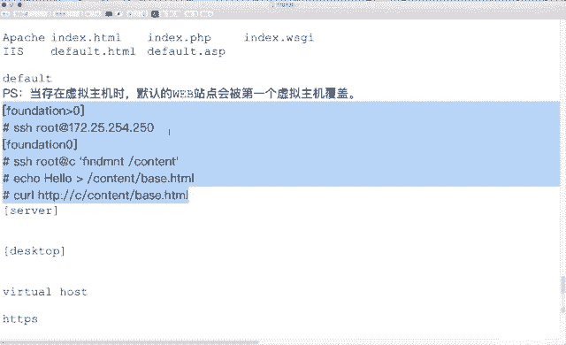

# 红帽RHCE7培训课程：P22：Apache Web服务器配置实战教程 🚀


在本节课中，我们将学习如何配置Apache HTTP服务器，涵盖默认站点、虚拟主机、SSL加密站点、动态内容（WSGI）以及访问控制等核心功能。我们将通过一系列实验，从基础配置到高级安全设置，逐步掌握Apache服务器的管理技能。

---

## 实验一：配置默认Web站点 🌐

上一节我们介绍了课程概述，本节中我们来看看如何配置一个基本的默认Web站点。

首先，我们需要安装Apache软件包并启动服务。

```bash
# 1. 安装Apache软件包
yum install -y httpd

# 2. 启动服务并设置开机自启
systemctl start httpd
systemctl enable httpd
```

默认的网站根目录（Document Root）是 `/var/www/html`。我们需要将一个文件放置于此目录下作为测试页面。

以下是操作步骤：

1.  **准备测试文件**：在实验环境中，需要从 `classroom.example.com` 服务器获取文件。其 `/content` 目录挂载了 `foundation0` 的 `/content`。因此，在 `foundation0` 上生成文件即可。
    ```bash
    # 在foundation0上执行
    echo "hello" > /content/base.html
    ```
2.  **下载文件到Web服务器**：在您的Web服务器（例如 `servera`）上，使用 `wget` 命令直接下载文件到目标目录，避免后续修改文件上下文。
    ```bash
    wget -O /var/www/html/index.html http://classroom.example.com/content/base.html
    ```
3.  **测试访问**：使用 `curl` 命令测试默认站点是否可访问。
    ```bash
    curl http://www0.example.com
    ```

**核心概念**：`DocumentRoot` 指令定义了Apache提供文件的目录。默认路径是 `/var/www/html`。

---

## 实验二：配置基于名称的虚拟主机 🏠

在配置了默认站点后，我们常常需要在一台服务器上托管多个网站，这可以通过虚拟主机实现。本节我们将配置一个名为 `webapp0.example.com` 的虚拟主机。

**重要提示**：当存在虚拟主机配置时，第一个定义的虚拟主机会覆盖默认站点的设置。因此，若希望默认站点也生效，需要将其也定义为一个虚拟主机，并确保其是配置中的第一个。

以下是配置虚拟主机的步骤：

1.  **创建虚拟主机目录**：为新的虚拟主机创建专属目录。
    ```bash
    mkdir -p /var/www/virtualhost
    ```
2.  **准备虚拟主机测试文件**：同样，需要从 `classroom` 获取文件。
    ```bash
    # 在foundation0上准备文件
    echo "webapp0" > /content/extended.html
    ```
3.  **下载文件到虚拟主机目录**：
    ```bash
    wget -O /var/www/virtualhost/index.html http://classroom.example.com/content/extended.html
    ```
4.  **配置虚拟主机**：Apache的虚拟主机示例文件位于 `/usr/share/doc/httpd-*/httpd-vhosts.conf`。我们需要复制并编辑它。
    ```bash
    # 复制示例配置文件到生效目录
    cp /usr/share/doc/httpd-*/httpd-vhosts.conf /etc/httpd/conf.d/
    # 编辑配置文件，保留一组VirtualHost配置并修改
    vi /etc/httpd/conf.d/httpd-vhosts.conf
    ```
    修改内容如下（保留关键四行）：
    ```apache
    <VirtualHost *:80>
        ServerName webapp0.example.com
        DocumentRoot "/var/www/virtualhost"
        ErrorLog "/var/log/httpd/webapp0_error.log"
        CustomLog "/var/log/httpd/webapp0_access.log" common
    </VirtualHost>
    ```
5.  **配置默认站点为第一个虚拟主机**：为了确保默认站点 `www0.example.com` 仍然有效，我们需要在虚拟主机配置文件的**最前面**添加它的定义。
    ```apache
    <VirtualHost *:80>
        ServerName www0.example.com
        DocumentRoot "/var/www/html"
    </VirtualHost>
    ```
6.  **重启服务并测试**：
    ```bash
    systemctl restart httpd
    curl http://www0.example.com
    curl http://webapp0.example.com
    ```

---

## 实验三：配置SSL/TLS加密的Web站点 🔒

为了安全地传输数据，我们需要为网站启用HTTPS。本节将配置一个使用SSL证书的加密站点。

这需要安装 `mod_ssl` 模块，并配置证书文件。

以下是操作步骤：

1.  **安装SSL模块**：
    ```bash
    yum install -y mod_ssl
    ```
2.  **编辑SSL配置文件**：主配置文件是 `/etc/httpd/conf.d/ssl.conf`。需要修改以下几处：
    *   确保 `Listen 443 https` 指令生效（取消注释）。
    *   修改 `<VirtualHost _default_:443>` 部分中的 `ServerName` 为 `www0.example.com`。
    *   修改 `DocumentRoot` 为 `/var/www/html`。
    *   指定证书文件路径（根据题目要求下载并重命名）：
        ```apache
        SSLCertificateFile /etc/pki/tls/certs/www0.crt
        SSLCertificateKeyFile /etc/pki/tls/private/www0.key
        SSLCACertificateFile /etc/pki/tls/certs/example-ca.crt
        ```
3.  **下载证书文件**：
    ```bash
    wget -O /etc/pki/tls/certs/www0.crt http://classroom.example.com/content/cert.crt
    wget -O /etc/pki/tls/private/www0.key http://classroom.example.com/content/cert.key
    wget -O /etc/pki/tls/certs/example-ca.crt http://classroom.example.com/content/cert-chain.crt
    ```
4.  **重启服务并测试**：由于是自签名证书，浏览器或`curl`会提示不安全，需要添加 `-k` 参数绕过证书检查。
    ```bash
    systemctl restart httpd
    curl -k https://www0.example.com
    ```

---

## 实验四：配置动态Web内容（WSGI） ⚙️

动态网站内容通常由脚本生成。本节我们将配置一个使用Python WSGI接口的动态应用，监听在非标准端口（如8909）。

以下是操作步骤：

1.  **安装WSGI模块**：
    ```bash
    yum install -y mod_wsgi
    ```
2.  **准备WSGI脚本**：从 `classroom` 服务器获取示例脚本。
    ```bash
    wget -P /var/www/wsgi-scripts/ http://classroom.example.com/content/webapp.wsgi
    ```
3.  **配置Apache以支持WSGI**：
    *   首先，确保Apache监听8909端口。在 `/etc/httpd/conf/httpd.conf` 文件中添加：
        ```apache
        Listen 8909
        ```
    *   然后，在 `/etc/httpd/conf.d/` 目录下创建一个新的配置文件（如 `wsgi.conf`），内容如下：
        ```apache
        <VirtualHost *:8909>
            ServerName webapp0.example.com
            WSGIScriptAlias / /var/www/wsgi-scripts/webapp.wsgi
            <Directory /var/www/wsgi-scripts>
                Require all granted
            </Directory>
        </VirtualHost>
        ```
    **核心概念**：`WSGIScriptAlias` 指令将URL路径映射到WSGI应用程序脚本。
4.  **调整SELinux策略**：非标准端口需要SELinux放行。
    ```bash
    semanage port -a -t http_port_t -p tcp 8909
    ```
5.  **重启服务并测试**：
    ```bash
    systemctl restart httpd
    curl http://webapp0.example.com:8909
    ```
    每次访问，页面应显示变化的Unix时间戳。

---

## 实验五：配置Web访问控制 🛡️

最后，我们来学习如何精确控制谁可以访问网站的特定部分。Apache使用 `<Directory>` 指令块内的访问控制指令来实现。

本实验要求配置：允许来自 `example.com` 域的访问，但拒绝来自 `example.org` 域的访问。

以下是操作步骤：

1.  **安装手册（可选）**：其中包含配置示例。
    ```bash
    yum install -y httpd-manual
    ```
2.  **修改目录权限配置**：找到对应 `DocumentRoot`（例如 `/var/www/html`）的 `<Directory>` 指令块，通常在主配置文件或 `conf.d` 下的子配置文件中。将原有的 `Require all granted` 注释掉，替换为精细的访问控制。
    ```apache
    <Directory "/var/www/html">
        # 注释掉旧规则
        # Require all granted
        # 新规则：允许 example.com，拒绝 example.org
        Require all denied
        Require host example.com
        Require not host example.org
    </Directory>
    ```
    **注意**：当使用 `not` 指令拒绝某些条件时，必须同时使用 `RequireAll`、`RequireAny` 或 `RequireNone` 指令来明确逻辑关系。更严谨的写法是：
    ```apache
    <Directory "/var/www/html">
        <RequireAll>
            Require host example.com
            Require not host example.org
        </RequireAll>
    </Directory>
    ```
    这表示必须同时满足“来自example.com”且“不来自example.org”。
3.  **重启服务并测试**：从不同域的主机访问网站，验证访问控制是否生效。
    ```bash
    systemctl restart httpd
    ```

---

## 实验六：配置用户目录与特定文件夹访问 🗂️

此实验要求创建一个名为 `private` 的目录，并确保只有Web服务器本地主机可以访问它。

以下是操作步骤：

1.  **创建目录并准备文件**：
    ```bash
    mkdir -p /var/www/html/private
    wget -O /var/www/html/private/index.html http://classroom.example.com/content/permission.html
    ```
2.  **配置目录访问权限**：在配置文件中添加针对 `/var/www/html/private` 目录的规则。
    ```apache
    <Directory "/var/www/html/private">
        Require local
    </Directory>
    ```
    `Require local` 指令仅允许来自服务器本地（127.0.0.1或::1）的请求。
3.  **重启服务并测试**：
    *   在Web服务器本机上使用 `curl http://www0.example.com/private/` 应能成功访问。
    *   从其他客户端尝试访问，应返回“403 Forbidden”错误。

---

## 防火墙配置 🔥

为了让外部客户端能够访问这些服务，需要在防火墙中开放对应端口。

```bash
# 开放HTTP(80)、HTTPS(443)和自定义端口(如8909)
firewall-cmd --permanent --add-service=http
firewall-cmd --permanent --add-service=https
firewall-cmd --permanent --add-port=8909/tcp
firewall-cmd --reload
```

---

## 总结 📝

本节课中我们一起学习了Red Hat Enterprise Linux 7上Apache HTTP服务器的综合配置：

1.  **基础服务搭建**：安装、启动默认Web站点。
2.  **虚拟主机**：实现在单台服务器上托管多个网站，理解了默认站点与第一个虚拟主机的关系。
3.  **安全传输**：通过 `mod_ssl` 配置HTTPS加密站点，使用SSL/TLS证书。
4.  **动态内容**：利用 `mod_wsgi` 模块支持Python动态应用，并配置非标准监听端口。
5.  **访问控制**：使用 `Require` 指令基于主机名、IP或网络进行精细的访问权限管理，并掌握了 `RequireAll` 等逻辑容器的用法。
6.  **综合配置**：完成了特定目录的访问限制，并确保了防火墙和SELinux策略的正确设置。



通过以上实验，您应该能够胜任RHCE考试中与Apache Web服务器相关的各项任务，并掌握生产环境中Web服务部署与安全加固的基本技能。