# 红帽Redhat RHCE7培训课程+RCHE7实战参考教程+红帽8.0教材电子版+模拟环境及辅导 - P2：2 - 16688888 - BV1zu41197p6

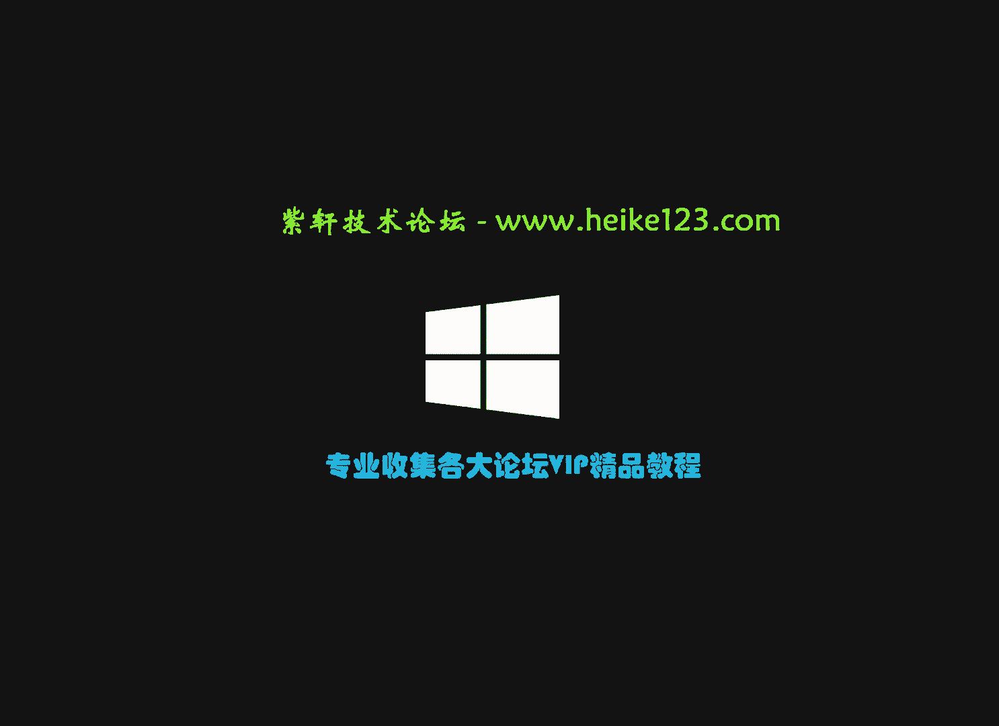

嗯。呃，工具栏儿。那下面呢我们来看一下K剑。在linux当中，推部键使用的频率非常高。开包键如果你用的很熟的话呢，你会发现命令基本上很困难去敲错。但是如果配播间用的不少呢，你会发现经常容易超速。

他不是就两个功能，一下是补全，两下是列出。他不仅仅可以命令不全。他也支持路径的不全。还支持选项的补全。还支持子命令的股权。对，其他。开播健。列出不全，它可以针对命令，可以针对于路径，可以针对于子命令。

它可以针对于选项。下面给大家举几个例子帮大家理解。我们首先来看一下命令。P s。逮捕。开宝。那如果PS不是唯一的，当你摁两下的时候，它会列出。如果它是唯一的。PSS以PSS开数命令为一摁配键补全吧。

叫一下两下的区别。那么不仅仅命令可以补全，我们的选项呢也能补全。看到选项了吧，pass word有很多的选项，比如说。啊，我们有一个。了。乐是什么意思呀？😡，怕个U。有来。锁定账号解锁账号啊。

只不过你当前这个用户啊。他没有权限而已。但是这个命令它有的选项一堆，一般情况下，一个减号是缩写，两个减号是个单词。比如说LO table线。也能不全吧，列出和不全。那么路径。路径也支持补全。

比如说跟跟下面有什么文件夹呢，我忘了。😡，看到没？有这么多文件夹。😡，文件夹的后面呢都带着写了，代表是说有下一层的意思有下一层的意思。OKVR，我敲个B黑后键。弄补钱吧。武权和猎夫。就是命令选项参数。

那么子命令呢，我们在。上午啊是不是点了个RT。VM controltl后面写的子命令吧。那个都是指命令，是不是也支持补钱的出啊？这是table键。开播店能做呀。整门课上最关键的一个内容配后键。

papo键如果你用手了之后呢，你会发现我们敲一个很长的路径的时候非常方便。非常方便，他能帮助我们去纠错。举个例子。活动用货吧。ASS。如果现在推不见。你得两下吧，列出。如果。摁一下。这是命令。选项呢？

KR34WD。选项他可以把选项列出来。L路镜。还有指命令，我们在仿定线上用个RTVMctl啊，还有指命令。然后说那我不想用那个紫命令，换个别的呢啊，再举个例子。😊，我们在后面的课程上啊。

会讲到一个叫NMC live的命密。这个命令很长啊很长table。看到没？我て屁。Table。是不是一击table出来的呀，我用不用可去背它的格式是什么？不用。你就知道NMS不用配波键。

table table就出来了。按 table键来实现。那对于NMCI命令而言。这个是我们在。后面的课上会讲他具体用法。他的功能啊就KIP地址。PIPD时我们会讲四种方法，这个是其中一种。

那这个命令很长，有很多子命令，子命令当中还包含子命令。如果你能把它的格式背得住啊，说明你挺厉害嗯。没必要背啊没必要背。用的时候会用推播键就OK了啊，NM3Y再或者呢会去查慢手册，慢手册当中有施例。

把实例复制粘贴过来也可以。来个方法。这是K键。嘘。那么大家看hory。黑ory这个单词啊翻译成中文什么含义？这不就历史啊，它就是一个英文单词，就是历史的意思。hoitoryory的作用。

他可以来查看历史命令。什么要查看历史命令呢？你之前都干过什么？😡，你之前都敲过什么命令？啊，我们看一下吴动管理员都干了什么事儿。😊，现在命令大家眼熟吧，刚刚敲过的，然后呢。

看一下student之前都干过什么事儿。😊，之前敲过的吧。那我们会发现每个用户他们的历史命令是不是各不相同啊？各不相同，而且呢这些历史密令都保存起来，默认都是保存起来，保存在哪儿呢？用户宿主目录下。

大家看有没有一个这个文件。そ。呃。你们这么看不全加个乐吧。大家能看到这文件吗？这个文件名前面有没有点？有吧。那这个文件代表的是隐藏文件。在Lux词当中，文件名如果以点开头代表隐藏文件。

在微软的系统当中是通过属性来控制吧。文件是混一藏let置文件名，文件夹名。是否隐藏？这个里面呢是历史秘令。那我们重新去瞅一眼。有条命令叫cat。tk的含义啊是中文什么意思？猫。

猫它的作用啊是看文片的内容。那猫给我们最大一个特点就是没事，瞪俩眼珠到处上看是吧。😡，到时候咱看看人家的内容。看点这个文件。大家看这个文件的内容跟我刚刚黑ory看的内容一不一样。啊。等同学说一样啊。

我们看一下后五行哈。😊，很脆。Yeah。一不一样？不一样。这不一样啊不一样，为啥？你黑推是看缓存中的历史命令，当用户注销之后，他会把缓存中的历史命令写到历史文件。知道的。我也是不一样的。😡。

那你想R的话直接变成一样怎么办呢？😡，黑ory杠A。这二目呢是说将缓存中的历史命令立即写入历史文件。那么写入了之后，我们再来看。这个是倒数5条。这个是85条。😡，你看一下。黑腿刚刚往上。切。压巴了吧啊。

黑腿杠A的作用。那么我们hat命令相对应的杠C。杠C的作用是什么呢？可粒。可利尔清除吧。你看反诉中的的沈婷玲还有了吗？没了吧。杠C是可丽尔。口袋是哪个词儿啊？😡，可乐的作用是什么？清平啊清平。

我在给你们讲实验的时候，是不是经常去做清屏的操作呀？我敲可粒尔了吗？没有，我的是ctrl加了。可乐中间那个乐。为什么不ctl C呀？😡，填证C是cl被占用了是吧，就变成扔了。证明。办案后。

在历史命令当中。有很多的命令，我现在敲个叹号C。括号C的作用啊是执行最后一次以C开头的命令。是不是也是清贫啊？再或者是。叹号4。第四条是干嘛的？也是可粒是吧？叹号四也是清屏。

这是factorory的用法。没这。这个里面有几个知识点。第一个知识点。还可去查看历史目的。缓存中的历史能力。第二个知识点。黑特大黑将缓存中的历史命令立即写入历史文件。历史文件在哪呢？在用户的主目录下。

每个用户总目录像，只要是他执行过命令，都存在这个文件。用户只要一注销自动保存。如果你不注销的话，可以用第二行的命令杠A立即写入。那么这个文件呢，它是隐藏文件。阿莱杠A你能看到那斯当中隐藏文件。

文件名都与甲开头。赛尔号。用黑吹当C命令。可以清除缓存中的溺水灭令。清除了之后再飞推，是不是看不到了？嗯，那就没有了。😊，那么C对应的单词呢就colli，我们直接敲colL命令，什么结果？蜻蜓吧。

那我要 controlttrol加L键，它也是清屏。功能相同。这个组合件我们平时工作中啊使用的频率非常高，为什么？大家想你在敲一组命令的时候啊。😡，如果文本缓冲区在最下面一行，你是不是得低着头看呢？

脖子难不难受？我们的习惯呢是不是抬头看呢脖子能舒服些吧。😡，这是蜻平的作用啊蜻平作用。叹号加C什么作用啊？と。这将最后一个以C开口的命例，然后叹号加上数字呢。执行历史命令当中那那行。O吧。

这段内容讲的是history。历史。我们上学的时候学过历史课吧。历史课主要讲什么呀？林史哥主要讲哪年发生了什么事儿。😡，你说那个事儿跟你有啥关系？😡，穿越的时候能用的。等哪天呢一不小心你也穿越了啊。

能用上。买个彩票啥的是吧？但是你要不穿越的话，那神经不胖。这组谁案有问题没？那个是吧。这组实验讲的是history。Yeah。

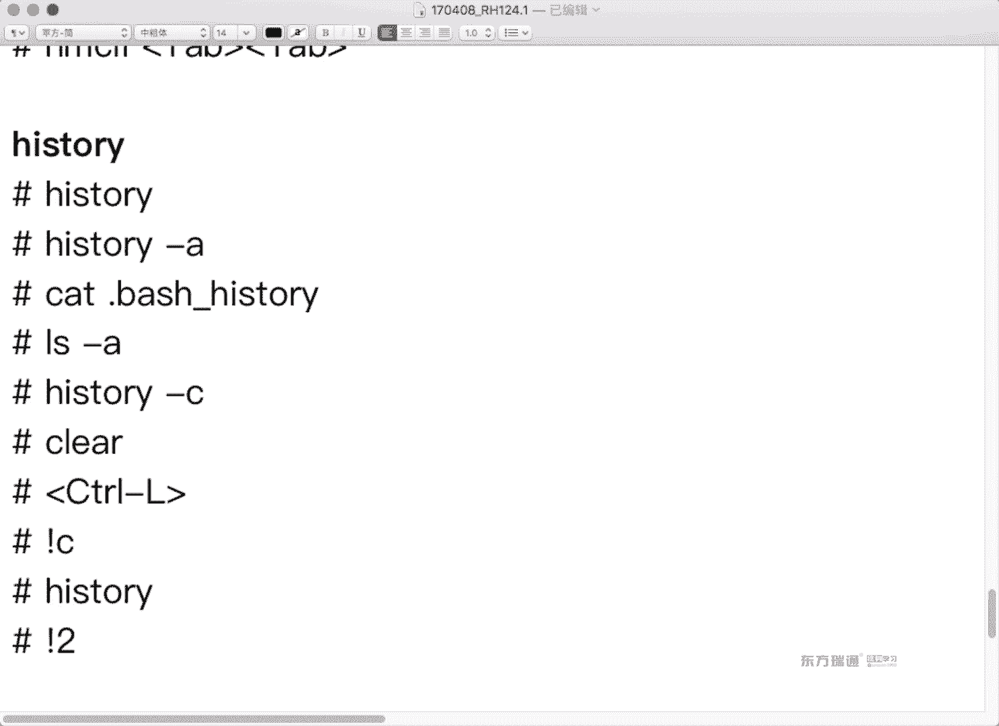

我们继续。

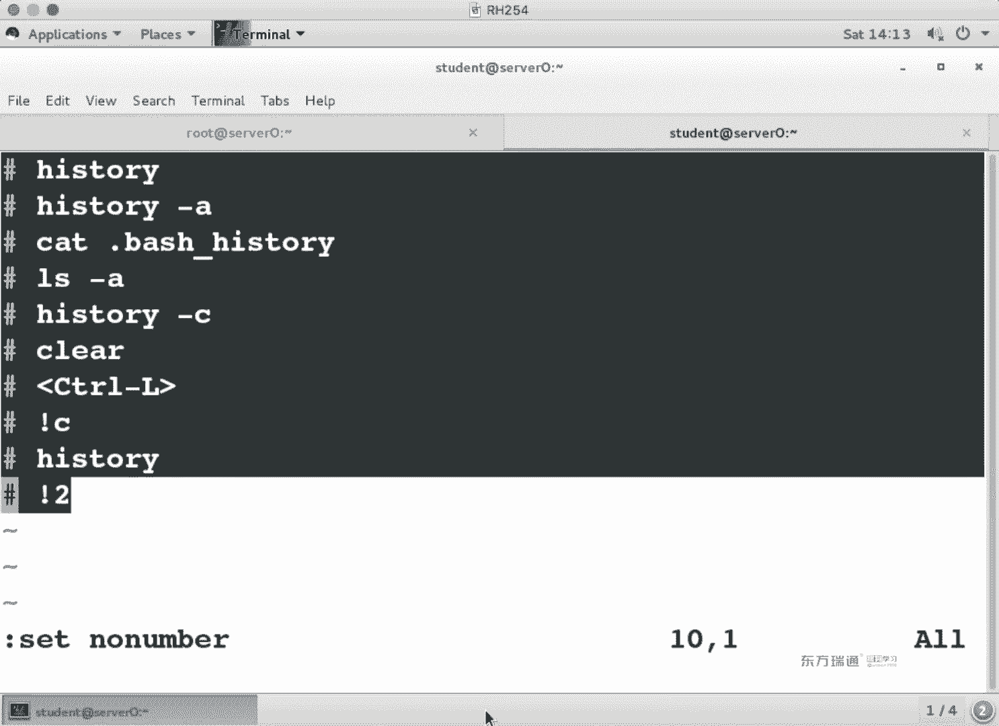

没有。一不小心把第一章讲完了是吧？啊，这堂们还有点时间，我们讲一些快捷键。我们在之前的课程上啊讲到了。😊，Ctrol C， controll Dcontrol L。这些都常用的快捷键。那还有。奥特句号。

或者是ESC。几号。他在作用什么呢？我看一下。看一下啊。比如说我创建了一个文件夹。没权限是吧？换个人。换成管理员。我现在是不是想骑到前面这个table啊？😡，奥特一。能看到吧。

我们之所以开多个table播的原因。因为这些table啊，他们是固定的，al一就是第一个table，al2是第二个table很方便了。😡，很方便。当我创建完一个文件夹之后，我是不是想进入到这个文件夹啊？

CD。😊，你把路径再敲一遍，我可不可以这样斜杠操dertableable键可以吧？可以用tableable键来实现，还可以怎么样呢？还可以。😊，一下子出来了吧。

alt加句号alt加句号或者是是ESC加句号。那2次加句号ESC加句号功能什么呢？将最后一条命令。最后面的单词。拷贝到光标所在位置。光标现在在哪？在CD的后面吧。我拷贝谁，我拷贝他。out特句号。

说话就出来了吧。马小同学在用VNC的时候，发现哎，老师没这功能啊，那是VNC的事儿啊，马有VNC想有这功能怎么办呢？摁一下ESC键，松手摁句号。😊，大家注意我这两个格式的区别。他俩是不是说一起按呢？

能看懂吧？按alt键，摁住了，摁句号。后面这个呢有先后关系，先按水。也是。这样就好。都可以啊都可以。它的功能叫做自动拷贝。自动拷贝。上一条命令最后一个单词。粘贴到哪呢？粘贴到当前光标所在位置啊。

当前光标所在位置，这个功能用的频率非常高非常高。你们后面在做实验的时候啊。接下我遇到这样情况，下载个文件。然后呢，又把这个文件干什么。😡，会遇到这样的情况，创建个文件夹，要进入到这个文件夹。

创建个文件夹，要把什么东西下载到这个文件夹，反复的利用上一条命令最后一个单词啊。NESC键加句号，offt键加句号。Cttrol U controll K。123456，我把光标挪到山上。很超优。

光标删除删除光标前所字符。光标依然在3上ctrlK。删除光标后色个符。这两个组合键当中啊，cttrolU用的频率非常高。U代表是R。K代表是Q。大家想，我在敲条命令的时候啊，经常会遇到这条命令。

定想要了，想重新敲另外一条命令，那你是不是可以control you写新的命令呢？再或者是说我们之前是不是讲了一个conttrol out。F6。

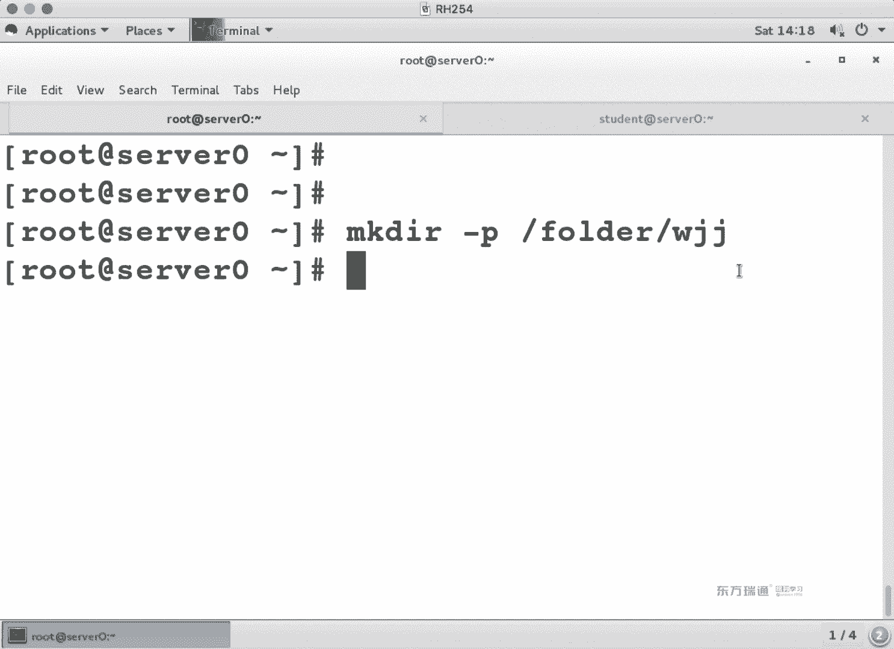

切换到字符终端吧，在字符终端下，你能不能敲用户名？😡，然后是让你敲密码。我在敲密码的时候。你能看到密码超了几位吗？手一嘚子敲错了怎么办？看超油。输入正确的密码。能看出区别吗？

当你输入密码不知道输错多少位的时候，正常人的习惯是什么习惯呢？😡。

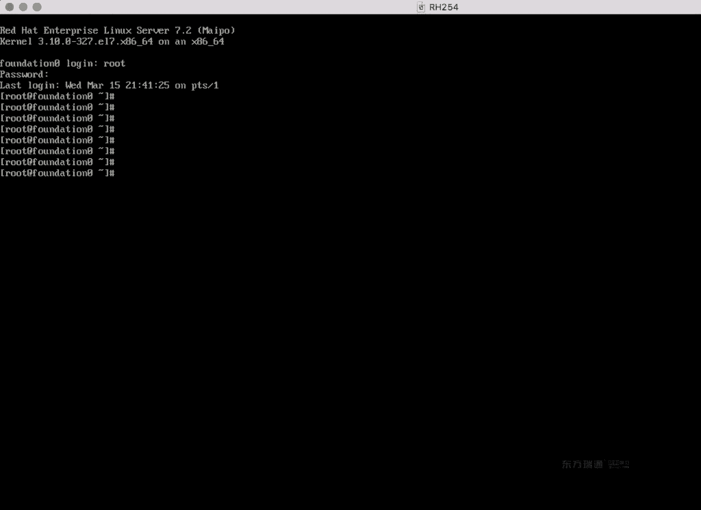

按退杆键是吧，按几下。😡，按1加5肯定好用是吧？😊，安妈放学。当然了，这个挺累的一件事儿啊，所以说我们怎么办呢？肯重优是最快的。ctlU这个频率用的非常高啊。Yeah。有同人说。

那controlU用的频率高，你为什么要跟我们讲ctrol K为了做对比记忆。😡，顺道记一下，当然记不住无所谓哈，记不住无所谓嗯。好，我们继续。那在这个历史命令当中啊，上下方向键好不好用？依然好用吧。

上一层命令啊，上下方向线依然好用，通信就不给你们写了啊。商下还原店。那我们继续。我们之前学过这样的命令。在 foundation上。你是不是可以通过这条命令去干个什么事儿啊？比赛。然后呢。一个内容。

收费单这个事儿。那现在我想把so给改了，改成单词topconttrol W。W代表什么含义啊？单词。Work啊 work。那我再敲个D table见。那你会发现呢一条命令可以很方便做修改吧。

看方卖给我修啊。ctrol W删除光标前那个单词。ctrorlW删除光不标前那个蓝。Yeah。我在。在讲解第二门课和第三门课的时候，我们会用到这样的命例。好了。这条命令的作用啊是重启个服。重启一个服务。

那我现在不想重启它了。😡，我想把光标挪到前一个单词。很臭家族。看臭家子。controrl加族文号区别吧。光不要挪到前一个单词，后一个单词。砍套左右。那如果你不想把这个服务重启，你可以cttrol锁。

然后ctrolW再 enableable。我可以很方便的去改某个使命令。ctrol左右和W都配合。conttrorl左右。砍超左右用的频率也非常高啊，为什么？举个例子哈。大家我们在敲命令的时候。

比如说我要创建两个文件夹。如果你要用方便面来移动的话，你是不是得一个一个移呀？你开罩家左右是不是很快呀？😡，OK吧，还有同学说了，我光刚怎么在行首和行尾之间跳转呢？A和E。A代表什么呀？好。嗯ok。

A代表是头。一呢？美。尾吧结束。Cttrol Acl E。咱们再讲个好玩的啊。😊，你们能看到我敲什么吗？😡，不能。你们能看到我敲的是什么吗？能看到吧。Cttrol S controlrl Q。

那么在信有当中啊。如果。你不想让别人看到你在干什么。😡，你就S一下。如果你想让它执行了，你就ctrlQ。退出停止状态。那这个东西有什么用呢？这个东西有什么用？你旁边站了一个人。你现在去敲的命令。

不想让他看到。弹出S敲命令吧。穿完了之后，ctlQ，然后ctlL。能听到吧。什么概念呢？你旁边站了个人之后啊，肯出S，现在敲的命令书都看不到。clQ是不是出来了？顺手啃出L一下，谁知你刚才干的什么事儿。

能理解吧？但是你旁边有个人站着，但是你干的事儿不想让他看啊，你要这么做一行。有的说老师，那黑锤里面有啊。😡，我们讲没讲过hory杠C。没了吧。现在说于没了。能看到吧。如果你旁边站人的话。

肯定还肯定是会用到。那你旁边不站人的话，这个你可能一辈子用不上。当然了，S和Q这个东西啊，你得会盲打。不会盲打的话，你也用不上。😡，对。不会妈打，你知道敲的是什么吗？对吧？他黑妈打。😡，啊。

这两个就是知道就得了哈。一般我们很少用，为什么呢？因为一般你在服务器上做操作的，都是能看得见的。😊，很少用。但是你们在做实验的时候啊，为什么我非要给你们讲？😡，你们一会儿肯定会用到。

好多人呢在word当中，office办公软件里肯S什么作用？保存吧。你坐着做段时间可能一顺手，因为这个肌肉记忆啊太痛苦了，知道吧？手一嘚嗦，哎，老师，我这个终端不动弹了啊，ctroQ一下，OK吧。

你们之后做实验室经常问的一个问题啊，先给你们讲了。😡，ctrolS暂停ctrlQ退出暂停。那这些快捷键呢能记住最好，记不住也没事儿。你要是记住的话呢，就多用快捷键没有备注的，都是多用啊，多用不记住了啊。

不用特意备养。叫快捷店。呃，对于第一章而言吧，有没有考点呢？你说有也有你说没有也没有。就像快捷键是一样的，有同学问我说考试的时候，快捷键考不考？你要用的话就考，你要不用的话就不考，没有专门那么一道题。

是考科学件。😡，OK吧。那为什么我要给大家去讲快捷键？😡，快捷键如果你用的熟练了之后，它是不是能提高我们的效率，节约时间呢？考试的时候时间是固定的。那如果效率能提升，你是不是可以去完成更多的题呀？

对于RC7的考试而言，他和六的考试啊，主要的区别就题量变大了啊，题量变大了。那么既然题量变大了，时间增加了，可是还有人做不完啊，还是有人做不完。简单来说就不熟。所以我们在。百度盘当中啊，还有两个文件。

还有两个网页文件。一个叫CSA7，一个叫CE7CE7两个网页文件。那么这两个网页文件呢都是考试类型题。考试类型题，知道什么叫类型题吗？考点是什么啊？考点是什么？😡，比如说考试的时候会有这道题耽误错密码。

但是考试的时候呢，密码不是这个。😡，是改成另外一个，别的都一样。😡，能听懂吧？整个实验配置思路是一样的。那么这道题啊是第二门课的内容啊，第二门课的知识点。O。😊，啊，回头来，我们看第二张。😊。

命令行管理文件好，命令行。这张当中，首先呢你需要知道我们有哪些重要目录。简单来说，文件夹作用是什么？然后呢，明确绝对路径和相对路径他们的区别。绝对路径相对路径他们的区别。再然后一组命令。

这组命令啊主要是来讲解啊资源管理器的使用。文件的管理啊文件夹的管理。再然后呢。我。通配符啊，或者叫正则表达式。通篇符或者正则表达式。这张内容。那我们每天的进度啊一般是3张左右。第一天可能会讲的慢一点。

就讲两吧啊，第一天。正常每天是3张啊。很少有一天讲四档的啊，基本上没有，除非是前面讲太慢了。O。那么今天第二章讲完了。呃，看看大家进度，要是能跟得上，再讲点，跟不上就不讲了，OK吧。😊，嗯。

首先我们来看一下目录。那看第一个目录啊，跟。跟目录。在微软的系统当中啊，我们怎么来表示分区啊？咱们来表示。そ。含服吧。什么爬符来表示分区啊，C盘D盘啊爬符来表示。那问大家一个问题啊。😡，好懂。

你们在使用微软产品的时候。😡，如果盘服不够用了怎么办？潘佛一共多少个字母啊？A love税。26个。那我现在27个分区怎么办？😡，18点。啊啊在微软的产品呢，有个叫NTFI分区。😊，这知道吧？

NTF分区有个特性，就说当你有一个新的分区不够power分的时候，你可以把那个分区挂在这个NTF分区下面的空文件夹中。当年访问这个文件夹的时候呢，访问的就是那个分区。这能听懂吧？

微软的产品是当你的盘浮不够用了，那么我把我这个分区挂在一个文件夹下。微软的产品那那个是不管你帕s够不够用，我们就是挂在文件夹下。😡，就是画在文件夹下。那那个事当中有一个根程区。啊，钻进去。写到。

这个看不着是吧？拽一拽。这个更新区相当于在windows当中C盘啊，windows中C盘。那你可以把某个分区啊挂在某个文件夹下，当然访问那个文件夹访问的呢就是那个分区啊，就是linux。

为什么linux当中。😡，不用盘符的概念了。你在CMD当中先切换盘符的话，怎么切换的？C冒号D冒号是吧？然后是不是在CB到某个文件夹啊，这是微软的产品。那我们在L当中都是斜杠CD斜杠某个路径就完事儿了。

没有盘符的概念，更高效啊更高效，不用额外去切换盘符啊，这是我们的路径跟。在了那个字当中，至少有个分区就根分区，根分区专门是来安装系统。那我们看下面一堆文件夹。为了帮助大家理解呢。

我们分类来记忆第一组home。Root。😡，跟home下爱丽丝，跟home下鲍勃，跟home下E务，这个是三个用户的宿主目录。三个用户的主目录，但root呢是root用户的主目录。

他们都代表用户的主目录，只不过对应的人不一样啊，就是你家住在哪啊，你家住在哪？第一组。Okay。开空。大家看一下。跟 home student。这个是st那用户的主目录，它属于哪个用户，哪个组啊。

16任那用户16的他组。能看到吧。就是说你买的房子属于谁呀？属于你和你家。你家人是谁呀？😡，直系亲属。大家听过继承权吧。啊，继承法就是直系啊直系。OK那么根 root它属于谁啊？入的用户入的组。

能看了吧。这是他们的总目录。这是第一组。用户的总目录。第二组。嗯。ETC。喂娅。ETC这个词翻译成中文什么意思？等等。一对一。等等一堆。什么玩意呢？它有点类似于windows当中的windows文件夹。

windows当中的windows件家。在linux当中，几乎所有的配置文件。都在给你提示一下。几乎所有的赔偿文件。我们在后面不管是讲分区也好啊，讲用户也好，分区管理，用户管理还是在做服务的时候。

你的配置文件都在跟ETC下。这个路径是你使用频率最高的有路径啊，跟ETC配置文件夹。那妈和他相对应的呢，叫跟喂娅，跟喂娅我你讲。和主配置文件相关的文件都在跟VR下VR叫做variable啊。

叫参数文件夹。参数文家中我没用比较多的呢叫log个啊log个日，每个服都有日志。第二组。ETC和VR。那我们会发现这两个玩家都属于谁呀？root用户root组。是不属于管理员啊，别人没权限啊。

别人没有写的权限。第二组。GETC是我们在整门课程上啊，这12天当中使用频率最高的一个文件夹跟ATTC啊，配置文件。给你们举几个例子啊，比如说你在做分区实验的时候，你要去编辑1个FI table文件。

他在这个目录当中。比如说你在学上巴服务的时候，要去编辑一个s巴的配置文件。也再跟你T示一下吧。再比如说你要去做共享。然做一下Apos文件，是不是还在给你提示一下？整门课程上你几乎所有的配置。

不管是服务的配置还是系统配置，文件都在跟ETC目录下，这个是我们用频率最高的。那么跟VR文件夹呢？大家看一下这个里面。看到logg没？日志是吧。整个系统的日志所有服责人日志都在loglog当中。

看到没有？邮件吧。所有用户的邮件都在这个目录下。所有用售文件都在这个目录下。🤧和主配置文件相关的内容。下一组。Theバス。跟dice。关MNT跟麦点。d外这个文件夹啊翻译成中文叫设备，嗯。

翻译成中文叫设备。在Lux当中，几乎所有的硬件都是以设备文件的形式存在d外目录夹。所有的原件，比如说。现在我机器呢有几块硬盘呢？后我大家。哦。我机器张几花人海。行，打。转一转。计华银行。

2块一个A1个B。然后第一方向盘几个分区。一个分区，这个分区就是我们当前的跟。我当。能看到吧。所有的硬件都是以文件的形式来存在。那我们来看一下跟dvis相伴有没有VDAVDAE啊。有吧。

你只要是有这个分区，那么就存在这个设备文件。你只要是有这块硬盘，那么就存在这个设备文件都在跟deevice目录下。那么跟M和跟MT是干什么用的呢？我们在后面会学到一个mount命令。

mount名利它的功能叫做挂载啊，挂载微软的产品呢叫只拍盘服。你把一个分区指拍盘符，你是不是可以来访问这个盘盘符，就是访问那个分区啊。在linux当中，我们可以把分区挂在指定的目录下，用的是moc命令。

😊，慢t命令在按照我们的缩写规则，原因省略是不是就变成了MNT呀？按照我们所有规则，把原音省略就变成了MNT。当你有很多文件夹需要挂载的时候。举个例子，实际工作当中啊，公司里面是不是有专门的文件服务器？

当你每天访问同一个文件服务器的时候。总要去敲路径，挺麻烦。我可不可以去做一个映射网络驱动器的操作？把服务器上那个共享文件夹映射到本地的某个盘上。每天一开机访问那个盘，是不是就访问那个共享很方便吧？

那么在linux当中，我们可以在跟MNT下创建相应的文件夹，然后呢将不同服务器上的共享文件夹挂载到我MNT的某个文件夹下啊，它的作用，专门是来做自定义的挂载。😊，自定义的挖载。咱们后面在做实验的时候啊。

不管做分区实验，还是在做映射网络驱动器网络挂载的实验，你都会用到跟MNT。有的学说，老师，我不用跟MMT。我就用别的文夹行不行？😡，也行。我们保存文件的时候。

我就非保存在C盘C盘windows里可不可以？也行吧，只不过默认情况下是不不建议你。😡，就算你家里面下载了很多音乐，你是不是把音乐放在音乐文件夹里？下载一些电影是不是要放在电影那件夹里，为什么？😡。

方便管理对吧？方便维护啊方便维护。思路是一样的。我们平时在家里面洗衣服，你衣服裤子放的地方肯定是不一样的。😡，有时候肉老树都翻起也行是吧？找都少费点劲啊，找到少费点地，这个思路也是一样的。😡。

那妈更慢点呢。😡，跟麦ier这个文件夹是历史啊历史文件夹，历史上带过来的文件夹。以前的时候我们在做挂载的时候嘛，都用的是卖地文件夹。到铁板6铁板7的时候，多了个跟MATT文件夹啊。

他们都是专门来做挂载的啊，挂载相当于windows当中盘死的概念啊，相当于windows当中盘死的概念。这个是。第二组。は。MNT啊 deviceiceMNT卖。接着看。嗯。B。😡，呃，SB。

user Bus SB。被告。そは。哪的。我们在上午的时候提到过蓝色代表什么？文件夹大家看一下第一位的吧，D代表是directory，它代表是类型，就是文件夹。那上面这个呢看到了没？

我们上午是不是提到了说青色是什么文件， link快捷方式链接文件是吧？链接文件。但会发现跟B指向的是不是跟user下的B。跟SB是不是跟右左下的SB？そあ。这个user虽然我们读的时候啊读的是user。

但实际上它不是user这个单词。他哪来的呢？在操作系统当中，我们使用最多的呀。要 nameす。Lux Windows。来那个时候有那个是啥关系？le我们就管它就做layun。lay unique为啥？

大家听过倒士吗？😡，听过叉86吗？在个人计算机刚出来的时候呢。Oh。个人计算机刚出来的时候，我们用的最多的系统啊是doss。啊。到时大家知道长什么样的黑屏。你在里面可以玩超级玛丽。你可以打开WPS。

但是他们不支是同时运行。你要不就玩超级玛丽，要不就用WPS不能两个都开开。😡，这到死那个年代，他属于是担任。单任务windows和linux是不是多任务啊？但是在操作系统出来的时候呢。

dos那个年代啊存在U那个词。😡，而那个年代，又那个是他属于开元。用那个是开源的，用那个是有什么特性啊？多任务吧。多认。做任务。有这么一个人叫李拉斯。李纳斯是赖那克斯创始人啊。哎。

正好他当时啊手里有台叉86的电脑，他觉得倒时系统啊。用着实在是受不了，然后呢，他就找了一个叫做minix的系统。M翻译成中文呢，叫做me。最小的用那个系统啊，2000多行代码1。38L。一张软盘。

一个用那个系统。他当时把这个没那个系统啊，拿过来做了个修改。没那个是他是有那个是其中一种啊，有那个其中一种。修改完了之后呢，使得一个。mate4系统啊，它能运行在叉86的系统上。

这个呢就是最早的linux。linux我们经常说是linux，是说的是内核。内核。只有那盒。那我们还要提到另外一个人叫做domon。是道吗？s大门他是GNU的创始人。GNU的创始人。

网上有个叫GOV的ORG的网站，上面好多开源的软件，你可以随便下载，把它们安装打包打包成一个程序安装来使用。免费开源啊免费开源。现在有好多软件公司呢都是在上面就下载一些软件啊，代码编译啊，打包卖钱。

人家卖的是界面钱啊，卖镜面钱，代码不收费。这是st们。ZU当中啊有大量的工具。有大量的程序。对于一个操作系统而言呢，操作系统包含两部分，一部分呢叫内核。另外一部分呢叫工具。另功和工具加在一起呢。

就是操作系统。lening的全名啊应该叫做GNUlin。我们通常所说的linux呢，它实际上代表的就是。麦盒。只不过是以那盒为主而已。所以说我们管它叫linux啊，它这么来的。那既然你是一个类u那系统。

你是不是应该包含U当中那些原来的东西啊？和我呢完全不一样吧。不可能完全不一样。那我们有个叫做user。有个代表的含义呢就是unix source。我靠的。要那个是原记录啊。

在user目录当中都是unic的内容啊都是un内容。这是USR怎么来的？OK那么回合头来。😊，我们会发现的跟B和跟SB指向的是不是都跟U格下的并和SB呢？就像都是这个目录，那么它俩有什么区别？

他来到什么区？举个例子。いこ？我有两条命令，一条命令叫password，一条命令叫user艾。发货的命令是修改密码的命令，us是添加用户的命令。是不是所有人都能改密码？😡，可以是吧，都有权限。

是不是所有人都能添用户啊？只个管理员能填用户吧。换句话说，SB目录当中一般是在管理员使用的命令super B啊super B。那么B这个词啊，它的全称叫做banary二进制。二、进制可执行程序。

换句话说，B和SB当中都是程序，都是程序。这两个目录能理解了吧。BSB user BSB。嗯。我们继续根部。跟put下放的是什么？gra这个词大家听过吧？引导程序不骤这个词翻译中文呢，是不是要启动啊？

我们在安装win7的时候，大家会发现，如果你用安装光盘自动来安装win7，系统是不是会自动给你分个夜白两兆的分区啊？挺小的分区，那分区干嘛的？专门放启动文件的，专门放启动文件。

微软从win7开时候开始啊，专门弄个小分区放启动文件。lin那呢专门有个跟 bootot文件夹，它也可以设个分区，专门来放启动文件啊，放启动文件。gb呢是引导程序。引导程序系统启动的时候。

大家会不会看到一个启动菜单呢？那个就是grarabgra配文件。在这个里面呢，我们可以看到。伊美特软曼戴斯。ram什么意思？😡，内存是吗？FS代表文件系统five system啊。

两个单词缩写内存文件系统let在启动的时候啊，它首先会来加载内核。大家看到下面这个文件了吧。这个就是类那个塑的内核文件。3。10，然后呢。刚刚我们看到这个文件是不是内存文件系统啊？系统在启动的时候。

它会用到两个东西，一个是内核，一个是内存文件系统。那么这两个文件是不是都在跟bo分区当中啊？都负责启动了啊都负责启动。换句话说，跟bot文夹什么作用？启动吧启动文件夹。是。看。不让他看。

大家可以看一下根院目录当中啊。蓝色到税代表文件夹。黑色的是文件，这个文件名都带个PIDPID是啥？进场。开机的时候呢，会根据你启动的程序，它自动来生成相应的文件夹和文件。关机之后，这个文件夹是空。

关机之后，这个文件为空，那么它还有另外一个文件夹叫pluse。大家看这些文件夹，它的这个号码是不是全数值啊？在任务管累系当中，所有的进程是不是都有个进程ID？PID对应的。

那么我们在这个里面有那么一个词儿，叫CPU infer。这个啥意思？CPU信息是吧。开机的时候系统会自动检测，你用什么CPU生成这个文件。关机之后，这个文件就没了。什么概念呢？

这个文件夹啊也是开机自动生成的。进程文件夹一关机自动清空啊，一关机自动清空。Can run，跟 process。那在刚刚刚我们还提到了一个叫ge up。在微软的产品当中，有tamp文件夹吗？有没有？

在所有的操作系统中都有t普文件夹，t文夹专门给人用的还是给计算机用的。给计算机用的不是给人用的。系统在运行的时候，是不是会生成一些临时文件？专门给计算机程序用放临些文件的。不是给人使用的，这是碳。

Sure。呃，我们刚刚看到了一堆文件夹。这些文家作用大家用背吗？😡，有没有？不用背哈，你现在就大概看一下，知道他大概是干什么的就可以了。我们后面呢随着课程能深入，经常用某个文件夹。

用着用着你就知道它到底干嘛的了啊，大概就先知道就可以。用户的主目录跟home。跟root。ETC大多数的配置文件。VR参数文件。device设备文件夹MNT media挂载文件夹。BSB。

Uer B SV。命令。不启动文件。那这段内容啊是帮大家分了一下。看一下他们的区别啊，看下他们区别。分类机啊更容易记一些。我们继续。这篇呢就是专门来做讲解这些文家干什么用的啊。不用特意去记啊。

用着用着就知道了。定位。不管是横着看还是竖着看。😡，我们的文件夹都是层次结构。文件夹都是层次结构，在根文件夹下有home，有VRhome下也有爱丽丝鲍勃。爱丽丝的文件夹上有爱莱丝的文件。

为啥事有log过日志，有ms日志文件横着看也是一样的啊。微软第一版本的时候啊。windows当中自源管理器。这么来看目录结构啊，在linux当中，我们常用这种结构。绝对路径和相对路径。

绝对和相对的区别是什么？他们的区别就是参照路不同。区别就参照物不同。但是我。我们刚刚在照相的时候啊，说站成三排是吧？占了三排，是不是说跟我哥差不多站前面啊？啊，这餐刀。那我们如果规定了说啊这个。

高于11。70啊CM的站在第二排第三排。那这个是不是要绝对都这样了，有个数值了吧，有个数值了。到底是绝对和相对呢，就是看路径当中第一个字符是什么。路径当中第一个字符如果是根的话，叫绝对路径。

第一个字符如果是根的话，叫绝对无径。第一个字符如果不是根的话，叫相对无径。绝对和相对的区别。举组例子帮大家理解。不道。绝对相对。等一在。CD后面接的是个路径是吧？跟ATTC是个绝对路径。绝对相对。要对。

绝对相对。相对相对当前目录下的ETC文件夹。能看到区别吧。O。绝对相对。相对。简号代表上一次工作目录。大家看电视遥控器上有一个按钮就回看吧。啊，我正在看这个电视剧。插不广告了。

10分钟我是不是干点别的呀，看一下别的牌，隔了声声再摁一下，就回来了。😡，回看啊，上一次工作目录。光方线代表什么？过租金。用户的总目录跟住他的总目录是不是跟住它呀？绝对相对。

点点代表什么上一录上一次工作目录。还是上一级功能目录，上一级啊，跟windows一样是吧？绝对相对。我CD后面是啥没写。😡，回到哪儿了？当员。CD的话正常叫切换目录，叫亲视点吹。如果你不说回哪。

默认就回家吧啊，哎，老师，我走了，你肯定回家了。😡，你出去溜达一圈，不管多晚，你也得回家是吧？不回家给人打电话了。嗯。CD。那CD点呢？我这讲。CD空格点跟没敲是一样的，是吧？我们在这站着呢。

然后你在喊离胜，是不是还在这站着呀就这感觉。😡，你们在这坐着呢，我说大家做好了，你还是在做着啊，这叫CDD呀。😡，OK那么刚刚我们看了一堆。绝对相对能分清了吧。就记住一点啊，路径以跟开头叫绝对。

不是以跟开头都叫相对。那么在实际工作中绝对录音用的多，还是相对录音用的多呢？Yeah。呃这个。这个我也不知道。看情况。能理解吧？举个例子啊，我说课间休息，大家去一下卫生间啊。那我们说去卫生间。

你肯定考虑的是相对路径是吧？二楼有没有卫生间呢？有吧，然后有朋友说，老师，我非要走绝对路径，先上一楼，你再回二楼刷卫生间就叫绝对路径。😡，挺折磨人是吧，还锻炼一下身体啊。到底绝对相对也是看心情。

有同学说我就用相对，我就用绝对行不行也行也行。但是在服务的配置文件当中，路径永远是绝对路径。这要记得啊。在服务的配置文件中永远是绝对路径。在平时你在用命令的时候啊，绝对相对都可以。

但是在配置文件里永远是绝对。

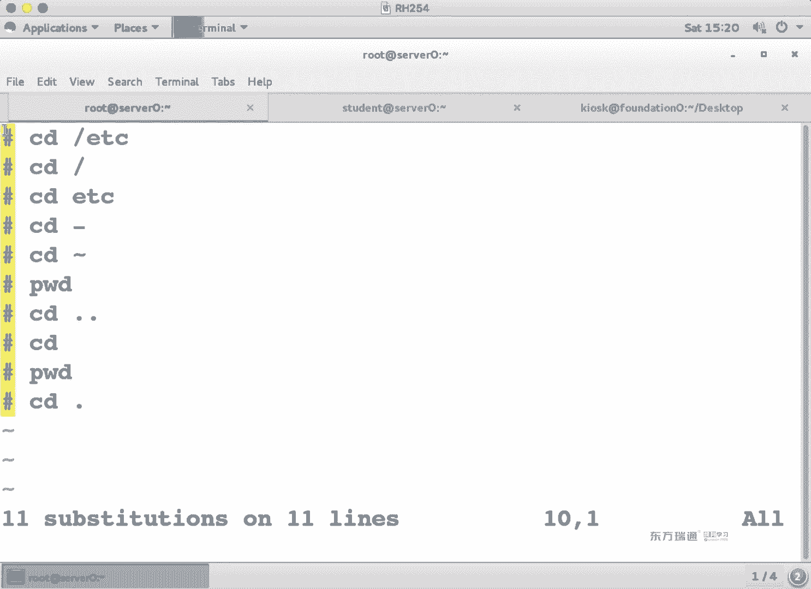

这组内容呢讲的就是路径。

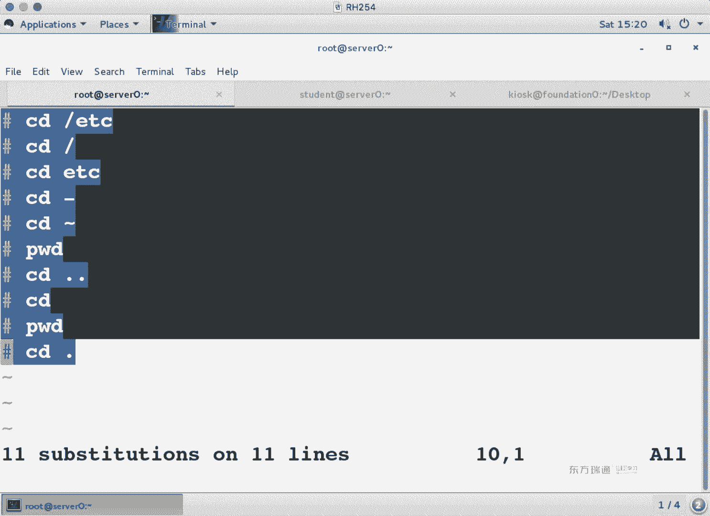

就这两个是绝对呀，剩下都是相对。啊，剩下多项对。减号代表上一次工作目录，波拉线代表用户的主目录。点点代表是上级工作目录。第二代表当前工东。他们都叫做相对路线。那路径以跟开头叫绝对路径。CD是干嘛用的呢？

当你接触一个命令的时候，我们是不是可以用麦来瞅一眼？CD是哪两个单词啊？前字这个水吧，更改目录啊更改目录。想看谁的帮助就骂谁。想看谁的帮助就卖谁。那么慢进来之后啊，你可能。不知道看哪，这个时候呢。

请用斜杠来查找。如果查到这个东西不是硬想要的，那么就摸下一个。还不是接着弄。如果说摸过头了。😡，大拇。OK吧。我说N的话怕你们听不懂嗯，所以说用拼音啊。退出NQ。在。这是路径。

这组实验当中就讲绝对和相对能分清就可以。就一句话，路径以跟开头。叫叫别的路径。相对路径呢不是以跟开头叫相对路径。银行每年呢他们都会有专门的时间来培训。辨认什么叫真钱？😡，他不会有专门的时间培训。

辨认什么叫假钱。大家知道啥区别吗？真钱只有一种，假钱可有很多种。所以说你就闭眼睛摸真钱吧，你摸一个月，随便给拿个钱，你光听动静也知道什么叫真钱。😡，能理解吧，你要手感你要手感。知道标准啊知道标准。O。

这是路径。PWD命令。PWD是来查看当前所在位置。查看当前所在位置。有同学说，老师，我们为什么要用PWD？我在这儿能不能看当年在哪？😡，用户的主目录吧，包浪蟹。上ETC。但是在实际工作当中。

可不可能有多个文件夹叫一个名。有可能吧。我C盘有个电影文件夹，我德盘也有个电影文件夹，它只显示电影文件夹。我怎么知道是C盘还是D盘？😡，有这种可能，那这个时候怎么办呢？や。OK吧，确认当前所在位置。

PWD代表是print working directory啊。P。WB。好。サララス。打印当庭所在公作目录。PW的。

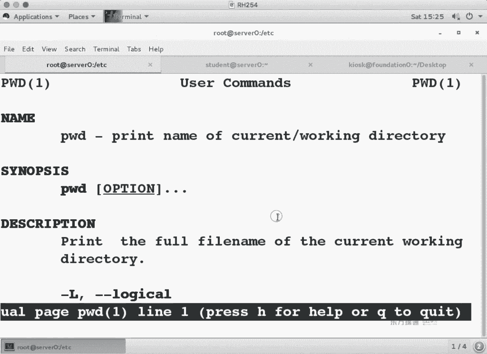

我。这一篇看着挺多。实际上就是讲文件文件夹的管理。文件和文件夹的关系，他们的拷贝。放建。移动剪切删除。这样几个操度。所以呢我们。要一起来看一下。嗯。😊，那这段内容在学微软产品的时候啊。

我们是学资源管理器的使用。资源管理系的作用是什么？是不是叫文件文件夹入管理啊？

在linux当中，用命令怎么来实现？

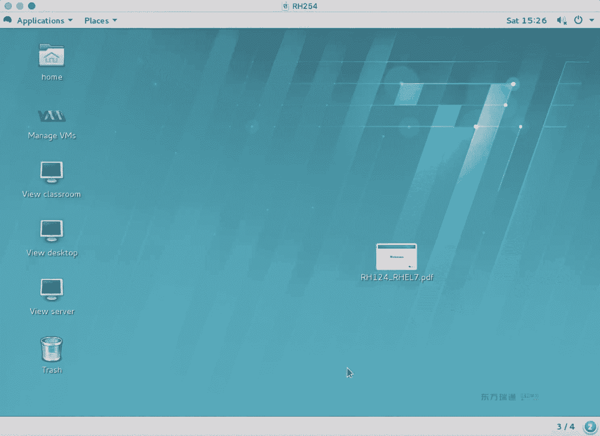

首先问大家个问题啊，文件和文夹区别。文件夹里存的就是文件或文件夹吧。他文件里不一定是啥。可能是个片儿，可能是个音乐。也可能是个图片。OK吧，跟他们的区别。那下面呢我们来看一下。我想创建一个文件。

介绍一下命令。Touch。他是发译中文，什么意思？就摸的意思是吧？一个玻璃十年没擦了，你摸一下有什么结果啊？😡，上面是不是会留下你的指纹呢？有痕迹是吧，有痕迹。touch创建一个文件。

另外一个命令make DIR。这条命令的作用呢是创建文件夹。创建文件夹。哦。没。可以放见吗？没报错是吧？可以创建吗？为啥？阿姨不红了。那里有啊。那如果你加个坡。可以创建吗？

可以创建披的含义叫做parents。叫双亲。当你创建子文件夹的时候，它要判断副文件夹存不存在。它会自动来创建它的副文件夹。每个DR用的最常用的一个选项杠P。创建子文件夹的时候，自动创建副文件夹。

创建文件夹会了吧？那我们再来看创建文件。我在这个目录下创建一个文件。这个文件多大？他是只是创建了一个文件，大小为零的文件。大小为0。大小为0的文件，什么文件？这个里面我们要讲一个知识点。任何一个分区。

都有两部分，一部分叫节点区。一部分叫块取。任何一个分区都有两部分节点区和快区。这两个区是干什么用的啊，帮大家理解啊，我们讲几个现象。Yes。我地盘中有一个片儿，4个亿。

我把这个文件呢从D盘的某个文件夹剪切到D盘的另外一个文件夹，快不快？为什么？现在回答。为什么你在剪切的时候刷就过去了呢？😡，一个文件在相同分区当中移动的时候，那个文件呢它由不同的块来组成的。

假设一块是4K。那现在如果是你有1个6K的文件，它要占几块啊？占了2块。文件是存在块上，当你在同一个分区把文件移动的时候，它实际上是修改谁呀？它实际上修改是节点。节点当中啊，包含了你块所在的位置。

包括了你的文件名，包括了你这个文件的information相关的信息。而文件实际的内容呢是在block上。换句话说，他只是把印度的改了一下，就相当于只改了个目录，当然很快。这能理解吧。

而touch的操作就是只创建了一个节点。所以说大小为0。踏uch呢。只生成了一个新的节点。能理解吧？为什么V0？因为它只生成了个节点，它没有去动块，所以说是零，所以说是0。你块不管是多少，啊。

你只要动了。😡，你那块一块多大就占多大占多大。OK回过头来。😊，那现在我们会创建文件，也会创建文件夹了。我们要对这个文件和文件夹去做操作啊去做操作。首先我们来看一下拷贝。我们有个英文单词叫copy。

那我会发现呢O和Y是不是都原因呢？外头发原音挨的原呢，原因省略。一个命令CP。好贝美丽。木。木这个词翻成中文，什么意思？一动。那么把原因省略就变成了。MV。移动。我们还有另外的是料帷木。你木什么意思？

😡，瑞RE是再一次一思再一次移动。你买了一斤苹果，把它移动到你家了，等再次移动的时候，是变成苹果活了呀？😡，所以说再次移动是什么意思呀？删除吧啊删除。那对于这样的命令啊，我们取出第一个字母。

RE第一个字母木第一个字母变成M。RM的含业代表是删除。判决。那下面我们来看一下文件文件夹啊，他们怎么来拷贝。咖啡。文件在拷贝的时候有原有目标。拷贝是说复制加里粘贴叫拷贝。复置加粘梯。那文件夹呢？

个不知。让考虑吗？不让是吧。我加个选项。那拷谓吗？让可没了。这个R代表什么含义呢？很好。は。白手。break代表什么意思？低归。层次关系啊，递归层次关系文件夹在拷贝的时候必须加杠R选项。

文件夹在拷贝的时候，必须要到R选项。地规。这是文件文件夹的拷贝。那么再来看一个。MOV。MV有两个功能。もしも。第一个功能叫除命名。看不下的W勾勾，我把名改成了solder。是不是还放在t下呀？

路径没变，这个叫重命名。从命名。那要移动吗？根据在家是不是给我发多少了？😡，这要移动。那你也可以移动并重命名。查了。我要把它移动到t下，改名叫WQQ。它可以重命名，可以移动，也可以移动并重命名MV。

这个文件夹操作文件同理。那我们会发现文件夹在移动的时候啊。😡，用家生R吗？不用啊，拷贝的时候得家干，那删除呢？嗯。工做。他问咱们删不删是吧？yes。除了Y以外的任意字母都是不删。都是不删除啊。

只有Y是删除。あ。好。3号是不没有了。已经被删除了。我们看删文件夹。让反吗。办法。加什么？啊。Yes。Yes。😊，好玩吗？里面有1000个文件，你得100次歪，这谁受得了啊？所以说RM我们在删除的时候。

通常会接一个选项。叫F。F什么含义呀？强制ss。False。在课上会讲到一些选项。如果我没有给大家写那个单词是什么的话，你自己用慢查一下。麦茶谁的帮助啊？RM的帮助啊，漫长RM帮助。

然后在里面去查杠F就能查到F代表是sse。I heard那个house。斜杠减F5。看到了吧。强制什么叫强制啊？我们要尝。在删除的时候啊，正常情况下，你得一个一个把。每个文件都得歪一遍。

那你不想一个一个Y的话呢，就加个S，它全强制相当于默认全Y啊默认全Y。这是删除。文件夹的删除。那我们总结一下，拷贝和删除的时候，如果是林霞加杠R吧。拷贝和删除的时候，文件夹加到啊。

我把这个班当给大家整理一下。し。呃，第一条。我们做实验的时候，用不用回到用户的主目录啊？有没有？不用，为什么呢？因为我这个里面写的都是绝对路径。😡，能看到吧？所以说你到底在哪无所谓。创建文件夹可以创建。

创电文牙能创建吗？不能，因为阿姨不存在。你加个P能创建了吧？P代表parents。当副文件夹不存在的时候，自动创建副文件夹，再创建子文件夹。他是命令是生成文件，文件大小为0。

拷贝我们可以把文件拷贝到某公目录像。😊，我们也可以拷贝文件夹。文件夹在拷贝的时候，第七条、第八条哪台好用？😊，货物在。第八条吧，拷贝文件夹的时候要记得加到哪儿。MOV陈明名。MV移动。MV。

移动并存命名。789，你注意他们的区别。对他们区别MV到底在干嘛？10。删除文件。大家想删除一个文件的时候，他都问我是不是删除是麻烦吧。😡，嗯。啊。有个杠A选项，杠A选项什么意思呀？每删除一个文件。

它都会进入一个提示模式啊，提示模式什么概念呢？这个命令什么意思？在。我line叫别名，我 lies叫别名命令。那我们看看这个里面有没有1个RM。第二。RM杠I是不是等于RM换句话说。

你每删除一个文件的时候，默认是不是带1个RM杠I选项。即使也没洗啊，即水也没有洗。默认带一个障碍，默认是不是询问的？😡，判也无删除啊判无删除。如果你就是想删除这个文件，并且不想让他提示的话。

那我么可以怎么办呢？我们有个特殊的符号叫反斜杠。反斜杠的含义叫转移。这条命令做的是说我不用编名，只用IM。什么叫转移呀？它本身的含义。把特殊符号转译成普通的含义，原来的含义，它本身的含义叫转移。

直接用IM默认就是用的别名。你加个反斜杠，用的就不是别名了，用的就是I命令。不用别名，用它原来的功能。那现在我们也删除个文件试一下。看不下。有个T。我回去。提示我删除了吗？没有。还有吗？能号区别吧。

他问没问我删不删？😡，反斜杠法作用。你给他一棍子，他也不认识爹娘了啊。😡，反斜杠转移啊转移转移这个符号，我们在后面课上还会再次提到它的功能就叫转移啊转移。O。😊，我们继续。之所以我们在删除文件的时候。

它出提示，原因就是因为有别名啊，删除文件之所以有提示，原因是因为有别名。有别名alize命令呢是查看别名，查看别名。那么你不想要提示的话怎么办呢？你不想要提示，想给它直接删除的话。

删除命令前面加个反斜杠。转移啊转移。嗯。删除文件夹必须加高R选项吧。😡，但是家刚选项的时候，他说问来问去的呀。里面有1000个文件设的1000个Y。这个我也受不了，所以说我们在删的时候。

一般建议大家加个F。一般现大下加个F。但是。你在用RF的时候请慎重，为什么呢？这条命令什么意思？删除跟ETC文件夹。能看到吧。然后一手一哆嗦，这是什么意思？😡，家电铺录。删除该文件夹和当前EG7文件夹。

当前目录下APC危不危险？危险吧。在7版7之前呢，你要是这么一翻回车的话，一重启系统说就没了。所以说这个空格的事儿啊。

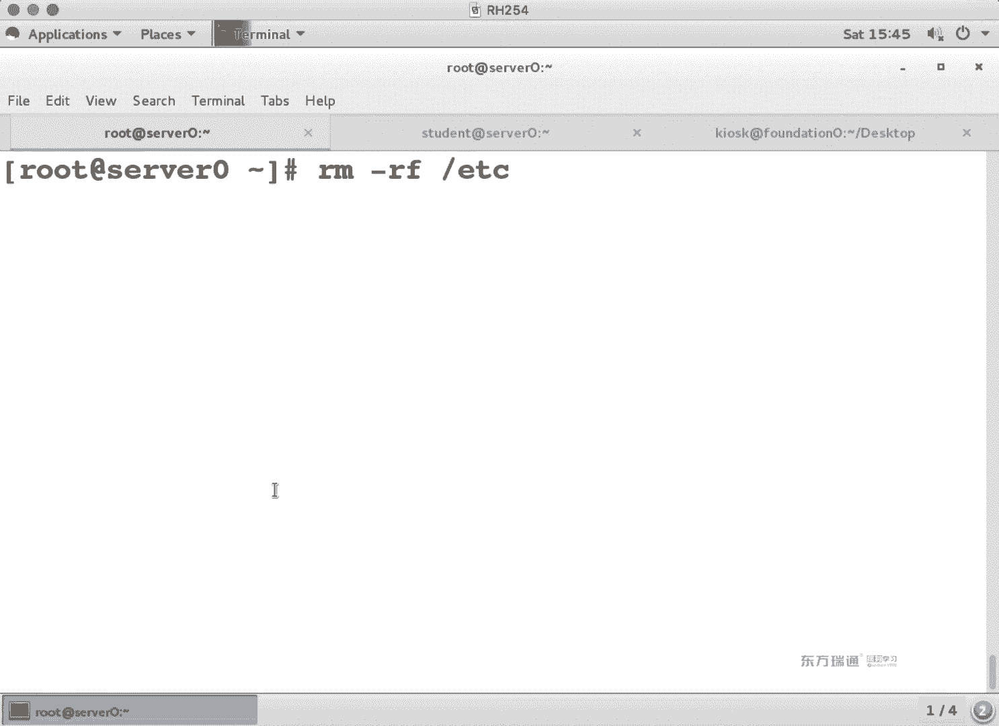

如果你敢用RF，请注意空格。OK吧。

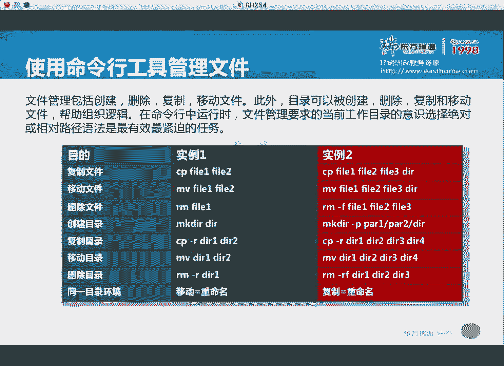

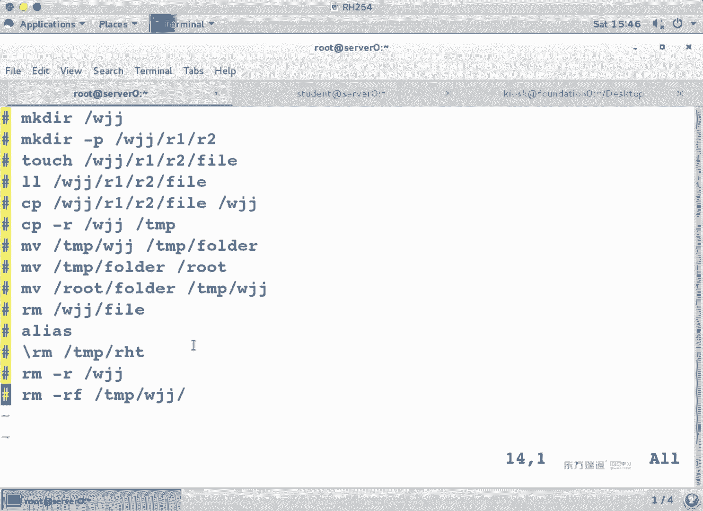

嗯。

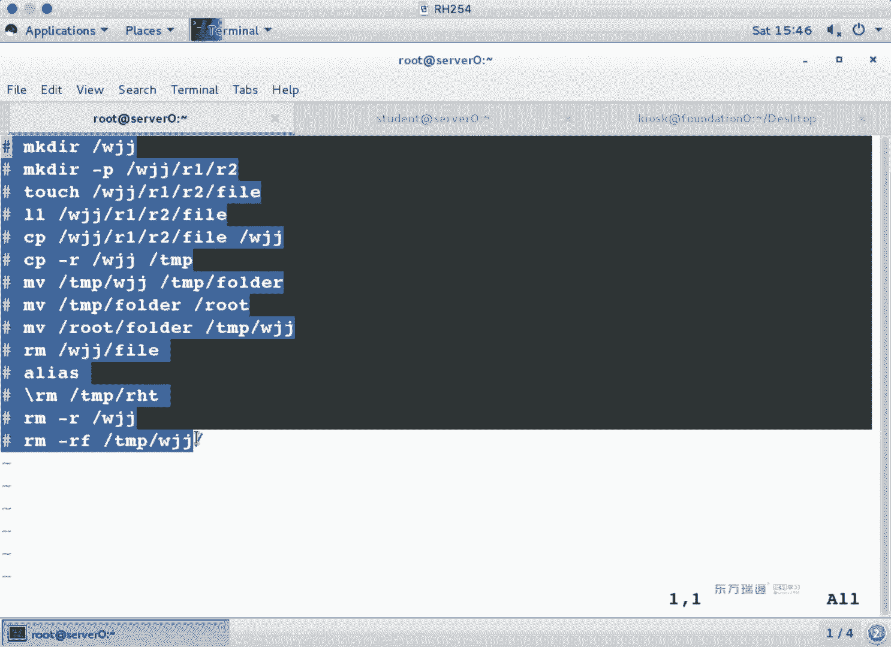

刚刚讲的这段内容呢。文件文件夹的创建。好贝。移动啊，删除重命名。OK吧，文件和文夹操作。这组操作当中啊，大家注意那个杠R选项杠P选项啊，杠F选项啊，这里面选项比较特别。大记的时候啊。

一定要实验做完之后整理一下啊，实验做完之后整理一下。目录的操作。哦。去。那这张呢最后一个知识点呢，讲的是通配符。通佩服。为什么要用同佩服？😡，LS命令默认是什么作用？😡，那个时当前目录下文件和文件夹吧。

默认的作用。但是一个目录下有好多的内容，我只是对某些文件感兴趣。你是不是只想把某些文件列出来呀？😡，这个时候就要用到通电湖。再或者说。实际工作当中，你是不是要拷贝一些文件？

我只要把这个文件下某些文件拷贝出来，你是不是也得用同篇符啊？😡，要不然的话，你是不是得靠推。😡，假设有10个文件，你是不是要 copypy十遍？啊这些文件比较有特性，文件名比较有特性特点。

我是不是得靠背什么什么通德福报什么那完事了。通配符的作用简化操作啊简化操作。呃，看这组实验之前呢，我们要先。生成几个文件帮大家理解。Touch。看出的功能是干嘛了的？嗯，生藏文件。这条命令的作用是说。

在当前目录下。生藏。A1点TIT。A2点TATTA3点TATT。B1的TITB2B3C1C2C3。这在。他是不代表从哪到哪儿啊？它代表一个集合啊一个集合。A到C1到3啊，A到31到3两俩相乘。

这个文件一共是几位啊？点前面两位吧，ABC123啊。踏是明令生成多个文件。多个文件上成了之后，我先来查一下这个文件中以A开头的所有文件。这个目录下以A开数送文件。香代表什么含义？任意长度，任意字符。

问号用于单位。问号用于单位。我想来查一下当前这个文件当中。第二位。是三的所有文件。文件名第二位是三到所文件，问号是不是占一位呀？星和问号。波浪线波浪线代表什么含义啊？😡，我要查用户主目录像。发布。

所有的TST文件。OK吧。波浪线代表示用户的左目录。一は。方括号。三括号代表是个范围。碳号和幂呢代表是取法非啊非。我想来查一下。文件名第一位是A或者是C的所有文件。文件名第二位是一或者是三的所有文件。

能看懂吧？方号代表是个范围。那如果你给他加一个叹号。第二位不是一，不是3。那你不用叹号用 me。结果一不一样。一样是不是都代表C呀，不是啊不是。方括号当中代表范围。幂合叹号代表取法啊取法。

那么呢下面呢还有些特殊的。特殊的标识啊特殊标识，特殊的通配符。阿尔法阿尔法代表什么含义啊？😡。

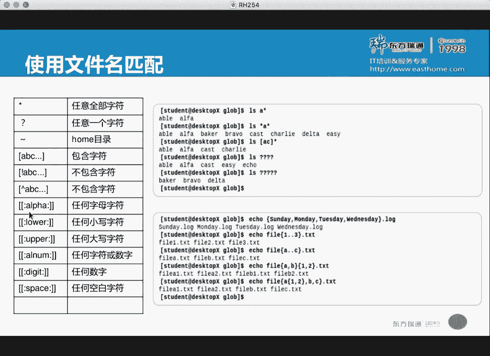

A刀贼。A到Z。

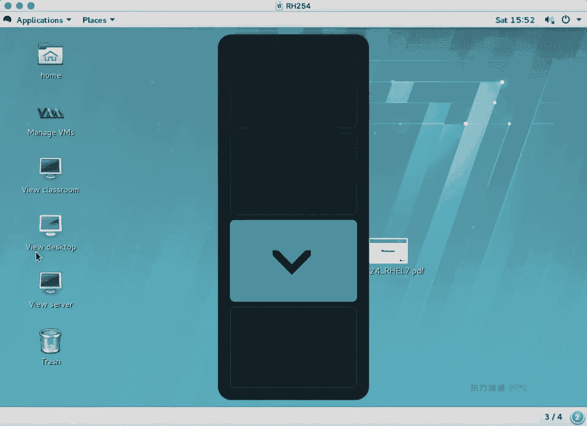

比如。阿拉斯。A到Z的所有文件。文件名D为ABCDE1只瓦叭C数。OK吧，A到C。那么它的另外一种写法呢。阿尔法。能看到吧。继续。呃。Dge塔代表是数值。数字。数值数字。数值怎么来表示呢？书记。

数值我们在表示的时候啊，是不是可以1到9啊？啊，不对，还有凉了是吧？0到9。文件名第二位是竖值的。OK吧。Yes。第一个给大家代表数实。这段内容呢。和0到9是一个意思。这段内容呢和A到Z是一个意思。啊。

数据。那我们也可以用阿尔法 number字母或数字。阿坡呢代表是大写子分母low婆代表是小写子分母。我们之前提到过说linux当中严格区部那样写吧。原告区分。换句话说，当你创建一个文件。

touch A1点TIT。嗯是。能看这区别啊。A1A1俩A1，你说的是谁，是大写小写。大而险。space代表控格。大写小写空格。

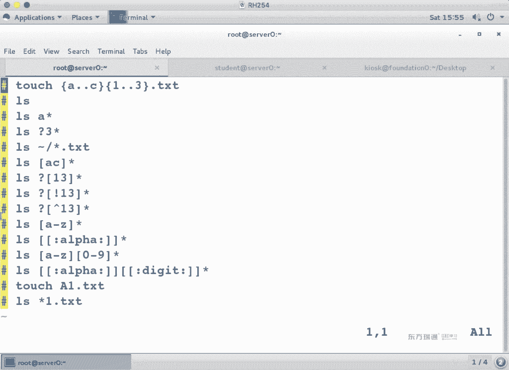

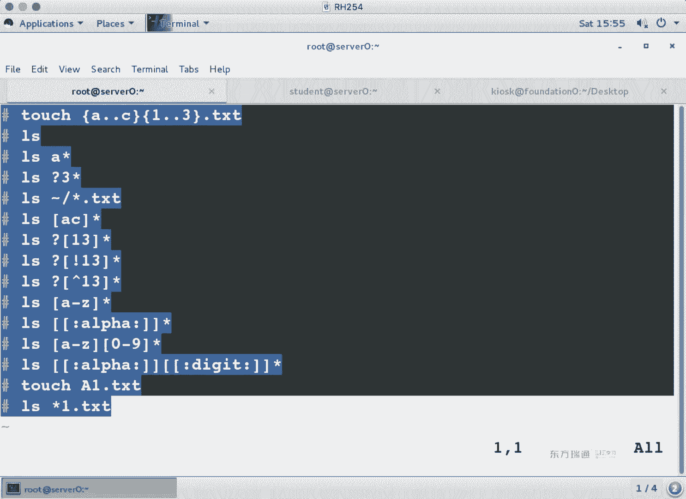

这块内容讲的是通配服。星问号拨拉线发货号。方话中蜜和叹号。阿尔法 dig。他们的含义。佟伟博怎么来表示？那，这组通明图看完了之后呢，我们来出一道题啊，大家一起来考虑一下啊。😊，我现在想拷贝。好了。

大家看一下这个文件夹中有文件吗？啊，没看着吧。那我们加个选项，杠AA代表是out的y。这个文件夹中有文件吗？有都隐藏文件是吧？我要把这些文件都拷贝到某个文件夹就。你应该怎么拷贝？

拷贝的话是不是等于copy名这啊？然后你有文件夹还我加杠R啊。😊，空格言空格目标吧。原应该怎么写？比是说我们想给他都拷贝到。😊，呃。这个目录下吧。应该怎么写？行啊。好，我又行了哈，他说啥？😊，でも要せ。

没有。不这么写，那你该怎么写？这些文件有个特点，都以什么开头啊？点开头是吧啊，那是不是该点星啊？点开头的文件默认都是隐藏文件是吧？你要直接写星的话，他是能看到的文题。看不到一层文件，所以讨论不过来。

拿我些点香行不行？他说什么？😡，点儿是谁？点是谁？自己吧。大家看一下你考不过来的是啥？😡，这都是啥？什么概念？你刚刚写的是不是点星？这箱包含他不？他说是硬链接吧。对不对？包不包含他？😡，也包含吧。

他是把他负级的东西给拷贝到当前目录下了。是你想要的吗？你想拷贝的东西是不是除了他俩这些呀？😡，怎么来表示这些？😡，Yeah。啊。有同学提到字母了是吧，是不是第一位是点，然后剩下第二位是字母的所有文件呢。

我创建个哈哈文件夹哈。😊，依然是这条命令。第二位是字母吧。这文件多少位，我哪知道。😡，行。能看到吧，开说。他说4万吗？不在吗不在吗？哎，我拷贝啊，怎么又写第一文件夹了？呃，哈哈文件夹是吧？😊。

没报错了是吧，瞅一眼。啥没有。ok话。知道为啥又同赔服了吧。你要不用通门佛的话，你就干这个事儿，是不是得得被折磨死啊？有多人没事儿。你这才5个文件，我拷贝5条就得了呗。😡，也行，是不是啊。

你要不会通赔符的话，考个5条也行。但是实际工作当中啊，如果能用通赔符来写的话，我们尽量拼符过来写。省时间吧。你考外5条的话的敲补条命令。一条命令用图面符直接就完成了。

给大家讲这个实验的目的是为了大家了解为什么要用通快付。如果你不用通配符的话，隐藏文件会被折磨死啊会被折磨死。在网上啊有好多人问，为什么要拷贝这个文件的时候要点上么什么东西，为什么？😡。

虽然说我看过这张帖子，从来没回过。为啥不回呢？我不知道咋回。不好解释。O。一个小实验帮大家理解。呃，在这个实验当中，你首先要知道这么两个东西。第一个。GETs目录下全是隐藏文件吧，隐藏文件直接拷贝。

如果想查看的话呢，当A。创建的文件夹。😡，你要是拷贝带子文件夹的话，是不是加杠R啊？第四行这种方法可以吗？不可以，第五行这种方法可以吗？也不行。我们得用哪种啊？😡，A到Z这种吧，要用这种。然后确认。

这个是一个通惠服务实际用法的一个实例。

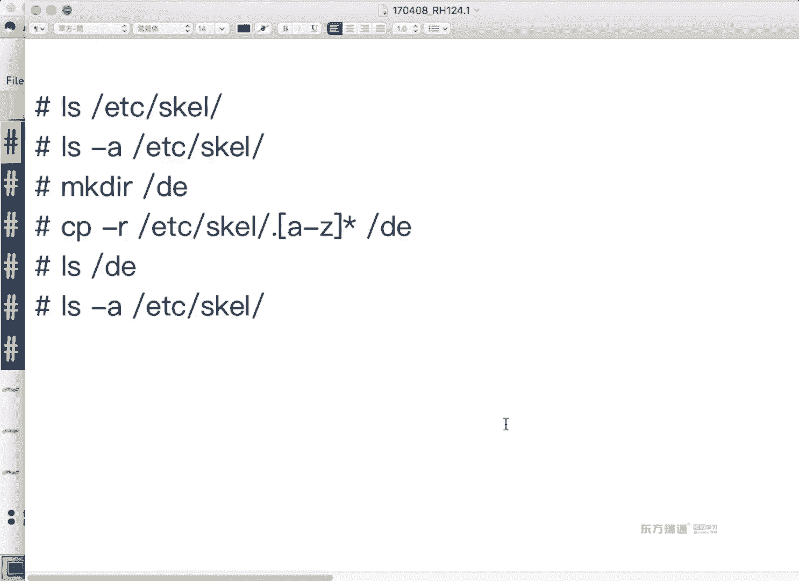