# Linux基础操作：第2章：命令行文件管理


在本章中，我们将学习Linux系统中文件和目录的基本管理操作。我们将了解重要的系统目录、绝对路径与相对路径的区别，并掌握使用命令行创建、复制、移动、重命名和删除文件与目录的方法。最后，我们会学习通配符的使用，以简化对多个文件的操作。

## 📁 重要目录结构

上一节我们介绍了Linux的基本概念，本节中我们来看看Linux系统的目录结构。理解这些目录的作用有助于我们更好地管理系统。

Linux的根目录（`/`）下包含许多子目录，每个目录都有其特定用途：

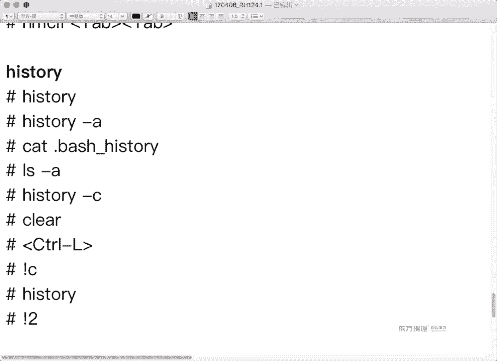

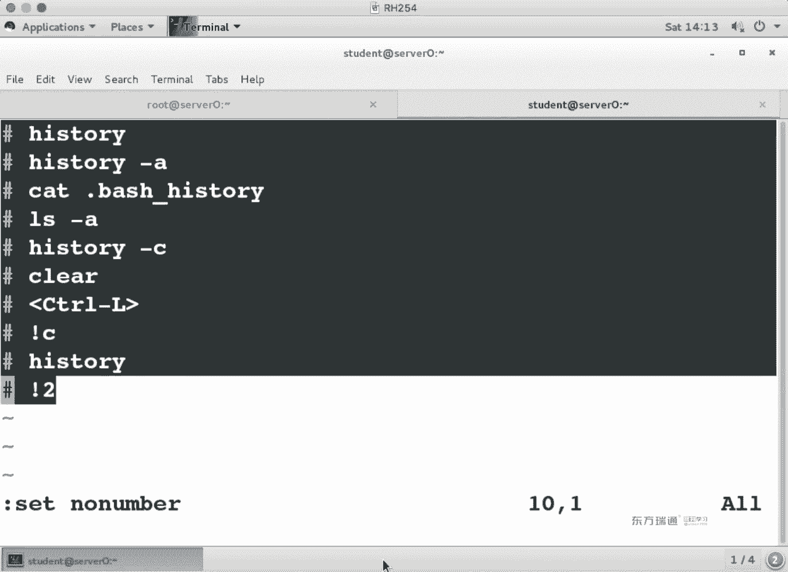

*   **`/home` 和 `/root`**：用户主目录。普通用户的主目录位于 `/home` 下（如 `/home/student`），而超级管理员 `root` 的主目录是 `/root`。
*   **`/etc`**：配置文件目录。几乎所有的系统和服务配置文件都存放在这里。
*   **`/var`**：可变数据目录。存放经常变化的文件，如日志（`/var/log`）、邮件等。
*   **`/dev`**：设备文件目录。所有的硬件设备都以文件形式存在于此。
*   **`/mnt` 和 `/media`**：挂载点目录。用于临时挂载文件系统，如U盘、光盘或网络共享。
*   **`/bin`、`/sbin`、`/usr/bin`、`/usr/sbin`**：可执行程序目录。`/bin` 和 `/usr/bin` 存放普通用户命令，`/sbin` 和 `/usr/sbin` 存放管理员命令。
*   **`/boot`**：启动文件目录。存放系统启动所需的内核和引导程序文件。
*   **`/proc` 和 `/sys`**：虚拟文件系统目录。存放内核和进程信息的虚拟文件，关机后为空。
*   **`/tmp`**：临时文件目录。供系统和程序存放临时文件。

## 🧭 绝对路径与相对路径

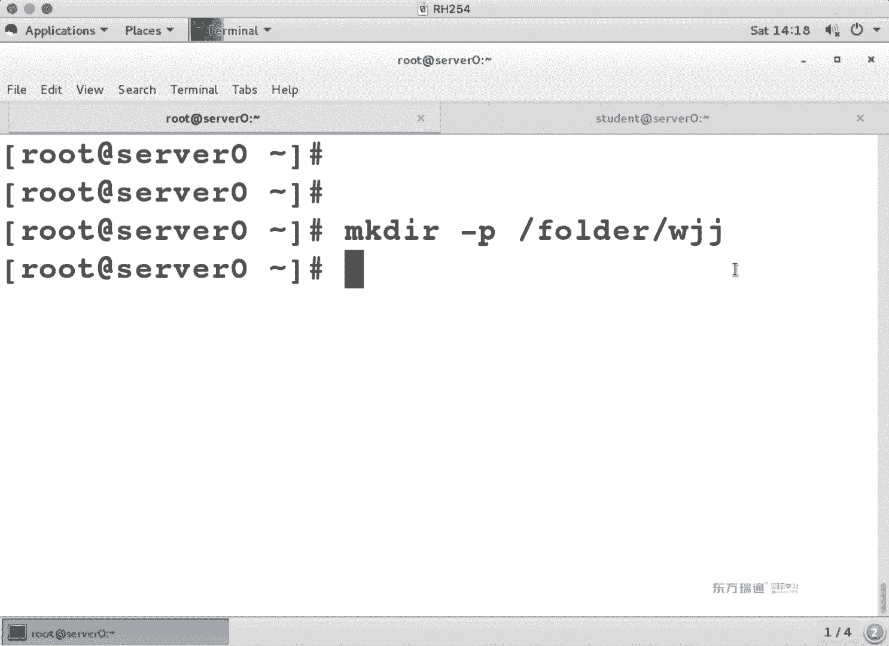

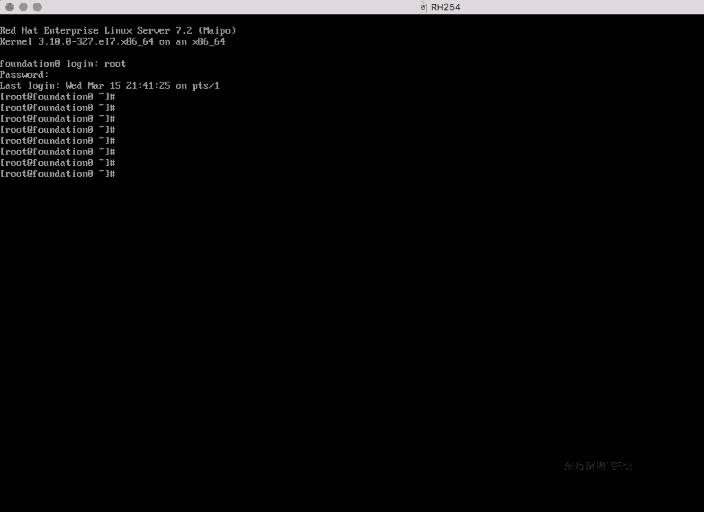

了解了目录结构后，我们需要知道如何定位文件。路径分为绝对路径和相对路径，它们的区别在于参照物不同。

*   **绝对路径**：从根目录 `/` 开始的完整路径。例如：`/etc/passwd`
*   **相对路径**：相对于当前工作目录的路径。例如，当前在 `/home`，`student` 就是一个相对路径。

以下是几个常用的路径符号：

*   `.`：代表当前目录。
*   `..`：代表上一级目录。
*   `~`：代表当前用户的主目录。
*   `-`：代表上一次的工作目录。

**示例**：
```bash
cd /etc        # 使用绝对路径切换到 /etc 目录
cd ../home     # 使用相对路径，先返回上一级，再进入 home 目录
cd ~           # 切换到当前用户的主目录
cd -           # 切换回上一次所在的目录
```

**核心概念**：**路径以 `/` 开头即为绝对路径，否则为相对路径。在配置文件中，必须使用绝对路径。**

## 📄 文件与目录管理

现在，我们开始学习如何使用命令来管理文件和目录。这相当于在命令行中使用“资源管理器”。

### 创建操作

以下是创建文件和目录的命令：

*   **`touch`**：创建空文件或更新文件时间戳。
    ```bash
    touch file.txt  # 创建一个名为 file.txt 的空文件
    ```
*   **`mkdir`**：创建目录。
    ```bash
    mkdir new_dir          # 创建名为 new_dir 的目录
    mkdir -p parent/child  # 使用 -p 选项，如果父目录不存在则一并创建
    ```

### 复制、移动与重命名

以下是复制、移动和重命名文件与目录的命令：

*   **`cp`**：复制文件或目录。
    ```bash
    cp file.txt file_backup.txt        # 复制文件
    cp -r dir1 dir2                    # 复制目录，必须使用 -r 选项（递归）
    ```
*   **`mv`**：移动或重命名文件/目录。
    ```bash
    mv old_name.txt new_name.txt       # 重命名文件
    mv file.txt /tmp/                  # 移动文件到 /tmp 目录
    mv file.txt /tmp/new_name.txt      # 移动并重命名
    ```

### 删除操作

以下是删除文件和目录的命令：

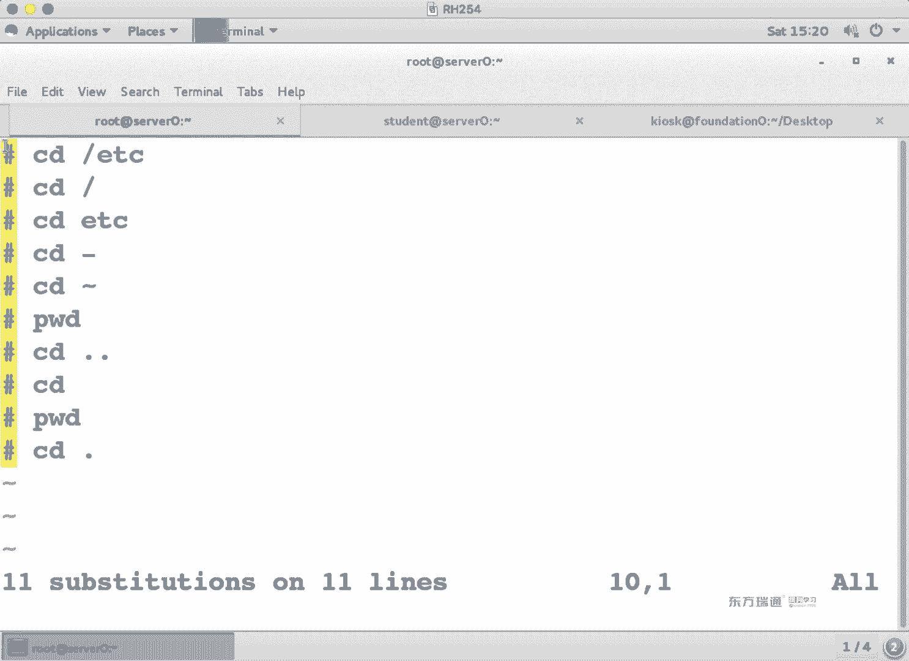

*   **`rm`**：删除文件或目录。
    ```bash
    rm file.txt                # 删除文件（默认会询问确认）
    rm -f file.txt             # 强制删除文件，不询问（-f 选项）
    rm -r dir_name             # 删除目录及其内容（-r 选项，会询问）
    rm -rf dir_name            # 强制递归删除目录，不询问（慎用！）
    \rm file.txt               # 使用反斜杠忽略别名，直接执行原 rm 命令
    ```

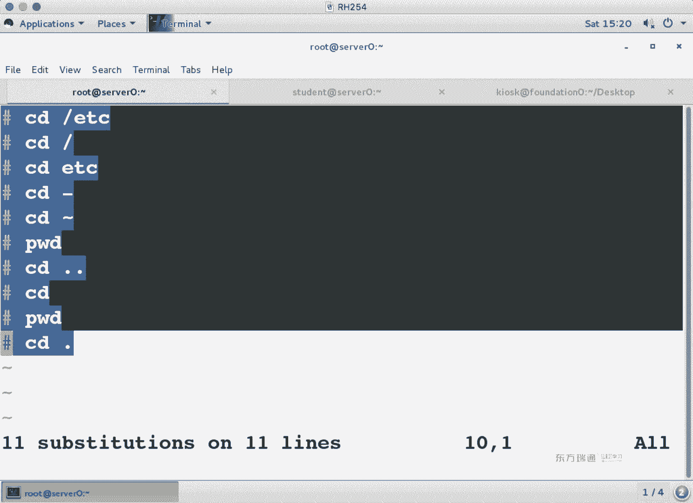

**重要提示**：`rm -rf /` 命令会删除根目录下的所有文件，导致系统毁灭，**切勿尝试**！使用 `rm -rf` 时务必注意空格。

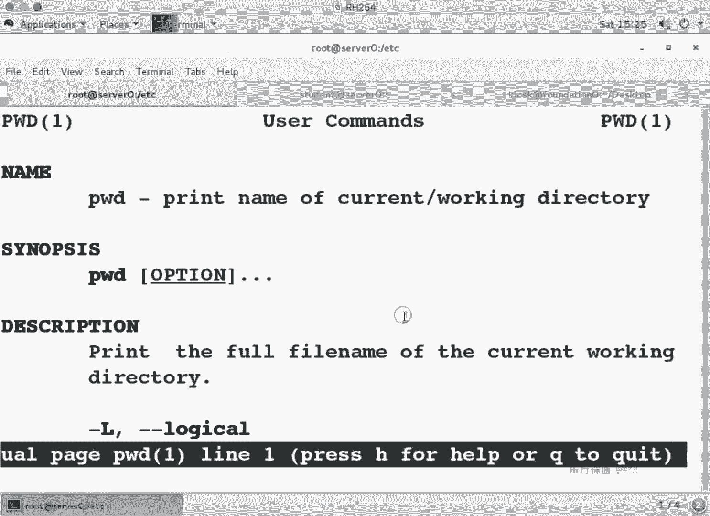


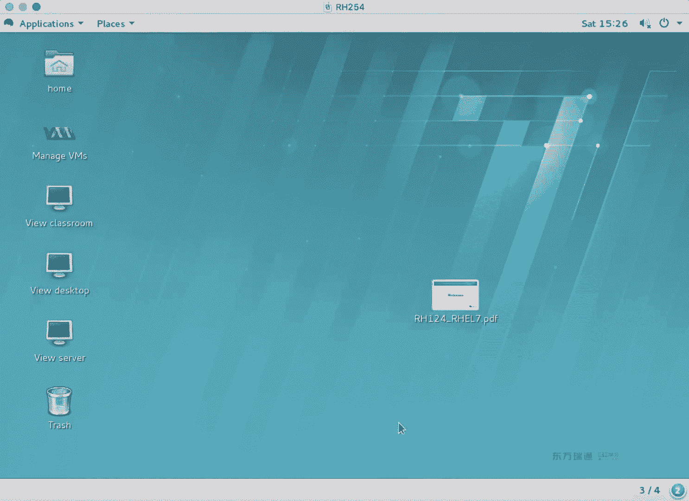

## 🌟 通配符的使用

当我们需要对一组有规律的文件进行操作时，逐个输入文件名非常低效。这时就需要使用通配符来匹配多个文件。

以下是常用的通配符及其含义：

*   `*`：匹配任意长度（包括零个）的任意字符。
    ```bash
    ls *.txt      # 列出所有 .txt 结尾的文件
    ```
*   `?`：匹配任意单个字符。
    ```bash
    ls file?.txt  # 列出如 file1.txt, fileA.txt 的文件
    ```
*   `[]`：匹配方括号内的任意一个字符。
    ```bash
    ls file[123].txt    # 列出 file1.txt, file2.txt, file3.txt
    ls [ac]*.txt        # 列出以 a 或 c 开头的 .txt 文件
    ```
*   `[!]` 或 `[^]`：匹配不在方括号内的任意一个字符。
    ```bash
    ls file[!1].txt     # 列出不是 file1.txt 的其他 file?.txt 文件
    ```
*   `~`：代表用户主目录。
    ```bash
    ls ~/*.txt          # 列出用户主目录下所有 .txt 文件
    ```

**特殊字符类**（在 `[[:class:]]` 中使用）：
*   `[[:alpha:]]`：任意字母。
*   `[[:digit:]]`：任意数字。
*   `[[:alnum:]]`：任意字母或数字。
*   `[[:upper:]]`：任意大写字母。
*   `[[:lower:]]`：任意小写字母。
*   `[[:space:]]`：任意空白字符。

**示例：复制所有隐藏文件**
```bash
# 假设当前目录有许多以点开头的隐藏文件
cp .[[:alpha:]]* /backup/  # 复制所有以点开头，且第二个字符是字母的文件
```

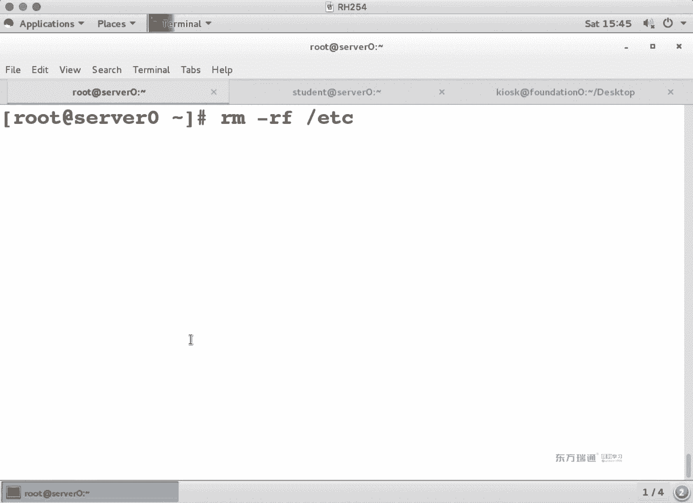

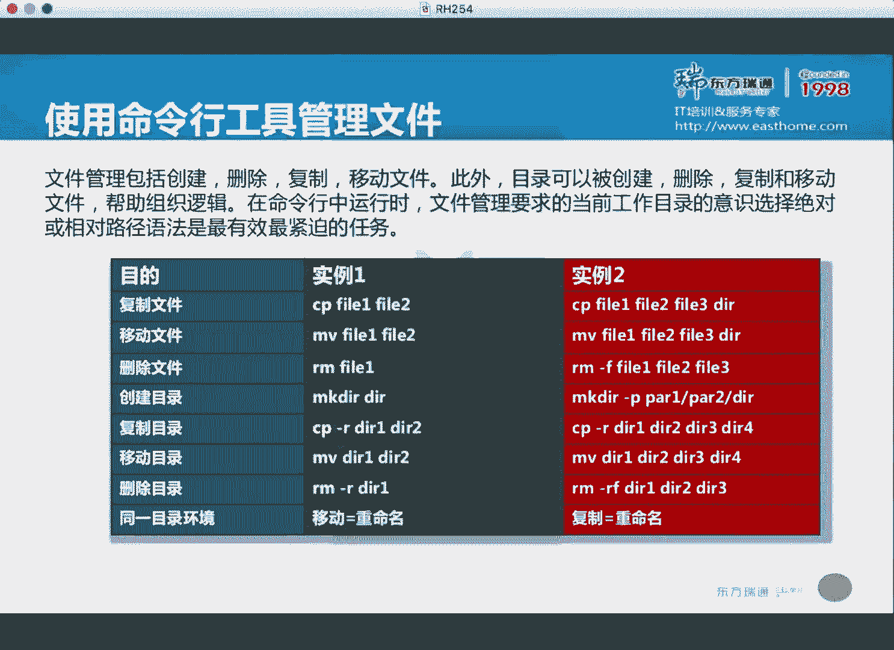

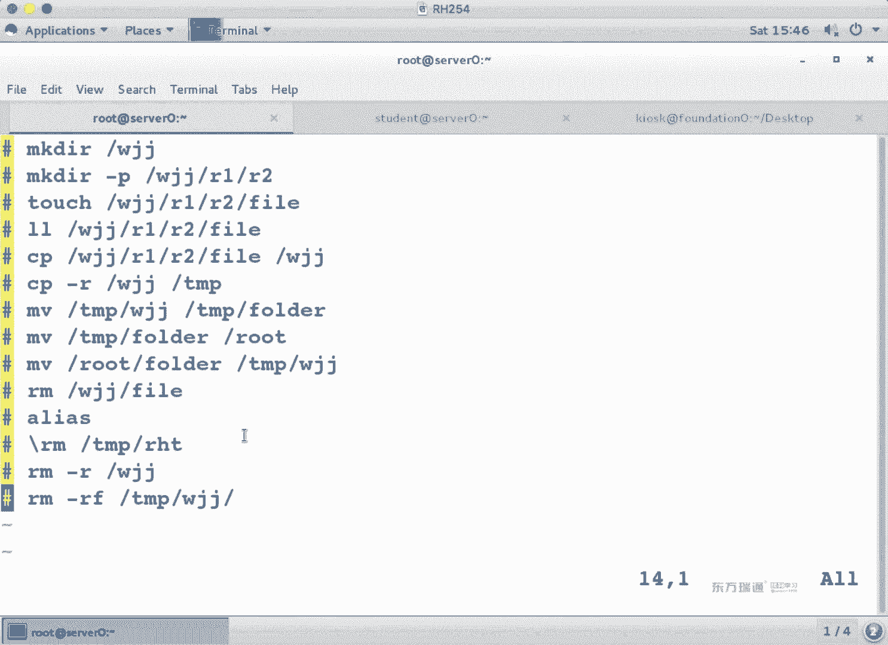

## 📝 本章总结

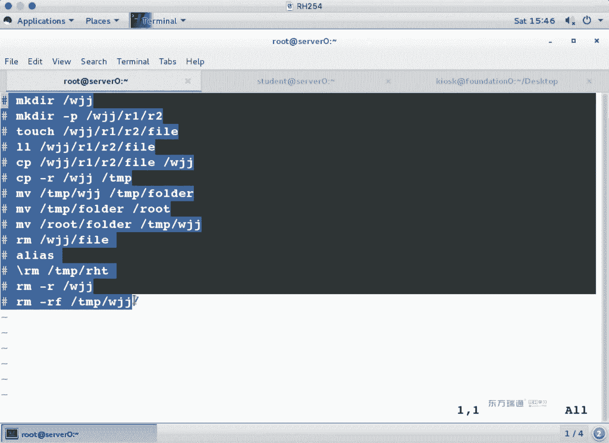

在本章中，我们一起学习了Linux命令行下的文件管理核心知识。

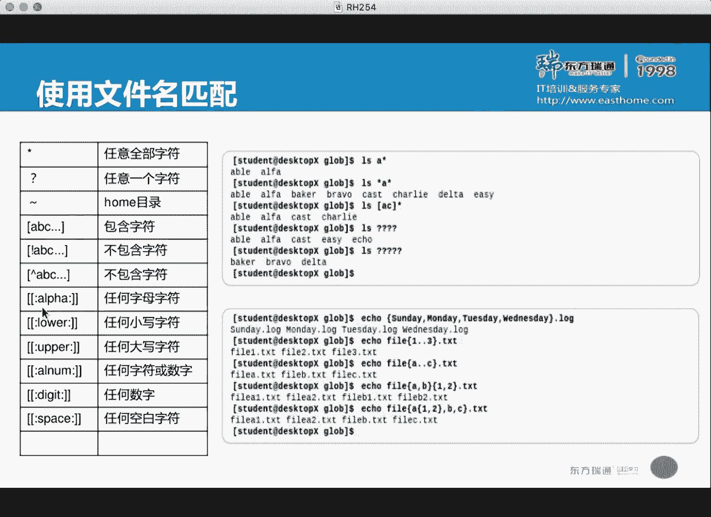


我们首先了解了Linux系统的重要目录结构及其用途，例如存放配置的 `/etc`、用户数据的 `/home` 等。接着，我们明确了**绝对路径**与**相对路径**的区别，这是定位文件的基础。

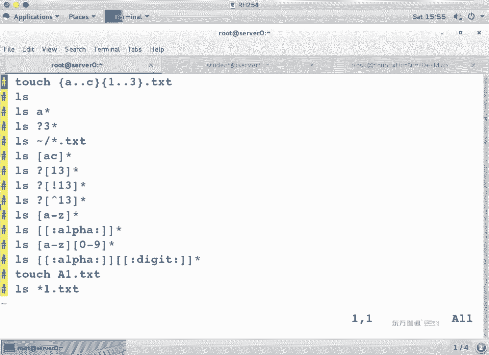

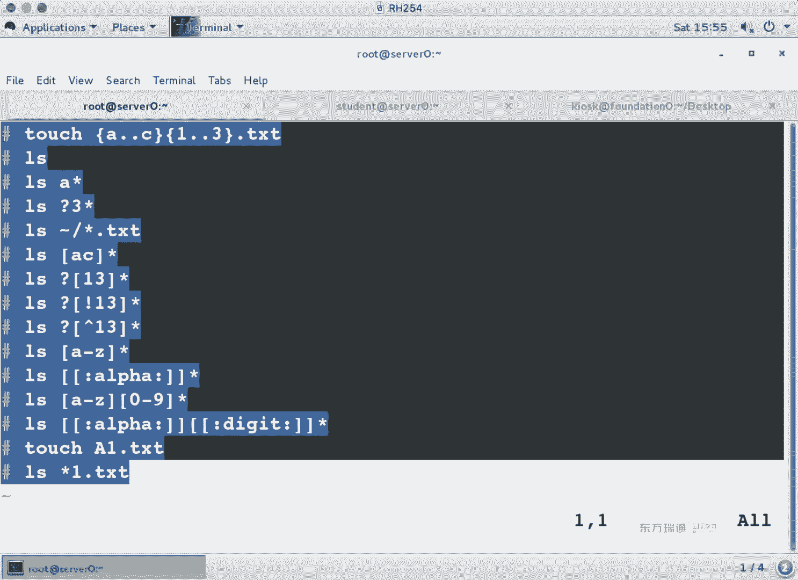

然后，我们掌握了文件与目录的**创建**（`touch`, `mkdir`）、**复制**（`cp`）、**移动/重命名**（`mv`）和**删除**（`rm`）操作，并特别强调了操作目录时需要 `-r` 选项，以及使用 `rm -rf` 时的危险性。

最后，我们学习了**通配符**（`*`, `?`, `[]` 等）的强大功能，它可以帮助我们高效地批量操作具有特定模式的文件，极大地提升了命令行工作效率。

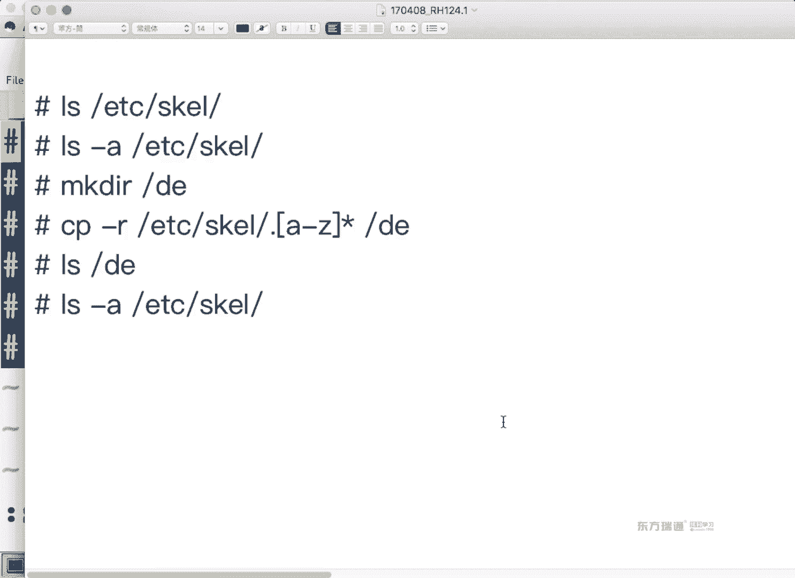

熟练掌握这些命令和概念，是成为合格Linux系统管理员的第一步。