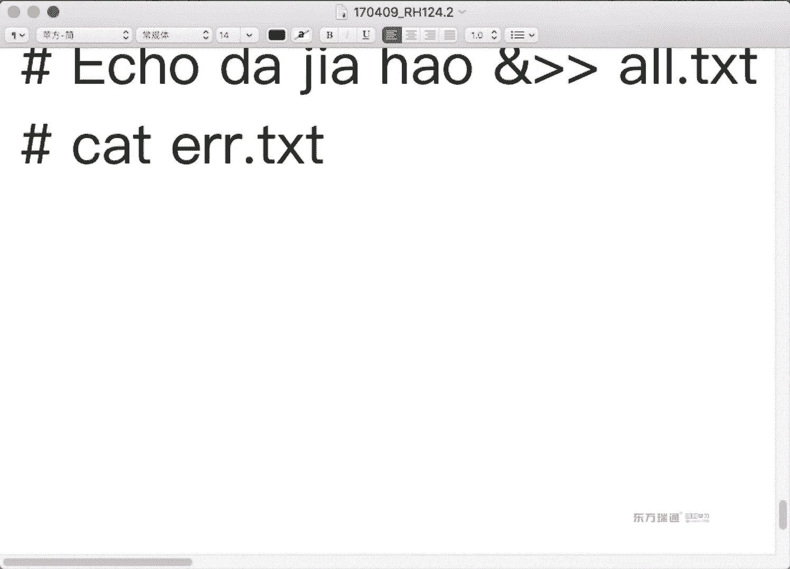
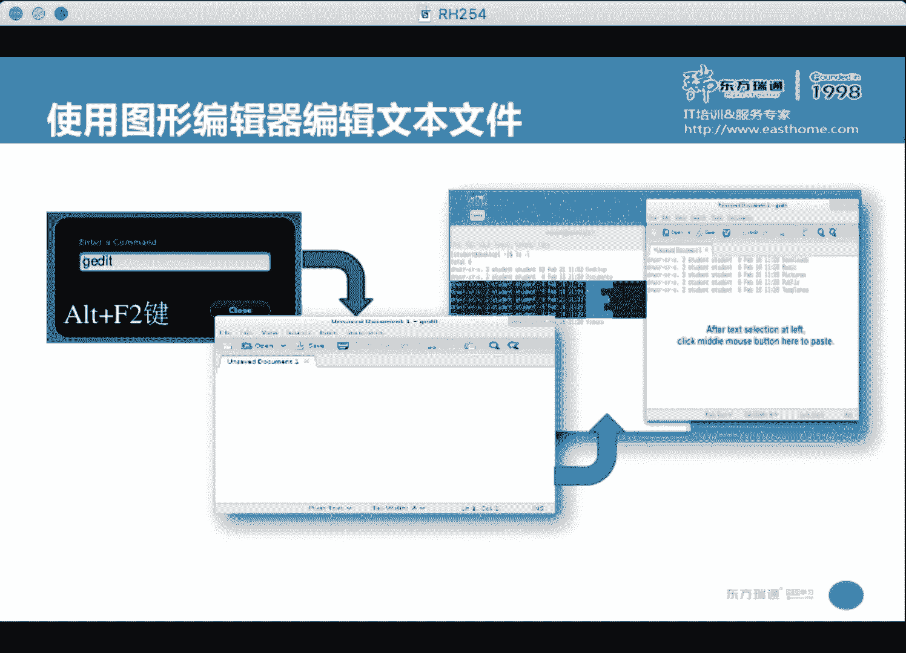

# 红帽Redhat RHCE7培训课程+RCHE7实战参考教程+红帽8.0教材电子版+模拟环境及辅导 - P3：3 - 16688888 - BV1zu41197p6

啊，大家抬头。我们相方回忆一下昨天讲的内容。昨天我们讲了两章内容啊，那第一章主要讲了一下事2中命令的用法。第二章呢讲了一些命令啊讲了一些命令。我们来回忆一下，在linux的12台啊。

我们经常会用到的东西啊。第一个你要掌握内容，怎么打开终端。😊，打开中单要几种方法呀？是。啊，四种我们最常用是哪一种？啊，桌面空白处鼠标键是吧？桌面空白处鼠标键。

那如果桌面空白处鼠标键没有open车面螺的话，你需要去哪找啊？应用菜单是吧，应用菜单用快捷键怎么打开？outM1应用菜单雷导。那剩下几种方法都是在应用菜单里，只不过位置不一样啊，只不过位置不一样啊。

就是区别。那我们再用outt F1的时候，我们会发现这样一个问题。outt F1可以打开linux的应用菜单。那我们如果是想切换到字符终端6，应该用ctrl alt F几啊。😊，如果你想切换到字符终端。

那现在我想返回图形终端，应该用什么呀？奥特F机可不可以？在字符终端下，想返回图形中端奥tF一可以。当然您 controltrl奥tF1也对。都可以哈都可以。那为什么在图形终端下。

你不能直接用alt F6切换到字符终端呢？因为alt F1alt2被占用了吧，所以说大家contrl键它有点区别。再油打开终端之后，我们经常会看到一个东西叫千岛福。先拿说。签到福我们主要对什么感兴趣呀？

用户名吧。然后呢，主机秒。在什么？落镜。除了这几项之外，你还对什么感兴趣呀？权限吧。你是谁你是谁？是井。还是到了水井还是到了。这个清岛服一定要多出意卡。那我们在做实验的时候，会遇到这样的情况。

你可能要远程管理多台机器。那这个时候呢，我们通常会用到1个SSH命令。SS是命令，它上面接什的？用红苗。读金名吧。昨天有同学问了我这样的问题，他说。我远程登录到那台机器上之后，我想打开一个图形的程序。

他发现打不开。然后呢，我跟他讲了，我说你可以加个选项。大X。杠X。这两条命令它V的区别就差多了一个X是吧？X的含义代表是X11，它代表是图形应用的转发。在微软的windows当中有这么一个功能。

叫做remoteAPP。这个大家听过吗？远程应用啊，大家听过远程桌面吗？原先桌面是干嘛的？是不是把那台机器的桌面拉到本地。我看到这个桌面就是那台机器的桌面啊。远程应用呢是说把那台机器上应用拉到本地。

我只把它那个应用拉过来，它的桌面我不要，我只要那一个应用，这个叫remooteAPP。能理解吧。这个功能为什么要出现呢？拉桌面不好吗？拉桌面粘在宽是吧？😡。

而且这个功能它主要的目的是为了跨平台使用一个应用程序。举个非常简单的例子。啊，举个非常简单的例子。我这台机器上啊。呃，没有安装一个游戏，这个游戏二三十个G。但是呢我可以通过remAPP啊。

把那台机器那个游戏直接拉到本地。我用不用去下载这二三十个G的游戏啊？不用下载，然后在我这本地可以玩。😡，方不方便？O你说这个功能有什么用？比如我们现在想试玩一个游戏啊，魔兽世界一下载30个G。

等下载完了，不想玩了是吧？😊，但是要是给你个试玩账号，然后呢告诉你一个服务器地址，你能用re默APP把那游戏直接拉到本地，我是不可以直接用账号来玩啊。很方便吧啊很方便，你不是下载了，省时间啊。

这是伪mAPP的应用。那么它主要的目的是为了跨平台。大家知道什么跨平台吗？我不管你这台机器什么系统，只要是支持remote VP你的GP协议啊，只要支持这样的功能，那么就可以把那台机器能应用拉到我本地。

我可以直接来运行。本地不用安装相应的游戏啊，相应的应用。OK那我们来瞅一眼这个东西怎么用？终端打开之后啊，通常我会用这么一个功能啊，叫做。奥特F10啊奥特F10。在中端当中啊。

我们通常会用到一个快捷键啊，奥牌1。Yeah。它的作用啊就是全屏啊全屏。什么叫全屏呢？你再按一下奥F10。能看看区别吧。这是拆屏的作用。因为我们在平时做实验的时候啊。很多东西都是讯机这边开一个窗口。

里面再开一个小的终端啊，你会发现有很大的面积是在正放那没用过，是吧？然后这个字儿还弄的很小，尤其是当你们问我问题的时候啊，我是最痛苦的。我记住我给你们弄字很大，你们问问题的时候，把字弄很小。

而且也不用加粗的字体。😡，我在看问题时候，我肚得弯着腰啊，因为你们这儿太小了。😡，太小。所以说你在问我问题的时候啊，尽量体谅一下我哈，你看我把字都弄那么大，体谅你了，是不是啊。

你也体谅一下我把字弄的舒服一点。😡，在考试的时候呢，每个人的机器你可以随便去设置。尽量弄的自己舒服一些。就像我们平时在工作的时候，你为什么把工作环境都要去整理整顿一下呢？就为了工作舒服一些吧。

这个也是一样的。O。😊，呃，这条没认是干嘛的嘞？所你说。啊，启动serv这个虚拟机是吧？它这个KVM虚拟机，在我们三门课上，第一门课用一台虚拟机，你到底是用serv还是单词top随E，它俩都一样。

这两套虚拟机唯一的区别呢就是麦克地址的不一样。因为麦克地址不一样，所以说它通过DNCP服务器啊获得的IP不一样，因为IP不一样，通过classroom的DNS反向解析，主机名不一样。他俩就这一点区别。

麦克地址不同。换句话说，我们第一门课做的所有实验，你到底是用so做还是戴stop做随意。😡，OK吧，第一门课，那么到第二门课的时候啊，就稍微有一些区别啊，从第二门开始，两台虚拟机你就都需要使用了。

class room是整套环境中啊提专门提供服务的。O。😊，呃，我们来看一下，我们昨天呢是这么来登录的吧。😊，今天我家刚杠X。大X是X。大X小X跟那加是一样的，小X都代表是禁用啊，禁用得大。

那我加了个大X之后呢，我现在去敲一条命令。比如说fire force，这个是什么东西啊？火狐浏览器是吧？我在结尾呢加了个暗。结尾出暗的加不加都可以。一般建议大家图形的程序加个暗的。这个程序运行之后。

我们会发现这是不是打开了一个火狐浏览器呀？你看后面带个括号，括号说是谁的火狐浏览器。是不是420的呀？不管我仿对是本地装没装这个应用，那它都会来运行这个程序，把这个图形的程序啊重导到本地。

跟我们的远程桌面类似。唯一的区别呢，远程桌面是说把那个桌面给拉到本地。这个呢是说把那台机械应用拉到本地。这个功能是SSH服务提供的，默认功能开启默认功能开启。但是如果你想使用的话呢，必须要加杠X选项。

客户端必须加杠X选项。服务器端这个功能已经是开启的了。嗯。Okay。Hello。😊，那刚刚为什么这个位置要加一个暗的？大家可以看一下。我现在敲回车，这个终端是不是还可以使用啊？如果你不加按的话。

大家看哈，我没有这按的。😊，如果你没有加暗的，你能看到青岛湖吗？😡，看不到写澡服，你能去去其他的命令了吗？是不是开个新终端了？但是在实际工作当中，我们经常会遇到这样的情况。我只是想开了一个应用，然后呢。

这个东端我是不是还依然想使用啊？按那的含义是说，将这个程序放在后台运行，不占用终端。将程序放在后台运行啊，按钮的含义。嗯。RF10代表着全屏啊，终端全屏。那么当你登录了之后啊。你可以直接来敲命令啊。

比如说fire fox。放在后台运行啊，放在后台运行。So。这是衍生管理。另外一个呢，我再来强调一下，为什么要远程管理。在考试的时候，你要配置的两台虚拟机都在本地。都在纺堆深本地。

我可不可以用RGT6打开两个虚拟机去做配置啊？

我。我可不可以打开两个虚拟机，直接去到本地配置啊？可以吧。一点问题没有，这是完全可以的。但是不建议啊不介意的原因。我们来看一下。当会发现呢，当我打开这个虚拟的时候，标题栏。

标题栏工具栏是不是又占了一个面积啊？就是说你打开的东窗口越多呀，越是化妆画，到最后你可能看的内容就越来越窄，越来越小，看着不舒服。看着不舒服，这个是其中一点，最主要原因是什么呢？我现在登录一下。

登录之后呢，我打开一个终端。在考试的时候啊，我们大多数实验都是在终端里完成的。我把这个字儿啊稍微改一下啊。😊，Okay。

那么在考试的时候呢，你的考题呀是以网页的形式存在桌面。考试的时候，你的考题是网页的形式存在桌面。那么在考题当中啊，会有很多的地址要求你复制粘贴。有同学说，老师我不复制粘贴，我拿手敲。😡，也行哦。

你说复制粘贴快还是自己手乔快？我们在上大学的时候啊，大学咋毕业的？😡，毕业论文谁写的？是不是都敷制粘鞋过来了呀？为什么不自己写？😡，因为自己写太慢。能理解吧，就为了省时间，不是不会写呀。

说实话我是不会写啊，复制别人的你家贴的啊，挺方便啊。好，现在问题来了，你为了提高效率，你可以复制粘贴。但是比如说我现在复制它。拷贝。我想复制到我的KBM虚拟机里。大家看能黏贴过来吗？不支持这功能是吧？

所以说你所有的实验呢，如果想在KVM讯息本地来做操作的话，全得敲一遍。虽的桥别，但是呢。我在做实验的时候，如果是远程来连进来。😡，能不能转过来？很方便吧，而且在考试的时候啊。

给你们的路径一般上都超过20个字母，一般都超过20个字母。考试的时间呢三个半小时上午是3个小时，下午3个半小时，时间是固定的那如何能节约时间啊，如何能节约时间去做更多的题。当然了。

如果你实验足够熟练的话，实验足够熟练能达到我们标准啊，我们标准是啥来着？15分钟不看答案，能做出任意一道题是吧？啊，那如果你能达到这个标准的话，你不会负人间接，你实验也能做完。😡，能听懂吧。

如果能达到这个标准。但是你一回学校老报错，你还得去用肉眼呢去挨个插哪个字母敲错了，这个也挺浪费时间的。尽量复制粘体OK吧。考试的时候到底是用KVM本地来做，还是SSA是远程都可以啊。

你们也可以考前的时候问一下考官，考官也会告诉你都行，你愿意怎么做都行啊，建议大家用这种方式SSH那为什么需要给大家强调一个杠X呢？😊，这个要的。因为我们在做实验的时候。呃，做到外部服务实验。

你需要用到浏览器来做测试吧。你可以用杠X杠X之后，是不是可以在found本地打开一个so啊或者d是top的浏览器啊啊，可以做测试ok。啊，回头头来提到了快捷键呢，我们不得不提到cttrorl加L。😊。

承寿加L干嘛的呀？清平为什么要清平？不清行行吗？可以吧。可以啊，只不过清明就看着舒服一点。所以当你写一篇新文章的时候，你肯定要从第一行开始写。你不会说随便找个本儿，接着那个末尾来写啊，除非写笔记是吧？

肯定说L蜻行它对应的命令是什么？颗粒尔啊颗粒尔。那我们还会用到一个快捷键叫cttrorl加D。陈数加D什么意思呀？你在在命令当中。如果想正常执行完成，要用contl压D。如果不想让它执行来。

想直接取消掉，应该用cttrol加C。在敲命令的时候啊，我们有很多的历史啊，有很多的历史。我要想传它历史的话，用。History。那我要不想敲命令。我怎么去查上一条命令啊？方向键是吧。方向键上上下。

可以找到历史命令啊，找到历史命令之后呢，我们可以来做修改。呃，我想光标跳到前一个单词，应该是陈r叫什么？传说家左吧。那跳到后一个单词呢。干抽鸭油。O。那我想把前一个单词光标前的单词删除。单词删除。拿的。

单词是哪个词儿啊？word然是删除光告前所的字母肯ttU是吧？cttrolU就是在密码的时候用的比较多，或者是说你当天文本缓冲区这段内容不想要的时候用的比较多，cttrorl加油。嗯。

cttrorl加K我就不给你们写了哈。因为实际工作中啊，conttrol K用的很少啊，偶尔也会用到啊，偶尔会用到，但忧用的比较多。😊，そう。嗯。那下面问大家一个问题说。我在执行一条命令的时候。知道。

Oh。我光标小跳到杭首。ctrl加是么cttrol加A。そま的。吧。我现在光标所在的位置呢在一上。现在如果我回车的话，这条命令可以执行吗？光标是必须放在这个行尾才能执行，还是说在任意一个位置都可以。

任意一个位置哈，我强调一下，有同学做实验的时候啊，我看着都着急，他说哎，老师，你看我这咋回事儿。嗯，然后我就过去了，他就在这敲一敲命令敲半天，然后就这样又又又又又又又又又一直要到结尾，然后会车。哎呀。

我都快崩溃了啊。只要你们在敲命令的时候啊，如果有些快捷键的话，你是不是自己看着也会舒服一点啊？省时间吧，省时间。你问我一个问题，实际上问的问题挺简单的。但是我看你在这左右左右左右的话，我挺着急啊。

左右移动的话呀，请用ctrl键是吧？ctrl键。门号区别吧。再跳一点。如果你实在是就是想光标挪到行尾再回车的话，我们是不是有个ctrl加E呀？啊，成为压抑，你别。我我昨天看了个视频呢。说有个小伙啊。

他想看excel一共多少行。然后摁了好几个小时，方向键下。中间一个吃饭又喝水的，摁了好几小时，竟然还有人看。我就看了一段字儿哈。😊，我们是不是有快捷键cttrol加方向键呢？好几个小时省了吧。

今儿太有时间了。就有快捷键，请使用快捷键OK吧？有快捷键，请使用快捷键。当然了，你要实在不会的话，也无所谓啊也无所谓。就是浪费点时间。那在用拼命令的时候啊，默认是连续拼，我们先给它终止，应该ctrl。

看下CO。走头快来。我们经常会用到一个outt加句号。这干嘛的？奥特加句号啊，如果你经常敲命令的话，你会发现奥特加句号用的频率非常高，跟cttrol加L一样，用的频率非常高，为什么呢？

你上面命令啊刚去干了一个事儿，然后下面想引用上面这个内容是吧奥t加句号复制粘贴过来啊。有同学说，老师我不会用这些快件，我windows用的很少，我会用鼠标。鼠标选择。这个叫复制。鼠标中间单击叫粘贴。

左键选择叫复制，中间单击叫粘贴。我就不给你们演示了哈，因为我这个鼠标中间呢不好使啊不好使。我不知道为啥。可能因为是蓝牙鼠标啊。这个牙不对嗯。嗯。我还特意去换了个鼠标，结果还是这样。O。你们自己试啊。

那如果你没有鼠标中线的话，怎么办呢？我们可以用。鼠标左键我选择完了是吧？0。048鼠标右键粘贴。这个粘贴的是谁呀？😡，你刚刚复制的内容吧。那如果你鼠标中间好用的话，你可以用主键选择。左键选择。

然后单击鼠标中键就可以。copy。です。那行吧，复制粘贴啊。但是在实际工作当中啊，这个鼠标这个东西啊，在linux里面用的较少。为什么呀？大家说用键盘效率高，还是用鼠标效率高？得看干什么事儿是吧？

比如说你玩个游戏，玩个CS之类的，你要用键盘的话，肯定得让给拿刀给捅死，是吧？都不用拿枪啊。但是你要用你要去敲命令的话。直接管理服务器，我们大多数是在命令行，是不是操命令键盘比较快呀？出来。O。

我们在讲到复制粘贴的时候，还提到了另外一个快捷键。叫什么呀？为什么非要交两个？这两个要求都掌握。因为在很多时候啊，奥特莱加句号不好用。你遇到最多的情况，奥特句号都不好用，都得去做一些设置默认才好用。

比如你带这个服务器啊，都是linux，都是用inux之类的，它都好用。但是呢我们平时工作的时候，大多数是不是windows的客户端呢？你用windows的客户端远程来SSH到你的服务器上。

你会发现alt加句号altmatic键不好用啊，得去在你的客户端软件中做个设置，启用它才好用。alt加句号。那么默认哪个好用呢？NEICN句号这个是好用。默认ESC加就好用。O。

再之后呢我们又讲到了cable键，tableable键有什么作用啊？では。列出补全列出补全k键的功能。对于第一门课而言呢，要求大家必须会两个内容。第一个是table键会用。第二个呢是会看回血。

第一门课主要两个内容啊，会用命令会看谁写啊，K播键K键可以补全命令，可以补全路径，可以补全子命令，可以补全选项都行啊。在7之前的版本只能补全命令和路径。7之前的版本。到企满期的时候。

子命令选项也可以补选啊，这他们区别。那为什么要求会看回显呢？通过回显的话，我能很容易的判断到底哪错了。举个例子。P图。那错了。大录啊。先看提示啊，你别直接告诉我答案，咱们看提示啊，通过提示来看哪错了。

那现在看这提示是不是说命令错了？他说你LS是不应该是LS。告诉大家一个秘密啊。这个秘密是什么意思呢？啊，这个东西我把它读作秘密哈，学个数学吧。😊，啊，二0几十米是吧？好。

他是说将上一条命令的l换成了再执行。能看懂吧？上面民间是不是这个？我把大乐换成小乐，是不是变成了这个？这叫秘密啊。OK那么我们再次来进行，大家会发现他又说哪错了。😊，終まれ。他说你这个选项不认识啊。

选项不认识选项不认识，那我是不是就看选项的这个位置啊？😡，看选项这个位置。他说推荐我们啊可以是outalmost out看到了吧？告诉我们。啊，那叫奥。他又说哪错了？😡，他说跟ECT没有这个文件和目录。

啊，路径写错了，路径你们在写的时候啊，请多用推波剑。OK吧，你多用退后线呢，肯定不带出错的。😡，这个命令是不是可以成功执行了？换句话说，如果你会看回显的话，我是不是很直观的来判断出是命令错了。

选项错了还是参数错了？OK吧，会看回写啊会看回写。我们在历史命令当中啊，通常会用到这样的命令。叹号加M什么意思？执行最后一条以M开头的命令。执行最后一条以M开头的命令。然要是叹号加数值呢。申。

执行第几条命令，历史命令当中的第几条命令。还有同学说哎，老师，我叹号贾2呢。😊，嗯。倒数第二条命令。但是这个倒数第二条啊，一般人数不明白啊，所以说一般我也不讲。他给你们讲迷糊啊。

应用的比较多的呢就是叹号加上number啊，叹号加number叹号，加上我们的。字母啊这个用的比较多，他家字母用的平时是最牢的。🤧Okay。这是叹号加字母。然再然后。

昨天我们又讲了一些相当于windows当中资源管理器的操作，讲了一些命令。比如说我要拷贝一个文件，用什么命令。CP。我要移动个本金。一说一动可能有同学不理解这个在微软的产品中啊叫剪切啊，剪切。

你把一个文件剪切到另外一个目录下啊，从一个目录剪切到另外一个目录，叫剪切。还有个叫删除没令啊，什么？RM。都一个。那么我们在拷贝文件夹的时候，要加什么选项？杠R删出文件夹的时候呢。你要家干啥吧。

如果是文件的话。如果是文件的话。是不是直接拷贝就可以了，不用加杠啊。那删除文件的时候呢。设备也不用干R啊啊，他们的区别。另外拷贝的话是不是得有原有目标啊？那我目标写了个点，什么意思？😡。

当前目录啊当前目录。再有，我们在执行命令的时候啊，命令选项参数之间必须有空格。有几个空格随意。至少有一个。不能买了。那里有了。命令选项参数中必须有空格，距离产生美啊，有距离就行。但还不能太远啊。

因为太远的话太累。能理解吧？太远了太累啊，所以说一般我们用的是一个控制。MVMV有两个功能，第一个功能叫做移动剪切。我们可以把它从一个位置。移动到另外一个位置。这个叫剪切。然后呢。

我们也可以把它从一个名改成另外一个名。叫重命名。重命名的话，通常情况下路径不变。移动的话呢，通常情况下路径会改变。删除。对于文件夹而言，如果你想删除的话，要加R选项。对于文件而言，删除的话不用加R选项。

我们顺道来开一条命令，我想看那个文件文件夹存不存在，通常是不是会用到一个叫L命令。通常会到这个年龄。那现在我加一个R选项。R选项什么作用啊？

home下有student studentdent下面有用这做一个文件夹，然后这堆文件夹下面又有什么内容？阿水仙啊。这个大和我们的小含义一不一样。不知道。L莱。哎，慢手册查找一个内容，怎么查来的？斜杠。

看到没？也是rexo吧。但这个里面有个区别，它是大儿小儿的。大2吧。为什么他不用小R呢？😡，然后这个。你看小二被占用没呀？能看到吧？一般情况下我们都用小写的，但什么时候说大写的呢？就说英文单词啊。

有好多单词都是同一个字母开头的时候，然后他还都用，那么就可能一个大一个啥这个rewardre是什么意思呀？😡，反向排序是吧啊，因为小R被占了，所以rex C我只能大R。等看到啊。再有啊。

这个命令不是一个作者做的。可能这个作者在写LS命令的时候，他对这个他比如得排序用的比较多，就小R了。但是对于RM和瑞RM和copy命令作者而言，他觉得啊我对文件夹操作比较多，是不是就是小R了？能理解吧？

都是rexive都是rexive。Okay。跟道写一个。能看懂吧？大。为什么不用小R呢？因为小R被大了啊，因为小R被大。但之后呢，我们又讲到了通配书。炒卖火。形容代表什么含义？信用代表什么含义？嗯。

任意字符是吧？这条没令啥作用？这个。Toし。波浪现在有什吗？然。嗯，宿主目录。那如果前面是井的话，是不是代表root呀？我们将跟root文件夹上的所有文件。包含隐藏文件吗？不包含哈不包含你他文件。😊。

能看得见的文件都摸了一下。什么概念呢？你回家之后啊，你般所有衣服都你家说的晚了，都摸了一遍。😡，是不是就相当于都擦了一遍嘛？灰都擦干净了，它是命令有共两个功能，第一个功能呢叫做更新文件。时间戳二。

另外一个功能啊，就我们讲过的创建新文件吧啊创建新文件。他俩功能。呃，我们来看一下啊，它是命令。乐乐。嗯，漏了是啥意思？我们昨天是不讲了个叫alice。😊，别名吧。乐乐是L杠什么？大乐。

那么这个杠哥是啥意思呢？刚了了。哎呀，一直查不到我，一直摁的是什么呀？小恩。手以都说插过头了怎么办？但。这个乐对应的什么？长格式啊，在windows资源模理器里边呢，我们文件夹显示的格式是好几种啊。

有种详细的格式了，就类似于长格式OK。乐乐。我们可以看到有个文件叫anacTS点CFG文件。这个文件它是什么时候创建的？14年每月7号啊，妹是几月呀？5月。现在我摸他一下。今天几号？现在几点？🤧嗯。

能看懂啊。你什么时候擦过玻璃啊，什么时候擦过玻璃？这个你们看上面就行哈，不用看自己手表啊，看上面就行，这是时间。😊，O。😊，他是理解了吧。有的说你更新文件的时间戳有什么用啊？现在的话说实在真没啥用啊。

现在很少能用到touch命令更新时间说。Lux是在低版本的时候啊。在个人版那个年代用的非常多。由于新增商修改时间戳啊，你的系统时间经常变化，导致呢你的邮件服务无法正常启动。

邮件服务他会去找到一些相应的配置文件和文件。那个年代用的是3Wmail，然后呢我们可以用touch meeting令直接更新一下相应文件时间戳服务就能启动了。由于时间戳的原因，服务启动不了。能听懂了吧？

你再去摸一下啊，他吃的。就像上班的打卡是一个概念。O。呃。我俩生成一堆文件。😡，怎么来生成一堆文间呢？这个命令啥意思啊？这个是。こし。被告。啊，这个是我们昨天讲过一个例子。

是在根柱的下生成A2A3A4一直到C2C3C4。啊，几个文件。9个文件是吧？拿手指数数，正好数得过来，嗯，挺好。那如果我是创建文件夹的话。创建文件夹。这是什么意思？嗯对。我们看一下哈。不是。主播一下。

粘贴。回车。没报错是吧？然后我应该去哪儿确认呢？た。当前目录我直接LS行不行？还可以是吧。CR也行，因为当前目录设计会拉线。实际上这写波浪线就闲的。就是写为什么呢？你已经在这个里面，为什么还有显示镜呢？

画蛇添足啊。大家看剩下了几个文件夹啊。这叫NFANFSB呀。在linux当中，级别相同的时候，用逗号来分割通性哈级别相同的时候，逗号分割。🤧嗯。那，现在我想来查一下这个。

文件或文件名当中包含A的所有文件应该怎么写？这个目录下跟入头目录下。文件名包含A的文件。文件夹都累好了，我该怎么写？好。啊，前面一个星，后面一个星。就是包含A的呀。因为包含A的话，不一定A是在D减位。

就前行后心。那如果你写了一个IS跟root。相A这啥意思？有地两或没事也。设备啊，文件或文件夹以A结尾的是吧，以A结尾的。那这个呢。然后这。呃，文件和文件夹名倒数第二位是B的啊，倒数第二位B。う。嗯。

一く。那这样呢。跟注他一下文件文件夹名，倒数第二位是A或者是B的。能看到吗？是A或是B的。被告呢。啊，文件和文件夹名，倒数第二位是字母的。A，盗贼是吧，这字母。呃，这个我们还有用另外一种方式来表示。

那啥。阿尔法的。妈么。大家会发现呢，我在写的时候是不是符号一对对写？他望啊怕望。阿尔法。え。我们昨天给大家讲了一个实例啊，讲了一个实例，说跟ETC。skirm录像有好多隐藏文件。

我是不是想把那一堆隐藏文件拷贝走啊，除了点和点点吧，那我是应该怎么写？拷贝。什判都有。蓝色的文件夹又有文件，那应该加什么选项啊。杠R。杠2。那么那些文件我们是怎么用封配符来表达的呢？嗯。点儿吧。

然后第二位是不是字母啊？号面名任意吧。拷虑到指定的位置。俩是不是代表当前目录啊？我就随便写个目录啊，意思意思得了啊。😊，当然了，这个目录你可以写好多，你要不愿意写点的话，你可以写什么呢？比如说波浪线。

波浪线啥意思？走末路啊转末路。用户的诉主目录。O。这个是。康佩福啊康佩福。对呀，对，一不小心复习时间比较长啊，复习了40多分钟。下面我们来看今天内容。嗯，今天我们讲的内容会比昨天多一些啊。讲3张讲3张。

讲四张吧。为什么讲四张呢？嗯，因为这几张内容都比较少。别紧张哈。有同学昨天问我，老师，我们这么多内容4天能讲完吗？😡，太难讲的完了嗯。其实实际上讲完之后，我还能讲一些课外内容。咱们家好多内容啊。

教材上也没有是吧？常用的豆豆奖。不管也没有。🤧看帮助。🤧。我们在之前呢讲过几种用包珠的方法。昨天讲了几种用帮助的方法。う。い。啊，两种哪两种。ま。可以吗，还可以用什么？app是选项吧。

慢是命令啊慢是命令啊，他们的区别。昨天讲的内容，我们先来回忆一下。阿拉斯杠刚号。可以看帮助吧。那么在看帮助的时候呢，你会发现唉。翻到下一页。是不是直接就看到大结姐了呀？直接看那就行了。

你想往上看的话怎么办呢？这个位置不是个垂直滚动条啊。你是不是可以滚来滚去看呢？但是在实际工作当中，我们用的就是字符终端，字符终端有垂直滚动条吗？没有，那你怎么往上翻一页呢？😡。

我们用的是shift加配置。shift键加配照。おし。这。あ。能看到了。shift加配置大。我这个笔记本上啊没有配账附件嗯，没有配账附件。给你们演示挺费劲。得摁个组合键才能摁出。嗯。当你用。

在它命令的时候，你需要知道一个快捷键shift。配是啊。相对应的。配着浪是吧？可大别大上翻下翻。这个在图形中端一害呀。😡，用不用无所谓，因为我们可以用滚轮滚来滚去也行，是吧？很方便。但是在字符终端下。

也就是outt controll F6的那个界面，out control F2的那个界面是没有垂直动能条啊，你只能这么来滚来滚去啊，shift的配大配置大。😊，但他不是能一直滚呐，只能滚个24篇啊。

不到24篇。嗯。另外一个呢，我们是个慢密令啊。也可以看帮助吧。那明天看八住的时候呢。😡，你也可以用配置R配置大慢慢翻译。只不过在这个里面我们翻页的时候啊。这个里面翻页的时候，配扎配置当也好用。看到没？

也好用。这个里面翻页我们用的比较多的呢叫conttrol F controltl B。Ctrol F controlrl B。Yes。你也可以用配。可以知道。

但是我们用的比较多的呢是conttrol F。发货。crlB。ctalF controltalB上翻下翻。呃，刚刚讲过的这个内容啊，是昨天讲的吧。那我们来看一下第三章啊，他的帮助。

🤧嗯。123456789。一代表了什么？命令或程序是吧，五代表什么？文件格式。虽然说它有9个数啊，只要求大家记两个啊，记个一记个五就行。为什么呢？

咱们来看一下。🤧嗯。我们先慢慢。慢也可以看慢的手册。慢一些下慢的手册。慢慢之后呢，我们看这个里面你往下翻。有123456789吧。你看一代表的是不是可执行程序？或者是上下的命令。

我代表的是不是要文件的格式？为什么让大家记一和5呢？原因是这样的。😡，慢。快速 word。这个是啥意思啊？我们看的是pas word命令的帮助。大家看到这个一没？你现在看的是命令的帮助。

那么我们在慢舞pass word。看这个位置没？5吧，这个是啥？password文件的格式是什么？为什么要看这个东西？我们在后面呢会讲到geETC下子pasword文件，这个是账号文件。在账号文件中呢。

有。好多的内容。看到没？冒号为分格符好几列了，你知道每列的含义是什么吗？😊，曼手特里有。能理解吧？卖手册会告诉我们每一列的含义是什么。另外一个，我怎么知道到底是卖一还是卖五呢？😡，万葬铁。嗯。

那K这个选项的含义啊叫Q2。大家用过百度和谷歌吧。百度和谷歌它的首页上是不是有一个文本输入框？你要把你要查的内容往里面添，就不能搜出来一一堆内容啊。

慢erK的含义是说我来查password关键字所对应的慢手册。他说什么？😡，拉是。那是啥意思？🤧没有是吧，没有。问大家一个问题啊，你在用百度和谷歌搜索的时候，它是实时搜索吗？

他还是说自动去更新了一个数据库，通过他的算法更新了数据库，你在数据库中去查。你是在数据库中查吧。你说你去百度谷歌里搜东西，他怎么能瞬间就出一堆内容呢？那肯定是从数据库中查出来的呀。

那他要去那些服务器啊去做检索的话，不可能一下就出来啊。所以说我们需要一个数据库。有个命令叫做慢。比例。Dビ加デデベース。卖手册的数据库。慢递避一下。待会发现呢，他就干一些事儿。执行卖手册。

右侧旋2慢步录下，大家看后面慢0慢一慢2，看到没？好有几个慢啊，等慢走完之后就完事了。嗯。看倒数那么几行，一共有多少手册被添加了呀？7。7000多个手册是吧？7000多吧。O。😊，最后我们再慢慢K一下。

麦克上可以 pass word，大家会发现这个里面是不是好多带括号的，看到5没？😊，看到一没？ok吧。这说明有他的手册。另外一个。我怎么知道他有没有手册？如果你不用漫杠K的话。

我们可以用另外一种方法来查，叫做where is。说。Y意思翻译成中文呢，是什么意思？你在哪？我们在约会的时候经常等着无聊，都要打电话问一下吧，你到哪了，你在哪你们在哪？😊，ok。大家看后面呢。

对于password而言，它是不是列出了pasword文件的位置？😡，这是命令吧，他是不是列出了pasor的文件的位置？😡，看到了吧，并且有没有卖衣？有没有卖舞？是不用他也可以查啊。刚刚步选项。

不管有没有卖手册都可以使用。你命令当中只要有这个选项就可以使用。但是你卖手册必须得有相应的文件。才能去查，我们想去查个字典，你是不是得有字典呢？😡，就这么个概念，卖手册必须得有手册才能去卖。

那现在我如果是卖三password有吗？没有啊没有。对于慢手册而言呢，要求大家掌握内容啊这些。慢手册。呃，黑ory杠A什么意思？今ま。包括。反存中的历史命令立即写入历史文件是吧？

是不是每个用户都有历史文件呢？只要这个用户登录我就有。能听懂吗？只要用户登录过用户要没登录过的话，没有啊，用户没登录过，倒没有。呃，冒号慢慢的是说。看慢的手册，你是不是能看12345，他们含义啊？

要求大家就记两个数就行，一个是一，一个是5，这两个数用最多的。man password word这个是看的什么？😡，8索2尔的命令。那有朋友说了，这个位置已含的是一吗？不一定。他是12345往后找。

如果没有一的话，有2它就显示慢二 passwordsword的内容。能听懂了？如果没有pas word命令，那么它显示的就是5pasword文件的格式，就有谁看谁，但是从前往后的。重新往后。

你如果想开一个文件的格式。慢他会告诉你pasword文件，每一列的含义啊。😡，慢方K查关键字。如果显示的是nothing的话，如果显示nothing，那你需要更新它的库慢手册库慢手册库。然后呢，再来查。

你会看到跟pasword相关的啊，以它为关键词，查到了手册有谁。或者是说用Yis。Y我们可以来看到它到底是三还是5，到是三还是5还是一。卖手册必须有相应的手册文件才能查。

这段内容呢讲的是慢。呃，拼音法。拼音分它的功能啊和慢的内容基本相同啊基本相同，就是多了个目录啊多了个。我们看一下这个路径，us share do。

Useer share document啊user share document。这啥意思？1八。柚子是稻出门。在系统当中。如果没有卖手册的话，它会有一些相应的说明文件。

这些说明文件呢都存在于user share document下。那么右侧这个目录啊很眼熟，这个是哪来的呀？又哪个是上来的对吧？就以前呢我们的文档都是在这个目录下给大家举个例子。我有个我有个文件。😡。

我有个文件夹。😡，叫做。Let work。Scr。这个文件夹来自于哪个安装包啊？😡，嗯。RPM呢叫做横帽包管理器，它的功能啊相当于windows当中的添加删除组件。

相当于windows当中添加删储键QFQ代表是queF代表是from。它说从哪儿查询。从哪儿查询？查询它来自于哪？那这套命令的功能是说查询这个文件夹来自于哪个安装包。查询文件夹来自于哪羊装包。

🤧实际工作当中啊，这样的命令我们常用。这样的功能我们常用。比如说一个文件坏了，你怎么办？😡，看一下文件来自于哪个安装包，把安装包重装一下吧。就像你说哎，我QQ坏了，QQ程序坏了，你是不是把QQ给卸了。

从播下QQ就完事了，思路是一样。😡，那我们看一下它的安装包名啊叫做init scripts初始化脚本包啊，初始化脚本包。那我在这个里面呢来查询啊QLQLQ list。查询。这个文件嗯。

查询这个包里面有什么文件。巴蕾的文间内容很多呀。😡，好。包里的文件内容很多。大家会发现有没有优er share尔曼的？有没有？走吧。哎呀，这个要滚来滚去的话，说不太方便。我们在用倒丝的时候。

学没学个管道帽啊。分屏查看吧。O。😊，我要看。我对哪些录音表感兴趣呢？😡，又和。you the share唉，大家看到下面有很多DOCK了吧。DOC看到没？U the shareDOC。然后用个塞尔麦。

我对谁比较感兴趣呢？我对带DOC的比较感兴趣。大家看这个里面。这个东西是个文件夹，它里面是不是有些文件呢？版权呢IPD6啊。静态路由啊，ss config哎，ss confi点TIT吧，TIT是干嘛的？

文本文件我们来看一下这个文本文件的内容。有这么一长串儿。如果你拿手敲的话，很麻烦吧？但是我拿鼠标一点。哎，点两下，是不是就选择了呀？在终端当中，如果用键盘来复制的话，我们用的是cttrorl。

control shift加 C，为什么不用contrl C呢？そで。被占了是吧，被占了，只能shift服。Anrl shift C。你要贴的话呢，ctrl shift V。那上面吧。

我是不是想看一下文件的内容啊，看文件内容怎么看呢？我们有条命令叫。在AT。太太吧。整体看。那如果你直接这么看的话呢，直接看到结尾了，这谁受得了？😡，你还得向上翻一页是吧？让上翻页。呃。

我们在这个里面看的时候。用VM来看啊VM。哎，这个路径怎么刷就出来了？奥特家记号是吧，奥特家记号。呃，为什么要看这个文件呢？有同学经常问我呀，他说我们去配置IP的时候，是不是要改网卡的配置文件？

网卡的配置文件叫什么名儿？しな。叫IFCFG什么东西，对吧？大看472。NETC system confinetwork scripts加IFG你的接好名或者别名。然后呢，他在下面就列出来了。

说你这个里面呢一些基本的项内目等于什么？day外等于什么？都有吧。都有说明啊都有说明。能看懂吧。为什么要看这个说明？原因在实际工作中，如果你直接去配置我们的网卡配置文件。我可以直接改吧。😡。

但是你等号前面到底写什么？😡，你是不是得有个参考啊？看刚刚那个文件。user do能理解了吧，document它的作用。说白了呀也是帮助。🤧嗯。第一方命令呢是来查询。他来自于哪？第二条命令啊。

这个gpe。gpe是什么功能啊？叫过滤。过滤匹配的行。哪行当中带DOC啊哪行当中带DOC如果你不够滤的话，这个内容是不是太多了？对象公司在招聘的时候，他为什么要写些条件呢？为什么呀？

为什么你们找对象的时候都要写个条件嘛？先要选择性别。😡，为什么？因为没有条件的时候，我们看的地容是不是太多了呀？😡，面积太大啊面积太大。如果世界上只有一个人的话，就没有必要那么多选择了，是不是啊？

就是当我们买手机的时候，你只能买iphone，你只能买小米的时候就没有那么多选择了啊，要不买它就买它，对吧？😡，就让你去朋友家做错。我呃喝茶喝咖啡。啊。你可以选。然后呢，你去朋友家做客啊。

去中国朋友家做客，一般进去就白开水，要不就茶，没有咖啡啊，没的选择啊，就是区别。grave呢就是一个过滤啊，过滤匹配的行。那用ca名给你看的话，内容太多，怕你们受不了。用VM来卡。VM卡。うん。

在用VM的时候啊，要注意这么几个问题。呃，VM当中查找依案是什么？斜杠。查找到它之后啊，我是不是可以往下翻片儿啊？😡，翻篇一样用什么？看臭下。Ih。Cttrol Fctrl B。退出的话呢。冒号Q。

冒号Q。退出马号Q。🤧嗯。

回头他来。和帽获得帮助。有的网站呢很厉害，叫做accis righthead点com啊。acss righthead点com这个网站是干嘛的？

这是红帽的官网红帽的官网。看上面是放大镜了吧。你可以搜索你感兴趣的内容啊，搜索你感兴趣内容。

🤧你想查什么内容，你就搜什么内容。他下面是不是会给你列出了好多内容啊？跟你这个关键词有关的。能看懂吗？这个呢叫做。知识库啊知识库他是在知识库当中去查啊，知后去查。Yeah。

access redhead点com。嗯。知识库的作用。就是说我们教材上的所有内容啊，知识库里都有。🤧并且比教材的内容要全。实际工作当中啊，不用背着教材了啊，没事上那去查就行，都有啊。

看一下命令SOSre。🤧。SOS大家都听过吧。🤧嗯嗯。SOS什么意思？是不是国际通用的救援符号啊，救援符号。那如果你去滑雪的话呀，一般我们都穿什么颜色的衣服啊？有人穿白色的羽绒服吗？嗯。

那你是想去另外一个世界是吧？去滑雪呀，像一些比较特殊的地方，为什么要非得穿鲜艳的衣服？因为如果有情况的话。你穿白色的衣服是不容易被发现了。能理解吧。也有的时候为什么非要戴帽子？😡，呵。

因为戴帽子容易被别人发现是吧？😊，发现不是怕掉头发呀，你看有好多那个大爷都没头发，也得戴帽子啊。不是怕掉口吧啊，是为了方便查找啊，方便查找。简单来说呀，是定义关键词啊定义关键词。

那么SOS以号的话干什么用的呢？大家想。我们购买了红帽的服务，红帽说，两个小时内帮你解决。那你如果是描述你的机器环境啊，装了什么软件啊，硬件，什么配置啊啊，说的一堆，你可能沟通就沟通了两个小时。

人还没给解决呢吧。😡，那他怎么能迅速的来帮你把你的环境啊，硬件软环境做个分析，帮你解决问题，就是这条命令。他可以把我们当前服务器上硬件软件信息都搜集出来，然后呢打成一个压缩包，你发给红茂。

彭帽呢他们有专门的team分析啊，硬件小幅啊，软件小组专门给你分析哪有问题，然后把你解决。能理解吧，他的作椅。就像你们问我问题的时候，如果你说不明白，就截个屏是不一个概念了，快速的搜集信息啊。

快速的搜集信息。う。在在这个。okK我们看一下这个命粒。S， O S report。在使用这条命令的时候呢，大家会发现为什么要先书减号啊？书命令的作用是么？切换嗯，切换用户为什么要加个减号？

切换身份的时候切换环境面亮啊，切换身份的时候切换环境面亮。🤧嗯。换句话说，SOS与炮这个命令谁有权限来执行啊？职业管理员二有权限。ok那我们也来看一下SOS report。我说。摁什么继蓄？

请输入你的名字，主机名是吧？默认回车。请输入你的case numbercase number是啥意思？か。事件号码是吧啊，那如果你已经在洪贸了。购买完服务，您经开这个case。

每次搜集的case单就要写在这个位置。一个事儿没完的话，一直是这个事儿是吧？cases number。那没有的话，会车。大家看这个运行一些插件是吧，多少个插件。

69个硬件啊、内核呀、网络呀、进程啊、安装包啊。服务SElinux呀，系统啊，USB样么源。69个插件做完了之后，他做了一个压缩。他把刚刚是检查到的文件呢压缩到这个位置了。大家看一下这个名。是不是命令。

这个名。主机名这个名儿。嬉しい。年月日日期。10点16分时间吧。他把这Z压缩格式，然后我值。那这时后呢，你把这个文件呢发给红包就可以了。发红码就可以。那如果你有case number的话。Yeah。呃。

我们做个case number哈。比如说010。我随便写一个哈。😊，呀写错位置了，刚刚应该写什么呀？不近名。这咋办？😡，开上什么？Cl C。哎呀，他又运行了是吧？接着肯到C出来了吧。好，双羊座。使劲聊。

这 number。010。大家看一下这个名。能看到吧？多个case number。这是SOS report。あ。只有管理员的权限。呃，刚刚呢我们讲的是。第三章。第三章讲的内容啊，说白了就是帮助啊。

嗯怎么使用帮助？其中呢重点呢。就是慢。慢免令。这张的重点就是慢灭力，为什么？😡，咱们在第二门课第三门课也会学好多的实验。这些实验呢，如果你不会卖手册的话，它很复杂。你得去记好几条很长很长的年龄。

那如果你会用慢手册的话呢，你会发现它里面有视力。我能查到实例，我能复制粘贴修改实例，这个题就做完了。给大家举个例子，为什么要用麦？😡，比如说。我现在想用一个叫NM slideide命令去配IP。

那么你在PIP的时候呢，我们可以用k键来列出补全吧。😡，你可以来例数补全。举个例子啊。😊，NM3来。Conneection。冇得饭。下面一堆，我是不可以去选择输入啊？那如果你不想去这么做的话。

我们可以慢杠K。嗯M四拉。是不是有个叫NM3I的帮助，有个叫example帮助啊，俩吧，你可以分别来看一下。example这个词是啥意思？失力。大家看上面有些失例了。看左上角这个位置，下面是不是全视例。

然后你翻。你会发现呢有一堆实力。啊，它的基本用法。这个实例当中啊全是它的基本用法。我可不可以新加1个DNS？我可不可也删除1个IP地址啊？加号是增加，减号是删除。除了这个事例之外呢。

我们说还有个叫example思的事例呀。慢。嗯，没上来。那个人不司。唉，这个是看wifi的是吧？这个事例当中啊都它一些高级应用。它的一些配置。权限。日志。呃，我们听没听过棒子呀？刷瓦卡棒的。嗯。

BOND。看到这三条命令了吧？你要做双卡棒的，执行这三条命令就行，相应的位置改吧改吧。在铁板7当中啊，考的是刷网卡team。看到这个词儿没？大家看到下面三条命令了吧。你如果会用卖手册的话。

你把下面三条命令复制粘贴改不改吧，这道题做完了。那如果你不会复制粘贴，不会看M慢手册的话，你需要把这三条命令备入。😡，考试的考点，team实验。呃，下午的考试题。两台讯衣都要做一遍。

就是说你的这三条命令啊，一共得敲两遍。如果你备不住的话，你得去查卖手册。也不建议大家背，你备注了的话，隔一段时间也容易忘。所以说建议大家记方法，就记个慢手册就得了，是吧？慢手册查事例，会复制粘贴。

会修改这道题做完了。就是尽量呢把一个简单的实验变得更简单。简单简多多简单。这是为什么要求大家掌握慢的原因。我们后面有好多的实验啊，好多的实验命令都很长。大家看这个命令长不长吧。

NM slide connection add type team connection name，然后interface configurefi。挺长了吧，这样能背得住的话。

只能说你平时主要是干的是网络。但，系统网络这块。天天搞这个肯定能背得住，一天敲1遍，谁也背，谁都能备得住。🤧嗯。再给大家举个示例啊。我们到第三门课的时候，会讲到一个叫s的实验。Scar实验当中呢。

我们会用到一个命令叫做Scar a me。嗯。这条命令也很长。慢。我们也拉啥实力。看到下面这一行了吧。🤧这么长串命令不用推去背，你会复制，会粘贴，会修改就行。IP地址肯定不一样是吧？这个命令就算完了啊。

可以来发现共享，可以来使用共享。它的功能。登录。服务器的IP地址肯定要修改，对吧？你服梯的共享名肯定是要修改。上一条命令能查看到公享名，这条命令使用共享名，两条命令完事儿。会慢手册命令不需要去背啊。

这么长的格适，你也不用去记，会复制会粘配就行，这是慢手册的作用。嗯，OK。🤧嗯。这个我们到第二门第三门课呀，讲到相应实验，你就会发现啊我们一直在用慢慢手册。

我们可以看到有一个叫A enableX11转发大X是代表X11啊。那XLL是啥？X1是啥？我说一嘴啊。🤧嗯。呃，讲到哪有问题啊，你及时问这我写笔记好写嗯。要不你我还得往前面写是吧。😡。

大X它代表的是X11。看到有。X11呢就是linux当中最基本的图形。什么叫最基本的图形呢？好，我们先来看看东西。记不记得我们在之前啊讲没讲过一个叫out F2。😊。

我敲了个命令叫genome terminal。有印象未？呢个。是不是打开终端呢？打开终端，你看它前面是不是叫解no。解在L词当中啊，它的图形有3个。这三个都是lin图形。lin图形啊。

它是以一个组件的形式。安装在系统中。你可以不当徒刑，我只有自服启动不了徒刑。那如果你要装图形的话呢，X11是基础。你可以只装XC啊，这有最基本的图像，非常简陋。简陋到什么程度啊，只有桌面有个图形。

你像什么呃托盘篮哪，开始应用菜单啊都没有。所以说后来呢，因为那那个他是个开源的程序，对吧？常用的有两种，一种叫简动为一种KDE。他们都是以X11为基础，在他之上呢，又多了一个给诺某多了个KBE。

在雷ux斯个人版的年代，头帽个人版的年代，默认两个是都装了。X1装完了之后，给那们KD都装了，你可以随时来切换。但是你都装了的话，大家想这个东西占不占硬行空间呢？也占光盘是吧，下载半天下载好几个G啊。

然后发现哎KD我不常用，你还装了，还占空间，下载也占地方。但后来呢，我们在企业版7当中啊，默认就只有一个这些东啊这些东。当然了，好多的Uicix版本当中啊，他们默认的图形是KDE给那么KDE。

它的界面基本相同，跟windows是不是都差不多呀？都是一个开始菜单任务栏偷盘栏，对吧？基本上都一样啊，基本都一样。简单来说就风格不太一样风格不太一样。X1是基础，它代表是图形，注意是大XOK吧。🤧好。

回头头来。😊，不知道。今天讲多快是吧？一上午没过去，讲完一章嗯。看第四张。这张讲的全是符号。这刚刚讲的全是符号。从天下。啊，从那下。嗯。変だ。怎么来编译啊怎么来编？首先呢我们来看一下标准输入。

标准输出和错误输出。问大家一个问题啊，计算机的标准输入设备是什么设备？在回书包中。是键盘还是鼠标？键盘标准输入为键盘。为什么呢？😡，我给你个鼠标，你能进半os吗？😡，进不去吧。啊，最简单的原因哈。

给这鼠标进不了半小。但是后来呀随着这个电脑发展，现在好多是触摸屏设备是吧？触摸屏设备不带键盘可以吧？比如说买个surface不带键盘也能用，因为它上面是不是带软键盘的。按屏幕就行。按屏幕就行。

标准输入设备是键盘。再然号。呃。标准输出设备是什么？显示器买电脑必须得买个显示器吧。不完选细行不行？我家里有电视，我就我家里有投影能当显示器用是吧？但是那个东西它不是显示器啊，标准输入设备都是显示器。

大家想我们如果光买个主机的话，你给它开开。😡，然后你接个键盘，这个啥意思呢？冬天能取暖。😡，不管你是干什么事儿，你怎能看到，是不是啊，你怎能看到现在有盲人用的电脑吗？😡，还没有吧。

等什么时候有了就不用显示器了啊，暂时还没有啊，暂时还没有。标准输入设备显示器。不管你命令敲成功也好，还是敲失败也好，正确的提示和错误的提示是不是都输出在显示器上？

OK那么刚刚标准输出设备显示器正确输出呢就是以执行正确的命令。错误输出呢就是错误命令测错了之后干什么呀？我们也可以把你的回写的内容啊放到文件当中啊，放在文件当中。OK看一下右侧。大于号啊一个大于号。

两个大于号，它们的作用。它们都具有一个相同的功能，叫做生成文件。大家玩过漏斗吗？😡，可能没玩过是吧？看过漏斗吗？唠倒是干嘛的？😡，过滤。你说的不是漏斗。😡，嗯。嗯，那要筛了是吧？唠走了作用什么？😡。

计时。你说那是沙漏，不是这狗。😡，经常吃饭是吧。啊，漏斗它的作用呢。是不是定向啊？默认我倒豆油。可能现在你们用的比较少，因为在我小的时候啊，豆油不是成瓶装的，都是按桶算的，拿点桶去那个两店呢。

打一桶豆油回来。那以前。现在都是按瓶装的是吧，按瓶装的一瓶一瓶。拉漏斗的作用啊就是定向用的哈定向。😊，重定向默认情况下，我们倒油倒水的时候，它是不是自上而下倒啊？当你有漏斗的时候，你漏斗这个口对着哪。

它是不是水流到哪啊？叫重定向重定向。那么一个大号号，两个大号啊，它们都具备的功能叫生存门界。Yeah。都有具别的功能。我们来看一下生巧文节。首先回一条命令，I口这个是干嘛了呗，回写回血。正常情况下。

它是不回显在你的标准输出设备上。我标准书设备是不是键盘敲的？现在呢我加上一个大于号。然后呢，我用过两个大于号。大家看一下。我当年目录中是不是多了两个文件？它们都具有的功能叫生成文件。通过了。

现在内容是一样的吧。看一下它的区别。一个大型号是不是有更新的作用？有同学管叫做替换。也行啊也行啊，一般我管觉叫更新呢，再替换也对啊。😊，那两个大号什么作用？追家。在系统当中是不是好多的日志？

日志当中最后一行是不是最新的日志，他怎么做的呀？俩大于号。😡，一个事儿，然后两大号到你的日志文件。OK吧。追加。一个大号和两个大号理解了吗？都具有生成的功能，区别一个是更新，一个是追加。

那么在这个里面呢，就看到一个符号叫做2。然后呢，这个里面又看到个符号按。下面我们来看一2按了的区别。嗯。一代表什么含义呀？考试的时候为什么非要考个第一呢？😡，嗯。第一是不是代表好的意思呀？

对吧第一代表好了赢。然后我们在东北的时候啊，经常说这个人有点2，这个是夸他吗？是夸的很老实吗？是夸大不太正常是吧？啊，不太正常9。2啊。😊，然后投资这的海有格广告是赔谁1起2是吧？R代表不太正常。

换句话说，在系统中，R代表是air错误数。臭s。那么按的呢按的是一和二的意思啊，按的是一和二的意思。呃，先把这样内容整理出来啊。😊，喂。

这个是你们下午要做的实验啊。

我为他老给你们整理文档呢？😡，要不你下午不知道做什么实验。一个大号，两个大小号。呃，12按。咱们分别来看一下。Apple。前面的内容写到这个文件里了吧。お？没有吧。ok。依然叫他命令。

这个命令应该是小写是吧？正常情况下，你错误回显是不应该是在我的终端当中。现在28号，他代表的含信说，我将错误的回写从对象到这个文件中。错误日吧。错是二大一号。那我们刚刚写了个一大于号，一大于号的时候。

默认前面说没有写一呀。那是默认是一一代表是正确的输出。二代的号代表是错误的输出。公共交。好虑了。那按的呢？🤧按排翻译中文那叫和的意思。按的翻译中叫和的意思。什么叫河呢？我们刚刚在执行这条命令的时候。

他是不是没有把内容写到这个文件里啊？OK我现在去干一个事儿，我把它换成暗的。😊，正确的输出进行了吧。换成暗的。错误的输叔是不是也进去了？能看出区别吧。那为什么他的内容变了呢？😡，因为因为是一个大于号。

如果你有两个大于号的话，是不是就追加呀？都属于押金项，嗯，它区别。一按的理解了吗？正确的和错误的不写一的话，默认就是正确的。每组实验呢给大家写的都是有具体含义的哈。然后你在做的时候呢，多理解。

千万回没用。啊。可以。没没明白，哪儿没明白。一2案的谁没明白。他没明白。按的没明白。后面两个都没有，那我再说一遍啊。O。这个有问题没？啊，我是不是把一个文件内容写到文件里了？可以生成文件。然后呢。

我现在写一个错的命例。正常情况下，错误的毁险是不是输在终端上？我现在后面加个二大个号。错作风险不到终端上了吧，到哪儿了呀？😡，到文件里了。只要遇到了R大于号。

他就会把前面命令执行错误回写都写到后面文件里。它就相当于一个漏斗，那么按的呢按的是一和二的意思。就是不管是正确的还是错误的，全都写到这个文件里。😡，叫暗的大于号。比如说。能看懂吧？

这套明令是不是执行成功了？执行成功的内容是不是OK写到文件里了吧。😊，这项命令是不是执行失败了？执行失败的内容是不是追加到这个文件里了？明白了嗯。嗯啊这个位置得小奥才能明白是吗？嗯啊。

这个后面就是文件名哈，随便写文件名随便写。😊，老板们俩稍微改一下啊。😡，改的尽量有点意义啊。2这个呢这又代表是错误的，这个位置写个of。二代表什么呀？所有的。这个为什么能有俩大一号吧。大家大家好。回家。

这家也能生成文件是吧？原来这文件不存在，我可以生成。😊，正确的错误的都塞到文件里了，叫按12按。是。继续。

呃。那么在这个里面呢，出现了一个比较特殊的设备，叫做诺。诺诺这词翻译成中文，什么意思？空的空设备。在外设目录下都叫设备是吧？这个东西我们管叫空设备，什么叫空设备呢？大家想你如果大于号后面接着这个文件。

它是不是要一直写到硬盘上啊？而这个东西对我而言没有意义，他老写硬盘的话。我挺心疼的，实际上这件事儿为什么呀？因为硬盘自己买的吧啊硬盘要使用寿命怎么算？😊，写入次数是吧，写入次数啊，说了多少万次啊。

几百万次。那你既然是按读写次数来算。我这个信息明明没有意义，你非要给我写到硬盘的一个文件里，这个事儿谁都心疼啊，那怎么办？😡，我们可以用诺色尾。🤧嗯。不管是正确的也好，还是错误的也好。😡。

你都可以往陌陌设备里塞。😡，这个木设备呢？感し。永远塞不满，就相当于类似于字符回收站。自动清空的时候了。那听弄吧。类似于自动清空的回转，我们管它叫自符回转，或者说叫空设备啊，空设备。叫诺。举个例子。

我们在昨天的时候啊，是不提到一个贩卖名例。😊，有印象吗？有的说老师，我要查一下。😡，这个ISO文件在哪？然后呢，当时我是这么想的，我说在fo上，你查找文件名，叫星点ISO的文件。有印象吗？回车。

然后你会发现呢，是不是好多per没ation耐的呀，那些是不是叫错误的回写？😡，操额风险对你而言有意义吗？😡，没有意义，那我是不是可以写R大于号跟你等。诺。这看着说舒服一些。能看懂吧？

为什么要用二大于号跟dey no的原因？这边内容是讲跟你给莱斯诺。做这个实验的时候呢，我是在防队身上。如果没有明确说明，一般我们都不在搜尔的。那为什么我跑纺定上去查呢？因为在搜er上没有S文件。😡。

OK吧。S文件只有在fodation上和class room上有，而class room上它是映射的foation的这个目录。在做这个实验的时候呢，你可以做个对比。你可以做个对比。你先查一下他。

然后再用个2大元号跟德莱斯 no看下区别。这是跟在外孙路。再然后。这。Yes。大家看这个位置啊，按的一。安一是啥意思呢？它代表是标准输出设备。呃，2大于号是不是代表错误输出啊？错误输出输出到哪呢？

输出到标准输出设备。那么前面这个两个段号是不得有追加呀？我们大学号可以配合来使用啊配合来使用。这个位置写没写E按的呀，前面没写，没写的话，是代表一1两个大号。我们把正确的追加到这个文件里面。

然后错误的呢放在终端里。也来看一下这个实例。依然是这条命令。如果我这么写的话。😡，错误的是不是都看不着了啊，错误都看不着了。正确的是不是放在我的。终端上显示啊，我要把正确的放到一个文件里。

放到一个文件里。fin的搜索文件。我把查到正确的结果呢放在这文件当中，然后错误的呢。😡，放在显示器上。诶。没有。Cat， fell。对呀。这个咋有呢？差哪了？大家会发现呢，正确的错误的都塞到哪去了呀？

😡，件都随到文件里了是吧？那么分着来做一下啊，看一下区别哈。😊，Yeah。我犯的命令执行完之后。大家会发现唉。看到这些错误信息了吗？这都凑进去吧，没有正确的。

正确的信息我们来看一下是不是放到W和文件中了。W个文件里是不正确的信息？那我们再来看一下错误的。错误的。and一代表什么含义啊？Yeah。终端。大家看上面这是不是选错误的。

那即使我不加他的话，当前是不是也是这个结果？上面是不错误的和正确的。那什么时候我会用到案一这种情况？😡，大家现在想一个环境。实际工作当中啊，如果你只是敲命令的话，不会用到and一这种写法。

但是你在写脚本的时候，你会用到大家想一个脚本在运行的时候，它是不是会有一些回血？你只对错误的感兴趣，那么你可以用二大于案的一来写。脚本在执行过程当中，只要是有错毁险，都输出到终端上。没有错回点。

他执行他了，我不管，我不关心。😡，能理解吧？执行脚本的时候，我们会用到这种小法。一般敲命令的时候呢，很少用，为什么？因为默认正确的错误的是不是都输出在终端上？你默认敲这个命令，就有点画蛇添足的感觉啊。

我说大家请坐在椅子上，你们本来就坐在椅子上。这句话是这个废话是一样的默认值哈默认值默认输出在我们的终端上。😡，and一它代表的含义。一般写脚本的时候，我们会使用到。这部。他代表你的标准输入标准输出设备。

显示器。按那一。

看到大于号了呢，我们再来看小于号啊，小于号咱们PPT上没写哈，咱们直接讲一讲。😊，啊，把漏斗倒过来嗯。大于号它对应的是标准输入设备变地方了，是吧？那么小于号对应的是标准输入设备编地号小于号。

我来举几个例子帮大家理解。我回到s尔。嗯。我们来看一下命令，mail student。回说。标题。内容。一个邮件写完了，正常完成，肯充什吗？咱抽着地。这个呢是说用root的身份。

给本地的student发个邮箱。大会发现我写邮件的过程当中啊，是不是得先写文件的内容？没有。标题。写给谁呢？student。刚刚我是不是从键盘输入了一段内容啊？我现在小于号。小1那是不是接了个文件？

回车。这段命令的含义呢是说我给stu呢发一个邮件，标题呢叫BT2。邮件的内容呢是一点TIT的内容。1点TT是啥内容来的？我好是吧。那么切到skiudder。s蒂怎么收邮件呢？没有。😡，看到这两个件了吧？

12看到没？我想看第二份邮件，那就二飞车。看到BT2没？看到我好没？小于号什么作用啊？输入充电项又从键盘输入了吗？从文件输入了吧。只向一个位置从文件来输入。退出的话呢。Q。退出的话，Q。

这个实验呢讲的是。小于号的作用。あ。要。没有命令，给st发个假。首先呢先写个标题吧，回车，然后是不是写示内容。内容写完了，正常完成，cttrol什么？陈朝地。或者是摁句号嗯。

如果你不愿摁ctrl D的话，直接点个句号也行，也代表写完了啊，也代表写完了。咱们平时在写字的时候，最后一笔是不是要把笔尖给戳进去的感觉？点一下啊叫写完的意思。Octrl D。或者是说你写邮件的时候呢。

加个小于号。不从键盘录入了，从一个文件录入邮件的内容输入充电项。正常情况下，输入是从键盘输入是吧？我从文件输入。切到死6的那身份之后。管理员切到普通用户要密码吗？不需要密码。切到死地都是用户身份之后呢。

我们又没有名令。是不是看我价啊？看邮件里面有几个邮件。有俩吧，你想看第几封邮件就写几。我想看第二封邮件就行啊。看到了之后呢，你是不是可以往下翻一页啊？可以看邮件内容往下翻页，退出的话按什么？笑。

假注销书。注销输过去的身份陈称什么？D。这不又回到管理员了。小于号的作用叫输入重叠下。输入重一下。那么咱来看两个小鱼。两个小鱼是什么呢？两个小鱼叫做定义终止符啊，定义终止符。那我们先来讲一条命令。

我们在之前讲过太特命令吧。他的命令什么作用？应当是。看内容的是吧？看看命令什么作用，跟Ico项目下。他是不是相当于连续回血了？连续回旋。我开车飞了哈。😊，O。😊，这是我太太后面呢接一个文件。

在后面呢接两个小于号。我写个EOF。我定一个终止服啊，终止服叫EOF。当出现EOF的时候，代表我这个书这句话写完了啊，当出现EOF的时候，代表我这句话写完了。我先不用这个，我先直接回车。

如果你想正常完成的话，是不是要conttrol加D呀？这样能看懂吧？大家想在一个脚本当中啊，执行一个脚本，执行到一半。😡，你得选啃这下地，这谁受得了啊？那我们怎么来解决呢？定一个终止服。😡。

当出现EUF的时候结束。终止复你随便写。嗯，捡一下了吧。终止符的话随便写。能看到啊。这个郑手说什么概念呢？比如说这个超市这。穿尝美过一段时间呢，它就有些活动啊，比如说每天投20瓶啊，免费送2斤鸡蛋。

有类似的活动吧，然后就发现有人去排队，他是不是事先定义好的，是每天的投20个人呢。对吧现在定义好了，这个一个意思。啊，定义好阻止符之后，你就去cttrol加D了吗？不用了。这条命令啊，你首先得能看得懂。

太太美丽。开坦命令相当于什么呀？连续的I口吧，相当于连续的I口。我们给他看守。然后呢，你再解写你好我好。如果想正常完成，是不是肯定压地呀？他会把内容写到这个文件中。确认。定义完终止符之后。写内容。

当遇到终止符，他会结束。相当于在这个位置摁了个ctrl加D。确认。终止服你随便来定义啊，你随便来定义。定义成什么都可以。もう。两个小于号理解了吧。定义增止符一个小学号叫输入重定向。输入重定向。

大一号小一号立景了吗？不理解的话，下午那个时间多做几遍哈啊多做几遍就理解。😊，那我们再来看一下构建管道。管道问大家个问题啊，管道什么作用啊，你家有没有自来水管道？😡，自来水管道什么作用？

是不是把自来水公司处理完的水通过管道到你们家，你家水一一开开，是不是就自来水公司给你过来的水啊？那边在水里面加了点氯气儿，过来的时候，这个水里面是不是有有点氯气儿？你家没有燃气管道。

液化气公司是不是把这个可燃性气体里面加了一些。有刺激性气味的气体啊，它处理完了之后，是不是通过管道传到你们家，你把这个气开开，是不是有刺激味气体啊？😡，OK吧，换句话说。

管道的作用是说将前面密令执行的结果传递给后面的密令。然后呢，我是不是可以接着来计算呢？这个是管道的作用啊管道的作用。🤧举个例子。看管道的例子。呃，举个例子啊。这个慢吧，咱们慢慢命你举个例子。

在之前我们是不是有个叫NMCI？😊，啊，那个人抛丝。如果你直接拿肉眼来看的话，去找T嘛。你读有吧。我只想找到那三行。😡，是不是带刀了了呀？带刀刀带team的。看到了吧？它的特点。

那我是不是就可以这样管道过滤te。搁这个是过滤的意思啊。看带Tm的行。然后呢，我是不是还想过滤？带刀了的好啊。带刀路的好，但是刀路有特殊含义。有特殊含义。那有特殊含义的符号怎么办？😡，给他一工作吧。

对呀，这个鱼没敲晕呢。害能怎么办？反斜杠特殊含义。你再给他一棍子，双节棍。哎，双截棍我们能想到这个周杰伦是吧？😊，周杰伦呢以前就是也来学过红帽啊。后来他学到双节棍的时候，觉得哎。这首歌挺好。

然后就去作词作曲下了。当时不讲花结果好了。

ok那我们来看一下过滤出来没。😊。

这三行啊。管道是不是可以多次使用啊？嗯，自完水公司出来完水到你家之后，很多人家里面是不是要去买净水器呀？净水器出来完的水，有些人还不喝，是不是还要再烧一下啊？😡，有些人上完了还不喝，是不是还要兑点东西。

兑点蜂蜜之类的呀，对吧？管道可以多次来处理，你可以一直用管道啊，一直用管道。这个例子看懂了吧。O我们看下一个例子。😊，大家记不记得帕索尔的命令？这个命令有什么作用？改密码是吧。我们来看一个选项。

在pa word中有个叫stand in的一个单词。史丹in翻译成中文什么意思？标准输入啊标准输入。它代表的含义是说我。这个选项。密码读入新密码，通过标准输入，它可以和谁来使用啊？管道来使用。

简单的来说。十大你。啥意思？正常密码要抄几遍。管理员在给普通用户设密码的时候，立码要抄两遍是吧？新密码确认密码。当你设置sstandE选项之后，密码要抄几遍。一遍。ok。那如果我前面加个I口呢。

Cttrol shift C， controll shift V。多费人。看到没？听到了吧。大家可以看到管道的用法，管道配合一些命令，我是不是可以给直接给某个用户设密码啊？一条命令把他密码就设完了。

很方便吧？管道的硬化。apple密码pa word3亿为什么前面是两个减号呢？😡，因为这个是个词儿吧。😡，这个是个词或者是个词组。后面呢用户名啊用户名。如果直接写它的话呢，输入密码只输入一遍。

那你说的密码从哪来呢？前面命令执行的结果是不是密码？😡，把这个密码传递给后面的命令，后面命令在家执行的时候，是不是等待我输入密码，我这个密码从前面输入过来，结果就是你的密码改成了MIME啊MIME。

管道理解了吗？将前面命令执行的结果传递给后面的命令。后面的命令用这个结果再次来执行这个管道。提道管道啊，我们不得不提到一个东西叫做三通。三通是啥呢？有个单词叫T。大家见过三通吧。呃。

自来水公司啊自来水管道过来之后。😊，我们发现厨房要用水，卫生间要用水，你是不是要用个三通，一个接道厨房，一个接到卫生间吧。知道三通是干嘛的吧，这边进了水，这两边出的是不是都是水？😡。

一进和两边出结果是相同，两边出的结果是一样的，都是水都是水，这叫三通。那三通干什么用的呢？一般是用于。排错的时候用的比较多，你可以把它理解成啊，这保存文件。举个例子嗯举个例子。呃。Al莱斯。干啥了？

这条命令啥意思？长德长德市你长德是显示所有文件是吧？管道。T。Oh。长。文件。管道。呃，然后。WC杠L。咱都谁听过吧。WC什么呀？😡，呃，以前我们听的比较多的呢，WC叫做卫生间是吧？然后后来呢。

中国加入WTO之后啊，你会发现所有的卫生间都改名了。都不要WC了，变成什么了？😡，变成toplate了是吧，为什么呀？😡，因为外国呀说农村的厕所叫WC。中国加入世贸之后啊，就不是农村了啊。

加入到一个大的城市里了，就变成了套垒的了。那中国交通世贸还有另外一个变化，什么变化呢？你现面上银行的时候，你是不得站着排队呀？😡，后来你上银行的时候，是不是可以坐着排队了？门口是不是有个排号机呀？

有个叫号机。还有一个。派的变化。超市的塑道收费啊，超市的塑道收费，这都是中国加入WT售后啊最显著的变化，能看得见。OK回过头来啊，我们执行一下。😊，这块有个数啊，十一是啥？😡，我们看一个。查。

我们用WC命令。看一下这个文件。这个文件多少啊？11号。什么概念呢？LS杠L它会直接把前面命令执行的结果，通过三通把前面命令执行结果是保存到一个文件里了。然后呢，后面的命令。

他是不是把这个命令执行的结果又弄了一份，做了个计算。十也行。你直接用你的肉眼去查呀，你看一下这个文件，你去查也是1一行，你用WCC算一下这个文件呢，说还是十一行。一般当你管道比较复杂的时候。

管道比较复杂，我们会用到T。因为T的话，它是不是可以中间给你存一份。排错用。能理解吧？三通的作用，它可以帮你保存一份配置文件，排是错来使用。🤧嗯。呃。要。管道都没写着吧。管道。好的。6し。

第一个方面呢是看帮助，帮助内容太多。我只想看我感兴趣的帮助，那你可以过滤。然后呢。你可以接着过滤接着过滤。password命令。password命令有个stand in选项。它的功能是说密码只输入一次。

有。配合管道呢，我们可以直接给用户设置密码。T呢它的功能叫三通。它可以命令执行的结果啊，保存到一个文件中。然后呢，把你这个命令执行结果啊再弄一份儿，再来接着计算，可以用于排错啊，可以用于排错。

这是管道。那额外介绍两个命令啊，叫做head和tail。head是什么意思呀？头tail呢？美。嗯。要看看命令啊，可以看文件的内容。如果加上m的话，它会显示文件的行号line number。你改个。あ。

这个念多少行？4000多哈。O。😊，我现在想看文件的头。头几行啊。默认投示行是吧？那我现在要想看文件的头五行。是不头武行啊？我要想看文件的尾。T。每三行。第月三号。我し。汉河退OK吧。其到我有个想法。

我想看文件的第三行。我进来第三行。第三行怎么算呢？头三行呢最后一行是不是有第三行？应该怎么写啊？头三行应该是这个吧。然后嘞。喂一好。是不第三行了。能看懂吧？下去第几行的时候可以这么来做。

ha和tllha翻译中文叫头，tailll翻译成中文叫尾，它俩是不是反义词啊？有同学可能说头的反思应该是脚吧。😡，你想想中国好多成语啊，手脚呼应。虎头蛇脚。OK吧，头对应的是尾啊，头对应的是尾。啊。

中国很多成语也都挺厉害。用看看命令，我们可以看到文件的行号。还的呢默认看的是。十行头十行，太后默认看尾十行。但一般我们不是时上时上看，我们想看几行就摸几。头行尾三行。那如果想看第三行呢。😡。

那就头三行到最后一行，就第三行嗯，OK吧。那这段内容主要是为了给大家讲管道的作用啊，管道的作用。😊，顺道介绍一个命令叫liice。lessice是什么意思呢？Lice跟帽的功能基本相同。基本上。有不同。

杀不同。我们在看一个文件的时候。如果你加个管道帽。你是不是也慢慢分屏看呢？但是呢他只能往下看。不能往上砍。而lessice的话呀，它支使。上反。支持上反支持下反。它可以上看，可以下看。那你下啊nice。

你平时用的慢命令，它实际上就调用了last斯命令。慢命令实际上是说把我们那个压缩包。加缩。然后呢。把家缩的文件用烂C命令打开。你再给你显示出来这么一个过程。你平时用的调过的慢命啶，最终调用的是赖命令。

less命令它只是上下翻页。冒命令只能向下反。这是管道啊管道。啊，VI。你。咩啊。第一门课和第二门课啊都会讲到VMVM是个什么东西呢？文本编辑器文本编辑器。大家都听过程咬金吧。陈晓金最厉害的是什么？😡。

三百虎。VM兵器啊，要求你必须会的三步啊，必须会的三步，哪三步呢？你既然要编辑文件的话。VM控制文件名是编辑文件吧？文件不存在的话，叫新建，存在的话就打开。你既然编辑文，件是不得会往里写内容啊？

直接写内容写不进去，你得先敲一个I。看一下左下角。敲完A之后，大家会发现是不是进入了一个要insert模式。输入模式。随便改吧。方便镜也好用。写完了之后呢，1NESC键。退出输入模式，然后呢。

冒号WQ叹号强制保存退出。能看到吧？刚刚我们做了三步，哪三步呢？首先呢你是不是敲了个I。😡，进入输入模式。在第一步。然后你是不是写了一些内容？😡，到时候你是不是摁了EE键？这是第二步。退出输务模式。

大家之后你是不是敲了个冒号WQ叹号，它代表示强制保存退出。强制保退出。有同学说哎，老师，你中间这几回咋不写？😡，你文件到底写啥内容，我哪知道。😡，OK吧，VI编辑你会这三步，那么你就会编辑文件了。😊。

最基本的发布。在这三步当中啊，你敲了个II代表和insert。Ider insert。默认打开VIP器进入的是命令模式。也就是说你敲键盘任意一个字母都是个命令，I就是个命令，是进入输入模式的命令。

进入输入模式之后呢，你是不是就可以选内容了？写完内容之后，敲了个ESC键。他是退出输入模式。返回命令模式。返回命令模式。当我们抄冒号的时候，这个冒号是在哪行显示啊？不晓了。看到没？当你敲猫号的时候。

他在最后一行吧，一般我们管它叫做墨行模式啊，墨行模式。将墨航模式叫尾航模式都可以。VI编辑器有三个模式。默认是命令模式。改内容的话是输入模式。保存退出呢末行模式尾行模式。12335。三个模式。我会。

等后。下面这个呢是状态栏，当你敲个I之后啊，进到命令模式，也可以叫编辑模式。NES键呢回到命令模式，敲个冒号，进入默行模式，也可以叫扩展模式，尾行模式。W叫保存Q叫推出叹号代表是恰强制fse强制。

那么WQ顺序可不可以改。然后。保存退出可不可以退出保存？你家里烧壶水。你是先关燃气再锁门，还是先锁门，再关燃气？有顺序吗？有吧，永远保存退出哈。WQ顺序一并返。😊，在系统当中呢。

还有个叫做visel模式。叫可视编译模式。VBVC啊，mate box。那托浩斯特。啊。没错。visel那viscel是可视啊可视。可视模式这个东西相当于用鼠标来选择。宝宝来瞅一眼。呃，叹号V是干嘛的？

历史命最后一个以V开头的命令是吧，历史命令ok。我个 v嗯发香界。是不是用键盘来选择呀？如果你不愿意用鼠标选择的话，可以用键盘来选择摁V那ESC呢就退出vissel模式啊，visel。

在编辑一个文件的时候，通常我们会设置行号，取消行号，冒号 set number冒号 set no number。曼号s number。看号吧，冒号s no number。没了吧。设置行号设置没行号。

两个小G一个大G。这个是光标的跳转啊光标的跳转。那个大广厂。我换个文件。这个文件4000多行是吧？😊，两个小屁。光标跳到第几行了？一个大G光标跳到第几行了。就会好。两个小鸡像不像两个气球啊？

两个气球拿到屋里面一松手，气球飞到哪儿了？最上面吧啊最上面。那个7月怎么来记？😡，呃，天气越来越暖和了呀，好多家长是不是都愿意带孩子去公园玩啊？😊，公园门口是不是都有卖气球的？

为什么家长非要给孩子买气球呢？😡，为什么一般后面俩呢？想过这问题没？因为生的双胞胎。演歌。因为汽车厂都很像是吧？你买汽车的目的是什么？😡，刷孩子身上。然后呢。假设哈前面有3个人，有5个人。

小孩个头比较高啊，当有3个5个人大人的时候。你会看不到小孩，但是你能看到气球。能听懂吧？为什么非要买俩？因为你买一个气球的话，都买一个气球，长得都一样。不知道哪个是你的孩子，能理解吧？

两个小G啊两个小G。别买太多哈。😊，买太多孩子都得这么看了，下来啊，买太多两个小B哈。那么一个大D怎么来记呢？😊，呃，那个船上有个毛是吧，毛是不是一个字母用T来表示啊？当你把毛泽东海里面，你叫天海。

是不得个铁链子呀？😡，带弧形的体链了吧啊，大G。两个小G呢是光标跳到第一行。首行一个大G呢是光标跳到最后一行。这个是怎么来记啊，把它们和你生活当中能用到的东西联系在一起啊，容易记一些。那么继续。

如果想跳到第三行。冒号3。跳到第三行了吧，如果想跳到第九行，九两个小G。9两个小G跳到第九行都可以吧。两羊小记。跳到第一行，一个第RG，跳到最后一行，冒号3，跳到第三行，九两个小G跳到第九行。啊。

切到第几行，光标的移动。IAO三个单词and insert open。嗯。In色的 a panda。藕粉。in色什么意思呀？插入。呃。咋判的什么意思？附加infer呢插入和pa附加，它俩区别一个在前。

一个在后吧。前后的区别。O呢。打开吧，新开一下啊新开一行。呃，我们来举个例子。😊，好。我在第十行写了几个数，12345，然后呢，我将光标放到第三行。我将目标放到第四。放到第十行。第三个位置。三的位置上。

现在我设到命令模式，现在我敲一个I。是不是进行输入模式了？我再敲三个I。光标在哪插入的？光标前面啊说出来。在大连。大连人的素质特别高，高到什么程度呢？坐公交车的时候都排队。都排队。

你到北京坐公交车看着排队吗？没有是吧，为什么呢？😡，因为北京的站牌啊，他没有那个排队的那个栏杆啊。大连市即使没有拦安这的话，他也排队。但是当你不排队加三的时候啊。哎，苏老师，你也坐这个车呀。

你站我前面的啊，你要不跟我说话，会有人骂你啊。😡，他的素质和优变成很低了是吧？啊，挺奇怪啊。这个I代表加塞，那么夹塞最厉害的是什么情况呢？光标是不是依然在3上？大。光标蹦哪去了？最前面我敲三个I。

看到吧，谁也不认识，站最前面了啊，这个是骂的最厉害的啊，被众人为殴啊啊，爱加3。😡，那还有一种姜丝啊比较特别，光标依然在山上。小A。大家发现光标跑哪儿去了？😡，算上了吧。三个小 a。

是不是在三后面插入啊？哎，苏老师，你也坐这个车呀，站我后边了。😡，也属于加三吧。😡，但不是对于我家三儿，是对于后面的人家三儿。那最好的人应该是。大A。最后面。排队的话是不是该从后往前排呀？

对吧在最后面啊在最后面。那欧呢。这不新开一哈。ok我光标一然挪到三上大O。😊，是不上面先开一哈。又圆又大的东西永远在天上，对不对？比如说太阳。比如说月亮。比如说氢气球。比如说飞碟。啊。

我们看原来比较小的车轮是吧，车轮在地上。这套内容啊是为了帮大家理解IAO它们的区别。小I的话呢是前面插入。大的话呢是行首插入。小A的话呢是。后面插入大A的话呢是结尾结尾插入行尾插入。小O是下面插入一行。

open一行，大O呢是上面open一行。IAO的区别。有没人可能觉得说这个东西弄这么复杂干嘛？我光接个I是不就可以了。😊，大家想我们在改配置文件的时候呢，你想注释某一行，是不是该行首加井号啊？

那我是不是就大挨井号最方面？嗯，你再改一个配置文件的时候，什么等于什么？你是不是想在等号后面加一个内容，是不是大A最方便？😡，能理解吧？这个东西你会的越多呢，在改配置文件的时候，效率越高，就是区别。

那如何来快速定位一个内容呢？斜量是查找的。迅速定位我们很少去被卡号的。我之前有个学生啊，他是学日语的。你说学日语的RSRCE能考过去多厉害。😡，因为他看不懂回血。他命令能记得住，就回显记不住。

因为回险太长了。配置文件呢它都记行号。配着念读机行哈。20C也能考过，厉害吧啊。就正常人没有人记行号的哈，他这属于不太正常的，学日语的嗯，OK。😊，我们继续。うん。H勾KL右手的基本价位是什么？好。

我们把这个。高是吧。看右手那个位是不是有小小揪揪。你闭眼睛摸一摸。那个叫右手的基本键位啊，别眼睛能摸到这。为什么那个位置飞得个小啾啾呢？因为以前的时候啊，键盘都没有背光灯，媳妇睡觉吧，你非要在这打游戏。

你可以拿手摸摸出来打字是吧，能聊天。😊，但然这个事儿不太现实。因为键盘有动静是吧？你一瞧这一聊天，枕头就飞过来了。所以说即使有基本价位啊，用的人也很少，一般都白天在用啊，白天在用基本价位。那么。

我们看右手的基本键位，勾左边是什么呀？😡，H右边呢。嘿在右边呢L5。这四个键在VI当中叫方向键。这四个字我哪个在最左边？😡，H在最左边，哪个在最右边？L在最右边。这个是左。L是右。

那勾号K你猜谁是上谁是下？还行。你猜猜。你上小学的时候，老师是不给我画了几个横线吗？小写的勾和K怎么写的？😊，是。你想想。小写的勾和可以咋卸。都时这么写吧。开人这么写，谁也买不成。谁脖子长？

谁是上谁是下能判断出来了吧。啊。这是上下左右。2。系。这个东西在刚开始用的时候可能不太习惯。你用个10次左右啊，基本上就习惯了。有同学说，老师用方向键多好。😡，从基本价位到方向键呢，它有个。时间差是吧。

还不时间差VI冰器用越手的人呢，基本上不用方向键，用的都是HOKL。KKKKK go go go go高。乐乐乐乐乐呵呵呵呵呵。😊，都用就记住了哈，用过30多，我觉差不多啊，H5块L。再然后。

到了和蜜啊到了和 me。这个里面还说了个零。当然是幂代表什么呢？😡，我现在公标在第几行？😡，比较好第几列。😊，看一下右下角状态栏。9逗号3是不是说你光我们所在位置啊？现在我N个蜜。

上百年压6光标蹦到哪去了？あ。😮，第九行第一列吧，我给他一刀。光标蹦哪去了？え。第九行最后一例。秘代表行首，道德代表行委。秘代表行首到了代表行委。十二生肖当中第一个生肖是谁？老鼠第二生条是谁？

牛为什么第一个生肖是老鼠而不是牛呢？😡，嗯。知道吗？不知道是吧。这个。樱皇大地啊说要给动物们排个顺序。然后呢。说谁仙过龙门，谁就第一个生肖。结果呢老鼠是站在牛角上。站在巨人的肩膀上是吧？先过去了。

第一个生肖就变成老鼠了。这个逆也就是牛角的意思啊，开头啊开头到那儿呢。在微软的产品当中，隐藏共享共享名是什么？恭享没到了吧。是不是以刀了结尾啊，共享名义刀了结尾叫隐藏共享。

比如说C到了D到了我的命道了是不是都刀了结尾，刀了代表是以什么什么结尾，它代表是以什么什么结尾，代表行尾行为。关麦了一动。再然后。HML啊泰没都lo5这个一般没有没有人用啊。

我想不出来什么情况下能用H没 low high没 low光标在当前屏的上中下来跳软。第一行中间行和最后一行。因为我们在移动光标的时候啊，这个因为斜杠定位用的比较多啊。错。那我们再来看一下这个。命令。

命令一些特殊的命令。删除一个字符。X。删除一个单词BW。删除一行BB。删除三行3DD。删除到行首地密。山叔的行伟地到了。第一代表是不是删除啊？删除一个字母是X哈，删除一个字母是XX和D都是删除的意思。

O。😊，复置。复制一个字母VY。我们在之前是我讲到一个叫visso模式。进入微缩模式是不是就为一个可视模式，相当于选择吧，默认选择是不是一个字符，然后NY是不是复制一个字母？什么情况下你会用到复制字母？

😡，想想。警查的方。那个字母你不会写。😡，如果是键盘上存在的字母都会写是吧？啊，都会写，当然有可能有这个字母不会写啊，复制这个字母。😊，说这个单词呢，来什么？😡，YW复制一行呢。

YY嗯哎YY这个软件听过吧。聊天的。那。复制三行吗？闩埋埋。复制到行首呢。外咪。复制到行尾呢，Y刀了Y是一个ynkYANK的单词复制啊复制。把粘贴。粘贴的话就P。那我这个位置给大家写两个P啊，一个大P。

一个小P。😊，大批是粘在前面，小批是粘在后面。他粘的位置不太一样哈。😊，那你如果是复制一个单词，一批的话，是不是就粘贴一个单词啊？那要不是三批呢？嗯，好嘞，你也贴，你先贴三遍嗯。别紧张哈嗯。

这个是粘贴三遍的意思。😊，ok。那如果你复制了一行，你也三批了。😡，把这行你贴三遍。那你要是3000复制的三行，你再翻批呢？😊，变九行了吧啊变九行了。同样是三P在不同的位置含义不同哈含义不同。复制粘贴。

O。😊，介绍当中啊给大家举几个例子啊，大家看一下。我光标挪到A上。我现在的小X。A没了是吧？有的候说老师，你上的哪个A，我也不知道，那你放在三上小X。😡，是不是光标所在字符啊？分道记一个命令叫U。

U是什么意思？😡，有个单词叫安度。啥意思啊？大销，那如果一下又过头了怎么办？😡，我们有个单词叫ra do。微度。应该用什么？很吵呀。为啥嘞？😡，肯定是R被占用了是吧？😡，有个单词叫做replace。

re place啥意思？替换吧。小R是替换一个字母啊。ok。呃，我们删除一个单词。DW。系统怎么判断单词，通过标点来判断。如果。看哈，我给他们加了个空格，我方超现在在A上BW。😊，能看到吧。2DW。

晒出两个的词滴滴。这行没了吧，优撤销优撤销。全过头了的话，就cttrol加R。全充价O。开是。那我复制。出这个单词YW。我要棉贴。我，光标在。中间这个圈儿上小P。是不是小圈的后边。压在这个圈上大批。

受前面。P化小写位置不同。滴滴是复删除一行，YY是复制一行。如果你复制一行的话，他带回车换行符。一年贴的话呢，是一个新行。拿我光标在大欧上大P。是不是在它的上面吧，你看上面这开。复制删除粘贴。

记得滴滴是删除一行，YY是复删YY是复制一行。P是粘贴，那么剪切呢？在微软的产品当中，我们编辑个文件，是不是经常把一个内容移到另外一个位置？有这样情况吧。那对于VI而言的话，就是先DD。

到一个新的地方再P。叫做剪切，先删除再粘贴啊，先删除再粘贴，叫剪切。

🤧嗯。这章最后一个内容啊提到了一个软件叫GID。GID这个软件我们昨天见过吧。是不是在应用菜单里有一个GI的程序啊？

他是在图形下编辑文件用的。图形下边界文件用啊，我们来瞅一眼。out F2。熬开花。惊讶的。Open。呃，没说打开谁是吧？open找个文档。炸完放暖之后，是不是可以编辑啊？啊啊啊。要不进什么什么模式啊。

不用，但是windows的记事本用法完全一样。保存的话呢。胜。关闭的话呢，点叉。卖了吧。打开编辑保存跟记事本用法完全一样啊。说道甲个命令，冒号Q叹号。他的功能代表是退出不过分。冒号Q叹号。

它的功能代表退出不保存。如果一个文件你不想修改的话，请用冒号Q叹号。有同学说老师我冒号Q行不行？😡，如果文件你修改了，冒后Q退不出去。

文件修改了之后，你只能是说保存不保存。那你有吧。所以说大家看好。