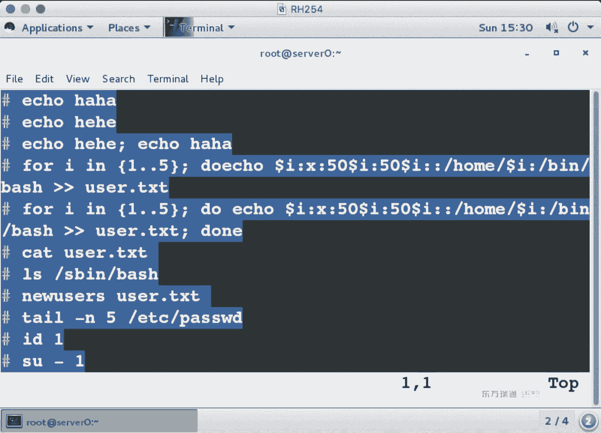
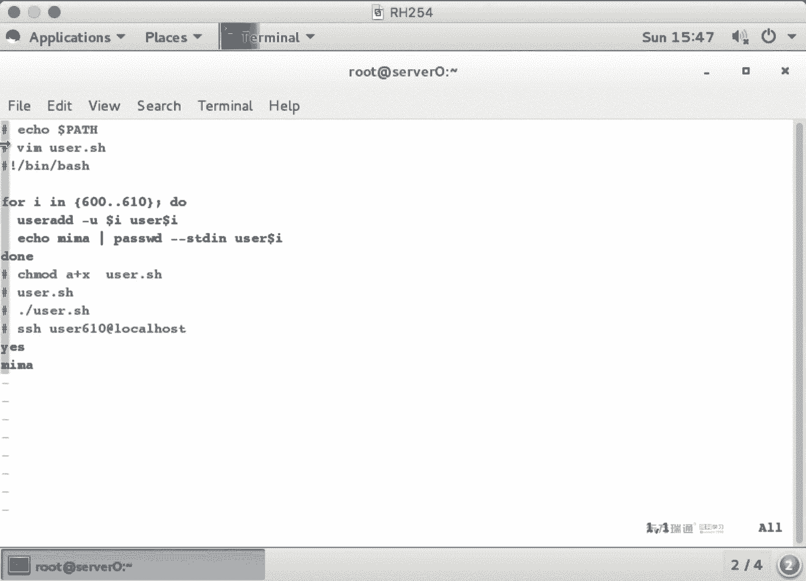
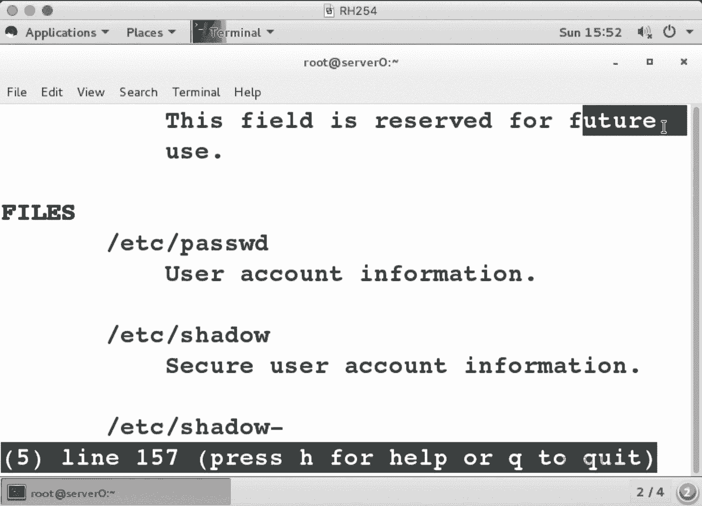

# 红帽Redhat RHCE7培训课程+RCHE7实战参考教程+红帽8.0教材电子版+模拟环境及辅导 - P4：4 - 16688888 - BV1zu41197p6

第五张。用户组。在微软的系统当中啊，我们平时用户和组这个。设不设置啊？平时对于管理员而言，你操作最多的就是用户主还有权限。那下面呢我们看一下第五章和第六章用户主权限。呃。

这两张啊我们在看之前先来学几个单词儿。首先来看一下第一个单词。柚子。又多少什么意思啊？用后。第二单词group。5。Addd。添加。冇得饭。修改。Deelete。删除啊。这章讲完了。

这章就会5个单词啊就完事儿。那也不会说那天下用户呢又是爱的。修改用户呢又做帽的删除用户呢又做利。用户的命令。那如果是添加组呢，gified。修改组呢国如帽子删除组呢，国如何定有这张是不是讲完了呀。

那么这几个命令它怎么用呢？啊，我们来看怎么用。当然不能讲这么快了，是吧？首先呢学一条命令叫ID啊ID标识啊标识这条命令的功能啊是来判断当前系统中。用户的身份啊用户的身份或者说用户是否存在。

我们来看一下。我是谁呀？root。我属于哪个组啊？😡，大家看这个位置有个GID这个位置有个格库斯。格洛库斯是一堆组的意思是吧？一堆组。那么这两个组啊，我们一个把它叫做原始组，一个呢把它叫做隶书组。

一个用户可以属于多个组。或者说我们可以管它叫做主组。组组啊。那什么时候我们会用到隶属组呢？如果你属于某个组，是不是具有该组的权限？换句话说，在系统当中，我们做组定定义，主要是为了设置权限。

在一个公司当中。我有一个财务部门。我新建个财务组，然后呢给财务组相应的权限。只需要把相应的财务人员加入到这个组当中就可以。一般是这么来做吧，有没有人说来个新员工之后，我给他设一堆权限，等这个员工走了。

给这个用辉删，来个新员工再设一堆权限，这个谁也受不了啊，我们用组来做一个套餐啊，做一个模板，就像我们平时用电话的时候也是一样的啊？那我们的电话呀，是不是也用的是套餐呢？不用套餐行不行？

也行吧啊也可以用自定义的套餐，思路相同啊，我们用组来实现。那在下面这段内容啊，它有一个叫countten。content啊conent。context这个叫做内容啊，叫内容。

如果你要用IDstudent。我们是是也可以来查看指定的用户啊。这个用户存不存在stil的用户属于哪个组啊？s定的组和vi物组。他是不是可以属于两个组？但是它的主组呢只能有一个。

我们会发现一般情况下用户的主组和这个用户名是不是相同的？主名和用户名相同啊，比如我姓苏啊。然后呢，有个叫苏轼啊，苏轼什么意思呀？姓苏的一堆人是吧啊，苏轼。好，这个是主组嗯。第一个命令IDID。

那么看L米令。LS命令我们在之前呢见过。这个命令是看什么的呢？以嫦额时显示是吧？显示它内容比较多啊，那我们就看一个文件。最后一列呢代表是文件名。这个代表的啥？时间戳或者修改的时间，这个代表的是啥？

看不懂喝点儿。代表了啥？是。大小是吧，这个喝点是啥意思呀？😡，便于人类读的单位显示吧，humanreable。在前面这俩是啥？文件所属的用户和组。前面这个是用户。后面这个是组。我啦。在前面这个是啥？

我们在昨天呢讲到了每个分区是不是都有两部分组成？一部分叫eow的节点，另外一部分叫block块，有印象吧？O。那么当我创建一个文件的时候啊，它是不是新建了一个节点啊？如果。同一个文件有两个节点。

同一个文件有两个节点，这个位置就是2。它代表是文件节点的个数。一个文件有几个节点啊，有几个节点。同一个文间可能有多个节点吧。可能吧，大家听过硬链接吗？硬链接就是多个节点啊多个节点。再往前。

这一堆代表都是权限。权限。最前面这一位呢代表的是文件的类型。文件的类型。减号代表它是个普通文件，D的话代表的是。文件夹文件夹directory。啊。乐代表了什么？快架方式O。这个权限呢三位为一组。

三位为一组，一共是9位啊，一共是9位。那，它们分别代表什么呢？在linux当中的权限只有三种读写执行read， write， execute。读写执行。读写执行。读执行没有OK。

这三位呢代表说这个文件夹属于入退用户，入退用户的权限是什么？独何执行没有写是吧，没有写减号单位那道组有什么权限呢？如何执行，其他人呢？啥权限没有什么叫其他人？就是说除了这个人，除了这个组都叫其他人。

就说咱们聊天说别人的时候，就说除了这屋子人叫别人，叫做阿，其他人。全部呢就是用户组加其他人都加在一起，就是奥全部奥全部。读这些。这个东西也代表权限啊这个东西也代表权限。他有两个符号，一个是点。

一个是加号。在微软的系用当中啊，我们可不可以在一个文件夹上来设定不同的用户对这个文件夹具有不同的权限？可以吧。let那个 down也可以啊。如果你有具体的权限，这个位置就是加号。

当前只有root用户什么权限，root组什么权限are有什么权限，没有什么stdent呀，汤姆具体某个人某个组的权限，这个位置就是点儿。能理解吗？点代表很少，加号代表很多吧。如果你有更具体的权限。

它显示是加号。先知道就行啊先知道就行。那么我们当天讲这张啊，要求你知道他俩代表什么含义就行了。别的位置呢就是了解了，我们讲下一章的时候呢，会讲到权限。😊，然后呢，这段你要知道。在后面呢第二门课程上。

第二门课。第二门课会讲到FACL，然后我们会讲到它啊会讲到它。有区别吧。就说因为我们现在先用到这个位置了，你就先大概瞅一眼，都代表什么含义就可以，不用你特意去背啊。等我们整门特学完了之后啊，你再一看。

你都不用背，都知道它是什么含义啊。O。我们再来看镜头。那个命令叫PS啊PS。PS什么意思啊？photoshop啊。啊，那是PS6是吧，这个PS叫做process，叫进程啊，叫进程。那。列出进程列出进程。

我们常用的选项啊是AOX。AOX啊奥特4。因为内容比较多呀，我就给大家看几行。看三行得了，OK吧。这个呢是第一行。这个呢是第二行。这个呢是第三行。那为了让大家看出来这个就是三行啊，我可不可以再看一下。

😊，可以吧。是不是三行？user代表是列，大家看得到每一个进程是不是都有都有属于的身份的？用的是哪个身份来运行的啊，哪个身份，这个是user啊，user的含义。pass word文件。

1234567七烈的含义。gro斯文件。12345啊，他什么含义。我们一起来看一下。帕索尔。为了帮助大家理解啊，我们找两个人做个对比。在系统中啊，是不是有一个叫做root的用户啊？我是不是想要第一行。

不想要第二行。第一行是root用户，第一列是用户名。那我怎么来表示？这一行呢。我们在讲VI编辑的时候，讲没讲过一个符号密呀。密代表的含义是什么？啊，行首是吧，或者叫开头。如果你写个meroot。

代表是说已root开头的行。是不是就这一行啊？那我还想看一下sdent用户。😡，你想过滤两个东西，是不是有多个表达式了？这个时候呢用E。容易。这个里面单引号中的竖线是货的意思。

这条命令的作用啊是将pass word文件中。以root开头的行。和sdent包含student行都列出来。能看到两行吧。有朋学说这两行在这个文件中的第多少行呢？如果你还想看行号的话，那就加个N。😊。

the代表是line number。一个在第一行一个在第25行。能看到吧，最前面一列125ok。回头好来。我们做个对比，第一列代表什么呢？😡，这个代表用户名。用户名是谁？第二列代表是密码。

他的密码是小X呀。不是啊，这个位置如果是小X，代表是说密码存在于shale文件中。帅兜翻译成中文是。应付。人类最好的伙伴是谁呢？😊，小狗啊是影子哈，不是小狗啊。😊，ok。所以说password当中啊。

password账号这都是密码。在微软的产品当中，我们是有个sam文件的。账号和密码L那个是是分离的啊，账号密码0011000，这两个数看着眼面熟。刚刚我们看ID命令。

看到了root的用户ID主ID是多少？梁s定他的用坏地索I度是多少？1000嗯1000嗯，刚才都没注意是吧？一会儿你们做时验注意一下啊，再后面。入特。student user，这个是啥？

注释说明啊注释说明在工作当中啊，你们可能有好多用户叫相同的名啊，王平一王平二，那我怎么区分王平一王平二他到底是谁呢？在第五列注释中写。王平一王平二是哪个部门的啊，哪个部门男的女的啊，注视。

在后面跟 rootot跟 home student。这是啥？加目录是吧，用户的主目录最后一列。跟兵bsh跟兵bash。这个代表是用户默认的事儿啊用户默认事在系统当中啊，有好多的事儿。

那为什么我们要用半事呢？😡，呃，在第一门课呀，是不是讲到了天不剑。😊，第一章讲到了tableable键，有印象吗？开播键就是拜师的功能啊，开播键好用吧。那是因为有拜事事它的功能。O。

那我如果就是想知道每一列代表的含义怎么办呢？😡，我们有没有个慢命令？慢几。卖舞pasword的。往下翻。第一列是不名？第二列是拨密码，用户ID组ID注释锁准目录，默认的上。如果这里还看不懂的话。

你就接着往下翻内幕是啥？他说给你解析很详细啊，这个是用户的登录名，是不是用用户名啊？往下翻pasword密码。那如果它是X的话，代表说我们启用了pass word的 can word命令，将密码转换。

到了筛度文件中啊，转换到了筛文件中。UID。超级用户的UID是几啊？😡，凉接着翻GID。这ID代表是主ID。那在系统当中啊，我们也管它叫做主组啊，管叫主组。在下面。这个也不是个词儿是吧？

你看这个词儿comment啥意思呀？😡，注视注视区域吧。接着翻。directory看到这词没？怕你看不到都加粗了是吧？用户的主目录。接着翻sha那默认的sha儿什么呀？拜师吧。如果你不写的话。

那用哪个S啊？sha吧，SH12。SH2那这个事2啊，我们有个变量。变量名系统中默认的变量名都大写小写。都大写。Okay。呃，刚刚我们看到的是password的文件。下面我们再来看group文店。同理。

NET c group。第一列是组苗。第二列是组密码。第三列是阻ID。后边这是组成员。我们在刚刚用ID命令的时候，大家记不记得stdent属于哪个组啊？他是不是属于sud那组和view组。有印象吧。

后面没有写用户名，是因为这个用户名跟组名一样。sdent它属于stdent的组，sdent它也属于will组。能看懂吧？如果。啊，如果你想看一下美列的含义，应该卖什么？卖狗肉卜行不行？卖狗肉卜这是几啊？

😡，我也没写漫谷是吧？😡，因为葛路虎的手册啊就一个5。所以说你直接慢就行。他1234找不着就直接骂舞了。在下面翻页。这跟password一个人做的吧，格式都是一样的。第一列组描，第二列组密码。

第三列组ID最后列组成员。两个文件能看懂吗？再然后书命令。呃，书命令的作用是切换身份。普通用户切换到管理员需要知道管理员的密码。普通用户切换到普通用户需要知道另外一个用户的密码。

管理员切换到普通用户不需要密码。有区别吧？管理员切到普内户不要密码。普通户切换到别的身份，都要密码啊，就这区别。用输命令的话，一定养成习惯加减号。养成习惯加减啊，切换身份的同时，切换环境变量啊，速。

那么速度呢？大家想。你们公司啊服务器有个管理员叫root。然后呢，临时你有事儿要出差。你把root密码告诉别人吗？😡，告不告诉我？告诉别人的话，这个事儿就太危险了，为什么呢？举个例子哈。

你把家门钥匙借给我用了两天，我可不可以去配一把？可以吧。你回来的时候，谁没事换锁呀。OK如果你把root账号密密码告诉其他人的话，那其他人可不可以在系统里再添一个用户I是零的账号，也是root吧。

也有root权限，这事很危险啊。所以说root的身份不要随便给啊不要随便给。那你就是想给某个人具体某个权限的话。给他一个速度的权限就可以，他能干什么干什么okK。咱们来看一下速和速度的区别。

管理员切换的普通用户身份。要密码吗？不要活动用户切换到管理员，你后面如果谁都不写，不写用户名的话，默认是切到注册。要密码吧，root密码是啥？By， hide。登进来了吧。拉完一个Z塔。

是不退回到sil等他了？exit是不是又退回root了？你如果用苏退回来的话，是exit，用SSH退回来的话，也是exit。只不过这个命令我们很少敲，一般我们都是用快捷键ctrl加的吧。

cttrol加D啊，ctl加D。这是苏命丽。那什么时候速度呢？我切换到st那身份。😡，用stu的身份呢，我来看一个文件。大家看这个文件s studentent它有读的权限吗？

死定的话对这个文件是属于other。没有读的信息。换句话说。能看吗？不能看。但是。我们有一个文件呢。叫做sdo。这个文件ste他能看吗？看不了是吧，切换到管理员。大家看一下这一行。井号开头的行叫什么？

😡，都是哈。我如果不想看注世航的话，我是不是可以过滤一下啊？过滤井号是不是只把井号的行过滤出来了，而井号又属于特殊含义，它是不是叫注释符啊？所以说你应该给他一棍子吧。过滤井号。但是我们想要的是不是。

不是井号的行啊。在之前我们看到有个词儿。叫做inward啊inward。取反。能看到吗？那现在啊我来过滤。s do文件包含六的行。然后呢，在这个里面再来过滤一下。非注释行。换句话说，生效了行吧。

双下二行当中看一下第一列百分号view这个行代表说view组。6组在任何一个位置具有任何一个权限。所有的权限吧。死掉了它属于什么锁？死掉是不是属于被要组O。我们刚刚在做实验的时候呢。

大家会发现用st那身份。你去看说不让你看呢。那速度的权限呢就是在行首啊加个速度。要求输入谁的密码？st密码是啥？是 student的。你看这边晚上把改的。

我们上午讲了pass word杠杠stand in是吧，3。密码密码密码，他是 word那昨天的事儿。😡，哎呀，你们记忆力挺好啊。这个记得今天咱又改密码了哈，上午你们是不是做管道实验了呀？😊。

刚刚你们是不是也做了？改回呀，刚刚你们要改的话，这个密码记得让你改成密码了哈，别一会儿敲stu。😊，把键盘敲碎了，也没进去。记得之前干过什么，黑ory是不是能看到啊？如果实在想不起来今天干什么了。

黑推瞅一眼啊，哎黑ory管道过滤一下pass word，哎，有那么一条改密码了吧。好，那我这个密码是MIME。现在能看内容了吗？可以了吧，速度和速他们的区别是什么呢？

速的话是说你把这个整个人的身份都给他了。速度呢是说我将某个命令。那刚刚啊我们在这个里面大家可以看到。后面这个位置写的是奥是吧？😡，他是说把所有命令权限都给他了。实际工作当中呢。

你可以把这个权限去做一个具体的定义，你只能看。你只能赖ice。😡，如果你只是给他一个ca权限，他只能看。如果你只是给它lessice平下，它只能lessice，开都开不了。能理解吧？

而且它支持更小的力度。什么叫更小的力度呢？比如说它只能开某个文件。你就只能看那个文件。你想用什么lessice看那个文件还看不了啊。😡，可以指定命令，加上相应的参数选项，相应的参数选项啊，更小的力度O。

这是速和速度。🤧咱们把这段内容先整理一下。权限。用户。呃，ID呢是查看当前的身份。ID加用户名呢是看指定的身份。然后呢，我们看了一个文件。在用户的主目录下。

跟root用户啊root用户跟root主目录像。固定我的主目录有一个叫anacKS点CM文件。我们之所以加丝呢是为了看大小吧。啊，看大小。看文件夹，看文件夹的时候，为什么要加个D呀？😡，霍加德看的什么？

文件夹里面有什么东西？加到的话是看文件夹。吃过包子吗？😡，加得的话，看的是包子皮儿，不加得的话，看的是包子馅啊，这是嘚的区别哈嗯嘚。那PS命令我们可以来看到晋城啊，晋城内块太多，你可以管道看他一下。

我们会发现在进程当中啊，也有用户的概念。哪个进型属于哪个用户，哪个文件属于哪个用户，哪个文件夹属于哪个用户。然后呢，我们看password文件。在paso的文件当中，我过滤。我过滤以root开头的行。

和student包含sdent的行做对比吧，看一下美丽代表什么含义。如果实在看不懂的话，我们是不是可以漫舞啊？那我里面是不是也会告诉你什么含义？为什么在group的时候不用骂我。

你pasword必须骂我。😡，どと忙。pa送过的是不还卖一呀，对吧？😡，然后。苏命令。管理员切换到普通用户，不需要密码。普通用户切换到管理员需要密码。那我们又看了一下输读尔的文件。输入多二斯文件。

包带vivo的行啊，有三行，我是不是想看一下不包含井号的行啊？为什么几号前面要加个反斜杠？😡，转译型号特殊含义是吧？为什么要杠逼一下？取法吧，inward啊inward这个单词要不会的话。

man grape去查一下啊，取法。再之后呢。注销。注销管理员是不是又回到普通用户了？回到普通户，我们去看他一下。你可以先乐乐VR。3。那的。logg message文件。16个他没有看的权限是吧。

没有读的权限。然后呢，你看着一下。是不是看不了。但是你在这条命令前面加个速度。可以看了吗？输入密码。然后是不是就能看了？能看到之后呢。你再次cttrol压力啊再次 controll压力。

是不是又回到root了？就是这组内容疏和疏度。嗯。那个人什吧。能赶上，我们继续。pass word的命令啊在之前讲过吧。普通用户如果执行password命令，是不是得先输入当前的密码啊？

然后是新密码确认密码，管理员在用pasword命令的时候，用不用输入当前的密码？不用吧，端里边直接是两次密码，新密码确认密码就可以啊，这是pass word的命令。那么这段内容啊，就是讲添加用户。

修改用户，删除用户。那么怎么来添加呢？我们下课休息10分钟。呃，在看添加用户之前呢，我们先来看一个文件，叫login点hesource文件。😊，这个文件呢是一个添加用户的模板文件。

Ling点 default。lockin翻译成中文叫登录给f翻译中文叫默认。在这个文件中啊，我们会发现。😊，朱世航。看十五行mail directory邮件目录吧。接着翻。

25262728pass word是不是都跟密码有关的？密码的最短长度5位。密码的最短有效期0天，密码的最长有效期9万多天。那么warning age呢代表是密码快过期之前提前几天警告。接下来发。

UID。我们记不记得死旧的用户务UID是多少？😡，1000在切版器当中，用FID默认从1000开始。普通用户的用户ID。那如果你们公司用的是lauxD版本的话，它是从500开始。

那中间那些人是干什么的呢？😡，以前的时候啊，我们的系统用户比较少，系统比较少，500个就够用了。但是后来呢这个不够用了，系统用户太多就留了900多个啊，留了900多个。就除了0和1000。

中间那些全是系统用户啊，系统用户给系统用的。那爸看下面。UIDGID。这个是啥呀？系统用户吧。201到999。接着翻。阻IB是不是也1000到6万呢？啊，那用ID主ID能超出这个范围吗？

如果你用优酸艾德来添加的话。默认他是在这个范围当中，你可以指定不在这个范围中也行。再问认句。Core home。我们在创建用户的时候，是不是自动创建用户的主目录啊？就因为这个是yes。

如果你把它改成no的话，就创建用户的时候，不自动创建用户的主目录。your maskyour mask叫权限繁码。这个U是UN的意思，musask叫掩码。UN mask叫做砝码啊，砝码。什么叫砝码呢？

我们下章讲讲权限的时候就讲了啊，就先知道用个东西。You the growth enable。68号。这方代表的含义是说，当你添一个用户的时候，自动添一个这个用户的组。比如说你新建个sud态。

是不是新建了个stud那组啊？如果你这个位置改上no新建了student，不会新建stu组。encraft加密me的方法，SAC一种加密算法，512密钥的长度啊。这个文件看完了吧，下面呢我们来添个用户。

最简单填应户的方式。Tom。最大命令的作用就天用虎。有没有说考试的时候是就考添个用户就完事了吗？当然不能那么简单了。😡，这个用户肯定要给你有点变化是吧？那到底什么变化呢？要求大家掌握的内容啊。

U说艾特的几个选项。咱们一起来看一下。呃，看之前呢，我们先来看一下这个汤姆用户啊。1001是吧，是不是接着1000开始往加1呀？有没有汤姆组啊？😡，有汤姆组吧，有没有汤姆用户的主目录呢？

他门后主目录是不是跟home下？大家瞅一眼。有吗？而且他们又获得主目录。是不是属于time姆用户time姆组啊？谁有权限？嗯，就他们用户有权限吧。嗯嗯就他们用户权限。呃。

再有我们说他的密码啊怎么怎么回事是吧？是不是什么五位呀、7呀、0啊999啊，有印象吧。先来开一个文件。我们有一个叫做。晒le的文件。这个文件是我密码文件呢？大家看这个里面有没有09997这个值。有啊。

这些内容啊都是在log平底fo文件中定义的。你新创建用户什么呀？都是在love in点po文件中定义好的。O我们继续。那下面呢我们来看一下具体填户用到哪些权限。摁个table键之后啊。

大家会发现我们是不是有好多的选项？我给大家讲一下精华考的选项有哪几个。呃。第一个位置UID。创建用户的时候，可不可以证明他UID呀？可以指明这个UID的范围啊可以超出1000到600让U。

如果用一个减号的话，他的书写是杠U啊。第二个。GID。GIB是什么呢？原始组。🤧哼。你新建的这个用户要属于哪个组？原事故。在下面个肉卜丝。格路克斯是什么意思呀？一堆组吧，类输入组啊类输入组。再有。12。

这个扇儿是啥呀？用户默认的是啊用户默认的是。啊，刚刚我们看password的文件中，受害口注释啊。注释要改的话，有什么？common啊common。再有1。用户默认的事是不是跟病下面的拜师？

BASH不写的话，是不是SH啊，这它的区别。这几个选项啊是。经常考的啊经常考的。简单来说呀，他要考的话，主要考哪几项呢？跟他说的文件中能对应的那几项。啊，能对应的那几项。举个例子。举个例子。

我现在新添个用户。叫杰瑞。他们和杰瑞都认识吧？不认识的话，回去看看动画片。叫东北画板老鼠和猫啊，汤姆和jerry。OK那如果你要设定U户ID的话。说杠有啊。默认应该是1002的是吧？

我特意弄个6万以外的。橄榄油。放闭。杠记的话是不是指指明它的原始组吧？是不是说1000到6万之间呢，我弄个1千一里的。弄个一千以里了。当致。再然后呢。呃，这是注释吧，注释的话杠C。哈哈。😊，不是。

这个呢是不是代表用户的主目录啊？目录是哪个词儿歌吧。Go home。老鼠啊。后面是不个是啥尔啊？😡，下是杠什么？S。啊，比如说我弄一个死pe下面的noloing。大家看我这个敲的快不快？唰就出来了。😡。

怎么敲的呢？S table。不是我敲的哈，是table出来的。😊，以S开头的sha就这么名字noloy这个sha儿什么样特点呢？就是用户永远登都不成动。我即使告诉你密码了。敲完你马一回车啪就出来了。

就这感觉。😡，一登上就被踢，一登上就被踢，叫no啥。OK这个命令抄完了之后，我们grarape一下。😊，jeerrry。666999哈哈老鼠弄到给。添加的时候可以指定吧。OK在这个里面要注意啊。

选项和参数之间。有顺序关系吗？有吧，我这个位置是不是说用ID是多少，然后说是666，然后这个位置是不是说主ID是多少，他说999。能看懂吧。好，现在问题来了。😊，看啊。如果你都不写的话。

是不是也能填用户？你要选某一组的话，也可以填户。我给你们写一堆啊，是为了让你们和pass word文件做对比啊做对比。考试的时候到底用哪个选项呢？按题为准按题为准。但不管怎么考啊，就这么几项啊。

就这么几项。如果实在想不起来的话呢，用慢手册来查，是不是都能查到啊？改塞尔就查赛尔，改主目录就查home啊，改主目查home改UID查UID啊。O。跳完了之后呢，我们来看一下L来喽。😊，3号吗。

有老鼠文件夹吗？大家看一下。他的这个组是什么组啊？😡，ID999，这个是这个组。能看到吧。尽量不要用1000以内的数。为什么呢？因为那些是系统组吧。系统组不是给人用的哈，所以说尽量备用。另外一个呢。

这个必须得是存在的。必须得存在的。如果不存在的话，你这条命令啊添加不成功。叫小明你下不充。必须得存在这个组，你才能指定。OK吧。如果你不写的话呢，默认用自己的组名，它会自动创建。O。😊。

那现在啊我觉得这个不太好，我是不是想改成标准的格式啊，修改的话怎么改呢？我们可以用user mode一条命令。全改了。一条命令全改了，你也可以一个一个改。比如说我先改个UID。我想把UID改成100。

该几啦。100是student，1001是汤姆，1002是吧？1002。啊，这个杰瑞吧。搞完了之后，我们再滚一回一下。😊，1002是吧。你想改谁呀，你就直接use个帽就行。

use the艾中所的选项跟U the帽完全一样。到了敲就得啊。OK我们现在改回来U the mod杠杠G。😊，你是不是想给他弄一个叫1002的组啊，这个组存在吗？不存在。

那我们先来看一下不存在长什么样。看到了吧嗯。所以说你是不得先弄个组出来啊？添加族怎么加？调出pad，那如果要添加主ID呢。主I地。突然间忘了。你要干什么？杠P是吧，OK。杠D左ID应该多少啊？再来02。

叫什么名啊？这个组。接来吧。这没报错啊。瞅一眼。这回呢我再次来执行又做mod。没报错吧。确认。Yeah。呃，我用一条命令把这三个都改了哈。😊，Ler帽子。做是。就是改的空该怎么写？一些要对。

现在主是是哈哈。😊，我要改成空一，怎么写？嗯。不写。我要不写，我接着写当嘚的话。这这肯定报错呀。嘿嘿呃，有同学说反斜杠吗是吧？反斜杠风格啊。😊，嗯，O。我朋已经说出来了哈，加单引号。😊，这个位置啊。

我们用一个杠C。单眼或双眼都行啊，写一对，里面是不是啥没有。啥也没有，就是空。能理解吧？再给大家举个例子啊，我们他之前是不是讲过幂代表行首。😊，当位代表行委。那如果用个密刀了的话，代表什么呀？

空行行口就是行尾，代表空行。说啥没有啊。这个类似的哈俩单眼号中间是不是啥没有啊，就改为空。然后呢，祖目录改上home下的尖蕊。上儿呢闭下们的拜。Gary。打完了之后，再次各位。你看注是。

马哈马哈中间啥没有啊，没有空格哈。😊，je瑞。现在问题又来了。那今尾的主目录。大家看啊，你说是杰瑞，但杰瑞总目录现在叫啥？😡，老鼠，你是不是还得给它改成什么名儿？😡，jerry文件夹改名怎么改？

能看懂啊？你要是不给改名的话呀，会有什么结果啊？😡，杰瑞一登录的时候啊。他能找到这文件夹吗？😡，打不着。那理解吧，你说哎，你家在那儿，结果你去那一看，那不是家。😡，找错地方。牛道帽都会用了吧。

跟优带的是不是基本一样？那我们来看不一样的地方。可不可以给用户改名？可以吧？用户既然有UID的话，UID是唯一的名是不是可以改？看菜名，我们有个单词叫login name。要做帽的。

杠l乐代表是lin name的意思。我们给杰瑞改个名，叫做吉米。哎呀，鸡米咋写？嗯拼音是吧啊，吉米。关。啊，就这样吧。不是。O，杰ry。改完了之后，我们来看一下，现在还有杰瑞之人了吗？😊，没了。

现在有几米这个人吗？你看这ID。OK吧。这个是修改用户。再然后。改名是吧，除了改名还能干什么呢？我们还能。😊，呃。把用户塞到某个组里啊，把用户塞到某个组里。stilill能在viU组啊。

那我可不可以把界也塞到viU组里啊？也行，要缩帽的。杠2大G。没有。几米。Yes。能看懂吧，那我可不可以把它塞到root组啊？😡，应该怎么写啊？洛特。发现个啥问题？六组呢。看到了吧。

大G的含义是说修改你的组为什么？改成为什么？是不是就结果啊。结果是什么就是什么。那本身这个呢是它的原始组，是不是永远都有啊？后面你这个组到底有还没有，是看你大G后面的值是多少。

如果你说它又想在root组，又想在vi组。你就这么写。能看懂吧，你的历师度改成什么？大家想实际工作当中，一个用户如果存在于一堆组的话，你这么写逗号逗号逗号也挺疯狂一件事，是吧？本来就有我就想新加一个锁。

用再写一遍嘛。我们有另外一个选项叫A。A大G。A大D的含义是什么呢？你原来在什么组，我不管，我给你老盼子。😡，我怕看这词眼熟吧，VIB期刚讲过，比如说我给你介绍并组。ok 啦。

考试的时候邀求你把用户塞到某个组呃，你到底用哪种方法都可以。为什么呢？因为考试的提议啊，他只要求C一个组，没要求C一的组。😊，所以说即使你不会A呀，也没事儿。但是你必须得会什么呀？大G。

历输入小G原始组。O。这是user mode命例。我们既然能添加用户，是不是应该就能删除用户？现在面我们来看删除用户。要在て。几米。😊，用户删除了之后，用户存在吗？不存在。用户的主目录存在吗？

U高定用默认是指删除用户，不删除用户的主目录。就是人没了，房子还在。翻理有啊。那你想人没了，房子也没了怎么办呢？😡，猜。嗯。杠二啥意思？我们之前呢只要是讲到copy呀，讲到RM啊，跟文件夹有关的。

是不是都加到杠R啊，有一象吧？删除用户的同时，同时把它的宿主目录删了，慢慢也加到杠R。😊，他们的总部诺说也没有了啊。呃，现在要说一个事儿啊，就是删用户的时候尽量加杠R选项啊，尽量加杠R选项。

如果你不加杠R选项呢，一定要记得把这个人的文件夹啊。MV1走。能听懂吧？为什么大家会发现这个位置是不是显示个用户ID？原来杰瑞呀是我们公司的总经理，总经理三年任期已满了，换了个新的总经理。那。

你是不是得添加个新用户？是吧。新用户的ID是11001。没问题了。然后呢。这个时候啊。😡，恰巧又来了个商业间谍。这个商业间谍叫s白。叫小白。大家会发现个问题。小白的用户ID是多少啊？😡，1002吧。🎼。

啊。他的UID1002。那么原来这个文件夹它属于用户ID，是不是1002？小巴用户没有通过任何技术手段，他是不是就能看到这个文件夹？有权限没？能理解吧？所以说当你删除用户的时候啊，请。

把它的主目录一堆删了。如果你觉得它主目录中有一些重要的文件。你可以指上用户，但是呢你一定要把文件夹MV移走。OK吧，MV也走，要不然的话，你想来个新人直接就有权限去看这事儿挺危险。这事儿挺危险。

在公司当中啊什么最重要呢？数据是最重要的。为什么说数据是最重要的呢？举个例子哈，你的银行卡账号名密码，银行卡账号密码，这个数数数据啊。😊，重要吧，你每个月很努力去挣钱。啊。咱不举钱了啊，这个太危险啊。

咱说游戏。好多人玩玩戏，玩了1年，打一车极品装备。然后忽然回家一看呢，发现唉身上装备金币全没了，啥感觉啊？😊，这还不是人民币呢，是吧？😡，现在好多人呢他都不敢用支付宝。😊，都不敢用微信。啊。

都不敢用微信支付，为什么呢？他怕钱没了啊。😡，他把钱没了。确实有风险哈确实有风险啊，不过一般没啥事儿。一般也没啥事。为什么说一般没什么事呢？因为一般我们那里面钱太少了嗯，所以说没啥事嗯。😊，好。

修改添加删除这段有问题没？OK吧。😊，那么现在我们再来看一个组的事儿。我们之前是不是添了一个组？😡，有印象吧？当看这些组是不是还在？我们会添加煮。你是不是也得会修改组啊？煮的话一般会改什么呢？组名吧。

后载组名，比如说。我把UE改成Uer一。再看组名数变了。那若要删除组呢。你g和什么？搞啲。要让返吗？这果都。他说这个是U一的主组，U一还在吗？在啊删组的话，如果这个组是某个用户的主组，是不让删的。

G deal。Sile。哎，佳瑞。接尾组上删吧，为啥呀？用户不在了。能理解吧。啊，这段内容是账号合组啊，账号合组。不善用户目录的结果很危险。哦。我们把刚刚这段内容啊先给大家整理一下啊。

现在我给大家整理笔记，你们是不是都能看懂的呀？黑到A把历史命令写到历史文件，然后编辑。编辑的时候呢，m号 set number是不是显示行号？呃，进来之后，我看看看看文达给你们整理到哪了。速和速度是吧？

Okay。不要的内容都删掉。冒号百分号代表是所有行。为什么百放代表所有行呢？一篇文章从第一个句号到最后一个句号，是不是代表所有行？对吧你随便找本小说。😡，除非那小说里没有句号。否则的话。

第一个句号到最后一个句号就是付有行。为什么？因为正常人说话都得喘气儿啊，标点的作用是什么呀？喘气儿吧。我有好多同事啊，他们写文件从来不写标点。我都不知道他们怎么毕业的。😡，写作文能不写标点吗？😡，哎呀。

该写标该写标点哈。😊，你想啊作家在网有很多作家，他们在写小说的时候啊，主要就靠 build得挣钱嘛。作家他是按字数来收费吧，一个字儿多少钱？😡，最挣钱是标点。当完了，你要写对我点儿，也卖不出去。

是不是啊，得配合的。😡，那个配合。O。😊，百方号代表所有行S代表着替换。S代表替换。意义代表啥来的？😡，黄守扒手。我把杭首替换成井号空格。能看到吧。将所有行的行首都替换成几号空格。

是不是相当于井号面敲命令啊啊，写笔记就这么写的，方便吧？在微软的office word当中有这样的功能吗？美号前面自动加个符号，有吗？有没有。有自动加项目符号的对吧？嗯啊，那你要是要做的话。

得去用项目符号来做。在VIP器当中呢，它有很多强大的功能。这个是我们常用的。我们把这个给我捋一遍哈。😊，第二。新建用户默认的。值啊默认的值U爱的用默认的值。我们天然户可以直接U个I的。😡，然后呢。

你可以看group文件，你可以看shale文件。有同学说，这两条命令能不能合并成一条命令啊？过滤一个内容。从这个目录下的两个文件中过滤吧。诶。这个时候变成一条命令了。大号。确认主目录。瞅了一眼密码啊。

瞅了一眼密码。然后呢，看stuuddent。I看 student。它的值。我们又添了个用户us ID用户ID主ID注释主宿主目录sha。用户名。然后呢，确认。刚刚这些内容啊。

是不是实际上我可不可以直接VIM编辑password文件？也行。但是。还能个办事出来。pa所word的文件是不是在这个目录下？大家看root是不是有写权限。换句话说，我可以直接编辑吧。如果他可以直接写。

如果你实在不会user mode命令的话，直接VM编辑也行。OK吧，结果是相同的。当然后。呃，我们可不可以修改用户的UID呀？可以了。要到帽的改UID。赛尔号。呃。该组外地。改组ID你可以一个个改。

也可以干什么呢？也可以直接改一堆吧啊直接改一堆。那这个十四行命令啊能执行成功吗？不能，为啥？因为那个主收不存在呀。😡，能理解吧？你创建用户的时候是不是可以自动创建那个组啊？当是你修改用户的时候。

它们可不会自动新建组。所以说你得十四行十5行，是不是自己先添个组啊？然后呢，把这个确认。之后把用户卸到这个组当中。确认。再然后我们是不是一堆人改了注释诉主目录上。可以直接改吧。炸到之后呢，过滤。

国内杰瑞确认。但是你会发现它的主目录啊名变过来跟home接尾了吗？没有吧，创建用户的时候是不是可以自动创建它的主目录啊，改的话不会自动创建。所以说你需要把它的主目录改一下MV给文件夹改名用什么命令？

MOV。确认。然后呢，我们改用户登录名L代表什么？loin name ， login name，确认。变成几米了。再然后呢，甲用户所属的组，如果2628用这两种方法的话，是不是说把它的隶属组改成为什么？

那我们的想法是说，养生它在多个图当中，你可以用第三十行第3十2行这种方式。三十行呢就说你再哪几个组，把组名都写上级别相同，什么符号分割。逗号分割，如果本身已有的组啊不想动，想多加一个组，应该用什么G啊？

AG增加一个负属组。确认删除用户。当你把用户删除的时候，你会发现用户是被杀了。但是他主目录在不在？总部都还在。所以说我们删用户的时候需要加什么选项？杠R杠R之后呢，用户也会被删掉，主目录也会被删掉。

然后呢，我们又添了个用户U一。又添了用户s。这个speide的UID啊和我们刚刚那个用户。jerry吉米啊和吉米他的那个用户ID相同。所以说呢。他是不是有两个文件夹都有读写权限嘛？很危险啊很危险。

再然后呢，对于组的修改，我们是不是可以看组文件嘛？我们可以给主名做修改。把U一这个组改成了UZ一的组。组名改成了右边一摸代表是name的意思。group name啊group name改完了之后呢。

我们去确认删除让删吧。不让删吧，为啥呀？😡，因为是主组，那个用户是不是还在呀？那个用户还在。赛尔号。我们把尖锐的组删了，让删吗？那喊，因为这个组里没人了。呃。这段实验中啊要求各位同学掌握的就是。

user group add mode deal命令，他们的用法会添加组，会把用户塞到组当中，会添用户okK考点哈考点。然后呢，用户的事是什么杠S啊考点UID考点。大致隶属于哪个主考点？

就怕错过中那几项啊，就考点。到德考哪个规定？以提议为准。嗯，下面呢我们来看几个小实验。跟账号那足务有关的。在RC的考试当中呢，有两道脚本题，其中有一道就是批量添加用户啊，批量加用户。

我们在第三门课呀会专门来讲批量迁加账号这个实验这个脚本实验怎么做？那对于第一门课而言呢，只是涉及到脚本中的一部分知识点啊一部分知识点。我们先来看一下。VM编辑一个文件，文件中五行。

你看这五行的格式眼不眼熟。是不是pasword文件中它的格式啊？再然后newus命令，这条命令的功能是导入这个用户。把这些内容导入到password文件中，导入之后呢，去判password文件。

发现哎有这么五行，有这5个人，同时呢也会有他们的。祖红路同时也会有他们祖红路。山亚兰成。我们把这个实案给大家演示一下啊，那么在做的时候啊，如果你直接用VI做的话，实际上这个事儿有点傻，为什么呢？

VIM编辑个新文件。写了一行。然后呢，大家Y是不是复制一行？这个得几批啊？4P吧。这个有4P，四批了之后啊，是不是改改改改改竖着改吧。😡，挺麻烦。最简单的方式呢应该用放循环来做吧。大会发现。

我们竖着看的时候，他是不是这个数是12345这么变的呀？1235他么变了。OK呃，我们用个放循环来生成右左点TIT文件啊，看怎么做。2。定一个变量。接下来名随便洗。印一个范围。

我们那之前呢讲没讲过11点点儿。有印象吧。他代表台是不是12345啊？然后。不。啊，这个位置我是不是写了个分号，分号代表什么含义？爱好哈哈。😊，艾le呵呵。itle呵呵分号itle哈哈。😊，啊。

张号代表回车吧。能理解吗？一个特殊符号哈。okK回过头来放另一个变量印一个范围。😊，度度的话是说开始一个循环。开始了什么循环呢？我们要生成这么个文件，我可不可以挨一个内容到一个文件中。😡，可以吧。

apple一个内容到一个文件中，文件名是不是叫user点TIT啊？如果这个位置用大于号的话，是不是就更新更新更新？我是不是想追加追加追加，所以说应该用。两个大于号吧，那么它的内容应该是啥嘞？😊。

一冒号501冒号501冒号冒号。我们先照着他原来的写啊，一冒号。😊，这啥来的？X吧。X冒号501冒号501。用户ID左ID注释，然后嘞。走末录吧。然后嘞。下了吧。是不是这么格式啊？

那第二行的时候第二行的时候，这个负数变成二了呀。换句话说，这位是不应该是变量？啊，你既然是变量的话。我们上面定一个变量，I是变量吧，引用变量是啥来的？到了挨吧。这个一。说到一就是都是变量啊。ok。

到一是变量，到了I。到来。到来。能看懂吧？到时候。哎呀。诶。想加个空格吧。因为这一串行啊就忘了加没加空格了。你要怕忘了的话，你先回家车就行，是吧，先回家车。但是什么意思呀？干完了N发捏上。

大家会发现这个位置是不分号。这个位置有分号。度是开始循环，但是循环完成。循环几遍呢？五遍。循环完之后啊，我们来确认一下是不是有一个叫user点TIT的文件。

1234550123455012345home12345符合提要求吧。你说这写个死殡下面的拜师。我写的是B下面的拜师是吧？死蒂那妈有败是吗？说没有啊。跟着我写哈，写B下面的拜师。okK这个文件有了之后。

我们是不是应该用newug命令导入这个文件呢？打入了之后，我们来看一下。password文件有这5个人了吗？😡，有了吧。是不是有这人呢？你是不是想验证一下？😡，用输命令可不可以切换到普通用户啊？

当时你签完过去之后啊，你会发现他的前挡服怪不怪？😡，很怪吧。为啥嘞？😡，我们用入死丢那身份登录的时候，怪不怪？大6那下面是不是好多隐藏文件？然后呢，我们来看一下这个用户下面。是不是挺干净的？

因为用newU的是导入的时候，它少了一些基本的配置文件。那一些配置文件在哪儿呢？在skirl目录下。记不记得我们在昨天呢讲那个toppys下的某个文件，一堆隐藏文件有印象吧？那如果想要这个用户正常的话。

你需要干什么呢？copy。文件夹是吧。跟TCs，然后呢。点儿。A报废。香。考贝到哪？单号嘛一。飞车。拷问完了之后就行了吗？😡，还没有。大家看一下这些文件呢，你用的是谁的身份拷贝的？入的身份拷贝。

那么这些文件属于谁呀？root用户root组，那你应该让他属于谁？😡，是备应该属于易用户一组啊。我们还应该额外做一条命令，亲者all命令。OM是自己的。把什么东西改成自己了，自己是谁？用户名冒号组名。

用户名吗？好狗名。Going home。分号码一。下面有好多文件呢，如果你只写到一的话，它是只会改这个文件夹。我是不是想把文件夹和下面所有的子文件文件夹都改了呀？😊，那这个位置需要加一个选项杠R。哎。

又用到杠R了是吧？只要是提到目录啊，你会无数次的看到档案。完后了之后再次乐乐瞅一眼。是不是都一一了？再为大来确认书。看痪SU什么意思？So。最后一次书命令是吧，嗯，小大福正常了吧。

就是如果你用newU的是导入用户的话，你还要额外的去copy一下。那剩下那个2345啊，你是不是也得靠一下？可不可以方循环？鲍新华234沈完成。这个实验呢主要是为了讲放循环呢。

首先第一个。如果是按照PPT上的名啊，应该叫new userer啊。但实际上讲的是for循环。New yo。前面这段是为了讲分号的作用。3号的左右。然后这个呢就是for循环的用法。

如果你想看着好看的话呀。回车。回车。能看懂吧？你要是不想写分号的话，你可以这么写。这么写也行。这么写也行。就是这个好多格式啊好多格式啊，只不过一般我们写的时候啊，我们习惯于。这么写。那你有啊。

放循环度开始循环，待循环完成啊待循环成，然后确认。确认了之后呢，由new约塞4道入。用ca命令来确认password中有这个人。但是有这个人之后啊，他的这个主目路是比较特别呀啊比较特别。

所以说我们看一看干干什么事啊。你现在输过去的话很特别，那应该看看干个什么事儿。考贝。拷贝的话，是不是咱也可以用包循环来做？也可以吧。放用完，我变类名还叫I行不行？😡，随便。它可以叫I。

In一个范围度开始循环。然后这回循环我要干的是什么事儿啊？拷贝吧。咖啡。因为里面有文件，有文件夹，要后加杠R跟ETCki。下面是不是好多文件？靠背到哪？引用变量要加doller，你要引用的话。

再给他一刀是吧？嗯，给他一刀。拷贝过来。除了拷贝之外，你还干了个什么事儿？😡，更该所属啊。是不用户名冒号。组名。然后嘞。他的总目录。因为有子目录，所以说又加了个杠号吗？干儿。到底是当R小R啊。

用卖手册去看。查 back save那个词对应的是大刷啊OK吧。这个谁还能跟上吗？你再来一点。这大来。在在。那个啊再来一遍吧。我就把下面这个再演示一遍哈。😊，我演示一个循环烧密码了吧。

咱有5个用户是不是都没密码啊，我给他们说个密码。😡，这个要再讲一遍这个实验呢，我怕你们受不了，就稍微有点变化啊。给大家介绍一条新的命令叫做赛QSEQ。SEQ的功能。干嘛呢？

是不是跟那个发货1到5是一个意思呀？😡，到了括号。白袖衣。这面一个意思。放循环定一个变量，印一个范围。诶。度。看看了啊。然后呢，我要去干一个事儿，设密码。设密码的话，我们是不应该是ecle一个密码。

管道pass wordstand in。然后用户名啊。再之后是不是答你完事儿了？但是这个太简单了，我们弄的稍微复杂一些。我想让每个用户的密码都不一样。用户的密码起名为什么呢？😡，啊。第一个用户的密码啊。

我想给他起名为大P。😡，8P，然后一最后一个D。那我该怎么写？大批。到了爱的。这么写行吗？系统看到当德I的卡。你后面还带个D是吧，系统会认为ID是毕大名。😡，那怎么办？能看懂吗？你给那个棍子。

应该在问的，是不是分割呀？进你看哎，这一棍子非常好使啊啊非常好使。咱没事是不老用棍子呀。😊，没事，还双节棍。但完成。转过我没？看到了吧，如果你今天提示也不想看的话呀。

是不是可以在它后面加上一个and大于号跟德莱斯木有啊。就提示也没有也干完事儿了。okK呃，这个实验呢主要想说明的就是除了发货号。我们还有另外一种写法。如果你的变量名。如果你的变了名。

后面还接其他字符的话，请加一个特殊符号转译做分割吧。叫三个。当然了，我们也可以给这个加划括号给括起来也行，好几种写法，这种写法我是觉得最方便的一个符号就完事，一个符号就完事。😊，方循环看懂了吗？

这位懂了吧？方循环简单来说一下，就是把这个变量取出来这几个值5个值是吧？首先取出来第一个值。是不是P1呀？是大门一。然后取出第二个值，就这么一转转转转转，这行五遍，叫耗循环。那个大运号是自己出来的。

青岛符号，不是我敲的。😡，我删了的原因呢是怕你们敲大于号。有同学做实验特别认真，往上面多一个符号，他得敲一个符号，所以说我只能把大电号给你们杀了。

你们能理解我啊。

啊。ok。这个飞案门口是吧？那跟上我们继续。呃，这个这个这个。编是编辑个文件吗？然后呢。这个是做一个脚本的思路。做一个脚本的时候啊，有三步。哎，也是三步是吧？

第一步脚本的第一行必须是警号叹号跟兵blash，这个中间有空格吗？没有。第二步。脚本在做完了之后啊，中间就是命令了啊。做完了之后呢，脚本必须有什么权限？😊，执行权限。第二步，脚本必须有X执行权限。

为什么X叫执行呢？你在windows当中啊，是不是有一个叫EXE文件呢？有吧，大家说把元一省略是不是就剩个X？所以说X我们叫执行叫excuse啊exe。第三步，你要知道就是脚本在执行的时候必须要写路径。

打。这个文件是不是在当前目录下？没写路径啊，当前目录。那么你在执行的时候就要写当前目录下的这个文件。如果你不写路径的话，系统找不着这个脚本文件，执行不了。能听懂吗？昨天呢有同学问了我这样的问题。

老师为什么要有环境变量？😡，为什么要有环境变量？😡，我们拿pass给大家举个例子。在微软的系统中，有没有pass这个电量？所有的操作系统中都有这个变量，这个变量作用什么？大家在敲命令的时候。

你写过路径吗？😡，为什么你不写路径，系统也能找到这个命令啊？😡，就是因为你说了啊，你敲命令的话，去这些路径中去找大家看到冒号没？这个叫分割符啊分割符。当我执行pass word的命令的时候。

系统会先在这个路径中找。没找着的话，去在这个路径中找。然后这个路径这个路径是不是一层层找啊？大家看一下最后一个路径，这个路径是谁的主目录？是吧当前用户的主目录。对于用户自己的脚本而言。

你可以把它们都放在自己的闭目录下。就不用写路径了。能听到吧。都放在自己的B目录下，就不用写录像了。但是在考试的时候啊，要求我们做的。都不是放在闭目录下啊，所以说这事儿你知道就得。工作当中。

你自己做的脚本可以都放在闭目录下。每次脚本执行的时候呢，直接写脚本名，不用写路径。但是不在这些路径当中必须得写路径，不管是绝对路径还是相对路径，都得写啊，都得写，不写路径，执行不了。ok。好吧合对法来。

😊，🤧嗯。看下这个脚本啊，这个脚本干嘛的呢？定一个变量，在一个范围当中。然后呢。是不是添一堆用户啊，指定用户ID，然后呢给他们设一堆密码吧。给他们设AD密码。这个是不是用一个脚本来做的呀？

我们在上一个实验中，是不是用一个放命令来做，没用脚本。甲本和命令的区别是什么？😡，脚本实际上就是一个有一定的思路吧。大家想在实际工作当中，我要去干一个事儿，1235789十0，你要干十步。这实物呢。

我有100台机器。换句话说，1步乘100，你是不是得执行1000条命令？啊，然后今天就正好下班了是吧？😊，我们怎么做呢？做一个脚本，脚本中十条命令，然后呢把这个脚本啊在这100台机器上都执行一下。

是不完事儿了。😡，能理解吧。SSH命令啊，我们后面会讲到它支持远程执行命令啊，支持远程执行。换句话说呢，实际工作当中，如果你有批量。重复性的操作。我们都要做脚本，微软的系统，我们管它叫批处理。

经过批处理吧。来那个是呢，我们管它叫脚板。然后在这个像什么photoshop啊。office呀office里面叫VBS。😡，叫VBA啊VBA。ba必也听过吧。没听过你听过红吧。

office里面图形界面就红，字符界面叫VB的。就说在好多的应用当中啊，它都有类似的功能，脚本啊脚本。O。😊，那我们把刚刚的这个实验呢。给大家演示一下。编辑。文件名叫啥？user点SA是吧？

右左点SH左本的第一行井号叹号。真兵办事。是不是住市行了？井号代表注释叹号代表执行，后面是一个12名，它代表的含义是说，下面所有的命令都在这个12条运行。都在这个上面面写。当然后。是不是写了个放循环呢。

印一个返围吧。嗯。这个范围是多少来着？600到610是吧？600到610。当然了，你用SAEQ来做也可以吧，都行。动。开始执行但执行完成。然后呢，在里面是不是干了两个事儿啊？😊，一个是添用户吧。

另外一个是不是设密码？天路的时候是不是要指明用快递？

用户ID是多少？就600吧，是不到疤哎。

用户名是什么？又是。6到600。他是不是有user到了I呀？设密码，pass word的。刚刚s in。又子到了爱。然后呢，密码是什么？OK吧。😊，做完了之后。你是不是想让这个脚本有执行权限呢？

新志报的。O加X呢是说other有执行权限。A加X呢是user group other都有执行权限。A是所有人。做完了之后再，确认一眼。你看一下是不是所有人都有执行权限。叉叉叉吧，三叉啊三个叉。执行。

如果你直接这么执行的话。看到没？找不着。你得把它放到pass路径里。是不是跟root下有个B文件夹啊，放在那个里面，它可以执行。那如果你不放在那个里面的话，要不然你就这么写。要不然的话，你就这么写。

两种写法一般情况下，我们这么写用的比较多。应该少错好几个字母。能理解吧？绝对路径的话，你是不是也跟入坦？再写个点儿就完事。唱歌未？确认。SSHuser610。8 local house斯特。yes。

密码啥？密码。OK吧。实验完成。呃，这个实验。右字。Pass。冒号R。在VIB器中默行模式下，有个叫冒号R的功能，R代表是read。read的什么意思呀？读啊我可以读入一个文件的内容。

我刚刚是不是写了个叫做。user点SH文件吧。现在我光标在这行哈，光标在这行回车。😊，大家可以看一下这个文件的内容是不是直接读进来了。我用再写一遍吗？不用啊。然后加权限。直接执行第十行能成功吗？

找不着路径。确认。Yes。木马。

这段时间呢实际上讲的是一个脚本的用法。Sip。在脚本当中，你必须干这么几步。第一步。第一步。脚本的第一行要写井号叹号拼频办事。在第一步。第二步。甲板必须得有执行权限。第二步，第三步。

脚本执行的时候必须要指明路径。必须要指明路径。不指明路径的话，你要把脚本放在相应的pass路径中。到底哪个路径看你心情。刚刚是不是看到一排呀？doer pass那一排随便。咱会必须有这三步哈，有三步。

考试的时候呢会有两道教本题。两道这本题都是按照这个思路来写，他们唯一的区别就是脚本文件中的内容不一样，按照题的要求写内容。OK吧。好，这段内容有问题没？没问题，继续哈。😊，那，我刚刚讲没讲过组的管理呀？

groupb添加组group deal删除组。当然发现PPT上用的是不是都速度米了呀？考试的时候，你用不用去折磨自己，一直速度速度速度啊。不用吧。直接用入的身份去配置就行，OK吧。😊，主的修改。呃。

国爱的。如果加了一个杠R的选项啊，是说把它变成系统组。N呢是改组名，G呢是改主ID。A大D呢是不是说把一个用户塞到一个组里呀？增加一个组。看衰道文件。12头789哎，9列，我们也来看一下。代表的含义。

Gip root。よ第い。Stdent。带走。第一列呢代表是用户名。第二列代表是密码。这密码多少位呀？😡，128位。是不密蚊的呀？SHA加密的密文密码，看这个1626。17265，这个是啥？

最后一次修改密码的时间。和1970年1月1号之间的天数。换句话说，1970年11号加上这个天数，就是最后一次修改密码的那天。うも。有同学说你说话太绕了呀，一会儿嘛看慢手册就看懂了哈，先大概听一嘴得了。

😊，09997，这个是啥？😡，密码呢最短有效期、最长期和失效之前警告的时间提前7天警告吧，密码快过期了，最后是不是还有三位？最后三位代表什么呢？😡，忘了。忘了怎么办？😡，慢se度。结果你发现这是几。😡。

我想看的是文件是吧，那该怎么办？😡，漫舞。翻页ctrl F，第一列是logy name名，第二列是加密的密码。第三列哎。密码最后一次修改日期。怎么算呢？看这日期没？它是个number，是个数值。

一个天数的数值。从1970111号加上那个数值，就是那天。再然后密码了最多有效期，最长有效期。猫宁是什么？😡，警告。那这个呢。失效时间吧嗯失效时间。再然后。这个呢。X2也是失效时间。

这个失效时间和那个inXK有啥区别？这两个都是时效时间。

最后一列啊，它是保留未将来使用。那么两个时效时间的区别是啥？我们回过头来看一个图。这刚刚讲的内容是吧，inactive和expi的区别。看下这个图。这个叫inactive，这个叫exp，你定义的密码呀。

到这天最大的时间999，到这天密码过期了，这个代表是过期的时间。这个东西过期了就不能用了吗？还能用这么几天。能理解吧？这个是个弹性的时间，密码是过期了，还能用这么几天，这个叫inactive。

比如说我买了个鸡蛋，鸡蛋有效期上面写着说20天。😊，过二天之后，这鸡蛋还能吃吗？我也不知道，我打开之后尝尝没有味儿，吃了也没啥事儿。😡，能理解吧？当然了，你要看这个有味儿了，鸡蛋清和鸡蛋黄已经看不到了。

你就别吃了哈。😊，当然你也可以吃啊。减肥嘛连续吃一年。肯定非常瘦啊。别吃哈别吃啊。好，EX我理解了吧。😊，我们来看一下这几个时间呢，这个是个时间轴。命对密码的最重要期望。

代表着说密码在这段时间之内不允许改密码。😡，麦ax day大摩。代表是密码的最长有效期。一得酒吧，到这个时间失效，这个是失效的时间。汪宁呢它是提前几天警告W吧W。再然后乐呢啊不对，I呀。

I代表谁inactive。你。这个时间比较特别哈，windows当中没有这个概念啊，windows里没有这个概念，过期了就过期了是吧？提前提前警告过期完事儿啊，但le那个是不是他还可你复裕几天。😊。

那如果想修改的话，那我们一个命令叫做change age。change是什么意思啊？更改是吧，A是什么意思？年龄吧，更改年龄更改谁的年龄呢？更改某个用户，他的最短有效期，最长有效期。提前几天警告。

密码过期了之后呢，还能再用几天。还能再用你的大I。啊，去那一支钢地呢。第一代表是天是吧？零。如果你用的是change ageD0的话，代表是说密码。用户下次登录的时候必须改密码。

就像windows端可不可以来设置用户第一次登录必须去修改密码啊。可以吧，linux就是用change age杠D0来设置。如果你要查看呢，就杠了。你要想设置失效时间就大E大E侵这A值命令。

okK然后把这个内容也给大家看一眼啊。刚刚啊我们之前提到过说，用户你默认的密码策略是不是可以通过log那给fo来设置啊？这个杠挨呀代表是阿德脑忽略的意思。因为原来那个文件中是大写小写，我忘了。

再加个I忽略。当我新建用户的时候，是不是以这个密码策略来走啊？新建用户的时候，那用户已经添加完了。用户已经添加完了，我想把这个时间给改了，我们看怎么改。侵权意识。你都想改啥？😡，这个是最多养效期是吧？

比是说你密码至少用30天。大M呢最剩一条7吧。你密码能用几天呢，能用3个月。90天。提前几天警告呢？一般说提前7天呢，我给你两周时间。可以吧，stdent。擀完了之后呢，我们再来瞅一眼。OK了。当然了。

你要不这么看的话呀，我们可以听至A杠了。字稍微弄小点啊。密码最后一次修改的时间，17年4月9号。今天吧。嗯。密码什么时候失效啊？😡，17年租了8月。这租了是几月？阻碍啊。如果你不知道他是几月的话呀。

我们有个命令。用什么命令能看日历呢？卡里哪吧。看见的。哎，这是4月。那你要想看2017年呢。快手术吧。啊，这个是1月。这是2月横着看哈，强调一下横着看3月。一排是一个一排是三个月份。然后呢。

我们数了一下，唉，这是不7月呀？英文不认识，不要紧哈，多学条me令开lin啊开lin。ok。回过头来啊，我们再来看。😊，password inactive，但是我没有设置啊，never没有。😡。

什么时候失效？密码呢最大1739114，刚刚设置的吧。现在我再去干一个事儿，change age杠D0。16的。然后呢，我用。ste的身份来登录。密码谁的密码啥来着？密码。是不是输入当前密码。

是吧新密码。小地灵能理解了吧。大T艾33W0RD。大P艾33W0RD。我改完了之后，他说成功了，然后就给我踢了，看到没？😡，然后呢，用新密码来登录8P艾33W0RD。ok k 啦。😊，呃。

今天就这些内容。哎呀，4点。呃，还有一个半小时是吧？OK你们先下课休息10分钟，我把笔记给你们整理完。然后10分钟之后啊，你们开始做这组实验。

O吧。😊。