# Linux用户与组管理：第4章：用户与组管理基础

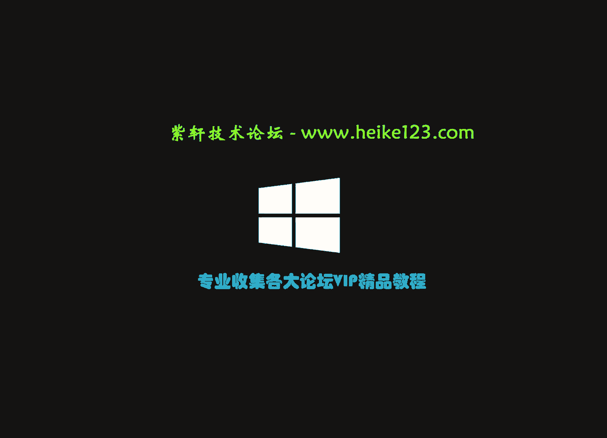

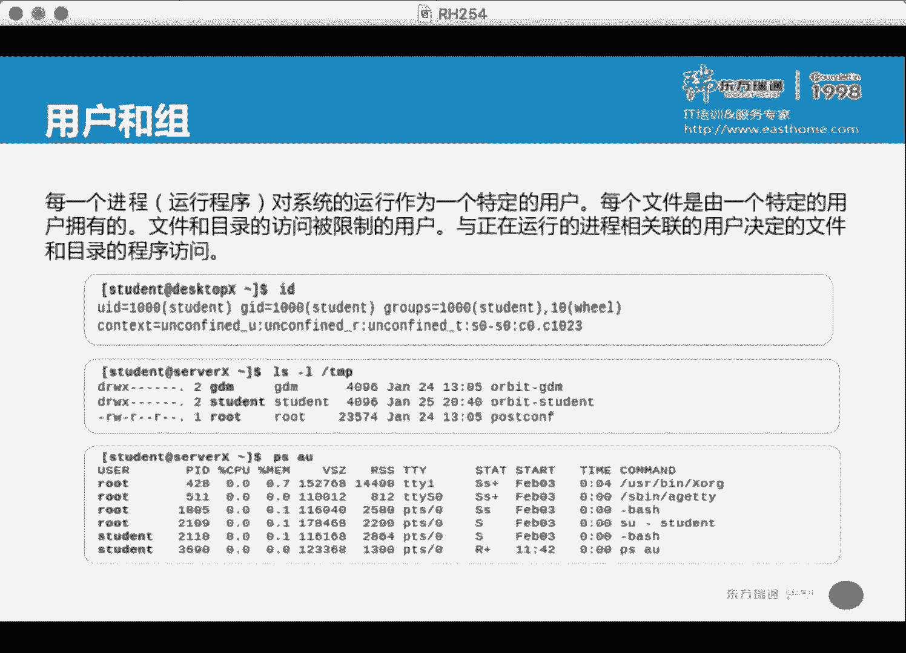

在本节课中，我们将要学习Linux系统中用户与组管理的基础知识，包括如何查看、添加、修改和删除用户与组，以及理解相关配置文件。

## 概述

用户和组是Linux系统权限管理的基础。管理员日常操作最多的就是用户、组以及权限设置。本章将介绍管理用户和组的核心命令和概念。

## 核心概念与命令

首先，我们学习几个核心单词及其对应的命令：
*   **User**：用户。相关命令：`useradd`（添加）、`usermod`（修改）、`userdel`（删除）。
*   **Group**：组。相关命令：`groupadd`（添加）、`groupmod`（修改）、`groupdel`（删除）。

### 查看用户身份：`id` 命令

`id` 命令用于判断当前系统中用户的身份，或检查指定用户是否存在。

```bash
id
id student
```

输出信息中，`uid` 是用户ID，`gid` 是用户的主组ID，`groups` 列出了用户所属的所有组（包括主组和附属组）。

### 查看文件归属：`ls -l` 命令

`ls -l` 命令可以查看文件的详细信息，包括其所属的用户和组。

```bash
ls -l /root/anaconda-ks.cfg
```

输出示例：`-rw-------. 1 root root 1586 Apr 9 17:27 anaconda-ks.cfg`
*   第3列 `root`：文件所属的用户。
*   第4列 `root`：文件所属的组。
*   第1列的10个字符代表文件类型和权限。例如 `-rw-------`：
    *   第1位 `-` 表示这是一个普通文件（`d` 表示目录）。
    *   后9位每3位一组，分别代表**文件所有者**、**所属组**和**其他人**的权限。`r` 代表读，`w` 代表写，`x` 代表执行。
*   权限末尾的 `.` 或 `+` 符号：`.` 表示只有基本的用户/组/其他人权限；`+` 表示设置了更细粒度的ACL（访问控制列表）权限。

### 查看进程所属用户：`ps` 命令

`ps` 命令可以列出系统进程，通过常用选项 `aux` 可以查看每个进程的运行者。

```bash
ps aux
```

输出中的 `USER` 列显示了运行该进程的用户身份。

### 用户与组配置文件

上一节我们了解了如何查看用户和组信息，本节中我们来看看这些信息的存储位置。

#### `/etc/passwd` 文件

此文件存储用户账户信息。每一行代表一个用户，由冒号 `:` 分隔为7个字段。

```bash
grep -E ‘^root|student’ /etc/passwd
```

字段含义（以root用户为例 `root:x:0:0:root:/root:/bin/bash`）：
1.  **用户名**：`root`
2.  **密码占位符**：`x`（实际加密密码存储在 `/etc/shadow` 文件）
3.  **用户ID (UID)**：`0`（0代表超级用户root）
4.  **主组ID (GID)**：`0`
5.  **注释/描述**：`root`
6.  **家目录**：`/root`
7.  **默认Shell**：`/bin/bash`

可以使用 `man 5 passwd` 命令查看该文件的详细说明。

#### `/etc/group` 文件

此文件存储组信息。每一行代表一个组，由冒号 `:` 分隔为4个字段。

```bash
cat /etc/group
```

字段含义（例如 `wheel:x:10:student`）：
1.  **组名**：`wheel`
2.  **组密码占位符**：`x`
3.  **组ID (GID)**：`10`
4.  **组成员列表**：`student`（多个用户用逗号分隔）

可以使用 `man group` 命令查看详细说明。

### 切换用户身份：`su` 与 `sudo`

#### `su` 命令

`su`（switch user）用于切换用户身份。
*   普通用户切换到root或其他用户：需要输入**目标用户**的密码。
*   root用户切换到普通用户：**不需要**密码。
*   建议使用 `su - 用户名` 格式，`-` 选项会同时切换用户的环境变量。

```bash
su - student # root切换至student，无需密码
exit # 或 Ctrl+D 返回原用户
su - # student切换至root，需要root密码
```

#### `sudo` 命令

`sudo` 允许授权用户以root或其他用户身份执行特定命令，而无需知道root密码，更安全。
*   配置存储在 `/etc/sudoers` 文件中。
*   使用 `visudo` 命令安全编辑此文件。
*   示例：授权 `wheel` 组成员执行所有命令。
    ```bash
    # 在 /etc/sudoers 中找到此行
    %wheel ALL=(ALL) ALL
    ```
*   被授权用户在执行命令前加 `sudo` 即可。
    ```bash
    sudo less /var/log/messages # student用户尝试查看日志
    ```
    系统会提示输入**当前用户（student）自己的密码**进行验证。

`su` 是切换整个身份，而 `sudo` 是临时提升单个命令的权限，并且可以精细控制。

---

## 用户管理实战

了解了基础概念后，本节我们来看看如何具体管理用户账户。

### 用户模板文件：`/etc/login.defs`

在添加用户前，先了解默认设置模板。`/etc/login.defs` 文件定义了创建用户时的默认值，如UID/GID范围、密码策略、是否创建家目录等。

```bash
grep -v ‘^#’ /etc/login.defs | head -20 # 查看非注释行
```
关键参数：
*   `UID_MIN` 1000：普通用户UID起始值。
*   `CREATE_HOME` yes：是否自动创建用户家目录。
*   `USERGROUPS_ENAB` yes：是否创建与用户同名的私有组。

### 添加用户：`useradd` 命令

最简单的添加用户方式：
```bash
useradd tom
```
这将使用 `/etc/login.defs` 中的默认值创建用户 `tom`。

`useradd` 常用选项：
*   `-u UID`：指定用户UID。
*   `-g GID`：指定用户主组（原始组）。
*   `-G GROUPS`：指定用户的附属组列表。
*   `-c COMMENT`：添加注释信息。
*   `-d HOME_DIR`：指定家目录路径。
*   `-s SHELL`：指定默认Shell。

**示例**：创建一个特殊用户 `jerry`
```bash
useradd -u 666 -g 999 -c “haha” -d /home/mouse -s /sbin/nologin jerry
```
此命令创建了用户 `jerry`，UID为666，主组GID为999，注释为“haha”，家目录为 `/home/mouse`，且使用 `/sbin/nologin` Shell（禁止登录）。

### 修改用户：`usermod` 命令

`usermod` 用于修改现有用户属性，其选项与 `useradd` 类似。

**示例1**：修改用户UID和主组
```bash
usermod -u 1002 jerry
groupadd -g 1002 jerry_group
usermod -g jerry_group jerry
```

**示例2**：清空注释、修改家目录和Shell
```bash
usermod -c ‘’ -d /home/jerry -s /bin/bash jerry
mv /home/mouse /home/jerry # 需要手动重命名家目录文件夹
```

**示例3**：修改登录名
```bash
usermod -l jimmy jerry # 将用户 jerry 改名为 jimmy
```

**示例4**：管理用户附属组
*   `-G`：直接设置用户的附属组列表（会覆盖原有设置）。
    ```bash
    usermod -G wheel jimmy # jimmy的附属组仅为wheel
    usermod -G wheel,root jimmy # jimmy的附属组为wheel和root
    ```
*   `-aG`：将用户追加到某个附属组，不影响原有附属组。
    ```bash
    usermod -aG root jimmy # 将jimmy添加到root组，原有附属组不变
    ```

### 删除用户：`userdel` 命令

删除用户：
```bash
userdel jimmy
```
默认仅删除用户，**保留其家目录**。这可能导致安全问题，因为新创建的用户如果UID相同，将自动获得旧家目录的访问权。

安全删除用户（同时删除家目录和邮件池）：
```bash
userdel -r jimmy
```
**重要**：删除用户时，尽量使用 `-r` 选项。如果需保留数据，应在删除用户**前**将其家目录移动或备份。

---

## 组管理实战

用户管理离不开组，本节我们来看看组的管理命令。

### 添加组：`groupadd` 命令
```bash
groupadd -g 1005 developers
```

### 修改组：`groupmod` 命令
*   `-n`：修改组名。
*   `-g`：修改GID。
```bash
groupmod -n dev_team -g 1006 developers
```

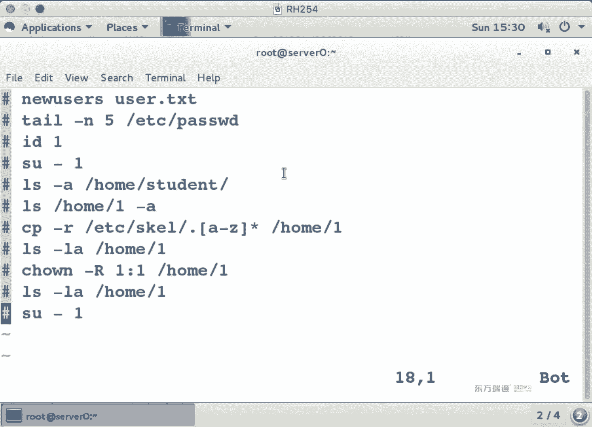

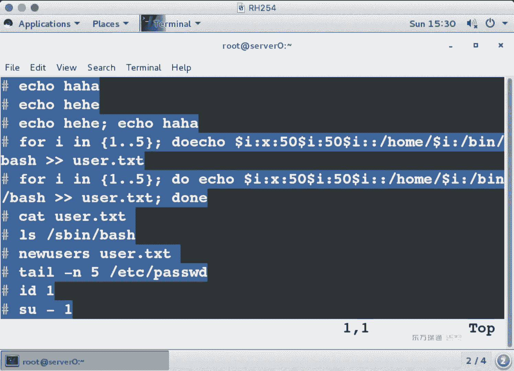

### 删除组：`groupdel` 命令
```bash
groupdel dev_team
```
**注意**：如果组是某个用户的**主组**，则无法直接删除，需先修改该用户的主组或删除该用户。

---

## 批量管理用户与脚本基础

在实际工作中，经常需要批量操作。本节中我们来看看如何使用循环和脚本批量管理用户。

### 使用 `newusers` 命令批量导入用户

`newusers` 命令可以从一个格式类似 `/etc/passwd` 的文件中批量创建用户。

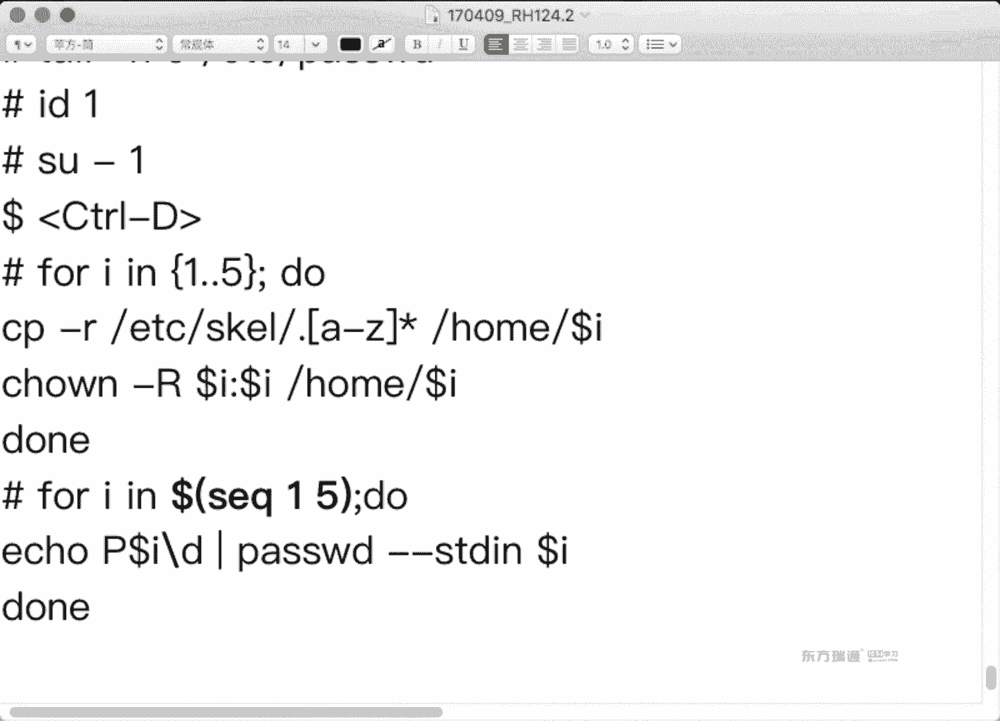

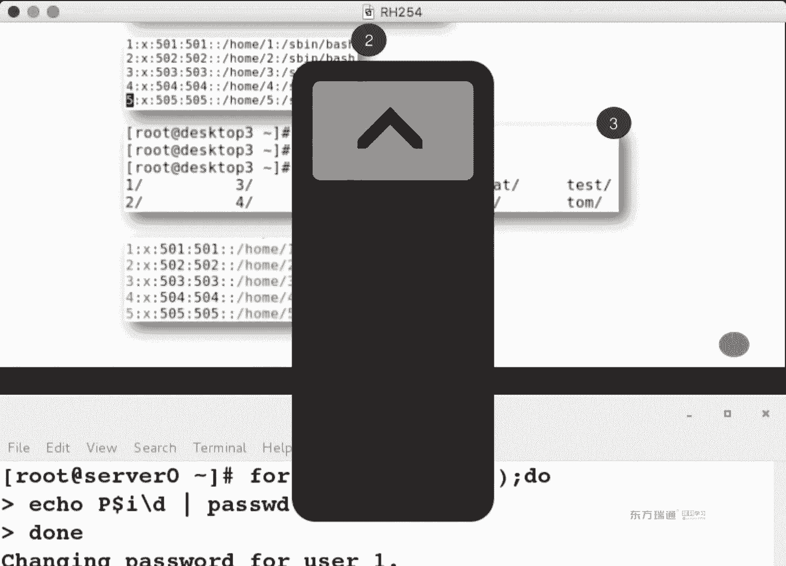

1.  创建用户列表文件 `users.txt`：
    ```
    u1:x:1001:1001::/home/u1:/bin/bash
    u2:x:1002:1002::/home/u2:/bin/bash
    u3:x:1003:1003::/home/u3:/bin/bash
    ```
2.  执行导入：
    ```bash
    newusers users.txt
    ```
3.  为新用户复制默认配置文件并修改属主：
    ```bash
    cp -r /etc/skel/. /home/u1
    chown -R u1:u1 /home/u1
    # 对u2, u3执行相同操作
    ```

### 使用 `for` 循环批量操作

使用Shell循环可以自动化重复任务。

**示例1**：生成 `users.txt` 文件
```bash
for i in {1..5}; do echo “u$i:x:50$i:50$i::/home/u$i:/bin/bash”; done > users.txt
```

**示例2**：为批量创建的用户设置密码
```bash
for i in {1..5}; do echo “P@ssw0rd$i” | passwd --stdin u$i; done
```
**注意**：当变量名后紧跟其他字符时，需要用花括号 `{}` 将变量名括起来，例如 `P@ssw0rd${i}` 或使用反斜杠转义 `P@ssw0rd\$i`。

### 编写管理脚本

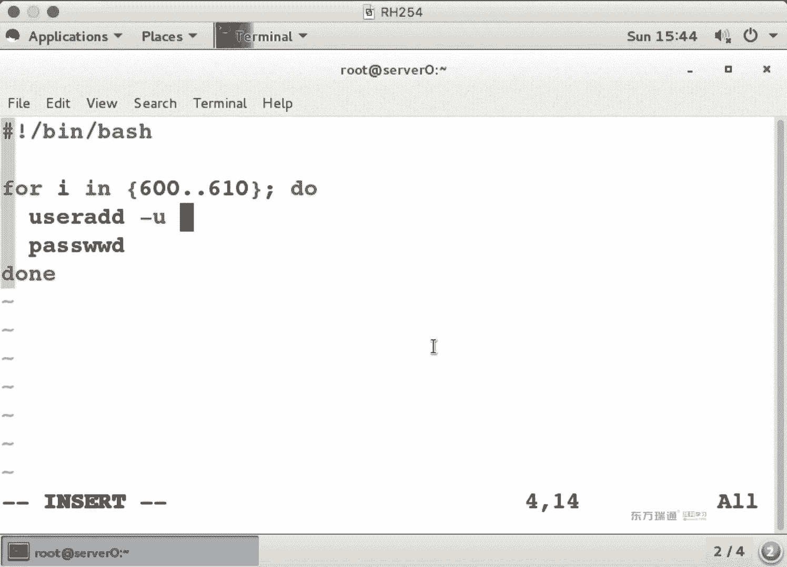

将一系列命令写入脚本文件，便于重复执行。创建脚本 `user_manager.sh`：

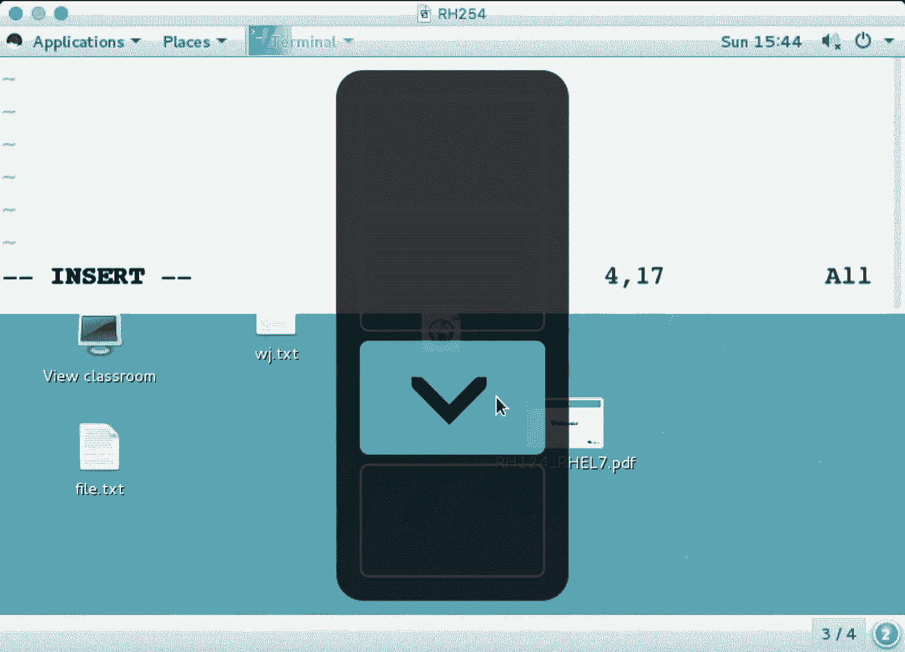

```bash
#!/bin/bash
# 脚本第一行必须指定解释器
for i in {600..610}
do
  useradd -u $i user$i
  echo “P@ssw0rd$i” | passwd --stdin user$i &> /dev/null
done
```

使用脚本的步骤：
1.  **添加执行权限**：`chmod +x user_manager.sh`
2.  **执行脚本**（必须指明路径）：
    *   `./user_manager.sh` （当前目录下）
    *   `/root/user_manager.sh` （绝对路径）

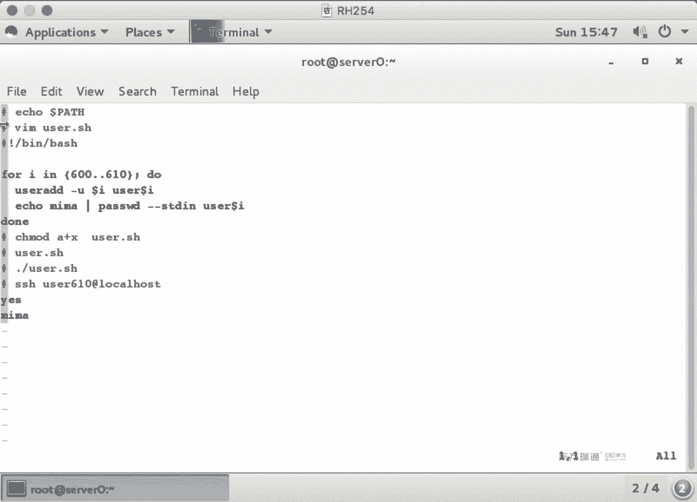

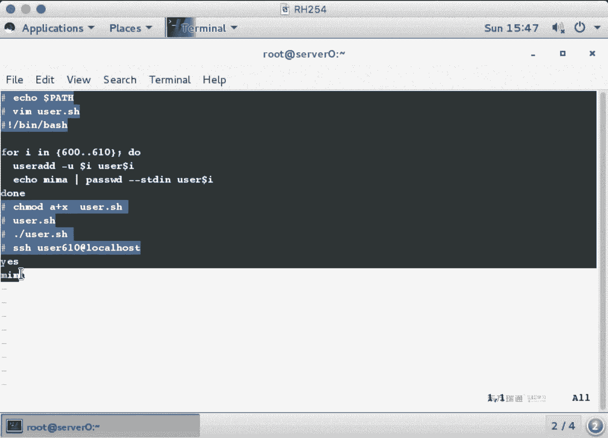

**环境变量 `PATH`**：系统在哪些目录中查找可执行命令。用户自定义脚本通常不在 `PATH` 中，所以执行时必须写路径。可以将个人脚本目录（如 `~/bin`）加入 `PATH` 变量。

---

## 密码策略管理：`chage` 命令

除了初始设置，我们还可以管理用户密码的有效期。`chage`（change age）命令用于修改用户密码的时效信息。

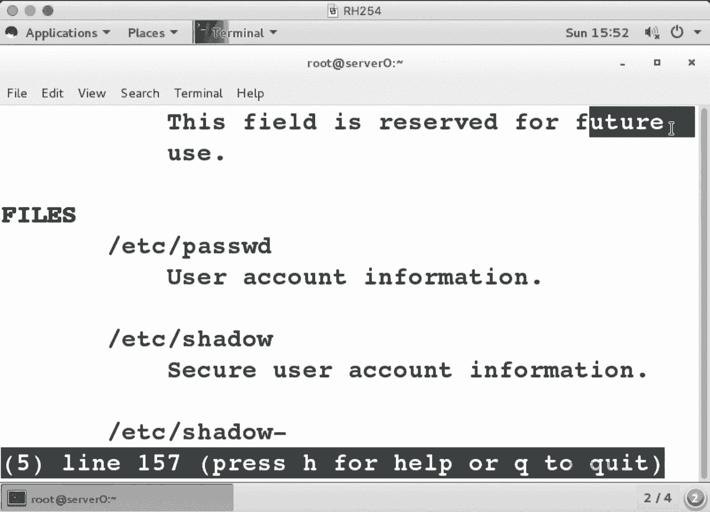

`/etc/shadow` 文件存储用户密码的加密信息和时效策略，共9个字段，例如：
`student:$6$...:18336:0:90:7:::` 
字段含义（参考 `man 5 shadow`）：
3.  上次修改密码的天数（从1970-1-1起算）。
4.  密码最短有效期（0天）。
5.  密码最长有效期（90天）。
6.  密码过期前警告天数（7天）。
7.  密码过期后的宽限（不活动）天数。
8.  账户绝对失效日期。

`chage` 命令常用选项：
*   `-l`：列出用户的密码时效信息。
*   `-m DAYS`：设置密码最短有效期。
*   `-M DAYS`：设置密码最长有效期。
*   `-W DAYS`：设置过期前警告天数。
*   `-I DAYS`：设置密码过期后的宽限（不活动）天数。
*   `-d 0`：强制用户下次登录时必须更改密码。
*   `-E YYYY-MM-DD`：设置账户绝对失效日期。

**示例**：
```bash
chage -m 30 -M 90 -W 14 student # 修改student的密码策略
chage -l student # 查看修改后的策略
chage -d 0 student # 强制student下次登录改密码
```

---

## 总结

本节课中我们一起学习了Linux用户与组管理的核心内容：
1.  **基础查看**：使用 `id`, `ls -l`, `ps` 查看用户、文件和进程的归属信息。
2.  **配置文件**：理解了 `/etc/passwd`（用户）、`/etc/group`（组）和 `/etc/shadow`（密码）文件的结构与含义。
3.  **身份切换**：掌握了 `su`（切换用户）和 `sudo`（授权执行）命令的区别与用法。
4.  **用户管理**：熟练使用 `useradd`（添加）、`usermod`（修改）和 `userdel`（删除）命令，并了解了关键选项。
5.  **组管理**：掌握了 `groupadd`、`groupmod` 和 `groupdel` 命令的用法。
6.  **批量操作**：学习了使用 `newusers` 命令、`for` 循环以及编写简单Shell脚本来批量管理用户。
7.  **密码策略**：学会了使用 `chage` 命令管理用户密码的有效期和过期策略。

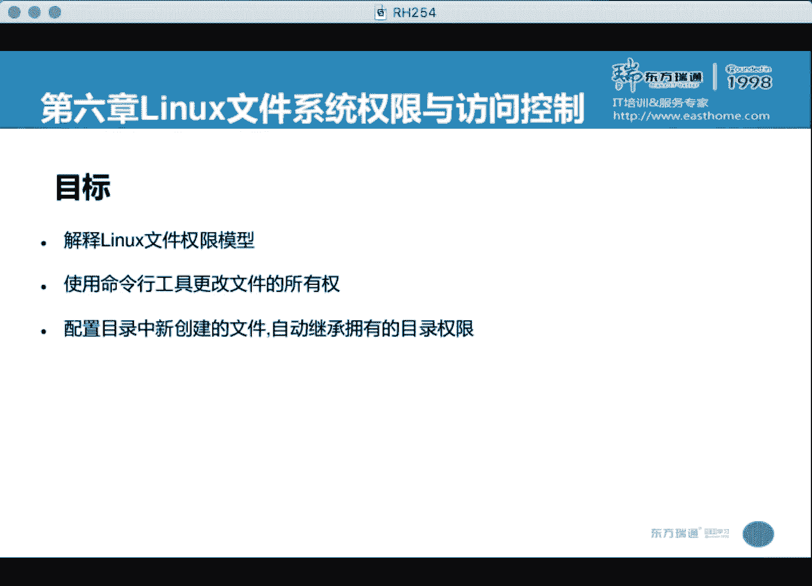

这些是Linux系统管理中关于账户和权限最基础也是最重要的技能，请务必通过实验熟练掌握。