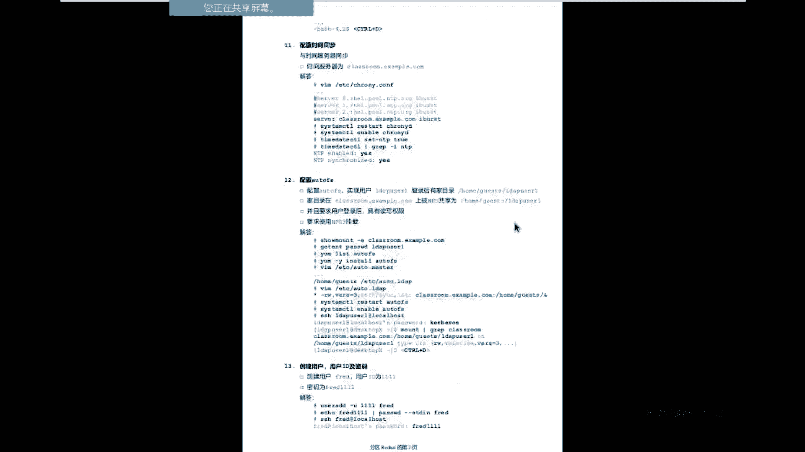
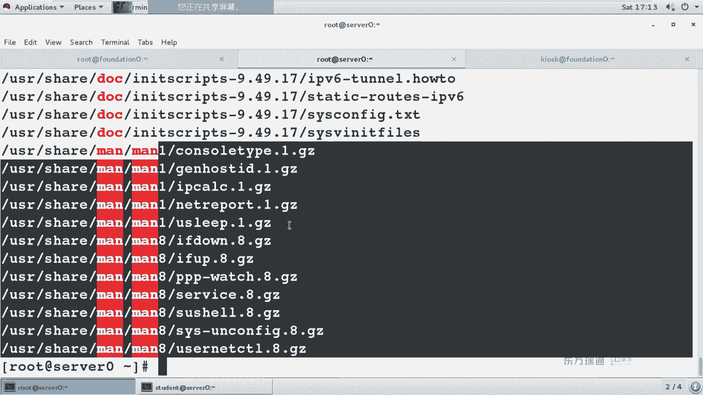

# 红帽Redhat RHCE7培训课程+RCHE7实战参考教程+红帽8.0教材电子版+模拟环境及辅导 - P5：5 - 16688888 - BV1zu41197p6

第七章，监控和管理类那个核信程。那么这章讲的内容是什么呢？在微软的系统当中啊，我们有个东西叫做任务管理性。大家都用过吧。啊，没用过的机手。哎，没人举手。挺好。那现在有个问题啊，你为什么要用任务管理器？

或者说什么时候你才会用任务管理器。啊，第一组同学给你们机会来啊。另外两组都加分了。有举手的吗？嗯，O嗯。焊接层砂金层。嗯，看PID时候有。还有吗？对。没有的话，我问一句哈。那那个。啊，看使用情况哈。

扔换了器怎么打开？右姐。我服务器运行很长时间了，桌面都没有了，去哪邮件。我在哪邮件都出不来。快捷键指。OK嗯可以啊。OK那我们来考虑一下啊。我们来考虑一下什么时候你会用安装管理。大家想。

正常你在用电脑的时候会用任过的信号？不会，真没事摊任过那些，肯定是觉得不正常是吧？那么什么时候是不正常啊？跟正常不一样，这是不正常，对不对？你看我们说，哎，这个世界上只有两种人。

男人和女人是不是不是男的，全是女的。然后后来发现了泰有泰国是吧？啊，这这个还不太成立啊，但是在计算机当中，你会发现一个问题，你经常用电脑的时候，哎，正常什么样，你是不是自己心里知道？不正常什么概念呢？

比如说我有一个应用，我正常点一个word，它有反应的，现在我点它没有反应，未响应吧，这个就叫不正常跟正常不一样啊，未响应的情况。如果一个程序长时间没响应，你是不是要考虑说把这个程序给干掉？啊。

这种我们会用了。另外一个，我现在这个机器啊，32G没存。声音不很清晰，我暂静点。现在我这个机器32G内存，CQ是IT的啊，固态硬盘运行是不是很流畅？打开游戏啊，很舒服。突然间有一天呢，发现机很卡。

很卡的意思是画面也卡，网速也很。延迟也很大啊，那这个时候你是不是觉得哎这个机器不正常了，你也会去看任务管理器，会看CPU内存，还有我们的网络。这个时候有何用？到什么时候会用来用管载器呢？

比如说你的桌面没有了。微软的系统啊，如果时间运行很长，你没有重洗过的话，你会发现哎桌面出过来。中号出不来怎么办呢？是不也打开任务管理器啊？刚刚提到了contrl设VIC新建一个exorer，依然可以。

这个是我们查看任务管理器的一个情况。那么在linkux当中也是一样的。如果你的服务器异常，你也会看进程。不管是微软、windows还是winux，还是你们的unix系统，只要是操作系统。

只要是我们看机器的性能，看机器的状态，都看这种管理器。这就其他。那么在对账当中，你们必须要学会两个内容。第一个内容呢是查看进头。第二个内容呢是要结束进程。还有这个资源的使用情况，人用管理局的使用为。

首先来看一下什么叫进程吧。进程简单来说呀，它就是一个正在运行的程序。我们管它叫做一个实例，叫做一个实例。在进程当中。他有一个概念叫做内存啊，内存地理的空间。这个什么概念呢？

大家听没听过一个词儿叫做内存溢出啊。啊，内存一出是什么意思？内存还能移出，我买了2个G的内存，它移出分4个G。他说是硬件事还是软件的。他说的实际是权限的事。因为一个程序在运行的时候啊。

他首先要申请个同意。比如申请了两个。但是他存现在运行过程当中呢，他可能是我占用空间超过了两兆，而这两兆的内存空间不是你当时用户的权限，可能是另外一个用。这种时候就要内天。每个进程单运行的时候。

他首先都会来分配个自理空间。里面呢有些安全系统，有安全性。内存溢出这个事儿很可怕，就像微软的系统，为什么运行一段时间之后非得提起呢？因为他怕内存一出啊，它的权限控制上做了很多的设置，导致什么情况呢？

很多时候这个应用即使退出了，内存还释放不了。所以说我们还得重启一下系统。应该这内存的控制。在进程当中包含两个内容叫做局部变量和。区变量他俩的区别是什么呢？一个是局部有效，一个是全局有效。

我们在之前用过一个东西。我们来瞅一眼。Apple。这个有印象吧，这个是什么呀？欢迎明亮。我当前用户的环境变量pas，这个叫环境变量名，它个到了搜出符号，引用环境变量名，按好会写看它的值。不同的用户。

他的环境变量名所对应的值是各不相同的。我当天是入他。那么大家会发现我里面是不是有好多SB的目录？S是病的目录。而且呢会有一个root进行。普通用户呢是自己用公目录像进文件夹。

那么这个pass它叫局部变量，还叫全局变量？局部还要全移。Hi。全举变量。给大家举个例子啊。我现在去敲一个内容，比如说A等于123。它的概念是说我定义个电量名叫A，它的值是123。

他相当于一个地方电视台。樱花电视台是不有很多的演员吧。现在我们来看一下艾le到了A。认识吧。当我切换到了另外一个上。我们默认的bu事默认下后办事，我切换到另外一个事。现在呢我再次来看。认识吗？不认识。

他只在刚刚那个事儿中有效，他只在那个地方很有名啊，他只在那个地方很有名。我crl D注销了之后。我在当前这个事是不是还认识啊？他只在这个事儿里认识。叫做局部某一个区域当中，某一个事儿当中有局部变量。

那么什么叫全局变量呢？呃，赵本山在年轻的时候啊，他也是在东北很有名。后来忽然有一天上了村了。大家都知道吃晚吧，马上又要过年了。我们会发现一到春晚的时候，是不是突然大家一堆人会认识一个明星啊？

一下就出名了这个叫全局变量。举个例子。说完的话，我们就相当于一个叫ex命令。ex的换译中文叫什么意思啊？导出啊导出。B等于456。认识吗？我切换到一个子扇当中。认识吧？那不管在哪个事儿当中，他都认识了。

这个叫什么呀？是要全体。局部变量和存据变量理解了吧。这个是个概念啊。实际上我们光从中文含义上就能理解出来，范围不同吧，一块啊全部。在进程当中还分为副进程和子进头。促进成核死金。那刚刚我给大家做那个演示。

我是不是跳了个半世命令？外生命令实际上相当于刚刚我们那个附近成的进程。我们来看一条命例。PS翻译成中文叫process叫进程叫进程。除以翻译成中文叫数。他们将来写呢叫做进程数。と。

系统当中运行的第一个进程叫C侧面D。我们当天讲的是企版。铁板7铁板7跟铁板六有很多的变化。六只弦呢都是IIT。当企业版期的时候呢，变成了黑参头底。中国在加入WTO世贸组织的时候，有个很重要的变化。

不知道大家注没注意过。有什么变化呢？我们原来在去银行的时候啊，大家发现我们是不是排队呀？站的排队。中国在加入WTO之后，你会发现所有的银行瞬间改革。我们去排队的时候呢，坐着排队区别是什么呀？

门口是不是多了一个取号机呀？多了个取号D。而在解版7和他之前的版本第一个进程变了，系统第一个进程7呢叫CD。优化了一下优化了一下。那在这个里面呢，我们往下来找。看到FSAD了吧。我是不是通过FSH。

在finition从往finition登录到了servword0上。登录成功之后，是否会获得一个拜事？然后呢，为了给大家讲群局未亮，我是不是又敲了个拜世民令？那之后为了给大家看进程数的概念。

是不是敲了个PS tree。知道什么叫负进层和子进层了吧？父近让我自己好。在中国的户口管理上有一个概念叫做户籍都听过吧。大多数人的祖籍啊都是中三省。你叫什么辽宁啊，黑龙江吉林呐。

我们发现他们这个祖籍大多数都是山东的。主题啊叫附近旁。

OK那下面是画了个示意图啊。金程在运行的时候呢，他有副进程和子金涛。当你执行子基层的时候，负基层会一个会变成个状态，等待子基层是一个执行的状态。实际上退出之后呢，又回到了附锦头。

然后逐金成了变成僵尸状态。那么看一下进程的状态。首先，进行运行。新的任务新的任务计划。准备运行。准备运行。那正在运行的程序啊，我们可以给他。终止。停止也可以给它恢复恢复运行状态。程序在运行之后呢。

我们需要把它放在内核当中来运行。内核主要是CPU在处理的内容。他来处理。但是你在运行的时候啊，因为不同用户的应用它有相应的权限，所以说要给用户啊给用户用户的身份来运行。来调用那盒调用那核的。

这个内核1月份权限的传递。程序在运行之后呢，他会有一些奇怪的状态。我们管它叫做死死ing翻成中文什么。休眠是吧。但微软的系统也好，mac OS还是windows。大家会发现休眠之后有个很奇怪的特点。

我一开一开电源。瞬间启动是吧？这个睡眠是真睡了吗？不是征税是吧，不是征税。OK程序在退出之后啊，变成僵尸进程变僵尸进程，然后退出。这个是一个程序运行的过程。当前我们看到这一页呢是1个TS命令看的内容。

PS命令pro。我们先来看一下上面这几例。他们代表的含义。右侧。用户。commount的命令。系统当中，任何一个进头都会有一个指定的身份，谁来执行？信用当中任何一个文件都会有个指定的身份，谁的文件。

PID。PID是不是唯一的？没意思吧？为什么要有PID呢？大家想过这问题没问什么便宜。为什么有身份证号？为什么？非常好啊，重明丰富。那我们在系统当中可不可以开多个记事本啊？可不可以太多QQ啊。

一个意思吧，怎么来区分呢？通过经常ID来区分，这他的作精常ID。CPU内存前面加个百分号，是不是就百分之几啊？CPU内存的使用百分比。某一个进程带用了CPU和内存的使用情况。后面VSZRSS。

当看这两个数哪个数大呀？前面这个数大。我们在刚刚讲的进程的时候，说每一个进程在运行的时候，系统会申请个内存地址空间，有印象吗？这个就是。立呀不位。叫了虚拟内存空间，你申请的内存重爹。你没错。

B first size。那么RSS呢R叫做real啊real实际使用。你申请了这么大，实斤使这么多大？肯定比他小吧。然后超过他，那就要移出了，超过他就要移。几十万。

我们在之前的个程上讲过说conttrol of6是不是切换到了终端6啊？有印象吗？如果是本地的虚拟终端，那么叫做PPSP。这叫虚拟终端SSH也叫虚拟终端。这个位置如果显示的是问号。

它代表是不是在哪个终端中运行的。不是在哪个终端中。他是在终端外啊终端外系统来运行。后面这个。叫做状态啊状态。SSS代表什么呀？sleepy休眠小S呢？爸爸pro带紫金疼。进常。紫禁头哈不是紫禁头。

不是北京那个。哪个地方是吧？OK这是他的状态。我们再来看另外几个状态呀，BD叫做diamon啊DAEM文demon守护进程。在linux当中有很多的服务，他们都属于D啊demon守护进程。

我们在后面课程讲解过程当中，你会发现我们有那么多的服务，大多数的服务名都带个D。都是呆mon的。不可中断。are running啊正在运行的。那也行吧。对。这个大家都认识吧？有个游戏叫植物大战僵尸吧。

怎么说哎，老师，那个我看的是中文版啊，你去玩玩英文版，每次一打开游戏是不是就个大醉呀？僵尸进头。喝呢。停止啊说停止。这些都是大写的字母，大小写的字母小S叫继成。小于号和N高优先级低优先级。加号后台进程。

哎，这个是啥？是乐还是管道？はい。乐是吧啊乐。在类那个斯当中有很多这样的符号，又像乐又像一又像管道的啊，那你也不要去猜，你直接看它的含义就知道它是什么了。如果是什么锁定之类的话，就应该是字母，OK吧。

在勒尼个斯当中，数值一一出现的很少很少。知道什么叫很少吗？我们走基础的命令啊，就LS有个选项是。剩下基本你看看出现都是L。如果是两个命令中间出现这个东西呢，一般就是管道。OK吧，这他们特点。Okay。

非常中我们会讲到两个命令，查看激情状态，一个叫PS和 five，另外一个叫top另top。PS叫做proces进头top叫做顶部啊，顶部。他俩的区别是什么呢？一个静态，一个动态，一个静态，一个动态。

PS的话会直接把当前的进程都列出来。当庭证人。top呢是事实的top是实的。那你既然这个词叫做top。他部分的中文什么意？前几个是吧，顶部的几个。那我们镜头有好好多啊，好几十个，你用top命字的话。

是不是只能显示头几个呀？这他的区别。PS命里有好多的选项，我们会发现有些选项有减号，有些选项没有减号，它们区别什么呢？

区别。有减号和没有减号都对。我们来看看例子啊。现S。这个是查看当天用户的。AX。为了帮大家理解，我只看其中的头。三行。好，这能弄小点哈，方便对比。我再加个点号。但是他结果是一样的吧。

结果一样减号加不加都行啊，原因是什么？对于PS命令而言。它减号和没有减号的区别是什么？虽然结果不对，那区别什么呢？我们需要查一下雷斯的历史。我们在之前提到过类那个斯历史，它是从哪来的呀？

从优那个字来的是吧？在用那个色系统当中有两大分支。有两8分之。一个叫做BMD体系，另外一个叫什么呀？叫face term5啊，我们简称为C5两大体系。这两大体系啊命令都有P。那他们区别什么呀？

他们后面的选项带不带减号的区别？能听懂啊。而在Lux当中，你既然是通用那来的，是不是要具有U那这些特性啊？PS命令啊，它是一个开源的软件，它又可以在DSD里用，又可以在com5里用。

所以说PS命令你后面的选项写这些简号都对。学会讲的都对。那为了便于记忆，我们一般都加点号。因为通信是独加减号，对吧？对于。你好，这是为什么有减号，为什么没减号原因？OK那我们来看一下AUX代表的含义。

又代表什么呀？Uer。A代表什么呀？哦，全部X代表什么呀？X代表是没有用户身份的。X实际也代表不全部啊，我们来瞅一眼。他命令的帮助怎么看了？可以慢来看吧，刚才还不走。也行。

那他帮助我们建议租用慢啊就用作用慢。为什么呢？因为在慢手册当中知识查找吧。你如果直接到到上边来查看的话，你怎么查找啊？是不是得用肉眼来查找啊，很累啊很累。在慢手特中查找的什么符号？行啊问号可不可以？嗯。

问号也行是吧？但一般我们见来的第一片，肯定要向下，做以说斜道那作。我现在要查哎。看一下A选项的含义。A什么意思啊？所有。再来看一下右。U什么意思呀？标户。用户UID。另外个户名。还有什么？哎。喂。

X没有。那咋吧。没有障癌。Right。但是他这里面也没有IW。有X是吧。那为什么查的时候没查牢呢？不加减号的话不得累死了。嗯，打印所有进程属于用户的。被用户命名的I。如果用户名X不存在。在这解释了。

癌症不一般是和谁配合在一起？有吧呃有配合人。这个区别是什么呀？但是说一个用户如果被删除了，用户ID还在不在啊？用户ID还在不在？举个例子啊，我们在之前是不是做了一个创建账号的实验？有印象吧？

我们把那个账号打ID动动感，改完了之后把用户删了。然后你发现那个用户ID都还在。那这个时候我们在看进程的时候，你会发现前面显示的是重新的户名了。显示什么用ID吧。这个时候你要用来一个。还是跟用户来说。

Okay。那我们来看一下UI。嗯。显示内容多吧。好多好。静态的动态。静态，我这是拿鼠标滚轮滚来滚去呢，是吧？大家看系统当中第一个进程叫什么名，这是能小点哈。因为太长了，我直接。看头三啊。Okay。

他的订单ID是几啊？Sa your内存。使用百分比。内存使用情况。申请的地址空间实际使用空间。在2CSA课程当中，只需要你会看就可以了。在2CA的课程当中，有一面课程叫C13然后系统招优啊，系统架固。

它其中就会考到这两个值。两道题。2CE的考试，2CIC或者说红帽所有的考试，它基本上。20道题以内。或者说20道题左右。OK吧，你想这就两道题。能看出来区别吧，很重要了吧。啊，刚才咱没有讲s是吧。

这能拍出来吗？启动的时间啊启动的时间。9点10分。2。持续的是。这是PS命令。再来看top。嗯。静态的动态吧。动态了是吧？对于PS命令而言。都可以吧。两总。对以泡泡命名而言。

大家会发现top命令是交互的吗？交互的他区别是什么呀？是不是一直在软件里面呢？我们来看一下它上面的内容啊。哎呀，现在几点了？9点40个是吧。你看一下系统时间。一快来吧，当前的时间。起动乐多大事。

当年组几个人登陆乐。平均使用时间。So。当天一共有多少个任务？100多个几个运行的。两个一个睡觉吗？100多个没有停止，没有僵失。CPU使用情况。用户的系统的。优先级。下面这两。这个都认识吧？

内存微软的系统当中有个内容叫做虚拟内。听过吧。Lux词当中叫做smar交换分区。For which application。为什就是交换分险。那我们现在有吗？Mao。问大家个问题啊，什么时候你会用到？

什么时候你不用？或者说什么时候你回去设置去。嗯。那存太小了是吧？你像我们以前呢以前买电影的时候都会去社区。但现在你的内存当越来越大的时候，去内存可能就可以。就不用说了。为什么呢？因为内存太便宜了。

但忽然发现今年内存又涨价了。是不是还得用虚列。当然，如果有内存的话，尽量用内存。如果没有内存的话，我还想要用一个内存空间，那就用续内存。占用用款的空间吧。

但你会发现硬盘的读写速率和内存读写速率比哪个快呀？没存吧，原因。OK那有这么多内容，我们对某几列比较感兴趣。在Lux中的软件里面，如果想看帮助的话，大多数时候我们摁的是一个字母。H。HH什么。帮助吧。

在letning功里面，大多数的软件都是NH看帮助。基本上哈。如果不是NH的话，另外一种软因。问号啊，什么。这号是什么的意思？帮助退出的话呢。So。Mux4种软件的通信退出基本上都是修。通性哈。

垃圾通信哈偶尔及特性哈，偶尔。Okay。进到top当中，你第一个要会的就是H看帮助啊，看帮助去退出这是第一个你要会的。下了。这个里面有这么多内容。大家想想你们在微软的任务管理器当中经常去干什么事啊？

任务管理器显示那些病。没有进态ID，你是不是想显示进态ID呀？然后有些裂我不想看，是被人弄没呀。增加率和处力之类的概念吧。那对于我们的利而言呢，叫做Q的。Xu。又的去。不管是大F也好，还是小F。

他都可以干嘛呀？添加。删除。排序。显示不显示。OK那我们先shift退出。退出了之后呢，A下F。F呢就是field。大家会发现这个区域当中啊。

有几个东西是带星星上吧。我们在上网的时候，经常去调些表班，你会发现有新的地方是必须签的。

着重的位置，并且他加粗了。看一下上面这个提示，他说你当前呢排序是按CPU的使用率来排序。可以通过发现上下来移动。也可以左右。N空格和D。可以是标记和取消复选NS排序Q退出O。上下右。锁从开始学吧。

他说是方向界啊，我只想看金台地。用户。CPR内存命令。我只想看这几列，我不要都给它干掉啊。你要想要哪个的话，是不是在空？一块去吧，胖哥或者。都可以吧。O。那现在我默认删按CPU来排序的。

但是在很多时候啊，你可能会发现哎我当时这个进程啊，它的内存使用率比较高。我想看内存排序，那应该怎么办呢？他说NS是设置N户程序吧。如果你现在是S的话，你看一下变成什么了。是不是你当前焦点在哪就设置谁呀？

我要按内存来排序，就要先选到内存在。还去。最以初的话N呢是Q或者是ESB键。Okay。他现在是把那存台接了。但是他系统当中，现在对占内存的是谁？是吧，就你刚才那个图形图面。

如果你物理机的内存是4个G的话。物理应该是4个G，你KVM尽量是SSA是远程，不要去本地。因为他太占内存。会导致你的机器非常卡，OK吧，这是为什么我们上课的时候基本都是远程来做，当然可以去本地来做啊。

在考试的时候呢。他会给你相应的机器。你可以双击。

去本地操作做操作，可以考试的时候啊。

那如果你不想这么做的话，也可以怎么做呀？也可以SSH像这种通过本地的终端SSH到远程的服务器去操作两种操作都可以。考试的时候，不管用哪种都对。不管用哪种。我。那现在我想结束进头。结作定单按什么呢？看呢。

可很注意哈。嗯得。NFN上下。然后控这。然后S。今？刚刚的内容是吧。他们代表含义。Okay。那我现在讲结束进程。可以。

PD。

大家会发现呢，现在默认这个PID是谁呀？这个里面的第一个。我摁一下ESB键ESD键。这不就取消了呀。我我来找一个哈。😊，打一个我们能随便弄的。不影响包全系统的。没有吧。房让子。

哥这个服务啊叫做计划任务啊，这个是我们在20C。没异议。CIC上午的考试题。商牌期当中啊，有一道提交计划任务说。几点几分的时候要去系统去干某一件事情啊，你需要让这个服务启动。那现在我们做实验的时候。

我先给它干掉。他的ID是多少啊？584是吧，现在如果你能K的话，他写的是什么？530是不是当前评的第个呀？我想把土壤多给干掉，他是584。八。对吧。PID委车。然后呢，他说发送过信号发送过信号。

如果你要结束进程的话呀，信号是负几啊？破酒。こ業。他的信号啊有好多。信号有好多，我们一会儿来看一下，我先杠子给删掉。啊，没有。我。多少的呢？五八。叫张九。没有了是吧。被干掉了。退出的话呢。今。

刚刚呢我们结出的个镜头。K结束进场吧。然后写进程ID，你们一会在写的时候啊，不要写584哈，你要去看。好让这个。结束了之后，然后还问你。好，退出。Okay。那我们说拿来看一下。

刚刚我们是不是用了一个命令？K我。用了一个几米。用再。抵押。Qiu。但是看这个信号当中啊有好多呀。看到没？很多。只有信号9是什么呀？tailll啊平。这个K我他比较。他有这个盒搬成中文，什么意思？

上诉是吧，30多万上诉。呃，这个杀死跟我们平时想的杀死还不太一样。嗯。我们看了好多电视剧啊。杀手。把宝我人杀了这个杀手犯不犯法呀？啊。不是在中国吧。我星是吧？办法是吧。实际上杀手的最高境界是什么呀？

上好最高境界说，哎，你去死吧，然后那人就去死了。这个杀手师很惊讶呀。哎，我还没动手呢。上了很牛呀。在系统当中啊，实际上系统是发送个信号给进头。发送个结束机上的信号。诶，你去死吧，那个地上就去死了。

不是我们把他杀死了，我们只是发送货信号。能理解吧这是上海。这个算不犯法呀？这个不坏话是吧？两个人干当也经常说一些很恶骨的话是吧？所以说尽量少担闹。好，PS命令和top命令理解了吧。查看银行。哎，作业。

这个作业这个牌啊上学的时候挺好听吧。作业是什么意思？作业说白了，在系统当中就是一个任务，就是任务，就是一个继承。这片当中呢有这么几个命令。到sBESD。大不斯翻译成中文什么？工作。

background fromground翻译中文叫。后台前台啊，发ground前台background就后台是吧？前台跟后台区别什么呢？啊，我们经常看见电影吧，电影里边你能看到的人都属于前台工作者吧。

但是一个电影拍出来之之前呢，他是不是还有好多别的工作呀，什么化妆师啊。你在电视机上能看到化装石吗？你要能看到的话，那就叫前台吧，那就是演员了。后台有好多的职业呀。能看着看不着。发方年率。

那我们把这个作业啊用三个命令帮大家讲解。在讲解这个实验的时候呢，我给大家先介绍一个命个令叫做BD。BB叫做des sum。第个大叫做硬钞为命力。我们在之前是不是学过一个叫做copy。他才叫软跑贝。

应拷贝和转拷贝的区别是什么呢？举个例子，我现在有个U盘。这个U盘呢是个启动盘。我把U盘中所有内容control A全选。ctrol C复制粘接到另外一个U盘上，另外U盘能启动系统吗？启动不了是吧？

为什么？引导对吧？引导切度。如果我用是DD命令。大家注意这个词哈，DB叫做对斯刻淡ble，它叫做十传罪胜。听过听过构ose的。等我吧。构思的话，我把这个牌完全构出了，构出了另外一个牌，两个是完全一样。

他能启动，他是不是也。对吧AB两排两个硬盘都能启动。OKDD命令就跟我们平庸的那个构ose的类似，叫硬拷贝命令。硬拷贝。它可以把你的分区表。引导记录。都考虑。能理解区别啊，硬考味这次可大。

OK既然叫拷贝命令的话，是不是得有源和目标啊？我们的圆用IF来表示。目标用OF来表示。I叫做N to，O叫outF都叫做from从哪输入啊，从哪输出啊从哪输出。之前的课程上我们学了一个设备，叫做。

空设位吧。那第2时发现动文要什么？没啊。零设备是源源不断的生成的。就像我们每天喘气的时候，是不是永远不知断在糊涂爱好他。自来水龙头打开之后，是不员不断要输出水。它的功能就是源源不断的生成0。要领设备。

这条命令写完了之后呢，它的结果是什么呀？就相当于把你家的自来水龙头开开，自来水龙头下面是不是有个叫下水管道啊？好，这边流水这边出水。得个结论是啥？水深一直在流。然后小学姐的话可能会问你啊。

多长时间取得流满是吧？咱们这个速度是一样。你塞进来多少水就出去多少水，他俩后着水压。换句话说，现在一回车呀，他永远执行。这个是个死循管。一直执行过完。当他执行不完的时候，你就会发现一个问题。

我现在敲命令。你回文民的条件都没发现。是不是你当时终端已经被占用了？在实际工作当中，用户只有一个终端，比如说像银行啊，用户只有一个终端。只有一个终端的情况下，你这个终端已经被占用了，他能干别的呢。

干不了。那这个时候怎么办，这个时候就用到作业的工。作业怎么扣制呢？承受费。controlal费。control Z在微软的产品中，比如说啊word呀、记事本之类的，control Z是干嘛的呀？

撤销是吧。好多同学习惯性的问了个字没事肯定对。会出一些奇怪的问题。来那个是你如果想又可能对完选好了哈。到多种可能这，可能这意思不一样吧。他家会发现他他这个状态变成什么了？Stop。我们有个命令叫赵。

我查看一下他的工作状态。照的。照吧是吧。工作状态。这个命令是不是stop？滴滴命令还有另外一个特点是什么呢？当你执行对方命令的时候，他会直接占满你CPU技术。如果你CPU复核的话呢。你就发现哎。

当年CPU使用率25%。你再来执行个。50%。特别好玩是吧？想要机器很卡，你就执行2个DD，就发现A服务器这么卡。BD要用的时候请慎动哈，看你想干嘛。嗯。O。那我这个程序啊，它已经死top了。

但是大家会想一个问题哈，在微软产品当中，你开了个QQ，开了个微信，开了个word。你QQ放在后台，他是不是也在运行吗？你现在是slock的，我也放在后台运行，那怎么办呢？Byground。搬月多啊。

如果你有多个。进程的话，他前面是不是有1234啊？你该写123。如果只有一个的话，这个就BG就得了。当我敲个滴D命令之后，它出现个提示。看这个符号吗？案。上后面。一行。这回再到复瞅一眼。看状态了吗？

后台运行。后台。Okay。嗯。那后台运营的程序，我现在就想给他拉回前台怎么办呢？安徽的。拉回前台吧。对于这样的程序，我不想让他执行完的话，我可以 control出合同给他看除掉。我ょ。看头了。

大家看一下，我刚刚就给你们。聊了会天儿。90G的数据。90亿的数据在哪？这个地方能塞满吗？背不吧随便飞。但我们写小本的时候啊，经常会用到这个设备。垃圾信息都で。永远写不满，专门放垃圾。

既然你命令放在后端运行是加了个按的，那我是不是可以直接加个按的，就是放在后台运行啊？能看着区别吧。现在我想把这个进程给他结束掉。我是不是可以Q掉啊？那Q掉的话。怎么Q。你是不是要先看一下他的继承ID呀？

新ID是多少？2283。6杠9。K德。被结束了。在微软的系统当中，你开了100个记事本，如果都用计算ID来结束的话，你有什么感觉？嗯。喂，今天在工作真充实是道吧？手都抽筋了。所以说我们在写命令的时候。

可以用这种方式。为了给大家看出区别啊。BS叫做bllock space代表一块多大。啊，一块多吧。我要不死了。现在我有两个进程都叫做DD。两个金额都要集。如果用金ID来结束的话，你是不是要是提前两遍？

那我们有个命令叫Q号。Q2它的作用是结束进程名。节构进行抚描。下面呢我的背中段落。没有了。OK吧。查看进程结束进程。我们把涉案内容给大家整理一下。作业的控制。Oh。所有的控制这段给大家。复述语言啊。

第12条。当你执行上命令的时候，如果命令执行很长时间没有结束，我们可以按什么组合键。Control加。把它放在后台停止了，top的。通过到s可不可以来确认状态。好吧，工作。然后呢。

我想把后台停止这个工作呢放在后台运行。看什么？BD如果有多个的话，你可以BG空格它的ID号啊，BGID号确认到过。FG拉回前台，拉回前台之后，如果想让他cl掉conttrol加。我们会发现。

当你ctrl C的时候。它放在后台停止了。当你FG的时候，这个命令的结尾是不是自动加了个按的？换句话说，命令结尾直接加案的，是不是直接就是放在后？后台历行啊。既然是后台运行的话，照不斯确认。

PS查看金ID我是不是可以Q杠9结束。如果你不想用ID来结束进程的话，我们可以怎么办呢？结束第方秒。有奥。嗯。这边内容OK吧。O继续。QQ2。刚刚讲到Q杠L的是吧？记得杠酒啊。当铁。呃。

以前呢讲到Q杠9的时候，还经常约讲一个二战时的一个故事。大二战的时候啊，希特勒很厉害是吧？提供了。就乐勒当时啊他抓了这个很多俄国大兵，俄国大兵我们都知道啊，很壮的是吧？找死宝，他们拿了两个块镜做实验。

哦，第一个大兵啊。第二大兵就拿出来之后，哎，我们要现在要做一个实验，做个什么实验呢？一个大兵在外面看着。玻璃窗另外大军给弄到屋里去了啊，拿小刀一拉。拉胳膊上了，那血就滴答滴答滴答，然后那人就过去了。

第二大兵呢？OK也放在同样的位置。拿了个。冰片儿不是刀片了哈，干了一下胳膊。然后呢，旁边放了个水龙头，滴答滴答滴答，这大厅也锁了。叫啥概念吗？他觉得他应该死了。没有人杀他没有杀他。

只给他发送了信号让他去他真死。所以说通过这个故事，我们也能发一个问题，当你想干一个什么事的时候，你的想干什么，学习也是一样的。非想死哈，想干点什么。这个有点喊没就改了是吧？O。管理登录用户。

我们他之前讲没讲过W命令。讲我吧。谁从哪登录了，正在做什么啊，正在做什么W。通过W命令呢，你可以来判断用户所在的位置。他在哪个终端，然后呢，你可以把终端给改掉。工装给干掉，结束这个工程。

这个这个实验实际上就是个T用户的实验。你把用户的sha给干掉，用户是不是又掉了，掉线了。但是在实际工作当中，尽量别提用户。见量这酒。因为用户他可能正在执行个系程没有执行完。呃，尽常是打电话通知他自己。

除非是他自己退不出去了，你再直提去。呃，这边这个事例呢是来查看某个用户的下。你把用户的事儿点结束是不是也是一样的？graff命令gra命令我们在之前讲过。过滤是吧，过滤的力。

那Pgra呢叫process。过滤进程苗。有。报勃了啊过滤鲍勃用户登录的sh。但lash他的进海力。把这个办事给结束了，那用户是不是又踢掉了？注销用费。这两个时间都是促销用户的方法。

一个是注销他的上面的务。终端另外一个是注销版本12，结果是什么。监控机器的性能。在系统中有一个叫process目录，系统开机的时候呢，它会有一些相应的进程都会生成放在这个目录下。

其中有一个文件呢叫CPUinfer文件，它就是你当前机器的配置。你机器的型号CQ。这个文件是每次开机的时候自动生成。开机时。我们要来瞅一啊。和fi。CP音吧。但是他这是什么CPU啊？虚拟CPU是吧？

我们再开个龙灯。这个什么CPU啊？大家看它俩区别啊，刚刚我给大家看的是KVM虚拟机里它的那个CPU模拟出来的吧。那个反内是不是用的是物理？KVM支不支持CPU穿透啊？支不支持？

支持只不过是这个没有配置而已。能听懂吧？没有配置的话，我们看这个里面CPU是不是虚拟CPU啊。他也支持去团后啊。系后。Uptime。up time什么意思？什么时候启动了是吧？呃，另外一个要说一个事儿。

就是这个WC啊，什么意思来着。单词接束L呢。行那这个取取有多少行什么意义啊？但是CPUinfer当中，如果显示了model name。I5显示了4个是吧，这个代表的是个四核的。能看懂吧，他是在转几。

在413的课程当中啊，是用调有品。第一道题他就让算。系方的几好。1到是。算几何不是目的，他俩算一级缓存和二级缓存呢。他是第一步，你要先会算几。第二步然后算一很忙一很。把书填上那个。也需返。呃，考点呢。

咱们上课只讲考点嗯，讲卫生题。有没人说老师为什么不讲连体？因为每次考试他那个数都在变。没法讲严。能理解吧，但你把思路理解了，跟IT也差不多。topB令我们看了它是字图下模拟图形的任务关。

在微软的产品中有任务管理器出形的。那么linux当中也有。我们来看一下。他不来开诊应用菜单。借的工率。系统显示器，看那个图标点头吧。微软的任务管理器是不是也是绿色的？啊差不多吧。have a lot。

OK镜头。啊，有这么多进程啊，当我随便点了个进程之后，大家会发现地上就出了个东西，按 provide对吧？严重点。如果咱按谁排序的话，是不是减谁呀？想按谁排序就点。能看到区别吧？啊。

我现在想结束某一个地方。啊，我也挑过。啊。哎呀有这么多办事。单掉一个吧。干掉的不太好啊。要翻翻。发0发找个不用的是吧？哎呀，这都在用。找个没有影响。哎，这个了。这个什么东西啊？看图标邮件。哎，没有了吧。

原告。资源。CPU。哎，这几盒？两盒他为啥是两盒？你大看下还不下亮。我们这个仿真人虚拟机啊。Thank you。能看到吧。加它分配了两个处理器，0处理器和。一共是两盒吧。所以说在这显示出了。

然后再往下的内存。2块。屋里面所和你的。我们这个续集是不是都给了4个G的？使用百分比。2。网络。这个网络咱基本上没有使用。原因是什么呢？原因是你也没有copy文件，对吧？你只是SS。文件系统。哎。

有3个。这啥？IO9660代表。光盘这个是光盘的格式，或叫光盘的文件系统。其时我们在用的呀微软系统叫NTF。L那个是在企业版系中用XF排。原因是什么呢？FFS它有个很重要的特性，单个分区。

最大支持500T。500T什么概念？你买块硬盘2P。250块。一个区。能清了吧，单个。但现在呀。我们用的这个文件系统当中。他们之实的。大小三个边大小是不同的。你像最早的时候，我们用的是f特16分区。

216分区为什么用着用着就不用了？一个分区最大支使。两个G。带了16程序，你现在有没有两个B的东西？优啊。U盘有哪个记的吗？现在去买一个能买着吗？是买二手的是吧？二手的还不卖呢，送给你。啊。

那我们现在赛的3用的多吗？嗯，很多什么时候要用快ad32啊？兼容性的时候对吧？大家都认识f32f3有个很重要的特点什么的？如果你要用f32分区的话，你要知道f32分区。一个文件最大扩大。负个G是吧？

这个得知道。就如果你有一些混合的网络呀，你像用VRR在创建虚拟机的时候，它是有个单个文件分割的事儿啊。就必须的分割了，要不然的话呢。可能是这个信息有问题了，是吧？不来得到。Okay。那，上面这个。

SD一。我现在是不是就一个分区啊，用了3%。这是我们的类型，总共容量可用容量。这个系统用了多吧。1六地。但有同学可能会说，哎，老师windows装个系统占多大空间呢？10个G啊。

他这16个亿来那个字值那么大。他这个里面有好多光盘镜像啊，你看一个光盘镜像是不是4个G啊？看到没？至少放了两个，而且不止两个啊，不止两个就挺大的两个呀。都是接近4个G的。不能进一减，那实际上它的容量啊。

6个G就够了。6个。呃，任务关联性。那为了便于写笔记啊，它的命令叫做syst。较水 normalも。政府さんもうまみさ。如果想放在后排预警的话呢，就加个按的。这个呢是在。宝贝上里做的是吧？Okay。

OK吧。어 nowもの 많이。诶い。第七张。第其刚刚讲的内容。这2块查看进程结束技能。长安进程在实际工作中，我们的最多是CS。实际工作中工用记录。他le和 genome偶用。另外两个。まとう。

结束进程的话，我们用是QQR。别束就好是是。记个有个。当时。挺好这。第八章。控制符合守护镜头。这章当中啊主要来讲两个内容。服务管理器的开发。在微软的产品中啊，有一个叫服务管理器。

我们是不是可以把服务启动和停止啊？他可以把服务来设置。开机自动启动还是开机手动启动？等一下吧。在在那个时当当中，这个东西怎么来做呢？这个东西怎么来做？被他们 control这一张就讲一条。

非常们 control臭。但是他的子密类很多。我明天很。对于服务管理器的一些应用，那么我们都用facecom controltrl来做。但是在企业版期之前的版本，我们用的是service和check。

稍有的差异。诶系。在实际工作当中，不是所有的公司都换成了企业板企。所以说T之前的版本如何来设置，依然需要掌握。啊，依然需要把握。在企业版期当中，两种方法都可以。

service meetingche非命令，C controltrol命令都行啊都行。如果你只是为了方便记E呢，就D controltl就可以，然后再提下对比他们的应用。我们来看一下启动的过程。

Theres from control。face么 controllter，它的指命了很多，为什么新疆ster？代测是它很重要，重要到什么程度呢？一个服务如果是有问题，启动失败了。

我们怎么来排除两种方法，一种方法是看VRlog下的message文件。另外一种方法是看s。你把这两种方法掌握了，那么大多数的故障基本上都能找到原因。大多数的古老。我来看看实例，这他们选超t。系草控制。

时代测是状态FSHD啊FS。他SSH服务他的状态。呃，第一行SSAD服务呢，它是一个open SSA是serv。loadedloaded的代表是载路。XKO呢代表是激活。已经漏ated的。他后面。

Enable enableable的话代表是开机自动启动。开机自动启动的含义是说，当我系统启动的时候，这个服务随着系统启动叫做enable。叫开机自动启动。active已经激活了running。

你激活了。I。下面呢是他的金台D。大大这 group。他的控制组。在下面这段呢是他的。啊日。把服务当中和他相关的日志提出来了。大家会发现后面呢是不是好多点儿。加点点。这亮。这是此处省略一万字儿。

这一万字到底说的是啥？你知道吗？不知道，如果你就想看的话怎么办？杠LL是哪个词儿啊？Fu。错完整的啊完整的。单条说明的必须会哈必须会。当然说配服务和检查服务哪个重要啊？检查重要吧。

检查需用来验证你服务配的对不对的。有同学在考试之前经常问我的一个问题是说，老师，我服务配完了，不检查行吗？行不行？你不检查，你怎么知道你配的对不对？你是不要测试一下，看一下结果啊。

就像在公司当中也是一样的，我们这个服机配置完之后，你是不是要找一个客户机去测试一下？没问题了再交付。要不是说服务配完了，打个电话，哎，好了，发邮件人家跑了。😊，之后客户出了问题，你是不是还得回来呀？哎。

啊刚刚有的地方可能没配对。会有类似的情况。有个叫客户满意度是吧？写满7和6啊，他们的命令不太一样。不太一样。嗯，我们来举些例子方便例。首先看一下第一条命令叫做face control。

这条命令翻译中文呢叫系统控制。在解版器当中，我们系统第一个程序叫什么名来着？这他妈地是吧？ssD出来之后，这个命令也是刚出来的，它是控制sstD这个进程的。他还没有好多的指命令。

按 table键两下是这图吧。一天都放不下。准命玲多不多呀？大家看这个里面还能干嘛呀？他在重启关机是吧？Okay。那现在我要去干一个事儿啊， better。啊。以STA开头的指命令有两个，一个叫启动。

一个叫状态。我要看状态。看谁的状态呢？啊，有那么多的。我那个。我们那个蝴列出，我想看FSH。当我敲了SSH，因为这个服务是唯一的，所以说K波键后面自动补全吧。serv维是可写可不写都行。可以搞不解都西。

给大家演示的时候呢，再4个维斯，因为一般是贴货键补出来的。给大家在写文档的时候呢，service一般我就都给删了。这样看着比较整齐。这个血加不加毒病？当家服务启动了吗？开机自动运行吗？自动运行。

我们当年在演示的时候呢，我是通过SSH是远程到420的吧。如果把这个服务一会儿开，一会儿停的话，我是不是会有掉线的可能啊？所以说为了演示这个实验连贯性，我换一个服给大家看。咱们PPT上讲的这个服务。

那么换另外一个服务。我刚刚是不是挂了一个叫pro播呀？还关了个APD是吧，那两个都叫计划任务，一个是一次性的计划任务，一个是周期性的计划任务。那么下面用另外一个服务。叫做亲ron。这个服务是干什么的？

在解业版器当中新增加了一个服务NP时钟同步。NTP使用同步，它是客户端还是服务器端？他可以是客户端，可以是。那在2CSA的考试当中。考的是客户端的。客户端。当前这个服务已经启动了。他是开机自动运行的。

如果是P之前的版本，我们用的是service。我把这条命令放在这块，是为了做对。其实原来答案呢我们用service。然后呢，服名。状态。结果一不一样。我们往贴上看。当这条命令执行的时候。

系统给我们干了个事儿。处对象吧。从对象到哪了？能看到吧。那在企版器当中，为了方便用企业版6之前的用户在没有接触7的时候，依然能启动服务，是不依然使用啊？只不过他把我们重新上到了我们要用到的。这没问题。

看书的状态。徐东福。我们现在服务已经是启动的状态，你在启动有意义吗？没有异议。所有经启动的时候。嗯，好。有风学冷啊。但我觉得冷边挺好。因为热点的话，一会儿你就能睡着。嗯。啊，不冷，那我不多你挺冷。

我怕你一会不来。😀Yeah。我睡着了也能讲。我们在讲课过程当中啊，经常也有这号的时候。不是你们有刘号，我们也有刘号。你们会发现我们在讲客户当中啊，有的时候讲的那个故事跟这个题是两个回事儿。那就是在刘浩。

那一般溜着溜着容易回来啊。谢谢了。呃。对。Okay。在了那个书当中，ta命令很少用。你就知道这么东西就得了。我们用的最多是V死吧。原因是什么？但大多数时候你的服务已经是running的状态。

你修改了配置文件，怎么让配置文件立即生效啊？重启服务吧。重新哭。所以说就一直用restar以。有同学说老师，那为什么？我不用st或再用sstar他呢，你那不得敲两遍吗？

re star是不就先stop后star了？你好，没事。Okay。那为了让大家看透现象啊，我们先敲个sptop吧。所以他妈踩套。不大方亲这上哪个。然后呢，看一下状态。你胃不变没。没变。

如果你把你内部也给变了的话，用什么呀？所以他妈看臭。bacial，你那过的反义词是吧？OK吧。啊，我现在给它启动呢。那。启动的话。Stop的反思是stop是吧。CC胞的反应词是。有咩宝。没个。

这是Ccom controltrl命令，我们可以启动服务，停止服务，我们可以开机自动启动，可以开机不自动启动inable。那再看一下企业版7之前的版本。现在我要停止这个服务service。然后呢。

知道啊。这这么写吗？反着的是吧？先写服务套写指令。那我现在要启动这个服务呢。有大g。这是7之前的版本。我现在要设定服务，开机不自动启动。他很这个。我现在要顺着这个服务，开机自动启动。能看有区别吧。

2号2是时候反应死啊。t翻译成中文呢叫检查confi翻译成中文叫配置检查配置。他对应的我们就是e和C table。在实际工作当中，此大呢top我们用的很少。或者说整个RCECCIC的考试当中啊。

我们基本上不用stop是吧。全是瑞斯达。全是为什吧。我们再来看一下瑞达怎么弄。现在订的ID是多少啊？2924。2921。哎，俩进程是吧？2923，这他们仨啥关系？上面这个进程是啥？Harper。

上边这个地分是啥？紫币下面都什么东西啊？命令吧。命令。那个12EC上面认。扩建网。复印件。然后呢，我再用servorice命令，我把它重启一下。2951。2948。能看到区别吗？重启之后。

今天ID数变了。这张就讲一个命令叫做stem control。我们用汽车章那来演示。替换。They are sorry。呃，我把点service弄没，只是为了好看而已啊。你们在敲的时候。

如果T步键出来了，不用删。不头是看状态。Yeah。对。点示有特殊含义啊。看最下面一行哈，把分号这边所有行S这边替换。我是不是想把点设都删没呀？😊，都上门是不是就替换成空啊？既然第二次入含义怎么办？

在它的前面啊加个反斜杠转移一下，是不是就OK了？能看懂吧？表示符号啊表示符号。O。好不好吧。贪扶的状态。为了帮助大家理解啊，前面这个我不管叫企业版期。后面这个呢我们叫企业版前的版本。

There's some a control。Sorry。OK吧。对比来看哈对比来看。服务停止。那用service命令的话，服务停止。看图的状态。哦。faceable。Aable。他成被告哦。大块地了。

哎，同备了啊。启动。嗯Dable enable。服务启动。启动。服务重。他有区别吧？我们总结了一下啊，通过se controltl命令，第二个是不死命令。然后是守护平排名。s命令他首先接的是什么呀？

守护金康明，然后是不是死命令。位置稍微有些区别啊，位置稍有区别。他一个可fi个没令。开机自动启动开机手动启动。他们用是拆成这个名字来。为了对于大家理解呢，我把他们移动一下。😊。

停止起到CCO enable。超喜。这个里面有个小技巧哈。😊，如何来查服务名？如何来查服务名？F from control list unit。list似 unit files啊。

列出type service然后过滤。到人个合丽。我们来看一下。这个服务名能备得住吗？能备注几个字母啊？对是能记得住是吧？我们来下小技巧哈。😊，查福明。face control如果直接回车的话。

他会列出所有的单元对象。所有的单元对象。单元类型当中，单元对象当中有设备类型，有快来点，有服务，有套件字，有目标一堆。那如果你只是想看类型的话，就太。Tle service。当77代哪什么呀？列出内想。

什么类型啊？服u。Oh。他也不是不是一个完整单词啊？几个简号。两个。全服务啊。那我们想用的服务。是不是以C开头啊？你什么什么开头怎么表示啊？Ming。到班没？得了吧，那你要记不住用什么开口的话。

是不是光写个CH也行啊。就是多了点吧。这个叫什么呀？这个叫技巧啊这叫技巧。有同学说老师，我不知道他是不是服务。我直接这么做虑行不？太多了，眼花缭乱。这点区别。这个是如果你记不住服务名的话。

我们可以通过这样的技巧。没。来查。那下面我们把sem control其他的内容给大家过一下啊，这段内容你只需要了解，有知道这么个东西就可以啊，只需要了解。刚刚讲了前面那部分内容呢，是需要你记住的。

你会停止服务，你会启动服务，会重启，会设开机自动启动，会设开机不自动启动。OK这是要掌握的下面内容我们来看一下了解内容都有什么。该时能肯定会列出来所有的对象。不管是service还是tarage啊。

还是taragem啊，不管是哪种雷响都会流出来。如果只看服务type service只列出服务。看幅的状态杠了啊杠勒，这事儿很重要。很重要。这是l不是一哈，乐是哪个单词啊？错误啊错误。FULL。呃。

下面这两个命令是干什么？在实际工作当中，你是不是会写些脚本啊？判断服务的状态。如果服务已经启动了，那么我怎么样？如果服务没有启动，那么我怎么样？你说要做判断。判断的话，怎么来取出来这个值呢？

通过这两个命令来取出来现然值。is active看服务的状态。as enable看服务是否开机自动启动。当前这个服务运行了吗？就行了。O吧。刚刚那个服务开机自动启动了吗？自动启动了是吧？哎。

我后面这个单词怎么敲这么快？还那什么。我第一个字母都没敲啊。注意啊。喂。奥作句号。一个快捷键啊。Out。加上。序号。或者ESC。句号。他俩啥区别？一个是一起摁，一个是先后摁，能看出来区别吧。

连任和肖浩恩。他们的作用什么呀？再sha一下。自动粘贴上一条命令。最后一个。单词或选项，最后一个单词会怎么样？你看上次明令最后一个单词是什么呀？奥特序号。DSC松手句号。OK吧。这个掌握哈这个掌握。好。

我们继续。能看出区别吧。写脚本的时候，你来判断当前的继承状态服务的状态。可以通过SXS来进行判断。呃， control发的这个内容啊跟类似的unex基本相同啊基本相同。那 unitit file。

单元和单元文件他俩的区别有点类似于文件和文件夹的区别。又那是相当于单元。文件夹。unic file相当于文件啊单元文件。我们来举个例子。我在这个里面呢来过滤很臭。有啊。没有。有吗？有了。

conttrol的 delete一提到这三个东西你能想起什么？三号热键系统重启是吧，大家还没发现过类那个是有个很严重的安全漏洞。但是没有登录系统的时候，没有身份是吧？摁三个热键系统会重启吗？会。

那在机房里面那么多服务器，我键盘到底接在哪个服务器上，不一定是吗？万一你接差了，手机折膊。哎，还没进系统，服器重启了，你什么感觉？很爽啊。酸爽是吧？那我们怎么办？大家会发现解版器当中。

他默认把三个热键给干嘛了呀？禁用不让你重启是吧，默认禁用了70前的版本默认哎，可以重启。这是7和7之间版本的区。随着系统版本的升级，我们会发现系统越来越安全。安全性给你设置越来越高，越来越高。

原因在这儿。再看下面。Fill。费我。失败是吧。伊利哥施外乐。失败乐得。服务。世外乐得。Oh。放到这个服务没？这个文件用过没？嗯，好多同学都用过是吧？在7之前的版本，我们经常会用一些开机自动启动的程序。

是不是放在RC点loc里。开机自己的手序。那么在解版器当中，这个服务开机默认不启动了。换句话说，你还想把相应的应用放在这个里面，它能启动吗？启动不了吧。那我们放在哪里边啊？APC上有两个文件。

一个叫做半山C。他有叫profile。这两个文件都在哪个目录下？ETC目录下。他们两个叫开心小本。要开心脚本。要开机的环境变量的测置。一个针对的是命令，一个针对的是环境的设置，他来来去。

我们来看一下他这里面举一些例子啊。123456。康扶的状态。看他的竞拍地。停止服务看服的状态，启动服务看服的状态。这个刚刚我们都演示过了，是吧？重启看状态，重启之后ID电没有。见了吧。

reloadreload什么意思？reload和restar的区别都是让配置文件生效，它们两个主要的区别就在于静ID变不变。reload是说只重新载入配置文件，进程ID图片。

re是说进程和配置文件都重新载入，进程ID和配置都变了。区别。M and mask。麻子哥这个词儿听过吧。卖骂个什么意思？网络掩码吧网络掩码ms特我们在这个里面呢，也可以把它翻译成平蔽和非屏蔽的意思。

屏蔽和非屏。那什么时候用m和unm呢？举个例子。在铁板系中有两个方向服务，一个叫I table，一个叫F地。这两项服务只能启动一个。只能启动一个什么意思？当然他现在是一个是应乐部，一个CC包对吧？

能看到区别吗？现在开的是非D呀。我现在干一个事儿哈。😊，我把谁启动了？提到了吗？发现个啥了，你。IVCboss启动之后，塞尔报地是不是启？能看到吧，只能启动一个玩过跷跷板嘛。是不是只能有一个人在签？好。

现在问题来了。在实际工作当中，如果我担心一不小心启动了一个我不想用的服务，那怎么办？其之前的版本是不是可以用拆fi杠刚 deleteelete，我把服删了就行。从服务列中删除。那么在解码7的时候。

我们用的是ma。新的2克。屏蔽了之后。停止没问题是吧？要启动吗？不让启动吧，mask的作用是说只来限定。屏蔽的服务不能启动。屏蔽的服不能。这是骂。我们看看一下他的状态。被m了啊，被屏蔽了，不能启动。啊。

取消屏蔽了。啊嘛。取消评。是的。取消屏蔽之后，他只说把原来的这个服务的链接就弄回来了。你可以做操作了。只是没有动。还是没有东。只把开关也改过来。嗯。我们把刚刚讲这要内容给大家总结一下。代车是看服的状态。

top不停止服务，sstar的启动服务为star重启。reload重新载入配置文件，mask屏蔽符按m取消屏蔽。in开机自动启动被 table开机不自动启动，类似他得判定谁。这个它的作用什么？

查看依赖关系。服务和服务之间有依赖关系吗？有在linux当中，几乎所有的网络服务都依赖于network服务。还没有IP那网络服务能好用吗，不能吧。叫依赖关系。Yeah啊。谁导讲太快了吧？

一不小心又想完一个。🤧我们把这段内容给大家整理一下。嗯。一张明明查看一下付的状态。然后呢，我们A3K5瞅一眼。第二条命令我们停止服务，我们在A active抽眼。呃，当前这个写法啊是告诉他家。

我们主要想看的是前面这个命令，后面那一串呢是为了验证而已。OK吧，确认验证的过程。嗯。然后Enable。as enable看状态但as enable看状态。再这一组。实际工作当中当你写脚本做判断的时候。

判断服务状态。我们用上面这个as active as。好，那下面我们再继续。在系统当中，face control和类似的unit files稍有一些区别。faceformctrol它会列出来所有的单元。

所有的单元。类似的 unitit sounds，它会列出来所有的单元文件啊单元文件它列出的内容最多啊最多。给大家举个最简单的例子呀。戴克马烦套。WC杠L。多少行？129。Li， unit 5。多少行。

能看出区别吧，单元和单元文件单元文件要更详细。呃，叹号B1什么作用了的？执行最后一条以V开头的命令。在单元文件当中给大家看了一个叫control out deleteele，我为什么要加一个I选项啊？

因为我记不得conttrol是大写小写了。能听懂吧？你看键盘上那个C是不是大写。对吧有时候有大写有小写，有时候全小写，有时候全大写，我也记不住，那么就加个I啊，肯定该错，按照能忽略的小题。

第九行看哪些服务启动失败了，RC点loc是不是启动失败了？为什么要非要提下RC点local？因为在企业版7之前的版本，好多人是不是愿意用RC点local？实际上在企业满期当中啊。

我们可以直接自己来做服务。嗯。😊，把你想用的一个东西啊做成一个服务，开机呢随系统来运行。你不用放在RC的logo，也不用放在白RC profile里都不用放。那自己做服务这个内容是在。C的课程里讲的啊。

C一不讲。可以做啊可以做。在C一的课程当中，只要求各位同学掌握的内容是什么呀？你会编辑白沙C文件就行。把你想开机自动运行的内容放在翻沙C里就可以。That是飞。呃，我们看了两个服务。

代包D和I table。这两个服务开机谁是启动的呀？fire包地其之前的版本默认方火墙都是IPP到铁板7的时候，两个服务并存。到接版8的时候，IP cable4的理论上应该没有了。什么概念？

在企业版6的时候有两个邮件服务叫3na没有和posfi。铁板6的时候到企业板7的时候，三代没有就没有了，只留了个pose fake。换句话说，L那个是在发行版本当中。某一个过渡版本，两个服务会并存。

当过渡到下个版本之前那个服务就不用了。当然也有可能fireval地不用了，又用又回I table，也有可能。Aactive看服的状态。我们发现还是fire地是开着的I boss没有开。然后呢。

我们去干了个事，启动了IP table。IBC公司启动了。大拉看发奥地。3包地停了吧。前面开了，后面停了。然后我们给我屏蔽屏蔽IVK boss服务之后，把它停止再来启动，能启动成功吗？启动不了吧。

启动不了。汉服的状态。取消屏蔽。再把他符的状态不要对比。嗯。这是 space from control meeting。就发张的内容。还剩下这么长。嗯。哎，不讲了哈。第八章的内容总结一下啊。

要求各位同学必须会的，你要会重启服务，你要会开机自动启动，你要会看查看服务的状态。现在打个毕机会啊。查看服务状态的时候，有个选项干什么来的？查看比较完整的交接点。杠L是吧，杠L选项背不住怎么办？

当然要选项记不住怎么办？下面是不写着呢？原来那个负的话。希望大家掌握一个技巧，多看提示。多看体示。整个R是CIA和R是C一的考试当中，你会发现。所有的考试题答案。都在系统上。如果你会看提示的话。

答案都在系统上，我是不是只需要去记一下？怎么去查看到那个帮助就可以了。我又没有去依好几十条命令啊，不用。对红包认证考试技巧、考试技巧多看。会看出。OK吧。今天上午还剩下。40分钟是吧。

那40分钟你能做哪几个实验呢？两张吧。平均1到20分钟。一张20分钟。Okay。第几方。安H。我们在之前的实验当中，一直在使用SSH拟令远程登录我们的服务器。那SSH到底是什么呢？

它的中文名称叫做security share，叫安全的sha安全壳。那力它的功能专门用于远程管理远程管理。在微软的系统当中，或者说在几乎所有的网络操系统当中，都存在一条命令，叫carmat。

大家都听过吧。他net和SSH他们的功能都是做远程字符管理。在这软的产品中有一个叫远程桌面，那叫远程图形管理。微软的系统有个叫演程桌面啊，MSTSDMicrooft terminal。そ什面の。开走。

那么在linux和unux系统当中，我们有一个叫做SSH。这他们的区别，图形字符。为什么我不用tnet？在莱尼斯当中啊也有他麦。你要想装可以说。默认为啥不装，非用SS。喂念什么？对，安全性是吧？

大家看这个SS的名啊，它的英文名叫security share。安全的栅是吧？他俩的区别是什么呀？他有那的是名文传输。铭文跟密文能取分出来吧。网络中有一种工具啊叫做嗅汗器。修单器什么概念的啊。

马上过年了，你回家呀，这个父母在厨房做菜的时候，即使你不上厨房，你能问出来做什么菜？桃醋排5。能闻出来吧啊，即使你可能没做过，你也能闻出来。这个就叫秀叹器啊，网络中的秀餐器它是来捕获数据包。

它 nice呢它每个数据包当中是一个字母。包括你抄的账号名密码命令。所以说你干的所有事儿全能看到。就能看到能看到你服务器的IP地址，能看到的账号名能看到的密码，相当于存折和密码放在了一起。

这个事挺开心是吧？别人帮你管理你的服器，这个挺透疼的一件事，那怎么办？SSH密门传输。啊，你要3。在密文传输的时候，即使你捕获了数接包SS是这种密文传输啊。如果你要破解的话。可以破解了。都可以破解啊。

没有破解不了东西唯一的区别就是时间的长短。我们的密码有效策略多长时间你改呀？一般都三个月是吧？换句话说，你暴力破解也好，你自检攻击也好，你密码终于破解出来了。然后最后发现哎。

原来是那个密码一登录还登不上。破吸了是吧，人机密码已经改了，这为什么要有密码策略？所有的密码都可以破解。唯的区别就是时间的长短。现在我们的CPU是不是一直越来越快，内存越来越大，这都I几出来了。

I9是吧？那因为这个都能破解，怎么来保证安全性呢？密码策略是一个。另外一个，你是不是要用密文传输啊？至少不用铭文啊到时候。这是为什么用SS？为什么叫open呢？在linux当中。

所有的软件都属于开源软件。免费的，你可以上JNU点ORG网站去下载他们开源的代码。现在在网上是不是有好多开源代码都能去下载啊，你可以随便改编译都可以啊，免费的开源的。OK openen FSH。

这章当中我们需要了解的内容SSH命令怎么用是一个第二个。SFA是有两种验证方式，一种是密钥，一种是密码。密钥跟密码的区别是什么呢？你们每天回家之后啊。你是敲门呢，还是拿钥匙？😡，啊，拿钥匙。

因为你有密钥，你是不是直接进来了，不用敲门。那如果你今天忘带了门钥匙，你怎么办呢？敲门吧。你媳妇是不是在问谁呀？😡，你说我呀那这口号是吧，标完口号之后他干什么？😡，开门吧，是不是口令啊啊口令。

最近有个片儿。上半句叫天王盖地。下八你叫什么？小鸡送玩物。啊，知道什么天是吧？哦，这个口令啊，密要的密码也是一样的。最近我媳妇在看是吧，我偶尔扫一眼，就记个口令。OK密钥密码两种方式来登录。

再有你需要掌握什么内容呢？SSH它的一些服务的限制。服务的限制。3个小时。首先我们来看一下第一个内容。SF是三种用法。第一种用法。空格。IP地址或主机名。如果你不写用户名的话，他默认用什么身份登录啊？

当前用户身份登录，我们在off贝上默认是Kos身份。如果想登录serv或在top用户的身份的话，是不是要用指定的身份来登录啊？OK吧，这区别。再有。FS是在登录的时候，我们用的最常用的呀。

除了这种格式之外，后面还可以接上个命令。它的功能是说我用这个身份登录到这台机器上之后，直接执行完命令。然后再回来。大家注意提到福。这种方法一般是去服梯上取个值，写脚本的时候常用。写脚本常用。

我想看一下服务器端那个值是什么，我再去判断下步需要做什么。这是三个最基本的应用啊，我们来看一下。好，首先来看一下我当年的身份。😊，现在要先问什么呀？Root FSH。啊，我登录克拉斯路姆吧。

第一次登录有指纹。他问yess no是吧，你确实要登录，指纹是他的这台机器吗？是 yes。问密码。大家注意谁的密码。你当年身份是谁，这是不是就是谁呀？当前身份服务器密码什么了的。A1嗯。等我申过吧。

这是第一种SS是加上你的主机名或S。cttrol D注销。第二种。我想用指定的身份来登录。在class room上有一个人叫做instruct。他的密码是什么？来的孩子。不是。A是木。喂。

他的密码也是HM吧。也是越少。登楼成功了吧。root和普通用户的区别就在于签岛服。啊，这一签了合的。第三种优化。用这个身份登录之后，我可以去执行个命令啊执行个命令。比如说。看一下主机名吧。

我想看一下我登录的克拉room这台机器，它的主机名是什么？你话。主机名。天纳福。OK吧。这个是SSH三种最基本的用法。IP主机名，用户艾特IP主机名。用户名at特IP主机名之后，空格命令。

这个命令是指在对方服形之上执行的命令远程命令。那么在这篇当中啊，我们看到了一个文件呢叫做know house斯。弄完这个词发现中文什么意思啊？啊，知道啊已知的house吃呢。主机。点SSA是什么？

隐藏到文件夹。呃，这个文家在哪？用户加目录像。你没有登录过SSH或者没有人登录过你的时候，这个SSH人家不存在。它是自动创建的，当你登录过别人或别人登录过你，它会自动创建出点SSH文件夹。OK吧。

知道他怎么来的哈。😊，那文件夹一点开头代表什么含义？隐藏文件。OK那我们来看一下这个note house的作用。看到了吧。我们看一下文件中的内容是什么。Yeah。t杠多写个一哈。这个文件中现在有几行？

Yihao。Cl拉 room眼熟吗？他的IP是不是254的254？当你登录过某台服务器的时候，它会自动在你的本地生成了这个文件。登录过谁，他就分一行，登录过谁就新生成一行，它的作用什么呀？你访问过谁。

把门过水。我们刚刚在演示实验的时候，大家会发现我只有第一次登录的时候，他说问我ys no了。之后是不是就不问家骚码了，只问密码。注意过这现象了吧。请问。那这个文件存在的意义是什么？我去过哪儿给我写一下。

这有什么意义吗？😡，E是什么？他的意义实际上是为了防止欺骗。防止欺骗。啊，双止欺骗怎么来理解？给大家举个例子啊。😊，我现在登录class room，它的指纹是不是唯一的？这个没问题吧，指纹是唯一的。

现在由于某种原因呢，plus room荡掉了。然后呢，有另外一个人IP主机名都叫卡拉克宫。另外的机器上来了。另外一台机上来之后啊，当我再次来登录classroom的IP主机名都能对得上是吧？

他就会提示你这个人不是这个人，这个主机不是class room。能听懂吧？他会去做个比对，告诉你，这个不是你原来登录的classclass room你。然后那不让敲密码了。就没有敲密码的一个过程。

有同学说，老师，我这个自己粗装的classroom怎么办呢？把这行删了。能理解吧？把这行删了，重新登录就可以。这道路他只是为了防止欺骗而已啊，防止欺骗你去过哪？通浩。2号，因为只有一行。

我是不是省点事儿啊？这啥意思啊？把这个文件内容写空是吧？i号就回血回险啥没有。然后写到文件当中。现在当你再次SSH登录的时候。不好。能理解吧，一好 no。我先闹了啊，不登录了。这是诺恩浩斯的。再往下。

分的。SSH跟ETC在linux词当中，几乎所有的配置文件都在跟ETC下。那SSH服务SSHSS是浩斯科K。我们会发现在这个里面呢。有几对儿。三对三对这三对区别是什么呢？DFA。IA。啥没有。

加密算法不同吧。加密算法不同。那么每一对它又分什么呢？papub里头就公共的，没有写的叫pre wait。公钥和私药。公钥和私药。翻译成我们现在生活当中你能见到的东西就是锁头和钥匙。

当然说钥匙跟锁头谁是公钥。缩头是公钥。锁头就大家都能摸得着的，就叫。谁是死啊？钥匙你钥匙是不是天天随身携带呀？有没有人说这个哎，我把钥匙借给你啊，有没有借钥匙的？你关系很好的话无所谓是吧？

你把存折寄给人也无所谓。但是。公要跟私钥你要分清。大家都能摸得着啊这。那我们再来举个例子，供养和服药啊。照片跟脸。谁时公药，谁时私药。照片是公钥，你是给把照片给别人的。很多人经常在朋友圈里面晒照片是吧？

看的都不像自己啊，看的都不像本人。啊，那叫公钥啊那叫公钥。需要是你的那张脸。公要资药粉型。那我来看一下密钥认证。默认情况下用SS是命令登录class room是不要密码。我每次登录都需要调密码。

这个事儿实际上挺烦人的，而且密码三个月一改头疼吧。那我想有没有很方便的办法呢？很方便的办法啊，我每次回牙当当当都敲门。媳妇是不是都怒了呀？每次一起菜就来敲门。那怎么办？号把钥匙。什么玩钥匙。

我们有两种验证方式密码验证和密钥验证。那么这个钥是怎么动？提根这个词儿看着眼熟吧。如果你经常去用一些。啊，软件的话，这个软意还要花很多钱的时候，你是不是经常去找一些什么kegan之类的东西啊？

那个序列号哎，我能用了是吧，我能用了。T跟它翻译成中文，是两个单词的。组合一个叫T，第二份叫做generate，叫T generaterate。叫T生成啊，外国人说话到着说是吧？中文叫生成T。

那SSH是Tja命令，它的功能是生层钥匙管。生成钥匙环，为什么叫钥匙环？你在买个房子的时候。或者租一个房子，你第一件事是不是弄门锁呀？门锁你去说，哎，我要买个门锁，有没有光买锁都过来的。你是想干什么？

你没有购买钥匙回来的，是不是都买一对儿啊？😡，所以说要钥匙环啊钥匙管。呃，这条命令它会在用户主目录加目录下生成。这个手嘚嗦了哈SSH文件夹下IDRIC和。第二踏板文件公钥和私钥，这是默认的文件名。

收成这个是一个事例哈，飞车。但是看这个位置问是密码啊。は。啊，对。这个密码是。保护你私要的。保护需要的。下面写的是密钥的位置，私钥公钥，它的位置。RRC呢是非对称加密算法，2048呢是密钥的长度。

钥的长度就像家这个门钥是好几个齿啊。齿越多，你这个钥是越安全嘛。越不容易破解。然后。SS是caID。top费是什么意思？拷贝ID呢标识拷贝标识。大家看前面这个青岛福哈。😊，但但是topX上。

是不是生成了公药和私药啊？然后呢，他拷贝的是公药还是私药？你买了个房子。你是把锁扣按门上，还把钥匙挂门上？锁了是吧，所以说你拷贝过去的应该是什么？中药。那下回我再去的时候，我有钥匙了。

我是不是直接就进去了？所以说这个拷贝是公钥啊，一会儿我们会来验证啊，你先知道拷贝的是公钥。都号拷贝过去之后，我下回再来登录，是不是直接拿要登录就可以了，不想你们。如果你有多个公钥，多个私钥的时候。

我们可以用杠I来指明杠I标识命令。爱例。刚来指明我要将哪个公钥拷贝到指定的机器呢？你可以指民股。这个是我们这张的第二个。下面给大家演示。在演示之前呢，先给大家看个东西，在当前用户诉主目录下点SS文件夹。

就这两文件是吧？这个文件知道作用了吧，你去过哪？这个文件呢还没有讲，一会儿讲。我们先来看。SSA是。Td我说。请输入文件的位置。默认的吧。注意这个词儿啊，默认的可不可以改。可以。

如果你有多个公药和私药的话，是不是随意了？我就弄一个可不可以？我一把钥匙能开所有的服务器，可不可以？一点问题没有啊，所以说。请输入密码，这个密码指的是保护私钥的密码。因为这个私钥啊。

我可以来管理100台服务器，你可以管理所有的服务。所以说如果别人把你的资想给拷贝走了，这事很危险是吧？😡，管理的服器越多，他越应该设密码。我们当年只是做演示，这个密码可以不设。而且这个密码在使用的时候。

它本地会有缓存。5分钟之内密码输入一次就可以，再次登录就不要密钥的密码了。密钥的密码。喵号生成之后，我们再次阿拉斯瞅一眼。看到多俩文件没？OK吧，多了两个文件，一个是公钥，一个是私钥。

现在我要去看个东西，看看。这个是不是在servword里上生成的？是不是用入的身份生成的？为了便于大家理解，我们一会儿拷贝到服务器上是个公钥。所以说这么长一串你也备不住啊，我们就看后几位就得了。NK7。

现在了我去干一个事儿。我现在用SSH登录class room，是不是要密码？为了不要密码怎么办呢？我要把公钥拷贝过去。Coffpy。如果是默认的公钥名，你可以省略杠I。公要的路径文件名。拷贝到哪呢？

拷贝到。呃， class room上吧，你 front。阿拉斯。Okay。我当时身份是不是入他？我可以把这个锁头放在这台机器上，随便买个用户。能理解吧，到底放在哪个用户门上，随便看你心情。

也骚 no是吧，一次访问也。Instruct出来密码。你给门换锁头的时候，你首先是不是先能进来才能换锁头啊？大ASIMOV。超过没？爱的是添加ED是添加乐。天下乐啊，就像大家都坐在教室上课。

肯定是中午吃完乐是吧？啊，吃完了。O。现在呢我去做一个测试。SSA是 in。가라 room。原来我登录的时候是不是要密码？现在我在登录。要密码了吗？不要密码了，为什么呢？

大家看在服务器这个用户的主目录下有没有一个after right key文件呢？这个P文件中有几行啊？有三行。那我们看最后面这行。按KR7看着眼熟吗？验收吧。服务器上这个人呢，他可以有很多的功劳。

只要是你有其中一某一个公钥所对应的私钥，你是不是就能进来？你买了个别墅，别墅是不是有前门有后门，又有佣人住的门，哎，这么多门，你只要有厅一把钥匙，是不是都能进别墅？就这么概念啊。公钥私要理解了吧。

你拷贝的是公钥哎。这是第二个实验。公钥私药。那对于这个实验呢，再额外说一嘴。如果你有多个钥匙环的话，怎么办？多样环都加杠I选项，拷贝的时候加杠ISSH的时候也加杠I。一对哈举个例子。我再生传个钥匙环。

如果你现在回车的话，原来的文件是被覆盖掉了。我现在给他放个地方。😊，叫做ニ皮。发根注的一下了是吧？密码看你心情，实际工作当中这个得适合密码哈，因为呢密钥很重要，就家们每天出去吃饭。

是不是都要带着钥匙走啊？哎，怎么没有？啊，放在root目录下了是吧？看到没？你写到路径文件名在哪就是哪？我现在要把这个公交口备走。啊，我要拷贝到。class room用root谁分？看下怎么做。

SSH copy。到I。我钥是要。重要。好味道。能看懂吗？用lookot身份来登录。你码AM。现在呢我来登录。SSA是root。他拉斯贡。行不？你现在回车的话，他用的是谁的辅要？

点SSH里面那个默认的私要。你每天回家钥匙上肯定是一串钥匙吧。你不可能挨个试吧啊，那我们用哪个钥匙啊？你是要找一下用哪把钥匙。我们用哪把呀？是不是用这个s料来登录啊？能看懂吗？分清密钥和密码。

再分清公钥和服钥，钥匙跟锁头啊，就这么几个词儿。当然理解了吧。标识。啊，标识。这是第二组。我们把这两组时间呢先给大家整理一下啊。第一组实验呢是讲SSH的用法。直接用SFH登录，不写用户名。

是不是用当前的身份登录啊？第一次登录的时候，他说问你燕方弄。y好弄，然后是不是让我写密码？到时后。我们是不是在回到搜玩啊？😊，再回到合我，或者你该办吃套。这第一个。第二个写指定的用户名。这回登录的时候。

问你燕刷漏了吗？不问了，直接审密码吧。不销再回来。如果你想直接用某个身份登录之后执行个命令，是不是直接敲就行了？你稍可。但这个里面呢是闹齐了一嘴。SSH文件夹中。有个叫n号。他代表的是说你访问过热水。

你登录过水。啊，都通过水。我们不将这个文件的内容清空。清空了之后，当你再次来登录的时候，他是不是又跟你一样骚怒了？要个人房弄，然后发密码。嗯，这组实验是给大家讲n恩。好的作用。

上面这一组呢是讲SSA是客户端命令的作用。下面这一组呢是讲P的作用。你要。你要。首先你看一下没有公钥，没有私药，然后生成。这条命人一回撤之后啊，他是不是问我们文件要放在哪儿，叫什么名？默认就可以了。

然后呢，他是问咱们给不给密钥设密码。我们是不是没有设置密码啊？回车回车两遍吧。没有说密码。再之后呢，你会发现我们有了公钥和私药。你看一下公要的内容，看一下公要的内容。拷贝把公钥拷贝到这台机器上。

拷贝的时候需不需要密码？需要密码，一个门换锁的先能进来呀，才能换锁呀。然后再来登录要不要密码。不要了吧。不要密码了。上面这个实验呢还是讲T的一个实验。唯一的区别。第一个P的实验。

我们用的是不是默认的P呀？如果你只有一个P的话，用默认的。那在实际工作当中，你有100个服器要管理，你可能50个服务器用的是一个私药，另外50个用的是另外一个服药，你可能有多个服钥吧。

这个时候你可以接着生成。上层你的C钥，他会问你位置。密码。这个看你心情随便。确认。确认的私要公钥。然后呢，我们用SSC这toppy命令，将你的公钥拷贝到服务器上。那么在访问的时候。

是不是要SS杠I指民用哪个私钥来访问呢？呃，两组实验。我把第三组申道讲了啊。第三组实验呢实际上给大家理解的是什么呀？第三种实验讲的内容叫做。服务的配置文件。服务的配置。

服务配置文件改完了之后是永久生效还是立即生效？永久生效。永久生长。那我怎么让他立即生效啊？😡，重启服务。在Lux斯当中有个很重要的知识点啊，叫做永久生效和必即生效。如果想让这个东西永久生效的话。

就是改配置。有同学可能会说，老师，我刚刚明明执行的是一套命令啊。那个命令最终改的是配置文件，那么它还叫优定生效。OK吧，记住啊，永久生效就是改废景文件，怎么让它立即生效呢？在了这个字当中，通常情况下。

执行了命令。比如说服务的话，是重启服务就立即成效了。如果不是服务的话，可能就是执行的命令让他就行。分清两个概念啊，永久合利。这个概念很重要，为什么说很重要？考试的时候，不管是上午考试也好，还是下午考试。

当你交卷了之后，考官要去干一个事儿。把你们的PVM都重启。如果你只是当前生效了，一重启之后，你没有做紧mebel，没有去改配人家保存，一重启之后就变回去了。你说这道题丢分丢的远不远。OK吧。

我们做能保证夫妻每次重启的时候，你都在公司。你也回家过年吧，是不是你也回家过年，那怎么办？记得也没给。这个在以前呢。以前在考试的时候，很多同学老丢分。现在。没有吧。为什么呢？

现在出货率为什么越来越高了呢？知道原因是啥吗？因为瑞头在做一个事儿啊。通过率百分之百。你只要考试，我就能让你通过率百分%。知道什么概念吧？但是这个事需要你们配合呀。光我努力没有用啊，你们回家也得多练习。

OK吧，这个得互相配合。公やて。就跟两口子过日子是一样，你想跟他过，他不想跟你过，这个日子也没法过，是不？这两个人啊一起努力啊一起努力。O。呃，我们来看一下第三组实验。FS一个服务。

在讲解这组评案的时候呢，我们要讲到一个小技巧啊，就量讲到一个小技巧。当然了，那个是当中有那么多的服务，我怎么知道服务名，我怎么知道包名，我怎么知道配置文件名？那如果你掌握了这个小技巧之后，你会发现哎。

Lux服务是最简单的。能听懂吧？lening的服务是最简单的。你只要把这个服务装上服务就能用。唯一的区别跟你的要求配置文先改一改，对吧？なかが。那下面我们来看一下这个思路是什么。嗯。第一个呢。

我们需要来找到他的安装包。第一个找到安装包。安装报名很长，你也备不住。我们有条命令叫亚麻丽。第么类似的功能啊是列出所有的包。装了没装都会列出来。列出所有的包列似的什么意思呀？列出吧，压么是什么意思？

在Lux当中，红帽linux它有两个包管理器，一个叫RPM，一个叫样。那那个是这么多三个版本当中啊。你像什么三斗S属于红帽系的命令一样。不是所有的leaingux和安装包命令都相同的。呃。

要么这条命令它可以列出所有安装包。dmo列 a回撤，你会发现哎有一堆。有一堆按钮包。对这一标装包告言呢。我们之前是不是讲过一个叫过滤的？SSH这三个字母能记住吧？我想来查SSH的安装包。太大了是吧。

稍等小点。上面就有一堆。inst类的是什么意思呀？你安装了的包。他严重的包啊。那SSA这装了吗？你是不是都能SSA着别人，对不对？所以说服务器端客户端是不是都装了，肯定是已安装到包里。

但是已安装到包里面，大家看谁是服务器端，谁是客户端呢？Hi。能猜出来吧。在linux当中，我们的安装包命名的规则通常是带 server的，就是服务器端。带 client就是客户端。能看懂吧。通常情况下。

通信。这个是服妻端。那一般情况下，配置文件存在哪儿啊？服务器端吧。那看下一条命令叫做RPM。亚么和RPM都是添加删除程序，都是包管理器。有个选项叫做py confi。sry是什么意思？

查询confier呢。配置我想来查询。它里面有什么配置文件？三行是吧。上好。我们之前提到过说大多数的配置文件是不是都在ETC下？都在APTC以下。还有另外一个词儿。

我们的配置文件一般情况下都在confi字呀。linux当中配置文件一般都在看fi个字样，可能是CFG可能是CONF还有可能是。这种是吧。これ？这个是配置文件吧。能得到吧？刚刚讲了两条命令啊。

这两条命令是我们明天要来讲到的命令，今天只是拿过来用一下。一个是y，一个是RPF。然么 list。列出所有的包grape过滤。你知道这个你要用这个东西啊，几个关键的字母啊。能查到报名吧。查到报名了之后。

我是不是可以在安装包当中来查询有什么配置文件呢？Q代表是查询第代表什么呀？配置文件和这稿。查询的配置文件呢通常会有很多，我们的配置文件有个通信，一般都在可这个图压。一般都在考这个。找到配准件了吧。对你。

很多同学呀他有个习惯C不线。大看这个催证件哪有几个？看出他俩区别吗？一个带德一个不带德是吧？这个是服务器端的配置文件，这个是客户端的配置文件。香看到啊。一个是服务器端的，一个是客户端的啊。

他俩的配置面不同。Okay。嗯。我先把刚刚的笔记给大家整理一下，再来继续这个实验。😊。

刚刚讲的两个实验是不是都在s上做的？OK吧。那，下面我们要讲这个实验呢，在考拉room上来做。当天我们这个实验当中啊，出现了几个角色。classusroom，我用它做SSA是服务器端。

我们的server或者是单词top。我们用它做FSA是客户端。呃，你们热吗？不热呀，我脱衣服了。😊，我觉得你们要热，给你挑低一点。Okay。看来讲课也很累是吧，都讲冒汗了，体力活啊。好，那我们继续啊。

😊，既然class room是服务器端，你是不是要给class拉 room去做配置啊？他拉分了我。じあのレスさ。只要是服务，基本上都是改配置文件。但要么历似当中，我们去来查找它的配置。找到了安装包。

查询他的配置文件。编辑它的配置文件。大家会发现呢，我没事，老复制你些贴是吧？为啥？快是不是？大学毕业的时候，为什么毕业论文写那么快？因为会copy是吧？当然了，再写点自己的东西。

要不老师也不让都让俺毕业，多写点。但大多分内容还是在超配啊，提高止确率啊。为了便于我们沟通，我给他显示个行号啊，便于沟通。下面我们来看一下第三组实验的内容啊。第三组实验呢又分成两个小时。

我们看下第一个小实验，permate root love me。而卖呢叫允许。root叫root用户，老in是登录。No， yeah。啥区别？是否允许注册登录？能理解吧。是否允许入登录。

为什么不让入册登录？大家现在考虑一个问题啊，root大家都能用root来SSH如果有个暴力破解的话，是不是挨个事啊？键盘就那么个字挨个试呗。万一一保器试进去了呢，是不是？那怎么办？我不允许入登录。

你拿入册身份是不随便试啊，即使你密码敲退了也进不来吧。原因。有同学说，老师为什么不限制普通用户呢？你知道服务器上普通用户有谁吗？能理解吧。土内户的姓名千奇百怪呀啊千奇百怪呀。

我们里我们系统中有什么student呀、keyioos呀instructure呀，都是普通用户名吧。当是你登录那个服务器，你也猜不出来。所以说普通用户我们也可以不考虑OK吧。那下面看看这个实验。

查找到root这个词儿。48号。在Lux斯的配置文件修改当中，大家要养成个习惯。第一个。配置文件中，我要先来查有没有这个选项。有的话修改。如果没有的话，添加也行。这思路啊。能改先改，没改的话。

再新一页没改。既然有这行的话，我想要这行生效。型号删除吧。光标怎么测到杭首？密是吧。直接密就防手了。那我要把后面那个ys改成no光标怎么跳到下个单词。下一个大会。W。我怎么把这个那分删了？比什么。啊。

DW也对哈，这个我们一般用CW。这叫做T质味的。CW的时候是删除了之后，直接进入服务模式了吧。然后呢，写漏。配个文件打完了之后。大V未保存，我是不是想让它立即生效啊？什么生效。重解服务。呃。

这服务名叫什么？那忘了怎么办？上午刚讲吧。我怎么喊书名？They them control。然后呢。类似他有那个 files。有哪次。你要写律师的unit还不是不写。

因为这些sma control和s control lease unit。基本上一样。一会儿你们可以自己去做对比啊，基本上一样。OK那在这个里边呢，我们是不是可以来插SSH啊？😊，直接这么查的话。

能查着不？什么叫SSH的？来那个是大多数的服务，是不是都叫demon守护精神啊？DAEMON。这个地就是这个词儿哈。带mon守护技能。现在我要将服务重启。报错了吗？如果没报错，没有卡的话，就代表成功了。

代表什么了确认。现在呢我再次来使用。root身份来登录卡拉斯 room。Yes是啊。密码8ASIMOV。能看到吧。我敲的是正确的密码啊，是不是登录不了？大ASIMOV。啊，一直登录不了。实验成功了吧。

root不能登录。有同学要说了，老师，你这个这个实间有点问题，你root不能登录的话，我怎么来远程维护？普通用户能不能登录？In刷是。That's box。The拉斯 room。普内户可以登录吧。

不内户能输不？能看懂吧？实际工作当中，一般情况下会限制root不能远程登录。如果你非要远程管理的话，都是先用普通户来登录，再输到。入他。啊，我姓什么呀？出是吧。没事，老逗你们是吧？做咩咧？这三看懂了吧？

非常的最后一个实验吧。看一下。SSH验证的时候有两种验证方式，一种叫密钥，一种叫做密码。密钥和密码。pass word这个词翻译成中文叫密码。authentation翻译成中文叫验证。密码认证。启用吗？

耶。大家如果要改成n的话，不用密码认证，就只能密钥。家里面没有人，你当当当敲门，有人给你开门吗？😡，能理解了吧，这种方法实际上就相当现实环境当中，家里面没有人，你敲门没有用，只能有密钥的人才能进来。

那么看怎么做。依然编辑配置文件。はい。那个配置文件在哪了，还记得不？哪个。然我们这回要查的是密码。看到78行了吧。密码验证。啊，密码认证启用。我要把它改成no。服务再次重启。はい。测试。哎呀。

这个测试咋做呀？服务器上就一个root，我们不让他登录。然后呢，一个instructure已经有。已经有密钥了是吧？那为了做这个实验，我服务器端是不是还得添个用户啊？在天上用户。那你要不听用户的话。

是怎么办的？我把我的的密钥杀了，是不是也行啊？肯定面要啥来可以。啊，先删个密钥吧。呃，把庙移走行吧。打 movie。用户总目录下。ID。Yeah啊。我一下。没就走了吧。你要一走了之后，我就会再发SSH。

Its proctor。B classroom room。那登录吗？登录不了，没有密钥是吧？然后拧住它。能登录吗？也不行，没有密钥是吧？连密码输入的那个界面什么都没有了？如果你看到这个提示。

就代表是public。他们那个替公药，他只允许你有他对应的私药材。看提示啊。那我现在既然是。有他的私要。这个是该案证明吗。刚刚是不是挪到这个位置下了？这是死药吧。可以登录吗？虽啊，蛮丑。

这俩时间看懂了吧。只有有密钥人登录。但实际工作当中啊，如果你想保证你服务器安全的话，就尽量只用密钥。只用你药。另外一个呢。只用密钥登录的话呀。如果你有100台服务器，用一个要可不可以？

一个密钥把公钥跑贝到100台服务器上，是不是一个密钥就绝对搞定了。但是这种情况下，请你要慎重密钥要保护好。能听懂吗？慎重密钥要保护好，是不是生成的时候给密钥设个密码啊？这个密码保护密钥的。

OK那我们把这两组实验给大家整理一下。哎呀，这回我登不上去了，是吧？太好，有个普通。😊，我要想恢复回来的话，怎么办呢？😊，刚刚改过的你们再改过来吧。先好有另外一个思路。大家想在实际工作当中啊。

这个服务器不是你配的，他改了很多的内容。那我是不是可以把配置文件先备份一份？我把这个软件重装。能理解吧。然后呢，用地F命令比较一下我现在原来默认的文件和他改过这个文件它差异很直观吧。

一个配州面上千行用肉眼来查的话，真能查得过来呀。多用命令地府比较。呃。一个。首先要让我们律师来查包名。然后用QC来查配置文件。后面这个叉8664可以省略，为了笔记的。好看便阅读啊，就给删了啊。

不是必要就给删了。编辑配置文件原来的内容不要变，我们只修改了其中一条。打条来的。第一个实验是啥实验的？入色的事儿是吧？录上的事。哎。啊，不 worry。他卖他入到地。往上弄。

这个里面呢我顺道来写一句话啊。这是操作步骤啊。操作步骤。在这个里面我们是查找root。找到这个词了吧，光标怎么跳到杭首啊？密码把手默认是不是有个井号？删除还什么？X光标怎么跳到下个单词？W。

怎么把这个词儿删了？CW或者大C大C是删除这个词儿，一直到行尾，不管几个词儿啊。这个单词第到航海线删。删除了之后，我们是不是改成了no啊？然后NES线。之后保存退出吧。配置文件找完了之后做什么？

服从企业。这个是不是class room上做的操作？class room做完了之后怎么测试？回到死我了吧。在4玩上。SSHroot。好拉走龙。不关你怎么敲正确的密码啊。是不是都登录不了？这是第一个谁呀。

第三组时间的第一个。第二个。第二谁我们讲的什么呢？只有密钥登录是吧？只有你要登路。嗯。啊，这个我不写了，他差不多。他找到他给word就喊，默认是y吧。改成no就行。打完了之后呢。俯卧重启。

测试怎么测试啊？测试的时候。不管是用root也好。还是用。哎呀，我操。是不是都登录不了啊？都登录不了。那为了演示登录不了啊，我们是不是干了个事儿？干了个什么事啊？把用户的。秘钥是不是都移走了？

公钥服要都已走了。登录登录不了。啊，只有有密钥人能登录。只明。有没有人是不可以登录啊？登录成功之后。登录成功之后，我是不是能输到管理员啊？OK吧。1啊完成。这这张的实验。好试的时候对张好不好啊？

这张有考点吗？

好一个。日志。呃，这张当中有一个考点啊有一个考点，这个考点考的还不是日，他考什么呢？他考时中同步。12345，最后一个点。失中同步。为什么讲日志要考实用同步，原因是什么？在实际工作当中。

我们会发现日志上他肯定会有那么一列是时间吧。什么时间发生了什么事？如果时间出问题了，时间不匹配，跟当前的时间不对的话，那你会发现一个什么问题啊？日志看的是不很迷糊啊。啊，那个时间发生了个事儿，不对呀。

那个时间我也没启动机器呀。能理解啊。会很奇怪啊，不便于理解。所以说时间很重要时间很重要。时间重要到什么程度呢？在整个RRTCE的考试当中，如果你时间有问题的话，你会发现咱们后面呢有个叫。NFS实验。

这个实验其实你都配对了，但由于时间的问题，这个实验你就做不出来。原因是什么呢？NFS科bo斯实验科bo斯它属于票据认证。马上要过年了，大家都买票了是吧？不管你坐火车还是坐飞机，你都要以什么为准呢？

北京时间为准。为什么？大家都看北京时间吧。那如果说那天那个时间你没有提前到的话，车走了，飞机飞走了啊，那你也上不去，那也上不去。所以说时间很重要啊时间很重要。第十道。在这章当中的两个实验。

第一个实验是帮大家理解日志的作用。第二个实验呢就是考点。当然了，这两个实验实际上都考点啊。其中日志的这个实验呢是。下午，阿帕奇实验中。一道题的一半知识点啊，一半考点。大了来看一下日。在了那个系统当中。

所主配置文件相关的内容都在跟VR录下啊veable。日志呢log。这么多人。下面这个表格当中啊，列出的就是常见的，或者我们最常用的形式式。啊，第一个是你必须知道的，叫什么名啊？

My fate is my fate is。信息啊信息在了那个词当中，几乎所有的日志都存在message里。所以我说的词啊几乎。或者说绝大多数啊绝大多数。如果你的服务启动有问题了。

那么去看message。大多数的是不他卖这里。thecur呢专门看和安全登录有关的日志。securitymail log邮件日志，cme计划任务日志，put log启动日志。其他的。对他们的作用。

在日志当中呢，我们的配置文件。以前呢我们的这个配置文件叫face log点confi。以前叫s love的。到结满期的时候呢，改名了叫aftericlog。这个R是什么意思呀？叫做remote。

remote远程。为了说明这个日志服务器很牛，牛到什么程度啊，可以专门做日志服务。远程的儿子。在很多的设备当中啊，不管是路由器啊、交换机啊、防火墙啊，一些硬件，他们的存储是固定的吧。他也可以有日志。

但是他的日志都放在他的存组当中，一会儿就写完了。那我们先把日志集中管理放在一个日志服务器上啊。在RRTC的课程当中呢，就要求你来配置一个一个机器是日志服务器，另外一个是日志客户端。

把它的所有日都传到日志服务器上。这是C的考点。在2CE的考点当中呢。日是实际上。啊，有那么一个考点啊，就是怎么来排错用。怎么排出来用。另外一个呢就是始终同步。也就是我们一会儿要做的两个事。

知识当中有这么几个级别，0压手77个级别。其中。哪个级别最紧要啊，最重要级别最高。0吧I much。紧急情况。紧急情况。这个题别知道？CBDDbugDbug一般是调试的信息，你可以不用管。

给大条信息一般是谁用的呀？程序员开发的时候再用。Infer。您说是提示。就是说什么时间系系统启动了，服务启动了，什么时间服务停止了，就这个提示。一般我们再去查什么时候发生什么事的时候会看。一般不用管。

Not铁。当时得到通知吧。通知有个什么事儿？这个愿意看不看都可以。从汪你这个位置啊就要注意了。Wning这ね。远程同学有问题吗？没呀。这个。也登录的是我的号啊。这可能是另外一个老师。上来之后。

你还点差了。嗯。他们回着头来啊。呃，我们经常接通知啊，比如说今天停水。那停水了就停水了，对你有影响吗？洗碗洗太费点劲是吧？我出去吃呗啊，没啥事。这个叫做ny的通知。但是当警告的时候，你就要注意了。

警告警告我们看到最多的是什么地方啊？比如说现实生活当中，你看过警告没？都是有危险吧，你要注意的地方，比如说跟红绿灯，过马路人闯红绿灯吧。有高压线的地方，是不是得弄个牌子呀？

然后外面游泳的地方是不是弄水身危险了，这些都叫做警告。警告不看行不行。各位呀。在中国过马路的时候，退一拨人就走是吧？也不用管红绿灯。那那都无所谓啊，因为这个司机瞅人多呀，他自然而然就停了。

那么一大片出来了，谁都得停。在警告。Eor。艾罗的东西你就要注意了，要解决的，从艾罗开始是要解决的啊。前面这一堆你不解决都无所谓。啊，哪些东西报错？严重搞错。阿楼。警报报复。0123，这个是我们关心的。

被23。呃，这块大脑讲什么内容呢？讲日志的分割。大家见没见过很大这个。很大很大的日志啊。一个日文家上个亿。怎过没。啥感觉？什么感觉？打不开是吧，或者说打开很慢很慢很。因为他往内存里了。

他就没有那么大内存。马上审么。那为了我们很方便的看日啊，是不是是变小一点，看着很方便呢？那怎么办？日志分割，但是系统当中有一个服务叫做log rotate log rotate，它会根据系统的定义。

自动把你的日志来做分割。比如说你的日志只要是到达一到了，我自动把当前日另存为。另存为。一个名，然后呢，原来的是干什么呀？剪切走是吧，copy的是删除的意思呀，把删除内容拷贝走，是不是剪切呀，剪切走。

然后还做什么操作呀？压缩啊压缩。保留的时间呢？当然想想这个日志啊一直生成一直生成。每天都有日志，但日志很大，最终会把VR落个C马吧。他还会保留一段时间啊保留一段。那么再来看下面这个Cown。

我们在上午的时间中提到了。继层实验。其中有个叫CownD，有个叫ATD两个服务啊，这两个都是计划任务。Cown呢是周期性的计划任务。AT呢是一次性的计划任务。在Cron当中。

我们会发现有Cron monthly， weeklyek，hly daily。要天计划任务啊，叫日计划人务，小时计划任务、月周，这些都叫做计划任务。而我们这个logoate呢。

他是放在我们的计划任务当中。放在计划任务当中，每天都会来执行。看一下日志的内容。日志的格式。呃，我们找一条看一下。嗯。为了便于大家理解，我们把行号显示出来。看最后一行吧。能看出来颜色的区分吧？几月几号？

提炼几分。哪一台机器？哪一个服务？这个服务的消息。大会发现呢前面这段颜色都是一个类型，是吧？我们往上翻。看到这条没？能看到吧？红色的，如果你某一个服务。有fiil的状态。

它会直接把后面的message信息。给你底下画红。告诉你啊，有有问题你要注意了。我们在上午做实验的时候啊，是不是把那个proon的符给干掉了呀？哎。这个时间很奇怪呀。8点53嗯，我们昨天晚上上课了吗？

没上课是吧？知道为什么做时钟同步了吧。看着时间很怪。OK这是日志酶列代表的含义。K杠F在实际工作当中，管理员经常会去监控某一个重要的日志。但是如果你监控的话。可能会有这样情况，我在桌子上放两个显示器。

一个显示器就看日知吧。用BI打开的话呢，原来什么样就什么样，它不会自动更新。如果想要日志文件自动更新的话，我们有个命令叫Q杠F。大家看这一页没有变化是吧？现在我去干一个事儿。Cmin楼。

我现在去干一个事儿。我新开个车没了。大家看下面是没有的变化啊，我用SSC是命令。student登录包80。还有下面有变化没？只要是你服务器上日志有变化，它直接显示了。他显示什么内容呢？他说什么时间。

哪台机器，哪一个服务发生了什么事？启动了一个用户的s，然后呢创建了一个用户1001000，这是谁呀？IB的1000是谁？16人是吧。死掉了他登录成功没？这个是不是开始登录？下面是不是登录成功？

然后登录成功之后。New fashion。他开始做他的操作。这一段一段内容，实际上我刚刚是不是只干了一个事儿啊，登录。结束的话，ctl什么？Ctrol C cancel。但系统当中啊，还有些日志啊。

还有些日志。单到日志这个日志比较特别呀，它放在哪儿啊？跟乱唠过去。跟proces目录和跟run目录都是关机之后自动清空的目录。换句话说，它的开机状态下存在吧。开机存了。那这个是他有什么样的特点呢？呃。

他和我们看待message这类日啊很像。他最大的特点呢就是便于查询。便于查询。如果大家接触过slect语句的话呀，你就发现。得李娟是不是可以来查询行查询列呀？某一个范围的行，某一个范围的列。啊。

janer controltr啊，它优点啊就是可以查询，方便查询。你可以来指定范围sins a two啊 two。OK来指定范围。Since。他对今天的。然后可以来查看竞态ID啊，竞态ID哪一个服务的。

根据服务来查询。还可来查优先级啊，报错的服务有哪些？报错的。那最大命令是不是相当于我们用gr命令过滤啊？但是你隔离块过滤的话，是不有关键词。你看这个里面关键词是啥？这个I国也能找到是吧。

那上面这个呢是不没写？上面的没写。这个功能啊实际上就是类似于g瑞明利管道g瑞。这举了几个事例。UID是1000的。显示5个。下面这个呢。一点钟到2点钟，SIAD服务的是。显示的范围。

既然你这个日志啊一关机就没了，如果想保护你的日志怎么办呢？我们可以先把这个日给干掉。然后再来启动。干标启动之前呢，要去干一个事儿，办的日志啊，指明个路径。设定个权限。2755是什么权限？2期。

SGID吧。只要是任何一个人往里面创建的文件，是不是都属于他的组所属啊？自动更改本新文件的输出组。那为了保证你日志的安全。可靠。我们需要去设置时间啊设时间。为了帮助大家理解这个日志啊，我们先来。

举个例子啊，望大家理解。看一下日志怎么用。我现在呢先去装一个服务。大么也知道。看不清投影的同学呀，你可以去用一个叫VNC view的软件吧。连接我的机器的IP要10点10。0。3几了呗。有印象没？

没有7是吧。看不清投影的同学啊，可以用VNCview连接这个IP地址。本地的同学啊。远程的同学本身就是看到我的桌面。本地看投影的同学，你要看不清投影的话。因为有些测应确实有点。我刚刚去试图瞅了一眼。嗯。

确实。呃，佣兵C6连上来之后啊，看的就是这个桌面啊。Okay。那我现在做个服务。安装吗？耶。And know all。HTVP啊是一个外部服。阿哈奇，你能卖不？麦克服务搜完了之后，我直接把这个服务启动。

能启动吗？没报错是吧？L中大多数的服务你都会发现，唉装上就能启动。现在问题来了。我们查询一下他的配置文件。太多了是吧？呃，就看这个吧。这个是它的主配置件。好。编辑主配置文件。

我们在其中查到一行listcent。类死。大家看下雷森多号多少。80啊88年。我把账号给改了。现在我是改了一处，对吧？端口号出来修改。再速启动服务。这为了重启了吧。能起来吗？起不来。他刚我们说了。

你有两种方式来解决。第一种方式呢，看服的状态。第二种方式呢要粘到ctl。两种吧，用哪种都可以，结果是一样的。我们看一下服务的状态。他既然说让我C他了，我是不是就直接复制粘贴就行了？在终端当中。

鼠标左键选择就是复制中键单击就是。粘贴。此数省略一万字，你知道他说啥吗？媳妇问你说你为什么要跟我结婚，你就写三个点儿。这个晚上估计就在这收拾，得做饭了是吧，我得媳妇买点东西了。这一万字到底说的啥？

要加什么选项？Oh。看看一万字说的什么。他说全限拒绝。你当前的套接字啊不能绑定到。8089这个端口。看到原因没？8089说不让用啊。原来80的时候是不是让用？8089不让用，在服务状态当中。

他收到内容只是说权限的事不让用。那怎么解决呀，我也不知道。这个日志文件核验收吧。大致。光标是不是跳到了最后一行？我们从后往前看呢。3060。普拉丁，你这个翻译中文叫什么？插件他说有个插件什么什么呀。

建议怎么怎么样。能看到吧。你再往上翻。再往上翻，这个是不是另外一个插件的建议啊？他说你可以去设定个布尔值，把溺思启用。他配你是服务了吧。没有。你服务是干嘛的呀？跟windows的IAD有点类似。

你再往上翻。他说。办的po插件建议。我们刚刚是不是要绑定一个新的端口啊？有三个建议让你选择，你选择哪个呀？说绑定端口的呀。绑定端口这条命令长不长？长吗？如果你能备得住的话，你可以不看日志。

如果你备不住的话，请看人事。考试的时候，这个是阿帕奇其中一道考试题的一半的考点。就是让你把端口啊改成一个不是80的端口，可能是8089啊，可能是8980，可能是8989啊，规定多少。不管绑上多少。

我是不是执行下这条命令就可以了。日志中建议了吗？建议了，那下面我要干的事，是不是把这条命令执行一下就行。现在问题来了。这个东西为什么大写？绑定类型吧。类型是什么？他说这个类型啊是下面其中的一种。

那我们猜大概能猜出来，我们刚刚配的服务是不是HTPP。是不是他俩中的一个。你滚你玩你滚蛋能挑出来吧。那这个属于蒙啊啊这属于蒙。那我们想确认一下到底是谁。S一 man的是port。泡的是端口的意思。

A是添加。我们之前讲没讲过怎么看帮助。汉包路的什么看？慢吧，慢命令它功能很强，强到什么程度呢？可以看命令的帮助，也可以看命令核止命令的帮助。OK吧，出现一个message提示，我们刚刚看到了个杠A是吧？

你去查张A什么意思啊？添加吧。顺到瞅了一眼，什么时查看？乐吧。什么是删除？嘚吧。这能看懂吧OK。在日志当中啊，刚刚说了。如果你是这条命令杠A是不是添加呀？那我想看的话，是不是刚乐？好多吧。

我刚刚配的是什么服务啊？HTDP。默认是用的什么端口啊？80。大概应该是谁。你觉得应该是谁？是不是第二个？默认80是不可用？服务能起来吧？不是80起不来，因为这个里面没有8089。刚刚我写那个端口。

所以起不来。有限制啊有限制。这个是我们在第二门课第三门课讲SDlinux当中要来讲的内容。怎么解决呢？刚刚在日当中啊。他是不是建议我们去干这么个事儿啊？你意样吧？然后呢，他这个类型我们刚刚确认了。

他给我们下面建议了一堆，我们就说有两个。能不能确认用的是谁？这个吧。这个是我们最重要的结果。把这套命令执行一下。正方面令执行很慢。我把这套命令它的含义啊用中文给大家翻译一下。

SEmanage叫做就cur half manageage叫安全增强管理命令。让让他增强吗？本身有安全性，上面又多增加一层要增强。我们门上有一把锁。当是晚上睡觉的时候呢，我怕别人冲进来。

我在上面再弄个黄色。你住酒店的时候，是不是上面就有个滑锁呀？增强安全性了。你觉得还不安全的话，是不是可以把沙发搬过来停在门上？你要觉得号不安全的话，是不是敢把床再推过来呀？😡，那是拍恐怖片吧。

暂时不用退床哈啊，等拍公怖片时候。命令执行完成之后，我们现在再去做一个操作。刚刚重启服务是不是起不来？现在我们再重启能起来了吗？我们确认一下。Running。OK吧。如果只是为了写笔记好看的话。

我是不是可以写is active啊？那我为什么非要用死给大家看呢？因为这个是绿色的。这一片全是黑的，就这一个绿的是不是很明显啊？在上课讲解主要是为了便于讲解。给大家一个直观的印象。麦s怎么用理解了吧。

message的用法。排错的时候用啊。OK我们把这个点给大家捋一下。下面这个实验呢是阿哈提。改端口。改，多号的一个是。首先去安装一个包。那为什么这个位置加高反A呢？直接要么杠要么 instore的时候。

他说你装不装啊，还还敲过反A吧，直接一条命令搞定。启动服务能不能起到？可以。然后呢，查询一下配置文件，编辑配置文件。配置文件中我们改了几行啊。修改了一行吧。原来的多少号是多少？80。

现在我们改成了8089。打完了之后，服务再启动能起来了吗？媳妇来了。起妇来，我看服的状态看不全。差不多全加什么。R for啊 for。在日志当中，直接大G跳到最后一篇了，新的日志是不是在最下面？

从后往前看啊从后往前。跳到最后一篇之后呢，我们向上翻页是ctl加什么？F是for word往前，D是 bycard往后。往后翻。你可以开troB。加上。乘双F你可以翻来翻去。

但日当中是不是能找到SEmanage pot这行啊？他给我们建议的是个是杠A。我查了一下杠A是什么意思呀？添加吧。顺道走了一眼，杠L是什么？列出。然后呢，我们列出直接是7行这种方式列出的话，行号不太多。

糖太多，那怎么办？过滤一下，我们刚刚配的服务是HTDP。用的多少号是80，你就过滤他俩就行。过滤完了之后，你们发现。我们要用的那个类型是不是HTV泡T类型啊，我能确认确认了之后。

再次看一下ms这次文件中，他建议我们的是不是第20条命令。把大写字母的位置都替换就可以之后不务从企业确认。实验完成吧。这个实验呢就是通过日志来帮助我们解决。服务无法启供的问题。

服务方启动啊基本上都是配置文件的问题。

到底怎么来解决呢？看日志，看服务的状态。

这个思路啊需要大家掌握。这是这张的第一个实验。被答案的第二个实验。保证时间的准确。在企业板期的时候啊，我们多了一个服务，叫拼商那服务。其上的す。NTP呢叫做网络时钟协议。网络时踪协议专门来试做同步的。

还有同学说老师7之前我们学的NTP命令好不好用啊？太好用啊，以前的命令还可以使用，只不过在企业版期的时候，我们有专门的一个服务来做时踪同步。通过time们 data controltl。

你要去确认两个位置，看这两行哈，看到NTP了吧。第一个呢代表是说是否启用了NTP。第二个呢是说。是否通过NTP的服务器同步乐？考试的时候，你要确认他俩都是y，这个时间就OK了。他俩都是叶子。

这个实间就得分了。如果他俩有一个是no的话呢，这个实间就做失败了。本定时间。标准时间。你时间标准时间。那大家会发现呢，这两个时间不一样是吧？你的市区。我们市区。好。time data control啊。

这是一条新的命令，C之前的版本没有啊，吸的时候新多了一个命令，这套命令可以来设置是区。呃，其之前的版本我们在设置时区的时候，通过修改配置文件来修改时区，解满期多了个命令。修改时序。

de time设置时间啊设置时间。大家看一下这个秦岛福什么身份呢？普通用户。那我问大家问题啊，系统的时间重不重要？普通用户能改时间吗？来不了，你这个一回车的时候，他会问你录出来密码。对。呃。

下面这个是什么作用呢？sNTP处如果。你这个NTV enable啊是no的话。你想把它改成y，你就要去做这条命。启用NTP。那现在已经是y了，你想给它改成no的话，你就给改成ho。关闭。

这个是NTP的开关。既然谈到了同步，你和谁做同步，需要来指明。只民服。对于促运招备这个服务如何来指明？我们来看一下它的配置文件。跟ETC谁知道那有点可fi个。

它的配置文件配置文件当中有这么一行serser翻译成中文呢叫服务器。classroom点examp点com在当前的培训环境中，class room是时终服务器。我们要和克拉斯ro母做时终同步。

I work。阿bo斯几个字我啊。其他的吗？6个钟。我为什么非要去提几个字母呢？原因这个实验实间很简单，复制粘贴就得。但有同学呀就愿意手敲。手交还纠正。Ibo的不丢油就丢啊。不知道为啥。

历史上啊每个班都有。历史上。杂班不知道有没有。一会儿我们拭目以待是吧，一会一直看。看谁问我，哎，老师我这个同步不成功啊，基本上。你怕写错了，你就不写iport什么作用呢？它的作用是说我在时钟同步之前。

我先拼一下，如果能和那个服务器拼通，我再来做同步。就像我们平时访问一些服务的时候，测试过程当中都是一样的，是不是先拼一下啊？测试网络连通性，然后再来测试服务吧。思路相同，他的作用就先来P你那头信。

再来做同步。要不然你就别加，你要怕写错了就别加。我不管你同不通，我都去做同步。😡，OK吧，哎，不是。我们在做实验的时候啊，实际上就是这行复制一下，然后把中间改改了就可以，前后都不要动。要动到啊等F。

之后呢，加服务重启。我们可以来查看服的状态。你用两种方式来查看，一种是刚刚讲到的time date control来看时钟是否同步了。另外一个呢是用change round。这个C代表是col。

他的客户端sice。圆。倒次代表是圆的意思，再加个S是什么意思呀？一堆圆，换句话说，你的时钟服气可以值几个呀。开始一堆吧开始一堆。V代表着播b是详细模式啊详细模式。呃，第一个M代表的是mod模式。

me这个符号呢代表是它的类型是so啊。等号呢代表是对等网络，井号呢代表是本地的时钟。一个是模式。第二个data。S state state星代表是当前同步了吗？同步乐。就星代表同步了，后面都是没同。

这他们的失意。下面呢和谁同步了？同步时间间隔，最后同步一个时间。那我们看一下这个配置文件内容啊，配置文件中默认有几个时钟服务器啊。这个。四个时钟服务器默认都是生效的。我要想做一个自己级的时钟服务器。

我应该怎么办？把这四行都注释掉吧，注释四行做一个自己的事。考试的时候，时钟夫器告诉你是谁，你是不是就写谁呀？以T为准。一P那个。拍完了之后呢。初期实验完成。OK我把这个时间给大家演示一下。😊。

呃，时分同步是上午的考试题还是下午的考试题？

咱们来找找哎。

下午的提。到了。200200上我了吧。呃，要求你这个这台机器啊与时间服务器同步。时间服务器是他。考试的时候，如果输的是。这个名。你就写这个名。要写IP地址，你就写IP地址。能听懂吧？

因为我们到现在也不确定他判分的规则看不看你配审业。所以说人按标准来走，肯定不犯错。有的学说老师是看最后的结果呢，还是看配文件呢？呃，红包的考官也不。我们也不确定啊，所以说为了肯定对，你就按照提议走。

下面看一下这个题怎么配啊。给大家解答这个内容啊比较简单啊比较简单。但是我们是刚接触这个实验的啊，我们来看一思路啊，怎么做。现在市钟服器我知道是谁了，那我是不是应该去找到安装包啊？

大家想想你在微软的产品中用任何一个应用，首先是不是先安装箱的应用啊？安装包。我们这个服务能记住几个字母？对。所以是R能记住吧。Change around。有吗？没有。那后面得加什么了？有吗？

那他有区别吧。那如果你什么都不加的话，它是类似的unit啊，那个比较少，unit five就都列出来了。然看这个服务开机自动启动吗？不启动，那你是不是还得去做enable啊？好。找到服务名了。

如果你想查安装包的话，怎么查呀？这么累似的吧。瑞等于啥。哎，好多啊。看到没？设边能查到啊。现在，然后每。这个不现在装了吗？说完了吧。判断服务装没装啊，我们也可以直接亚么历史来看。这个词儿叫什么？安装乐。

这个词叫什么？把外可用的可以安装吧，这个是放在超市的东西，还没花钱呢，是不是？上面这个是已经花钱消费了。能看出区别吧。Instar类 available。Okay。那我们来查一下他的配置文件。

看到可证件了吧。编辑配置文件。3456。默认指了4个时钟服务器。考试的时候，我们的网络都是离线环境，连不到互联网上找不到这四个机器，跟他们同步不了，那怎么办？注释掉写一个我自己的使用服务器就可以，对吧？

第三行到第六行注释怎么落呀？第三行到第六行。能看懂吧？3、逗号6第三行到第六行吧，SS代表什么？switchitch替换。密合井代表的是说航首换成井号。听完了吧。在最后做什么呢？

是不是把第六行改一下就行了？所以说我们在做这个实验的时候啊，为了省点事儿35。三五都拼过吧。一种香烟的品牌是吧？嗯。还给他们做下广告，真是。把不用的行注释掉，然后留一个我们要用的行。

我是不是要把这多少内容干掉啊？干掉。这个怎么干掉最块呀？滴弟。第七。没反应呢。DT空点。OKT是什么意思呀？对。T是T进找空格吧。相当于指表位了吧。第七空格OK。然后呢，我们是不是要把。

中间的这个内容改成我自己要的。NI还是A。开吧。然后呢，把你的服习地址考试的时候，这个题有吧。复是。考试的时候，你们的考题是以网页的形式放在桌面。是个网页儿。你把题打开之后复制粘贴。做完了吧。

没有我敲的字母，很多同学做到这步的时候啊，要不就是这个东西自己敲错了。要不然呢就是这个地址自己敲错了。所以说你复制粘贴肯定不带出错了吧，复制粘贴。刷完了之后保存。不重启。不过从你之前呢，也先看看东西哈。

这个位置是y思吗？不是它不是y思的话，你重启它也不太同步的。首先我是不是要说我要去做时钟同步？然后呢，他才会同步。能看懂吧。你得现能进这个教室，你才能把灯给关了啊，就这么概念，怎么给它改成y呀？

T time data control。我忘了指命令是什么了，摁两下推不见。拜塔NTP。对。听看了吧开播垫两下。出来之后啊，他说访官拒绝。我瞅一眼成功没？成功了。哎，第二次没有问题是吧？

刚刚那个是一个提示，或者说是他这个。一个小bug吧。小bug为什么说是小bug呢？我当天身份是什么？rootroot还访问拒绝的话，你说这个东西谁还能用？并且即使他提示访问拒绝了，改过来没。改过来了吧。

所以说这个我管叫小bug。OK你确认了这个位置是yes之后，我们是不是要启动服务了？怎么启动啊？再他妈赶超S大特。Change然后每个。Pforming。没报错，看一下服务的状态。听到没？

是开机自动启动吗？看到没？考试的时候要求所有的题立即成效，永久成效。那你要想让它永久成效的话怎么办？有咩宝。最后确认一下。看对的 control。认死了吧。确认他俩都验死。考试的时候。

或者说一会儿你们在做实验的时候，有同学就会问我，哎，老师，我服务重启了，为什么这个还是no？我就慢悠悠的走过去了。再瞅一眼，发现是E，为什么？因为要走太慢了。想想。ibo是不是先拼拼通了之后再同步啊？

因为我走的过程当中，他在拼。我还没到地方咱拼通了通不过来了。能理解吧，如果你确认做的没问题，他还同步不成功，别着急哈。等我一下啊，等个一分钟。当然用不上一分钟啊。就稍微等一下。

你再来看他就会这容液实验完。这声在听懂了吧？我们把这时间给大家整理一下思路。每个实验你在做完之后一定要整理思路。一定要整理思路，思路整理完了之后，这个时间很简单。我们来看一下刚刚都干了什么。呃，首先呢。

我们要来查询你的包装没装。大玛咧。这个服务是不是要清装的呀？我们能查到报名数叫CHRO。NY呀，听到没？查到它报名之后，我们发现包已经装了，那是不是直接配置就行了。下面要来查什么呀？要来查配置文件。

Yeah。原来查配证件。查到了配置文件之后，说编辑配置文件。连接屏件。开这文件中我们去改了几行啊。第三行到第六行。第三行到第六行，头六行。头六行的后几行。13456后4卡吧。

我们是不是把这一行给注释掉了，然后改了一行？OK吧。呃，操作的步骤。进来之后冒号3逗号5。电话。把手提万成几号。OK吧。然后呢，你国标在这个位置。原来这个位置是不是三呐？光标迅速定位到某个字符的时候啊。

你就查什么。查什么是不就定位什了？光不要跳到山上了吧。然后是不是想把原来的3点什么什么ORG删掉啊？用什么删的呀？B题。空格吧，我这写空格你能看着吗？你能看着吗？能看着吧。你别写打引号哈。😊。

一会儿有同学做实验室时候写代眼号，哎，老师这时不对呢啊，我是为了表示空格。然后是不是IG输入模式啊？但时候是不是你也贴进来了？在终端当中，粘贴用的是什么？ctrol shift v吧。

我正是一时间可进来。然后退出到输入模式。保存地图吧。服务重启。那，服务重启之前，你要去干一个事儿。P摩对 the control。你是不是要确认我的NTP是否已那啊？没有引那波怎么办？启用。启用。

OK启用了之后，是不是可以启用服务了？启用服务怎么启用啊，你是不是得知道服务名是什么呀？😡，查书名是4行。15行重启服务。看状少态。起来了吧，是没有开机自动启动。点内保最后确认。实按完成吧。

大家会发现在课程讲解的过程当中，我们写的步骤是不。系呀。但是实际上在考试的时候，有好多步骤是不是都不用做了？因为讲课的过程当中，你是在讲思路怎么来的。考试的时候，你还用不用说哎，那个报名去怎么查？😡。

配置文件叫什么名？一个实验当你做的足够熟了，你自然然手一嘚嗦就摸出来了，就这个感觉。😡。

但是在学习的过程当中。我们得知道思路是什么。

这他们的区别。这个学院呢叫亲rowning。时钟同步。Okay。给大家。呃，这个时间给你们多长时间租？对于第十1章而言。他很重要。重要的原因。你们最后考试的时候啊。

大家想考官给判分可不可能一个一个人判呢？可能不？不可能考官来给看分的时候，都是通过脚本远程来判。远程是什么概念？你是不是有IP地，它都登上去啊？能听懂吧？如果你连IP地址配置都有问题。

OK那这个就基本上了。所以IT很重要。这是第一个啊考试的时候，IP地址变太差了。第二个内容。除了IP地址之外，你是不是要确认你配置完那台机能起来呀？能听懂吧？上午考试和下午考试有好多的实验。

由于你少挑了一些选项，由于你做错了某一步，系统起不来了。那系统起不来的话。你说这个分还有吗？知道什么概念吧？就是上午考下考试都有小坑。这个小坑到底是什么呢？我们讲到相关位置都会强调。

其中我们现在接触这个网络，就是你们接触的第一个小坑。网络不弄明白，后面的实验没法学。网络很重要啊网络很。啊，对于网络而言呢，你需要掌握的内容有这么几块。你想想windows当中网络这块都配什么了？IP。

亚马网关DNS主机名。OK吧。windowslin网络操作系统配置的内容都是这些。那这些内容他们的作用是什么？我们来写一下理论哈。网络。IP。源马。网关。0S。5姑苗。IP是干嘛的呀？为什么拍IP地址？

举个例子啊，大家都用过邮箱吧。你要给我发邮件的话，你是不是得知道我的邮箱？邮箱上全名是不是叫邮箱地址？不管我们要去干什么，你都首先得有个ID得有个地址。IP是个地址。好，亚马。那掩码是干什么用的呢？

你会发现只要写IP是不是都要写掩码？发现没？为什么非要写验码？😡，我们前面有条路啊，叫做崇府路。但全国各地有好多生活鹿。知道什么概念吧？打电话说哎，在哪呢？在崇府路呢？哎，我也在崇府路啊。

怎么没看着你啊啊，我在北京的城府路。知道也码的作用了吧，确定范围。掩马作用是范围。网关的作用呢？我就在局域网里面又配网关吗？我们就为了打开局域网游戏。用配网关吗？不要什么时候你必须配网关。其他网络。

那理有吧。如果你现在访问另外一个网络的时候，你是不是配网关？网关的作用。当你想访问其他网络的时候。在网络当中有这么一个原理啊，数据包在发送的时候，他会来看目标地址。如果是本网络的话，不做网关。

如果发现不是搁网络的话，这个数据包直接到网关，从网关往外走。这能理解吧。网关的作用，有同学说哎网关是啥呀？用过路由器没。比如你家里面上网那个无线录由猫。无线路由猫局域网的那个IP就是你的网关。

你像我们当前这个楼网关是哪儿啊？你想去另外一个楼，那怎么走？是不是从大门出现，大门就是网关。网官能理解了吧？其他网络的出口啊其他网络的。或者说是本网络路由器局网来体。本网络路由器及网来。这是网关。

那为什么推BS？有同学说域名解析对，是域名解析。那为啥要配呢？我不配行不行？但是记忆力的特别好是吧？互联网上有那么多站点，我们最终用的都是IP地址。大家能不能把他们的IP地址都备得住啊？这个不太可能啊。

你可能知到某些关键的DS服务器的IP是吧？用他们来解析就行。你不需要去备所有服务器的IP地址。而且你会发现我们好多服务器啊，一个服务器好IP是吧？😊，嗯，因个服务习好的IT。那人家IP租约到期了。

换了新的IP换机房了，换了新的IP，你是不是还得更新你的IP地址表啊？一天也不也不用干别的了吧啊。OKDS的目的是为了方便。第议。主要是作用是为了方便记忆啊，IPD是好被不。你常用的好记，但是。

就像你被你通的身份证号一样。特别困难是吧？当然了，你要跟他结婚了，就容易的多。要不结婚的话，很困难哪位的。好，DS它主要作用呢就是解析。通过D压自名称。可以解析成IP地址，IP地址也可以解析成。

途金没有。一个叫正向解析，一个叫反向解析。OK吧。在咱们当前培训环境当中。啊。录了哈。刚刚忘了点不点开始。呃，有正向解析，也有反向解析。咱们当前DNS服务器上个卡拉斯入厂也配好了，正向和反向都有。

那主机名的作用是什么？为什么配土机呢？嗯方便挖里 okay。我们现在好多人用的都是V1是吧？从win试之后开始安装的系统，我们会发现windows最近几个版本的，安装的时候，它是不自动隐示在主机。

然后你用电脑也没有任何影响吧。现在问题来了，如果你是在公司局域网当中，或者在家里面好几台电脑，是不是想用共享来互相传文件呢？网络中那些主机都叫V杠什么什么什么，你知道谁是谁吗？

有的说哎我师5VIP地址啊，你去把他锁我IP地址。在公司当中啊，主地名主要作用是为了方便识别谁的电脑吧。它的作用啊，这些电脑它的作用这。简单来说呀，他就是个什么呀？标识。有什么标识？

IP亚麻网关DS都理解了吧。他们来作用。呃，这张的内容啊，实际上就是跟。啊，我们来讲解如何来配置。来那个4当中KIP的方法太多了，一共有4种。一共有4种。四种方法最终结果是一样的，都是改配置文件。

抽管用哪种方法？最终都是改这种。呃，四种方法NMCI。NMTY。NM connection。Maxine editor。Yeah。4条命令是吧？最后一张命令改的文件是什么呢？这是肯。Network。

这可瑞斯。写个行为啥写行啊？我也不知道到底是啥是吧，反正推不过见吧啊反正推不见。前面三条命令最终改的都是这个配置文件。有没人说，哎，老师，那配置文件最重要，对不对？对，但是配置文件进去之后。

你发现太干净了，我要写东西我都备不住，是大写是小写，额的转色有没有原因，有没有S。备不住，那怎么办？看帮助啊。看帮助Lux当中，实际上在整个学习过程程中里，你会发现我们最关键的要学的就是帮助帮助用法。

如何来查帮助。帮助看明白了之后都很简单。这是明天要来讲的内容啊，我先给你们有个印象。OK有完印象之后啊，我们先来看一下第一个小技巧，看下这个小技巧。😊，这章我还没开始讲呢哈。每一张开头。

我是不是都要先给你们聊一会儿啊？这张大概是干什么的？你也文印一下，然后再来讲这一张，你发现唉这张怎么讲这么快？明天上午啊一堂课就讲完了。OK啊，们回头他来啊。😊，看一下这个配置文页。

刚才我们说了那个配置文件在哪呀？我这个位置推不见了几个。两个。这个文件几行啊？就8号。我们来猜哈。😊，有不来这为什么拆。因为Lux资然很多时候是靠猜的。比如说不对啊，来学习不能靠猜呀。

想想就要来学什么财。putpro什么意思？他。启动协议。bo是启动pro格式协议是吧？什么协议啊？这是CP动态过得IP的情况下，是不不用写IP掩码网关DS？😊，都少了呀。如果你给它改成是静态的话。

后面我是写st pick呢？写那呢还写Mu啊？不知道。你们现在有人知道吗？啊，不对。还有拍出来的吗？我们猜得有依据是猜，对不对？你去买体育彩票，我这个我来个35选7。😡，他让你选35个数里面的呀。

这个范围这个也是一样的那也有个范围，你需要说道他的帮数。对于帮助而言，你怎么查？当助我们就讲了两种，一种是看卖水册，另外一种是看招聘文成文档是吧？就两种。我们来查一下麦。你这个是个文件吗？阿路。

慢高K是什么意思？都关键字是吧，关键字中包含IFCFG的，他说nothing啊，数据库没有了，那是不是生气一下？商场我的所有库。慢 database。慢点再对。BB呢是数据库的意思。

有那么一个职位叫DBA吧。DBDBA是什么意思呀？数据库管理员吧。有好多人呢去弄这个orac数据。OCMOCP那你弄完之后，数据库得有什么基础啊？Lux斯的基础。有的说不是啊，我们公司windows。

哦，也行。但是要考虑稳定性的话，底层是不是还是类那个？好，更新完了之后，我们来查。😊，大家会发现呢ISFFG这个8是什么？背有那个脚本儿。看到没？他这个脚本儿。脚本跟命令是一个意思啊。

就是把一堆命令的组合呀，排列组合就脚本。我们是不是想看文件呢？没有。那他的。帮助我们查。看一个东西啊，我们在上一堂课讲到的一个叫RPM3QC。叫做Q些什么？看figer是吧，查安装包里有什么配置文件。

那我们可不可以逆向思维？我来查这个文件来自于哪个包，但是看包里面有哪一些文档，这个能找着啊。就这样去下载1个QQ，装完了之后，里面是不是有这个帮助使用说明re密之类的。四楼上楼。RPR。当QF。

QF什么意思？はい。对，你从哪里来？初次见面，我们在聊天的时候一般都会问，哎，老师，你哪的呀？听口音有点像黑龙江了，是吧？另外聊天是不是都这么聊啊？你从哪来？两个人处对象的时候，也清华问，哎，你哪的呀？

为什么非要问你是哪儿的呢？想过这问题没？为什么要去问祖籍的事啊？来自地球。嗯，白子必小。因为在很多时候啊。我们是不是要去讨论一个。来自于一个地方是不是更亲切一些呀？更容易骗是吧？来自一个地方，哎。

老乡骗老乡挺好。Theyre from。马上过年了哈，坐火车别啥多聊啊别啥多聊，火车上有好人有坏人，是不是？尤其抱孩子。🤧注意安全哈。马上过年了。那RPM上QF我们可以来查询谁来自于哪？

刚刚我们那个文件记得了。这是肯fi个 networkwork是可。是不是这个件？他来自于哪个包啊？他根本不来自于哪个包，系统在安装完之后，根本不会生成配置文件。配置文件是我们创建的。OK那现在问题来了。

那小孩犯错了，找谁呀？😊，找家长吧。你这个文件不知道哪来的，我找文件夹吧。我看文件夹哪来的。这个里面不还叫找家长是吧？看到来自哪个包了吗？O。看到这个包了之后，我是不是想来查询这个包中有哪些文件？

QLL什么意思？列出吧。多不？很多是吧。他的文件一共多少行？200多行你在200多行里面去查，是不累死了？我们的帮助就两种，一种叫做manu手册，一种叫document的文档。而这两种文档啊。

他们对我特点，慢径手册都在哪呀？要は？12是不共享的意思呀？慢慢手册吧，慢手册里。另外一类文档呢，它也有个特点。有个事儿。啥。document谈。都时我们。OK换句话说。

我们所关心的实际上就是慢手册和do文的文档吧。那么在这个里面我是不是可以过滤一下？过滤一下。如果你过滤多个条件的话，我们。可以这样。expression表达式，我过滤多个内容，什么内容呢？

ma和co版本。

你看慢手册当中有什么伊斯之类的吗？没有吧。我们刚刚用漫刚K是不是都查完，根本就没有了。对不对？

换句话说，你我是不是直接查啊？到诉门那就得了。对吧。到后面它这个是个文件夹，下面一堆文件，什么版权呢，你有什么更新的变化呀，IPV4V16怎么怎么样啊，说了一堆。看没看到一个叫TIT的。

一般TIT是不是都是什么说明文件之？编辑一下。哎。看这个东西啊，星。先说明什么意思？他下面是不是好多东西啊？我们在这片当中啊看了一些内容，他说他下面星啊怎么怎么样。这个验证文件要是干嘛的？然后呢。

clo文件又是干嘛的，说了一堆吧，我们感兴趣的文件叫什么名？RFCFG吧。看到472和473了吗？看到了吧，在47473当中，他会告诉我们说你的。接口的配置文件应该内容是什么？

在下面会告诉我们基本的内容name name是啥意思啊？友好的名称。CY词是什么呀？嗯，设备名。有区别没？这个叫设备名，这个叫什么名？你可以把它叫做连接名或叫显示名都写。哎应该系。IPADDR。

他为什么没有大小写的区分？前面是固定的，后面是NN代表什么含义啊？那个代表是1234。换句话说，你是不是。可以有多个IT地址。一块网卡能不能配多个APP？然后他下面说了这个它是整数，N是整数。

从几开始啊。从零开始吧，你可以有多个IP每个IP是不是都有个对应的，这叫什么？这个我认识这个要掩码，这个呢。前缀啊前缀。什么叫前缀？平时我们在看掩码的时候，是不是一堆251个0啊？一共是4组是吧。

不是25，就是0，看他最多的野码吧。除了255和0之外，见没见过什么128192之类的。24。224240之类的啊，那个叫前缀是吧？他代表什么含义啊？是不是有多少个一呀？Okay。这个我们在后面呢。

会给大家讲到啊会给大家讲到。有这个内容讲款。你就先知道它叫做岩马前缀，这个叫掩马。电绍位。法关。我们再往下翻啊，unput等y思。但看后面的写法了吧。你猜的范围只有两个y no。

也了看到put的pro没？有福这吗？有卖牛吗？没有啊，你猜的范围只能是发。那。获得TP点CP。那的话代表的是说启动协议。只有DNCP才有启动协议。能听懂吧，只有DSCP和部CTP才有启动写。

那静态IP地址不会用到。所以说当显难的时候，这个时候就是竞牌P。慢的时候。I是。呃，P2DNS我们管它叫做对等DNS是说是否通过DHCP获得DN。是否通过DSP获得。B然可有多个。DS1DS2。

可以指向多个点。有3四吗？可以。生效吗？不生效。操作系统大多情况下只识约F3格。包括病毒。你写了10个，他就认识头发。能理解吧。呃，你看类那个是，我们默认识别几个呀。我们再往下。HW。他到贝儿。MAC。

 Mike克。这两个东西一个意思吧。硬件地址和物理地址。就是卖出去是。我们在这个里面呢有好多的内容。有好多那种。呃。IPV6吧。IPV6啊大概。下面呢对于不同的协议。他是不是又去做一些别的介绍啊？

来介绍。剩下内容我就不给大家细看了啊。这个是如何来看帮助？这段内容能跟上吧。文件的帮助啊文件的帮助。那上面这三个命令啊，我们会发现他有个很。很特别的地方，是不是都以NM开头啊？

本M叫做ntwork manager，叫网络管理师。爸妈过来。提到完了管理器呢，我们要提到这么个东西。系统当中有两个服务，一个叫macwork服。启动了吗？开机自动启动吧，他要以内部啥的吗？期之前有。

到期的时候就没有了，到期的时候他变成loadate了。大家看拆confi个 list的，这个是在7之前版本我们用的命令，是不是所有的符都在这个里面列出来呀？到期的时候变成了非他妈 control是吧？

但那着 work还在这待着。😡，为啥？看另外一个。Mal work manager。有大法写吧。启动了吗？开机之起吗？不起吧。这两个服务在7之前的版本经常冲突。知道什么叫经常吗？每个班讲课的过程当中啊。

有接近3分之1的同学配IP配配不出来。只配个IP地址啊，都没配错，配不出来。因为这两个服务出突。到解版期的时候，大家会发现这两个服务都启动。但是基本上不冲突了。

他为什么不把两个服务都做成facet control的服务啊？因为解决冲突的问题。基本上不冲突了。但是你们在做实验的时候，偶尔也会看到类似于冲突的情况。偶尔也会看到，但那个不是冲突的事儿，那是你配错了。

在解业版器当中，如果你IP配置有问题。肯定起不来。出来怎么解决呢？把你配置文件改正去了。这也是为什么我们今天呢非要拿出点时间把这个配置面线给大家捋。明天去讲完命令之后，你会发现上面三种方法，不管怎么改。

最终改到这个配置。如果你会看配置文件，网络问题都能解决了。OK吧。好，那NNM开头的命令都是以nettwork manager为基础。这个服务启动状态下，NM开命令都好用啊都好用。呃，今天就这些内容啊。

剩一段时间，我把刚刚讲这段内容给大家整。刚刚讲的是一套小组合拳一个小技巧。如何来查？他来自于哪？我们既然要看网卡的配置文件，是不是要查询它来自于哪啊？对于第一行而言，能猜出来他来自于哪个包吗？

查不出来吧。因为网卡配置文件是生成的，不是安装出来的，我们怎么解决呢？找家长啊，看他来自于哪个包，找到包了吧。然后呢，看包中所有的文件一堆。而我们要找的。是不是就do文文档啊，过滤一下。

在文档当中能不能找到face斯肯fi点TIT啊？可以在这个里面我们能不能找到IFCFG呀？一堆吧，然后我是不是可以。翻页。往下翻。在linux当中，请大家养成习惯。如果你一个table是看帮助。

用另外一个table去做编辑。复制年贴是不是很方便呢？不用每次进去又出来，进去就出来，很麻烦，多开两个tabletable之间切换用out什么来着？alt123是吧，alt123切换。

除了这套小组合全帮助之外，另外一个女需要来掌握的内容就是服务。在企业版其中有几个服务。网络服务。两个一个叫network manager，另外一个叫nettwork。如果你能确定你配置文件肯定没错。

但是IP就不生效的话，那怎么办呢？关一个服务。能听懂吧？其之前的版本网络服务冲突的时候，我们解决办法就是停止一动。stop一吧，我只用另外一个服务就可以，就是7之前的版本。还剩下5分钟时间呢，我再讲点。

亚马和前缀的理论OK了吧。IP地址我们经常见的是三类地址。A类B类C类。见过10万多的P吧。A类的IP。一般我们写的掩码是个8。16。24。一般都这么写吧。这是亚马前缀的表示方法。如果用亚马来表示呢。

被告了。被样呢。那。二进制。二进制的8个一换成十进制的。7刷7用过吧。可以啊。来动我。这几个牌认识吗？现在我们用的是几薪制啊。这个词儿不认识不要紧啊，如果有0到90个数就叫10。看清懂吗。255。

他的二进制等多少啊？说8个一。换句话说。这个八代表什么？8个1。那你后面点儿。这是几个零啊？8个0。知道为什么叫养马前柱是吗？因为他说这个几是不是代表前面有连续多少个一呀？叫亚马前缀。

那你这个既然是2个255，1个25，代表8个1，一共多少个1啊？能看懂吧，这个呢。24个。OK这个案例我理解了，给大家举个例子啊，在实际工作当中，你可能会遇到这样的情况。你在亚马呀出现了这种。

这个要表示前缀的话，怎么表示？可以给大家个提示哈。😊，第一个一呢换算成十进制的话，代表是128。能理解吧。那他实际上代表的是多少啊？能看懂吗？128加64。那前面一个82个82816。

再加俩是不是18呀？他的亚马前部写法就是18。能看懂吧。另外一个你要知道点什么呢？一永远是连续的。永远是连续。就借位的时候啊，它永远是挨着G。嗯。永远是挨着系。OK吧。O今天就这些内容。

