# Linux系统管理：第七章：监控和管理进程 🖥️


在本章中，我们将学习如何在Linux系统中监控和管理进程。进程是正在运行的程序实例，了解如何查看和结束进程对于系统管理员来说至关重要。

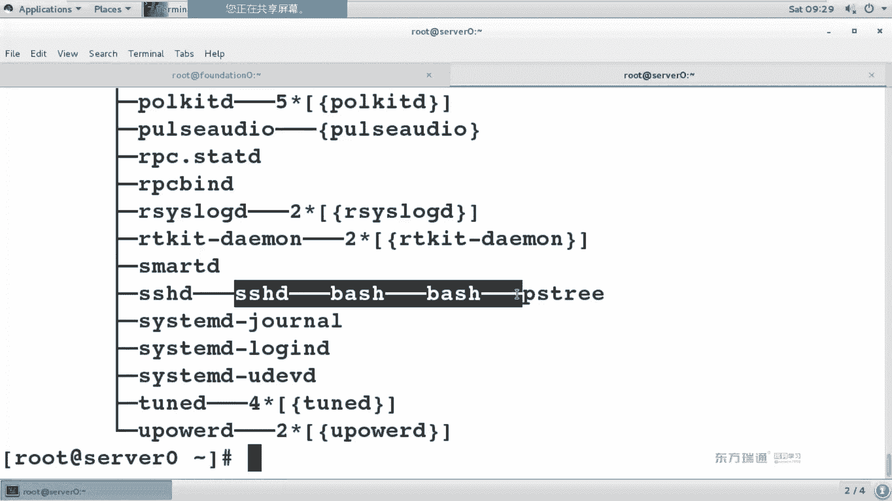

## 进程的基本概念

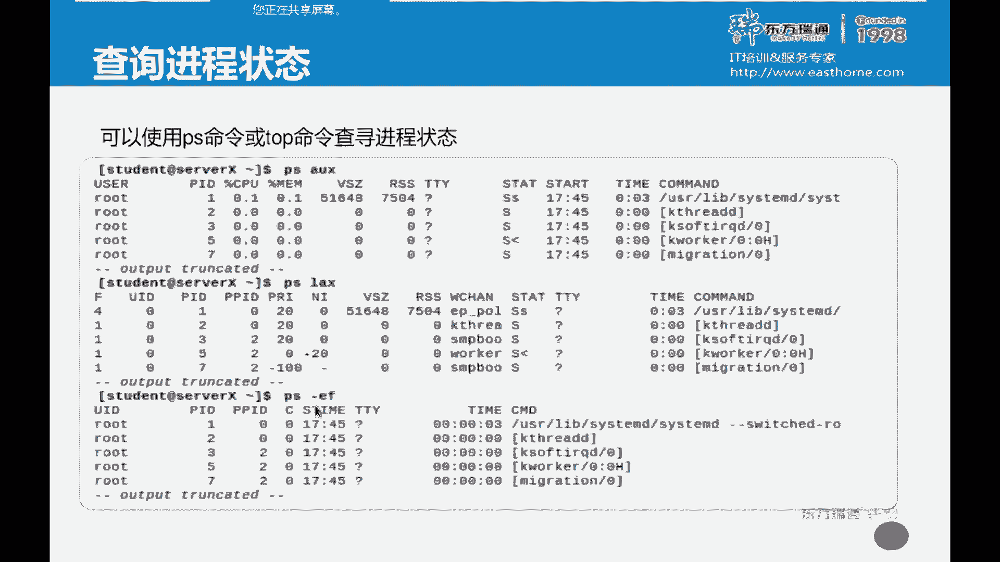

上一节我们介绍了进程的基本概念，本节中我们来看看进程的详细内容。

进程简单来说，就是一个正在运行的程序。我们管它叫做一个实例。在进程当中，有一个概念叫做内存地址空间。每个进程在运行的时候，系统会为其分配一个内存地址空间，里面包含一些安全性和权限控制。

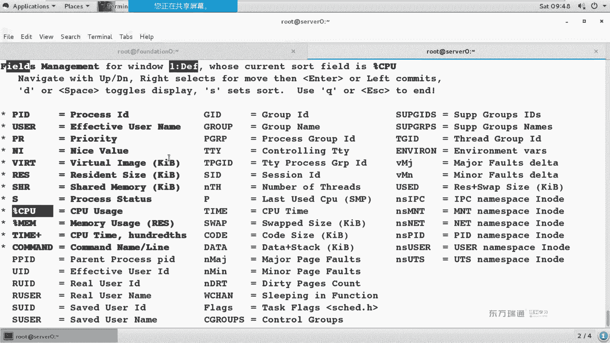

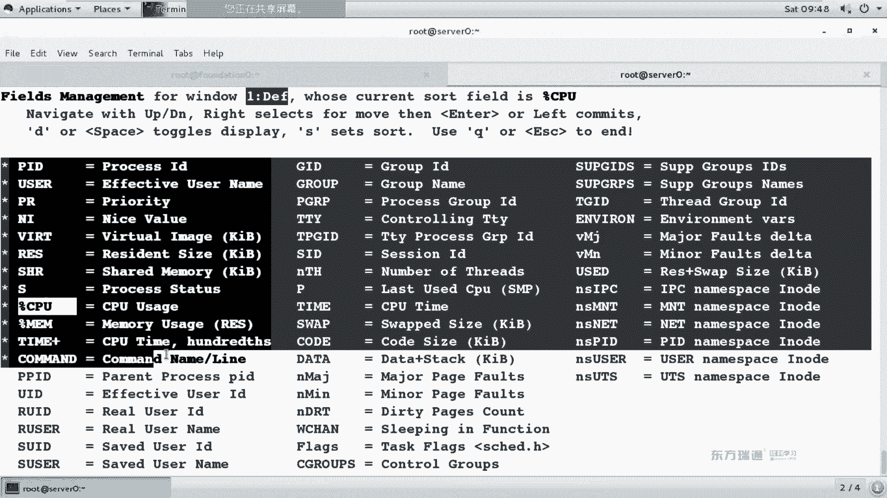

内存溢出是指一个程序在运行过程中，占用的内存空间超过了其申请的内存空间，并且可能涉及其他用户的权限，这种情况很危险。在进程当中，包含两个内容叫做局部变量和环境变量。它们的区别在于一个是局部有效，一个是全局有效。

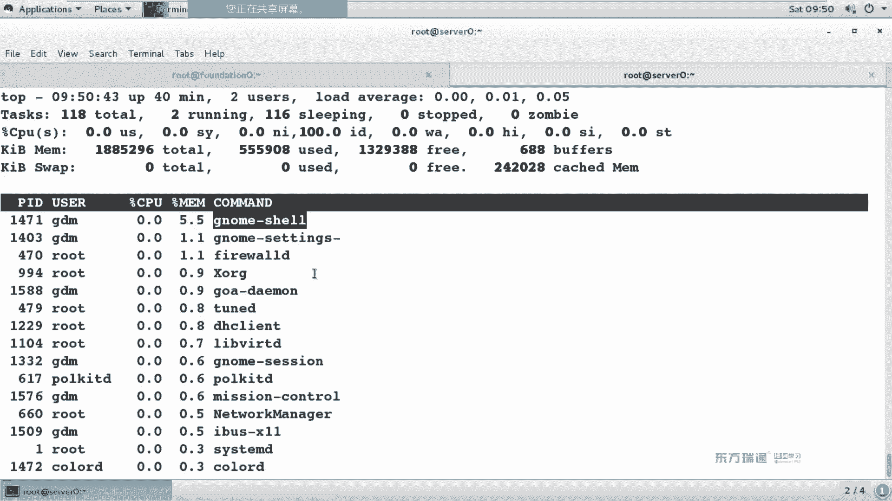

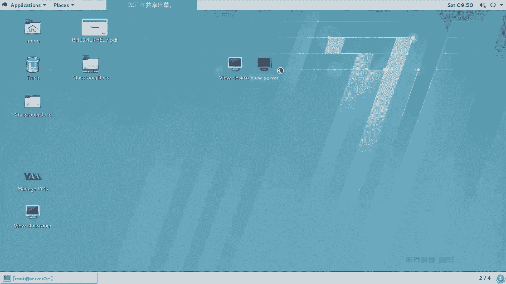

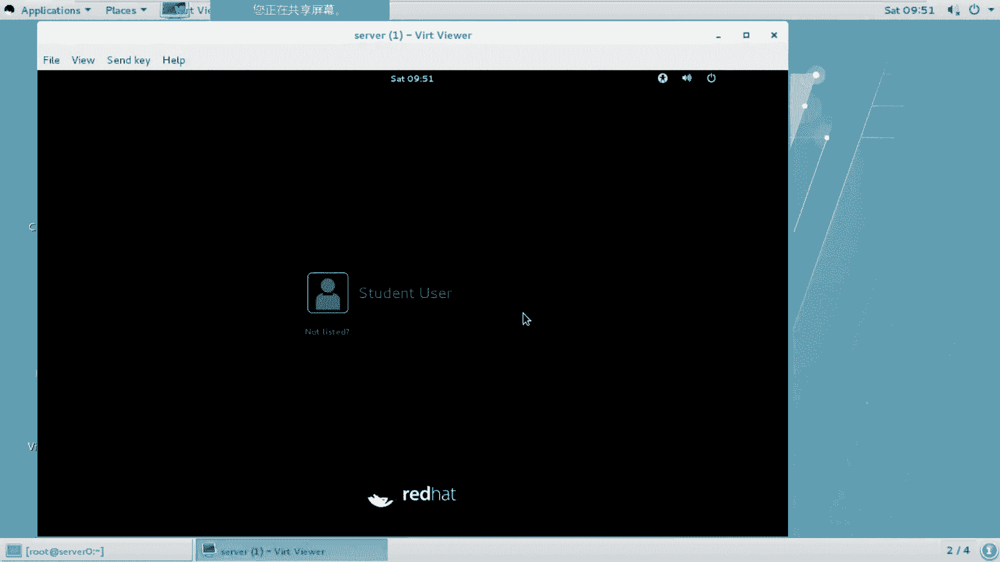

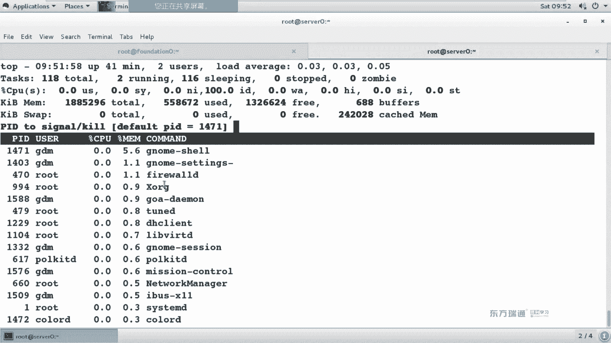

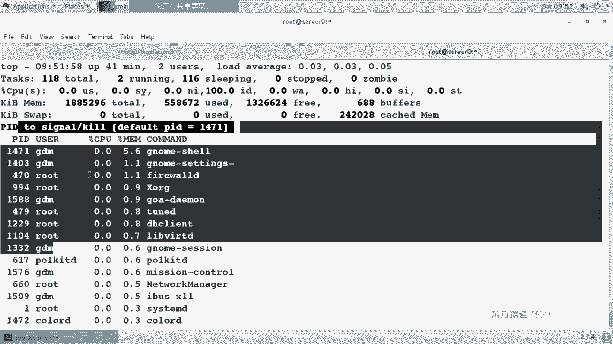

以下是局部变量和环境变量的区别：
*   **局部变量**：只在当前Shell会话中有效。例如，在Shell中定义 `A=123`，切换到另一个Shell后，该变量就不存在了。
*   **环境变量**：在整个用户会话中有效。使用 `export B=456` 定义的变量，在子Shell中依然可以访问。

在进程当中还分为父进程和子进程。父进程创建子进程，例如，当我们执行一个命令时，当前的Shell就是父进程，而执行的命令就是子进程。

系统当中运行的第一个进程叫做 `systemd`（在RHEL7及之后版本）。我们可以通过 `pstree` 命令查看进程树。

## 进程的状态和查看

进程在运行时会经历不同的状态。以下是常见的进程状态：
*   **R (Running)**：正在运行或在运行队列中等待。
*   **S (Sleeping)**：休眠中，可中断。
*   **D (Uninterruptible sleep)**：不可中断的休眠（通常在进行IO操作）。
*   **Z (Zombie)**：僵尸进程，进程已终止但尚未被父进程回收。
*   **T (Stopped)**：进程被停止（例如，通过 `Ctrl+Z`）。
*   **<**：高优先级进程。
*   **N**：低优先级进程。
*   **l**：多线程进程。
*   **s**：会话首进程。
*   **+**：位于后台的进程组。

在Linux中，我们主要使用两个命令来查看进程状态：`ps` 和 `top`。

`ps` 命令用于查看当前时刻的进程状态（静态），而 `top` 命令用于实时动态地查看进程状态。

以下是 `ps aux` 命令输出中关键列的含义：
*   **USER**：进程所有者的用户名。
*   **PID**：进程ID，唯一标识一个进程。
*   **%CPU**：进程占用CPU的百分比。
*   **%MEM**：进程占用物理内存的百分比。
*   **VSZ**：进程占用的虚拟内存大小（KB）。
*   **RSS**：进程占用的、未被换出的物理内存大小（KB）。
*   **TTY**：启动进程的终端名。`?` 表示不是从终端启动。
*   **STAT**：进程状态（见上述状态列表）。
*   **START**：进程启动时间。
*   **TIME**：进程占用CPU的总时间。
*   **COMMAND**：启动进程的命令。

`top` 命令提供了一个交互式的实时进程监控界面。进入 `top` 后，可以使用以下常用交互命令：
*   **h**：显示帮助信息。
*   **k**：结束一个进程。输入进程PID，然后发送信号（通常为 `9`）。
*   **f**：进入字段管理界面，可以添加或删除显示的列。
*   **P**：按CPU使用率排序。
*   **M**：按内存使用率排序。
*   **q**：退出 `top` 命令。

## 作业控制

在Linux中，一个正在执行的任务称为一个作业。我们可以对作业进行前台和后台的控制。

以下是作业控制的相关命令：
*   **`Ctrl+Z`**：将当前前台运行的作业挂起（停止），并放入后台。
*   **`jobs`**：查看当前Shell中的作业列表及其状态。
*   **`bg [作业编号]`**：将一个在后台挂起的作业转变为后台运行状态。如果省略作业编号，则操作最近一个被挂起的作业。
*   **`fg [作业编号]`**：将一个后台作业拉回前台运行。如果省略作业编号，则操作最近一个被操作的作业。
*   **`命令 &`**：直接在后台运行一个命令。
*   **`kill -9 PID`**：根据进程ID强制结束一个进程。
*   **`pkill 进程名`**：根据进程名结束进程。

## 服务管理

在Linux中，服务通常是在后台运行的守护进程（daemon）。在RHEL7及之后版本，我们使用 `systemctl` 命令来管理服务。

以下是 `systemctl` 命令的常用操作：
*   **`systemctl status 服务名`**：查看服务的状态（是否运行、是否开机启动等）。
*   **`systemctl start 服务名`**：启动一个服务。
*   **`systemctl stop 服务名`**：停止一个服务。
*   **`systemctl restart 服务名`**：重启一个服务。
*   **`systemctl reload 服务名`**：重新加载服务的配置文件（不重启进程）。
*   **`systemctl enable 服务名`**：设置服务开机自动启动。
*   **`systemctl disable 服务名`**：设置服务开机不自动启动。
*   **`systemctl is-active 服务名`**：检查服务是否正在运行（用于脚本判断）。
*   **`systemctl is-enabled 服务名`**：检查服务是否设置为开机启动（用于脚本判断）。

在RHEL6及之前的版本，我们使用 `service` 和 `chkconfig` 命令来管理服务，但在RHEL7中为了兼容性，这些命令依然可用。

## 安全Shell（SSH）

SSH（Secure Shell）是一种用于安全远程登录的协议。它比传统的Telnet更安全，因为所有传输的数据都是加密的。

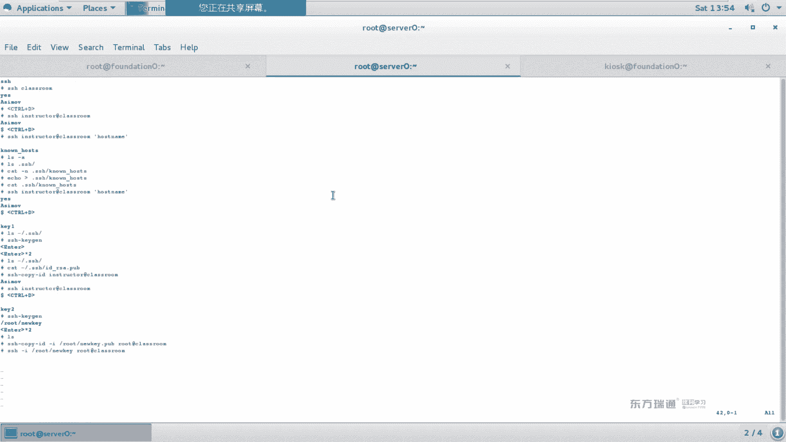

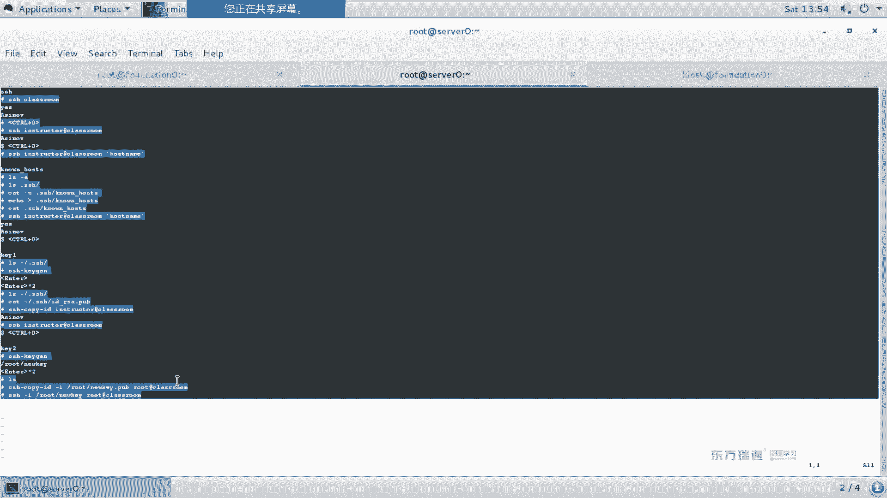

SSH的基本用法如下：
*   **`ssh 用户名@主机名或IP`**：以指定用户身份登录远程主机。
*   **`ssh 主机名或IP`**：以当前本地用户名登录远程主机。
*   **`ssh 用户名@主机名或IP 命令`**：登录远程主机并执行一条命令后返回。

首次连接一台主机时，SSH会提示确认主机指纹，并保存在 `~/.ssh/known_hosts` 文件中，以防止中间人攻击。

SSH支持两种身份验证方式：密码验证和密钥对验证。密钥对验证更安全、更方便。

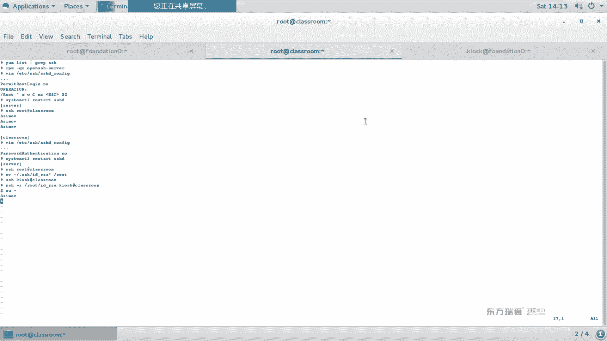

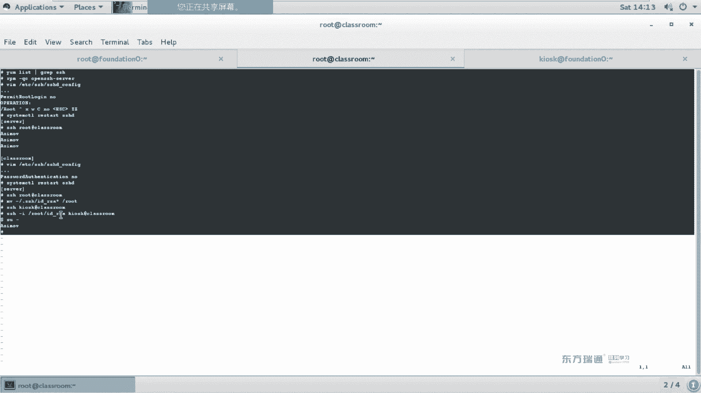

配置密钥对验证的步骤如下：
1.  在客户端生成密钥对：`ssh-keygen`。默认在 `~/.ssh/` 目录下生成 `id_rsa`（私钥）和 `id_rsa.pub`（公钥）。
2.  将公钥上传到服务器：`ssh-copy-id 用户名@服务器地址`。这会将公钥内容追加到服务器对应用户的 `~/.ssh/authorized_keys` 文件中。
3.  之后，客户端使用对应的私钥即可无需密码登录服务器。

为了提高安全性，可以修改SSH服务器的配置文件 `/etc/ssh/sshd_config`：
*   **`PermitRootLogin no`**：禁止root用户直接通过SSH登录。
*   **`PasswordAuthentication no`**：禁用密码验证，强制使用密钥对登录。修改后需重启SSH服务：`systemctl restart sshd`。

## 系统日志和时钟同步

系统日志记录了系统和应用程序运行时的各种信息，是排查故障的重要依据。主要的系统日志文件位于 `/var/log/` 目录下，例如：
*   **`/var/log/messages`**：通用系统活动日志。
*   **`/var/log/secure`**：安全和身份验证相关的日志。
*   **`/var/log/cron`**：计划任务（cron）的日志。

可以使用 `tail -f /var/log/messages` 命令实时查看日志文件的更新。

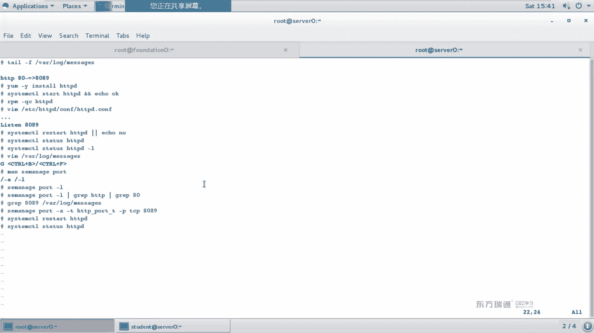

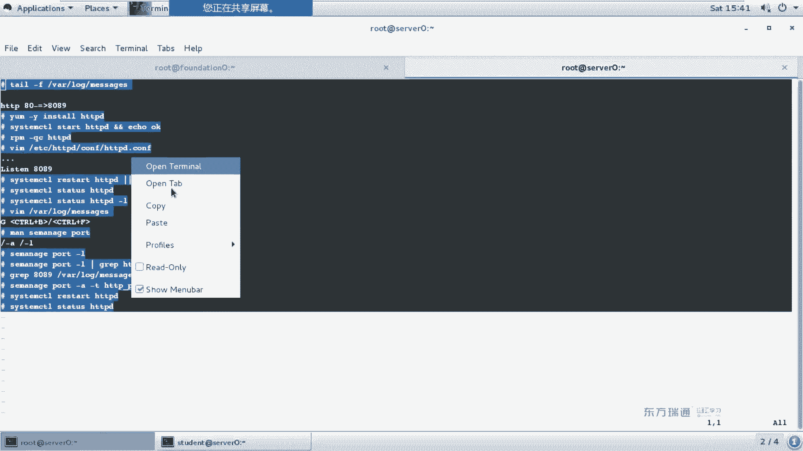

准确的系统时间对于日志分析和服务协同工作至关重要。在RHEL7中，使用 `chronyd` 服务进行网络时间协议（NTP）同步。

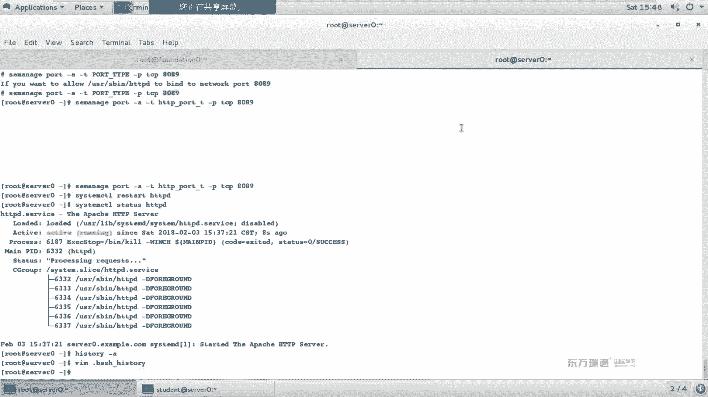

配置时钟同步的步骤如下：
1.  安装 `chrony` 软件包（通常已安装）。
2.  编辑配置文件 `/etc/chrony.conf`，将 `server` 行指向可用的NTP服务器（例如，`server classroom.example.com iburst`）。
3.  启用并启动 `chronyd` 服务：
    ```bash
    systemctl enable chronyd
    systemctl start chronyd
    ```
4.  使用 `timedatectl` 命令检查状态，确保 `NTP enabled` 和 `NTP synchronized` 均为 `yes`。
5.  使用 `chronyc sources -v` 命令查看同步源状态。

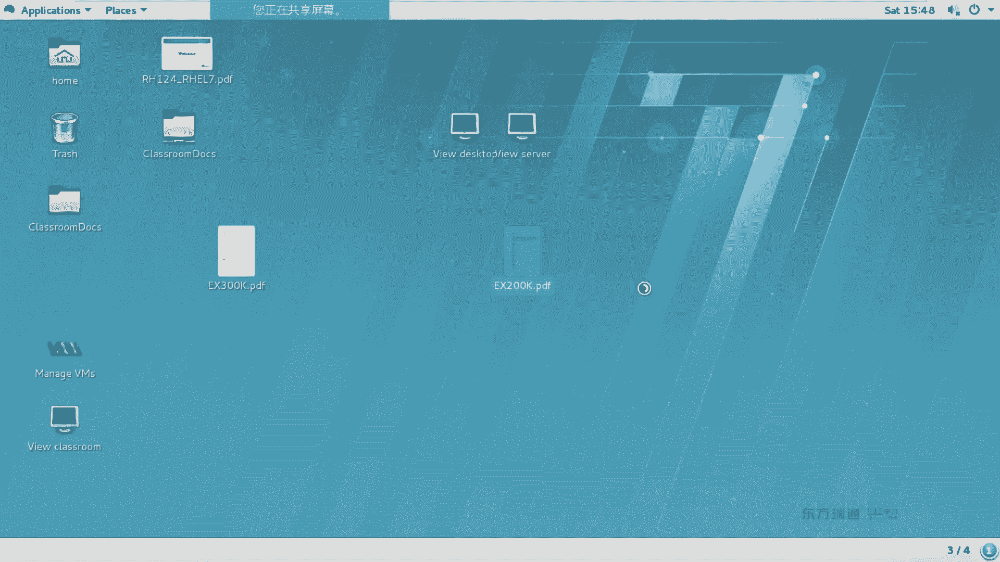

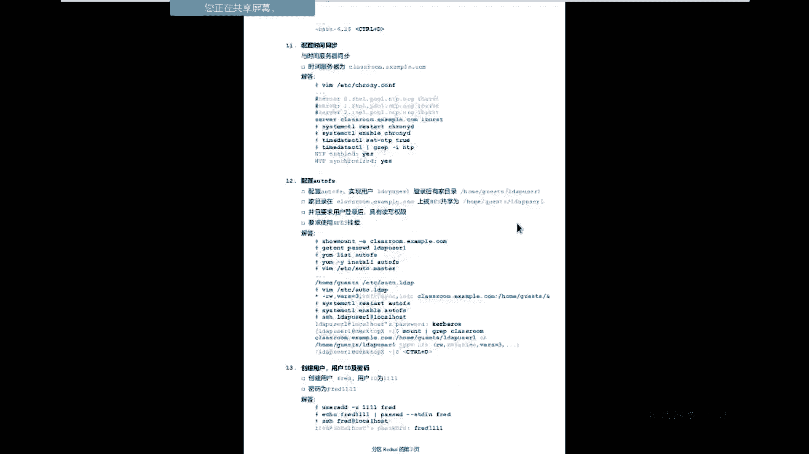

## 网络配置基础

在Linux中配置网络，需要设置以下几个基本参数：
*   **IP地址**：设备在网络中的唯一标识。
*   **子网掩码**：用于划分IP地址中的网络部分和主机部分。
*   **网关**：本地网络连接到其他网络的出口。
*   **DNS服务器**：将域名解析为IP地址。

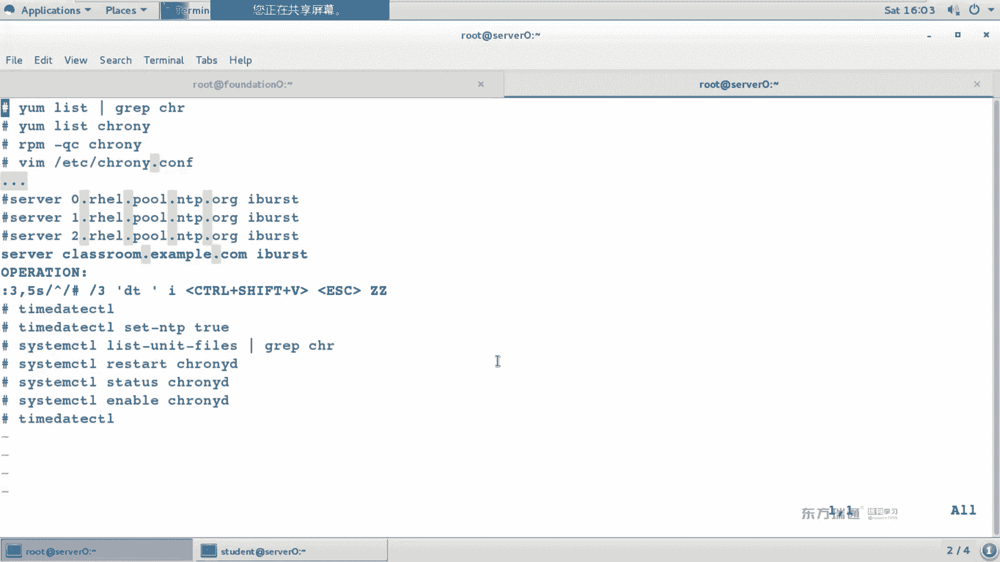

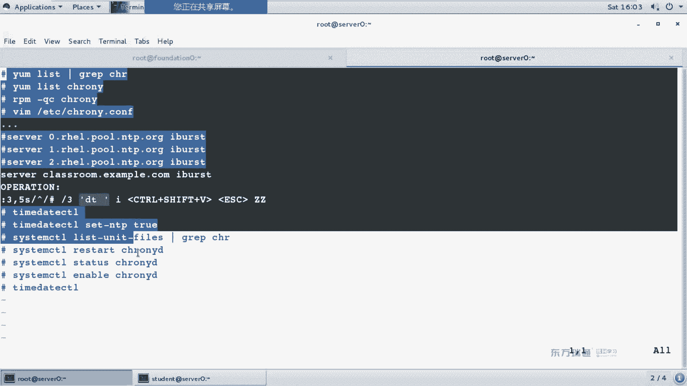

在RHEL7中，网络配置信息通常保存在 `/etc/sysconfig/network-scripts/` 目录下以 `ifcfg-` 开头的文件中（例如，`ifcfg-eth0`）。

一个静态IP地址配置文件的示例内容如下：
```bash
TYPE=Ethernet
BOOTPROTO=none # 静态配置，如果是dhcp则写dhcp
NAME=eth0
DEVICE=eth0
ONBOOT=yes
IPADDR=192.168.1.100
PREFIX=24 # 子网掩码，24相当于255.255.255.0
GATEWAY=192.168.1.1
DNS1=8.8.8.8
DNS2=8.8.4.4
```

修改配置文件后，需要重启网络服务或特定的网络连接使其生效：
```bash
systemctl restart network
# 或者使用NetworkManager
nmcli connection reload
nmcli connection up "连接名"
```

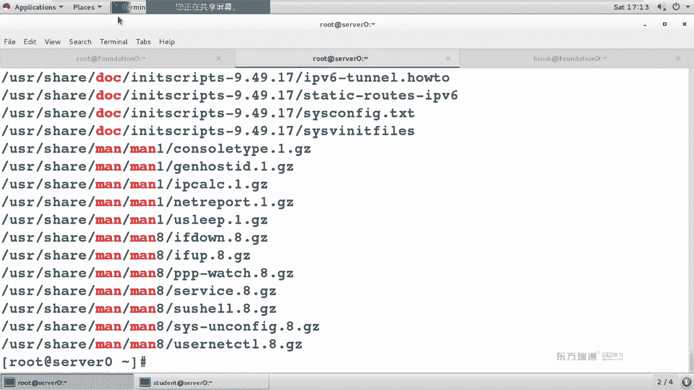

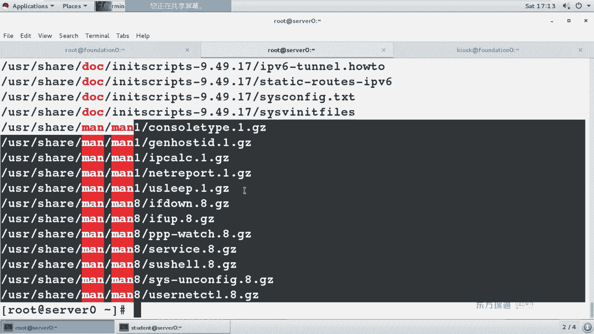

可以使用 `hostnamectl set-hostname 新主机名` 命令来设置系统的主机名。

---

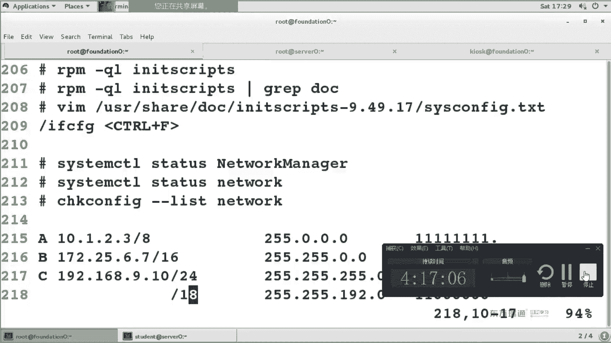

本节课中我们一起学习了Linux系统中的进程监控与管理、作业控制、服务管理、SSH远程登录、系统日志查看、时钟同步以及网络基础配置。掌握这些内容是进行有效系统管理和故障排查的基础。请务必通过实践来巩固这些知识。