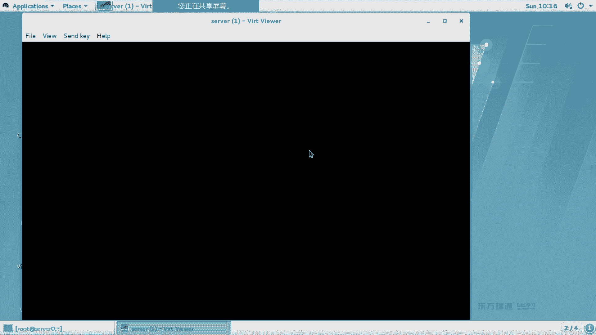
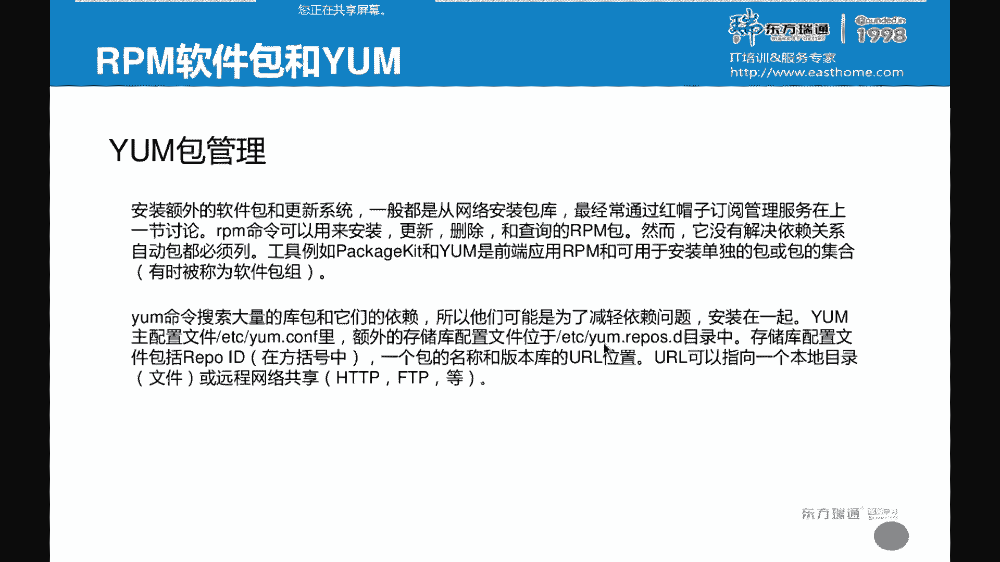
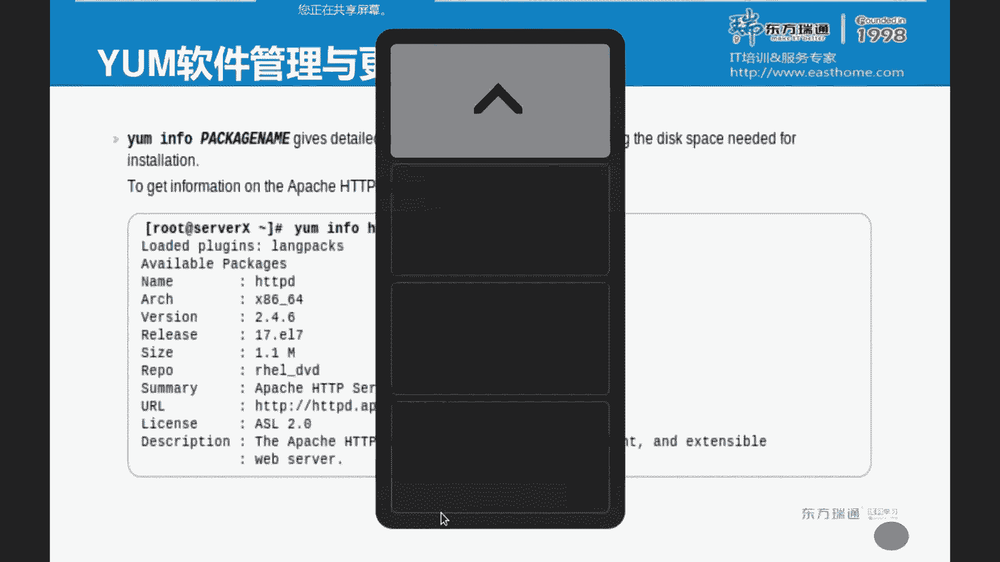
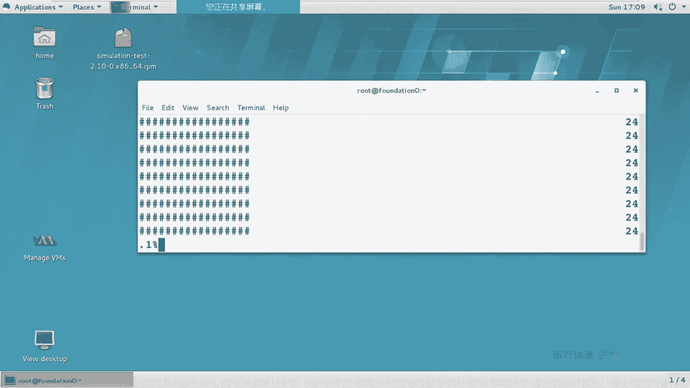

# 红帽Redhat RHCE7培训课程+RCHE7实战参考教程+红帽8.0教材电子版+模拟环境及辅导 - P6：6 - 16688888 - BV1zu41197p6

第11章。网络linux的网络。对于网络而言呢，我们需要来配置IP岩马网关DNS主机名。网络相关的内容。那下面我们来看一下。首先来看一下概念。IP地址和掩码。

IP地址我们经常在十0进制和二进制之间来转换。平时上我们使用的IP地址都是十进制。但是计算机在计算的时候使用的都是二进制。将172换成二进日。1753都换成二进制，同样你的掩码也换成二进制。

二进制语音算语音算说白了就是乘法。1乘以1等于10乘以任何数都得0。凌晨那是不这理。算完了之后呢，我们可以来得出下面这个值。上下运算哈，1乘一的10乘任何数的0。算完了之后呢。

我会发现一乘以任何数都是原来的数。那么把二进制再换成十进制，是不是就是172。17呀？17217。那后面这些呢后面这些我们管它做主机位，前面这个叫网络位，网络位。在同一个网络当中的机器。

我们认为他们可以互相通信。不需要用到路由器。如果网络位不同，我们认为它是在不同的网络当中需要通过路由器才么联网。下面又举了1个C类IP的是，192168。5。3换成二进制。那到底如何来换算呢？

最简单的办法就是用操作系统当中的计算器、科学计算器。你来算一下十进制和二进制的转换。如果是用口算的话呢。二进制的第一位啊是128。第二个是6素。简单来说就是二的N次幂，6432168421。OK吧。

这是实际制按日我们来换算。口算的方法。一般情况下，我们提到这个浅缀的16和24代表就是你掩码当中有多少个一。我们看到标准的A类、B类、C类就是862。这么三个亚马。除了8624之外呀，它有些借位的情况。

比如说当以前缀是17的时候，他是不是又新借了一位呀？但是不管怎么借，你要记住，借位的话永远是连续借。什么叫连续啊？你这个位置借了个一，要再借的话，就挨着借。不可能跳过一位再借OK吧，这个是借位的规则。

那ITD如何来表示？有没有没有配过IPV4的？都可以合吧。不管是windowslinux还是unux，只要是网络操作系统，他们都可以来配IP地址。有同学说，哎，老师。

我平时用这个手机啊paad我没配过IP地址。为什么？自动获取地址是吧？因为手机和派的KIP的话，多折磨人呐。我上别人家去玩去，我说哎你家这个wifiIT密码。这个SSID你问一堆是不是挺折磨人的。

知道SSID一找找着了，敲个密码完事儿，你再去个配个IP亚码网关DS。这个。下回不敢去他家了是吧？那么人。这是IP地址，它可以动态获得，也可以静台来分配。那么IP地址怎么来表示？IP地址IPV4。

时进制。32位，我们所说的32位指什么含义呢？是说二进制的32。把四组这个数啊换成二进制的话，一共是不是32位数啊？0和一来表示32位数。小数点儿点分。四组四组表示。

那十进制的话只有0到90个数叫做十进制。如果出现了16进制，除了0到9之外，还会有什么呀？A到FA到F16进制，16进制当中会有L吗？会不会有L？不会是吧。这个我强调一下啊。

我们在第二门课程当中会讲到IPV6地址。SVV6的配置。然后有同学在配的时候呢，那个题上啊有的是一。他在配的时候就这样往L上调。实验怎么也不成功。记住啊，1六进制不会有L。十进制是0到9。

二进制呢是0到1啊叫他们怎么来表示？地址分成两部分，一部分叫网络部分，一部分叫主机地主机一部分啊，他们的计算方法呢就是IP和掩码进行二进制的运算。同一个网段中的所有主义，他们会互相。

交谈属于同一个网络当中。不需要用到路由器。如果是不同的网络，需要使用路由器，才明白吗？这个是IP地址。在最后这段呢说明一个概念就是主接位的概念。主机位圈零圈一两种情况。圈零的话呢叫做网络地址。

圈一叫广播地址，广播地址。在每个网络当中都有两个特殊的地址，主界位全零圈一的情况。这段内容啊，如果你们想详细了解的话，你可以去。听听斯科和华为的第一门课。斯合和发挥的第一门课呀。

它大多数情况下不是讲配置到底怎么配，都是在讲网络的理论啊，网络的理论。咱们这门课呢主要来讲是操作系统，只是使用到了IP地址，所以说你会配就可以。下面呢是举了三个例子。A类B类、C类。三类IP地址。

这些IP地址呢都是私网IP什么叫私网IP呢？只能在局域网当中使用。互联网中有人用吗？没有，有同学说老师，那我就喜欢用互联网中那个官网IP可不可以？我有IP地址啊，叫1。1。1，这个IP好吧。多好记呀。

你能用吗？如果你不上网的话，可以用。有同学说老师，我上网也能用。对。假设哈我们经常访问一个网站叫做百度啊，百度它的IP地址假设是4个一。那在你的局网当中。你能访问。百度这个网站吗？防不了。

他一看一网多少IP啊，是不是就局网啊，根本就不往互联网上走，根本就不走网关。能理解吧？所以说在局域网当中，我们一般情况下用的是私网IP。当然你非要用公网IP随意，你不上网的话随。但你要上网的话呢。

那个网段的服务器你都防不了原因。呃，这个案件应主要来说明的就是你的网络地址和广播地址。IP和页码做二进制的语音算。你当前的网络地址呢是192168。1。主机地址是107，主机地址。

主机地址签零叫网络地址，主机地址签一叫做广播地址。这后面是二进制的计算方法。前面呢叫网络地址。我们再来看下面这个实例啊，BA类的1个IP。10万多IP这个是一个A类的地址。那你的页码是255的话。

你的网络地址是多少啊？10、你的主机地址是1。1。18。主机地址是1。1。18。主体地权利。叫做网络地址，实机地址迁一叫广播地址。下面这个是一样的。我们会发现呢下面这个掩马啊，掩马前缀很怪是吧？

这是多少啊？19、正常情况下1个D来IP啊，它的掩码应该是多少？16，那你十九的话是不是借了三位呀？你瞅下后面。是不是借了三位呀？这三位的话，128加64加上32，是不是就等于24？嗯，这他的算法啊法。

然后呢。你这个算完了之后啊，你就会发现前面这个呢叫做网络地址，后面这个叫主机地址。主机地址全零全一。得出两个数，再换算成十进制160191。25。这个比较特别啊。网络地址加上主机地址签0填一把它。

就是网络地和主机怎么来算？那什么时候会用到借位呢？或者叫划分死亡掩码分分死亡码。当你们公司的网络呀比较复杂的时候。不用だ。如果你们公司的电脑比较少的话，基本上看不到。它主要是用于啊隔离广播域啊。

隔离广播域。因为广播雨很大的时候会有叫广播风暴的东西。老ほば。嗯。我们看下这个图啊。这个问题非常简单哈。请问。下面这组机器它的网关是多少？是192呢，还是172？啊，192。5。254这个是吧？

你的网关永远是本网段路由器I替。本网段啊本网段诺基亚可能有好多IP跟你都没有关系。我们只需要知道本网段IP。这个就是那么关。这网关怎么来的？王海的名声。

我们的网卡通常情况下叫做ETH几数值ETH呢叫做anernet叫以太网络。以太我们现在用的网络是不是都叫以太网啊？在网络的历史当中啊，还有些什么同城电缆呢。其他的网络。我们现在用的比较多的都是以太网卡。

在铁板7当中，我们的命名规则会有了变化。实际上7之前呢铁板6的时候也有了变化。我们的网卡叫什么名啊？ENO啊ENO。Iernet number。有的人说，哎，老师不对呀。我们发现呢我们这个网卡。

我先启动一个机器哈。😊，我们来看。接口名或叫网卡名。用什么命令卡？嗯，衣付返费个。冒号前面的。这叫网卡名Bnet1。这个就叫网卡名。他有好多网卡名。上面还有。Vnet0。回来特别。

我们一会儿在做实验的时候呢，大家会发现一个问题，你的这个网卡名啊。是叫做ET是0呢，还叫做因OG。叫做一天是一一天是2。EH0叫做这样的名，为什么呢？因为在网卡当中，它可以来设置别名。王卡可以改名。

在linux当中有一个叫做U device的一个服。相当于windows当中的设备管理器，它可以给设备改名。那为什么明明叫做ENOD，非要改成ETH几呢？因为在linux7之前的版本。

我们一直都叫一铁之际，只是一个习惯而已。所以说在解版7当中，我们的培训环境做了一个网卡的别名，通过us把我们的网卡从ENOG改成了一铁之际。这是原因。在2CSA和2E的考试当中呢，你会发现个问题。

上午的考试，你只有一块网卡。下午的考试你有3块网。为什么为什么？在实际工作当中啊，有这么一个概念，叫做双网卡放的双网卡team。网卡PM多网卡绑定啊多网卡绑定，勇于使用。上午的时候呢。

他只考你1个IPV4的设置，一块网卡就够了。下午的时候呢，它除了IPV4这块网卡，让你配个IPV6。另外2块网卡呢还想去配个T。这是下午的时间。上午下午呢不管怎么配，你要分清到底用哪块网卡。

到底用的方卡？对于网卡而言呢，我们还有这样的名叫WL叫做wireless啊，wireless one叫无线局域网。WW wireless one wireless one无线广域网。

还有一些呢叫做PCI类型的网卡。带S的带S的。这是这些玩卡的名称如何来表示？刚刚有同学说了呢，我们看这个接口啊，用is这个。在体满期当中啊，建议大家用IP addressdress寿命令。

有同学说老师用E产这个不也能用吗？嗯。可以看到王海明吧。可以看到IP地址吧。为什么说建议大家用IP售？他俩显示的结果一不一样。有王卡名有IP地址。结果是一样的吧，原因是什么？Lux在安装的过程当中啊。

它可以来定制最小化安装，还是你要安装某些组件。如果是最小化安装的话，你会发现个问题。伊不可这告这个秘令。大家会发现我用YR命令来查的时候，你在哪儿？一个是命令，一个是手册。OK吧，一个命令一个手机。

通过RPM到QS那令，这个是干嘛的？他的这个文件来自于哪个安装包吧。看到这个包了吧。如果你是最小化安装系统，这个包默认没装。这个包默认没装，想开IP地址，if can这个不存在，你怎么看呢？

IP address show。IP。他这是缩写啊。填写的话呢。能看懂吧？如果你考虑效率的话，命令后面的子命令支持缩写。子命令之是。IPAS。IPIP。你只是想看某一块网卡，后面可以接上指定的网卡名称。

那我们来看一下这段内容啊。同点都得代表什么啊号。爸爸代表什么呀？启用了嗯启用了。link answer这个啥？卖费地址。或叫物理地址。这个呢I。IV。是。地址和掩码前缀。

后面这个broadcast的代表。广播地址。ipad6。inet6代表。ICV6电池。当家会发现的，我这个机器刚开机默认就有什么呀。IPV6地址，这个叫做链路本地地址。链路本地地史。什么概念呢？

你只要是安装了IPV6协议，那么你就会自动生成一个这个地址。怎么生成的呢？我们在第二个课程当中。IP杠S link售S是什么意思？状态。状态t。在微软的产品当中。

我们看网络连接是不能看发送和接收包的数目。发送和接收包的数目。是不能看到发送和接收包的大小啊？也能看到吧。他那个东西有什么用？一般什么时候我们可去看这个东西啊，看也没有收发包吧。什么刷包。

实际上他这个多少吧，我们不是特别关心，主要想看的是有没有收挎包，为什么不能联网？IP杠S零售。看网官。IP rootot。Iy with。那我们会发现呢幻灯片这几页啊都讲的是一个测试的过程吧。

怎么看IP地址，怎么看掩码，怎么看网关root这个词发译现中文叫什么？路由我们会发现网关是不是就路由器局网来提呀？IProot查看的就是网关。大尿的满关是多少啊？254。0。25。这要默认网关。

我会看啊，要不一会儿拍完了，你立法出试。带有T。在微软的产品当中获这拼几个包。这个吧。那那个是默认提几个包。连续拼是吧，windows是拼啊P那ning个字是连续拼。那我如果也想拼4个包。

我们有一个选项叫做count。看他发译的中文叫奇数是吧，几次。这个是通还是不通啊？我强调一下啊，这个是通。能看到时间。你能看到TPL。这个就是通。如果你看不到这两个东西就是不同。OK吧，我强调一下。

因为之前有同学问过我这样的问题。他明明敲不通，拼的时不通，他说哎老师为什么防不了，我说你不通啊。他说这个有风险吗？他看有那么几行，每每一行都有个回写，他认为是通，我强调一下啊，这个是通啊。

TTL有存货时间，有time返回时间啊，这是通啊。这是批命令。谁是看。就是他。这个pa这个功能啊叫做路径追踪啊，路径追踪。录像追踪什么功能的？你们公司啊如果是一个国际性的大公司。

你会发现你们在全球各地啊会有很多的路由器。走专线来联网。大家走专线的时候是只有一个项吗？每个公司是不是还会有些VPN备份线路啊？VPN备份下。那我怎么知道是这个当前走的是专线呢，还是走的是VPN线路呢？

通过Tpa来查走的是哪个设备。他会把你所有设备经过的设备，他来P给你罗列出来，要路径追踪。这个是专门来判断我中间哪个设备有问题。查询路径的。我们公司是通过上海再到日本的呢，还是通过北京再到日本的？

这么一个概念。如果经过多个路由器，你可以来查询。最简单的办法呀。或者我们给大家举个思路啊。以前的时候呢，我们去访问一些国外的网站。你会发现速度很快。换然一天呢你访问一些国外的网站，你会发现速度很慢。

你可以去对比前后的car。他们走的路径不同。因为整个互联网啊，它是网状结构还是心状结构啊？网状吧，A点到B点有好多条道吧。你们每天从家到学校有很多种方法来，到底走哪条呢？不一样吧，你可以走着来。

可以骑车，可以坐地铁，可以坐公交。什么概念路径追踪到底怎么走？端口问题。端口问题这个怎么来理解？我们在昨天讲了一个。System control meaning令 inspects。

这个命令是干什么来的？查看服务的状态吧。现在问题来了。请问一下，在linux当中的服务，或者说操作系统当中的服务，每个服务是不是都有相对应的端口？是不是？比如我们昨天做了个阿帕奇服务。

阿帕奇服务多网号默认80吧。你只要服务启动了，是不是要接听80端口？你改成他8089，你服务如果启动了，这个要坚听8089号。换句话说，判断服务是否启动，我们有两种方法。第一种方法呢是通过。

system control status meeting看是否是active。第一种。第二种方法呢就是看端口的状态。装好的状态。如果你看到了listen。比如说看这行listenSSH。

SSA是什么服务啊？咱们昨天是不是讲了一叫open FSH服务。如果你看到了listen代表是SSH服务启动了。通过端口的状态或者说看服务的。都可以判断服是吧题。lason哈，听听。

我们现在用的这条命令呢叫SS。I。服务状态。TT代表什么呢？T代表是TCP。在协议当中，除了TCP之外，是不是还有个叫用DP呀？删书层协议TCPUDP它俩的区别是什么呢？啊。

UDP没有三四握手TCP有3四握手。说白了呀，就一个是打电话，一个是发短信。TCP是打电话吧。你打电话是怎么打呀？喂。你是不是听动静啊，然后那边也喂。然后你这边又听着了，说哎，我找谁？是不三四窝手啊。

这要打电话UDP呢是发短信，什么叫发短信呢？发过去，对方收到没？你看手机上显示邮件短信已送达。那对方看没看，你知道吗？他手机丢了呢，是不是？就是TCPUDP的区别TCP可靠UDP不可靠啊，就这区别。

那A代表什么呀？奥A代表是奥。那我们再来看后面这个内容啊，冒号冒号是分割符，前面是IP地址或主机名，后面是你服务名或端括号。这个呢是本地的地址，这个是远程的地址。看一下最行啊。但是他健行比较特别呀。

astable的代表已连接。什么叫已连接呢？类森是说我的服务已经启动了，你们可以来连。我们昨天是不是讲了好多FIH的配置？不允许入他来连，只允许有密钥的人来连。那么谁连上了呢？能看到吧，这个人脸上了。

但是看后面这个农网号。5万多吧。段号的取值范围是65535以内。1到6万多啊，65000以内。这个呢是221024以内的端口，一般情况下都是给服务器保留的。或者给服务保留了。那提到端口啊。

还要提这么一个知识点。如果一个端头已经被占用了，另外一个服务还能。启动不了，非常好啊。比如说在微软的产品当中，我们是不是可以通过安卓IS启动一个外部服务啊？默认80是吧，然后呢，你又塞了一个阿卡奇服务。

有windows版吧。有斌老板，你在启动能启动吗？除非不用8联端口。如果你就用80端口的话，就起不来，是因为端口被占用啊，原因每个服务需要有自己对应的端口。那下面这个三个冒号啊，代表是IPV6的地址。

IPV6的意址。带个一呢这个一呀和上面1270。1，它俩就是IPP4和IPP6链路回款地址。1270。1用过吧。当我访问1270。1，访问的是谁？自己是吧。所有人访问1270。1，访问的都是自己。

这个都是网卡的归还地址。IPV4回还地址。那么冒号冒号一呢代表是IPV6回还地址啊，V4V6都有个。O那下面呢给大家举个例子啊，这个FS分辨率。这个又刚刚讲了吧。又代表什么来着？UDP啊。

有同学说老师U代表短信。也对，是那意思是吧？摸那个什么。大家还他俩区别没？一个是名称，一个是number吧。这是NN代表是number数值表示。P代表什么呢？Process。进程名进程名。

乐代表式是看la森。我们来给大家举两个例子，帮大家理解。SS。ATUNP。A代表所有的T代表TCPU代表UDP。N代表数值，P代表镜头。为了帮助大家理解啊，我们只看其中的一行。SSH。字儿弄小点啊。对。

这么大能看清不？问。我们来做对比啊。我过滤的SSH是进程名。后面这个是他的进同ID。大家会发现我现在前面这个是不是都要TCP呀？这个是因为你写的T。过滤TCP的。然后后面这个位置呢，你会发现是22。

这个是因为你写了字。能看到吧。我们一个一个来做对比啊。首先他把那干掉。看出区别了吧。你们在学习的过程当中啊，当接触一个知势的时候，你们要去做对比。去分析。等学完了之后呢。

你要去默写整理思路它是干什么用的。而所有的选项在记忆的时候啊，最简单的办法就是背单词儿。最简单的办法就是陪单。O。那下面呢我们再继续。我把P给删掉。把P给干掉。最后一列没了吧。进程名没有了。

进程名其KID。你把U给燃掉。有反应吗？你再看看。因为SSH是服务，他用的TCB还有DP协议。成液。你看第一列不显示了，但它还显他这三行还有是吧？那如果你把T给干掉呢。默认有没有提呀？有吧。

忘有题A在往什么呀？全部。SS命令是是linux和unux当中存在的命令，在微软的产品当中，是不是叫nice命？那那个4当我也可以用n是va。刚刚我们用了几个品项啊，ATONP。也不一样。一样。

那为什么不用nex state命令呢？他太长了。SS的话是不是手一嘚破就完事儿了。m stay的时候他在两手婆了。原因。效率的问题。效率。在微软的产品当中，依然支持nex state。

是通信哈通信肾道体嘴。看services文件。我们刚刚啊在看这个实验的时候，大家会发现它后面是不是自动加了一个服务名。这个服务名是哪来的？在CETC下有个叫services文件。反灯片上少写了改。

在这个文件当中，我来查SSH。开46号。SSH是不是22端口TCP协议？FFH。在这个文件中来定义哪一个端口是哪一个服务再来使用。他们的匹配关系。Sorry。我 must feel like。呃。

刚刚呢我们讲的内容，如何来查看IP查看网关，查看掩马。查看端口。哎，前面讲查看GES。没讲。DS怎么看？怎么看DS？这个文件。这个文件是。立即生效临时生效的文。一般情况下，我们的文件是不是都永久生效？

这个服务叫立即生效，临时生效，原因是什么？大家看这上面这行井号代表什么？不是他说这个文件是哪来的？network manager生成的吧。换句话说，你永久生效的文件在哪个文件当中？网卡配置文件里。

DNS永久生效的时，在网卡配置文件里。当你重启network服务之后，network manager之后，它会将网卡配置文件中DNS的值生成到这个文件中。在linux当中，你要明确两个概念。

永久生效和立即生效。这个你要分不清的话，你就会。觉得很奇怪，哎，我明明刚刚配了，怎么重启了n work服务，刚刚配东西就没了呢？OK吧，哪个是永久成效，哪个是低级。好。

那下面呢我们来看一下配置IP的方法。昨天快放学的时候呢，我们提到了PIP有几种方法呀？四种。四种其中第一种呢就叫NMCMI。我来看一下。对于王凯而言，有两种名称，一种叫连接名，一种叫设备名。

连接名和设备。为了帮助大家理解，我们来做这样对比。Connection受。NM和Y。麦克你可按K勾键补全。也支持缩写。我把字稍微弄小点啊。这个叫什么名儿？所以我这个命令啊叫做连接显示命令。这是什么鸟？

连接名后面这个呢。设备名。两个名分清了啊，两个名分清了之后，你才知道我们一会在PIP的时候到底写什么。但是另外一个和他相对应的年龄。1万是30。这个命令是什么意思啊？设备状态。B列是什么名？

后边什么名儿？说分清吧。两个名不一样。那我们会发现这个问题，你的设备名是不是就接口名啊？用IP给它拽瘦E很fi的时候。是不是就这个名啊？设备联合接口呢是一个东西。下未面接好面。如果你想查看你当前网卡。

当前的连接。所有的配置信息。你可以通过瘦。具体的。这什么名？连接没有。嗯。黑包间按两下什么。来说。没接明吧，中间有空格没？未来表示个整体怎么办？这也号。表示个整体建议哈啊，很多同学呢他可能这么做。

这么做是错的。刚看到啊。为了表示他是个整体卖加引号。我们加引号的时候啊，建议大家加单眼。说你行不行？那我为什么要非家答应你？非常好，就方便。因为双眼的话能上哪剑。能听懂吧？就是说单引双引都行的时候。

你当然按方便的了，你当然方便的了。哦，大SK键引号是不是自动股权了？列出来一堆东西。嗯。连接的ID。连接名，大家看下面这个是不是叫接口名。UUID类型自动连接。这个里面有没有IP地址啊？有没有？有吧。

IPV4IPB址这是静态是动态的？静态IP动态IP。我们往上找哈。😊，IPV4。IPV4这个IPV4的吧。master的翻译中文什么意思啊？方法方式。凹凸什么意思？自动。自动获得IP。

你是自动获得的IP，那你是动态IP还是静IP？动态PO。下面说他个IPP6的地址。能看懂吧？这是他的一些值。打罗参数。那下面我们来看一下创建链接和编辑修改啊，修改链接删除链接。对于这个连接而言呢。

昨天有同学问了我这样的问题，他说我服务器上了好几块网卡。每块还连不同的网络要配不同的IP我怎么来区分这些网卡呢？你在系统当中怎么来区分呢？你配的是哪块。你怎么区分？两两个方法啊，给大家讲一下思路。

第一个我们刚刚啊。讲伊服坦这个IP的专售的时候，你能不能看到这个。接口的状态呀。可唔可以。你既然有4块网卡，我先插一个网卡行不行？只有一个网卡接网线。我别的玩法先不接网线行不？那你是不能看到状态呀？

这个是一个位置，另外一个位置。我们是不是可以看设备的状态啊？能看到吧。一个个查。然后是不是就能分清来，哎，到底哪张网卡是谁呀？对应我的设备名叫什么名，能判断出来了吧。这个判断出来之后，你看应该做什么呀？

嗯。是不是给他妈配置。IP地址啊。配置IP地址说白了就是做配置文件，什么概念？我们所有的网卡配置文件在哪？是不是这个目录下？根GC。等等文件夹系统当中几乎所有的配置。不管是系统的配置还是服务的配置。

都在AETC下。在款被告。它相当于windows当中的控制面板。相当于windows控制面板那么个地位。网络脚本相当于控制面板里面那个网络连接网连接。RF3FGETH0，相当于我们具体某块网卡。

每一块网卡理论上都需要有个配置文件。这个配置文件我们昨天呢再看它的来源的时候，它来自于哪个安装包啊。没有。说没有啊。换句话说，网卡的配置文件是不是得自己创建？如果网卡没有配置文件的话。

你需要用这种方式I的。爱的什么意思呀？添加。我们刚刚问他有没有配审文件？ECK40有没有？有有配置文件，你得用什么呀？有配置文件的话，你得用什么？你还能用艾德来欺加了吗？不能。没有什么。帽子是什么？

我们在学习账号管理的时候，是不是讲了一个叫user爱的命令？又说帽的棉。有说丢命令有意响吧。在计算机当中，我们做的操作基本上就三种添加修改。添加就是I修改就是modyify删除就是deelete。

OK吧。如果你实在想不起来的话，我们T键能不能列出来呀？也可以吧，也可以列出来。NMcon是 modify修改谁改成什么？前面这段格式是固定的。后面的内容。两个是一组。或者要两个是一对。

比如说你说你写了个值，connect上就connect它后面必须有个值。连接自动连接吗？叶早农。IPP是DNS。必须有个纸。两个两个是一多少号。他们没有相应顺序，我先配第二条后配第一条随意。

先配第一条后配第二条。这几个都没有先后顺序。如果想增加1个DNS用什么符号啊？加号你要删除一个呢。减号你要想修改呢？再敲一遍。能看懂吧。第一条是直接修改，后面呢就是加和减增加删除的区别。同理。

IPP4地址能不能加呀？能不能减？我们在写APP是地址的时候。要写野马前缀的不？要写为什么不写掩码？太长了，来那个字本身就敲字母，我敲一个字母能解觉的，为什么敲一堆字母？OK吧。

就像以前我们在坐公交车的时候，大家是不是都要去。投币掏龄钱呢？要没有零钱怎么办？你是不是得一直站在车门口接零钱呢？跟乞丐有什么区别？没有拿板是吧？感觉特别不爽。万一再这个100了怎么弄，还找人。

又不是收银员。所以说后来我们发现周公腰都变成什么了。刷卡吧。关卡。第四条第五条有什么区别？嗯。第五条当中设置了个把关是吧？网关是不是针对的是这个网段啊，所以说它是和IPD一起来配。

为了表示他俩是一个整体加什么符号了。引号单一双眼。随便。都行。啊，都行。我们在平时工作当中啊，你会写很多的脚本。嗯，你会发现吗？单眼双引都行的时候，到底用单眼还是双引呢，看你心情。都可以哈。

反正不用单眼睛双眼，但是他俩有没有区别？有单眼号当中特殊符号为普通符号。双眼行当中特殊符案就是特殊符号。稍有点区别。

那下面呢给大家举个例子，帮大家理解。我们现在这个主机名是不是叫4520啊？叫4个0吧。我们IP地址是多少？0。11是吧。下面我来改IP地址，看怎么改。NM select max modify。改谁？

改他吧。他后面有很多的值，你要按table键的。This属一堆。应该把前面。这个选项它的值。这种选项都可以来做修改。那我们要改的内容啊，实际上就这么地项。首先第一个。

connection out to connect它代表是说启动网络服务的时候是否启用这块网卡。conne克声au to connect。我让他听不见吧。现在如果你直接会车的话呢，它不允许你完成。

因为每一个选项是不是得我们匹配的值啊？启用吗？启用。报错了没？没报错，这就已经启用了。如果想看现象的话呀，你可以直接去看一个文件。我们在之前提到过。你们这些命令最终都是改了这个配置价吧。

大家看这个配置文件中有没有这么一条。为了便于大家理解，我加个行号。阿木特等于液。刚刚那条命令实际上就改配置文件中。后面这个y思。再然后。这条命令你可以连着写，你可以一条命令只一口气写完，他就口用写完。

你想想你微软的产品在PIP的时候。是不是网络链接打开了之后？你可以来选择配置静态还是动态体呀？有那么一个设置吧，那静态和动态IP是不是IPV4的地址啊？IPV4。这么多，那我要配静态和动态配谁呀？

masterr状态。在状态当中啊，我们的IP是有叫动态静态。动静tistic BCP。或者叫凹凸都行。啊，当然了也可以用什么呀？manumanu什么意思？可动这个位置用manu和t都可以啊。

卖牛时代那个都可以。手动。当你配置手动IP的时候，大家看。让你用手动IP吧。你想想微软的产品，你配手动的之后，是怎设IP地址啊？你看下面这个提示，他说什么？你是不得设IP地址啊？当你设手动的时候。

IPV4地址不能为空。能看到吧。O。换句话说，我现在是不是接着写啊？IPV4我的怪。我担心想配证多少呢？原来我大提示多少？知道吧。现在呢我想把IP改成10。感人要脸。张国了吗？通国了。

再次来看一下的IP地址。变没第二行。Sfa。12。OK吧。都变了。那后我们还有什么呀？网关DS吧。如果要退网关的话。网关跟他是一个整体，是不是要加引号引起来啊？王冠是多少啊，还记得不？啊，本网段是吧？

They拿我。最后呢再次来确认一下。是不多了个14行？反官还是改了配置文件吧，继续。呃，除了IP之外，还有什么？DS。DS服器是多少啊？254的24。没报错吧。是不多了一行。然后呢。还有什么？

还有叫色氏玉。做同意议。DNS设置域什么作用呢？大家会发现，我们在第一天开始做实验的时候，一直用的是不是S0？你用没写后面的A账户点comM。没有写域名吧，没有写域名SSH它就能登录。

是因为你告诉了系统，我默认在这个域当中来搜索这再不。他会自带里面。所以当你挑S0D0的时候，他能找到S0在A的。这个叫做。我了疫苗这个老头有点卡。I面要测试。搜索了一年。IP亚麻网关DF。

我们刚刚这个命令是改的配证件永久生效，它现在立即生效了吗？没有。还是11是吧？我怎么让这个IP生效？我们有很多种方法。通用的思路是不是重启网络呀？好了。昨天我们提到了说你网络有几个服务啊。20万。

那当我出去了之后，你会发现没反应了，这是为什么？网断了。因为原来我连的S0S0的IP是11啊。账号是不是改成10了呀？大家会发现你前面这个主机名很奇怪呀。我怎么跑但是到铃上了。

我带top0这个虚拟机你开哈。😊，他所啊。为了帮助大家理解啊，给大家看看东西啊。嗯，我当前的IP是不是0。10？看到卖克地址没？卖地是吧灵地。回到serv端，你看原来配的那个东西。看到没？

这个是不是一台机器？这是原来的450吧，我是不是将他的IP改了？在class room上，这个IP对应的DS名是什么？但是top0吧。能理解吧？我们在之前课上一直去强调说，卡拉斯入目是个DNS服务器。

是个DSCP服务器。我们的主机名是通过IP地址DNS反向解析出来的。行一下吧。你的主机名变了，不是因为你登缩机器了，是因为IP改成交0了。就这个原因哈。你可以去这个位置来确认他压根就没启动。

压根儿就没启动。🤧O。这个该批会了吧。第一种方法，NMC拉。第二种方法，NMTY。

用这种方法在改的时候呢，你要把字弄小点。

字儿能小点什么概念呢？够小了不？

这个叫小点。为什么要小点？因为我们当年看到这屏啊，蓝色的背景是吧？它是有很多蓝色的字儿组成的。在文本下形成一个图形的概念，蓝色的字儿。如果你这这个字体太大的话，它串好。你就发现窗体有变形了。

坐侧特别小点。非tamate0车。看到这个manu了吧，这叫手动，如果改成automatic，这叫自动。我们是不是要配一个手动IP啊？想配一个自己来P。如果没有的话，你可以艾特添加。1加25点儿。

我们大概改一下啊。加油吧。24。网关。DS。应该加一个吧。大家看到这条没？Conneect声 to connect。空格哈。能看到吧？刚刚你命令行里面敲connection of connect。

跟它是对应的。

这个做完了之后，是不是想让他立即生效啊？如果你用service命令把network服务重启了，你有4块网卡，这四网卡是不是全重启？在生产环境当中，我只是想把某一块网卡。能看懂吧。如果前面玛卡关成功了。

我给他up。你要光写一半的话。挺好是吧，哎，那个老王啊在机坊不？知道啥概念吧？就没事给服务器给王卡给关了，多折磨自己啊。要写写全了。要歇一下午。嗯嗯。哎，为什么上不去呀？因为你现在IPU变成了多少？

11是吧，回到serv端。对。能看到吗？因IP变了。正常情况下，我们应该是同1个IP改静态动态，它的效果不太明显吧，我就换两个IP给你们改来改去。第二种方法会了吧。第三种方法。第三种方法叫做图形。

图学法。

嗯。算方法这么来演示啊。

呃，微软的产品呢，你们是怎么配IP的呀？

是不是拿鼠标点一点呢？

L个4也有图像。右上角。Network setting。嗯。我们现在看到第三种方法呀，和NM酸辣connection艾。含义是相同的。但是看右侧这个位置。这是不是生效的值？左边的叫添加配置文件。

我们现在是不是已经有网卡配置？右边这个图标见过没？如果你用过智能手机的话，这个小齿轮都见过吧。干嘛的呀？设置。进来之后看左边。这是得 care细节，得Q安全。标识。看这个词儿没？可那个是凹凸可耐。

还是四想框吧。IPV4。我们刚刚啊是不是配了精彩IP呀？我为了省事儿，我就改成。改上凉。可以不？亚马变成16位吧。两把变16位，别的我就不变了哈。这个4个8我给删一个。OK吧。找完了之后应用。

那我来瞅一眼哈。他生效没？刚刚只改了配置文件，没有让他生效是吧？

4个8是不是还在？现在师干啥事儿。既然在图形下做操作，看到上么开关没？这个就是2和2。重启这一块网卡。刚刚我们说的if服大if幅啊一个意思。

啊，图形吧。回头再来。变16了吧。前缀变成16了。4个8是不是没了。能看出区别吧。换句话说，你这个文件是临时生效还是永久生效？临时当你重启n work服务，重启网卡的时候。

它会通过你网卡配置文件重新生成这个文件。不信的话，也可以乐乐瞅一眼，没见得时间拖。嗯。是不是刚刚生成的？这第三种方法。第四种方法呢？这个是终极解决方案。如果你网卡出问题了，我们要干什么呀？就是改这。嗯。

这几行什么含义，我给大家捋一遍啊。被个。Hi。设备名。借口名是不是他？是。然后呢，跟他对应的第1个叫什么名？连接里面显示里面都对哈。第二行启动协议，这个是啥？静态还是动态？静态。

安不等yes启动net work符时启用这块网卡。启用。我们的网卡类型都是以态类型。现在我没有网卡，基本都以他类型。useer control这啥意思？这个是个权限的设置，系统中有两类用户root和。

普通用户能配置网络。能理解吧，有多少？IPV6。没设置是吧，没有储始啊。在老架。这个UID是干嘛的？UID跟我没有关系吗？这个是系统自动给这个设备生成的标识符。能听懂吧？系统在识别设备的时候有两种方式。

一种是通过设备名。在外。一种是通过标识符来识别。两种方式。这个什么呀？IP和亚马前缀。这网关DS。测试欲吧。呃，这块内容在。一点吗嗯。增加IP地址都会吧。你挂玩的卡是不可以有多IP？增加期会不会？

NMCI增加IP的话，怎么加？加号。那，TY的话呢，是不是我叫I的那个钮啊？图形就比较简单了。TUI和。那个是爱迪基本上都是算图形吧，同时也比较简单。啊，NMCI看着有点复杂，但当你敲熟了之后啊。

特别简单。我们把这要内容啊给大家整理。嗯。

刚刚调到内容。

呃，OK我们把这两课讲的内容给大家捋一遍啊。在给大家整理课堂笔记的时候呢，实际是在整理思路的过程。那为什么课上很少要求大家去自己写笔记呢？因为是你在写笔记的时候啊。你会跟不上我的思路。

会少思考的过程会少思考的过程。原因。嗯。首先第一个呢，你要会判断。测试你的网络参数。或叫验证啊或叫验证。IP额赚的售这个是看什么的？IT他能看什么？掩马。然后我们还得会看什么呀？BS。还有。

网关是什么来的？Ile rootot。IP亚麻网关DS。这个豆子会看吧。呃，还有一个东西叫做主题名。要会确认啊要会确认。这委辉确认了之后呢。我们看一下怎么配置。下面这段内容啊只是想说明一个概念。

你为什么要会IP address show？因为最小化安装系统的时候有IS confi嘛。没有啊没有。除非是你再把那个初丝包装上，就有S。然后呢，P命令。新命令默认是连续批。

终止的话 control扣什么？嗯。我们想像windows一样，只拼4个包，那么就。偏杠C4。这个C和4之间有没有空格？都对。有和没有都对，标准的写法应该有。OK吧，标准下法应该有他俩是不是一对啊？

SS命令。为了帮助大家来理解ATUNP的含义，那我们是不是把选项都写了？就看一个SSH服务。做对比。112131415帮大家做对比。这看服务端口啊。十9和2十行。

这两个呢是帮大家来理解设备名和连接名的区别。S他一天是零叫连接名，一天是零叫设备名。如何来判断？两个名称。如果想查看当前房卡的设置，你可以售详细的设置。受详细的。然后再之后呢。

我们就开始讲如何来配HE电视。CIBD这几种方法呀？四种啊一共是4种，第一种是NMTY。这种方法是必须会的哈。嗯。关于PY而言呢，一定会用配拨键。到底是这I还是mod，是根据是否存在配置文件为数？

如果配置文件已存在，那么请用默坏配置文件不存在，请用艾。OK吧。有同学说老师配置件存在了，我再弄个配置件行不行？你会发现个问题，一个网卡当存在多个配置文件，哪个生效啊？随第的。叫什么随机了道吗？

阿你服器动两个配置文件，哎，一会儿是这个生效，一会儿那个生效，每次重启那个服务都不一定是一样的。你是不是自己都疯了呀？到底服务器在哪儿？看他今些行情是吧？所以说网卡配置文件留一个OK吧。ま对。

你知道配置文件在哪，然后去做验证对比就可以。我们给他配置。你可以直接用一条命令来做设置。后面这个命令啊主要是来做验证的，你改的是配这文件OK吧。你也可以直接去配手动。不用买牛的话，自用这个。

你可以配他的网关。IP网关。还得配什么呀？DS。我就直接给你们写一条了哈。😊，为了方便你们阅读。板斜杠什么作用？手动换行吧。我这么写的话，只是为了方便你们阅读。你们在敲的时候用这么写吗？

在着写就可以是吧？IP静态。DF。27行。启动network服的时候启用这广卡。启动network。最块网。你机器上有好几块网卡，对不？那我何会说我哪个网卡启用，哪个网卡不启用啊。O吧。最后确认一下。

IP配完了怎么生效呢？重启net work服务吧。这个是第一种方法。第二种方法什么呀？挺他了。でてら。一看刚刚就6号了。在想什么？嗯还没调啊。这个配置不骤道用写吗？唯一一个要说的就是会用C线。

会用shift的PO。这是干啥的？区域切换是吧。区域切换，然后呢，你还得会议 space。space是啥？空格。空格是吧。如果你要摁回车的话，跟死贝斯还稍微有点区别。黑键是切换焦点，切换到相关位置。

空格是选择。手动还是静态，然后添加还是删除，可以去选择。呃，这个的会。之后怎么让网卡生效不生效呢？OK吧。这第二种。第三种呢。第三张我们是不是在图形上做的呀？对吧。第三种是在图形上做的。

放对当中RHTVM controltl6知道吧？是不打开虚拟机本地了。在虚拟机本地，我们用用户root。他的密码什么呀？ipad登录。登录之后，我们会发现在右上角啊。是这吧。Wreless。连接。

外的3体化。都是鼠标操作。就那鼠标点着吧，这就不给他写了啊。怎么让他生效啊？它上面是不是个按 off啊，有个开关。有个开关。你要让他生效。你得先告诉一下，再按了一下是不是生效啊？第四种方法。

第四种方法叫什么？配着文件吧。你要编辑。编辑你的配置文件。那问大家一个问题啊。这个名改了行吗？怎不行？所以。随意随便干，你叫阿波斯的都行。那为什么我们非要起个10000呢？容易辨捷好认识。

你可以很直观的看到啊，这个是一天是0来配的天。OK吧，就这么一个原因，你就阿波自德都无所谓。配照文件改完了之后，怎么让能生效啊？重启服务是吧。呃。我就不写这种方法了，换另外一种。A迎MC live。

我卖个水。modify是修改，它还有个叫道。m再来。Up。能看出区别吧。这个是不是也关闭这块网卡，启用这块网卡呀，唯一的区别，你这个叫什么？链接，所以说是什么名？连接名吧。好，修改IP的四种方法会了吧。

对于NM32这套命令而言呢，我们有电子命令对外是专门查看状态得外。connection专门看链接，我们可以2号取用，可以当我关闭，可以设来查看。什么 visible呢也可以临时来进用，临时来进用。

拜克二口完毕。也可以添加修改和删除链接的配置文件。那，如果删除不会的话，实际上最简单的办法就是RM这系网卡配件件功能是相同的。刚才我们看到这一页呢，就刚刚演示的图形来修改我网卡的配。不行。

NMQI的界面。网卡的配置文件。一起对比来看一下。在网卡配置文件当中分成两部分，一部分是默认都有的。外设备名name连接名up部等yes启动network服务时是否启用这个网卡。UUID这个网卡的标识。

user controltl普通用户是否有配置IP的权限？那么左边两列呢，一个是静态的IP，一个是动态IP太大的差异。如果是动态IP的话，put protocol等于DCP。

如果是动态的IP如果是静态IP的话，它会额外多一些内容。除了go等于那之外，静态IP必须有什么呀？IP地址有IP的话，必须有什么？前缀。雅马的前缀。这两个必须有你像下面这个网关呢和DS根据情况来设定。

如果你有其他的网络，肯定得有网关。在公司里面，为了便于机器名称的解析，我们一般都会配一个局域网的DF。一般都配置。或者说如果你想上网的话，肯定会KDF。D。下面我们来看一下主机名。

手年。嗯。这个文件存在。不存在。在企业板期当中。我们的主机名文件跟ETC house的 name。其之前的版本是跟ETC system confinetwork文件，这是主机名的差异。

同样的文件用以生效。那如果该文件不存在，或者是文件的内容叫local cost点local等密，它代表含义你的主机名是动态获得。通过DNS动态获得。那有同学说，老师我不想通过DS供台负责。

我就想来配置一个自己的IP地址，这个时候怎么办？配个这的实机名。当你配了静态IP之后，你会发现这样的情况。你的主机名啊会不会去反向解析了呀？那你配个静态IP地址，会不会了？到。

刚才我们在做实验时候解析了吗？解析了是吧，解析了，他只要能匹特的上。Okay。那下面呢我们来看一下。我配一个主机名，姓态的主机。在企业版期当中新出了一个命令。这才有的年令以前没有。

以前我们是修改network文件，主机名有生效，hows name立即生效。以前的时候T之前的版本。How name control。S of the name。设定主机名。F0点 example。

不怕。收效没？剩下了吧。永久生效了没？永久生效了。有同学可能会说，老师钱岛福被变。看到没？千导伏是一个变量名所对应的值。千导伏怎么让它变呢？你注销一下，再重新登录。能看懂吧？前打服重新登录之后。

它就变了。要组第一名。我们把主机名字状给大家捋一下。现在我们讲的呢是RGLP。对于企业版7而言，我们的主机名存在于浩斯川内蒙的年中。周金明。第三行这边命令是设置一个主机名。永久生效，立即生效。

为什么叫永久生效和利益生效呢？这条命令在执行完成之后，它会自动来生成跟ETC下的ho name文件永久生效。并且他会将当前的主织进名生效。第四行可以来做验证。允许有生效，立即生效。

第四行第五行是做验证的。我们会发现，当你主机名是。当你的主机名是动态的情况下，这个文件存在吗？不存在吧。如果文件存在里面内容是locgo house点locgo短命的话，主定名也是动裁解析的。

这个小时了。那企业版7之前的版本主迹名是存在哪个文件中呢？跟ETC这fi这路径眼熟吧。Back work。这是七之前的版本。朱记明存在这个位置。7质前的版本你需要编辑个文件，改属地名永久生效。然后呢。

你需要通过一个命令。他's the name。让它立即生效。7之前的版本，你需要通过两条命令永久生效，立即生效。到铁板7的时候。一条搞定吧。能看出区别吧，七和7之前的版本。手机名。

pos namectrl这套命令也可以专门来查看主地名。除了传唤主地名之外，还能看到什么呀？当前系统的版本。内核的版本硬件的架构。硬件的架构。你当年是装在物理机上呢，还是装在KVM虚拟机里？

这他们应该是的。子带头和敲不敲，实际上都可以。销不票都是以判断结果是相同的。

关于民诉的解析。我们刚刚讲到了reso点产这个文件，它是通过DES来解析。本地可不可以解析呀？我们讲一下互联网发展的历史。互联网在形成的初期啊，那个年代没有D图。所有的名称解析都是通过浩斯本件。

管理员每天上班之后，第一件事干什么呀？download的新的houses文件，然后把这个houses文件呢拷贝到所有上网机器的电脑里边。指定的耗词位置管理员工作量大不大呀？每天都得干。

那后来呢我发现这个都要去下载。而且在那个年代呀，大家知道我们以前的时候上网。这网速快不快？飞般的速度是吧？56K的猫。哎。当时还能上网的挺厉害的了。每天要下载文件，很在再宽还挺浪费钱。

但是后来呢我们发现有DN服务之后，我只需要指向是不是通过它来解析就完事了。我不用来回去下载去复制，粘贴了啊，更省事。这是浩特斯和别多大团这个。对于他俩而言，你需要知道这么一个概念，就是解析的顺序。

先用水解虚，后用水解析。解析的顺序。看一看文件啊。但是跟ETC下个叫NSC点成这个。那个 name of service。开关啊name幕 service开关。在这个开关当中有这么一行。

他说先用谁解析呀？文件他说这个文件是谁？哈斯斯后用谁解析呀？能看懂吧？解析了顺序，先用谁后用谁。那为了帮助大家了解或者说理解他们的顺序，我们来做一个验证。首先我听一下pl拉 room。啊。我拼地梁吧。

我现在是不是S0啊？我天地聊。IP是多少？OK吧。Crl C。现在呢我编辑浩s文件。我在里面添一行。175。254。254。地梁。能看懂吗？收到了。当我再次来拼D0的时候。能听筒不？24号54是不可拉。

能看着解析顺序了吧。先用水解析后用水解析。有些。hows文件的作用啊，实际上在平时生活当中也经常会遇到吧。比如说投殊认为呀，我们发一个问题。window4十0刚安装完之后啊。浏览器是不是很奇怪呀？

不知道你们遇没遇到过。浏览器很奇怪。那怎么解决啊，是不是改一浩字文件就行了呀？解决办法改号文件。微软说不是他们弄的，但实际上就是他们弄的。干净的系统。微软的原版。OK吧。所以说当你打完某些补丁的时候。

这个补丁到底干什么的，你知道吗？你不知道是吧，你只能我们的权利是什么？接受许可协议，要不就不用，能理解吧？😡，这是我们的潜力。所以说他那个补丁到底干什么用的？慎重哈慎重。就是之前经常有朋学问我说。

老师我们服务器打补丁吗？你们说应不要打补的呀？应该打补丁对吧？但是你打补丁之前是不是要测试？能理解吧？你就闭一眼睛说啊，这个补丁就干什么用的，就打上就完事了。得先测试一下，对你呢生产环境是否有影响。

再来打补丁。这是域名解析。啊，这片当中讲了个命令啊，叫浩斯特。pas的命令作用什么呢？我们后面会专门来讲这个命令，它的作用是做BN。パスタ。第两点exle点comM。他的IP是多少啊？1。吓死他。0。

10这个IP对应的主机名是谁呀？能看出区别吧？在微软的产品中啊，有没有叫NS look卡那令？对吧，跟他功能是一样的。跟他一样正向解析反应解析。这个命令后面会具体讲。后面去讲。

这个反东上得给让老们去瞅一眼。O。刚刚讲这张内容有问题没？配IP地址吧。这张当中要求大家会的就是一个会配IP地址，会让IP地址生效，会配主机名。没了。考点是什么？KIP地址配一个静态IP地址。

在上午的考试题当中是配一个静态的IP4级式。下午的考试题当中会配一个静态的IPB6地纸。如果你IPP4回配了，IPV就特别简单，为什么呢？IPP4个的是IPP6个的是没了。所以说第二门课讲的非快。

知道为什么谁坏了吧。因为你已经会配IPV4了，到第二门课配IPV6的时候，我只需要给你们讲一下IPV6长什么样。怎么来缩写？大概讲一下，哎，这张就讲完了，理论部分讲的时间比较长，实验。O。

我把这个刚刚讲就完内容啊给大。第七行命令是告诉我们NS文件的作用来定义解析的顺序。它的解析顺序呢是先解析文件后解析DNS文件的话使用的就是本地的浩克斯DNS用的就是属于zo点可fi文件中指向的服务器。

然后为了说明。它的作用我们举了个事例。先拼地梁。D铃启动了吗？没有启动，听不通是吧？如果没启动的话，拼不通正常哈。你PB0的时候，能不能看到他IP是多少啊？可以吧？0。10。这个是通过DS来解析的。

之后呢，我去。干一个事儿。因为一直拼不通啊。嗯，咱这么写吧。就拼四个包得了是吧？30后呢，我编辑houses文件。这个文件中是不是填了一行？Yeah。文件写啥。听那行吧。电量的IP改成了254。之后呢。

最后我再来拼D0，最后拼的是谁了？是不是254？这个能通。被拉到最后啊，又提到了两个ho斯的命令。一个是做正向解析，一个是做反向。好的。这个和windows当中的NS blockup相同。当然。

linux当中也存在NS block面。反正话因为没有题啊，咱们后面课上再讲。第二门课专门有一章讲DNS的使用啊DS。呃，今天上午还有好长时间是吧？有好长时间给你们，你们给我留个20分钟，OK吧。

剩下时间你们来做上午的练习。呃，第十二章主要讲解的内容啊，就是复制文件。就是copy的概念。呃，他和我们之前讲cooffpy区别是什么呢？远程。不同机器之间拷贝。那你不同机器之间拷贝的话。

大家想一个一个文件拷方不方便呢？不方便，我们是不是把文件打包压缩变小一点，再拷贝方便一点啊。所以说这张会想到。发明令。创业压缩的，然后如何来拷贝？变成拷贝。再让它干进去打包压缩好贝。

首先我们来看一下他面例。他没那作用啊，翻译中文叫打包。打包和压缩是两个事儿。打包的概念呢是说大文件变小文件，还是说多个文件变一个文件呢？稍变一个压缩呢。大变小是吧。概念分清。那我们来看一下差别力。

在考试的时候呢，他命临是考点。他们的考点专门有道题，让你把某个目录下一些文件打包，那这个打包怎么来做？在打包的时候呢，它有些相应的选项。就这么几个。B选项呢叫F，什么叫B选项啊？

打包打包是不是得有包文件呢？我天天背书包上学，得先有书包吧。你去超市是不是得限我车呀，那个框啊一个概念。上面这个CC代表是create。cate什么意思啊？创建。T呢代表是利斯特。什么意思啊？

列出X叫extract的释放。释放换句话说，CTX呢代表的是我们对包的三种操作方式。我去超市的时候，首先我要往车里面扔东西吧。车里面扔完东西之后，到超市那是不是结账了？看看车里面都有什么打包。

然后我把这个东西都拿回家之后，我是不是要把包里的东西都释放出来啊？这么一个过程，创建查看示号。CTXF。我们来看一下实例。这个V一代表是verb是详细过程，P代表permissionation权限。

为了说明打包和压缩的区别，我们来做几个文件。我们之前的课程当中啊，提没提过DD名令啊。他叫软凯杯叫硬跑贝。任可为。我放在跟root目录下生成两个文件，一个叫F1。对他命令什么作用啊？我用哪个设备来填充。

填充到跟录的下F1点TIT文件一块是一兆，一共是几块。换句话说，这文件是一兆吧，一乘一得1。那之后呢，同样。我再弄一个文件F2。两道。是不是一个一道一个两兆啊？OK弄个两兆的文件。

大家在做这个实验的时候啊，请把抗的写上。如果不写抗的结果。他会一直填充，一直把你那个分区C码。那那个是最怕的就是分区C吧。叫什么概念吧？所以说请把count他写上。看到报名令了哈。CF。

B叫创建F叫包F后面接的是包文件。包文件我起个名叫F点儿。好。扩展名随意不写也行。后面写谁呢？后面写你要把什么东西放在包里。什么东西放在包里，在根入它目录下。是不是有一个叫。F和一呀。

该入的下是不号有F2啊。有多少就往里面写。大家看我这种写法有没有点傻。该入同目录写了两遍是吧？实际上我们在第一门课当中，第一天呢是不是就讲过一些通推符啊？我可不可以这写12啊？能看懂吧。

把在root目录下的F1和F2。两个文件都分行了。这句话是提示还是报错？提示。我们怎么来验证呢？看一下结果吧。这文件打包出来了吗？打包出来了，换句花成功了吧。打包是说。多个文件变一个文件。多你变影。哎。

为什么多了个点儿一呀？原因是什么？你现在背书包的时候，是不是还有这个包的。这个重量吧。他多一点，这正常多个变一个。这句话是提示啊，不是保错，强调一下。我们下面看一下包里面的内容啊。看包能用什么呀？

Here后。问大家个问题啊，这个T和F有相后关系吗？我们之前做NMC line的时候，是不是什么conneect out to connect后面一个值。那个值和前面的选项是一对儿。他俩是一对。

他俩必须挨的。OK吧。能看到包里的内容吧？包里面有没有入册文件夹？1。我们正常打包之前入的前面是个根。他提示了是说，我将你绝对中径的根给删了。能看懂吧？他为什么把根删了？如果你在恢复的时候。

你写的是绝对路径，是不是恢复到。原来的位置了。但我们实际上恢复的时候，可能想恢复到另外一个位置，对吧？所以说他写的是相对文径。OK吧，绝对变小对。你想看一下包里面这个文件多大，我们是不是有个选项叫B呀？

Forbal。详细吧。详细模式。现在我想把包里的文件释放，默认情况下包释放是释放到哪一个目录下。当前目录当前目录已经有这两个文件了，我是给他删一下是。我把这两个文件先删了。现在没有了是吧？释放。Pa。

什么。如果想看释放的过程，加格比吧。把水释放。这不显示释放两个文件吗？谁这俩人件怎么没发现？啊，有个入册文件夹看到没？当前目录的root文件夹下。有吧。你也可以发现他们的大小。这个大小看着舒服吗？

不舒服。因为不舒获，所以说我们加个选项human reliableable变异于人类读的单V显示。如果你想释放到指定的目录下，我们可以下一个选项。到C。小C是可瑞的是吧？大C是CD。

我在设放之前呢会自动切换到指定的目录下。去做释放。释放完了之后呢，再。叫CD更改。我们也可以去瞅一眼，先探一下。是不是也多了个入呀？文件。创建查看释放。考试的时候能考这么简单的题吗？不能。

考试的时候会考一个打包并压缩的过程。一到压缩的话，我们需要看几个选项。小Z小勾发勾，小Z叫Zz，小勾叫DZm two。大钩是XZ三种压缩格式。在考试的时候，到底有哪种压缩格式是固定的吗？不一定。

咱能考你的是XV，可以考BZ two，还有可能是JZ。那么这些选项受的被。选项被不入怎么办？考试的时候一紧张，哎，这个选项是什么了，想不起来。我们是上级考试，对不对？我们可不可以慢套啊？

我能记住一个当费。有吧。跟钢贝同一圈当中有没有干沟？小包蛋糕是不是都有？压缩格式都告诉你了吧。到底有哪个选项能查到不？可以，不管是用哪种压缩格式，你只要查到它的选项，那么按照它的格式压缩即可。

比如说我现在想创建一个压缩。要将这个目录下的F。12。都打包。废话啥意思啊？啊，登注一下，没带文件了是吧？我那个文件章飞哪去了？能看到吧。哦。通过没？收功了吧。同理。都。小高的话是什么格式了呗？

E为 two。总理。大钩。大概是。哎 great。报了之后同意啊。看的大小。是不是都比三兆小？能该是区别吧。就是打包并压缩。我想看包装的内容。我们挨着看吧谁飞。包容内容吧。因为不。I guess。

都可以看吧。我想释放高中的内容。切换报证没。XF。吃放到哪了呀？当前目录。那有同学可能会问呢，说哎这个当前目录本来就有root的，对不对？那你是不当前目录根本看不出现象，你可以先给它干掉。再来说话。

住的。OK吧。这是他的。释放过程。呃，只有创电的时候啊，需要加选项，查看和释放的时候是不是都不用加呀？这个是在企业版7当中。锡直前的版本呢，你查看释放的时候都需要加什么呀？都需要加相应的学校。有区别吧。

有期的时候越来越省事儿了。越来省事了，是他命令东西。其他内容能跟上吧。打包啊打包。打包说到考试题哈。在这个里面呢额外要讲一条命令，叫做fill。不ll不有什么意思呀？查看文件类型。

在实际工作当中可能会遇到这样的情。我们首先用范明单来瞅一下啊。这个文件什么类型啊？这次回家说了一下。MV密令他改名。EZ裤。喂。我给覆盖了啊，原来是不是有一个呀？现在我再报名里来查。

文件的类型会跟扩展名走吗？不会给大家举个非常简单的例子啊，在微软的产品当中，我从网上下了个片儿。这个片我不想让媳妇卡。怎么办？我是不是可以改换点钱？改成PSP。媳妇一看，哎，这个是个大文件。

一双击就记事本是吧？但是我把这个片儿放在播放器里面，能不能看到？太能看是不是？还可以。因为在操作系统当中，扩展的是给人用的。通过关联自动打开相应的应用。而计算机在判断文件类型的话。

是看文件的头多少类标题。他的类型的标记用fo命令来看。windows当中也有类似的命历啊，看人家的类型。这段那跟是吧，啥没。我们把这个选项呢给大家捋一遍。小C的话叫创建X叫释放，提交查看。这是三个动作。

我们对应的都是包文件。那包文件的话就很。F检开详细的过程呢，V robot。如果想把权限也给打包进来，那么加P选项。下面三个呢针对的是三种压缩格式。考试的时候到底用哪种压缩格式，不一定用什么来查。

慢奶茶慢来茶。因为到底是小队呀，小哥发高不一定哎呦慢，这卡着敢胖。蛮差米的。没查到。Yeah。开S coffee。这边内容讲的是S copypySSTP。还有一个阿think命令。

这三条命令的作用都是远程拷贝。远程拷贝。他们基于什么呀？我们在之前的课程上是不是讲了个叫SSH命令？SSA是怎么用，他们就怎么用。V的区别SSH是不是登录上之后，交互式的可以做操作。

而S copypySFPP他们专门是通过SSH来考。通过SSH来考论。前提必须能FSH才能用。SFPP。那我们来举三个例子。我们可以将本地的文件拷贝到远程。可以将远程的文件拷贝到本地。

还可以将远程的文件拷贝到远程。能听懂吧。文件可以拷来考去，前提是什么？你是不是得有这几台机器的账号权限？

O吧，得他们权限。下面我来举个例子。我们当前的环境当中有soer，有卡拉斯room，有 foundation。三代机器吧。我要把刚刚生成的这个压缩包文件，在三台机器之间啊绕地球一圈。怎么做？

S copy首先我要将本地文件拷走。考虑到哪呢？呃，本地好多文件是吧？就这个文件吧，我要把它拷贝到考拉输入模式。这是不是考虑到克拉斯路吗？卡拉斯欧母哪儿？为了让大家很明确拷贝到哪。

我们卡拉斯room上是不是有个身份叫做in。有这样吧。我要用root的身份登录卡拉 room。然后呢。拷贝到他的。你说。第四登录。保留指纹密码IASIMOV。听过没？你去下载一个片儿的时候啊。

如果看到百分之百，是不是下载完了呀？就看百分之百就行。去确认一下。我们在昨天呢讲了SSH命令的其中一个用法，是不是可以通过这个身份去登录？然后去查看。这个目录下。有什么文件？可以吧。大SSIMOV。

找证文件没。有啊。下面我又想法了，我要把class拉room上这个文件拷贝到纺贝身上。法定状IP是254啊，点250。拿拷贝。S copy，我用root的身份。登录class room。将。

这个目录下的。这个文件。还不到哪儿啊？好被到。4。250。这个是纺对式。拷贝到这台机器上的哪个目录上的？我拷贝到他的探探。什么嘢啊。临时文件夹。问谁的密码？卡拉斯路姆的是吧？核贝成功了吗？

查问了几个密码。房内证密码咋没问？卡拉斯ro目登录访定先不要密码。能听懂吗？就如果你们之间都有密钥的话。他们考来考去都不小。在实际工作当中，为什么要密钥管理，就是给他准备了。要不然你每次拷贝文件。

大家想实际工作当中经常会有一个文件同步的概念，是吧？不同服务器事件，你每次计划任务一同步敲密码，你这多痛苦一件事儿啊。啊你得去ext之类的命令，去教互式的输入密码。虽然说可以写脚本，但挺痛苦。

实际工作中，我们需要用密钥来认证S copy不需要密码。也来验证一下。有入的身份登录1125。254。25的原色带机器。查看。探索一下有没有F开头的文件。第四登录吧。Yeah。8呀3MV。就这文件吧。

刚刚拷的我去。下面有授权码这个东西先拷贝到本地。S稍位。我要将。这台机器上的。呃，用户名用不用写啊？你要不写的话，就当前身份，对吧？不写欢。这台机器上的。这个文件。还被告。点是哪儿啊？大强目录。

当前目录当中已经有这个文件了吧。那他是没覆盖掉啊？看看时间覆没覆盖掉。问问问你覆不覆盖的事儿啊。没问你了。没问，为啥他不问？原因是这样的啊。平时我们在用命令的时候，他是经常去问咱们确不确认。

不管你是RM也好，还MV也好，大家会发现系统中是不是有两个别名。对我干啥呀吧。刚挨都是确认的意思。默认命令中都没有确认。系统是怕我们误删除文件，帮我们加了个确认权限啊。X套没有这样的选项。

所以说不会确认。OK吧。好，今天上午就这些内容了。

呃，S copypy的作用是专门用于。远程拷贝。而SFTP呢，它的作用是基于SSH的FP。用法和FTP用法完全相同啊完全相同。我们来看一下怎么用啊，SFTP。😊，用户名艾特主机名。之后呢。

记录1个FSFTP的模式，你只要会上传下载的话啊，就可以了。上传的话是说将本地的文件传到服务器上。下载的话是说将服务器上的文件传到本地。

我们来看一下SSTB的事例。SITP。我用root的身份登录到卡拉斯路。密码。登录存功之后啊，我们要有两个概念，一个是服务器端当前所在目录，另外一个是本地当前所在目录。如何来判断这个目录呢？

怎么来判断的？他那本地目录的话，是不是有个命令叫PWD呀？在SFPP当中有两类命令，第一类命令是直接敲，第二命令是加个叹号，加叹号的命令都指的是执行本地的命令。加叹号之间的利。我们首先看一下服务器端。

夫妻当时跟入他。来看一下本地。大家会发现呢两个都是跟入的，看着是不是点迷糊啊？为了大家这个时间看的很清晰，我们去干一个事儿。CD的功能是说切换目录，它指的是服务器端目录的切换。我现在想切换到服务器端。

车号も。Cl他。Instructor。佛气党的目录。本地切换到跟t下。这回呢我再出来确认。能看出区别了吧。啊，如果你想上传的话，是说将本地的文件传到服务器的这个目录。

将本地time下载文件传到服务器这个目录。下载的话呢是说服务器端这个目录的文件下载到本地。能看懂吧。那既然你要上传下载的话，你是不是得知道服务器端有什么文件，本地有什么文件呢？看服务器端的文件。

我们用的是LOS年令。刚刚我们是不是做S copypy弄的，有一个吧。看本地的文件叹号R。一组一是吧。那我们来做一个下载，来做一个下载。带。ge是获得to是上传，get是下载。那我要将服务器端这个文件。

下载到本地。看到百分之百了吧。这个就是下载成功了。同理我们也可以上传。后他。百是百吧。对文娜再此来确认。服务器端是不是多了1个RHT文件？本定。是不是做这个F点踏点DZ two文件。退出。实验完成。

这个实验当中啊，关键的步骤实际上就是两个目录要会区分服务器端目录和本地的目录。将本地的文件上传就put，将服务器的文件下载就是get。路径的切换CD。本地的命令基本上都加上叹号。

服务器端的命令基本上没有叹号。本地的命令就是一个比较特别LCD没写叹号叫local changedirectLCD。当然，用叹号CD也可以。SFTP理解了吧。😊，他是基于SSH的SPP服务。

基于SS服务，你只要是SIA服务启动了就可以。第二个。那么再来讲一个命令啊。I think。啊，这SYC这个词什么意思啊？同步是吧，在系统当中跳过SYC这条命令吗？敲过吧，一般什么时候敲？嗯，关节前O。

😊，做的非常对呀。没有反应是吧？SYC的作用什么？给大家解释一下。这条命令一般是在关机之前呢，我们会执行一下原因。呃，以前的时候。我们经常去网在网上下载，你会发现硬盘。有坏道的几率很高是吧？

但是后来我们发现依然是用相同的技术来下载。为什么硬盘坏道又少了呢？原因是什么呀？原因是什么？写入的技术不同了对吧？以前我们在买硬盘的时候，硬盘有没有缓存的概念？最开始没有，后来硬盘才有缓存的概念吧。

数据在写入司盘的时候先写缓存。考像写满了再写到就盘。有点类似于坐电梯，我们坐电梯的时候，电梯是上满人了，然后呢。再往下走，是不是？有点类似于坐电梯呀，而SYC的作用是什么呀？电梯还没上满人呢。

就走了是吧？叫SYC你晚上加班的时候，你需要等电梯人上满了吗？这得等到几点。能理解吧？或者说上次是谁多吓人呢。SYC很重要啊很重要啊，它叫磁攀成布。司法缓冲区的数据没有写满的情况下，我想立即写入资盘。

4玩是。O。那么RSYC什么意思？叫做remote远程，它会将本地和远程的文件做同步。有同学可能会说我用S copy可不可以来实现呢？我把这个文件采购到远程，两边文件是不是一样的？

它和RSSYC的区别什么？Ithink命令它支持差异同步。什么叫差异同步呢？两个服务器端当前的文件是一样的。我现在这个这端呢我多弄出来一个文件，修改了个文件。总而言之有变化，我是不是只想把变化呢弄过来。

这个是最省时间的吧。最省时间，最接再翻。如果用S copypy的话，你是不是还得去挑啊？唉，哪个文件有变化了？😡，实际工作当中这个文件好多呀，谁知道哪个变化了？那用rsthink的话。

他第一次同步跟S copypy是一样的。有多少个文件全拷贝过来。之后在拷贝的时候呢，他只看差异了，哪个文件修改了哪个目录中新增加了文件，只把增加和修改的文件同步过来。能不能贷款？什不能时间？啊。

这叫阿 think meeting。好多公司啊用的最多的是rsfi命令，不是S copy。不是S copy，是I think原因是什么呀？呃，有好多公司专门是做外包，大家知道什么外包吧？

国外的一些公司啊开发一些软件，但是自己也懒得做。然后呢把这些东西打包包给国内的公司。他是不是很多的人家考来考去啊？他可不能说哎这个10个G的文件你拷贝一下吧啊，这中国的网速都知道了，弄了好几宿。

终于拷贝过来了。然后呢，这边有点变化啊，需求变了，有点点内容有点变化，你再重新copy一遍嘛，多折磨人呐啊多折磨人。那我们就接用阿 think面个那就可以。OK那下面呢我来举一下例子。😊，做个演示。

我们是将本地的文件同步到远程呢，还是将远程的文件同步到本地呀？你们选一个。不选你不需要就随便做了哈。😊，嗯。现在没有两台机器，一个是serv，一个是单词top。我们先把哪个文件同步到哪儿呢？行不行。

不行，我随便做了哈。通不到本地呀。那好吧。那么将远程的文件同步到本地。在plus room上设备是有个K24的文件夹是。有吧。啊，这个。我用root的身份。登陆到卡拉斯路。用root身份登了plus5。

然后将这台机器上的。Instruct。这个用户的四主目录。同步到本地。点是什么意思呀？当前目录吧。哎，问密码，这个看着很眼熟啊。SSH的时候是不是一一直用这样的提示啊，哪个身份来登录？他说什么呀？

这里问文件夹，我们在之前的课程上讲过，你在同步的过程当中不容易拷贝的时候，文件夹加什么选项？R选项是吧？除了R选项之外，还有另外一个选项就A。A是什么意思？our tribute所有的属性。

不管是所属的用户，还有你的属性啊，全部拷贝。同样你要拷贝里面包含文件夹的时候，我们是不是也要用个A或者R啊？都行，你想看同步的过程。因为我们想看一下差异同步它有什么变化。

所以说是不加一个V robots呀。在linux当中，几乎所有的选项提到了一选项都是wordworks详细模式。现在我们来同步。密码。这是同步的结果哈，看是不是同步过来一堆文件吧。😊，看到没？一组一吧。

一堆文件。同布过来一堆文件之后啊，我。😊，来看一下本地。本地多没多个文件夹。Yes father。我再次来执行这条命令。刚刚同步的时候是不是列出了一堆文件？现在在同步的时候是没有变化？能看到吧？

没有变化。如果在服务器上新生成了个文件。比如说死抓in刷片身份呢。这个命令什么意思呀？用iner身份登录classroom生成的文件。你生成文件的时候写没写路件？没写路径的话，文件生成到哪了？

当前目录吧。而我们说的当前目录说的是谁呀？用户的诉主目录吧。大家看下面这个位置。这个文件夹为什么列出来了？文件夹中内容有变化吧。他是不是多了个文件。我刚刚在远程登录的时候，他对系统的这个用户而言。

他这些缓存信息是不是有变化？都给列出来了。Okay。那我再来去做一个操作。我不去做踏s。他是要新建文件是吧，我修改文件的内容。这个是不是相当于改文件内容？如果文件段内容也被修改了。

大家看这回是不是就列出了文件，那个文件夹不提示了。如果出现了文件夹的提示，是说明你里面新增加了文件。如果只提示了这一个文件，是说明文件的内容被修改了。能看懂吧？这他的差异。现在我再来干一个事儿。

我将服务器端这个文件给删了，大家看一下效果。但是他这个文夹是不是蹦出来了。这个文件夹中的内容有变化，内容变化就是可能添加了可能是删除了，叫内容有变化。那我们来看一下本地。本地这个文件被删了吗？

没有他在同步的时候，只会把谁同步过来啊。默认只会同步过来新建的或者修改的。删除的默认不会同步。如果你想把删除的也同步的话，在同步的时候可以加一些其他的选项，嘎嘎 deletelite之类的选项。

他可以把那边删了，这边才能删。默认不会。OK吧，这是阿 think命令。这个在实际工作当中啊，用的几率非常高。S copy are think命令，这两个命令用的最多SFTP用的多吗？知道就得了。

用的很少，原因是什么呀？发招原因是啥吗？开在。他们功能是不一样的，都拷的文件吧。那为什么S copy用的多，阿ing用的多，但SSPP用的少。SFPP是要用交互啊。我进去之后又什么目录切换，又是下载。

又是上传的。你这好几步操作，用X copy是不是一步就搞定了？在实际工作当中，我们最终的目的都是写脚本。最终的工作都是写脚本啊。然后脚本定额计划任务到时0间自动去运行就可以。

那你可不可能说半夜脚本啪一直行，跳个目录，等你来敲敲干什么，这谁受得了啊。哎，我再想着点，晚上起来要去敲个命令。多折磨人呐。当然了，这种交互式的操作可以通过expect来实现。

但是你SFTP的话交互式的内容太多，用S copypy更省事儿啊，阿ing了更省事。就说实现同学个功能啊，哪种方式更简单，用哪种？虽然说结果上好。O这张内容OK吧。😊。

下面我们把刚刚讲的这段内容啊给大家整理一下。我们一起来看啊。第一条第二条命令的作用是生成两个指定大小的文件，一个文件一兆，一个文件两兆。OK吧。第三条命类用来确认，那H的含义是什么呀？

huumman reliable便于人类读的单位显示啊便于人类读的单位显示。第四行是创建一个压缩包。创建完了之后呢，你可以来确认。韩看压缩包。第五行第六行区别就是是否详细啊，王宝。这个。然后我们去释放。

释放压缩包的时候，默认释放到哪了呀？当前目录下是不是会有个入册文件夹啊？因为你刚刚在创建的时候，是不是他会把root文夹也给打包啊，打包和目录也会打包进来。确认。如果想释放到指定的目录，用大C小C呀。

啊，可。这重要内容呢是打包米粒。下面这段内容讲的是压缩，压缩怎么来查呢？慢手册当中是不可以查小勾？可以查大钩可以查费呀。都能查到他们的含义是哪种格式的压缩。然后呢，我们创建。将指定的目录。打包打包打包。

三种压缩格式默认情况下，他们的扩展名啊，我们能判断出是哪有压缩格式。当然，扩展名实际上没有11。在linux当中，你会发现大多数的文件没有扩展名。只不过是给我们用的文件习惯性的加上扩展名。

不加也行啊不加也行。查看查看查看。释放。释放到指定的目录。从23号开始啊，讲的是文件的类型。如果不用扩展名的话，如何来判断类型，通过fiund命令来判断。为了帮助大家理解呀，我特意用个MV密令。

把这个文件是不是重对名啊？默认当前目录中有这个文件，我是不是覆盖一下？覆盖了之后可以看一下，虽然扩展名变了，但是类型不变。然后我们看S topic。对外内容讲的是X topic命令。

将本地的文件拷贝到远程。确认。将远程的文件拷贝到远程确认。将远程的文件拷贝到本地。确认。为什么用LL来确认呢？采汇到本地的时候，是不是他家文件给？当前那文件给覆盖了呀，时间突然变了。然后呢。

我们又找到了SITT。对于SSTP而言。你需要知道两个路径。需要需要两个楼径。这个实验当中需要敲密码的位置，我这都没给你写呀啊，都是大ASIMOV啊H。你登录进来之后。这是天岛福。在这个里面呢。

你必须要零明确的一个概念，就是有两个路径，一个是服务器端。服务器端的目录。另外一个呢是本地的目录。我们服务器端谁是服务器啊？谁服务器。考拉斯路姆。是不是作为server啊？作为这个实验的时误啊。

谁是客户端呢？本地是不是就客户端呢？本地客户端。你想查看当前所在的位置是不是PWD。要是本地来看的话，用什么呀？放号疲劳的。因为两个文件夹都是跟住它，是不不容易区分呢？所以说我特意去干了个事儿。

我将服务器端这个目录切换了吧。切换到哪了呀？切换到了instructureer目录，本地目录怎么切换呢？这样吧。切换完了之后，是不是可以再次来确认？路径变化。如果想将文件上传或下载的话。

你是不是得知道当前目录中有什么文件呢？看服务器端有什么文件，用LS。看本地有什么文件。要叹号而来。你要是想上传的话。你要是想上传的话，是不是叫put？有印象吧。想上传的话，要put，你要是想下载的话呢。

贷款。刚刚咱上传的是啥来着？F点差点儿。因裤吧。想下载的话。那，执行完成之后用什么呀？quiit或者是exbit都行啊都行。这是SFDT。这个实验当中就两点，一个是分清两个路径。另外一个分清本地的内容。

大多数加叹号。当然不用LCD用叹号数机也可以执行本地的命令。两端能分清啊，两端能目录。最后呢我们讲了一下阿 think命令。啊，对的。为了帮大家理解阿这个命令。我们首先讲了一下SIC同步吧。

磁盘同步的作用。我们将服务器端这个文件夹同步到本地。你会发现本地多了个instructure。当你再次同步的时候。有反应吗？没反应，因为没有变化是吧？我们去服务器端生成个文件，再次来同步，有反应吗？

有吧，不管是文件增加。还是说。文件内容的修改。文件那容它修改。他是不是都有反应？都能同步过来。那如果文件删除的话，默认会同步过来吗？服务许他删本本地文件会删吗？不会吧。这能看懂吧。反你也不会傻。就是啊。

这个做实验的时候别忘了点哈。😊，看到没？点代表什么？当前工作目录。O。这是刚刚的内容。

13章的作右。安装。软件查询软件卸载软件。RPM和亚么都能实现刚刚说的三个功能。添加删除的。那为什么又用RPM又用亚么呢？他们有的时候啊有些自己的特点是吧？什么时候用什木啊，看特点。非常很重要。

重要什么程度？RCSA的课上考RCE的课上考。那包括你们到之后啊，如果要考RC的话，也考。这个东西一直在用，你只要是考一个服务。你说在装软件呢？我们所接触到的服务大多数默认都没装。

都得自己去做这张一直在用啊一直在用很重要。如果一个服务器连软件都装不上，剩下的操作还能做了。配这文件就是VM改改是吧。装都装不上，哪来的配什西。非常很重要哈很重要。我们讲的会慢一些。

首先来讨论一下订阅注册的概念。为什么要订阅注册？淘猫卖的是软件还是服务？服务微软卖的是什么？软件。有区别呗。有区别吧。那既然你卖的是服务，就有一个订阅的概念。只要他卖的是订阅啊，卖的订阅。

你购买了他的订阅，你就可以使用他享应的服务。订阅怎么注册呢？嗯。你可以通过命令，你可以通过图形。dscription manager GY这是个命令，它这个图形命令啊要用图形的一个应用。

我们可以在这个里面呢来订阅相应的频道。大家会发现我们在用企验板漆的时候。在当前环境当中，有补丁更新的事儿吗？没有吧，为什么呀？第一个是没有联网，第二个是什么呀？没有订阅，没有订阅的话。

你知道他的有新补丁吗？不知道吧。你不知道就新不定，没法更新过来啊，这他主要卖的是服务，卖的是订阅。用命令的话呢，你可以reg注册你的账号名，你的账号名，你的密码。你可以查看注册，你可以附加。你可以列出。

你可以取消注册，这个都是用命令来实现。刚刚这张反灯呢是用图形来实现。订个月之后，会有相应的证书存储在指定的目录下。呃，我们当前没有在互联网上，也没有去订阅他的频道。我可不可以使用相应的软件去安装网啊？

可不可以做本地的安装员呢？可以唯一的区别就是没有补丁而已。那所有的安装包它有个指定的格式。安装包名。版本号。大家会发现呢这个版本号是奇数是偶数啊。偶数。在Lux当中，软件包的版本号有两个定义。

一个是奇数，一个是偶数，基数叫测试版，偶数叫发行版。RC16的时候用的是2。2版本。RS17的时候用的是2。4版本。能看始区别吧，没有3啊，三是测试吧。后面的7EL7，它代表什么呢？

它代表的是rease小版本号。小版本号当中我们会发现有个EL7是吧？叫做enterprise类0时期。同帽企业吧企。企业吧。操作系统的版本。叉8664这个代表什么呀？啊，硬件架构吧。

另外一种我们常见到的应该是叫I686。I6I6什么呀？啊，对，这叉86的这也叉86的。32位是吧？他们都是兼容机，就像我们在最早的时候啊，微软的产品安装它里面是不有I386文件夹啊。

然后到现在都686了是吧？32位64位区别。扩展名RPMRPM扩展名啊，它实际上是属于一种压缩包格式。在微软的产品当中，有没有一种叫做自解压的压缩包啊？我们经常看到一些ERE一双一自动解压来执行个东西。

对吧？自解压安装包。那么RPR命令是类似的东西啊，类似东西它也是个压缩包。并且在安装的时候，它里面也可以执行脚本执行命令。换句话说，RPM文件我敢随便装吗？我给你们个RPMG，你敢随便装吧。

要是测试环境无所谓是吧，装了不影响。我可以在里面，比如说优个爱添加个用户可不可以啊？你装包的时候用的什么权限？root那在装包的过程当中，他他帮你新建了用户，这个事儿是不是很危险？

这也是为什么操作系统当中，我们在安装的时候会发现要求创建普通用户。发现了吧。不管是微软还是lininux，安装过程当中都需要创建普通用户。原因root权限太高了，告诉你平时用普通用户。

要去改配置的时候呢，用管理员原因在这儿。看下样。系呀。第二么翻译成中文呢叫黄狗更新管理器，所以也不知道谁起的名。叫yellow dog update manager叫环口中心的联系。

他和RPM最大的区别是什么呢？我们要讲一下红帽的历史。当然了，那个是这么多发行版本当中，为什么横帽占的市场份额最多？在开源产品当中最挣钱，为什么？原因是啥？V那个斯当中早期的时候啊。

我们安装用的是编译安装。啊，编译。就安装啊有三种方式，安装软件。第一种方式呢叫做编译。原意。第二种方式呢，我们用的是RPM。第三种方式我们是R。所有的类。哦。那个太热了。啊，你们也热呀。好。

我以为是我嗓你太好亮了。🤧给他证过来。但我我又想。这个温度容易睡觉是吧？温度不要太高啊。温度太高啊，你会发现个问题，人老的特别快。呃，人每天呢都会做细胞的新陈代谢是吧？而且细胞新陈代谢它的次数是固定的。

知道什么概念吧？温度越高，吸温代期越快。所以说我们发现呢放在冰箱里冻一万年，是不是更年轻啊？啊，现在发谢特别慢，只不过活着的意义是什么？被被冻着。O。尽量不要把自己放在温度太高的地方。好，那我们继续啊。

来那个字发音版本当中啊，所有的发言版本都支持编译安装。但是你要对类那个字没有一定的经验，编译安装不是都能成功的。哪有那么多linux发言版本，大家说唉这个东西免费拿过来是不是都装上用啊，系统安装简单吧。

B两个下一步基本上就装上了，但是装软件装个QQ装不上。的编译啊编译半天。那你要会编程的话，对来那个有些使用的经验，你可以编安装成功。那大大多数没有这样经验的。导致什么结果啊？

用户用操作系统最终的目的是什么？你是为了用上面那个应用是吧？你不是为了要这个平台啊，你是为了应用。没有人说啊，我必须得用苹果系统，我必须用windows系统，没有人有这样的概念，就像我没有手机似的。

手机的作用什么？😡，打电话是不是能打电话就可以了。你像剩下那些什么打游戏之类的啊，完QQ啊，是额外的功能，对不对？额外的功能，你得知道他的目的是什么。换句话说，没有人关机平台。

到底有什么平台导致什么结果啊啊，这个平台虽然免费的，大家都在这装平台装上了，软件用不了，导致很多人就不用了那个事了。那这个时候红猫开发了个软件叫阿RPM。头帽包括累细。用IPM命令就一条命令加几个选项。

安装查询卸载很容易。5分钟就学会了一条命令。所以好多人呢开始有我勒那个红帽。这原因在这儿。那为什么后来又用个y呢？😡，用RPM的时候啊，早期RPM命令也支持依赖包的安装。什么叫依赖宝啊？啊。

比如说今天晚上炒的菜，做个小鸡炖蘑菇。发现没有蘑菇了，我是不是还要去买蘑菇啊？这个是知道依赖关系。那如果不知道依赖关系什么呀？小鸡炖蘑菇没有蘑菇了，那就不做了。说没有蘑菇买了。知道差异了吧。

RPM早期的时候知道依赖关你可以安装。但是在后来呀出现亚之后。问题来了，RTM有一个A的刚刚AID选项依赖关系也不。要么他最大优点是什么呢？他支持依赖关系的说。他只是依赖关系。

ym和RPM这两条命令我们都在使用，它们共同具有的功能都可以添加查询卸载软件。差异是什么呀？RPM它可以直接来做这个操作，但是ym呢它需要去定义仓库啊，定义ym连仓库啊，他们。

有点类似于那个DNS跟house的区别是吧？DS方面还是耗度这方面。DS弄好服务器之后，大家是不是都能用？亚明仓库。三种软件安装方式啊编译。RPM和样。既然要么叫做仓库。这个仓库怎么来管？

我们来看一个路径哈。跟ECTCy么点repo点D。

这里有文件吗？文件的扩展名是什么？apple文件。在这个目录下，只要是reple文件，我们认为都是仓库文件。这个仓库实际上就是指了个地址。就像我们在当天这个附近吧，离个最近的超市叫什么名字？叫超市化。

给我路过啊，那边走路过，叫超市化，他只是定一个地址。那么超市里的东西你买了吗？我只知道超市里有什么，但是还没有买。我们来看一下他的内容。井外外楼不是吧。不用完。方括号开头，这个叫做ID。Name。

这个叫做名称。啊，名称。叫仓库娘。他仓人。被子UL。地址吧。地址的话支持协议。有哪几种呢？HTDP。FTP。还有个很特别的协议啊，叫fi协议。发协议指的是本地。大学就是。换句话说。

你的亚美仓库可以用服务器端远程的地址，也可以用本地地址吧。如果你想给别人用，那么做HTTP的，做FTT的。如果只是给自己用，是不就fi就得了。代好协议就可以，不用去配服务，慢上挂载上来之后就。

in never等于一。我当年这个亚棉仓库是否启用？是否启用？一是启用，零是不启用。GBGX下等于0。GPD什么意思呀？GBG是种签名检查的算法。签名检查的算法。泰上呢是专门来做检查的。

我们在网上下载一些文件的时候啊，是不是有些叫做MD5啊？MD5你是不是要看一下那个值一不一样？这个也是类似的。那他更倾向于什么呢？大家用过信用卡吧。你去信用卡消费的时候，你会发现个问题。

是不是要求你签名？谁丹签名？正常情况下，收银员要去核对你水单上签名和信用卡对面的签名，他要去做比对，看两个是不是一样啊。正常情况下看，只不过现在看的人很少啊，看的很少。那个动作呀实际上就是在做签名检查。

这个卡是不是你的啊，这卡是你？这个也是一样的，我们去安装1个RPM包，这个RPM包有可能很危险。如果没有签名的话，我直接闭眼睛装。可能会把你的机器上去做一些修改，都有可能。所以说要检查前名。默认情况下。

这个是一还是零啊？はい。嗯。安全性要高些是吧，默认是检查签名。这几号能看懂吧？在期之前的版本。啊，六之前的版本。我们如果要做一个亚棉仓库的话，你需要手写这几行。挺痛苦吧。

那背下来什么等于什么什么等于什么，有没有空格大小写？在企业版7当中，我们直接通过一条命令就可以生成这几行。一条命令就搞定了。那考试的时候，到底是VM创建一个这么几行的文件。

还是用一条命令直接生成哪个方面的？命令各方面吧，这区别。

我们来看一下最答没列，要么re listlist的翻译中文叫列出report是刚刚我们看的那个扩展名。啊。它的功能是列出亚米棉仓库，有几个呀？看着眼熟吧。是不就刚刚看的那个文件。他说在这个仓库。

这个超市里面有4000多种商品。你如果有多少个仓库，他就会列出这些仓库中合计的商品数。因为当前只有一个，所以说都是436。ra listra list的作用是来在仓库当中查询。仓户当中来查询。

我当时的包是否安装？举个例子。有个服务叫oppo sS。叫自动文件系统啊，file。装了吗？看不出来。他这个词儿呢？A外代表可用的安装的话叫inststar lady。OK吧，这个是没有光。

那再给大家看个装了的。比如说。知道吧。说完了吗？能看到吧。你就看这行就行了，它下面呢是装了的，它下面的就是没装的。就超市里面这个有这个商品，但是也还没用啊，这个没有装。他没有卖。

你看后面这个词也能看出来吧。这个包装了吗？装了。这个包呢可用他在哪个超市里啊，在这个超市里在这个仓库里啊，在这个仓。项目的。亚的int lady它代表的是说装乐哪些包。装乐哪些包哪些包已经安装了。

那有同学可能会发现个问题呀。这个反动片上用了个星星代表什么含义？星任意同没符吧。那如果你背不住包名，你只能记住包的头几个字母，是不是可以用星来匹配呀？

用星来匹配。比如说我现在想装一个包，我就记得叫上把什么东西。爸爸星。这两个包装呗。

在这个巴是不都没装啊？如果你备注入包名的话，你记头几个字母就可以。

s吧s随便啊，就说别对查询。

那么 group list史的。group什么意思啊？组喂。这个东西很重要啊。我把字弄小点啊，啊太长。大家可以看一下，现在已经安装的包是谁。比思GUI是吧，GUI是什么意思？

crracical user interface图形用户接口。换句话说，我们当家看这个有图形的界面，就因为装了它。如果你装系统的时候，选择的是最简化安装，系统是不是装完了？但之后我又想中出行怎么办呢？

你把这个包裹装就行。能听懂吧？把这个包袱装上去行。我们在之前已经提到过，说安装的时候是不是叫亚么in style啊？那你要安装包组的话，叫亚么什么？小时会经死了。就如果想装这个包袱的话。

就这样这样么哺入可就知道。这个中间有空格没？卖家也好。能看懂吧？你不加引号的话，系统会认为你要装三个包子。三个包主的名分别叫做server密子。ZUI。能理解吧？他支持安装多个包。

那我们现在装他为啥没反应啊？啊，因为已经装完了是吧？这个包组已经交记安装了交记安装了。并且他的版本号啊也没有变化，所以说没有反应。这是group的。这个知道一下啊，因为很多时候大家在安装系统的时候。

可能。为了求速率、效度速度啊，直接装上就完事，装了一个最小化的系统，发现A没图形。没同学怎么办呢？再说一遍呢。整个系统再装一遍，不用吧，把这个包裹装下就行。OK吧，当然了。

这条命令如果实在背不住的话怎么办？厨发系统。也行吧，嗯还可以。呃，亚么 list的来查询包是否安装。查询报名要么设试。在所有的包当中来搜索包含关键词的包啊，包含关键词的安装包。在外边 server活的。

要么infert的作用什么呢？infer翻译成中文呢叫information。信息信息。你想看一下软件的作用。叫M infer。咱们一会等会的啊。

我们也来看一下。我想知道奥速FS干什么用的。前面这一堆都是什么架构啊，版本号啊，大小啊，在哪个压面仓库中，我们所关心的实际上就这么一行。smary或者是description，它俩的区别是什么？

这个是简述概述，下面是详细描述。比如说啊今天天气很好。什么好法啊，你看要没有太阳。满街都是月亮。能理解吧，要详细描述。Okay。smary description。

我们是通过这个信息也能判断出来软件的作用，要不然光弄个名，谁知道是干嘛的。查看做一下。Proise。哎，这个兵呢特别有意思啊，为什么叫有意思呢？我们在昨天呢讲了一些小技巧。😊，说有个网卡的配置文件呢。

你是不是想来查这个文件来自于哪个安装包啊，当时我们用了什么？RRTM杠Q。I hope。非常好啊。我们能查询到nworkpri。当时这么查的吧。这种查法它最大缺点什么呀？你得备注路径。能理解吧。

你得知道路径才能查。那用亚么pro呢，他最大优点是么？谁提供了？T。他这是通配服。如果今天这么查的话，大家看能不能查到啊。查不到为什么呀？因为他是在某某个路径下是吧？能看到区别吗？

看一下这两个命令区别能看到吗？先代表什么？任意通配符是吧？在实际工作当中，如果你能确认文件路径的话，RPM跟QF就可以。如果你不确认路径的话，用亚么可外。他俩是一个意思。都是来查。你来自于哪？

这个文件来自于哪？OK吧。Provide。有没人说老师这个东西有什么用？我们刚刚提到了RPM安装的时候不支持依赖关系了，是吧？他说少了某个文件，他没说报名。那你是不是要查一下那个文件来自于哪个包啊？

那个文件还没见过，你怎么知道路径，要么pwise吧。这些查出来来自于哪个包。那么因此到案中。在安装的时候，这个位置写杠Y了吗？没写没写的话，下面是不是提示你说杠歪呀还是那呀？Y呃D。谁是大写？

NN是大写，就是默认值，什么都不写，回车就是N。叫默认值。Y的话是安装N的话是不安装D的话代表的是。下载儿吧。这个的话都表下载。下载下载那为什么要读成下载呢？我怕听不懂。因为人在下午的时候啊。

尤其进入温度比较高，是吧？你可能听着听着就睡着了。用一些奇怪的发音不爱睡着。那你想直接安装的话，就直接要么杠Y一辅刀就可以。这个里面顺到来提一嘴，看一下这个过程啊，它在安装的时候呢。

首先会来解析依赖关系。是不需要谁呀？我安装的是HTTBD，但是实际上他装了几个包。看到没？抓了几个宝啊。装了5个包，主要装的是它下面是不是都依赖包啊？他把依赖宝都刷了。那我们也来装个包看一下。

那么因此到HTTBD。默认回车的话就是N，因为他大写。你要安装的话，那就Y。对。大家看5分之几了吧。依赖到他有安装过程，有确认过程。安装成功乐依赖关系。很方便吧。就是样。那现在我要是把它卸载的话。

他们三个还在吗？他们四个还在吗？还子。举个例子啊。这个穿鞋穿袜子鞋穿谁？先穿袜子后穿鞋是吧？我说把鞋穿上，然后你就应该先穿袜子后穿鞋。我说把鞋脱了，你会脱袜子吗？😡，能听懂吧。

这个依赖关系你要注意它的顺序啊。就是说我们在很多的时候有发现安装了个软件，当软件卸载的时候是不会留一些东西啊？有点顺序关系啊有点顺序关系。老板来看一下卸载卸载它叫什么呀？😊，我も。卸载吗？卸载。

修改完了之后，我来查一下刚刚是不是好几个包啊。我随便查一个吧。卸载了吗？能看懂吧。没有写白，还是野S star类的也。有同友说哎，老师下面这个呢下面这啥？32位子。嗯发的。我们可以回到天上来瞅一眼呢。

刚刚我们装的是是6岁的吧。就是说你卸载的时候啊，依赖关系包不会跟着您走啊，不会跟您走。

让妈不对。这个命令要慎重。し龙。在服务器上。不要随便更新软件，不要随便更新。更新之前请一定要去测试一遍，对呢生产环境没有影响，再来更新。能听懂吧？测试一遍，因为这个服务器是一堆人用，而且好多公司啊。

你这生产服务器一停了，影响生产呢，一天好多钱是吧？这个谁来承担这个责任呢？所以说。更新不定。那有同学说那补丁就不更新了呗，也不行。重要的补丁还得更新，但不是所有的补丁都更新。能听懂吗？

世界上有那么多小姑娘，那你都娶回家吗？不可能吧，娶重要的，你媳妇儿娶回家就得了。去做。服务器也是相同的啊，取重要的。那卸载的时候，如果想确认的话。

依然是杠Y啊依然杠Yuper date这个在RCSC和RE的课程就不讲了。它是在C13的课程当中一道考题。我只更新某一个级别的包，某一个级别的福丁。补丁的话，它有好多种级别呀，什么安全补丁啊。

性能补丁好多啊好多级别。那对于样么命令而言，我们需要掌握的内容。看他写的很多呀，实际上你要求掌握的就这么两个。第一个yama list。你要会查包装没装吧。

inststore类的的代表是装了而外代表是没装，这是第一个你要会的，要么 list的。第二个，你要会的，要么 isstore会安装吧。第三个，你要会的，要么 remove现在这三个是必须会的。

会员安装。会查询。会卸载。不然钟会查出去吧。其他的内容就慢慢来慢慢来，就人在做什么事情的时候呢，他都有先后关系是吧？你不可能一下把这些子命的全背的住啊，这也不太现实。对于亚么命令而言。

我们发现用的时候很方便，但是它在使用之前需要来设定亚母棉仓库。亚么源仓库如何来设定呢？我们来看一下。亚么 list是不是列输到所有的亚麻仓库啊？如果你做了一个diable。禁用。啊，禁用。

杠杠ba go这个命令叫什么？yfi manager。卖了之后翻译的中文叫管理，看这个翻译中文叫配置y么配置管理命令，启用和金用相应的鸭。后面就写的什么呀？他的ID吧。

Dmal rip。累史啊。发现我有几个样么远的。有一个吧。要么肯贝。哎，这个命令好长是吧？Baable。被C包啥意思呀？借用。没有了之后呢。咱们再来查没了吧。然后呢，去看个文件。你看这个词儿。

刚刚那个命令时间就是改成一改成0。能看出区别吧。就好多的命令实际上就改文件。你要知道这个系统原理的话，我直接VM改文件是不一样的。命令记不住，不要紧，会改文件就行。

这两个件写这个东西是慢慢学着学着就记住了。你不要想着说啊上完一天课这个就学会了，这个挺困难，还有个过程啊，有个消化吸收的过程，多用啊多用。中午有同学问我这样的问题，啊，老师。

我这个到PIP地址有点跟不上了。别紧张哈别紧张。你会PIP就行了。能听懂吧。给你个APP能配上就可以。我们好多的实验都是这样的，你现在不需要知道说哎，我到底要配成什么样的IP。

那个是是要涉及到网络规划的事儿是吧？我们公司中有多少电脑要用哪个网段，哪个网段，多少主机位，那有个规划的概念，那是网络的设计。而我们刚才这门课程叫什么呀？操作系统吧，我会配IP就行。

我能设静态IP动态IP就OK了。😊，就你跟着老师的思路走，别着急，每天讲的时间跟上。而且我们每天讲的实验呢，我只要求各位同学把考点的实验能跟得上就行。不是考点的实验。你慢慢练就行，为什么？知道为什么吗？

平时工作当中可以看笔记不？可以百度不可以打电话吧，考试的时候可以吗？就这区别OK吧。公作的时候，老板不会管你到底怎么干的活。你要是认识很多人，打个电话，人家会帮你把活干完了，老板都不管，他活干完了意思。

😡，能理解吧？但考试的时候呢，找个双胞胎弟弟帮你考下试。哪有这么多双胞胎呀，万一是龙凤胎了，是不是？哎，性别不对。是不是？所以说学习的过程当中，大家要分清重点，哪些是考点，要先掌握，不是考点的。

能做出来，看到现象就可以。OK吧，剩下就是反复做。大家知不知道什么叫熟能生巧，肌肉机翼啊？有一种输入法叫5笔输入法。会答无比的人基本上都备不住资根，原因是为什么呀？他知道那个字大概是往哪摸。

所意有多词哈，往哪儿摸。我之前有好多朋友，他们打午起的时候。都可快了，打拼音的时候打不出来。AP那个P在哪，他得看键盘。知道什么概念吧？它是手感手感linux也是一样的。当你实验做的很熟练了之后。

你会发现考试特别容易。因为看到这个题呀。你还没想怎么做呢？手已经开始做了。这叫肌肉肌忆啊，肌肉肌多做啊多做。可能说的有点夸张是吧？因为考试题跟我们的。考试类型题是不是稍微有些差异呀啊稍有些差异。

基本上同了。Okay。现在没有亚棉仓库了。我这回再来安装。能装吗？登不了是吧，他说什么呀？他说你看一下有没有压棉仓库。没有的话。哎。上网启用啊。刚刚是给聘了一个。我现在我去干一个恶劣了事儿。在干嘛？O。

待会再来装吧。还是这个提示是吧？按这个解释，但是没有压棉，仓库了你启又是给启动不了了。实际工作当中，亚棉仓库里面都是空的，你需要自己做一个。怎么来做？咱们来看一下同度。就一条命令。

要么 confi manager。ad rip add什么意思？添加。号码是不是个地址啊？在当前的培训环境中，我们的亚棉仓库是克拉 room。当前仓库是pl拉斯的。我们一起来瞅一眼。

仓库指向的路径实际上就是光盘的根目录。在当天培训环境中，我们将光盘的跟目录做成了外部服务器的主目录。这里面好多内容是吧？content内容。我们当前用的是7。0。88664。BVB。发到这个内容了吧。

这个就是光盘的内容。如果你把光盘挂载到了本地，指向这个路径是不是也行啊？把这个路径复制。看一下怎么做自己的样目员。我们做arm源的时候，要不就是编辑一个文件出来。

或者是说y么从这个manager这个命令后面选项忽然间我忘了。是Irapple还是什么reple，忽然间忘了怎么办？看一下帮助。看到帮助的最后一行写啥了吗？能看到吧？后面呢是不是你外操的路径？

re套路径刚刚我们看到了吧。考试的时候，题议中会明确告诉你亚棉仓库地址是多少。你复制粘贴过来就可以。

或者说我们按考试类型题走吧。这个上午的题。上午下午都考这道题啊，亚棉仓库。

唯一的区别，上午考试的时候呢，对于亚明仓库这道题。他是一个给分题要求你配置。下午考试的时候呢。你不配置的话，你有好多包装不上。知道什么概念吧。它不是采分点，但是你必须得配，上午下午都得配。

包括你们到后面呢，如果去考2C的话，也要去配养员。好吗所有的考试。都要配样么员。P中都会告诉你家棉仓库在哪。只不过不是踩分点而已。能听懂吧。好，我们来看一下第三题啊，他说配个样元。え。在这看到路径了吧。

不管题中说到路径是什么，我也从来没有背过，就会复制粘粘贴就行了吧。复制。然后呢。您贴到这个位置，开车。报错没？这这提示，你看这几行眼熟吗？眼熟吧。我们来看一下这个目录。但是他这个文件中间很有个性是吧？

哎，卡拉斯路。内容文件夹7。0文件夹叉864文夹DVD文件夹。能看到吧，就是个路径编辑。哎呀，这个里面是不是少了一行啊？记不记得有个什么DPT检查呀？等一下吧。没有检查没好那不管了。我们先看看好不好用。

要么上万一store。能装吗？他说了一堆话呀，他说。你已经启用了GVD签名检查。这是个好事儿，他还夸你一下是吧？可是呢你没有导入蜂药。你们要导入公钥的话，他不让你装。你有好几种方法。

第一种方法呢是按照他建议的，是不是导致红药啊？第二种方法呢，是不是把那个亚面仓库里面加一行GPG拆开等于0啊？第三种方法呢是在亚面仓库里面也可以写上GPGT等于什么，把路径写上也可以都可以。啊。

最简单的办法就是他建议的导入吧。他建议的。拿这个T在哪？在光盘跟目录下，这是光盘跟目录是吧？DBD大家看有没有2个GBGT文件。有吧，这俩个都对。V的区别呢，下面这个是release文件。

上面这个是better文件。测试版和发行版的区。那一般我们愿意用的是。换行吧。Coffpy link location。这回呢我再次来安装。好了吧。换句话说，这个时间就干两个事儿。

要么分个 manager add rap。这不生成个rap文件吗？要不就导入P，要不就GBG叉等于0，要不就GBGK等于什么？都可以最简单的办法呀，就是刚刚给大家讲的这种。导入公钥导入公钥。

那导入公钥的时候难点在哪儿了？公钥在哪儿？在光盘里。光盘跟目录下，如果你看一眼光盘跟目录的话，拿肉眼能不能猜出来是谁呀？怕你看不到弄的大写的是吧？这么大的GPDP。到底找哪个都行啊，都可以。

一般我们建议啊找relie。亚棉仓库会用了吧。就两步哈就两步考试的时候有没有压棉仓库的题呀？有吧。弄完了之后，你是不是来安装个软件测试验证啊，可以装软件。揠苗。呃，第三方的亚棉仓库。

我们说呀红帽这个软件它。卖的是服务，那你如果想用红帽的服务，是不是收费呀？红帽有两个产品，一个叫做企业版，另外一个叫个人版。个人版给了一个叫fdo的社区啊，fido的社区。换句话说。

如果想用这个社区版的话。免费了吧。社区版是不收费的。当然，社区版也是由红帽来赞住的。你可以导入社区版的re文件，还有它的T。下面这个EPL啊EPL就是设计版的license，还有它的T。

把它的T和re文件导入了之后，你就可以用社区版的样面传复了，这个是免费的。呃。我们来简单说明一下他们的关系。宏邦公司啊在很久以前他有个人法和。企业吧。很有钱。他的个人版一直到什么时候为止呢？就这里。

个人买9点0就不出了啊。到之后就开始。之后派出什么了？企业吧。我们现在又是7。最新码7。4。其实买需。咱们培训环境中是7。0。方是7。8啊方7。8。这红妈个人版。他为什么后来不做个人版了呢？知道原因吗？

因为个人版不挣钱嘛，你卖给个人版服务，谁买呀？😊，你看微软的策略是什么？😡，个人版收费吗？有多少人windows是正版的？就不让大家举手了哈这个属于你。大会发现微晚的特的是大家随。😊，他知道大家都在用。

对吧对用。因为微软它是培养用户的习惯。windows用习惯了吧，公司是不是用windows呀，他培养还。那来那个时不是他们服务啊，个人买谁花钱的。所以说他怎么办写业吧。企业版。但是你个人买还不能不做。

他把个人版给谁了呀？半多时期了。现在我们看到fa多这个各种版本都叫个人版，红帽的个人版。和贸个人版最新的软件，最新的产品出来很多都在用吧，免费用免费帮测试。用个3。5年稳定了。涉及到体验法里面。

能听懂概念吧。那是免费用，有有bug就自动报告呗，然后就帮着改。这么一个过程。我们。知道这个EPL是哪来的了吧。票。这是y。这样么理解了吧。刚刚讲完这段要内容就两条命令。嗯。这两个知识点啊。

第一个知识点你要会配样名。要么和这个买卖者RPM刚好很套的工药品。这第一个你要回答。第二个，你要会的，你要会用亚门命令安装亚米辅道，你要会用亚命令。你项目的。你要会用亚BD卸载亚目机。没了吧。

是不就5条们的密码？让。令。我们会发现RPM命令啊，他讲了一堆。收钱是Q啊。好，拜拜。换句话说，在实1工作中RPR命令主要的功能是不是就做查询？RRPM杠QAQAO查询所有的包。他又说的包哪些包光了？

只有安装了的包。QF查询安装包来自于哪。QF相对应的呢有个叫做QL。列出来包里面有哪些文件？QL在QL当中包含QC。QV config包含配置文件，包含QV。就这了吗。document文档啊QB文档。

这个里面还提到了一个P。和script。呃。QA这个就变演示了啊，他现在还包装了。QF讲过吧。QLQCQD都演示过，我把没有演示这几个给大家瞅一眼。什么时候用QP呢？一个包没有安装的时候，用QP。

当我们有安装的时候，举个例子，RPM跟QI叫做afer information。Okay。看好实力。我们在之前用过亚木音fer吧。我是不是可以来查询这个包的作用？他这个文本模式的we部浏览器。I一。

1RPM杠QI。那查吧。当发现包数没有装。没有装的话，是不是查不出来？直接查的话是查已经安装乐。那没有安装的话，怎么查呢？加个屁。Elink他在哪？在安装光盘中有一个文件夹叫做。Tacketで。

拍开这一次翻译成中文呢叫包啊，一堆port文件。我们在里面找到1link这个包。找到了吧。Pway link location。对于没有安装的包QIP来查。P代表是package。看到包的作用了吗？

而且。在实际工作当中，你会遇到这样的问题。你会遇到这样的问题。单讲。这个包在安装之前，我想不想看一下它装上了之后会不会修改我机器的配置，会不会添加用户。有这样的想法吧？那怎么看？有个选项叫什么呀？

斯卡瑞塔斯。这个脚本里面可能有一堆的操作吧。不可以了。はい。好多呀。会吓人是吧？谢你啦，我们来瞅一下。首先看大项啊。post is到这个是说软件装完了之后，他干了什么？软件装完了之后啊，他就干了个事儿。

能看到吧。软件装完了之后，他干了个事儿。他就做了个修改，做了个链接。然后呢，做了个判断。软件卸载的时候呢，他又干了个事儿。能看出来吧。这叫准备卸载的时候，他干了个事儿，这个叫什么呀？卸载完了之后。

听看懂吧。他都是去做一些简单的修改，对我们而言，实际上没有什么影响。那么看另外一个包，大家就知道影响了。那刚我们是不是有一个叫HTDPD的包啊？你看这个包他干了什么？准备安装之前，他干嘛了呀？能看到吧。

在2是CSA和CE的考试当中，他不考这些东西。

在R是CA的一门考试当中，他有那么一道题是说。有三个包问你哪个包你敢装，你把你敢装那个包装上，这道题就做完了。

那道题是啥呀？那道题就是用这个方法呀挨个来看。哪个里面是删文件的，哪个不是删文件。听见他了吧。就是会查就得了。喝查了之后把箱面包一装啊，就要提出啊，给分们。呃，RPM杠Q。这都理解了吧。他们的作用。

在记选项的时候啊，希望各位同学啊把选项的单词也背一下。体单词那那个字中单词啊实际上不是特别多。撑死了也就200个之后。实际上我觉得还不大0呗。没有C数啊。呃，那我们再来看一下RPR命令啊，怎么来安装。

怎么来卸染？阿便的。反道还没讲安装是吧？挺好。我们来看一下怎么装哈。刚刚通过这条命令啊，我是不是可以来查询到。他的作用。还有他里面执行了哪些命令？我们会以通过RPR命令来进行安装I代表什么含义啊？

in此道后面两个选项VV代表什么？web详细模式H代表的是。还是减号。我们在安装过程当中啊，你想不想看到那个井号的记录条啊？想吧。大家看他提示个什么东西啊。如果他其实说少某个安装包的话。

我是不是可以很容易给他装上？结果他提示个文件，你知道这个文件来自于哪个路径吗？怎么卡了的？谁提供乐？probise翻译成中文叫提供啊。不用。当然看呢命令执行完了之后，他是不是出了这么多事？

他说这个东西来自于。这个包。能看到吧。这个东西来自于这个包。电大包一不一样？一样了是吧。你要的话，为啥说两遍？啊，1个32位，1个64位的差异。能看来区别吧。那我当时用的是哪个版本的？

64位是不是装下面这个包？这能看到吧。有同学说老师，你为什么不用RPM来装啊？😡，用RPM来说，我是不是得去。找一下这个文件的路径吧。比较喇叭。OK最后我们再次来装。I且M。OK吧。

刚刚我们是不是发现了阿强不支持依赖关系啊？他说，小鸡做蘑菇，没有蘑菇没了。优秀员工和员工的区别是什么呀？优秀员工说哎，小鸡送蘑菇，没有蘑菇，买蘑菇去了呀。普通员工什么呀？没有蘑菇没了。知道区别吧。

在工作里面干活和不干活是俩事。啊，卸载呢。RKM杠E。Areas。我们刚刚在安装的时候看到进度条没？再叫H。看到准备过程和安装过程了吧，这叫沃尔保斯。那卸载的时候，如果你只是说要卸载。写完了。

加个机是不是能看卸载的过程？确认写没卸载呢。没装那就卸载了。如果你看到了版本号。这个就说没有卸载，已经安装了。能看出区别吧。RPMOK吧。下面把亚M和RPM给大家整理一下。然后给大家20分钟多练习。

我顺道提嘴啊，就是给你们整理文档啊，不是说所有时验都要自己必须会做的。你要挑着做。什么叫挑着做呢？我们刚刚讲完亚么的时候，是不是给大家总结了几条必须会的呀，那几条你做明白就。RPM也是几条啊。

RPM的会安装的会查询的会卸载吧。结我查询的内容多不多。好多嗯好多。我们首先来看一下这个内容讲了什么呀？讲的是raple啊，rele文件。首先我们会发现系统当中已经有一个reck文件，看了一下内容。

你行得系。亚门这坡例呢可以查看到当前的亚米啊。下么 list史的可以来查询安装包。如果你不知道报名的话，那你可以去。行啊行。为了便于大家写文档做实验。亚么命令啊，他支持什么呀？律师到后面可以写多个报名。

包括安装的时候也支持这他的语法措施。五和6行他俩的区别就是你能记住报名，写报名，记不住报名写什么。烘配符清烘配符。那么group list再来查询有哪些包组。如果你安装系统的时候是最小化安装。

那么请使用group培道。安装包装。然后没印风呢是查包的作用。他包的作用。我们在之前用RPM跟QF可以来查询。这个文件夹来自于哪个包？如果你背不住路静的话，我们可以通过第十一行这种方法y么pro。

所提供了这个文件夹。行的话代表什么？通配符。换句话说，总结一下，亚么支是通配符RPM不支持。能理解吧，区别。顺道提起嘴，如果你再使用通配符的话，你确认写的没有问题，就是不好使的时候怎么办？

向前面加个反斜杠。反斜杠什么作用了呗？转移是吧，转移。让摩音知到HTTTD。安装的时候啊，他就是让你摁Y或者N或者是歌呀。Y安装。raumber remove卸载。你会发现卸载之后啊。

你这个关联包被卸载了吗？他还在。还在应该怎么写？Tip。保留是吧，依然保留。没有被卸载掉。O。这是亚。呃啊，下面这段内容是讲的投文件来。他把这个内容。上面是亚M的基本用法呀。我们看一下repo文件。

对于report文件而言。如果你把repo文件删了。你不想删的话，是不是可以CCO机用啊？也可以 enable启用。然后来查确认。手悉不做，你可以将它删除，你可以将它删除。嗯。确认。可以安装软件。

删除了之后呢，再安装让装了吗？不让了。怎么办呢？他帮助如何来添加这个管件。然后添加。后面这个路径。考试的时候，题中会明确告诉你。考试的时候，我们一会儿再做练习的时候呢，你是不是可以通过浏览器自己来找啊？

自己来找一下也行。25行这条命令是不是就生成个re文件了？25行，当时你生成这出文件之后，调出文件中有没有GP拆开等于一呀？等于0啊。没有啊没有，那怎么办？我们安装的时候，它提示了少什么呀。

扫工钥P是吧，导入。29行这条命令是不是系统提示的呀？当你安装个软件的时候，它会提示你。这个公交P是不是在光盘跟目录下？安装。然后是。RPM明令。下面就讲RPM了。对于阿RPM命令而言。

我们可以看包的作用QI如果包没有安装的话，你怎么来查呀？没有安装的话，这种方式能查出来吗？查不出来吧。没有安装的，要用P来查P package指明package的路径。查询这个包执行了俺的脚本。

我们也可以来查询。已经安装了的，当家会发现3637行啊主要的区别，是不就差个P呀？没安装的用P安装乐得，不用P这个区别。然后我们来安装一令丝。1亮2能装成功吗？有依赖关系吧。有有来关系。用ypro。

我们可以查询到这个文件来自于哪个包。查询到了之后，是不可以安装啊？安装。装完了之后，我们再次来装10的车，能装上了吧。卸载呢刚毅。查询那个包装没装，是不是刚Q就能查出来呀？呃，有同学问了这样问题啊。

公交P导入了导哪去了？Okay。刚刚咱是不是干了？我们有个命令叫RPM3QA，他可以来查询所有安装了的包。你导入的时候呢，导入的位置跟他们是一样的。公要提叫什么名啊？能看到吧。你在导入P的时候。

你导入是一个P的键，但里面有几个公钥。两个。这两个我要。这是导入的位置。如果想把它删掉的话，怎么删呢？RPM杠什么？A加一 area。能看懂吧。这么傻。那现在随便再装个包。之前装过哪一个包的这个吧。

系い。这怎么还要装呢？刚刚为什么让说？瞅一下啊。这个比较奇怪呀。现在我们用RPM杠Q。QA来查。有公要P了吗？没有了。那为什么RTM海浪装呢？为什么？你那个GP是给谁用的呀？给样么用的。能理解吧？

增压器是给亚没用的，所以说你这删不删呢，跟RPR没关系。我装个别的包。比如说奥凸FS。他下面这句话没？公要屁。因为国要P不存在了呀。大家看天上是不是个D51啊？O屁。没有这个他对应的公效P。

所以说不敢卓。我们在天上啊往上翻，刚刚咱是不是删了两个公钥？能理解吧？你把不能再导出来，是不是又让装了？这是封药器怎么用？嗯，刚刚还问了啥问题了？NMCLINMCLI在配IP网关的时候。

假设你网关配错了，系统会告诉你网关配错了吗？不会是吧，他不管。你愿意赔偿赔偿系统不管。因为这个是你自己要写的对吧？他没有办法去判断哪个是对咱家错的。所以说他只确确认你写了就行。

错了以后啊这个所以说配置的时候被写错了。呃，安装第三种方式就原码安装。原码安装是在RC当中啊一个考点。啊，一个考点啊，不对，他不是考点啊。RC当中啊要求掌握一个技能就是。你会做RPM包文件。

会制作RPM报文件在2CSC和2CE的课程当中啊，不要求你回做。你就知道编译的过程就可以。建移到过程呢，我给大家简单捋一捋。环灯片上是不是就写了三部啊？实际上病因过程不是光三步就完事了。

我们看一下你要干什么。如果你想并一安装一个。程序的话。你需要干哪些步骤？冰箱安装的时候，第一步你要干什么呀？你要去安装一个东西。GCC大家听过吗？编压安装它是基础。能听懂吗？

就像我们说有好多这个程序员啊，他们是要开发一些程序啊。首先它给有编译器呀。呼看用的是哪一类编器啊，反正应为有个程序，在类那个字当中，你编译的时候用的就是GCC啊JCC。你要把GCC编译器装了。这系吧。

装上之后你要干什么呢？你要去下载。你用你要想编译哪个软件，就去相应的官网。把那个软件下载下来。一般情况下，我们这个包名啊都叫什么名啊？都是压缩包吧。压缩包下载下来之后做什么？瞎说吧。然家说。

解压做完了之后，你会发现当前目录中会多出一个报名的文件夹。你是不要进去啊？进去之后。这才开始编N译啊，前面都是准备工作啊都是准备工作。进来之后有一个可执行程序叫做confi。啊这个。

脚本在执行的时候是不是写路径啊？当前目录下的啃这个脚本。他后面可能还有一些选项。你可用ha命令来查ha平来查有哪一选项？比如说有有什么prefi啊啊，prefi这类选项。查到了相应的选项之后。

那么根据实际情况，你描确来设置。到底要加哪一加？很这个。confi的作用是根据你当前的系统环境。生层配置。Make克。根据你生同的配置去编译。Makeake instore。

通过编译生成相应的库文件或可执行程序。这波做完了之后编译完成。那么在第20。212和213这两步。根据你不同的系统，有可能变义不成。编译成功和不成功的几率要50%。知道什么概念吧，啊50%不充功的话。

原因是差在哪的呀？我这个位置是只安装了个GCC包是吧？它有可能在编译的时候还需要一些其他的包。能理解吧，具体用什么包是根据编译的时候，它的提示。他会提示你少什么，然后去慢慢查，慢慢装，最后能编译出来。

你要想编一个包的话，如果不熟练呢。一天呢差不多。这个编译的过程一天能弄明白吧啊，一天能弄明。这是编译的思路。大家现在能理解了，为什么linux刚出来的时候，好多人用着用着就不用的原因了吧。

刚出来的时所有软件都开源了，都得别研着。自己用不了。没有阿RPR包。嗯。14楼。十4章加几个命令。对账当中有两个槽点了。有两个好点。你要会用司法命令。你要会用饭的命令两个考点。发的命令是上了还是。

司法命令也是上午考虑。下午也考啊下午也考。首先来看一下。系统当中所有的设备都是以设备文件的形式来取理。比如说VDA。VDA1不管是设备也好还是文件也好，都是设备文件的形式。呃。

两个命令DSDU我们在之前学了个命令叫DD有印象吗？所堂命令在整门课程上就学3个，一个叫DD，一个叫DF，一个叫DU。他们的功能是什么呢？DD叫硬拷贝命令，刚讲过吧。DF和DU是干什么用的？

DF叫做dis file system叫磁盘文件系统。BU叫做dik unit叫做磁盘单元。1万万元。简单来说。在实际工作当中，我们经常遇到这样的情况，你是不是要把一个。没见。文件夹拷贝到U盘里。

有这样情况吧。拷贝的时候，你需要判断一下容量。使用情况。我拷贝这个问题还是不要看一下多大。U盘是不是要看一下剩余多大空间。看文件夹就是DU。bas unit看分区使用情况就是DF。OK吧？

下面举两个例子，帮大家理解。第一。我想看一下跟root文件夹多大。如果用这种看法的话，大家会发现它是把所有文件大小都列出来了。这个挺折磨人的吧，我是不是想看一下整体呀？最下面这个实间就是整体。

为了直接看整体的话，我们有个选项叫做summary。汇总吧。看到整体了吧。但是这个大小也不是给人看的。那我们要加什么钱？没事。DU最常用的选项SH。Fmmerary。Human reliable。

我这个文家是不是9。9兆？如果U盘当中剩余的空间够9。9兆，我是不是可以拷贝过去了？怎么看四川分区水情况DF。有这么多文件系统，到底哪一个是我用的分区呢？看到d外这个东西没？除了给外是这些。

都叫伪文件系统。翻到伪文件系统嘛，不是给人用的啊。不是给人用的。给系统用的。北外部是不是要设备呀？VDA虚拟机当中的磁法文件叫做vi disk啊，A代表是第一个设备，1234代表是它的分区号码。

这代表是分区，这个代表是磁盘。前面这个代表是磁盘的类型。如果往下查看分身区。他的使用情况。OK吧。不管你是哪个U盘，U盘是不是得挂在指定的文件夹下呀？写文件夹就行。但是你这个单位啊便于人读。

这也不是给人看的，所以说我们加什么选项。H吃。我刚刚那个文件夹啊是9。9兆。我当时这个分区呢。使用了3。1G，它有6。9G能用，我能不能考虑过来？可以吧，那贷好关系就自己去算吧啊自己去算。

s是整整体的容量，柚子的是用了多大，ailable代表是还有多大可用。柚子是用了多少？这个呢是说分区挂在了哪儿？DODS理解了吧。就是个U盘拷贝文件的过程DODF。YeahYeah。我们继续。

茂子的名令。首先来确认一点。在微软的系统当中，分区在挂载的时候，是不是挂载在盘斧下面？C盘D盘E盘。OK吧，当盘付不够用的时候怎么办？😊，他说不够用的时候，加个西餐壶。没有新巴图，只有A到V。微软的信。

微软的系统是说盘服不够用的时候，我可以将西南分区挂载在NTFF分区的空文件夹下。换句话说。你访问文件夹访问的就是这个分区。linux本身就是分区挂在文件夹下。你访问文件夹的时候，访问的就是那个分区。

OK吧，一个概念。mount命令是临时生效。临时这道还没有临时吗？A重启就没了啊，A重启就没了。就当前生效立即生效，临时生效mo的格式，mo设备空格挂载点。挂载点就是文件夹设备的话可以是设备名。

可以是UUID。也可以是卷标。也可以是学没。那我们下面来看一组实验，帮大家理解。首先看认命令list和b。历似它翻译成中文呢叫列出block翻译成中文叫块设备。列出所有的块设备磁盘是不属于块设备。

属于吧，现在我有几个分区。只看到一个一是吧？一个分区，这个叫啥？硬盘磁盘。我这个分区现在挂在哪了呀？等一下。来那个是他可以把一个分区啊挂在不同的位置。windows这个只派了盘符，是不是就一个盘？

OK我创建个挂单点。我现在用设备名来挂载。忘子。VV一画在这个目录。报没？压面熟。是不是跟分区的内容啊？我把这个分区挂在了这个目录下，就是挂设备。除了挂设备之外呢，还能挂什么？挂UUI地值。

我们在讲网卡的时候，网卡是不是也有UI地址？来公司当中所有的设备都有UI地址VE标识符。那我想看一下UI地址怎么看呢？类似的block是列出块设备。block IDD是查看块标识。查看块标识。

如果直接回车，他会把所有的块标识都列出来。只不过当前我们只有一个分区是吧，只是列出一个。那正常情况下，你应该写看谁。我们现在看都一样是吧，是因为只有一个分区。看到UI地址没？

我们顺道看了一下这个分区的文件系统类型是什么。XF在企业版其中，为什么用XFS作为默认的系统类型？就是大是吧。做吧。服务器上用的文件系统啊都属于日志文件系统都很好。都很好。但是现在而言呢。

我们会发现服务器的文件是越来越大。数据越来越多啊。以前我们买1个一T的硬盘，嗯，太大了是吧？现在一T的硬盘你会感觉很小，为什么？想过这问题没？为什么我们的数据越来越多？因为你不知道删哪个文件。

你觉得这些文件都应该留了。而且现在又还便宜是吧？固态硬响太贵了。去年固态硬盘才多少钱，今年多少钱？去年买一个固态硬盘，480G，花了600块钱。今年买个500G的固态硬盘多少钱？哦。1000以内买不着。

知道什么概念吗？发了一番了，快啊发了一发了快。O。我们转过来啊。那现在我想用UI地址来进行挂载，依然放建个挂载地。M妈牛力。这么长一块儿，不要去拿手敲。能听懂吧？哎，linux当中记住一个原则。

能复制粘贴，不要拿手敲。第一个是省时间，第二是不容易出错。我要将它挂载到哪呢？刚刚创建的文件夹下报错了没？没冒错，也来瞅一眼。看着见眼熟是吧？这个是应用ID址。关于卷标的挂载方法呀。我今天就不演示了啊。

原因是什么呢？原因是这个分区没有捐标。刚刚我们在用block ID d命令看的时候，这个里面有没有label等于什么？没有没有设置这标啊没有设。我们在第二门课程当中会给大家来讲解捐标如何来挂载。

取消挂载取消挂载的命令是什么？是Umount的还是安mount？那个单词啊确实叫阿梦的，对吧？但是N和M放在一起，眼睛花不花呀？是NM还是MN是不是容易掩化啊？所以说我们把N给省略了。

只留了个U叫做U梦啊，U梦现在。但卸载的时候，如果这个分区正在使用，没有办法卸载。比如你CD到了那个文件夹，让卸吗？不让。卸载的时候你可以卸载文件夹。也可以卸载设备都可以。写文件夹，写设备都可以。

举个例子。1码卡跟MNTUUID。报错没？阿拉斯抽牙。内容没了吧。我们通过犯的名令啊也可以来确认。说没有。但是你看这个得外。有吧，谁挂在了这儿挂在了这儿。如果不用贩卖命令的话。

我们也可以通过markc命令来确认。慢了回车会看所有的分区挂载情况，我们想看的是谁呀？VDA吧，VDA我现在是不是还有两个挂在点？两个挂在脸。如果你切换到了。这个目录下现在再来卸载。那谢吗。

不是就相当于站在房子里面让拆房子嘛。不让一个一发下来。我们有个命令叫RSSOF，他是干什么的呀？列出。谁在用。类スだ。off舅子f这是谁？这么多内容是吧？一堆。那就随在使用。那一般情况下呀。

分区卸载不掉的话，都是因为你当前所在的目录是这个东西。你只要切出去不在这个目录下，我们再次来卸载。那写载了吧。最后你再范了一下。没有了，卸载成功。那我们看硬链接和软链接。转链接是快捷方式。

快捷方式都理解吧。windows当中我们经常弄一些快捷方式扔在桌面上，为啥？快是吧。访问文件迅速抵达，快速抵达。那硬链接又是什么呢？我们在之前提没提到过说文件。LS杠L的时候，这位代表什么？

文件节点的个数是吧？文件接段告诉。之前我们讲过这么一个知识点，说每个分区当中分成两部分节点区和快区。有印象吧。那当你修改文件名的时候，你改的是几点区还是快区？节点区域在同一个分区当中。

把文件在不同目录当中剪切的时候，你感是节点区还是快区？节点区数据没动，只是改了一下information信息节点区的内容。同理。如果将一个文件。他这么多块再新弄出一个节点。是不是类似于备份的概念呢？

为什么是这么来理解？当你删除文件的时候，文件被删除了吗？只是标记删除了，对吧？没有被删除。我昨天前天前天我干了个事儿，我把我D盘给格式化了。不是删除啊，还是格式化了？为啥格式化呀？本来想格式化U盘的。

结果他们跟我说话，我点错地方了。割完了之后什么感觉？酸爽是吧？怎么办呢？恢复吧。因为你只是标记了被删除，不管你是删除也好，还是把分区给干美格式化了，都别紧张。你别紧张，咔咔咔往上写文件，那就真完了啊。

如果你医保金无删除或格式化了，分区别紧张，把这块硬盘先放了，别往里面写文件，那就没事儿，那就能找回来。然后找回来。为什么呢？因为我们知道自拍的原理，自拍原理是不是说你只是标记的说这块空间可用啊。

他只是把节点删了。数据是不是还在？数据还在，既然数据还在的话，我们可以通过一些软件检索你的block设备。设备或者叫醋或者叫块重新生成节点。文件是不是回来了？文件就可以cooffpy出来。

跑了4个小时啊，人家就全回来了。硬盘不太大是吧，才一个系。嗯。我。刚刚讲这个故事啊，实际上是告诉各位同学别误操作。另外一个，如果一不小心删除或格式化分析之后，别紧张哈。你别一紧张，咔咔往里写文件。

那就真完了啊。因为数据在写磁盘的时候，他是不是随机写呀？谢谢写。那既然我们的分区分为节点区和块区。现在问题来了啊，看一个命令哈，LL杠I。😊，我们在上行课是不是生成了一些文件呢？看那个文件吧。

为了看大小加个H，I代表什么呀？叫inow number叫节点号。这个呢叫节点数。节点数。这个是它的大小。我当前这个文件夹。9。9兆吧。现在我就干一个事儿，硬链接。阿我我将这个文件。

做成一个pad应用链接。然后呢，我再做一个。报诉他。软链接。文件夹大小。如果是做复制的话，你是不是应该十0兆加3兆13兆啊？但是他只增加了一点，看到没？增压了一点，这一点是哪来的呢？

我们再次来执行一下这场命令。这条没令。Har soft。大家看一下这两个文件，不管是had也好，还是F点叉。他们的时间戳二也不一样。节点号也不一样。原来这个位置明明是一，现在变成了2吧。

是说明有两个节点指向了同一个文件。两个节点指向同一个文件，节点号是一样的。当你做软链接的时候。转链接是不是新文件了？主要链接的大小。他是什么？路径的长度快捷方式里面是不是就一个路径？我到那个位置怎么走？

路径的长度，路径字母5个字母吧。为什么变成了1？就因为他来的。应用链接不会占用空间。20。每个分区呀每个分区都分为节点区和二区。换句话说，你分区越多，节点区站的是不是越多呀？这能理解吧。

为什么不建硬盘分太多分区？原因在这儿。有的人说老师那硬盘一个区行不行？可不可以。可以，但是不方便，为什么呀？我们当初装系统的时候，你要是两个区的话，一个分区系统。

一个分区数据盘格式化是系统区是不就完事了。对吧就操作的时候比较方便，实际上一个区也行，就是当你想重装系统的时候，费点劲吧。还得弄个PE把不要的东西先删了。哪有格式画方便？把卖了，哎，E盘给折了是吧？

吃挺方便。O。应链接理解了吧？新建一个节点，指向原文界。他会占用你空间的大小吗？不会吧，但是快捷方式是不是新建了一个文件？会占用空间大小，它的大小是路径当中字符的特殊。微软的产品当中啊不叫硬链接。

叫做江粉啊，将粉。我们做一些软件的时候呢，可能是不同的应用，要调用一个文件。但是这个文件由于权限的限定，可能有个锁的概念吧。被这个程序占用了，另外程序没法用。

那这个时候呢就可以通过应用链接再弄一份出来给另外一个。并年起到作用，对于我们而言有什么用啊？一个文件很重要，我可不可以给他做个硬链接？😡，可以吧？当那个管理员一不小心手歌膊给删了。

我一个链接再link回来。OK吧。两个文件就是相同的文。生活文件就像我们从两个门进来，是不是都是这屋啊？都是一样的。原连接硬连接理解了吧？没姐了，我们继续。如果有哪个知识点没跟上的话，及时问。当然了。

这个知识点考试考不好啊？不好。考试不考第几张啊。呃，为什么非要讲啊？为什么非要讲软链接和硬链接？因为在实际工作中，你会用到啊你会用到。分清他们概念。查找文件。查找文件有两个命令，一个叫locate。

一个叫fin。这比要老K的要换的，老K的命令用的很少，原因是什么？老配塔。呃，我们刚刚生成了个文件呢，叫做pa。有印象吧。这个文件是不是在跟入目录下？你看他能找着吗？找不到。然后呢，现在我去干一个事儿。

up这DB。啥意思？更新数据库。老太太明明是在这个数据库当中来查找。对。换句话说，你upate没做的时候，lowK的找不到。啊，update是每天系统自动执行的计划任务，叫日计划任务，每天都会执行。嗯。

跟一。对了啥意思？每天执行的计划任务。阿点的DB。能看到吧。我是在文件当中来查找。阿巴列DB这个词儿。这是啥意思呀？可让他香。这个文件夹下面吧。文件夹上面的所有文件夹去查R代表什么意思啊？文件夹。递归。

OK吧。咱家必归。你要不写R的话，是不是只在这一个文件中查呀，它不会一层查。O。现在呢我们再次locate。能查到了吗？可以查到。实际工作当中，我们用的最多的一个命令叫做fFIND。

不管用的是m OSun有linux都用的是法的命令。微软的产品不是发的命令啊。微软当然也有它的，稍微有的差异。看一下啊，下表的格式，在指定的目录下来搜索搜索文件名叫had的。能搜出来吧。

但是你会发现呢它和lowate这个哪个快。LK的快。但是老K的他有前提得瞎他这DB是吧？WDD。犯的年龄。现在问题来了哈。考试的时候考犯的年龄。不靠老K的啊，发了冰电的不用。

这个发明命令的格式是不是说我在哪查？查什么啊？我现在写的是name。在第一门课当中，我们第一天就来讲了，说一般情况下我们的选项单词的话几个简号。两个是吧，这个比较特殊。整个linux当中啊。

实际上就两个命令，它的选项比较特。犯罪命令是1个。单词是一个减号，文件名是had。And点。考试的时候呢，要求搜索的是文件属于哪个用户。我想搜索属于student用户的文件。右边什么意思呀？

属于死丢的用户的文件。那我们来瞅一眼，刚刚看的这个是不是属于。属于吧。那，考试的时候，他会搜出一堆文件。他说你要把搜到这堆文件呢都拷贝到某个文件夹里。只有两个文件的话。

我是不是copy copypy就完事了。很简单，但是这个直接搜三四十个文件，你要一个toppy copy眼花了吧。哎，刚刚拷贝到哪儿了？有这种结果，在微完的产品中，我们会发现，搜索到想要的内容之后。

是不可以contrl A全选ctrl C复制contl给应该贴很方便吧，范面命令也可以很方便。看一下我们的操作。EXZ。EIEC什么意思？执行我会将我搜索到的文件。搜索到文件，把这些文件去做一下执行。

执行什么操作呢？我是不是想把他们都拷贝走啊？后K吧。是不是有文件，有文件夹加什么选项？建议大家上A，为啥呢？因为拷贝过来之后，我还能看到属于st3是吧。能很直观的看到啊，建议到A。那我怎么表示我复制。

半的搜索到的内容的，我们用花括号来表示。花块来表示。包块没点类似于集合的概念吧。它代表是fin的搜索到的结果。我将这个内容拷贝到某个目录下。考试的时候，他给你这个目录不存在，你是不是先创建的？

我们演示的话，随便找到存在的文件夹就可以。拷贝到这个目录下。比较关键的一步哈。封号是什么含义？会说吧。刚回车反斜杠什么作用？转译。O。那我们先来看这条命令啊。

这条命令是不是说copy一个东西到time们下。我前面这个命令执行的结果是不是说我收到了几个东西？两个东西吧，他首先会拷贝第一个东西，第一个文件夹到这个目录下会车。卡贝第二个飞车。是不是类似于造血管呢？

有同学又说了，老师为什们加反斜杠？原因什么？你不加反斜杠的含义，系统看的是范本命令，他认为是范本命令的损耗。加格转移符号，系统发现啊它是copy的符号。是么相为好句话拷贝拷贝拷贝拷费这么个概念呢。

所以说。是否在执行完成之后。我们去确认一下。RF杠L。先看不下。有没有啊？有吧。哎，这不是两个吗？为什么拷贝过来只有一个？因为名称一样是吧？看到这个提示了没？不能覆盖。考试的时候啊，给你们那个文件。

不存在重明的。你就直接复制过来就可以。OK吧。这是区别。我把这条命呢再给大家复述一遍。首先看一下第一组。在根目录下来搜索文件名。这这内幕是文件名。那我们要搜什么呀？所有者还叫什么？右子。はい。

这除了好多提示。OK我们再去瞅一眼。这不死者呀。这个所有者和文件名有点区别是吧？我把这案中给大家再复述一遍啊。在这目录下来搜索属于用户stdent的文件。和文件夹。文件和文件夹搜索出来。

然后呢执行个操作。搜索到这些文件之后，执行了操作，执行了怎么操作呀，拷贝。因为我们搜到的内容是不是有文件，也有文件夹啊。你不用杠A选项，就要用杠R选项。为什么建议大家用杠A呢？原因。拷贝过来之后。

我能不能看到他们属于谁呀？我可以验证吧。原因是严重。发括号呢代表是说你搜索到的结果，把这个结果执行操作，拷贝到指定的目录。因为后面这个动作呀有点类似于耗循环，所以说每次拷贝的时候，他是不是都要回车呀？

3号结束。但是直接写分号的话，系统会认为是fin着的分号。为了表示它是copy的分号，我们在分号的前面加个反斜杠。那标准的讲法是什么呢？标准讲法这个是固定格式。标准的讲法是固定格式。

刚刚给大家讲的呢是为了便音理解。它是个for循环便于理解。但实际上这个f循环里面没看到f是吧，没看到off。这个是考试题啊考试题。考点了。考试的时候跟这个TV的区别是什么呢？用户名不一样。

拷贝到指定的位置，文件夹不存在，你得重念一个。能理解吧，makeDR创建个文件夹，按照提要求用指定的用户名。两个位置一改就会车。实验完成。OK吧，就是考试题考点跟我们事例它的差异。

犯的命令支不支持通飞福啊？也支持通病服。记得加引号啊记得加引号。name幕和I name的区别是什么？区分大小企还是不区分大企？I gotの name不喜。

右个所属用户group所属组UID用户ID左IDformation权限 sizeize大小，modify修改的时间，typeap类型link。文件数。Yeah。或者链接数。这是犯的命令啊，注意选项。

今天结课之后呢，你会发现我们第一门课就学完了吧。那我们马上要过一个年，大约三周是吧？班走。回去之后呢，你们要去干一个事儿。看一下回去之后，你们要干什么事儿啊？我先说一下作业啊，因为最后一张不考。

我不着急讲。而且最后章案也很简单。VRY都会用吧。KVM跟VY的话基本完全一样。😊，所以说你有一个对比的东西学起来很快。百度盘地址都知道吧。在百度盘当中啊，有一个。有个文件。系个啦。看到这个文件了吧。

这什么文件？IM。下来。我讲下这个东西怎么用啊，这是回家的作业。这文件大不大？25克。25K我写了快一个月。有空的时候就歇会儿啊，时间虽然很长，别紧张，不是天天在写。因为我每天还要上课。

白天还有很多乱七八糟的事儿。有课时写会写了音个月。这个是干什么的呢？他是专门来做一个模拟考试环境的。模拟考试环境。这个东西怎么用啊？嗯。RPM是不是装上就能用啊？对吧。订阅了没用，我们一会儿演示啊。

我先把十5章讲完吧。因为一会儿我们要把这个系统给干掉了，变成一个跟考试环境非常接近的一套环境。然后呢，你去做练习就可以。那我先把这张讲完，好吧。虚拟化。这大内容你需要会两个东西，第一个会创建虚拟机。

第二会装系统没了。难不难。VRR会创建虚拟机吗？所有的软件。你要会菜单就OK了。因为所有的操作是不是在菜单里啊？黑表。KPM是红帽三柱的一个软件。它是个开源的虚拟化软件。网络层存储硬架。

装个企业版的lininux，它里面是带KBMKBM中可以跑不同的操作系统。在我们当前环境当中，是不是跑了个class room，跑了个室外，跑了个destop。这是当前我们所用的环境。再看右侧R1VM。

这个是红帽啊，RCA当中的一门课程。叫做红帽虚拟化啊，课程代码是318。彭茂旭化什么概念呢？他也是说跑了一堆虚拟机。在不同的机器上跑了一堆虚拟机。V的区别是什么呢？这些虚拟机之间支持热迁移。

什么叫热迁移啊？他正在run拧呢。你可以在服务器端一设置这个取拟机跑到另外一台物理。这能理解吧？我们当前用的版本呢是不是一台机器呢跑了3个KBM？而在实际的工作场景当中，如果这台机器出问题了。

我是不是得把这个虚拟机迁走啊？你上面这个系统能随便关机吗？不敢吧。他只是热迁移。这叫RHEVM头帽的虚拟化。大家听没听过opent呀？Overpen slide。open style呀它也是虚拟化。

唯一的区别是什么呀？它虚拟出来的虚拟机要更多。续出来续接要更多。现在好多公司的续接都是以万为单位的。多少几万台KVM。知道什么概念吧？好，大家都这样，那这个时候你虚拟积太多了，你不可能用这种方式来做吧。

用余不够啊勇余不够，这种用余很方便。这两个open stack唯一的区别是什么呢？open stack是个开源的项目。红帽在太原的项目基础之上啊，是不是又做了红帽自己的opensp呀？

在开源的基础上做了适当的修改。能理解吧。这是红帽的特色呀，红帽的特色。就是拿别人东西过来改一改卖。好码。这两个都叫open style。光说open style的话，这个叫公有。

那红帽头呢时大家看到我们管它叫做私有云私有云。他们的架构是完全相同的。架构是完全相同的。不管是31821VM还是红帽的open stack，或者是说我们现在开源的open stack。

他们都可以用红帽的一个产品叫cloud form来进行管理。他是个管理平台。一个网页的管理平台。这片实际上是在做广告啊。或者说再介绍投帽一些其他的产品。呃，要求内存2个G以上硬盘6个G以上。

而且CPO支持虚拟化。这是要求。CPU支持虚化。呃，我们现在看到这个界面呢，是安装一个软件包组。虚拟化虚拟主机啊，虚拟平台。这个在图形的操作，如果我们用命令行做的话，是不是可以压么辅啊？

你会看到一个叫虚拟化的组。要么不助复行死绕循环素是不是都装上了呀？这图形和命令的区别。我们看一下上面这个命令嘛，安装包都有什么。QEMUQEMU翻译成中文呢叫模拟器。大家听过模拟器吗？玩过吧啊。

在不同的平台上做个模拟器，你可以玩一些啊你指定的应用。QVMU它是模拟器啊，我们说的KYM是模拟的平台。因为你平牌。VRRPM那个呢，就是我们看到那个管理图形下的管理器。图形下的管理。在系统工具当中。

看到这个东西没？这个就叫VRTmanager。

root的密码A1。

看到这个钮了吧。VIP买卖者。就这个东西。刚刚我们看了个包。外部VIRT。那我们的虚拟化KVM虚拟化，它需要用到一个服务来支撑，支撑这个服务呢叫做lab VRTD。来自于这个包。

他会有相应的派分程序支持。派森成序支持。那拍摄VIPinstore是干嘛的呀？安装虚拟机的。客户端程序。这些项的包这些包没用费吗？不用背，记得有个包组是吧？叫groupop list，你瞅着了。

我如何历史，我们来瞅一眼吧。项目5个grouplist。好拜拜。把它装上就行。少记好多报名。那个包中不包含VIRT managerage，这个得额外装。判几条命令。大家会发现呢这些命令的前导图都是什么？

现在都是几号是吧？叫weer share叫虚拟化sha命令啊虚拟化share命令。在我们第一天讲课的时候，是不是讲了一些叫RTVM control的。有印象吧，RRTVM controltrl。

可不可以显示启动了哪些虚拟机啊？可以吧，那个对应的就是what share list。RTVM controltl可不可以关闭虚拟机啊？How玩 off吧。对应的就是this try。

所以发一翻中文是不是叫小鬼呀？但是这个里面他不是销鬼的意思啊，他说断电源的意思。把这个取泥断电。然后呢，我们RTVM的 controll是不是可以启动虚拟机啊？用VRTwashop bar启动拟。

大家会发现呢，这几条命令在培训环境中，我们是不是可以通过RTVM controll来实现的？为什么明明有这么多命令？曹帽非得给我们弄一些小本啊。想过这问题没？原因是啥？

RTVM controlttrol是不是普通用户能用啊？发现没。而我啥2命令只有谁能用？Root。OK吧，主要的区别。当然了，我们还有一些其他额外的命令啊，其他额外命令。你可以远程管理别的虚拟机啊。

可以设置开机自动启动。可以来编辑配置啊编辑配置。我们也来举两个例子啊，帮大家理解。现在如果用普通用户身份。有反应吗？没反应。我只是看还没干结呢，对吧？协商管理员。能看出区别吧。就权限的事儿。

而我们默认登录的时候都是普通用户啊。所以说系统给我们准备了一个叫RTAM controll命令。不er。这个里面显示没显示卡拉斯入母啊。没显示，是因为脚本当中啊。卡拉斯任务比较特别的，单独看吧。

因为在仿真身零上有class拉路，其他的机器上没有，它比较特别，整套环境当中只有一个class拉。那我们也可以给他关机。嗯，关节之前吧，我先把刚刚讲过那些实验吧。文档还没整理呢是。你先整理是吧。

为什么刚刚。不敢接着往下讲吧。是因为这个文档啊好不容易写了吧。嗯。司法命令。你有命令。17就这么一条吧。DF命令要记得就这么一条。然后呢，挂载。列出块设备画载确认。我拉开地。我拉开地。发来点挂载确认。

卸载Umark。确认。切换到指定的目录下。没有办法，现在。确认。退出来卸载退卸载确认。前面这段呢讲的是骂他名人。这段内容讲的是冒。再然后。这段电影讲的是link软链接，硬链接。Li。这然你要想到他们呀。

查找办的。老配。查文件名。查左鼠。他所属。确认。没。O。把这段内容全弄。对。好，弄出来之后啊，我可以把这个虚拟机做操作了。呃，我们将虚拟机关机。What are this try。这1块。叫什么名啊？

知道吧。围让大家看的比较直观了。看这边这个状态啊。能看到吧？关机了，然启动呢。不大他。抓宁了吧。平时我们用的命令是什么呀？Pll up。Yeah。关机了吧。看这个图标是变灰了。要启动的时候呢。

是不star？的区别。多大的？又开开了吧。为了便于大家理解啊，我们把它做个对比啊。对于我啥命令而言。what share list那如果是普通用户。能看有区别吧。天把猴不一样啊。我动验货。到说不同。

我啥，你可以关机。普通用户。不大了，你可以启动。投通用户。2TVM control啊是培训环节中有的那些。OK吧，实际工作中没有哈，实际工作中用的是谁呀？我事给你。这段内容讲的是KVM。从这讲。听讲。

你得先有相应的包啊相应的包。下面的操作。呃，这张最后一个内容讲了什么呀？就是创建一个需。画面的是。创建虚拟机的时候呢，你有多种方式？比如说你可以网络安装，你可以通过光盘接下安装。来。

指明系统类型、内存、硬盘大小、网络类型开始安装。这是新建的讯机。虚机加完了之后呢，就可以开始安装了。那这个界面是什么呀？是不是跟VRY那个界面很像啊？看到没？很像吗硬件配置页面。这个是安装的过程。

解板7在安装的时候啊，它出现的是个主派单。主菜单中只有哪一个位置是必须摆的呀？黄色叹号的位置。我们在第二门课程当中会享到kickstar文件，通过kickstar文件能无人是否安装。这样嘛科学这个。

页面课你会手工安装就行。整个安装过程当中，要求必须设置谁的密码。Root。整个安装过程呢就两个位置要注意的哈，一个是硬盘装在哪儿？explanation是目标root要设置密码。

是不是还建议创个普通用户啊？这个是建议。建议如果你安装图形的话，普通用户必须常见。另外，安装员。安装员的话，我们可以来选择通过网络安装还是光盘安装。软件包的选择默认是什么安装啊？Mim。最小化安装吧。

你要选装图形的话，要选择servEPUY。Throw up me too like。安装完成之后。这个位置会出现个出题按钮。系统重启安装完成。有的学说装完了之后干什么呀？配IP配主机里面配样目员。

安装相应的包，然后配你的服务没了吧。我说哎佩服没讲呢啊，对，是没讲呢。会装系统IP会配了吧。主机名会配了吧，样本名会配吧啊，在这边刻就OK了。这个过程啊给大家演示一下啊。

剩下的过程文档当中就不给你写了啊。PPT图形也很全了。我看一下。首先新建个虚拟机。不用到虚拟机，我是不是可以给它关掉了呀？现在你们想看光盘安装呢，还是网络安装呢？多一个。嗯，那好吧。

网络安装的话有个前提啊，好拉这录目需要开启。网络安装在这台机器上要配个HTTB服务。HTPP图有吧。看到了吧。前提有HTDP。另外他俩是怎联网啊？你看一下这台机器。他的网络。他的网络。用的什么呀？

BR0，那一会儿我是不是也要用到BR0啊？要跟他在一个交换机上吧，他在联网物理机联网。新建的虚拟机。网络安装谁买的呀？这个和这个都行。他俩的区别是什么？这个是直接PSID网安装吧。

这个是只要有引导就能安装，这个是通过网卡来引导安装。选哪个？啊，那就选这个吧。都行哈，都一样。OS类型。这个是啥意思呀？标准吧。内存切满期安装的时候，如果是字符模式，最小512兆图形的话一个G。要求啊。

硬盘最小6个G。最小的逻辑因为符合要求我就没动吧，默认下一步就可以。装完了之后。他这网络选择呗，是BR0啊。哎，正好跟着他走就行。我们可以去自定义一下，安装之前自定义一下。这个名可不可以起改名啊？

我想装一个铁板。Finish。这，就刚刚PPT上那个界面吧。CPU几何内存多大启动项。はい。这个一块是不是能改呀？VRY2启动项怎么改，是不启动的时候ESC线之类的。硬盘。网卡。网卡。

对于这个网卡而言呢。有点设置要求。为什么？因为在这个class拉斯room上啊，它的设置。他说只给某些卖的地址分开。能听懂吧。是跟某些麦克分开的。所以怎么办呢？大家看没看到420的麦克地址。看到了吧。

你把他的麦克地址复制一份过来。粘贴。两个麦克地址一样的话，一会儿它能启动了吗？不能吧，你把他的麦克地稍微改一下，改成。格拉room将麦克地址是0D1B2B的网卡都可以分排IP。OK吧。

这个是因为之前呢classusroom已经配好了，所以说呢额外做这么一步。如果classus room没有来限定麦克地雪的事，你麦克地址书就随便啊，不用管。另外一个呢，你设备的模块。在虚拟化当中。

建议大家用VRTIO这个模块，这个模块有什么样特点呢？他对这个驱动啊。性能做了优化。能理解吧？对性能度的优化。如果你来模拟1000呢RTL8139这种，它没做性能的优化，只是模拟了那块网卡。有区别吗？

有吧。所以说我们建议选择这个。没问题的话，应用。我进来之后，实上就看了看，唯一个改的地方就他俩。OK吧，旧网络的位置需要设置一下，是因为咱们考拉斯场比较特别。第一。

开始安装。呃，网卡启动。看后载I了吧，看到安装界面没？第一个是安装吧。第二个是测试光盘截指，咱有光盘吗？没有选第一个是吧？安装。他给得这个盆儿什么意？目标第二门课第。

第二门课当中啊会讲到s term control。关于他这个的修改。默认情况下，我们系统启动时候是字符模式还是。通过他给个设置可以来修改。

他们的目标是不同，但企业版题当中啊叫做market user，叫做gical。

7之前的版本叫IP3IP5。

带他去。安装过程当中有两次语言选择的机会，第一次语言选择指的是安装过程当中的语言。第二次语言选择指的是进入系统之后默认的语言。在实际工作当中，建议各位同学用英文。有的学说老师我非用中文可不可以？也行。

为什么不建议用中文呢？因为你用中文的话，字符模式默认是乱码。就所有该提示信息呀，他一看你是中文，说要提示中文呢，但字符模式上不支持中文，你还得用一些什么塞飞命令啊。

把你的long规的语言临时设置成英的雷士。你老着临史改什。第三装建议大家用中文，因为你看界面很熟悉是吧？很亲切。看到 Chinese你了没？日期键盘言安装语。软件与选择看到发叹号了吧。就是三个必须改。

他说请先完成叹号再执行下一步，叹号不完成的话，能开始吗？开始不了，值得等。上面他蒙他的，我是不是可以先弄这个？安装位置。20个G够不？付远光默认书有。系统默认什么分区？自动分级吧。刚刚磁盘那个位置。

你有做什么修改吗？没有做修改。为什么他俩确认一下？如果你有多块硬盘。万一那块硬盘上有你的数据嘎巴就给弄没了呢。能理解吧。只要是跟数据有关的，他都会想。安装员呃，这个安装员很眼熟啊。

嗯。安装员在哪呀？

HTTP记不得上面那个路径吧？那个就是安装员。呃。好拉和 room。Content。217。0。886-64。德维德。这个就啥东西啊？如果你他DS解析不了的话，这个是不是写IP地址啊？完成。哎。

这过去了吧。当你选择软件。最好安装没有图形，连IFconfi都没有。你可以选择带GUY的带图形了吧。完成。他俩确认完成之后就可以安装了。看到让你设得住他密码没。在企业版7当中啊，他把你的安装。

给他做了优化。这个不管你设不设合密码，他是不是已经开始安装了？只过不设密码的话，最后开始安装点不上而已。所以说root必须设个密码。因为我比较懒，我就设一个字母R行不行？他说密码是个回文。

回北是什么意思啊？这个翻译不知道是翻译的啊，他只是说密码太简单的意思。不是少数民族的语言哈。那我就想要这个密码的话，再按几次啊。两次。By。But。OK吧。如果你安装选择了图形的话。

这个位置他还会要求什么呀？必须设置的。即使这个位置不告诉你了，等一会儿系统启动的时候，还让你创这个。就B震旁家。这个过程看懂了吧。因为有录像啊有录像，这个文档就不给你们整理了啊。图形的文档不太容易写。

O。呃。先切出来。鼠标移到天上啊。落移到天上。哎，看这这两个东西了吧。

都还原吗。回到。给他弄小点。

呃，下面呢我来讲一下作业啊。今天回去之后呢，你们在下这个上课之前，你要去做一个作业。这个作业是什么呢？之前是不是给大家。弄了一些这个PDF文件呢。

我说你先把200这个文件看一遍吧。看完之后，大家会发现我们第一门课讲的内容。配IP地址会吧。单元我挑密码是第二门课的内容。这个你可以先不做。OK吧。你可先不做系统启动之后呢，密码改成了密码。

密码是什么呀？密码MIMA。アIア。按照题的要求啊去做修改。这道题考的是不是就VI编辑器啊？对吧找到文件，把相关指数修改。说这亚母员会吧。就是我们讲过的题，你就做一下，没讲过的话不用管。

调整逻辑卷第二门课内容还没讲呢，不管拖业用户会把。就你会的题，你就做一下权限讲了吧。结划任务没讲不管。没法升级。这个题看着没讲过，实际上就是安装个包。安装包会吧。给另一个包RPM安装没了。系统重启之后。

你会发现会多了一个菜单，默认情况下系统启动几个菜单。两个内核升级之后会多一个菜单。这三个菜单呢都能启动系统，这个谁验完成。L蛋夫。这个没讲第二门课内容。时间丰富，知道了吗？晓了吧？按照提交求复一下。

创建用户。ID密码讲了吧。查找文件讲了吗？讲了。过滤。过滤还没讲，只是演示过是吧？这个你要会做的话，就做一下。可以之后再做创建一个归档part命令吧。今天讲。这个里面有接近一半的内容讲过了。

所以说你们回去之后就感受一下。感受一下考试时候什么样。怎么样？这个里面答案都给大家写了是吧？参考吧。嗯，好老吧。

O。那为了演示这个过程啊。你得先把你的系统拍照恢复。🎼稍等一下啊，我把我的。把他米记先弄出来。课堂笔记我存在哪了呀？

存在了物理机上啊，所以说我随便拍照回复OK吧。随便拍照。

看一下这个东西怎么用啊。

呃，单机版的模拟考试环境和到时候考试环境啊唯一的区别就是你是自己判分，还是我给你们判分的区别？

能理解吧，自己摊分还不给判。看一下作业怎么做啊。

首先第一步啊，你要去干的一个事儿干嘛呀？把你这个系统啊快照恢复。OK吧，整个系统拍照回复一下啊，就不要犹于你中间的一些什么操作呀。导致最后实验不不出来。先调到回去。在VMY当中是给大家做这个初始材照啊。

初始拍照，不管你里面哪个讯息出问题了，都会通过这个拍照来。如果是某一个虚拟机出问题了，是不是可以在里面RTVM controltl啊？

让大家做这个作业的目的啊，只是为了提高考试的通过率。OK吧，你平时就多练考试的时候哎。这不一样的吗？就这么个感觉。好，我们将这个文件拷py过来。

发给过来安装会吧。呃，图形界面上的话，直接双击就行。那要命令的话，就打开个终端。

谁有权限安装啊？都他。安装。那个文件放在哪了？是不是K奥斯克用户的桌面啊？他叫做模拟测试环境，模拟测试环境后面版本号。装的快吧。今该总共也没多大。怎么用啊？这是不是分成上下午啊？上午呢你用的是这个方法。

把你的环境啊配置成一个上午的操作环境。配置完了之后呢，按照T的要求。去配置。配置完了之后，执行这条命令去判分。能看懂吧。下午呢是执行这个。这个你先不用啊，因为第三门课还没讲呢。就看先看上面就行。

这是上午这是下午的区。啊，复制会吧。他会把你当前的系统啊去做一些设置。7月1日。你就等他设置完了就行。什么时候千岛福回来了，就设置完了。设置完了之后呢。你就会看到桌面上会有一套屏。

测置完之后桌面会有道题，然后你按照题的要求啊就去配。听完了之后呢，通过。这个没令去判下分儿。什么时候一个分数啊超过210，你就可以考试了。OK吧。这是模拟考试环境的用法呀。他去拼classroom。

看classroom通不通，通了之后呢，启动带4个top。这因为字儿弄的太大了是吧？

三四个泡泡启动了之后，他会去干两个事儿，硬件和软件都去设置一下。但是top这个KVM去做了一个硬件和软件的设置。设置完了之后呢，它会启动facetop这个虚拟机。然后。桌面上会给你放一套屏。

桌面上后给你放一条。但是他昨边现在是不是就剩他了？看到没？不要都给干没了。

正在启动再试套网。然后呢，连续批什么时候能拼通了之后啊，再进行下一步。其实也看一下他的状态。class拉5们已经启动了是吧？但是淘宝正在。已经启动完成了，启动完成了开始做下一步。这一步呢是说把。他的。

他这个值啊做修改。然后呢，把它的分区做修改LOVM做修改。考试的时候呢，你们首先看到第一个界面啊，是一个签屏的界面。对。可以来选择圆。输入一些你的信息。当然这个界面是跟它类似的啊。

唯一的区别是稍微有点差异哈。大概有三瓶类似的界面吧，三瓶。三瓶过去之后。呃，你不要着急去点提交，跟着考官的要求走。考官说可以下一步了，可以提交，可以确认了，你再确认。

都抓了之后呢。我们所有的考题都在哪儿啊？都在桌面上。看到没？有这么个小帽子，这个烤题。考试的时候也会有一个类似于这样的图标，可以控制你的虚拟机。然后。你配置机器的时候呢，可以双击它本地来配置。

也可以远程都行啊都行。

呃，这套题跟我们平时用的那个题啊，唯一的区别是什么呢？完了平时看了那个文档说PDF带答案的。这个题带答案吗？不在看着倒计时没？你要在规定时间之内完成。考试题当中有两部分，一部分是环境的说明。

另外一部分是什么呀？提吧。大家按照其的要求。这个敲密码啊，你可以先不做，还没有讲。这个跟考试题基本上完全一样了啊，你把它这个界面啊弄小一点，你是不是可以再开个终端了，配下面的内容。

现在他的初始密码是密码。M IM。这道题你可以先不做。再协头做，等第二门课讲完之后再做。

FSH。第梁。你可以先闭眼睛往下做，OK吧。这个我没有给你们去删尿啊，就直接按照铁法做就行了。他跟考试反应啊。基本上一样啊基本。如果这道题你能做过了210分，那么考试题也OK。难过。都完成了之后。

你要做什么呀？德瑞的是吧。都完成了之后。你还去做职业的。这个命令要在哪调啊？在防贝身上。什么时份呢？有他身份。因为刚刚K播间不出来是吧？所以说瞅一眼看在哪。因为考官呢在所有人交卷之后，他会去干一件事儿。

给所有记出起了。所以说你最好演出。我只是想看一下结果，所以我就不重写了。同明了。他会把你当钱呢。所有的题按照及要求做个判分，最后生成一个。如果那个值大于210。正常考试。包括你们到最后啊。

参加这个模拟考试的时候也是一样的。V的区别，你们体系上执行不了这个。你们第息上不能配置，都是我远程做的啊，是这个区别。要是通过的话呢，都是绿色的，没通过都可。原告这些提吧。每道题的排分点。

最后他会算出一个总共的值。大家会发现这两个题啊默认是绿色的，为什么呢？其实我什么都没做就得15。原因是什么？LVM这道题啊。可以哈。逻辑卷。有一道题叫调整逻辑大小，他要求原来的逻辑卷是调整，不能删除。

所以说你手机遮会啊，把原来逻辑删除了，这两个就变成废了。你要不删除的话，这个。最后呢。这个分数如果超过210。常考试。所以说从第一门课开始啊，你们就要干什么呀？有利呀。OK我把刚刚这个过程啊给大家再。

😊。

首先是不是装了个包？是吧。到了包之后，是不是按照他的要求？这个了一下。然后呢，按照题配置是吧。配完了之后，是不是葛的？没了吧，就反步啊就反步。OK今天就这些内容。

