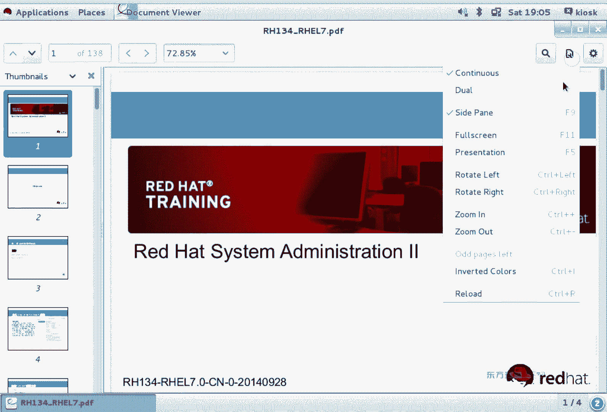

# 红帽Redhat RHCE7培训课程+RCHE7实战参考教程+红帽8.0教材电子版+模拟环境及辅导 - P7：1 - 16688888 - BV1zu41197p6

呃，提到70张内，你会想到什么呀？石钟同步啊石绒同步秦商呢这个服务啊挺重要，重要到什么程度呢？呃，咱们有同学啊已经回去开始做考试类型题了。那么其中有两道跟科目斯有关的题。他在做实验的时候呢。

配置步骤一点问题没有。但是到最后啊这个实验结果就不对。后来怎么解决了呢？就是时间的问题。那我们在之前提到过科普斯服务跟什么有关呢？时中吧，时间不同步，即使你做的都对，由于环境的问题啊，实验就不对。

所以怎么解决呢？我们要去设置时钟服务器。那么天上的这个实验呢是上午的题。是上午的题，下午啊依然会用到kibo。但是在下午的时候呢，考官会告诉你说它能保证啊这些机器他们都是在一个时间是同步的啊。

时间是同步的，你不用去设置啊，但是你得知道有这么个事儿，只要跟kerbo有关的。🤧一定要去做始用同步。荷宝斯是一种验证方式啊，验证方式叫票据认证。票据认证的话，我们能想到什么呢？上面是不是都有时间呢？

想想我们现在坐的火车，火车票上有时间吧，它就是票据，想想你去看的电影，是不是电影票，电影票上也有时间。我们会发现，不管你有什么票据，上面都有个时间。简单来说是不是叫有效期呀，有效期。对于亲商的而言呢。

你需要知道它的配置文件跟ETC一下轻招那点confi，你需要知道服务怎么重启，你需要会确认三步。OKIP地址。那么在上午的考试类型题当中啊，要求你设置1个IPV4的地址。对于IPV4地址而言呢。

我们是不是直接配就可以啊，有N种方式，那到底用哪种方式啊，随意你到底用图形还是命令行？或者说改配置文件，看你心情都可以。他们最终的结果是不是都是改的配置文件？最终结果都是改的非常键。换句话说。

用哪种方式都可以。那么对于IP这段啊，唯一一个要强调的什么呢？NM开的命令基于network manager服务。如果network manager服务没有启动的话。

NM cut命令用不了NMCINMTY啊，这两个命令啊，他们有个依赖关系。这是VIP。那么另外一个你需要知道的什么呢？他们是以。那是我。慢点点。没基础。另外一个你需要知道就是他们改的都是。IP地址。

配什文件。改的都是配置文件。好。IP地址配完了之后，它立即生效吗？不立即生效吧，你是不是想办法让他立即生效啊，所以说我们都要去重启相的服务。在切板器当中啊。

我们是不是用了一个叫set term control命令啊？相应道服务。让他立即生效。那你只要是让一个服务立即生效了，他应该养成一个习惯，让它开机自动启动。开机自动启动。一个是立即生效，一个是永久生效。

这是对IP这段啊要强调的内容。那么对于探命令。呃，考试的时候会有专门的题要求你上的类型题，要求你去打一个压缩包啊，打压缩包。它命令它本身的功能啊就是打包了。本身的功能。那如果你要去打包的话。

创建一个包是哪个选项啊？C。啊，那么我们有个B选项是包文件，哪个选项？F啊F后面是你的包文件啊，包文件。那我在不通压缩。题议当中啊可能要求的是啊某种压缩格式。那这个压缩格式我要忘了怎么办？慢手册是吧。

慢手册里来查因我们的选项就三个啊，Z小勾和大勾啊，就那么三个，到底有哪种压缩选项呢？一定要看帮助啊，看帮助。因为这个东西时间长了，你要不经常用的话，很容易混淆啊，很容易混淆，所以说经常使用慢手册啊。

就是慢手册。那如果是。啊，随便给你们写一个啊，如果是BZ如果是BZ压缩啊。勾啊小勾XZ大勾啊，Jzip小Z啊，JZ小Z再后面呢是你要压缩的文件。你要压缩的文件，如果文件有绝对路径的话，写绝对路径啊。

再打包。考试的时候，他可能会要求啊，你把这个包文件呢放在指定的位置，他要求你放在哪儿呢？你就按照他要求把相当路径给写上。他要求你的文件呢要求你这个文件叫什么名？你就写什么名啊，你就写什么名。

按照题的要求。嗯。正常情况下。你这个小勾的选项啊，它的扩展名应该是BZ two啊，应该是这种格式。在正常情况下，我们每种压缩类型，它的文件名应该是对应的。但是在考试的时候呢，他可能会要求。你这个串名啊。

是个其他腕名。换句话说，要求你叫什么名就用什么名，为什么呢？因为在实际工作当中，扩展名是给人使用的，计算机不用扩展名。有没说不对呀，我们双击TIT文件打开个记事本，那个功能叫做关联，那个功能叫关联。

即使你把库耳名给干掉了，我用记事本能不能打开这个文件呢，也能打开吧啊也能打开OK。阿平。那考试有道类型题啊，是要求你升级你的内核，那么升级那核啊，实际上就是安装一个包啊，安装一个包。

安装包的选项安装是哪个词儿？ins到啊in到。关键这个词儿就可以了。那么通常情况下，I的时候我们还会加两个选项，哪两个选项呢？V和H吧，V代表的什么？word4啊，详细模式H呢。H代表什么？

那个焊氏井号是吧，安装过程中的进度条焊氏井号。后面呢他会给你一个相应的路径，路径是什么呀？你就写什么就得了啊。会复制粘贴。那么这个题做完了之后，怎么来验证啊？大家会发现我们每道题做完之后。

是不是一定要去确认。为什么要确认？因为人的肉眼呢有很强的自动纠错功能是吧？你觉得做对了，你看着做对了，不一定做对了。那如果你看的就是事情的本质的话，那么魔术师是不是都失业了呀？

所以说我们的眼睛啊经常会欺骗我们，那怎么办呢？你得去验证啊，去验证。那，内核升级完之后，最显著的特点呢是重启之后，系统会多一个菜单。正常情况下，我们在做单用户挑密码的时候，大家会发现。几个菜板。好。

我们做单户跳密码实验的时候，默认几个。两个是吧，当你做完升级那核实验的时候，你会发现唉又多了一个。😡，而且默认这个新菜单呢，就是刚刚你升级完内核的这个菜单。所以说考试题要求啊说它为默认的菜单。

这道题是给分的题，你只要做了这一步就完事儿。就上午的题呀，好多内容都是给分的题，就是一步啊一步操作那。对于亚木而言呢，你是不是要做一个亚母圆呢？有印象吗？嗯，亚木园在期之前呢。

我们是需要修改或者创建亚木园的仓库配置文件。那么在企业版期的时候啊，我们有个命令，那个命令叫啥来着？要么肯fi。慢点点。然后呢。是个单词是吧？后面是个路径啊，它这个路径啊有两种写法。

一种写法呢是网络路径。比如说我们在之前讲的。是不是这么个路径啊，HTDT吧，还有一种呢叫做本地路径。本地路径。大家想如果你做这种样目员的话，你是不是要做一个外部服务啊？HTPP你需要配个百和服。

那我们还没讲阿哈奇呢，不会配，那怎么办？你需要做一个本地的亚么员。fiile协议。HTV叫做超文本传输协议。那么file呢叫fill协议。它针对的是本地的文件。如果你把光盘挂在了本地的跟MNT下。

那么这个位置写跟MNT。大家注意一下这个位置有几个斜杠。嗯三个写的。三个写的。这个能看懂吧。NMT是路径。放好杠杠，这个是不是协议分割符啊？能看懂吗嗯？这个有点特别哈有点特别。在实际工作当中。

如果你就是想把你的光盘。作为本地的样本员，那么你可以把光盘挂在本地的一个跟MT目录下，然后呢用fill协议来指定啊本地的样员fill协议。从过。那么怎么把光盘挂在本地的某个目录像呢？

这是我们今天要来讲的内容。O。那下面呢我们来看一下啊，如何来管理文件。第一门课还有点内容没讲完是吧？呃，大家知不知道为什么没讲完呢？😡，我们课时啊是固定的啊，这个一般都能讲完，为什么这科没讲完？

我们在第一门课当中啊，是不是做了一个单户挑密码的实验吧？😊，那个实验正常是第二门课的实验。能听懂吧？但是有同学就着急，老师这个时间这么重要，我们一定要第一门课学啊，所以说挪到第一门课假了。😡。

当然第二门课还会再提啊，为什么一个时间要提好好多次，而且到第三门课呀还会再提，原因是什么？在RGC1的考试当中啊，上午是不是CIC的题呀？CITCSA当中第一道题必须会的是哪道题？单用户挑密码。

单用户挑密码，如果你不会的话，就别着急考试是吧？上午考试必须会的道题，什么叫必须啊？如果你进不去系统，剩下题你都会，是不是也做不了？就像说哎，我要去一个地方去干点什么事儿，门都进不去，什么事都干不了啊。

就像我们进公司也是一样的，实际上进公司是贼费劲，等进了公司之后的事儿都差不多是吧，事儿都差不多。OK那回过头来，我们来看第十四章。文件系统在这章当中啊主要讲的内容。你要学会用mountt命令MOUNT。

在linux的考试当中，有四道文件系统的题都要用到mount命令MOUNTMOUNT。另外一个呢，你需要知道的是fin的命令FIND搜索啊，f的搜索考点哈啊，这俩个考点。呃。

剩下硬链接软链接啊就是能会最好不会也行，工作中会用到啊，就像你平时工作当中会不会创建快捷方式啊？会吧，有些常用的文件，我们说放桌面上不安全，万一系统崩溃了，一格式化，桌面是在C盘吧，没了。

所以说弄个快捷方式那桌面也行啊，但不要把文件放桌面，所以说要用到快捷方式，这个叫软链接。OK那下面我们来看十4章。在linux4当中，所有的设备都是以文件的形式存在跟devis录像，这个有印象吧？

停でます。那我们来瞅一眼。

我用SSH命令登录到我们的服务器。登录成功之后呢，我们来看一下位置。LS block是看什么的？哎说。list block列出块设备。块设备指的是什么呀？你的硬盘。存储介制简单来说就存储机制。

硬盘、U盘、光盘都属于块设备。知道什么叫块设备吗？数据是以块的形式存储在这个设备上，叫块设备。举个例子，我们在格式化分区的时候，它是不是有个叫做促的大小啊？微软的系统，那那个是有叫块的大小。呃。

换另外一个问题，大家用过打印机没？打印机是块设备还是字符设备？打印机是自符设备。打印机是一个一个字母的存储。能理解区别吧。块是一块，上面是不是好多东西啊，一块好多东西啊，咱们的区别OK。那么你既然有。

VDA你家然有VDAE。大家会发现这两个文件存不存在？存在吧，不管是你的硬盘也好，还是你的分区也好，它都存在。那我们的VD叫做vi diskKVM中的硬盘叫做VD设备啊，KVM中硬盘。

我们在之前是不是讲过说SD设备啊？有印象没？没讲。还有别的班讲的。还是你们都睡了一觉，重启之后都忘了。呃，前面讲的内容啊，没事翻一翻哈。😊，但有些实验如果考点的话要多敲，不是考点的话。

看一眼有个印象就行。就别人一提的时候，哎，你知要有这么个事儿就完事儿。好，这是我们的所有的硬件块设备。那我这个是硬盘呢，给大家举的是个硬盘。O。😊，那如何来查看硬盘呢？如何来看文件夹的大小呢？

这篇命令当中啊，如果你要记的话，你应该把它想成一个环境。你要把一个数据拷贝到你的U盘里，所以说你要去判断两个东西，一个要看你这个数据多大是吧？另外是不是要看你这个U盘剩多大空间呢？你拷贝文件的时候。

肯定要看这两个东西啊，这就是DU和DF的作用。首先我们要考虑的是说你那个分区剩多大空间吧。那我们先来看一下DF。用DF的时候，我们会发现有很多的设备。就这个设备呀是你硬盘上的一个分区。能看到吧？

VBA第一块虚拟磁盘一代表第一个分区，剩下这些呢都叫做伪分区。什么叫伪分区啊？假的。啊，伪就是假的，不是真正的分区，是伪分区，它是给系统用的分区。换句话说，这个里面给人用的就这么一条。

VDAE啊VDAE。那我们会发现呢，这个是它的大小，它的单位是什么呀？😡，嗯。你去买个U盘的时候，说老板先给我来个2亿字节的U盘，这老板是不是也疯了呀？嗯，这个大买卖呀，大青岛就那个大买卖。

所以说我们一般呢是不是都说买个几G的U盘哪啊，几G的U盘。对于容量而言啊，我们一般是便于人类毒的单位来显示。大家可以看到这个里面的size。啊，size。我如果只想看头两行怎么看。他们。嗯。

有个管道氦的有印象吗？管道headok。啊，我们还有我另外一种用法，就是我只看根分区。就省略管道啊。很多密令啊，它本身就包含过滤的功能嗯。呃，先找个地方做吧啊，就现在空着的位置一般都没人嗯。O。😊。

我们继续啊。一般情况下，命令的功能本身都会支持相应的过滤功能。如果你不会的话，不要紧，我们之前是不是也提到过一个管道啊？有一象吧，啊瓦管道过滤VDAE。结果是不一样的呀，我看的就是这行。

只不过是少了个标题吧，少了个标题。可同学说哎，不对呀，我们之前还讲了个hid呀。😊，hi的是什么意思啊？头啊，我看头两行，你看这个害的头两行跟他是不是一样。就说在lininux当中啊，实现同一个功能。

好多种方法，你到底有哪种呢？是看你自己心情，哪种都对啊。就像有同学说听了两个老师讲lininux哎，两个老师讲的结果是一样的，为什么方法不太一样呢？

就因为lininux它属于开源的系统同实现同一个功能太多种方法了。就是看老师的心情，老师喜欢用哪个，所以说讲哪个比较多，就这区别。那么在这个里面可以看到这块硬盘多大？用了多大嗯。还剩多了。

这个硬盘分区挂在了哪根下面。换句话说，我如果要把一个文件夹拷贝过来的话，只要跟下面这个空间。大于我要拷贝那个文件夹的空间，是不是就可以？为什么要加个大H呢？H代表是humanreable。

H这个选项我们还在哪儿见过？LS。有印象吧？LS是见过。OK我们继续。😊，下一条命令DU啊DU我现在想将根root文件夹拷贝走，所以说我要判断根root文件夹多大啊，判断根root文件夹。

那我们可以看到，如果直接用DU的话，它是不是列出了好多文件夹？嗯。但是在实际工作当中，你是不是就想看一下整体的大小啊，有人关心每个文件夹多大吗？😡，至少我不关心，那怎么办呢？

我们有个单词叫做summary。smer也什么意思呀？嗯，汇总求和是吧，用过excel的人是不是用过s命令啊，SUM啊sary求和。但是你看到这个68单位是什么呀？不太舒服是吧？啊。

虽然说我们用的比较多的呀，一般是不是带个H啊？就便于人类读的单位，不管是用什么命令记得加H啊，记得加H。记得少喝一点是吧？这小隐怡情啊啊少喝一点啊，DUOK那么这篇命令当中啊，要求大家了解的这两条命令。

一个是DNF，一个是DU。他们都会用到H选项，如果是文件夹的话呢，加S选项summary求和啊求和。这两条命令理解了吧，EU和DF。那下面呢我们来看挂仔。我怎么样把一个U盘拿过来之后。

给他指派个盘符来使用呢？在linux当中叫做挂载。大家想微软的产品。我们在win7win8之前在win8之前拿过来一个ISO文件。如果你想直接看ISO文件的内容怎么办？用虚拟光驱或者假压缩都可以是吧？

虚拟光驱是不是更好一些呀？省硬盘空间呢啊省硬盘空间。但是我们会发现这个虚拟光驱啊是不是属于第三方程序？微软不自带吧，但是后来到这个win8的时候，我们一双击IS文件是不是自动挂载啊，自带虚拟光驱啊。

微软怎么这么好？le那从有的时候啊，从刚开始有这个系统的时候，就一直有这个功能。ISO文件可以直接来进行挂载。用mo命令啊mo命令mo命令的格式呢就是设备名加上目录啊，设备名加上目录它的格式。

我们在挂载的时候呢，可以挂载不同的。Mmhmm。标识啊不能标识，代表设备的标识。🤧那下面呢给大家举个例子啊，我们来看看挂仔。首先用L block命令，我们可以看到我这块硬盘多大。10个G。

我这个分区多大？10个G刚刚我们在用BF命令的时候，视频呢看到10个G啊。有印象吗？就是10个亿，不管你用什么命来看，结果是一样的。okK那现在啊我想把这个分区挂在其他的目录下，比如说。

我在跟MMP一下创建了一个叫。parttition的文件夹。我们可以看到这个文章内容啊，空的是吧？然后呢，我用一条命令mountt跟 deviceice videoE。跟MNT park。报错没没报错。

理论上就成功了是吧？缺认人员。阿莱。你看这个目录的内容眼熟吗？是不是就跟分区的内容？在lininux当中啊，一个设备可以挂在不同的文件夹下。同一个设备可以挂在不同的文件下，在微软的系统当中啊。

一个分区只派个盘符完事了吧，它能指派到另外一个盘符吗？但是微软的NTI分区啊有个功能，你即使只拍完盘符之后，你可以把这个分区挂在一个空文件夹下。它也可以挂在不同的位置下，只不过第二个位置只能是文件夹。

来那个4试全是文件夹，没有盘附的概念。有点区别吧啊，对比机啊对比机okK那我们继续。当时我们这个方式挂载了什么呀？挂载的是不是一个叫设备名啊，或叫分区名VDAE。那我们看一条命令。

既然你的设备呀叫做块设备。那我们有一个命令啊，叫block ID。block IDDID叫标识是吧？跟德YVDE。大家看一下VDAE它的标识是多少啊，UUIDUUID代表的是一个唯一的标识符啊。

唯一的标识符。这个标识符是唯一的。那我们会发现呢，在结尾处还写了一个叫typetype代表什么含义？分区类型吧，一个分区只有在格式化之后才有这么两个值。分区没格式化的时候，这两个值都是空的。

就说你看的时候吧，后面是没有内容的。就后面就是白花花一片啊，白花一片。OK那你既然是有UID值，那我们可别用UUID值来挂载啊。也可以。Mo他。用这个纸。挂在这个目录下。啊，大家看我命令敲的快吧。

能复制粘贴的千万不要手写，你想都没插串，你手写的话，手机嘚瑟敲错了，时间不成功是吧？复制粘贴又快，又省时间啊，而且准确率要高。那么后面这个MAPUI地址，它怎么自动就粘过来了呢？我的是什么呀？

alalt加句号。平时我们讲的快捷键呢，多用你用的越多呀，你会发现敲明的越快，而且你敲着越舒服，越有感觉啊，多用快捷键哈，多用快捷键。O执行完之后呢，我们再次来看。😊，能看到吧？

是不是跟跟分区是一样的呀？在挂载的时候，还支持卷标啊，还支持券标。但是我们当前的这个分区啊，它有卷标吗？是不是就有这么两个值？他没有这表。有朋学说老师你给他设个电标呗。我要给他设个卷标。

我只能去单用户模式设权标。因为这个分区正在使用，改不了。lininux跟windows这个位置不太一样，微软的产品是你即使有盘符了，也能设卷标是吧？微软的产品。

但是lininux不是linux是这个分群角再用了，你就不要动了，设不了卷标了，你只有给它卸载掉才能去设卷标。J去嗯。这标是什么？😊，这个。这标就是这个分区的标识。啊，这个windows当中啊。

我们是不是也有兼标啊？windows的间标是不是那个分区的标识啊？平时我们是不是用CDEF冒号来表示？他前面摸的是有叫本地磁盘。我是不是可以按照我的心情去改，叫什么game啊，叫什么date啊。

back up啊都可以吧。这个叫俊标，卷标就个标识，是不是就跟厕所门口那个牌是一样的呀，这是个标识。😊，不设行不行？也行啊，也可以，不是说非得设计表。O。😊，那这个位置没有显示间标，就是没有。

我们在这个里面呢，顺道来提一条命令，叫做XFSad me。这条命令呢是针对于XFS文件系统新出的一条命令，以前没有啊以前没有。大家如果想查看谁的金标呢？大家看到没？蓝眼号中间有啥？啥也没有是吧？嗯。

这叫没卷标。如果有卷标的话，你用block IDD这个位置啊也会又列出来一下。现在是不是只有两项UUID和类型。我们在后面分区实验的时候，会讲用它来设卷标啊，怎么来设卷标，怎么来使用卷标。

那么如果你有卷标的话，我们也可以用mount命令。label等于什么？挂仔。挂载分区三种方式，挂载设备名，挂载1UID挂载军标三种方式都可以啊，三种方式都可以。但是无论是哪种方式。

你要知道mount命令它就是临时生效。大家知道什么叫临时生效吗？一重启是不就没了一重启就没了。那我怎么知道现在挂了谁呢？😡，mount上命令什么都不写回车。你会发现是不是有好多内容啊？啊，有好多内容啊。

我们看最后两啊。因为mount的内容太多了呀，我们刚刚画的位置是不是都在MNT下呀？所以说我就过滤MT可不可以？这是不就最后两行啊？带MT的，大家看没看到说谁挂在哪。看到了吧。

在挂载的时候看没看到后宝一堆选项，我刚刚写选项了吗？没写，这些都是默认值。我刚刚是傅写了说把谁挂在哪儿，把谁挂在哪儿。但不管你写的是UUID分区。或者是卷标，这个位置显示的是不是都是分区啊？显示多分居。

卸载命令呢我们有个单词叫UN啊，UN是什么意思呀？相反的吧，我们之前都叫杜安度安度是不是撤销啊？😡，因文是取法，那我们有个命令叫Umount。为什么不叫安mount呢？因为N和M放在一起的话。

看着有点迷糊，也看不出是NM还是MN。所以说把UNN给省略了。正常情况下，我们省略的是不是原因呢？命令当中正常省略都是原因，但是原因开头的话，一般会把死因给干偏掉，留个原因。啊。

这是另外一个缩写的规规律啊，Umount不是unmount。OK那么卸载的时候到底卸载谁呢？大家想我如果卸载VDAE这个世界的是谁呀？这其。同一个分区，我现在是不是挂在了三个位置，你要卸载的是VDAE。

不一定卸载是谁。能听懂吗？不一定卸点水。我们来瞅一下有帽子A在YCVDE。谁被卸掉了呀？嗯。UUID被卸掉了吧。不一定是水啊哈，根它肯定卸不掉，因为根现在是不是正在用啊，根正在用。那如果想卸指定的设备。

一般我们建议用挂载点啊建议用挂载点。有没人说我用UID址接用卷标行不行啊？随意。你挂载的时候挂载什么东西在哪个目录下，你卸载谁都可以。只不过一般情况下，我们对目录是不是要更熟一些呀？

因为平时工作中你使用的就是目录啊，你使用的就是目录。那我们再试一下啊。卸载VDE。幽氓。Yes。那卸载吧。他说什么？他说他忙。他忙啥呢？我在哪呀？我是不是在跟下面的某个文件夹里呢？😡，这叫忙的原因。

举个非常简单的例子，你在一个屋子里面你能拆房子吗？不能吧，你得出了这个房子之后，你才能拆房子。😡，那我们当年最最下一层就是根，能跑出根以外吗？出去不了，但是我们在单用户模式的时候，是不是可以在跟以外呀？

有印象吗？单用户模式平时工作中用的比较多啊，你要知道单用户模式，你可以随便用吗。根分区啊。ok这个是mountt。怎么来挂载？那我们继续。啊，卸载。这个里面提了一个命令啊，叫LSOF。

list of file啊列出，那么它的功能啊是来查看忙啥呢？啊，他说他忙是吧，他说他忙的时候，下面是不是有这么一个提示啊？他下面提了两条命令吧。你可以用这两条命令去来查他正在忙什么啊，他正在忙什么。

最终的结果就是因为你在这个屋子里面啊，所以说你只能退出去之后再来去卸载。

那如果你已经挂载了一个光盘，卸不掉光盘怎么办呢？CD切换到其他目录下再卸载就行。但是因为根分区顶级目录就是根，所以说卸载不了啊。光盘的话，你需要CDCD出去才卸载。那下面呢给大家举个例子。

叫做挂载光盘啊，挂载光盘。这个例子不太好举，原因是我们的环境都不太一样。我们有线上环境，有线下环境。有两种环境OK我先切换到线下环境啊，访零。我们有个命令叫范的搜索是吧？我在根目录下来查找文件名。

叫IO的。ISO是什么文件？体一下。啊，光盘镜像是吧，光盘镜像。那我们会发现这个里面呢有没有IS文件呢？第一条是不是一个权限的事儿？如果你觉得看着乱的话，我们是不是可以按一下？OK吧，就实际工作中啊。

二大于号用的比较多。那这个位置呢就是我们的光盘镜像。只有在findition零上有光盘镜下。如果你用线上环境findition12345到40呃，45是不是都没有仿没有ISO啊？没有SO的话。

你需要把它的。够想挂过来。也可以使用。我们先来讲这个线下环境怎么弄啊。光盘镜像怎么来使用？我再跟MMT一样，再创立个文件夹，文件夹名随意。但是尽量起个有意义的是吧？不要起什么叫新建文件夹就行啊。

尽量起个有意义的。用麻子命令。把这个文件。挂在这个目录下。挂载的时候呢，它是不是提示了一个说什么路。路虎什么意思？回还是吧？他说lookop一写保护只读光盘是不是只读的呀？光盘镜像都是只读的啊。

这句话就是个提示，不是报错啊，它只是提示。报错的话，一般是什么Eor之类的啊，Eor之类的提示叫报错。O。😊，我们来看一下ISO的内容。看着眼熟吧。看到package一次文件夹了吗？

所有的安装包都在这里面，看没看到这个RPMGPGkey redhead be文件release文件。验熟吧。光盘这就光盘的内容。如果是在7之前的版本，你再用m命令挂载光盘的时候。

需要加一个选项杠O look。到欧路。那这个选项为什么没给大家演示呢？因为7之前的话，你直接这么挂载呀，它会提示你please加一个杠O loop，它会提示啊，提示你加个选项。

我们之前在用mark命令的时候，用不用过叫杠Oreman逗号RW啊，有印象吧？也是一个选项。那光盘镜像在7之前的版本要加一个杠OLOOP的选项。7之前的版本你得这么假。😡，能看出区别吧。

期的时候这就可以省略了。我们说的七指的是企业版7，咱们当前讲的版本是不是企业版7呀？哎呀，这个。呃，远程的同学尽量别开视频哈，尤其是还没起床的同学。我怕你们看到人家的隐私啊。

我都把这个参加者呀放在另外的屏幕上。尤其现在天越来越暖和了是吧啊。早起来听课呀，挺好啊，但是尽量穿衣服啊，要不千万别开视频。🤧嗯。因为有的时候啊他们不给我配显示器，我只能是一个显示器是吧？

所有人都能看到啊，视频。挺危险啊挺危险。马上就要到夏天了呀。呃，还是那句话啊，能来本地听课的同学尽量来本地啊，因为在线的话呀，它缺少一个氛围，学习的氛围。因为你在家里面的话，大家想同样是看电影。

你在电影院看电影和在家里面看电影，那感觉是不一样。能理解区别吧，区别就在一个氛围。学习的时候，为什么一定要在这个教室里面呢？区别就是氛围工作的时候为什么不在家呢？为什么非去公司啊？😡，能理解吧嗯。

OK我们继续。这是挂光盘镜像。是。那如果是远程的话，怎么办呢？在我们当前环境当中啊，有同学可能用的是仿对一是吧？纺d8，那这个时候怎么办？这个实验是在纺对上来做啊。首先我来看1个IP地址。我的IP是。

17225。254。0。就咱们所有的线上环节也好，线下环节也好，仿d是零的IP是254。250。okK我们有个命令，双骂子刚毅。这条命令可以来查看这台机器共享乐水。共享乐水，这个是1个NF共享。

我们在第三门课会来讲NFS服务，你就先知道怎么来看共享就行。能不能看到这台机器上有一个共产名叫什么名？看到了吧？okK那么我可以创建一个文件夹。大家会发现，我只要挂载的时候，是不是都去创建个文件夹啊。

为什么？Okay。就像你在windows里面一个分区需要只派盘符啊。N个分区只拍的盘说是不是都不一样？那你就啦。在linux当中啊，还有这样的概念。如果你把这些文分区啊都指派到一个目录下。

挂到一个目录下，那么你看到是最后一次挂载的这个位置。你卸载了之后，看到是上一次挂载的位置，再卸载是上一次能理解吗？一叶障目不见泰山是什么概念呢？就这个概念，一个挂在年可以浪它多次。

但是我们为了不浪它多次，所以说我们是不是挂在不同的位置啊，原因哈。用mark命令。将。这台机器上的。冒号风格符哈。😊，这个共享。挂在哪儿呢？挂在这个目录下。我把字儿稍微弄小点儿。前面这个位置呢是设备。

我们之前挂载的是不是都是本地的设备啊，这个是网络设备，它的功能有点类似于映射网络驱器。在微软的产品当中，你经常去访问服务器的某个共享，你每次都访问去点不点，你是不觉得挺麻烦。

我们是不是可以把它映射成本地一个S盘符的冒号啊，S冒号映射成一个盘符，下次去访问是不是快一点呢？跟windows的映射网络凶器功能相同。刮了生膏之后，你来看一下。这个里面有没有？一德文件夹吧。

这些都是那台机器上的文件夹。如果你用的是仿对渗。零之外的机器啊，或者大家都可以这么来做呀。可以来挂载，如果本身在纺定性零上的话，你再这么挂一下，是不是有点挺奇怪呀？我共享了个文件夹，我再挂过来用。😡。

也行是吧，自己又是服务器端，又是客户端。OK那么这步做完了之后，同里我是不是也可以来搜？我在跟MNTNFS文家搜。光盘镜像文件呢。咁气啊。也行啊，有朋友说老师，你为什么不让我们记录径呢？😡。

记录镜没有什么意义是吧？正好我顺道还能多练练范的命令。考试的时候考不考犯的年龄嘛？好啊，它最基本的格式搜索在哪搜索搜索什么。能看到格适吧，在跟下面搜索，在跟MNTNFS下搜索搜索什么。这段内容OK吧。

ok的话，我们把这盘内容给大家整理一下。黑 three杠A什么都有？缓存中的历史命令立即写入到历史文件是吧？冒号百分号S斜杠密，斜杠紧是干嘛的呢？百分2代表所有行把所有行switch替换密代表行首是吧。

所有行的行首都加个井号吧。这个是便于给大家写笔记啊。在实际工作当中啊，你是不是要也要去写一些这个工作文档啊，要去做一些脚本吧，你不可能这边做完了之后，再重新再敲一遍的，这个你肯定会用到啊。

OK我们把刚刚讲过的内容给大家整理一下。

。呃，第一组实验呢讲的是DODF。简单来说呢。呃，就是磁盘。パンですク。DU和DF都是disk命令。ISS block你需要知道的我们的设备和分区都是以文件的形式存在跟deice录下。第一个知识点。

然后呢，你需要知道DF。DF虽然讲了很多，我只给大家留下一个必须会的。OK吧。当然了，你可以把他们后面内容都不加，看一下现象做下对比。根分区大小，humanreval。然后呢，DUDU的时候。

你需要用的是SH。看门件夹大小。第一组实验啊，你需要知道这么个东西。OK吧。第二组。第二组内容主要来讲的是挂载。挂载的话，我们有很多种方法可以挂载设备名UUID也可以挂军标。

那我们makeDR创建个挂在点。创迎方过了点之后呢，我们可以直接mount。这个挂的是设备名吧。挂了之后呢，你可以确认。用block ID是不是能看到UUI地址啊？可以吧，看能看到什么？嗯。

文件系统类型有卷标的话，是不是还能看到卷标。然后呢，我们用mont。这个方法是不是直接用UUID值的方法来挂载呀？这第二种啊第二种瓜子。那我们实际上还有一种啊就捐标label等于什么啊。

只不过现在还没有捐标，我就没给你们挂。这条命令啊是用来查看卷标。如果有卷表的话。我是说如果哈你别做实验的时候，你就闭在睛到时候敲。😡，B站照着敲肯定做不出来，为什么呢？😡，因为没有。能理解吧。

你卷标叫什么？你可以挂在你的绢标下。这个实验呢你们别做。为了有所区分呢，我又加了个井号，井号的作用是不是注释啊啊，井号的作用就注释。就是你闭眼呢照着这个敲啊，回车也就是写了个注释，跟没写是一样。O。

那如果有绢标的话，你可以写绢标是什么挂在哪也可以。并且这个文件夹我是不是也没创建呢？但家如果你要用的话，必须得创建门甲号。那他面临什么作用啊？😡，确认吧，都挂了什么啊，都挂了什么一堆。

那我是不是就看了一下VDAE呀？因为这个地方太多呀，人的肉眼受不了。😡，查看你感兴趣的。我们在做单用户操密码的时候，是不是也过滤了一下啊，因为内容太多。卸载怎么卸载啊？

you mindyou mind还是Im。优mount他啊，现在。卸载完之后，你再来确认。接着卸再来确认。接着戏再来确认。啊，最后一个为什么卸不掉呢？真的是。因为他太忙，正在使用是吧，为什么正在使用啊？

因为你在这个根下边。什么时候不在跟下面，你不用这个系统启动，就不在跟下面。

好，第三组实验。第三组实验讲的是光盘镜像吧。

光盘镜像。

第三种实验。这个如果你是在仿备零上的话。我要没给你们明确声明啊，一般都是在serv上做是吧？明确声明了，你就在相应的纺对上来做。如果你是在纺对性零上。查找SO文件。然后呢，创建挂载点。

把S文件挂过来确认。呃，下面这个呀主要是讲七之前。漆之前的版本需要加杠路，漆的时候就不用加了。这个知道。小于号能看懂吧，7之前的版本。要刚好路。再然后。呃，如果你挂载的时候用的是。防备省。

反正不是零啊反正不是零。不是零该怎么写？这么写吧。不大于零不小于0就不是零是吧？不是零的时候你要怎么办？双方的刚毅。不管你用的是线上环境还是线下环境。这个是仿的是零的IP哈。在仿定是零上。

它有国共享共享名是不是叫跟co粉呀？我们把仿那些零上这个共享发载到本地。挂载到本地之后，是不是有这个IS文件了？有ISO文件了，是不是就可以。挂载光盘镜像了。我们把顺序改一下哈。あい。不是仿这些零的话。

要做多做这么一步。啊，多做这么几步。好，有ISO了之后，是不是就可以往下做了呀？挂载光盘镜像。能看懂吧，思路给大家捋一下啊。ok我们看下一组命令。😊，这段能跟上吧？哥们上举手问啊。你不举手。

就当你能跟上嗯。😡，不就说答案能给他啊。跟不上问啊，别不好意思。你敢问我就敢答啊。😡，你们平时啊也可以问问题哈，平时QQ啊、微信都行。但是最好别太晚。太晚指的是12点哈，12点我一般12点前都会睡觉啊。

不会睡太晚。尤其是别赶到快考试之前呢。绷着我不睡觉，这我也受不了，你们不睡，我得睡啊。😡，平时多问哈，考试之前是不是就能少问点儿啊？因为有同学是平时不着急练，等快考试了回去猛练，半夜不睡觉。

可能凌晨两三点绷着不让我睡。你说我睡也不好不睡也不好，挺痛苦。嗯，我也困，是不是？😡，所以说你平时有问题，你就多问把。把这个问题呀往前挪啊，问题往前挪多练，平时又多练了。Okay。我我们继续啊。

看一个链接软链接。硬链接和软链接的作用是什么？硬链接和软链接做上是吧？为什么要做硬链接？linux当中啊叫做硬用链接，微软管它叫做joen啊，江son一个东西啊一个东西。我们来举两个例子，帮大家理解。

首先我来做一个实验，大家看一下现象。呃，放跟肉的吧。跟 root要稍微简单点，用波拉线来表示啊。这套没令到什么作用？好备。做个硬拷贝输入从零输入output from输出输出到跟。

输出到根root速主不录像是吧？root的波浪线是不是就跟root呀，文件名叫F1，1块是一兆count是2块。简单来说是生成一个两兆的文件。能看到大小吧。

生成个两兆的文件OK现在呢我们用DO杠SH来看。跟说的文夹多大？两兆是吧。确认了啊，LS。我们有个命令叫linkLINKLINKI元音省略了吧，K是不是也叫辅音呢？一个省略变成LN。我做一个硬链接。

将跟root下的F1做一个硬链接。也放在根root下，我给它起名叫FH。点RTXT。啊，H写的是had的意思啊。😊，T I。做完了之后呢，我用LL杠H来查看。F星点TIT。现在是不是又多了文件两兆？

现在我们再回过头来DU。碳号滴有什么作用？最近上一个上一个直接上1个DO开头的命令是吧？上一条DU开通的命令是不是他？再看根树的文夹现在多大。没变是吧？明明里面有两个两兆的文件，为什么最后还是两兆？

okK啊这段内容啊我们扩充一下哈，扩展一下。😊，给大家讲讲硬盘。下面讲内容啊不是课内内容哈，你可以认为我跑题儿。但我要不讲的话呢，这段你可能还离不了。O。在系统当中，任何一个分区。它都分为两部分。

一部分我们管它叫做节点区，另外一部分我们叫管它叫块区。硬盘每个分区都分成两部分，节点区和块区。节点区存的是什么呀？它存的是文件的信息。节点区简单来说呀，就叫信息。块区存的是什么呀？实际上的文件。

实际上的文件或者叫数据。信息跟数据啥区别啊？道。问大家个问题是吧，我说我把一个文件改名，改的是什么？改的是inode。😡，能理解吧。好。那为了帮大家理解，我们来说几个环境啊，帮你理解。

第一个举的例子呢就改名。为什么一个文件改名刷就改完了，因为他只是把信息做了修改。比如说你这个文件10个G啊，少说点吧，你这个文件4个G，你改名的话，只改信息是不是很快？okK大家玩过剪切吗？

LuxMV又可以重命名，又可以剪切是吧？在同一个分区当中剪切快不快？很快是吧？在不同分区中剪切快不快？不快，为什么？需要重一写数。在同一个分区，你改位置的时候，它实际上就是把inow的信息给改了一下。

路径变了，数据位置没变。我们知道数据在写磁盘的时候，它随机写的。在这个分区里面，他说随机写。信息标识写在哪？这是信息。inn换句话说，你在剪切的时候啊，它只是把innote做的修改。

你两个G4个G的数据原来放哪还是放在哪，没动过。这能理解吧？所以说你会发现在同一个分区。和不同分区。他们在MV的时候，这个速度是不是差很多？这能理解吧？那我们换一个思路。

如果你是往不同分区当中移动的时候。你有一个。4G的文件。和你有4。4000个。哎呀，4000乘以多少是4G呢？4000乘以多少？前点。兆啊啊4000兆是不是4G啊，你有4000个1兆的文件，大是买个快。

你往两个分区里面拷贝，一个分区里拷贝的是一个4个G的文件。另外一个呢是拷贝4000个1兆的文件，买个快。嗯。一个4G一个4G的快，这个大家都拷贝过大文件是吧？应该都见过。

我们从这个感官上能感觉到它的区别。原因是什么呢？因为一个4G的文件，它什么要要做一个节点。一堆文件就输b就完事了，对吧？那如果你有4000个文件的话，你是不是要给4000个inow的？能理解区别吗？啊。

这他们区别。就像你在看书的时候，书上是不是有目录啊？目录有点类似于我们的inow。block呢就类似于我们真正的章节内容啊，真的内容。O。这段内容理解了吧，inode block理解了。

那我下面来说什么叫硬链接。硬链接说白了呢就是再做一个inode。指向的同一个文件。能理解吗？换句话说，我们看到的文件的大小，看的是不是block的内容啊。block没变，他这多了个什么呀？😡。

他只做了一个innova。两个inote指向的是同一个文件。所以说你看的大小说哎，两个两兆的文件，但实际容量还是两兆。因为block大小变呗呀。没变。就像你这个书上啊弄了两个目录，指向的是同一页啊。

这样同一页一个概念。举个例子，上小学的时候啊，大家学没学过新华字典怎么用？唔唱噶话。里面有叫拼音查字法，用拼音是给查呀。里面还有一种叫做。字母。不少。叫不守查资法是不是两种啊。

他们最终查的是不是都是一样，都一个字吧啊都一个字儿。😡，两个in node哈指向同一个文件。okK那为了做说明啊，我们来看个命令。我们在学LS命令的时候呢，还有个选项叫做。呢。啊，那个啊哎呀。那那个是。

那是它变成数值了哈，I代表是a node。我想来查看一下。同样这条命令啊，我加个选项啊IP。Yeah。大家看前面是不是多了一粒。😡，你看这俩数一不一样。一样吧？它俩指的是同一个文件，这个inow相同。

代表说文件相同。嗯。为什么要做硬链接呢？做硬链接有什么意义？😡，呃，虚拟化。最简单的例子就虚拟化。我们在做虚拟机的时候呢，会有这样的情况，多个程序是不是可能调入头一个文件？但是这个文件如果被锁定的话。

别人不让用了。有这种情况吧？当你做硬链接的时候，假设我做了4个硬链接，那么这四个文件可以让四个进常来用。搞编程的人常用这种方式，硬链接或者叫jasen啊。微软的产品呢管硬链接叫做jaen啊。

lin呢就叫硬链接，嗯，叫hardlink啊，halink。经连接理解了吗？OK硬链接理解了，我们再来看软链接，软链接是干什么的呢？😊，软叫soft是吧？有个公司叫做microsoft，叫微软是吧？

小公司。是挺小嗯。然后后来又出个微信是吧？也挺小。等哪天我们开公司，也叫微什么？微商。也不小啊。戴V的东西都挺奇怪是吧？啊，以小变大ok。那我们在这个里面呢，依然是将原来的。这个文件。再做一个。

软链接叫做sofft。谁？那我们可以看到这个软链接多大。嗯。单位什么？才。计算机当中最小的单位是什么？自己是吧。他这个字节怎么来的？Yes。123456789101112。

快捷方式它的大小啊是字符链接路径的字符个数。能看懂吧，你路径写多长，它就多大。😡，那么字符链接它是干什么用的呢？软链接是干什么用的？简单来说，它的功能啊就是快捷方式。微软当中我们经常用快捷方式吧。

比如说我装了个游戏。然后呢，把快捷方式整在桌面。每次玩游戏的时候是双击就可以了。用不用去找到那个游戏的路径？不用吧。啊，为了防止孩子玩，你是不是录音可能藏很深呢？你不可能去找路径啊，我们要用快捷方式。

软链接的作用嘛就是快捷方式。大家看到第一位了吧？那个吧。Okay。fi命令fa命令的作用啊是来查询。文键的类型。🤧嗯。大家看一下F1和FH这两个文件写的是不是都是数据啊？一样吗？

因为它俩指的就是同一个文件叫硬链接。但是你下面这个FS呢，它是不是叫字符链接呀？字活链接在微软的系统当中，我们管它叫做快捷方式啊，快捷方式。那下面给大家举个例子。我们在之前提到过说。

linux斯当中大多数的配置文件是不是都在跟ETC下？买秘密是什么意思呀？秘密。秘密的作用是什么？我上来命有利用L，大家是不是能看到两个文件？但是我想看一下他们详细的浪啊，浪详细的内容。

那我是要把LS换成LL啊。我如果把这个命令再敲一遍，是不是挺麻烦的？所以说用替换，将上一条命令的LS换成LL，是不是就变成了这条命令？OK吧，就是平时用的比较多的啊O。那我们来看一下。

我之前讲了说跟ETC下面所有文件。是不是基本上都是配置文件呢，或者配置文件基本上都在跟ETC下。但是有一个除外就是grab的配置文件。grab的配置文件在哪呢？跟部一下boot是什么意思啊？

启动grarab是什么呀？我们系统在启动的时候，你记不记得单误特密码那个菜单？那个叫做gup菜单，那个程序就叫gup程序。程序名哈就像我们说office这个程序名就是办公软件一样啊。

它程序名它的配置文件在跟bo下，你看一下这个快捷方式，它指向的是不是也是跟bo下这个文件。能看到吧。啊，这个叫软链接啊，为什么要做软链接？因为我们的习惯一想到配置文件是往跟EPC跑。

但是有些文件比较特殊啊，这区别。这段内容讲的是硬链接和软链接。

Yes。我把这段内容给大家复述一遍哈，为让大家理解软链接和硬链接呀，首先我是不是先生成了一个文件呢？你到底生成几兆的文件随便，但是你必须得写countt。如果不写countt，最终的结果是什么呢？

一直生成生成到什么时候为止？生成到人参果为止。什么叫人生果啊？你去市场买菜的时候，要好多七形怪账的水果是吧？为什么呢？吃没吃过方形的橘子？正方形的橘子为什么长成正方形？加你吗？嗯，因为C满了。

你的硬盘分区就这么大。你如果不写说C多大结束的话，它一然给硬盘塞满。在linux当中，如果你应该把硬盘塞满。你的系统是不是就很奇怪？VI都用不了了吧。啊，实际工作中别把硬盘塞码哈。

类那个是最怕就得硬盘塞码。O。😊，确认一下它的大小啊，这两步是告诉你生成一个多大的文件。然后呢，我们看文件夹多大，做个应用链接。顺道把软链接也做了啊。做个硬链接，做个软链接。

硬链接和软链接都做完了之后呢。我们来看一下这个文件夹啊。基本上就多了两兆啊，都多了两兆。那不会变成四兆。然后呢，我们去确认一下。他的e的值啊e的值。不有。

杠A选项啊杠A选项应链接和原文件的inow的值是相同，它们代表同一个文件用fill命令我们可以查看到。软链接和硬链接的区别。软链接代表就是快捷方式。那下面呢给大家举了个例子啊，grarab的配置文件。

前面这个呢就是快捷方式啊，后面是语言文件。在linux当中，查找文件有两种方式，一种是泛的命令，推荐大家用。另外一种是lowcate命令啊。老太太没令也可以。老K的命令和慢命令有点类似。

它是在一个索引库当中去查，在一个索引库中去查。所以说新安装的软件呢，你直接去locate的查查不到。的隔一天啊隔一天之后，或者说系统upateDB更新了相应库之后，你才能查到。这老K。那我们来举个例子。

看为什么不用locate啊，我为什么不建议你们用LK。刚刚呢我是不是生成了几个文件呢？叫什么名来着？F1点TID。大家看能查到这门件吗？没有。但是隔了一天之后呢，我们明天再来查，你发现能查到了。

为什么呢？因为在系统当中啊，它有计划任务叫update DD。这条命令的作用啊就是更新loccate的库。更新库完了之后呢，你再locate去查就能查到了。换句话说，老K的命令它很快，但它不是实时的。

放的命令非常慢，但是它是事实的嗯。能理解区别吧。这也是为什么考试的时候吧，让你们查啊。考你们犯的命令，不考loccate的原因。因为你们考试就一天，不可能隔天再出成绩，是吧？不过成绩确实隔天出。嗯。

为什么成绩是隔天才给呀？呃，你们考试的时候啊，是电脑自动来判分。电脑自动判分，他会去读你的配置文件，它会读你生效的值。注意我说的话啊，读配置文件读生效师。换句话说，你到底怎么改的配置文件，他不管。

反正你把相关参数改对了就行。我们一般建议是不是用VDM。有同学说老师我用什么G editit呀，用 nanono啊，你看你心情随便，用任何一种编辑器都可以配置人家改对了就行，生效了就行，就看这两点O吧。

好，那么我们看这个位置是不是已经已经淡了。已经完蛋了是吧啊，完成了完成了之后呢，你在老K的来查，能查到了吗？可以吧。那么用饭的命令啊，他可以直接来查。🤧。有同学会发现是不是也挺快呀啊也挺快。

但是文件如果路径很深的话，就没这么快了啊。因为这个路径比较堵，比较浅。就像你挖坑也是一样的啊，我们挖煤挖石油。都没玩过嗯。OK没挖过，不要紧哈，慢慢想啊。😊，都栽过树吧。有没有叫植树节呀？

年轻的时候一般学校都会组织这挖坑着吧，植树。为猫组织植树呢？因为学校为了挣钱。挖一个坑给多少钱啊，只不过没给我们而已啊。我们锻炼身体是吧啊，脑费B病相关是先。あしまほは。对。

up dayDB是给老cate用的。就像我们在之前是不是用个慢DB，然后又给慢杠K用啊。有印象吧？功能相同啊，它是在一个库当中搜索。放在命令它有一些高级的用法。杠N杠name杠 name是文件名。

这个杠是一个减号，两个减号。一个一个一般情况下，我们的选项是不是俩减号？但犯罪面令比较特别。I name呢代表Ial name叫忽略大小写。来那个是原告确认大家写吧。如果你文件名大小写的话。

用I name。User group。这个你要知道user考试的时候考的就是这个选项，属于某个用户的文件杠user。permissionation代表权限，size代表大小。哎。

我们平时找大文件的时候会用到size。啊，不用s多大的问题。modelify minute啊，修改时间type类型。F代表什么类型啊？放好文件的呢。directory文件夹link呢。快捷方式吧。

block呢块文件吧啊块文件可以搜索类型。link link代表文件的数量，这个文件数量代表什么含义啊？就是。就是什么呀？节点的个数。OK我们来看一下。我们在之前的实验当中啊，提到了一个叫。

看一下这个位置啊。你新创建的文件呢，这个数永远是一。当它存在硬链接的时候，这个数会变成大于一的数。如果是二的话呢，代表说有两个应例，有两个VE node指向同一个文件，它代表是节点的个数。在哪理解吧？

啊。节点的个数。它存在应用链接，说白了就存在应用链接。有几个应用链接。硬链接可以在不同分区当中来创建吗？我一个文件在D盘，我想在C盘给它做个应链接，可能吗？不行是吧，因为每个分区是不是有自己的因ow的？

不能跨区哈不能跨区。O。😊，我们再来回忆一下这一串代表什么含义。最后一列是不代表文件名？这个是不是代表文件的时间戳修改时间。被个呢？大小吧。喝点啊，这点大小这俩呢。文件所属用户和组吧ro特用户。

ro的组这个是代表节点的个数。然后第一位代表的是。文件的类型减号代表是文件。D代表是文件夹L代表是link。L代表linkB代表是快文件block。如果你看到前面这个符号，不知道它是干什么用的话。

用fi meaning瞅一眼。比如说我们在之前是不是提到了一个。BDA。前面是播吧，红掌拨清波的播，然后我们用fi来瞅一眼。看到没？Block。然后我们再来看一下GETC grab two的这个。

是不是自符链接文件呢？link文件。有饭没人看哈。linux当中看文件类型用的是file，不是看扩展名，windows也是一样的啊，windows也是一样。Okay。那现在我们再来看这几位。

这几位是不是代表权限呢？三位为一组吧。那现在是不是就差这个东西没讲了？这个东西是第二门课，我们讲到FACL的时候会讲。这一行你不用特P记。讲到权限了，ch on，这个是不是就会了？讲到听着mod了。

这个是不是就会了，讲到link了，这个就知道了。然后会喝了，这个是不是也知道了？每次我们去修改文件，这个时间一直在变，叫时间戳。那那个是LS命令，我们不会特意去讲，我也不会特意给你们去写笔记。

就讲一个内容啊，看一遍，讲个内容看一遍，慢慢就会了，慢慢会了。学习是一个渐进的过程啊，不用特意去记哈。O。那回过头来啊，我们看犯的命例啊。😊，这比特别的泛的哈。上午的考试类型题啊，他会出这么一道题。

说查找属于。某个用户的文件。然后呢，把这个用户的文件都拷贝到某个文件夹下。会有这么一道题。如果他让你拷贝到的文件夹不存在的话，你是不是就弄个文件夹出来啊？比如说他人拷贝到。这个目录下。不存在的话。

得先重建吧。然后。饭的免令。再跟下面来查找属于用户。当前环境中，我们有root studentdent，我拿sdent举例子。考试的时候呢，用户名不一样，记得换啊。属于stdent的文件。

那么这条命令一执行之后，是不会搜好多stdent文件呢？

它下面一堆吧，我们要把这些文件都拷贝走，拷贝到某个目录下。如果你闲着没事的话，一个一个拷贝也行，是吧？

只过考试的时候啊，给你的文件好多20多个。你要一天他拷贝的话，反正最后啊。这道题也算对，但是很浪费时间啊，很浪费时间，那怎么办呢？我们有个命令。有个单词叫execcuse叫执行啊，执行执行什么操作呢？

执行个拷贝的操作。杠A啊杠A。班长属于student的话，有文件，有文件夹是吧？你至少是不是要加到到R选项？R的话是不是代表文夹可以拷贝A的话是文件文件夹奥是不是都包含了？这最省事儿，并且也包含什么呀？

😡，权限和所属。能理解吗？奥全部过来啊全部过来。拷贝拷贝的格式是不是原空格目标啊。空格目标。O。EIEC后面是执行个命令，执行个什么命令啊，拷贝。拷贝原文件到目标位置。

那我们会发现这个里面呢是不是出现了个发括号啊？换括号它有点类似于集合和变量的概念。我们在之前是不是学过ph循环？第一门课讲过放循环，放循环是不是只要是在这个集合当中的操作，都要去执行一遍。

那你可以这么来理解。我前面用犯罪命令执行的时候，他搜索到了5个文件。那么他首先呢用copy命令拷贝第一个文件。花花是不是有点集合的概念呢？它相当于变量了，拷贝第一个文件拷贝到哪儿啊？

拷不到这个文件夹当中。拷贝完之后，他是不是得回车？分号代表什么？分号是不是代表胡车嗯，有印象没？没印象的话，回去看看之前的笔记，I偷一个内容分号，I call一个内容，一会车，两个命令是不是都执行了？

3号代表回车，那为什么前面加个反斜杠呢？反斜杠的作用代表什么？😡，转移是吧，如果不加反斜杠，系统会认为这个分号啊是谁的分号啊？是范的的分号，能看懂吧？他或者是范的分号。那我不想说他是范的分号。

我想把这个分号给谁呀，转移给copy。所以说在他前面价格转移。这个分号是copy的分号。那么最终的结果是什么呢？我搜到了5个文件，我第一个文件copy回车，第二个文件copy回车，copy了5遍回车。

能理解吧？有点类似于for循环的概念啊，类似于for循环概念OK。执行一下。要万。呃，执行完了之后啊。Yeah。我们来看一下。跟MNT。有个photo文件夹是吧？嗯。看到没？在来。一堆吧啊一堆文件。

这个拷贝的时候，就把那个文件夹和文件都拷进去。对，你看有上面的文件本来就属于C的文件夹里，也考再考两遍。没。啥。这个上面有一个文件那个。本来就在student的文件夹里面。

你拷了一个student文件夹过来之后又考。这。啊，你是说这个吗？这个是st的邮件，这不是他的文件夹。看第一位哈。那第一位我们会发现这个里面呢这拷贝的是不是全是文件呢？对呀，文件夹没过来啊。😡。

那你要带文件夹的话，得加什么选项啊？还得加R是吧？诶。哎，还一样是吧，差哪了？但是结果也不一样。一样吗？我们有些属于student文件夹。よし。看到没？这个是不是属于sud的文件夹啊？你不加干啥的时候。

他有没有啊？😡，那们来看一下区别哈。😊，呃，我考贝到跟他不下吧。我不加杠R。卡拍完了之后。是。如果你不加A选项的话。我们是不是看不到隐藏文件夹啊？货架R的话，文件夹是不也能考虑过来。A选项。

文件文件夹权限。所属都考虑吧啊，这是A。copy到A。那么你要想看详细过程的话，我们也会用到V啊AV robot。发的命令。OK吧。好，那。到这个位置呢是我们。第一门课啊，剩下的内容。好。

这大哥剩要2分钟啊，我们把这个KVM锁一下。这章当中你需要知道两个内容。一个是虚拟化管理系，另外一个呢是几个命令OK。在application菜单中。有一个系统工具。看到这项了吧。

这项和我们平时用的VIY功能相同，我们叫虚拟机关的系。

管理员是谁呀？root那这个位置密码谁的密码？

入册的密码。好，能看到虚拟机吗？关机会吗？杀了。这是发送1个API命令，让他刷到。这个呢。没有。摁电源。fos of相当于物理集中N电源。这个是启动，这个是暂停。虚拟机的控制是吧？

然后我如果想新建一个虚拟机的话呢。Cate个 new。起个名儿是用光盘装网络装。还是网卡来装，还是导入一个已存在的MH。已经装好的系统。都可以。然后按照向导提示下一步系统是不是就装完了？

比如说我现在想装1个IL7，我用ISO装for word。是不是要用光盘镜像啊？光盘金像在哪？我们之前实验如果做过的话。你是不是会有一个。呃，跟MT。NF。7。064。二手二手是。看到了吧？

都会有这个ISO文件。下面呢是你系统的类型版本。改不改都行啊，改不改都行。他们区别什么呀？如果你改了，他会按照你修改这个模式啊，给你自动分配几何CPU内存多大，硬盘多大。你要不改的话。

可不可以自己来定义呀？也行吧，看心情啊，我们可以改。🤧大家看改完了之后，默认是不是给一个G内存呐。企业版7最小510兆内存。最小字符512道图形最小一个G。这是图形和字符它们的区别。

如果你要用字符模式的话，可以给他512道。你如果比512道还小的话。系统启动异常啊系统启动异常。这个是几盒CPU是吧？因为我给我当前的这个fin给了两盒。他是不是不能超过两盒啊？

你的合数不能超过物理级的合数。到外的。硬盘多大？我们的硬盘6个G就可以了。这个选项注意哈，我们在用虚拟化的时候，这个选项千万别选。千万别选，为啥呢？也不能说千万啊，就如果宁盘很富裕的话。

你愿意选不选都行。它的功能代表是说立即分配司法公间。你设定了磁盘，虚拟机的磁盘给他8个G是吧？那如果这项选择的话，直接就生成8个G的VMDK文件。QCOW啊，这剩个8个G的磁盘文件。

就COW two啊8个G。那我们只是做测试，只是做练习，不考虑性能。我让他慢慢增加可不可以最加增加到8个G。实际工作当中，如果你们是用作服务器的话。这个选项一般默认是选择的吧。直接给他分8个机。

来看什么时候用。呃，我们是做测试，这项不选啊。生产环境如果要用的话选上。うん。确认。🤧我们还有一个叫还有一个叫高级选项。嗯。可改可不改？我们还可以来自定义。啊，先finish。那为什么不让我们创垫呢？

😡，大家看这块有个提示是吧？提到婆妹身的话，你能想办法吧？权限是吧。ok。嗯白。这个是跟什么有关呢？跟SElin有关。嗯。enforce enable forces强制使用。

我们在之前提没提过L有4个权限，你需要考虑啊。提过吧，文件系统权限。服务的权限。防火墙。然后还多了个S一类那个是是吧？S一类，那个是针对3块，是不是又多了一份权限？那这个位置就是SElinning的事。

只要是跟全勤有关，一般建议去查什么呢？日志啊查日志。在日当中我们去看。跳到最后一行，然后你往前翻。看到17138这行了吗？设定一个布尔值。permanent永久生效。什么不合实呢？😡，虚拟化使用NFS。

什么意思呢？😡，我们刚刚用的那个ISO文件呢，它是不是在仿真些灵上挂载过来的ISO啊？有微象是吧嗯。啊，就是这句话。啊，因为你用的是NFS上的ISO，他认为不可信任就出那么提示，per没神拒绝。

就像我们平时啊在访问HTBT网站的时候，这个网站证书如果有问题的话，他是不是警告啊？用过12306吗？你第一次访问的时候是不是都警告，然后你说导入了他的证书链之后，是不是就没那警告了。

一个意思啊一个意思，这个IS我认为是正常的。那么你需要在防贼身上执行这条命令。我们在刚刚看企业版7的时候，说内存要求是一个G是吧？大于512兆。大于12兆，如果那内存小于112兆的话呀。

这条命令永远执行不成功。能听懂吗？它跟内存还有关，它会执行完之后啊，显示个Q的。把自己给干掉了。把这个干掉了，因为系统在给程序分配内存的时候啊，你要运行，是不是要先申请个内存空间呢？结果内存空间不够用。

结果自己给自己给干掉了啊，就像我们说这个。呃。买个盒子啊，盒子不够大啊，这个东西就装不下一个概念。O那回过头来。😊。

我再次finish。剩下是不是就是安装过程了？OK吧。

安装过程我就不给大家演示了啊，false of yes。下面再来介绍几个命令啊，叫VRH。我们在之前呢提没提到过一个叫做。RGTVM control。有一象吗？我说在培训环境和考试环境中。

我们是不是可以用这条命令？启动的熏机。有一样吗？是不是也可以用这条命令来停止你的虚接？都可以吧。用这个命令来控制，为什么呢？因为这个命令啊是在培训环境和考试环境给你们做的一个脚本。正常情况下。

你们考试的时候什么权限？😡，看到没？普通用户的权限普通用户权限我们来看一下命令哈VIHlist。能看到列出有哪些虚拟机了吗？看不到，但是管理员。能看到吗？就正常情况下。

你控制虚拟机应该用的是VRSH命令，这个是系统自带的。你只要安装了KVM，它就有。这是系统自带的用这套命令，我们可以干什么呢？你可以列出虚拟机。您可以启动的虚拟机。

比如说我 star的一个 desktoptop吧。戴斯科。S客套。是不是也能启动啊？你可以用这套命令来控制，但是因为考试的时候，你是什么权限？普通用户权限。

所以说你只能用IRTVMctrl或者是桌面上的相应的图标来控大家都控制系统本身的功能啊，它要求谁的权限呢？管理员。能看懂吧？为什么非要给你们1个RTVMcl来对虚拟机做控制。简单来说就权限的事儿。

原生的命令就VRH那么这个命令到底怎么用啊？刚刚ha都有啊，刚刚ha普都有，我们可以list列出训拟机，可以sstar启动讯拟机，也可以stop停止训拟机。它和RGTVM controll功能是相同的。

工想弄。OK那这堂课就这些内容。大家先下课休息10分钟，我把刚刚的内容啊给大家做一下整理一下文档啊。我们先讲解释一下这个to命令哈。我们之前用过。我随便pa个文件。这文件多大。0换句话说。

block没写，它只在inow当中写了个节点，block没动。这能理解吗？如果你生成了一个指定大小的文件，innote也动了，block也动了，两部分都动了。OK吧。大家听过磁饭配合吗？

在微软的产品当中，磁外配额一般限定的是不是文件的容量？用户最终能用多大的空间容量能不能限定个数？咁气啊。微软是到windows20。20哪个版本它始支持了文件个数。

linux一直支持文件个数就用in node来限制了。in nodeode来限制。inode当中有说这个文件属于哪个用户，哪个组是吧？它可以计数。我们在分一个区的时候。

大家会发现你明明分了10个G这个分区。为什么一看实际可用空间不到10个G呢？因为有部分空间印 node的占了。能理解吧？有的公用空间Enote占用了。为什么硬盘要分多个区呢？😡，一个区行不行？高企啊。

可以也能用是吧？那如果硬盘上就分一个区域，是不是只有一个inodeode和一个block和块区啊啊。而我们又知道一个概念，说文件它的层次。还有文件的个数是不是都有限定？都限定。不同的文件系统不同啊。

文件系统这个事儿啊很重要。所以说在类那个考试当中啊，有四道分区的题。文件系统很重要。好，这个节点区和块区理解了吧。变成4PB。签楚页。啊，我们拷贝一个4G的文件和拷贝1000个4兆的文件。

他们速度是不同的，区别在于什么呢？你每创建一个文件的时候，是不是要先写inode，再写block呀？先写你ino的再写block。那如果你是要拷贝1000个文件过来。

是不是要写1000个inowblock的内容可以是认为是一样的，就是4个G是吧？但inow是不是多写了1000遍？这区别就在这儿。验ow block的理解哈理解。这不得意解没事儿，慢慢就理解啊。

你就想想我们平时工作中遇到现象，剪切同一个分区中剪切文件为什么？同一个分区，不同目录随便剪刷刷的。秒检是吧，但不同分区呢。😡，不同分区实际上是相当于一个靠赔的删除的操作。能理解吧？嗯。

而且我们对于大文件和一堆小文件在拷贝的时候也是不一样。你拷贝一个大文件。时间多少唰就过去，拷个一堆小文件，总共也那么大，很慢。因为每个文件要inow in in啊区别。Okay。呃，下面呢我们看。

把刚刚给大家整理文档啊，我给大家复述一遍。嗯。😊，刚刚我们又提到了虚拟机是吧？KVM。那用什么权限打开啊？Root。如果你用普通用户敲这条命令的话，因为它是个图形命令，是不是加了个暗？

我给大家写文档的时候啊，尽量不给你们用图形来写是吧？你在系统工具当中找到的那个虚拟机管理器，就是这条命令。我们是不是可以新建虚拟机啊，用光盘来插入新建，但是你会发现新建不了权限拒绝，原因是什么呀？

S E Linux。这条命令是来查看SE雷0的值是inforcing强制启用。强制使用的话怎么办呢？在企业版7当中，它会写很详细的日。在MC这文件里会告诉你。😡，由于SElinux原因。

建议你你要想让它启用的话，你应该怎么办？他会给你推荐其之前的版本的SElinux也有，但它不会这么明显的告诉你，你得用一些什么Cot之类的命令去查查半天。才能找到这条命令，设定个布尔值。

允许虚拟机软件使用NFS分区上的SO啊，这是一个权限的设定。这是不是多了个布尔值啊，布尔值是干什么的呀？SElin的布尔值布尔值是个开关吧，防火墙是干什么的，是不是也是个开关啊，过还不过，对吧？

也是个开关，他们功能点类似。然后呢，虚你这个做完了之后，你虚拟机是不是就可以成功的创建了？剩下就是安装的过程。想查看续集的命令呢。用VRSH来查看。但是用这条命令的时候啊，它有个前提，你必须什么权限呢？

root权限在考试的时候呢，没有给我们foition的root权限。我们只有一个foition普通用户的权限。所以说考试的时候用的是这条命令。能看懂吧？包括培训环境，正常情况下也是不告诉你们入册密码的。

为什么呢？怕你们把findation给搞崩溃了。上面虚拟机是不是用不了了啊，这原因。只不过我不怕他们搞崩溃，因为我们是不是给虚拟机做了快照啊？我密码可以告诉你们，你随便搞崩溃，快点的回复就完事了，是吧？

OK这是第一门课啊。呃，实验部分呢，我们下午吃完饭回来之后再做，OK吧。嗯不。啊，虚拟机都都不考。只是了解为什么让我们了解一下呢？原因。因为咱们用了classroomserv带4top。

是不是全虚拟机啊？啊，你这个不了解的话，那个也不太容易理解啊。O。下面我们看第二门课。

第二门特叫134啊。呃。第二门课很重要。

啊，很重要。很多人认为第三门课最重要。但实际上如果你非要说的话，应该叫第一门课最重要。第一门课叫基础是吧？啊。第二门课很重要，因为很多人他忽略第二门课的作用。第二门课主要讲什么内容呢？它主要讲系统管理。

简单来说就是讲管理啊，第二门课就讲管理。在2CE7的考试当中，他把好多2CA中的内容啊给拿过来，放在了CE的考试当中。换句话说，你要是考六之前的认证，你会发现哎。这个题很容易，但是七的题我给了你之后。

你如果没学过的话，光自己研究啊，没一个月两个月也研究不明白。就如果你不学习的话，光自己研究。我指的是成天什么事都不干啊，就光研究这几道题。啊，也不太容易理解。因为它里面涉及的内容比较多啊比较多。

对于黄帽而言呢，它的认证级别呀3个，第一个叫CSAHCSA第二个叫HCE，第三个叫HCE。

三个级别。那为什么红帽把很多C的内容拿出来，放到CE里了呢？因为好多人呢他可能是学到C就觉得啊差不多了，你不用再学了，他也不知道C讲的什么内容，也不研究。所以个人认为啊红帽为了做广告啊。

把好多C的内容拿出来放在C一里。都学了一半。哎，科bos。科沃斯客户端这么用服务器端怎么配呀？C的内容。哎，L大。CE当中会讲L代步客户端的使用，不会讲L代步服务器端怎么配C的内容。就是他把好多内容啊。

客户端内容拿出来之后，放到CE里啊，这样知这样知到一半，还还不让你全知道啊。个人认为啊就是在做广告嗯。也挺好，能多学点内容是吧？能多学点内容。好，这个是它的一个认证级别。

第二门课主要讲的是管理啊嗯系统管理。我们在使用微软的产品的时候，大家为什么觉得微软产品简单呢？是因为对微软产品当中系统管理一些东西你全会。微软产品主要记住一个什么就行了，控制编码吧。只要跟系统有关。

是不是都去扣制面板里找啊，这就完事儿了。那linux图形的话，你就知道系统工具也都一样啊也都一样，系统的管理。O。Yes。呃，这章讲的内容啊就讲一个文件，叫KS文件。KS文件。在微软的产品当中。

大家听过无人值守安装吗？我们以前呢用winwinI7之前版本的时候。经常会用到无人之手安装。因为以前呢windows安装的时候，是不是中间有好多交互的界面啊，你是不是拿鼠标点呢，答呀，最后才装完呢。

但是后来微软到win7之后的版本，我们会发现把光盘塞进去之后。啊，安装啊，基本上不用说什么就做完了吧。尤其到我给你8名1。交互的界面更少啊交互界面更少。那么linux4也一样，它也支持什么呀？

也支持无人车安装。L无人指安装呢用的是一个文件。我们先来看一个文件。系统在装完之后啊，我们会发现。这几个文件是不是刚刚我生成的。这个文件是系统自带的吧。在系统中有一个叫做anda case点CFG文件。

这个文件呢我们会发现它前面有个那康达这个词是什么意思呀？是一种蟒蛇。是一种食物啊，蟒蛇。我们经常有个词儿叫蛇吞象是吧？说明这个蛇怎么样啊？很厉害很厉害，包含的内容都很多呀，大象都能包进去啊。

蛇吞象这个是一种蟒蛇的名称啊，就蛇有很多种名啊啊，各种蛇各种名。啊，那看来是一种蟒蛇吧。它是系统安装的一个安装器。系统安装的一个安装程序叫un conduct。那么KS呢就take个star。

Take个 star。start叫开始啊start开始票据开始开始了个票据。CFG呢一瞅是不是肯菲哥缩写呀？嗯，好，只要是你装了系统，这个文件都会生成。在跟root文件夹下跟root文件下。

那我们看这个文件的时间是哪年呢？嗯楚。14年是吧。14年。几月7号啊，妹是几月呀？我要不认识怎么办？😡，我们有没有个单词叫E尔？一什么意思啊？年哎呀。

那我们还有个单词叫 calendarend calendarend什么意思？日历。那如果我看的，你会发现是march，这我还是不知道几遍是吧，那怎么办？我们可以杠Y2017。这个是看什么的呀？

2017年的日历吧。英文单词不认识不要紧。12345，哎，媚月是几月啊？5月吧，会手术吧啊。ok。OK那下面呢。😊，我们可以看到这个文件是。14年5月7号创建的那我可以告诉你们。

这个系统啊是14年5月7号安装的。能听懂吧嗯。当你安装完系统之后，系统会自动完到看拉程序会自动生成个KS文件，放在跟root文件夹下。这个文章的内容是什么呢？我们看一下文件的内容。

这个门件一共200多行。不多是吧，200多哈。我们分别来看一下。第三行。井号开头啊全是注释。给人看的不是给系统看的，给人看说明了。当前我这个是企业版7用的KS文件。第三行。第二行是说明第三行的哈。

第三行说什么呢？第三行是说我们当前呢root的密码启用了sle。启用了筛兜是不是有筛le文件了？然后说密码用的是SH512算法，密码的算法吧。第五行。rebootreboot是一条命令。

它代表是系统重启。这条呢代表是说系统在装完之后自动重启。系统装完之后自动重启。第七行ULUIL叫做统一资源定位器。统一资源定位系，它代表的含义是说我从哪儿来安装是个系统，我从哪安装。

我们可以看一下后面这个路径。OS这个是一个光盘的路径。如果对于当前局域网而言的话，我们这个就是一个class room那个光盘的路径有印象没？我们上次课是不是安装了一些包啊。

是不是在class room某个光盘路径下。就是那个东西。在下面。7、用防火墙吗？提中。防火墙允许哪个服务默认可以使用，默认通过。系统装完了之后，默认我们是不是能SSAPP进来，在这设置。

富斯的 boot。斯的这个词翻译成中文呢叫第一次。不才叫启动。第一次启动。好多软件在安装完之后啊，第一次是不是都有个向导啊？系统装完之后，它有个first boot，也是类似于初始化设置一个向导。

设不设置都行。那我们为了省事儿啊，一般会给它设成diable。那如果想看这个过程的话，你得给他设成in内部，不写默认就引内able啊，数入化设置。他主要问什么呀？他主要问什么Kd啊，说啊系统崩溃了。

是否做内核转储S一类那个是是否启用防火墙。简单来说呀，这一篇都是跟安全有关的。for斯的boot跟都是跟安全相关的内容。Iagonal disk。哎看到这个词儿眼熟啊。我们刚刚讲犯的命令的时候。

是不是有的叫I name。I name干嘛的？是。啊，忽略大小写是吧？忽略大写。然后我们在之前用grape命令过滤的时候，我是不是经常用杠I选项了？忽略大游戏，啊 don到。

忽略磁盘only use only什么意思啊？🤧只有是吧，大话西游里面康风唱的一首歌叫什么呀？异议。啊，only you是吧。on莱词记不住的话，回去看大话西游啊，看一遍就印象深刻了。嗯，on莱又。

这歌可以学学啊，里面出现单词不到20个。出烟最多就是only油嗯。然后你去这个练歌房，可以给他们当唐僧去念一念啊，挺好。他代表是说我不做磁盘扫描，我只使用VDA。正常情况下。

系统安装是不是要检测一下几块硬盘呢，然后要装在哪块硬盘上啊，他说我不扫描硬盘，我就用VDA。啊，这段你需要知道一个内容。这段需要知道个知识点啊，就是我们的硬盘呢。我们的硬盘有这么几种。Yeah。

在KVM中，你的磁盘叫VDA。这个到底是A呀，是B呀，是C呀，不一定。第块一般就是A。第一块就是A。它的取值范围是多少呢？它的取值范围是多少？你第一个是A。X的取值范围。A吧。A到多少啊？

就到自用完了之后怎么办？AAABAC。能理解吧，俩字母。他分区表示啊，用1234用数值来表示。那头两位啊代表是类型。头两位代表是类型。什么时候用SD设备呢？赛太硬台。赛卡用我吧。萨s。2十加水。

嚟叫十加水。USB。他们有个通信什么？热茶吧。什么叫热插拔呀？等热了之后再拔吗？你说的那是拿手宝是吧嗯。这沙八什么意思？😡，代列啊代列。简单来说呀，总结一句热插拔设备都叫SD设备。包括你的U盘吧。

U盘支持热插阀吗？支持吧，那我们平时用这个一些小存储啊，手机呀是不是有些什么SD卡呀，TF卡呀。那些是热沙发设备吗？也是吧也是个插把设备。那么HD呢？我们以前在个人主板上是不是经常用那些ID硬盘呢？

现在还有人用IDE吗？也有可能是吧？只不过少了，你现在去买都不好买。うんうん。ID硬盘linux认为是HD设备。你吃第是呗。为什么现在都不用IID硬卡了呢？为什么？速度吧啊速度现在计算机的瓶颈在哪？

CPU内存。在硬盘上是吧。现在不管你是做哪行，你们公司做什么的，计算机平定就是在硬盘上。有他说不对呀，你这个内存不够了，能加CPU不够快也能加硬盘，你再加，它还那么快。能理解吧？

为什么现在好多人都愿意用sta或者说用固态硬盘吧。固态硬盘特点什么？就是快吧。读写速度快啊读写速度快。举个非常简单的例子。大家一般都会随身带个U盘上吧？同头一台机器往U盘里拷贝文件，速度是不一样的。

嗯嗯速度是不一样的。那你说你拷贝个文件，一等等半天，你还是拷贝文件刷就拷贝过去，哪个感觉舒服一些。当然刷着刷的感觉好，是不是？花钱也是啊，刷刷的感觉特别好。OK。这个是硬盘。回不头来。🤧嗯。

键盘的格式啊键盘的格式。呃，US我们现在用的键盘都是标准美式101键盘，什么时候键盘都是要改的？一些日起啊，日文键盘、俄语键盘。你需要去这个位置要改，否则的话在中国都是US啊，美式101键盘。

啷个也是员。英文。美国。UTF。为什么要用英文美国呢？用中文行不行？雷那个斯这持中文吧。后呢。支持中文，你改成中文之后啊。你在图形下无所谓。你在图形下无所谓。

如果control out F2切换到字符终端。那你会有种哭的感觉。为什么呢？在自服务终端不支持中文，全是麻将。我们在之前是不是说有个考试类型题呀？我直接放到纺备这里，没有中文字体。显示不是全麻将啊。

方块里面带的东西啊，那就是麻将字符。看不懂。要英文的话，你至少弄个什么百度翻译呀，是不是还能去查呀，要麻将你都不知道怎么查。看都看不懂啊，所以说。在linux当中默认的语言，建议大家设成什么呀？英文。

那为什么愿意用UTF呢？字符的编码格式吧啊，它能识别中文啊，它能识别中文。network2021呢分别代表的是你的IP和你的主机名。这个系统装完了之后，它的IP是不是动态获得？

我们搜220的IP是不是动态获得了？so220它的主机名是不是也动态获得了？大家会发现这个位置设定主机名，是不是叫local host点local得命呢？如果你的主机名叫这个名。

它代表是说当DNS存在反向解析的时候，会从反向解析当中解析出你的主机名。Loal house，loc等 me。23行。rootPW它的密码是加密的啊。加密的密码。那他的密码是NOPE吗？不是吧。

我们登录的时候密码是什么？Right hide吧。有印象没？root密码是不是readhead？他名right这个位置你可以写明文密码，你可以写密文密码。

区别就是这个选项不同是plan tax还是 is craft。有同学说爱老瘦不会血呀。我们这张啊主要是让大家会看就行，不要说你会洗。一会儿我会给大家讲怎么来洗。用一个图形的程序。都瞎了啊，哎，我头像。

SElin启用吗？没意。enable forcing强制使用。27号。我们之前是不是讲了一个叫system control。Enable。有印象吧？这条就相当于s controll enable。

相当于7之前的版本check canfi out吧，设定哪些服务开机自动启动。设定哪些服务，开机自动启动。那这个既然是Dcable的话，那么是不是就相当于设定哪些服务，开机Dcable啊，开机不启动啊。

che个con off。看到没？两个of的剩下一对on。嗯。你在吗？呃，我们在之前是不是提到一个叫内核崩溃转储啊？微软系统如果蓝屏了，它是不是有个百分比进度条啊，把你当前的一些内存中一些内容啊。

崩溃转储成一个文件。Kd功能是一样的，都叫做崩溃转储 kernelnal dump叫内核备份。I是SM thirtyty的，它是一个口帽的认证服务啊认证服务。这个呢是配什么呢？IP这个呢。

你可以SSH设进来是吧？这个呢。日志。这个呢。看到A人的话，是不是都说是个代理呀？VIRT它代表什么呀？虚拟机虚拟化啊虚拟化代理。哎，这个看一眼熟吧。面扇啊，用过的都面善。

哪些服务拆 can figure off，哪些服务拆 can figure off。2917。纽约标准时件。31。不他唠叨。不他唠叨是吧。L4当中引导器啊有两个，一个叫grab，一个叫lalow。

他那叭那了。雷lo是什么时候用的呢？红帽。8。0的时候。我们现在写示7。0是吧？这个8。0指的是个人版8。0。个人买8代0。我们现在在用的是企业版7，企业版7的时候用的是grarab two。

兔什么意思呀？第二个版本。就grab都升级了啊，grab都升级了。这些都叫做引导器啊引导器。呃，大家听没听过system commander啊？谁他妈他妈的。windows里面有没有个叫NTLDR文件。

哦。没印象是吧？它是个隐藏文件啊，微软呢它有个叫哎等一下，我请了件合同，有个口谱过来。ok。呃，知道百度盘地址吧。这个我们每天上课的文档啊，课后我都会放在百度盘里。百度盘地址在哪啊？在QQ签名里是吧。

在QQ签名里。那我的QQ号又是多少呢？😡，嗯，第一堂课讲过啊，这个后来的同学呀，我们可以晚上放学之前。或者说下午做练习的时候啊，我给你们放投影，OK吧。引导程序的作用啊，多系统并存啊多系统并存。

大家想微软的系统，2个98系统可不可以同时并存呢？一个中文，一个日文。可不可以？不以。怎么定损呢？用st commander来做啊，系统并存就默认微软不支持这功能。在98年的时候。

后来呢微软在出了NT版本之后，知不是多系统并存的？可不可以啊？我可不可以装1个叉P，装个2008。可以吧。但是他们是有先后顺序啊。先装XP还是先装2008。嗯。先装B版本。

这个版本呢高低呀区别就是NTLDR的区别，它版本号不一样啊，版本号不一样。如果你是先装的2008后装的XP。

那么你就去2008的光盘里面找到NTRDR文件和NT datat点com把C盘的那个覆盖掉就好了。啊，就如果装顺序装反了的话，覆盖一下就OK。引导程序引导程序的作用啊就是支持多系统引导。好，我们。

继续啊。What load there。那我们会发现后面呢是不是有这么一圈儿啊？TDY领是谁呀？这么少吗？这句话。我们做单误跳密码的时候，是不是用了c搜等于PKY0啊，用内存中的终端零啊，不用终端一。

localMBR它是说你引导器安装在哪？Grab程序装在哪了呀？IBR上。t out等于1。倒计时几秒。如果这个时间过去之后，你没有选择默认第一个菜单是吧？不 drive VDA唉。

这个VDA跟刚刚那个VDA是不是对应的？安装了这块硬盘的IBR。那这段内容我们需要讲一的知识点。大家听没听过灵迟道啊？是。听过没？临迟到。嗯。零迟到。ち。硬盘上都会有个零磁的。软盘光盘。啊，U盘都有。

引导戒指上都有灵磁刀。它的大小呢是512字节。改一下自己。没词了。这为什么要提到零磁道？如果你的硬盘零磁道坏了，那么这块硬盘就只能做。数据存储就不能装系统了，为什么呢？系统装完了之后启动不了。

原因在零词道当中，它有446字节的MDR。MBR叫足引导接露。主引导记录。然后呢，有6四字节的司法信息表。有两字节的分格符。有两字节的送点。446字节只负责放引导记录。引导记录的作用专门来负责引导。

我们在bios当中是不是可以来设置用硬盘启动还是U盘启动啊？当系统发现U硬盘启动之后，他首先找的是硬盘的MBR。MBR中有引脑记录，它才能启动。没有的话，启动不了。

我们在之前是不是讲过一个叫做DB命令啊？一个启动U盘，如果用滴D命令过来之后，这个U盘是不么启动。如果只是copy的话，它能启动吗？启动不了，原因是什么呀？就差1个MBR。就差个IBR引导记录。

它只有由胰脑记录才能启动。MBR在企业版7中，它放的就是grarab程序。grarab two啊，grab two。IBR里面放的就是grab to这个程序。哎呀，这个程序挺大呀。446字节是吧？

446。那64字页什么呢？叫磁盘分析表。司法分析表。데스크 파티テ션 table。一块硬盘最多能分几个主磁外分区呀。4个。最多能分四个组酸分区，为什么呢？因为一个主酸分区占多大自节。

一个主酸分区占十六字节，所以说一块硬盘最多能分。四个注酸分区。这么来的嗯。一块占多大，一共就这么大，只能分4块。所以说我们在系统中当分区不够用的时候，是不是分扩展呢？在扩展里面再分逻辑呀。

再扩展加逻辑原因。叫磁番分区表。资产服记表。31行都理解了吧。理解了三篇儿。33行。zeroMBRzeMBR什么意思？翻译成中文怎么解释？0ID啊，刚刚那条命令啊，就相当于。这条命令DB。你爹是吧。

能看懂吗？是不是给我们当年的VDA。这块硬盘写多大呀？446字节。看看是一是吧，446字节。你如果是敢写512字节，身级秒没了。能理解吧，大于446分析表也没了。所以说你如果只想把NBR给写雷。啊。

这条命令在dos命令当中啊，有个叫Fdi命令。它也可以重写IBR。Fdi杠杠什么？IBR能格式化吗？也可以哈也可以格式化倒时命令里面也有格式化NDR的命令。FD个杠A嗯杠A。以前的时候常用啊。

现在基本上没人用了，为什么呢？现在基本上没有用doss了吧，现在用最多的是不是都PE呀啊都PE了。就PE没有的那个年代呀，我们在系统出问题的时候，一般是不是都用dos来解决呀？到士启动。简单来说呀。

就另外一个系统来启动。OK那这种MBR啊，就相当于你去敲一个地弟命令，把MBR写成零啊。35行clear part。可烈干嘛的？清除啊，可粒是清除的作用。cleli partition哦全清除。

全初始化init初始化。label啊页la它的功能就是说不管硬盘上有多少分区全给它干掉啊，全给它干掉。清除色分区处始化。37行。Partition。我分了个根分区，根分区做什么文件系统啊？XF。

在哪块磁盘上做呀？EDA上这个分区分多大？你搜索。6个G啊6个G。就在系统中啊。我们经常看大小，但是这个大小它老不写单位是吧？老不写单位。一般我们看的单位有的是B，有的是K，这个里面是M吧。

还不一定是什么。O。😊，看百分号。Po post什么意思？通过。通过。那从39行开始啊，是说你系统装完了之后啊，我干什么？运行的脚本安装完系统之后执行的脚本。linux当中有个最大的特性。

就是支持无人知偶和安装，安装完系统之后自动去装配，把你的系统直接配出来。换句话说，我们在有些软件公司啊。可能会去开发一些自己软件。但是呢他对你这个系统啊有一些要求。

比如说你的系统得去部署一个什么样的模式。那么好多工程师啊，他知道这这个思路，他是不是咔咔咔去做呀也行啊，或者是说这个部门可以有一份统一的KS confi文件。统一的KS文件，我们在安装系统的时候啊。

都用这个KS文件来装。大家装的系统是不是都长得一样了？因为你装完了之后，安装的方法相同，安装之后执行的命令也都一样，是不是都配置完了，然后再来安装我们相应开发的软件，OK吧？可以这么来说，简单来说呀。

就是节约成本啊，节约成本减少管理员的工作量。那么他都干了什么呢？我们看到了这个摆放号之后啊。我想查找下个版子号，查版分号怎么查呀？VI编辑器当中查询是不是用闲法来查呀嗯。我先要百分号。

找到这个版本号了吧，下一个的话是什么？嗯，N看到215了吧。暗的。😡，百分号po和百分号暗，他们俩是一组。他代表是说系统装完之后。我都干什么？系统做完之后，他干了一些事儿。里面全是命令啊。

你会的命令可以都往里面敲啊，都往里面敲，包括什么方循环呢。条件判断呢。所有的命令都行。okK我们看到干什么了哈。😊，哎，我想回到刚刚的那个版方号pos的那回去。大NO。那，如果报错的话啊，失败的话。

它会报错啊，这要ever on fail。他祖我的钢地。这个名字干嘛的？酒边是。pass word是设密码的命令是吧，那delete是干嘛的呀？我们来看看示例。用户密码存在哪个文件中？来了。啊。

这这个机器没有这人是吧？第二列是不是密码？能看到吧？加密的密码SH51。那现在呢我去干一个事儿，pass word杠D。成功吧ss。成功了之后呢，我再次补re。大家看第二点是啥？

没有密码没有密码是什么概念呢？😡，没有密码。白色0。我要用s。登录S里回收。为说。不让登录了是吧？这个是由于SSH安全性限定的。

那么我们换一个位置。我在本地打开这台机器。16的是吧。我只选择了student。

没有输入密码。直接进去了。能理解什么叫没有密码吗？这叫没有密码。如果你机器内存较小的话呀，你不要在这个界面待着占内存。至少得注销。哪个数销啊？

好玩啊。老告诉注销是吧？Okay。呃，不用的时候给它点叉了，这个虚拟机会关吗？

虚宇杰是个服务啊，它可以放在后台running我们SSH是不是依然正常啊？Slas。骚我是不是还是running了？Okay。那杠L是干嘛的呢？😡，S。大家就看到对应的英文单词，基本就说含义了是吧？

落画是干嘛的？锁定账号。又说成功了是吧？啊，再次gra一下。大看他锁定是怎么锁的。加俩叹号吧。这有锁定。好，我们继续。翻译。IQ杠N。还考什么作用？没。回显吧，是不Ile什么内容就回显什么呀？

N代表就是没有回车。什么叫没有回车呢？没有回车。你是不是可以把它列成千岛福啊？能看懂吧？正常我们挨扣的时候，是带回车的。能看出区别吧，杠N的作用知no answer没回车。什么等于什么？唉。

这个是不是设定个变量啊？什么等于什么是分的变量。到了括号什么作用？是不是命令替换的？引用命令执行的结果吧，我们管它叫命令的替换AWK它的功能和我们cut命令功能相同，取出某一列。

在FI table当中啊取出来。第几列呀第一列。道一代表是第几列的意思啊，了2，这是AWK的方法。MakeDR呢。创建了个文件夹。哎呀，这个Ile又杠E了是吧？你不杠N了就杠E啊，E又是什么？

大家看到这个杠N了吗？正常情况下，用icical一个内容，大于号一个文件。这个文件是不是I call了一行啊？但是你在这个位置杠NN的含义代表是回车。杠N。这个是回车回车回车，它代表说在这个文件中啊。

塞了两行，第一行是底foalt等于0回车。第二行是time帽等于0，回车回车。呃，我们在去学习命令的时候啊，你可以直接这么做。我是不是可以toppy过来呀？可以吧。学习。第2TIP。能看懂吗？

这个文件是不是塞进来四行，第一行什么？得放大等于0，这是回车吧。第二行t out等于0，灰色灰车能看懂吧？就是说如果你非要用e命令，我们需要用一个expression表达式。表达式当中他会告诉系统。

这个是回车。那要踢呢？反斜杠T代表什么？猜。我们写一个文件的时候，有格式来区分，是不是经常用指表At不件呢？反斜杠提示table键的意思啊，table TAB。E代表是expression表达式。

我们继续。哎，放循环吧。看到方循环是不是得看到蛋呢？这个是一组循环，循环当中是不是定一个变量，应一个范围，然后去干一个事儿。然后一直是I call大于号代号是不是一直在写这个文件啊？能看懂吧？

一直在写这个文件。那么这篇啊最终的结果它是不是就写一个叫gra up这 confi的文件呢？

生成这么个文件。OK我们继续。呃，为什么这个位置用一个大小号，这个位置用两个大小号呢？第一个叫生成是吧？你刚装完系统之后，有没有这个配置文件？有。系统刚装完就有，只不过是这个脚本啊。

它是把原来那个配容给干掉了吧。干掉了写一个新的配置文件，就这区别。我在之前给大家讲过说默认情况下，我们装完之后有没有看le等TKY领啊？没有吧啊。默认是没有的啊，他可以用这种方式来洗。63。哎。

另个杠S干嘛的？😡，F代表是false，它代表是强制强制做个转链接。目标如果存在这个链接文件的话，它会覆盖原来的链接文件。叫house。叫SF啊，私服它会覆盖掉。呃，如果你不这么做的话。

我们还可以用另外一种方式，你是不是可以先删除再做转链接啊？也行吧。啊，这这两条命令的作用是什么呢？My user。设定系统默认的运行级别是字符模式。mary user是字符模式。

 graphical是图形模式。那我们在后面呢还会讲到一个叫system control命令set default来设置默认的运行级别。可以不用这两条命令，用set default来设置。要么讲C。

明目。那如果光看这个蕊木能理解吧？这干嘛的呀？卸载吧，那杠C呢？Yes。C什么呀？开始开始缓存缓存。我们在安装一个包的时候啊，系统实际上是干了两个事儿。首先呢去当load这一下，然后才组了安装。

安装完了之后呢，可以做RM删除。就是同时删除缓存中的包。在下面。这个删的什么呀？F包地。呃，晒的干是干嘛的呢？嗯，修改文件吧。修改文件。哎，大家会发现这个后面没了是吧？反斜杠在下下有两个功能。

第一个功能叫什么？短意。我们给他一棍。这第一个功能叫转移。第二个功能叫什么呀？然后。手动换行。正常情况下，我们写一条命令，如果很长。很长的情况下。他是不会自动窜行啊？但是我们在写命令的时候。

有些时候命令很长，它自动串号看着很乱，你可以在行尾。加个反斜杠手动换好。看理解吧。回过头来，那么他既然是手动换行的话，这条命令是不是就相当于。能看懂吗？就相当于这样。相当于这样。这条命令什么作用呢？

他是说查一个什么以什么开头的行。然后呢，在这行后面呢添加了。添加类的内容。哎，后面是不是添加的内容了？能看到吗？A代表什么哪个词儿？a判啊判的在linux里面出现最多是额判的一个词儿。

艾的这个词就账号的时候会用到艾的。你看VIBET我们是不是讲了I和AE的区别呀？I叫insert A的有个判断啊，A叫附加。呃，撤销摁什么？撤销的什么？有。呃，9093这行干嘛的？本是。

是不是要生成一个文件吗？文件中几行？两行吧。启用网络啊没有领配置。我们看97。97是不是删了一个文件？对。然后又做个软链接。呃，80n是干嘛的呀？网络的吧。电话卡改名了啊，电话卡改名了。101到110。

这干嘛的？是不是？重新写一个网卡配置文件呢。网卡叫什么名儿？一天是零吧。默认我们的网卡装完之后，应该叫做ENO167736。默认。不信的话，你们可以自己装一个。动态互得IP启动网卡的时候。

启动network服务时候，自动启用这个网卡，以太网络network manager也可以使用。可以通过DNDHCP的DNS获得解析。不使用IPV6。就是IPV6的DS。再往下。113号能看懂吧。

生成个配置文件。116唉，这这段干嘛的呀？是不是弄个house词文件嘛啊。安装完系统之后，是不是自动会有这么几行？只不过他又给重新写了一份。不知道为啥。O。哎，骂死他干嘛的了？行。屏蔽这个服务吧。

我们会发现用太太命令的时候，你这个终止服啊。写前面写后面是不是结果是一样的？终止服务如果写前面是不是也EOF终止？再然后。哎。看到衣服了没？如果怎么怎么样，FI。这个是一组条件判断。在写脚本的时候。

如果条件比较复杂，一般我们都会写条件判断。为什么呢？大家想一个脚本你做完了之后，在你当前环境直接执行好用，换另外一个环境是不是可能有些差异啊？如果怎么样，那么怎么样，稍微有些区别吧。

我们会加一些条件判断。如果。下面这段呢是不是接着如果呀？如果怎么样嗯，FI结束。看到杠T了吧。刚提代表是退不见。给大家也看一下现象。看别人的命令啊，看不懂的时候，你给他复制一份出来。然后呢。看一下区别。

这条命令是不是就写了一行？这行当中是不是每个词用的是T键来分割的？能看到吧。就是说你在写脚本之前呢，先多看看别人怎么写的脚本，你就会写脚本吧。一般写脚本是一段当中啊，是不先写个注释。

然后写你要干的事儿吧。如果你干的这个事儿环境不同，稍微有一些区别，是不是加一些条件判断呢？如果有好多要循环的，是不是就f啊，啊，看你心情来写。有同学说老师不用放，我就直接劝IM写一遍行不行？也行吧。

都一样。按的按的是不是结束啊？大家看214行，这个位置是不有个cl等于TPY0啊。😊，看到没？默认安装的系统没有这句话，是因为我们培训环境中啊，他给我们加了这句话。还开始。拍给这44是什么意思呀？

一对一拍开这思一对一的意思。那么同理他也有个暗的。他也玩，它代表说系统装安装的时候安装哪些包。艾特靠这个是包组，艾代表一个组。看清得到没没？这个是一个软件包，他把它装上。看到减号没？减号是说删除哪个包。

卸载。有同学可能会觉得奇怪，卸载这些不知道干嘛，你也没装啊，你是不是装了个at靠啊？有印象吗？那个包组中啊有好多包。你安装一个包组的时候，大家手机都买套餐了吧。你手机买了个套餐。

但你发现有好多套餐里面内容用不上。比如说给那1000条短信，我现在都用微信了，短信基本不用，那1000条我也不用。什么感觉？Yes。浪费钱是吧，换套餐。是不是有一种叫自定义套餐呢？你用什么选什么是吧啊。

我一个月就打200分钟电话够了，200分钟电话一个月流量就600兆工了，600兆流量完事。剩下那些都不用吧，你短信要用的话就几毛钱，你算不算吧。看个人心情哈，有些人如果是不在意每个月花的几10块钱的话。

呀，不会去进行套餐，默认套餐就OK。啊，这段内容啊，你要知道it代表什么呀？包组。然后呢，你想额外装哪个包包名。你要把哪个包干掉，写个简号啊，写个简号。呃。Network manager。呃。

刚刚给大家讲的内容啊就是KS文件。

