# 红帽Redhat RHCE7培训课程+RCHE7实战参考教程+红帽8.0教材电子版+模拟环境及辅导 - P8：2 - 16688888 - BV1zu41197p6

对于我们的cake star文件呢，如果你不想直接用VI编辑的话，我们可以通过图形的应用来生成图形的应用。图形的应用名呢都叫做。Seaal con kick star。他的房名又没有记全了呀？

不用记Lux4中的包名啊，除非哪个包经常用，你可能会记住剩下的包名只记得大概叫什么名就行了，剩下记得用箱来查就行。先来查询OK那么包装了之后啊，我们去图形界面。我们有个命令叫做VIRTVer。VRT。

啊，这个在serv里是吧，我们都在foition里。在物理机上吧。VRRT。大家看有没有viewer的程序呀？我知道。找到没知道。在这儿吧。这个东西的功能是什么呀？我们是不是用过这样的方式在桌面上双击。

双机实际上它就是调用那个叫VIRT viewer的一个程序。打开来水了。打开了你那台机器嗯。既然是图形的，我的习惯就是加个暗的。你看我命令后面加的一般都是图形的程序吧。或者是说那个命令本身执行很长时间。

执行不完，我都会这案的。哎，他说什么呀？不让我打开，为啥呀？你是谁呀？通用户吧，OK输到管理员。相同的命令。

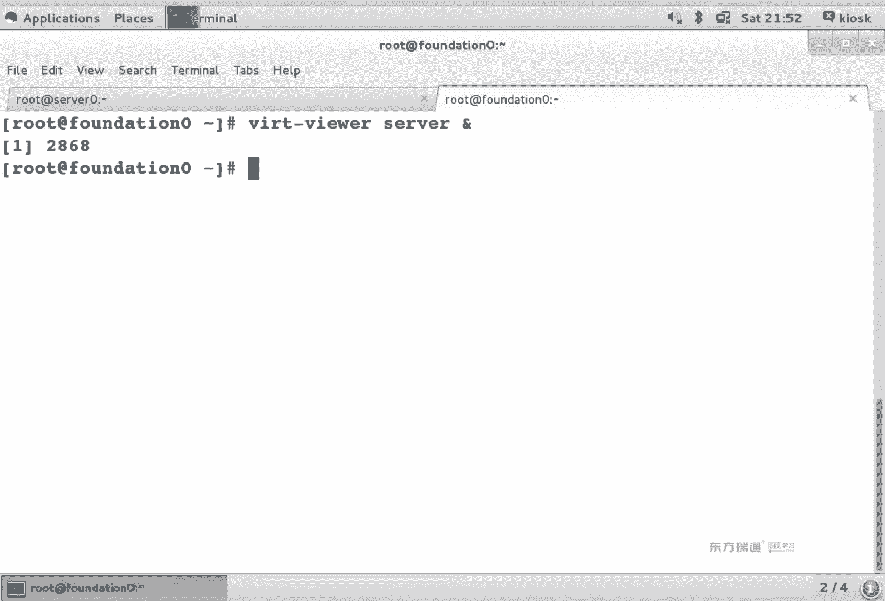

能看有区别吧，普退货跟管理员的区别。啊，那下面我们登录一下。sdent密码就是student。嗯。登录成功之后，我们去application菜单中去查看一下，你会发现多了一个菜单。

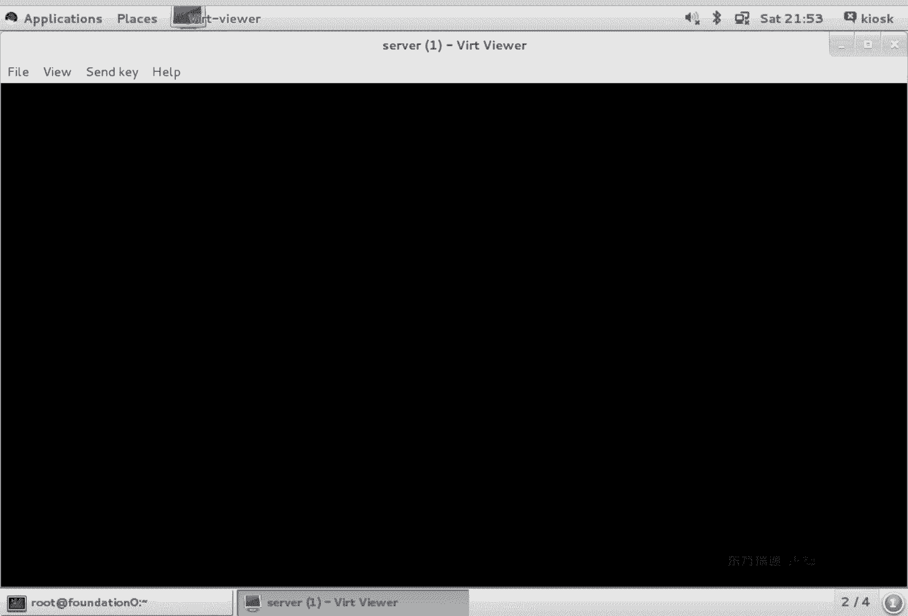

系统工具。看到第二项没？K个star是吧。看到没？K个t这字儿是不是太大了？看不清啊。看不清就对了。

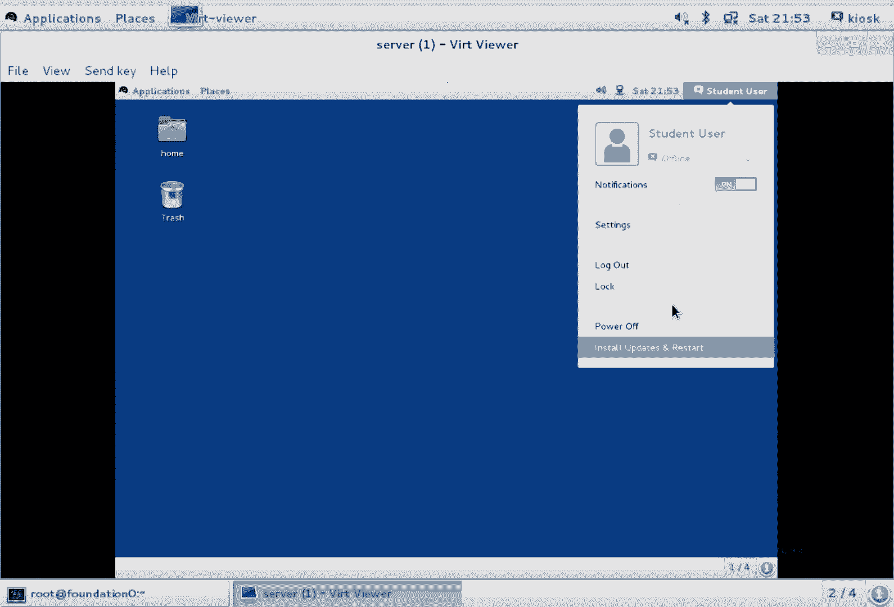

我们在实际工作当中啊，一般建议大家SSA是杠行吗？大X是吧。

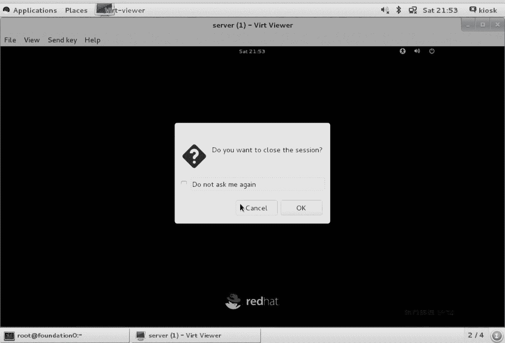

我们很少去本地，为什么不去本地呢？因为去本地的话，你会发现画中画的结果就是里面的桌面很小吧，看着不舒服不舒服怎么办呢？我们只是想把那个应用重定向到本地。那我们一般可以这么来做。SSH杠大X。

用root的身份登录S0。登录成功之后呢。呃，刚刚那个程序叫做包名叫s controltr。config kickstar是吧？那么它的命令啊也叫这个名，我怎么来查它的命令叫什么名呢？我们刚刚是不是。

装了个包啊。查包的内容怎么查？QL。L代表什么？Cry list。查询这个包里面都有啥？你会发现有好多内容吧。you the sha跟我没关系。我们知道所有的命令都存在哪个目录下呀。不管是B还是跟SB。

不不可以这么来查呀。能看懂吗？你装了个包，想知道命令在哪，就去查B就行。😡，不管是病还是S病，是不是都能看到这个命令的名啊？能看到吧。换句话说，对于所有的服务而言，所有的包而言，你主要就记住个包名就行。

剩下都能查到。不管是配置文件呢还是文档，包里都有。图形的程序加个按的。这个程序就是我们刚刚在搜索本地。s tools里看的那个kistar。看到这个界面了吧。如果给你们看画中画的话。

你会发现哎这个界边很小，看着很不舒服ok。看到这图标没？跟刚刚我们看图标是一样的。三个长得一样的纸儿是吧？嗯，三台机器配置完全相同。啊，我们在文件菜单中啊，open file。找到root。

啊那他纳KS点3MG。打开之后呢，你会发现唉。美国纽约。看到加密不加密了吗？看到系统装完之后重不重洗吗？那个reboot。然后安装方法，我们安装的时候是不默认HTPP呀？有印象吗？

然后我说咱们是不是可以写成呃classroom的地址啊？有印象吗？再然后put loader。引导器。啊，引导器。Partationition。刚刚我们在看的时候说几个分区来的。一个分区多大？

数BDA分分区。你现在图形里面看到的就是我们那个KS文件。按照你的心情，你是不是可以随便挨的修改呀？网络。我们在刚刚上午看文件的时候，网络中是不是有IP和主机名？IP主机名验证。密码是不是SHA52位？

在这写着。防火墙。SE类那个是enable forcing吧，enforcing。然后方小强是不是允许了一些服务，不允许的一些服务。显示显示这个在配置文件里没有写。包选择。

那我们会发现这个位置能看到包选择吗？没有吧啊，没有包信息文件，看不到。简单来说，没有样不员呢。再下面。Pre installation。空的吧，我们是不是有叫post呀？pas word杠D杠L眼熟吧。

系统装完之后执行的脚板儿。啊，这么一堆。开一对IM呗。这是配置文件的内容。那如果这个配置文件你想修改的话，比如说我想用铭文密码。另外密码我想改成right hide。我想使用亚洲，我们当年是在亚洲吧。

亚洲叫Aer。呃。有重庆。有哈尔滨。我哈尔滨。还有上海有北京吗？没有北京。为啥没北京呢？就外国人都知道上海，但外国人不一定都知道北京原因是什么呀？知道吗？因为在历史上啊。

外国人去到最多的城市是中国的上海，不是中国的北京。能理解吧，就像我们听外国某个城市，你以为那个是那个国家的首都，结果不是啊，结果不是，主要看人口的问题。OK那我们安装方式也改一下。

如果我改成光盘来安装的话，选择CDrom。那么我们那个URL是不是就变成了CDrom呢？我随便改几个值哈。😊，so say是什么意思呀？😡，保存我把它存到。跟住它下叫KS点CFDC5。好的。

现在我们再次来编辑KS点CLD。首先呢看一下第十二行。见没？原来是不是叫encno PE啊？现在你的铭文密码是啥？readd hide。看到十区店了吧。大然后。他25行。原来在这个位置的时候啊。

是不是有个UILUL等于什么？现在是不就变成了CDro目？从哪儿来安装系统啊从哪安装系统？当然了，其他的位置如果你要去设置的话，它都会跟着相应的变化啊，都会有相应的变化。那没有修改的位置。

这个是不是还原来这样啊？包括我们的。包。包我们是压根没动过啊，就还长这样。换句话说，你用两种方式来定义一个cakestar文件，一种呢是用VIB音器直接修改跟root下吧可以。

第二种方式呢是用相应的程序来修改也可以。O我们。把这边内容啊给大家整理一下。为什么杠S能理解吧？为了让图形应用重导。通堡，我仿内山本地是不是没有装tstar啊？但是因为有个杠X。

我是不是可以把so20上的KXstar重对向到本地呀？所有行的行首前面加个井号。我们把这段时间给大家整理一下。呃，我们在serv上来做操作。在网上都操作。首先是不是要插包啊？包没有怎么办？装包。

包装完了之后。我们是不是可以找到相应的命令？过滤闭目录吧。找到命令之后，我们是不是就可以直接来执行啊？但是在执行这一步之前呢。你是不是得用SSH？防北审。你在访内申登录的时候啊。

你是不是要SS你是杠X来登录啊？要不然图形导不过来，登录成功之后，你就会再看它。OK吧，那么你在图形下，如果想直接看。打开。如果想直接打开它的图形桌面的话，那是不是可以用VIRT viewer啊？

可以打开VIRT manager是管理虚拟机，view是使用虚拟机，它的功能有点像VRVR程序和VRV play的功能。差不多啊，跟他俩功作差不多，一个是管理，一个是使用。同理。

用这个程序也可以编辑开个R文件。我是不是可以新建了？我建议大家。谢谢大家改。最大内容是K个star。Okay。那我们把缓灯上剩下的内容啊给大家捋一下。UL我们刚刚看UL的时候，它是不是可以是HTPP呀？

也可以是CDro吧，或者是FTP。或者是FPP都可以。rapple呢代表是亚母源啊，rapple代表亚源VN C呢你可以用VNC远程来连接。排队之后。

这一行代表着说我分一个home分区EIT4卷标叫home斯。四个G。最大8个G。割肉什么意思呀？可以慢慢增长是吧？向慢增大。河内试盘。那这个用的是SDC吧。我们用的是不VDA呀。啊VDA。

But load there。这个位是不是SDA呀？那他俩指的位置不一样，系统装完能启动吧？能不能。可不可以？可以，但是你的bi要室当中必须要指明从谁来启动。你办公室里有个设置项，从哪块硬盘启动？

MBR是谁就是谁。能理解吧。从A来启动，A启动之后，它是不是能找到D盘的东西啊？能理解吧，这么概念。OK看下面。啊，PVVGLV啊，这个是一个逻辑卷啊。创建了个物理卷，然后呢创建个卷组。

创建了两个逻辑卷。垃圾ical volume。卷组相当于一个逻辑上的硬盘啊，物理卷相当于组成逻辑预言硬盘的设备。你可以理解成它是一个硬盘的盘片。逻辑卷呢就相当于实际使用的分区。逻辑卷相当于属于省片区。

这个是我们在第二门课要讲到的LOVR啊，单独一张。在逻辑卷名。Root volume VR volume。大小每年胸类型。在哪个卷组当中来创建？这个是LV。I love啊。IP。你的网卡叫什么名？

动态动态获得IP。那我们会发现可不可以来设置1。市区呀。可以说时钟同布吧。NTP服务器是谁？可以做同步。还能做什么？这个是验证验证密码方式又启用了个MD5吧。入他的密码。大看密文长什么样。

是不是带do了呀？带do了6啊，doll了6do了这样的字符。我们的密码都是也到了六开头的，密有了密码。明文密码plan tax。两种吧。Enforcing啊enforcing启用IClin。服务哎。

Gro user。我们可以在KS文件当中啊，直接来写系统装完之后，自动添了两个用户。添了一个我的miss组，添了一个乔教案教案用户。能看懂吗？可以直接在KS文件里写。如果这个你不会写的话。

我们是不是可以在pos的脚本里写user艾呀？也行吧。用U ID还是用的比较多的啊，用脚本比较多，因为脚本熟啊，logy整个安装的日志你要写在哪？不写在根ro里，要写在别的位置啊。

可以loging指定日志服器。除了rebo重启之外，我们还能干什么呀？power off heart关机是吧？系统装完了，自动关机。都可以。这个是一个整体。这个是啥整体。🤧Yeah。

那么这个东西怎么来用？嗯怎么来用？我们系统在安装的时候。大家来想一下啊，系统在安装的时候，它应该是长什么样。是不会出现启动菜单呢？咱们先来举个例子哈，咱来举个例子。我在fo上打开虚拟捷管理器。

如果我新建一个训集的话。我都默认了啊。I搜的选。如果是仿定些零的话，它是在counttent目录下。

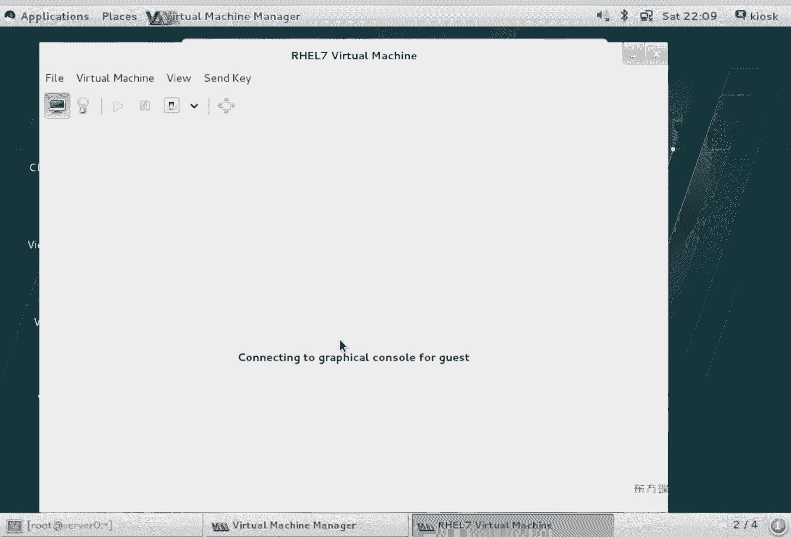

大家会发现呢，我直接用countten的目录下单内容，我是不是直接就创建成功了？但是要用NI反映下的ISO是不是还得去改个权限？OK在这个里面大家可以看到，如果我直接摁放一键上下来选择颜色是不是会变？

第一项，第二项回车都是安装。他们的区别是什么呢？test这个安装是先检测光盘戒指有没有坏到，然后再装。这下是不管有没有快到啊，直接闭展天装。实际工作中，你应该用哪个呢？职业工程中确实用第二个是吧。

但是这个时间比较长，我们明明用的是个光盘镜像，你用去检查它有没有坏道吗？不用吧，所以说应该选择第一项，第一项直接回车，是不是就安装过程了？按照上小题纱布就行。我们会发现在下面呢是不是有个table键。

蓝色的区域。他说请按退不件。干什么，我推步荐一下。大家看没看到恋安木勒的字啊。我们在之前有过单户挑密码的。经验单回特密码是不是就填了些东西？同样在这个位置，你KS什么可以直接使用KS文件来安装这个系统。

能理解吗？利用光盘的话，加table键啊引用。

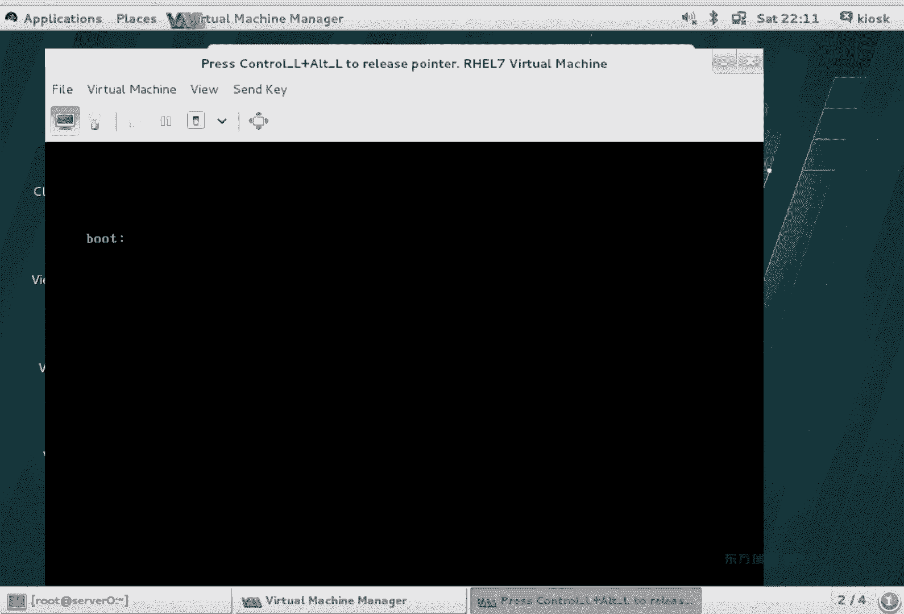

OK回后他来。那下面我们来看一下这个系统引导的过程，怎么来实现无人智能安装。大家想，如果你批量来部署一个区域的话，怎么做？最快是用U盘装光盘装还是网卡装？管卡装是吧。

你们考试的环境啊都是通过网络环境布置出来的，都这么做的。考官呢拿一个笔记本儿，笔记本上是不是已经准备好了服务器呀？然后有一个现成的KS文件。下面所有机器是否网卡启动就可以了。

考试的时候都这么部署的网络环境，考试环境，上午和下午是两套环境。你即使把上午的环境搞崩溃了，下午环境不影响啊，下午环境不影响两套。呃，启动的过程啊，首先是计算机兼容机启动是不是进bis了？

在dss中我是不是可以来设置从哪启动啊，网卡、硬盘、光盘、软盘、U盘都可以看你心情。如果设网卡启动了怎么办？大家想你网卡启动了，你还没有IP地址呢，你能给我通信吗？不能。

所以说在我们环境中至少得有个什么。给有什么服务？DHP。至少得有个DHCP服务。好，那么你在网络中一起网卡启动之后，是不是在网络中喊谁给我来IP地址啊，好，给你IP地址。你有IP了吧，有IP之后了。

你能启动吗？启动不了，你没有IPR。所以说系统首先呢会传给你一个启动文禁。首先会传给你一个启动文件。启动文件叫什么名呢？呃，我给大家找一个文档哈。😊，这个文档。うん。啊，这有一个之前写好的文档啊。

就是做整个实验的这个实验不要求你们现在会做呀。等这三门课学完了之后啊，你照着文档的步骤啊。自己做一下。三门课学完之后。为什么不让你们现在做呢？因为它里面涉及到了4个服务。四个服务还没讲是吧。

这不第三门课才讲到服务啊。O。这个文档啊是之前写过的一个文档。我们来看一下。你需要知道这么几个东西，DRCP干什么的？分配IP了是吧，TFTP干什么的？他跟FTB啥区别？你提醒你。一个是局域网。

应该是随便。TFTP只能局网小文件。能理解吧？他用的UDP协议啊，只能选小文件，它没有账号的概念。FTP有账号的概念吗？有吧，有账号吧，赶紧。呃，slin呀是启动的配置文件啊，启动相关文件。

启动相关文件，你把它列成IBR就得了。开个star是不是刚刚我们做的文件呢？你有一个picickstar的文件，然后呢你会这四个东西。你就可以直接配完了之后，那些机器也网卡启动，就可以直接来安装了。

那我们来看一下。思路哈，首先你网卡启动之后，你是不是会获得IP？换IP之后，你还启动不了，你是不是得有MBR啊，你有MBR他MBR怎么来呢？😡，都在这个里面。sstlin里面。不管是VM雷内斯因塔D。

这些文件都在slinux里边，它里面主要用的就是个PSClinux在里，这个就相当于硬盘的IBR。行在你看边，它首先呢会通过DACCP告诉你说TFTP服务器的地址在码。文件服务器在哪知道了。

然后去文件服务器去下载这个文件。是不是可以启动了？启动过程当中呢，它需要来加载内核，需要来加载内存文件系统。然后呢，就会看到我们刚刚新建虚拟机的时候，看到的那个界面。可以安装。

可以测试光盘介指安装那个界面有印象吧，就到那个界面了，到那个界面之后，我是不是可以。直接启动开始安装啊。我们在这个里面给大家写的例子呢，是说用FTP做网络安装。那我如果用HTPPNFS都可以吧。

到底用哪种网络安装方式看你心情。到底用哪种网络安装方式看你心情。只不过FTP呀，我为什么文档中给大家写个FTP的呢？是因为TFTP和FTP它俩是不是有点像啊？我为了给你做对比啊，所以说写了他俩。然后呢。

通过FTP来下载相关包啊，进行安装。整个过程当中。整个过程当中，只要有网卡就行。光盘啊U盘有没有随便？拓普呢就是这么个模式啊，你得有两台机器。我这个实验是用serv来做的啊，用serv来做的。

就随便弄一台机器啊，叫福器。有个系统就行啊，这个系统是linux就得了啊，那linux红帽哪个版本都可以。客户端呢是个裸机，什么叫裸机呀？没有操作系统啊没有操作系统叫逻辑。在我们的网络中。

如果你用VIY软件来做这个实验的话，你里面配个DHCPVIY软件本身带个DHCP。那么客户端到底从哪获得IP呢？不确定吧。客户端获得IP它是随机的。谁先应答，谁先获得。你在上银行的时候。

你到底去哪哪个窗口办业务，能定下来吗？定不下来吧。是不是排号排到哪个窗口，你去哪个窗口去办业务啊？BSCP是一个原理。哪一个月。为了让我们这个实验肯定成功啊，需要你把这个服务停止。这个服务怎么停呢？

VIY在微软的产品当中呢，它是不是也叫服务管理器呀？有吧。你把服务管理器啊service点MS服务管理器中找到VMY接CP服务，把它停了就得了。如果你不会停的话呢，还可以用另外一种方法在VM菜单中。

如果是windowsVMI worktation版本的话，它这个里面呢会多一项叫网络设置。我这个里面没有哈。呃，mac版本呢叫附身版本是吧？附身版本没有啊，附身版本得去改文件。得去改文记。不太一样啊。

两个版本有点区别。把DNCP服务停了。D2RCP服务停了之后呢，我们要做什么？😊，KIP吧，你的服务器是不是配IP？2。mount跟 deviceiceSR0对MNT这啥意思？

把什么挂在了跟MT下SR0是啥？光驱。光驱赛tarely第一个设备。赛他只读的第一个设备就是光驱叫SR0。Sa他的弄力。这样能看懂吧嗯。看不懂，我给你们演示一下啊。

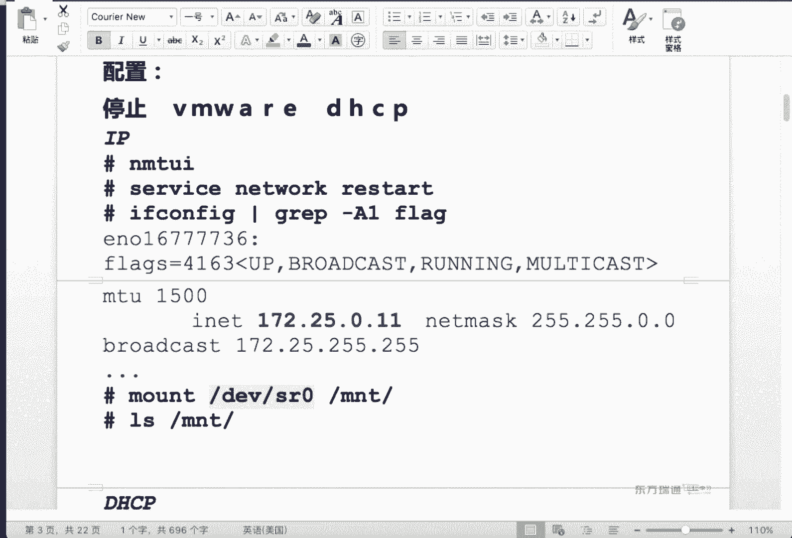

我要演示的怎么演示啊？我这个虚拟机有光驱吗？有。我不知道。你们说有和说没有的同学，我都不知道你们怎么知道的。

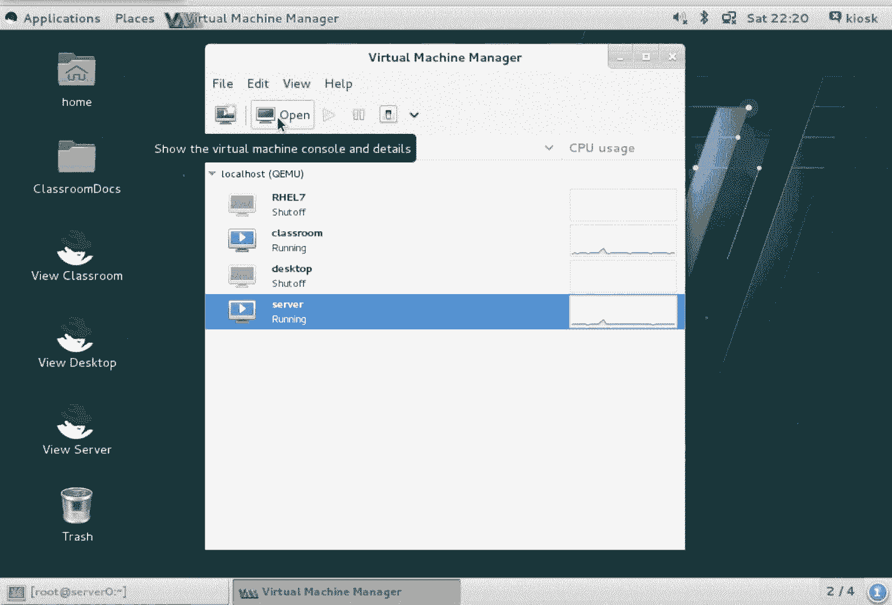

我这个位置从来没讲过。看一眼啊，open看到灯泡没？

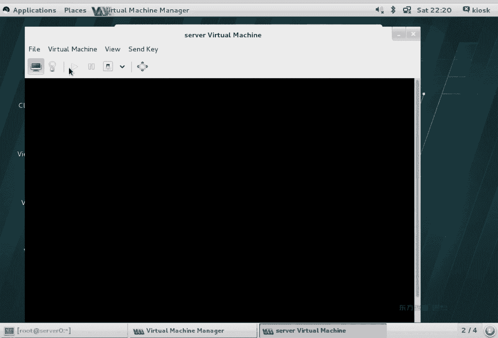

show details显示硬件细节。你看这左侧呀有光驱吗？没有。啊，你就闭着眼睛，一个个查也查不着。啊，睁着眼睛查不着是吧，没有光驱。你要塞个光驱怎么弄呢？😡。

C个光驱要必须得关机的情况下才能让它生效。你如果就是开机给他塞个光驱。啊，我们看一下。呃，它下面有个叫艾 deviceice一个命令按钮。因为我们当前这个分辨率太大了，是不是看不着啊？啊。

一夜障目不见泰山，在地底下呢，嗯，在地底下，那怎么办呢？鼠标右键有没有爱的哈德威尔。有吧，葱酱。呃，光驱属于存储吗。属于。你看右侧。设备类型。看到IDECDR目没。这是不光驱啊。

你光塞个光驱也没有啥意义是吧？你是不是要塞个光盘呢？上面浏览一个已存在的存储。选择一个管理，一个以存在存储，对吧？光盘在哪？如果是fin0的话，是不是到content这个这个。Eos在这儿啊。

这是仿对身零的路径。如果是纺对身一以后的。foation的话，你的路径是不是应该是你挂载的那个跟MNTNFS下的这个路径啊？等你入吧。另外一个你要知道就是有个权限差异是吧？虚拟机能不能用NF上的文件。

O， finish。他说什么？你想添加这个设备吗？这个设备不能添加在running machine。并行。开机状态也填不上。然后说你想让下次启动的时候生效哦，yes。大家看左侧。有没有啊？

这个是硬盘这硬盘都10个G是吧？是不没看着关机怎么关？杀档是发送的信号，fos off是直接拔电源。关机了之后，你会发现直接蹦个东西出来吧，蹦个圈儿。抽烟人最爱玩的东西什么？涂圈圈吧啊。啊。

可能有些人抽现不透片是吧，直接验度了嗯。咽完住之后，接拿鼻子涂圈这圆的。ok多了一个东西之后呢，我们再次来启动。正常情况下，在右下角啊有个应用。右下角也在地底下面，是不是也看不着啊？

我如果就是想给你们看怎么办？可不可以修改一下桌面的分辨率啊？display高度不够，是不是大于690，高度就够了呀。随便找一个。哎，这个大于690吧。找个800的吧，大一点。保存。对，能看到吗？嗯。

哎呀。这个这个。我这个显示器分辨率太小了。显示器分辨率要调太大了，你们字该看小了，这个挺头疼的一件事儿是吧？啊。一会儿你们再改的时候啊，你可以，因为你windows的桌面分辨率是不很大呀。

你看看你们那显示器是不是都几寸呢。你再看看我这个显示器，这才多大，所以说你们得理解我啊，一会儿自己看。注意啊，下面这个位置左侧有个添加设备，右侧有个应用OK吧？只不过我这个位置因为分辨率的原因。

它显示不全。

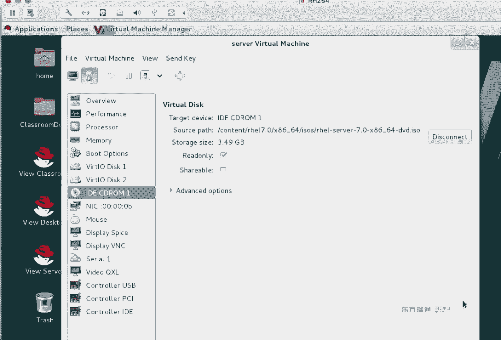

诶。😊，O。现在能看到了吗？看到应用了吗？看到他在外面了吧啊。是不是有啊，我这也有啊。这个。呃，我再出现。我俩去哪儿啊？你现在给这个续泥全屏了，我不知道外面能不能录上啊，所以我得出去。哎。

可以可以可以可以。Contro out。お。我再回来哈。😊，老带何来。O。呃，这个虚拟机光盘填完了之后，我们是不是要进去看一眼呢？SSH路特S0。漫特。跟德莱S20跟麦比尔。我说随便放的那置。

这里面内容盐不熟？光盘的那种吧。赛尔号。要卸载的话呢，叫Uon卡。弹出光盘呢叫给。光驱上是不是有个按钮啊，弹长键。要用命令的话，就ex就可以。哎，他光驱又弹出来了。啊，光盘就弹出来了。

光驱弹出来有点吓人。光盘弹出来也正常了，是吧？Okay。这个时间看懂了吧。就说你S20是什么呀？光驱啊光驱。好，我们继续。继续看这个实验。呃，看光盘的内容。张样微那干嘛的？他爹CD装没装吧。

没装安装一下。装完了之后，我们会发现在DSC配置文件中啊，有个示例，他说这个是它的示例文件。所以说呢我们把它的示例文件给copy了一份过来。呃，grape杠1是什么作用？你去过这个。

过滤不匹配的内容是吧？大意呢？expression当你有多个条件，多个表达式的时候用大意。你和刀刃代表的是。行首就是行伟代表什么？空空行啊空行。那这句话是说。

每个s文件当中的空行和注释行是不是都过滤掉啊，只看生效的行吧。朱世航对我们来说有意义吗？你刚学习的时候看看挺好。刚学习的时候看看挺好。但是如果是从1个1000多行里的文件里面去查去删，比较费劲。

所以说我们把这个我们不用的蛤啊都给子干掉，保留有效的哈。大一号是不是生成文件呢？它有更新和写入的功能是吧？然后。然后我们是不是可以去查卖手册啊？慢手册当中有al漏，有bo。我们想看的是这两个词儿。

耳楼不听和耳楼不TP。他们代表的含义是什么呢？不。允许通过网卡来启动。允许通过王卡来启容。允许通过putTP协议来启动。能理解吧？我通过1个DACCP写完这两项之后啊，允许。那sernet呢代表是网段。

我服务器配完了之后，我客户端获得的网段，是不是应该跟我在一个网段里啊？你刚刚IP配的多少，这就设一个网段就行。这个叫什么呀？地址时。地址池。那这个里面写了几个。50到611个是吧，写了11个。

如果是有20台机器的话，你这个里面是不是得有20个机器啊？把后面数也改一下就可以，或前面数改一下。So name。这个东西为什么要加粗？因为默认配置文件里只有这么两行。你需要修改。

so name代表是TFTP服务器的位置。你从我这获得个IP，你有地址了。然后我告诉你说TFTB服务器在哪？在这儿。TITP服务器可不可以放在另外一台机器上？可以吧，我这个里面是放在同一台机器上了。

都放在server这台机器上了，okK吧。那么你启动的话需要用到的引导文件是谁？PIClinux4。0这个文件默认有吗？没有。😡，你装完系统以后，默认不存在这个文件，它存在于sslin那个包里。

Says thelinux。我们来瞅一眼。咱们在之前讲没讲过。RPM杠QF命令。RPM和QF是干嘛的？产询文件来自于哪个包吧？但是这条命令它有个特点，什么呀？你得写什么？你得写路径。啊，你得写路径。

看到没？你不写路径的话，他能查到吗？你从哪里来？上面查不到啊。所以说我们在样目命令当中有这么一个叫做provisise的命令提供。谁提供乐。什么文件？谁提供了什么文件PSS类那个4。0。有吗？有没有啊。

说没有啊。这个文件没有，它只是叫这个名。那么这个文件原来叫什么名呢？Oh。PIC configurefi。啊。想想啊。他什么名来着？呃。便宜。点CFD看这个PID。坐日啊。原来的名。呃。对呀。

就叫PIRCle4。0。Use the share Linux， says Linux。名没错哈，PFE的那个4。0。啊，我写错了。这PI的 configurefi。欢迎0。0。你。あれないます。你想。

差不到是吧。差不到我们。去查一个包。年是到。テトレネ。我都说。用RPM杠QL来查这个包。有没有啊？是不是有这文件呢？那为什么用亚么坡外子查不到PXE4。0。是因为点的原因。诶。行。是查不到是吧？

应该是点的事儿啊。这个文件呢来自于sslinux这个包。O。😊，回不快来。这个是TFTP服务器的地址，这个呢是我们的启动文件。换句话说，DSCP在配完了之后。

你是不是要去弄TFTP服务器和IElinux啊，要弄这两个东西。DNCPP完了之后，是不是要让它生效，开机自动启动，防火墙要允许通过。

那我们在这个里面大家会发现我是不是用了个叫fireworkCMD的命令啊？在企业板7当中，我们在配防火墙的时候，有两种方法，IP table和firewallD。两个防火墙服务都可以。

只不过在企满期的时候啊，建议大家用什么呀？fire包地啊fire包地更容易一些。看TFTP怎么配。首先来查看它包名，它的包名叫TFTPserv。然后呢，安装。装的时候啊，它有个依赖包叫做X in。

XnetD这么一个服务。这个服务我们管的叫超级手电商。超级手电脑，他守护好多服务。他守护好多服务，平时我们接触的服务都是独立服务，自己管自己吧。但是像什么tnet呀。还有。TFTPserv啊。

他们都是由axent来守护。我们把它的配置文件呢做了一个修改。拍照家改了什么呀？这这条命令什么作用？在台面练什么作呀？查找baable这行，然后替换把yes替换成了nobaable什么意思？借用。

默认这个服务是禁用的。你是不是要启用啊？diable yes改成no。然后呢，把服务重启，大家可以看把谁重启了。X in it吧。重启的是TFTVserv吗？不是。它是由X in的它来守护的一个服务。

重启的是它你在安装包的时候啊，如果只装它装不上，它会提示你要把它装上啊，它是依赖的一个服务。装完了之后呢，我们会发现开机自动运行也运行了，然后是不是依然做防火墙了？允许这个服务啊，别人可以来使用。

允许通过。对于SElin而言呢，它主要提供的是一些文件。它不需要什么呀？不需要配置服务，你要把文件放在相应的目录下就可以。查询安装。这个目录是谁的总红录啊？TFTP的总目录。跟VR liveTFTP。

我们把相应的文件，这个是引导文件吧，放到TST主目录像。这个文件呢。内存文件系统这个呢。内核文件。我们是把这个文件都放在了TFTB主目录下。copy到了点点是哪啊？当前目录这是已经CD进来了呀。2然号。

这个。menu是什么文件？菜单啊菜单文件。我们通过网卡来启动，你是不是也想看到跟光盘一样的那个启动菜单啊，怎么来安装的界面啊，就那个菜单message信息就下面提示的说按 table键的那个内容。

然后呢，我们要创建一个default文件。你发的文件哪来呢？😡，在光盘我们跟MT下挂着光盘，光盘ISOlinux下有个叫SOlin confi，这个是个配置文件吧。记不记得我们用光盘来安装的时候。

是不是有个安装的界面？有三个三个项吧，第一项是安装，第二项是测试光盘安装。第三项是传播书体。我们是拷贝了那个文件过来，把它拷贝成什么名了？Defa名。默认值网卡在启动的时候啊，它到底用哪个配置文件呢？

一般情况下会用到自己的网卡麦克地址对应名的那个文件。那你如果有20台机器，你是不是做20个文件了？当他自己卖个地址对应的名文文件找不到之后，他最后会找到一个叫default文件。叫默认文件默认值。

所以说如果你有20台裸机的话，你用能去做20分这个文件吗？不用直接做个default文件就可以。文件做完了之后呢，我们把它里面的内容呢做一些下修改。赛雷命令什么作用？修改文件的内容。

首先呢查找了一个内容，然后SS后面我写了个问号。为什么我不用写了？😡，原因。我是不是想把这个内容。替换成这个内容。能看懂吗？问号代表什么呀？不联。分割符吧，因为我这个路径中是不是出现了档啊？

如果你S后面还用档的话，是不是系统就懵了，不知道你在说什么了。Yeah。知道他们叫方言吗？这就是方言的概念。那为了让系统能理解我说的含义，我用了一个后面不出现的符号问号。替换把这个内容替换成了这个内容。

因为我们当前是不是要做网络安装啊，所以说是不要用到FTP路径。调完了之后做了什么操作呢？系统在重启的时候啊，这个倒计时时间太长了。然后我就给改短了点啊，原来是600秒是吧？啊，然后呢给改了。

把600改成了多少？再然后呢，默认时。我们把原来的默认值给删了，然后添了个新的默认值。我们用光盘来启动的时候，默认是他选的是第几个菜板。注意了没？第二个菜篮。但我们不想让他测试光盘截止，对吧？

想让他选择第一个菜单，那这个叫manu default，它设置的又是第一个菜单。但时后做什么呢？之后配FTP。查询这个包装没装。没装安装。FTP服务配置了吗？是不是就装上用就完事儿了，没配置，为什么呢？

因为默认这个服务装完就能用。方宝强。大家看下面这步。靠贝到哪啥意思？是不文件文件都拷贝啊，把光盘中的所有内容都拷贝到了FTP总目录下。VRFTP是FTP的总合。拷贝完了之后呢。一启动，哎。

就看到这个截面。啊，安装过程。都设置完了之后，下一步就开始安装。那我们会发现这个20台机器，每台机器都点一遍安装，是不是挺麻烦的呀？最后一步用KS文件。把默认root下的KS文件呢copy分过来。

靠py到哪呀？FTP的主目录下FTP目录下。这个文件你是用root身份来创建的阿哥没有读的权限，我们是不是要亲身mod到O加R啊？A加都行，给它读个权限。然后呢，这个文件怎么来改？

用k star程序来改吧。或者是说你直接用VIP器。用side的命令改都行啊。改的结果主要改什么呢？第一个是区。第二个。删除所有分区初始化。下面是说装哪些包啊？A，他是不是包组啊。啊，这个没写at特了。

是不是单独一个软件包？ULUL代表是说你安装的时候路径想用什么来装？用FTP来装。那对于我们刚刚的那个defa文件呢，我们也来看一下。得放到文件的内容。看这个 menu有得放。系统启动的时候呢。

会有两个菜单，有两个manu啊，两个manu。你看下面这个manu叫traub书体，上面这个manu呢叫安装。这块有个 menuu叫test。测试光盘戒质。能看到吧？三个菜单。

那如果你想改哪个菜单的话呢，就改哪个菜单里的内容。我们想让第一个菜单是默认值，那你是不是应该把这个menu default给它扔在哪啊？扔在上面这个manu的位置吧，给它挪过来。然后呢，刚刚做的替换呢。

实际上就是把这个路径给改了。instorestore意是是不安装的存储啊，从这儿来装KS这是不是指明路径啊，从哪来装？都做完了之后呢。啊，结果就是系统一开机网卡启动，开始安装然后试验完成。

大概这么一个过程啊。我把这个文件呢放到百度盘上。感兴趣的同学呀。回家自己做一下。感兴趣的同学。这个实验它属于是C的内容啊，C的内容啊叫不署。自动部署啊。这个文件名啊叫13414啊。虚拟机自动安装啊。

word文档。共享当中就这么一个word文档啊。还有一个你要知道的就是KS的用法啊，KS用法。如果是网络路径的话，KS等于什么啊等于什么？HTDPFTPNFS。网络路径。HD和CDro本地路径啊。

本地路径都支持到底用哪种路径呢？是看你心情。你是把这个KS文件刻到光盘上，放到硬盘上，还是放在某个服务器上？头三个都是服务器，后面两个都是本地的路径，硬盘和光盘的区别。但不管怎么写。

是不是都KS等于什么呀？😡，Okay。光盘启动选择第一项安装，然后按tableable键是不是出现下面这行啊，我发里面写KS等于什么？开始安装啊，可以。第二张。对于第一章啊，虽然说讲了很多。

但是考试不考啊，考试不考。实际工作当中啊，你会用到啊你会用到定义一个相同规格的服务器，用KS文件来做。那么第二张是重点。我平时给大家讲实验的过程当中用的频率比较高的一个命令，是不是gra呀？

t命是尾也能看文件内容，t也能看tail也能看。但是用的grape频率是最高的，为什么？为什么我老用gra过滤呀？过滤出匹配的好。一个文件上千行，如果有10千0行里面挨个给你讲，这也讲不过来。一方面。

另外一方面你也不知道哪个是重点。我就过滤出来了某几行给你看，你是不是说看哪行了呀？的原因啊挑重点啊挑重点。这章当中啊你需要会用正则表达式啊正则表达式。这么表达是我们在之前呢提到过一部分啊。一起来看一下。

方括号代表什么含义啊？番话代表什么含义？范围吧。我们在之前是不是生成了一堆文件呢？用发括号来生成，用方括书来查找啊，一个意思，他不都代表范围。猕和当乐代表什么？以什么结尾，以什么开头是吧？

幂代表是什么开头，刀德代表以什么结尾。点和星呢？第二代表什么？占位福。啥也没服，跟我们那个问号有点像。我们之前是不是讲过问号和星啊？这个里面叫点点这个单元。香代表什么？还是任意是吧？还愿意。O。

你先演示两个用的比较多的。下面这组实验呢，我用so来给大家演示。首先我们开始杠恩。这边念几行啊。九行吧。看到前面12345789了吧，9号。grape的标准用法是grape。过滤的内容。从哪儿过滤？

包含斜杠的行是不是全列出来了？能看到吧。同样你要是包含等号的行呢。OK吧。这是gra最基本的功能。过滤。那么我们还用了一个比较常用的功能。在刚刚看这个文件的时候。

大家会发现这个文件中是不是有好多井号开头的行啊？或者说有井号的行是不是都要注释？放眼望去啊，井号全开头全注释。那我想不包含井号的行应该怎么写呢？Co他。杠V。And what。然后嘞。奖浩。还一幅话。

啊，在给那个棍子是吧？😮，不包含井号的卡。为什么给他一棍子呢？😡，这就是原因。井号什么作用啊？注是。啊，不是换句话说，你要不写反斜杠的话，系统认为后面也没写。然后这个grape还执行不完。啊，原因。呃。

你也可以用两个单引号给井号引起来也行啊，两个单引号也行。这是不匹配。那我想把这个文件中空行再给干掉，怎么办？不要空行干什么？接着告诉你吧。扣行呢。这个文件中生效的行是几行啊？是不是就一行啊。

因为这行太长了，它自动窜了哈，但它实际上就是一行。那你们想不想知道它是第几行啊？go瑞在过滤的时候。我们有个选项叫做N。第一行是扣行，第九行是这行。能看懂吗？搁瑞不过滤的时候有个NB呀。你不信的话。

就可以编辑一下这个文件。冒号 set number。看到第九行了吧。就多做对比啊，对比理解记忆看现象。ok。那我们来看E啊，先先看这个哈。😊，我还拿这条举例子。我们在之前是不是提到了一个叫大E呀？

大意是干什么的？是不多个条件expression呢。多个条件。不包含。不干什么呢？角儿。还不玩什么呢？空行。结果也不一样。一样的吧。有没人说老师你写这个大意呀。如果你不用大E来写的话。

我们可以用小E来写。大E就是条件放一堆，小E就是有个条件小E一下，有个条件小E一下，结果一样吗？大义小义咪。考试的时候呢，g瑞或是考点，你需要知道密和doll。你需要知道杠B啊你需要知道杠B。

会用管道可以多撕过滤。如果你不会多撕过滤的话呢，会用大E，会用小E都行。就是说考试的这道题啊，有很多种方法来做，到底哪种方法看你心情。啊，到底哪种方法看你行不行。一般我给大家写答案的时候呢。

推荐用的是上面这种。这个是不是更容易理解呀？就读阅读起来更容易读啊，阅读起来。把所有工身行干掉，然后呢把所有空行干掉。把最后结果要生成到一个文件中，是不是大于号录径文件名就完事了。啊。

考试类型题啊考试类型题。gpe杠笔min dollar。井怎么用啊，怎么么用，这要注意。那么在德瑞go这个命令当中啊，我再来给大家讲一下。点儿和香。两个香。嗯，就是。过滤。过滤UUID。

从这个文件中过滤。驱问大家写是吧？我如果时间长了，忘了这大写小写了，那是不是要更挨呀？没有小舅的ID对吧？I。是不忽略大血。发回来的。O。我再来波滤。然后呢，我再给大家写另外一个写法。

这两种写法的区别是啥？结果一不一样。在当前这个文件结果是不是一样啊？但是他俩有区别。区别在于顺序。顺序。我们在用点星的时候，点用于什么呀？占位UUID后面肯定有东西。什么东西我也不知道星。那理解啦。

然后呢，再接着就XFS，他俩是不是有先后顺序？你这种写法顺序是固定的，它前面就是它它俩顺序固定。如果是上面这种写法，它是不是还有另外一种可能？这一行里有这两个词儿，但顺序不一定是这个顺序。能看出区别吧。

跟他俩的区别。什么时候有点星啊什么有点星，什么时候有管道。如果你只需要确认有这两个东西就行，不考虑顺序。用上面这种信法就行。如果你也考虑有这两个东西，还考虑要有顺序的话，用下面点星来写。喂。

那我们再给大家举个例子。在GETC上有个叫SElin坦fi文件。这个文件中有一些单词啊有一些单词儿。但用肉眼来看的话，生肖的行有几行啊？是不是就两行啊？用肉眼来看的话，剩下的行像就两行。

我们会发现有个S一类，那个是等号是吧？如果我来过滤。S一类那个是等号。有几行啊？哪行。但是注释那行对我来说没有意义。能理解蜜的作用了吧，以他开头的好。以SE等号开头的好。あ。这是密的用法。Me。

刀了依然相同，代表有什么结尾？g瑞在PPT上啊，还有一些其他的用法。Yes。比如说A和B。A和B。大家听没听过以前的录音机啊？你那录音机是不是都插袋式的呀？说A面听完了，张飞听B面。嗯。

这个可能好多人没用过。没用过人说明都很年轻。用的都是CD。用的都是MT3。现在都M5了是吧？现在IPU卡用的也少，都手机了，是吧？以前都是磁带A边B面。AB它代表是方向。AB这个方向什么方向呢？

我们看一下。在实际工作当中啊，有没有这样的情况？伊思 can这个。开一批是吧。衣服可fi个。一天是两。只看第一块网卡。但是在这个里面呢。有可能你只感兴趣什么呀？爱耐这行。OK吧？有可能你只感兴趣这行。

啊，我们用n mask吧，这个词是唯一的。那么你要过滤的时候，你就不可以隔瑞趴。M mask。是不就显示这行啊？但是在实际工作当中，你还想把它下面几行也分到瞅一瞅。你想看下面几行吗？你想看下面几行。

比如说下面再弄两行看。A2是什么意思呀？下面两行也带出来啊，这A2。那我想看上面两行呢。是。B2。哎，这明明看到是上面一行啊，也不是两行啊。因为上面只有一行是吧？啊，只有一行，就说在一个文件当中。

你想看这行和上下某两行的话，某几行就A几B级。默认是A几是吧，下面几行。这是A和B的作用。这种用法一般什么时候用的？你过滤的这个东西啊，这行你看下把负。附近几行给大家显示出来会用到A和BAB面。

它代表是方向，A代表是下，B代表是上。Thera。OK到re后就这些内容。我把这个实验给大家整理一下。这张讲的快不快啊？哎，讲完了。😊，咔巴一下，讲完一张。飞一般的感觉呀。为什么这张讲的这么快呢？

因为这张就讲个grve和命令正则表达式。こい。A是小建杠杠小V是。Inver。杠小屋。你w much不匹配的。默认是看匹配的是吧嗯。对你找个对象想要什么要求啊？😡，正常我们都说要求是吧，性别是女。😡。

然后有些人呢他不说性别是别，不是男的就行。😡，这不是男的就不一定了，是吧？还有外国人呢。😡，泰国是不是也不是男的。😡，还长得挺漂亮。哎呀，一般人享受不了。嗯。啊，有机会可以出光摸一摸啊。啊。

出国他们去泰国旅游啊，主要就新摸的。哎呀，挺奇怪是吧？中国有非法外国模型。嗯。ok。我们把这个时间给大家整理一下。如果你在编辑一个文件的时候啊，默认是只读进来的，那么一会儿的时候。

记得冒号WQ叹号强制保存退出。grape过滤。这个实际上我们是在server上做的。首先呢你需要去看一个文件的内容。文件中没有几行是吧，十多行。我们可以过滤，你到底想过滤什么内容。

随便g后面呢默认接的就是过滤的内容。选择什么从哪选择。再然后呢，我们可以杠V杠V什么作用啊，点word是吧，不匹配啊不匹配。这个文件当中过滤不匹配井号的行，是非注释行啊。为什么要前面加一个反斜杠呢？

反斜杠有几个作用。😡，第一个作用是转移。第二个作用是。手动换行是吧，俩作用。哎，见没见过双节棍呢？两个法斜杠。在windows里面见过吧，你是不是访问同桌的共享啊，两个反斜杠。😡。

在雷尼个斯里两个反斜杠是干嘛的呢？转移转移。哎呀。举个例子。我们在之前呢是不是讲过NMCI呀？😊，有一象吧？这个命令。我如果看这个命令的帮助够慢了。文化一堆好多内容。慢命令啊也支持管道。也支持管道。

那么我们在用管道的时候呢，你是不是依然可以做过滤啊？它既然支持管道，你就可以过滤。比如说你想勾虑什么呢？我们来看看例子啊。哎，这词是什么意思？咋办？曼迪蜜。诶慢点去。这些内容要不想看的话呀。

是不是可以大于号按着大于号跟devis斯诺啊，不看会写。O。然后我们来看。这个里面是不是有个NMC example的实例呀？我们在第二门课会讲到team双网卡team。以前的时候我们感觉叫棒。

到写满期的时候依然存在棒的，但是推荐用team考试的时候考的试team。那我们一般呢都建议大家用。这个是例来看。这个事例当中啊有好多词儿啊有好多词儿，你要查te是不是斜杠te啊？看到是不是好多te。

我们最终要用的实际上就这几条命令。就这几条命令。那么在这个题目命令当中啊。我们来看怎么过滤啊。卖命令。是不是可以过滤替膜？有啊。然后你是不是想过滤包含刀了的行啊？咋写？到了。谁感？

到了代表有什么结尾是吧？你说也得给他一棍子。特殊符号转移。哎。不对呀。还一堆是吧？双节棍。能看出区别吗？第一个反斜杠啊是转移，第二个反斜杠的。第二反斜杠转移的是doer。

这个有有一个小伙呀唱那首歌叫双截棍是吧？嗯，他实际上是学过la那个斯呀，后来没学明白唱歌去了。双截棍这么来的嗯。好，转移转移。OK吧，行。啊，有的友说老师，你这个单引号不就得了吗？

大眼上是不是也得有俩呀？啊。I think。有区别是吧？嗯，还有点区别。是不是光转移一遍，不认识啊，再转移两遍。呃。这因为提到反斜杠了，顺道提一下，有些时候你得给他两棍子。大家吃过鱼吗？

一般我们约买活鱼是吧？嗯买活鱼的时候，你发现这个老板都可残忍了，砰就给他一棍子。😡，一般老板都会打两棍子。啊，因为第一工呢他可能。还蹦的是吧，说明鱼挺新鲜嗯。O。😊，下面这段是说明警号的作用就注使。呃。

女需要知道密合刀路的作用，它代表空行，开头就是结尾，就代表空行。N代表什么呀？Yeah。N代表行号吧。在这个文件当中来过滤。井号和空行。不关角空号。这个里面你要知道小E和大E的区别。

小E是每个后面写一个条件，大E是一堆条件翻一堆。这他们区别。过滤过滤的时候呢，linux区分大小写，或者说在实际工作当中，你能不能备注配置文件中到底大写还是小写啊？时间长肯定忘。你要天天搞这个呀。

你大小写肯定能记得住，但你偶尔用一下的话肯定吧，那怎么办呢？杠挨挨代了什么呀？挨个脑忽略大血。忽略完了之后，我们可以再次过滤啊再次过滤。那么在这个里面呢，主要来讲的就是点儿和星的过用。

点号星和上面这个用法啊，它俩的区别就在一个顺序。就大一个顺序。然后呢，我们又讲了一下蜜蜜代表什么呀？杭首吧。过滤它包含它的行密以什么什么开头的行。在最后呢讲的是AB啊AB。用if confiEH0。

我们可以看到ETH0网卡相关的参数。只看那个ms这行。这一行和下面两行这一行和上面两行。当然了，你要高兴的话，也可以杠A完了之后，杠B就这行上面和下面都带出来了。有点类似于8个萝卜扯出泥儿的感觉。

最终的目的你去给他拔萝卜是吧？😡，这边内容有问题没？那个是么？虽然没给你们写注释啊，你多看现象就理解了。不理解的话，问同桌啊，再问我都可以。继续。啊。第三张。预一。BM第二门课讲过吧。第一门课呀。

是不讲过它的基本用法呀，比如说。呃，我想编辑个文件。说罗比亚莫加文件名啊，路径文件名文件如果存在的话，就打开文件，如果不存在的话，就新建。然后里面有三个模式，有墨哈模式命令模式，输入模式三个模式。

三个模式之间可以互相切换吧，默认是什么模式？命令模式在命令模式里面，我敲了个IAO是不是都进入输入模式啊？可以写内容NESC键是不是回到了命令模式？摁冒号WQ叹号是不是强制保存退出。冒号墨行模式。

如果冒号内容没敲回车的话，ESC是不是还能回到命令模式？好，这是VI的三个模式，输入模式呢就长这样。Inert。状态栏。我们看一下。那这门课讲BM啊讲的都是它的高级应用啊，高级应用。什么叫高级应用啊？

就是不会也没事的应用叫高级应用。会了操作更快捷一些，叫高级应用。那我们首先来编辑一个文件。跟于 t c f s table。当你进入输入模式之后啊，退出了输入模式。大家会发现状态来说不是没有了。

但是你还想看状态栏怎么办？Yeah。看到状态来了吧，cttrol加G。cttrorl加B。这是快捷键。你在编辑一个文件的时候，如果进入了输入模式。然后呢，又退出了输入模式，你会发现状态栏没有了。

这个时候用的是ctrl加G。显示状态吧。嗯。这是哪个词儿啊？😡，废五。给我。给我现象，给我状态啊，给我。give me five是什么意思呀？😡，给我5块。嗯，我媳妇问我说g me five。

我说你要给5块钱吗？😡，我媳妇儿就嘲笑我。缺我文盲啊。给我给你发我什么意思呀？鸡俩是了。是给他给五个手指头。这外国人说话还挺有意思。在我理解都跟人民币无关。😡，你要买啥叫5块钱？🤧好，ctrol加GO。

那我们在之前讲过冒号赛克南波，冒号赛克 no南波是不是显示行号取消行号啊？还有冒号。Same tax。O。现太是off干嘛的呀？大家看什么变化？黑白电视。同理，F syntax。分ax。棒呢。彩色电视。

黑白电视跟彩色电视主要区别是啥？主要区别是啥？是不是都是电视啊，这个里面显像管有点区别。其有不大差个插价。好的查一价。冒号易叹号。冒号一讲过没有？什冒号E什么作用？呃，我先说一下冒号E吧。2号一。回车。

文件变了吧。应用不关。原来的那个文件关了，把这个新的文件。E代表是idit吧，编辑个文件。但是你在用冒号一的时候啊，它会前提，原来的文件你保存过。刚保存完，你才能用冒号E，要不然的话会有什么结果呢？

比如说我在这个里面。我加个井号没有影响吧。😡，就是，然后冒号一。看到没？他说不让去打开新的文件了，因为这个文件动过。啊，我们这个里面呢再介绍个冒号易叹号。冒号一叹号是干嘛的呢？

这个文件我是不是做了四处修改呀？冒号一塔哈。我们之前是不是讲过U啊？😡，悠悠悠悠悠一直游到头，是不是整个文件什么都没改过了？😡，冒号一谈哈就是相当于由撤销到开头，简单来说，放弃当前所有修改。

重新编辑这个文件。冒号一弹号。冒号一卡。放弃当前文件的所有修改。放弃当前文件的所有修改。那我们想另错为用什么呀？冒号W。然后呢，你的路径文件名。这个叫什么呀？另存为。直接冒画W的话，它叫什么呀？保存吧。

你要写个路径呢，就叫做另成为了。看下面提示new file，这叫另存为。冒号打了。我们在之前还讲过斜让和问号，是不是都是查找啊？嗯，到查了。替换。之前我们提过一个叫冒号版分号替换，有印象吧。

冒号百分号替换。OK那我们还来看这个例子。我把字儿稍微弄小点。为了帮大家理解，我加上一个行号。冒号百分号代表所有行S代表替换。我要将SElinux。啊，看换一下吧，我要将你fy。换成。

Permissive。换了几个位置呢？不知道的话，邮撤销。看到有颜色的区域了吧。高亮显示。inforcing都替换成了permissive。就是替换。但是在实际工作当中啊，这种替换是存在问题的。

存在问题，为什么呢？因为一行是不是有可能出现多次。举个例子。我现在光标移动到。第二行。冒号。S我写行号了吗？没写是吧，他代表是说当前行替换替换谁呀？我打当建行的就是。替换成。替换成。就是说。再往上走吧。

过选行就单下行替换，然后你会发现第二行的Z替换了几个。一个默认它只切换当前行第一次出现的位置。第一次出现的为什么？那如果你想都替换怎么办呢？后面加一个选项叫做glogo。当天出建行所有都替换。搞老个。

你看一下两个字是不是都变大写了。大地看豆不？那有同学说我又想替换又不想替换，那怎么办？😡，呃，像这种时候啊，我们加一个。C， confirm。确认。看放确认。替话吗？y色替换。替换吗？那个不替换。

能看出区别吧。还有什么conttrol by controll N是吧，contl A啊好几种。A是什么意思啊？全替换。球没。替换了几个意思意思得了，不剩下不管了，那么就Q。

cttrol Ecttrol Y呢？这俩我没用过啊，你们可以自己试试。看看现象。是不是都是允不允许替换的意思呀？臭。退出来了。O。但是替换。我们在之前是不是讲过Q冒号啊？乒猫号干嘛的呀？呃。

如果你们想跟我做相同的实验呢。这个位置。这个位置你们要稍微做一下修改。冒号2。不管你光标在哪行，冒画二是不是直接蹦到第二行了呀。第二行。the小写替换成大写。我，现在中标在第七行冒画2SV。不道。

能看懂吧？冒画行号它是光标直接跳到第上，然后再干什么？第二行。你们在做这组实验的时候啊，多优小优。你听完了结果小优是不是撤回来啊，再继续做下面实验，你别一直做呀，一直做自己都乱，很乱，就不知道干嘛了。

做一个现象，优撤销做对比做一个现象，优撤销做对比啊，厉I的练习的思路。多用小优。小优吹过头了怎么办？肯al谁。不对。肯中这是干嘛的？😡，我给你看一下啊。有同学正在做练习呢，然后ctl C。看到没？

是没反下来呀。然后摁下ctrlQ，你会发现。是不是挂后台了呀？你是把那FG的给拉回来呀。啊。FG。是不是给拉回来，就别折磨自己啊。一般什么时候用肯虫色呀？😡，你现在有个事儿要去干。

你还不想退出这个VI的时候，才会用contl C先挂在挂。不建议用啊不建议用肯定。除非是你确实知道这个命令啊，执行很慢，你可以contrl Z。但VI的话，你想你contl Z了之后，可能忙别的就忘了。

第二天是不是还想编辑那个文件呢？哎，这个文件有人在编辑。是不是会生成一些交换文件呢？啊，别折磨自己。OK这是替换。那么在VI当中啊，实际上最近大家掌握的是一条叫冒号ha。最建议大家掌握的就是冒号号。

它的功能是什么呢？帮助。VI当中啊，我们只会讲一些常用的功能，它有大量的功能。就V炎你能不能越熟啊。是。效率越老。好多成序员啊用1个windows版的VI。就因为它有好多的命令是吧，三个模式。

大家可以看一下左侧HOKL代表什么呀？稍微三个左右吧嗯啊，最左最右是不是HL？上和下是不是就K和勾，脖子长尾巴长。O。你往上翻一翻，你会发现。是不是有好多带颜色的文件呢？看到未？

比如说我对user03比较感兴趣。你是不是想看一下他的帮助啊？那么就冒号help。user03的车。卡数变优德03的帮助了。然后呢，它里面的内容。他是不是有三点几3点几啊？VIP系中W干嘛的？

word word word3word。能看懂吧？就有些这个功能啊，即使他不告诉我们，我们就光看这个图例，是不是大概就能猜个八九不离神啊啊，你都不用看说明。返回呢BBB2B。后退吧，单词之间跳转吧。

W和B。Okay。😊，退出呢。猫好球。我们可以看很多的快捷键啊，包助里面都有。呃，下面呢再讲两个。一般不常不常用，但偶尔会用的功能。要，申庭啊退庭。在实际工作中啊，有没有这样的情况。

有两个配置文件差不多，你是不是想做对比的改呀？有这样的情况吧，那我们一般是怎么做呢？叫做冒house feet。这个词儿翻译中文呢叫分割。有好多游戏啊，都是分割游戏是吧？他题。

大家看现在这个VI编辑分了几个窗口。关。两个窗口。啊，两个窗口上面是一个文件，下面是一个文件吧。冒号 split它的功能分频。不退出VI的情况下。我直接不是说呢是默认以当前文件为副本。再分一个屏出来。

我们在之前呢。那我想退出怎么办？马好球。是不是退出啊？好，如果你曼号 split。还的是推狗键啊。后面再接一个文件。能看出区别吗？新文件在上面是吧？新文件在上面。冒号求退出啊，冒号。你既然是能分多屏。

现在有个问题就是焦点切换的事儿，我摁勾勾勾。乐乐乐是不是都是在上面这个方块里啊？我使劲儿也使劲不到下面这个窗口怎么办？这个涉及到一个叫window窗口的切换。Ctrl W。看抽W。没反应。再摁个勾。

cttrolW没有反应是对的哈，再摁个方向键。你是不是要移下来呀，客户是不是下呀？😡，ctrorlW摁完了之后，咱下。cttrol W的功能啊是告诉系统，我要切换窗口了。系统也不知道你往哪切。

到底切到哪了，你再按一下方向键，如果要用下的话。找到你的下。是不是就切换到下面这个窗口了呀？蓝想切换到上面窗口呢？肯troW上吧。啊，我们不上去。冒号V split。seplate是干嘛的呀？嗯。

上下分屏是吧，vis split。你看V这个符号挺有特点，是吧？左右是不是对称呢？viss split它代表的是说。左右分屏。看到没？左右分批。B是可以。左右分体。你既然是能分这么多瓶。能分这么多屏。

那我左右切换是不是就contrl W左右啊，或者是HL吧。方案键左右也可以，HL也行，HL是不是也代表左右啊，也代表左右。当你开了多个文件，想都保存退出怎么办呢？都保存退出什么？W们票是保存退初吧。

A out。WQA2有权保存就出。都报结除。如果只是想保存某一个，是不是交点切过去之后冒号W啊？焦点切过去，冒号W。你在谁的窗口当中往后Q，是不是就把哪个窗口关了呀？嗯嗯。这是窗口切换。

现在我是不是在左下角这个窗口里了？嗯。Cttrol W。加号。Cttrol W。加号。ctrlW加号干嘛？ctrol W减号ctrorl W减号。我算千。挑身挺大小的吧。一篇就这么二4行。你下面大点。

上面就小点，能理解吧。就是调他们宽度。高度调高度。ctrol W加减。cttrorl W摁完之后，摁加号或者减号。加号呢是增加是吧，增加高度。减号是减小。嗯。冒号叹号。

冒号叹号的作用啊是不退出VI的情况下执行上下的命令。冒号叹号。不退出VI的情况下。告诉了内幕干嘛的？显示主机名。看到主机名没？看到了吧。回车是不是又回来了？实际工作当中，当你编辑一个文件的时候。

我们在改配置文件呢，有些时候是不是要去看一些东西啊？正常我们建议是开两个终端，两个终端来合看吧。但有些人他不那两个从大跑。那你可以在一个终单中冒号叹号执行命令吧。我们还有个功能叫冒号R。

冒号R是干什么用的？read了读一个文件吧。把一个文件读进来。OK。我当年公标在第几行？😊，第六行是说叫访问文件系统是吧？叫sible file system。冒号2。我写一个文件。

SE Linux可这个。大家看第六行下面是不是多了一些内容？然后下面就是原来的内容。把文件的内容全读下来了。呃，冒浩儿。冒号3R。能看到吧。他是不是从第三行开始啊？从第四行读进来啊。叫冒号3R。

就说你不用去特移动光标，用冒号的话，可以直接指明行号。直接整理好好。如果你想读进来一个命令执行的结果，比如说。冒号。冒号6。2。2号。Pas the name。这个干嘛的呀？

第六行读入house name执行的结果。能看懂吧？第六行执行号内幕评定结果。啊。I编辑器。我在这个里面呢用的频率比较高的呀，讲课的时候用频率比较高的冒画摆放S。替换所有行行首替换成井号吧。

冒号百分号S斜杠密斜杠角啊斜杠井。屁话功能用的比较多。在lininux当中修改一个服务，你最终是不是要修改它的配置啊？最终都是改偶尔会有添加的操作。基本上没有删除的操作。

我们做的操作最多的就是添加和修改。换句话说，替换的频率是不是很高啊？替换的频率。那么如何能简单的来替换呢？啊简单的替换，你需要会增得表达式，会用通配符OK。VI编器就这些内容。好，下课休息10分钟。

又下课了是吧？三点半，你刚才休息了呀。刚才休息了吧。Okay。那么在VM当中啊。呃。还有点补充内容，2块儿，一块是它的。程序定义的脚本。另外一个呢是对于用户而言。你所有的墨行模式的信息啊，历史命令都有。

再有呢，如果你只装了个minim，只有VI没有VMVI和VM的区别就是有颜色和没颜色的区别。VI就是黑白的，你cent泰克ang也是黑白的。😡，VM是彩色的，带高亮显示。功能要强些。有记事本，有写字板。

平时工作中用记事本多，还写字板多。用word多是吧？用word。为什么呢？因为word比写字版的功能是不更强啊，这是虚别有功能强的，为什么要用功能简单的呢？当然你是简单的文件编辑的话就无所谓了。

那么这节课我们。再演一张。呃，讲的快不快？你要有一点我就不讲了。你要觉得还能跟一下老师再讲一讲。能跟上吗？能跟上的举手。嗯。好，跟坡上的举手。别不好意思啊。跟不上就跟不上，他也没举手。

这就代表我还在往下讲一讲OK吧，交互模式。大家听过电视大学吗？电视大学就是大家都坐过里面看片儿。然后下课叫电视大学，有个老师的作用就是开电视，关电视啊。那面授教育它主要是区别什么呀？有个交互的过程。

你跟不上，我等一会儿，你能跟上我就往下讲。因为咱们课上内容是固定的，课外内容有很多，你要能跟上，我就多讲一点，你跟不上我就少讲一点，但课内内容肯定都得讲是吧？课外内容就是有些实验可以不做就省了啊。

就这区别。第四章讲两个东西，一个是艾，一个是Cown。艾特是什么意思呀？😡，我们在用微信的时候，经常是不at特谁呀？😡，啊，A它作用是干嘛的？提到某人是吧啊，就要跟那个人说句话，还要在群里面跟那人说。

不知道为啥at特某人。那么在linux当中，我们有个周期性的计划任务，有个一次性的计划任务。它俩的区别就是e和chrome的区别。首先来看条命令。Status。AD。在lininux当中。

一般输务的守护地证名都会加个d呆mon。带慢手均衡。这个服务开机自动运行吗？Enable。并且已经loaded了。然后呢，现在是不是已经挺run了？把你O。AT命令如果想用的话，得确认它是开着的。

然后AT才能用。比如说。这是当前的时间。那么你要做计划任务的话，肯定是以时间为标准吧。什么时候啊，比如说我今天晚上啊像早点下班。晚上媳妇说啊要出去约个会啊。跟媳妇儿不能叫约会是吧？叫出去吃个饭。啊。

那吃个饭的话，我肯定不能走太晚了，让媳妇等我也不好意思，是不是约会嘛？好，那怎么办呢？但这个活还得干嘛，我们做个计划任务。晚上几点钟的时候开始备份。你自己备份，然后人可以出去吃饭吧。人吃完饭了之后呢。

可以在家远程回到公司连进来确确认一眼，备份完了okK吧，就完事儿。一般是这么干。当然了，你要不这么干的话，也可以晚上回家之后再SSH进来，然后再来备份也行，是吧？只不过区别是什么呢？计划没有变化快。

你觉得说晚上你回家呀还能去干什么？但是晚上回家之后，有朋友约了，哎，出去唱个歌啊，我数据还没备份呢，你去还不去。😡，哎，你等我一会儿啊，不行完我再去。所以上班的时候，你先做完计划任务，晚上该干嘛干嘛。

是不是？下班就是下班，你别老想着加班。尤其是加班给工资吗？顶天穿休是吧啊，所以说别老加班，你老加班的话，领导会有个想法。真好。好，这领导的想法。领导对你的评价很高啊。好。多干活还不用多给钱。

实际工作当中不是这样的哈，实际工作中不是这样的。你要想办法让领导看到你的价值。你的价值是多加班就有价值吗？你多加班，领导会认为你上班干啥了，干活这么慢呢。😡，加班少就好吗？也不好。

这个得看公司的氛围也好。但是你想你回家，你加班谁能看着？谁都看不着，是不是做计划任务？O。那现在呀我要去干一个事儿。对。呃，我看完时间了之后呢，我爱。在0点14分的时候，我要去创建一个文件夹。然后呢。

在这个文件夹当中啊，我去生成一个文件。再之后呢，我在这个文件里面呢。我去写点内容。都写完了之后，ctrl加什么正常完成啊？cttrol加D正常完成，别control C哈。

conttrol C相当于你啥也没干嗯，ctrol D然我想查看计华任务用ATQ。有没有个计划任务？谁的计划任务？rootA是第一个计划任务哈，然后后面是什么时间执行？一呢就是第一个。哎。

看收到的邮件吗？ATQ。还有吗嗯。没有了吧。那今收个邮件怎么看呢？没有。😡，一。这个里面他说了这么一句话，他说。啊，没有这个文件或文件夹，这个是哪来的呀？我们这个是不是一个计划任务啊？

计划任务执行失败的时候，都会给管理员发邮件。能看到吧？都会给当前用户发价ok。跳退出。我们去看一下包子点存在吗？看一下下面的fi。也有是吧，是不唯一没有的就是我。这个不存在呀，嗯没写进去。

原因是路径写错了吧。如果执行失败的话，日志会提示。这个是ATB命为AT。对于ATT而言呢，我为什么要先看一下时间。然后呢，以这个时间为准，加了个一分钟。因为我觉得这些事儿我一分钟能敲完。能理解吗？

你千万别学我敲过一分钟，结果写了好多事儿，结果时间过了，那么它就变成了明天这个时候执行。能听懂吗？如果你定义了时间过了当琴时间就变成了第二天。用AT命令啊还支持什么呀？还支持指定的时间。比如说闹。

闹什么时候？现在家没5没哪。加fin minute5分钟后，以现在为基础，5分钟后干什么？那如果你怕时间写错了的话，你是不是可以闹加一分钟啊？也行吧，一分钟之后赶上。但是在实际工作当中啊。

我们是不是定一个具体的时间呢？比如说这行是什么意思啊？哪年哪月哪日。下午几点？能看懂吧？外国人有一个东西叫做下午茶是吧？t time啊T time中国有没有下午茶？南方人有。廊方人有下午茶，北方人很少。

为什么呢？想过没有，为什么南方有下午茶，北方没有，为什么外国人有下午茶？这个我们这边一般很少。这你们都说答案不好意思说呀，我下回讲课我也小声讲，看你们能不能听懂。你当说话不想让别人听销的时候。

那是不想说。😡，你大点声没事哈，我这有录音都能录下来。😊，啊，这个为什么北方下午茶时间少啊，或者基本没有，因为下午茶时间一般都在上班。有多少个人能说唉。老板，我出去。喝个笑茶。一天8小时工作日呃。

领导都恨不得让你加班到12点。还喝下午茶。这原因呢，因为在中国好多地区啊加班太严重，时间根本不够用啊，时间根本不够用。O。😊，那如果要删除计划任务呢？ATM。ATMRM什么意思呀？软目删除O。

再进完生务。那么在这个里面呢，它提到了一个叫AT点deny。AT点底卖。这个文件的作用是说谁不能做计划任务。大家会发现AT命令我是不是一执行就完事儿了呀？现在看这么一行。Where is。AT。

AT在哪？在这儿。所有AT的权限呢。谁有执行权限？所有人。并且他是不是还有个SUID权限呢，看到没？所有人都能AT。那如果你不想让某人能AT的话，怎么办呢？把那人给塞在这个里边。把那个用户塞在这个里面。

比如说我先切到student。能AT吗？比如说AT2点。15。让你干活是吧？touch intop到415点TID。conttrol灯。这个没有问题。那现在我干一下事儿。Ile。Sudildent。

我把它追加到CETCAT点Z。文建龙有个人叫sdent吧，这回你再次切换到。Student。ThatAT。看到没？AT命令有专门一个文件呢，叫de耐AT点点耐文件限制的。默认是不是都允许用回T啊？

你谁愿意做计划任务，随便。你可以做计划任务。但是管理员可以去限制某些人不能用AT命令。用AT点点单来限制，加用户名就可以啊。Yeah。IT理解了吧。AT理解了，我们来看Cown。什么时候用Cme？😡。

周期性的计划任务嗯。周期性的精华油。呃，一般公司里面都有数据库吧。或者说有些重要的文件，你是不是要定期给他们备份呢？要定期备份，你们怎么定期备份的？做没做计划任务。都是手动备份的。哎呀。

一定要做计划任务啊，为什么呢？因为人的话，他肯定会有点私事。有某天呢你应该到做计划任务的时间了，但是你那天有个事儿。比如说哎媳妇生孩子了。😡，O那今天大家就放假吧。能听懂吧。你媳妇生孩子了。

你不去接生去不对。你不去待产呀，不对。你不去门口待着去，讲不了课了，是不是？你是不是得请假呀？人的一生当中啊肯定会有很多的私事儿，只不过这个私事重不重要？当很重要的时候，你肯定会请假。可能会工扣工资。

是不是？但这个就是。看你觉得哪个重要的事儿。那如果某一天媳妇生孩子了。😡，那肯定会给你们打电话，说哎，苏老师生孩子去了。啊，送老他媳妇生孩子去了是吧？😊，然后他那天是不是就休息了呀？

那如果你做了计划任务，我头一天录个视频咔给你们放，这过来电视大学了是吧？也挺好，找个老师哎，看片儿啊放学。什么概念呢？计划任务啊是事先定义好的周期性来执行。那我们来看一下啊。做计划任务。

做计划任务的命令呢。依然是先看一下服务。Sweaters。W。The。Ane开机自动启动。当前呢。Active running。已经载入了。当天也是IQ running启动。有金华荣。嗯嗯。

OK那下面呢我是不是要做计划任务啊，看怎么做。在跟ETC下有个叫prome cable的文件。这个文件当中呢，我们会发现。123行都是定义变量的，剩下这不全注十行了。默认为空。

系统级的计划任务都在这个里面写它的格式是什么呢？看到前面有几个星。五个星是吧。中国的国旗有几个星？五个星。为什么呢？😡，为什么他有五个星呢？😡，赶巧了。赶巧。呃，国旗上五个星有特殊的含义。

那这个五个星是不是也有特殊的含义啊？每个星代表含义不好。第一个星，我们沿着线找到了。分钟。第一个是分钟，第二是。小石第3个。有个关系。第三个叫啥？第三个。へ。这词儿不太好说是吧。好。叫几号。

几月几日几月几号？因为日这个词儿啊。O。对那这个呢。月最后一个。周周啊分时日月周是吧？分时月周叫它来格式。为什么要看这个格式啊？因为时间长了，你肯定会忘。忘了怎么办？你要不看文件，里面是不有实例。

哪个用户。执行什么命令。可以吧。这个是一种用法，另外一种用法啊，顺道提起嘴。他们的取值范围，谁是从一开始的？月子和日子。几月几号是从一开始的。能看懂吗？剩下全是从零开始啊。0点0分。啊，0。0分零周。

但是月子和日子永远是几月几号，有没有0月0日的呀？没有吧，就是说这一开始啊特别的位置注意一下。那我么另外一种方式呢，就是我们可以用慢来查看。Cl table。和chrowowntable有关的。

是不是有一和5啊？如果想看文件的话，是慢几啊。骂了。漫无 cross。在这个里面呢，它有好多的内容啊有好多的内容。咁诶往下翻。あ麻翻。嗯嗯嗯。哎搁咱跑啥意思？嗯，视力嗯实力O我们来看一下视例哈。

帮大家理解。虽然说做练习的时候，你可能只做一个练习，但是你得看好多啊看好多。首先看第一个。😊，这行什么意思？每天的0点5分是不是都执行一个日计划呀？正确执行的内容写到这个文件中，错误的写在终端上吧。

分十。0点0。5分凌晨吧。每天过凌晨过5分就干这个事儿。这个呢。分时日。30号。月1号啊9月1号2月1号。每月1号下午2点15分。执行一个月计划。啊，该开会了啊。会议提醒。我们再往下。这个。

这个里面我要来解释一下啊。这个呢代表范围。它的个范围，这个呢代表美美什么。美什么分时，这个是不是小时啊，一天24小时吧，这个位置写个星跟它是一个意思。0到24小时是不是有10天呢？写个星一样。

除以2就是没俩小时。这一天没两个小时。干一个事儿。每隔2小时，然后呢。23分。这是分是吧，每两每一2小时的23分，他都会挨考一个内容。两点了4点了6点了，8点了。能理解吧。这个一般什么时候会用啊？

我们现在是不是有些健康提醒啊，久坐提醒，你做的时间长了，什么叫时间长了呀？隔个多长时间，他报个警，就这个提示周期性的计划任务。下边那个嗯。嗯对。Yeah。是。每周日的。しや。4点5分执行。这个任务。

回想个提示是吧，你到底干什么呀，看你心情随便写。okK分时月周会了吧。那下面呢我们也来做一个计划任务啊，看缓灯上的一个例子。嗯。一减2呢叫做1到2。一逗号5呢叫做一和5。一和5在VI编器当中。

20多号5代表什么？2到5吧，2到5这有点不同的地方哈，就对比一下。那我们在这个里面来看一下啊，我们写了一个。没5分钟吧。crowntable如果你写在文件当中的话，它对于的是系统级。

那我们还有个叫做crometable杠1。propa杠E啊，它是用户级，用户级的计划任务。用户几段计划任务就说每个用户可以来做自己的计划任务。比如。Yeah。猫哈q推出慢手册是吧？

proownquibble杠EE代表什么含义呀？I得编辑。进来之后啊，它会自动用VI编N器打开一个数据库中的文件。改完之后，它会存在数据库当中。大家看一下状态吧。time不下载一个文件吧。

临时文件你保存退出它就没了。我现在要写计划任务，它的格式是分时日夜周，然后命令。五个星吧。呃，我们看一下考试题。嗯，考试题当中有这么一道题。啊，考试类型题哈。啊。走咯。跑哪去了？

2点23执行个hello命令。很简单的一个实验是吧？OK那我们也来看一下。2。23怎么写？啊。3。23几个星。这像什么？大楼。哎呀。直接黏贴一堆出来是吧？粘贴很快是。そにし。ま？然后还没等。他自己的问。

我自己说。嗯，我们当敲某个键的时候，它会自动去执行那个键的操作。我刚才在摸欧上了哈。呃， echole。每天的2。23OK吧。保存。如果要查看计划任务呢，from table。港乐。OK吧。

但是你这么做完之后能看到效果吗？看不到为啥呀？Yes。时间不对是吧嗯。那如果你就想错2点23的，还想做这个实验，你是不把系统时间给改了呀，改成2点22吧。能理解吗？改电量上。

我们之前是不是讲过用一个date命令可以改2点22啊。然后除了date命令之外，是不是还有个叫做time data control啊？😊，S time。两点。22。确认一下时间。

Time data controll哎。白拿12吧。俾佢锤下。嗯，都改过来了。才12秒还得等一会儿吧。为了让大家看出它是一个周期性的计划任务，我们把这个再稍微修改一下，添点内容。

一个用户可不可以做多个计划任务？可以吧。那我在下面这个位置呢。这是分钟吧，相当一。啥意思啊？每隔一分钟ic口。艾克哥一个内容到一个文件。哎哥哥什么内容呢？为了让这个内容哈有所区别。我们是不是可以。

写一条命令啊。对的。Data。时间分钟分钟秒。在分钟秒怎么写来的，有印象没？加上。百分号。到了。嗯一分钟。嗯，小时分钟秒。这是啥？看着奇怪嘛。对呀，这个H是啥呀？大小写的区别是吧？哎。

因为这个是fin的，这个时间不一样。如果想看一样的话，我们是不是登录到S0啊？ok。2点23是吧，date加上百方号H。两点吧。嗯。这是青导写。秒呢。渲眼。嗯，OK吧。这个是我们要用到的内容。复制。呃。

每一分钟我都要执行这套命令，追加到这个文件里。等翻弄啊。保存。好，看一下这是不是个邮件。没有。2。看到哈哈了吗？爱口哈哈。他是回显一个哈哈，到那个时间去执行个哈哈回显个哈哈。那么这个哈哈呀。

你所有回显的内容都是给管理员发邮价。😊，能理解吗？它不是写文件是吧，直直接写到文件里啊，I口哈哈。😊，好。Yesし。呃，我们下面要去确认你那个文件呢生没生成狂Q波杠6。不是跟t下M点TIT啊。有吗？

他没有是吧。你看是不是多了个邮件。因这东说啥？呃。root run的一个计划任务。看到这个袋上没？贝塔加。出问题。为什么？一般情况下，我们在做计划任务的时候，看是不是又收到邮件。

你现在每一分钟都会收一个邮件。因为你刚刚写的那条命令是错的。刚刚写的那个是错了，为什么呢？双K播杠一。大家看这个符号当中啊，是不是有加号，有百分号啊。他们包含特殊符号。能理解吧。特殊符号他不认识。

所以说一般情况下，我们是把你相应的命令啊写在脚本里，这个位置直接写脚本的路径和。文件名就可以。能理解吧？一把本是写在脚本里。那有同学说老师，我就是要把这个命令写在这个里面怎么办呢？N选一。关意。

到底谁是特殊符号呢？你可以慢慢试。或者是你也不想试，你就把看着特殊的符号都加到杠。看着特殊的火非压大也可以。然后黑波干啥了？加号看着特殊，摆号看着特殊是吧？我都加格杠啊，都价格3。都转移完了之后啊。

就等一会儿。哎，是不是还没生成啊？隔一分钟等一会。She。再来看现象啊。同样，对于chmetable而言呢，它也存在一个叫做chrome table点dy的文件。点dign文件，那那个文件作用什么呀？

和AT点dign是不是相同？嗯，在这个文件中的用户都不允许用计划任务。Crowowntable它有一个选项啊，有个选项U。我们可以来查看某一个用户的计划任务。16月份有计划任务吗？没有。一。

是不可以编辑这个用户的计划任务啊？123。更看吧。スピdent。每隔一分钟去摸个这个文件，更新文件的时间戳。我们切换到16等。放 cable。打然。可以吧。管理员可以随意用某个人的身份去国际化人务。

直接杠U就可以。C table杠U在杠E。普通用户只能做自己的精华肉。换句话说，管理员权是不是很高啊？在系统当中入职权限是最高的，或者说UID梁这个人的身份是最高的。ok那现在我们看这个文件有了吗？😊。

有了，我们看他一下。28分01秒29分01秒。OK吧。那到底哪个是特殊符号呢？你去把那个井号删吧删吧，反斜杠删吧删吧，你就能找出来了啊。但是在实际工作当中啊，一般我们的计划任务都是先写个脚本儿。

然后把脚本的录径文件名写在计划任务里，都是这么个思路。很少有说直接在里面写命令的。OK吧。很少啊很少，这是思路。嗯，我们看看缓灯上。那么对于计划任务而言呢，还有一个叫日计划、周计划和月计划。

日计划、周计划和月计划。日计划。那么他们所在的文件夹跟ETCch点 daily weekly monthly。路径各膊相同。可以啊。C箱。看到日计化了吗？这条迷令眼熟吧。这个是给谁用的妈。

慢他执行的就是慢D弊。看到这个命令没？这个日计划是给谁用的？老K它里面执行的叫阿da的DB。如果你定的时间它没有执行的话，然后你刚开机它会自动去执行。这个这个计划任务啊跟windows不太一样。

Lux当中的日结化。如果你之后开机，比如说我定的是10点执行这个计划任务，执行uper dateDB。但是10点你还没开机呢。你下午5点钟才开机。系统在刚开机的时候，他会干很多事儿在执行计划任务。

所以说你觉得哎为什么系统一开机这么慢呢？他在忙啥，在玩计划任务呢。能理解吧。他不是说一开机杀米干啊，他在干活啊，他在干活。当然了，你要把交划任务都关了，一开机是不是就啥也没干了啊？

资源利用率就很低啊有区别。O。呃，ATC。

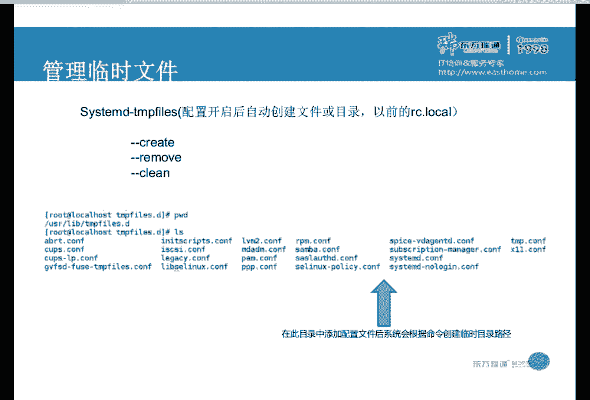

今天就这些内容。