# 红帽RHCE7培训课程：P8：使用Kickstart和图形工具自动化系统安装


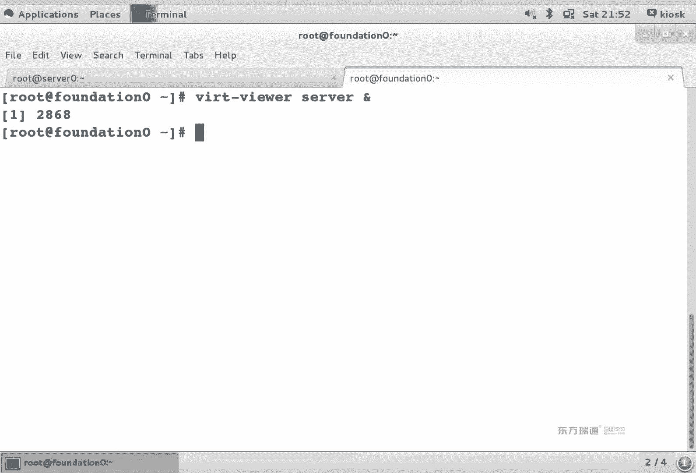

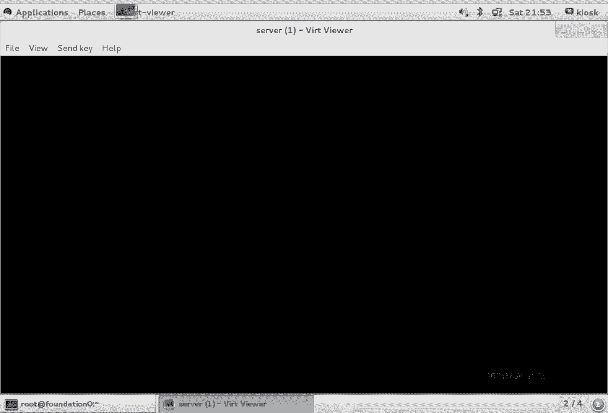

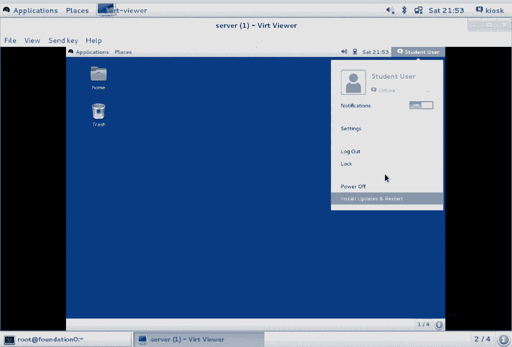

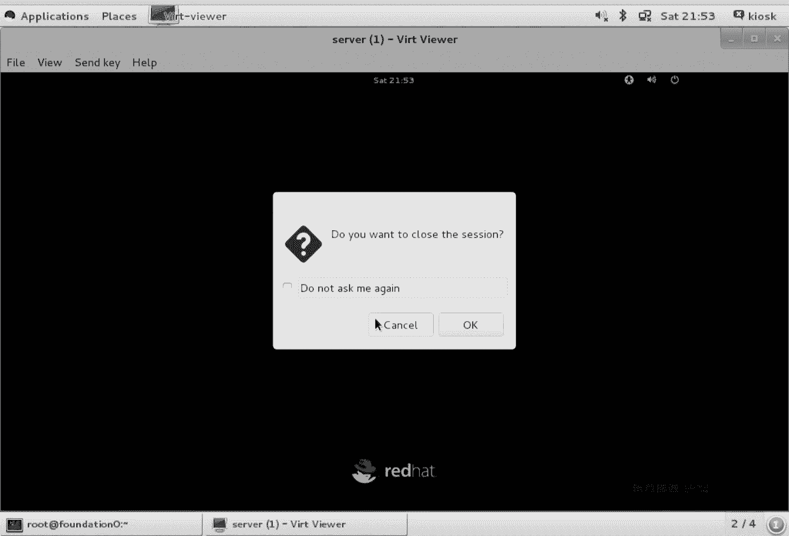

在本节课中，我们将学习如何使用图形化工具创建和编辑Kickstart文件，以实现Red Hat Enterprise Linux系统的自动化安装。我们还将了解系统引导和网络安装的基本原理。

## 概述：图形化Kickstart配置工具

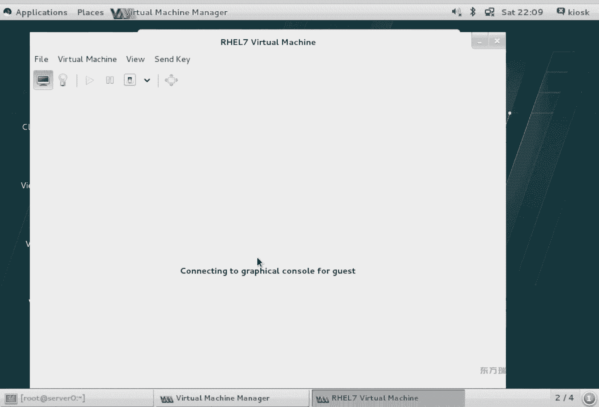

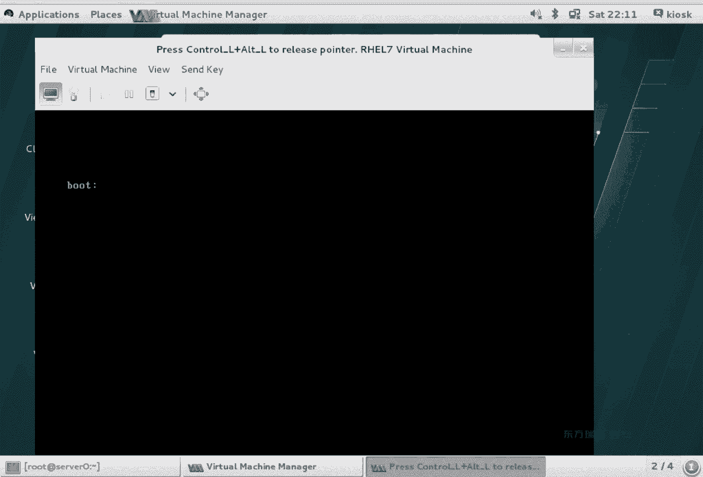

上一节我们介绍了手动编辑Kickstart文件的方法。本节中，我们来看看如何使用图形化工具来完成同样的工作。

首先，我们需要安装图形化的Kickstart配置工具。在RHEL系统中，该工具包含在名为 `system-config-kickstart` 的软件包中。

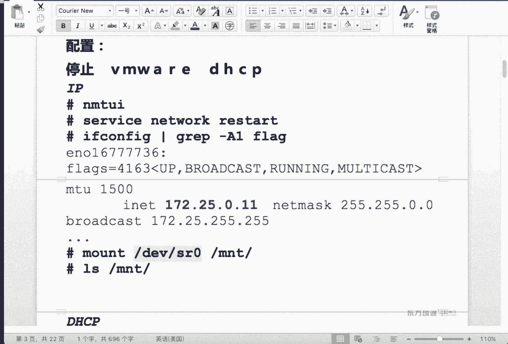

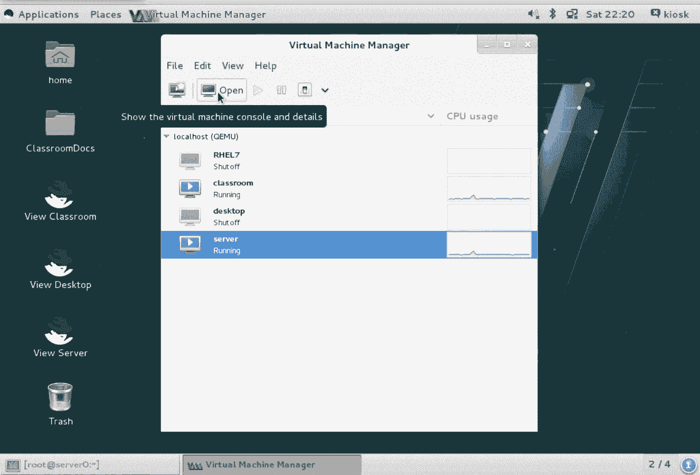

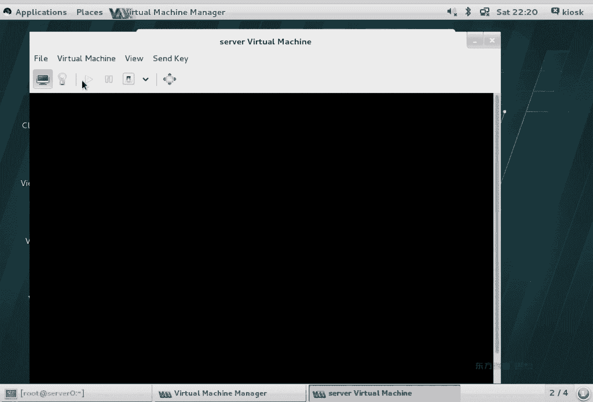

**代码：安装Kickstart图形工具**
```bash
yum install system-config-kickstart -y
```

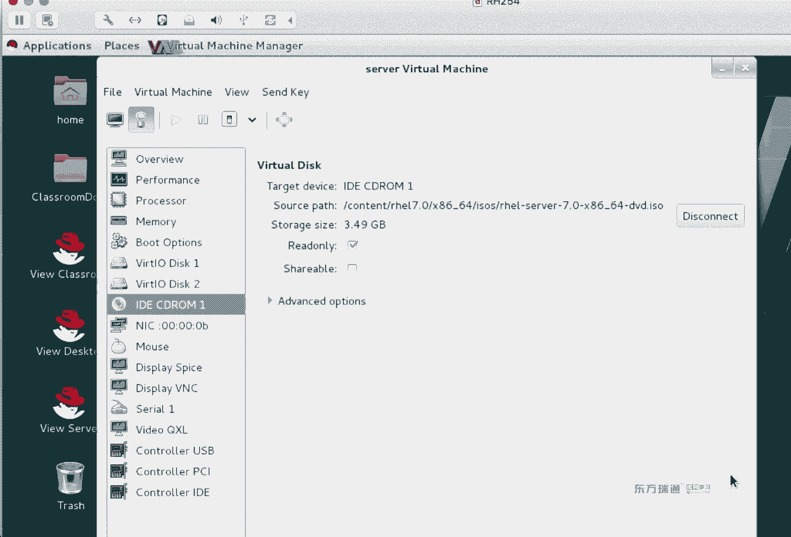


安装完成后，我们可以通过SSH的X11转发功能，在本地图形界面中运行服务器上的图形程序。

**代码：通过SSH转发图形界面**
```bash
ssh -X root@server.example.com
```

登录后，我们可以找到并启动Kickstart配置程序。

**代码：启动图形化Kickstart工具**
```bash
system-config-kickstart &
```

## 使用图形工具编辑Kickstart文件

以下是使用图形化工具编辑现有Kickstart文件的步骤：

1.  在程序菜单中，选择 `File` -> `Open File`。
2.  导航到Kickstart文件所在位置（例如 `/root/ks.cfg`）并打开。
3.  图形界面将文件内容分门别类地展示出来，包括：
    *   **基本配置**：语言、键盘、时区。
    *   **安装方法**：可以选择HTTP、FTP、NFS或CDROM。
    *   **引导装载程序**：设置引导设备（如`/dev/sda`）。
    *   **分区信息**：显示在文件中定义的分区、逻辑卷（LVM）设置。
    *   **网络配置**：可以为网卡设置静态IP或DHCP，以及主机名。
    *   **验证**：设置root密码（支持明文或加密）。
    *   **防火墙与SELinux**：设置状态（如`enforcing`）和允许的服务。
    *   **软件包选择**：如果指定了`%packages`段，可以在这里管理。
    *   **预安装与安装后脚本**：可以查看和编辑`%pre`和`%post`部分的内容。

在图形界面中，你可以直接修改任何值。例如，将安装源从HTTP改为CDROM，或者将root密码从密文改为明文。

修改完成后，选择 `File` -> `Save File` 将配置保存为新文件（如 `/root/ks-custom.cfg`）。

## 系统引导与网络自动化安装原理

上一节我们学会了制作Kickstart文件，本节中我们来看看如何在实际安装过程中使用它，特别是通过网络实现批量无人值守安装。

系统从网络启动并自动化安装，通常需要以下几个核心服务和组件协同工作：

**核心概念：网络安装架构**
```
客户端（裸机） -> DHCP服务器 -> TFTP服务器 -> 安装源（HTTP/FTP/NFS） -> Kickstart文件
```

以下是实现此过程的关键步骤：

1.  **客户端设置**：在目标机器的BIOS中设置为从网络（PXE）启动。
2.  **DHCP服务**：客户端启动后，通过DHCP协议获取IP地址。DHCP回复中还需要指定TFTP服务器的地址和初始引导文件。
3.  **TFTP服务**：客户端从TFTP服务器下载引导文件（如 `pxelinux.0`）、内核（`vmlinuz`）和初始内存磁盘（`initrd.img`）。
4.  **引导菜单**：通过TFTP下载的配置文件（如 `default`）定义了安装菜单，其中可以指定安装源（如FTP服务器路径）和Kickstart文件的位置。
5.  **安装源与Kickstart**：系统根据引导菜单的指示，从指定的网络源（HTTP/FTP/NFS）获取安装包，并读取指定的Kickstart文件，开始全自动安装。

**公式：引导配置文件中的关键行**
```
label linux
  menu label ^Install RHEL 7.6
  kernel vmlinuz
  append initrd=initrd.img inst.repo=ftp://192.168.1.100/pub/inst/ inst.ks=ftp://192.168.1.100/pub/ks.cfg
```
*   `inst.repo=`：指定安装源的位置。
*   `inst.ks=`：指定Kickstart配置文件的位置。

## 总结

本节课中我们一起学习了：
1.  **图形化Kickstart工具**：如何使用 `system-config-kickstart` 工具以更直观的方式创建和修改自动化安装配置文件。
2.  **Kickstart文件的使用**：在系统安装时，可以通过光盘启动菜单按`Tab`键后追加 `ks=...` 参数，或通过网络引导配置文件指定 `inst.ks=` 参数来调用Kickstart文件。
3.  **自动化部署架构**：理解了实现网络批量无人值守安装所需的完整链条，包括PXE、DHCP、TFTP、网络文件共享（HTTP/FTP/NFS）和Kickstart文件的配合。

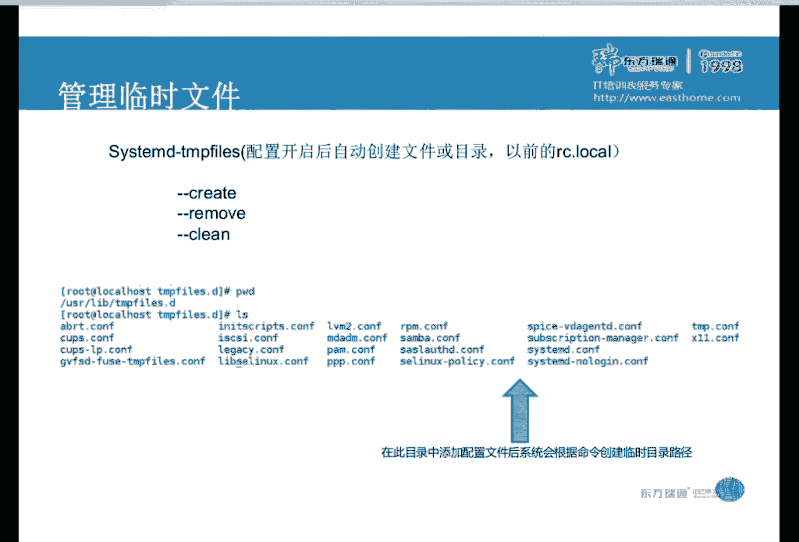

通过掌握这些方法，你可以高效地部署大量具有相同配置的RHEL系统，极大地提升系统管理员的工作效率。