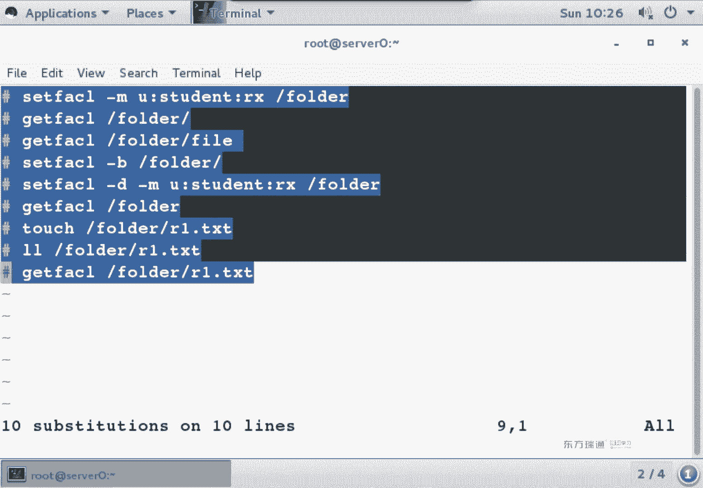
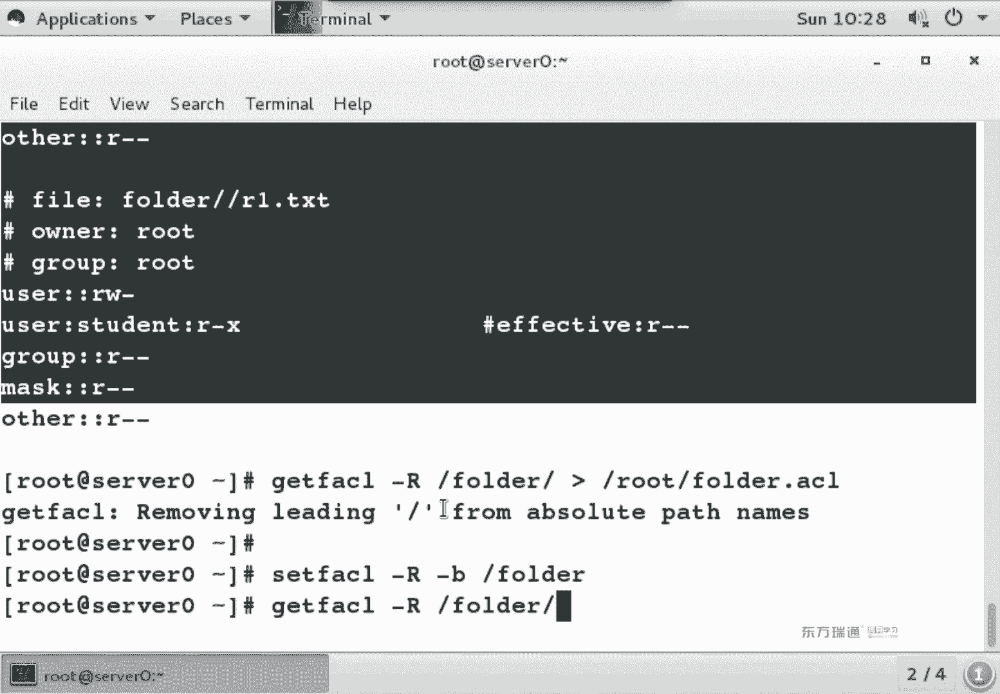

# 红帽Redhat RHCE7培训课程+RCHE7实战参考教程+红帽8.0教材电子版+模拟环境及辅导 - P9：3 - 16688888 - BV1zu41197p6

好，大家抬头，我们先来回忆一下昨天讲的内容。昨天我们讲的第一个知识点呢是cakestar。对于Kstar而言，要求各位同学掌握这么两个知识点。第一个。默认系统中会存在1个KS文件，存在于哪儿啊？

Right。跟住他目录下是吧，跟住头目录下，默认会有个叫个娜康达的一个。KS点CFG文件默认存在的，我们可以直接用它来修改。那当你装完了一个系统之后啊，这个文件会自动生成。

它里面的内容是你刚刚安装的系统都去做了什么设置，都会保存在这个文件当中。设置的内容。那既然文件存在的话，我们可以编辑。可以直接使用VM进行编辑，或者是通过一个图形的工具，也可以编辑吧。

图形工具叫什么名儿？System configure。Take a star。出形的工具。对于图形的工具啊，不要求大家把这个名备注，但是你得能查到他报名，报名怎么查呀？I。く。一。O吧。开个star呀。

你也不用背这个词，都怎么写，能记住几个字母就得了。用亚m list的可以来查啊，可以来查。那我们在使用gra命令的时候。要知道这么几点。第一个。如果我默认情况下呀，过滤是匹配的值，我想来过滤不匹配的值。

应该是干什么呀？让利。呃，远程壁纸。我这是。嗯，你要向地址发权利。老同学问我。一般情况下，咱们远程地址啊不会变啊，上次变原因呢，是因为之前那个账号啊，里面的人只能进来5个。Okay。g杠V呀。

那杠V它代表的是不匹配。不匹配人吃，那如何来表示空行啊？没章嗯。新刀了密刀了哈够啊。呃，那如果我还氧过滤不包含。井号的。怎么表示？好嗯。好几种写法是吧，考试的时候，他不管你到底怎么写。

只要最后结果对就行。只要最后的结果对就可以。因为在题中啊，他要求是说过滤出他要求的内容生成到一个文件当中。那我们是不是还要用个大于号啊，所以你到底是用管道啊还是大E啊，还是用小E，看心情来做。

只要结果对就可以。OK那，如果你要还过滤另外一个纸。我们可以用大E。打一管道。下个文件名。如果有路径的话，把路径也写上。当前路径下不用写路径。对于VM。VM最基本呢要求大家会三步啊。

第一个你得会从命令模式进入输入模式。命令模式摁什么进入输入模式啊？嗯は。嗯，I呀A呀O啊一堆是吧？实际上不止这些啊，还有啊那么我们在进入输入模式之后，你可以随意的来编辑内容。

编辑完内容之后是不是退出输入模式啊，哎什么退出输入模式。EC。最终输入模式之后，我们最终啊要保存你的文件，保存退出用的是。2号WQ叹号。强制保存退出。VI编N器最基本的要回这散步。那么另外一个呢。

在这个里面我们还用的比较多的。比如说删除一行。伊利。呃，复制一个单词。YW。呃。粘贴。嗯。白石复制哈啊批上粘贴。这个是用的比较多的。啊，再有。我们在VI兵器当中有上千行啊。就不说三千行吧。

100多行200多行。那这个时候啊我想迅速的定位某一个词儿怎么定位。嗯。斜杠。斜杠也要查它单词是吧？那一般情况下，你查这个词儿啊，不是说你想查的这个东西。我还想去查下一个用什么。N吧嗯用N。呃。

这是VI变器中用的比较多的几个操作。你要会复制会粘贴，会查找。有同学说那那个显示行号用不用啊？显示行号那个在实际工作当中啊，就看心情啊，看心情用不用都行。我们在上课的时候啊，经常给大家显示行号。

原因是因为我要给大家讲解，说看第几行，我们能迅速定位看同一个位置，要不然他一打开一个终端，打开个文件，默认二四行，那24行当中到底看哪行啊，我也不知道看哪行。所以说这个时候啊。

我们当一起看一个文件的时候，一般会加一个行号，或者是说在做一些这个编辑的时候啊。程序员的习惯都会看行号。那我们再来看框。对于pro而言，它叫做计划任务啊，计划任务，它属于周期性的计划任务。啊在C当中啊。

实际上如果非要说有难点的话，就是那5个星代表着什么含义？时间长了，老万了五个星代表什么含义，怎么查呀？我们有两种方法是吧？第一种是不是看一下文件的示例啊。第二种，他卖手册啊。如果你看文件设例的话。

看的是哪个目录下的文件。跟ETC一下吧，跟ETC一下框。那另外一个我们说话有个叫曼手串啊，慢几。啊五。好。两种方式都可以看到五个星，五个星代表的是。分1。Yeah。Yeah。哦。画面是你的命令吧。

那我们会发现呢。分时业周当中，他先不了了。没写是吧，因为大家想我们在看这个举个最简单的例子，你火车票上。火车票上写的时间是几点几分是吧，写秒了吗？没戏，你再想想你看那个电影，看电影的时候。

我们换了一张电影票，电影票上有秒吗？没有吧，就是现实生活当中啊，虽然不有秒这个单位，但这个单位是给。不正常的人用的不是给大家用的。什么叫不正常的人呢？比如说刘翔啊。飞的很快是吧？哎，不对，跑的很快是吧？

要蹦的很快。给他们用的那是秒给他们用的，现实生活当中没有人有秒啊，所以说计划任务当中啊，最小的单位是分啊分几点几分。三时日月中。呃，那么在分之约轴当中啊，我们有几个数是从零开始的，有几个数从一开始的。

从零开始的比较多，所以说我们记一个比较少的，谁是从一开始啊？分时月周，谁从一开始？日月是吧，有个叫日月神教。他们从一开始。Okay。这是上次的讲的内容。啊，给大家列出来呀。

crarowme table是考点。啊，多练哈考点内容多练grape考点。好的。两个题。啊，对于VI编器而言呢，它到底交不交考点呢？这看你心情啊，看你心情，你要用的话就考点，你不用的话，就不是考点。

那在那那个时候用那个系统当中啊，我们使用比较多的一个编辑器，就是VIMVM。当然了，在实际工作当中啊，用户问的最多的一个问题就是为什么我没有VM，我只有VI。这包没装全吧，VM几个包啊。那我们两个。

三个包三个包VM三个字母嘛，三个包。没有。为什么？啊。对，有对。诶。VM当中啊有一个叫可视模式，visel模式。vissel模式干什么用的呢？举个例子啊，在实际工作当中啊。当你编辑个文件的时候。

我们是不是经常可能会去做一些复制的操作呀？用鼠标的话是不是这么来选？鼠标大家都会有按住左键一拖一拽就完事儿。那如果你是用键盘的话，想用类似的模式怎么办呢？摁一下V。大家看一下状态蓝是不是变成猥琐了。

按方向键。比如说我现在是不是选了几个单词啊？现在在外。刚刚复制了两个单词，你随便找个地方呢P。能看到吧？这个vis缩模式啊，它的功能实际上就类似于鼠标选择。类似于鼠标选择，就这个功能。

我们在之前讲没讲过一个叫VY呀。有印象没？V就是进入visso可视模式。那默认情况下，我进入可视模式之后，光标是不是只选择了一个字母？所以说当你Y的时候，是不是就复制了一个字母？这叫VYVY是这么来的。

VY forvis可视模式啊，那为什么这个模式没有给大家强调呢？因为一般我们都有鼠标是吧？嗯，一般都有鼠标，而且没有鼠标的话，这个功能啊。啊。用命令是不是都能实现呢？比如说你拿鼠标选择了两个词儿。

是不是要复制两个词儿啊，那我可不可以这么来做？斜杠C。光标是不是定位到这个词儿上了？复制两个词儿什么？说这一个词叫什么？YW复制两个词呢。2YW。这就复制完了，然后你要你还贴在哪？

比如说我要粘贴到第二行，冒画二是不是到第二行了，粘贴P。是不一样啊？は。能理解吧？就是说你可视化模式这个功能啊。呃。个人认为哈这个。我是用的比较少，为什么呢？大家看同样一个操作。NRV可视化模式。

你是不是乐乐乐乐乐乐乐。然后再买呀。200W手语的快一些。能理解吧，你要乐半天。这个键盘呢跟鼠标还有点区别哈，你看你键盘上方向键，你怎么移动？乐乐乐乐乐。你拿鼠标的话。这跟我们去玩一些这个射击类游戏。

比如说CS你用键盘也能去打枪，你用鼠标也能打枪，那用哪个比较习惯呢？能理解吧？你当然会选择一个快的方式。你如果用键盘去瞄准的话，你可能还没瞄准，就先被别人爆头了。但拿鼠标瞄准的话，可能鼠标快一些是吧？

这就是看你觉得哪个快递来的。之所以没有强调微缩模式，是我觉得2YW比较快，3YW比较快。那什么时候建议大家用微缩模式呢？好几个词儿。看到没？好几个词的时候，我说不太容易数数了。这个时候你用鼠标选上得了。

当然你要去用微缩模式也行啊，看心情啊，这个还是看心情的事儿哈，到底有哪个。OK这是昨天讲的内容。那回头回来，我们来看今天的内容。もし。在第四章当中啊，还有一个叫做s d time file啊。

这个命令啊也是新出的命令。在企业版期当中啊，是不是多了一个叫system control命令啊？用一象吧，然后有一个系统第一个进程，原来呢是IIT，现在变成了system d啊。

stem D它们的区别是什么呢？呃，st D啊，它在企业版器当中替代了IIT的功能啊，替代了IT的功能。它最大的优点呢就是一个模块化的区别啊，模块化。原来在切之前呢，系统启动的时候。

有一些经常会有些依赖关系。可能由于依赖关系的原因呢，这个系统出问题啊无法启动无法启动。那么到CtD的时候，它解决了这个问题。举个最简单的例子。我们举个类似的例子啊。我们以前呢在安装包的时候。

你可能会遇到这样情况。我安装A的时候呢，它依赖于B。他说你得装B，当我装B的时候呢，他说你得装A，那你说你是先装A呢，还是先装B呢？见装谁呀？遇为到以前这种情况啊，我们只能一起做嗯。要不然都转不上。

能理解吗？这以前呢就一个软件包的依赖关系。A依赖于B，B又依赖于A，你装A也不行，装B也不行，你知道把AB起装。在用RPM的时候，后来有y么之后啊，它是不是自动的呀，依赖什么自己装了。

你也不用管闭眼家回车就得。啊，stt这条命令啊，它可以来创建一些临时文件，临时目录默认在系统中本身是不是有个t文件夹啊？那是默认的文件夹，如果默认文件你不想用的话，呢，也可以对它命令create呃。

create创建一个，可以 remove，可以清除，这是它的功能，创建一个临时路径。啊。了解就可以了啊。那我们看第五章。进程的优先级。那首先来说一下呀，这个为什么要定义优先级。为面定过去。

想想我们每天的工作，大家会发现呢，每天的工作有一堆的事儿。正常情况下，每天会有一些固定的工作，但是有有一些临时的工作。那么临时的工作是先干还是后干呢？这个就是看优先级。重工药紧不紧急啊紧不紧急？

在系统当中也是一样的。对于同一台服务器而言，你CPU内存和硬盘，还有网络相应的资源，他们的值都是固定的。那么到底是优先来处理谁，优先来处理谁？比如说我当前这台服务器啊主要是做外部服务器。

那我是不是应该让阿帕西服务优先呢？优先级要高一些吧。优先级高的原因呢是告诉系统啊，当这些程序都在运行的时候，我尽量把多的资源给谁用。或者尽量先处理谁的请求，这个要优先级。

就像我们平时在工作当中啊会发现为什么要跟同事的关系搞好啊？为什么呀？因为跟同事关系搞好了之后，你会发现这么一个情况。当相同的事情啊相同的事情。如果要优先处理的话，肯定是先还跟这关系好吧，对吧？

这叫优先处理系统当中呢也是一样的啊，优先啊优先。这章当中主要两讲两个命令，一个叫nice，一个叫n。油烟机。对于我们的优先级而言呢，它有个范围啊，-20到正19。那么哪个数是最优先呢？嗯。

买个数是最优限。是负的最优先还是正的最优先？哪个优先级高啊？负的优先级最高是吧？为什么呢？举个例子啊，比如说你手里您手里面有有19万。你说里有有19万。那有19万的话。

你可能考虑说哎跟媳妇儿去旅个游啥的，是吧？来，如果你手里有付20万的欠条。你会考虑去旅游吗？我会考虑优先弄弄点，看看去哪骗20万过来是吧，先把钱还了。好，这个是优先级，哪个优先啊？R十0要优先一些。

用PS命令可以来查看进程。那我们可以用1个AXO啊，AXOA代表什么呀？A和X都代表所有的啊所有的。那么O呢？包不代表选项。如果直接用PS的话，你会发现它会列出很多列。那我们在这个实验当中呢。

只想看三列，你只想看竞态ID，看命令，看优先级，那你可以XO啊AXOPIDcomnice。如果还想排序的话呢，就st。还想排序的话，就s。按什么来排序啊，你可以来指明，按什么来排序。

那我们可以来看到在这一页当中啊，它提示到了1951。晋城的优先级是各不相同的。晋城的优先级各不相同。那如果想修改优先级了。我们有两项命令，nice re nice修改优先级的话。

我们用的是re niceice命令啊，re niceice修改优先级。就说这个东西已经运行了，用ren，你可以把它优先级给改掉。那什么时候nice呢？这个程序还没有运行过。还没有启动。

我想直接以某个优先级来启动它，以某个优先级来启动它。这他俩的区别。在这个里面唯一一个要提的是什么呢？就是个夫妻。--7正常情况下一个减号，它后面是不是代表个选项啊？这个-7呢是杠N的值。能看懂吧。

他俩是给我说一遍啊。杠N后面是一个具体的值，这个值的取值范围是负多少到正多少了的。不是是多还到1。付多少到挣多少了呗。不是对。啊，过20到正十9是吧？那为什么到正19呢？因为有个零是吧？零是正数是负数。

这个领面它来的是正服啊。O。啊，这个是优先级如何来定义？那对于普通用户而言，他只能降低某个进争的优先级，它不能提高啊不能提高。对于管理员而言呢，随便啊，管理员看心情吧，你高兴提高就提，高兴降低就降。

这管这个。有。你看一不小心第五章就讲完了是吧？啊，第五章讲了几个命令啊。两个命令，一个叫nice，一个是nice，他们都是来更改优先级的命令。唯一的区别呢就是看进程运不运行。首先呢我们先来看一下PS。

如果直接PS的话，你能看到几个进程啊。三个吧，只能看三个这是那PSA呢。5个了是吧。那PSX呢？哎，一堆吧。不要想看多少个的话。95个是吧。PSA。嗯，7个。能看出区别吧，就是AX显示是最全的。

显示所有镜头AX。那么你对这些镜头而言呢，如果你直接PSAX的话。有这么多列，但是像什么状态呀，终端呢，我现在不感兴趣，我也不感兴趣它启动了多长时间。我是不是只感兴趣进去ID。命令还有优先级啊。

我就这三项感兴趣。那这个时候呢，我们加一个O。感兴趣的是PID。还有什么？Common的。还有什么？nice you天纸。一堆吧。在这个优先级当中啊，你会发现唉。零。C他门第一对焊机是多少啊？

0啊从零开始啊从零开始。然后下一些这个移算机复数K hyperper这啥呀？帮助是吧。KB lock的。键盘吧。键盘锁。你看这个负优先级最高的呀都是一些比较特殊的镜头啊，比较特殊镜头。O。

那现在呀我想去看一下我自己的进程啊。我们来看个例子啊，来看个例子。如果你直接看进城的话呀，看一堆。啊，我就看这么两个得了哈，要么内容太多了啊。😊，看当天用户的进常。啊，有这么几个。

大家可以看一下我拜世的进城啊，默日几啊。零吧，那我现在想把这个优算级改成呃-20怎么改啊？nice，然后呢。答。20后面写的是他的金ID。这句话是个提示是吧？原来是零，新的是-20。这回那你再批一下。

大家会发现呢，哎你拜师的优先级是-20PS的优先级是多少啊？也是-20，为什么呀？因为所有的命令是不是都在拜事下运行啊？拜事相当于一个平台吧嗯拜事相当于一个平台。所以说你在改优先级的时候啊。

如果你改的是拜师，它下面的所有命令，优先级全是-20。全有写啊全有写。Okay。那你想把U先机改过来呢？😊，那是看下。这个写几啊0。来确认。变回来了吧啊，油先机。OK那现在我想启动一个程序的时候。

直接把这个先级定义为多少。我们首先来执行个命令VIM。命令执行完之后呢，我ctrl C。大家看一下默认情况下，我们执行的命令啊，它优先级是多少啊，都是零吧啊不高不低啊。默认用户执行的进程都是零开始。

就当你不定义的时候，进程默认都是0。但是有些跟系统非常重要的进程，默认音先机是不是都发时啊？就非常重要的几成，默认都-20。对，对于我而言，这些金额是一样的。所以他们级别一样。

那我现在呀我觉得这个VM比较重要啊，VM比较重要。我把VM怎么拉回来？😊，然后。啊，FG。啊，我。又拉回来了，我正常退出。现在呢。依然是这条命令。我在这个命令前面呢多了一个叫nice。港文。副食。

最大命令什么作用啊？这个建议在。はい。一回头之后，你会发现还是VI是吧？还是正常编辑。ok我们再踢一下。能看到吧。就是说如果一个进程啊，你觉得很重要的话，那么你把它的预算机可以直接定义好啊。

用多少来执行。执行的意见是这个程序啊，只不过系统会尽量把多的资源呢优先给他用啊，优先给他用啊，这是PS它的作用。Nice， re nice。呃，现在我把VI是不是正常结束啊？正完结束，FG拉回来往后球。

OK吧，就是nice renice的作用。那我们在维护服务器的时候，不定优先级行不行啊？直接进场就默认一先机去跑是吧，我也不管可不可以。也行是吧，不是说必须改的，但什么时候必须改呢？

就是说你这个服务器上啊跑的服务很多。但是你这个服务器主要是做什么服务的，肯定是有一个主要的服务吧。它的对像级尽量高一些，别的服务啊可以不用动。Okay。

这段内容啊讲的就是优先级啊，nice renice。这些选项啊如果想查它的含义的话，可以直接用慢手册来查。慢手再来查。或者说。我们在尝含义的时候呢，大家应该养成个习惯。当遇到新选项的时候。

如果你卖手册查完了之后，你最好用相应的命令加相应的选项，分别执行一遍，看一下他们的区别啊，帮助理解啊帮助理解。AXO啊EF。呃，我们在这个时间当中啊，我给大家用的是EO来演示的，是吧？要不内容太多啊。

看着有点乱，我只看自己的进程ID命令和nice值。然后呢，我们可以用renice命令来修改优先级。我这个1611举的是哪个例子呀？拜师吧啊，我就是拜师来给大家举个例子。修改完优先级之后呢。

我们再次来确认。然后呢，再把U算机给改过来。晋程如果在运行的时候，可以用renice直接来修改优先级。那么今头如果没有运行的话，怎么办呢？在之后啊，我们又去做了一个实验。看一下当前优先级。

我直接用VM编辑了个文件。然后呢，用cttrol加上Z。是是放后台挂起了呀。挂起来之后，我是不是可以再次来执行命令？你会发现用户在执行一个程序，执行个命令的时候，他默认优先机度是几啊？都是零吧。

不高不低啊不高不低。和大家起点是一样的那这个时候呢，我用FG给它拉回来。FG拉回来之后，是不是冒号就是叹号正常退出不保存哪，或者你高兴的话，保存也行，看心情。嗯，然后我们用了个命令叫nice。

我在执行这个程序之前呢。我觉得这个程序很重要，应该优先让他来执行啊，优先尽量多多资源给他。定一个优先级负1。当然你要觉得这个不是很重要的话，是不是给他给弄成正式也行啊。到底是正婚复输，看你心情。

要知道付输优先。啊，负数有些。确认。FG拉回来。退出的话依该是冒号Q叹号吧。啊，这是micemice。Okay。这第二门课讲的很快是吧？为什么呢？因为一章就一条命令。我想讲的慢也卖不了。第六章重点。

第六张重点ACL。大家记不记得我们在之前呢讲过一个叫。LS杠L。好。都代表什么含义都会吧。第一位代表什么？门店类型。这9位呢。权心啊。这点儿呢？这点也代表权限。点是没有其他人的权限。

或者说叫没有具体人的权限。什么叫具体人呢？在微软的系统当中，NTFF分区里面，我共享的时候，我可不可以说公诉给汤姆什么权限。杰rry什么权限，可以吧？你看我们在类那个字里面上来之后。

我们就开始讲如说这个文件所属的root用户有读写的权限？root组有读的权限。阿泽多的显鲜。汤姆和杰瑞现在是不是属于阿哥？但是我现在想让汤姆和杰瑞有不同的权限。他们我让他有读写。尖锐我要他有独和执行。

那你怎么做呀？这个时候就得用FACL文件的访问库制列表。然后呢，你会发现这个位置多了个加号啊啊，多了个加号。如果看到点儿的话，就说这个文件只有用户组和其他人的权限。如果是加号的话呢。

就说明有FACL的权限。ACL什么意思啊？访问控制列表访问控制列表FACL呢？文件的访问框列表，换句话说，还是文件的权限吧。在Lux词当中，文件的权限有两种方式来修改，一种是tmod。

一种是set FACL FACL叫设置文件的反护分列表set是什么意思呀？设置那ge呢？查看。好，这张就这些内容。这两条命令set FSLge FSL两条命令。O。啊，这个代吧什么来着？😊。

大小单位是什么？🤧。字节是吧？嗯范围是字节。如果你不敢肯定的话，我们可以加个什么选项？H。没什么变化，单位就是自己。要有变化的话，应该什么K呀、M啊，OK吧？😊，这个呢。时间。什么时间？访问访问。

最后一次修改的时间不是访问时间啊，修改时间。什么叫修改时间呢？你编辑过。保存过一踏过，这都要修改时间。冇系吧。最后面这个呢。文件名吧文件名。你个。什么修款时间说就是归你。摸一下。你看那个玻璃挺脏的。

你摸一下，是不是修改了呀？摸一下怎么摸呀？他吃是吧。他是翻译中文什么意思啊？不是戳，是摸的意思。它是它有两个功能，第一个功能就是创建一个节点。或者是叫创建一个大小威零的空门家吧。

第二个功能啊就是更新文件的时间戳。来功能哈。O。那，下面呢我们来看一下这张的理论部分。先在面有个大概印象，经常讲什吧，我们再来看具体的。因为在学习任何和新知识的时候啊，你要不先知道这个东西大概干嘛的。

你在学的时候就你不知道听什么。就下一个目标啊，这章讲的是具体的权限。两条命令。呃，首先看一下权限呢，我们的权限是不是就三个呀，读写执行吧。就三个RWX。

我们在之前讲没讲过说文件和文件夹都写执行是不是稍有些区别呀？稍微有区别。如果文件夹你要有写权限，必须得有什么权限？执行权限你得先能进去才能写。所以说考试的时候，如果题中要求的说这个用户有读和写的权限。

但他们一说执行是吧？你不给他执行能写吗？写不了，所以说你得加上执行权限。换句话说，你也不用去考虑说我到底加不加执行。我们看现下，权限改完了之后，你输到那个用户身份去toash一个文件，发现写不了。

是不是就没有写权限了，它会提示你进不去，然后你再去给他设一个春片也可以。不管用哪种方式，最终我们都是用具体的命令来确认。按照题的要求，提说他能创建文件，你是不是就to一下啊？

I call大于号是不是也可以啊，都可以创建文件。那如果说题中讲的是能创建文件夹，你说没磕BR啊。用谁的身份输造某个身份，然后去干什么都可以。对于ACL而言呢，它主要的功能就是力度啊力度。什么叫力度啊？

我们说其他人呢这个范围是不是太广了呀？但也要说具体某个人。这个是有可能具体点具体的权限叫FACL。呃，首先来看一下这个提示，看到这个加号了吧。如果你看到加号的话，这个代表是有FACL权限。如果是点。

只代表是是user group和阿权限，没有FSL或者说没有具体人的权限。Use the roof other啊。用户组其他人，这个是我们9位权限。那如何来查看呢？get FACL。

我们来看一下这条命令。在看这条命令之前呢，首先我们来看一下。root用户root组。读和写毒读。这是他现在的权限，我用get SACL来看。井号代表什么含义？不是。朱释他说所有者是谁，不如不是谁。

那这个注释是不是就看着他呀？一样吧，然后看上面fi。是不是看得出他呀？那为什么这个写的是相对路径？他不写绝对录角。为什么写相对路径？不写决对路径？但会发现呢，他说把决对路径的根给干掉了。这词啥意思？

abololute这个词就叫绝对。我们把前面的立ing，最前面的根给干掉了，把绝对路径改成了相对路径名。他之所以这么干的一个事儿原因呢，我们在后面可以把你的这个权限备份。

FACL这个权限大家想我服务器啊，配完了。配完了之后，这个权校我觉得设挺好，是不是想备份一份啊？等哪天机器出问题了之后，我是不是可以重新创下去文家，把权益恢复就完事了。不用每个权限再重设一遍嘛。

权限也支持备份。那么你权限在备份的时候，它备份的都是相对路径。相对路径为什么要备份相对路径呢？因为如果你备份的是绝对路径的话，你一直行一恢复全恢复到绝对路径下了吧。有可能你是你不想干的一个事啊。

所以说我们备份的时候用的相对路径，这个是个提示。大家记不记得我们在之前啊用过个踏命令？他明令在打包的时候是相对路径，绝对路径。是不是也有这句提示啊？他也把决斗路径给干掉了，保留着相对路径吧。也是一样的。

为什么呢？因为它在释放的时候，他是不怕释放到绝对路径下，把你重要的文件给覆盖掉了呀。他担心这个事儿，所以说我们如果是跟备份有关的思路，都会把决对路径干掉，只保留相对路径。路径这个事要注意哈。

这句话是个提示。然后呢，我们看下面这个内容。你看上面权限跟上面权限一不一样。一样一样一样的吧。就说在当前呢，你们geFSL和LL看的结果是相同的。默认纸。O。回过头来，我们继续。

ge FACL点点代表什么含义啊？当前目录是吧，是不是看当前这个文件夹的权限啊。文件夹了，谢谢。这个里面写了一堆。那我们的文件夹会不会写这么一堆呢？不会。为啥嘞？看文件夹要加个什么？胳吧。嗯。

Get FL。都把绝对路径干掉啊，当前看到哪个文件，所属的用户和祖国。所属的用户合伙的权限RXRX。啥都没有啥都没有。一样的吗？文件夹也可以，我们看文件和文件夹是不是都是用这套命来来看，用家拨吗？不用。

但是getFSL是不是在家得呀？能看出区别吧？get不用加DLS你得加个D就这区别。O。那下面我们来看一下设置权限。下面呢讲了一堆选项，其中你必须会的选项是摸。

mod叫modernifymodify什么意思？修改你设置一个权限，最终结果是不是就修改了一个权限？嗯，能理解吧，你把权限设成了谁有什么权限，这个叫修改。你把权限某个人的权限做了修改，还叫mod。

某个人权限增加了减小了，删除了，我们都管它这往猫fi。那么如果你把具体的这个权限给干掉，那么用了什么呀？X。VIP音系统X什么作用？删除一个字母吧，光标所在字母X是删除的意思呀？

在另那个词当中删除有两个字母，一个是X，一个是D。一个男个是一个。OK那我们看一下他这个里面地是干嘛的呀？是不default呀？默认值啊，这个地是默认值。什么叫默认值呢？

我们在之前讲没讲过一个叫做SGID。SGID干嘛的？我在一个文件夹上设置这个SBAD结果是什么？电话过了。只要在这个里面新创建的文件，他的所属组是不是变成了SGID那个组？是不是也相当一个默认值啊。

新创建文件的所属组的默认值就是SGID的组设定一个默认值。那么我们的权限呢，如果你想继承的话。一个文件夹正常情况下在里面新创建的文件，它会继成文夹权项吗？个路由会不会？会是吧。

但是那个继承的是什么权限呢？用户的权限，谁创建的文件是不是属于那个用户那个组？那如果想继成文件夹权限，我们用desalt来设置。被放 the。O那么B呢B就是bllock。布兰克。

它代表是清除所有的XL权限。你可以把它理解成是清除那个加号LS杠L的时候啊，后面那个权限是不是点儿啊？如果你设置了FSL群，就是给你加号了，它里面可能有一堆。这堆你想一个一个删，你是不是一个一个叉啊？

还差好多B的话就全叉了就这么个作用叫奥。叉和B的区别是一个还一堆。啊，或者全部他俩区别。嗯。K呢叫做sco啊sco，你可以把它列成模板啊，预设的权限。R呢。呃，这个会是吧，总看着跟文件夹有关的。

是不是低规呀？P规。ok那下面我们来看一组示例啊。大摩。も。修改。它的格式呢是U冒号名冒号权限。又代表什么？用户。右个用户所具有什么权限？那这码号呢？group组组什么权限？这个。

这两行它的区别是什么呀？うん。啊，是道。完了。看不出区别是吧，因为它没有区别。那如果你非要说有区别的话，就一个叫添加，一个叫修改。只不过修改了之后，值没变，跟没改一样是吧？啊，那下面这个呢。🤧嗯。

哦谁呀？嗯。阿朵阿朵有名吗？没有名减号代表啥意思？王有。占位是吧，啥权限都没有减号。那如果你把这三行都连在一起写的话。也行是吧，级别相同，什么符号分割。逗哈峰哥。ok那下面我们来看一组示例啊。

帮大家理解。首先呢我们去摸个文件出来。他是不。啊。我们就创那个文件夹吧。😡，然后在文件夹下摸个文件。对。嗯。嗯。他们权限能看到吧。默认文件夹权限root创建文件夹，它的权限是755。创建的文件是644。

属于root用户root组。OK吧，之前讲过是不是有叫U mask值啊，权限繁码777减去Um值。666点U骂40文件和有文件夹，它的权限为什么差个111啊？他们执行嗯，我们可以从两方面来理解。

文件夹创建必须得有执行权限，因为得进去是吧？不进去的话，这个文件夹创建没有意义啊，创建没有意义。文件夹必须有执行权限。那文件为什么默认没有执行权限呢？文件为什么默认没有执行权限？你。因为文件的权限呢。

如果有执行权限，它是不代表脚本了。在windows当中，我们是不是用扩展名点ESE点com点BAT呀。或者点VBS都是可执行文件。那么在linux当中，它没有扩展名的概念。

扩展名我们之所以写什么踏点JZ呀，点TIT啊，是为了按照你们windows的习惯。能理解吧？按照windows的习惯，我们来定义的，或者说在操作系统当中，不管用的是哪种操作系统。

操作系统当中已经明确的定义了点TIT是不是就文本文件呢？这叫文本文件。所以说我们的习惯啊我们的习惯就这么来做。当然你就给他起名叫什么。点MOV啊当记事本用也行是吧？VM1样的打开。う。O。

那下面我们来设置个权限s FSL。到M。modelify修改use。Studdent。我们先跟十6的一个什么权限呢？我想给他一个。😊，读写执行的权限。在哪个文件上呢？Fer。报到是文件夹是吧？然后。

我先用L莱杠LD来瞅一眼。泰号L这个省事儿是吧，不用再敲一遍了。大家会发现这个位置就变加号了。当你看到加号的时候，要用get FSL来看get FSL。这些内容没变过。

user group other也没变，多了几行。棒。多了几行。两行啊多了两行。ma斯克youma斯叫反嘛是吧？那mus斯叫什么？😡，叫掩马。叫亚马。我们在PIP的时候。

是不是有个叫nike mask网络亚马啊，这个叫权限亚码。O。😊，但家会发现这两个权限是不是一样的呀。因为他们实际上生效的权限呢是用mask语音算语出来的。运算就乘出来的哈，1乘以0都得0啊。

0乘以任何数都得0哈。这它的权限stdent有读写执行。okK我们来验证一下。呃，我们在刚刚啊看权限的时候，大家会发现。如果你光看阿er的话，其他人说没有血屏线。我输的丢的。Fer。

 student点3。那写吧。好那写吧。这叫具体的人的权限啊具体人的权限。你光看加号是只能看到有FACL权限，但具体什么权限不知道，得去get。geFL在企业版7当中啊。

或者说linux里面有好多的命例设置全叫赛，查看都叫get。回忆一下我们在之前呢讲了个命令啊。设。设置启用NTP那个命令了的。好的。time data control，然后呢s NP有印象吧。

然后我们在后面讲SE类那个词的时候，还会讲s get命里头。啊。会看到好多醋。在讲设置默认运行级别的时候呢，还会set get。设置查看。规律啊规律。O。结束。那刚刚呢我们修改了user的权限。

那下面我们是不是想修改组的权限呢？啊，修改组的权限。S FL。修改的话是什么？还冒得坏是吧？组的权限。妈文是不是搁B有组啊？你想要Vvo组有什么权限？嗯。那你说一个。我最终想说的这文件夹上。再见。

我们就啥权限，你说吧。文件夹上如果要设权限的话，你如果想让他用，是不是得有个执行啊？你要不想让他用，没有执行，你就随便写。能理解吧？如果想让他用加执行。比如说你想让这个六组有读和执行的权限。做完了之后。

我们用盖台ACL来看。又多了一行吧。组有多何实行的填限？OK那现在问题来了。😊，stuten他这个人呢。他属于。没有书。那现在suden他应该是什么权限？好点。最丈。能不能写？叫。哦不道。S1点CD。

那写吗？为什么能写呀？为什么？是面。嗯，单独配了呀，那他属于未有所啊。正常情况下，我们讲权限不说取小吗？权限。正常讲权限都取小啊，最小的权限是什么取？但这个里面他为什么曲别太大？或者说他取的不适大。

他是按什么顺序来走。我在其他权量大优优先。啊，那个你们思路是差不多哈，我来说一下，咱们在之前呢讲。user mode不对， change着mod的时候，是不是讲到了权限了？讲权限的时候。

当时我说了这么一句话，我说。呃，从前到后匹配这行。什么叫从前到后啊，先用户再组再aser。能理解吧？而你在这个里面呢，我们先看的是student用户，有没有这人有student的话，有root的话。

是不是人呢？走人的权限？那么没有这个user。比如说你又弄了个汤姆用户，属于vivo组。但是你没有设到他姆用户的权限是吧？那么他都组的权限，先用户再组再其他人。还是那句话，从前到后匹配这些。能理解吧？

再强调一遍哈，虽然没给你们写啊，但这个是思路。你想你在看权限的时候啊，是不得是先看user，再看group，再看user呀。你看的时候也这么看，权限应用了，也是这么应用。😊，从前到后匹配执行啊。

Okay。回头头来。呃，组的权限我们也会设了，是不是还要设other的权限呢？小阿子的情形就特别有意思了啊，看一下有意思的哈。现在我去干一个事儿。啊。St X A L。杠M说白吧。阿er的权限。

因为阿er没有具体的人名啊，冒号冒号中间上不写空的。我们要给他一个。读写执行。啊，什么都不给是吧？あきまたこれ。说完了之后。再看这个位置。变没。唉，这个位置如果变化的话。我是不是用chmod也能改呀？

现着modote是不是也能改这个权限？考试的时候呢，有这么一道权新的题，他说让其他人什么权限都没有。你有两种方法，第一种我就是用这套命令来做。第二种用青春mod的。这猫豆怎么做呀？包什么。O等于啥？

全都有。你可以减减剪。都可以减。一样是吧。这没变，就这套命令和这套命令结果是一样的。就考试的时候，这道题是两种做法，你到底用哪种都行，反正你改过来就行。他不管你到底怎么改，就拿牙。

你用牙咬能咬过来也对啊，考试的时候不管你到底怎么改啊。😡，哎，我遇到过最厉害的一个老师啊。那为什么管他要最厉害的老师呢？因为他考试他这么考的。他旁边坐的另外一个老师答的比较快。然后呢。

他把他的键盘呢给另外一个老师。知道啥概念吧。啊，然后他就很容易的通过了人证。结果拍啥不会。考试的时候啊，就是如果考官很松的情况下，就有可能会出现什么情况啊？替考是吧啊，这属于替考。但是尽量不要把这个。

这个。尽量还是自己会比保险是吧？万一你旁边这个人儿。时间刚刚好能做完自己的，你还来打搅哦，打搅别人，这也有可能两个人都不过，是不是尽量自己会？而且对于类那个私人证而言呢，相对而言比较简单啊比较简单。

前提是你练了。当你练的很熟到之后啊，你就会发现越练越简单啊，越练越简单。为什么呢？难者不会会者不难呢。这个东西当你真正掌握了之后，不管题怎么变，你就发现哎还考这个知识点啊，还考这个知识点。Okay。😊。

呃，下面呢我们再来看一下，如果用命令把它们放在一起来做的话啊，这个他确认一眼。盖开CL。看一下阿。OK吧。那你现在想让。这个权限同时把血管的话，我们可以这么来做。Set F AL。杠M右边，我想让s等。

具有独何执行的权限，逗号，我想组冒号如。啊，未有素。有。有如何执行的权限？逗号。我想阿这个。由杜贺执行的权限。放歌儿。然后forther。哎，他说什么呀？他报了个错。跟谁有关呢？跟M有关是吧。

说我命令没错啊。啊，跟M有关，那我们瞅了一眼。他说在第25个字符附近有问题。什么叫25个字符啊？1234567891011121314。1516171819202122232425。啊。这时金吧。

在附近能看出我啥问题吗？不是么。啊，不是等号啊。应该成个符号吧，号啊冒。妈妈。能看到区别吧？这个系统啊，你在执行命令的时候，它会提示你大概哪个附附近，注意这个词儿啊叫ne尔。ne什么意思？😡。

可能左可能右，我们在配服务的时候啊。FTP服。咱们课上不讲。但是实际工作当中呢，FTP服配出错频率最高，为什么呢？呃，它要求最严格，它的配置文件。你这行啊，你会发现它提示啊。

日志当中会提示说第三十行有问题。举个例子哈，你就看第三十行使劲看一点问题没有。看ne这个词，附近可能是29行有问题，可能是31行有问题，能理解吧？你别老盯着一行瞅O。我说。😊，哎，好了吧。😊。

Get FSL。一。呃，Stdent will组other。那，现在啊我又有想法了，对老有想法是吧？我现在先把某人权限干掉。干掉权限应该怎么干掉啊？X。X。X删除权限一个权限。呃，那B呢？

B删出什么权限？所有的权限啊所有的权限。Okay。好，下面我看山出线线了哈。Site F AL。啊。X。比如说我要删除用户。buil他的权限啊，给大家写啊。然后我6的。好的。

大家会发现呢我在删权限的时候，我写不写16到底啥权限呢？写不写都行啊，因为他删的话，删的是这一条。到这儿是不是就已经为一了，号码写不写就不用说了啊，不用说了。我们再干他一下。16的那被干掉了吧。

是不是还有group view组啊。同理。晒台 face outX。祖师本没了。我们刚刚在填的时候弄了个user group阿阿的话原来就有，你不用管，现在是不是还存在一个mas他呀？还是加号吗？

这个加号就是因为有骂瑟的存在。你能把mas他也干掉。然号。咋写？他照着写吧。能看懂吗？大边鞋。点了吧。如果你实在是不会写的话。如果你实在不会写。还有另外一个方法，直接杠B就得了吧。当上B就得了，你缺啥？

掩码这个东西啊，当你设权限的时候啊，它会自己变。当然你也可以直接去设置掩码。设置亚码的权限。亚码的权限我们也可以直接修改。下个时间讲怎么修改哈。这个时间我们就先来看嗯怎么删除。呃，修改权限。

删除权限okK了吧。我把这样名给大家先整理一下。这个是一组实验。嗯嗯啊。对嗯。Okay。当我啊。我们把这个时间给大家捋一遍啊。创这个文件夹创这个文件。然后呢，我们去。LS杠SLD确认。确权限。

他们的权限呢是通过Um值77和666减出来的755644。然后呢，我们设置了foer文件夹suddent它有读写执行的权限。确认。多了个加号吧。确认权限。确认权员之后呢。我们切换到stu的用户。

用死掉的用户去做个测试。他在foer文件夹下面能创建文件吗？能不能？可以吧。注销回来。然后呢，我们又给他设置一个vi组有如何实行的权限确认。然后你会发现st内用户属于。6组，那么他的权限是读写执行呢。

还是读蛇执行啊，我们有一次切换到了student。大气。能不能写啊？还能写，因为我们的权限是不是从左到右匹配这些了？注销。然后呢，我们给阿泽设置一个权限，啥权限都没有。

那么这条命令和这条命令结果一不一样。一样的啊，缺限是什么？确认。盖开faceL再确认。那我们还可以直接去设置用户组，还有other权限。用户组other权限。设的时候记得都用什么符号啊。冒号啊冒号。

当然了，如果你一不小心敲错了的话呀，有没有提示啊？多少行多少个字符附近有问题是吧，去找。我为什么不从命令的第一个字母来查呢？是因为他提示了说杠M。然后说多少字符之后是吧，所以说按杠M之后你去查。Get。

该的被确认。删除权限。X删除一条吧。删除权限，删除一条确认。你会发现用户组都删除了之后啊，系统还存在一个什么权限呢？mask。你只要去设置了权限，它会自动生成mask，mask值会自动变。

当然我们可以来进行修改，那我们也可以把mask值给删除啊。确认。😊，没有加号了啊，确认。这是第一组实验。

那下面我们来看一下mask值和ACL他们的关系。骂死个职。我们在设定用户权限的时候，我只设定了user权限，它会自动给我们弄个mask出来。添加个羊嘛。我们可以直接修改掩码的权限，或者说去做具体的权限。

mas值会自动变化，你可以直接修改mas的值。当你设定了掩码的值为独的话，那么最终这个用户它生效的权限是什么呀？哎f是什么意思啊？Effective。生效的纸。他生效的值，最终就是掩马的值。简单来说呢。

一句话言马优先。野马游戏。没。🤧那们看一下这个例子。下一台飞L。杠M右的19的。冒号RWX。谁以嘚瑟呀，我给这用户设了一个非常大的权限，啥都有。大家看ms的值。多写执行吧嗯。但是这个文夹也很重要。

我怕别人一不小心把权限设高了，那我可以怎么办呢？setFSL。修改吧。Mask。你把mas的权限说成什么呀？😡，5。骂手先是上毒。吃完了之后呢，我们再盖。带上骂s是不是毒啊？

然后上面这个权限你发现是不是多了一个井号，ect井号什么意思？不是他会告诉你说，哎，你设的权限确实是读写执行，但实际上生效的权限是啥？读。Okay。我们确认。他试一下。不让写吧嗯。现在只有读的先线。

然后说那我去读一下吧。看到没？为什么是红色的？因为这个文件夹你有执行权限吗。没有。能看懂吧？文件夹没有执行权限，就长这样。你进不去啊，你进不去就红了。不能访问不能访问不能访问，他没心。Okay。

那下面我要去干一个事儿。删除啊，删除都删除。都删除应该用什么呀？B。发的。点好了吧。要必省事儿啊。大缺山。那第二组实验。呃，上午的考试题呀，它主要考的是第一组实验啊。第二组实验是了解了啊，能看懂就行。

又就一句话，野马优先啊野马优先。

对了，125天吧。里那有高还是20。

他会做语音算。那我们再来看一个实验啊。我现在设定。敲一下。晒台飞赛啊。改。User student。有如何执行的权限？That。OK吧，然后再开faceLM。野马。如写执行。好的。能看出区别吗？

你设的是读写执行，但是给用户的群是不是就读可执写啊？他们一做语音算，这个位置是零吧，0乘以任何数是不是都得0，就都还这些。那这个我们是不是可以理解为叫取小啊？取小权限取小。OK吧。😊。

第二组实验主要讲的是。然后。稍等。第二组实验主要讲的是。

掩马。

ま。🤧嗯。设定用户一个权限。它会自动生成养马。那如果你要修改掩码呢？它最终的结果是语音算。最终的结果是运算。掩码的权限是多少，是不是和用户的权限做语音算了，就是多少。啊。确认切换身份。

切换到ste人身份之后，我们去。能踏实吗？踏出不了，因为只有毒。然后呢，我们选LS。能看吗？倒时能看到三个文件，只不过显示全得耐是吧？然后显示一个红色的，正常可显示不是红色的。砍招地的作用是注销啊。

清除。确。第二组实验。第二组时间主要讲的是mask。掩码延码的话记得做语音算。

运算。看一下第三组实验。

🤧第三组首先讲的是default值。Default。你放到纸什么作用呢？我认识。默认值它的作用啊是为了在这个文件夹下面呢新创建文件的时候，是否继承。是否继承权限的时候用啊，defat值。帮我看一下。

命令没变，前面又多个什么呀？杠德啊杠德。然后呢，你会发现多了一些default吧，多了一些default。盖子呢可以查看到啊盖子可以查看到。设S可以修改啊可以修改。那么在子目录下在创建文件的时候啊。

权限会继成。OK好，我们看看事例，帮大家理解。

我们先来确认一下啊，我在foder上当创建了一个user有独何执行权限的时候。16个那是不是独可执行啊？foow一下，是不是有个文件叫file。就是你上面再改什么权限呢？跟我有关系吗？😡，没有关系。

你也没有加杠大R，你有没加杠D跟我都没有关系。能看懂吧。我们刚刚只是对一个文件夹做修改。那现在呀。我想把这个文夹呀设定一个默认值。依然是这条命令。我在前面呢加个嘚。的代表是default。都个这个结方。

大去。我。这个是原来的权限是吧？看下面是不是多了一堆德。Uer的RWX。这有所的吧。然后group的。个ro的。阿哥尔的。Other的。看这行。Default defaultfa。看到没？

除了原来默认的那个defa值，是不是还多了一个usertu那的值啊？OK那现在我去干一个事儿。Touch。我现在到跟foer下，生成一个文件。root的文件。我用入的身份写的吧。

我们来看一下这个文件的权限。是不带个加号嗯。正常情况下，你新创建的文件，它有加号吗？没有，不会进错。是因为defo值机场。加头肥勺。大看是不是继承过来的权限。第不。唉，这个掩码是多少？读。往上翻翻。

这掩码是多少？如何执行？这羊马怎么没寄存过来呢？嗯。这是为啥呀？你设的底放的权限是不是他呀？嗯掩码的权限大家会发现。当你不修改的时候，亚马逊它是不是自己变。能理解吗？亚码的权限自己变，你会修改的是吧？

那如果就要把掩码权限改成独何执行的话，是不是也可以再次来修改啊？可以暂时修改。这是权限的fo的值。那么我们在这个里面呢，总结一句话。设置SGID的时候，你继承的是什么？文件夹SGID继承了什么？

所手组吧。那设成default值FACLdeult值继承的什么权限吧。继承了权限。他俩的区别。SGID考这个不考哈。嗯。什么。

第三步实验。

熟。设定still的用户要如何执行和权限。发放。确认。确认。我们会发现呢，当你创建用户的时候，它的这一个权限呢不会继成。他不会基层，什么时候喝基层了？加个多。在嘚的时候喊我记场。

看文件夹在里面再创立个文件。再看文件呢，它会继承FACL的群体。确认。妈。你放个值的作用。我不上来了。

这张还有最后一个实验叫做备份。

权限为什么要备份？在实际工作当中啊，管理员干的最多的活就被分吧。恢复干的多吗？不懂啊。没有最好是吧，没有最好没有说明服务器没问题。😡，我看一下怎么备份。geFACL杠RR什么作用？递规。

也就是说这个文件夹和下面搜有的子文件，我是不是全看到他们权限了，把权限全弄出来。然后setFSL杠BD是。清除吧清除权限，然后加也加了个杠码，什么意思？这个文件夹下面所有的全清除权限。全也全没了吧。

那恢复时怎么恢复呢？😊，有个瑞斯道。赛etFACL正常这条命令是不是设置权限了？我们杠杠restar。从某个文件中恢复权限，你权限是不是在文件里了？文件里面有相对路径和权限。换句话说。

你恢复的时候是不是得切换到那个目录下再恢复啊？确认。实验馒成。那么我们在备份的时候，如果直接get的时候，是不是直接看到的权限在终端上了？加个大于号什么作用？把你看到的权限是保存在一个文件里啊。

这个就要备份。

Okay。我还有个实力。首先我们getFACL。如果你只 folderer的话。他是说foder的权限呢。我们在这个里面加个R。是不是看文件夹和下面文件的权限了？

往上翻一翻哈。😊，这是我文件夹的权限。这个是吧文件的权限？那如果我加个大于号。啊，比如说。我给他放在。再root下。叫做bder点儿ACL。这个命令什么作用？是否把刚刚看的那些权限从定向到这文件里？

这波能干上吧？再之后我又干了一个事儿，把原来权限都干掉，再台VCL杠D包der，这个没着什么作用？都把folo的权限给清除了呀。那我 photo多下面还有好多文件。都清楚，是接着R。都清除了之后。

你是不是可以再getFSL杠？

来确认。是不都是。默认的权限了。看到没？都没行现，现在我们要恢复。恢复的权限命令是什么？s FSL，然后呢。S到。确实到。哦。那个从哪个文件里回复啊？这个吧。但是这个文件中他写的路径都是什么路径？

相对录像，我当前目录像有foder文件夹吗？没有，所以这条目录这条命令在执行的时候，它提示什么？Okay。能看到吧？你在恢复的时候，必须得先去哪。帮中面那。嫂德在哪？再跟一下一直跟fo子吗？再跟一下。

依然是这条命令。没报错了吧。确认。

首先看一下foder是不是有default权限。

然后看一下我们最后创建那个RE文件。恢复回来了吧。备份恢复。

这堂课就这些内容。

呃，我把最后一个时间给大家再捋一遍。盖头呢是来查看这个文件夹的权限。加R呢是不是文件夹和下面所有文件的权限？如果加他处对象。加个重对象，是不是把看到的权限保存到文件里了？我们这个权限是绝对路径。

相对路径。E然。权限里面是相对路径是吧？看到的权限相对路径。然后呢，我们是不是把你的权限都给。删除了，你加那个R。全删除了吧，文件夹和下面所有件全删除了。最会再来看。空的了吧，都是默认的权限。

然后我们恢复。这个回复能成功吗？不能成功，为什么呀？因为这个里面的权限都是相对罗径，是吧？当前目录下没有hold文件夹，所以说我们要CD。CD的phoer文件夹所在的位置。谁都到好多他家说来。然后呢。

恢复。恢复的时候我写干啥了吗？那为什么他能全恢复呢？因为这个文文件当中啊，是不是文件夹和下面的文件全有权限了？所以说这个位置可以不用杠啊，然后确认。谁安呢。下面我们来看一下第七章。

第七章对于整门HC课而言呢属于重点。S1 Linux。皮道Ilinux呀，可能好多同学都不陌生。我们在网上啊看看到有好多的文章，他们在配置一些操作之前，配置服务之前，第一件事就是把SE连给关了，是吧？

他为什么不开开呢？😡，在实际工作当中，好多人也用防火墙，他为什么上来把防火墙先关了呢？是不是尽可能让自己环境简单一点啊？别出错了，不知道到底是什么原因，是复度原因呢，还是安全的原因啊。

简单来说是为了让自己的环境尽可能简单。那么SElinux首先我们来说一下它的来源啊，它的来历。SElinux呀在linux当中已经有10年的历史了。已经有超过10年的历史。

那么这个东西出来之后都已经1十多年了，为什么到企业版7一才开始考这个东西啊？以前为什么不考？因为SE类那个在漆之前的时候啊，用着不太舒服用着不太舒服。那么到企版漆的时候。

它有大量详细的日志告诉我们原因啊，有哪些开关去做啊，我们可以去很容易的去给开关去设置相应的固值开或者关。这是SElinux。那么我们在这一章当中啊，有三个实验啊，有三个实验。提到SElinux。

我们不得不回忆一下之前提到过4个权限。在linux当中，我们通常会有4个权限需要考虑哪四个权限有印象吗？Promission。第一个我们考虑的永远都是文件系统的权限。文件系统权限说白了呢就是亲热冒的。

T着 old。赛 FA。这些都是改文件系统的权限。然后呢，我们要考虑的是什么呀？要考虑是服务的权限。举个例子，你配置1个三把服做一个共享，你把一个文家共享给别人，别人到底能不能访问。

是不是跟服务当中也有关系呀？服务的权限一般在哪配？配置文件里吧。服务的权限一般是在配置文件里。再有包浩翔。方小强fable啊fryable。那么对于方火强而言，它是不是内和外之间的一个出口啊。

谁允许进默认方小强的功能什么？全拒绝。都不允许吧，默认我们是不是只允许了SSH。我配了一个服务器，默认只允给SS这单，别人都不允许。那么当我配了一个阿帕奇服务，配个外部服务，是不是你得开放80啊。

80也能进来了吧，开放了两个端口。换句话说，到底开放哪个端口是根据实际情况来定，是根据你服务来定啊，根据你服务来定。呃，在linux当中，我们有个叫fire报D。还有一个叫IP tables。

有两个方向啊有两个方向。那么SElins呢？SU类那个是是第四个权限。第四个权限它比较特别。为什么比较特别呢？S一类那个字翻译下中文叫什么？安全增强。大家注意增强这个词儿啊。

本身这三个东西都叫做安全是吧？对吧？它是以这三个为基础，在上面又增强了一份安全性。在上面又增强了一块游性。比如。我把字变小点。对于文件系统而言呢，它多了一个叫上下文关系。どうか？他多了一个上下人关系。

这个是一条命令哈，change complex。我们管叫上人关系。或者叫SEman。对于服务而言。他多了个护尔石。不好吃。对于福而言，他多了个护耳式。服务的开关。对于防火墙而言呢。他多了一个端口的管理。

光靠才管理。因为这里面出现了两个SEmanageSE叫安全增强manage叫管理吧，就SElin管理命令叫F context。和他们的子命令不太一样，对应的对象也不太一样。换句话说。

你还细引在那个事当中。我们用到了什么呢？Change context as you manage。setS in部。他叫做安全增强。增强既然叫增强，是以谁为基础上增强，对吧？是因为基础增强。

以上面三个权限为基础，做了安全上的增强。嗯。那么我们今天讲的三个实验吧。对于SC类那讲三个实验。就是这3块儿。这三个吧。一个实验，两个实验，三个实验。这仨谁间弄明白了，S一类那个词就差不多了。

为什么要差不多了呢？😡，原因是什么？因为SElin当中啊，它有多少个不值啊？1000多条，我们可不可能把这些故事都讲一遍吧。不可能，但是我们是不是要给大家讲方法呀啊。

给大家课程讲解的过程当中会给大家讲思路。你把思路听懂了之后啊，你就发现啊SElin它会告诉我们。有哪几种情况，需区给设置。在这章当中，你需要掌握两个命令。第一个命令呢叫做。VI。跟VR唠个。

Messages。🤧第二个你要绘的是system control。Spers。D家mon。我们在linux当中的服务一般情况下是装完之后就能使用。但是呢由于你做了相应的修改，你会发现服务起不来了。

那怎么办？看福的状态看日。啊，这是思路，他都会提示我们原因大概是什么啊，大概是什么。通过原因来做修改OK。嗯。好，那回头来，我们看Slin。这张当中需要大家了解的就是SEle的权限。

SA类在考试的时候呢，有四道题。那刚刚我们明明写的是三道体是吧？第四道题是什么呢？第四道题是它的配置文件开关。开关SElinux那是第四道题。也就是说我们说的更改SE类那模式。在lininux当中。

我们在做实验的时候，它默认的模式是不inforcing啊，这个词有印象吧，enable false啊，enable false强制性。他不是启用啊，还是强制启用啊。

记不记得我们在之前呢做单户跳密码的时候，我们为什么要在根目录下生成一个点凹凸 re文件呢？就是因为SElinux。他开着它对上上门关系，开机启动时候有个检查的过程。如果发现默认值不匹配。

他认为你的系统被人动过，它就不启动了，停那啊。所以说你要会更改SElinux的模式。再有更改上下文关系。在下午的考试当中，会有一个散板服务共享的实验。在共享的实验当中呢。

你会发现如果你不去更改上下边关系，你这个文件夹客户永远访问不了。多了一层权限，文件系统多了一层权限，算下文关系。我们把这个文件的权限呢管它叫做上下人关系啊，S一类那个服务当中。文件的权限。管理部值。啊。

管理部是。那么这个布稳值怎么来理解呢？我们在之前呢昨天讲过一个实验。用了一个虚拟机，是不是用那个NFS上的ISO文件？默认让你使用吧。有白印象没？我创建个虚拟机，使用的是仿定0NF上那个S文件。

默认直接创建，让你使用吧。peration得耐是吧，说不让使用。然后我们当时是不是去修改了个不分时啊？赛特S业部。然后呢。一个叫VRTus NFS把它的值改成yes，有印象没？昨天讲的内容。

那个就是一个布尔时的概念。就是说在系统当中啊，有好多的布尔时啊，1000多个到底该哪个，我也不知道。那么我怎么知道改哪个呢？看日志看日志，你刚刚干了什么，你肯定知道吧。

你刚刚做的事情和日志当中那些相素对比，肯定有一个是能关联上的，肯定有一个是开关。就像你回家了之后。举个例子啊，有一天你去我家做客，我手里拎那东西不方便开门。我说哎，你帮我开开门吧，钥匙在兜里。

你拿着一串钥匙的时候，你到底用哪把钥匙开门呢？你知道吗？你是不是要看一下那个锁头眼是十字花的呀，还是点的呀？然后那个钥匙尺的方向，你是不是要瞅一眼，你大概就能选出来用的是哪把钥匙吧，一个思路。

我们在看日志的时候也是一样的。你之前做了什么，然后看日志，看服务状态做下对比。有哪个是关联的有哪是关联。我相信你们在开门的时候，也不是随便拿钥匙去塞的，是吧？啊，肯定要去做这些对比，大概是那把钥匙。

换句话说。这个很多时候啊是看你那个布尔值，它所对应的英文单词跟你刚刚干的这个事儿是有关联的含义。我们昨天做了一个虚拟机的实验，创建个虚拟机叫VIRvivi叫虚拟是吧？虚拟机vi machine。然后呢。

我们是不是用到了NFS服务器上的1个ISO文件，用到NFS了吧，useNFS这是有关联的内容。那么在7之前呢，我们解决的时候用的是ci命令。S， EAC， or lot。他叫做SEL这命令。

我们简单的就读C啊，C了。它的功能7之前S一类那个是没有做的那么人性化。什么叫人性化呀？到底是什么情况啊，它都放在se里。你得会这条命令，你得会看。你才能去找到到底去用哪个开关。那么到企业版7的时候。

SE类那个是之所以赶考了呢，是因为在satusse controll status4里面会告诉你大概什么原因，在日日当中会详细的写明大概什么原因。而不用说我非得去看C alert了。

7之前的版本必须会C1L它才能用SEV0，要不然的话你也找不到开关。这他的区别。OK那我们来看一下这两个图。我们可以看到左侧呀，两个都是阿帕奇伏。阿巴写夫。

在没有启用阿帕奇服务的时候呢啊没有启用IElinux的时候，阿帕奇服务你去访问一些文件夹没有去做限制啊，但是在启用SElinux的时候呢，阿帕奇服务访问哪些文件夹，或者说服务在访问文件夹的时候。

它也做了额外一层限制。这个限制呢我们管它叫做上下文关系。如果要查看的话呢，用一个选项叫做C。看进程用什么命令啊。PS加个大Z啊，就是看进程当中上下边关系。那么如果看文件系统，LSL是看文件系统的对吧？

LS当中加个大Z是看文件系统的上下边关系。上下文关系为什么翻译成中文叫上下文关系呢？承上启下跟上面下面是不是都有关系啊，所以叫上下文关系啊，就这个名儿比较特别。简单来说一下，就是承上启下的概念啊。

承上启下。啊，我们来看一下啊，这个上诉人关系长什么样子。阿拉S斯大大Z。OTC。大家可以看看ETC下在有很多的文件夹是吧？如果我只是想看这个文ETC文件夹的话，是不啥嘎嘚呀？平时我们看的时候。

这位应该是什么呀？这个位置应该是什么？大小时间戳是吧。被上下边关系占了啊，大Z啊大Z这个字母怎么来记啊？看到大Z这个字母，我能想到什么？😡，我能想到一个小时候看过的电影叫做佐罗。是。如果大Z记不住的话。

你就把左罗123都看一遍，大Z就记住了。佐罗最愿干那一个事儿是干什么呀？孙悟空到C游是吧？啊，到处留字母，那个字母叫大Z佐罗啊拼音呢z我左啊，看来佐罗是中国人是吧？中国留学嗯。O。😊。

那么我们在用大概的时候，大家会发现显示这段内容当中啊是不是好多冒号啊。冒号分割啊冒号分割在lininux当中，我们会发现有好多文件呢都有冒号分割。比如说pasword的文件。比如说bro文件。

比如说shadle文件是不是都冒号分割呀？冒号也分割符。那首先我们来看下第一个位置，UU你能想到什么？优哥这个文件夹呀，它属于系统用户。系统用户的文件夹。那R你要想到什么？😡，肉ROLE肉肉什么意思呀？

哦，角色是吧嗯，角色。这个角色它是个对象object。车呢？太太。TYPE类型啊，它代表类型。这是什么类型啊嗯。ETC类型，后面这S0呢。S吗想要什么？安全。security level安全级别两。

看级别。那它有这么4个东西，在整个RSRC的考试当中啊，它主要考的是哪个呢？不太行。所以说其他三位你可以暂时不用考虑。主要考虑的就是类型。ETC啊ETC我们来看一下啊，看一下我们平时比较熟悉的文件夹。

泡沫好吧。不太熟吧。看看手吧，这是经常用的文件夹。黑呀啊。実は？大家可以看一下他们哪个位置有区别。是不是就类型区别啊？换句话说，在上下边关系当中啊，我们使用的主要是什么呀？就类型，别的基本上不要动。

RETC类型home rootot的主目录，管理员的主目录。呃，临时文件夹忘文件夹。好，现在我有个问题啊，在这些文件夹下面新创建文件的时候，它继不继承上什么关系？举个例子哈。我们在。这个目录一下。

我之前是不是生成过一个文件呢？我现在新生成一个文件，211。

我这个文件是在哪个目录下生成的？对别对。

哪个目录？是不是跟root呀，在跟ro它下生成，它是不是应该继承跟root的上下面关系？各能看到我吧？第一个知识点，上下门关系会继承。这第一个知识点。第二个知识点。我如果把这个文件MV移动的话。

下一门关系会跟着走吗？会不会跟着走？想想我们在之前呢是不是提到了每个分区有节点区和块区。块区存的是文件吧，节点区存的是你的文件名，文件的路径，文件的权限。简单来说，文件的信息其中包含什么？

上下边关系换句话说，什么概念，文件移走了，是不是东西都跟着走啊，信息全跟着走OK。MV。我把它移到定一PC一下。不好的。能看懂吧？是不跟着走了？MV移动的时候都跟着走。大笑又有想法了，那个拷贝呢。

拷贝的话和新创建文件一不一个意思。拷贝是不是相当于新创建文件？换句话说，当你新创建文件的时候，这个文件是不是要继承父目录的上下边关系？如果我现在不移动了，我拷贝。啊，考贝到薇娅下吧。

然后我在这个目录下也创建1个R12。不管你是拷贝过来还是生成过来，他是不是都继承父目都上什么关系啊。移动比较特别哈。移动比较特别。那为什么非要强调这这个知识点？考试的时候呢，会有这么一道题。他说。

在那个服务器上有个网页文件。你要把它放在你自己的。VR文件夹下。好多人的习惯呢是先下载下来。其中要求啊是说先下载下来，然后呢把它移动到那个文件夹当中。你默认直接下载的话，下载到哪了呀？当前目录吧。

当前目录的上面关系，我们默认是不是都在用户的诉主目录下？看这个位置啊，你默认呢都是在宿主部录下，他的上边关系是不是长这样？当你把这个文件移动到那个文件夹的时候，上边官是不是跟着走了。然后你会发现唉。

我们通过阿帕奇服务啊，访问不了这个网页，文件访问不了，就是上面关系的区别。上下文关系。2块哈2块儿。你要敢直接下载到当前目录的话，记得有上什么关系啊，记录得有上传关系。🤧嗯。O。

Yeah。那我们看第二个。SE类那个字模式。没有分。刚刚提到一道题啊，跟上面关系有关啊，那这是另外一道题，跟主开关有关。SElins开开始关。

说吧。包换。大家来看一下在系统当中啊，是不是有些这个SElinux的包啊。lib lab什么意思呀？酷。那泡了一次呢。后来是叫策略啊策略S那那个策略策略目标。这些是不是都装完了呀？说发了。嗯。

在系统当中啊。SElinux文件夹下有个fi文件。这个呢就是SElinux的配置文件。这个配容件来自于哪个包啊？看到没？安全增强的liningux策略来自于这个包。这个包当中配置文件是谁呀？

是不是就这个文件。对于任何一个你所知道的文件，建议各位同学知道它来自于哪个包啊。不用备注，就看看有个印象也行。然再呢。🤧就混个眼熟能理解吧？考试不会考，因为默认装了啊，默认装了。但是在实际工作当中。

如果没有的话，你可以手动拿来安装。编辑SElin的配置文件。这个配置文件中生效的行几行。两行吧嗯第七行和第12行。OK我们看456。456嗯。456当中，它列出了三个值。

inforcing permissive dis。Eforcing和permissive都代表是开diable是代表关。能理解吧。你如果是把这个值改成dici勾的话。好。这个是改成对次的不。

系统当重启之后，即使你没有去做toash跟点out推 level。没有影响。后面的时间就全都不用做。能理解吧？SElening是关了。但是考试的时候，他考S类那个C呀，所以说你得开开。

它考的是那另外两个值。上午的考试呢是让你把invocing改成miss。下午的考试呢是让你把premiss改成一ho。上午和下午都有这道题，唯一的区别呢，改的值不一样，OK吗？就给分类题考的是VI吧。

啊，我要把这个值改成准meCO改怎么改这快。我整你。是复制粘贴呀。斜杠很没事。复制个词是Y什么？YW。光标怎么跳到你放scing那个位置？斜杠等号。斜杠等号蹦到这儿了吧，是不是你先在光标后面P吧。

光标和后面全删除。我们之前讲了讲过说光标删除到行尾。B什么？闭什么？现在。而且。什么代表后面地刀了是吧？地道了最想吃的是大地。大地就是地道了。B0就是地密。来。这省事大地哈。

我一般用大地做播地密的话得摁三下地密。大地。大地明理理解吧？就是我们一般是看。一个人的手速是固定的，你按的键越少，他妈速度越快是吧？啊，大地。然后保存退出大ZZ。大ZZ是不是相当于马哈WQ回车呀？

冒号WQ可车4下大ZZ摁住shift摁俩Z就完事了，是吧？大ZZ。然后这个时间就是做完了。那么同理下午的考试是不是就是斜杠型forcing？YW斜杠等号P大D大ZZ也做完了吧。这上午考试和下午考试。

那么上午和下午还有个区别是什么呢？上午是一台虚拟机，改一个配置文件，下午是两台虚拟机都改。一样的操作做两遍。OK吧。这题就给分的题啊，考的就是VI你VI越熟，这个时间成速越快呀。

所以说我在给大家写文档的时候啊。文档当中写的都是。配置的步骤啊，有同学就问我说老师你这个。写的是啥呀嗯。你要是VI很熟的话呀，应该都能看得懂。比如说这个这个。啊。找一下这个表在哪啊，答用户啊，在这儿。

把S一类那个是设为permissive。看到了吧，拜卖。看这句话没？啊，有同学问我说，哎，老师你这个干嘛的？这是操作步骤，我觉得这么做比较快是吧？里面我就没有写出来到底怎么改。因为题一中说要你怎么做了。

对吧？T一中我已经说了。Okay。🤧嗯。好，这个是我们的配置文件开关。那么diable代表是关permissible和inforcing它俩都代表开。这两种开的区别是什么呢？in方代表什么含义？

强制使用perme代表。允许是吧。而没我代保允许。啊，他俩的区别呀就是软和硬的区别。perme它会提示。但他不会去做限制。他说这个东西啊我们正常应该是怎么做，他会有这么个提示，但他没有去做限制。

但是inforcing啊它不仅是提示，还做了个限制。那理解徐员吧。一个是只警告。我们去干一个事儿的时候，如果在图形界面上，它会弹个窗口，怎么怎么回事，会有这么个提示，但是他不会去做限制。

但是在inforcing的时候呢，它不仅提示，也做限制。多了个限制吧啊多了个限制，这他们三个的值。in放cing和permissive我在开机情况下可以随时切换。用一条命令啊set in force。

Sing force。塞fo几个屎啊？嗯，两组织两个是。两组每组两个4个十，你说两个也对，是吧？两个timepermissive和 enforce的区别。呃，哪个是一呀？

inhouing是一promissive是0。这两个都是凯。这两个都是开，如果你非要说它俩的区别，就是限制了开关。他俩都是都有警告不功能吧。都有警告的功能。那么inforcing是限制。

for myself是只警告不限制。就是限制加警告。不限制在这个。那大家说我们是用一和连块呀，还是用eforcing perive5块呀？1和0。既然是有set in force。

那么是不是应该有get in force呀？当天生效的值是多少。那 false，我想临时修改，我现在不改配人面，如果要临时修改，就s那 false0。能看到吧？你在赛一一。好。这他们区别你跟他。

这条命令都是临时修改，他不改配置文件。如果想要配置文件永久生效，或者说重启系统的时候依然生效，是不是要改配置文件SE landingning值啊？OK这个是上午下午都考这道题。

主开关啊主开关permissive和inforcing的修改。那么在考试的过程当中啊，允不允许重启？应该熏机。随时可以重启，不建议大家重启多次。所以说我们在做实验的时候呢。一般我们都是在都做完了之后。

我要交卷之前。都重启一遍。确认都没问题，然后再交卷。至少要重启一次，能理解吧？不建议重启多次，因为重启特别浪费时间。一重新再等半天吧。一成就把买汰，浪费时间啊，所以说就让我听写一次。

OK这是第一个实验啊第一个实验。啊，写这人。是好。写配置文件，并且s一下，get一下。在。光赛的话，它是临时生效啊，考试你们考完了之后啊，考完第一件事干什么呢？把你的那两个训拟机都重启。上午是一台是吧。

重启，下午两台重启。换句话说，你配置文件不改。一重启之后，是不是又重新读配置文件了呀？上午下午他都会给你重启，然后再给你评分。所以你必须要去改配置文件，OK吧，别光set啊，记住一连永久生效立即生效啊。

呃，因为这个题啊我已经给你们写在那个HCSA里了，我就不再给你们写文档了，OK吧。呃，下午你们要做的第一个实验呢，就是这个实验。IClinux做第一个实验改配置文件。这个实验你要做两种。

第一种默认是inforcing，你是不是要改成permissive啊？永久生效立即生效确认啊，这个是永久生效，立即生效什么？in false。可能是零，可能是一是吧？啊，这个你自己猜吧。怎么确认呢？

看你好。然后下午的时候呢，就是把这个值调过来啊，那上午和下午的区别。一共是三台机器哈，上午一台要改，下午两台要改。O。嗯。另二这一个号码。那我么来看不准实。呀。这篇儿。下面能看到吗？白色的。

白色的啥也没有。呃，不值是什么呢？SElinux呀，它是美国国家安全局开发的一个软件。大家想这个部门很厉害是吧？国家安全局啊，国家安全局比公安局厉害吧。嗯，比公安局权限要高啊权限要高。换句话说。

那么美国国家安全局这帮人啊，他们把linux当中几乎所有。能做开关的位置都给我们做的开关有1000多个。有1000多。那么随着时间推移，是不是还会加呀？你多一个服务，这个服务多一个功能。

它就会多一个开关。不是说你把服务的这个功能开开，你的服务就可以用服务功能开开SE类的一个开关，还得把开关再开开，然后它才可以用。多那么一个权限，所以说叫安全增强。这个我们把叫布尔值。

那用一个比较直观的例子呢，就是我们昨天讲的那个例子啊，用一个虚拟机默认不允许访问NFS上的ISO文件。你是不是要把这个开关给开开呀，它才允许使用。那这个布值怎么看呢？我们先来看一条命令。Get。

盖的是看的意思是吧？🤧我们之前学了一个叫盖凯肥赛。刚刚是不是又学了个getSE布偶？哎，不对，刚刚学的get in是吧？啊，那现在我们要用的是get SE的布，获得SE的布尔时。

杠AA代表含义是of都有啥啊都有啥。一堆吧。有一对。在这一堆布尔汁当中，我对什么比较感兴趣呢？比如说我对虚拟化比较感兴趣，虚拟化是不是叫什么VRRT之类的字样啊？Great VRT。

那你会发现跟VIRT有关的，是不是有一堆呀？又一堆。再之后我又对什么比较感兴趣呢？N来白色比较感兴趣。看到这条没？能看到吧？嗯，虚拟化使用NFS上的文件啊，使用NFS。O。呃。这个是查看。

如果你就是已经知道了这个布尔石叫这个名。你就想看他的纸。能看到吧嗯。是不是就不用过滤了呀啊，省略了gra瑞的功能。那我想把它改成啊。😡，怎么改啊？然后呢。干什么？番？P。然后嘞。他是3号。Yeah。

粘错东西了哼。🤧。嗯，把他转过去啊。后面是什么？诶。咋不对呢？啊。粘多了。左左左左左左W。有。能看到区别吧？ctrl加索是干嘛的呀？用。词儿词儿词儿。能看到吧？然后切到你不想要的东西，前面都不要了。

是不是肯ttrol加U啊？前厂家用。这个里面为什么要加个大P，P代表是perman。permanentpermanent什么意思？😡，永久有效。这个词儿在整门课程上会出现两次，第二次是出现在防火墙里边。

防火墙如果你配置想永久成效的话，也要加一个perman。啊，偷卖的。And。执行慢不慢？慢吧，这条命令它比较吃内存。如果你的内存小112兆的话，这套命令执行不成功。在图形上内存小一个G的话。

执行也不是low，它会显示一个Q的。自己被自己给Q了。因为他去申请内存的时候，空间不够，执行不了执行不了。🤧查看不属实。实盖不分是。确认。我们的思路基本上都是永久生效，立即生效，确认基本都是思路吧。

不管是做哪个实验都是一样的啊。😊，一定要会确认。这是虚拟化使用NFS。OK那下面呢我们继续。举个事例啊，帮大家理解。啊，不合实。比如说我现在想配一个。STP服务。我想配1个FTP服务。那配肤的话。

首先你是要查包装没装啊。装没。魅有。啊外了包是可用的啊，就超市里摆摆，你还没买呢。包装完了吧。这个包装完了之后啊，你不用去配置，默认就可以启动。然后呢，我们设置开机自动启动。这服务就P完了，简到吧？

下面测试。我的主机名是叫S0啊。有DS别名FTP40。在没啥。Yeah。没FPP是吧，没有这个命令。这个命令。来吧。这个命令来自于哪个包啊？FTP包。在linux当中啊，我们有两个命令，一个叫FTP。

一个叫LLFTP两个命令都是FTP的客户端命令，到底有哪个看你心情都可以。如果你是说通信的话，几乎所有的操作系统是不是都有FTP命令啊啊。所以说我们这个里面就直接用APP给大家演示。

装完了装完了之后来测试。FTP啊。爱4良。大家还用谁的身份登录啊？root。外的害的。呃默认加root，你是可以改名是吧？比如说我想设试匿名户，匿名户叫什么名啊？叫FTP叫nim啊，匿苗糊。

你没有好多密码。登录成功没？了听诺了。好了。匿名糊是不是可以登录啊？好，现在我有个想法呀，我想让这个匿名用户有上传的权限。有上传的权限。怎么办？大家看这个里面是不是有个paop文件夹啊。匿名或属于阿泽。

阿泽有写的权限吗？没有。拜拜。FTP的主目录。没牙PP。这他的总目录。在它下面呢有个paop文件夹，你想让匿名用户有上传的权限。首先文件系统是不是得有写权限呢？新的 modO加上什么？はい。W。确认。

文件系统有显权限了之后，它能上传吗？服务当中是不是还得有权限呢？匿名糊可以上船吧。匿名户可以上传。那我是不是要去查服务的配准件？2。哪个是夫务的赔偿件？最后一个是吧，一般情况下。

服务的配置文件都是是带confi呀，confi呀。进来之后呀好多好。100多哈啊100多号。但不管有多少行啊，我去查关键字，匿密糊是不是叫阿娜尼摩斯之类的词儿啊，查额娜。看十二行了吗？匿名用户启用啊。

我刚刚是不是可以用匿名户登录啊？就这行生效。不管下一个。看到29行了吧，嗯，匿名用户能上传吗？Next。都是的吧。把它干掉。这是说能上传。默认是不能上传，并且我们往天上看，从25行开始。

它下面说了一堆话，其中是不是提到了一个说当SElinux是inforcing的时候，请检测SE它的布尔值允许FTP匿名用户写。还是允许他完全访问权限。看到没？其之前的版本呢，他不带写这句话的。

是到7一的时候才开始。他会告诉你，这个跟SElin买个布值有关。能理解区别吧？这两个布值区别是什么？😡，区别是么？匿没糊能洗。我如果这个开启了，这个是不是叫服务的写权限呢？能理解吧？在服务当中设置权限。

叫服务的权限限。然后上面这个权限呢，它叫做SElin布尔值的权限。S一类的权限吧。换句话说，整个实验当中，你是不是考虑了文件系统的权限？考虑到服务的权限。还要考虑到什么权限SE类的权限。

如果是通过网络来访问的话，是不是还要考虑放火墙权限？我之所以没给大家演示防火墙，是因为是在本地来访问的吧。你在屋里面那个门锁跟你有关系吗？没关系，但是如果你是从阿er另外一台机器。

比如说foition foundationition来访问的时候，是不是跟防火墙有关了？OK吧。之所以给大家讲思路的原因是为了给大家这个排错的时候啊，留个思路。本地访问有没有问题，网络访问有没有问题。

为什么我们非要去测试，先本地测试后网络测试。本地测试正常，网络测试不正常，肯定是放火墙的事儿。能理解吧？既然四个权限你能区分出来是防腐墙的事儿，那么剩下考虑另另外三个权限就完事儿了。OK吧。

本地文件系统用LSget FSL是不是能看到权限服务的权限是不是看配置文件布尔值的权限用get get来看OK我们把这个实验完成。继续看鹅娜。33行是不是说匿名用户能创建文件夹啊？继续。啊，没了吧。

冷那就这么几条配置文件改完之后，怎么让它生效？😊，服重启吧。所有重启之后呢，我们用FTP。登录先来测试一下。密码随意哈，或者不敲都行。是不是有个pa啪文件夹？再说我有写权限了吧，我现在直接进去put。

tableable键是列出本地有什么文件？本地有没有一个叫阿娜康达KS点CLG啊，好吧。拉上场吗？是我不让啊，看到没？哭闹的。😡，又哭又闹是吧？又哭又闹，不让上传，为啥？像这种问题。

服务是不是已经启动成功了？服务已经启动成功了，你看状态能看出啥。哎，一堆一是吧？你看下面从这个位置是不是提到了SE那那个事儿。然后下面又说了一堆。看到SE类似的 pull。看到什么爬布雷他没？

这个呢是改文件的上下文关系。F context。F代表是文件contex内容，它翻译成中文就叫上下文关系。文件的上下文关系SE manage叫做安全管理，安全增强管理命令。A呢代表是添加添加个类型。

把文件夹的类型啊，你可以来添加。这条命令啊，它的功能是来定义默认值。大家知道什么叫默认值吗？我们在之前做单弧跳密码实验的时候，你是不是touch了一个跟点au label啊？

他怎么去把所有文件去自动标记啊，是不是得有个默认值啊，这个是来定义默认值。那么下面这条命令呢，re store什么意思？恢复吧。恢复contest，恢复上下边关系。那么你定义完默认值持后，一为死到。

他俩加在一起的功能。这条命令。相当于我们之前单户测密码生成的那个DR out level。我们当前生成那个文件是个开关是吧？他就是告诉系统，你给我restore一遍。把所有的商业班关系都给我追12遍。

能理解吧。O再继续。赛SE步杠PP是什么含义？永久生效立即生效，它主要是永久生效的含义也立即生效。如果你不加杠P的话，就当前生效，一重启就恢复了。所以说一定要加杠P哈。SESE。我杠P。

是不是提示了我们三条命令？我也不管他啊，我今天往下看下面是不是又说了一个。叫FTPD负ac呀。这是不是也是个护石啊？完全访问权限这个词儿我看着很眼熟啊。😡，刚刚我们在FTP配置文件里所看到了。

4个 size。呃，这个词刚刚在配文件里看了吗？没有，但是他是不是在状态当中建议我们可以这么做呀。能看到这个星星星吧，这个是个分割线啊分割线。他说上面这种方法也行，下面这种方法也行。

然后在下面是不是还有啊？看到没？三种方法，你到底愿意用哪种石调啊，你愿用哪种石调？我们再来看一下日志。大G大G什么作用啊？最后的行。然号s number。3000多行，你往前翻。好。

Full access。再往前翻。完了。那三种方法呀，它依然会给你列出来，跟我们刚刚看的内容是一样的吧。到底用哪种方法随意啊，那这个里面一般我们建议用哪种呢？在配置文件中，它建议我们用哪种啊？

是不是改这个部分值啊？大家会发现这条命令这个位置写的不是昂吧。它是不是也可以用一和0来表示按号of啊二进制啊OK那我们执行这条命令。啊。好。お。这次再来做测试。FTB。进入到我们的paop文件夹。

兔子啊，那看吧。能上传了吗？做一个非常简单的实验，帮助大家理解文件权限、文件系统权限。SE Linux。服务的权限。还有什么权限？唉，防火墙还没用是吧，看看防火墙。拜拜，又跑了吧。

改成shiftft的T。这是不是在 foundation里啊，你现在如果用FTP命令去登录S0。啊，不让登，因为没有FTP是吧？啊，没有我也不用。

用浏览器可以来访问FTP吗？也可以是吧。

FTP。S40。要发问吗？为什么？因为防火墙没开开。防火墙限制。怎么来解决？服务器端。328。Com on了。杠杠历史。哦，这条命令是用来查看当前开放了哪些端口。都开放了谁呀。

B2CP客户端和SSH有FTP吗？没有。戴尔哇可慢的。Permanent。记不记得我们刚刚用过大P呀，用就有效。添加一个服务。现在这个里面是不是就两个服务啊，我添鹅服务，添个服务叫FTP。大家注意啊。

F推键。能看到吧？它系统已知的服务推播键可以补全。合说。唱过没？你这个是永久生效啊，你是不是想让它立即生效啊？W话可嘛的。没弄。立即生效。生效了之后呢，再次来确认。是不是多了一个？回到访对声当中。刷刷。

洗刷刷啊，实验完成。

这组时间看懂了吧。O。