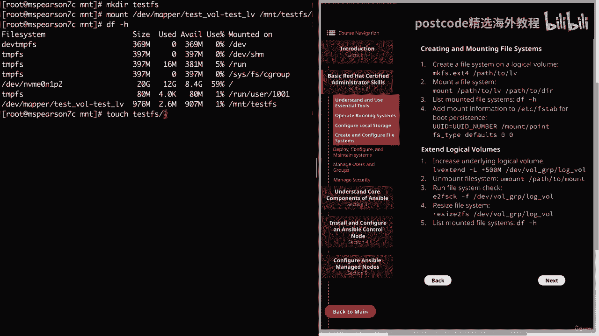
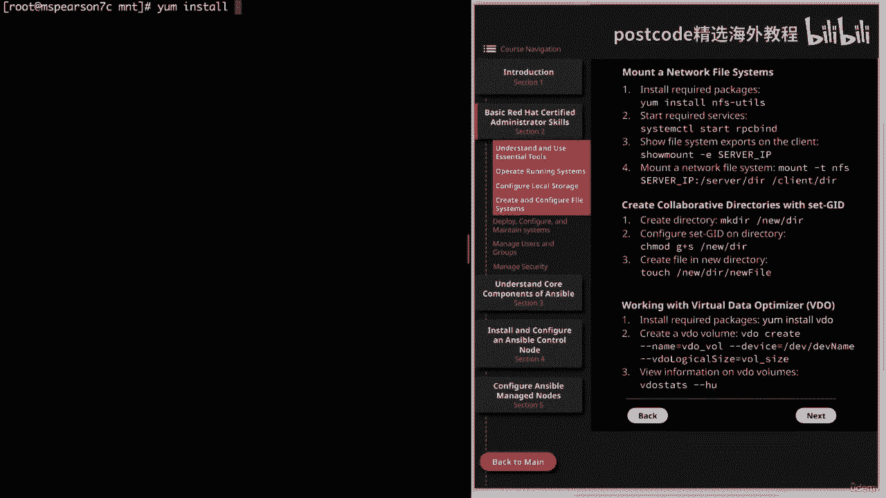
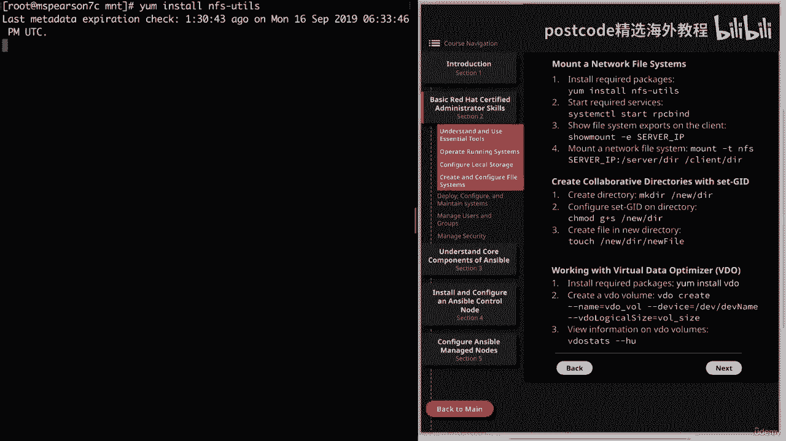
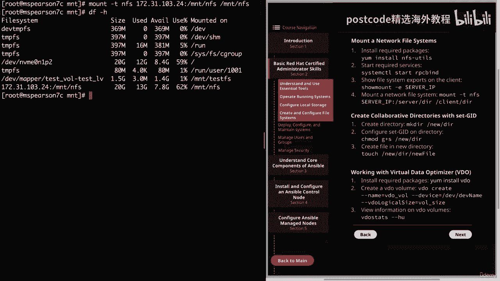
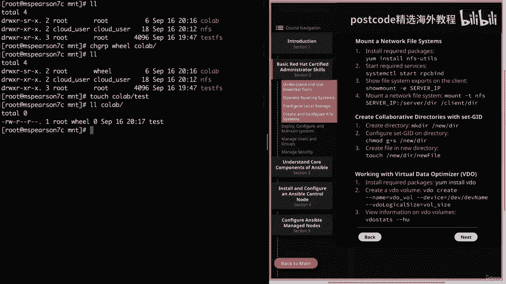

# 红帽企业Linux RHEL 9精通课程 — RHCSA与RHCE 2023认证全指南 - P10：02-02-004 Create and configure file systems - 精选海外教程postcode - BV1j64y1j7Zg

在本视频中，我们将详细介绍文件系统的创建和配置。在我们深入探讨之前，我只想让你知道我确实回去重新创建了我们的逻辑，上一个视频的音量。因此，如果您想继续，请继续并暂停视频并重新创建该逻辑卷。

对于假冒和额外的工作，我深表歉意，但一旦你完成了这些，我们就可以开始了。

因此，让我们点击“基本红帽认证管理员技能”，然后我们将深入了解。

用于创建和配置文件系统的部分。因此，让我们继续并在这里跳入命令行。因此，我们需要做的第一件事是在逻辑卷上创建文件系统。为此，我们将使用 MKV、RFS，然后是我们的 DOT，然后我们将指定实际的。

我们要使用的文件系统。因此，对于我们来说，我们将使用 RT 4，但正如您所看到的，还有其他几种选择，你必须从中选择。所以我们将指定 RT。然后是我们的逻辑卷的路径，我将使用开发映射器。

然后是我们的逻辑卷。

体积。它是测试下划线 vol dash 测试 LVT。

那么让我们继续并按 Enter 键。正如你所看到的，它创建得非常快。

所以现在我们需要做的就是挂载我们的文件系统。因此，让我们继续清除此内容，然后我将播种到我们的挂载目录中。目前，它是空的。那么让我们继续创建一个目录。所以我将使用 mkdir，然后我将其称为测试 FS。

然后，如果我们想挂载我们的文件系统，我们所要做的就是输入 mount ，然后输入路径，我们的逻辑卷，又是开发映射器、测试卷。测试V。然后是我们的挂载点的路径，这将是我们的挂载测试，然后我们可以列出。

我们仅使用 DF Dash H 挂载文件系统，我们看到我们的逻辑卷测试已挂载。

测试 RFS。因此，当前文件系统已安装，如果我们想测试，我们可以在其中触摸一个新文件，测试 fs，我们可以只进行测试一，我们会看到我们的。

文件存在于我们新安装的目录中。但如果我们现在重新启动系统，那么挂载就会消失。

因此，如果我们想为其添加持久性，以便它能够持久或重新启动，我们需要将其添加到 ZFS。

标签。因此，让我们继续清除此内容，然后我将点击块 ID，然后我将继续复制此内容。

uid。

然后我们可以打开 ETF 选项卡。

我们将走到这里的底部，然后我要点击哦，添加这个新行，然后我要去，粘贴我们的 UID，然后我们需要添加将要挂载测试 FS 的挂载点。

然后我们可以在此处添加空格，并且我们将指定其适用的文件系统类型。然后我们将下来并执行默认值。

然后还有默认检查。再次注意，这条线就像我们之前看到的那样环绕，只是因为，终端的大小。

让我们继续保存它。然后我们可以取消文件系统的静音。

芒特作证。

让我们继续检查一下。我们看到我们已经将它们删除了。现在让我们继续输入 Mount Dash A，这将在 RFS 中挂载所有这些文件系统。

标签。现在让我们运行另一个 df dash h。

我们看到我们的文件系统已挂载。所以现在如果我们重新启动机器，它将继续读取 ZFS 选项卡，并且它将挂载我们的。

文件系统。好吧，现在假设我们想要增加该逻辑卷的大小。

所以我们需要扩展它。因此，为了做到这一点，我们要做的第一件事就是运行 LVT 扩展命令。

所以这将是 LRV 的延伸。然后我们需要指定我们想要扩展的大小。破折号选项将允许我们指定该存储。您还可以使用小写 l 表示范围。让我们继续使用大写的 L，然后加上 500 M。

这个加号表示我们希望将当前分配的数量增加以下大小，加号。因此，如果我们在这里放入 500 M，那么逻辑卷的大小就会更改为 500 MB。但我们想说的是，我们目前分配了一份演出，所以现在我们要延长。

增加了 500 兆字节。所以这将是 1。5 场演出。相反，如果我们想将当前大小减少，我们可以在这里使用减号，具体金额。那么我们需要指定我们想要增加的逻辑卷。

我将使用开发映射器，然后测试所有测试。

我们看到它已成功调整大小。如果我们稍微列出一下逻辑卷，我们会发现它现在是 1。49 而不是 1。让我们继续运行 DF Dash H。

因此，当我们运行 RDF 时，我们发现我们只有大约一个可用的工作。

因此，即使我们调整了逻辑卷的大小，它还没有转换为实际的文件系统。

所以我们看到，即使我们扩展了逻辑卷，它也没有应用到数量上。

文件系统尚未。因此，为了做到这一点，我们要安装。

我们的量测试ifs文件系统。

我们看到我们成功地对其进行了无人值守，现在我们需要运行我们的文件系统检查。我要继续清除此处的屏幕，这是要检查的 E。学习如何做 F，然后学习逻辑卷的路径。请注意，在图中我使用了设备，然后是卷组名称。

然后是逻辑，卷名称。如果您愿意，也可以这样做。我只是使用开发映射器。好吧，让我们在检查结束时运行它。

现在我们可以调整文件系统的大小。因此，我们将使用调整 FS 大小，然后再次使用 R 逻辑卷的路径。

因此，让我们继续运行它，让我们知道它已经调整了文件系统的大小。

正如您所看到的，我们仍然没有安装我们的文件系统。那么让我们继续澄清这一点。现在我们可以运行 Mount A，因为我们在 RFS 选项卡中有条目。

然后我们的 DF dash h 以及您可以看到的 mount test FS 目录现在有 1。4 gigs 可用。

好吧，让我们继续解决这个问题。

现在我们可以进入下一页。现在我们将逐步安装网络文件系统并设置实际的 NFS 服务器，所做的导出超出了该视频的范围，但我已经继续设置，以便我可以向您展示如何将其安装在客户端计算机上。因此。

我们需要做的第一件事就是安装所需的软件包，那就是 NFS Dash Utils。因此，我们将使用 Yum install NFS Dash utils。

这可能需要一点时间，所以我可以继续并快进，这样您就不必，等待。我们会继续进攻。为什么？嗯，这实际上比我想象的要快一点。所以现在我们需要继续运行系统 CTL start，然后运行 ​​RPC。

继续清除这个，这样我们就不会坐在底部，现在我们可以显示文件系统导出，位于客户端计算机上。为此，我们将使用 show Mount E，然后我将继续复制 IP 地址，在这里。

这是 NFS 服务器的 IP 地址。然后我们看到导出列表，它向我们显示了 MOUNT 和 PFS 的导出。因此，既然我们已经在 MT 目录中，我将继续创建另一个目录并。

我只是要在 PFS 中调用它。

好吧，现在我们就说清楚。所以现在我们很清楚了。

然后我们可以通过输入 Mount T 来挂载网络文件系统，我们将指定 NFS，然后是我们的服务器 IP，幸运的是它已经复制到我的剪贴板了。然后服务器上的目录，也就是Mount NFS。

其实和客户端上的目录是一样的，因为，这就是我要挂载它的地方，它将是挂载 NFS。

好吧，让我们继续执行 DF，我们看到我们已经将网络文件系统安装到了。

我们的客户端机器。如果我们愿意，我们可以继续测试将文件触摸到该目录。因此，我们将继续进行 Touch Mount NFS，然后进行测试。正如您所看到的，我能够写入该目录。

就像我们安装在逻辑卷上的本地文件系统一样，如果我们想要这个文件系统，要保留，我们需要将其添加到 ZFS 选项卡中。

是的。我们可以使用 etsy ffs 转到底部并创建一个新行，我们将这样做。

就像我们在这里安装它一样。我们将输入 IP 地址，然后输入刚刚安装的导出的路径。

NFS 当然还有挂载点。

我只是要把它放在这里，这样它就可以在这里排队。挂载 NFS，然后我们指定。

实际上就是类型。

话又说回来，我们可以使用默认值。然后我们可以只使用零零进行检查。

好的。现在我们已经安装了本地文件系统和网络文件系统，现在我们要，使用 set JID 创建协作目录。所以我们要做的第一件事就是创建一个目录。由于我们已经在 Mount 中。

所以让我们继续创建一个名为 Collab 的目录。然后我们需要配置设置JID。我们将使用 C mod 来做到这一点，它将是 G 加 S。

请记住，这是一个特殊权限，它将位于我们的协作目录中，以便我们可以执行以下操作。

另一个列表合作，我们看到 S 就在那里，组权限表明该位。

已设置。然后清除它。为了演示这一点，我实际上要更改目录组。

到意志组。所以我们看到在 collab 目录中用户是 root，组是wheel。

现在让我们继续触摸一个文件。

所以我们将其称为测试。然后我们可以列出目录，我们看到该文件继承了组所有权。

目录的。

因此，现在任何有权访问此目录的用户，无论其特定组如何。

这一切都将继承我们将使用 set 对设置进行分组。

JID 好吧。所以我们最后要讨论的是虚拟数据优化器。在我回顾这一小节之前，我只想声明这两个演出磁盘，我们在 Playground 中提供了一个和一个 MVM，还有另一个 NVM 我。

认为二合一实际上太小，无法创建视频体积，所以我无法向您展示，在一次示威中。不过，有一个视频演示了如何在 CSA 课程中进行设置，并且，还有一个实验室可供您在该课程中再次练习。所以对于这个视频。

我只想谈谈亮点。因此，首先您可以使用也门风格的视频安装视频，就像使用任何其他普通软件包一样。而且视频还需要安装 k mod k video 软件包，但它将被拉取，作为依赖项。因此。

您所要做的就是安装视频来创建卷。您所要做的就是创建视频，然后是破折号名称和视频卷的名称，然后是破折号破折号，设备并指定您要使用的设备名称，然后指定视频逻辑大小，然后指定，卷的逻辑大小。

这就是您实际想要呈现给操作系统的大小。假设您使用的是 50 GB 磁盘，您实际上可以将其呈现给操作系统：150 或 200 GB 磁盘。这是因为视频将执行重复数据删除，这将需要，相似的数据块。

只存储一份副本。因此，数据被存储，然后标记为重复，并且引用原始数据而不是，仅存储两份副本。这就是为什么即使使用 50 GB 磁盘，实际上也可以达到 150 或 200 GB。

您能够呈现的大小将根据您正在处理的数据类型而变化，和。但这是虚拟数据优化器背后的总体思路。好了，我们的创建和配置文件系统课程就到此结束了。

