# 红帽企业Linux RHEL 9精通课程 — RHCSA与RHCE 2023认证全指南 - P12：02-02-006 Manage users and groups - 精选海外教程postcode - BV1j64y1j7Zg

在本课程中，我们将讨论管理用户和组。我们继续我们的基本红帽认证管理员技能部分。

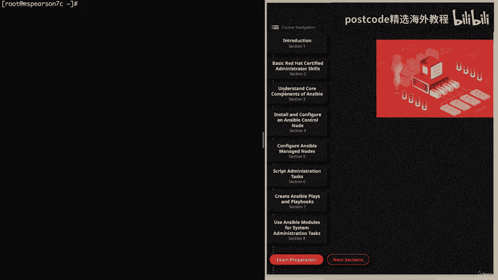

因此，单击第二部分，然后管理用户和组。

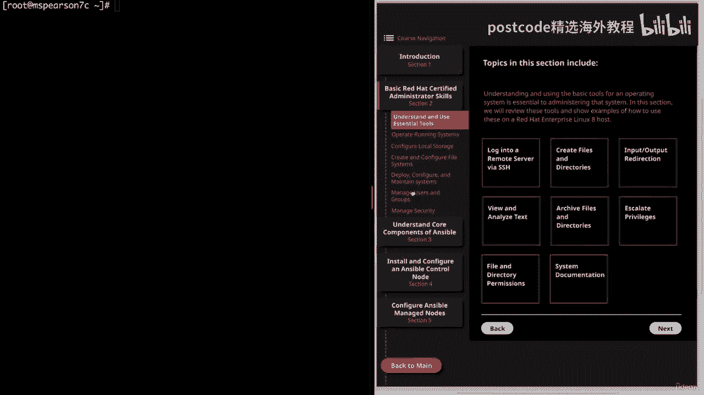

我们要讨论的第一件事是创建、删除和修改本地用户。那么让我们进入命令行。我想向您展示的第一件事是如何查看用户信息。目前，我以 root 用户身份登录。您可以做的第一个也是最基本的事情是 ID 命令。

然后指定用户名。所以我们只关注云用户。因此，这将向我们显示我们的 UID 以及我们的用户名，然后是我们的组 ID 和任何补充信息，我们所属的团体。当然，我们在这里看到云用户和组。

然后您也可以使用组和用户，名称以便仅查看用户所属的组。所以在这里我们看到云用户组，我们会。接下来我们感知 ETSI 面食。这将为我们提供大量有关用户的信息并向我们展示用户。

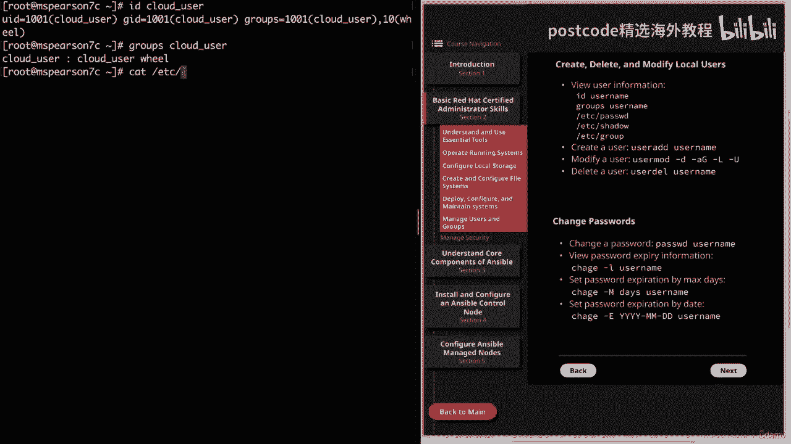

系统。所以我们将删除该文件。这将向我们展示一堆不同系统用户的列表。如果您在这里查看，我们将看到我们的云用户，它将为我们提供 UID 和组，如果我们想添加描述以及我们的主目录。

那么这里还有 ID 和一点空间，作为我们的登录 shell。我想向您展示的另一个文件是 Etsy Shadow。让我们继续并结束它。这将向我们展示一些额外的安全帐户信息。

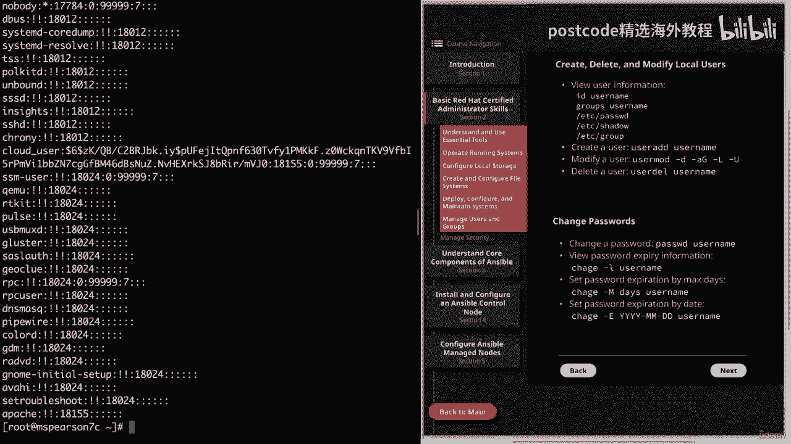

所以我们在这里看到我们的云用户，并且我们有密码哈希。

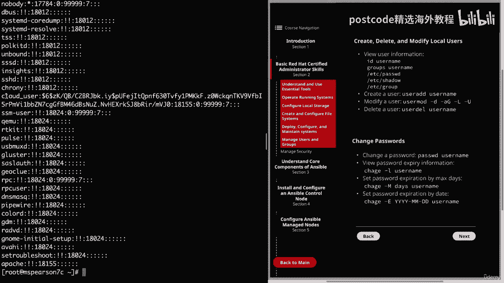

我想向您展示的最后一个文件是 Etsy 组。

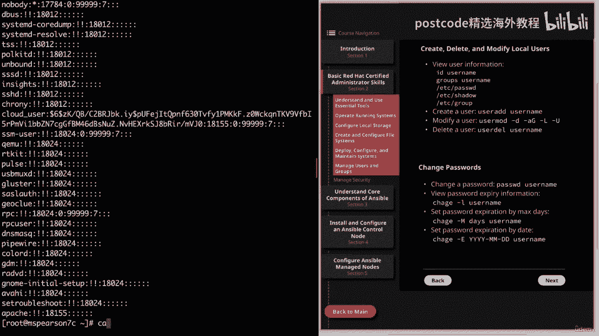

所以让我们继续并结束它。这只是向您显示主机上存在的组列表以及组 ID。

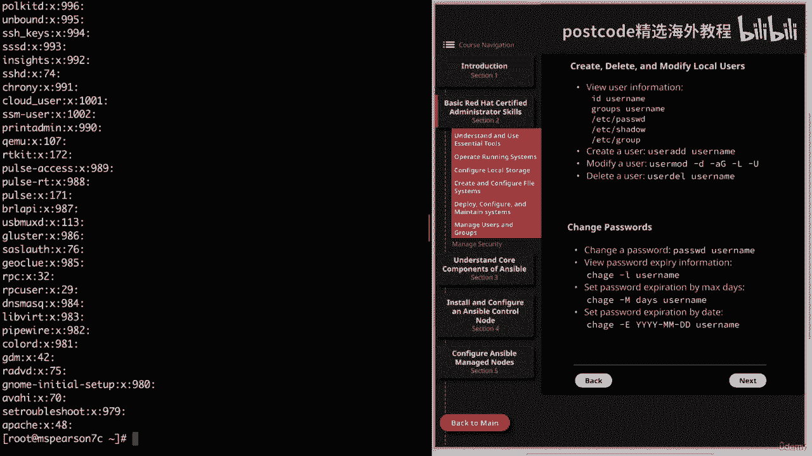

我刚刚向您展示的这些内容都是获取用户信息的好方法，以及团体。因此，如果您需要获取任何特定信息，最好记住这一点。

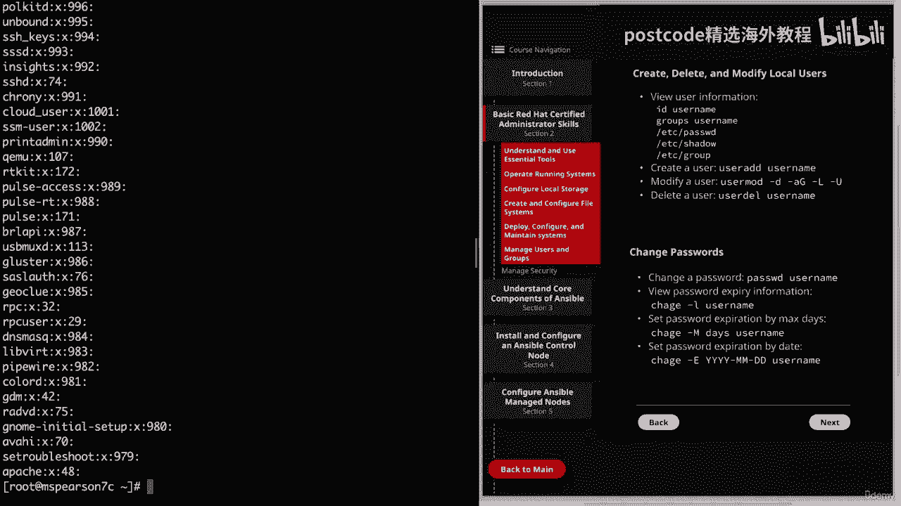

那么让我们继续清理屏幕。接下来，我将向您展示如何创建用户。我们使用 user add 命令来完成此操作，后跟用户名。创建用户时可以使用许多不同的选项。但我只想向您展示一个更基本的示例。

让我们继续运行用户广告，然后我将指定 D。这使我们能够定义主目录。所以这里就是我的家，我就叫它麦迪。然后我将指定用户名，即 Matt。除了指定主目录之外，您还可以指定登录帐户。就像我说的。

有很多不同的选项，但这只是执行基本的用户创建，我们，主要只是接受所有默认值，除了我们想要更改主目录的位置，创建用户后，您还可以稍后使用 user mod 命令修改该用户。因此，对于图中的示例。

我选择了几个可用于修改的不同标志，关于用户帐户的不同事情。当然，这将更改用户的主目录，也可以与破折号标志一起使用，以便将当前主目录的内容移动到新目录。假设我在主 Madi 中有几个文件。

我想将该目录更改为主地图。我可以指定 dash m，所有这些文件都将与主目录一起移动。然后我们有带有大写 G 选项的破折号 A，这将添加一个补充组，用户。然后小写的 g 将更改主登录组。

然后我们有Dash L，它是用来锁定用户账户的，然后你就可以按顺序使用Dash了，解锁该帐户。这些当然只是其中的一些选择。与往常一样，您可以查看主页以了解所有不同的参数和选项。

您可以与 user mod 命令一起使用。因此，让我们继续测试用户 mod 命令，我们将更改用户 Mat 的主目录，以及添加一个补充组。为此，我们将输入 user mod。然后为了更改主目录。

我们将其更改为主地图，然后我们将，使用破折号 A 和大写 G 作为补充组。我们要添加该组。出色地。然后我们需要指定用户名。好的。因此，让我们继续在用户映射上运行 ID。

我们会看到我们的 UID 和组 ID，但更重要的是，我们看到 Wheel 的补充组已添加，然后我们可以继续执行 cat etsy WD 和，我们不列出所有内容，而是继续 grep 查找地图。

我们看到用户主页，目录现在设置为主目录。

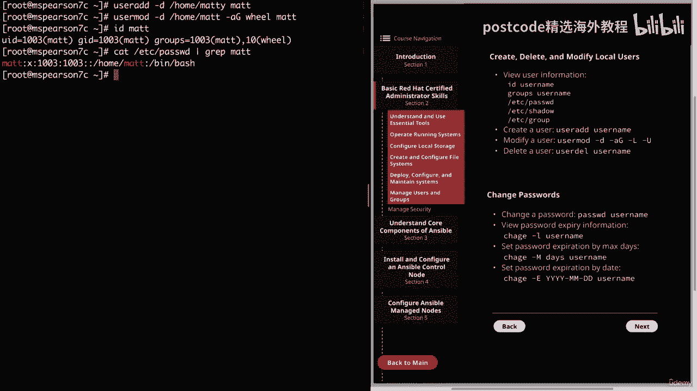

马特而不是回家。麦迪：好吧，让我们继续解决这个问题。现在我们可以继续更改用户的密码。执行此操作的方法非常简单。您只需输入 CD，然后输入要更改密码的用户名。那么让我们继续更改用户映射的密码。但在此之前。

让我们先投射 Etsy Shadow。我们要查找 matt。现在查看此条目，我们看到第一部分是我的用户名。然后在接下来的两列之间还有另一部分，我们看到它有两个感叹号。因此，通常这将包含用户的加密密码。

但是两个感叹号，让我们知道密码尚未设置，如果这是一个感叹号或星号，它会让我们知道该帐户已被锁定。现在让我们继续更改密码。为此，我们将使用过去的 WD，然后使用我们的用户名，即 Matt。

我将在这里输入一个简单的密码。真的可以做成任何你想要的东西。嗯，当然，只要它符合密码标准。让我们继续澄清这一点。现在让我们再次查看 Etsy 影子文件。现在我们看到，我们得到的是加密密码。

而不是两个感叹号，正如您所见，可以看到，还是蛮大的。接下来我们可以通过命令或者change命令查看密码过期信息然后破折号L。

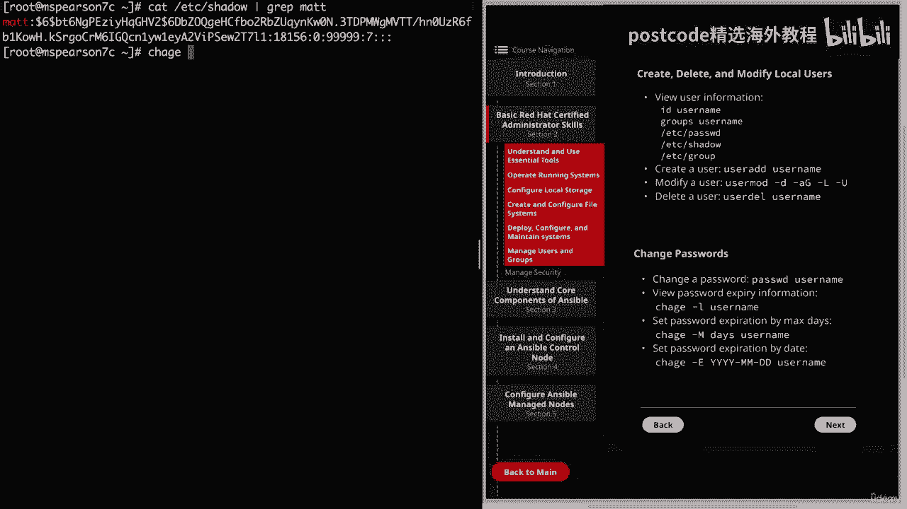

然后是我们的用户名 Matt。我们看到最后一次密码更改是 9 月 17 日，也就是今天。

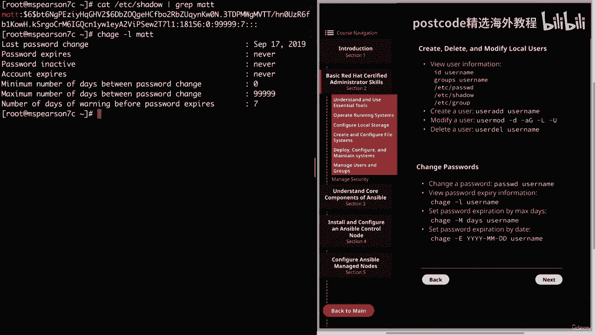

我们刚刚改变了它。

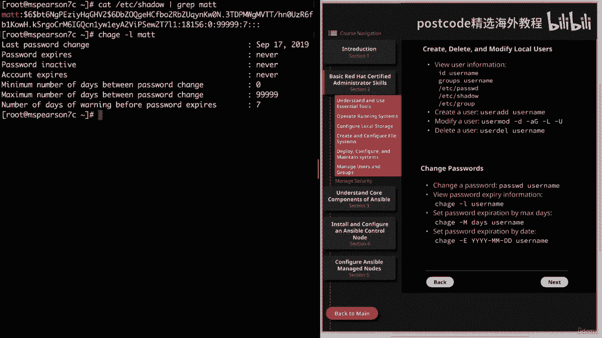

现在我们的密码和帐户设置为永不过期。但如果我们愿意，我们可以设置密码的过期时间。

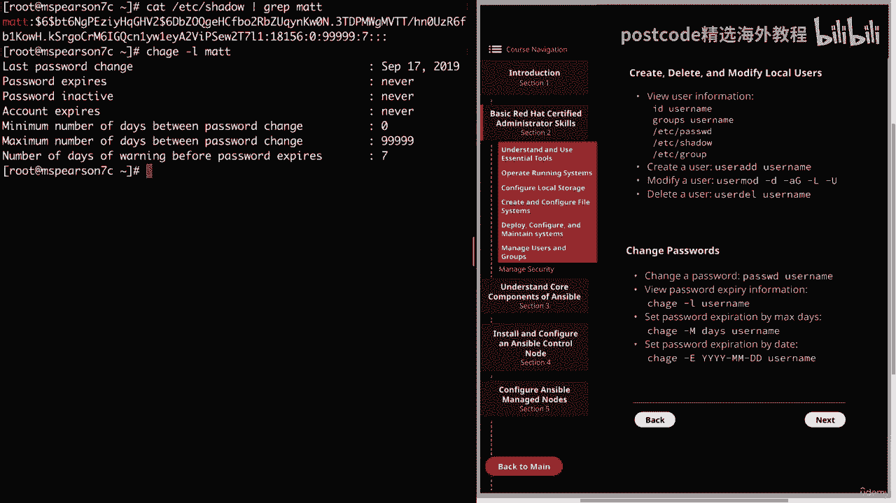

我将向您展示如何快速做到这一点。更改命令，然后是大写 M，然后我们将指定日期。我只想说30天。然后是我们的用户名，即马特。那么我们就可以运行我们的了。

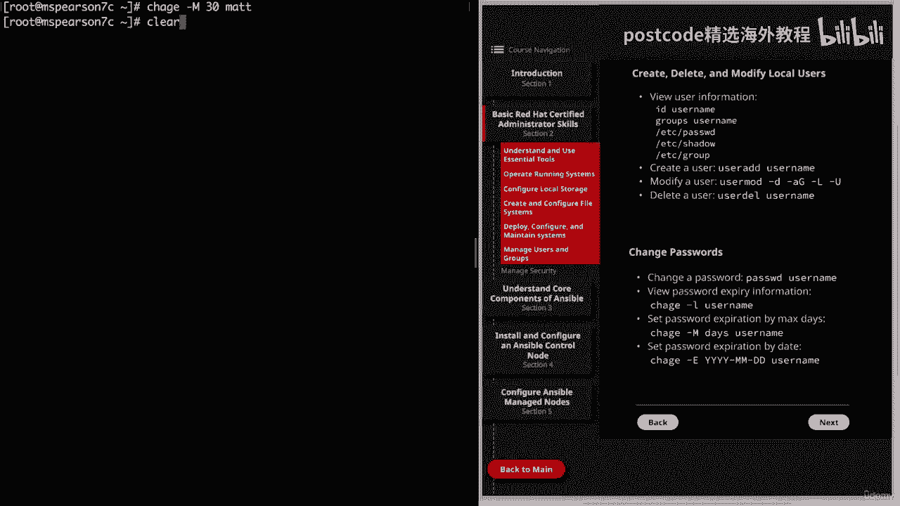

L 我们看到密码设置为 10 月 17 日到期，距现在还有 30 天。

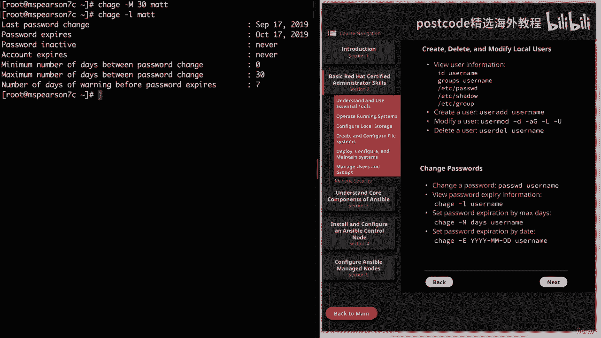

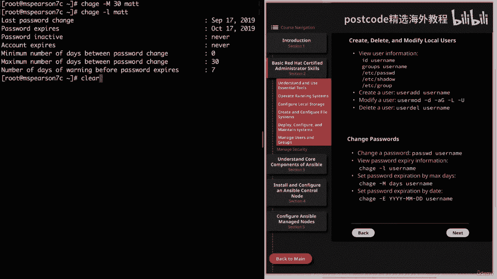

然后我们还可以将帐户设置为在特定日期之前到期。我们通过使用年龄、大写 E 和日期来做到这一点。所以我们将在 2019 年进行，然后在 11 月和 15 日为 Matt 进行。

我们可以在马特身上运行我们的冲刺。

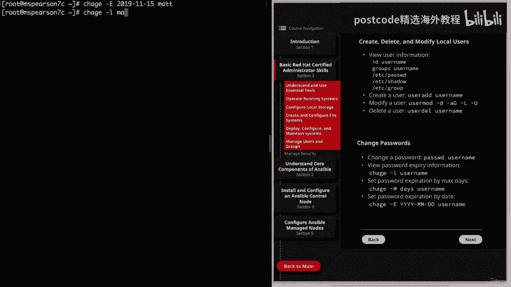

我们看到该帐户将于 2019 年 11 月 15 日到期。

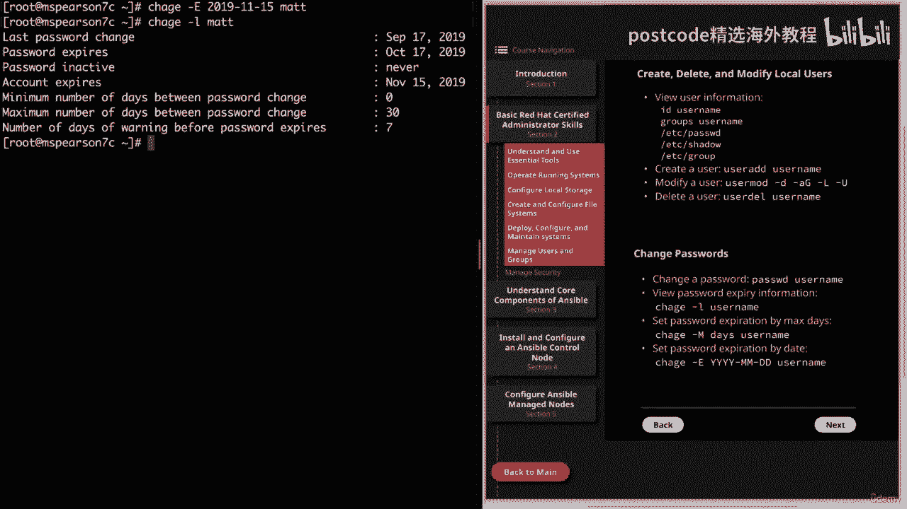

好的。因此，让我们继续解决这个问题，然后我们可以进入下一页。

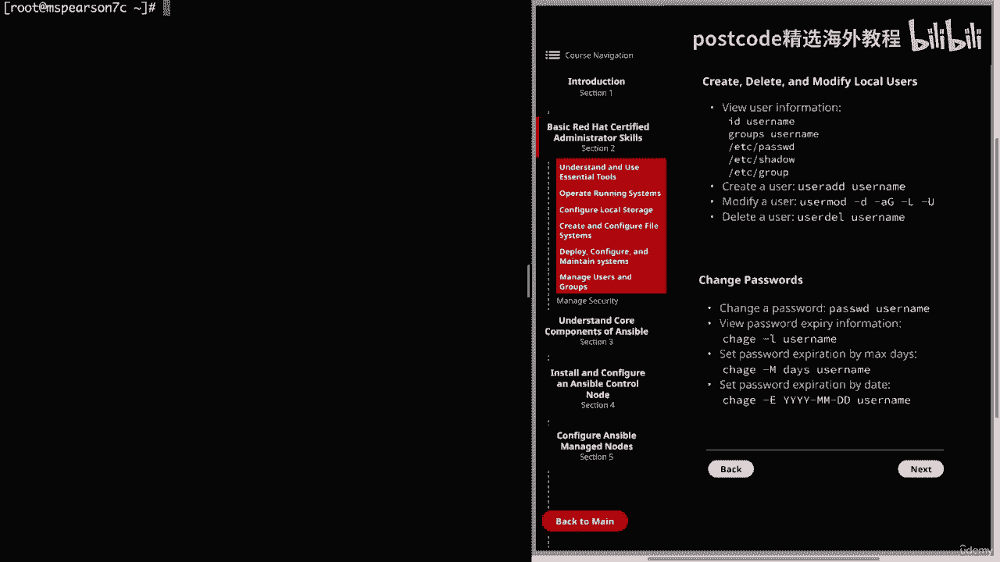

现在我们要讨论创建、删除和修改组。那么让我们回到命令行。我们获取群体信息的方式将与获取群体信息的方式有很多重叠。我们获取有关用户的信息。因此。

我列出了 ID 命令和组以及 Etsy Pasta、Beauty 和 Shadow 以及组。因此请记住，当您与团队一起工作时，这些都是可以使用的。现在让我们继续创建一个组。为此，我们将使用组添加命令。

因此，组添加，让我们继续创建多个组。因此，首先我们将进行测试一，然后进行测试二，然后测试三。现在让我们继续修改我们的用户 Matt，并更改主要组并添加一些，补充组。为此，我们将运行 user mod。

我将把主要组更改为 B 测试一，然后，然后我将添加一些补充组。这将是一个考验。并测试三。对于用户，马特。让我们继续列出这些组。我们看到我们的主要组位于第一个位置，他们的测试组然后是我们的补充组。

我们将测试两个并测试三个。

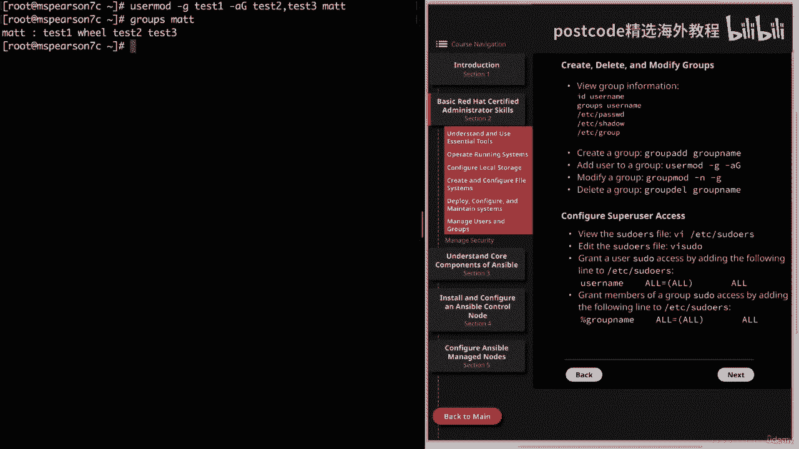

我们还可以使用 ID，我们将看到主组 ID 是测试一，然后我们看到补充组 ID，组。测试一，我们将测试二和测试三。所以我们也可以使用group mod命令来修改组。

您可以做的事情之一是使用 PN 更改组的名称，或者您实际上可以更改，实际的组 ID 号为其他值。但让我们继续快速尝试一下。

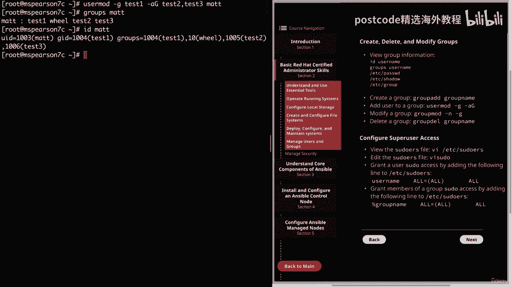

因此，为了清除这一点，我们将输入 group mod，然后破折号，我们组的新名称将会出现，作为测试四，我们将更新测试三。那么让我们继续对 Matt 进行另一个 ID。在我们的组下，我们看到我们有测试二。

而不是测试三，有测试四。因此，即使我们更新了组的名称，所有将其作为其组之一的用户，将保留它。它只会更新他们的名称。所以这也是一件非常容易记住的事情。在我们继续之前，我确实想快速关注 Etsy 群组。

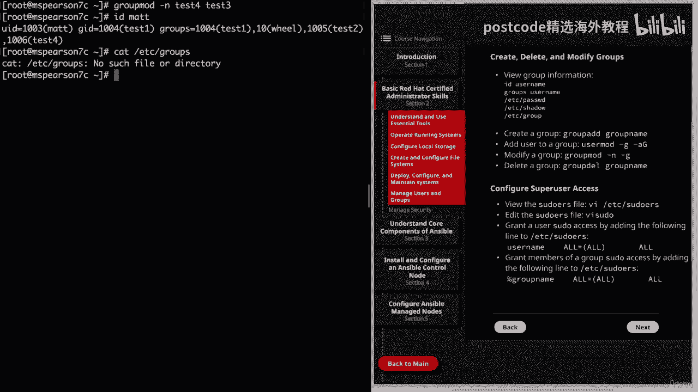

我指的是 Etsy 组，我们在文件底部看到新创建的组。

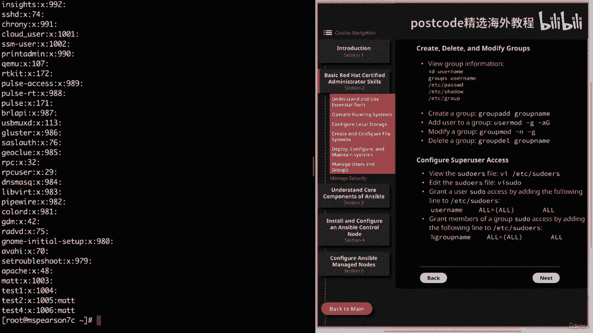

好的。现在让我们继续本节的最后一个主题，即配置超级用户访问权限。

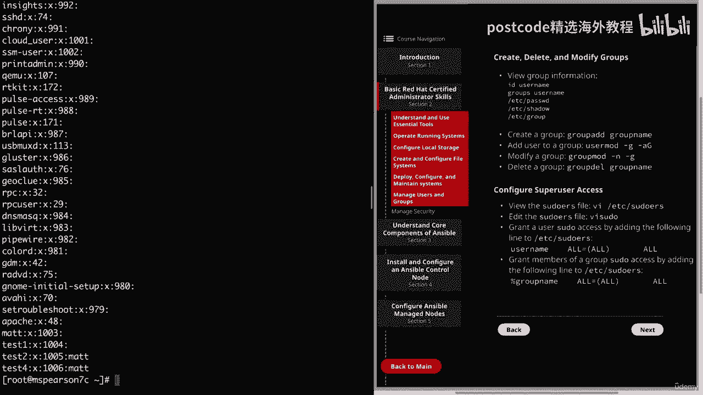

因此，这对于您管理的系统上的用户来说非常重要，这样您就可以确保他们，拥有适当的权限。但这在配置 Ansible 时也很重要，因为很多事情，我们需要 Ansible 来完成需要升级的权限。因此。

为了授予这种访问权限，我们需要将其添加到伪病毒文件中。所以如果你想查看该文件，可以使用像VI这样的文本编辑器。如果您担心实际对其进行更改，您可以随时使用破折号 r 选项，是 VI 的只读模式。

或者您可以使用 less 之类的模式。因此，让我们继续执行 dash r，然后执行 ETSI setters，我们就看一下。因此，像大多数配置文件一样，您将看到很多注释，它们会为您提供线索。

到您可以添加的不同指令和参数中。我确实想注意的一件重要的事情就在这里，它说，该文件必须使用语音命令进行编辑，我们将在稍后讨论。Vsco 将确保我们的语法正确并且不会搞砸。因此。

它可以作为一个很好的健全性检查，以确保您正确输入条目。因此，让我们继续按 Shift G，我们将深入了解这一点。这已经有一些条目允许某些用户和组运行命令，但它也服务，作为一个例子，如果我们需要添加一个。

在这里，您可以看到允许 root 在任何地方运行任何命令。然后，如果您希望组中的所有成员都能够运行命令，您可以这样做，输入百分比，然后输入组的名称，然后输入各种权限。

它还向您展示了一个能够运行这些命令而不提示输入密码的示例。要做到这一点，你只需指定不过去。好的。所以让我们退出这个，我将通过伪运行。我们将回到底部。

我们看到我们已经有了一个无需密码即可运行所有命令的用户。所以我要做的就是把它拉出来然后粘贴到这里然后我们就可以了，添加我们的用户地图。所以我们将关闭它。现在我们要切换到马特。因此。

让我们看看是否可以使用pseudo 运行权限命令，并看看它是否提示我们输入密码。所以我们要运行伪。系统控制。

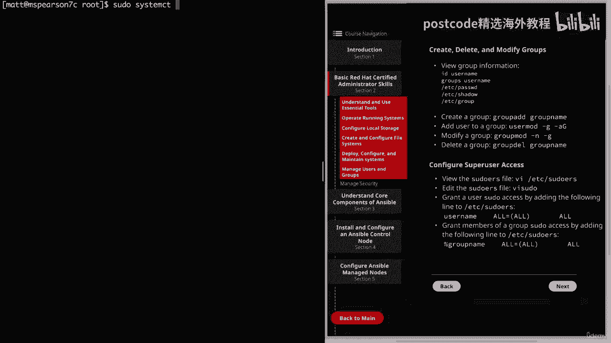

地位。HTTP DD。

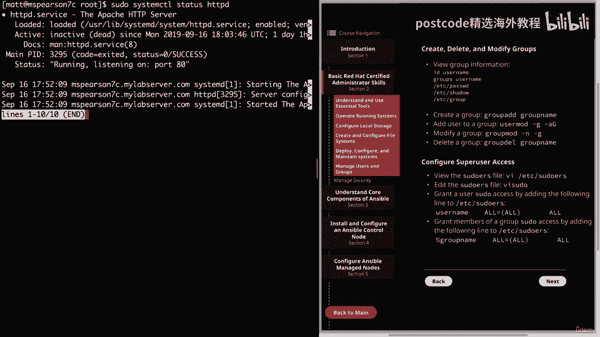

我们看到状态上甚至没有提示输入密码，然后我们就可以继续。

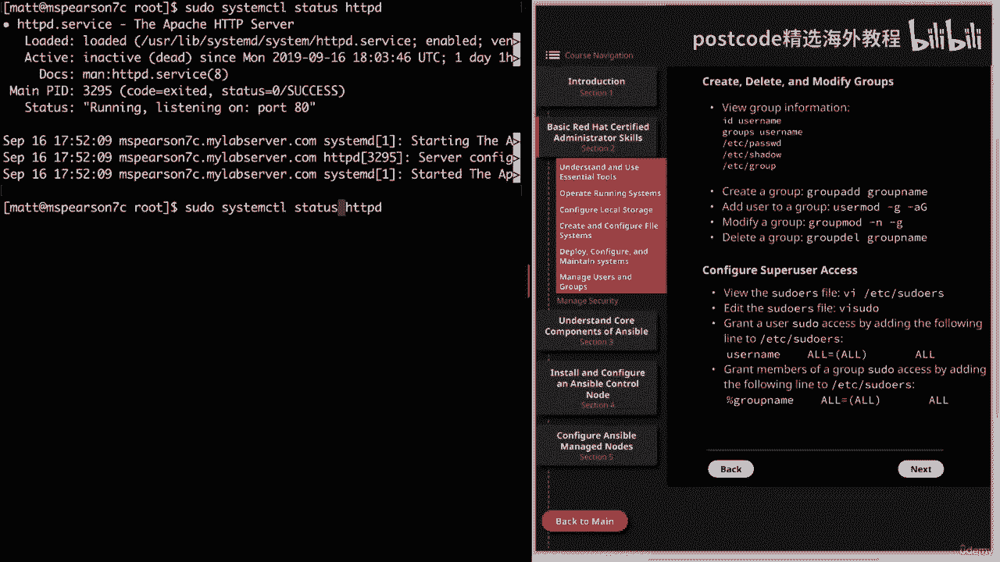

并运行它。我们看到我们的伪权限设置正确，就像最后一个例子一样。实际上我会注销 Matt 用户帐户。回到这里的root，现在我们将通过pseudo 运行。

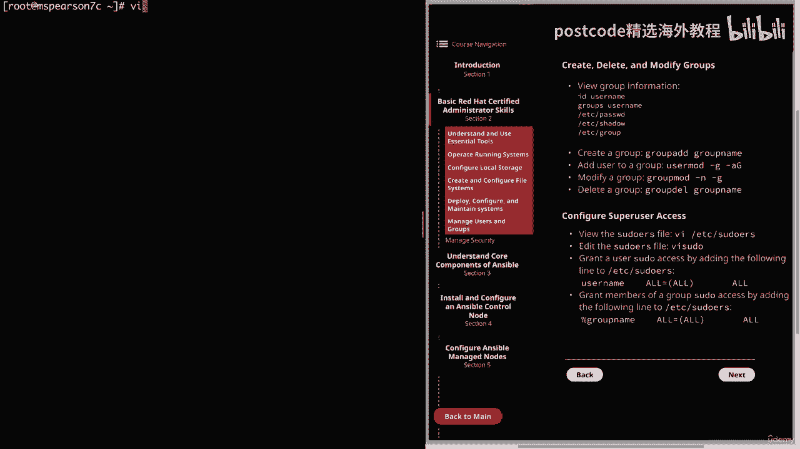

返回班次的底部。G。只是为了向您展示一个例子，如果我们想添加一个组，那么假设我们想要我们的测试，一组，我们只是把它放在这里。这样，测试中的所有用户（一组）将能够使用伪命令运行所有命令。

按照我们目前的设置方式，系统会提示他们输入密码。好了，关于管理用户和组的视频就到此结束了。