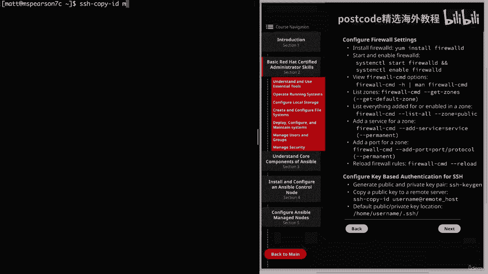

# 红帽企业Linux RHEL 9精通课程 — RHCSA与RHCE 2023认证全指南 - P13：02-02-007 Manage security - 精选海外教程postcode - BV1j64y1j7Zg

我们将讨论管理安全的主题。它还将完成我们的基本红帽认证管理员技能部分。在此之后，我们将深入了解实际 RHC 材料的基础知识。那么让我们进入第二部分。

然后我们可以点击它，管理安全性。我们要讨论的第一件事是配置防火墙设置。我想在这里提到，在旧版本的红帽 IP 表中用于管理，防火墙并与网络过滤器交互，网络过滤器是由防火墙提供的网络子系统，核心。

但从七轨开始，这变成了防火墙 DX，基本上有两种不同的，配置Firewall DX的方法是通过命令行中的firewall cmd，然后通过，在图形界面中进行防火墙配置。在本课中。

我们将重点关注命令行实用程序。我们需要做的第一件事是安装防火墙 DX 包。因此，让我们转到命令行，我们可以通过输入 yum install dash y firewall dx 来完成此操作。

然后我们只需要启动并启用防火墙即可。RD 因此，让我们清除这一点，然后我们可以运行系统 CTL 启动防火墙 DH。我们将在同一条线上进行。我们将做另一个系统来启用防火墙。然后我们可以快速检查状态。

我们的服务已启动并运行并启用。所以现在我们可以继续前进了。

正如我所说，主要的命令行实用程序是防火墙 CMD。

正如您可以想象的那样，有很多不同的选择。让我们继续解决这个问题。如果您想查看不同的选项，您可以输入防火墙 CMD，然后破折号，求助。这将向您显示不同选项的列表。其中有很多。

然后你也可以执行 man firewall cmd。为了查看防火墙的手册页似乎。因此，在讨论防火墙 DH 时需要了解的一个重要概念是区域的概念。因此，区域将允许您为该区域内的特定网络连接指定规则。现在。

默认区域将是公共区域，但如果您想查看所有不同的区域，可用时，您可以输入防火墙、破折号、cmd，然后破折号破折号获取破折号区域。您会看到有几个不同的区域，例如 DMZ、家庭、公共、内部等。

等等。当您设置防火墙规则时，您可以按区域进行设置。

然后如果你想查看当前的默认区域是什么，你可以执行 get default zone 。

正如您所看到的，我们当前的默认区域是公共的。这就是我们今天要合作的区域。现在，如果您想查看某个区域当前添加或启用的内容，您可以运行防火墙 cmd。然后破折号、破折号列表、全部破折号，然后指定区域。

所以我们使用公共。我们现在看到有一个接口为零，然后我们配置了一些服务。

这是cockpit，然后是HTTP第六版客户端以及SH，这在什么时候非常重要。

您正在尝试登录系统。现在让我们继续添加一些防火墙规则，以便您可以了解这是如何完成的。

因此，为了做到这一点，我们需要输入防火墙 CMD。然后，如果您想添加一项服务，您只需添加即可。冲刺，冲刺。添加破折号服务。然后是服务的名称。因此，对于我们来说，我们将实际添加 HTTP。

这是针对我们的 Apache 服务器的。然后你可以指定一个区域，特别是如果你不指定区域，它将使用默认的，区。然后另一个需要注意的重要事项是使用 dash dash permanent。因此。

如果您希望此规则持续存在，则需要添加此 dash dash 永久标志。否则它会被清除，并且在重新启动后它不会存在。那么让我们继续并按 Enter 键。我们看到我们获得了成功。

然后您还可以通过指定来添加特定端口。当然，现在该服务确实与该服务的默认端口有关。所以 HTTP 是 80，但您也可以指定确切的端口。为此，我们将使用防火墙 CMD，然后添加端口。这采用端口的格式。

后跟协议。因此，我们将 80 添加到 80，协议将是 TCP。我们也希望将其永久化。

现在让我们继续列出公共区域的所有内容。

所以查看服务和端口，我们看到 HTTP 服务和 88 端口未激活。

在我们的公共区域，那是因为我们已经编写了这些规则，但我们需要通过以下方式激活它们。

重新加载防火墙规则。

让我们继续运行防火墙cmd。冲刺，冲刺，重新加载。

好的。那是成功的。现在我们可以继续并再次运行我们的列表。

我们看到我们的 HTTP 服务和 88 端口现在处于活动状态。

好吧，让我们把这个问题弄清楚。现在我们可以继续为 SSH 配置基于密钥的身份验证。在我们这样做之前，我实际上要切换到用户地图。因为这是我们将用来设置基于密钥的身份验证的用途。

所以我们需要做的第一件事就是生成公钥​​和私钥支付者。这是通过 SSH 密钥生成实用程序完成的。因此，第一个提示要求我们输入一个文件来保存密钥。

我只需按 Enter 键接受默认值。

然后他继续创建 SSH 目录。现在我们可以输入密码了。

我将把这个留空，主要是为了方便。因此，我们再次按 Enter 键，我们会看到我们的公钥和私钥都已创建。

让我们继续清除屏幕。

现在我们需要将公钥复制到远程服务器，这将是一个 C，为此，我们将使用 SSH 复制 ID 实用程序。但在此之前，我确实想快速向您展示公钥。它将位于我的主目录中，即 Matt，然后位于 SSH 中。

然后是 ID 下划线，RSA Pub，这就是我们的公钥的样子。

如果我们愿意，我们可以复制它，然后手动将其粘贴到授权密钥的文件中。

它位于我们远程服务器的主目录中，但是使用 SSH 复制 ID 实用程序需要花费。

为我们照顾这一点。

因此，让我们继续退出这里，然后我们可以运行 SSH 复制 ID 我们的用户名，然后我们的。

主机IP地址。

所以我们会继续并接受这一点。然后我们需要输入我们的密码。

我们看到我们添加了一个密钥并记住我没有为我的共享密钥设置密码，身份验证，但第一次复制时确实需要密码。现在我们可以通过运行 SSH 和用户映射来测试我们的访问权限。还有IP地址。你看。

我无需输入密码即可登录我的 Pearson 连体衣。很快，我想向您展示授权密钥文件。如您所见，我位于主目录中，因此我将播种数据，然后检查，出授权密钥。

正如您所看到的，它添加了来自我的 MZ Pearson 的 7 个 C 实验室服务器的密钥。

那么基本上什么可以访问什么？现在我们将回顾一下可以使用 SELinux 执行的一些操作。我们需要知道的第一件事是我们处于什么模式。因此，为了获得您当前的SELinux模式，您可以运行，使其生效。

您可以看到我的主机当前处于强制执行状态，这是默认模式。但是 SELinux 也可以设置为宽容模式，并且在宽容模式下 SELinux 将打印警告，但它不会执行安全策略。当然，随着执行，政策也会得到执行。

如果您想更改模式，可以使用 set 和force 命令。在我们这样做之前，我要退出用户 Matt。这样我们现在就是 root 用户了。因为这是一个特权命令。因此我们可以使用 set 并强制为零。

这会将其设置为宽容或强制设置，一，这将使其强制执行。所以我们已经在执行了。因此，让我们继续使用 set 和 Force Zero，然后我们可以使用我们的 get 生效，我们看到我们，在宽容模式下。

然后要将其改回来，我们只需使用 Set 和 Force One 即可。SELinux 还提供了大量不同的布尔值，这些布尔值将允许部分 SELinux 策略。

无需重新加载整个 SELinux 策略即可更改。让我们继续清除这个，您可以通过输入 git 来获取这些布尔值的列表，请参阅 bool。然后假设我们想要检查与 HTTP 相关的布尔值。为此。

我们只需执行 bool、dash a，然后我们可以将其通过管道传递给 grep 并搜索 http。

你会看到，即使对于 Apache，也有很多布尔值，其中大多数都是，关掉。但正如您所看到的，有一些已打开，例如启用 CGI 和内置脚本。

如果你想打开或关闭布尔值，你只需输入 set， see bool 然后输入名称。

布尔值，然后确定是否要打开或关闭它，还可以添加大写破折号。

P 代表永久。好吧，让我们继续解决这个问题。

接下来我们有 Linux 上下文，这将确定某些东西对某个设备的访问级别。

文件或目录。您只需执行 s 管理，然后执行 f 上下文破折号 l 即可列出这些联系人。所以你只花了一秒钟就跑了。那是因为有大量不同的背景。

如果您想查看文件或进程的上下文，您可以运行 LZ、破折号、大写 Z 和。

然后使用 PS，您还需要添加大写 Z 选项。很快，我们就会看到我的主目录中有什么。我们有 SEP 测试文件。所以LZ Z就直接做SEP测试吧。

我们看到这个特定文件具有 admin 下划线 home 下划线上下文。现在我将演示一下它在实践中是如何运作的。所以你可以看看它是如何工作的。对于该示例，我们将使用 Apache 或 HTTP 服务器。

我将展示。

当您使用非默认目录作为 Apache 文档根目录时所需执行的步骤。因此，我们需要做的第一件事是创建目录。我将其命名为 Apache，然后我们需要编辑配置文件。ETSI httpconf http d．。

T太多了。我可以搜索 var ，我们看到文档根目录当前是 var html 的默认值。让我们继续删除它。

我们将添加 Apache，然后就可以开始了。

在这里也进行更新。

然后继续下一个。

并添加 Apache。好的。现在我们已经更新了目录，让我们继续保存并退出。

然后我们可以将索引 HTML 添加到新的 Apache 文档根目录中。

说这是一个网页。

将其放入 apache 并索引 html。并且我们还需要重新启动Apache。因此我们进行了配置更改。重新启动http。好的。让我们继续澄清这一点，看看是否可以卷曲该网页。所以我们将做curl本地主机。

它是索引 HTML。我们收到四到三个禁止，说我们没有访问index。html的权限，请记住，我们已将 SELinux 设置为强制执行。因此，让我们看看如果将其设置为宽容并再次尝试卷曲会发生什么。

所以我们要强制执行。零。所以这将是宽容模式。现在让我们再次运行我们的卷曲。我们看到我们能够访问该页面。所以这向我们表明，实际上是 SELinux 阻止了我们查看它。

这又将归结为 SELinux 环境。因此，让我们继续执行此操作。让我们继续解决这个问题。现在，为了让它与 SELinux 一起工作，我们需要更新新的非默认的上下文，目录。再次。

我们可以看到我们需要什么上下文。

执行大写 z 或 dub dub html。我们看到我们的新目录需要的上下文是http dx underscore sis underscore content。让我们快速列出 Apache 目录。

我们再次看到它只是设置为默认值。所以让我们弄清楚这一点。要更新该上下文，我们只需运行、查看、管理，然后 F 上下文、破折号 a、破折号 T 和。

然后我们可以指定上下文类型。因此请记住，这将是 http dx underscore sis underscore 内容。下划线 T。然后我们将其添加到新目录 Apache。

他们将在这里添加一点 reg X 以包含所有内容。然后我们就可以按回车键了。现在。让我们继续再次列出我们的清单。阿帕奇。我们说过，即使我们更改了上下文，它仍然具有默认的下划线上下文。因此，为了应用它。

我们需要运行恢复图标。破折号 r 然后是我们的目录。好吧，现在让我们再次列出清单。我们看到我们的目录现在有了正确的上下文。让我们继续说清楚。在我们测试访问我们的网页之前。

让我们继续列出其中的索引 HTML。

阿帕奇。我们看到索引的 HTML 现在具有正确的 SELinux 上下文，并且当我们更改上下文时。

我们实际上将其添加到 Apache 目录下的所有内容中，然后运行了“恢复图标”。我们进行了递归，这将恢复该目录下所有内容的上下文。好的。因此，让我们继续并确保我们处于强制模式。我们是。

现在让我们尝试卷曲本地主机网页。索引点 HTML，我们就可以访问网页了。现在我们有了一个使用正确 SELinux 上下文的工作非默认内容目录。现在。

在我们结束之前我想向您展示的最后一件事是能够看到 SELinux 策略违规情况。我们通过查看警报破折号 a 来做到这一点。然后我们可以查看var logaudit，查看审计日志。现在让我们向上滚动一点。

我们将在这里看到 SELinux 正在阻止用户 Espen http d 对文件进行映射访问。

Apache 索引 HTML。这就是我们之前遇到的违反政策的情况。然后它也会为我们提供解决问题的方案。所以它说如果你想修复标签，默认标签应该是，它给了我们默认标签，HTTP 表示内容下划线为 RT。

这也是我们最终将其更改为的内容。然后它会告诉您一旦添加了该文件，您就可以在该文件上运行恢复控制台破折号，以便更新它。因此，如果您遇到过违反 SELinux 政策的问题，或者您认为可能存在政策，违规。

您肯定要在审核日志上使用 SC 警报，以查看是否存在任何问题，以及您需要采取哪些措施来解决它。好了，关于安全管理的视频就到此结束了。因此，让我们继续标记完成，然后我们可以继续下一部分。

您可以查看是否存在任何问题以及需要采取哪些措施来解决它。好了，关于安全管理的视频就到此结束了。