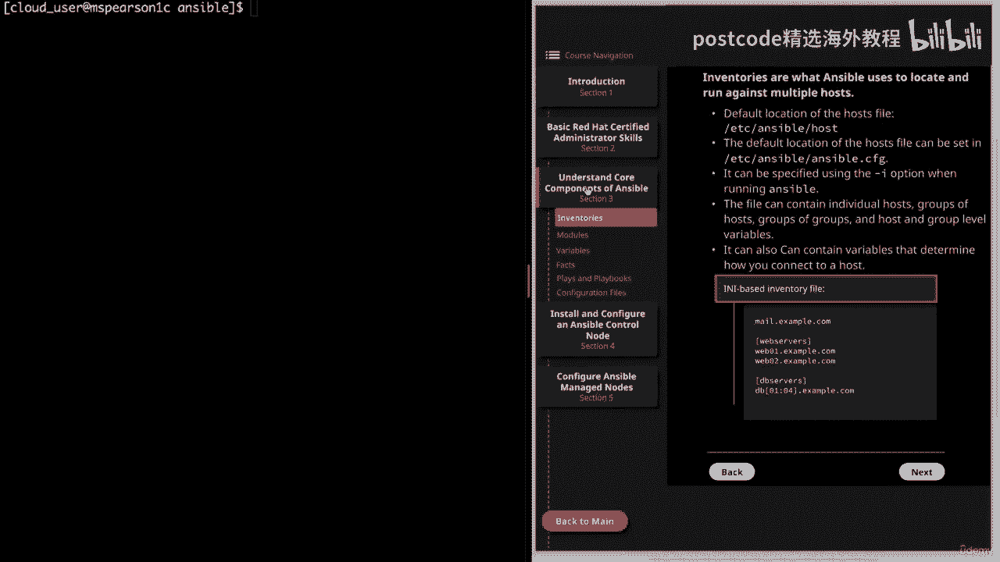

# 红帽企业Linux RHEL 9精通课程 — RHCSA与RHCE 2023认证全指南 - P14：03-03-001 Ansible- Core components - 精选海外教程postcode - BV1j64y1j7Zg

视频。我们将讨论库存，这将开始我们的理解部分，Ansible 的核心组件。

因此，让我们继续单击第三部分。这将直接带我们进入库存部分。因此，在基本层面上，清单正是 Ansible 用于定位和针对多个主机运行的工具。如果运行 Ansible 时未指定清单文件，它将使用默认值。

host 文件，位于 ETSI Ansible 主机中。但可以通过在 Etsy 中设置来更改此默认位置。Ansible Ansible CFG。正如我已经提到的，当您，运行 Ansible 命令。

用于运行 playbook 的 Ansible Playbook Command 也是如此。接下来，该文件可以包含单个主机、主机组、甚至组和主机组以及，组级别变量。

这些变量还可以用于确定如何连接到该主机，例如协议，或您正在使用的端口。我们稍后将在课程中更多地讨论变量。现在我想向您展示可用于库存文件的两种不同格式。第一个是人工智能和基于人工智能的。

如果您是 Windows 用户，您可能非常熟悉这种类型的格式。正如您所看到的，我们在顶部有邮件示例，您可以在此处指定您的邮件，不属于组的单个主机。但是，如果您想指定一组主机，您可以将该组名称放在括号中。

然后提供，下面的主机名。您可以在这些组下单独列出每个主机。但您也可以在数据库服务器下使用此简写，如您所见。因此，如果您有多个主机将其放在括号中，那么您就有零一冒号零四，这将是 DB 零一到 DB 零四。

现在，如果我们转到下一页。我们有一个基于 YAML 的清单文件的示例。正如您所看到的，它将以所有标题开始，后跟冒号，然后您就可以了，将指定您的主机。

就像 I 和 II 文件一样，您将在此处指定您的个人主机、您的，独立主机。然后在与主机相同的级别，您可以指定子项，这就是您要指定的位置，你的各个团体。所以在这里你可以看到我定义了两个。

即Web服务器和DB服务器。然后，在您的小组的名义下，您将拥有主持人。您可以在此处指定属于该组的主机。并且在DBservers组下，可以看到我们也可以使用简写来指定host，只要，当然，它们是相似的。

就像我们在 和 文件中一样。就像一些额外的信息一样，您还可以将组添加到组中，这将被指定，与主机处于同一级别，您只需添加子项，然后指定，群组。当我们真正开始创建我们自己的定制时，我们将更多地讨论这一点。

库存文件。但我只是想在我们谈论它的时候记下它。好的。因此，让我们转到命令行，我们将检查默认的清单文件。然后我将向您展示一个简单的自定义库存文件。好的。因此请记住。

默认位置将是 Etsy Ansible 主机。我确实想简单介绍一下 Red Hat Enterprise Linux 8 的 Playground 镜像。由于操作系统是新的，我们使用的存储库目前没有。

Ansible 包。所以我实际上必须预先填充许多默认目录和文件，例如 Etsy、Ansible、，当然还有其中的主机文件以及 Ansible CFG 配置文件。我确信最终会添加 Ansible 软件包。

但现在，这就是您要做的事情，在课程期间也必须这样做。因此，当我们实际安装 Ansible 控制节点时，我将向您展示如何做到这一点，与使用包含该包的存储库的常规方式一样。

然后我还将向您展示如何从源代码安装它，这就是您要做的，需要在我们的游乐场服务器上执行。话虽这么说，如果您想跟随并完全按照我目前在该主机上所做的操作，实际上，您必须继续设置控制节点和管理节点。因此。

如果您想完成，请随意跳过，以便您可以继续并设置基本安装，这些不同的核心组件。但这更多的是一个信息性示例，我们将创建自定义配置，文件以及自定义库存文件稍后将详细介绍。

我只是主要不想让您感到困惑并尝试运行我当前正在运行的命令，因为我已经设置了基本的 ansible 安装。好吧，让我们继续打开这个文件。您在顶部看到它说这是默认的 ansible 主机文件。

并告诉您该文件应该在哪里，居住。这个文件实际上是我从 Git 存储库进行的源安装附带的。

它有一个示例目录，其中包含示例主机文件和示例配置，文件 ansible cfg。因此，一旦我们完成安装，我们就可以继续将它们复制到默认位置。无论如何，让我们知道评论将以我们习惯看到的 LB 字符开头。

在配置文件中。空行将被忽略，然后主机组由标题元素分隔，其中，将在括号中。再次默认情况下，这将使用 I 和 I 格式。请记住，您可以输入主机名或 IP 地址。

并且一个主机名和 IP 可以是多个主机名和 IP 地址的成员。组。因此，这里的第一个示例显示了一堆联合国小组帖子，并将其放在指定任何小组之前，标头，您会看到可以使用主机名或 IP。

然后我们就有了属于 Web 服务器组的主机集合。就像我说的，如果您有多个遵循某种模式的主机，您可以使用我们的，冒号的简写，这样我们就可以向下滚动，我们会看到更多的例子。最后一个只是显示没有前导零的示例。

因此，如果我们愿意，我们可以将托管节点之一的主机名直接添加到此文件中，并且。

那么只要我们运行 Ansible 命令，Ansible 就会引用它。但我不会这样做，而是将向您展示如何创建一个简单的自定义库存文件。那么让我们退出这个话题吧。我将前往主目录中的 Ansible 目录。

您可以看到目前这是空的。

让我们直接称呼这个文件特使和我吧。而且我们不必指定 DOT。通过扩展，这只是一种帮助方式，你知道，就像这将是一个 IA 文件，或者这将是一个 YAML 文件。当然，我可以将扩展名留空。因此。

让我们继续打开它，我们可以输入、插入并记住我们需要指定我们的，群主在顶部。因此，我将放入 MBS Pearson 来查看我的实验室服务器。网络公司。然后我们将继续下去，我们将添加一个 B 组。

类似于您的，以前见过。只是将其称为 Web 服务器。所以我们添加 s。这将是 MZ Pearson 三个 C 点，我的实验室服务器点 com。然后我将把它拉出来并粘贴到这里，我们将创建另一个组。

我将把这一台称为实验室服务器。然后我们可以再次粘贴它。我将向您展示简写。请记住，我们可以通过添加括号来做到这一点。我们将指定六点到科隆。因此，这将包括MBS。

皮尔森·托 (Pierson To) 一直通过MBS。皮尔逊六。所以让我们继续逃避吧。然后我确实需要将其更改为 MBS Pearson for C。

这样我们就有我们的小组主持人 MBS Pearson 2 和，然后在我们的网络服务器上有 MBS、Pearson 3 和 4。然后在实验室服务器下，我们有 MBS、Pearson 两个一直到六个。

这也表明您可以拥有属于多个不同组的主机。请记住，您也可以在此处拥有 IP 地址。我只是更喜欢使用主机名。那么让我们继续关闭该文件。我们可以解决这个问题。现在，在我们测试命令之前。

请确保我们正确设置了主机文件。我确实想提一件事。目前，我将 ansible 节点的主机名映射到 Etsy 中的私有 IP 地址。主持人我很快就向您展示了这一点。

我这样做只是为了消除与公共 IP 地址的任何混淆。因此，如果您愿意，请随意为自己进行设置。但如果你的 DNS 解析在没有它的情况下也能正常工作，那么我就不会真正担心它。

但我确实想建议将此作为一种选择，以防万一您遇到任何问题。好的。让我们继续解决这个问题。现在我们可以运行我们的命令了。重申一下，如果您运行 Ansible 时没有使用该破折号标志指定清单文件。

它将采用默认清单，即 ETSI Ansible 主机。

但对于我们的示例，我们将指定刚刚创建的库存文件。那么让我们继续运行我们的命令。我们将使用 Ansible，它用于临时命令。这是我们稍后将详细讨论的内容。然后破折号AI来指定我们的库存文件，也就是MVP。

然后我们需要指定主机名或组。我将使用 GM Peterson 来查看哪一个是我们分组的主机。这是我的实验室服务器，然后用破折号 M 表示模块，我们将使用 ping 模块。我们可以看到巨大的成功。

以及我们的命令成功运行的绿色文本。我们也通过 Pong 在这里得到了回应。因此，除了使用单个主机名之外，我们还可以联系一个组。再说一次，我们要做 Dashi II，然后我们要调用的组是 Web 服务器。

再次对于模块，我们将使用 ping 模块。我们看到我们从 MHS Pearson 四号和三号那里得到了成功的回应，他们是成员，我们的网络冲浪者小组的成员。这也将结束这个关于库存的视频。

那么让我们继续并将其标记为完成。我们可以继续学习下一课，这些是我们的 Web 服务器组的成员。这也将结束这个关于库存的视频。那么，让我们继续进行市场分析，然后我们就可以继续下一课了。

在本视频中，我们将讨论模块，只是继续讨论理解。

Ansible 的核心组件。那么让我们点击第三部分。

然后是模块。因此，模块本质上是用于特定任务的工具。这些模块将允许您与系统上的各种服务进行交互，例如系统，DX 或 HTTP 等应用程序。但也有一些模块可以让您的生活更轻松，例如模板模块。

它将允许您模板化文件，这在配置文件方面非常有用，因为它将允许您对其进行模板化，然后您可以使用自己的自定义将其推出，配置。接下来的模块通常可以接受参数，Yum 模块就是一个例子，它。

其他参数通常采用名称和状态。这将告诉您您想要与哪个包进行交互以及您是否想要它，存在或最新，或者如果您希望将其删除。每个不同的模型都有自己特定的参数。模块还返回 JSON。

这很重要的原因之一是因为您可以获取该输出然后进行交互，与它一起，甚至用它来触发其他事情。这是一种更先进的技术，但绝对值得注意。接下来的模块可以从命令行或在剧本中运行。正如您将看到的。

剧本是 Ansible 真正的魔力所在。剧本将允许您针对多个主机使用多个模块。但是您也可以使用 ansible ad hoc 命令直接从命令行调用模块，我们将。

我们将在以后的视频中更详细地介绍这两种方法。接下来，Ansible 默认情况下附带了大量模块，我真的不能再强调了，Ansible 存在多少个模块。它们的范围从简单地停止和启动服务、配置防火墙到漂亮的。

基本系统管理所需的许多内容。它们一直到用于各种其他服务甚至平台的更复杂的自定义模块，像 AWA 一样。这些自定义模块可供您添加到 Ansible 安装中，但默认情况下不提供。

鉴于有如此多的模块具有各种不同的参数，因此非常重要，知道如何找到您正在为特定任务寻找的模块。这就是为什么很好地掌握 Ansible 文档很重要，因为这样。

您可以查找所需的不同模块以及与每个模块相关的参数。我想说的是，对于更常用的模块，将它们留在你的记忆中真的很好，它们的共同参数也是如此。稍后我们肯定会讨论这些通用模块。最后，可以编写自定义模块。因此。

了解这一点很有帮助，以防万一您想要执行的特定任务不存在。但对于大多数 Ansible 用户来说，这不是必需的，您很可能能够，找到满足您要执行的任务需求的模块。如果您确实发现需要自定义模块的情况。

请记住这些模块是编写的，Python 和 Ansible 确实支持自定义模块的开发。好了，Ansible 模块的概述就到此结束了。因此，让我们继续并标记您已完成，然后我们可以继续下一课并讨论变量。

因此，让我们单击第三部分，然后转到变量。因此，如果您在 IT 领域工作了几乎任何时间，特别是如果您从事过任何类型的工作，在编写脚本时，您可能遇到过变量。就像 Bash 或 Python 一样。

我们将使用变量和 Ansible 来存储值。这一点尤其重要，因为我们将使用 Ansible 来管理多个系统，使用变量，我们可以更改连接到这些系统和配置文件的方式，以及管理其上的服务。主持人。因此。

我们可以使用变量来存储将根据系统或，甚至我们正在使用的服务。简而言之，这实际上直接来自 Ansible 文档变量和，Ansible 是我们处理系统之间差异的方式。那么让我们继续讨论一下变量。

第一个变量名称只能包含字母、数字和下划线，因此所有其他字符，应避免使用和符号。下一个变量应始终以字母开头。因此，即使变量可以包含数字和下划线，也要确保它始终以，一封信。接下来，变量有三个主要作用域。

这是全局主机和游戏，全局正在运行，通过配置环境变量设置，也可以通过命令行设置。主机将包括与主机甚至一组主机直接关联的变量，对于这个问题。最后，我们有游戏，这是您定义与游戏关联的变量的时候，在剧本中。

能够定义和了解变量的范围非常重要。这样您就可以确保正确引用它。接下来的变量通常用于配置、值和各种参数，这可以是，从用户名到端口再到服务的各种其他配置。如果我们看一下下一页。

我们将看到一些在主机级别定义变量的示例。我继续将其放入 I 和 I YAML 格式中，以便您可以看到差异。但正如您所看到的，我们为不同的主机设置了不同的 HTTP 端口，并且我们还设置了。

每个孩子的不同匹配请求。

好的。现在让我们回到第一页。接下来我要提到的是变量可以用来存储执行的返回值，命令。这非常有帮助，因为有时您需要在自动化中做出决策，基于您收到的输出。接下来的变量也可能是字典，这意味着您可以存储键值。

作为 Ansible 变量配对。最后，Ansible 提供了许多预定义变量，这些变量可以作为参考使用，您正在制定行动手册和库存。当我们在课程后面进一步深入 Ansible 时。

我们肯定会引用其中的一些内容，特别是关于 Ansible 事实，我们将在下一个视频中讨论。好了，这个视频就到此结束了。

因此，让我们继续将其标记为完成，然后我们可以继续下一课。本视频我们将讨论 Ansible 的一个非常重要的部分，那就是 Ansible 事实。因此，让我们继续点击了解 Ansible 的核心组件。

然后前往参考资料部分。

就事实而言。因此，首要事实将提供有关给定目标的某些信息。主机事实基本上是 Ansible 在连接到主机时将为您填写的变量。为了收集信息，它将显示 IP 地址、主机名、操作系统和，甚至内核。

然后可以使用这些事实来实现任务的条件执行，这意味着您可以配置，可以根据收集到的有关主机的信息来运行某些任务。这可能是您只希望运行某些包或包管理器的情况，具体取决于，在主机的操作系统上。

或者即使您只想根据给定的执行某些任务，主机名。但您也可以使用 FACS 来获取有关您系统的临时信息。因此，为了查看主机的所有事实，您所需要做的就是使用 setup 模块运行 Ansible。

我实际上在下面提供了一个例子。因此，默认情况下，设置模块将拉回目标的所有事实，托管所有事实，Ansible 可以访问的。但是您也可以通过将参数传递给设置模块来限制或过滤信息。

例如指定网络子集或指定 min，这将拉回较少的信息。或者您始终可以将输出传输到 grep 中以搜索特定变量。当 Ansible 连接到主机时，它会自动发现下一个事实，但事实可以是，禁用。因此。

Ansible 的默认行为是，每当它联系主机执行操作时，它都会，将收集这些事实。但您可以在配置中禁用此功能。收集有关主机的事实当然需要资源。因此，每当您收集这些事实时，性能都会受到一些影响。因此。

您可能会发现您宁愿禁用事实收集以节省资源的情况。如果您正在处理大量主机，则尤其如此，但在大多数情况下，您不需要禁用事实收集。但最好知道您确实有选择。这实际上引出了下一点。

即事实可以缓存以供剧本执行时使用。因此，如果您处于缓存 ansible 事实的情况，您可能需要禁用收集，这样，每当您引用变量时，您实际上都在使用已缓存的事实，而不是每次运行剧本时所引入的事实。当然。

这也会节省您的时间。我确实想提一下，一台服务器可以引用另一台服务器的变量，服务器，这可以通过两种不同方式之一发生。第一个是禁用脂肪缓存。因此，您想要使用事实收集的变量进行交互的主机必须已经被交谈过。

由 Ansible 在当前剧本或剧本中更高处引用的另一个剧本中进行。因此，如果在此 Playbook 执行期间未收集有关该主机的事实，则您无法引用，变量。现在，如果您启用了胖缓存（这是第二种方式）。

您就不必收集有关的事实，主人。在当前的剧本中，剧本将简单地引用之前存储的变量，在胖缓存中，最终决定是否缓存你的 ansible 事实，取决于您的具体情况和具体安装。但请记住，您不能引用其他主机的变量。

除非您已经收集了，这些事实位于剧本中较高的位置，或者除非您正在利用事实缓存。好了，关于 Ansible 事实的视频就到此结束了。

因此，让我们继续并将其标记为完成，然后我们可以继续下一课。我们将讨论 Ansible 的下一个核心组件，即 play 和 playbook。

那么让我们点击第三部分。

然后是戏剧和剧本。因此，戏剧的目标是将一组主机映射到一些明确定义的角色。这些角色由 Ansible 所谓的任务来表示。最基本级别的任务只是对 Ansible 模块的调用，而一次操作可以包含一个。

或更多任务将再次调用 ansible 模块。因此，在一场比赛中，我们将选择一位特定的主持人或一组特定的主持人，然后我们将，定义将针对该主机运行的多个任务，以达到预期的目的，说明我们想要的。

然后剧本就是这些剧本的一系列。如果您查看此处页面的底部，我会提供一个剧本的示例，喜欢。那么让我们继续来看一下它。所以我们看到我们在这里定义的第一个游戏将针对 Web 服务器组执行，并且。

我们指定成为 root 用户。然后我们将列出我们的任务。正如您所看到的，一共有三个。首先是确保 Apache 已安装且处于最新版本。所以我们要使用 Yum 模块，然后找到包的名称，即 http。

d 然后状态将是最新的。接下来，我们要编写自定义 Apache 配置文件。因此，我们将使用模板模块并提供模板的源，然后提供目标，这是etsi http dd conf，http d。

然后这个游戏的最后一个任务是使用服务模块，它将确保，阿帕奇启动。因此，我们将指定名称 HTTP D 和启动的状态。我们的下一场比赛将针对数据库服务器小组进行，我们将再次成为，root 用户。

我们将指定两个任务。首先是确保 PostgreSQL 是最新版本。因此，我们将再次使用该模块，并提供名称 PostgreSQL 和状态，最新的。下一个任务将使用服务模块，这将确保 PostgreSQL。

已开始。正如您所看到的，每个游戏都有一系列要执行的任务，以实现，特定的最终状态。当我们将这两个剧本放在一起时，它将构成我们的剧本。嗯，这只是对剧本和剧本的简要概述，您还会看到更多内容。

我们在学习本课程时会举出这些例子。但让我们继续并将该视频标记为完成，然后我们就可以继续下一课。

我们将通过讨论来结束关于理解 Ansible 核心组件的部分，Ansible 配置文件。那么让我们转到第三部分。

然后到配置文件。首先，我们要讨论 Ansible 配置文件本身。因此 Ansible 配置文件有几个不同的可能位置，我已经放置了，它们按照处理顺序排列在图中。

首先是 ansible underscore config，它是一个可以设置的环境变量。默认情况下没有设置，但是如果您定义此变量并将其指向实际的 ansible 配置，文件，那么这就是将要使用的文件。

接下来是当前目录中的ansible cfg。这就是您当前的工作目录。所以对我来说，现在我位于主云用户目录中，但我可以转到 Ansible，如果我有。

这里有一个 Ansible cfg 并且没有设置环境变量，那么这就是 ansible cfg，会被捡起来并使用。接下来是用户主目录中的 Ansible CFG。所以如果我们回到我的实际主目录。

我们可以看到我的主目录中目前没有 dot ansible cfg 配置文件，但如果我这样做了并且没有找到前两个，那么它将使用此配置。最后，如果它遍历了所有这三个文件并且没有找到配置文件，那么它就是。

默认为 ETSI、Ansible、Ansible CFG。这是 Ansible 的默认主配置文件。重申一下，当然，每当 Ansible 在这些位置之一找到配置文件时，在订购过程中，它将停止寻找配置文件。

好的。因此，从位置开始，如果配置文件位于世界可读的位置，则它不会自动加载，目录。因此，值得注意的是，即使您当前目录中有 ansible cfg，如果这是世界可读的，它不会自动加载它。

这是为了防止其他人能够引入安全威胁，将自己的配置用于恶意目的。因此，这是 Ansible 为保护我们自己而采取的安全措施之一。接下来的配置可以在环境变量中设置。正如我们已经展示的。

您可以将配置文件指定为环境变量，因此实际的，配置文件的路径，但您也可以将单个配置指定为环境变量。所以这真的很方便。当您需要暂时覆盖某个设置但实际上并不想要的所有情况时，永久更改文件。

并记住您为您设置的任何环境变量，当前会话将由 Ansible 使用，而不是 Ansible CFG 中设置的会话。这是因为 Ansible 希望允许您对当前会话进行一次性更改。请记住。

一旦您退出 shell 会话，变量就会消失。好的。我们的下一部分是常见的 Ansible 配置。首先，我们来谈谈可用于查看配置的 Ansible dash config 命令。老实说。

这是列出不同配置选项及其值的好方法，并且可以，如果您试图找到一个想要更改为一次性环境的值，则该值特别有用，变量，但最终只是方便并让您知道可用的内容。

所以 ansible dash config 命令有一些子命令。首先我们有列表，这将打印您可用的所有配置选项，带有描述和默认值。所以让我们继续快速尝试一下。

所以我们要运行 ansible dash 配置。然后列出来。这将把你放在一个小文本中，你可以上下滚动，但你也可以，能够搜索。因此，让我们继续搜索库存。

在这里我们看到默认主机列表和默认位置再次是 ETSI Ansible 主机和，它会告诉你环境变量名称，即 Ansible 下划线 inventory。因此，如果您想将其设置为一次性环境变量。

您只需指定 ANSIBLE inventory，等于主机文件的任何路径。让我们继续前进并退出这个话题。在下一步命令中，我们有 dump ，这将转储当前配置的输出，以及他们的价值观。因此。

如果您想知道当前某个值设置为多少，这会非常方便。让我们继续尝试真正快速且简单的配置转储。这将使我们回到科技的未来，你将看到不同的配置，以及他们的价值观。让我们继续搜索托管。

然后在这里我们有默认的托管字符串，它设置为 Ansible 托管。我们稍后会详细讨论这一点。我们继续前进，然后离开这里。最后一个子命令是 view，这允许您查看当前配置，文件。

让我们输入 ansible 配置。然后是你。这只是向我们展示 Ansible 当前正在使用的配置文件。再说一遍，ansible dash config，这是一个非常有用的命令。

可以帮助您了解 Ansible 是什么，使用以及当前设置的配置。那么现在让我们继续讨论一些常用的设置。当然，我们已经提到了一些，但首先我们有库存，这将指定，默认库存文件。因此，如果您想更改默认清单文件。

可以在此处进行操作。接下来，我们有滚动下划线路径，这将设置搜索 ansible 角色的路径。同样，您可以更改此位置，也可以仅添加其他目录进行搜索。只需确保用冒号分隔每个部分即可。接下来。

我们有 forks，它指定 Ansible 同时配置的主机数量，时间。这暗指并行性，我们稍后会详细讨论。但基本上，假设您有 100 个主机。如果分叉设置为十，则一次只会针对十个主机执行。当然。

这个数字可以增加或减少，具体取决于您的具体情况。最后，我们有 Ansible 管理，它指定要插入到模板中的特定文本，指示该文件由 Ansible 管理并且更改将被覆盖。这确实很有用。

可以让其他用户意识到某些文件是由 Ansible 控制的，因此，他们手动所做的任何更改都不会是永久性的，除非他们实际上在，安西布尔。http pdf 文件就是一个例子。因此，用户去更改该文件。

但没有意识到它是由 Ansible 控制的，并且，那么下次运行时，该配置文件将被模板覆盖，来自安西布尔。好了，Ansible 配置文件的概述就到此结束了。但还有最后一件事我想提。

那就是我们的 Cloud Playground 的方式，图像配置完毕，我们实际上还需要添加一个额外的配置，即 python underscore。

解释器等于我们的 ansible cfg 中的 auto。原因是用于这些图像的存储库没有，Python有两个DNF包可用。如果没有这个包，我们的 Yum 模块将会失败。因此。

将解释器设置为 auto 将覆盖自动下划线传统的默认值。该默认值实际上使用用户 bin Python Simulink，它使用 Python 2，然后使用 auto。

是要使用user lib exec platform Python，其实就是指向Python 3。0。我们需要使用它，因为 Python 三个 def 包确实存在于我们的存储库中。将来。

Ansible 将默认使用 auto 而不是 auto 下划线旧设置。因此，这有助于让您的安装面向未来，并在安装时消除一些警告消息，你运行 Ansible。让我快速向您展示该配置。

以便您可以将其添加到您自己的安装中，所以你不会遇到任何问题。所以我打算看看 ETSI Ansible。Ansible CFG。您可以将其添加到默认值和符号 cfg 中，就像我在这里一样。

但是每当我们创建新的配置文件时，您都需要确保添加它，对此也是如此。正如你所看到的，这只是解释器下划线 python 等于 auto。好吧，为了结束本课，我只想说有几种配置可供您选择。

可以创建主要的 Ansible 配置文件。当然，我们不可能涵盖所有这些，但我们已经接触了一些更常用的，并且您可以使用 ansible config 命令，这样您就可以查找所有不同的，您可以进行的配置。

好吧，这个视频和我们关于理解核心组件的部分就到此结束了，安西布尔。

