# 红帽企业Linux RHEL 9精通课程：03：Ansible核心组件

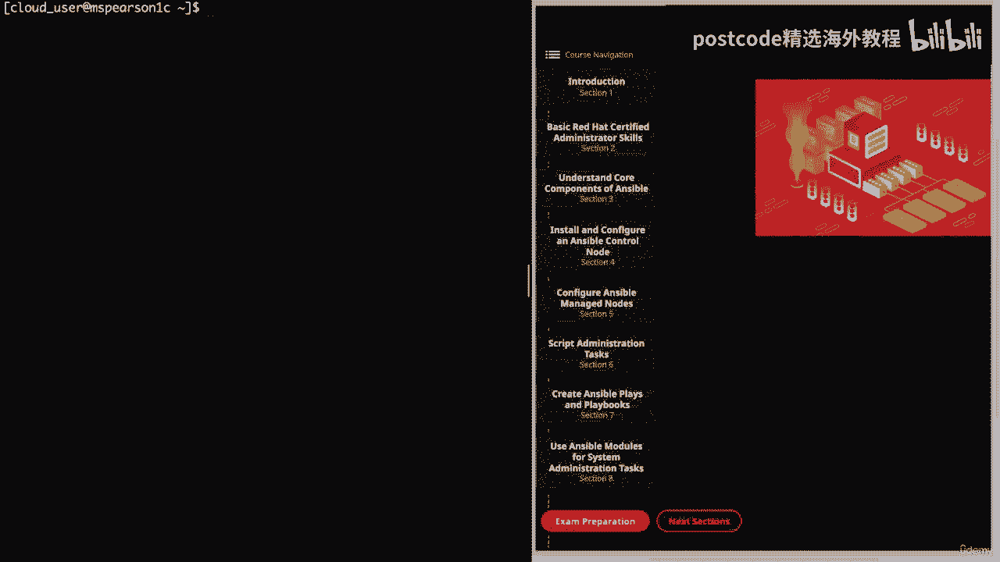

在本节课中，我们将要学习Ansible自动化工具的核心组件。我们将逐一介绍库存、模块、变量、事实、剧本以及配置文件，理解它们各自的作用和基本用法。

## 03-03-001：库存（Inventory）

上一节我们介绍了Ansible的概述，本节中我们来看看它的第一个核心组件——库存。

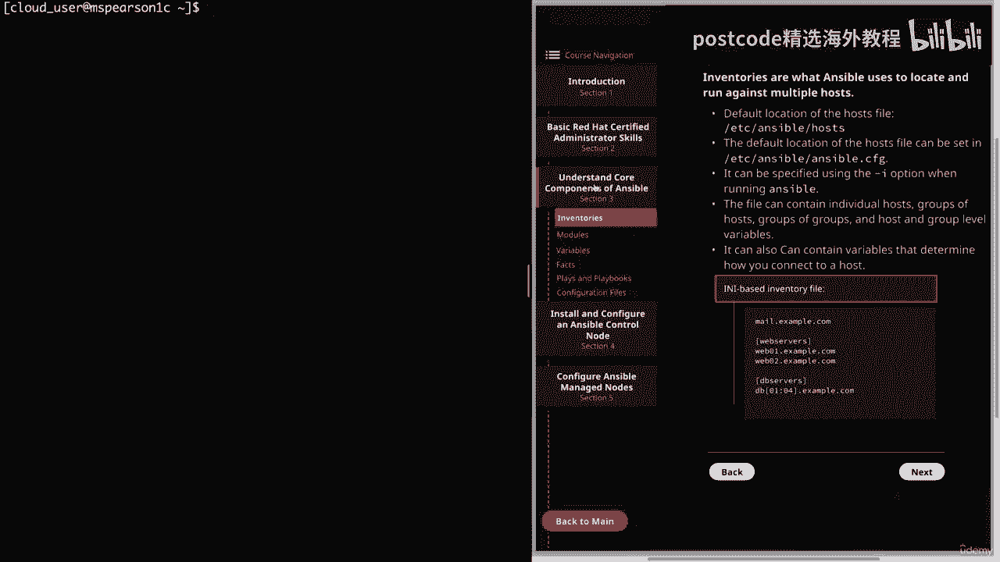

库存是Ansible用于定位和管理多个目标主机的工具。本质上，它是一个包含主机列表的文件。如果不指定库存文件，Ansible将使用默认文件 `/etc/ansible/hosts`。你也可以通过设置环境变量 `ANSIBLE_INVENTORY` 或在配置文件 `ansible.cfg` 中修改默认位置。

库存文件可以包含单个主机、主机组，以及组级别的变量。这些变量可以定义如何连接到主机，例如使用的协议或端口。

以下是库存文件可用的两种不同格式：

**INI格式**（类似Windows的INI文件）：
```
mail.example.com

[webservers]
foo.example.com
bar.example.com

[dbservers]
one.example.com
two.example.com
three.example.com

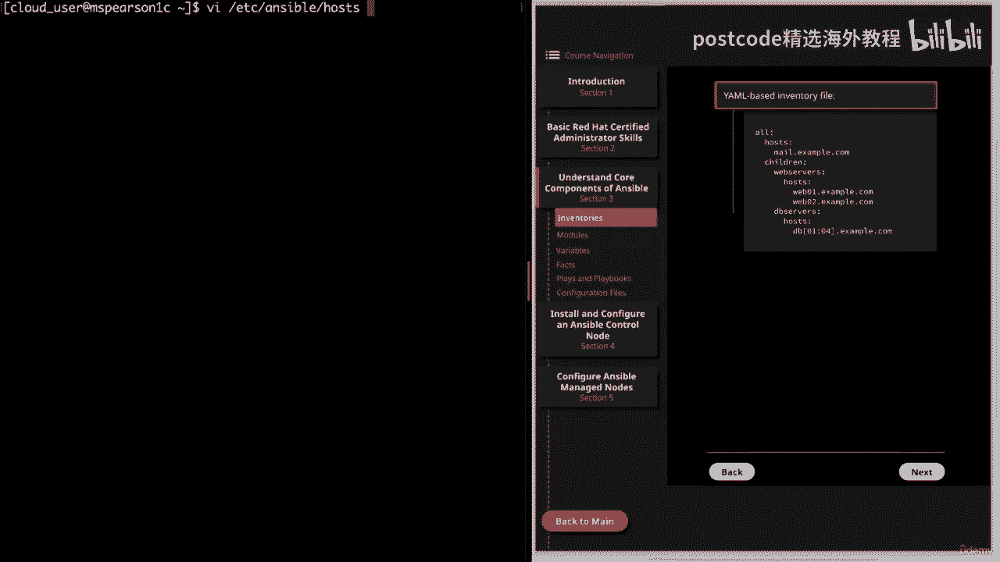

# 使用简写表示多个主机
[dbservers]
db[01:04].example.com
```

**YAML格式**：
```yaml
all:
  hosts:
    mail.example.com:
  children:
    webservers:
      hosts:
        foo.example.com:
        bar.example.com:
    dbservers:
      hosts:
        one.example.com:
        two.example.com:
        three.example.com:
        db[01:04].example.com:
```

你还可以在YAML格式中将组嵌套到其他组中。

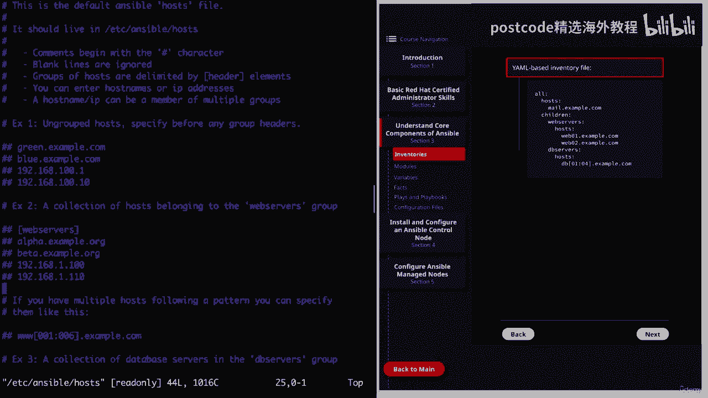

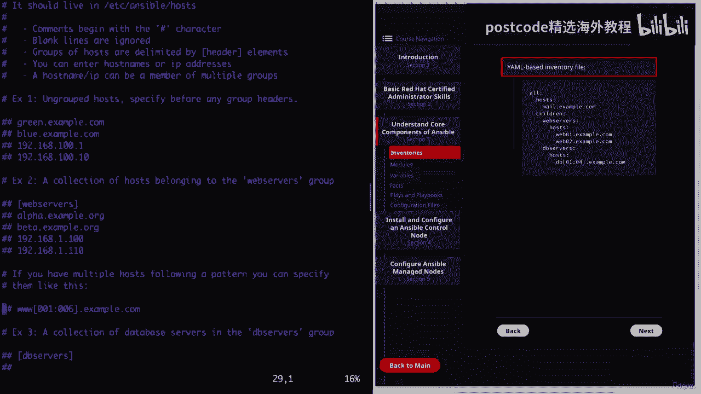

现在，让我们在命令行中查看默认库存文件并创建一个简单的自定义库存文件。默认库存文件位于 `/etc/ansible/hosts`，其中包含许多注释和示例。我们将创建一个自定义文件。

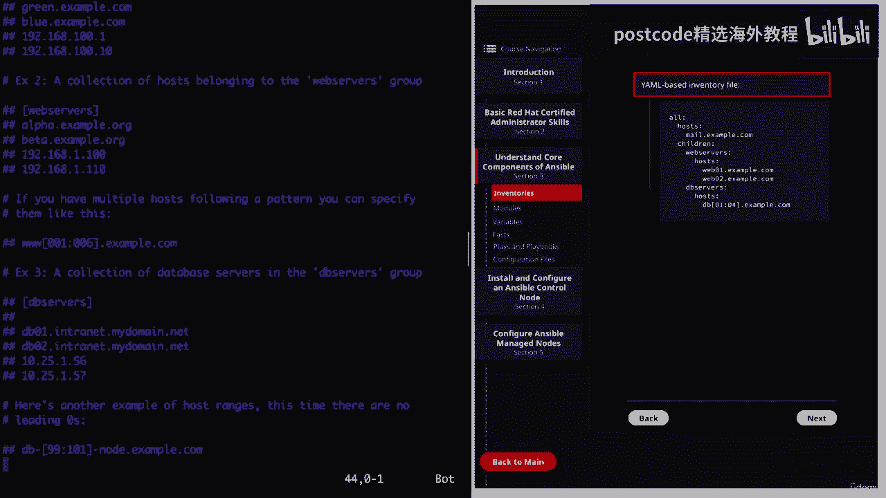

首先，进入主目录下的ansible文件夹（如果没有则创建）：
```bash
cd ~/ansible
```

创建一个名为 `inventory` 的文件（无需特定扩展名）：
```bash
vi inventory
```

在文件中输入以下内容（请根据你的实际主机名修改）：
```
mbspearson1.mylabserver.com

[webservers]
mbspearson3.mylabserver.com
mbspearson4.mylabserver.com

[labservers]
mbspearson[2:6].mylabserver.com
```

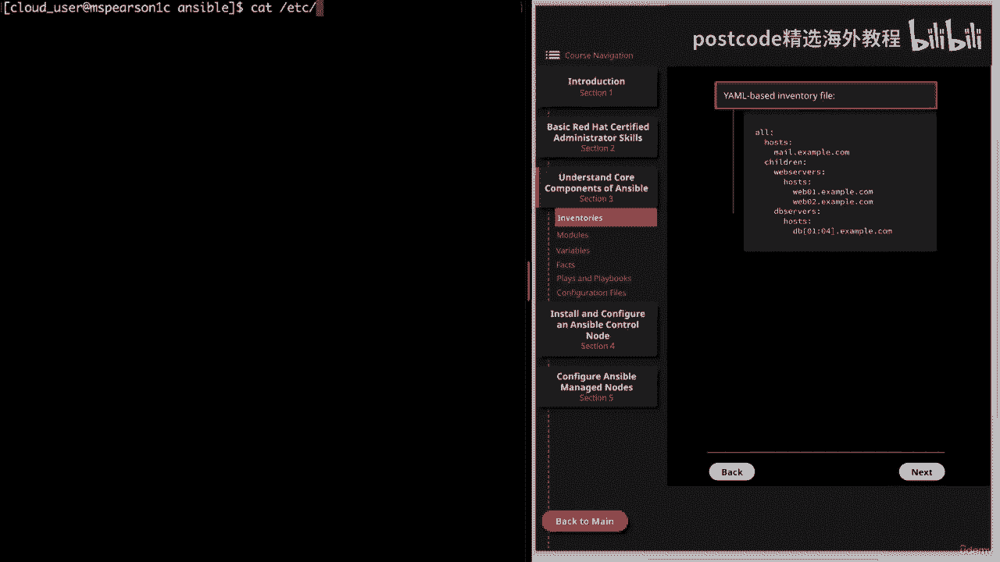

保存并退出。这个文件定义了一个独立主机 `mbspearson1`，一个包含两个主机的 `webservers` 组，以及一个使用简写定义了五个主机的 `labservers` 组。

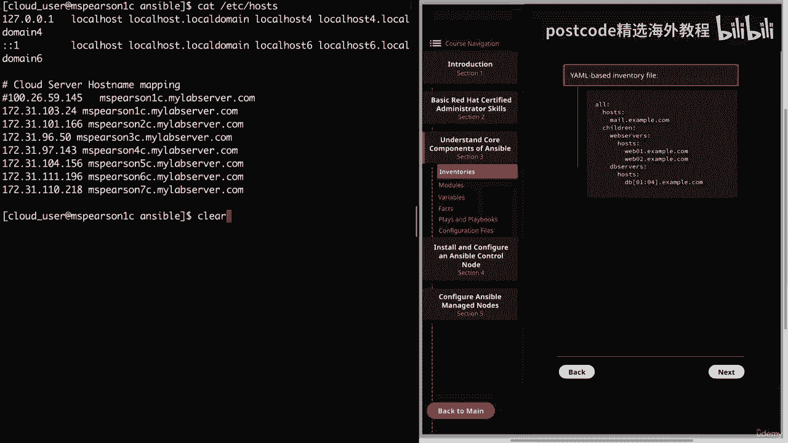

在运行命令前，请确保你的控制节点可以通过主机名解析到这些管理节点。一种方法是在 `/etc/hosts` 文件中添加主机名到IP地址的映射。

现在，我们可以使用 `ansible` 命令配合 `-i` 选项来指定我们的自定义库存文件进行测试。`ansible` 命令用于执行临时任务，`-m` 选项用于指定模块。
```bash
# 针对单个主机执行ping模块
ansible -i inventory mbspearson1.mylabserver.com -m ping

# 针对一个组执行ping模块
ansible -i inventory webservers -m ping
```

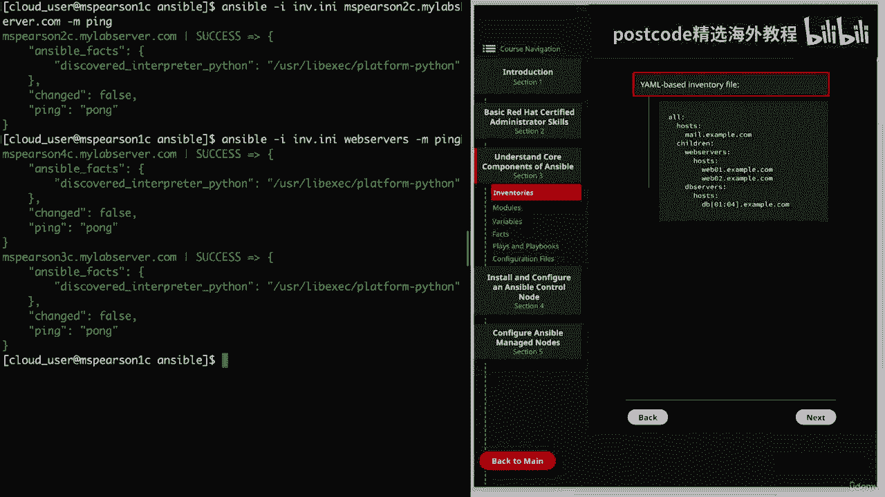

如果连接成功，你将看到绿色的输出和 `pong` 的回复。

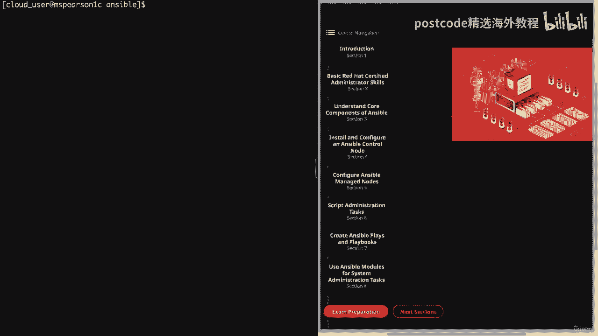

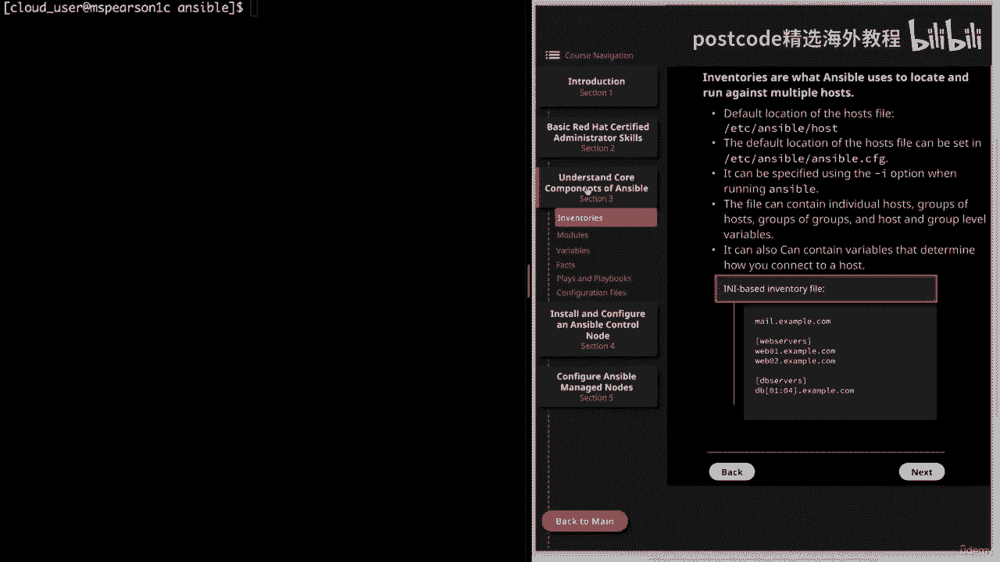

本节课中我们一起学习了Ansible库存的概念，了解了其两种格式（INI和YAML），并实践了如何创建和使用自定义库存文件来管理主机和主机组。

## 03-03-002：模块（Modules）

上一节我们介绍了库存，本节中我们来看看Ansible的第二个核心组件——模块。

模块是Ansible用于执行特定任务的工具。它们允许你与系统上的各种服务（如系统服务、数据库或Web服务器）进行交互。例如，`template` 模块可以帮助你模板化配置文件，然后使用自定义配置进行分发。

模块通常可以接受参数。以 `yum` 模块为例，它常用的参数是 `name` 和 `state`，用于指定要操作的软件包名称和期望的状态（如 `present`、`latest` 或 `absent`）。每个模块都有自己特定的参数。

模块执行后会返回JSON格式的数据。这很重要，因为你可以捕获这些输出，并基于输出结果触发其他任务，这是一种更高级的用法。

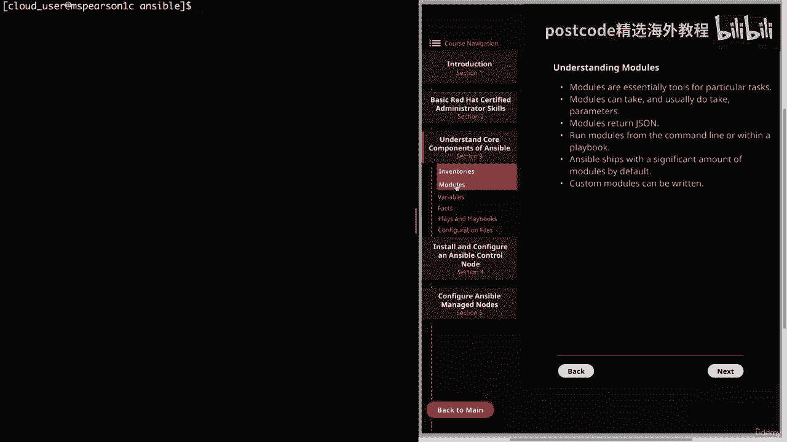

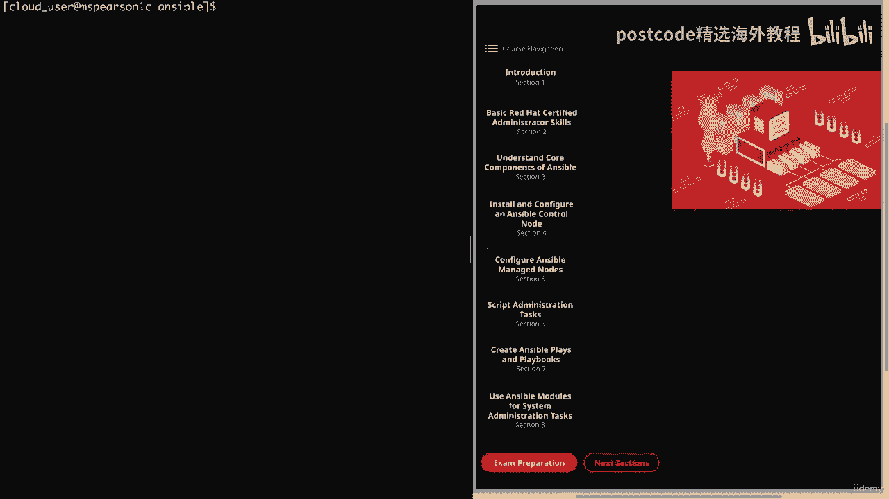

模块可以从命令行通过临时命令运行，也可以在剧本（playbook）中运行。剧本是Ansible的核心，它允许你针对多个主机按顺序执行多个模块。

Ansible默认附带了大量模块，涵盖了从基本的服务管理、防火墙配置到云平台（如AWS）操作等方方面面。对于不存在的特定任务，你还可以使用Python编写自定义模块。

鉴于模块数量众多，熟练掌握Ansible官方文档以查找所需模块及其参数至关重要。对于常用模块及其参数，最好能熟记于心。

本节课中我们一起学习了Ansible模块，知道了它们是执行任务的基本单元，可以接受参数、返回数据，并且既可以通过命令行临时调用，也可以集成在剧本中。

## 03-03-003：变量（Variables）

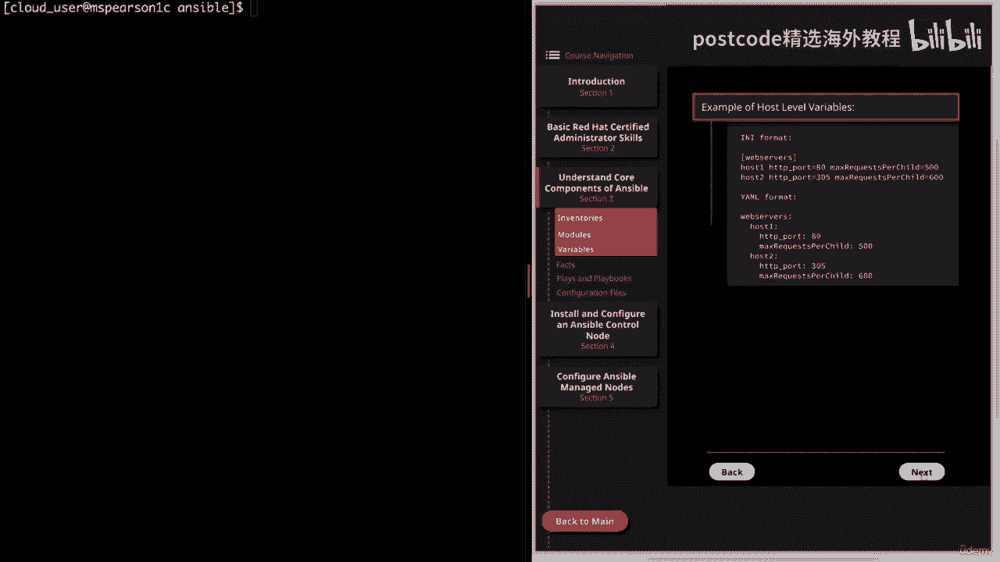

上一节我们介绍了模块，本节中我们来看看Ansible的第三个核心组件——变量。

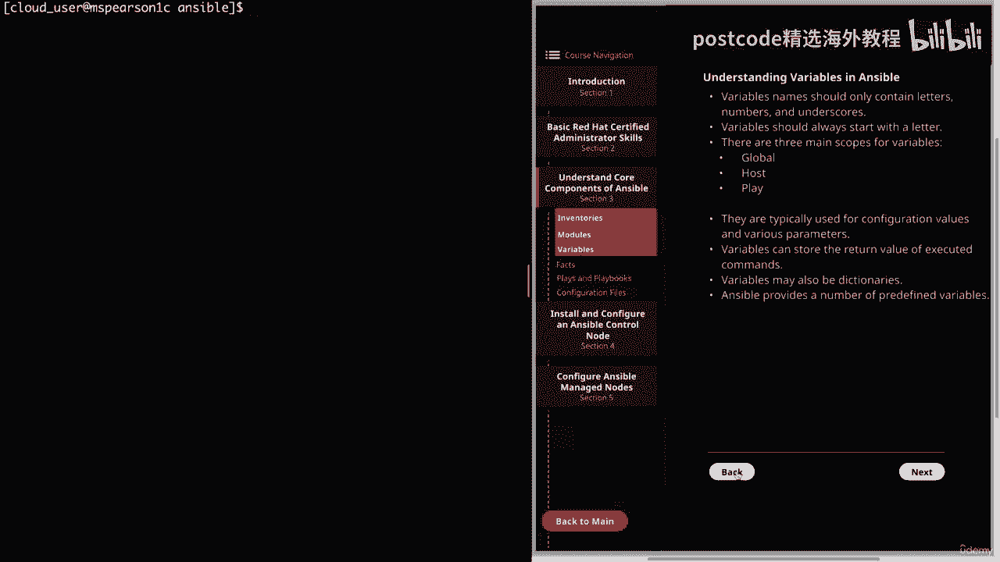

如果你有编程或脚本经验，对变量一定不陌生。在Ansible中，变量用于存储值，这对于管理多个系统至关重要。通过变量，我们可以根据不同的系统或服务，动态地改变连接方式、配置文件内容等。简而言之，变量是Ansible处理系统间差异的主要方式。

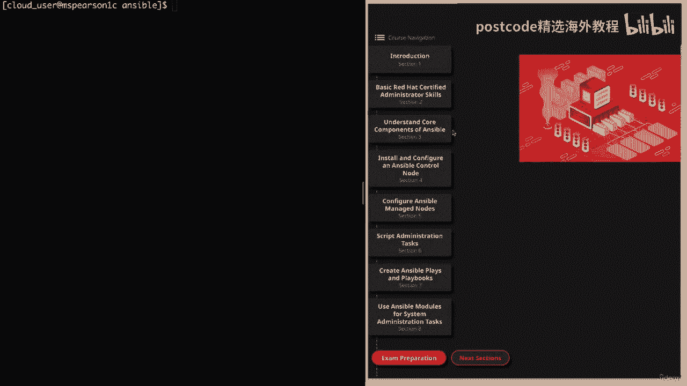

以下是关于变量的一些关键点：
*   **命名规则**：变量名只能包含字母、数字和下划线，并且必须以字母开头。
*   **作用域**：变量主要有三个作用域：
    *   **全局**：通过环境变量或命令行设置。
    *   **主机**：与特定主机或主机组关联。
    *   **游戏**：在剧本的某个play中定义。
*   **用途**：变量常用于存储配置值，如用户名、端口号等。
*   **存储命令输出**：变量可以捕获命令执行的返回值，用于后续的决策逻辑。
*   **数据结构**：变量可以是字典（键值对）形式。
*   **预定义变量**：Ansible提供了许多预定义变量（如 `ansible_facts`），可以在剧本和库存中引用。

以下是一个在INI格式库存文件中定义主机级别变量的例子：
```
[webservers]
web1.example.com http_port=80 max_requests=100
web2.example.com http_port=8080 max_requests=200
```

本节课中我们一起学习了Ansible变量的基本概念、命名规则、作用域以及常见用途，它们是实现配置动态化和差异化管理的关键。

## 03-03-004：事实（Facts）

上一节我们介绍了变量，本节中我们来看看一个特殊的变量集合——Ansible事实。

事实是Ansible在连接到目标主机时自动收集的系统信息。这些信息被填充到变量中，包括IP地址、主机名、操作系统版本、内核版本等。

事实的用途很广：
*   **条件执行**：你可以根据收集到的事实，有条件地执行某些任务。例如，根据操作系统类型选择不同的软件包管理器，或根据主机名执行特定配置。
*   **临时信息查询**：你可以使用 `setup` 模块来获取主机的所有事实。

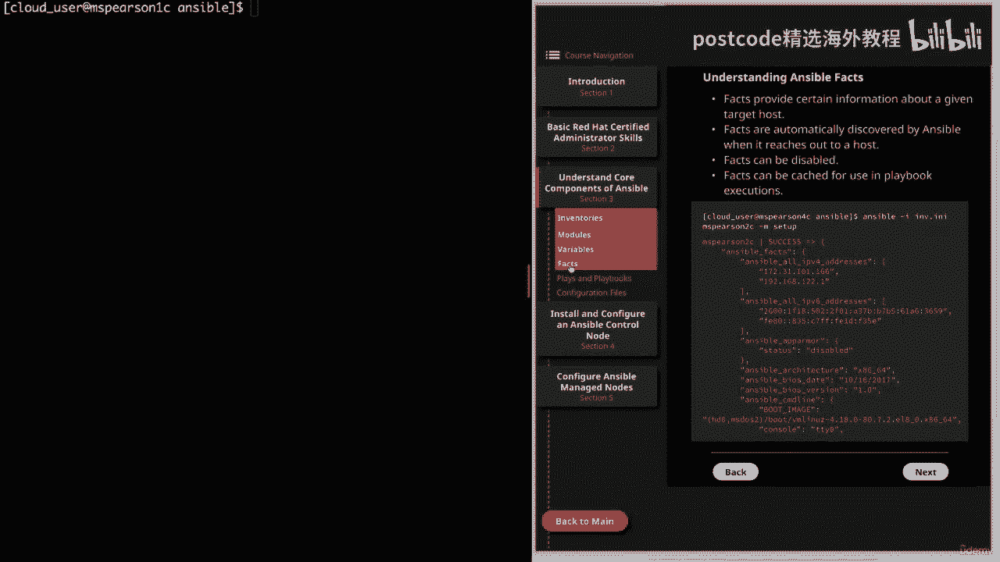

要查看主机的所有事实，可以运行：
```bash
ansible <hostname> -m setup
```
你也可以过滤输出，例如只查看网络信息：
```bash
ansible <hostname> -m setup -a ‘filter=ansible_eth*’
```

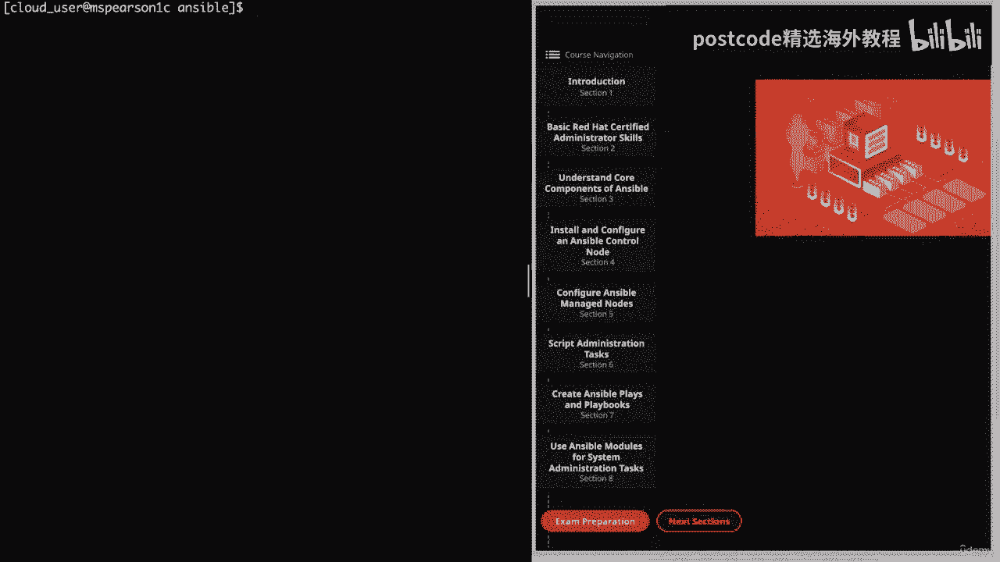


默认情况下，Ansible会在每次执行playbook时自动收集事实。但这会消耗资源，特别是在管理大量主机时。因此，你可以选择：
1.  **禁用事实收集**：在配置中关闭，以提升性能。
2.  **启用事实缓存**：将事实缓存起来供后续playbook使用，这样无需每次收集，既能节省时间，又能让你在playbook中引用其他主机的事实（前提是那些主机的事实已被缓存）。

是否缓存事实取决于你的具体环境和需求。需要注意的是，如果不使用缓存，一个playbook只能引用在本playbook执行流程中**之前**已收集过事实的主机的变量。

本节课中我们一起学习了Ansible事实，了解了它们是自动收集的系统信息变量，可以用于条件判断和信息查询，并且可以根据性能需求选择启用、禁用或缓存它们。

## 03-03-005：剧本和任务（Plays and Playbooks）

上一节我们介绍了事实，本节中我们来看看Ansible的核心编排单元——剧本和任务。

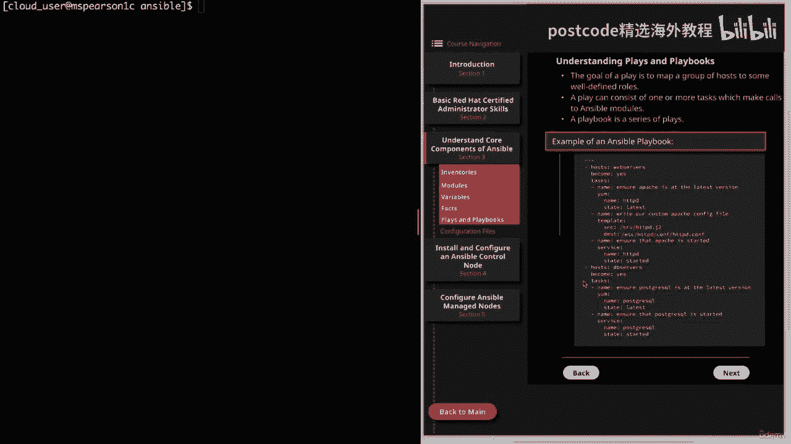

一个**play（游戏）** 的目标是将一组主机映射到一系列明确定义的任务上。一个**task（任务）** 本质上就是对Ansible模块的一次调用。而一个**playbook（剧本）** 则是由一个或多个play按顺序组成的列表。

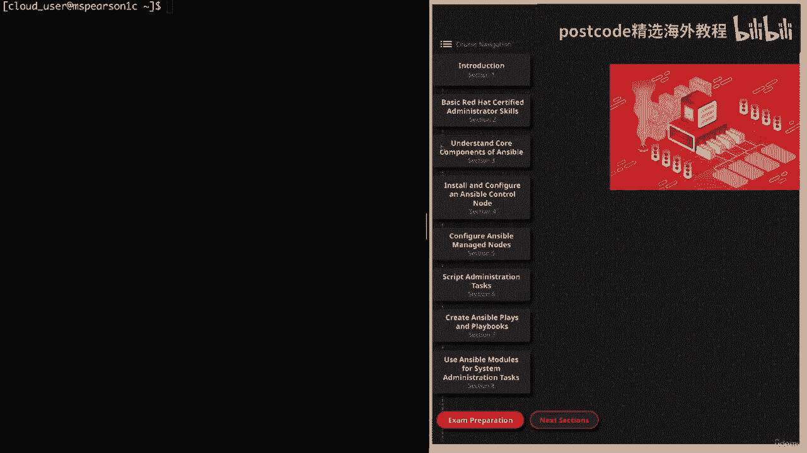

剧本使用YAML格式编写。它指定了在哪些主机上，以什么身份，执行哪些任务，以达到期望的系统状态。

以下是一个简单的剧本示例：
```yaml
- name: Configure webservers
  hosts: webservers
  become: yes
  tasks:
    - name: Ensure Apache is at the latest version
      yum:
        name: httpd
        state: latest

    - name: Write the Apache config file
      template:
        src: /srv/httpd.j2
        dest: /etc/httpd/conf/httpd.conf

    - name: Ensure Apache is running
      service:
        name: httpd
        state: started

- name: Configure databaseservers
  hosts: dbservers
  become: yes
  tasks:
    - name: Ensure PostgreSQL is at the latest version
      yum:
        name: postgresql
        state: latest

    - name: Ensure PostgreSQL is started
      service:
        name: postgresql
        state: started
```

这个剧本包含两个play：第一个针对 `webservers` 组，确保安装最新版Apache、配置文件和启动服务；第二个针对 `dbservers` 组，确保安装最新版PostgreSQL并启动服务。

本节课中我们一起学习了Ansible剧本和任务的基本结构，明白了剧本是通过在主机组上按顺序执行任务来实现自动化配置的蓝图。

## 03-03-006：配置文件（Configuration File）

上一节我们介绍了剧本，本节中我们来看看最后一个核心组件——Ansible配置文件。

Ansible的配置文件名为 `ansible.cfg`，它定义了Ansible的各种行为。Ansible会按照以下顺序查找此文件，并使用找到的第一个：
1.  环境变量 `ANSIBLE_CONFIG` 指定的文件。
2.  当前工作目录下的 `ansible.cfg`。
3.  用户家目录下的 `.ansible.cfg`。
4.  系统默认的 `/etc/ansible/ansible.cfg`。

需要注意的是，如果当前工作目录下的 `ansible.cfg` 文件所在目录是全局可读的，Ansible出于安全考虑将不会自动加载它。

配置也可以通过环境变量单独设置。为当前会话设置的环境变量会覆盖配置文件中的相应设置。

`ansible-config` 命令是一个有用的工具，用于管理配置：
*   `ansible-config list`：列出所有可用的配置选项及其描述和默认值。
*   `ansible-config dump`：显示当前生效的所有配置及其值。
*   `ansible-config view`：显示当前正在使用的配置文件内容。

一些常用的配置项包括：
*   `inventory`：指定默认的库存文件路径。
*   `roles_path`：设置Ansible角色（Roles）的搜索路径。
*   `forks`：设置Ansible并行执行的主机数量，控制并发度。
*   `ansible_managed`：定义插入到由Ansible管理的配置文件中的注释文本，用于提醒用户该文件由Ansible自动管理。

**一个特殊的配置提示**：在某些环境（如课程使用的RHEL 8 Playground镜像）中，可能需要显式设置Python解释器。如果遇到与Python相关的问题，可以在 `ansible.cfg` 的 `[defaults]` 部分添加：
```
[defaults]
interpreter_python = auto
```
这确保Ansible使用Python 3，避免兼容性问题。

本节课中我们一起学习了Ansible配置文件的作用、查找顺序以及如何查看和修改常用配置，从而能够根据需求定制Ansible的运行环境。

---

**总结**

在本节课中，我们一起深入学习了Ansible的六大核心组件：
1.  **库存**：定义了Ansible要管理的主机和主机组。
2.  **模块**：是执行具体任务（如安装软件、管理服务）的工具。
3.  **变量**：用于存储数据，实现配置的灵活性和动态化。
4.  **事实**：是Ansible自动收集的目标主机系统信息，本身也是变量。
5.  **剧本和任务**：剧本（Playbook）编排了在哪些主机（Play）上按顺序执行哪些任务（Task），是自动化的蓝图。
6.  **配置文件**：用于定制Ansible工具本身的各种行为。

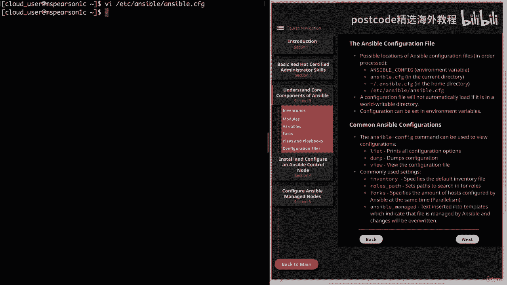

理解这些组件是掌握Ansible自动化技术的基础。从下一节课开始，我们将动手实践，学习如何安装Ansible并运行我们的第一个自动化任务。