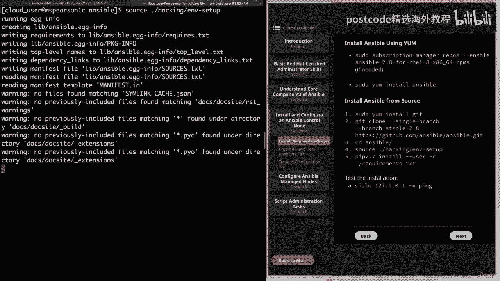

# 红帽企业Linux RHEL 9精通课程 — RHCSA与RHCE 2023认证全指南 - P15：03-03-002 Ansible control node - Install and configure - 精选海外教程postcode - BV1j64y1j7Zg

我们将开始第四部分，即安装和配置 Ansible 控制节点，我将，向您展示如何安装 Ansible 所需的软件包。因此，让我们继续单击第四部分，您会注意到正在安装的两个不同标题。

Ansible，使用 Yum，然后从源安装 Ansible。这样做的原因是我将首先向您展示如何在 Red Hat Enterprise 上安装 Ansible，Linux 主机。

已正确订阅 Ansible 2。8 存储库。然后我将向您展示如何在无权访问的计算机上从源代码安装它，到那个仓库。原因是我们的 RHEL 8 游乐场服务器中的存储库没有，Ansible 的最新软件包。

这主要是因为 Rail 8 是一个非常新的操作系统，来自 Red Hat，于 2019 年 5 月 7 日刚刚发布，我们的镜像所依赖的存储库有，尚未更新以包含这些软件包。话虽如此。

我实际上将向您展示如何做到这两点。但对于本课程，我将使用从源代码安装的 Ansible，因为我将使用，我们的游乐场形象。好吧，让我们继续使用 Yum 安装 Ansible。正如您将看到的。

它非常非常简单。目前我已登录到 Red Hat Enterprise 8 的本地安装。它只是一个虚拟机，并且此安装确实可以访问所需的存储库。那么让我们一起来看看吧。我将返回到命令行。

首先我将进行快速 yum 搜索，安西布尔。正如您所看到的，我们没有找到匹配项。原因是即使我确实可以访问 Ansible 存储库，但我还没有启用，还没有订阅管理器。所以我将向您展示如何快速做到这一点。

因此，首先我要做一个订阅管理器存储库，然后是破折号列表。然后我将 grep 查找 Ansible。

我们在顶部看到我们的 Ansible。

2。8 回购。所以我要快速复制，这样我就不必将其打印出来。

避免我犯一些错误。清除它，然后为了启用它，我们将使用订阅管理器。转发。破折号，破折号，启用。然后将我们的存储库提供给它。我们看到我们的存储库已为系统启用。让我们继续做我们的美味吧！再次搜索。

为了验证这一点。我们看到 Ansible 包。那么让我们继续使用 Yum install 来安装它。添加破折号 y，然后添加 ansible。这可能需要一分钟时间。

所以我会继续并快进，这样您就不必等待。好的。我们的软件包已成功安装，如您所见，这就是全部内容。因此，当您启用存储库后，您所要做的就是大喊一声，安装 Ansible，然后就可以了，现在设置为从源安装。

它有点复杂，但还不错。为此，我们将转到我为此设置的 Cloud Playground 图像。它位于我们的第二个选项卡中，位于 MZ Pearson one C 上，尽管它有点复杂，其实还是很简单的。

这是因为 Ansible 并不是传统意义上的软件，没有服务守护进程或数据库设置。当然，将会有需要设置的脚本和命令，但这些都是从，用户的主目录，我将立即向您展示该目录。但请记住。

如果您想做任何需要提升权限的事情，则需要，为用户设置，并且考虑到它将从用户的主目录进行操作，这意味着某些默认目录和配置文件不会被创建，就像您只进行 Yum 安装时他们会做的那样。因此。

示例就是创建的 ETSI Ansible 目录，该目录将具有，您的 ansible CFG 和主机文件以及 ETSI ansible 角色。因此，我们实际上必须手动添加这些文件，然后填充默认文件。好的。

所以我们需要做的第一件事是安装 Git，这是因为我们要克隆 Ansible，获取回购协议。让我们继续用伪也门的目标来做，记住这是真正的八个，所以你，可以使用 DAFF 安装而不是 yum 安装。

我更喜欢在这里使用 Yum，因为 ansible 文档使用 yum，但请记住 Yum，实际上是在真实八中与那个 DNF 互动。好的。所以我们要继续在我的仪表板上安装 git。为什么？

现在我们已经安装完毕，我们可以运行我们的克隆了。但在我们这样做之前，我实际上要创建一个 git 目录，这样我们就可以使用该目录，拉取我们的克隆。

我们可以使用家庭云用户 Ansible 作为我们的主要工作目录，课程。那么让我继续解决这个问题。您会看到我们已经位于云用户主目录中，因此我将继续执行 mkdir，并创建一个 Ansible 目录。

该目录将再次成为我们课程操作的主要基础。然后我还将创建一个名为 Git 的目录，这就是我们要下载的目录，获取克隆。所以我们会在那里看到。现在我们可以继续克隆我们的 get 存储库。为此。

我们将使用 get clone。然后我们将使用破折号指定一个分支。单身的。达世币分支。然后分支就会稳定。然后是 2。8，我们选择 2。8 版本，因为这是 Red Hat 考试所基于的版本，在。

如果我们没有指定版本，它只会提取存储库中的最新版本。因此，让我们继续指定 URL。这就是 HTTPS。冒号斜杠。削减。GitHub 斜线。Ansible 斜杠。安塞布尔，得到。好的。让我们开始吧。

现在它将将该存储库克隆到名为 Ansible 的目录中。我会继续加快速度，这样您就不必等待。

现在已经完成了，让我们继续播种到我们新克隆的存储库和 Ansible 中。

我们可以列出清单。正如您所看到的，有几个不同的文件和目录将用于安装。因此，我们需要做的下一步是获取环境设置脚本。继续解决这个问题。

正如您所看到的，它将设置一些环境变量并添加一些目录，走向我们的道路。这样我们就可以使用所有 Ansible 命令。它还将设置 Python 路径和 man 路径，这将使我们能够访问我们的，文档。因此。

让我们继续清除这一点并记住，一如既往，您可以通过执行以下操作来呼应您的路径，回显点符号路径，您会看到我们已针对当前会话进行设置。但您确实需要记住的一件事是这些环境变量只会，持续当前会话。

因此每次登录时都必须为其提供资源。但如果您想使其永久化，您可以随时将其添加到您的批次配置文件中。因此，让我们继续快速行动。

它位于我们的主目录中，并且是点 bash 下划线配置文件。现在我们可以转到该文件的底部，然后添加一行，获取我们的最终设置脚本，然后我们需要该脚本的路径，该路径位于 home 中。

然后设置 Ansible Hacking 和 EV Dash。现在，每次我们登录主机时，它都会获取我们的设置脚本。这样我们就不必每次登录时都这样做。好的。现在让我们继续并结束这个问题。

然后我们需要做的最后一件事是使用 PIP 安装我们的依赖项，然后我们，可以通过打开需求测试来查看这些依赖关系。

我们先来看看吧。正如您所看到的，它将安装 Jinja 两个 py yaml，然后安装密码学。

那么让我们结束这个吧。我将继续清除此内容，然后我们可以运行 PIP 2。7，然后进行安装。

破折号破折号用户破折号。啊。然后要求点txt。这样我们所有的依赖项就都安装好了，它也完成了我们的 ansible 安装，来源。目前我们没有配置任何托管节点，但我们可以通过以下方式测试安装，攻击本地主机。

让我们继续前进吧。我们将使用 Ansible。正如您所看到的，我能够点击完成。这是因为所有 Ansible 命令都在我们的路径中，这当然是由我们的设置建立的，脚本。因此，我们使用 Ansible 命令。

该命令用于临时命令，然后输入 127。0。0。1，然后我们将使用 ping 模块。正如您所看到的，我们收到一条警告，让我们知道没有解析任何库存。所以它只是使用隐式本地主机。但即使我们没有提供清单。

我们也能够 ping 通本地主机，这让我们能够，就知道我们安装成功了。好了，关于安装所需软件包的视频就到此结束了。请记住，我将使用这个特定的主机，我已经从源代码安装了它，以用于剩余的时间，课程中的视频。

现在您可以将视频标记为完成，我们将继续下一课。在本视频中，我们将介绍如何创建静态主机清单文件。因此，让我们继续点击安装并配置 Ansible 控制节点，然后开始。

我们将单击创建静态主机清单文件。

因此 Ansible 清单只是 Ansible 管理的所有主机的列表。Ansible 通过这种方式了解需要针对哪些主机执行操作。库存文件可能包含主机、模式、组和变量。我将立即向您展示其中每一个的示例。

但最好一开始就知道清单可以是单个主机或更复杂的主机，主机组，甚至嵌套在其他组下的组。接下来，可以使用目录来指定多个清单文件。因此，您还可以指定一个包含以下内容的目录，而不是指定单独的清单文件。

多个清单文件，清单文件可以以 IAE 或 YAML 格式指定。再说一遍，这很大程度上取决于偏好。但我会注意到默认的主机文件示例是 I 和 I。但有些人更喜欢 YAML，因为它的可读性。

更不用说您将在剧本中使用 YAML。现在我们来谈谈库存位置。因此，如果没有引用其他库存，则将使用默认值，即，Etsy Ansible 主机。但您也可以使用破折号标志在命令行中指定另一个清单文件的位置。

因此，如果您运行 Ansible 是为了运行 Ansible ad hoc 命令甚至 Ansible Dash playbook，为了运行剧本，您可以指定 dash AI，然后指定库存文件的路径，以及。

将使用默认值。您还可以更新 Ansible CFG 以更改主机文件的默认位置。

好的。现在让我们进入下一页。在我们继续之前，我确实想提一下库存文件可以是动态的，这意味着，您可以使用脚本来生成库存，只要它返回 JSON。然而，这超出了 RHC 考试的目标范围。但我确实想提一下。

以防万一您遇到这个术语并且不希望您感到困惑，关于静态与动态。其用例通常是主机可能存在的云基础设施，改变得非常快。这样您就可以使用脚本来返回实际活动的主机。好的。因此，在页面顶部。

我提供了一个基于铁的库存文件作为示例。顶部是我们所有团队祝酒的地方。正如您所看到的，我们只有一个主机，这是邮件点的示例。然后在那之后，我实际上提供了一些将专门处理的变量，以邮件点为例，com。

这是 ansible 下划线端口，然后我给出一个值，即，五、五、五、六，然后 Ansible 下划线主机，即 192。168。 0。20后结束组，主机是您可以添加主机组的位置。为此，您将有一个标题。

其中括号中包含您的小组名称，然后是，由属于该组的所有主机执行。另外，请注意，我这里有另一个标题，该 Web 服务器是 Colon VAR，这就是，我们正在为整个主机组设置变量。如果我们愿意。

我们可以像在邮件示例 dot com 中那样添加变量。但是，当我们为组指定它时，这将适用于该组中的每个主机。因此，如果您有任何变量需要在主机之间有所不同，请确保指定，位于行中而不是位于组变量下。最后。

我们还有另一个组，称为数据库服务器，该组下的主机有，是用速记法表达的。因此，这将是 DB 0 1 到 DB 99 的示例。好的。现在我们已经了解了基于 Ironi 的基本库存文件的示例。

让我们来谈谈一些，库存变量、最佳实践。正如您在这个示例中注意到的，我有一些直接与主机绑定的变量，并且，与一组主机关联的变量。我们继续来说说这些变量应该如何表达。因此。

第一个变量应该存储在相对于清单文件定位的 YAML 文件中。所以我们的意思是，假设您有一个位于家庭云用户中的库存文件，Ansible，这将是我们的主要工作目录。

然后你应该创建主机下划线VARs和组下划线VARs目录以便存储，那些变量。就像我说的，您可以将它们直接添加到库存文件中，但最佳实践是将，它们位于相对于清单文件本身的这两个目录中。最后。

存储在该主机中的变量文件下划线 VAR 和组下划线，VAR 目录应以它们包含变量的主机或组命名，并保留，请记住，文件可能以 HTML 或 YAML 结尾。因此，在我们的示例中。

我们有当前不在组下的邮件示例，除了所有和欠分组的默认组之外，我们将在一分钟内讨论这些组。因此，对于我们指定的这两个变量，我们需要在主机下划线下创建一个文件。

名为 mail dot example dot com 的变量。主机名也是如此。然后，如果我们愿意，我们还可以添加点电子邮件或 yaml，然后我们只需添加两个，变量。

对于 Web 服务器的组变量也是如此。除此之外，我们会将其放在一组下划线 VAR 中，然后将文件命名为 web，服务器。当然，同样，您可以添加 HTML，HTML，然后添加您的变量。好的。

现在让我们进入下一页。在这个例子中，我提供了一个基于 YAML 的清单文件，它实际上与 INI 文件相同，在上一页。但我想向您展示该格式在 YAML 中的样子，现在可能是提及的好时机，库存有两个默认组。

这将是全部并且脱节。全部包含清单文件中列出的每个主机，无论它是否属于组的一部分，或不。然后联合国分组将包含当前没有其他组的所有主机，来自所有。因此默认情况下，每个主机将属于至少两个组。因此。

如果您以邮件、。 示例、。 com 为例，它将成为所有内容的一部分，组以及分组组。然后，如果你以 Web 零为例，一个例子，它将成为所有组的一部分，然后还有 Web 服务器组。

这实际上在 YAML 中得到了更清楚的说明，这也是我提出的部分原因，现在就起来吧。正如您所看到的，当您指定基于 YAML 的清单文件时，它将以 all 和，那么下一个标题将是主机。

这是您将放置所有分组主机的地方。正如您所看到的，这两个变量是在主机下面指定的。然后和host同级，可以指定children。然后在孩子下您将指定您的组。因此，Web 服务器和数据库服务器。

然后在每个组下，您将指定您的主机，然后，您还可以指定主机级别变量。好的。所以现在我要转到命令行，我们实际上要创建我们自己的静态，主机清单文件。让我们继续检查一下我们的位置。我们在主目录中。

让我们继续并让步给 Ansible。实际上，我将继续创建一个名为 inventory 的目录，我们将使用，这只是为了存储我们所有的库存文件。这样，它就可以将事物分开并使它们变得更干净一些。

让我们继续在您的库存中执行此操作。然后我们将对此进行播种。现在我们可以继续制作我们的库存文件。我将称之为 MF Dot。和我。正如该扩展所示，我们将使用 AI 和 AI 格式。

我们需要做的第一件事是列出我们分组的主机。因此，我将指定一个名为 RMS Pierson 2 的主机，然后我实际上将执行一个内联变量。我将调用 Ansible Underscore Host。

然后我们将提供实际的主机名。这是 MHS Pearson 来查看我的实验室服务器。这只是让我能够将该主机称为 MHS Pearson，而不必给出，整个主机名。它还说明了行内变量的使用。好的。

现在让我们往下写几行，我们将添加我们的第一组，这组我只是，将其称为实验室服务器。请记住，我们确实将其放在括号中，这将包括我发现的所有受管节点，用于我的 Ansible 安装。当然，也少不了MBS皮尔森。

所以我们将使用 RMS Pierson。然后我不想把它们全部列出来，而是想使用速记。所以这将是三到六。看，点我的实验室服务器。好吧，现在让我们开始创建另一个组。这将是 Web 服务器。

该组将包含 MZ Pearson 3 个 C。我的实验室服务器。我不会把它写出来，而是将其拉出来，然后再次粘贴，我们可以替换，三加四。然后我们将添加一组我们称之为数据库服务器的组。

我差点忘了我的括号在那里。我们继续并再次粘贴主机。这将是五个，这将是六个，这将完成我们的库存文件。快速回顾一下，我们有一个烤箱分组主机，这是 GM 皮尔逊，当然我们是。

使用变量将其链接到其实际主机名（RMS Pierson）以查看我的实验室服务器。然后我们有一个包含所有受管节点三到六的组，然后我们有，另外两组。我这样做的部分原因是向您展示主机可以是多个主机的一部分。

组。因此，如果您在这里使用 RMS Pierson 3 C，它位于实验室服务器组中，并且也位于 Web 服务器中，组，并且它也将成为默认组 all 的一部分。然后是 RMS Pierson 2。

它既是团体组的一部分，也是全体组的一部分。好的。让我们继续保存它。在我们继续之前，我想向您展示如何使用主机下划线病毒目录，与清单文件相同的目录，以便存储这些主机级变量。请记住。

即使您可以像我们在环境文件中那样存储变量，它也是如此，实际上，最佳实践是将其放入主机下划线变量中。那么让我们继续创建该目录。托管下划线 VAR，然后我将打开我们的库存文件备份。我要复制我们的变量。

当我们在这里时，让我们继续删除它。所以现在我们的库存文件中不再有任何变量。我要保存它。现在让我们看看主机变量并记住变量文件的名称需要与，它所引用的主机。请记住，我们也将其称为 MZ Pierson。

因此，让我们创建一个名为 MBS Pierson 2 的新文件，如果我们这样做，该文件可以以点、yaml 或点 HTML 结尾，想。但我只是将扩展名留空。由于这是一个 YAML 文件。

因此我们将以三个破折号开头。然后我们可以粘贴我们的变量，我将把它放入 YAML 格式。所以我们要删除等号并添加冒号和空格，现在我们可以继续并保存它，文件，我们已经成功创建了一个主机变量文件。

所以让我们继续解决这个问题。不幸的是，我们还没有配置我们的 Ansible 托管节点，所以我们实际上无法，测试我们的库存文件。但我们将在这之后的几个视频中解决这个问题。但在结束这个视频之前。

我想向您展示最后一件事。让我们转到最后一页。这就是如何使用嵌套组或组组。在此页面上，我提供了 AI 和基于 AI 的示例以及基于 YAML 的示例。所以如果你看最上面的一组，那就是我和我，我们有两组。

东组和西组，每组，下面有两个主机。如果你看最后一个标题，我们有美国科隆儿童。这就是您在此处指定希望在该组下有子组的方式，冒号。正如您所看到的，我们已将东部和西部添加到美国组中。

如果我们查看基于 YAML 的示例，实际上更容易看出哪个是每个，通常用于 YAML。所以一切都会像我们习惯看到的那样开始。然后在所有下面，您可以放置​​孩子，这就是您要指定您的组的地方。然后是美国组。

就像我们在 all 下所做的那样，您还可以再次指定孩子，这将允许您，指定这些子组。然后在每个子组下，您还可以指定主机，然后指定这些组下的主机列表。好了，视频就到此结束了。因此，继续并将其标记为完成。

我们就可以继续观看下一个课程视频。

我将向您展示如何创建自定义配置文件。这将结束第四部分，即安装和配置以及 Ansible 控制节点。

因此，让我们继续单击第四节，然后创建一个配置文件。

然后我们将进入命令行。我要做的第一件事是创建 Ansible 目录，然后添加默认目录，主机和配置文件。我本来打算在视频之前这样做，但我决定继续演练这个，与你。这样您就可以自己进行设置。

而不会在我引用时感到困惑，ETSI、Ansible、Ansible、cfg 或 ETSI Ansible 主机。那么让我们继续这样做吧。现在，如您所见，我当前以 root 身份登录。

并且位于 Etsy 目录中，所以让我们开始吧，继续并创建我们的 Ansible 目录。我将继续创建一个 rolls 目录，然后我们将看到，到 Ansible 中。

他们将从我们的示例中复制默认的 Ansible CFG 和默认主机文件，我们的 git 存储库中的目录。让我快速向您展示这一点。它将位于家庭云中，下划线用户，然后获取 Ansible，然后获取示例。

正如您所看到的，有一些不同的文件和目录，但我们将重点关注，Ansible、CFG 和主机文件。让我们继续使用 CPP，这是家庭云用户，然后获取 Ansible 示例，他们将继续。

获取 Ansible CFG。直接将其复制到此处，然后我只需点击向上箭头即可。去吧，抓住那些。继续把它列出来。我们看到我们有 Ansible CFG 和主机文件以及角色目录。好的。

现在我们已经填充了这些内容，让我们继续清除它，然后我们可以打开 ansible。

cfg。在顶部，它再次告诉我们 Ansible 将读取该内容的优先顺序，Ansible CFG。再说一遍，在当前工作中，首先是环境变量，然后是 Ansible CFG，目录。

然后是主目录中的 Ansible CFG。最后，etsi、ansible、a​​nsible cfg。再说一次，当它找到 ansible cfg 文件时，它不会寻找任何其他文件。如果你看一下图表。

你会注意到我在底部再次添加了这个，然后移动，在配置文件中，我们将看到默认标题，这将被表达，括号内的。

这是需要注意的非常重要的事情，因为 Ansible 不会知道如何关联，您的配置，除非它位于标题下。

因此，每当我们制作自己的自定义配置文件时，我们都需要确保我们拥有正确的。

标题，这样我们就会看到一堆具有基本默认值总和的评论。所以我们这里有库存，库模块，utils fork，伪用户。如果我们想更改其中任何一项，我们可以直接将其拉出并粘贴进去，然后。

只需取消注释并将其值更改为我们想要的值即可。

但我们将保留它的所有默认设置，因为我们将创建我们自己的。

自定义配置文件。因此，继续撤消该操作。

然后我们可以再向下滚动一点。现在我们看到戏剧将默认收集事实，我们之前已经讨论过这一点。如果您想禁用事实收集，则需要更改此设置。所以目前我们知道它被设置为隐式，这意味着它总是会收集事实。

但是你也可以将其设置为“智能”，默认情况下它会再次收集，但它不会，重新收集有关该主机的事实是否已收集。然后我们有显式的，这将告诉 Ansible 默认情况下不要收集事实，而是。

你必须在你的剧本中指定、收集、强调事实。好的。让我们继续往下翻页。在这里，它向您展示了如何更改收集的事实类型。然后我们还有一个收集超时。继续并再次向下翻页。我想注意的另一个设置是滚动下划线路径。

这将设置一个或多个默认目录，您可以在中用冒号分隔它们，您希望 Ansible 搜索您在其中的角色。我们还可以指定 SSH 超时等内容。WHO？远程下划线用户默认设置为。然后。

如果我们使用 shift g 转到文件末尾，我们会注意到一些不同的标题。我们这里有差异，甚至有颜色。这向我们展示了我们可以进行的配置，以更改实际的颜色输出，Ansible 为我们提供了。

好的。现在让我们继续并关闭该文件。我要继续清理屏幕。现在让我们继续创建我们自己的简单的自定义配置文件。请记住，我们未设置的任何值都将使用默认的 ansible 值，那个特定的项目。

让我们继续注销 root 用户。看到我们在我们的家庭云用户目录中。让我们继续播种 Ansible，这将再次成为我们的主要工作目录。现在我们可以创建自定义配置文件，当然它将被称为 Ansible Dot。

CFG。正如我们在默认的 ansible 配置文件中看到的，有大量的评论，主要是，只是向我们展示当前的默认设置。所以相比之下，我们的文件看起来很小。因此，我们需要记住的第一件事是添加标题。

所以我们要添加默认设置。现在我们可以添加我们的配置。我要添加的第一个是 Python 解释器。所以这就是翻译。下划线Python。等于顺序。请记住，我们需要添加此内容。

以便可以覆盖自动下划线遗留的默认值，因为默认情况下它指向Python中的用户，它指向这些云上的Python 2，服务器。

将其设置为 auto 将使用用户实时执行平台、dash、python Simulink，其中，将指向Python 3。我们这样做是为了防止出现警告，这样我们的 Yum 模块也可以在云上运行，服务器。

好的。因此，我们要覆盖的下一个配置是库存。现在我们要把它设置为家。云用户。Ansible，然后是我们的清单目录，然后是我们的主清单文件。最后，我们将更新 Rolls Path。请记住。

我们实际上可以为 Ansible 添加多个目录来搜索角色。因此，我们将保留默认值，即 ETSI Ansible 角色。然后我们可以通过用冒号删除来添加另一个目录。它将是家庭云，强调用户 Ansible。

然后是角色。通过这三个条目，我们创建了自己的 Ansible 配置文件。因此，让我们继续保存并退出。然后我想做的最后一件事就是创建 rolls 目录，因为它还不存在。所以 mkdir 滚动。

在我们完成之前，我将继续添加解释器下划线 python equals auto，到我们默认的 ansible cfg。那只是因为无论我们使用什么 ansible 配置文件，我都希望它始终能够。

让解释器下划线 python 等于 auto。由于我们目前没有路线，我将继续进行伪路线。这就是 Etsy。Ansible，然后是 Ansible dot cfg。也就是说，如果我可以正确输入密码。

我们就这样吧。

因此，在这些默认值的顶部，我将继续添加解释器。

下划线Python。等于自动。好吧，让我们继续保存它。本视频就到此结束。

