# 红帽企业Linux RHEL 9精通课程：P15：03-03-002 Ansible控制节点 - 安装与配置

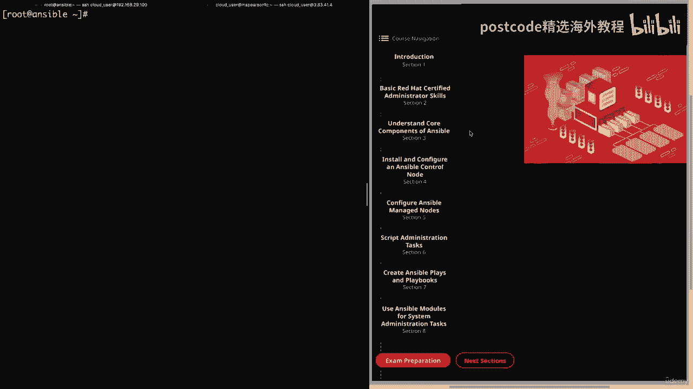

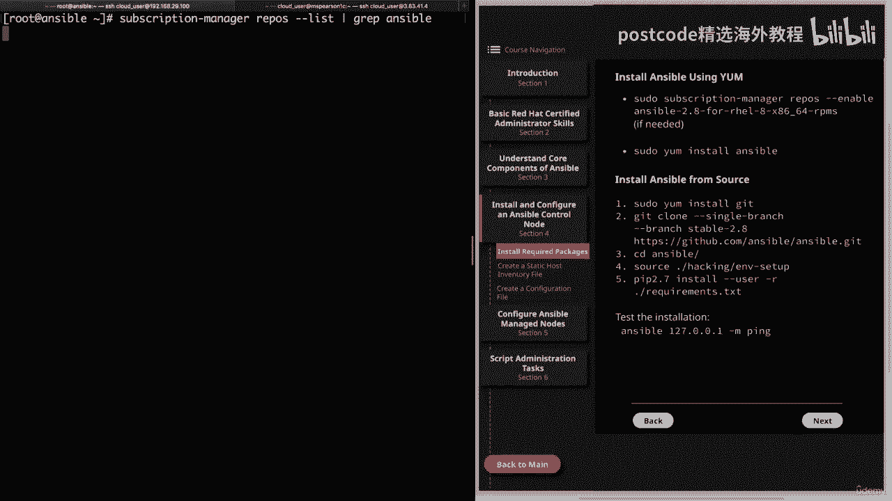

## 概述
在本节课程中，我们将学习如何安装和配置Ansible控制节点。主要内容包括通过Yum包管理器安装Ansible、从源代码安装Ansible、创建静态主机清单文件以及配置自定义的Ansible配置文件。我们将使用Red Hat Enterprise Linux 8环境进行演示。

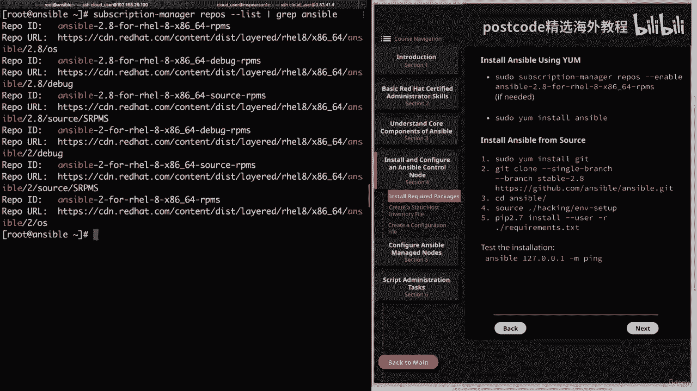

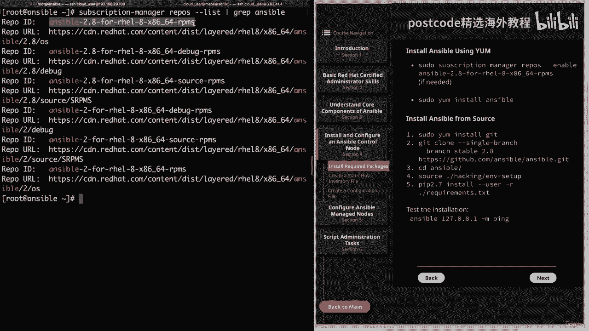

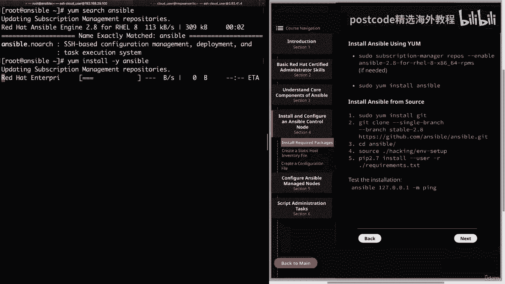

---

## 通过Yum安装Ansible
首先，我们来看如何在已订阅了正确软件仓库的Red Hat Enterprise Linux主机上使用Yum安装Ansible。

### 操作步骤
以下是使用Yum安装Ansible的具体步骤：

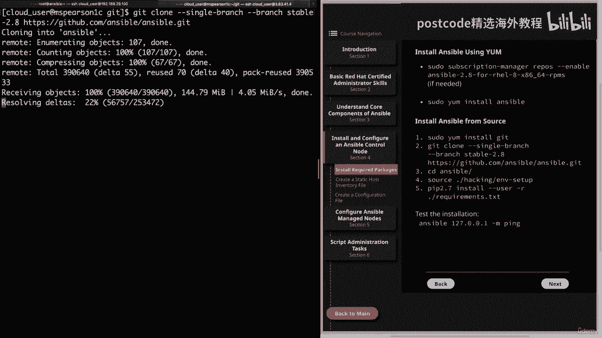

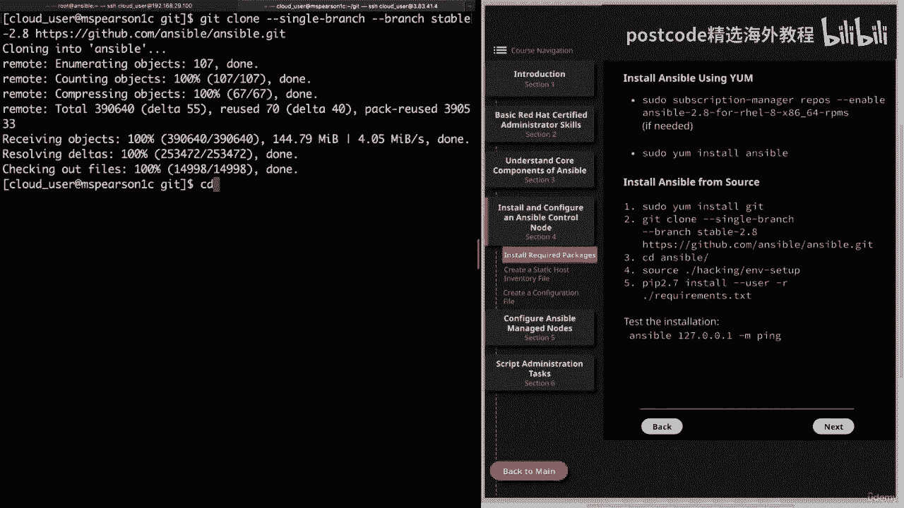

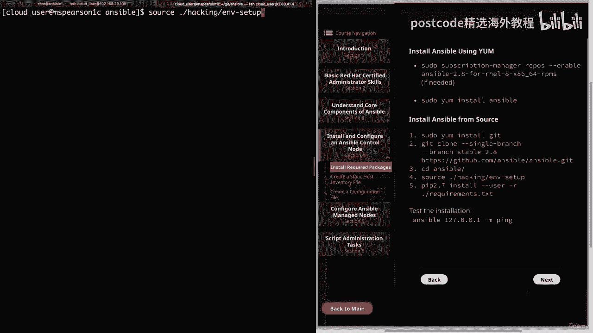

1.  使用 `yum search ansible` 命令搜索Ansible软件包。如果未启用相关仓库，可能找不到结果。
2.  使用 `subscription-manager repos --list | grep ansible` 命令列出并确认已启用的Ansible仓库。
3.  使用 `subscription-manager repos --enable <仓库ID>` 命令启用包含Ansible的特定仓库。
4.  再次运行 `yum search ansible` 以验证仓库已启用并能找到软件包。
5.  使用 `yum install -y ansible` 命令安装Ansible软件包。

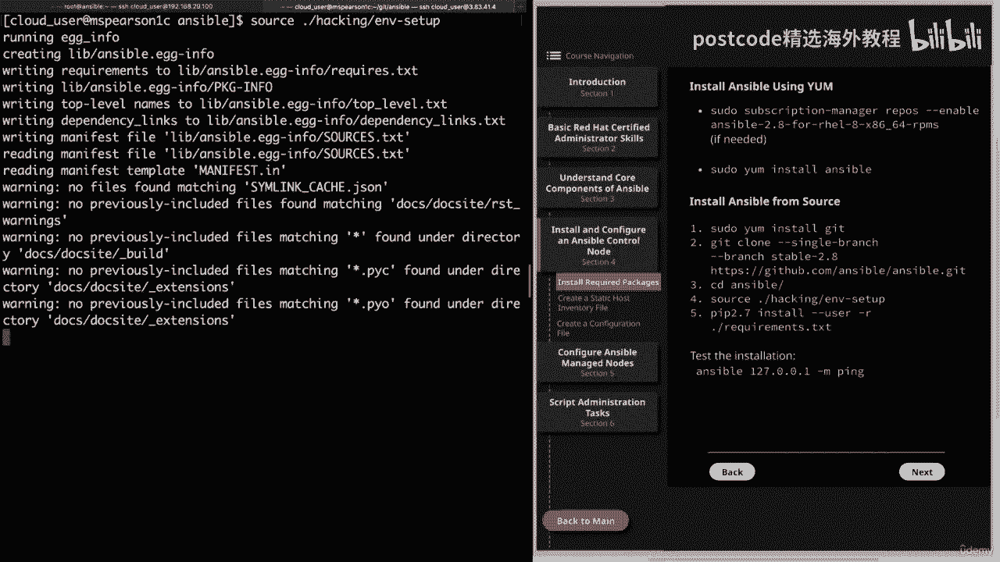

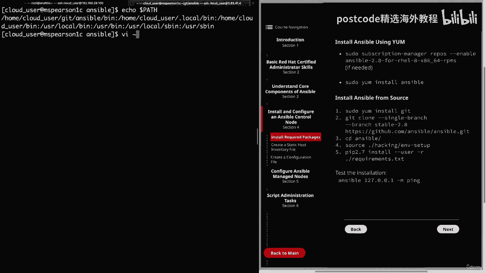

安装完成后，Ansible即准备就绪。然而，在我们的课程实验环境中，RHEL 8镜像的仓库可能未包含最新的Ansible包，因此接下来我们将学习从源代码安装的方法。

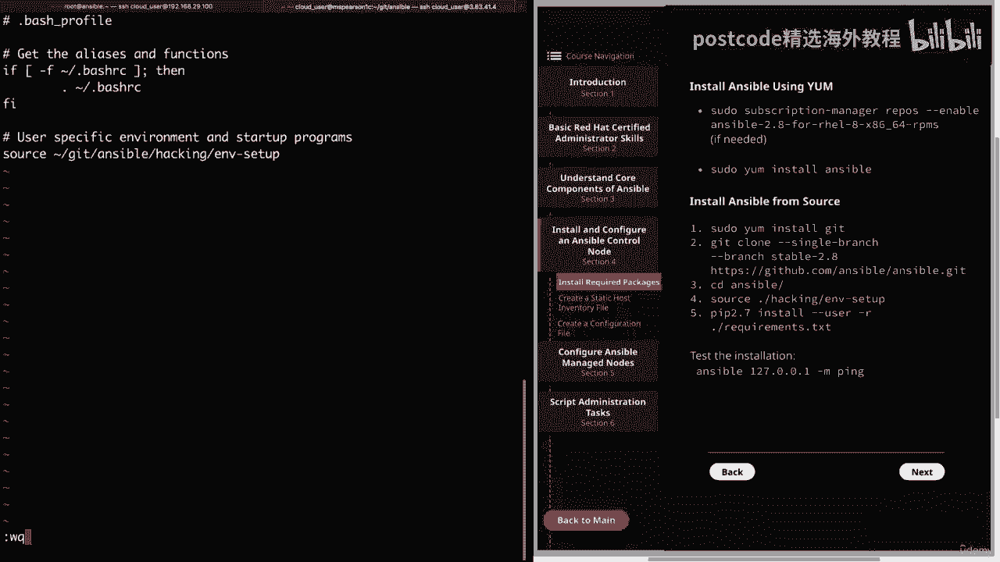

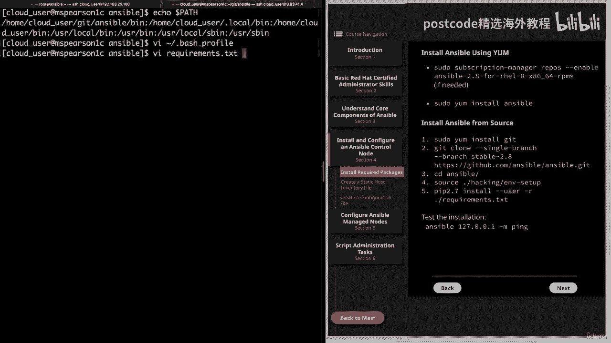

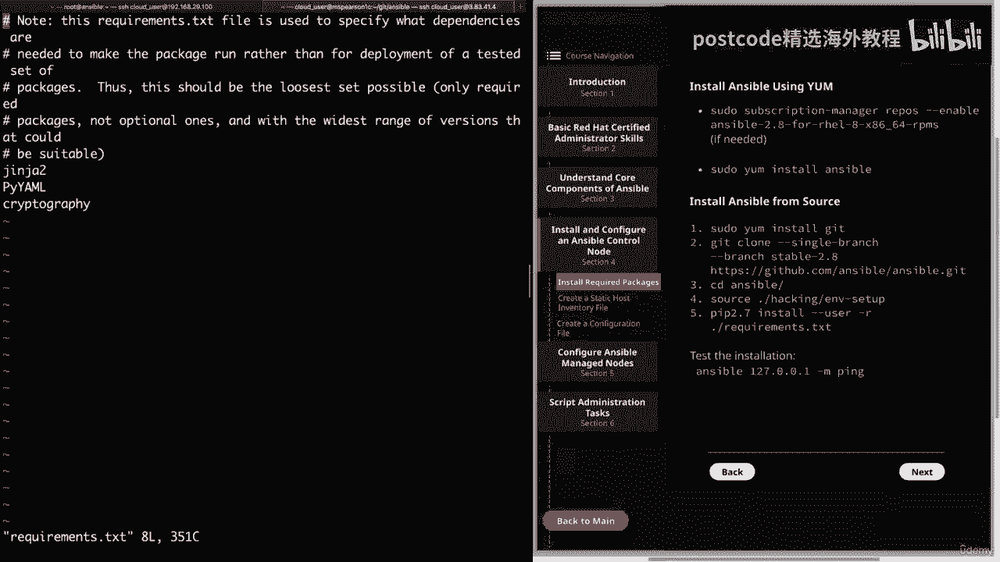

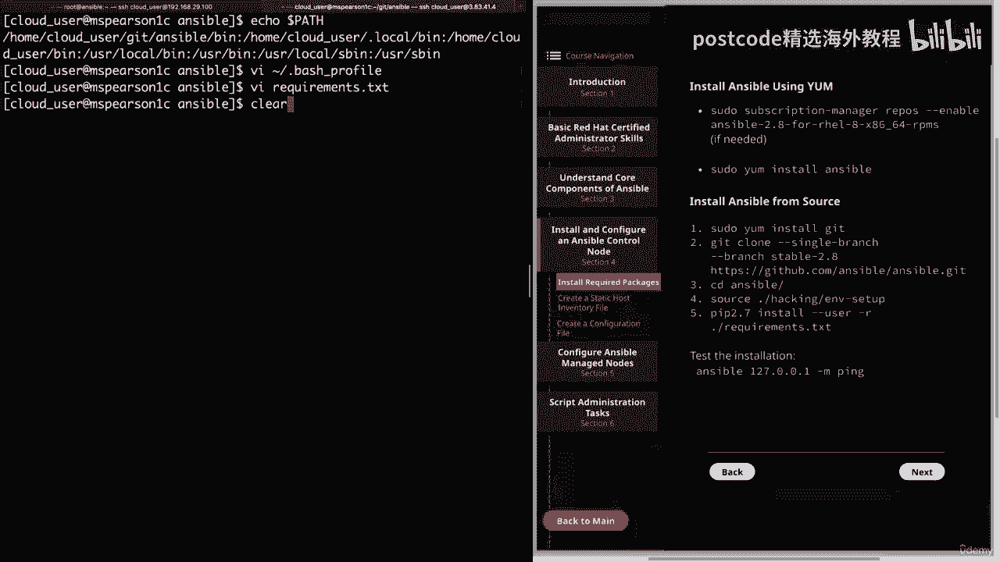

---

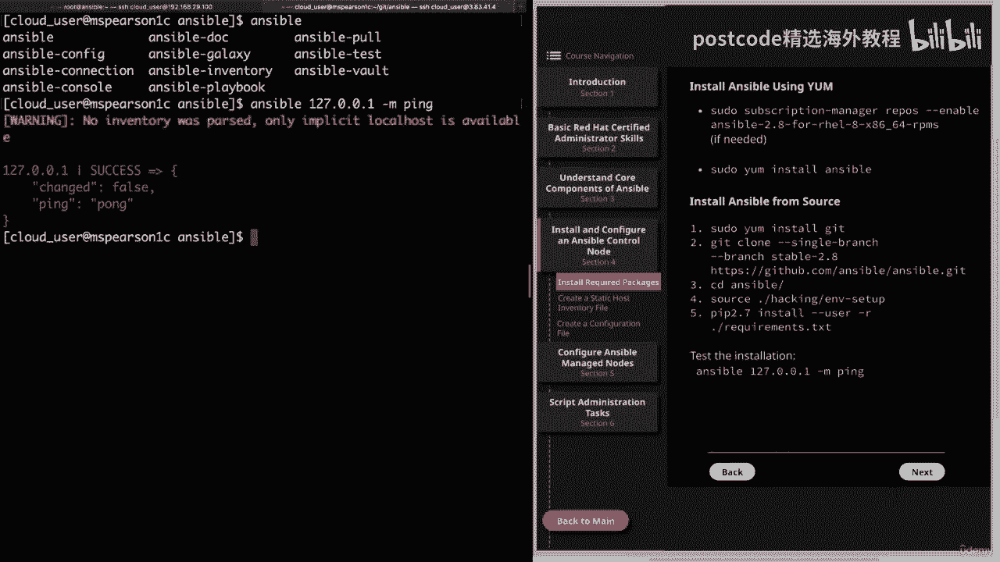

## 从源代码安装Ansible
由于我们的实验环境无法访问包含Ansible的Yum仓库，因此需要从源代码安装。此过程比Yum安装稍复杂，但Ansible本身无需守护进程或复杂数据库配置。

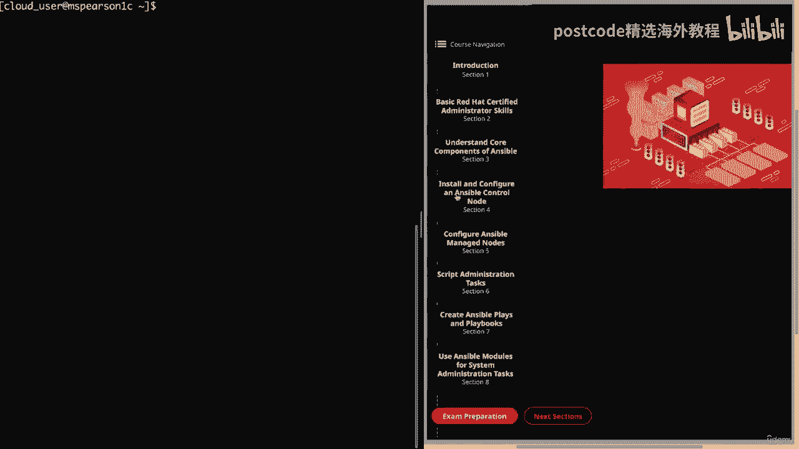

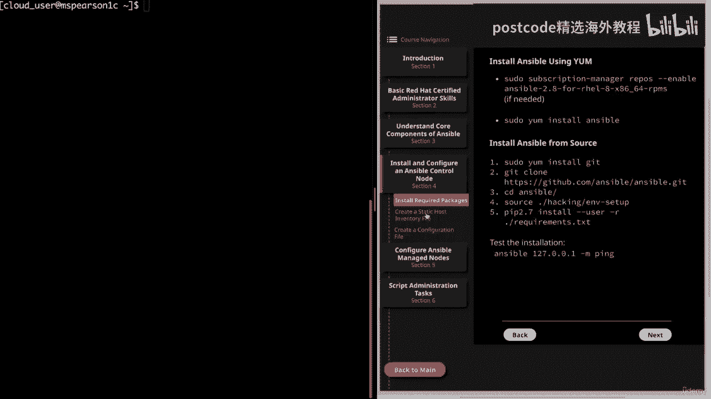

### 操作步骤
以下是从GitHub克隆源代码并安装Ansible的步骤：

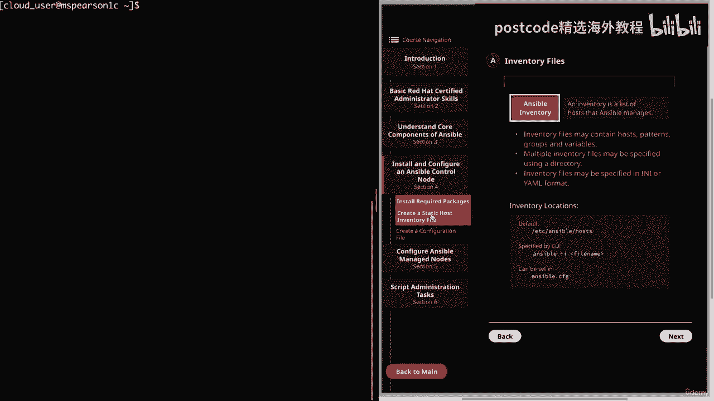

1.  **安装Git**：使用 `yum install -y git` 命令安装Git工具，用于克隆代码仓库。
2.  **创建工作目录**：在主目录下创建用于本课程的工作目录。
    ```bash
    mkdir ~/ansible
    mkdir ~/git
    ```
3.  **克隆Ansible仓库**：进入 `~/git` 目录，克隆指定版本（2.8）的Ansible代码。
    ```bash
    cd ~/git
    git clone --single-branch --branch stable-2.8 https://github.com/ansible/ansible.git
    ```
4.  **设置环境变量**：进入克隆的仓库目录，执行环境设置脚本，该脚本会将Ansible命令添加到当前会话的PATH中。
    ```bash
    cd ~/git/ansible
    source ./hacking/env-setup
    ```
5.  **使环境变量永久生效**：将执行环境设置脚本的命令添加到用户的 `~/.bash_profile` 文件中，以便每次登录时自动设置。
    ```bash
    echo “source ~/git/ansible/hacking/env-setup” >> ~/.bash_profile
    ```
6.  **安装Python依赖**：使用Pip安装Ansible运行所需的Python库。
    ```bash
    pip2.7 install --user -r requirements.txt
    ```
7.  **验证安装**：运行一个简单的Ansible命令测试安装是否成功。
    ```bash
    ansible 127.0.0.1 -m ping
    ```
    如果看到PING成功的响应（尽管可能伴有未提供清单文件的警告），则表明从源代码安装成功。

至此，Ansible控制节点的软件安装部分已完成。在后续课程中，我们将使用这个从源代码安装的主机。

---

## 创建静态主机清单文件
上一节我们完成了Ansible的安装，本节中我们来看看如何创建清单文件。Ansible清单是一个包含所有被管理主机信息的文件，Ansible通过它知道需要对哪些主机执行操作。

### 核心概念
*   **清单内容**：可以包含单个主机、主机模式、组和变量。
*   **组与嵌套**：主机可以属于多个组，组也可以嵌套在其他组下（形成组的孩子）。
*   **清单格式**：支持INI格式或YAML格式。
*   **清单位置**：
    *   默认位置是 `/etc/ansible/hosts`。
    *   可以在命令行使用 `-i` 参数指定自定义清单文件路径。
    *   可以在 `ansible.cfg` 配置文件中修改默认清单文件位置。
*   **变量存储最佳实践**：建议将主机或组变量存储在相对于清单文件的 `host_vars/` 和 `group_vars/` 目录下的YAML或INI文件中，而不是直接写在主清单文件中。
*   **默认组**：所有在清单中定义的主机自动属于 `all` 组。不属于任何自定义组的主机还属于 `ungrouped` 组。

### 操作示例
以下是一个INI格式的清单文件示例 `inventory.ini` 的创建过程：

1.  **创建清单目录和文件**：
    ```bash
    mkdir ~/ansible/inventory
    cd ~/ansible/inventory
    vi inventory.ini
    ```
2.  **编辑清单内容**：
    ```ini
    # 未分组的主机，并设置内联变量
    mz-pearson2 ansible_host=mz-pearson2.lab.example.com

    # 定义‘lab-servers’组，包含多个主机
    [lab-servers]
    mz-pearson[3:6].lab.example.com

    # 定义‘web-servers’组
    [web-servers]
    mz-pearson[3:4].lab.example.com

    # 定义‘database-servers’组
    [database-servers]
    mz-pearson[5:6].lab.example.com
    ```
3.  **使用host_vars目录存储变量**（最佳实践）：
    *   首先，从 `inventory.ini` 中移除 `mz-pearson2` 行的内联变量。
    *   创建 `host_vars` 目录和对应的变量文件：
    ```bash
    mkdir host_vars
    vi host_vars/mz-pearson2
    ```
    *   在变量文件中以YAML格式定义变量：
    ```yaml
    ---
    ansible_host: mz-pearson2.lab.example.com
    ```

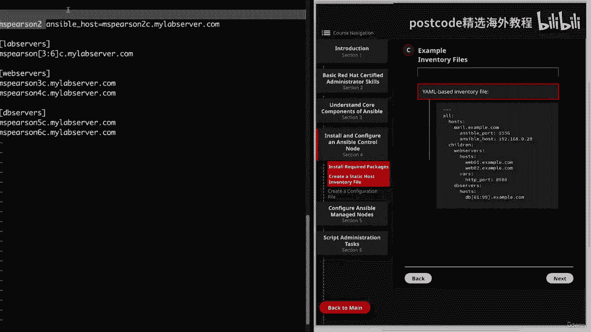

通过以上步骤，我们创建了一个结构清晰的静态主机清单。虽然目前尚未配置被管理节点，无法测试连接，但清单文件的结构已经就绪。

---

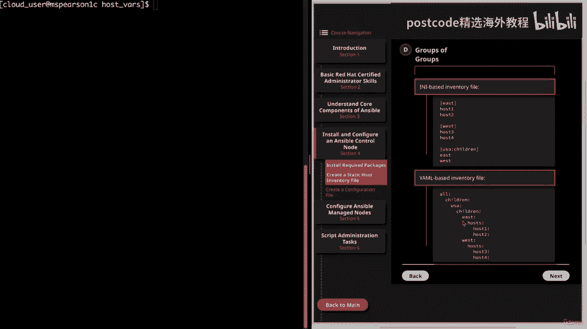

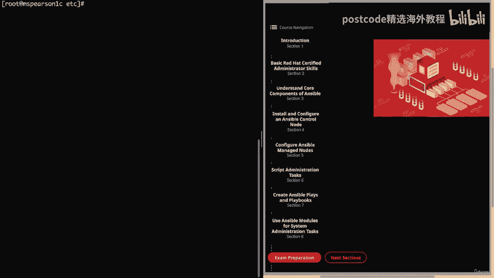

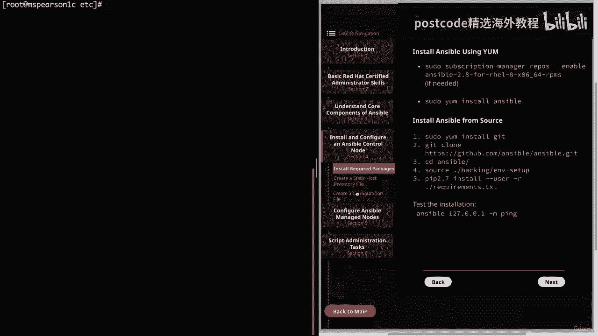

## 创建自定义配置文件
在配置了主机清单之后，我们需要设置Ansible的运行时行为，这通过配置文件 `ansible.cfg` 完成。Ansible会按照特定优先级查找此文件。

### 配置文件优先级
Ansible读取配置文件的优先级从高到低为：
1.  环境变量 `ANSIBLE_CONFIG` 指定的文件。
2.  当前工作目录下的 `ansible.cfg`。
3.  用户家目录下的 `~/.ansible.cfg`。
4.  系统默认的 `/etc/ansible/ansible.cfg`。

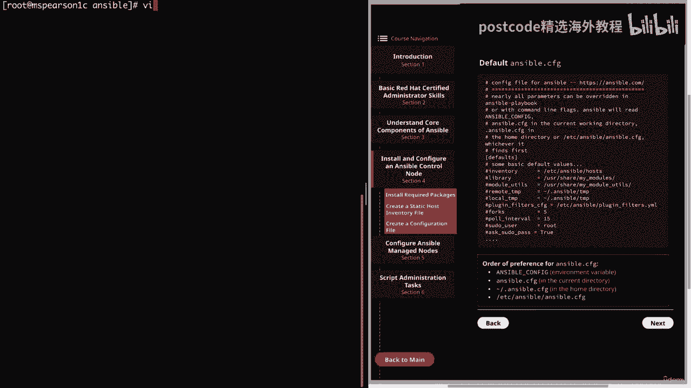

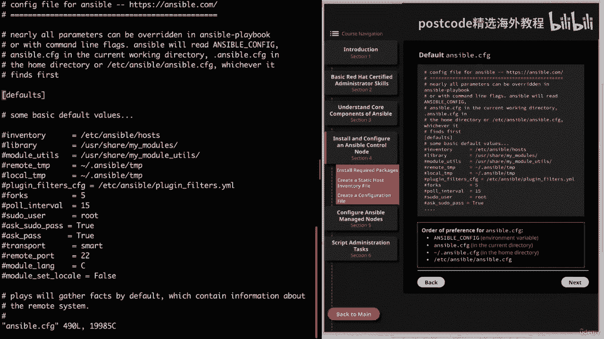

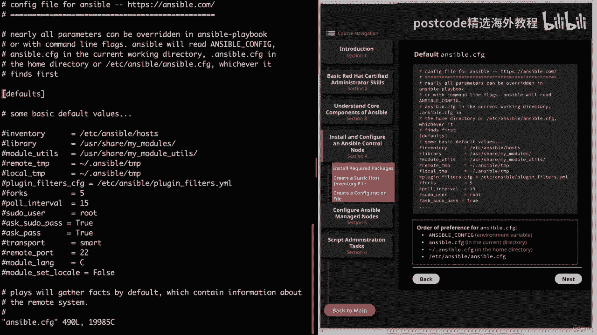

### 操作步骤
我们将创建一个自定义的 `ansible.cfg` 文件来覆盖一些默认设置。

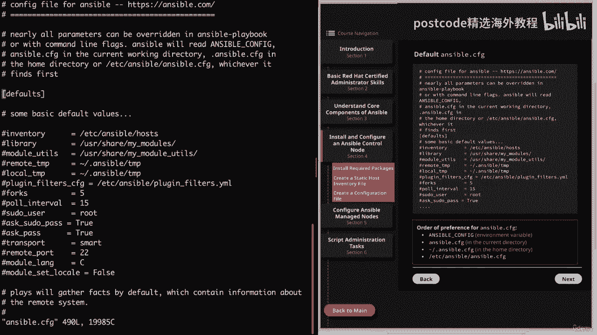

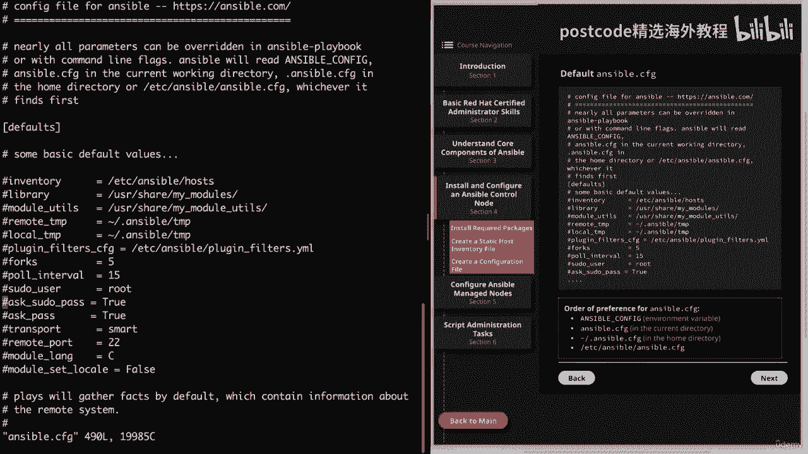

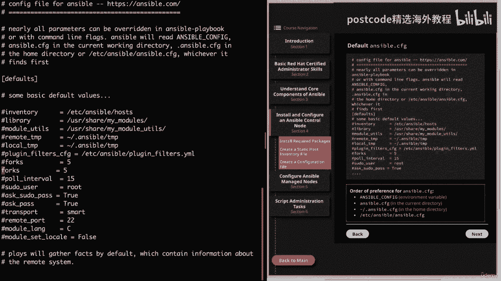

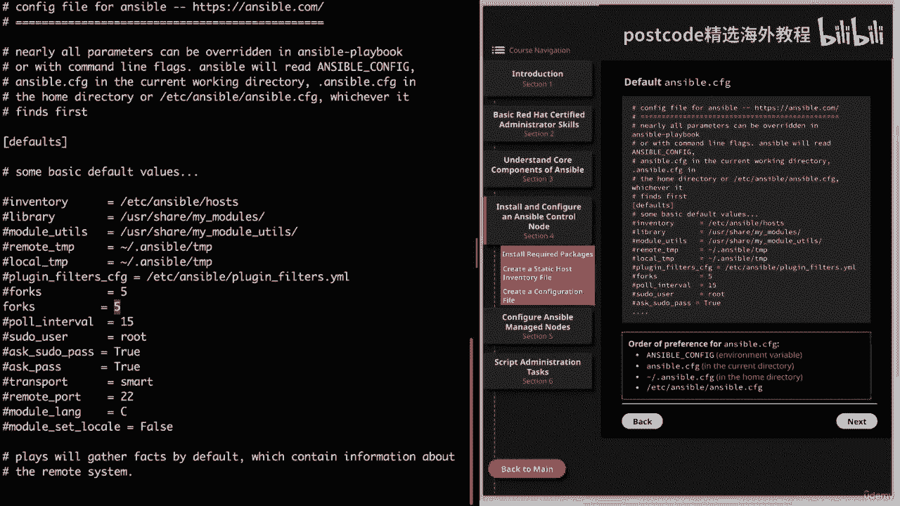

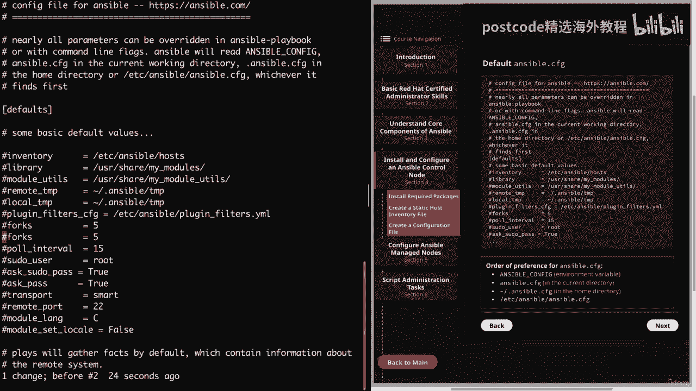

1.  **（可选）创建默认配置目录**：以root用户创建 `/etc/ansible` 目录并复制示例配置文件。
    ```bash
    mkdir /etc/ansible
    cp ~/git/ansible/examples/ansible.cfg /etc/ansible/
    cp ~/git/ansible/examples/hosts /etc/ansible/
    ```
2.  **创建自定义配置文件**：在课程工作目录下创建我们自己的配置文件。
    ```bash
    cd ~/ansible
    vi ansible.cfg
    ```
3.  **编辑配置文件内容**：添加 `[defaults]` 段，并设置关键参数。
    ```ini
    [defaults]
    # 设置Python解释器为自动选择，避免使用旧版Python导致模块警告
    interpreter_python = auto
    # 指定默认清单文件的位置
    inventory = /home/cloud_user/ansible/inventory/inventory.ini
    # 指定Ansible查找角色的路径，多个路径用冒号分隔
    roles_path = /etc/ansible/roles:/home/cloud_user/ansible/roles
    ```
4.  **（可选）修改系统默认配置**：为了全局生效，也可以将 `interpreter_python = auto` 这一行添加到 `/etc/ansible/ansible.cfg` 文件的 `[defaults]` 段中。
5.  **创建本地roles目录**：根据配置，创建本地角色目录。
    ```bash
    mkdir ~/ansible/roles
    ```

这个自定义配置文件指定了清单文件位置、Python解释器以及角色搜索路径，为后续的Ansible操作奠定了基础。

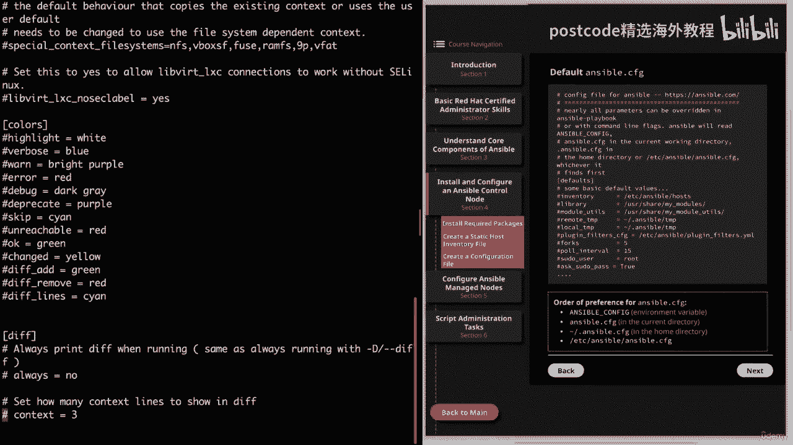

---

## 总结
本节课中我们一起学习了Ansible控制节点的完整安装与配置流程：
1.  我们掌握了两种安装Ansible的方法：通过Yum包管理器在已订阅仓库的系统上安装，以及从源代码克隆并安装以适应特定环境。
2.  我们学习了如何创建和组织静态主机清单文件，理解了主机、组、变量以及存储变量最佳实践的概念。
3.  最后，我们创建了自定义的 `ansible.cfg` 配置文件，覆盖了关键默认设置，为Ansible指定了工作所需的清单、解释器和角色路径。

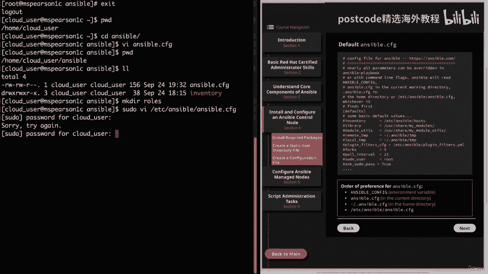

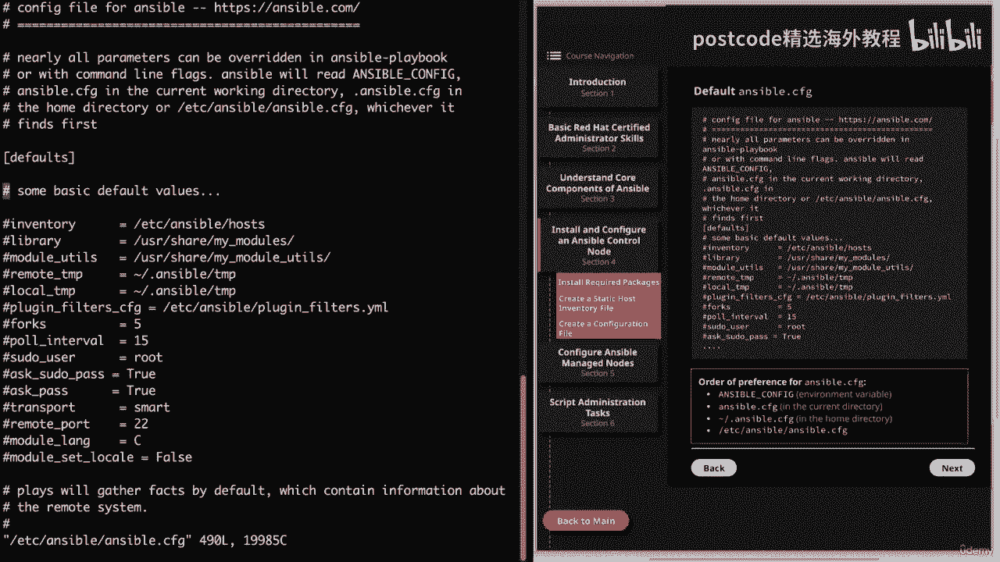

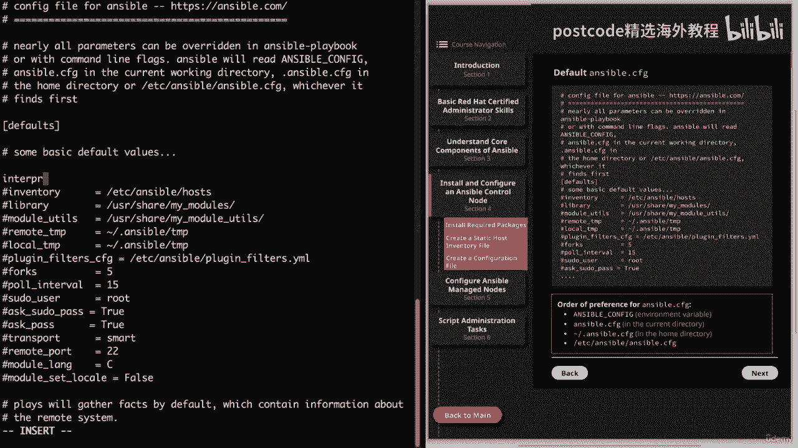


至此，Ansible控制节点已经准备就绪，可以用于管理其他主机。在接下来的课程中，我们将配置被管理节点并开始使用Ansible执行任务。