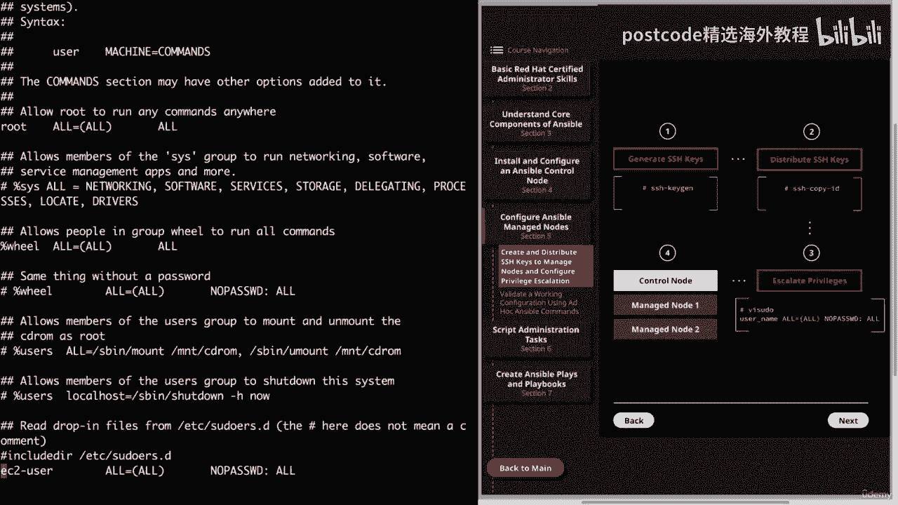
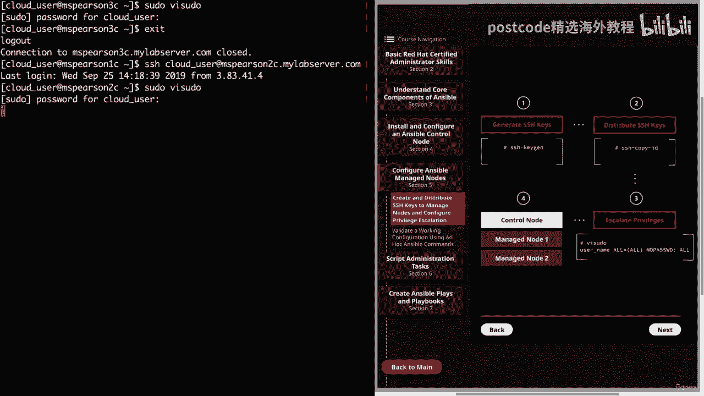
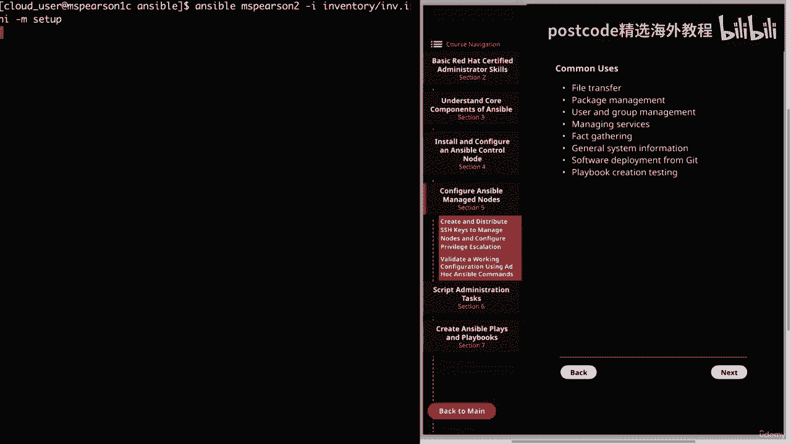

# 红帽企业Linux RHEL 9精通课程 — RHCSA与RHCE 2023认证全指南 - P16：03-03-003 Ansible managed nodes - Configure - 精选海外教程postcode - BV1j64y1j7Zg

通过设置 Ansible 管理节点来继续安装 Ansible。我将通过为 Ansible 用户创建 SSH 密钥，然后分发这些密钥来完成此操作，到受管节点以及设置权限升级。老实说。

这是人们如此喜爱 Ansible 的原因之一。它不仅是自动化部署和管理系统的绝佳工具，而且不需要，要安装在您管理的节点上的任何软件。因此，Ansible 是代理列表。

而不是其他需要在其上安装代理的类似工具。托管主机。因此，我们所要做的就是确保 Ansible 有权访问主机以及可以执行以下操作的用户，该主机上的操作。因此，没有更多的序言。

让我们继续单击第 5 部分来配置 Ansible、管理。

节点。这将带我们进入第一部分。所以目前我登录到 Ansible 控制节点，即 RMS Pearson one C，第一件事是，我们需要做的是为云用户生成公钥和私钥。现在。

您不必使用云用户作为在您的安装上管理 Ansible 的用户。您始终可以创建新用户，但只需确保无论您选择什么用户，都可以执行这些操作，作为该用户的步骤。如果您要为您的公司进行此设置。

那么最好让一个特定用户来，您可以轻松识别为一种安全性的 Ansible 用户。然后也只是为了简单起见。但您可能会遇到这样的情况：运行时需要多个不同的用户。Ansible 只要确保无论你遇到什么情况。

一定要经历所有这些，每个用户的步骤。好的。因此，如果您向右看，我只是提供了我们将要采取的不同行动的简单图表，待服用。第四步就是我们安装的最终状态。因此，我们需要做的第一件事是生成 SSH 密钥。

这是第一步。我们将通过利用 SSH 密钥生成实用程序来做到这一点。因此，要生成我们的公钥和私钥，我们需要做的就是转到命令行并，然后我们将输入 ssh dash key gen。

我们看到它正在产生我们的公共私人机架付款人。然后我们需要输入一个文件来保存密钥。你可以随心所欲地制作它。但我只是接受家庭云用户和 SSH 目录中的默认值，然后，ID 下划线 RSA。所以我们按下回车键。

然后它会询问我们是否要输入密码。最好有一个安全密码作为另一道防线。但对于我们的安装，我主要是出于方便起见将其保留为空白。然后我们再次按回车键。

您可以看到创建了两个不同的文件。我们有 ID 下划线 RSA，这将是我们的私钥，然后是 ID 下划线 RSA Dot Pub。

这是我们的公钥。现在让我们继续解决这个问题。很快，我想向您展示家庭云用户。然后，当我们看到公钥和私钥支付者并且现在我们有了密钥时，我们需要复制我们的密钥，我们的托管节点的公钥。这将是我们图中的第二步。

即分发 SSH 密钥，这是可以完成的，手动只需复制公钥，然后将其添加到授权的下划线密钥文件中即可。让我快速向您展示公钥，即下划线 RSA Dot pub。然后我们将限制它。

因此，如果您想手动复制此内容，您只需将此字符串复制并粘贴到此处即可，并放入该授权密钥的文件中。但实际上有一个非常方便的实用程序可以将其复制到所需的位置，那就是使用。

SSH 复制 ID。让我们继续清除这个，然后我们需要做的就是运行 SSH，复制 ID，然后复制我们的名称。

user cloud user ，然后是我们托管节点的实际主机名。首先，我们要将其复制到 MHS Pearson 以查看我的实验室服务器。

它向我们表明我们已经添加了一个密钥，并且我们可以尝试使用 SSH 登录到机器，来验证它。那么让我们继续尝试一下。我要在这里点击向上箭头。

我们看到我们能够登录，并且没有提示我们输入密码。

好吧，现在我们退出吧。我会带我们回到 MZ Pearson one C，然后我们就可以解决这个问题。因此，在进行第三步之前，我们还将将此密钥分发给 MBS Pearson 3。

让我们继续点击向上箭头几次。然后我们需要做的就是用三个替换两个。

我会说是的。然后在我们的密码中。我们看到命令又成功了。让我们继续尝试登录以确保确定。

再次，我们没有提示输入密码。我们已登录 MSC Pearson 3 C。好吧，现在我们已经将 SSH 密钥复制到托管主机，我们可以设置权限升级，对于我们的云用户。

既然我们已经登录了 MSC Pearson 3 C，那么让我们继续升级权限，对于该主机上的云用户。首先，让我们继续澄清这一点。为了授予这些伪权限，我们需要编辑种子文件。为了编辑该文件。

您需要具有提升的权限。默认情况下，我们的云用户已经拥有这些权限。但我仍然会逐步介绍并向您展示如何操作，以防万一您使用不同的，用户或者您处于该用户没有权限的情况。所以该文件实际上存在于 ETSI 中。

它被称为伪 where&#39；s。正如您所看到的，即使文件的所有者也没有正确的访问权限。所以我们将使用语音命令来实际编辑文件，这样就可以了，为我们进行一些语法检查，并确保我们不会搞砸一些事情。

因为这非常重要，文件。现在让我们继续打开该文件并使用 VI 伪命令或 VI 伪命令对其进行编辑，具体取决于。

取决于你想怎么说。因此我们在文件顶部看到 Sewers 允许特定用户运行各种命令。

root 用户，无需 root 密码。它让我们知道示例将在文件底部提供，而且。

该文件必须使用 VI 伪命令进行编辑。

因此，让我们深入到底部并查看其中一些示例，然后我们还可以添加我们的。

入口。因此，就在顶部，我们看到这个条目允许 root 在任何地方运行任何命令。

这是单个用户的语法。然后，如果您向下滚动一点，您将看到如何为一组执行此操作。所以这将允许所有人和意志组运行所有命令，然后我们看到，又是同样的事情。只不过这次不需要密码，我们实际上将使用无通行证。

成为我们用户的选择。这样我们就不会被提示输入密码，也不必提供密码。所以我要再次到底部，我们只是要抓住这个条目。

我将输入一个云下划线用户。这将允许我们运行任何命令而不需要我们提供密码。因此，即使我们的云用户已经拥有伪权限，密码选项也没有设置。因此，我们继续更新这一点是件好事，这样我们就不会在以后遇到这个问题。

或者，我们可以添加一个文件等。你在这里看到它说包含目录。就像我们在 Yum repost dx 中看到的那样，该目录下的所有存储库文件都是，将会被拉进去，同样的事情也发生在这里。因此，除了伪文件之外。

您还可以将您的权限添加到文件中，这就是，也会被拉进去阅读。

好的。那么让我们继续保存这个文件。现在我们可以退出 MSC Pearson 3 C。然后我就换成小姐姐了，皮尔逊来看看。我们也将添加这一点。再次记住，我们需要使用伪。

我们可以使用 Shift g 转到底部，然后将其拉出，粘贴到下面，然后。

输入 cloud，下划线 user。

好的。所以现在我要继续保存它。现在我们已经完成了这些步骤，我们的管理节点已准备好与 Ansible 一起使用。老实说，就这么简单。只要用户有权访问该主机并有权在该主机上执行命令，您的答案，会管理的。

节点已在下一个视频中配置。我们将使用一些 ansible 临时命令来测试我们的配置。但在我们结束这个视频之前，我确实想提一下，我将为 MSC Pearson 设置此内容，对于 C 和 5 C 也是如此。

因此，对于您自己的安装，如果您想继续设置更多主机，请随意，要做到这一点。只需确保对每个步骤执行这些步骤即可。好的。好了，本次视频就到此结束了。让我们继续下一步，我们可以测试我们的配置。

在本视频中，我们将使用一些 ansible 来验证我们的工作 ansible 配置，即席命令。那么让我们转到第五节，配置 Ansible、管理节点，然后进行验证。

工作配置。在我们首先验证我们的设置之前，让我们先谈谈 Ansible ad hoc，命令。正如您所看到的，语法将采用以下格式。这将是 Ansible 命令，后跟您要引用的主机或组。

然后您可以传递破折号标志，它允许您指定库存文件。否则它将使用默认值，然后您可以使用破折号，后跟模块，然后使用破折号，a 以及该模块的参数。因此，Ansible 即席命令基本上用于执行快速的单行命令。

这与您使用 bash 一行或命令的方式非常相似，而不是编写可以保存以供定期执行的批处理脚本。然而，这并不意味着您不应该保存定期使用的 ansible 即席命令列表，使用。事实上。

我们将讨论如何使用 shell 脚本来调用其中一些，ansible 即席命令。它们对于非常规任务很有用，我们知道 Ansible 的主要面包和黄油是，剧本，它将允许您执行一系列剧本以实现所需的目标。

主机上的结束状态。然而，有几种情况，特别是当涉及非常规任务时，它不会，编写剧本确实很有意义，而且使用临时命令实际上更有效。正如我们在语法中看到的，临时命令是使用 Ansible 命令执行的。当然。

Ansible Dash playbook 将用于执行 playbook。使用破折号标志传递的参数确实需要双引号，并且需要空格，如果有多个参数，则受到限制。另一件需要记住的事情是。

命令是在用户运行 Ansible 时执行的。因此，无论您运行 Ansible 命令时的用户是谁，都将执行该命令，您要执行的任务。您始终可以通过指定破折号选项来更改该用户，这将更改用户。

正在运行 Ansible 命令。您还可以使用 dash dash 成为 dash user，这将指定您想要的用户，在远程主机或管理节点上执行命令。另一个重要的标志是破折号 B 选项。

这用于以 root 用户身份执行命令。这对于您尝试在管理节点上执行的任何任务都是必要的。这将需要升级的权限。这就是将云用户添加到我们的托管节点上的 Pseudolus 文件中的原因。最后。

可以在不使用 dash IM 选项的情况下使用 dash 选项，以便仅运行 shell 命令。因此，如果您只需要运行随机 shell 命令，则可以通过指定破折号选项来完成此操作。再次确保模块选项不存在。

然后您的命令将进入，双引号是你的论点通常会出现的地方。我将立即向您展示一个例子。好的。现在让我们进入下一页。我们可以讨论 Ansible 即席命令的一些常见用法。首先是文件传输。

如果您需要将文件复制到托管服务器之一，这非常有用，节点，甚至在该节点上创建文件。然后我们有包管理，如果特定的软件需要持续存在于主机上，那么您可能需要考虑将其放入剧本中。

但是您仍然可以始终使用 Ansible ad hoc 通过 Yum 或 APT 安装软件包，并且您还可以，获取有关已安装的软件包的信息，例如版本是什么，已安装的软件包？或者即使该包刚刚存在。

这实际上说明了 Ansible ad hoc 有用的一个更大的点，那就是，只是获取有关主机的信息。接下来是用户和组管理，因此您也可以在主机上添加或删除组和用户，例如更改文件和目录的权限。

尽管这可以在剧本中完成，但这也是您可以在一次性情况下完成的事情，临时使用 Ansible。接下来，我们有管理服务，您可能会遇到这样的情况：您只需要关闭一个，服务或检查并查看服务是否已启用并正在运行。

或者您甚至处于某种情况。我们要出城一周。因此，您想要发出命令来关闭所有实验室服务器。当然，有几种不同的情况，但信息收集又是这样。真的很重要。这实际上将我们带到了下一点，即脂肪聚集。因此。

Ansible 默认所做的一件伟大的事情就是收集大量不同的信息，关于主机，例如操作系统、内核版本，甚至连接的实际磁盘，到它。这就是所谓的 Ansible 事实。因此，通过 ad hoc 命令。

您实际上可以使用 setup 模块来收集有关以下内容的事实：一台主机或一组主机。稍后我们将在课程中更深入地了解 ansible 事实以及如何使用，它们在我们的命令和剧本中。

除了 Ansible 事实之外，我们还有一般系统和进程信息。因此，这将是 Ansible 默认情况下不会使用 Ansible 事实收集的内容，这，可能是运行进程或日志甚至资源利用率之类的东西。

这当然可以，在一次性情况下了解这一点非常重要。接下来，我们从 Git 进行软件部署。如您所知，Git 已成为 IT 管道中非常重要的一部分。实际上有一个 Git 模块可以让你直接部署软件或文件。

一个 git 存储库。最后，剧本创建测试。因此，使用 Ansible 即席命令是使用不同 Ansible 模块的最佳方法之一，并了解它们是如何工作的。这将允许您在将模块添加到剧本之前对其进行测试，只需。

以确保您获得预期结果。这实际上是我个人使用的东西，只是为了帮助我更好地理解模块，并且只是为了测试它们以确保它们按照我认为的方式运行，到。因此，当您进一步了解 Ansible 时，我绝对会建议您这样做。

好的。现在我们已经了解了 Ansible 即席命令，我们终于到了这样的时刻：我们可以验证我们的配置。那么让我们进入命令行。目前，我位于云用户的主目录中。因此，让我们进入 Ansible。

这当然是我们的主要工作目录。我们看到 Ansible 配置文件、库存目录和角色目录。在我们测试任何命令之前，让我们继续检查我们的库存文件，即。我们看到我们有五个不同的服务器配置为。皮尔森二。

一直到皮尔逊六级。那么让我们结束这个，我们可以继续运行一些命令。我们要做的第一件事是使用 ping 模块，这只是看看我们是否可以，实际联系到了主人。为此，我们将运行 Ansible II。

他们将指定我们的库存文件，然后我将使用所有的默认组。这样，它将针对我们库存中的所有主机运行此 ping。您可以在清单文件之前指定您的主机或主机组，您可能会看到，我都是这样做的。但我只想快速指出这一点。

然后我们将为模块提供破折号标志。我们将使用 ping 模块。

正如您所看到的，我们看到了这个绿色文本以及几条成功消息。

然后我们可以看到所有不同的托管笔记，并且可以使用 Ping 进行联系。

现在我想测试设置模块，所以让我们继续并清除它，然后我们可以使用。

用于收集有关主机的事实的设置模块。让我们继续针对 MHS Pearson 运行此测试以使用 Ansible。在这里我将在这次之前指定主持人。存货。然后就可以设置了。

默认情况下，这将返回主机上的所有事实。

但这表明的另一件事是我们能够接触并收集这些事实。

但正如您所看到的，Ansible 将收集大量有关主机的不同事实。

查看 MAC 地址，这就是我们的 IPV 6 的全部内容。

然后我们就有了 IPV 四个地址，以及有关主机的大量其他信息。

所以我们将回到底部。让我们继续解决这个问题。

然后我还想向您展示这一点，因为我们在工作目录中并且有 Ansible，CFG，我们实际上已经定义了一个默认的库存文件，这就是我们的库存点。我和我。所以我们实际上不必使用破折号标志来指定库存。

所以我想尽快向你们展示这一点。因此，让我们再次运行 Ansible，我们将再次指定 MBS Pearson，我们，将使用设置模块。这次，由于有如此多的输出，让我们继续将其通过管道传输到 head 中。

然后我们将显示 20。

正如您所看到的，由于我们的工作目录中有 Ansible CFG，因此它将引用，我们的库存文件，这样我们就不必使用破折号标志。在这个输出中，我们能够看到 ansible 事实的开始。

所以我们看到了 IPV 四个地址、IPV 六个地址，然后还有我们的 Ansible 架构。

作为一些附加信息。好的。让我们继续清除这个，现在让我们继续使用复制模块来看看我们是否可以复制文件，到我们的托管节点。我要做的第一件事就是创建一个文件。我们将称之为秘密文件。这是一个非常秘密的事情。

我们将添加一行名为“This is a test”的行。好的。让我们继续保存它。我们将继续将其复制到 MZ Pearson 2。请记住，我们不必指定库存文件。我们将使用复制模块。

然后我们还需要使用 Dash A 向其传递一些参数，所以打开双引号，我们要添加源，我们的源是家庭云，下划线用户 Ansible，然后是秘密文件。然后我们需要添加目的地。我们只是将其置于临时状态。

好的。所以我们得知发生了变化。它还将向我们显示有关文件和模式的一些信息。这就是我们的权限，即 0664，这是非常默认和标准的。你看，我们的目的地是临时秘密文件，所有者是云用户。它甚至会向我们展示上下文。

好的。所以我们根据输出看到这是成功的。

但让我们继续对 RMS Pierson 运行一些 shell 命令来验证这一点。

所以说清楚这一点。首先，让我们继续运行 Ansible。我们要去检查一下小姐的情况。Pearson 也是如此，因为那是我们复制文件的地方，然后我们将传递 Dash A。请记住。

如果在没有破折号和模块的情况下使用 Dash，它将允许我们运行 Shell 命令。因此，让我们继续打开双引号并在 temp 上执行 LZ 破折号 l 。由于正在进行的一些说唱，所以有点难以看到。

但如果你在这里检查，我们有我们的秘密文件。它还将向我们显示权限以及所有者和组。接下来，让我们继续前进。我们可以饲养一只黑猩猩。秘密档案。我们看到了我们的秘密文件的内容，这是一个测试。好的。因此。

我们也与 MZ Pearson 进行了大量合作。我想做的最后一件事就是运行我们刚刚运行的相同命令。但这次我要对实验室服务器组进行此操作。让我们继续进行 Ansible。指定实验室服务器。

我们将再次使用复制模块。请记住，我们需要指定来源。由于该文件位于我当前的工作目录中，因此我不必给出显式路径，因此，我只是要输入秘密文件，然后目的地等于临时。

好的。所以我们看到了之前看到的输出，只不过这次是针对所有服务器和我们的实验室服务器。

团体。

现在让我们继续进行列表。Ansible 实验室服务器。我将执行 ls l，这次我们不列出目录中的所有内容，而只列出文件本身。

我们看到该文件位于我们实验室服务器组中的每台服务器上。然后我们也可以点击向上箭头。然后继续剪切内容。

正如预期的那样，我们将其作为对每个管理节点的测试。

好了，关于验证工作配置的视频就到此结束了。这只是一个简单的测试，向您展示了一些可以使用的不同模块，Ansible Ad-hoc 命令。

