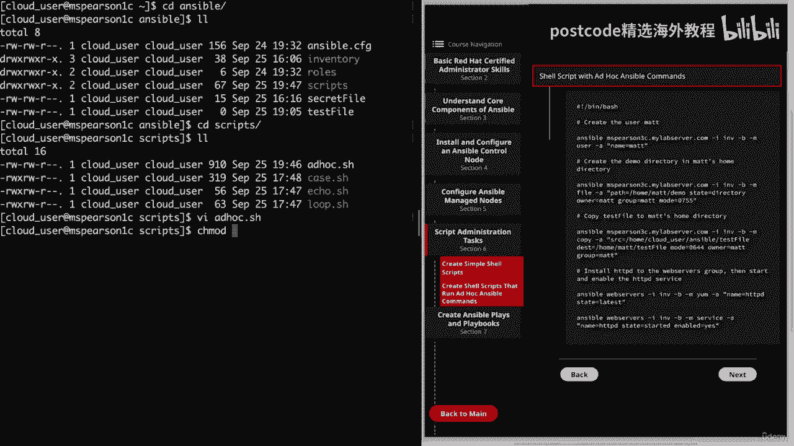

# 红帽企业Linux RHEL 9精通课程 — RHCSA与RHCE 2023认证全指南 - P17：03-03-004 Ansible - script administration tasks - 精选海外教程postcode - BV1j64y1j7Zg

本视频我们将讨论创建简单的 shell 脚本。那么让我们转到脚本管理任务，这是第六部分。

现在我们可以讨论 shell 脚本了。所以在你开始恐慌之前，RHC考试并不期望你能够创造出这些宏伟的东西，以及大型、复杂的 shell 脚本。然而。

它确实希望您能够知道如何创建基本、简单的 shell 脚本。首先，我们将讨论一些有关 shell 脚本的内容，然后我将向您展示一些，例子。因此，您需要知道的第一件事是第一行必须包含哈希或井号符号。

随后是感叹号，通常称为 shebang。然后是解释器的路径。这只是让 shell 知道需要什么程序来解释脚本。因此，在我们的例子中，我们使用 Bash 来解释脚本，但我们可以使用另一个解释器，例如。

Perl 或 Python，具体取决于我们要创建的脚本类型。可以使用井号在整个脚本中添加后续注释。这是因为 bash 会忽略井号后面出现的所有内容。脚本越大，这一点就变得越来越重要。

特别是如果你有任何人，除了您自己之外，其他人都需要与它交互或更新它。这并不是说你无法通过查看脚本来弄清楚脚本中发生了什么，而是，如果您提供评论会更容易，这对于您自己的脚本来说也是如此。

因此对于您自己的质量而言，的生活。因此，如果您有一个一年前创建的大型 shell 脚本，您可以轻松地跳入其中并查看，你想要实现的目标。再次强调，不要被以磅开头的第一行所迷惑。请记住，这是一个特殊的符号。

即 shebang，它只是让 shell 知道如何，解释脚本。下一点非常重要，那就是需要将执行权限添加到脚本中。因此，即使您的 shell 脚本的内容非常完美并且符合它们的需要，您也不会。

能够运行该脚本，除非它具有执行权限，这可以使用数字或符号来完成，模式。因此，为了使用户可执行脚本，我们可以简单地在文件上运行 C mod plus X ，那就是，将添加仅执行用户。或者。

你可以做一些类似 C mod 755 的事情，它将添加、读取、写入、，为用户执行，然后为其他人读取、执行。最后，您可以使用绝对路径或使用点斜杠来执行脚本。如果脚本位于您的当前目录中。

这是因为当前目录不会自动成为路径的一部分。当我谈论路径时，我不是在谈论你当前的目录，而是实际的系统路径，操作系统将使用它来定位可执行文件的变量。因此，如果我们快速进入命令行，我可以直接回显美元符号路径。

您会注意到我们添加的目录是家庭云用户获取 ansible bin 的目录，该目录允许，这些 Ansible 命令暴露在我们的路径中。但正如您所看到的，这只是一个冒号分隔的列表。

shell 将在其中查找以查看内容，命令可供您使用。因此，既然我们添加了 Ansible bin 目录，我只需输入 Ansible，它就会点击完成，因为它已经在我的路上了。

我们正在这些目录中搜索任何可执行文件，然后我可以点击选项卡，我们可以看到。

还有哪些其他可用的 Ansible 命令。您当然可以将其他目录添加到您的路径中。因此，如果您希望路径中始终存在一个脚本目录，以便可以运行这些脚本，你当然可以这样做。

你需要做的就是导出路径变量并添加所需的，批处理配置文件中的目录。但我们不会在本课中讨论这个问题，只是让您知道，您可以使用它。除了给出脚本的显式路径之外，您还可以只输入 bash ，然后输入其他内容。

脚本名称是。那是因为 Bash 是一种语言解释器，它的功能之一就是读取并执行，脚本。

好的。让我们继续解决这个问题。现在我们可以回顾一下我提供的一些示例 shell 脚本。当然，您可以在脚本编写中做很多事情，我们无法涵盖它，全部。但我确实想向您展示一些您经常看到的更常见的事情的例子。

因此，如果您看一下该图，我提供了一个简单的回显脚本。这里还有一个四环。

然后在下一页上我们有一个案例陈述，我刚刚为您在图表中添加了这些陈述，给你参考。我还在 Ansible 控制节点上预先填充了这些内容。那么让我们回到命令行，我们将播种到 Ansible 中。

其中 ah 是我们的工作，目录。你看，我添加了一个脚本目录，所以让我们开始吧。

我添加了三个脚本，它们与图中的脚本相同。

如果您愿意，可以随意复制并尝试它们。

让我们继续解决它们。首先我们有 Echo Dot，这只是一个基本的 shell 脚本。它将产生输出。它还向您展示了如何在 shell 脚本中运行普通的 bash 命令。

就像您在 shell 脚本中运行普通 bash 命令一样。将从命令行。正如你所看到的，一切将从 shebang 开始。然后是 Bin Bash，他是我们的翻译。然后我在这里添加了一条评论，内容是“你好。

World Script”。该脚本只有一行，那就是回显 Hello World。那么让我们继续并结束这一切。让我们继续尝试通过执行点斜线然后回显点来运行它。所以你会看到我获得了九点的许可。

让我们继续列出这一点。这似乎是一个奇怪的错误，因为我是该文件的所有者并且我有权访问它。但您可能已经注意到我没有执行权限。因此，即使我拥有该文件，由于我没有执行权限，因此我将获得权限，否认。因此。

让我们继续向用户添加执行权限。当我们这样做时，让我们继续将其添加到该目录中的所有脚本中。那我就只做一颗星吧。

让我再次列出我们的清单。并且我们看到该用户有执行权限。现在让我们看看如果我们尝试运行脚本会发生什么。正如预期的那样，我们看到脚本的内容已回显到标准输出。

好的。因此，我们要查看的下一组是循环点。再说一次，我们将从我们的 shebang 开始，然后我们有四个，然后这将是，从一到五。所以这里的 I 是我们要设置的变量，它将由我们传递的任何内容定义，进去后。

因此，如果我愿意，我可以将其命名为数字之类的名称。所以 B 的四数在 1 到 5 之间。但 I 往往是人们使用的标准变量。因此，在这个例子中，我定义了 1 到 5，但我们实际上可以使用任何类型的列表。

我们想要或者我们甚至可以在这里放置一个命令，然后在我们的 for 中使用该命令的输出，环形。然后对于结束语句中的所有内容，我指定执行一个操作。在这种情况下，我们将遍历每个数字，并将其替换为我们的变量。

由美元符号 I 表示，我们将呼应该声明，然后我们将，指定done，这将表明循环结束。老实说，使用 for 循环对于您必须一遍又一遍执行的任何命令来说确实非常有用，再次，例如创建大量用户列表。

甚至将文件复制到多个主机。Ansible 的一大优点是它会为我们处理很多事情，通过指定某个模块。但无论如何，了解如何在基本层面上执行这些事情确实很好。那么让我们继续并结束这一切。根据脚本的编写方式。

我们期望它打印出 Hello one， hello to Hello，三个等等。让我们继续尝试一下。这称为循环数据，SH。我们得到了我们期望的输出，我们注意到我们在 in 之后定义的所有内容都被替换了。

进入我们的指挥。好的。现在我们可以继续我们的最后一个例子，这是一个 case 语句。这些特别用于帮助简化您要处理的一些更复杂的条件，最终看到多级 if then else 语句，当然它有多个不同的。

选择。它还允许您将多个不同的值与一个变量匹配，然后执行命令，基于您收到的价值。让我们快速打开它。因此，我们从回显开始，让用户知道要输入状态名称。然后我们将使用 read，我们在这里看到它是为了告诉脚本。

采取任何措施，用户输入的字符串并将其存储为变量状态。然后它将根据输入的值响应该州的首府城市，并且，它会给出不同的输出。所以如果你再往下看一点，如果你输入乔治亚州，它会给你亚特兰大、弗吉尼亚州。

将会是里士满，等等。但是要跳回两行，每个 case 语句都将以 case 关键字开头，并且，然后后面跟着表达式，在我们的例子中我们使用状态变量，然后是 end 关键字。

然后您可以指定该语句正在查找的模式。所以在这种情况下，就像乔治亚州或弗吉尼亚州，德克萨斯州或缅因州，你实际上可以列出多个，这里的模式，只需在末尾添加一个管道，然后添加下一个模式和另一个管道，然后。

您可以使用括号终止列表，如您在 Georgia 之后看到的那样。然后您可以在该模式下指定一个或多个语句。在这里我们只使用 Echo Atlanta。这些将是模式匹配时执行的命令。

模式及其关联命令称为子句。所以你可以在这里看到我有五个条款。一、二、三、四、五，每个子句都用两个分号结束。正如您在 Echo 下方看到的那样。您可能还会注意到我的最后一个子句包含一个星号，这只是用来。

作为任何意外输入的包罗万象。这样您就可以让用户知道脚本实际期望什么。所以在我的例子中，我只是说给定的状态不在数据库中，但你也可以让，用户知道预期的模式，并且您实际上在停止和停止的脚本中经常看到这种情况。

启动一个服务。所以如果你传递了错误的参数，它会说你必须输入、开始或停止或状态或其他什么，输出恰好是，但让用户知道预期的输入应该是什么。最后该语句将以精确的关键字结束。或者正如您可能注意到的那样。

这只是关键字大小写颠倒了。因此，让我们继续前进并退出，然后尝试运行我们的脚本。这将是一个案例。然后我们将进入脚本实际期望的状态，即乔治亚州。我们看到我们得到了预期的输出，即佐治亚州的首府是亚特兰大。

这次我将在我们的案例中放入一种模式或状态，这是意想不到的。让我们输入佛罗里达州，我们会从只显示首都的包罗万象的子句中获得输出，佛罗里达州不在数据库中。至此。

我们将完成有关创建简单 Shell 脚本的视频。

因此，让我们继续并将其标记为完成，然后我们可以继续下一课。我们将讨论创建 shell 脚本来运行临时 Ansible 命令。因此，即使临时命令通常用于一次性情况，但这并不妨碍您。

将它们保存在脚本中以便以后可以重复使用它们，或者只是按顺序创建批处理脚本，利用 Ansible 的力量。最棒的是，只要您了解模块和参数，设置就非常容易，您想要使用的。因此，让我们继续单击第六节。

然后单击创建运行临时 ansible 的 shell 脚本。

命令。因此，对于本节，我提供了一个示例 shell 脚本，其中包含一些 Ansible 即席命令，并且我已经，实际上已经在我的 Ansible 控制节点上创建了这个。那么让我们继续点击命令行。

然后我们就可以播种到 Ansible，这就是我们的主要工作，目录，然后我们将播种到脚本中。

您会注意到，我已将临时日期 h 添加到我们的其他 shell 脚本中。

让我们继续打开它。

现在我添加了几条评论，让我们知道每个部分想要完成的任务。因此，首先我们将创建用户映射，然后我们将创建演示目录和，用户映射主目录。然后我们将测试文件复制到该主目录。

最后我们将安装 httpd 到 Web 服务器组，然后启动并启用，服务。那么让我们从第一个任务开始，即创建用户地图。正如您所看到的，我将从 Ansible 命令开始。因此，让我们知道这将是一个临时命令。

然后我们将执行此命令，对 MBS 采取行动。Pierson 3 C 然后我们传递 Dash 标志并指定我们的库存文件。正如您所看到的，我已经提供了库存文件的完整路径，我会推荐这个。

对于您为临时命令创建的所有 shell 脚本。这只是确保定位库存文件没有问题。然后我们有仪表板选项，这意味着我们将成为此命令的根用户，然后破折号 em，然后我们的模块将是用户。

后面是破折号 A 作为参数。我们将只传递一个参数，即名称等于映射。接下来，我们将在 Matt 的主目录中创建演示目录。为此，我们将再次使用 Ansible 命令。

我们将指定 MSP 版本 3 C 以及我们的库存文件。我们将使用 Dash B 成为 root 用户，并且我们将指定文件模块，时间，然后是我们的争论。首先，我们将指定一个路径。

这是我们要创建的目录的路径。然后我们将使用 state 参数，这就是我们指定要创建一个，目录。接下来，我们将指定所有者和组权限为 Matt 用户和 Matt 组。然后模式将是0755。创建该目录后。

我们将把测试文件复制到 Matt 的主目录。因此，我们再次指定 Ansible Command，然后指定 RMS Pierson 3 C 以及清单文件的路径。B 成为 root。这次我们将指定复制模块。

后跟双引号中的参数。因此，我们要指定要复制的文件的来源，该来源位于家庭云用户 Ansible 中，文件名中是测试文件。我在视频之前创建了这个文件。然后我们需要指定目的地，这是要去的管理节点上的目的地。

回家。该模式的 Matt 测试文件。我们将指定 0644，它将为用户正确读取，然后为组读取，其他。我们将把所有者和组设置为 Matt。最后，我们将把 HTTP 服务器安装到 Web 服务器组并确保。

已启动并启用。再说一遍，我们将从 Ansible 命令开始，但这一次我们将指定，Web 服务器组，然后是同一清单文件的路径。我们将成为 root 用户，然后使用 Dash 指定 Yum 模块。

并在后面添加一个破折号，根据我们的论点和名称。我们将指定包的名称，即 HTTP，然后状态将是最新的。然后在最后一个临时命令中，我们将指定服务模块，并且我们将通过，它是服务的名称，即 HTTP。

然后我们想要的状态是启动然后启用的。是的。现在我们浏览一个脚本，正如您所看到的，这实际上只是一个脚本的几行，一堆不同的 ansible ad hoc 命令。我们要继续拯救这个。在运行该命令之前。

我们需要确保它是可执行的。

因此，我们将在临时数据搜索中使用 C&#39；mon you plus X。

这可能需要一些时间。所以我将继续为您加快速度。好吧，现在我们的脚本已经完成，让我们继续检查输出。

我们可以向上滚动回到顶部。

从表面上看，我们所有的命令都成功运行了。让我们看看这里的第一行。

我们看到我们的用户被创建为名为 Matt。它还说“Create Home Equals True”，默认情况下这是真的，我们的主目录将是。

回家吧。Matt 我们获得了 Bin Bash 的默认 shell 和 UID 1003。

所以再向下滚动一点。在这里我们看到我们的目录已创建。我们这里有状态，目录的 UID 将是 1003，这当然是 Map。

如果我们继续向下滚动，组 ID 也是 1003，我们的模式是 0755。

我们看到我们的文件已成功复制到 home mat，然后命名为 test 文件。并且具有适当的组和所有者权限，Matt 和我们的模式是 0644 继续。

向下我们看到我们的倒数第二个任务正在安装 http 我们看到更改等于 true 并且它说已安装，http dx，我们将看到 Yum 命令的其余输出以及任何依赖项，已安装的。我们看到 MBS 也是如此。

Pierson Fauci 因为记住，我们确实部署到了网络，包含MBS的服务组。皮尔森三号和 MBS、皮尔森·福奇。所以我们这里也安装了Apache。然后我们看到我们的服务也启动了。

然后我们看到一些额外的输出。我的意思是相当数量的额外产出。然后我们来到最后一个服务器，我们看到它也已启动。因此，在脚本中我只使用了几个模块，当然还有很多很多可供您使用。实际上。

我们将在下一课中讨论一些更常用的模块。但此示例的主要目的只是向您展示如何创建脚本，然后您，可以使用它来调用这些临时 ansible 命令。这有不同的用例。我相信，考虑到 Ansible 提供的功能。

您一定能够发挥出非常非常大的创造力。因此，在考试以及您个人安装 Ansible 时请记住这一点。本视频就到此结束。

