# 红帽企业Linux RHEL 9精通课程：P17：03-03-004 Ansible - 脚本管理任务

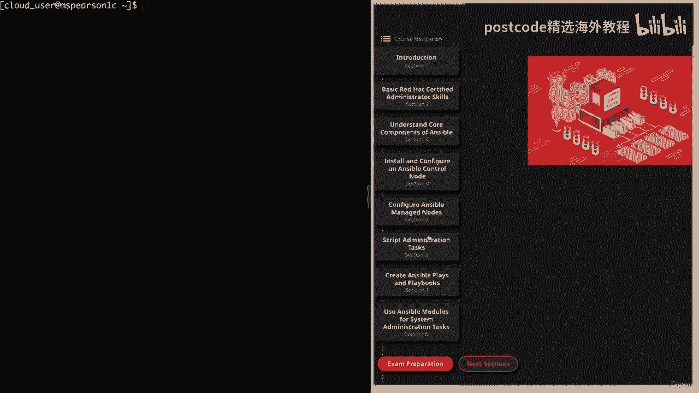

在本节课中，我们将学习如何创建简单的Shell脚本，并了解如何将Ansible临时命令整合到脚本中，以实现自动化管理任务。我们将从脚本的基础知识开始，逐步深入到实际应用。

## 概述

本节课程分为两部分。首先，我们将介绍创建基本Shell脚本的核心概念，包括脚本结构、权限和执行方法。随后，我们将学习如何编写一个包含多个Ansible临时命令的Shell脚本，以批量执行系统管理任务。

---

## 第一部分：创建简单的Shell脚本

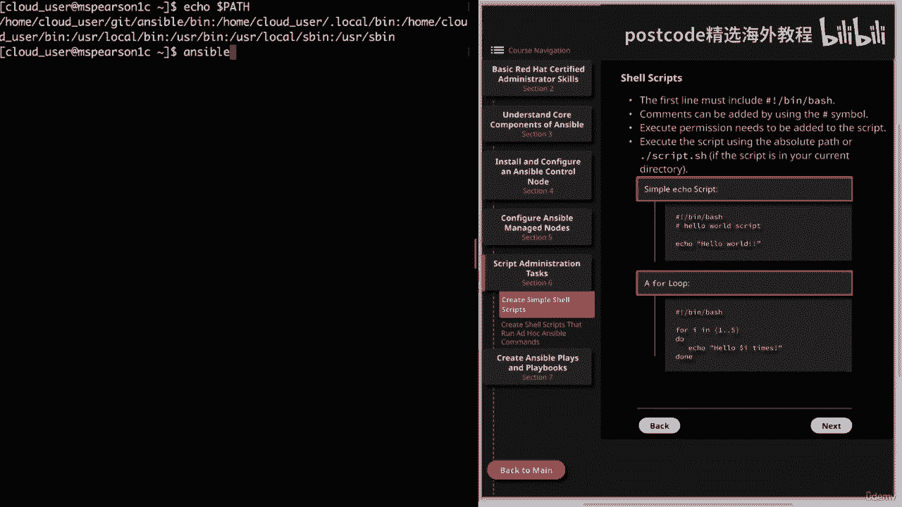

上一节我们介绍了Ansible的基础知识，本节中我们来看看如何通过Shell脚本来自动化任务。Shell脚本是包含一系列命令的文本文件，能够被Shell解释器执行。

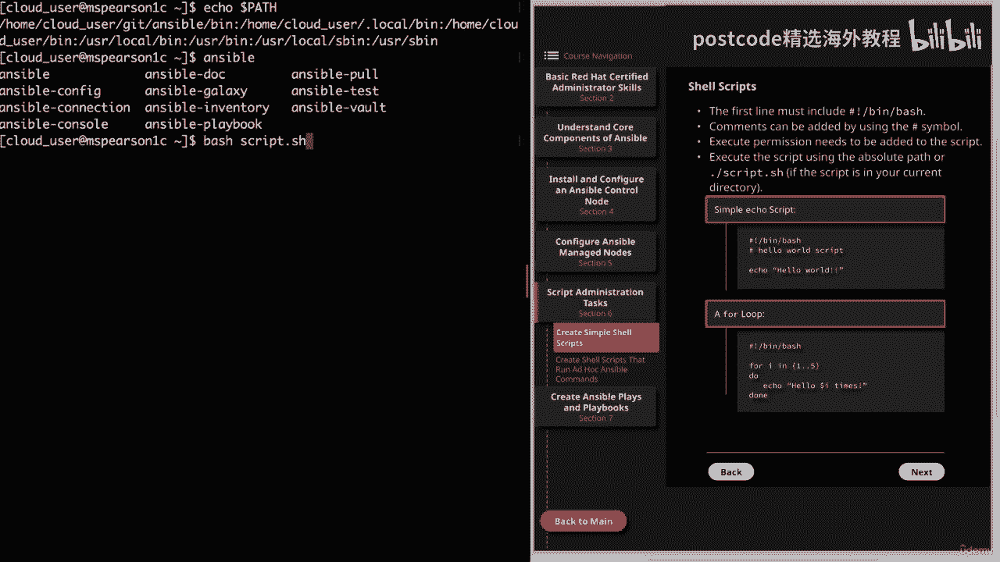

### Shell脚本基础

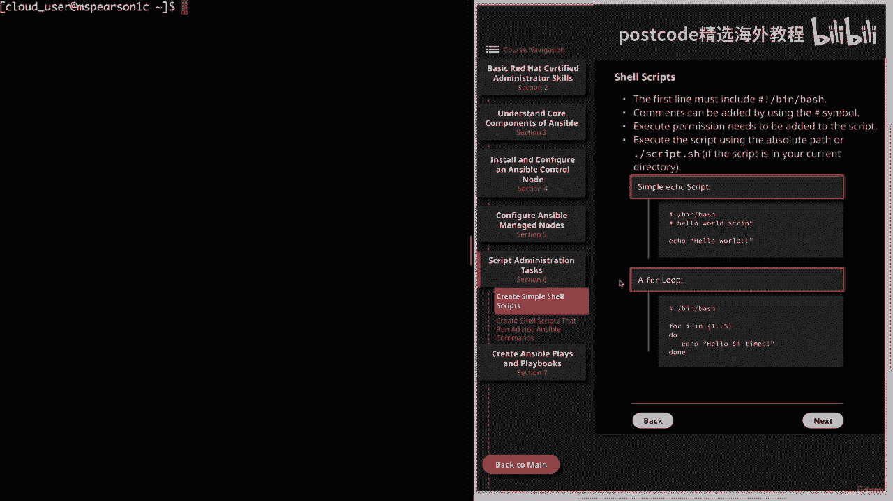

以下是创建和运行Shell脚本需要了解的几个核心要点。

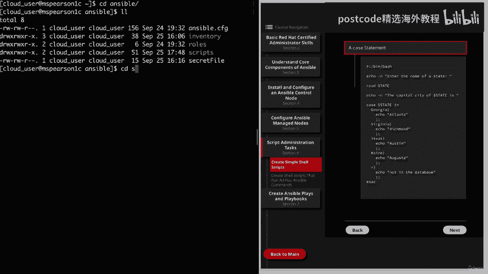

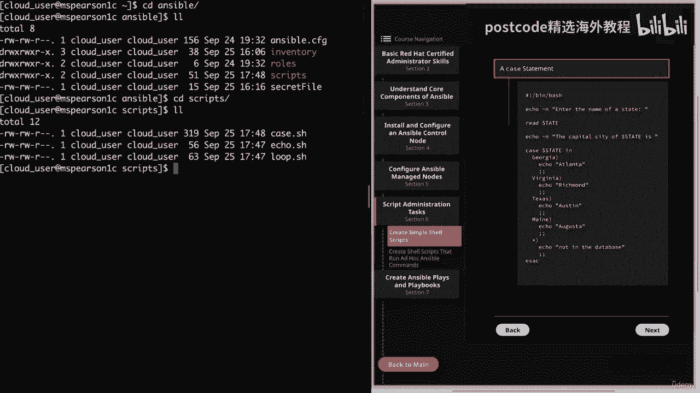

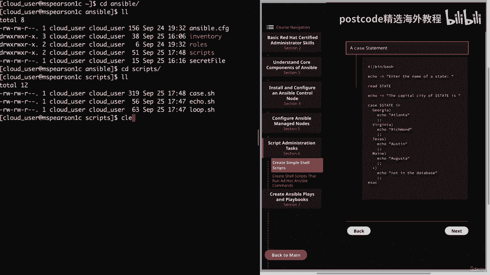

1.  **Shebang行**：脚本的第一行必须是shebang行，用于指定解释器。其格式为：
    ```bash
    #!/bin/bash
    ```
    这告诉系统使用`/bin/bash`来执行此脚本。你也可以指定其他解释器，如`#!/usr/bin/python`。

2.  **添加注释**：使用井号`#`可以在脚本中添加注释，`#`之后的内容会被解释器忽略。注释对于提高脚本的可读性和可维护性至关重要。

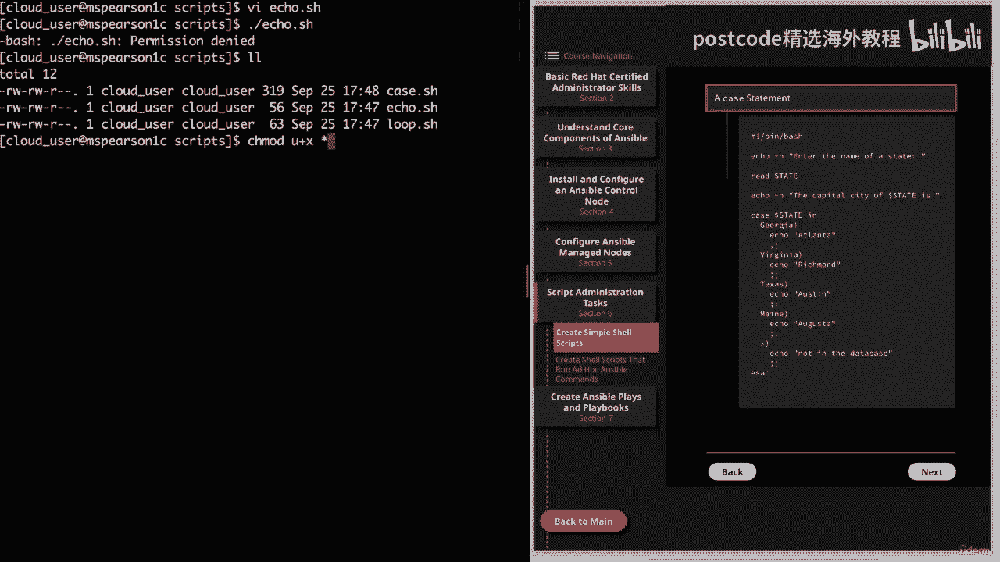

3.  **设置执行权限**：创建脚本后，必须为其添加执行权限才能运行。可以使用`chmod`命令修改权限。
    *   为用户添加执行权限：`chmod u+x script.sh`
    *   为所有用户添加读、写、执行权限：`chmod 755 script.sh`

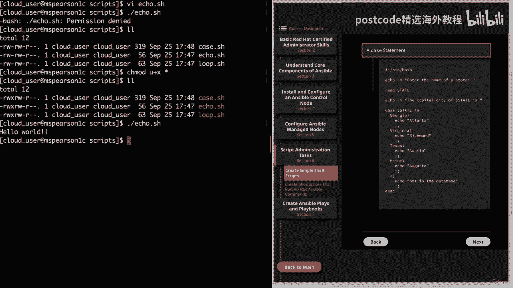

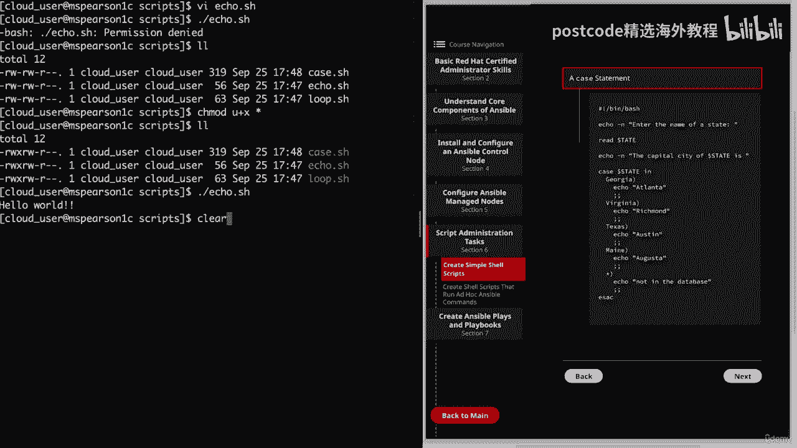

4.  **执行脚本**：有几种方法可以执行脚本：
    *   使用绝对路径：`/path/to/script.sh`
    *   如果脚本在当前目录，使用相对路径：`./script.sh`
    *   通过`bash`解释器直接运行：`bash script.sh`

> **注意**：系统会在`PATH`环境变量定义的目录中查找可执行命令。当前目录通常不在`PATH`中，这就是为什么执行当前目录下的脚本需要加上`./`前缀。

### 脚本示例分析

以下是几个常见的Shell脚本示例，可以帮助你理解其结构。

#### 示例1：基本输出脚本
这个脚本演示了如何在脚本中运行普通的Bash命令。
```bash
#!/bin/bash
# 这是一个输出“Hello World”的脚本
echo “Hello World”
```

#### 示例2：For循环脚本
`for`循环用于重复执行一系列命令，在处理列表时非常有用。
```bash
#!/bin/bash
# 这是一个for循环示例
for i in 1 2 3 4 5
do
    echo “Hello $i”
done
```
在这个脚本中，变量`i`会依次被赋值为列表`1 2 3 4 5`中的每个数字，并执行`echo`命令。

#### 示例3：Case条件语句脚本
`case`语句用于简化多条件判断，比多层`if-else`语句更清晰。
```bash
#!/bin/bash
# 这是一个case语句示例，根据输入返回州首府
echo “请输入一个州名：”
read state
case $state in
    Georgia)
        echo “首府是亚特兰大。”
        ;;
    Virginia)
        echo “首府是里士满。”
        ;;
    Texas)
        echo “首府是奥斯汀。”
        ;;
    Maine)
        echo “首府是奥古斯塔。”
        ;;
    *)
        echo “数据库中未找到该州。”
        ;;
esac
```
脚本会读取用户输入，并根据输入的值匹配不同的模式（子句）。星号`*`作为默认子句，处理所有未匹配的情况。

---

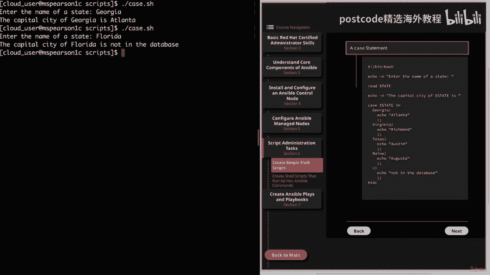

## 第二部分：创建运行Ansible临时命令的Shell脚本

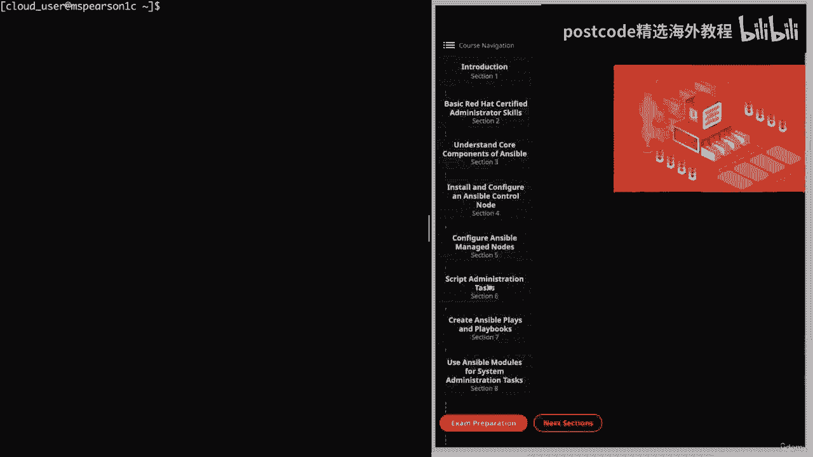

了解了Shell脚本的基础后，本节我们来看看如何将Ansible临时命令封装到脚本中。即使临时命令常用于一次性任务，将其写入脚本也能方便复用和批量操作。

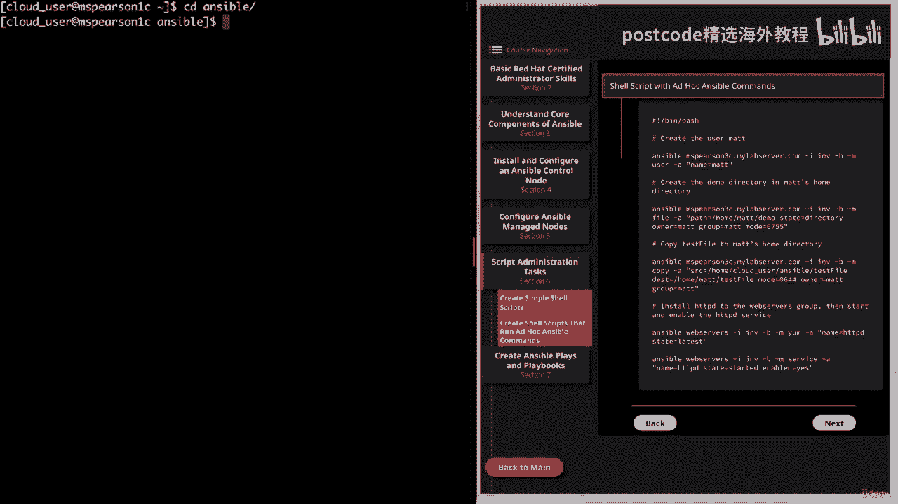

### 脚本示例：批量管理任务

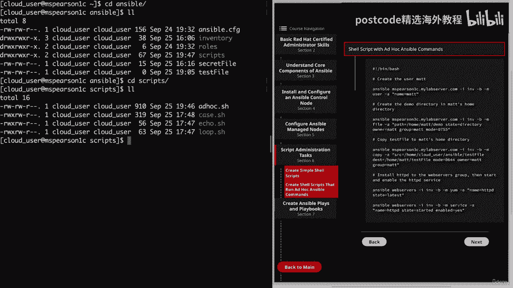

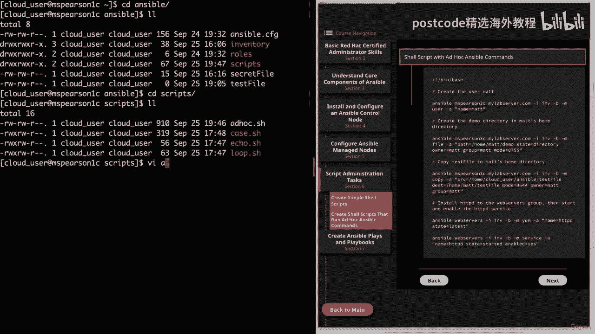

以下是一个包含多个Ansible临时命令的脚本示例，它依次执行创建用户、创建目录、复制文件和安装服务等任务。

```bash
#!/bin/bash
# 脚本：ad-hoc-demo.sh
# 功能：执行一系列Ansible临时命令

# 1. 在mspiersson3c主机上创建用户matt
ansible mspiersson3c -i /home/cloud_user/ansible/inventory --become -m user -a “name=matt”

# 2. 在matt用户的主目录下创建demo目录
ansible mspiersson3c -i /home/cloud/user/ansible/inventory --become -m file -a “path=/home/matt/demo state=directory owner=matt group=matt mode=0755”

# 3. 将测试文件复制到matt的主目录
ansible mspiersson3c -i /home/cloud/user/ansible/inventory --become -m copy -a “src=/home/cloud_user/ansible/testfile dest=/home/matt/testfile mode=0644 owner=matt group=matt”

# 4. 在web_servers主机组上安装最新版httpd软件包
ansible web_servers -i /home/cloud/user/ansible/inventory --become -m yum -a “name=httpd state=latest”

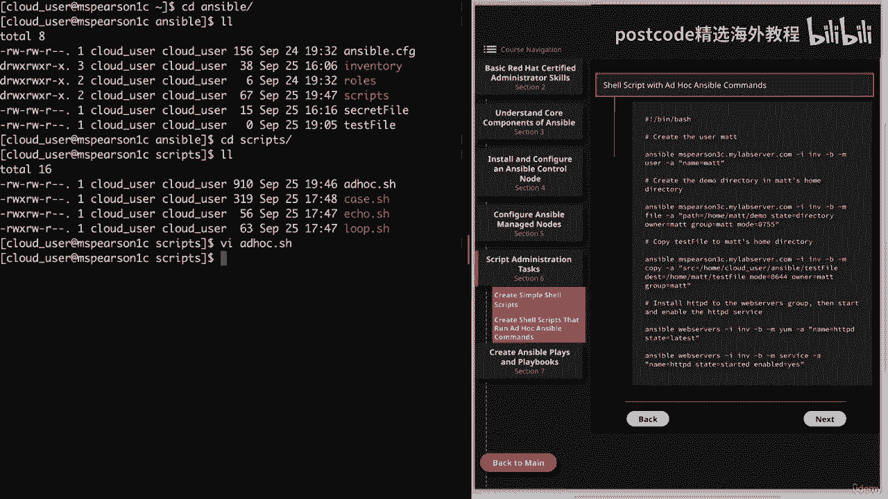

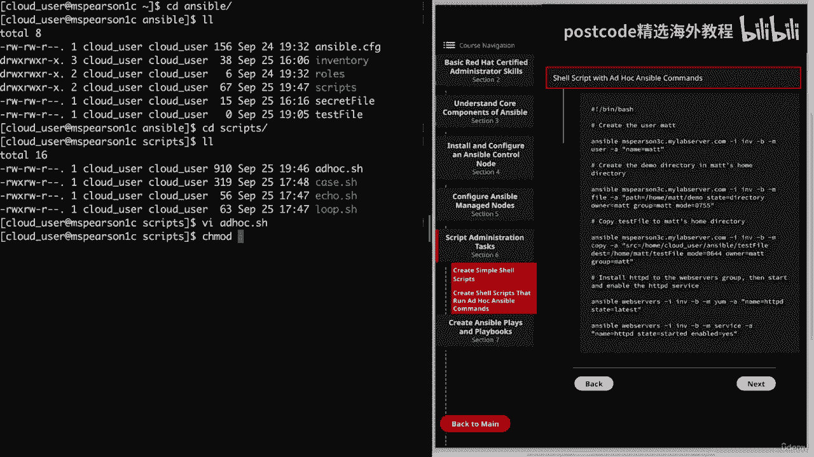

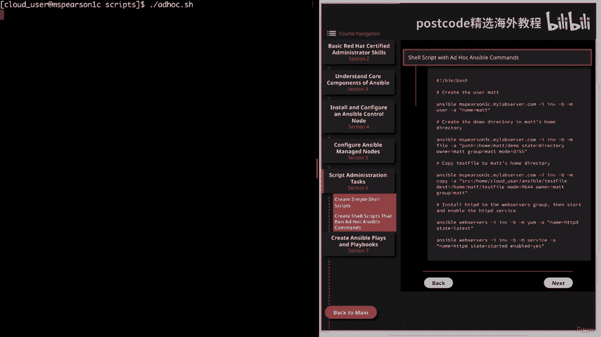

# 5. 在web_servers主机组上启动并启用httpd服务
ansible web_servers -i /home/cloud/user/ansible/inventory --become -m service -a “name=httpd state=started enabled=yes”
```

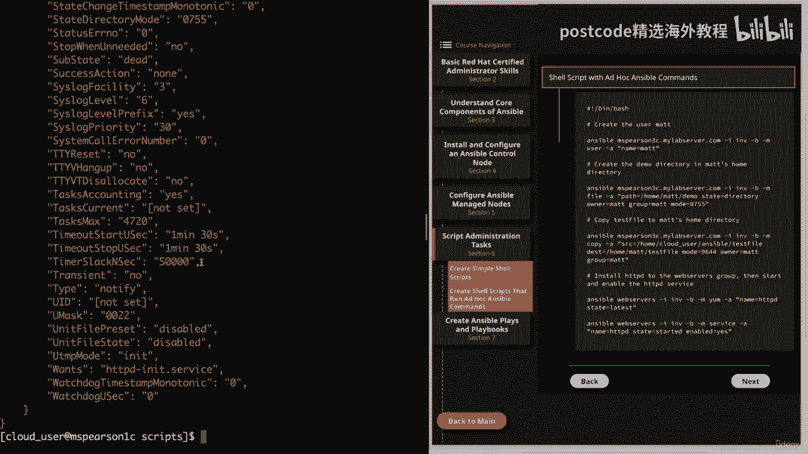

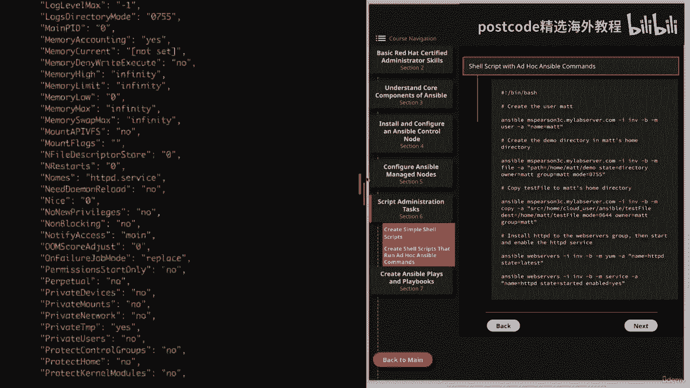

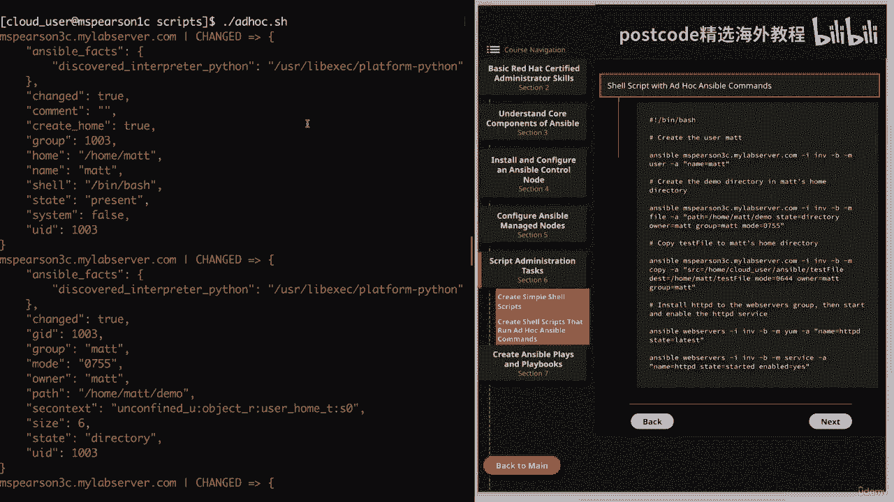

### 脚本解析

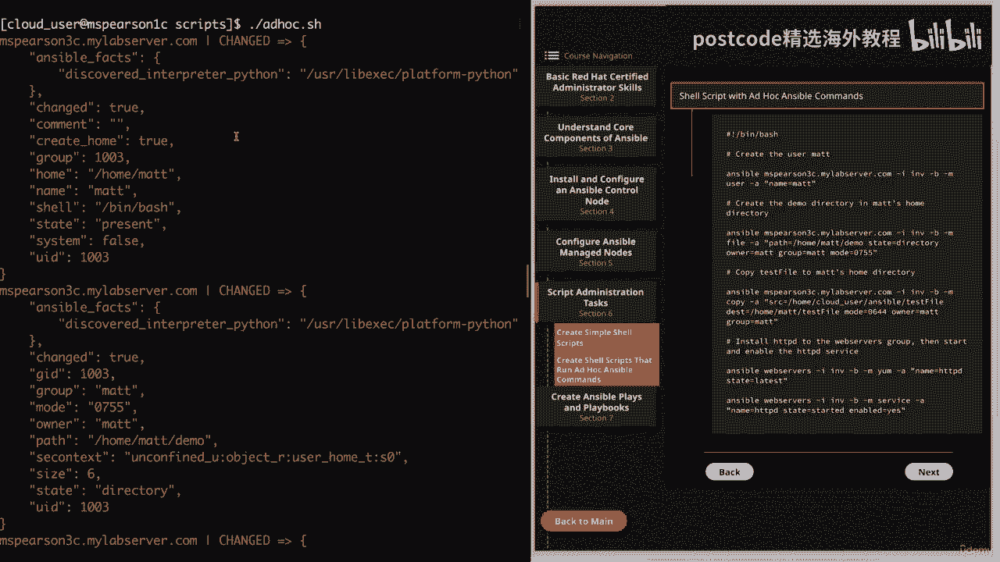

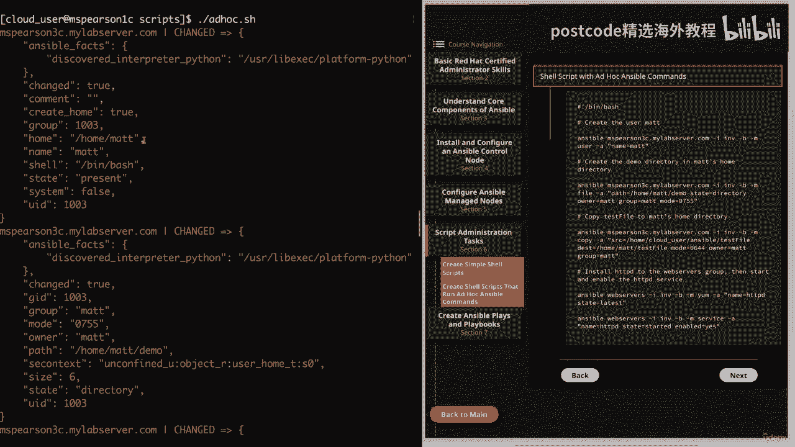

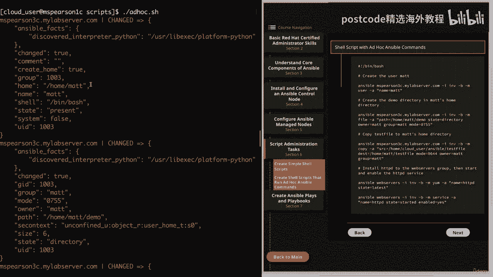

1.  **模块化任务**：每个`ansible`命令对应一个独立的管理任务，使用了不同的模块（`user`, `file`, `copy`, `yum`, `service`）。
2.  **参数说明**：
    *   `-i`：指定清单文件路径。在脚本中使用绝对路径是推荐做法。
    *   `--become`：以root权限执行命令。
    *   `-m`：指定要使用的Ansible模块。
    *   `-a`：传递给模块的参数，定义了任务的具体行为。
3.  **执行流程**：脚本会按照顺序执行所有命令。你可以根据需要轻松调整顺序、添加或删除任务。

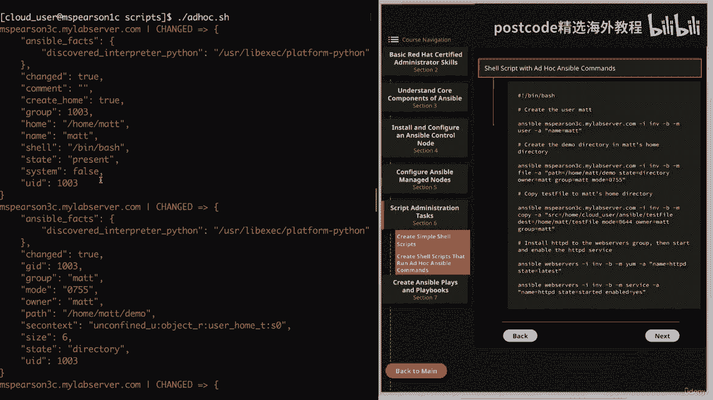


运行此脚本前，别忘了赋予其执行权限：`chmod u+x ad-hoc-demo.sh`。执行后，Ansible会输出每个任务执行的结果报告。

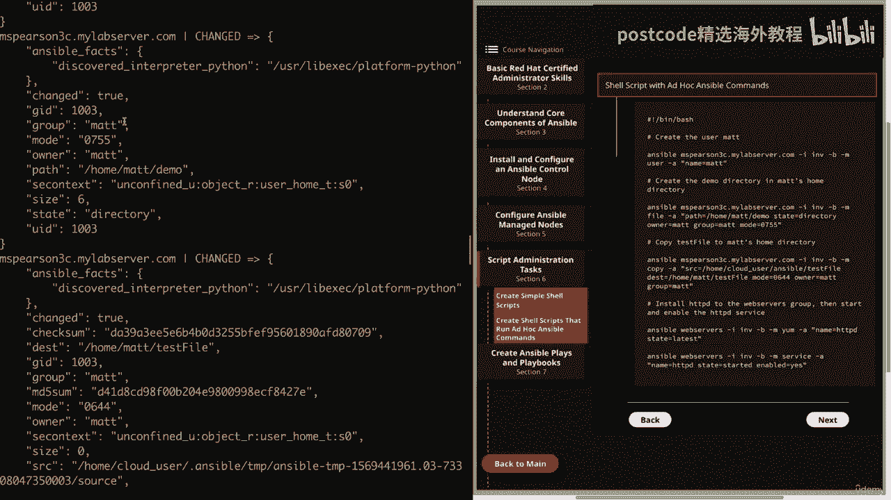

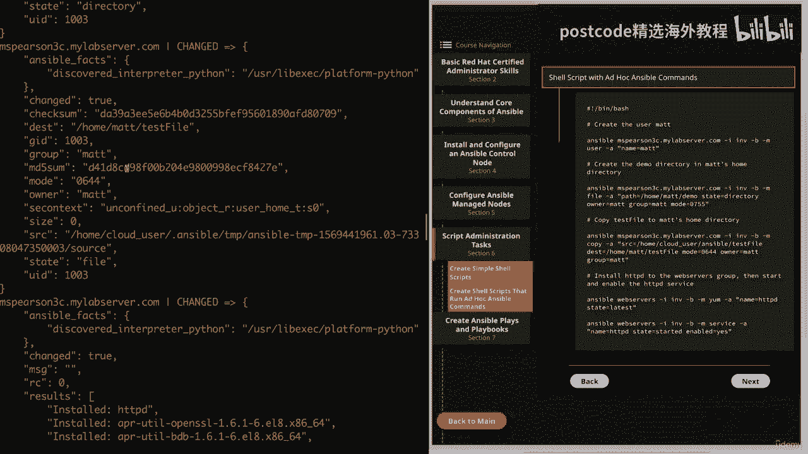

## 总结

本节课中我们一起学习了Shell脚本的创建与使用。
*   我们首先介绍了Shell脚本的基本要素：shebang行、注释、执行权限和执行方法。
*   然后，通过`echo`、`for`循环和`case`语句的示例，理解了脚本的基本结构。
*   最后，我们掌握了如何将多个Ansible临时命令组织到一个Shell脚本中，从而构建出功能强大的自动化管理脚本。

掌握这些技能，不仅能帮助你在RHCSA/RHCE考试中应对相关题目，更能极大地提升你在实际工作中的运维效率。你可以发挥创造力，结合各种Ansible模块，编写出满足复杂需求的自动化脚本。