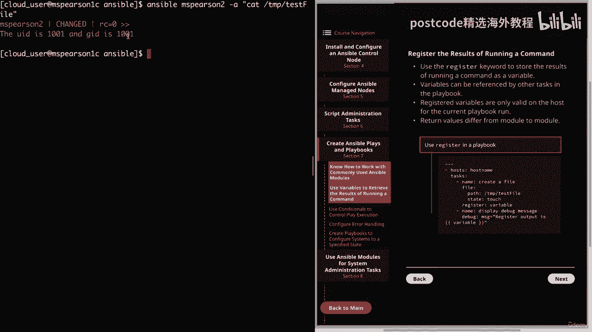
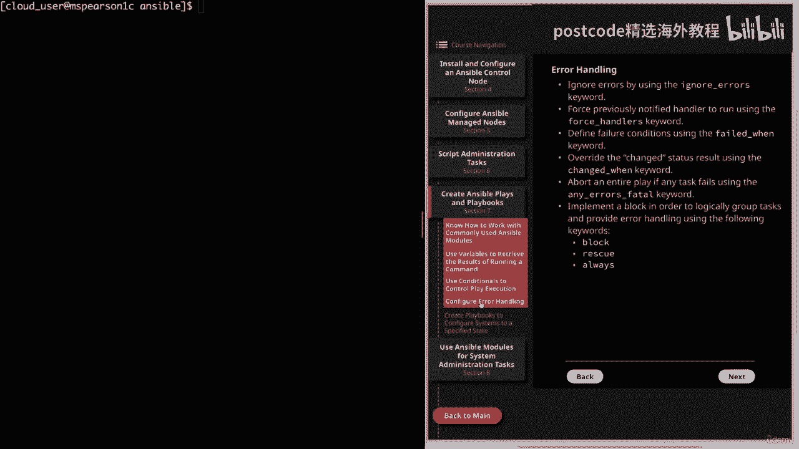
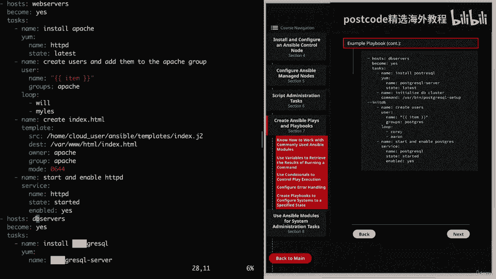

# 红帽企业Linux RHEL 9精通课程 — RHCSA与RHCE 2023认证全指南 - P18：03-03-005 Ansible - Plays and playbooks - 精选海外教程postcode - BV1j64y1j7Zg

视频。我们将继续第七部分，这部分内容是关于创建 Ansible 剧本和剧本的。

那么让我们继续点击它。这将带我们进入第一部分，即了解如何使用常用的 ansible，模块。在我看来，很好地掌握一些更基本、更常见的知识是非常重要的。使用的模块。

这样你就不必每次都在 Ansible 文档中查找它们，这将是，真的很有帮助，尤其是当你参加考试时。这样你就不会因为查找每件事而浪费时间。好的。因此，在本页和下一页中。

我提供了一些值得了解的常见模型的列表。我们首先要开始的是 ping 模块。这将验证服务器是否正在运行且可访问，并且没有任何必需的参数。因此。

这只是查看是否可以通过 Ansible 访问托管节点的简单方法。这也是运行 Ansible 即席命令的一个很好的用例。正如我所说，没有必需的参数，而且它实际上只有一个需要的参数，即，是数据。

这会更改您从运行命令收到的返回值。默认情况下，这将是乒乓球。并且您还可以使用 crash 作为返回异常的值。由于我们已经在课程中看到了这样的示例，因此我将继续讨论下一个，module，即设置模块。

我们已经看到了另一个出现的情况，它将用于收集可靠的事实和，这也没有必需的参数。因此，默认情况下，这将返回 Ansible 可以收集的有关主机的所有事实。但您也可以使用过滤器参数来过滤它。

以搜索特定的事实。一个例子是 Ansible 下划线 E 零，它将返回事实，关于E归零装置。您还可以使用收集子集参数来限制返回的事实，该参数允许，您可以指定事实的特定子集，例如硬件网络。

接下来我们有模块，它将使用包管理器来管理包。不需要但最常用的常见参数是名称和状态，还有一些其他参数，但这就是您通常要使用的参数。所以 name 将允许您指定包或包组的名称，然后说明。

将允许您选择是否要安装或删除它。因此，让我们快速进入命令行，我们将使用一些 ansible 来演示这一点，即席命令。所以我将播种到我的 ansible 目录中。因此，我们将继续指定 Ansible。

因为当我在 MMS Pierson 上运行此命令时，我们正在运行临时命令，成为 root 用户，然后我们将指定 Yum 模块和我们的参数。让我们继续安装 Hpdi。第一个状态。我只想用最新的。

这将检查并查看该软件包是否已安装，如果已安装，则，它实际上会将其更新到软件包的最新版本。如果未安装，则只会安装最新版本。那么，让我们继续前进，进入疾病吧。可能需要一秒钟。所以我会继续并快进。

这样您就不必等待。正如我们所看到的，我们的状态更改为 true。在结果中我们看到我们已经安装了 HTTP DX 以及所需的任何依赖项，对于包裹。我们还可以通过将状态设置为不存在来删除该包。

但在向您展示之前，让我们先使用 HTTP 服务器来展示服务模块。所以服务模块将控制远程主机上的服务，公共参数是，为必填的名称。然后通常您会看到状态和启用状态。因此。

就像您在本地主机上使用系统 CTL 一样，您可以按顺序使用服务模块，启动或启用该服务，以便它在重新启动后恢复。关于名称参数的另一件事是，如果您只指定名称而不使用任何其他参数，然后您将获得服务的状态。

然后使用状态参数，您可以指定启动、停止、重新启动或重新加载。然后对于启用，您可以将其设置为是或否。那么让我们继续使用新安装的 HTTP 服务来尝试一下。再次强调。

我们将在 MSC Pearson 上运行 Ansible 命令。这次我们将成为 root 用户。我们将指定服务模块，然后指定我们的参数。所以我们将与 HTTP 进行交互。然后对于状态，我们继续说开始。

然后启用四个。我们说是的。

而且这种情况很快就会恢复。我们看到我们在这里得到了很好的输出。

让我们向上滚动，我们会看到更改状态设置为 true。Enabled 也设置为 true，它为我们提供了我们请求的服务的名称，即 HTTP，并且它的状态已启动。

然后如果我们想停止服务，我们可以回到这里。而不是开始。

我们就停下来。

我们可以看到我们的输出吗？我们看到国家已经停止了。现在让我们继续删除 Hpdi。

因此，我们不会说最新，而是说缺席。

如果我能拼写正确的话。我们在结果部分看到我们已经删除了 MOD 下划线 HTTP 和 HTTP feed。

好的。我们的下一个模块是用户模块。这将允许您管理用户帐户和属性。在公共参数下，我们有名称，这是必需的参数，然后是状态组和，组，状态参数可以采用两个值之一，默认值存在，然后它可以。

也可用于通过指定不存在来删除用户，组参数用于设置主要组，然后您还可以使用 groups 参数将用户添加到多个组。我没有在图中列出这一点，但您也可以使用 home 选项来设置用户的，主目录。

然后您可以使用 shell 参数来指定用户 shell。那么让我们继续尝试一下。Ansible 我们将在此人上再次运行此命令以成为用户。我们将使用用户模块。四个论点。

我们只需指定一个名称并为用户指定名称即可。因此，这将创建一个名为 Pinhead 的用户，然后使用所有默认设置。我们的更改状态等于 true。我们没有为用户添加评论。

默认情况下 create home 将等于 true 并且它会，给我们我们的组 ID，即 1003 以及我们的 UID，即 1003。然后它将打印出有关用户的其他默认信息，例如主目录，名称，然后是外壳。

当然，默认状态是存在的。

而且这还不是系统用户。让我们继续并单击“下一步”。剩下的模块我们可以在下一个模块中讨论。待办事项是复制模块，它将用于将文件复制到远程主机，通常，您将指定源和目标来复制文件。正如您所看到的。

目的地是必需参数，但您也可以指定所有者和，组以及文件使用模式的权限。正如我们在许多其他模块中看到的那样，众数可以用数字或符号来表示。让我们先尝试一下。

让我们继续在家庭云用户 Ansible 中创建一个文件。它会接触，我们将调用这个秘密文件。让我们继续使用 Ansible 来复制它。这将由GM亲自来。我们将继续成为用户。我们将使用复制模块。

我们将提供家庭云下划线用户的来源。Ansible 然后它是秘密文件。然后就是我们的目的地。让我们继续把它放在家里吧。针头。这是为 pinhead 用户和所有者创建的新主目录。让我们继续制作这个针头。

然后是团体。他们也做松头。然后对于模式，让我们执行标准的 644 权限。然后按回车键开始。

我们看到我们的临时命令成功运行。我们收到了所有返回值，因此我们看到了目的地、组 ID、名称。

组，权限，所有者为064。我们甚至可以获得一些有关上下文的信息，一直到 UID，即 1003。

好的。所以我们的倒数第二个模块是文件模块。这使我们能够管理文件和目录。所以公共参数将是所需的路径。然后我们还有状态所有者组和模式，路径将是文件或目录的路径，您将要修改或创建的内容。

然后状态是你要指定它是文件、目录、软链接还是硬链接的地方，您可以指定 touch 来创建新文件。然后，缺席将用于删除指定的文件和目录。那么让我们继续测试一下。首先，我们将创建一个目录。

然后在该目录中创建一个文件。我们继续跑吧。安西布尔。多发性硬化症。皮尔森至。破折号之前变成破折号em。然后我们将指定文件模块。然后是我们的论点。所以我们要指定的第一件事是我们的路径。

我们将创建目录和主目录，针头。我们将其称为测试。然后我们将使用 State 来指定它是我们正在创建的目录。然后我将指定所有者，它将成为头，然后指定组，该组也将，成为针头。

好的。这样我们的目录就创建成功了。

现在让我们继续在该目录中创建一个文件。因此，我将继续进行操作，因为我们的命令将非常相似。所以我们的路径是 home pyun head test。让我们继续创建一个名为测试文件的文件。然后对于状态。

我们将使用触摸，因为我们正在创建文件。楼主又要蠢蠢欲动了。而且小组也将是优秀的负责人。然后对于模式，我们继续执行 0644。然后我们可以继续运行它。

我们看到我们的文件已在新创建的目录中成功创建。

现在让我们继续讨论最后一个模块，即 Git 模块。这将用于允许您与 Git 存储库进行交互。因此，我们的常用参数将是 repo，这是必需的，然后是目的地，也是必需的，最后我们需要克隆。

我将继续向您展示一个示例，以便您了解它是如何工作的。因此，我们需要做的第一件事是在我们的 RMS Pearson 主机上安装 get。因此，让我们快速告诉 Mark Pearson。

我们将成为并使用 Yum 模块。所以我们的名字将会得到。然后我们的状态，我们就说最新的。好的。看起来我们的包已经安装了。确实如此。现在让我们继续使用 git 模块来获取 git 存储库。

所以它又会是 Ansible。皮尔森女士到。然后划我，划em，然后我们将指定 git 模块。然后是我们的论点。因此，首先我们要指定我们的存储库，并将其实际放在我的剪贴板上。所以我只需复制并粘贴它。

就可以节省一些打字时间。然后我们将指定我们的目的地。让我们继续把它放在家里吧。松头。安西布尔。并确保您指定的目录是一个新目录，创建或现有的空目录。所以我们将继续并开始。这可能需要一点时间。

所以我可以继续为我们加快速度。好的。所以我们看到我们确实得到了更改状态等于 true 但我们没有得到更多关于，它。因此，让我们继续使用另一个 Ansible 即席命令快速验证这一点。因此。

他们将亲自负责，并指定一个。请记住，当我们指定破折号 a 而不使用允许我们运行的模块时，引号内的命令。那么，让我们继续在家里做一次 LZ Dash L 吧。松头 Ansible。

我们将看到 Ansible git 存储库已成功拉下。好了，我们的常用模块列表就到此为止了。我还想赞扬其他几位人士。首先，我们有行和文件模块，这将用于验证字符串是否存在，在文件中。

它也可用于添加或替换行。然后还有其他一些相似但当然不同的命令模块和 Shell，模块。这些将允许您运行命令。我真的鼓励您深入研究模块索引下的 Ansible 文档，那就是，将为您提供有关模块的更多信息。

它将向您展示模块的示例，还有其他几个模块。因此，熟悉该模块索引确实是一件好事。这样您就可以找到适合您要完成的任务的模块。随着我们学习课程的进展，您还将看到许多不同的模块，并展示不同的示例。

剧本以及您可以使用 Ansible 执行的操作。特别是，我们使用第八节来展示一堆不同的模块，特别是，用于系统管理任务。好的。好吧，我们就到此结束了。因此，让我们继续将视频标记为完成。

然后我们可以继续下一部分。在本视频中，我们将讨论使用变量来检索运行命令的结果。因此，让我们转到第七部分来创建 Ansible 剧本和剧本，然后进入第二部分。

部分。因此，为了检索正在运行的命令的这些结果，我们将使用 register 关键字，我们将把它存储为变量。老实说，这很容易做到。因此，在与您的模块相同的邀请中，您只需添加关键字 register。

然后指定，你的变量的名称。因此，如果您查看页面底部的示例。我们让主机指定我们的主机名，然后我们有任务，我们将创建一个文件。然后，与我们的文件模块一样，我们将指定 register 关键字，并且。

然后我们将为变量命名，这里只是变量。接下来的变量可以被剧本中的其他任务引用。注册这些变量的好处之一不仅仅是为了获取它们所包含的信息，不仅能够提供，而且还能够根据返回的内容做出决策。因此。

如果我们继续查看这里的示例，我们将使用寄存器并指定我们的变量，name，然后我们将在第二个任务中引用该变量，该任务使用调试模块。然后我们的下一点，非常重要的是要记住，注册变量是。

仅在当前 playbook 运行的主机上有效。因此，这意味着一旦剧本完成，执行变量将不再被存储。因此，如果您有一个需要我们变量的剧本，您将需要让它在，剧本。最后，返回值因模块而异。因此，比方说。

来自 Yum 模块的返回值将与来自，用户模块。如果您想查看特定模块的预期返回值，您可以随时，在 Ansible 文档中查找该模块，然后返回值将在下面进行描述，该模块的返回值部分。好吧。

现在让我们转到命令行来测试一下。因此，我们需要做的第一件事就是创建我们的剧本。我将在我的剧本目录中创建它。我刚刚决定在家庭云用户 Ansible 中创建一个目录，以便我可以保留所有剧本，在同一个地方。

您可能还会注意到我安装了它们，并且我通常喜欢使用它们而不是普通的，VI，因为它添加了一些额外的功能。但real image和playground默认不安装它。因此，如果您想使用它们，请随时安装。

不管怎样，让我们​​继续创建我们的剧本，我将其称为注册点 HTML。好的。所以我们将从三个破折号开始。然后是我们的主人。让我们继续在 MBS 上执行此操作。皮尔森也是。我们不需要任何提升的权限。

因为我们只是要在临时目录中创建一个文件。所以我要继续并指定任务。他们会回来并为此指定我们的名字。它只是创建一个文件。我们将使用文件模块。我们将指定临时路径，然后指定文件名 test，文件。然后是国家。

因为我们正在创建文件，所以它将被触摸。然后在与文件模块相同的缩进、相同的级别，我们将输入寄存器。这就是我们要定义变量的地方。所以我们可以直接调用这个变量，但你可以诚实地调用它任何你想要的名称。

然后我们将继续添加另一个任务。为此，我们将使用调试模块来显示一条消息。所以我们只说显示、调试消息。然后我们将指定调试模块，然后指定消息等于。寄存器输出是，然后我们将提供我们的变量。多变的。

然后我们将结束报价。好的。所以我们将使用 file 模块创建一个文件，然后我们将使用 register 关键字，为了将其输出存储到我们的变量中，我们称之为变量。也许我实际上会将此称为 var。

所以我们并不是一遍又一遍地说变量。所以我们将其命名为 var。我们将使用调试模块来显示一条包含变量的消息，这是文件创建的所有输出。所以让我们继续保存它。我的意思是，继续尝试运行它。因此。

我将运行 Ansible 剧本，他们将指定我们的剧本。由于我位于 Ansible 工作目录中，因此我们的 Ansible CFG 就在其中。所以我不必指定库存，它只是默认为正常库存。

那么让我们继续并按 Enter 键。

好吧，我们收集了事实，然后我们也创建了有关 MZ Pearson 的文件。然后你可以看到我们的下一个任务，即显示调试消息。我们在这里看到我们的消息。它说寄存器输出是，然后它将提供该文件创建时的输出。

我们看到我们得到了一堆不同返回值的列表。我们得到的云用户组UID是1001。我们的目的地是临时测试文件。我们看到变化是平等的。是的，我不会一直讲下去，但正如你所看到的，它存储了所有这些返回。

我们的变量 var 中的值，我们使用调试模块将其输出到消息中。现在我们已经了解了这些返回值是什么样子以及如何存储它们，现在让我们继续吧，更新我们的剧本，以便我们可以在另一个任务中实际利用这些变量。因此。

我们继续解决这个问题，然后我们将编辑我们的剧本。那么让我们进入剧本的底部。现在我们要添加另一个任务。我们将在文件模块中添加该行，并且我们将获取其中一些返回值，并使用它们将文本写入文件。

所以我们要为此命名。我们将只使用编辑文件。我们将使用行和文件模块。现在我们需要先指定一个路径。这将是临时测试文件，因为这是我们创建文件的地方。然后换行。我们将添加 UID 并指定一个变量。而且还会很远。

请记住，这是我们正在注册的变量的名称。然后我们还可以指定这些返回值之一，因为我们将它们全部存储到我们的，多变的。所以这次我们只做 var uuid 。这样就可以提取 uid 了。然后我们可以说，头晕是。

您可能已经猜到这会是什么。这将是 var ID。然后，当我需要在此处添加空格时，我们可以关闭报价。我的你在这里也是大写的。好的。因此，让我们继续保存我们的剧本。

现在让我们继续运行它，看看会发生什么。注册的电子邮件。我们看到了之前熟悉的输出以及我们的任务编辑文件，它看起来像，一切都成功了。让我们继续解决这个问题。

然后我们使用 ansible ad hoc 命令来限制文件测试文件并查看我们的更改是否，实际应用了。记住达什。它将允许我们在引号中运行命令。所以我们将使用 cat 临时测试文件。并且如你所见。

我们在文中添加了行和文件模块，UID为1001，ID为1001。因此它能够获取我们存储在 var 变量中的返回值，然后使用它们，在另一个任务中。所以要意识到这是一个利用这些存储值的非常简单的例子。

但我希望你，已经可以看到它可以提供的好处。这不仅仅是为了获得更多信息，也是为了根据输出做出决策，上一个任务的。我们稍后肯定会在课程中更多地讨论变量，但现在就这样了。

完成有关使用变量检索运行命令的结果的本课程。因此，让我们继续并将其标记为完成，然后我们可以继续下一课。

在本视频中，我们将讨论使用条件来控制播放执行。

那么让我们转到第七部分。然后向下使用条件语句。好的。所以我们要讨论的第一件事是处理程序。我将逐步介绍并讨论一下处理程序是什么。然后我将向您展示它们如何在实际剧本中工作。因此。

首先处理程序在被调用时采取行动。因此，如果未调用处理程序，则不会执行该操作。每当发生更改时都会调用处理程序，并且还使用 notification 关键字来调用它们。因此。

如果任务运行 Ansible 并且未进行任何更改，则处理程序将不会收到通知。但是，如果由于操作而发生更改，则将使用关键字通知处理程序，处理程序正在侦听。这可以使用notified关键字来指定。接下来。

可以为剧本或剧本定义多个处理程序，这会导致下一个处理程序，观点。也就是说，可以在通知部分指定多个处理程序。因此，您的剧本中可以有多个处理程序，然后您可以引用一个或多个处理程序。

在通知部分中使用该通知关键字。不仅可以有多个处理程序，处理程序还可以有多个任务。正如您可以想象的那样，这提供了很大的灵活性，您还可以分离出，以合乎逻辑的方式将任务分配给处理程序。最后。

无论有多少任务通知处理程序，它都只会运行一次。假设您有一个包含配置文件和一些数据文件的服务，并且，每当更新这些内容时，都需要重新启动服务。好吧，您可能会遇到这样的情况：您有一个同时更新数据文件和。

配置文件。因此，在您的剧本中，您将使用 notification 关键字来通知处理程序该服务，需要重新启动。即使有两个单独的任务正在运行并通知处理程序，处理程序，只会运行一次。

您可能已经注意到这是一种更有效的方法，而不是在每个单独的步骤之后重新启动。好的。好吧，让我们转到命令行来尝试一下。我们需要做的第一件事是创建一个剧本。我在我的 playbooks 目录中创建这个？

我们将调用这个处理程序 HTML 和这个 playbook。我们也将在 MZ Pearson 上与 Apache 合作。只是为了让您知道，在观看此视频之前，我继续安装并启动了 Apache HTTP。

服务器。因此，如果您正在跟进，请继续并暂停视频并安装它，然后我们就可以继续，向前。如果我们看这里的图表。

我将向您展示我们将要做的事情的一个例子。因此，我们将更新 Apache hub dot com，然后我们将通知 Handler Apache，需要恢复。那么让我们回到这里。我将从我们的破折号开始。

然后对于东道主，我们将与皮尔逊打交道，再次。我将成为 root 用户。然后我们就可以指定我们的任务。所以首先是更新http dot com。更新。我们将使用替换模块。

我们需要指定的第一件事是提供 http adcom 路径的路径。埃齐。待定。不能。然后http dd dot com。接下来，我们需要提供我们要查找的内容的正则表达式。

我们将查找以 server admin 开头的任何行。然后抓住它后面的所有东西。你是一个明星。美元符号。他们将关闭它，我们将指定我们将用什么来取代它。那将是服务器管理员。这将是本地主机上的云下划线用户。

我们还将使用备份参数。这样我们就可以备份原来的 adcom。然后记住与我们要放入通知的模块具有相同的缩进和相同的级别。在这里我们可以使用速记或长记来通知处理程序。

我的意思是直接在冒号之后指定它或通过以下方式指定处理程序列表，在通知下方提供它们。但由于我们只指定一个，所以我将继续将其添加到此处，然后我们将，说重新启动Web服务器。然后我们将定义我们的处理程序。

这将回到我们任务所在的水平。然后在处理程序下我们可以定义我们的任务。我们在这里想要定义的就是重新启动 Apache。故名。它将重新启动 Apache。我们将使用服务模块。服务名称。HTTP DD。

国家即将重启。然后我们将监听该notify关键字。那就是重新启动网络服务器。好的。让我们继续保存并退出。现在让我们开始我们的剧本。我们看到我们的剧本执行成功了。

让我们继续切换到 MHS Pearson 看看。

然后我们将把权力让给 Etsy。HTTP 配置，列出清单，您会注意到两个文件。我们有原始的 HTTP 分解以及备份。让我们继续对此进行比较。我们看到我们的更改已成功添加。

您还可以执行一些系统 CTL 状态 HTTP。

我们看到该服务正在运行并且已活动大约 2 分钟。好的。让我们继续退出 MBS Pierson，看看回到我们的控制节点。这只是一个使用处理程序和剧本的快速实用示例，并且真正演示了，处理程序的重要用途。

特别是当您谈论需要处理的服务时，重新启动以使配置更改生效。好的。现在让我们进入下一页。现在我们可以谈谈风的声明。因此，如果满足某些条件，wind 语句将允许任务运行或跳过。因此。

当您希望基于以下内容启动特定操作的情况下，这非常方便使用，完成另一个动作。您甚至可以根据前一个任务是否失败或失败来指定操作是否运行，成功了。接下来的括号可用于对条件进行分组。因此。

您可以在语句两边加上括号，然后在语句之间使用像 或 这样的运算符，这样，如果满足其中一个语句，就会开始执行操作。接下来，可以将多个条件指定为一个列表，这将用于指定，所有语句都必须为真才能运行任务。因此。

这将是我们的逻辑与运算符，而不是我们刚刚讨论的或运算符。最后，还可以使用数学运算比较。所以有时你可能会遇到这样的情况，你想取回一个变量字符串，然后你可以，进行数学比较。

主机上运行的操作系统的版本就是一个例子。对于拥有混合环境的大公司来说尤其如此。因此，您可能有一组正在运行的主机，比如说 Rail 6，然后是一些较新的主机，正在运行 REL 8。

您需要根据此决定要对这些主机执行哪些任务，版本号。因此，这可能是您想要使用 win 语句的情况，以便您可以使用数学，进行操作比较才能做出决定。好的。因此，让我们回到命令行。

然后我们可以尝试一下并浏览一个示例，我们在图中有这里。让我们创建一个剧本。在我们的 playbooks 目录中，这次我们将其称为风车。再说一遍，我们将从破折号开始。然后。

我们的主机这次将针对 Web 服务器执行操作。我们将成为 root 用户。然后我们就可以指定我们的任务。第一个任务将使用复制模块，该模块将复制到文件中。所以当您指定我们的来源时。那就是家庭云下划线用户。

索引 html。我们的目的地是 var dub dub dub html，然后是 index dot html。然后与我们的复制模块处于同一级别。提供wind关键字。

我们将在ansible下划线主机名时说。等于 MZ 皮尔逊三 c。好的。让我们继续保存它。现在。让我们继续运行我们的剧本。Ansible 剧本。和亚马尔时的剧本。

好的。所以我们已经看到这里发生了一些我们不习惯看到的事情，这些事情在副本下面，文件任务。我们看到它跳过了 MZ Pearson 转为 C，并对 MZ Pearson 3 C 进行了更改。请注意。

这并不是失败。它仅跳过该特定主机的任务。正如您所知，其原因是因为我们在 Wind 声明中指定我们，只想在 Ansible 下划线主机名等于 RMS Pearson 时运行该特定任务。

三角，好吧，现在让我们继续将 MZ Pearson 的索引 HTML 卷曲为 C，女士。Pearson C 索引 html。我们看到从中得到的消息是。

这是 HTML 和 MBS Pearson 预测的索引，来自我们之前的视频。现在让我们看看当我们将它们卷曲为皮尔逊三 c 时会发生什么。我们看到我们得到了复制过来的更新后的索引 HTML。

这表明条件很酷。好的。让我们回到图表。我们将点击下一步。本节的最后一个主题是循环。我将主要讨论并展示如何使用标准循环。但 Ansible 也允许更复杂的循环。这将是诸如迭代嵌套组。

甚至重试任务直到特定条件为止的事情，都满足了。但无论如何，可以使用循环或下划线查找关键字来执行循环。但我要说的是，在 Ansible 的新版本中，他们更喜欢您使用循环关键字，而不是 with，例如。

下划线项目或 with 下划线列表。那是因为他们试图将带下划线查找的所有功能构建到，循环。现在，在某些情况下，您确实需要使用 with 查找关键字，但对于标准，循环你应该只使用loop关键字就可以了。

使用循环的标准方法是迭代一个简单的列表。这通过我在图中提供的循环示例来表达，我们在其中创建一个，用户列表，我们只列出他们的名字，违反了格雷厄姆和贝瑟尼。但您也可以迭代哈希列表。

哈希是一种在变量中存储多个值的方法，基本上允许您存储密钥，同一变量内的值对。然后还要迭代字典，它只是键值对的列表。最后，要记住的另一件事是，每当您向循环添加 win 语句时。

它将针对该循环中的每个项目单独进行处理。因此，让我们再次返回命令行并清除此问题。让我们创建另一个剧本。这次我们将把这个称为单循环点 HTML。再次强调，我们将从哈希值开始。为了我们的主人。

我们将针对我们的 Web 服务器组运行此程序。我们要说变得平等。是的。然后我们将给出我们的任务清单。首先我们要输入名称，我们要创建一个用户列表。我们将为此使用用户模块。我们将指定一个名称。

并在这里放入一个变量。该变量将是 item。然后当我们指定循环时，我们列出的那些项目将被替换，这个变量。接下来我们要说的是状态。她会留在现场。然后我们将添加一些组，并将所有这些用户添加到我们将组中。

然后与我们的用户模块处于同一级别。我们要输入循环。然后在其下面，我们将列出我们的项目。首先我们要输入 Violet。然后是格雷厄姆。然后是贝瑟尼。在我们保存并退出之前，我确实想用查找关键字回到整体。

因此，要使用它，我们基本上不会在这里说循环，我们只需指定，下划线项目。这基本上与此处指定循环相同，但带有下划线项目，这是以前完成的方式，他们正在转向使用循环关键字。因此，对于我们的示例。

我们将坚持使用循环关键字，并随意查看 Ansible，文档以查看有关使用查找与仅使用循环的更多信息。好的。因此，让我们继续保存并退出。现在我们可以继续运行我们的剧本了。

我们看到它用我们的 item 变量替换了每个名称以及我们在下面提供的列表，环形。它为 GM、Pearson 3 C 和 GM Pearson for C 执行此操作，简而言之，就是如何。

你执行一个简单的循环。现在循环不仅限于用户和组创建，还可以与其他模块一起使用。一个例子是创建多个文件和目录。但我确实有一个免责声明，那就是某些模块将允许您直接添加列表，进入模块的参数。

而不必在参数中指定循环，通过做一个清单。只要可用，使用它实际上比使用循环更有效。Yum 模块就是一个例子，它允许您默认安装一系列软件包，无需循环。好的。好吧，这将使用条件来控制播放执行。因此。

让我们继续将此视频标记为完成，然后我们可以继续下一课。在本视频中，我们将讨论如何在剧本中配置错误处理。

让我们回到第七节。然后到第四个主题，配置空气处理。

我们将首先详细讨论错误处理和可用的内容。然后我将向您展示一些演示。首先，您可以使用忽略错误关键字来忽略错误。值得注意的是，Ansible 的默认行为是停止执行任何更多步骤，如果有一个失败的任务。

则在主机上。但在某些情况下，您可能希望 Ansible 继续运行该 play，即使它遇到了，错误。如果这是您预期的错误，或者只是一个不会影响或破坏整个任务的任务，则可能是这样。剧本。执行。接下来。

您可以使用强制处理程序关键字强制先前通知的处理程序运行。因此，如果多个任务通知同一个处理程序并且其中一个任务失败，则处理程序将，不跑。根据具体情况，这可能会使您的主机处于意外状态。因此。

这方面的一个例子可能是正在更新的配置文件，然后它会通知，需要重新启动服务的处理程序。但随后同一播放中的另一个任务失败，导致处理程序无法运行。因此，要强制其始终运行，您可以将强制处理程序设置为 true。

接下来，您可以使用 failed Wind 关键字定义失败条件。这使您可以灵活地定义任务的失败实际上是什么，而不是仅仅定义失败，使用 Ansible 默认值。与此类似。

Ansible 还允许您使用以下命令覆盖结果的更改状态，更改了风关键字。这很有用，因为当 Ansible 对主机运行比赛时，它会给出更改状态，基于它是否认为它影响了机器状态。

但有时您会根据回报知道状态是否实际上受到影响，代码或输出。并且您希望确保更改状态不会在报告输出中返回，并确保，该状态不会导致处理程序触发。接下来，如果任何任务失败。

您可以使用 anyErrors fatal 关键字中止整个游戏，这将，如果任何主机发生故障，则标记所有失败的任务，而不是仅仅跳过该主机的剩余任务，特定的主机。最后，您可以实现一个块。

以便对任务进行逻辑分组并提供错误，使用以下关键字进行处理，即“blockrescue”和“always”。因此，使用 block 关键字可以让您在该块内指定一系列任务。

然后在与 block 关键字同一级别，您可以使用rescue 关键字，它允许您指定，当该块内的任务发生失败时要执行的一个或多个操作。最后，块还允许使用always关键字，它允许您指定要执行的操作。

无论块内任务的失败或成功。现在让我们转到下一页，您将看到一些剧本的示例。

使用忽略、下划线错误、关键字和块来处理错误。那么让我们继续在命令行中尝试其中的几个。您可能会注意到，我已经在我的家庭云用户 Ansible 中，这是我的主要工作目录。

现在让我们继续创建一个剧本来说明忽略错误关键字。因此，当我在 playbooks 目录中创建此错误时，我们将将此错误称为 HTML。让我们继续，从三个破折号开始，然后是主机。我将使用实验室服务器组。

然后我们将指定任务。该任务的名称就是复制远程文件。我们将使用 fetch 模块，该模块允许我们将远程文件复制到本地，机器。所以输入 fetch。您需要提供我们的参数。首先是源，源将是临时错误文件。

然后目的地将是我们本地目录中的临时目录。所以我设置这个演示的方式是我们有我们的实验室服务器、主机组，并且有，其中有四台服务器，即 MSS Pearson 三台、四台、五台和六台服务器。

该组中除 RMS Pearson 3 之外的所有主机的临时目录中都有此错误文件。因此，当该任务尝试从该主机检索该文件时，该任务将会失败。所以我们要做的就是和 fetch 一样的级别，我们要输入，忽略。

下划线，错误。我们将其设置为 yes。因此，即使该文件不存在于其中一台主机上，它也应该忽略该错误。好的。让我们继续保存它。现在我们可以运行我们的剧本了。假设第四行第七列有错误。

让我们继续打开它并检查一下。看起来我们拼写错误并忽略了错误。这其中有一定的讽刺意味。那么让我们继续添加它。

好吧，现在让我们保存并再试一次。

看起来我们的语法当时是成功的。所以我们看到它遍历所有主机并收集事实，然后它将启动副本，远程文件任务。你可以为我看到这一点。皮尔逊四号、五号和六号，我们有变化状态，但对于皮尔逊三号，我们得到致命的。

它说它无法找到错误文件，然后您将在下面看到，忽略而不是说失败，而只是说忽略。因此，即使我们有一个合法的错误，我们也可以使用忽略错误来绕过它。好吧，让我们继续解决这个问题。

现在我可以向您展示一个使用块来处理错误的示例。我们还将看看我们的拼写是否有所改进。再说一次，我们将在剧本中创建这个。我将把这个块称为 HTML。因此，指定我们的三个破折号。

然后我们的主机将成为实验室服务器。然后在Cas的领导下。正要说名字。这将是复制远程文件。我们将再次使用 fetch 模块。但首先，我们将指定我们的块，这将允许我们指定多个任务和。

还可以利用rescue 和always 关键字。差点又让我又到那里了。所以在这里我们要指定我们的模块，即 fetch。然后是我们的来源。这次它将是临时块文件。然后我们的目的地又会是临时的。

然后与BLOCK处于同一级别。现在我们可以指定救援关键字。这就是我们要指定如果其中出现故障时要执行的任务的地方，堵塞。对于这个例子，我们将使用调试模块来输出一条消息。调试。然后对于一条消息。

我们会说该文件不存在。我们将在这里使用的变量之一是 ansible 下划线主机名。好的。然后我们还将使用always关键字。请记住，无论块失败或块成功，这都会运行。再次，我将使用调试模块只是为了说明它。

我们只是想说剧本已经完成了。好的。让我们看一下我们的剧本。好的。让我们继续保存它。这样我们就可以运行我们的剧本了。祝我好运。IML 受阻。好的。因此，在游戏回顾中，我们看到我们有一项任务被拯救。因此。

不会因为我们采取了救援措施而将其视为失败。因此，让我们快速向上滚动并检查一下。因此，我们收集事实，然后我们开始执行在我们的块内的获取任务，然后我们，看到我们有四、五和六的更改状态。

然后在 MZ Pearson 3 上，找不到文件黑色文件，所以我们失败了。这就是我们的救援，这就是这里的任务。这让我们知道该文件在 Pearson 3 C 上不存在，然后我们还指定了一个任务。

在always关键字下，这只是为了输出剧本已完成的消息。因此，您会看到该命令针对实验室服务器组中的每个主机运行。这实际上只是一个简单的示例，展示如何使用块来定义组，任务。

然后还使用救援关键字来处理该块内的错误。当然，您可能会遇到这样的情况：您希望某些东西无论如何都始终运行。这就是您要使用always 关键字的目的。

所以我想做的最后一件事就是前往我们的临时目录只是为了验证我们是否获得了，我们正在寻找的文件。因此，您将在列表顶部看到我们有三个目录，即 MSS Pearson for，C、五、C、六 C。

让我们继续将 C 的 CD 放入 RMS Pearson。我们会做一个清单。因此，每当 fetch 模块运行时，无论你给它什么目的地，它都会把整个，您正在获取的文件的目录结构。正如您所看到的。

您创建了主机名，即 C 的 MZ Pearson，然后在其中我们有，临时目录。让我们继续列出临时表。您会看到我们有从我们刚刚执行的上一个剧本中提取的块文件。然后错误文件也从第一个剧本中拉下来。好的。

好了，这个视频就到此结束了。当然，您可以通过错误处理做很多非常酷的事情。所以请随意尝试一下并检查一下。但现在您可以继续并将其标记为完成，我们将继续下一课。

在本视频中，我们将完成第七部分，即创建 ansible 剧本和剧本。我们要做的就是把我们学到的很多东西整理成一本大剧本，然后针对我们的托管节点执行该操作。因此，让我们转到第七节，然后是最后一课。

即创建用于配置的剧本。

系统到指定的状态。因此，在我们的图表中，我提供了我们将要创建然后运行的示例剧本。但在我们开始创建剧本之前，我想向您展示我在我的工作目录中，并且我已经，还在我创建的模板目录中创建了一个模板文件。

我们将其称为索引 J2，这只是一个使用 Ansible 主机名的简单 index。html，变量以显示我们正在访问的服务器的主机名。这将在我们使用模板模块执行的任务中发挥作用。

但我只是想告诉你我已经创造了它。因此，如果您正在跟进，请随意继续并创建它。现在我们可以开始了。因此，在 Playbooks 中，我将创建一个名为“部署 HTML”的 Playbook。并开始它。

我们将从三个破折号开始。然后我们要创建的第一个游戏将针对我们的 Web 服务器组运行。我们将执行一些特权任务。所以我们将成为并将其设置为。是的。然后我们可以定义我们的任务。

所以第一个任务是安装 Apache。为此，我们将使用 Yum 模块。指定包的名称，即HTTP。然后对于状态，我们将使用最新的。返回并进行另一次测试。对此的描述是创建用户并将其添加到 Apache 组。

它实际上是创建用户。并将它们添加到 Apache 组中。我们将使用用户模块。对于名称，我们实际上将执行一个循环，因此我们将放入变量。这是项目。我们还将指定组，以便将这些用户添加到 Apache 组。

然后我们将回到与用户相同的缩进。我们将指定循环。然后我们将定义该循环中的项目。只是将成为意志。然后是迈尔斯。然后我们还有另一个任务。这是创建index。html。为此，我们将使用模板模块。因此。

我们实际上将推出我们创建的模板。所以来源将是 home cloud underscore 用户 Ansible。然后是模板，然后是索引点 j 。然后前往目的地。这就是我们的受管节点上将发生的情况。

var 黑黑黑 html。当然，有索引的 HTML。我们希望这个文件归 Apache 所有。还有阿帕奇团体。为了权限。我们将其设置为 0644。然后我们的最后一个任务是启动并启用 HTTP 服务。请。

服务模块。名字是Hpdi。状态即将启动。然后启用将被设置为。是的。我们可以用这个剧本做的一件事就是添加一个处理程序。这样，如果我们更新了 HTTP 分解之类的内容，那么它就会开始重新启动。但对于本示例。

我们只需确保该服务已启动并启用。但请记住，这是你可以做的事情，特别是如果你想制作你的剧本，项目有效，这是建议对所有剧本执行的操作。这样您就可以根据需要多次运行它，并且总是会得到相同的结果。但在本剧本中。

我们不会更新配置文件，因此我们将其保留为，是。而且，当我们讨论这个主题时，剧本的一大优点是你可以构建一本剧本，您认为可以满足您的所有需求。

但随后您意识到您实际上需要其他东西才能使您的计算机达到指定的状态。拥有基本剧本的好处是您可以随时添加内容以确保它满足，您的规格。好的。这样，Web 服务器组的工作就完成了，但我们还没有完成。

那么让我们转到下一页。现在我们将配置另一个针对我们的数据库服务器组运行的游戏。

那么让我们回到命令行。

这次主机组将是数据库服务器。

再次，我们将成为 root 用户。现在我们可以指定我们的任务。所以我们要做的第一件事就是安装 PostgreSQL。我们将使用 Yum 模块。该名称将是 PostgreSQL Dash 服务器。

那么状态将是最新的。然后为了启动并使用我们的 PostgreSQL 数据库，我们需要初始化数据库集群。说出名称，我们只会说初始化数据库集群。

为此，我们将使用命令模块，这将允许我们运行用户 bean。PostgreSQL。设置好然后我们将向它传递一个网络数据库。

然后我们可以创建数据库用户。

我们将使用用户模块。再次提到名称，我们将使用循环。所以我们会有我们的。项目变量。

对于组，我们希望将这些用户添加到风险后组中。

我们将创建一个循环。

然后指定我们的用户。这将是科里。

还有亚伦。他们将会回来，我们的最终任务将是启动并启用崩溃后服务。因此，启动并启用 postgress。

我们将使用服务模块。该服务的名称是 PostgreSQL。

处于启动状态。

并且启用将等于。是的。

好的。现在，在我们保存并退出之前，我将快速浏览一下这一点。

经过快速扫描后，我注意到我的主机将其设置为 Deb 服务器。所以我想如果他们运行 Debian 就好了，但他们没有。现在我们将它作为数据库服务器。再向下滚动一点。

一切看起来都很好。但如果我们遇到问题，我们总是可以一起解决这些问题。在保存之前我想提到的最后一件事是，您始终可以按顺序添加块，对您的任务进行逻辑分组，正如我们在上一个视频中了解到的那样。

这是处理任何问题的好方法，您可能遇到的错误。

现在让我们继续保存并退出。深吸一口气，然后我们就可以运行我们的剧本了。它将成为剧本，然后部署该 HTML。好的。开始了。

如果您相信的话，我们的剧本就成功完成了。让我们快速浏览一下这个过程。所以你可以看到它将开始我们的第一个游戏，它正在执行。这是一个网络服务组。它将收集我们的事实。

然后在 MZ Pearson 4 和 3 上安装 Apache，并创建，我们的两个用户将以英里为单位。然后我们使用模板模块创建索引 HTML，然后启动并启用 HTTP。这样就完成了我们的第一个操作。

然后是在数据库服务器组中执行的第二个操作。它将收集事实，然后安装 PostgreSQL。然后我们将初始化数据库集群。然后创建我们的用户。并将它们添加到后风险组中。最后启动并启用 postgress。

好吧，这将完成本节关于创建剧本以将系统配置为指定的课程，状态。因此，让我们继续进行市场开发，然后我们可以继续使用 ANSIBLE 模块进行系统管理。

