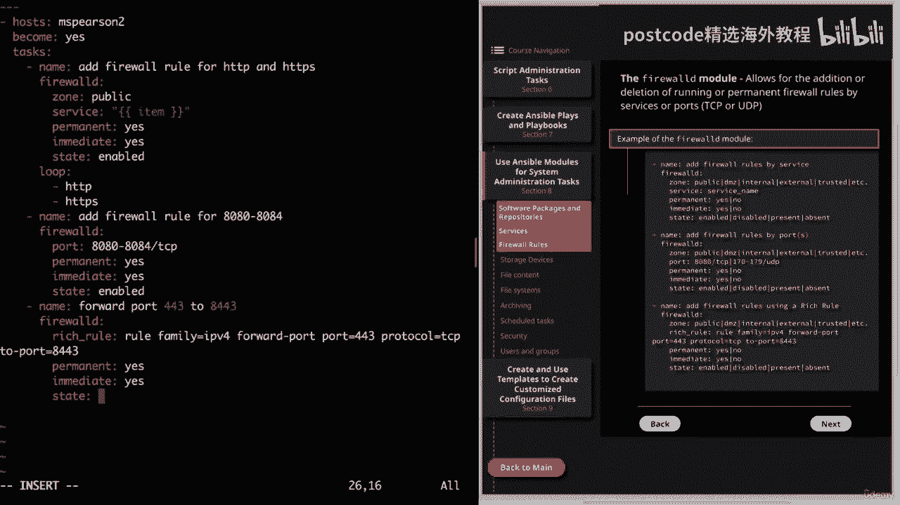
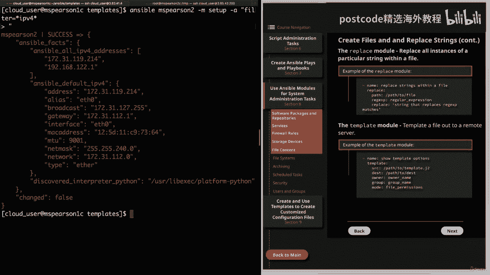
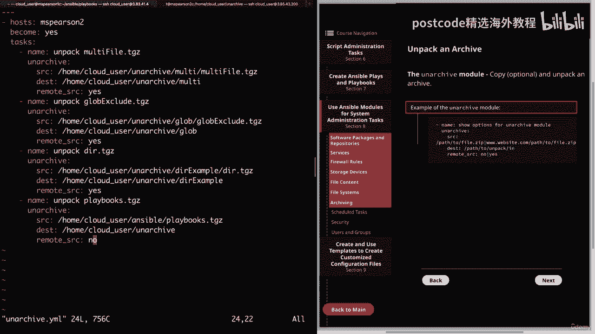
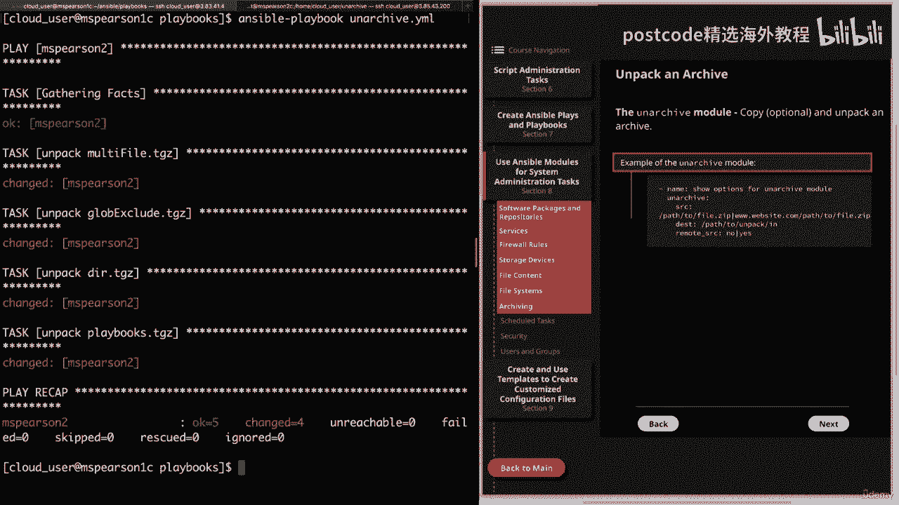
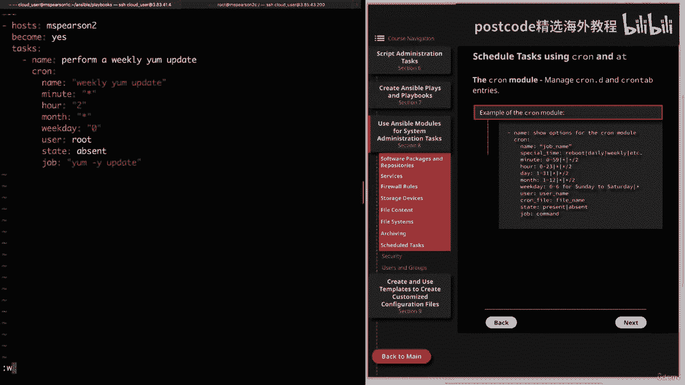

# 红帽企业Linux RHEL 9精通课程 — RHCSA与RHCE 2023认证全指南 - P19：03-03-006 Ansible modules - System administration tasks - 精选海外教程postcode - BV1j64y1j7Zg

第八部分开始，该部分将涵盖用于系统管理的 Ansible 模块，任务。第一个是软件包和存储库。因此，让我们继续单击第八节，这将把我们带到第一小节。

因此该模块使用 Yum 包管理器来安装、升级、降级、删除和列出包，在团队中。在图中，我提供了一些使用该模块的几种不同方式的示例。当然，首先，您可以指定模块尝试执行的操作，然后是实际名称，该模块。

即 Yum！这个特定的例子只是安装一个包。所以我们要给出包的名称。然后对于状态，我们会说最新。如果你愿意的话，你也可以在这里使用礼物。现在和最新之间的主要区别是，如果他们都安装该软件包，没有看到它。

但使用最新不仅会检查包，而且还会确保它已被，更新到最新版本。因此，如果您使用present，它只会注意到该软件包已安装，然后继续。在下一个示例中，我们将展示如何安装软件包列表。因此。

您需要做的就是在名称下方进行操作。用破折号放置软件包列表。现在，如果您愿意，您可以在此处使用循环，但根据文档，它更有效，如果您只是将它们列在名称下方而不是进行循环。但我确实想提一下，这是可用的。接下来。

我们有一个从远程存储库安装 RPM 的示例，您需要做的就是指定，该 RPM 的 URL。您还可以从本地文件安装 RPM。在这种情况下，您所要做的就是提供该 RPM 文件的路径。最后，您还可以删除包。

为此，您只需提供包名称，然后为您想要使用的状态提供缺席。好的。现在让我们转到命令行，我们将创建一个简单的剧本来安装，给我们一些包裹。因此，让我们继续创建一个新的剧本。我们将其称为 yummy HTML。

再次，我们将从破折号开始，然后主持人指定 MBS Pearson 为我们的几内亚，猪宿主。然后变得平等？是的，因为它需要升级的权限。然后是塔斯社。给出我们的描述。它将安装http。我们将指定模块。

我们的模块的名称是http dd。在该状态将是最新的。好的。那么让我们继续运行它。我们看到我们的 playbook 成功运行，并且我们能够将该单个包安装到 MHS 上。皮尔逊至。

让我们继续并再次打开它。这次我们再添加一些软件包，以便我们可以演示安装多个软件包。所以在我们的名下。我只想说安装包。然后是名下。我们要解决这个问题。我们要到下面去。我将继续保留 HTTP。

然后我要添加更多内容。让我们继续通过 PD 安装。这是非常安全的 FTP。然后我也可以安装它们，这又得到了改进。他们最后要安装的是防火墙 RD。我之所以要继续安装它，是因为我们将在后面的视频中需要它。

我们将讨论防火墙模块。

现在我们已经有了清单，让我们继续保存它。

清空屏幕，我们可以继续运行我们的剧本。它将是剧本，然后是 yum dot html。好的。这样也运行成功了。

所以我们假设所有的软件包都已正确安装。但您也可以使用带有安装值的列表参数。这将为您提供计算机上安装的所有软件包的列表。因此，在我们继续本课的下一个主题之前，我确实想提一下，该模块将。

还允许您像使用 Yum 或 DAFF 一样安装软件包组。为此，您需要做的就是包名称、指定组名称和引号，并确保在前面添加添加符号。另外，请记住，即使您使用的是 Yum 4 rel 8。

它实际上也是使用 DAFF 背面，结尾。但还有一个 DAFF 模块，它确实提供了一些 Yum 模块没有的功能。但对于软件包的基本安装，Yum 模块就可以了。现在我们可以进入下一页。

这将是我们的最后一个主题，即 Yum 存储库模块。正如您可能已经猜到的那样，这将允许您添加或删除 Yum 存储库。好的。因此，我还为此模块提供了一些示例。正如您所看到的，我们将在名称下给出描述。

这是为了添加存储库。我们将指定模块为 Yum underscore 存储库，然后就可以使用 name 参数，为了指定存储库名称，您还可以提供描述。然后始终重要的是基本 URL。

它允许您提供存储库的 URL 并，然后它还会添加GPG检查参数。这主要是为了让您知道它是可用的。接下来，我们有一个从存储库文件中删除存储库的示例。再次，我们将指定我们的模块，然后是我们的存储库的名称。

然后是该存储库存在的文件，并确保在没有 repo 扩展的情况下执行此操作，然后状态将不存在。因此，让我们转到命令行，我将向您展示如何执行此操作的示例。让我们继续创建一个剧本。

我们将把这个存储库称为 HTML。在我们的哈希值中。然后主持人再次指定MBS Pearson。即将成为。是的。然后我们就可以指定我们的任务。所以我们这里的描述将是添加苹果仓库。

然后 yum 下划线存储库。现在我们可以指定我们的参数。因此，我们将给出存储库的名称。我们要添加的存储库是 repo。然后为了描述，我们就说苹果。嗯。回购。然后我们需要提供基本 URL。

我将转到此处的剪贴板，以便复制粘贴此内容。这就是我们需要做的。所以让我们继续保存它。然后我们就可以开始我们的剧本了。

我们看到该剧本已添加到皮尔森身上。

让我们继续快速运行一个小 ansible。多发性硬化症。皮尔森至。然后破折号 a，我将快速列出我们的 Yum 转发目录。所以埃西。百胜点转发路。

我们在顶部看到我们的 Apple 存储库，然后让我们继续在上面运行一只猫，文件只是为了让我们可以看到模块如何为我们添加内容。猫。然后我们需要。苹果回购。

我们看到它应用了存储库的名称，即 Apple，然后是我们的基本 URL，然后也是，我们的描述，这是Apple repo。

好的。现在我们已经添加了存储库，让我们继续看看是否可以删除它。所以我们将再次修改我们的剧本。让我们继续清除描述和基本 URL。并不总是需要指定文件名，但您将需要这样做，尤其是。

当您在同一文件中定义了多个存储库时。默认情况下，文件值将默认为名称参数中提供的值。因此，这实际上取决于您的存储库的设置方式。因此，由于我们的存储库是该文件中唯一的存储库，因此我们不必指定它。

但无论如何我都会继续这样做，这样你就可以看到它。因此，我们将输入不带点带扩展名的文件名。然后我们需要指定一个状态，它将不存在。让我们继续保存它。然后我们就可以运行我们的剧本了。

并成功运行。让我们继续检查一下，并使用几个临时命令进行确认。首先我们将列出我们的清单。我们看到 Apple repo 文件不再存在。这样我们的存储库就被成功删除了。在结束之前我想提最后一件事。

那就是确保你把，每当您运行存储库模块时，您的描述和基本 URL 都用单引号引起来，ansible 临时命令。那只是因为如果命令的参数部分中有空格或奇怪的字符，它经常会引起问题。好的。这就是最后的智慧。

因此，让我们继续将此视频标记为完成，然后我们可以继续下一部分。

我们要讨论的主题是使用 Ansible 控制服务。

因此，让我们继续单击“第八部分”，然后单击“服务”。本课将重点关注两个模块：服务模块和系统 DX 模块。首先，我们来谈谈服务模块。这控制远程主机上的服务。

支持的 init 系统是 bsd init open rc sis v Solaris，SMF 系统、DX 和新贵。在图中，我提供了服务模块的示例。这里有我们的描述，其目的只是显示服务模块的选项。

然后我们要指定模块名称，即service，然后是我们要的服务的名称，想要与之交互的后面是一个状态。状态可以包括已启动、已停止、已重新启动和已重新加载。然后我们启用了，这将允许我们确定是否需要服务。

通过重新启动继续存在。然后我们有了允许在命令行上提供其他参数的参数。说到命令行，让我们去那里演示一下服务，模块。所以首先我们需要创建我们的剧本。我将在我们的剧本目录中执行此操作。

我们将将此服务称为“点 HTML”。因此，我们将从三个破折号开始，然后对于东道主，我们将回到 MZ Pearson 两个破折号。这确实需要升级的权限。所以我们会说“成为”是肯定的。

然后我们可以指定我们的任务。在本剧本中，我们将启动并启用我们安装在，上一个视频。让我们继续添加第一个。这将被启动并启用。HTTP 服务。然后是我们的服务模块。我们需要指定名称 http de 吗？

然后状态才刚刚开始。然后启用等于。是的。好的。我们的下一个任务将是启动和启用。防火墙 DX 服务。指定服务模块。该名称已受防火墙保护。状态。即将开始。并启用。是。是的。

现在我知道我们已经在整个课程中看到了服务模块的几个示例，但对于第八部分，我试图对该模块进行真正有针对性的演示，以向您展示如何，它们与您可以在命令行中执行的操作来管理系统相关。正如您在这里所看到的。

我们将首先启用 HTTP dx 和防火墙 dx。这是您参加红帽考试时始终需要牢记的事情，那就是您的，配置需要在重新启动后保留。因此，与执行系统 ​​CTL 启动然后启用系统 CTL 的方式相同。

您可以使用，您的剧本中的服务模块。因此，让我们继续保存并退出。

然后我们将运行 Ansible Playbook。然后是服务。为什么是米尔？

我们的剧本成功执行了。这只是向您展示了如何使用服务模块的基本示例。下一个模块我们要讨论的是系统模块。这是专门为控制远程主机上的系统 D 服务而设计的。这个模块是在2。2版本中引入的，正如我刚才所说。

它是专门为系统量身定制的，DX，服务模块，提供控制多种不同类型的服务的能力，初始化系统。当然，与系统 DX 相比，系统 D 作为一个模块更像是一个整体，模块，仅适用于由 System D 管理的系统。

并且正如 Ansible 开发的那样，它们，创建了越来越多针对特定系统和特定任务的模块。系统 D 模块还添加了一些系统 DX 特定选项，例如守护进程下划线重新加载，这，您将在图中的示例中看到。

这将确保 System DX 在执行任何其他操作之前已读取任何更改。它还允许使用强制参数来覆盖现有的 SYM 链接。然后你的范围默认使用系统范围，但也可以用于用户范围，这是用户或所有用户的范围。

这是全局的。当决定使用系统DX模块还是服务模块时，这实际上取决于，关于你用它做什么。但如果您需要利用其中一些额外参数，那么我建议使用 system，DX。但如果您只需要停止、启动和启用服务的基本功能。

请随意使用，服务模块，因为它长期以来一直是事实上的标准。好吧，现在让我们继续尝试我们的剧本中的系统 DX 模块。

因此，让我们弄清楚这一点，然后我们可以再次打开她的剧本。然后我们就可以继续更新我们的任务。因此，我们可以使用系统DX模块，而不是使用服务模块。因此，除了状态之外，其他一切都将保持不变。

我们可以将其更改为重新启动，它。所以我们将其更新为 System D。然后这将重新开始。再说一遍，systemd。然后重新启动它。这是该系统的另一个优点。该模块与服务模块的区别在于。

您使用的主要参数都是相同的。然后，如果您需要利用附加参数，您始终可以这样做。所以让我们继续保存它。然后我们可以再次开始我们的剧本。Ansible 手册。然后是服务。为什么是毫升？

正如预期的那样，我们的剧本成功执行了。这实际上是关于服务的视频的总结。因此，让我们继续并将其标记为完成，然后我们可以继续下一课。

下一个主题是一个非常重要的主题，那就是防火​​墙规则。

因此，让我们继续单击第八部分，然后单击防火墙规则。

在我们开始之前，我确实想提一下，与 Firewall DH 的交互主要是完成的，通过防火墙cmd命令行实用程序或图形界面中的防火墙配置实用程序。了解这些实用程序中提供的选项非常重要。

我们已经讨论过这些选项，本课程早些时候简要介绍了托管安全的第一部分。好吧，除了这些实用程序之外，Ansible 还提供了一个模块供我们交互和配置，防火墙 DX，恰当地称为防火墙 DX 模块。因此。

这将允许服务添加或删除正在运行或永久的防火墙规则，或端口，其中包括 TCP 或 UDP。在图中，我提供了一些如何使用防火墙 DX 模块的示例。首先，我们有通过服务添加规则的示例，然后它有一些主要参数。

你将要使用的。因此，我们有区域，允许您指定您正在工作的区域。默认设置为公共，然后是服务，这将是您要添加规则的服务，以及您是否希望它是永久的，这意味着它将在重新启动后持续存在，或立即。

这意味着它将在您当前所在的会话中持续存在。最后，您可以提供状态，无论您想要启用还是禁用该状态。然后我们还存在或不存在下一步，我们通过端口添加防火墙规则。您可以看到我们有端口参数，该参数允许您指定端口。

这里我们有 80、80，它使用 TCP，这里我们有一个端口列表，173 179 使用 UDP。最后，我提供了一个使用丰富规则的示例，这是使用丰富的下划线指定的，规则参数。然后你可以提供你丰富的规则。

如果您想查看此模块的其余选项，请随时查看该模块，索引和 Ansible 文档。但我提供的这些示例将构成您所选择的大部分选项，通常会使用。因此，让我们转到命令行。

我们实际上可以尝试一下并记住我们确实安装了，在之前的视频中，我们的主机上安装了 Firewall DX 软件包，然后也启动并启用了该软件包。这将是使用防火墙 DX 模块的要求。因此。

如果您要使用的主机上没有安装防火墙 DX，请继续，并立即暂停并安装。否则，我们将前往命令行并尝试一下。让我们继续专门为此创建一个剧本。我们将其称为防火墙。那封电子邮件。在本手册中。

我们将继续执行所有三种不同类型的防火墙规则。我们将展示如何按服务和端口添加规则，然后还使用丰富的规则。因此，继续从我们的破折号开始，然后我们可以添加我们的主机。MHS Pearson 不会再次出现。

这确实需要道歉。所以我们要说成为是。然后我们可以指定我们的任务。好的。因此，我们的第一个任务是为 HTTP 和 https 添加防火墙规则。我们将指定防火墙、模块。现在我们可以指定我们的参数。

我将继续添加区域参数并记住默认情况下这将是，使用公共区域。但为了让您能够看到它，我将先将其放入区域，然后再公开。然后是服务。而对于服务参数，我们一次只能输入一项服务。因此。

我要做的就是再次使用我们的循环来解决这个问题。我们将继续添加我们的 item 变量。然后我们将使用永久。这将是。是的。然后立即也是肯定的。再次强调，这将使其持续重新启动并为我们当前的会话激活。

然后状态将被启用。现在我们需要添加循环。接下来是我们的物品清单。它将是 HTTP 和 https。好吧，现在让我们添加另一个任务。这次我们要添加防火墙规则。适用于 80、80 至 80、84。

所以指定我们的模块。这次我不打算添加区域参数，我只是将其留空。但请记住，它将默认为公共，然后我们需要指定端口参数。我们将给它 80、80 到 80、84。这就是 TCP。我希望这是永久的。哎呀。

快点解决这个问题。我们也希望这也是立即的。并且该状态将被启用。好的。现在我们的最后一个任务是添加仪式。我们将转发端口 44328443。我们正在使用防火墙、模块，然后我们可以列出我们的参数。

所以我们要说丰富的下划线规则，然后我们可以添加我们的仪式。这将成为规则。家庭将采用 IPV 4。然后转发端口。我们将指定端口，即四、四、三。协议将是 TCP，然后我们将转发它。支持。八四，四三。再次。

我们需要添加永久元素。是的，立即。亦等于。是的。然后状态为启用。

好的。让我们继续保存并退出。在运行我们的剧本之前，让我们先列出 MSS Pearson 的所有防火墙规则，也是如此，然后我们可以在我们的剧本运行后再次检查。所以我们将使用 Ansible，女士。皮尔逊。

至。Ashby，然后破折号 a，我们将使用防火墙 cmd。我们要冲刺。破折号列表，破折号全部。目前我们启用的服务只有 cockpit、DHCP、V6、client 和 SH。而且我们还没有启用任何端口。

那么让我们继续运行我们的剧本。这将是 Ansible Playbook。剧本。然后是防火墙。ML。看起来我们的每条规则都成功完成。让我们继续运行临时命令来检查一下。我们看到我们的规则已被添加。因此。

在服务下，我们有 HTTP 和 https，然后在报告下，我们有 80、80 到 88 的 TCP。最后，我们的仪式在底部。好的。现在我们已经了解了如何添加防火墙规则。

接下来看看我们需要做什么来删除它们。所以我们将再次打开我们的剧本。

我们看到，目前我们的状态已设置为支持我们所有不同的任务，这是一个地方，你可能很容易感到困惑。至少我一开始是这样的。因此，在您启用或呈现的大多数模块中，然后您又缺席了，这通常是。

将是您将用来删除要置于不存在状态的内容的内容。但在防火墙中，状态的存在和不存在只能用于区域级别的操作。这意味着除了区域和状态之外没有其他参数被设置。所以当谈到删除这些规则时。

我们实际上需要使用disabled。那么让我们继续删除它们。我只是要做一个替代。所以我们要用启用来代替禁用。我们对整个文件执行此操作。

现在我们可以继续保存我们的剧本。看看它是否删除了我们的规则。

好的。看起来一切都很顺利。让我们继续清除这个，看看我们是否可以运行我们的防火墙 cmd list all。我们看到我们的服务以及我们的港口和仪式都被删除了。好吧，这将结束该视频自己的防火墙规则。

请随意查看防火墙 DX 模块的 Ansible 文档。现在，我们可以继续并将该视频标记为完成，然后我们将继续下一课。

我们的下一个主题将是存储设备。

因此，让我们转到第八部分，然后再讨论存储设备。

现在，在我们开始之前，我确实想让您知道我已向我的 MZ Pearson 添加了两台设备，查看。主持人 那么，如果您正在关注的话。现在继续并暂停视频，然后您可以前往游乐场添加设备并制作。

确保您对要使用的任何管理节点都执行此操作。您需要做的就是单击主机和游乐场，然后单击操作，按钮在左下角，然后添加 dev nvm 1 和 1，然后添加 nvm 2 和 1。好处是不需要重新启动主机。因此。

一旦完成，您就可以继续并返回并继续。但无论如何，让我们继续前进。我们要讨论的第一件事是创建分区，这将使用，分离的模块。所有这一切都是使用parted命令行工具来配置块设备分区。因此，在我们的图表中。

我提供了该模块的示例以及如何使用它。所以我们当然要报出我们的名字。在这里我只是说显示模块部分的选项，然后你将声明parted，这当然是我们接下来要使用的模块。我们拥有设备，对于我们的环境。

这将在虚拟机一和一以及开发中进行开发，NVM 二和一。但这可能会根据您工作的环境（无论是云服务器）而改变，或本地虚拟机或任何您碰巧使用的东西。接下来我们有分区号，后面是状态，这可以存在或不存在，这。

我们在这里看到了很多模块，但也允许信息以获得一些信息。接下来我们有部分下划线结尾，这是您要定义分区何时进行的地方，结束。正如您在这里看到的，我有使用 1 GB 的示例，但您也可以使用百分比，例如。

100% 甚至 75%，无论您想要实现什么目标。现在，我没有在这里放入的一件事是部分下划线开始，这就是分区的位置，将于 开始。默认情况下，该比例仅为 0%。所以它将从磁盘的开头开始。

但根据您想要执行的操作，您可以按单位指定，如 1 GB 或，15% 或 20% 之类的百分比。但在这个例子中，我们只是接受默认值。接下来，我们有标签，这将创建一个新的磁盘标签。

这里我们以MS-DOS为例，为MBR分区表或GPT四、GPT分区表。最后，我们有标志允许我们指定分区的用途，在我们的例子中，我们将使用它。LLVM 现在还有其他选项可以与 parted 模块一起使用。

但与其他模块一样，我们正在讨论和将要讨论的内容，我将向您展示一些您正在讨论的主要内容，最终会使用。但请记住，您可以访问 Ansible 文档以查看所有不同的内容，支持的参数。好的。

现在我们已经讨论了一些关于该模块的内容，让我们转到控制节点，可以创建一个剧本来测试这一点。正如您所看到的，我目前位于我的剧本目录中，因此我将创建一个新的剧本，我们将调用分区。从我们的三个破折号开始。

我们将与 MZ Pearson 合作，请输入您要合作的主机，这将需要特权升级。所以我们说成为是。然后我们可以指定我们的任务列表。因此，对于名称，我们要说创建分区。他们将在模块中指定该部分。

然后我们可以指定我们的设备，这个参数将只允许您一次输入一个设备。因此，我实际上不会将其列出两次，而是会循环一次。所以我们将打开我们的报价。我们将添加 item 变量。对于数字，我们将选择一个。

国家将再次出现。我们将使用默认分区从零开始。所以我只是要指定部分结束，然后我们就做一个。吉布。因此，每个分区只有 1 GB。然后贴上标签。我们将指定 MS-DOS。最后是旗帜。

我们将在括号内指定 LLVM。原因是该视频的下一个主题将是创建逻辑卷。因此，我们将首先创建基本分区，现在我们需要到这里来，创建我们的循环。请记住，这将是虚拟机中的一对一开发。然后就是 dev nvm。

二加一。好的。因此，让我们继续保存我们的剧本。现在我们可以使用 Ansible playbook 启动它，然后指定分区 HTML。顺便说一句，您会注意到我不在 Ansible 工作目录中，这是我的位置。

一直在做我的大部分工作。实际上，我使用 dot ansible cfg 将 Ansible CFG 添加到我的主目录中。这样我就可以直接从 playbooks 目录运行这些 playbook。因此。

如果您还没有这样做，您可以立即继续执行该操作，或者只是从同一位置运行命令，目录作为你的 ansible cfg。但无论如何，让我们开始吧。这可能需要几秒钟，所以我可以继续为您加快速度。

好吧，看起来我们的剧本进展顺利。

让我们继续前往 Pearson，我在终端中打开了另一个选项卡，并且我已登录，以 root 用户身份登录。让我们继续运行磁盘。Dash l 在 dove nvm one 上。在其中之一。正如你所看到的。

我们有 DOS 光盘标签，我们还创建了一个分区，这是 Nvme 分区，和 1p1，并且 id 是 8 e（对于 Linux LLVM 分区）。

让我们继续快速运行。只是为了两个和一个，只是为了确定一下。

我们看到那是一样的。好的。现在让我们回到控制节点。

现在我们已经创建了分区，让我们转到图表中的下一页，我们。

可以谈谈创建逻辑卷。所以我们要讨论的第一个模块是 LVP 模块，这允许我们创建，删除卷组并调整其大小。在提供的几个参数的示例中，首先，我们有力量。如果您在此处使用 yes 选项且缺席状态。

则会将卷组删除为，以及逻辑卷。接下来，我们有 PPI 大小，这是物理范围的大小。然后我们有 PVS，这只是您要使用的物理设备的逗号分隔列表，用于您的卷组。另一个很酷的事情是，如果物理卷不存在。

该模块将为您创建物理卷。已经创建了。因此，目前我们尚未使用新分区创建任何物理卷。所以我们所要做的就是在这里指定它们，LVP 模块将与我们的一起创建它们，卷组。接下来我们有 VG，这只是卷组的名称。

然后状态将出现，或缺席。好的。因此，在尝试 LVP 模块之前，我们先来谈谈 L Vol 模块，它与，联赛模块。这将允许我们创建、删除和调整逻辑卷的大小。因此，我再次提供了该模块的示例以及一些参数。

第一个是 VG，它又是卷组名称，然后是 LVT，逻辑卷的名称和大小。您将指定一个单位，如我们在此处看到的，512 MB 或 1 GB。但您也可以使用百分比，例如 100% 免费。

这只会使用 100% 的可用资源。然后我们有状态参数，它让我们指定存在或不存在，然后我们有，收缩，可以是或否。它的工作原理是，如果当前大小高于大小，它就会缩小，你要求的。

然后resize FS将使用逻辑卷来调整底层文件系统的大小，然后，力参数将与此密切相关，因为如果您正在收缩，则需要它，卷，如果您要删除卷，这只是为了确保文件系统永远不会，被错误地损坏或删除。

那里有一些额外的安全措施。然后我们有 ops 参数，它允许我们添加任何超过 LVT 的自由格式选项，创建，命令。好的。现在让我们回到命令行，我们可以在剧本中尝试一下。

所以我将创建一个名为 LLVM HTML 的文件。东道主再次将亲自前往。这是 MSP 罗恩·皮尔森 (Ron Pearson) 说的。然后我们要说成为是。然后我们可以指定我们的任务。因此。

我们需要做的第一件事是创建卷组。我们只会说创建卷组。我们将使用 LVP 模块。首先，我们将指定物理卷。对于我们来说，这将是 Dev 和 vme one 和 1p1，然后我们会做一个逗号，它将。

是 dev 和 vm 两个和 1p1。然后我们需要指定卷组的名称，我只想说 VG 下划线 Ansible。当然，你可以随心所欲地制作它。然后状态就会出现。这就是创建卷组所需要做的全部工作。现在。

让我们在这里创建逻辑卷。因此创建逻辑卷。我们可以指定我们的卷组名称，即 VG 下划线 Ansible，这将是任何内容，你把它设置为。然后是逻辑卷名称，我将其称为 LVT，下划线 Ansible。

对于大小，我们只需将 512 MB 指定为 512 MB，并且状态已存在。好的。让我们继续保存并退出。在你开始之前，我要去 MZ Pearson 看看，这样我们就可以做一个快速的 LVS 展示。

当前没有逻辑卷。没有卷组，也没有物理卷。好的。那么让我们开始吧。LLVM 会是什么？ML。看来我们有语法错误。

那么让我们快速检查一下。这实际上相当明显，因为我忘记添加我的模块。让我们继续在这里添加 El Valle。然后我们可以尝试再试一次。

好的。嗯，这次成功了。那么让我们回到 MZ Pearson 吧。我们将运行我们的 LVS。我们看到我们有一个名为LVT的逻辑卷，在VG中下划线Ansible，下划线Ansible。

卷组大小为 512 MB。如果我们愿意，我们可以运行我们的 vgs，查看我们的卷组，然后运行我们的 PVS，查看我们的物理，卷。但无论哪种方式，我们都看到这是成功的，并且创建分区和逻辑是多么容易。

仅使用 Ansible 模块的卷。

现在，在结束之前我想提的最后一件事是，我们将回到控制节点。

我只想打开我们的 LLVM 剧本，实际上我要保留这个逻辑卷，因为，我们将在文件系统课程中使用它，因为我们将在，那个逻辑卷。但如果我们想删除这些逻辑卷，我们需要做的就是用，缺席的。这将删除我们的逻辑卷。

但我们也可以在这里删除此任务。然后在 LVT 模块下我们可以说状态不存在，然后还指定力参数和，将其设置为是。这将删除我们的逻辑卷以及卷组。好的。好了，本节关于存储设备的课程就到此结束了。因此。

让我们继续将视频标记为完成，然后我们可以继续下一课。

我们只需点击文件内容即可。

我们要讨论的第一个模块是文件模块，这将允许，我们来管理文件和文件属性。对于此视频，我们仅使用文件模块来创建文件。因此，在我提供的示例中，我们将指定文件的路径，然后指定状态，将会是touch。

这意味着需要创建该文件。您当然可以使用文件模块修改权限并与目录交互，和一些链接。但对于这个例子，我们只是讨论创建一个空白文件。接下来，我们有复制模块，它将文件复制到我们的远程位置。

并且不仅可以从本地控制节点复制，还可以从远程主机复制到，另一个远程主机。因此，为了从远程主机上的源进行复制，您需要使用远程下划线源，范围。否则它将在您的本地计算机上查找。现在。

我们要关注的两个参数是内容和目标参数。当使用内容参数而不是源参数时，它实际上会设置，文件的内容为 playbook 中的参数中指定的值。但这实际上应该只用于简单的值。因此，对于任何更复杂的值。

我们实际上将使用模板模块，我们将，稍后再说。因此，在我们的示例中，我们将指定内容参数，然后提供，一个值。然后还有目的地，这是我们要创建并添加的文件的路径，值到。接下来，我们有行和文件模块。

它用于管理行和文本文件。所以line and file模块默认是查找正则表达式指定的字符串，这就是正则表达式参数。然后将其替换为 line 参数中指定的行。如果未找到该行，则该行将添加到文件末尾。

但您也可以指定 insert before 或 insert after 以及正则表达式，以便，在该正则表达式指定的行之前或之后添加您的行。当然，还有其他几个选项可以设置，例如用户和组所有权文件，权限。

也可以使用 create 参数来创建文件，然后添加，该行（如果不存在）。这与使用带有内容参数的复制非常相似。好的。现在我们已经讨论了其中一些模块，让我们转到命令行并尝试，将它们写在剧本中。

实际上我已经为此示例创建了剧本，即创建 HTML，让我们，一起经历这个过程。好的。因此，在本剧本中，我们与 MZ Pearson 2 进行交互，并指定了任务列表。由于我们只是在临时目录中创建一些文件。

因此我们不需要成为 root 用户。所以在这里我们有第一个任务，就是触摸一个新文件。我们将使用文件模块。该文件的路径将是临时测试文件一。并且状态将会被触摸。接下来。

我们将创建一个文件并使用复制模块添加一行。所以我们要指定我们的内容。我们只想说通过复制模块添加它，然后目的地将是临时测试文件，二。最后，我们将添加一行并使用 line 和 file 模块创建一个文件。

为此，我们将指定路径，然后指定要添加的行。然后我们将指定创建参数，让行和文件模块知道如果，该文件不存在，则需要创建它。那么，让我们继续讨论这个问题，我将前往 MZ Pearson。

我们可以将 CD 转换为 Temp，我只是要做一个快速列表，以便您可以看到这些文件当前不存在。现在我们可以回去运行我们的剧本了。所以这将是 Ansible 剧本。然后创建 HTML。

好吧，我们的三个任务都成功运行了。现在让我们回到 MZ Pearson 进行另一个列表。我们看到我们有三个文件。我们有测试文件一、测试文件二和测试文件三。测试文件一是由文件模块创建的。

所以它应该只是一个空白文件。所以我们会得到的。由于空白，我们没有得到任何输出。那么让我们继续测试文件二。即使它在我的提示之前显示，您也会看到复制模块添加的内容。

所以看到该文件在我们的第二个任务中已成功创建。然后我们可以找出测试文件三。我们通过行和文件模块添加行。我没有正确拼写文件模块中的行，但好处是当我们调用时我们做到了，它在我们的剧本中。好的。

让我们继续清除这个，然后我们就可以回到我们的控制节点。把它也清除掉。然后我们可以进入下一页。

我们将讨论替换模块和模板模块。因此，替换模块将替换文件中特定字符串的所有实例。因此，就像行和文件模块一样，替换模块也将允许您进行更改，所有者、组以及文件权限。但与行和文件模块不同，它不会停止。

一旦它替换了一行，它将遍历并找到匹配并替换的每一行，它与给定的字符串。可以使用替换参数指定该字符串。该模块还提供了之前和之后的参数，这些可以用来确定在哪里，正好在您要替换字符串的文件中。因此。

通过使用 before 可以指定一行，一旦找到该行，该文件之前的所有内容，将被替换到文件的开头，然后 after 将允许您找到该字符串，然后之后的任何内容都将替换到文件的末尾。对于我们的示例。

我们只需指定路径，即我要访问的文件的路径，与之互动。然后RegExp，就是正则表达式，匹配然后替换就是字符串，替换正则表达式匹配。因此，在行和文件模块中，您将使用行参数，指定字符串，然后，在替换模块中。

您将使用替换参数。好的。那么让我们回到命令行。我们将打开另一本剧本。这就是所谓的替换 YAML。同样，我们也将与 MZ Pearson 进行互动。这次我们将使用行、文件和替换模块。因此。

对于我们的第一个任务，我们将替换测试文件二中的一行。所以我们将指定文件的路径。然后我们的正则表达式将匹配以add开头的行，然后抓取所有内容，在该行中，我们将用行替换它，用行和文件模块替换。嘿。

这次我把 line 和 file 拼写正确了。那挺好的。然后我们的下一个任务是替换测试文件三中的行。只需构建一个 Rust 文件三即可。无法赢得所有人。所以我们要指定文件的路径。

这次我们的正则表达式将匹配任何以 module 结尾的行并抓取所有内容，那是在它之前的。然后我们将用行替换它，用替换模块替​​换。

因此，让我们继续保存并退出。我们要运行它。

那件事很快就完成了，看起来很成功。那么让我们回到 MZ Pearson 吧。

我们将把测试文件限制为。我们看到该行已使用行和文件模块替换。那么让我们继续测试文件三。我们看到该行已使用替换模块成功替换。好的。我们已经了解了如何创建文件并向我们创建的文件添加一些简单的值以及如何。

来替换这些值。现在我们来到模板模块，这实际上是处理复杂内容的最佳方式，一份文件。因此，模板模块要做的就是将文件模板化到远程服务器。在我们的示例中，我提供了一些参数。首先，我们有源代码，它只是模板的路径。

并且以，点到扩展名。然后我们有目的地，这是我们要放置模板文件的地方。然后像我们的许多其他模块一样，我们能够指定所有者或组，文件以及文件权限使用模式。

所以让我们继续解决这个问题。

我们将回到我们的控制节点。出于本视频的目的，我继续在模板目录中创建了一个模板。所以我们将转到模板。

我将此模板称为信息 J 二。这个模板的目的只是收集我们正在使用的远程主机的一些信息，将文件推出到。所以你可以在这里看到我有主机名 equals 和 ansible 主机名。正如你所看到的。

我使用了很多 ansible 变量，并且我使用的所有变量实际上都是，由可感知的事实收集。只要您启用了事实收集，这些变量就可供您使用，您可能会这样做，因为这是默认行为。因此。

在这里我将获取主机名并使用 Ansible 主机名变量。然后我想了解操作系统。因此，我将获取 Ansible 发行版以及发行版，然后我将，获取默认 IPV 4 地址以及默认 IPV 6 地址。最后。

我将获取接口和块设备。正如您所看到的，我在此处添加了一个管道，然后指定了 join，这是一个 Jinja 两个过滤器，可以与模板一起使用的东西。

稍后我们将在有关 ANSIBLE 模板的视频中详细讨论这一点。但基本上我是说让我们获得所有接口，然后我将它们连接在一起，我，通过添加逗号和空格来分隔它们。

我正在对块设备和您在此处看到的所有变量执行相同的操作。您还可以使用 Ansible ad hoc 命令和 setup 模块来搜索它们。因此，您将指定设置模块，然后在参数中指定过滤器等于。

您可以搜索 IPV 4 或分配。老实说，无论你在寻找什么。

让我快速地向您展示一下，以便您能够明白我在说什么。所以我们会说 Ansible。这就是 Ansible，即席命令。然后设置并破折号我们有过滤器。它将相等，我将抓住与 IPV 四便便有关的所有内容。

我需要在这里把外套合上。

你知道，正如你所看到的，它将吸收 Ansible 收集的所有有关的事实，IPv4。所以这里我们有 Ansible 默认 IPv4，然后我要求提供该地址下面的地址，其值为 17231119 214。

让我们再次回到我的模板。就像我说的，我们会更多地讨论这个问题，但我只是想在我们讨论的时候提一下它，这里。我使用点符号来指定 Ansible 默认 IPv4 地址，在该地址下我想要，来获取地址的值。

这也可以使用块表示法来完成，但稍后我们将更深入地讨论这一点。

在。所以让我们继续前进并退出这个话题。

那我就来澄清一下。所以现在我需要创建一个剧本来推出我们的模板。那么让我们回到我们的剧本目录。我将把这个模板称为 HTML。我们将从三个破折号开始。我也将把这个推给 MBS Pearson。

然后我们可以指定我们的任务。为名。我只想说推出信息模板。然后我们将指定我们的模块。始终非常重要。然后我们需要指定我们的源，这是我们的控制节点上的模板的路径，并且，这将是家庭云用户。

Ansible 然后是模板。它被称为信息 j 二，然后是我们的目的地。这是远程节点上的目的地，我们只需将其放入临时变量中即可，称之为信息、文本。这就是我们需要为此剧本做的全部事情。因此。

让我们继续保存并退出。现在我们可以运行我们的剧本了。这是 Ansible 剧本，然后是模板点 yaml。

好的。看来我们推送信息模板的任务已经成功完成了。

但我们也来看看 MZ Pearson。我们已经位于顶部的临时目录中。我们有我们的信息txt。让我们继续把它赶出去。然后我们的模板就成功推出了。我们在模板中引用的所有变量的值均由 Ansible 提供。

事实。我们看到我们的主机名是 RMS Pearson。看到操作系统是Red Hat版本八零。我们有 IPV 4 和 IPV 6 地址以及接口和块设备，包括，我们添加了两个。

即 nvme 一加一和 Nvme 二加一。好了，关于文件内容的视频就到此结束了。因此，让我们继续将视频标记为完成，然后我们可以继续下一部分。让我们回到第八部分。

然后我们可以单击文件系统，我们将首先讨论文件系统模块。所以文件系统模块只允许你创建一个文件系统。在图中，我提供了可以传递给文件系统模块的选项列表。第一个是 FS 类型，这是您要创建的文件系统类型。因此。

这可以是 4 到 6 个 FS 或更好的 FS 以及许多其他受支持的 FS。接下来是您要在其上创建文件系统的设备或图像文件的路径。然后我们有力量允许您在已有的设备上创建新的文件系统，现有的文件系统。

接下来，您可以指定是否要使用 resize FS 调整文件系统的大小，这是，只需调整文件系统的大小以匹配设备，以防它们不同。最后，ops 参数允许您提供要传递给 FS 命令的选项列表。

现在让我们转到命令行，我们可以实际检查一下。所以我目前位于我的 playbooks 目录中，我们需要为我们的文件系统创建一个新的 playbook，我们将这个文件系统称为“点 HTML”。

我们将从破折号开始，我们也将与 Pearson 互动，这一过程仍在继续，成为我们的小白鼠。指定成为。是的。然后是我们的任务。对此的描述即将被创建。文件系统 OECD。所有逻辑卷。我们将使用文件系统模块。

而要创建这个文件系统，我们只需要两个参数。首先是FS型。我们将指定 XD。然后是dove，这是设备的路径。我们将指定我们在上一个视频中创建的逻辑卷。它将位于开发映射器中。

VG Underscore Ansible，破折号 LVT Underscore Ansible。这就是我们创建这个所需要做的一切。让我们继续保存。然后我们就可以退出，然后我们就可以开始我们的剧本了。

该剧本成功执行。现在让我们转到 MZ Pearson，我已经以 root 用户身份登录。

我跑过去屏蔽了ID。

如果你会注意到，在中间我们有 dev 映射器、VG 下划线 ansible、LVT、Ansible。

它将向我们提供 UID，并显示我们有一个用于文件系统的 SD。好的。现在我们已经在逻辑卷上创建了文件系统，现在我们需要挂载该文​​件系统。但在此之前，我们先来谈谈 Mount 模块，它用于控制和。

配置挂载点。因此，在我们图表的本页底部，我提供了 Mount 模块的示例和一些，您可以传递的参数。我们需要指定的第一个参数是挂载点的路径。如果挂载点不存在，则每当指定mounted时都会自动创建挂载点。

在状态选项中。然后我们需要要安装在安装点上的设备的路径，这是使用以下命令指定的，source 和 FS type 将用于指定设备上的文件系统类型，并且是，每当状态设置为安装或存在时都需要。

然后状态将为您提供我们已安装、不存在、存在或已安装的四个选项，并安装。它会导致设备被主动安装，我们还将在 RFS 选项卡中配置一个条目。正如我们已经说过的，我们将创建安装点。如果 Mount 上不存在。

则会挂载该设备，但不会更改 RFS，选项卡条目然后出现只会为设备配置 RFS 选项卡条目，但设备，本身不会被安装。

最后，我们缺席了，此选项将从 RFS 选项卡中删除该条目。它还将安装设备，然后最终删除安装点。

接下来我们有操作，这允许指定其他安装选项。最后可以指定备份来创建 RFS 选项卡的备份，以防万一您搞砸了，原始配置与您的配置。好的。现在让我们继续添加另一个任务或一个剧本来挂载我们的文件系统。

但在此之前，我们先确保该设备当前尚未安装，并且，我们在 RFS 选项卡中没有相应的条目来清除此问题。

因此，让我们快速运行 DF dash h，我们会看到我们的逻辑卷当前没有安装在任何地方。

然后我们可以在 RFS 选项卡上执行这些操作。

目前我们只有根设备和交换的条目。让我们继续前进并退出，然后我们可以前往 MSC Pearson one，我们的控制节点。让我们再次打开文件系统，然后添加一个附加任务来挂载我们的文件系统。对于描述。

我们只想说文件系统的数量。我们将使用 amount 模块。路径将被挂载，然后我们将调用此测试下划线挂载。来源将是开发映射器。然后 VG 在 Ansible 下划线。

Dash LV 下划线 ansible。FS类型将是关键。对于状态，我们要选择已安装。让我们继续进行备份。我们对此表示同意。现在我们可以继续保存并退出，然后我们可以重新运行我们的剧本。

我们看到我们的第一个任务在我们的逻辑卷上为文件系统创建 ESD 就说好的，所以。

它不必在那里做出改变。

然后我们的挂载文件系统任务，我们确实有一个改变。那么让我们回到 MZ 第二个人，看看我们的文件系统是否已安装。

好的。我们将继续运行我们的 def，我们会看到开发映射器 VG Ansible 已上线。

Ansible 已挂载到 Mount 上。测试安装。然后我们可以继续打开 ZFS 选项卡。

我们在底部看到一个新条目。

这包括我们的设备和安装点。摆脱这个。

我们还要检查一下 RFS 选项卡是否确实已备份。正如您所看到的，我们有新的 RFS 选项卡以及备份。因此，如果我们愿意，我们可以继续对此进行比较。这是 FS 选项卡，然后是 ETSI FS 选项卡。

现在我们看到唯一的区别是我们的新条目。好的。那么让我们回到皮尔逊一号。

我们将再次打开我们的剧本。现在让我们继续通过将状态从已安装更改为不存在来删除我们的安装。

我们可以再次开始。

而我们的挂载文件系统测试确实发生了变化。那么让我们继续看看它是否已被删除。

所以回到 RMS Pierson 去。

我们可以看到选项卡，我们看到我们的最新条目已被删除，我们将执行破折号 h。

我们看到安装文件系统只是为了更好的措施。让我们继续列出挂载目录，我们看到挂载点也被删除了。好了，关于创建文件系统和挂载文件系统的视频就到此结束了。因此，让我们继续并将其标记为完成。

然后我们可以继续下一课。让我们回到第八节。我们可以点击存档。

首先，我们将讨论创建存档，这是使用存档模块完成的。因此，这将在一个或多个文件或目录上创建一个压缩存档。我还提供了存档模块的示例，第一个选项是 PATH，它允许您。

列出要压缩或归档的文件的绝对路径 glob 或路径或 glob 列表。同样，您可以使用排除路径选项来排除文件和目录。因此，如果我们在路径下查看这里，我只提供了几个示例的列表。因此。

文件路径、文件路径、目录路径以及使用星号的滑动路径。我在排除路径下做了同样的事情。因此，我们有一个您可能想要排除的文件或要排除的目录，然后也排除文件，使用星号再次以相同的字母开头。接下来我们有格式选项。

这允许您指定您想要的压缩类型，使用。这可以是任何东西，从 G、zip 和 BS 一直到普通的普通 zip。最后，我们有目的地，您将在其中指定存档名称，以及您想要它去哪里。除了我在此处列出的选项之外。

您还可以指定存档的所有者或组，以及将设置这些文件和目录权限以及任何属性的模式，您可以使用 FF、add 或命令进行设置。然后我想提到的另一个选项是删除，这将删除文件和目录。

一旦它们被添加到存档中就会列出。好的。现在让我们进入命令行。我想打开一个我已经创建的剧本，它被称为 Archive dot HTML。

我想要多个文件。所以这里我们指定存档。然后对于我们的路径，我们只需指定测试文件二、四和六的路径。因此，我们将创建存档并使用 GSA 对其进行压缩，然后目的地将变为，在家庭云用户中，您可以使用多存档。

然后将其称为多文件 PGC，这就是。

要去 MZ Pierson 去。接下来我提供一个使用通配符进行存档的示例。同样，我们将指定我们的路径。对于这个存档，我们将调用存档 glob，排除 TD 并放入。

它在我们的 glob 目录中。最后一个任务是归档目录。为此，我刚刚指定了测试程序格式的目录路径为 GZ 和，那么名称将是脏GC 我们将把它放在我们的示例中。好的。所以在我们运行这个之前。

我确实想跳到 MZ Pearson 2 并向您展示这些文件和，目录之所以存在，是因为这一切都发生在我们的 MZ Pearson 上来管理 Node。js。让我们转到第二个选项卡。

我目前位于云用户主目录中，因此我将 CD 放入我们的存档目录中，就像您一样，可以看到，我有一个名为 Tester 的目录。所以我们将对此进行列表。然后在这个目录中我指定了十个文件，测试文件一到十。

我还添加了，另一个目录，恰当地命名为 another Dir。在该目录中仅添加了一个名为“测试文件一”的文件。好的。

那么让我们回到我们的剧本。正如您所看到的，我们所有的路径和排除路径，所有引用文件和目录，家庭云用户档案测试仪。我们将在家庭云用户档案中创建这些档案。

所以让我们继续前进并退出这个话题。然后我们就可以运行 Ansible playbook。然后存档html。

看起来我们的每个任务都成功执行了。那么让我们回到 MZ Pearson 吧。我们当前位于存档目录中，因此让我们播种到存档中。我们看到我们有亲爱的例子 glob 和 multi。

让我们看看我们的档案是否已成功复制到这里。我只会做低星号。我们看到在你的例子下我们有污垢，在 glob 下我们有 glob 排除 PGC，最后在。

multi 我们有多个文件。好的。

现在我们验证了我们的档案已成功创建。让我们转到下一页，我们可以讨论解压存档。

因此，为了解压存档，您需要使用 archive 模块。您还可以选择在解压之前复制存档。因此，在联合国档案模块的示例中，我提供了三个参数。首先，我们有源代码，这将是存档的路径。我还想向您展示。

除了远程或本地服务器上的路径之外，您还可以，还指定 URL，接下来您可以指定目的地，即您要解压的位置，存档于。最后，我们有远程源，可以设置为“否”或“是”。默认情况下它将是“否”。因此。

如果您将其设置为 yes，它将表明存档文件已经在远程上，系统并且不是 Ansible 控制器本地的。对于我们来说，这是肯定的，因为我们所有的存档文件都在 MSC Pearson 上，以便查看哪些。

是我们的托管节点之一。那么让我们回到命令行，我们可以前往 MSC Pearson One。然后我们可以使用存档模块打开我们的剧本。就称其为存档的 HTML 吧。让我们一起来看看这本剧本。因此。

我们将再次针对 RMS Pearson 2 执行，并且我们将成为根，用户，然后我们将指定四个单独的任务。首先是解压多文件 GC，因此我们将指定存档模块并提供源代码。

它位于多个存档文件中。GC 我们解包的目的地将位于多目录中，我们需要。

指定这是一个远程源，因为它位于 RMS Pierson 2 上，而不是我们的控制节点上。接下来我们将解压 glob 排除 GC。因此，我们将再次指定一个存档。

这次的源将是 glob glob except。TG 我们将再次将其解压到存档 glob 中，并指定它是远程的，然后我们，要打开 TG Z 的包装，因此我们将再次指定位置以及我们要打开包装的位置。

然后远程。是的。在最后一个示例中，我们将打开 TG Z 剧本。这个任务和之前的任务之间的唯一区别是我们实际上要拆包，这是来自控制节点的。

所以 Playbooks Z 实际上位于 MZ Pierson one 上，我们将在 RMS Pierson 上将其解压，家庭云用户和存档中有两个。我们通过指定远程源来做到这一点。不。好的。

所以让我们继续前进并退出这个话题。在我们运行剧本之前，我确实想向您展示剧本。GC 所以它在家庭云中下划线用户 Ansible，我们就在 Red Playbooks 中看到。GC。

现在让我们继续运行我们的存档剧本。看来我们的剧本运行成功了。因此，让我们也前往 EMS Pearson，我们可以验证这一点。

所以请记住，我们位于存档目录中。Home Cloud User Archive，里面有三个目录，比如glob，和 multi，并且这些目录中的每一个都有一个存档。那么让我们继续澄清这一点。首先。

让我们继续看一下我们的示例，我们看到 Test Dir 目录解压成功。因此，我们也将继续对此进行列表。我们看到它也拉入了另一个目录。好的。接下来，我们来看看 Glob。

请记住，当我们制作存档时，我们提取了以测试文件开头的所有内容，但是，我们排除了测试文件两个并测试了所有四个文件。所以我们看到一、三、五、六、七、八、九、十都被拉了进来。

但测试文件二和测试文件四被排除在外。这样该存档就已成功打包和解包。我们会继续清理。现在让我们继续在 multi 上进行列表。我们看到我们为此存档指定的所有文件，即测试文件二、四和。

六、全部成功打包和解包，这样就完成了所有远程存档。

我们有过。现在让我们列出当前所在的目录，这是一个存档，这就是，我们指定要解压剧本。来自我们控制节点的 TGS。让我们继续列出清单，我们会看到一个 playbooks 目录。

我们看到从该档案中解压的所有剧本的列表。好吧，我们将结束这个视频的存档。那么，让我们继续进行市场分析，然后我们就可以继续下一课了。这样就完成了我们拥有的所有远程档案。现在让我们列出当前所在的目录。

这是一个存档，这就是，我们指定要从控制节点解压 playbook TGS。让我们继续列出清单，我们会看到一个 playbooks 目录。

我们看到从该档案中解压的所有剧本的列表。好吧，我们将结束这个视频的存档。那么，让我们继续进行市场分析，然后我们就可以继续下一课了。因此，让我们继续单击第八部分，然后我们可以开始安排任务，然后我们就可以。

谈论使用 cron 和 app 安排任务。因此 cron 模块将允许您通过 Ansible 管理 cron 作业，而不必创建，手动进行这些更改。这为您提供了与平常相同的灵活性，但也消除了手动管理。

这不是很可扩展并且不太可靠。在图中，我为 cron 模块提供了几个不同参数的列表，但只是，请记住，还有其他一些，但我已经包括了您通常会遇到的大多数，去看看。所以首先我们有名字，也就是工作的名称。

然后我们有特殊的时间让你，利用时间规范昵称。这将包括每天、每月、每周、每年等等重新启动。然后我们有你用来在 cron 选项卡条目中唱的正常时间选项，这将是，为分钟、小时、日、月、工作日。

然后 user 是您要指定用户的位置，应该修改 cron 选项卡，默认情况下它将使用 root。因此，如果未指定任何内容，它将使用 Root 的 cron 选项卡。然后我们有 cron 文件。

它使用文件而不是用户的 cron 选项卡。如果未明确给出该文件的路径，则该文件将被放置在 ETSI Cron 中。如果您尝试修改 ETSI Cron 选项卡，则必须给出显式路径。

然后我们有状态来确定您是否想要添加或删除该作业。最后，作业是您要指定要运行的命令或脚本的地方。好的。现在我将转到命令行并向您展示这一点。我们需要做的第一件事是创建我们的剧本。

我将其称为 cron HTML。从我们的破折号开始。我们也会在对阵 MHS Pearson 的比赛中进行此表演。并成为将被设置为是。然后我们可以指定我们的任务。对于描述，我们只想说每周执行一次 Yum！

更新。然后是 cron 模块。然后我们需要指定作业的名称，我们每周都会调用它。百胜更新。现在我们需要指定何时希望该作业运行一分钟。我们要说明星。我想说的是，最好引用全天的时间值。否则。

您可能会收到某些警告。在使用通配符的情况下，您会收到错误。因此，如果您想知道我为什么引用这些内容，那就是原因。所以对于我们来说，我们会说凌晨 2 点。然后这个月，我们将再次添加我们的通配符。

我们将指定工作日。这将是周日，周日为零。现在我们需要指定用户。我们将使用 root 用户皇冠选项卡。当然，还有你的州。我们想要这个礼物。现在我们可以使用 job 参数来指定我们的命令。为此。

我们将使用 yum dash y update。好的。现在我们可以继续保存并退出。好的。让我们继续运行我们的剧本。

好的。看起来我们的任务成功了。因此，让我们也转到 MZ Pearson，我们可以检查 root 用户皇冠选项卡。

因此，如您所见，我已经以路线用户身份登录。所以我们需要检查一下 Chrome tab dash l ，正如你所看到的，它插入了一条评论，我们的工作名称以及我们提供的时间和我们想要运行的命令。好吧。

现在我们回去吧。如果我们想删除我们的 con 工作，我们需要做的就是删除现在并用不存在替换它。

那么让我们继续运行一次。

好吧，现在让我们回到 MZ Pearson，我们可以再次检查 Chron 选项卡，我们会看到。

KRON 选项卡中的条目已被删除。好吧，现在我们已经讨论了 KRON 模块，所以请转到下一页。现在我们来谈谈应用程序模块。因此，app 模块使用 ad 命令安排命令或脚本的执行。

在我们讨论应用程序模块的选项之前，请记住应用程序包是一个要求，以便使用该模块。默认情况下，不会安装 RHEL 8 at 的这个特定映像。所以你需要这样做。我们实际上会在我们的剧本中这样做。但无论如何。

一旦安装了该模块，该模块的工作方式将与，应用程序从命令行运行。现在让我们继续浏览一下我在示例中提供的参数，应用程序模块。因此，前两个选项将允许您指定要运行的命令或现有的路径，您想要运行的脚本。接下来。

我们有计数，这是将来执行命令或脚本的单位数。接下来，我们将指定将来运行命令的单元类型。这可能是几分钟、几小时、几天、几周。所以你可以指定计数，比如两个，然后是单位，这可能是这样的，小时。

然后你的命令或脚本将在未来运行 2 小时。最后，您可以指定存在或不存在的状态，其中present是，默认。现在让我们回到命令行来尝试一下。继续并清除它。个人也是如此。现在让我们继续创建我们的剧本。

我们将在 HTML 中调用它。从我们的三个破折号开始。主持人又是我的人了。我们将成为。是的。然后是任务。然后我们的第一个任务实际上是安装应用程序。所以我们将使用该模块来做到这一点。包的名称是at。

对于状态，我们将指定最新的。然后是我们的第二个任务，这就是我们来这里的目的。实际上是使用 at 来安排工作。它要做的工作是复制 HTTP 错误日志。模块的名称位于。我们需要指定命令。

所以我们将看到 p var 日志。HTTP 错误，下划线日志。我们将把它复制到您的家庭云下划线用户中。为了计数，我们将其设置为 2。对于单位。我们会将其设置为我们的。

我想我们将继续我们在示例中讨论的内容。然后对于状态，我们要说现在。好的。因此，让我们继续保存并退出，然后我们就可以在 YAML 中运行 Ansible Playbook。

好的。现在我们的剧本已经完成，让我们前往 MZ Pearson 看看是否可以验证这一点。

因此，让我们继续运行广告队列来查看我们的作业是否已添加。我们看到添加了一项工作。这意味着它已成功安装并且我们的作业已添加。现在让我们确保命令是正确的并且我们可以在 C 处执行。我将向您具体说明。

因为那是工作编号。您在这里看到一堆不同的变量。但我们真正想要关注的是底部，这是我们的命令，即 CP，var log，家庭云用户的http错误日志。现在我们知道我们的作业已使用应用程序模块成功添加。

继续解决这个问题。然后就在我们完成之前，我将返回到我们的控制节点。我们将编辑我们的剧本。我们将用礼物换缺席，我们将继续取消我们的工作。

让我们继续运行它。

好吧，现在让我们回到 MZ Pearson。我们可以运行 ad q 命令。我们看到目前 at 没有工作岗位。问：那么我们已经成功删除了我们的工作。好的。好了。

关于使用 Chron 和应用程序安排任务的视频就到此结束了。因此，让我们继续并将其标记为完成，然后我们可以继续下一部分。

让我们回到第八部分。

我们将前往安全处。我们要讨论的以下模块都将重点关注 Linux 或安全增强，Linux。那么让我们开始使用 Linux 模块。这个模块将允许我们改变 Linux 的策略和状态。正如您所看到的。

我在图表中的第一个参数中提供了一个示例，要讨论的是配置文件参数，如果您使用不同的文件，则可以使用此选项，Linux 的配​​置文件比正常默认的要多。因此，对于该值。

您只需指定您正在使用的配置文件的路径即可，比默认值。接下来，我们有 Linux 策略，这通常是目标，但您也可以将其设置为某些内容，例如 MLRS 或多级安全。再说一次，这不是你通常需要担心的事情。

但我继续提供，在示例中，只是让您知道您可以选择。最后，最重要的是您是否将状态设置为强制执行许可或禁用。好的。那么让我们进入命令行。在这个视频中，我们实际上将与我们的 Web 服务器小组合作。

该小组是 GM、Pearson，三和四，我在一个单独的选项卡上登录了 MZ Pearson 3，并假设为 root 用户。让我们继续看看我们的 SELinux 政策对此有何设置。

主持人 首先我们将使用 Get inforce。我们看到该政策当前设置为强制模式。我们还可以执行 MSI 状态，这也将向我们显示它设置为强制执行的模式。但我们还将看到加载的策略名称。

当前设置为目标以及几个，其他 SELinux 配置。但现在我们已经看到它被设置为强制模式，让我们回到控制模式。

让我们创建一个名为“安全性”的新剧本。让我们使用 Linux 模型将状态设置为宽容。所以我们将开始使用三个破折号。这一次我们将按照 Web 服务器所示执行四个主机。我们将成为 root 用户。

我将明确我们的任务。对于我们的前半部分，我们只是将模式设置为宽容，将模式设置为宽容。这是 SELinux 模块。我要继续说政策的针对性。然后对于状态，我们会说宽容。让我们继续保存它。

然后我们就可以开始了。所以 ansible playbook 然后是 security dot html。

好吧，现在让我们回到 MBS Pearson 3。我们可以继续检查并生效。

我们看到，如果我们愿意的话，设置为宽容也可以看到状态。

但这就是使用 SELinux 模块设置模式的方式。好的。所以我们要讨论的下一个模块是布尔模块，这将使我们能够。

切换 selinux 布尔值。

对于任何使用过 SELinux 的人来说，有时您需要启用某些布尔值才能，获得所提供的功能。

因此，让我们继续清除这个问题，我将使用 get s bool 命令来列出，当前的布尔值以及它们的设置。所以它将是 git as bool 然后我们将指定所有，然后我将进行搜索，对于CGI。好的。

所以我们看到 HTTP feed 启用 CGI 当前设置为打开，我们要做的是使用布尔值，模块以关闭此功能。那么让我们回到我们的控制节点。我们将再次打开我们的剧本。让我们继续将其更改为强制执行。

因为我们确实希望将 SELinux 设置为强制执行，模式。然后我们可以添加另一个任务。我将继续将其称为启用 HTTP、CGI、布尔值。因为即使我们首先要使用它来禁用它，但我最终还是会启用它，这个布尔值。

这样我们就可以确保我们知道每当我们运行我们的剧本时它就被启用了。好的。那么我们需要指定我们的模块，即布尔值。我们将指定金条的名称。这将是 hpdi。Underscore 启用下划线 CGI。

我们将设置状态来了解。所以我们要把它关掉。然后是为了坚持。我们要把它设置为。是的。这意味着它将在重新启动后持续存在。好的。因此，让我们继续保存并退出。然后我们就可以运行它了。好的。

看起来我们的两个任务都确实发生了变化。那么让我们回到Ms。皮尔逊三。我将继续运行我们刚刚运行的相同命令。我们看到启用 HTTP 广告的 CGI 现在已设置为关闭。也跑。生效吧。

我们看到我们又重新开始执行 SELinux 政策。

好的。非常快，在我们继续之前，让我们继续修改我们的剧本。而不是状态。不，我要把这个设置回来。是的。

我们会跑得很快。我们看到，自从之前更改以来，设置模式强制没有发生任何变化。但我们的 http cgi 布尔值确实得到了更新。那么让我们回顾一下并验证这一点。我们看到它已被设置为打开。好的。

现在让我们进入下一页。

我们将讨论上下文模块。所以这个模块将允许我们管理 SELinux 文件上下文映射定义。我再次在图中提供了一些更常见参数的示例。所以首先我们必须指定 SELinux 类型。在这里的示例中。

我显示 a 代表所有文件，D 代表目录，但也有选项，用于 SIM 链接和块设备以及其他。再次强调，如果您愿意，请随时查看相关文档。接下来是重新加载选项，默认情况下设置为“是”。

要做的就是在提交后重新加载 SELinux 策略。但请记住，这不适用于任何现有文件的上下文。因此，实际上建议在创建任何新文件或运行恢复图标之前设置上下文，手动查找任何已存在的文件。事实上。

我们很快就会看到一个例子。接下来，我们就有了到达目标的路径。在本例中，我显示了一个目录，但这也可能是一个文件。然后 C 类型是您尝试应用于目标的实际上下文。最后你就有了可以存在或不存在的状态。

我还在上下文模块后添加了一个示例，展示了如何在目录上运行恢复图标，影响任何现有文件。这里的破折号选项只是忽略不存在的文件，然后破折号 R 会这样做，递归地遍历所有文件和目录。最后。

V 选项将向您显示更改上下文。就像您在任何其他 Linux 命令中看到的那样，这只是代表详细。仅仅因为我没有提到它，我们实际上将使用命令模块来运行，那个命令。好吧，让我们回到命令行。

我们可以尝试这个模块。所以我要继续在 MZ Pearson 3 上解决这个问题。

因此，我们在此演示中要做的就是获取新创建的 Web 内容目录并，更新其上下文。这是我们稍后将在模板视频中使用的内容。因此，如果您按照步骤操作，请继续创建该目录。正如您所看到的，这只是斜线网页内容。

那么让我们继续检查一下背景。执行破折号 DX 选项，因为它是一个目录，然后执行 Z。所以我们可以看到上下文，它将出现在斜线网页内容上。好的。

所以目前您可以看到它只是设置为默认值以便 Apache 能够使用它。我们需要将其更新为 http dx underscore sis underscore 内容。你实际上可以看到。

如果我们对 var dub dub dub 做同样的事情。HTML。因此，我们需要新的 Web 内容目录具有与 var dub dub HTML 相同的上下文。好吧，让我们回到我们的控制节点。

清除这一点，现在我们可以在我们的剧本中添加一个额外的任务。让我们继续打开它。他们保安。ML 我们已经完成了两项任务。一是将模式设置为强制启用 HTTP 布尔值。因此。

让我们继续添加另一个任务来设置我们的上下文。所以我只想说设置为上下文。这是使用 CF 上下文模块。首先，让我们明确我们的目标。我将把它放在单引号中，这将是网络内容。在这里我只是确保它包括所有内容。

所以我们在目录本身以及目录中的任何文件上设置它，目前我们还没有。我只是想向您展示如何做到这一点。下一个。我们需要类型。这又是 http dx underscore sis underscore 内容。

然后在 tw 下划线，对于状态，我们将说“present”。然后我还要添加另一个任务。这样我们就可以运行 Restore Con 命令。所以我只想说运行，恢复 con。我们将使用命令模块。

使用恢复 con 命令 dash i RV 仅 Web 内容目录。

好的。让我们继续保存并退出，然后我们就可以开始了。

好的。现在一切都已完成，让我们回到 Pearson 3，看看我们的更改是否发生。因此，目前我们的 Web 内容上下文设置为默认下划线。继续清除它，以便您可以更好地看到它。我们看到我们的上下文已成功更新。

好吧，这将是关于使用 Ansible 模块实现安全性的视频的总结。我们将在稍后的视频中看到此 Web 内容目录。因此，我们把背景都搞清楚了，这是一件好事。

让我们继续并将其标记为完成，然后我们可以继续下一课。在本视频中，我们将完成有关使用 Ansible 模块进行系统管理的部分，任务。我们的最后一个主题是管理用户和组。那么让我们进入第八部分。

细化到用户和组。这是一个很长的部分，所以很好地完成了它。好吧，我们要讨论的第一个模块可能已经很熟悉了，甚至可以从我们课程中已有的视频中向您介绍。这就是用户模块，它允许我们管理用户帐户和用户属性。因此。

在图中，我提供了用户模块的示例以及几个参数。它将从 name 参数开始，它允许我们指定用户的名称，然后是 shell，这将是用户 shell。bin bash 或 bin 就是这样的例子。

然后我们有主目录，这允许您指定用户主目录的位置。现在请记住，默认情况下会创建主目录，但它将位于 home 中，然后，用户的姓名。但您可以使用 home 参数来更改目录位置。因此。

如果您在家里以外的地方也喜欢这个。马特或回家。约翰，这是您要使用的选项，以便更改该评论将允许，您为用户添加描述。然后我们有 UID，它为您提供指定数字 UID 的选项。当然。

默认情况下将向用户提供 UID。它将从下一个可用号码开始。但这使您可以选择将其设置为您想要的值。组设置用户的主要组，组会将用户添加到您选择的组列表中，提供。然后我们有附加参数，它将与组参数齐头并进。

这将允许您指定是否只想将用户添加到组中，除了用户已经属于的组之外，您还在组选项中指定，的。这是“是”选项。然后 no 选项只会将用户添加到您指定的组和 groups 参数中。

它将从所有其他组中删除该用户。所以这是需要牢记的非常重要的事情。如果您只想向用户添加一些其他组，请确保您有附加。是的。如果您只想指定所需的某些组，请使用 no 选项。最后，你有状态。

这决定了你是否希望用户存在。然后是我没有添加的其他几个选项。在示例中，您还可以使用此模块来生成 SSH 密钥，甚至设置过期时间，用户的时间。然后另一个重要的问题是您是否要删除与，用户删除后的用户。

正如我们对大多数模块所做的那样，我们只是涵盖您最常使用的选项，可能会使用，并且您可以随时查看文档以获取有关特定模块的更多信息。接下来，我们有组模块，这将允许您添加或删除组。在此示例中。

我提供了另一组参数。当然，我们有群组的名称，然后您也可以选择在同一个群组中设置 ID 号。这样您就可以使用用户模块设置 UID。然后用system表示即将创建的组应该是系统组。当然。

state 选项用于指定该组是否应该存在。好的。现在我们已经讨论了这些模块，让我们转到命令行并进行演示，使用它们。实际上我已经创建了我们将要使用的剧本。那么让我们继续打开它。

我目前位于 Playbooks 目录中，因此我们将在用户组、HTML 上运行它们。

好的。所以我们将从三个破折号开始，然后主持人也将是 MZ Pearson。我们将成为根用户，然后我们将指定所有任务。我们要做的第一件事就是创建我们的组。我们这样做是为了当我们创建用户时。

我们实际上可以将它们添加到新的用户中，创建的组。因此，为此，我们将使用组模块，并且对于名称，我们将实际提供该项目，变量，然后我们将提供我们想要创建的组的循环。因此，国家当然会存在。然后在我们的循环中。

我们指定学生和基地方。因此，我们将创建两个组，然后创建用户。Zach 为此，我们将使用用户模块，然后提供名称，即 Zach。我们还将添加一条评论，该评论是用户的全名，即 Zach Morris。

然后我们将指定用户 shell。对于扎克，我们将制作这个垃圾箱，然后将他添加到学生和 Bayside 中，组，我们说追加等于。是的。因此，这意味着除了扎克默认加入的组之外，我们还。

将添加这些学生和 Bayside 团体。如果我们将其设置为已知，那么 Zach 所拥有的唯一组将是 Students 和 Bayside。当然，国家也会出现。然后对于我们的下一个任务，我们将创建用户。

Kellee使用用户模块，指定名字是Kelly，然后注释是她的全名，这是凯莉·卡波夫斯基。我确实为你们中的任何一个人挑选了这些名字。《虎胆龙威》被贝尔粉丝拯救了。对于那些不知道的人，请按铃说。

这是你们本课后的作业。嗯，实际上不是，但你绝对应该在某个时候检查一下。无论如何，我们将把 Kelly 的 UID 设为 1050，并将她添加到学生和 Bayside 中，团体。我们将指定一个引脚。是的。

然后陈述在场。

这是我们的最终任务，即创建用户。斯莱特。同样，我们正在使用用户模块。这个名字将是斯莱特。我们要说的评论是 AC Slater。UID 将为 1051。再次，将此用户添加到学生组和 Bayside 组中。

并使用相同的 pin。是的。然后陈述在场。

因此，让我们继续保存并退出，然后我们可以继续并开始我们的剧本。

这可能需要几分钟。我将继续为您加快速度。

好的。现在已经完成运行并且看起来我们的任务已成功完成，让我们继续，并通过前往 MSC Pearson 进行验证。让我们继续验证组是否已创建。所以我要去 cat etsy 小组。

我们创建了一个小组，Slater、Kelly 和 Zach，还有 Bayside 和学生。因此，它将向我们表明扎克·凯利和斯莱特是学生和贝赛德小组的成员。

现在。让我们继续吧，猫。Etsy 的股价翻了一番。我们看到三个新创建的用户，Zack Kelly 和 Slater。正如我们所看到的。

Kelly 和 Slater 的 ID 都设置为我们在 Ansible 中设置的 UID，剧本。然后扎克刚刚得到了下一个可用的。然后在评论部分我们列出了他们的全名。

我们有扎克·莫里斯 (Zack Morris)、凯利·卡波夫斯基 (Kelly Kapowski)，然后是 AC 斯莱特 (AC Slater)。由于我们没有指定 home 参数。

因此主目录是在 home 中创建的。然后是用户名，这是默认行为，Kelly 和 Slater 被赋予了默认值，壳，已经有了。Bash 和 Zack 获得了我们指定的 shell。

即 Ben 的 shell。好的。现在我们已经了解了如何创建这些用户，让我们返回并删除它们。清除这个。

我们将打开我们的剧本。而为了删除这些用户，我们所需要做的就是将状态从“存在”更改为“缺席”。

所以我要做的就是我们只是替换。所以我们要寻找礼物。我们将用“缺席”来代替它。

好的。我们看到有四个替补。

所以我们有缺席的状态，一直缺席的状态来创建组。然后我们需要做的另一件事是添加删除参数，这将删除所有，与该用户关联的目录。

那么我们就到这里吧。我们要添加另一行。

我们将添加等于 yes 的删除集。

然后再次删除。是的。然后又来了一次。

移动？是的。好吧，让我们继续保存并退出，然后我们可以再次开始我们的剧本。现在继续加快速度。好吧，让我们回到 MZ Pearson 去。然后我们可以再次在 Etsy 上让我们的猫经过床。

我们看到所有三个用户都已被删除。现在让我们看看 Etsy 群组。

我们的群组也被删除了。

现在，我想向您展示的最后一件事是它还删除了用户的主目录，或者至少应该有。让我们继续在主页上列出清单。我们看到用户主目录也已被删除。好了。

关于组中用户的课程以及关于使用 ANSIBLE 的部分就到此结束了，用于系统管理任务的模块。

