# 红帽企业Linux RHEL 9精通课程 — RHCSA与RHCE 2023认证全指南 - P20：03-03-007 Ansible templates - Create customized configuration files - 精选海外教程postcode - BV1j64y1j7Zg

我们将开始第九部分，该部分使用模板来创建自定义配置，文件。在了解如何使用模板之前，您确实需要了解如何使用变量，在 Ansible 内。这就是我们本课要介绍的内容。因此，让我们转到下一部分的这个小按钮。

然后我们可以单击第九部分。

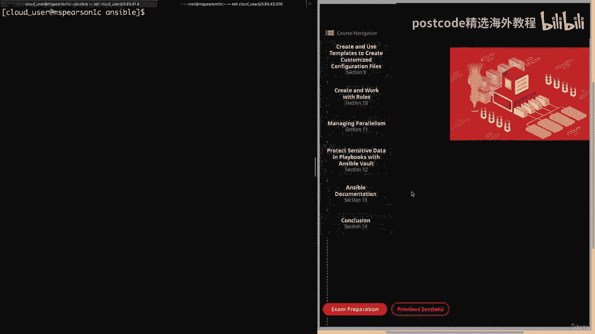

这将带我们了解 ansible 变量。好的。现在让我们更多地讨论一下变量，然后我将向您演示如何，可以在 Ansible 中使用它们。第一个变量可以包含字母、数字和下划线，但必须以字母开头。

变量也可以存储为字典，它将键映射到值，然后这些，字典变量将使用方括号表示法或点表示法引用，我将提供，图中的一个例子。所以如果你看这里，我们有括号表示法的例子，它只是，字典，然后是您想要的字段。

它将放在括号中，然后是单引号，或者，您还可以列出字典，然后做一个点，然后是字段名称。老实说，这将取决于您想要使用它的方式的偏好。当然，只做点会更容易一点，打字会少一点。但需要记住的一件事是。

当您使用点表示法时，可能会出现一些 YAML 陷阱。因此，最安全的方法是使用括号表示法，但如果遇到任何问题，请记住这一点，可以通过将元素编号放在括号中来访问存储为列表数组的下一个变量。因此。

除了能够使用具有键值对的字典变量之外，您还可以，还将变量存储为列表。每当您需要引用该列表的成员时，您始终可以将列表名称或数组，名称，然后是数字或实际元素在列表中的位置。因此，在这里的示例中。

我显示了数组的第一个元素。所以你有数组的名称或列表的名称，然后第一个元素将是，0，然后从 1 到 3，依此类推。接下来的变量可以在以下位置定义或设置，因此您可以直接存储变量。

在清单文件中或在主机 VAR 或组 var 目录中，这当然是，相对于库存。然后您还可以将它们存储在剧本中，这里有多种选择。首先是 VARs，它允许您直接在 VARs 提示符下添加变量，这将是。

提示正在运行剧本的人输入特定值。接下来可以为角色设置变量，这是通过将它们添加到 VAR 内的主 YAML 中来完成的，该角色的目录。我们将在稍后的视频中详细讨论这一点。但是。

当您将这些变量添加到主 YAML 中时，它将可供该角色使用。一般来说，所有其他角色也都能够使用这些变量。最后，您还可以在运行时直接在命令行上定义变量，剧本。

这是通过使用破折号 e 标志或破折号破折号额外变量来完成的，您可以将它们添加为键值，配对，或者您甚至可以使用 at 符号引用变量文件。好的。现在让我们进入下一页。接下来。

您可以使用 Jinja 两个模板系统引用定义的变量并提供示例，图中的这一点。正如您所看到的，您将拥有变量名称，并且您将用两个将其包围，大括号。但请记住，YAML 确实需要值，从要引用的变量开始。因此。

如果变量出现在行的开头，则需要引用整个变量，线。您还可以使用 Jinja 两个过滤器转换变量值，例如 Join 或 Capitalize 或 join is，连接值并资本化就是将值资本化。再说一次。

我们稍后将详细讨论这一点。接下来，Ansible 存储有关远程主机和变量的信息，这些信息称为 Ansible 事实。我们已经看到了很多这方面的例子，但这些都非常有用，并且由 Ansible 收集。

默认情况下。因此，当我们使用模板时，我们肯定会利用这一点。此外，Ansible 还提供了称为魔术变量的特殊保留变量，以及这些变量的一些示例，将是主机变量组、组名称和清单主机名，主机四将让您。

访问另一个主机的变量，当您在剧本中运行时这绝对有用，如果您想要访问另一个受管节点组的变量，则将提供所有受管节点组的列表，清单中的组以及属于它们的主机。然后组名称将提供当前主机所在的所有组的列表。最后。

清单主机名名称是清单中配置的主机名的名称，文件。因此，有时您可能不想使用 Ansible 事实收集的 Ansible 主机名，甚至不想使用，FCM，而是您在清单文件中定义的名称。好的。

所以我们最后要讨论的是自定义事实，也称为本地事实。这些可以由用户添加到远程系统。这些事实将在以点事实结尾的文件中定义，并存储本地事实文件，默认情况下，在etsi ansiblefacts中。

但可以使用fact下划线更改fact文件目录，路径关键字。与许多其他 ansible 配置一样。您还可以更新它并将其放入对您可能更有意义的目录中。最后。

可以通过使用 setup 模块运行 Ansible ad hoc 命令来查看本地事实，然后通过查找 Ansible 下划线本地进行过滤。现在让我们进入命令行，我将向您展示如何快速完成此操作。

在运行 Ansible ad hoc 命令之前，让我们先看看 MZ Pearson。我将在 etsy 中播种。安西布尔传真路。正如您所看到的，我们有一个事实文件，即主机下划线信息。那么让我们继续打开它。

正如您所看到的，这是一个 and I 格式，我有一个包含一些键值对的字典。所以我只是调用这个实验室服务器，然后我的类型等于云，然后平台等于 AWS。因此，让我们继续并结束此操作。

然后返回我们的控制节点之一 MZ Pearson，然后我们，可以运行 Ansible。EMS 皮尔逊到。他是设置模块。然后我们还要进行过滤。并寻找 ansible 下划线本地。继续吧，开始吧。

正如你所看到的，它将撤回我们的合理事实。寻找本地的ansible。它显示了我们的主机下划线信息事实文件。然后我们有实验室服务器，其中包含我们的键值对、平台、AWS 和类型云。对于更休闲的用户。

您可能不会太多地使用本地事实，但这是一个选项，可供您使用，这样您就可以定义对您的安装有意义的某些变量。好的。现在让我们弄清楚这一点。好的。现在我将向您展示如何使用变量文件来创建一些用户。

所以我想向您展示的第一件事是我位于家庭云用户 Ansible 目录中。我创建了另一个名为 VARs 的目录。这就是我保存变量文件的地方。那么让我们继续向用户开放 HTML。正如您所看到的。

这是 YAML 格式，我只是在这里指定我的变量，即学生，然后我创建一个列表。学生下面有扎克、凯利、斯莱特和丽莎。然后我还有另一个变量，那就是教师。接下来是贝尔丁、布利斯、塔特尔和杜威。

回到我之前讨论的内容，为了查看或引用变量，您，看到我们这里有一个数组或一个列表。因此，如果我们要引用这个变量 Students，将使用零来引用 Zac，然后我们，会有凯利一、二、三。

这样您就可以直观地看到我在说什么。但无论如何，我们这里有两个变量，它是一个用户列表，所以让我们继续并退出，这个的。现在我们可以播种到我们的剧本目录中，我们将创建一个新的剧本。我将其称为变量点 HTML。

从我们的三个破折号开始。我们将再次与四位主持人对抗女士。皮尔逊至。然后就会成为。是的。然后我将指定我们在本课中引用的关键字，即 VARs underscore，文件，这将允许我们引用我们的变量文件。

所以我们就到这里来。我们要输入 home cloud，在用户 Ansible 下划线，或者这位于我们的 VARs 目录中，它是，称为用户 HTML。如果您想在剧本中引用多个变量文件，您可以。

在此处添加列表。但由于我们只使用一个，我将继续并按 Enter 键，然后我们可以回来提供，我们的任务。因此，对于本剧本，我们只有一项任务。对于描述。我只想说创建用户。我们将使用用户模块。

我们将指定一个名称。为此，我实际上将使用 item 变量。所以我们将放入花括号。关闭我们的报价。输入一个项目。那是因为我们最终将循环遍历我们在我们的列表中列出的用户，变量文件。

这样我们就得到了 item 变量。现在我们需要指定将要出现的状态。它。通常我会使用loop关键字。这次我要给大家展示一些物品。然后我们去删除用户。我会回来向您展示用于循环关键字的语法，这实际上是。

需要一个过滤器才能得到预期的结果。我们稍后会讨论这个问题。现在让我们继续添加变量。所以事情就会这样。学生。然后我将复制并粘贴它。然后就是教师。因此，尽管本手册中没有定义学生和教师，但我们，能够引用它们。

因为我们正在定义它们的变量文件中。好的。让我们继续保存它，然后我们就可以运行我们的剧本了。Playbook 然后是变量 html。这可能需要一点时间，所以我会继续加快速度，这样您就不必等待。好的。

现在一切都结束了，让我们前往 MZ Pearson 看看。然后我们就可以看到过去的WD。我们看到我们所有八个用户，其中四个是学生，即凯利·斯莱特、丽莎，然后。

贝尔丁、布利斯、塔特尔和杜威旗下的四位教师全部被创建。因此，我们能够使用 VARs 下划线文件关键字成功引用我们的变量，我们的剧本。但现在让我们回到 MHS Pearson One。

我们可以删除这些用户。让我们继续解决这个问题。让我们继续用缺席替换现在。然后我们可以添加删除等于。是的。这只会删除与用户关联的所有目录。然后我们实际上不会使用 with items 关键字。

而是使用循环。然后我们可以在这里删除这两个变量。他们将打开一个双引号，然后是我们的两个花括号，他们将打开一个括号，我们将引用这两个变量。所以首先是学生，然后是教师。然后我们将应用一个扁平的过滤器。一。

然后我们就可以结束这个了。所以你只是列出了我们的变量学生和教师。每个都有一个与其关联的用户列表，然后我们将添加管道，然后我们，将指定我们的过滤器，它是扁平化的。这将使我们能够执行单级扁平化。

这是我们需要做的事情，以便获得与我们所做的完全相同的输出，与物品。这与我们指定变量的方式有关。因此，让我们继续保存并退出。然后我们可以再次开始我们的剧本。哦，看来我拼错了教师。因此。

让我们快速将其恢复到原来的状态。这将是教师。好吧，让我们保存并退出，然后我们可以再试一次。

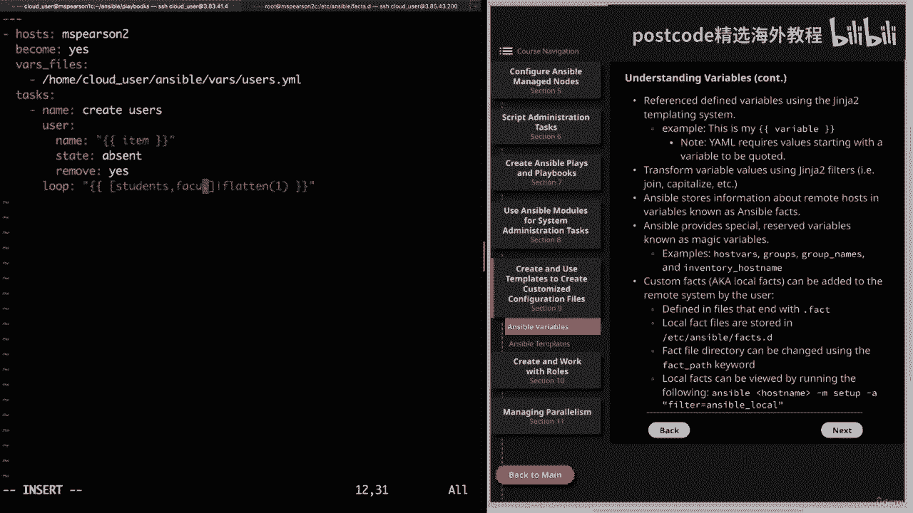

好了，这次就顺利完成了。返回 MZ Pearson。我们可以在过去的WD上运行另一只猫。我们看到所有用户都已使用带有扁平过滤器的循环被删除。而且他们的所有主目录也已被删除。好吧。

这将结束关于变量的这一课。接下来，我们将深入研究模板。好吧，让我们继续并将其标记为完成。他们的主目录也已被删除。好吧，这将结束关于变量的这一课。接下来，我们将深入研究模板。

但让我们继续完成第九部分并讨论使用模板，为了创建定制的配置文件。因此，让我们进入下一部分，然后是第九部分，最后进入 Ansible 模板。

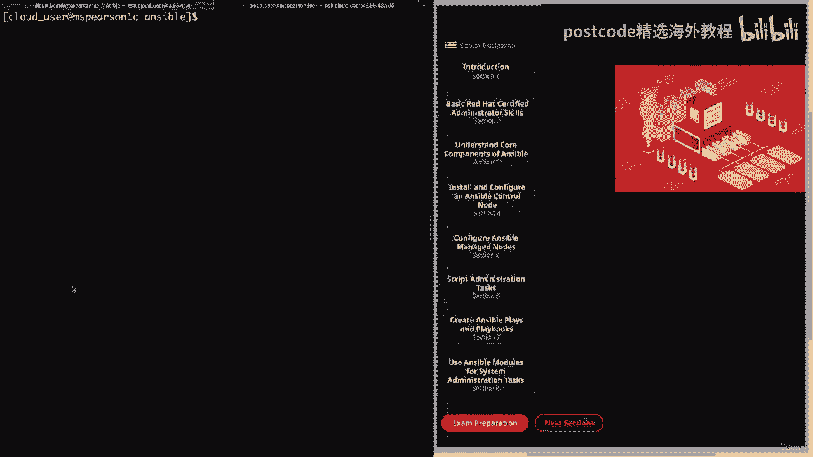

首先，我们将讨论一些模板，然后我将向您展示一些模板，我创建的模板文件。然后我们将在剧本中使用这些模板文件来推出配置，文件。好的。因此，首先，模板只是通过以下方式包含静态值和动态值的文件：变量的使用。

因此，模板的强大之处在于，您可以拥有一个包含数据的基本文件，但是通过，利用变量，您还可以根据主机动态生成这些值，您将模板推送到您定义的变量或仅推送到您定义的变量。

Ansible 将使用 Ginger 2 处理这些模板。这只是 Python 的一种模板语言，我们不会非常深入地了解 Jinja，两个，但它将向您展示我们将如何创建这些模板以供使用的基础知识。

Ansible，以及我们如何使用过滤器来操纵数据的输出。接下来的模板指定有 J2 扩展名，并且仅指定该文件是 JEONJU，模板并且应该这样理解。接下来的模板文件通常用于配置文件管理，这是因为它删除了。

需要手动更新配置文件，这对于任何自己完成此操作的人来说都是非常重要的，容易出现人为错误。但它还允许将配置文件推送到多个主机。因此，通过这种方式，它将是可扩展的，您可以找到变量或使用现有变量，以便。

文件中的值将自动生成。这引导我们进入下一点，即模板可以访问与，呼唤他们的戏剧。因此，这将是 Ansible 通过 Ansible 事实收集的有关远程服务器的任何变量以及任何，您为主机或组定义的变量。

甚至是您专门定义的变量，为了那场戏。这将我们带到了模板模块，它处理模板然后将其推送到远程，服务器。因此，这将是我们获取我们创建的模板然后推送它们的主要方法，到我们的托管服务器。在图中。

我提供了模板模块的示例及其许多参数。首先，当然，我们有源，它是模板本身的路径，然后是目的地，它是，是您实际要将模板文件放在远程服务器上的位置，您可以指定所有者，文件的组和组以及文件权限使用模式。

另一个方便的选项是验证选项。因此，为此，您将输入一个验证命令，然后这个小百分比的 SW 就是，将拉入您的实际模板文件。根据您正在使用的配置文件类型，该验证命令将会执行，改变。

但是有几种不同的服务提供语法检查实用程序，因此您只需选择，适合您的特定配置的一个。因此，这可能类似于通过 Sudo 来验证伪配置。再次，您要验证的文件的路径将使用该百分比 SW 传递并且，这也必须存在。

最后，我们有备份选项，它允许您备份，原始配置文件。因此，您可以这样做，以防由于某种原因您的模板化配置文件以任何方式出现混​​乱。好的。现在让我们点击进入下一页。

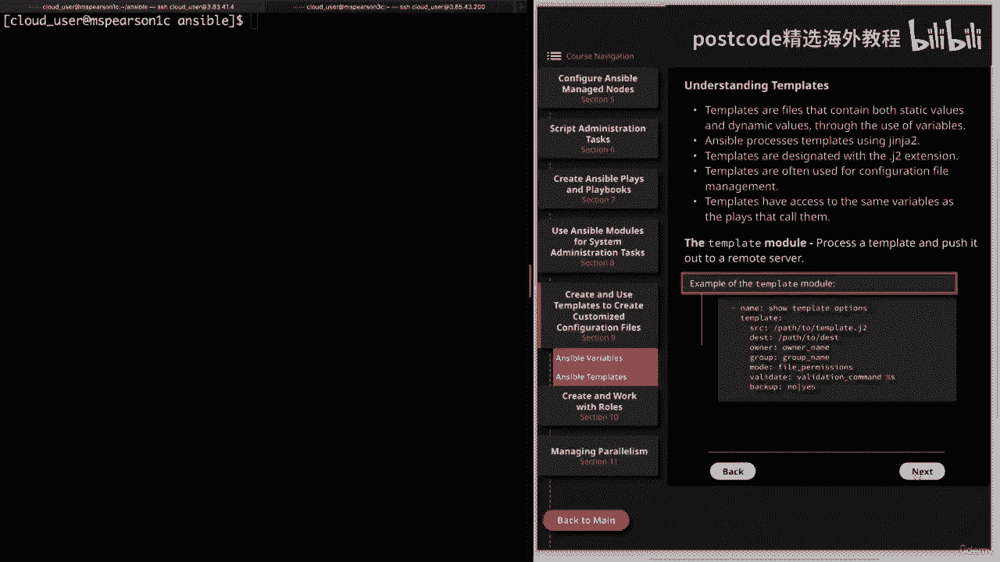

这将向您展示 Apache 配置文件模板的示例。实际上我将在命令行中向您展示这一点，但我想让您知道它是，图中。这样您就可以根据需要重新引用它。我们还有一个模板，一个索引 HTML 文件。

这是我将在命令中向您展示的另一个模板，线。最后，我提供了一个剧本示例。这就是我将用来推出我的模板的剧本。好的。那么让我们进入命令行。我目前位于我的工作目录中，即 Ansible。

让我们继续更改目录并转到模板目录。在这个目录中，我创建了 http hdcp J2 和 index。html j2。那么让我们继续打开http adcom。

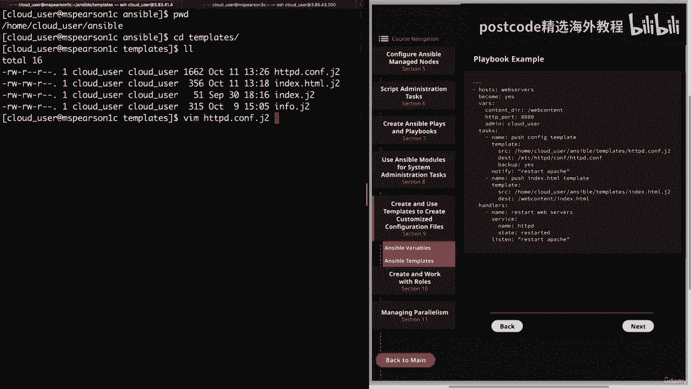

所以我对此模板所做的只是复制基本的 Apache 配置文件，然后添加，它到我的控制节点，然后我删除了所有注释，然后在顶部我刚刚添加了，配置文件was，这是主要的HTTP服务器配置文件。

然后我将其添加到此处由 Ansible 管理的变量中。因此，这将用我们的值替换 Ansible 管理变量，这将让任何，用户知道这个特定的配置文件是由 Ansible 控制的。对于配置文件的其余部分。

我添加了我在其中定义的变量的混合，我的剧本，以及一些由可靠事实收集的变量。因此，如果我们稍微往下走一点，我们就会在指令中找到列表，并且我在此处添加了一个名为的变量，HTTP 下划线端口。

这是我在剧本中实际定义的端口之一，我将，只需一分钟即可向您展示。然后，如果我们再往下走一点，我们就有了服务器管理员，我添加了变量 admin，我们的剧本中也定义了这一点。

然后是 Ansible 事实收集的 Ansible 主机名。然后，如果你再往下看一点，我已将文档根更改为一个名为的变量，内容下划线目录。这是我直接在剧本中定义的另一个变量，我也将其放置在。

该指令是为了更改正在引用的目录。

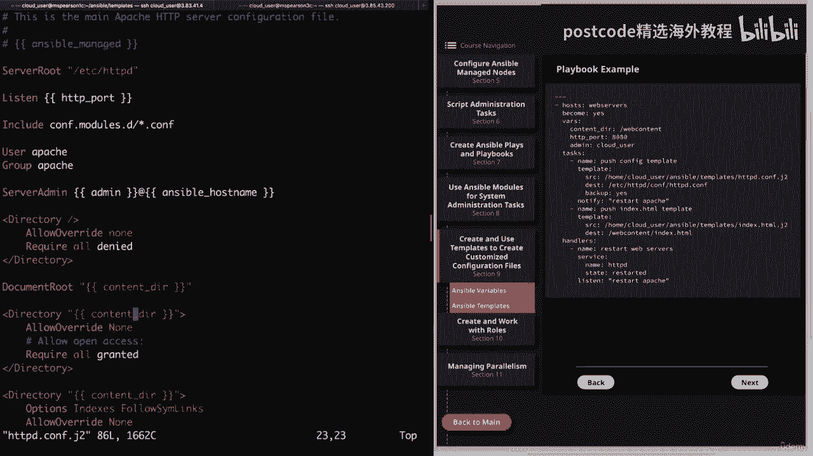

然后我这里也改了。然后对于其余的值，我只保留默认的 HTTP 配置，如果我们想要的话。

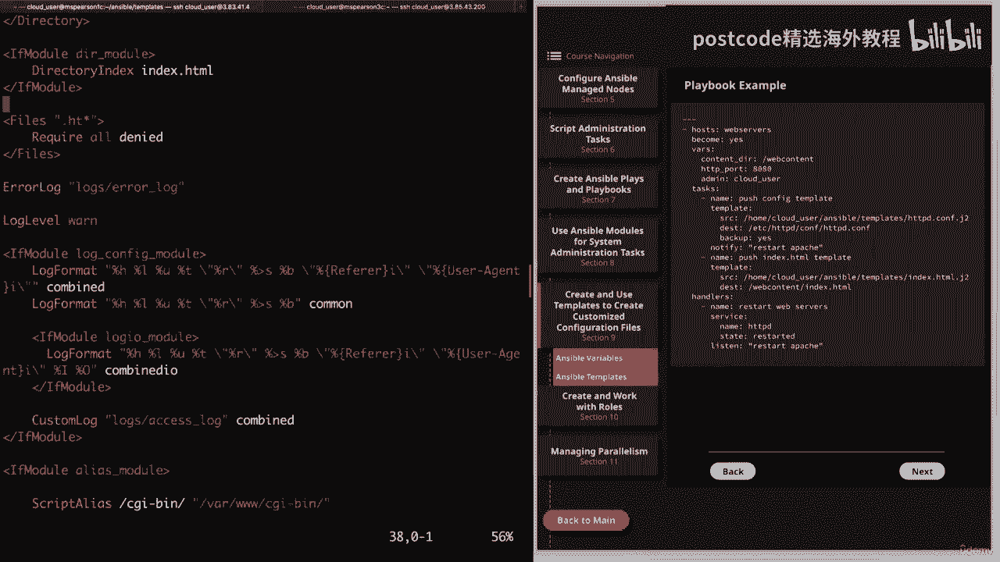

到，我们可以更改其中任何一个以引用我们自己的值或引用变量。

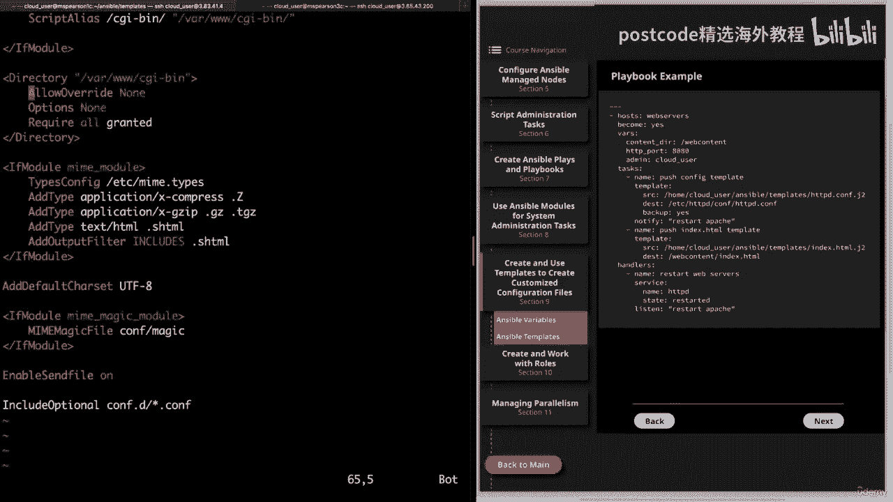

但我只是将它们保留为默认值，所以让我们继续并退出。我想向您展示的下一个文件是我的索引 HTML，J2。所以这只是一个索引 HTML 的模板。所以我在顶部所做的就是欢迎来到。

然后添加 Ansible 下划线，主机名。然后，当我们再往下看时，我会列出 IPv4 地址设置为，Ansible 默认下划线 IPv4，然后我引用地址和括号符号。

接下来我将当前内存使用情况设置为 ansible 内存下划线 emby 并且我引用的是 real，然后使用然后我说的是可用的总内存。所以这将成为现实。然后再次用括号表示总计。然后在下一张幻灯片中。

我引用 Ansible 下划线设备变量，然后使用，这里的过滤器说要拉第一个设备，然后我添加块设备，如下所示，分区，然后是冒号。然后在下一行我再次调用 Ansible 设备。

然后调用 NVM 0 和 1 块，设备，然后最后到分区。这将拉入所有分区。然后我提供了另一个过滤器，即连接过滤器。它将允许我们连接这些值，然后我们将连接这些值，使用反斜杠换行符。

NN 然后我添加了一个空格，然后又添加了一个破折号。因此，这将确保每个分区都添加到新行中，然后包含一个空格和，在实际列出分区之前加一个破折号。好吧，让我们继续吧，退出这个话题。

现在我们可以前往我们的剧本目录。我要清理并打开我为本次演示创建的剧本。我将其称为 Apache Template HTML。因此，如果我们回到顶部，我们可以看到我们正在执行的主机是 Web 服务器。

团体。我们将成为 root 用户，然后我们将使用 var 关键字指定一些变量。所以在 var 下，我们有 content underscore dir，它被设置为 web 内容目录。请记住。

我们已将文档根设置为该变量内容。所以我们的新文档根目录将是网页内容。然后我们有 HTTP 下划线端口，我们现在将其设置为 80， 80。默认情况下，Apache 将侦听端口 80。

您还记得 Apache 配置文件中的课程指令，我们已将其设置为 HTTP 端口，多变的。所以现在 Apache 将监听 8080 而不是端口 80。最后，我们有管理员。对于这个变量。

我们将值设置为 cloud underscore user。因此，您在配置文件中看到的所有变量都是在此处定义的。现在，如果我们愿意，我们可以创建一个变量文件并将所有这些变量添加到该文件中，file。

然后使用 vars 下划线 file 关键字，然后引用文件位置。但这次我选择使用 vars 关键字并将它们直接添加到剧本中。接下来我们有我们的任务。第一个任务是推送配置模板。所以我们将使用模板模块。

源将是我们的 HTTP hdcp 的路径，J2 模板。目的地是 Apache 配置文件的默认位置，即 etsi http，http。conf。conf，我已经指定我们要对此进行备份。这样。

当我们推出模板时，我们也将拥有原始模板。然后我还使用了notify关键字来通知我们在下面指定的处理程序，底部重新启动Apache。因此，如果我们转到处理程序，我们只是用它来重新启动我们的网络服务器。

所以我们使用服务模块，命名为 HTTP D，然后状态将重新启动，我们正在监听重新启动 Apache。因此，每当配置文件发生更改时，notify 关键字就会通知我们的处理程序并，它将启动我们的网络服务器。

这样配置文件就可以生效了。好的。因此，如果我们跳回来一点，我们还有另一个任务，那就是推送索引的 HTML 模板。再次强调，我们将使用模板模块，源是我们的index。html、J2 的路径。

这次我们的目的地将是新的内容目录，即网页内容，我们，当然，我们将其称为索引 HTML。如果您还记得我们的安全视频，我们实际上已经更新了 Web 内容目录。

这样它就有适当的上下文供 Apache 与之交互并从中读取文件。现在我们已经完成了剧本，让我们继续并退出，现在我们可以踢了，脱离我们的剧本。所以 Ansible 剧本。这将是一个不完整的模板。EML。

好吧，让我们把它关掉吧。我会继续为您加快速度，这样您就不必等待。

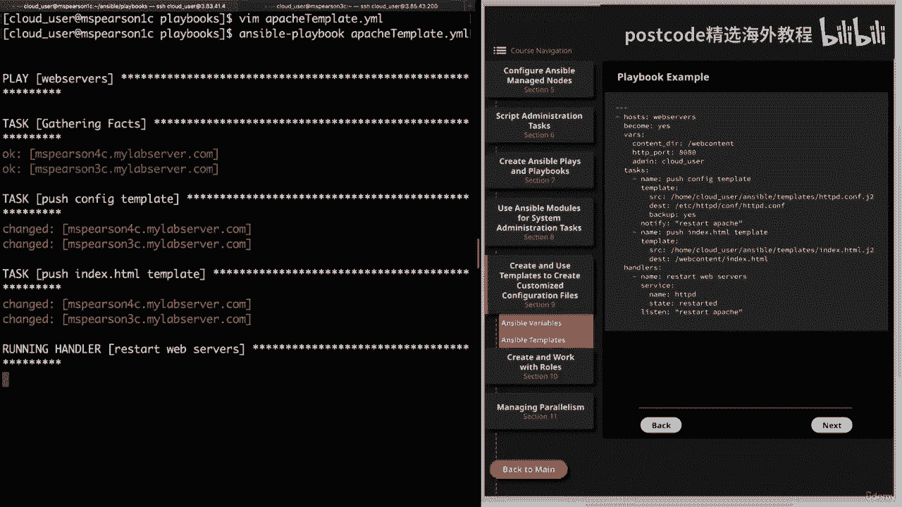

其实很快就完成了。所以我们不必加快速度。看起来我们所有的任务都成功了。所以我们收集事实。我们将配置文件模板推出到版本三和四，它们都是成员，Web 服务器组的成员，然后推出了我们的索引 HTML。最终。

由于我们推出了配置文件并且那里发生了变化，我们的，处理程序收到通知后，我们重新启动了 Apache 服务器。好吧，让我们回到 MZ Pearson 2。

让我们继续打开我们的 ETSI http comp。HTTP adcom。我们看到我们的配置文件模板已添加并且所有变量都已提供，与实际值。

所以 Ansible 管理这当然是 Ansible 管理的价值观。然后我们的列表地址是8080。如果我们归结为服务器管理，我们会看到 MBS 的云用户、Pearson 3 C，然后是文档路由。

我们有斜线网页内容。对于这个目录指令，我们还有网页内容，再次是网页内容。所以这样很好。让我们继续看看我们的备份是否也已创建。因此，我们将列出 http。com 星号。我们确实看到了我们的备份。

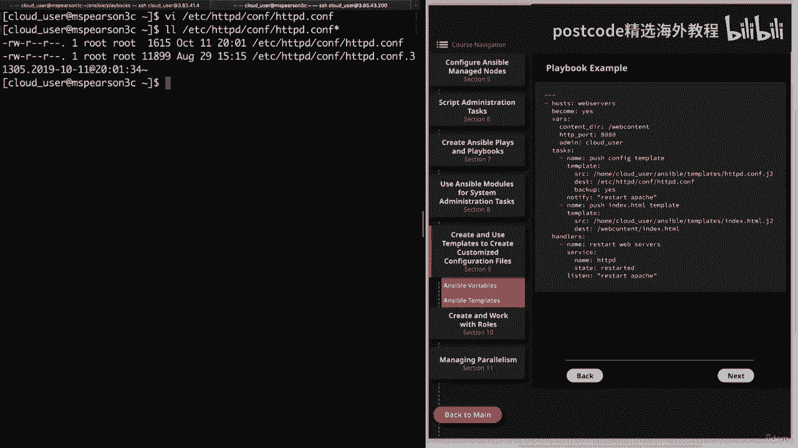

所以让我们继续快速地打开它。如果我们滚动浏览，我们将看到所有原始评论，这些评论让我们知道什么，每个指令可以做什么，不同的选项是什么，以及原始值。因此，对于我们的侦听器地址，我们有端口 80，继续向下。

我们看到服务器管理已设置。

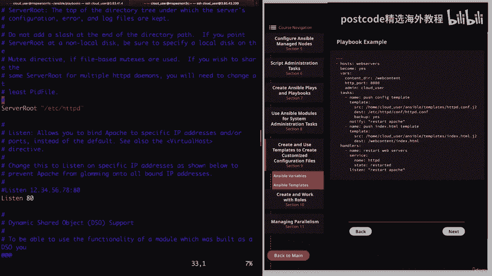

到 root 添加本地主机，然后我们的文档路由设置为我们的 dub dub dub HTML 的默认值。

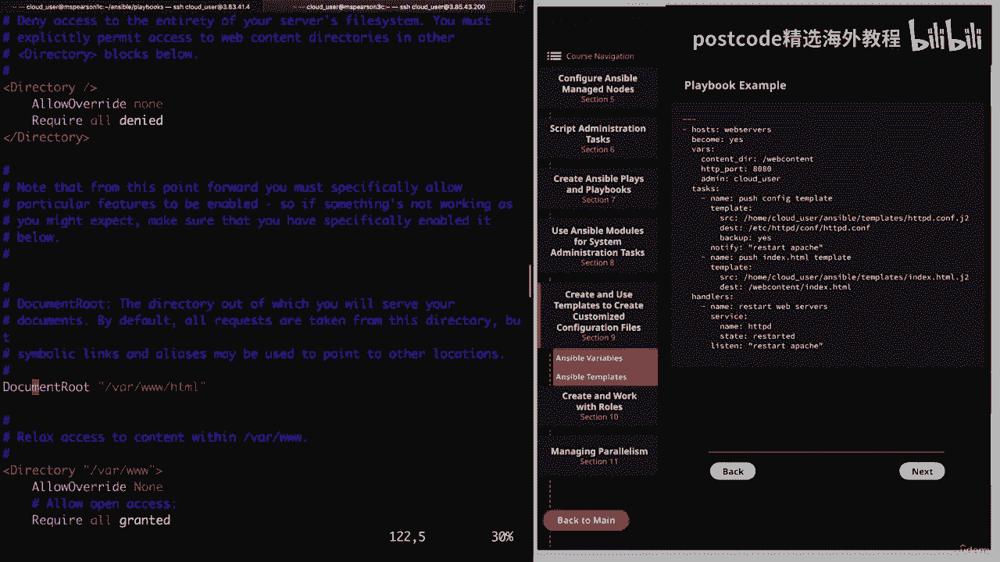

然后是 var dub dub dub 和 var dub dub dub html。好了，这样我们的备份就创建成功了，接下来我们也可以查看我们的index。html了。

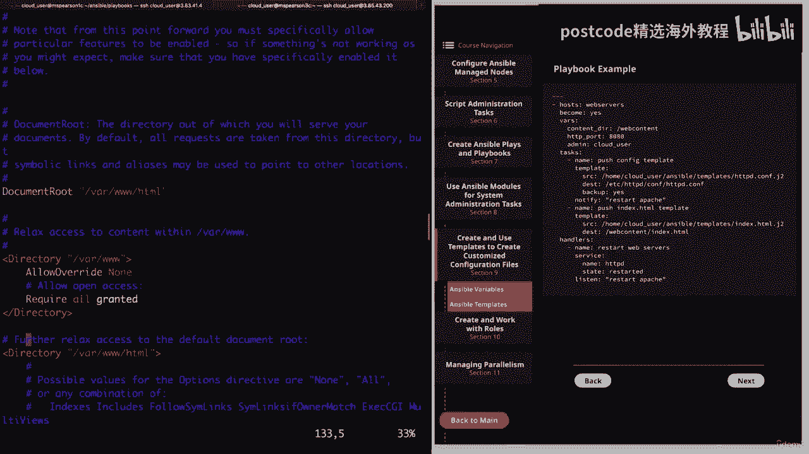

因此，Web 内容索引为点 HTML，就像 Apache 配置文件一样。我们所有的变量都已提供值。所以它说欢迎来到 Pearson 3 C 我们有 IPv4 地址。当前内存使用量占总内存使用量。

然后我们将 NVM 块设备作为以下分区，我们看到有两个分区，我们的过滤器能够操纵输出以将其置于我们想要的格式中，这是一个，换行符，然后是空格和破折号。让我们继续前进并退出这个话题。作为最后的验证。

让我们回到 MZ Pearson，一个或控制节点，然后我们将，只是卷曲 MBS 皮尔逊。端口 8080 上三个 C，然后索引 HTML。我们看到我们收到了欢迎信息。

我们也可以为 MZ Pierson 做这件事。让我们继续这样做吧。我们看到了。欢迎小姐姐来。Pearson Forsey 和我们更新的 IPv4 地址以及当前的内存使用情况。好吧。

这将是关于使用模板创建自定义配置的视频的总结。

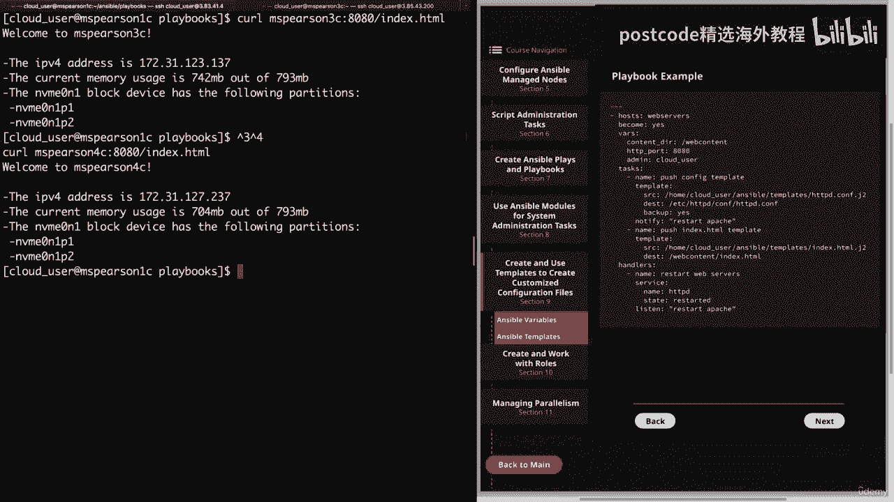