# Ansible 精通课程：P20：03-03-007：使用模板创建自定义配置文件 🛠️


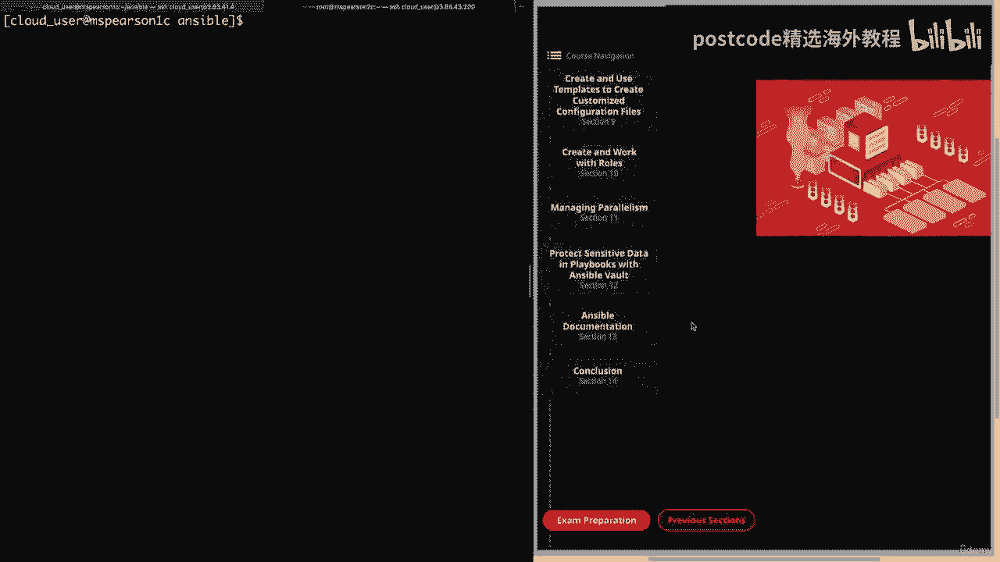

在本节课中，我们将学习 Ansible 中一个非常强大的功能——模板。通过模板，我们可以动态生成配置文件，从而实现对大量服务器进行统一且灵活的配置管理。我们将从理解变量开始，这是使用模板的基础，然后深入探讨如何创建和使用 Jinja2 模板文件。

## 第一部分：理解 Ansible 变量 🔢

上一节我们介绍了 Ansible 的基础操作，本节中我们来看看 Ansible 变量的定义和使用。变量是 Ansible 中存储和引用数据的关键，它们使得剧本和模板更加灵活和可重用。

### 变量命名规则
变量名称可以包含字母、数字和下划线，但必须以字母开头。

### 变量类型
Ansible 支持两种主要的变量结构：
1.  **字典**：将键映射到值。可以使用方括号表示法或点表示法来引用。
    *   **方括号表示法**：`字典[‘字段名’]`
    *   **点表示法**：`字典.字段名`
    > **注意**：点表示法虽然方便，但在某些 YAML 场景中可能引发歧义，因此方括号表示法通常更安全。

2.  **列表/数组**：存储有序的元素集合。通过索引（从0开始）来访问元素。
    *   **示例**：`列表[0]` 访问列表的第一个元素。

### 变量的定义位置
变量可以在多个位置定义：
*   **清单文件**：直接在主机或组定义中设置。
*   **主机变量文件**：位于 `host_vars/` 目录下，以主机名命名的文件。
*   **组变量文件**：位于 `group_vars/` 目录下，以组名命名的文件。
*   **剧本中**：通过以下几种方式：
    *   `vars` 关键字：直接在剧本中定义变量。
    *   `vars_prompt`：在运行剧本时提示用户输入变量值。
    *   **角色变量**：在角色的 `vars/main.yml` 文件中定义。
    *   **命令行**：使用 `-e` 或 `--extra-vars` 标志在运行时传递变量，例如 `ansible-playbook playbook.yml -e “key=value”` 或 `-e @vars_file.yml`。

### 变量的引用与 Jinja2
在 Ansible 中，我们使用 Jinja2 模板系统来引用变量。
*   **基本引用**：用双大括号 `{{ 变量名 }}` 包围变量名。
    > **注意**：如果变量引用出现在 YAML 行的开头，需要将整个值用引号引起来。
*   **使用过滤器**：Jinja2 过滤器可以修改变量的输出格式。
    *   **示例**：`{{ 列表变量 | join(‘,’) }}` 将列表元素用逗号连接；`{{ 字符串变量 | capitalize }}` 将字符串首字母大写。

### 特殊变量：事实与魔法变量
Ansible 自动收集受管节点的信息，称为 **事实**。这些是预定义的变量，非常有用。
此外，Ansible 还提供了一些 **魔法变量**，用于访问剧本和清单的元数据。
以下是几个常用的魔法变量：
*   `hostvars[‘其他主机名’]`：访问其他主机的变量。
*   `groups`：提供清单中所有组的字典。
*   `group_names`：列出当前主机所属的所有组。
*   `inventory_hostname`：清单文件中配置的主机名。

### 自定义事实（本地事实）
除了自动收集的事实，用户还可以在受管节点上定义 **本地事实**。
*   **文件位置**：默认位于 `/etc/ansible/facts.d/` 目录，文件以 `.fact` 结尾。
*   **文件格式**：通常是 JSON 或 INI 格式。
*   **查看本地事实**：可以使用 `setup` 模块并通过 `ansible_local` 进行过滤。
    ```bash
    ansible 主机名 -m setup -a “filter=ansible_local”
    ```

### 实践：使用变量文件创建用户
让我们通过一个例子来巩固对变量的理解。我们将创建一个变量文件来存储用户列表，并在剧本中引用它来批量创建用户。

1.  **创建变量文件** `vars/users.yml`：
    ```yaml
    students:
      - zac
      - kelly
      - slater
      - lisa
    teachers:
      - belding
      - bliss
      - tuttle
      - dewey
    ```
    这里定义了两个列表变量：`students` 和 `teachers`。

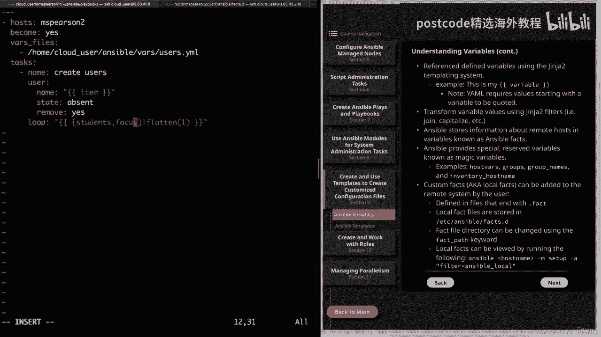

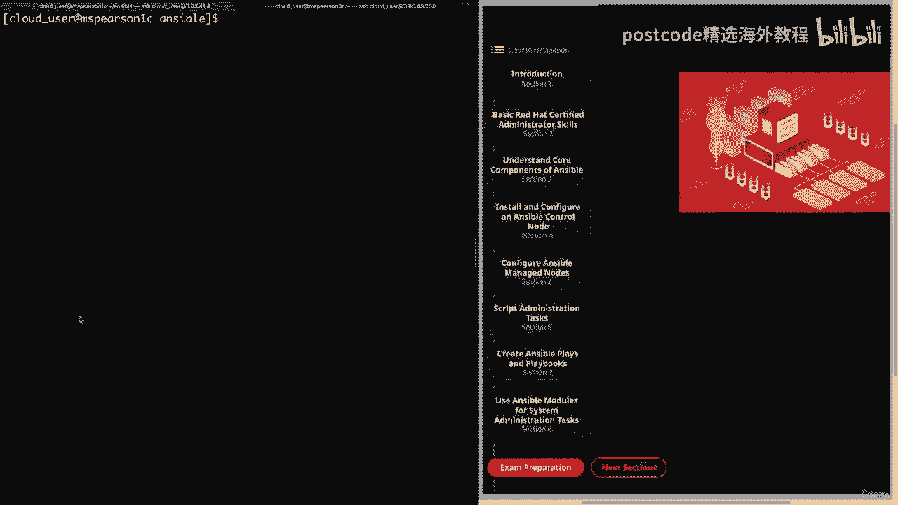

2.  **创建剧本** `playbooks/variables.yml`：
    ```yaml
    ---
    - name: 使用变量文件管理用户
      hosts: msp1
      become: yes
      vars_files:
        - ../vars/users.yml  # 引用变量文件
      tasks:
        - name: 创建用户
          user:
            name: “{{ item }}”
            state: present
          loop: “{{ students + teachers }}”  # 合并两个列表并循环
    ```
    这个剧本通过 `vars_files` 关键字引入了外部变量文件，并使用 `loop` 遍历合并后的用户列表来创建用户。

3.  **运行剧本并验证**：运行剧本后，可以在目标主机上使用 `cat /etc/passwd` 确认用户已创建。
4.  **清理用户**：将剧本中 `state: present` 改为 `state: absent` 并再次运行，即可删除这些用户及其主目录。

**本节总结**：在本节中，我们一起学习了 Ansible 变量的核心概念，包括其类型、定义位置、引用方法以及特殊的“事实”和“魔法变量”。我们还通过一个创建用户的实例，演示了如何在剧本中引入和使用外部变量文件。掌握变量是迈向高效自动化配置的关键一步。

---

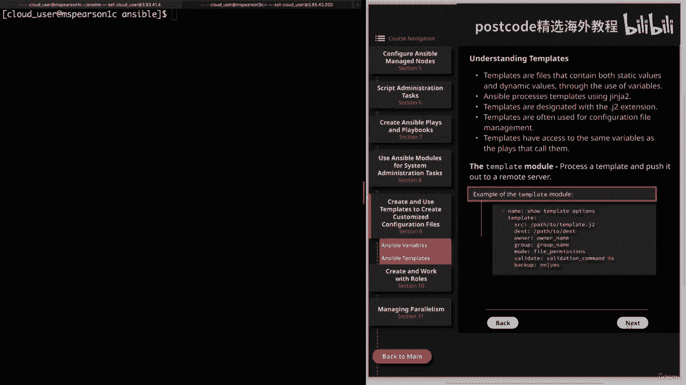

## 第二部分：使用 Jinja2 模板创建动态配置文件 📄

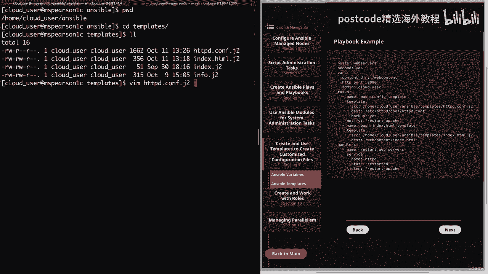

上一节我们介绍了 Ansible 变量的使用，本节中我们来看看如何利用这些变量和 Jinja2 模板引擎来创建动态的配置文件。模板功能消除了手动修改配置文件的繁琐和错误，是实现配置即代码的核心。

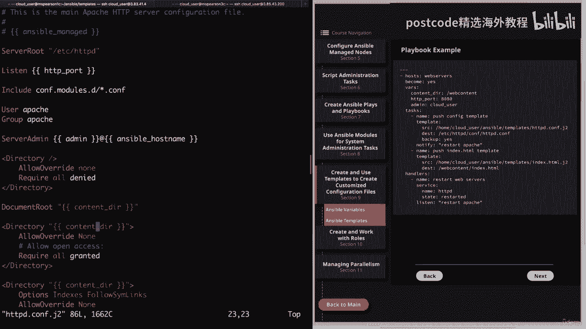

### 模板是什么？
模板是一个包含 **静态文本** 和 **动态变量占位符** 的文件。Ansible 使用 **Jinja2** 模板引擎处理这些文件，在部署时用实际值替换占位符，从而为不同主机生成定制化的配置文件。

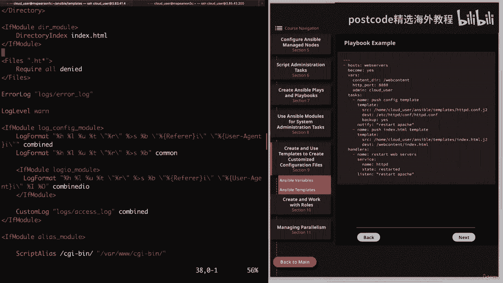

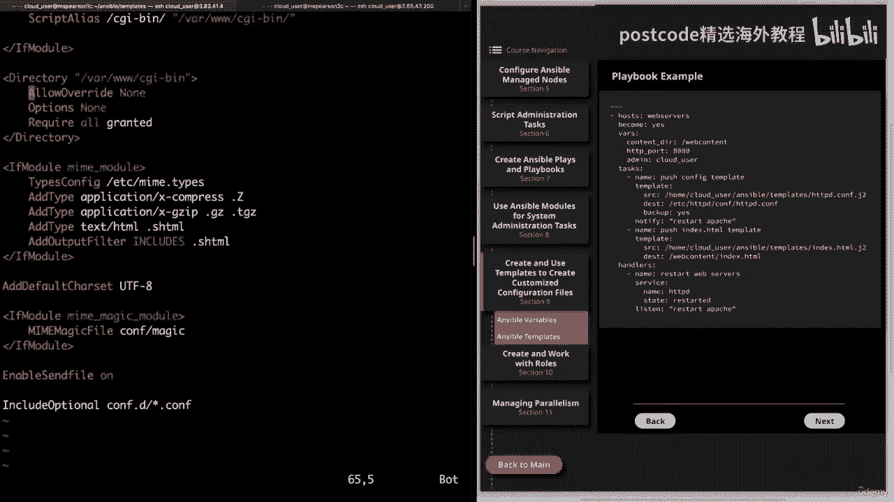

### 模板文件
*   **扩展名**：通常为 `.j2`，以表明这是一个 Jinja2 模板文件。
*   **用途**：主要用于配置文件管理，实现配置的标准化和批量部署。

### 模板模块
在 Ansible 中，我们使用 `template` 模块来处理和推送模板。
以下是该模块的关键参数：
```yaml
- name: 推送配置文件模板
  template:
    src: /path/to/template.j2    # 模板源文件路径
    dest: /path/to/config.conf   # 远程主机目标路径
    owner: root                  # 文件属主
    group: root                  # 文件属组
    mode: ‘0644’                 # 文件权限
    validate: ‘/usr/sbin/apachectl -t -f %s’ # 配置验证命令
    backup: yes                  # 推送前备份原文件
```
*   `validate` 参数允许在替换文件前执行语法检查（例如 `apachectl -t`）。`%s` 会被替换为临时文件路径。
*   `backup` 参数会在目标位置创建原文件的备份（如 `config.conf.12345.2023-10-27@10:00~`），这是一个非常重要的安全特性。

### 实践：使用模板配置 Apache 服务
让我们通过一个完整的例子，使用模板来配置 Apache Web 服务器。

1.  **创建 Apache 配置模板** `templates/httpd.conf.j2`：
    ```jinja2
    # {{ ansible_managed }} - 此文件由 Ansible 管理
    Listen {{ http_port }}
    ServerAdmin {{ admin }}@{{ ansible_hostname }}
    DocumentRoot “{{ content_dir }}”
    <Directory “{{ content_dir }}”>
        AllowOverride None
        Require all granted
    </Directory>
    ```
    在这个模板中，我们混合使用了剧本中定义的变量（`http_port`, `admin`, `content_dir`）和 Ansible 收集的事实（`ansible_hostname`）。`{{ ansible_managed }}` 是一个特殊注释，用于标识文件由 Ansible 管理。

2.  **创建网站首页模板** `templates/index.html.j2`：
    ```jinja2
    <html>
    <body>
        <h1>欢迎来到 {{ ansible_hostname }}！</h1>
        <p>IPv4 地址: {{ ansible_default_ipv4.address }}</p>
        <p>当前内存使用: {{ ansible_memory_mb.real.used }} MB / {{ ansible_memory_mb.real.total }} MB</p>
        <p>磁盘分区:</p>
        <ul>
        
          <li>{{ partition }}</li>
        
        </ul>
    </body>
    </html>
    ```
    这个模板展示了更复杂的 Jinja2 语法，包括使用 `for` 循环遍历列表（分区信息），并引用了多个 Ansible 事实。

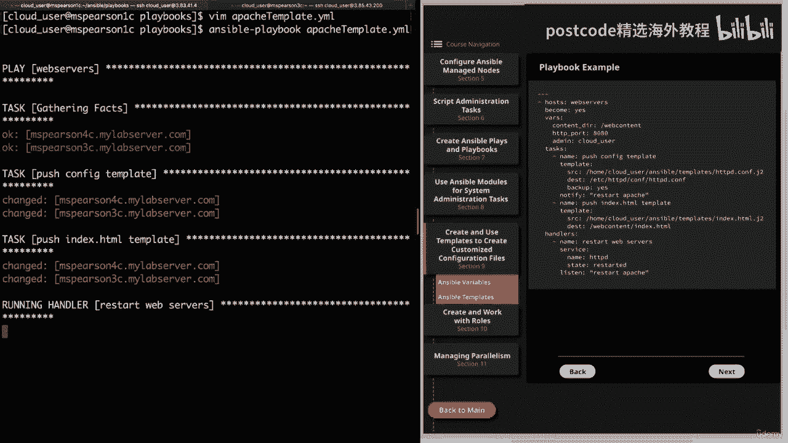

3.  **创建部署剧本** `playbooks/apache_template.yml`：
    ```yaml
    ---
    - name: 使用模板部署 Apache 配置
      hosts: web_servers  # 目标主机组
      become: yes
      vars:
        content_dir: “/web_content”  # 定义变量
        http_port: 8080
        admin: “cloud_user”
      tasks:
        - name: 推送 Apache 配置模板
          template:
            src: ../templates/httpd.conf.j2
            dest: /etc/httpd/conf/httpd.conf
            backup: yes
            validate: ‘/usr/sbin/apachectl -t -f %s’
          notify: 重启 apache  # 如果文件改变，触发处理程序

        - name: 推送网站首页模板
          template:
            src: ../templates/index.html.j2
            dest: “{{ content_dir }}/index.html”
            owner: apache
            group: apache
            mode: ‘0644’

      handlers:
        - name: 重启 apache
          service:
            name: httpd
            state: restarted
    ```
    这个剧本做了以下几件事：
    *   定义了三个变量。
    *   使用 `template` 模块推送两个模板文件。
    *   在推送配置文件后，通过 `notify` 调用 `handler` 来重启 Apache 服务以使配置生效。

4.  **运行剧本并验证**：
    *   运行剧本：`ansible-playbook playbooks/apache_template.yml`
    *   **验证配置文件**：登录到目标服务器，检查 `/etc/httpd/conf/httpd.conf`，可以看到变量已被替换为实际值（如 `Listen 8080`），并且原文件已被备份。
    *   **验证首页文件**：检查 `/web_content/index.html`，可以看到动态生成的主机名、IP 地址和系统信息。
    *   **访问网站**：从控制节点使用 `curl http://目标主机:8080` 命令，应能成功获取到动态生成的网页内容。

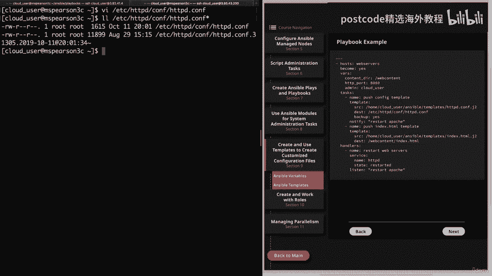

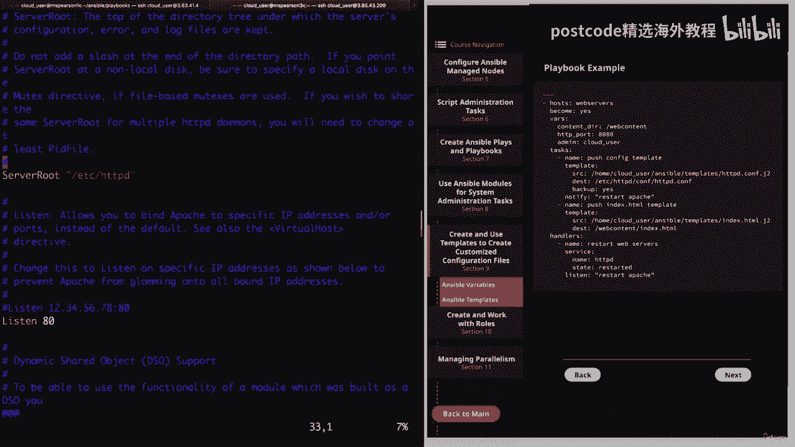

**本节总结**：在本节中，我们一起深入学习了 Ansible 模板的强大功能。我们了解了模板的概念、`template` 模块的关键参数，并通过一个完整的 Apache 配置实例，实践了如何创建 Jinja2 模板、在剧本中定义变量、使用模板模块推送配置，以及通过处理程序重启服务。模板是实现自动化、一致性配置管理的利器，熟练掌握它将极大提升你的运维效率。

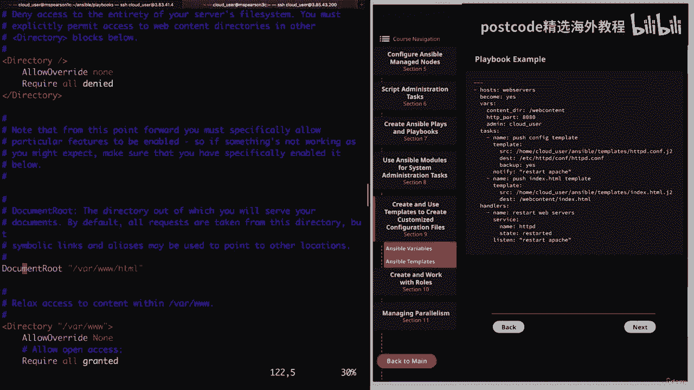

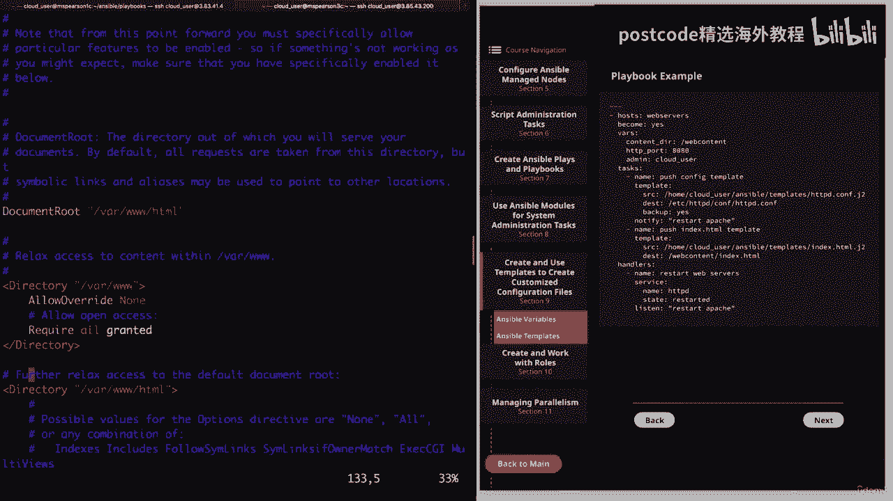

---

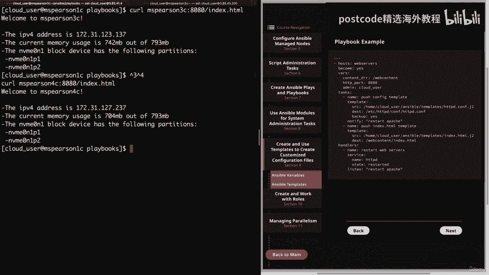

**课程总结**：在本节课中，我们一起学习了 Ansible 的两个核心进阶主题：变量和模板。我们首先系统地掌握了变量的定义、类型、作用域和引用方法，为动态配置打下了基础。随后，我们深入探讨了如何使用 Jinja2 模板引擎，将变量与静态配置结合，从而能够灵活、准确、批量地生成和管理服务器配置文件。通过实际的 Apache 配置案例，你将能够把这两部分知识融会贯通，应用于实际的自动化运维工作中。