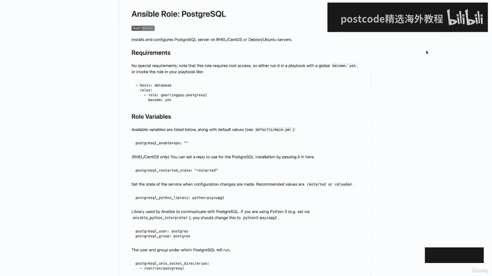

# 红帽企业Linux RHEL 9精通课程 — RHCSA与RHCE 2023认证全指南 - P21：03-03-008 Ansible roles - 精选海外教程postcode - BV1j64y1j7Zg

我们将开始创建和使用角色的部分。那么让我们转到第十节。第一个主题是理解角色。因此，角色的默认位置将是 Etsy Ansible 角色。但与其他默认目录一样，我们始终可以将它们更新到我们选择的位置。因此。

如果我们转到命令行。你可以看到我在我的主目录中。那么让我们继续播种到 Ansible 中。我们只是本课程的主要工作目录。然后我们将在这里列出。正如您在我的 Ansible 目录中看到的。

我创建了一个 Rolls 目录，并且还更新了，我的 Ansible CFG 中角色的默认位置。因此，让我们快速打开它，以便我可以向您展示。我在我的主目录中使用点和符号 CFG。正如您所看到的。

我有规则路径参数，当前它设置为 etsi ansible rolls 和，然后我添加了一个冒号，然后是我的新角色目录的路径，该目录位于家庭云用户 ansible 中，角色。

所以现在让我们继续前进并退出这个话题。由于我已在主 Ansible 工作目录中添加了角色目录的路径，因此 Ansible 是，还将在此处搜索任何现有角色。

Next 角色提供了一种基于已知的自动加载某些 vars 文件、任务和处理程序的方法，文件结构，这实际上引出了下一点，即角色期望特定的目录，结构。因此，让我们继续播种到我的角色目录中。弄清楚这一点。

现在我们可以列出清单了。正如您所看到的，我已经创建了一个。但对于这个视频，我只是希望您能够在我们谈论它时看到目录结构。我还将提供一个示例，您可以在图中参考。好的。因此，即使这是预期的目录结构。

任何未包含的目录，使用过的可以排除。因此，假设您有一个角色，但您实际上并未使用文件目录。因此，在这种情况下，您可以将其删除，并且实际上不会对您造成伤害，执行你的角色。最后。

每个使用的目录必须包含一个具有相关内容的主 HTML 文件。因此，对于您实际用于角色的任何目录，它必须包含一个主 HTML 文件，并且，该文件还必须具有该目录所需的正确内容。好的。

让我们继续并单击“下一步”。然后我们将讨论一下每个不同的角色、目录及其目标，是。首先，我们有任务目录，该目录包含要执行的任务的主要列表，通过角色。因此，就像您可以在剧本中定义多个剧本一样。

您也可以在其中指定多个剧本，任务目录的主 YAML。每当您调用您的角色时，这些任务就会被拉入并执行。另外，在任务目录中需要注意的是，这是通过使用 import task 关键字来完成的。

然后指定要包含的文件以及获胜条件，在该条件中您将指定操作，系统。这非常有帮助，特别是当您拥有不同 Linux 发行版的混合环境时。因此，在任务目录中，您拥有主 YAML，然后您还可以创建特定于发行版的。

YAML 文件，就像我们所说的 Red Hat YAML 或 Debian yaml。然后在这些文件中，您可以指定用于该特定发行版的模块。因此，这方面的一个例子是使用 Red Hat 的 Yum 模块。

然后使用 Debian 的应用程序模块。然后在主 YAML 中，您只需使用 import task 关键字来指定分发，特定的 YAML，然后是应该使用它的获胜条件。接下来，我们有处理程序。

此目录将包含您的处理程序，也可以使用它，通过这个角色，甚至角色之外的任何地方。请记住，我们已经学到的处理程序规则也将适用于，适用于为角色定义的处理程序，以便可以使用 notify 关键字标记处理程序。

只有当该任务发生变化并且仅通知处理程序时才会发生这种情况，即使已被通知多次，也会运行一次。接下来我们有默认目录，它将包含角色的默认变量，并且是，意味着如果没有给出其他值，则为变量提供一个值。

在为变量赋值时，该目录具有最低的优先级。因此，如果该变量在其他地方定义，则不会使用该值。因此，这允许您为变量提供一些基值。但根据您在角色其他地方指定的内容，这些值将不会被使用。接下来，我们有病毒目录。

该目录将包含病毒中使用的变量，角色，并且它的优先级也高于默认目录。因此，这是另一个目录，您将能够在其中定义要供您的角色使用的变量。在这里再次找到的任何内容都将优先于默认目录中定义的任何内容。

另一件需要注意的事情是，一个角色中定义的变量也可用于其他角色，你所创造的。因此，通常最好的做法是为变量命名，以免意外使用它们，由您设置的其他角色之一。例如，假设我们有一个名为日志文件的变量。

这是一个非常通用的名字。如果您在两个不同的角色中定义相同的变量，那么您有一个 Apache 角色，然后是一个 MySQL，每个角色都有一个日志文件变量。这最终可能会导致冲突，因此最好为这些变量命名空间。

这样，您就可以拥有其中一个名为 Apache 日志文件的文件，然后拥有另一个名为我的 SQL 日志文件的文件。接下来我们有文件目录，该目录包含可以通过此角色部署的文件。

使用角色的好处之一是任何复制脚本模板或包含任务，该角色实际上可以从文件、模板和任务目录中引用文件，而无需，使用相对或绝对路径。因此，您所要做的就是指定文件名。请记住，文件目录仅适用于普通文件。

不适用于变量文件，或模板。因此，正如您可能已经猜到的那样，templates 目录是包含以下内容的目录：您可以通过此角色部署的模板。因此，您的角色所需的所有模板都将存储在该目录中。

就像普通文件和文件目录一样，这些模板可以被引用而无需，使用相对或绝对路径并仅指定名称。最后，我们有元目录，它将用于定义一些元数据，对于这个角色。存储在该目录中的元数据将包括角色依赖关系和各种。

角色级别配置，例如允许的重复参数。这将允许您在使用特定角色时将其他角色作为依赖项拉入，角色。这还可以包括您引入的变量或其他角色。假设您有一个角色，该角色有两个定义为依赖关系的其他角色。

这两个角色将在你的主要角色之前被拉入并执行，Ansible 只会，允许执行一次，即使它被定义了多次。例外情况是当您向每个角色传递不同的参数或变量时，定义。

或者您也可以将允许的重复关键字添加到元目录中的主yaml中，然后将该值设置为 true。请记住，这将在依赖角色的元目录中设置，而不是在，家长角色。好的。所以我意识到我们刚刚浏览了很多信息。

但我将在下一个视频中逐步介绍角色的创建。所以你实际上会看到一个演示。但在我们完成这个视频之前，我想。转到下一页。稍微谈谈 RedHat Enterprise Linux 系统角色，它只是以下内容的集合。

Ansible 角色和模块将为，红帽企业 Linux 系统。因此，让我们回顾一下有关这些铁路系统角色的几个不同点，因为它们可以，在管理铁路系统时非常有用。首先是由 Rail Extras 存储库提供。

为了使用这些角色，您需要安装，铁路系统角色包。Ansible Engine 和 Ansible Tower 可以使用这些来管理铁路系统。接下来需要将其安装在 Ansible 控制节点上，然后可用于管理。

并配置客户端节点。支持的系统角色包括Setup Network、SELinux、Time、Sync和Post Fix，这实际上是，当前和下一个技术预览中。该文档可以在以下位置找到。

即用户共享的坞站导轨系统角色，然后是子系统。子系统实际上是您将要使用的系统角色。这样就可以排队或网络或时间同步。但在本文档中，每个子系统都将包含一个自述文件，其中将记录，如何使用角色以及参数值的支持。

我将在下一页向您展示这方面的示例。最后，Ansible 角色可以在用户共享 ansible 角色中找到，然后在铁路系统子系统中找到，其中，子系统将是角色的名称。好的。让我们进入下一页。

这只是自述文件的一个片段，它将向您显示变量列表，被接受。这个特定的示例正在使用时间同步角色。然后在下一页上，我们有一个使用时间同步角色的剧本示例。在这里，我们将定义一些变量，然后引入角色本身。因此。

即使我们有能力创建自定义角色，重要的是要记住我们有，访问其中一些真实的系统角色，我们可以使用它们来执行某些管理，我们的铁路服务器上的任务。好的。好了，这个视频就到此结束了。让我们继续，市场完成后。

我们就可以进入下一个部分，子系统将要，是角色的名称。好吧，让我们进入下一页。这只是自述文件的一个片段，它将向您显示变量列表，被接受。这个特定的示例正在使用时间同步角色。然后在下一页上。

我们有一个使用时间同步角色的剧本示例。在这里，我们将定义一些变量，然后引入角色本身。因此，即使我们有能力创建自定义角色，重要的是要记住我们有，访问其中一些系统角色，我们可以使用它们来执行某些管理任务。

在我们的铁路服务器上。上一课我们学到了更多关于角色的知识，在本课中我将展示，您可以了解如何创建角色，然后在您的剧本中使用它。那么让我们转到第十节。然后是创建和使用角色。因此，在图中，我仅提供了一些示例。

说明我将要做什么来创建，这个角色。因此，让我们转到命令行，然后就可以开始了。正如你所看到的，我位于 Roles 目录中，这是我们为 Ansible 新定义的目录，角色。

目前唯一存在的角色是一个名为 common 的角色。对于此演示，我们将创建一个名为 Apache 的角色，该角色将设置并，为我们配置一些 Apache HTTP 服务器。因此。

我们需要做的第一件事是为我们的角色创建目录结构。为了做到这一点，我们需要使用 Ansible Galaxy Init 命令。所以我们要输入 Ansible Galaxy。A，然后是我们角色的名称。

即 Apache。我们收到一条消息，表明 Apache 已成功创建。现在让我们继续列出这一点。我们看到已经为我们的新角色设置了骨架目录结构。现在我们有了结构，我们要做的第一件事就是创建我们的任务和这些。

需要添加到任务目录的主YAML中。那么让我们继续播种 Apache 任务。然后我们就可以打开主要的珐琅质了。正如您所看到的，ansible Galaxy init 命令创建了这个主 yaml。

它只是一个简单的文件。它将以三个破折号开始。我们只知道这是一个 YAML 文件，然后只是一个简短的描述，其中显示任务文件，阿帕奇。那么让我们继续添加一个新行。而不是你坐着看着我完成所有这些任务。

其中有几个，我只是要从剪贴板复制它。我们将回到山顶。让我们确保格式看起来没问题，乍一看确实如此。现在我们可以逐步了解我们将要使用这个角色执行的不同任务。因此，我们要做的第一件事是创建一个网页内容目录。

为此，我们将使用文件模块。然后对于 PATH，我们实际上指定了一个变量，我将在一分钟内向您展示。这将创建一个目录。然后我们将模式设置为零七、五五。然后在我们正在创建的目录（称为 Web 内容）上。

我们将设置，语境。所以我们将使用上下文模块。然后对于 Target，我们将再次使用我们的变量，然后 C 类型将是 HTTP。因此，该内容 T 和状态将出现，然后我们将运行“恢复图标”，网页内容。

所以这里我们只有带有 V 和 Apache 内容目录变量的恢复图标命令。然后我们将为此安装 Apache。我们将使用 Yum 模块。名称是 http d，状态是最新的，然后我们将推出几个模板。

第一个是 HTTP adcom。所以我们将使用模板模块。对于来源，您会注意到我只是列出了模板的名称，而没有指定，相对路径或绝对路径。那是因为只要我们的模板位于模板目录中，我们就可以指定，姓名。

我们不必指定路径，然后我们将指定目的地，这将是，是 HTTP 文件。我将继续执行备份。然后我们还将使用notify关键字来通知将要创建的处理程序，暂时。接下来，我们将使用模板模块部署索引 HTML。

并注意对于目标，我实际上使用的是 Apache content dir 变量，我们将调用索引 HTML 的文件并，然后我们将启动并启用 HTTP 服务。好的。让我们继续保存并退出。

在我们继续讨论模板或处理程序之前，让我们继续设置变量。所以我将播种到默认目录中，这是我们可以设置默认值的位置，变量。然后我要打开主骆驼。我们可以添加一个新行。在这里我们要做的就是指定我们的变量。

所以继续复制吧。我可以把这些粘贴进去。正如您所看到的，我们指定了三个不同的变量。我们有 Apache content Dir，它是斜线 Web 内容，然后是 Apache HTTP 端口，它将。

是 80、80，然后是 Apache 管理员，这将是云用户。现在这些变量已经定义了，我们可以在角色中的任何地方引用它们。因此，让我们继续保存并退出此操作。现在我将播种到模板目录中。正如您所看到的。

我们还没有任何模板文件。再次，为了节省时间，我继续创建了这些模板。对于你们中的许多人来说，这些内容在我们的 Apache 模板演示中会非常熟悉。

让我们继续从家庭云用户 ansible 模板中复制这些内容。然后我们有 HTTP Adcom、J2。因此，继续复制它。还有index。html。现在。让我们继续打开 HTTP adcom。

正如您所看到的，这与我们在之前的演示中使用的模板非常相似。但正如您所看到的，我添加了名称空间变量。因此，我们有 Apache HTTP 端口，然后是 Apache admin，用于服务器管理。

然后用于文档，我们使用 Apache 内容目录的路线。好吧，让我们继续吧，退出这个话题。然后简单地说，我们可以打开索引的 HTML，这将保持相对不变，因为我们使用的是 Ansible 事实收集的变量。

好的。所以我们会继续并退出。在我们继续之前，我确实想向您展示图中我有这些示例。所以我们创建了任务。这将是我们正在使用的所有任务。然后我们创建变量，然后它创建模板。

这是索引 HTML 和 HTTP adcom 的示例。然后在下一页上，我创建了处理程序，最后创建了剧本。因此，让我们回到命令行，我们可以创建处理程序，然后我们可以实际运行，我们在剧本中的角色。

所以把这个搞清楚。如果我能拼写正确的话。然后我们将播种到处理程序中。我们将看到预先生成的主 yaml。让我们继续从剪贴板中获取处理程序。正如您所看到的。

我们的处理程序的名称是 Restart Web Servers。我们将使用服务模块，名称为 HTTP D，状态重新启动，我们，将侦听该通知关键字，即重新启动 Apache。因此。

让我们继续保存并退出此操作。现在让我们看看后面的几个目录。也许再写一篇，然后进入我们的剧本目录。现在我们将创建一个剧本来运行这个角色。所以我们就称这个角色吧。ML。从我们的三个破折号开始，然后是主机。

我们将针对网络服务器执行此操作。所以。由于我们正在运行一些特权命令，因此我们需要设置为？是的。现在，我们可以通过几种不同的方式在剧本中引用我们的角色，那就是，为什么我在图中提供了几个不同的示例。

所以一种方法是指定roles关键字。然后我们可以进入这里，只需输入我们的角色名称，即 Apache。如果我们保存并退出然后运行它，它就会吸引我们的角色。这也将拉入我们所有的任务、处理程序、变量和模板。

然后它，将执行我们的角色。但我们也可以指定一个角色，然后指定一个冒号，然后我们的角色名称应该是 Apache。您还可以使用 include role 关键字，然后指定角色的名称，如您在，图表的底部。

但让我们继续按原样保存它。在我们运行该剧本之前，让我们先看看 MZ Pearson，三个 C，这是两个，服务器和我们的 Web 服务器组。首先，我只想做一个列表，显示尚未创建 Web 内容目录。

然后我们还可以安装一个伪列表。然后 grep 查找 http。我们看到该服务没有安装。那么让我们回到控制节点，现在我们可以开始我们的剧本了。所以 Ansible 剧本。然后滚阿梅尔。这可能需要一点时间。

所以我会继续加快速度，这样您就不必坐下来等待。我们看到，只需在剧本中指定我们的角色，它就会引入我们定义的所有任务，并处决了他们。因此，向上滚动，我们就可以快速浏览该内容。因此，我们收集事实。

然后创建我们的网络内容目录。然后我们在该目录上设置上下文。接下来，我们运行恢复图标。然后安装Apache。然后我们推出两个模板。HTTP 和索引 HTML。最后我们启动并启用 HTTP 服务。最后。

您将看到正在运行的处理程序。那是因为我们对 Apache 配置文件进行了更改，并且我们说无论何时都通知处理程序，那个会发生。所以它继续并重新启动了我们的 Web 服务器。因此。

让我们前往 MZ Pearson 3 来验证我们的更改。因此，请继续清除这一点。首先，我们将查看我们的 Web 内容目录是否已创建，并且让我们确保上下文，是正确的。那就是设置为hpdi这个内容。

我们可以运行系统 CTL status http d。我们看到我们的服务已安装、启用并且正在运行。现在让我们确保我们的index。html 已部署。确实如此。

让我们继续打开 Etsy HTTP、HTTP、comp 文件。我们看到我们的模板已被推出，所有变量都已更新为适当的，价值观。让我们继续离开这里，然后返回控制节点。让我们来给女士尝试一下简单的卷发吧。

端口 8080 上的 Pearson 3 C。我们看到我们得到了索引的 HTML。好吧，我们验证了我们的角色正在成功执行。但在我们结束之前，我想向你们展示最后一件事。让我们再次打开我们的剧本。

我将向您展示如何在剧本中添加变量以及如何覆盖它，您放入默认目录中的默认变量。因此，让我们添加另一行，并在与规则相同的级别，我们将添加 VAR，然后我们，将指定我们的变量名称。对于此示例。

我们继续更新 Apache 端口。所以这将是 Apache 下划线 HTTP。下划线端口。我们将把它设置为 80 而不是 80。80。因此，让我们继续保存并退出，然后我们可以再次开始我们的剧本。

我会继续加快速度。现在一切都完成了，您会注意到的一件事是处理程序再次收到通知。那是因为我们更新了 HTTP 分解文件。现在让我们解决这个问题并继续尝试再次运行我们的卷曲。因此。

GM Pearson 在 3 C 上首先让我们在 8080 上尝试一下。如您所见，我们建立了连接。拒绝了。让我们看看当我们尝试达到 80 时会发生什么。正如预期的那样，我们得到了索引 html。

为了进一步验证这一点，让我们继续打开 HTTP hdcp 文件。我们看到监听端口现在设置为 80。好了，关于创建和使用角色的视频就到此结束了。因此，让我们继续并将其标记为完成。

然后我们可以继续下一部分并进行一些讨论。

关于 Ansible Galaxy。因此，让我们转到下一部分，然后是第十部分。最后到 Ansible Galaxy。所以 Ansible Galaxy 只是社区开发的一个用于下载和共享的大型公共存储库。

角色。因此，您不必从头开始创建角色，只需查看 Ansible Galaxy，然后，看看是否有其他人已经为您完成了跑腿工作。所以基本上不用重新发明轮子，你总是可以从 Galaxy 安装一个角色，然后修改。

它可以满足您的特定需求。然后我们有 Ansible Galaxy 命令行实用程序，它将允许我们创建和，删除角色或从 Ansible Galaxy 安装角色或获取基于 SIEM（软件配置），管理。

这将成为我们通过命令行与 Ansible Galaxy 交互的主要方式。它有几个子命令，您可以在语法中看到，还有几个，子命令将采用的附加选项。因此，如果您看一下语法。

您将指定 Ansible Galaxy，然后指定其中一个子项，命令从删除导入一直到设置，然后您将指定其他选项。现在让我们转到下一页，我们将逐步介绍其中一些不同的子命令，以及他们做什么。

首先我们有 init 子命令，我们已经在之前的视频中看到过。这将构建角色的基本目录结构。因此您不必遍历并创建每个文件和目录。您当然可以选择手动执行此操作，但使用 init 子命令将使，这对你来说很容易。

接下来，我们有搜索子命令，该命令将采用关键字，然后可选地采用作者和，这将使用您提供的信息在 Ansible Galaxy 中进行搜索。就像我说的，作者姓名是可选的，但根据您选择的关键字，您可以。

得到大量不同的输出。因此，拥有作者姓名非常方便。接下来我们有 install 子命令，这非常重要，因为它将实际安装，控制节点上的角色。对于我们来说，提供的角色可以是一个名称。

然后可以通过 Galaxy API 和 GitHub 下载该名称，或者它也可以是本地 tar 文件。当从 GitHub 指定您的角色时，您通常会使用作者姓名和句点，然后，角色的名称。

除了从 Galaxy 安装角色之外，您还可以从文件安装角色。为此，您将再次指定 Ansible Galaxy Install，然后指定破折号选项和，然后是文件名。接下来。

您可以使用 Ansible Galaxy List 列出已安装的角色，还可以打印有关的附加信息，使用 Ansible Galaxy Info 安装的角色。

然后最终使用 Ansible Galaxy Remove 删除角色。好的。现在我们讨论了 Ansible Galaxy 的一些子命令，让我们转到浏览器。

我们可以浏览 Ansible Galaxy 网站。因此，在主页上，您将看到左侧的导航。我们目前位于主页，但有一个搜索页面。我们将提供一个搜索栏，以便您搜索特定角色。然后我们还有社区选项卡。在此之下。

您将看到社区作者列表以及角色数量，他们做出了贡献。当然，您可以过滤并搜索它。现在让我们回到主页，您将看到几个不同的类别，最流行的内容，如系统和网络。但让我们继续单击数据库。

这将向您展示一些带有数据库标签的最受欢迎的角色，您将，看这里。在顶部，我们看到 mem 缓存是目前最流行的，其次是 MySQL。就像搜索选项卡一样，此页面也将提供搜索选项。但对于本视频。

我们实际上将使用 Girling GUI 提供的 PostgreSQL 角色。所以你看，这就像第五次下跌。因此，您将在右侧看到角色的名称，然后在左侧看到作者。让我们继续点击它。

这将带我们进入该角色的页面，并为我们提供有关该角色的一些信息，例如上次提交的时间、一些版本信息以及支持的操作系统。

在右上角，甚至还有一个 GitHub 存储库的链接，如果我们点击它。

它直接带我们到存储库，我们还可以获得更多有关内容的信息，继续这个特殊的角色。

好的。现在让我们回到另一个屏幕。然后我们可以尝试一些 Ansible Galaxy 命令并最终安装这个 PostgreSQL，角色。好的。所以我想做的第一件事就是输入 Ansible 角色。

这是我的主要角色目录。目前我们只有在上一个视频中创建的 Apache 角色以及通用规则。现在让我们继续使用 Ansible Galaxy Search 来搜索 Ansible Galaxy。

然后我们可以提供我们的关键字，即 PostgreSQL。如果您查看顶部，它会找到 559 个与我们的搜索关键字匹配的角色。在左边，我们将有角色的名称，即作者，然后，一个点，然后是角色的实际名称。

然后右边会有一个描述。这将告诉我们更多关于每个角色的信息。您可能还注意到，角色的名称同样以作者姓名开头，将按字母顺序列出。让我们继续，用 Q 退出这个话题。现在让我们搜索我们要找的作者，他是齿轮铺设者。

我们发现我们找到了两个符合我们搜索条件的角色。第一个角色为 Linux 提供 PHP、PostgreSQL 支持，第二个角色是 PostgreSQL 服务器，对于Linux。让我们继续复制这个角色名称。

然后我们可以使用 Ansible Galaxy 安装角色。安装然后我们的角色名称是 PostgreSQL 。

我们看到我们获得了有关 Ansible Galaxy Command 正在采取的行动的一些信息。因此它会下载角色并告诉您从哪里获取它，然后最终提取。

它位于 ETSI、Ansible Rolls、Girling GUI 中，然后还将其提取到家庭云用户 ansible，角色。因此，让我们继续进行列表，我们会看到适合我们角色的目录。

那么让我们来了解一下吧。然后，如果我们列出该目录，我们就会看到预期的角色目录结构，其中，是从我们刚刚安装的角色中提取的。当您从 Ansible Galaxy 安装角色时，一个非常重要的文件是 Read。

我。让我们继续打开它。这将为我们提供有关该角色以及如何使用它的更多信息。然后您在底部看到，它将为您提供如何在剧本中运行它的示例。因此，请确保您查看此自述文件，尤其是对于您正在安装的角色。

来自您不太熟悉的 Ansible Galaxy。这样您就可以查看是否需要任何其他配置，最终只需，如何使用角色。好的。让我们继续前进并退出这个话题。

现在让我们尝试一下 Ansible Galaxy List。子命令。这将向我们展示我们的角色目录，当前设置为 ETSI Ansible 角色：以及家庭云用户 ansible 角色。

然后是已安装角色的列表。因此，我们将在最近的 Girling GUI PostgreSQL 角色中使用常见的 Apache，然后我们也可以。

通过输入 Ansible Galaxy、信息和名称来获取有关我们角色的更多信息，角色。所以这将是 gui dot postgresql。这将向我们显示角色创建时间等信息。

下载计数、GitHub 存储库、GitHub 用户以及上次修改时间。然后为了退出这个我们可以排队。然后，如果我们想删除一个角色，我们所要做的就是输入 Ansible Galaxy。

删除然后删除我们的角色名称，即 giggle gui dot postgresql。即使我们已经安装了这个角色，它也告诉我们该角色尚未安装。所以它跳过了它。

原因是我们配置滚动路径参数和 ansible cfg 的方式。所以让我们继续快速地打开它。它将在家里然后 dot ansible dot cfg。因此，即使我们指定了两个角色，出于某种原因。

Ansible 最初会查看，在 ETSI Ansible 角色中，当它看不到该角色时，它不会转移到家庭云用户，可靠的角色。当然，这有点令人沮丧，但我们可以纠正这个问题的一种方法就是复制它。

然后把它放在另一边。因此，我们不要从 Etsy 和简单的角色开始，而是从家庭云用户 Ansible 角色开始。然后我们可以在最后添加更多角色。好的。让我们继续保存并退出，然后我们可以再尝试一次。

我们看到我们能够成功地删除我们的角色。好吧，它将在 Ansible Galaxy 上完成这个视频，所以继续并将其标记为完成，我们。

