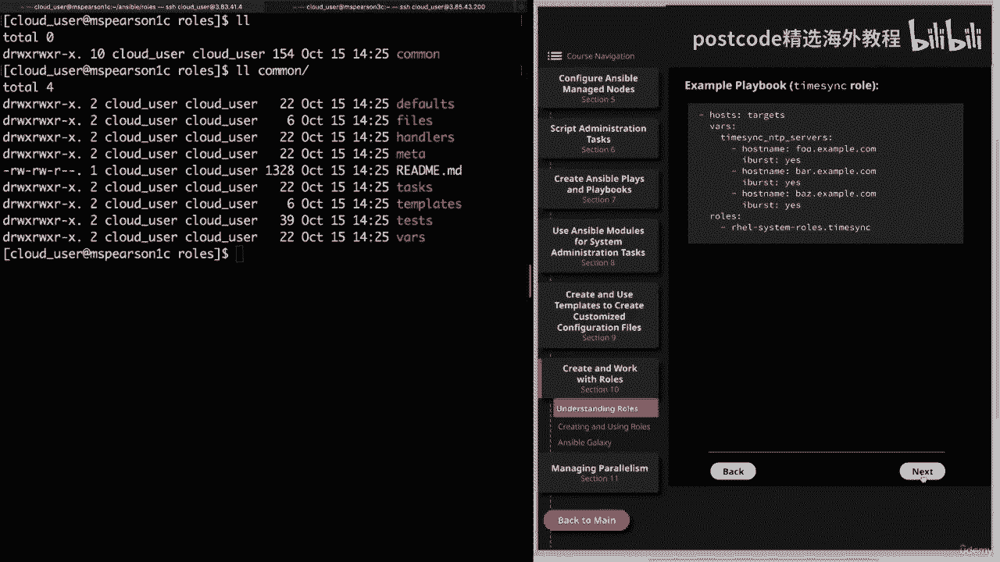
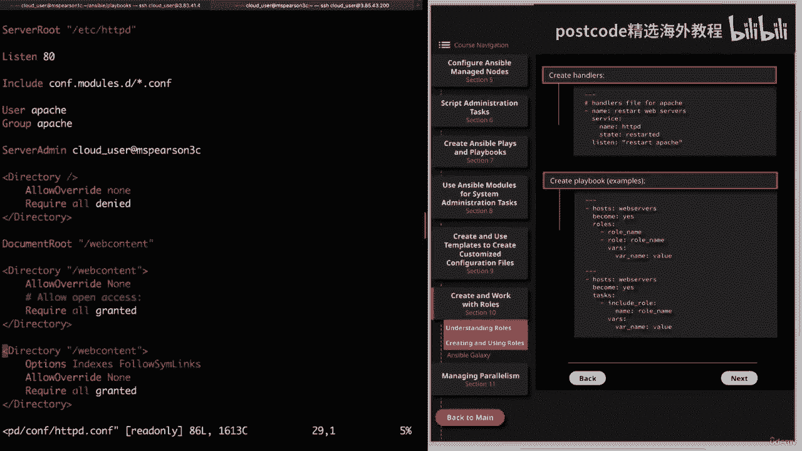
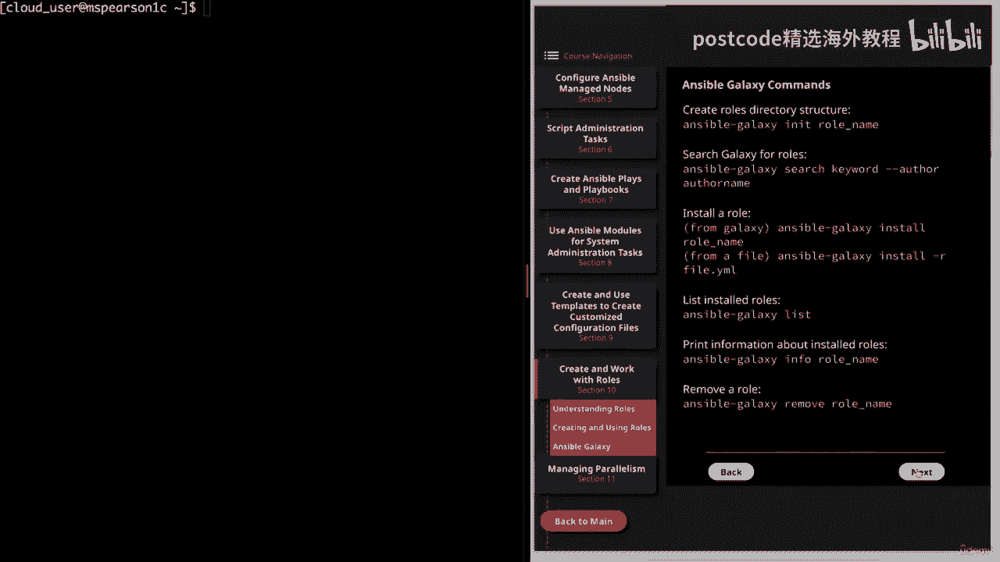
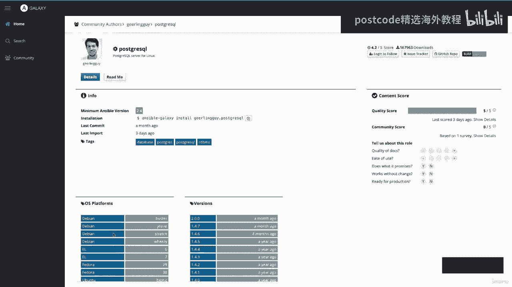
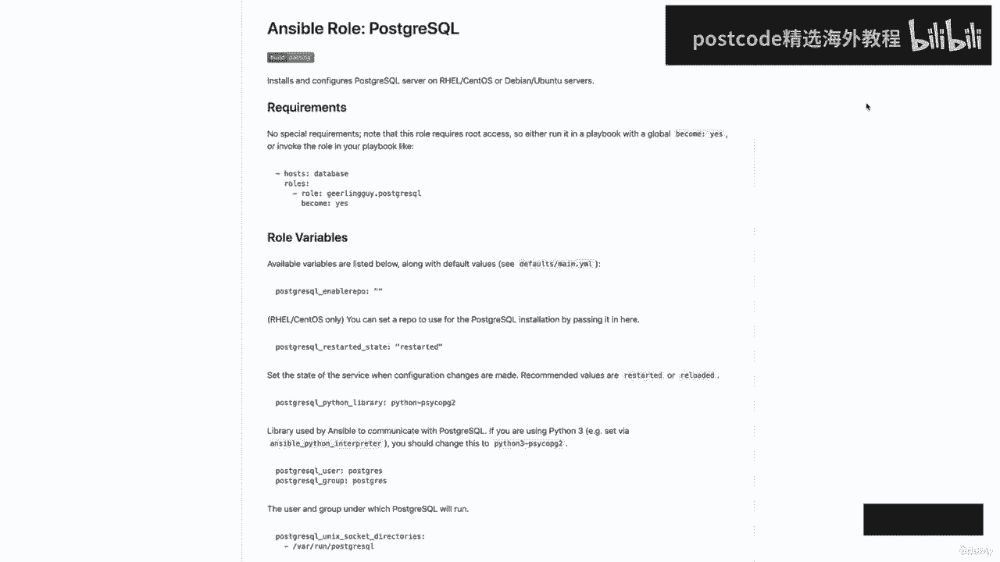
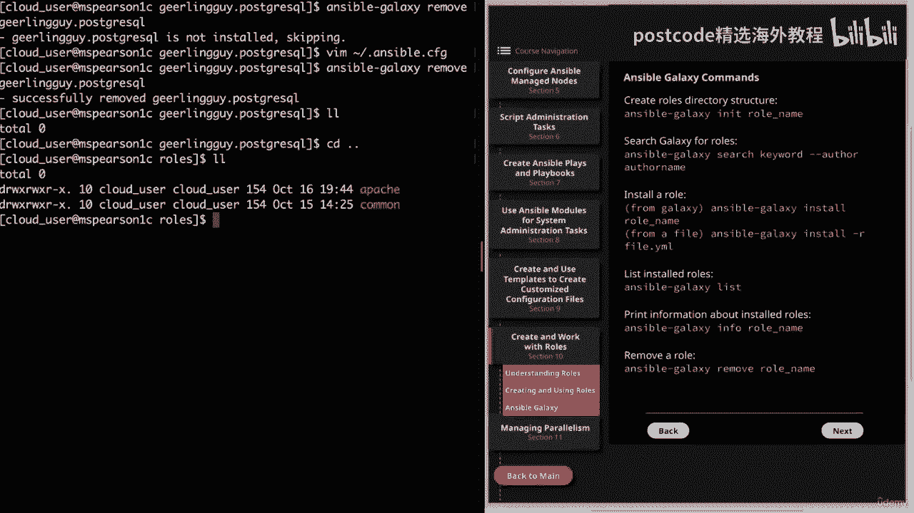

# Ansible 精通课程：03-03-008：Ansible Roles

在本节课中，我们将要学习 Ansible Roles 的核心概念、目录结构、创建方法以及如何从 Ansible Galaxy 社区获取和使用现成的角色。通过角色，我们可以将复杂的自动化任务模块化，提高代码的可重用性和可维护性。

## 理解角色

上一节我们介绍了 Ansible 的基本任务组织方式，本节中我们来看看如何通过角色（Roles）来更结构化地管理任务、变量和文件。

角色提供了一种基于已知文件结构自动加载变量文件、任务和处理程序的方法。这意味着 Ansible 期望角色遵循特定的目录结构。

角色的默认搜索路径是 `/etc/ansible/roles`。但与其他 Ansible 默认目录一样，我们可以通过配置文件更新这个路径。

例如，在我的 Ansible 配置文件（`~/.ansible.cfg`）中，我设置了以下参数：
```ini
roles_path = /etc/ansible/roles:/home/cloud-user/ansible/roles
```
这样，Ansible 就会在两个目录中搜索角色。

以下是角色预期的标准目录结构。需要注意的是，任何未使用的目录都可以被排除，不会影响角色的执行。
```
角色名/
├── defaults/
├── files/
├── handlers/
├── meta/
├── tasks/
├── templates/
├── vars/
```
每个被使用的目录都必须包含一个名为 `main.yml` 的主文件，该文件包含了该目录所需的核心内容。

## 角色目录详解

上一节我们了解了角色的基本结构，本节中我们来详细看看每个目录的具体作用和内容。

以下是各个角色目录及其功能的说明：

*   **tasks**：此目录包含角色要执行的主要任务列表。`main.yml` 是入口点，你可以使用 `import_tasks` 或 `include_tasks` 关键字来引入其他任务文件，这对于管理不同操作系统（如 Red Hat 的 `yum` 和 Debian 的 `apt`）特别有用。
*   **handlers**：此目录包含角色使用的处理程序。处理程序的规则（如仅在任务发生更改时被 `notify` 触发一次）同样适用于角色内定义的处理程序。
*   **defaults**：此目录包含角色的默认变量，用于在未提供其他值时设置变量的初始值。该目录中定义的变量拥有**最低的优先级**。
*   **vars**：此目录包含角色中使用的变量，其优先级**高于** `defaults` 目录。一个角色中定义的变量也可以被其他角色使用，因此建议为变量命名空间化（例如 `apache_log_file`， `mysql_log_file`）以避免冲突。
*   **files**：此目录包含可以通过此角色部署的静态文件。使用角色时，`copy`、`script` 等模块可以直接引用此目录中的文件名，而无需使用相对或绝对路径。
*   **templates**：此目录包含可以通过此角色部署的 Jinja2 模板。与 `files` 目录类似，`template` 模块可以直接引用这里的模板文件名。
*   **meta**：此目录用于定义角色的元数据，例如角色依赖关系。这允许你在使用一个角色时自动引入其他角色。默认情况下，依赖的角色只执行一次，除非传递了不同的参数，或者在依赖角色的 `meta/main.yml` 中设置了 `allow_duplicates: true`。

## 红帽企业 Linux (RHEL) 系统角色



除了创建自定义角色，Ansible 还提供了一系列由红帽维护的官方系统角色，用于管理 RHEL 系统。

以下是关于 RHEL 系统角色的几个要点：

*   这些角色由 `rhel-system-roles` 软件包提供，该包位于 `rhel-8-for-x86_64-appstream-rpms` 等存储库中。
*   它们需要安装在 **Ansible 控制节点**上，然后可用于管理和配置客户端节点。
*   支持的角色包括 `kernel_settings`、`network`、`selinux`、`timesync` 和 `postfix` 等。
*   官方文档位于 `/usr/share/doc/rhel-system-roles/` 目录下，每个子系统（如 `timesync`）都有独立的 `README.md` 文件，详细说明了使用方法和支持的参数。
*   安装后，这些角色位于 `/usr/share/ansible/roles/rhel-system-roles.<子系统名>` 路径下。

例如，使用 `timesync` 角色的 playbook 可能如下所示：
```yaml
- hosts: all
  vars:
    timesync_ntp_servers:
      - hostname: time.example.com
        iburst: yes
  roles:
    - rhel-system-roles.timesync
```

## 创建与使用自定义角色

上一节我们学习了系统角色，本节中我将演示如何从头创建自定义角色，并在 playbook 中使用它。

我将创建一个名为 `apache` 的角色，用于安装和配置 Apache HTTP 服务器。

首先，使用 `ansible-galaxy init` 命令创建角色的骨架目录结构：
```bash
ansible-galaxy init apache
```
此命令会在当前目录下创建 `apache` 目录及其所有子目录。

**1. 定义任务 (`tasks/main.yml`)**
以下是 `apache` 角色的主要任务：
```yaml
---
- name: Create web content directory
  file:
    path: "{{ apache_content_dir }}"
    state: directory
    mode: '0755'

- name: Set SELinux context on web content directory
  sefcontext:
    target: "{{ apache_content_dir }}(/.*)?"
    setype: httpd_sys_content_t
    state: present

- name: Restore SELinux context on web content directory
  command: restorecon -Rv "{{ apache_content_dir }}"

- name: Install Apache
  yum:
    name: httpd
    state: latest

- name: Deploy Apache configuration template
  template:
    src: httpd.conf.j2
    dest: /etc/httpd/conf/httpd.conf
    backup: yes
  notify: restart apache

- name: Deploy index.html template
  template:
    src: index.html.j2
    dest: "{{ apache_content_dir }}/index.html"

- name: Start and enable Apache service
  service:
    name: httpd
    state: started
    enabled: yes
```



**2. 设置默认变量 (`defaults/main.yml`)**
```yaml
---
apache_content_dir: /web-content
apache_http_port: 8080
apache_admin: cloud-user
```

**3. 创建模板 (`templates/`)**
*   `httpd.conf.j2`: 包含如 `Listen {{ apache_http_port }}` 和 `ServerAdmin {{ apache_admin }}` 的变量。
*   `index.html.j2`: 一个简单的 HTML 文件，可以使用 Ansible 收集的事实变量。

**4. 定义处理程序 (`handlers/main.yml`)**
```yaml
---
- name: restart apache
  service:
    name: httpd
    state: restarted
```

**5. 在 Playbook 中调用角色**
创建 playbook `role-play.yml`：
```yaml
---
- hosts: webservers
  become: yes
  roles:
    - apache
```
运行 playbook：
```bash
ansible-playbook role-play.yml
```
执行后，角色中的所有任务将被执行，包括安装软件、部署配置文件和模板、启动服务等。



**6. 覆盖默认变量**
你可以在 playbook 中直接定义变量来覆盖角色中的默认值：
```yaml
---
- hosts: webservers
  become: yes
  vars:
    apache_http_port: 80
  roles:
    - apache
```
再次运行 playbook，Apache 的监听端口将被更新为 80。

## Ansible Galaxy




上一节我们手动创建了角色，本节中我们来看看如何利用 Ansible Galaxy 社区来获取和共享角色。



Ansible Galaxy 是一个由社区开发的大型公共角色存储库。你可以从中下载他人创建的角色，而不是每次都从头开始，从而避免“重复造轮子”。

`ansible-galaxy` 命令行工具是我们与 Galaxy 交互的主要方式，它提供了多个子命令。

以下是 `ansible-galaxy` 的一些常用子命令：

*   `init`：初始化一个新的角色目录结构（我们之前已使用过）。
*   `search`：在 Galaxy 中搜索角色。例如：`ansible-galaxy search postgresql`。
*   `install`：安装角色到控制节点。可以指定角色名（如 `geerlingguy.postgresql`）或本地 tar 文件。
*   `list`：列出所有已安装的角色。
*   `info`：显示已安装角色的详细信息。
*   `remove`：删除已安装的角色。

例如，要安装一个流行的 PostgreSQL 角色，可以执行：
```bash
ansible-galaxy install geerlingguy.postgresql
```
安装后，角色会出现在配置的 `roles_path` 中（例如 `/home/cloud-user/ansible/roles/geerlingguy.postgresql`）。务必阅读角色目录中的 `README.md` 文件以了解其用法和配置选项。

## 总结



本节课中我们一起学习了 Ansible Roles 的核心知识。我们了解了角色的目录结构及其每个部分（tasks, handlers, vars, defaults, files, templates, meta）的作用。我们实践了如何从零开始创建和测试一个自定义的 Apache 角色，并学习了如何在 playbook 中调用和覆盖其变量。最后，我们介绍了 Ansible Galaxy 社区，以及如何使用 `ansible-galaxy` 工具来搜索、安装和管理社区贡献的角色，这能极大地提升我们的自动化效率。掌握角色是将 Ansible 代码模块化、专业化的关键一步。