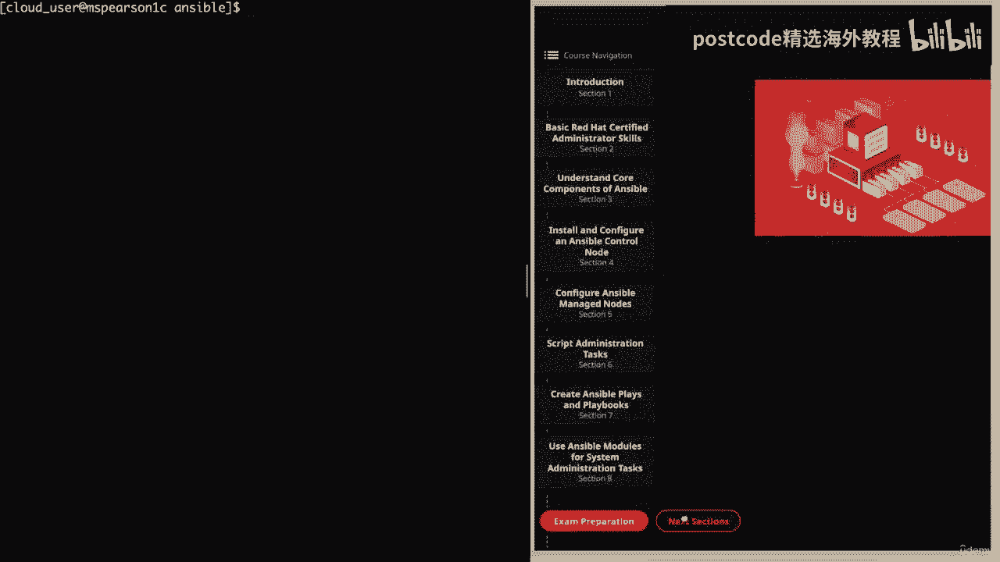
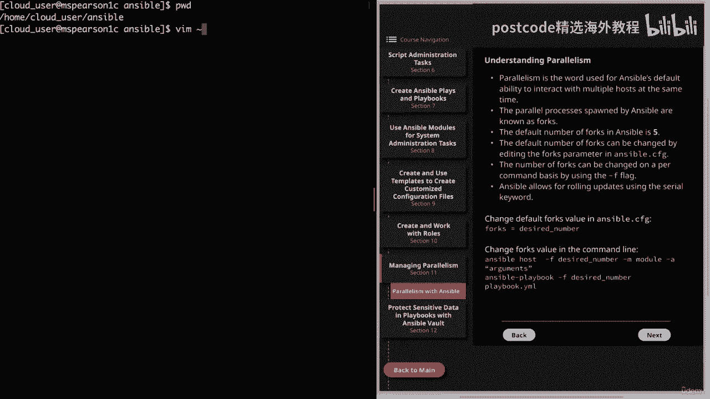
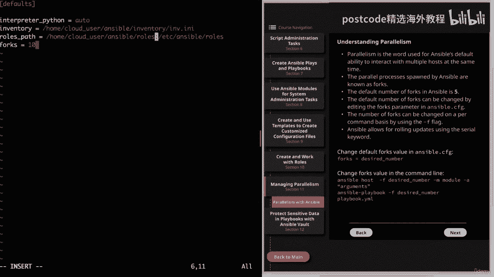
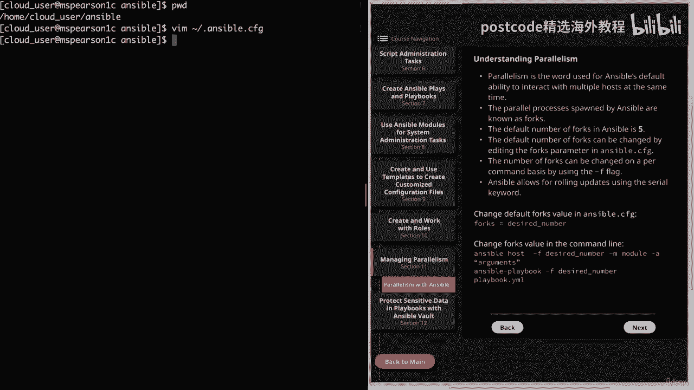
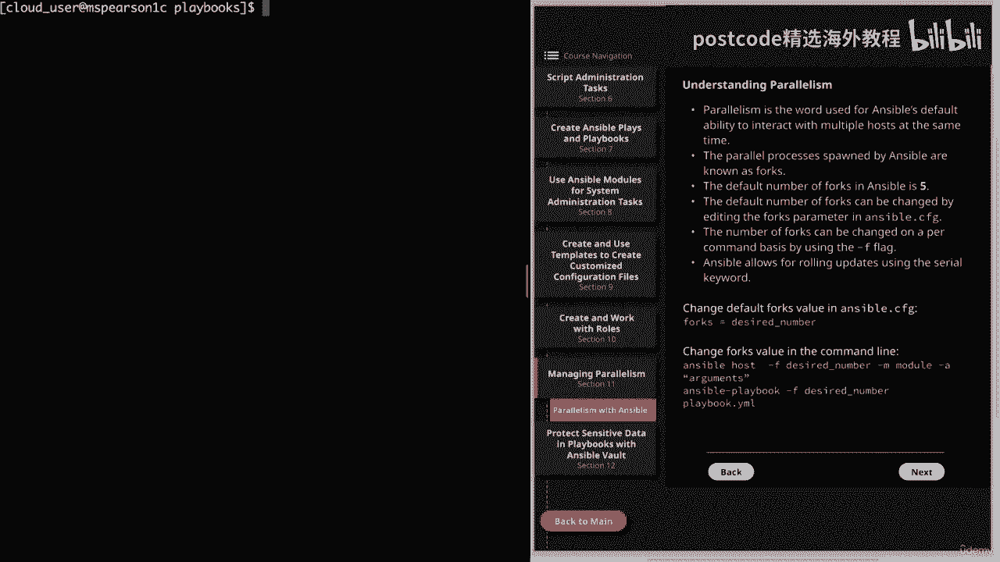
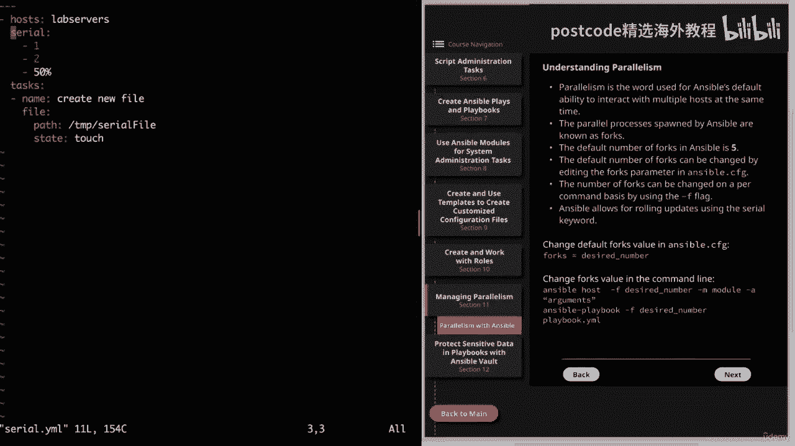
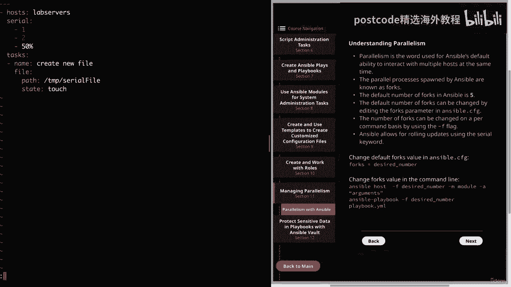
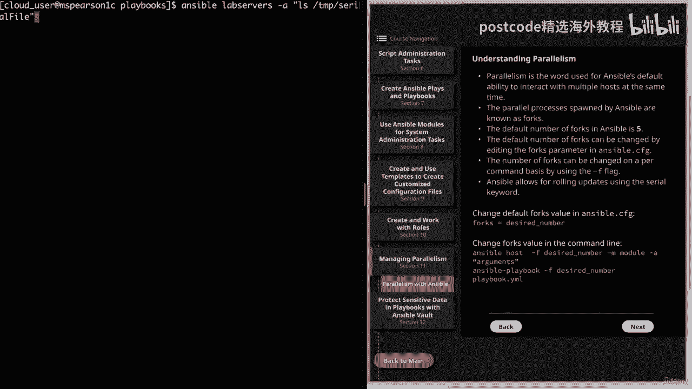
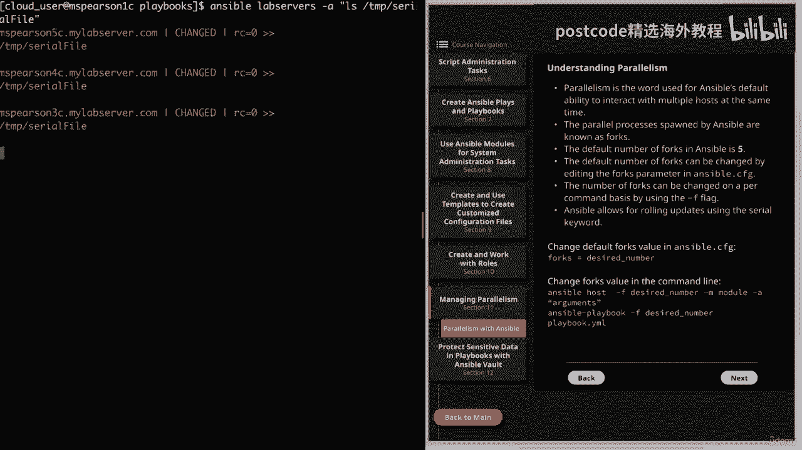
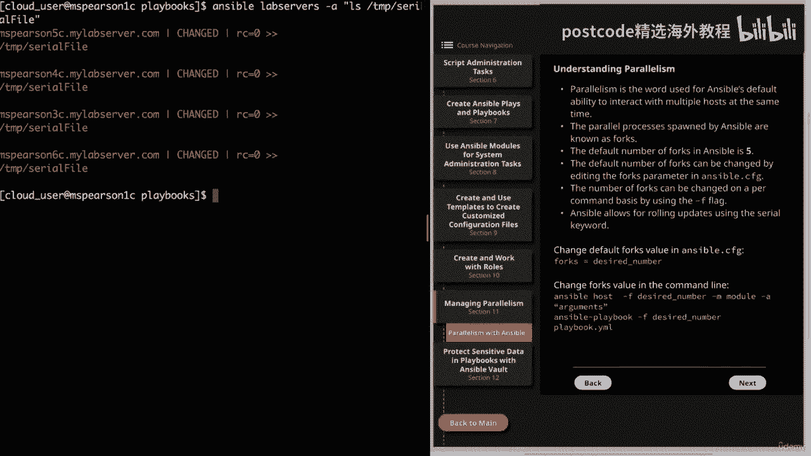

# 红帽企业Linux RHEL 9精通课程 — RHCSA与RHCE 2023认证全指南 - P22：03-03-009 Ansible jobs parallelism - 精选海外教程postcode - BV1j64y1j7Zg

视频。我们将讨论管理并行性和 Ansible。因此，让我们转到图表，单击下一部分，然后单击第 11 部分。

这将带我们进入有关 Ansible 并行性的主题。因此，并行性一词用于表示 Ansel 同时与多个主机交互的默认能力，时间。这不仅适用于 Ansible，也适用于任何能够生成多个进程的软件类型。

以便协同执行任务。因此，当我们谈论 Ansible 中的并行性时，Ansible 就是生成多个进程的能力，与主机交互和管理主机时。正如您可以想象的那样，主机组越大，这种能力就变得越来越重要。

你所反对的是。因此，Ansible 不会一次针对单个主机执行，而是为每个主机生成一个进程，正在执行的主机。当然，这将取决于您定义的配置，但我们将详细讨论，只需一分钟。

所以 Ansible 产生的这些并行进程被称为 Forks，默认的 fork 数量，在 Ansible 中将设置为 5。这是为并行执行定义的一个非常保守的数字，但是这个数字越大，变得越多。

控制节点上使用的资源就越多。因此，如果您正在针对大量受管节点执行并且您有一个相当强大的控制节点，如果资源很多，您可以将其增加到 50 或 100 左右。但同样，这将取决于控制节点上拥有的资源量。

可以通过编辑 Forks 参数和 Ansible cfg 文件来更改默认的分叉数量，这将影响此后的每个后续 Ansible 执行。此外，您可以使用破折号标志更改每个命令的分叉数量，这是一个。

运行 ad hoc 或 Ansible 的 Ansible 命令时可用的命令行选项，用于执行 playbook 的 Playbook 命令。因此，通过这种方式，您可以将默认设置设置为更高或更低的值。

但这取决于组，您正在执行的操作，您可以更改此设置。另一件要记住的事情是，即使你将分叉增加到 50，但你正在执行，假设有 10 个，主机 Ansible 只会生成 10 个进程，无论默认值如何。

那已经通过了。现在假设您有 100 个主机，并且分叉值设置为 50。然后 Ansible 将一次针对 50 个主机执行，除了增加 Forks 值之外，Ansible 还允许使用串行关键字进行滚动更新。

因此，这使您能够在每个剧本的基础上指定要执行的主机数量，反对一次。它还将使您能够通过提供不断增加的，列表。稍后我将展示一个例子。接下来，我提供了一个示例。

说明如何更新 ansible cfg 中的默认 forks 值。那么让我们转到命令行，我会很快地向您展示这一点。所以我们目前在家庭云用户 Ansible 中。

我们将编辑我的主目录中的 ansible cfg。

这样 Ansible cfg。我们看到当前正在定义三个参数。那么让我们继续添加另一个。我们需要做的就是添加叉子，然后添加等于，然后添加我们想要设置的所需数字，默认分叉值为。所以目前它设置为五个。因此。

让我们继续将其增加到十。

所以现在每当我执行剧本时，Ansible 都会尝试针对十个主机运行它，一次。需要记住的一件事是，您始终可以使用 ansible 配置检查 forks 值，命令。好的。接下来提供了一个示例。

说明如何在命令行中更改 forks 值。第一个示例只是用于临时命令的 Ansible 命令，然后是 Ansible 剧本，用于运行 playbook 的命令。在这些示例中。

您可以以与覆盖默认分叉值相同的方式覆盖默认分叉值，任何其他默认的 ansible 配置。为此，我们将使用 F 选项。不幸的是，由于我们的实验室环境只有少数主机与之关联，因此我们无法，确实演示了这一点。

但我可以向您展示一个使用serial关键字的示例。

那么让我们转到我们的剧本目录。因此，让我们继续打开我为此示例创建的名为串行 YAML 的剧本。

正如您所看到的，我们正在针对实验室服务器组执行此操作，然后我们将指定，Serial 关键字，然后我们将指定一个列表，以便我们可以慢慢增加数量。

并行进程或我们正在执行的主机。因此，我们将从一台主机开始，然后转向两台主机。然后我添加了 50% 只是为了向您展示这是一个选项。所以这将是 50% 的主机。所以你不仅可以做数字，还可以做百分比。

然后我将指定我想要运行的任务。对于这个例子，我将在我们的主机上创建一个新文件。如果我们只想指定一次要执行的多个主机，我们可以这样做。但我确实想向您展示该列表的示例，只是为了让您知道这是一个选项。因此。

如果您正在针对一堆不同的主机执行操作，也许您只想尝试将其推出，一开始只有几个，然后实际上加快部署速度，以防出现错误。好的。让我们继续前进并退出这个话题。

然后我们就可以开始我们的剧本了。我会继续加快速度，这样您就不必等待。好的。现在已经完成了，让我们向上滚动到顶部，我们可以了解这里发生的情况。所以如果你注意到的话。

我们的比赛最初只针对 MZ Pearson 3 C。这是因为我们首先指定它针对其中一台主机运行，然后它将执行，我们的任务是创建一个新文件。然后它会增加对抗两个主机，这将是 MZ Pearson。

五个 C 和四个 C，它将在这两个文件上创建我们的新文件。最后，我们指定它针对 50% 的主机运行。但正如你所看到的，我们只剩下一台主机，所以它只是针对 GM 执行。皮尔逊，60 岁。

如果我们想验证这一点，我们总是可以运行 Ansible。实验室服务器。然后我们要对临时文件和串行文件进行 LZ 处理。

我也会继续加快速度。

我们看到所有文件都已成功创建。好了，关于管理并行性和 Ansible 的视频就到此结束了。

