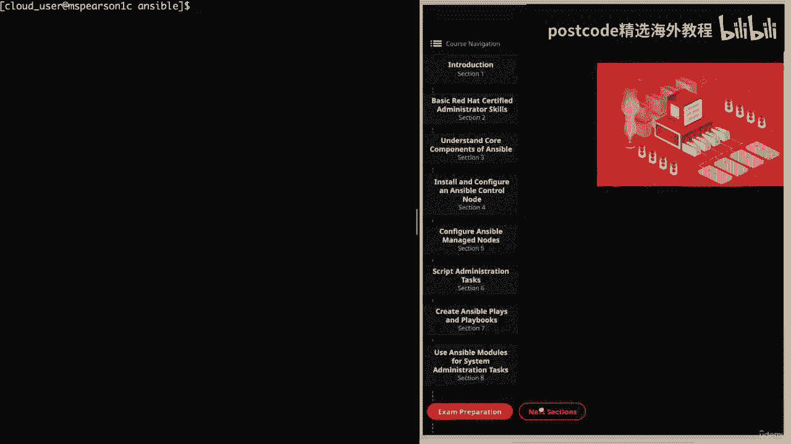
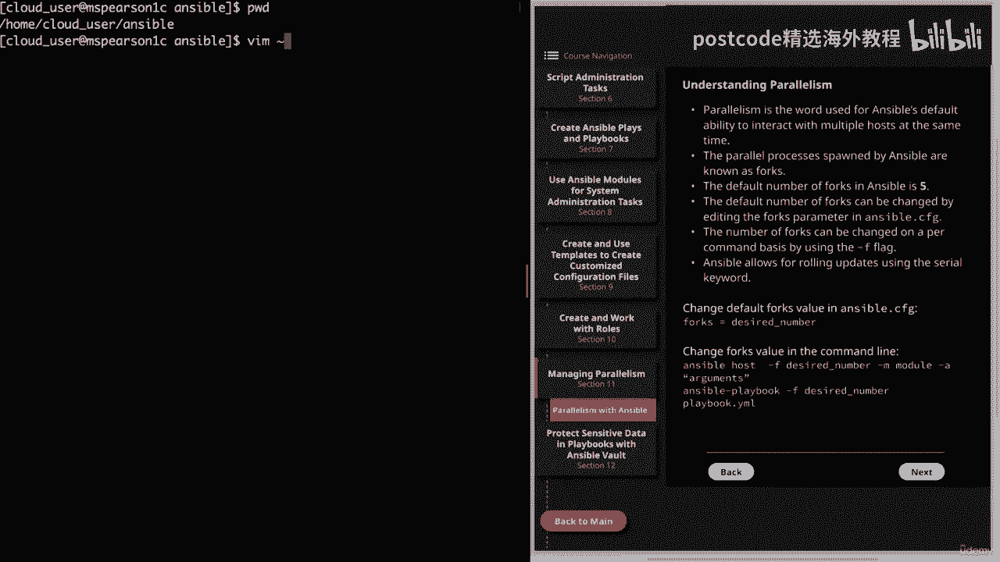
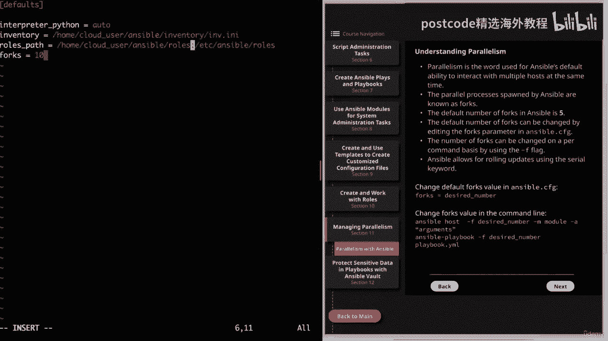
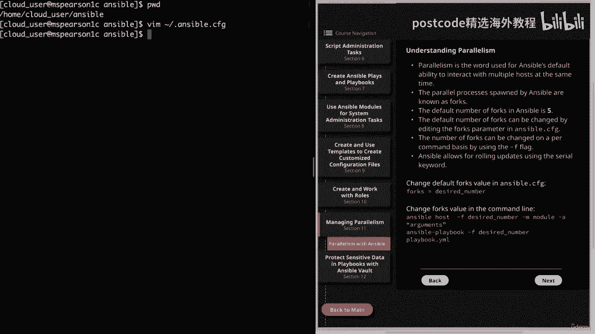
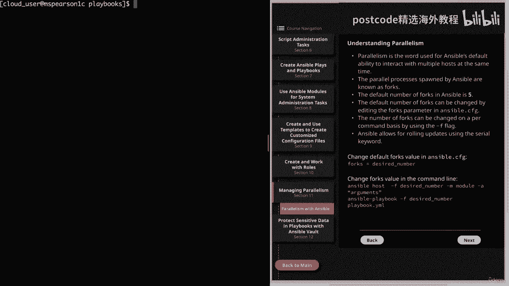
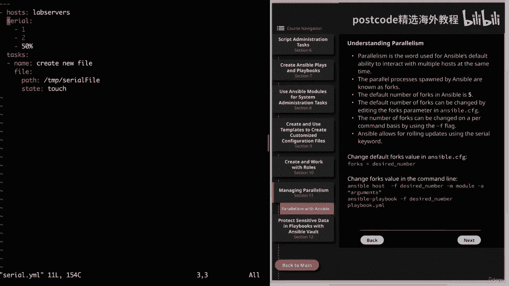
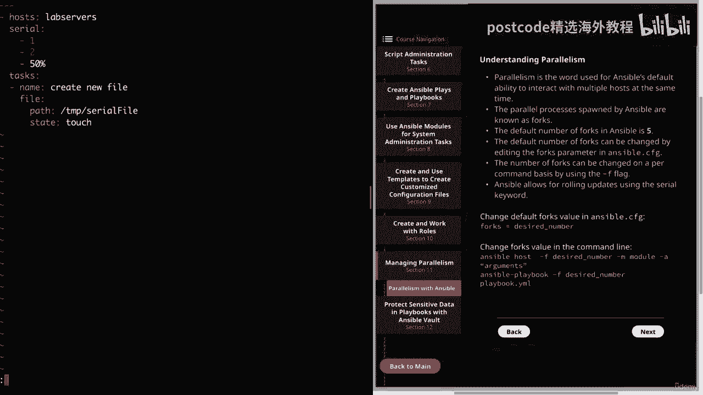
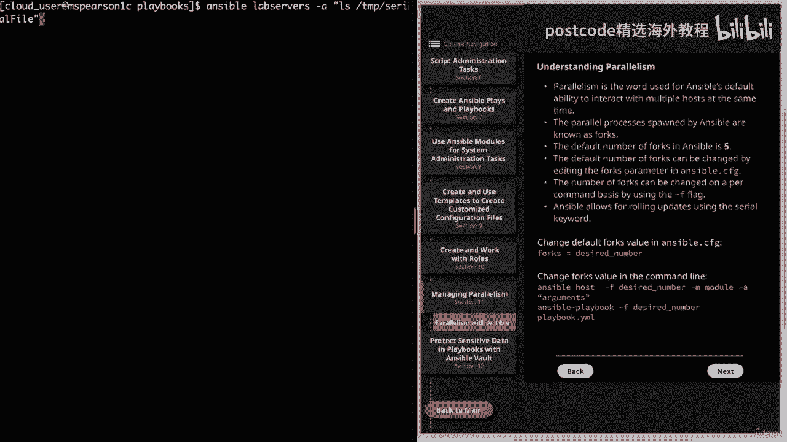
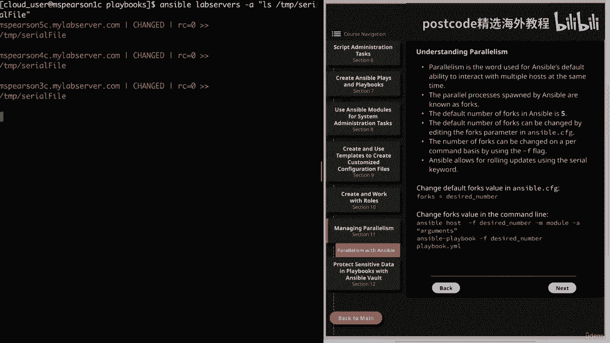
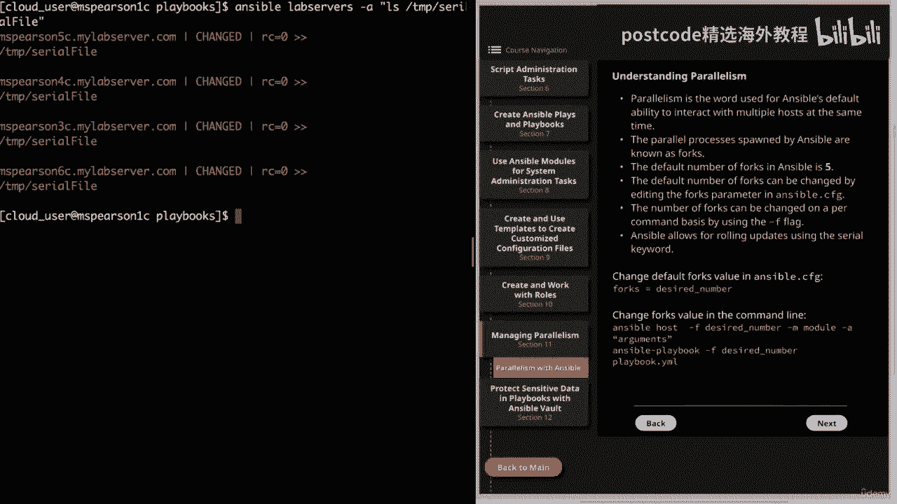

# 红帽企业Linux RHEL 9精通课程：P22：03-03-009 Ansible任务并行性 🚀



在本节课中，我们将要学习Ansible中的并行执行概念。我们将探讨Ansible如何同时管理多个主机，以及如何通过配置来控制和优化这种并行行为，这对于管理大规模主机环境至关重要。

---

## 理解Ansible并行性

上一节我们介绍了Ansible的基础，本节中我们来看看其核心能力之一：并行执行。

并行性指的是Ansible能够同时与多个主机进行交互。这种能力并非Ansible独有，任何能够生成多个进程以协同工作的软件都具备。在Ansible中，这意味着它可以生成多个进程来同时管理和配置不同的主机。

可以想象，当需要管理的主机组规模越大时，这种并行能力就越发重要。Ansible默认不会一次只针对一台主机执行任务，而是会为正在执行的每一台主机生成一个独立的进程。当然，具体的并行行为取决于您的配置。

---

## 理解Forks（分叉）

Ansible生成的这些并行进程被称为 **Forks**。

默认情况下，Ansible中设置的fork数量为 **5**。这是一个为并行执行定义的、相对保守的数字。这个数字越大，Ansible能同时管理的主机就越多，但控制节点上消耗的CPU和内存资源也会相应增加。

因此，如果您需要管理大量受管节点，并且控制节点资源充足（例如性能强大），您可以将此值增加到50或100。反之，则需要根据控制节点的实际资源情况来调整。

---



## 配置并行性

### 方法一：修改配置文件



可以通过编辑Ansible配置文件（`ansible.cfg`）中的 `forks` 参数来更改默认的fork数量。此修改将影响此后所有后续的Ansible执行。

以下是修改 `ansible.cfg` 文件的示例：
```ini
[defaults]
forks = 10
```
将 `forks` 值从默认的5改为10后，Ansible在执行playbook时会尝试一次针对10台主机运行。

您始终可以使用 `ansible-config` 命令来检查当前的forks值：
```bash
ansible-config dump | grep forks
```

### 方法二：命令行覆盖



您也可以在运行单个命令时，临时覆盖默认的fork数量。这对于ad-hoc命令或执行playbook都适用。



以下是相关命令行选项的示例：
*   运行ad-hoc命令：`ansible all -m ping -f 20`
*   运行playbook：`ansible-playbook site.yml -f 20`



在这些命令中，`-f` 选项用于指定本次执行使用的fork数量。

**需要注意**：即使您将fork值设置为50，但如果目标主机组只有10台主机，Ansible也只会生成10个进程。Fork值定义的是**并行上限**。

---

## 使用Serial关键字进行滚动更新



除了增加`forks`值，Ansible还提供了更精细的控制方式：**`serial`** 关键字。它允许您在playbook级别指定一次执行的主机数量，非常适合进行滚动更新，以降低大规模变更的风险。

`serial` 关键字可以接受一个数字，也可以接受一个百分比，甚至可以是一个列表，以实现分批次、逐步增加并行度的更新策略。

以下是一个使用 `serial` 关键字的playbook示例：
```yaml
---
- name: 滚动更新示例
  hosts: lab_servers
  serial:
    - 1
    - 2
    - 50%
  tasks:
    - name: 创建一个新文件
      ansible.builtin.file:
        path: /tmp/serial_test_file
        state: touch
```
在这个例子中：
1.  **第一轮**：针对1台主机执行任务。
2.  **第二轮**：针对2台主机执行任务。
3.  **第三轮**：针对剩余主机的50%执行任务。

这种策略允许您先在小范围主机上测试变更，确认无误后再逐步扩大范围，非常适合生产环境的谨慎更新。



---



## 总结



本节课中我们一起学习了Ansible并行执行的核心概念。我们了解到Ansible通过 **Forks** 机制实现并行，默认同时管理5台主机，并可以通过修改 `ansible.cfg` 文件或使用 `-f` 命令行选项来调整这个数量。更重要的是，我们学习了如何使用 **`serial`** 关键字在playbook中实施精细的滚动更新策略，从而在提高效率与控制风险之间取得平衡。合理配置并行性是高效管理大型Ansible环境的关键技能。