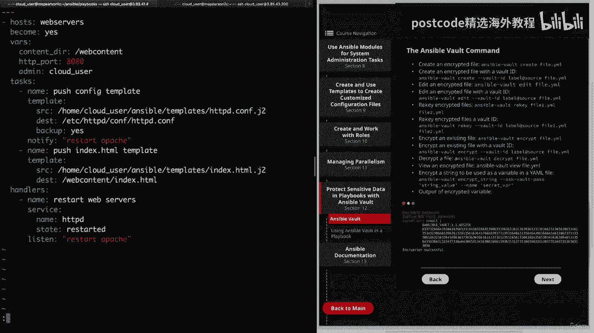

# 红帽企业Linux RHEL 9精通课程 — RHCSA与RHCE 2023认证全指南 - P23：03-03-010 Ansible vault - 精选海外教程postcode - BV1j64y1j7Zg

视频。我们将讨论如何保护 Ansible 中的信息。为此，我们将使用 Ansible Vault。让我们看一下图表，然后进入下一页，然后进入第 12 节。

因此，在本视频中，我们将讨论一些有关 Ansible Vault 的内容，更具体地说，Ansible Vault 命令。然后在下一个视频中，我们将介绍如何在我们的剧本中使用它以确保安全，我们的信息。

首先，它可以用于加密 Ansible 使用的任何结构化数据文件。其中一些示例是位于组 VAR 和主机 var 目录中的变量文件。由 include vars 和 VARs 文件、剧本中的关键字以及。

使用破折号选项在命令行上传递的变量文件，然后是变量的名称，文件。这些只是您可以加密的一些文件类型的几个示例。但请记住，使用 Ansible Vault，您可以加密任何任意数据文件，并且。

当涉及到保护 Ansible 安装中的敏感信息时，这非常有帮助。接下来，可以使用 Ansible Vault Key 命令更新加密文件的密码。因此，如果您需要更新密码或需要轮流更新密码，您可以。

可以使用 Ansible Vault Key 来完成此操作。此外，除了加密整个文件外，您还可以加密文件中的单个变量，使用感叹号Vault标签的YAML文件。但请记住，当您加密这些单独的级别变量时。

密钥命令不起作用，在您的 YAML 文件中。因此，为了更新该密码，您只需对该变量重新加密即可。但是，如果您有在变量中定义的敏感信息并且该信息非常有用，这样您就不必加密整个文件。最后。

您可以使用保管库 ID 来支持多个保管库密码。这是通过使用用于区分各个密码的标签来完成的。因此，一个示例是使用保管库 ID 标志，然后指定您的标签。这可能是产品、开发或测试之类的东西，然后是源代码。

这要么是，是密码、文件或提示的路径，以提示您输入密码。

好的。那么让我们转到下一页。我们将讨论一下 Ansible Vault 命令。再说一次，我将在下一个视频中对此进行演示，但我想继续，并查看 Ansible Vault 命令的一些不同子命令。

并在此处提供它们，以便您可以参考它们。因此，首先您可以使用 Ansible Vault 创建一个加密文件，然后创建文件名。这也可以使用保管库 ID 来完成。因此，在这种情况下。

您只需传递保管库 ID 标志，然后传递标签和来源，密码，然后要编辑加密文件，您将使用名称中的 edit 子命令，你的文件。同样，如果您想重新加密您的加密文件，也可以使用保管库 ID 来完成此操作。

要更新该密码，您可以使用 Ansible Vault Key，然后使用一个或多个文件的名称。我还提供了使用保管库 ID 重新加密的示例。然后，除了创建加密文件之外，您还可以加密现有文件，为此。

您将使用 Ansible Vault 加密。这也可以通过 Vault ID 来完成。接下来您可以使用 Ansible Vault Decrypt 解密文件。因此。

如果您已经加密了一个您认为不再需要加密的文件，则可以将其解密，然后您可以像与任何其他普通 YAML 文件一样与它进行交互。如果您想查看加密文件的内容，可以使用 view 子命令。最后。

如果您想加密用作变量的字符串，则任何 YAML 文件和此，是个体变量级加密。您需要做的就是指定 encrypt string 子命令，然后您需要指定 AskVault，经过。因此。

它将提示您输入该特定变量的保管库密码，然后您就可以，输入字符串的值。所以这将是变量的实际值。然后是破折号、破折号名称，然后是变量的名称。然后在页面底部，我提供了该命令的输出。

让我在命令行中向您展示一个示例，而不是详细介绍这一点。因此，让我们继续前往 Ansible，然后转到我们的 playbooks 目录。我将打开 Apache 模板剧本，这是我们之前使用过的剧本。

如果您还记得，我们在 vase 关键字下定义了三个变量，我们有内容亲爱的 http，端口和管理。因此，让我们继续加密 HTTP 端口变量。这样。

查看我们的 playbook 的普通用户就不会知道我们为 Apache 指定的端口。

服务器。所以我要退出这个。

为了创建这个加密变量，我们将使用 Ansible Vault 命令。然后我们将传递我们的子命令，即加密、下划线字符串。话又说回来，我们需要指定。问沃尔特。经过。这样它就会提示我们输入这个特定变量的密码。

然后我们将指定变量的值，即 80， 80。然后我们需要给出名称，并将其保留为 HTTP 下划线端口。好的。让我们继续并按 Enter 键。然后它会要求我们输入新的保管库密码。因此。

您可以继续在这里输入您想要的任何内容。

然后我们要确认密码。然后它将准确打印出我们需要添加到剧本中的内容。所以你看，我们有 HTTP 端口变量，然后是保管库标签，后面是加密字符串。所以让我们继续复制所有这些。

然后我们可以打开 Apache 模板剧本。我要继续删除这一行。

添加另一个，然后粘贴我们的加密变量。现在我们已经隐藏了变量的值。每次我们去运行我们的剧本时，它都会要求我们输入我们设置的密码，我们在创建它时提供的。好的。让我们继续保存并退出。现在我们可以转到下一页。

然后我们将讨论提供卷密码的方式。首先，您可以使用存储在文本文件中的密码。为此，您只需指定命令 ansible playbook，然后指定标志库、密码文件。然后您将提供密码文件的路径，当然还有您的名称。

剧本。因此，它不会提示您输入密码，而只会使用您提供的密码，在该密码文件中。这也可以使用保管库 ID 来完成。同样，我们将指定保管库 ID 标志，然后指定标签的名称。然后我们只需要指定密码文件的路径。

接下来，系统可能会提示您输入密码，为此您只需使用询问保管库通行证即可。这也可以使用保管库 ID 来完成。因此，我们不指定密码文件，而是指定标签，然后指定关键字，提示，这将提示我们输入密码。最后。

您还可以使用多个密码，这可以通过保管库 ID 来支持。为此，您实际上需要指定多个保管库 ID 标志。在这个例子中，我们使用标签一，然后使用从文件中读取的密码，然后我们。

使用标签二并指定提示以便提示输入密码。因此，将首先尝试标签一个密码，然后我们将跟随标签进行提示。好了，关于 Ansible Vault 的视频就到此结束了。现在我们已经对命令和一些概念有了一点了解。

我们将继续，在下一课的剧本中继续使用 Ansible Vault。因此，让我们继续将其标记为完成。

在本视频中，我们将演示如何使用 Ansible Vault，为了保护我们的剧本。因此，让我们继续单击下一部分，然后单击第 12 部分，最后单击使用 Ansible Vault。

和一本剧本。在此页面上，我刚刚提供了一些我们将要执行的命令，如下所示，我们进行演示。但我想做的第一件事是向您展示我们将要使用的剧本。这将是我们以前使用过的一种。这是变量 YAML。在本剧本中。

我们将使用我们引用的名为 Users HTML 的变量文件，使用我们的 VAR 下划线文件的关键字。然后我们将循环该变量文件以创建一些用户。让我们继续前进并退出这个话题。好的。

现在让我们转到 VAR 目录。我们将看到我们的变量文件用户死亡，梅尔。所以让我们继续快速地打开它。我们看到我们只是定义了两个变量学生和教师，然后有一个列表，其下方的用户。对于此示例。

我们可以使用 Ansible Create 创建一个新的变量文件。但由于我们已经创建了这个变量文件，所以让我们继续使用 Ansible 对其进行加密，脚本命令中的库。因此。

它将是 Ansible Vault，然后加密，然后是用户 HTML 文件的名称。现在它会要求我们提供新的保管库密码。我只想使用密码。好密码。这样我们就加密了我们的文件。因此。

让我们看看如果我们现在尝试使用它们进行编辑会发生什么。正如您所看到的，我们不是能够看到我们的变量和用户列表，而是受到欢迎，用这个加密字符串。所以让我们继续前进并退出这个话题。

假设我们需要更新变量文件并向其中添加几个新用户。好吧，我们可以在加密文件之前完成此操作，但现在它已加密，我们需要，使用 Ansible Vault 编辑命令来编辑我们的文件。让我们继续澄清这一点。

我们将使用 Ansible Vault，编辑文件的名称。它会询问我们的保管库密码，这是一个很好的密码。我们看到我们被使用文本编辑器扔进了文件中。它实际上将默认为 VI。

现在让我们继续更新学生变量并添加更多学生。首先我们要添加杰西。然后我们可以添加尖叫声。好的。因此，让我们继续保存并退出。现在我们已经编辑了文件，让我们继续尝试运行我们的剧本。

这将是 Ansible 剧本。这是剧本里的。它被称为变量发电机。我们看到我们遇到了一个错误，指出正在尝试解密，但没有保管库机密，成立。那是因为它将尝试解密我们的变量文件。

但我们没有为 Ansible Playbook 命令提供密码。现在让我们再次运行剧本。但这次我们将使用“询问 Vault Pass”选项，该选项将提示我们输入密码。所以 Ansible 剧本。

然后我们有 dash dash 询问金库通行证。然后是我们的剧本之路。好的。让我们继续并按 Enter 键。然后它会提示我们输入保管库密码。所以我们将再次输入正确的密码。

你会看到它立即开始收集事实并启动我们的剧本。由于本剧本可能需要一些时间才能运行，因此我将继续为您加快速度。

所以你不必等待。好的。现在一切都已经完成了，让我们前往 MZ Pearson 吧。然后我们可以通过cat etsy传递wd。我们看到所有用户都已添加，包括 Jessy 和 Screech，我们在我们的。

变量文件。现在让我们回到控制节点。我想向您展示如何在文件中存储密码。这样您就可以只提供密码文件的位置，而不必提示。因此，让我们继续在我们的病毒目录中创建它。我将称之为我的通行证。

现在我们需要做的就是提供密码文本。请记住，这是一个好的密码，实际上这不是一个好的密码，但考虑到这一点，没关系，这不是生产环境。现在让我们继续保存并退出。在运行此操作之前，让我们继续更新我们的剧本。

以便它将删除我们的用户。同样，它位于我们的 playbooks 目录变量中。现在我们要删除存在的状态并添加不存在的状态。然后我们还要添加删除，我们将其设置为 yes。

因此它会删除与我们的用户关联的所有目录。继续保存并退出。现在我们可以运行我们的剧本了。这将是 Ansible 剧本。这次我将指定保管库、密码、文件、标志。所以这是金库。密码文件。然后就是我们堕落的道路。

因此，既然我们在 VAR 目录中，我就可以先说我的传球，然后说我们的战术手册。这是变量 yaml。我们看到甚至没有提示我们输入密码，而是只是从我们的密码中读取密码，文件。所以现在我将继续加快速度。

这样您就不必等待。

好吧，现在让我们前往 MZ Pearson 吧。我们可以在过去的床上放另一只猫。我们看到所有用户都已被删除。那么让我们回到我们的控制节点。最后还有关于密码文件的一点说明。请记住。

您应该尽力保护密码免受其他用户的侵害，在系统上。但同样，考虑到这是一个实验室环境，这并不是什么大问题。好的。所以让我们继续解决这个问题。我想向您展示如何更改加密文件的密码。这称为重新键入。

那么让我们继续接收用户的 HTML。为此，我们将使用 Ansible Vault。然后是雷基。然后是我们文件的名称。所以它会提示我们输入当前的密码，这就是所谓的好密码。然后它会提示我们输入新密码。

我只想说最好的密码。只要您正确输入密码，您就会看到 Ricky 成功。因此，每当您需要与此特定文件进行交互时，它都会要求您提供新密码。好的。现在我想向您展示的最后一件事是如何解密加密文件。

这是使用 Ansible Vault Decrypt 完成的。那么让我们继续在我们的变量文件上运行它。所以ansibleVault解密然后用户点html。他们将输入我们的密码。最好的密码。

我们看到解密成功了。现在让我们看看当我们尝试使用它们进行编辑时会发生什么。我们看到我们不再受到加密纹理的欢迎，并且我们能够与文件交互，就好像它是任何其他普通文件一样。好了。

关于在 Playbooks 中使用 Ansible Vault 的视频就到此结束了。

