# 红帽企业Linux RHEL 9精通课程：P23：03-03-010 Ansible Vault 🔐

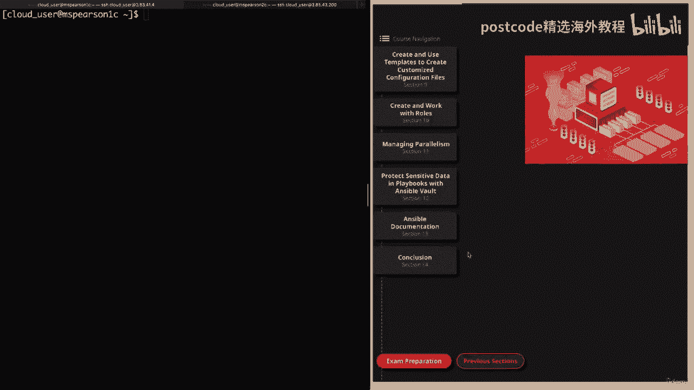

在本节课中，我们将学习如何使用 Ansible Vault 来保护 Ansible 中的敏感信息。我们将了解其核心概念、常用命令，并通过实际演示学习如何在剧本中应用它。

## 概述 📖

Ansible Vault 是 Ansible 的一个功能，用于加密任何结构化数据文件，从而保护剧本、变量文件等中的敏感信息。本节将介绍其基本用法和命令。

## Ansible Vault 简介

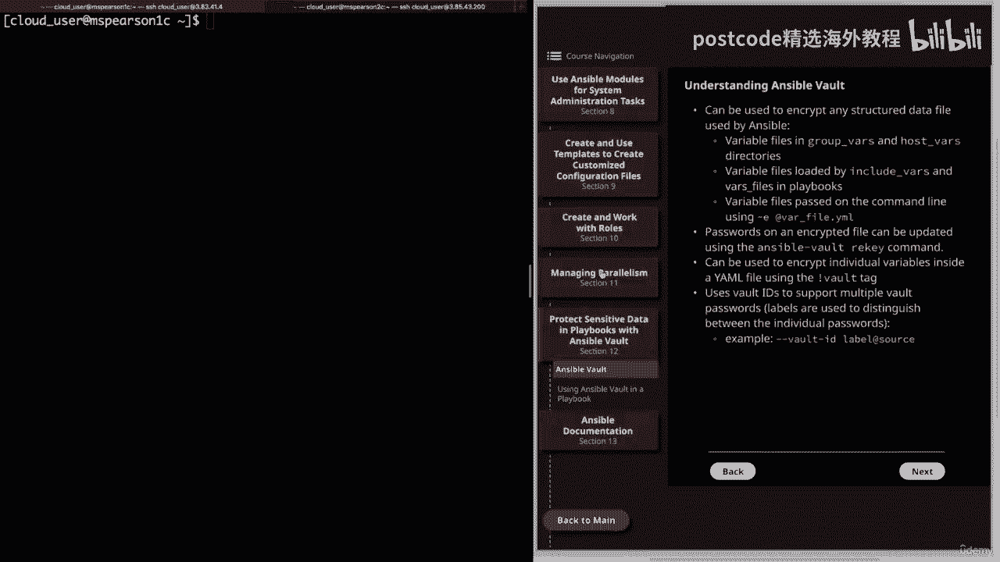

上一节我们介绍了 Ansible 的基础知识，本节中我们来看看如何保护其中的敏感数据。Ansible Vault 可以加密 Ansible 使用的任何结构化数据文件。

以下是它可以加密的一些文件类型示例：
*   位于 `group_vars` 和 `host_vars` 目录中的变量文件。
*   由 `include_vars` 和 `vars_files` 关键字引用的变量文件。
*   使用 `-e` 或 `--extra-vars` 选项在命令行上传递的变量文件。

使用 Ansible Vault 可以加密任何数据文件，这对于保护敏感信息非常有帮助。

## Ansible Vault 核心功能

了解了其用途后，我们来看看 Ansible Vault 的几个核心功能。

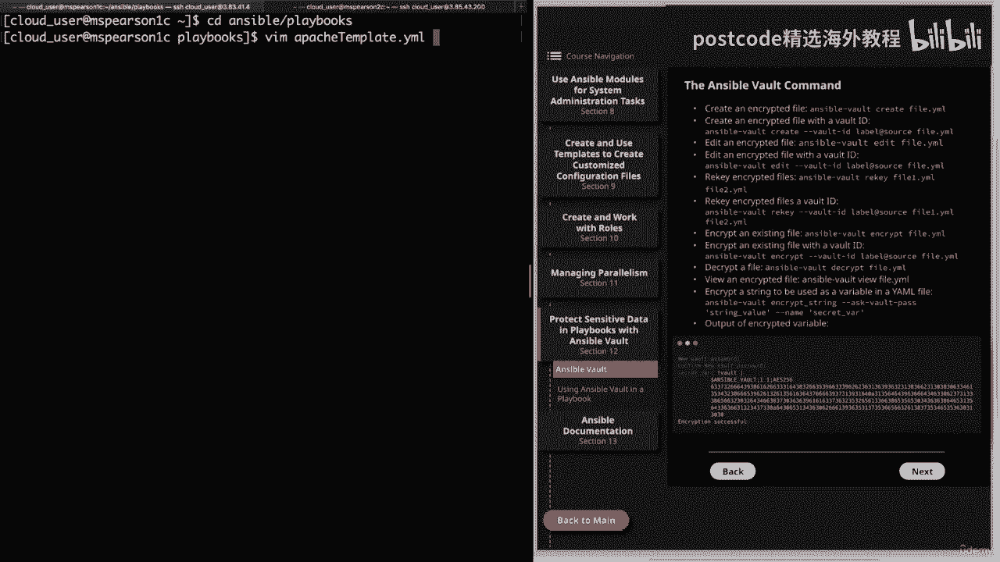

首先，可以使用 `ansible-vault rekey` 命令更新加密文件的密码。这在需要定期更换密码时非常有用。

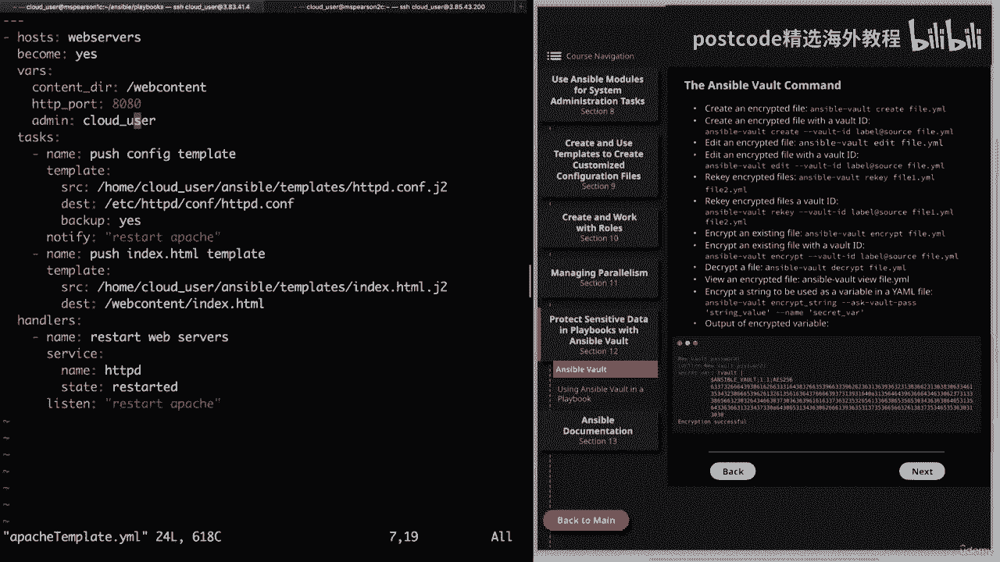

其次，除了加密整个文件，你还可以加密文件中的单个变量。这通过 YAML 文件中的 `!vault` 标签实现。但请注意，对于这种单个变量的加密，`rekey` 命令无效，你需要对该变量重新加密。这种方式的好处是无需加密整个文件。

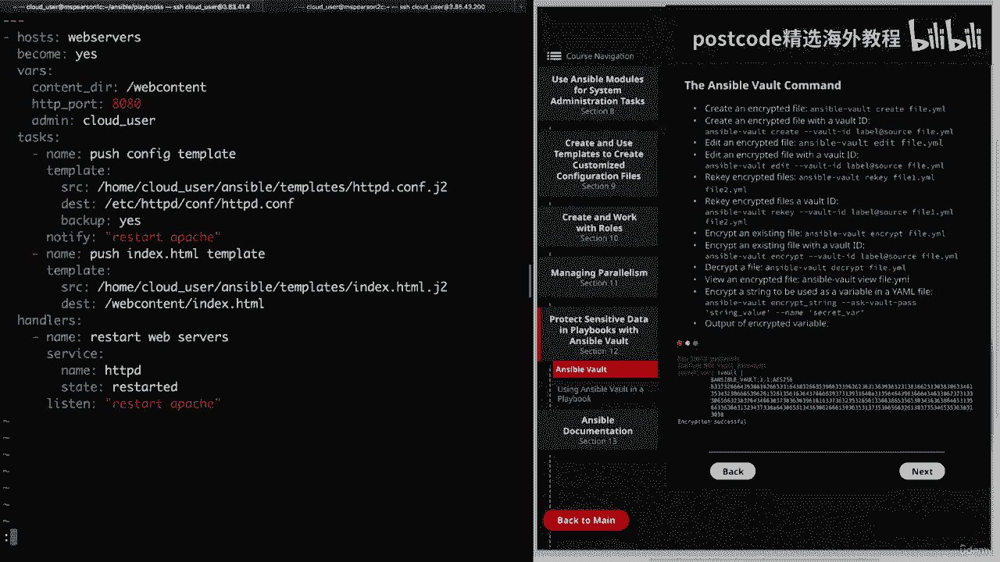

最后，你可以使用 **Vault ID** 来支持多个保管库密码。这是通过使用标签来区分各个密码实现的。一个示例命令结构如下：
```bash
--vault-id @prompt
```
其中 `label` 可以是类似 `prod`、`dev` 的标签，`source` 是密码文件的路径或 `prompt`（提示输入）。

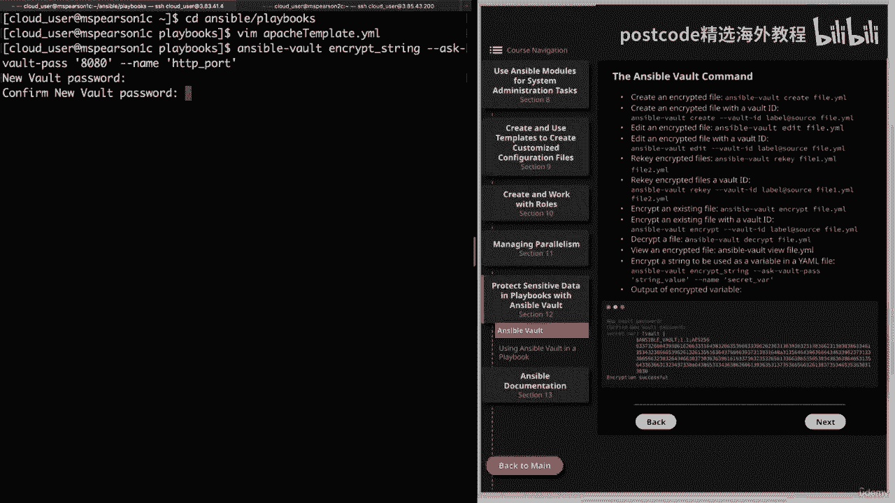

## Ansible Vault 命令详解

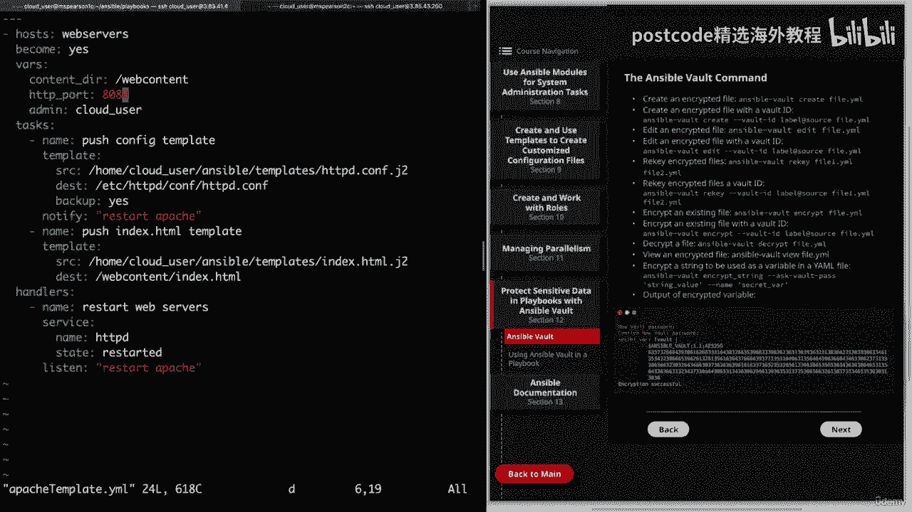

现在，让我们详细了解一下 `ansible-vault` 命令的各个子命令。在下一个视频中我们将进行演示，但你可以先在此参考。

以下是常用子命令列表：
*   **创建加密文件**：`ansible-vault create <filename>`。也可配合 Vault ID 使用。
*   **编辑加密文件**：`ansible-vault edit <filename>`。
*   **重新加密文件（更新密码）**：`ansible-vault rekey <filename>`。也可配合 Vault ID 使用。
*   **加密现有文件**：`ansible-vault encrypt <filename>`。也可配合 Vault ID 使用。
*   **解密文件**：`ansible-vault decrypt <filename>`。
*   **查看加密文件内容**：`ansible-vault view <filename>`。
*   **加密字符串（变量级加密）**：`ansible-vault encrypt_string --ask-vault-pass`。此命令会提示输入该变量的密码，然后你可以输入变量的实际值，格式为 `--name ‘<变量名>‘`。

## 实战演示：加密单个变量

理论介绍完毕，让我们通过一个实际例子看看如何加密剧本中的单个变量。假设我们有一个 Apache 模板剧本，其中定义了 `http_port` 变量，值为 `80`。我们不希望普通用户看到这个端口号。

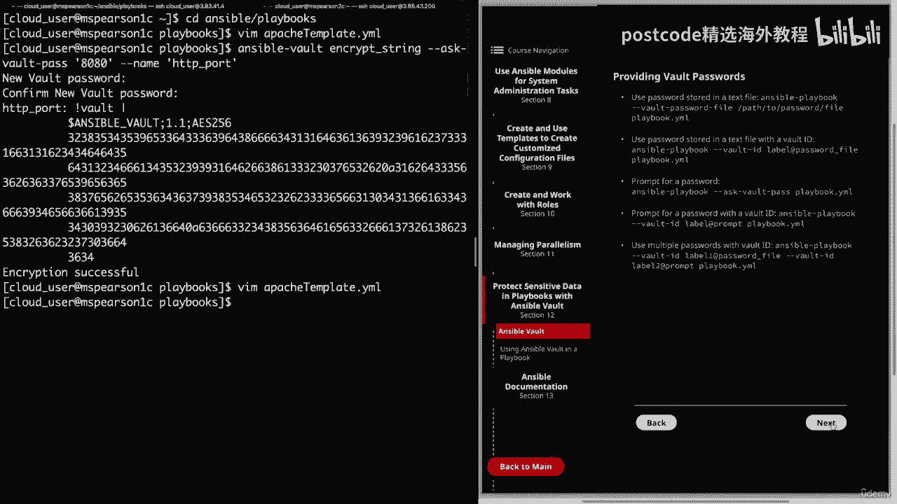

我们可以使用以下命令加密这个变量：
```bash
ansible-vault encrypt_string --ask-vault-pass ‘80‘ --name ‘http_port‘
```
执行后，命令会提示输入并确认新密码，然后输出加密后的字符串。我们将这个输出替换剧本中原来的 `http_port: 80` 行。这样，变量的值就被隐藏了，每次运行剧本时都需要输入密码。

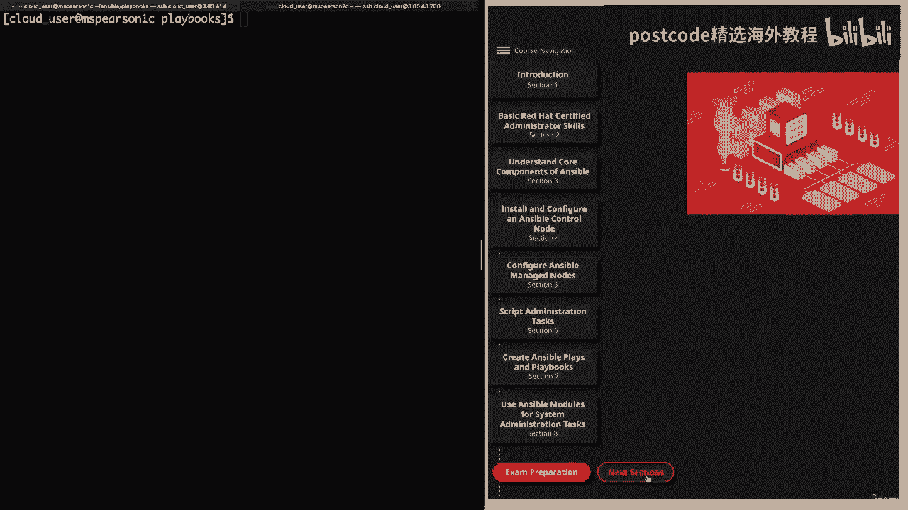

## 提供 Vault 密码的方式

在运行使用 Vault 加密的剧本时，有多种方式提供密码。

首先，可以使用存储在文本文件中的密码。命令如下：
```bash
ansible-playbook --vault-password-file /path/to/password/file playbook.yml
```
也可以配合 Vault ID 使用。

其次，可以让系统提示输入密码。命令如下：
```bash
ansible-playbook --ask-vault-pass playbook.yml
```
同样可以配合 Vault ID 使用。

最后，你还可以使用多个密码，这通过指定多个 `--vault-id` 标志实现。例如：
```bash
ansible-playbook --vault-id label1@/path/to/pass1 --vault-id label2@prompt playbook.yml
```
这将首先尝试 `label1` 对应的密码文件，然后提示输入 `label2` 的密码。

## 实战演示：在剧本中使用 Vault

现在，让我们演示如何在完整的剧本中使用 Ansible Vault。我们将使用一个名为 `variables.yml` 的剧本，它通过 `vars_files` 关键字引用一个变量文件 `users.yml`。


首先，我们加密这个变量文件：
```bash
ansible-vault encrypt vars/users.yml
```
输入密码后，文件被加密。如果尝试用普通编辑器打开，只会看到加密的字符串。

如果需要编辑已加密的文件，应使用：
```bash
ansible-vault edit vars/users.yml
```
输入密码后，会在编辑器中打开解密后的内容供你修改。

运行加密剧本时，需要提供密码。例如，使用提示方式：
```bash
ansible-playbook --ask-vault-pass playbooks/variables.yml
```
或者，更安全便捷的方式是使用密码文件。首先创建一个密码文件（如 `my_pass.txt`），将密码写入其中。然后运行：
```bash
ansible-playbook --vault-password-file vars/my_pass.txt playbooks/variables.yml
```
**注意**：应妥善保护密码文件，防止被系统上其他用户访问。

## 管理加密文件

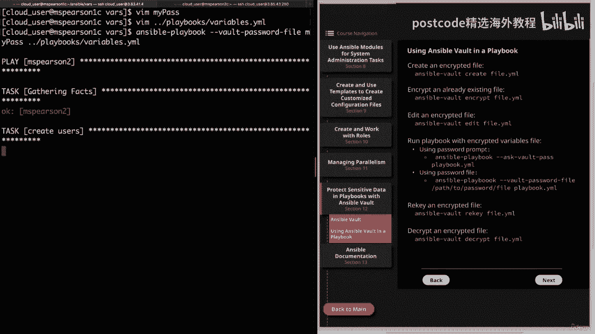

最后，我们学习如何管理已加密的文件。

要更改加密文件的密码（称为 rekey），使用：
```bash
ansible-vault rekey vars/users.yml
```
命令会要求输入当前密码和新密码。

如果你确定某个文件不再需要加密，可以将其解密：
```bash
ansible-vault decrypt vars/users.yml
```
输入密码后，文件将恢复为普通的 YAML 文件。

## 总结 🎯

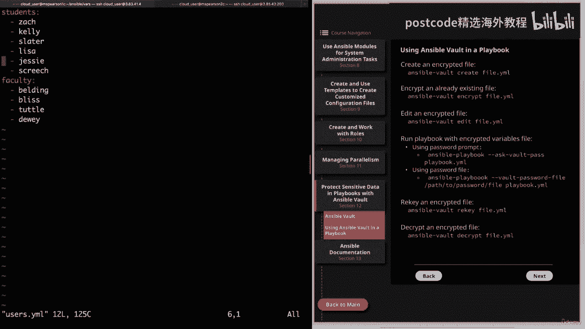


本节课中我们一起学习了 Ansible Vault 的核心概念和操作。我们了解到 Vault 可以加密文件或单个变量来保护敏感数据，掌握了 `create`、`edit`、`encrypt`、`decrypt`、`rekey` 等关键命令，并实践了在剧本运行中通过密码文件或提示输入的方式提供密码。合理使用 Ansible Vault 是确保自动化流程安全性的重要一环。