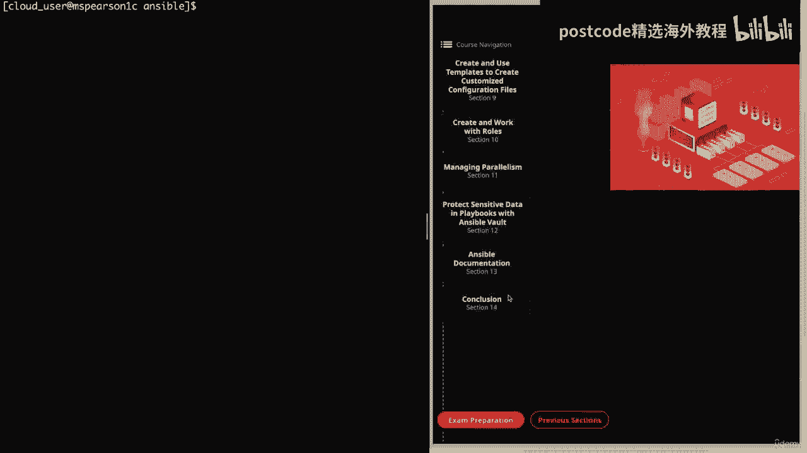
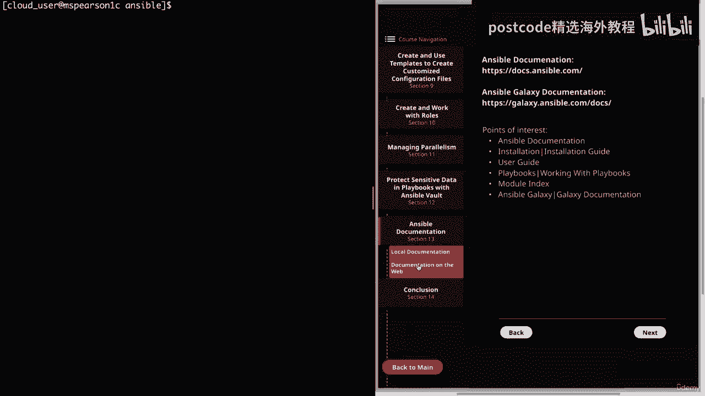
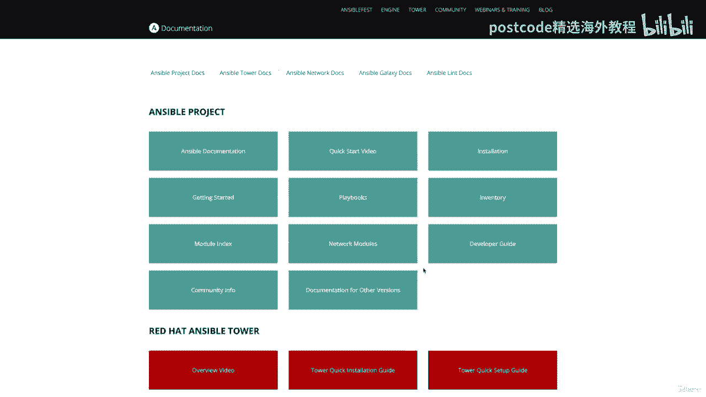
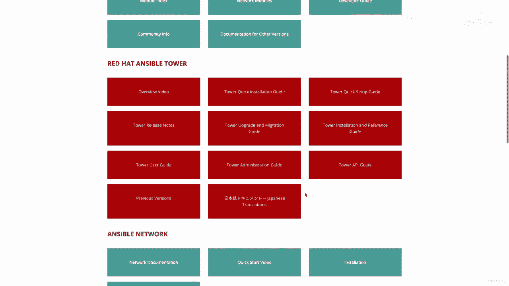
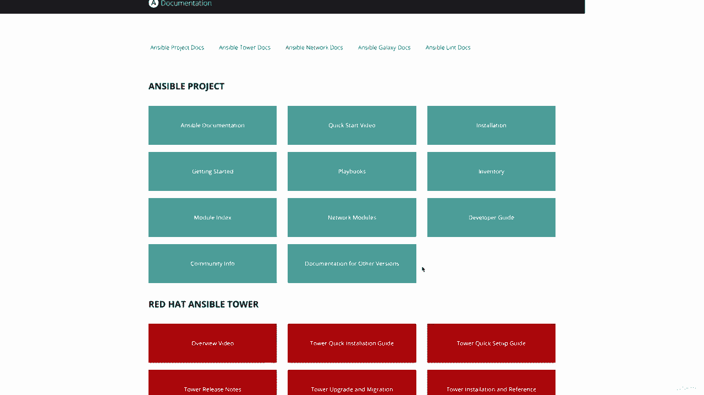
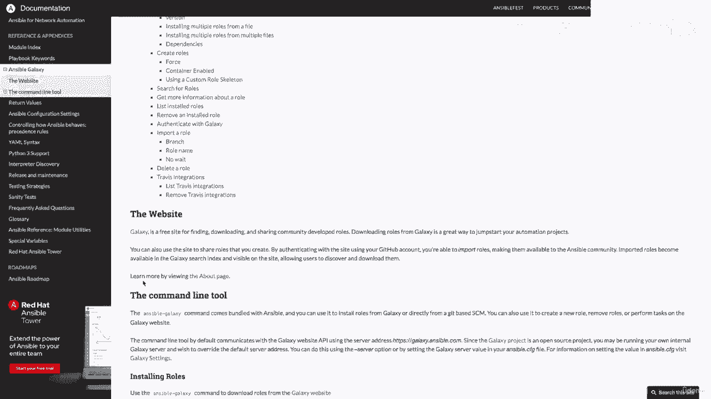

# 红帽企业Linux RHEL 9精通课程 — RHCSA与RHCE 2023认证全指南 - P24：03-03-011 Ansible documentation - 精选海外教程postcode - BV1j64y1j7Zg

一个非常重要的部分，那就是 Ansible 文档部分。首先，我们将讨论本地文档，然后在下一课中我们将介绍，在线文档。重要的是要记住，本课程只能让您做好这么多准备，尤其是因为。

我们不知道考试期间需要完成哪些具体任务。当然，RedHat 确实提供了目标列表，我们已尽力尝试涵盖这些目标，在整个课程中。但即便如此，您可能会被要求做一些您不熟悉的事情。因此，考虑到这一点。

能够使用文档来查找特定的模块或参数，你需要的这一点非常重要。因此，根据 Red Hat 的网站，对于他们的大多数考试，附带的文档，产品也将可用于考试。除此之外。

他们声明的本次考试目标之一是使用提供的文档，以便查找有关 ANSIBLE 模块和命令的特定信息。因此，我们需要能够快速利用文档以便，完成考试给出的任务，特别是对于我们这些没有过目不忘的人来说。话虽如此。

让我们转到我们的图表，我们可以单击下一部分，然后，Ansible 文档的第 13 节。我们将从本地文档开始。在我们深入学习本课之前，我想提的最后一件事是，在普通铁路中，安装时。

当您使用 Yum 或 DNF 安装 Ansible 时，您将可以访问，各个 Ansible 命令的主页。但由于我们从源代码安装了 Ansible。

因此我们无法仅输入 man ansible 或 man Ansible，剧本，但我们仍然能够使用破折号标志来获取有关这些命令的信息，这，只是为了寻求帮助。那么让我们转到命令行来测试一下。

因为我们将主要讨论 Ansible。这将向我们展示该命令的不同选项。在顶部你会注意到用法。这基本上就是命令的语法。在本例中，它将是 Ansible Dock。然后我们看到一个说明，上面写着插入文档工具。

请不要混淆，它说在这里插入而不是模块。这是我的经历。术语“插件”和“模块”至少看起来可以互换使用，但它们实际上是，两个不同的事情。根据 Ansible 文档模块，我们已经看到了可重用的独立脚本。

在整个课程中，这些内容由 Ants API、Ansible Command 以及 Ansible 使用，Playbook 命令并将针对目标主机执行，该主机通常是，远程系统。另一方面。

插件将用于增强 Ansible 的核心功能和，对于该视频以及课程，我们在控制节点而不是远程系统上执行，将主要关注模块，我们将按顺序使用 Ansible Dock 命令。

查看 Ansible 附带的默认模块提供了哪些选项。现在回到 Ansible 命令。我意识到这个屏幕确实有一点文字换行，这使得它变得有点困难，查看。但我们将在这里一起讨论一下。让我们继续向下滚动一点。

然后我们看到破折号 h 选项，并再次代表帮助。这就是我们获得此输出的方式，该输出向我们展示了所有不同的选项以及描述。然后 Dash L 选项将列出可用的插件，默认情况下这是模块。即使没有指定破折号选项。

它也可以让您指定插件类型。正如您在这里看到的，它表示默认为模块。另一个方便的标志是破折号 SX 选项，它代表片段。这将显示指定插件的剧本片段。片段选项不会提供与运行 Ansible 命令一样多的信息。

然后是模块的名称。但它将列出可用的参数以及每个参数的描述，做。最后，我们有 Dash V 选项，与其他 Linux 命令一样，它只是代表，为了详细。好的。让我们继续解决这个问题。

现在让我们使用破折号选项列出可用的 ansible 插件。So Ansible Dock Dash L。这会将您带入文本查看器。这样您就可以滚动浏览不同的模块。然后，如果您愿意，您还可以搜索特定模块。

因此，在顶部我们可以看到行和文件模块，如果我向右翻页，我们只会看到一个简短的内容，该模块功能的描述。所以让我们继续前进并退出这个话题。因此，在顶部我们将看到模块的描述，然后是任何其他信息，将用星号提供。

然后我们在那里有CS。它将使用等号来表示，然后其他可选参数将，使用破折号来表达。那么让我们继续往下翻页。您将看到一些附加选项。然后我们有一个注释部分，它为我们提供了任何附加注释，然后另请参阅，这就是。

向我们展示其他类似或相关的插件。然后我们就看到了作者。如果我们再往下看一点，我们将看到示例部分。这是另一个非常非常重要的部分，因为它将为您提供真实的示例，模块使用不同的参数。因此。

当您使用不熟悉的模块时，这将非常方便，您可以看到他们将提供名称，并且在名称下会告诉您该特定内容，例子正在努力实现。所以我们有启动服务、停止、服务、重新启动、重新加载。

我发现这些示例将涵盖您可以使用该模块完成的大部分事情，但即使没有，您仍然拥有所有不同参数的所有描述，该模块。好的。那么让我们继续前进并退出这个话题。现在我想向您展示 dash se 标志，当然。

它会向我们展示一个片段，模块。因此，让我们继续在服务模块上运行它，这样您就可以看到代码片段之间的区别，以及常规文档。所以 Ansible Dock。然后冲我们，然后服务。

您会立即注意到片段文档与普通文档不同，其格式将与您将其作为剧本中的任务所采用的格式完全相同。因此，在名称下，它为我们提供了一些简短的描述，即托管服务，当然还有，服务模块。然后在模块的名称下。

我们将拥有所有不同的参数。如果您查看名称示例部分，那么如果您只需要快速查找不同的，参数及其描述，然后您可以使用 snippet 命令。但如果您需要查看一些如何在剧本中使用它的示例，我建议使用。

不带破折号 s 标志的 Ansible 命令。好了，本地文档的视频就到此结束了。但在结束之前，我确实想向您展示我只是添加了 Ansible 命令的一个快速示例，输出供您参考。

但让我们继续将视频标记为完整，然后我们可以继续，下一课。如果您查看名称示例部分。因此，如果您只需要快速查找不同的参数及其描述，那么，你可以使用 snippet 命令。

但如果您需要查看一些如何在剧本中使用它的示例，我建议使用，不带 Dash 标志的 Ansible 命令。好了，本地文档的视频就到此结束了。但在结束之前。

我确实想向您展示我只是添加了 Ansible 命令的一个快速示例，输出供您参考，但让我们继续将视频标记为完整，然后我们可以继续，下一课。

我确实想向您展示我只是添加了 Ansible 命令输出的一个快速示例以供您参考，但让我们继续将视频标记为完成，然后我们可以继续学习关于在线的下一课，文档。因此，让我们转到下一部分，然后是第 13 节。

即 Ansible 文档。

以及网络上的文档。所以在这里我只是提供了一个在线文档的链接，其中还包括以下网站：Ansible Galaxy，当然可以通过主要的 Ansible Doc 网站访问。即使我们有本地文档。

在线文档也会列出信息，对我们来说是一种很好的视觉格式。我发现，我想你也会发现，它在本页的其余部分非常有用。我只是继续列出了一些您应该注意的部分以及我认为的部分，对我们过去会有好处。好的。

现在让我们转到浏览器，然后我们可以一起浏览文档。

因此，您会注意到的第一件事是，您会看到每个文件都有一种基于块的格式。各个部分。

所以我们有 Anthill 项目，然后有 Red Hat、Ansible Tower，然后是 Ansible Network。

Ansible Galaxy，最后是 Ansible Lente。让我们继续向上滚动。如果我们点击 Ansible 项目下的任何部分，我们将直接进入，该主题的页面。因此，对于安装。

我们将采用安装手册、模块索引等。但让我们继续点击主要的 Ansible 文档。

因此，这将带我们进入文档的主登陆页面，但我想指出导航，位于左侧，这是您主要用来浏览文档的工具。他们还有一个搜索栏，以防您想搜索特定主题或命令。所以现在我只想点击几个部分来向您展示一些更重要的文档。

要牢记。首先我们有安装指南，所以让我们继续点击它。您会注意到的一件事是，左侧的导航实际上会展开。所以我们有安装指南，然后配置 Ansible，你将看到这种类型的行为，对于任何有任何小节的主题。因此。

让我们继续并单击“安装指南”。这将为我们提供有关将要安装的内容以及版本类型的信息，我们应该选择，然后是控制节点和管理节点的要求。然后如果我们点击安装控制节点，它会告诉我们需要做什么来安装。

Ansible 在各种发行版上。所以我们有 Fedora，然后我们有 Rel。然后这将告诉我们更多关于 Ansible 配置文件以及一些，环境设置和一些命令行选项。下一个。让我们继续点击用户指南。

正如您所看到的，该部分包含大量信息，它确实将成为您的面包和，黄油，以获得有关 Ansible 各个方面的信息。我不会逐一讨论这些不同的主题，但我只是想向您展示，用户指南中涵盖的内容。因此。

我们将从 Ansible 快速入门开始，然后是入门部分。它将帮助您启动并运行。然后我们有各种命令行工具，因此它将向您展示不同的选项，命令行实用程序。那么让我们继续点击 Ansible Playbook。

正如您所看到的，它有一个描述以及一个常见选项列表，以及一些附加的，有关命令的信息。现在让我们回到主要的用户指南概述。接下来我们将介绍临时命令以及我们将要使用这些命令的几个领域，临时命令。当然。

我们还需要处理库存。这是从基础知识到使用主机和组变量的所有信息，以及，使用多个库存来源，然后使用动态库存，这就是，不是本课程的必修区域。接下来，我们将使用剧本，这是一个你最终会花费相当多钱的地方。

花大量的时间，因为它将向您展示可以用您的方式做的不同事情，剧本。它将介绍变量和模板、条件、循环，甚至向您展示一些，创建剧本并进一步深入的最佳实践。它将讨论权限升级，这在 Ansible 中当然非常重要。

然后我们有 Ansible Vault，它将涵盖您可以用它做的所有不同的事情，Ansible Vault 以及 Ansible Vault 命令。我不会逐一详述，特别是因为有很多材料需要涵盖，在文档中。

但我只是想让你看看你可以得到什么。所以这个文档的另一个非常重要的部分，可能对你来说最重要的是模块，指数。因此，就像我们能够在命令行中执行的操作一样，在线文档也将提供。

为您提供所有可用模块的列表以及每个模块的选项。因此，让我们继续单击模块索引。您会看到有几个不同的选项用于查看各种模块。您可以单击所有模块。那么让我们继续点击它。

这只是所有 Ansible 模块和字母顺序的庞大主列表。因此，您随时可以向下滚动找到您要查找的内容。或者你可以点击你的控制。F 搜索特定模块。让我们继续寻找百胜吧！

我们看到 Yum 模块和 Yum 存储库模块。它只会给我们一个简短的描述。因此，对于 Yum 来说，会说使用 Yum 包管理器来管理包，然后对于 Yum 存储库来说，它是添加或删除 Yum 存储库。

然后如果我们点击它。它将带我们进入该模块的文档页面，并为我们提供描述，以及概要以及任何要求的列表。然后，当然，在这里向我们展示参数。因此它将向我们显示参数的名称，然后也向我们提供有关该参数的描述。

向我们展示默认值。然后，如果我们继续向下滚动，我们将看到一个注释列表，最后是一个示例列表。就像我在谈论本地文档时所说的那样，这个示例列表令人难以置信，当您使用不熟悉的模块时非常方便。

这样您就可以看到正确的语法以及该模块可以做什么。好吧，让我们返回模块索引。除了显示所有可用模块之外，它还将提供一些分组，基于模块的类型。因此，让我们继续单击系统模块。

这将尝试对与管理和配置系统有关的模型进行分组。所以你会看到文件系统防火墙DX。我们这里有组要添加或删除组。再往下，我们将有 lvc、g 和 L vol 用于配置逻辑卷。然后，如果我们再向下滚动一点。

我们将看到所有 SC Linux 模块和，然后还有我们在本课程中经常使用的服务模块。事实上，我提到的所有这些不同的模块都是我们已经在整个过程中使用过的模块，课程。对于那些之前观看过这些文档视频的人来说。

对您有好处，感谢您接受我在课程视频中的推荐。但这些模块将是您在学习本课程时会看到的模块。同样，我们只需单击该模块即可查看该特定模块的文档。就像我们在“所有模块”页面上所做的那样。

所以我想再次强调熟悉这个模块索引的重要性，因为，模块是您将用来管理系统的模块。因此，充分熟悉这一点将使您了解配置的可能性，在安西布尔。但在我们结束这个视频之前。

让我们先看看 Ansible Galaxy 上的文档。因此，让我们单击参考资料和附录下的 Ansible Galaxy。这只是向我们展示 Ansible Galaxy 主题的概述。因此。

它将向您展示如何安装角色以及如何创建角色。如果你向下看一点，它会给你 Ansible Galaxy 网站的链接，以及 Ansible Galaxy 命令行工具，我们在创建和工作部分中介绍了它，与角色。

如果您返回主登陆页面，其中包含基于块的主题，您还可以访问，Ansible Galaxy 文档。好了，在线文档中的视频就到此结束了。同样，这里有很多信息，熟悉一下确实很有帮助，文档。这样。

如果您遇到不知道该怎么做的事情，您可以随时搜索，主题或您需要的参数。因此，让我们继续并将其标记为完成，然后我们可以继续下一课。这样，如果你遇到不知道怎么做的事情，你可以随时搜索，您需要的主题或参数。

