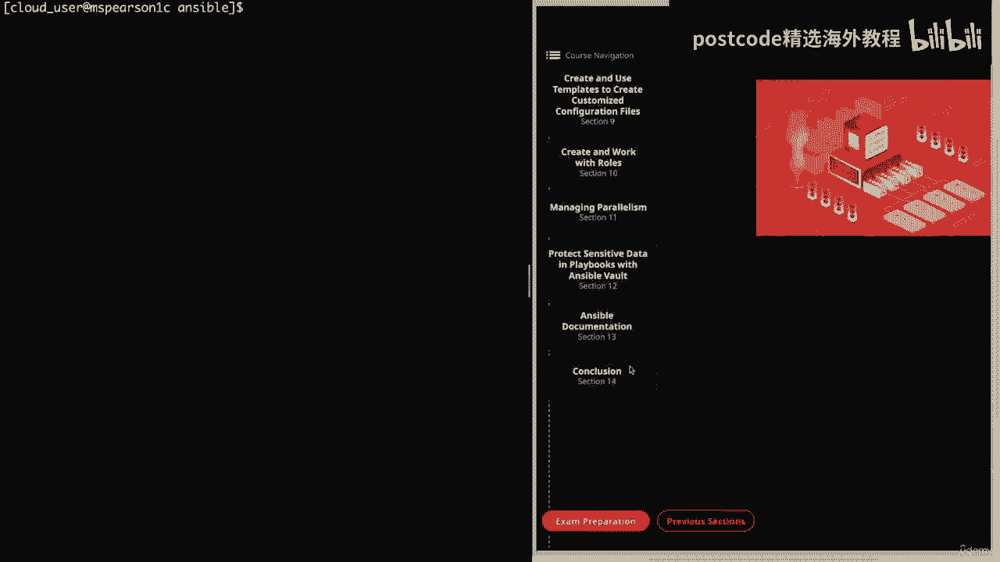
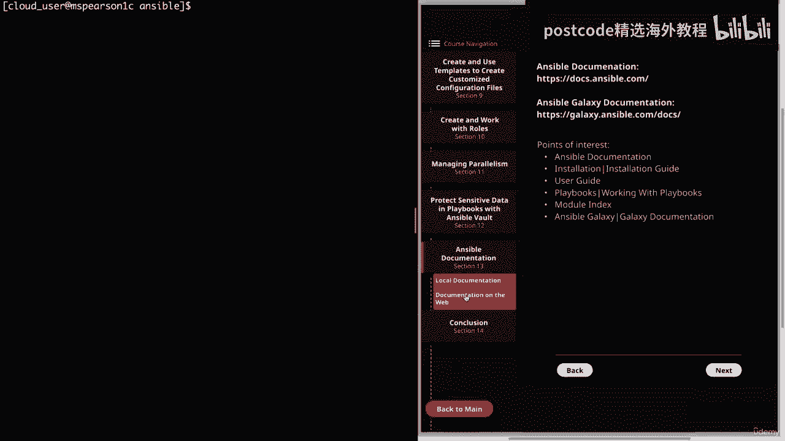
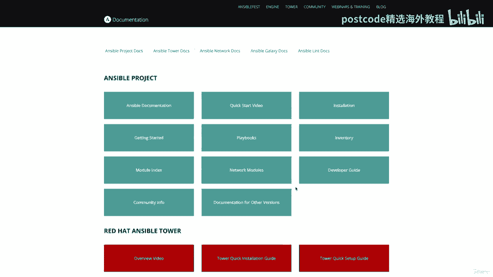
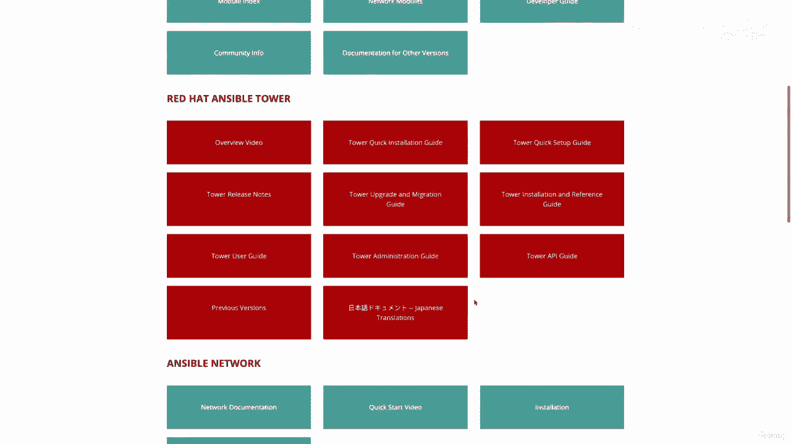
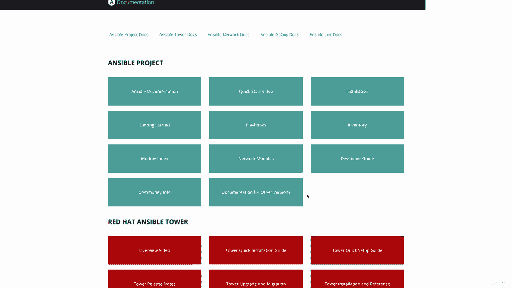
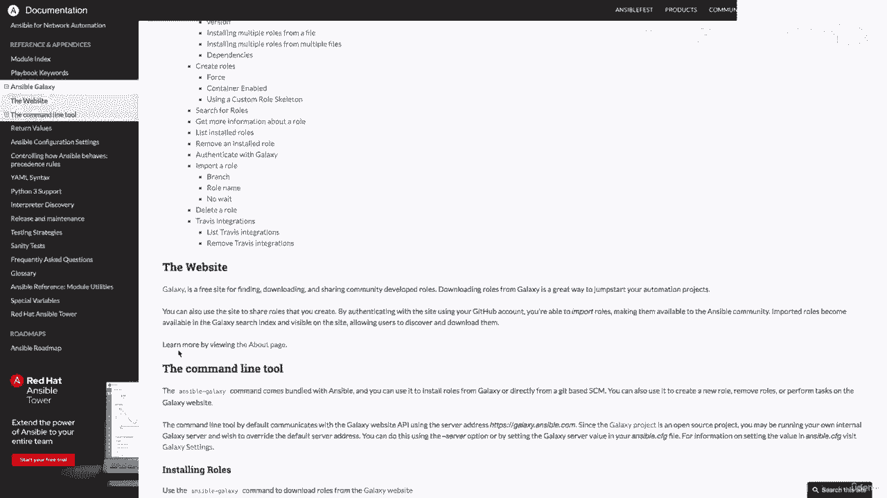

# Ansible 精通课程：03-03-011：Ansible 文档 📚

在本节课中，我们将要学习如何有效地使用 Ansible 文档。文档是解决未知问题和完成特定任务的关键工具，尤其是在认证考试中。我们将首先介绍如何访问和使用本地文档，然后探讨更丰富的在线文档资源。

---

## 本地文档的使用

上一节我们概述了文档的重要性，本节中我们来看看如何从命令行访问 Ansible 的本地文档。由于我们从源代码安装了 Ansible，因此无法直接使用 `man` 命令，但可以通过 `ansible-doc` 命令及其选项来获取帮助。

### 访问命令帮助

首先，我们可以使用 `-h` 选项来查看 `ansible-doc` 命令本身的用法和选项。

```bash
ansible-doc -h
```

执行上述命令会显示命令的语法、说明以及所有可用的选项。其中，`-h` 代表帮助，`-l` 用于列出可用插件（默认为模块），`-s` 用于显示指定插件的剧本片段，`-v` 用于显示详细信息。

### 列出可用模块

要查看 Ansible 附带的所有默认模块，可以使用 `-l` 选项。

```bash
ansible-doc -l
```

这会打开一个文本查看器，列出所有模块及其简短描述。你可以在此界面中滚动浏览或搜索特定模块。

### 查看模块的完整文档

要查看某个特定模块的完整文档，包括参数、示例和注释，只需运行 `ansible-doc` 后跟模块名。

```bash
ansible-doc service
```

输出会包含：
*   **描述**：模块功能的概述。
*   **参数**：列出所有参数，必选参数用 `=` 表示，可选参数用 `-` 表示。
*   **注释**：提供额外的使用说明。
*   **示例**：展示该模块在不同场景下的使用代码，这是非常实用的部分。
*   **另请参阅**：列出相关模块。
*   **作者**：模块作者信息。



### 查看模块的代码片段

如果你只需要快速查看模块在剧本中的标准格式和参数，可以使用 `-s` 选项。



```bash
ansible-doc -s service
```





这会输出一个任务片段的格式，清晰地展示了参数结构，适合快速查阅。

---



## 在线文档的探索

上一节我们介绍了本地命令行文档，本节中我们来看看功能更全面、格式更友好的在线文档。即使拥有本地文档，在线文档以其视觉化的组织和丰富的交叉链接，也是一个极佳的资源。

### 访问在线文档

Ansible 项目的主要文档网站是 [docs.ansible.com](https://docs.ansible.com)。该网站首页按区块组织了不同产品线的文档，包括：
*   **Ansible 项目**：核心 Ansible 的文档。
*   **Red Hat Ansible Automation Platform**：红帽企业级产品的文档。
*   **Ansible Galaxy**：角色共享和社区内容。

### 导航与搜索

在线文档左侧有清晰的导航栏，可以逐级展开浏览所有主题。顶部还有一个搜索栏，方便你快速查找特定命令或概念。

以下是几个对学习和考试尤为重要的部分：

1.  **安装指南**：涵盖了不同操作系统上的安装方法、控制节点和被管理节点的要求。
2.  **用户指南**：这是核心内容，包含了从快速入门、临时命令、库存管理到剧本编写（变量、循环、条件判断）、权限提升和 Ansible Vault 等所有主题的详细说明。
3.  **模块索引**：这是查找模块信息的核心区域。你可以按字母顺序查看所有模块，也可以按类别（如“系统模块”、“云模块”）筛选。每个模块的页面都提供了完整的参数说明和实用示例。

### 模块索引的使用示例

以 `yum` 模块为例，在模块索引中找到并点击它，会进入其专属页面。页面中会包含：
*   **概要**：模块的基本语法。
*   **参数**：每个参数的详细说明、是否必需、默认值等。
*   **示例**：展示如何使用该模块安装、更新、删除软件包等，这些示例能解决大部分常见需求。

### Ansible Galaxy 文档

在线文档也包含了 Ansible Galaxy 的指南，教你如何从 Galaxy 网站安装社区角色，以及如何使用 `ansible-galaxy` 命令行工具来创建和管理自己的角色。

---

## 总结

本节课中我们一起学习了如何利用 Ansible 文档来辅助学习和解决问题。我们掌握了：
1.  使用 `ansible-doc` 命令在本地查看模块列表、完整文档和代码片段。
2.  浏览在线文档网站，并熟悉了安装指南、用户指南和**模块索引**这几个关键区域。
3.  理解了示例代码在学习和应用新模块时的重要性。



养成遇到不熟悉的模块或参数时优先查阅文档的习惯，是成为一名高效 Ansible 用户并通过相关认证的关键。