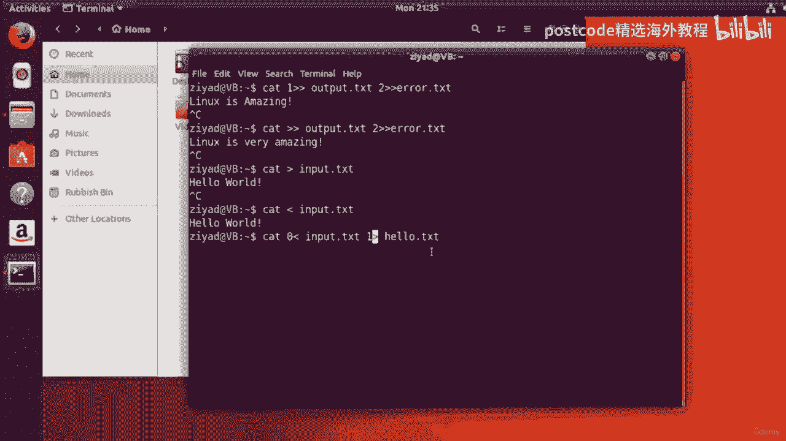

# 红帽企业Linux RHEL 9精通课程 — RHCSA与RHCE 2023认证全指南 - P25：04-04-001 Redirection - 精选海外教程postcode - BV1j64y1j7Zg

正如您之前了解到的，每个命令基本上都是它自己的计算机程序。现在，计算机程序只是一种获取输入、处理输入并给出输出的自动化方式。这是一个图表，向您展示了命令获取输入和给出输出的不同方式。现在您可以看到。

一般的 Linux 命令可以从两个地方获取输入，并将输出到另外两个地方，位置，总共有四种可能的方式将数据输入和输出传统的 Linux 命令。所以输入是命令参数和标准输入，输出是标准输出和标准，错误。

您可以看到其中三个由黄色虚线箭头指示，并且是某些内容的示例，称为标准数据流。你可以从他们的名字中看出这一点，因为他们都以“标准”一词开头。所以你有标准输入、标准输出和标准错误，它们都是标准数据流。

而命令行参数有一个实心的蓝色箭头，并且不是标准数据流。因此，在本视频中，我将向您解释不同的输入或输出选项是什么，以及，您还将了解标准数据流的特殊之处以及如何使用这些数据流，将命令连接在一起。

那么让我们跳到 Ubuntu 并实时查看所有这些内容。

好的。因此，对于本次讨论，从输出开始更有意义。那么让我们从这里开始吧。现在，当命令成功运行时，从命令输出数据的主要方式，位于称为标准输出的通道上。现在，标准输出被称为标准数据流。现在。

就像水流、数据一样，流从某处开始，在某处结束。那么标准输出通向哪里呢？好吧，默认情况下，标准输出将引导至您的终端。这就是为什么当我们键入命令时，命令的输出会出现在屏幕上。例如。

我们以 date 命令为例。如果我们在告诉 date 命令运行时键入 date 并按 Enter 键，则输出将从，date 命令并流向标准输出流，默认情况下连接到我们的终端，屏幕。因此。

我们看到数据出现在我们的命令下方。好的，这很酷。但我想在你的脑海里种下一点种子，以便我们稍后再讨论。现在，还记得我说过，默认情况下，命令的标准输出会到达终端吗？好吧，关于输出数据流的惊人之处在于。

您可以使用进程重定向它们的去向，想象地，想象地称为重定向。因此，就像重定向管道或更改水流方向一样，重定向数据流也会发生变化，数据去向。所以希望这颗种子已经种下，我们稍后会再讨论这个问题。现在。

第二种类型的输出称为标准错误。因此，当命令给出错误消息或日志消息或类似消息时，任何不是，输出到称为标准错误的流中的命令的主要输出，这有助于，将有用的输出和日志或错误信息分开。例如。

让我们再次使用数据命令。如果我通过给它一些像这样的无效命令参数来使数据命令失败，好的。然后我按 Enter 键，您会看到我们收到一条错误消息，上面显示蓝色的无效日期。现在，因为它是一条错误消息。

所以它被发送到标准错误流，并且因为错误，消息到达我们的终端屏幕，我们可以看到标准错误也自动连接，到我们的终端，就像标准输出一样。但同样，因为标准错误是一个数据流，所以它可以重定向到我们希望的任何地方。

现在我们知道标准输出是命令的主要输出，并且，标准错误是命令的错误和日志消息所在的位置，并且这两个消息都是由，默认连接到终端。现在让我们将注意力转向输入。如前所述，命令也有两种获取输入的方法。

我们首先要讨论的是另一种类型的标准数据流，正如你猜到的那样，它被称为，标准输入。现在标准输入默认连接到键盘。因此，为了演示这一点，我将介绍一个名为 Cat 的新命令。

现在我们将在后面的部分中讨论 Cat，但我现在只用它来解释这个概念，标准输入。如果我们看一下 Cat 的主页，那么我们输入 man cat，我们会在其描述部分看到，如果猫没有得到任何东西。

如果没有给出任何参数，我怎么能说它没有给出任何命令行参数呢？就是这样。Cat 将从标准输入中读取。因此，如果没有给出文件，则读取它，否则它将从标准输入读取。那么让我们这样做吧。

如果我只输入 cat 并且不给它任何其他形式的输入，我们可以看到终端类型，就挂在那里。但是如果我开始输入并输入 hello 并按 Enter 键，我们会看到文本是从键盘读取的，即来自标准输入。

然后 cat 对其进行处理并将结果输出到标准输出。现在，因为标准输出默认连接到我们的终端，所以我们看到输出显示正确，在我们的航站楼。那真是太棒了。现在因为标准输入是数据流，所以它也可以被重定向。

这意味着我们可以告诉命令应该从哪里读取数据。现在这可能是一个我们已经有一些预先配置的输入的文件，或者更强大的是它可以，是另一个数据流。现在，数据流连接在一起的能力使其变得如此强大。

您可以简单地将标准输出流从一个命令传递到另一个命令的标准输入流，然后将第二个命令的标准输出流传递给第三个命令的标准输入流，命令等等，直到建立一个非常强大的管道。现在。

以这种方式将输出连接到输入被称为管道连接命令，并且是一种令人难以置信的方法。这是 Linux 中的重要概念，因为它使命令行的使用如此强大和有效。正如您将看到传入的视频。现在，最终的输入类型是命令行参数。

现在，我们已经实际看到了命令行参数的实际作用。比如之前学习命令结构的时候我们看了核心命令，顺便说一句，我们看到我要按下 Control 并查看取消此控件并查看并取消。

然后按下 Control 键即可清除屏幕。因此，当我们使用该命令时，我们会看到类似 Cal 12， 2017 的内容，这将使我们能够看到，2017 年 12 月的日历。

数字 12 和 2017 是命令行参数。您可以看出，因为它们是作为命令的输入添加到命令行上的，所以我们还，像这样使命令更高级。如果你还记得的话，我们让 Cal 给了它资本一个选项，给了这个选项。

输入给了资本，B 选项，为该选项提供自己的输入，然后将 Cal 命令提供给其他输入。所以它相当复杂，它向我们展示了 2017 年 12 月的日历以及一个月后和，一个月前。

现在 A 和 B 选项都有自己的命令行参数。这里，A选项有命令行参数，这是第一个，B也有一个命令行，第一名的论点。除此之外，整个 Cal Command 将 12 和 2017 作为自己的命令行参数。

因此，该选项有一个参数，B 选项有一个参数，整体有两个参数，CAL 命令。现在，命令行参数和数据流之间的区别在于数据流可以流动，它们可以被重定向并通过管道连接在一起。

命令行参数仅与它们当前正在处理的命令或选项相关联。现在有一些命令，例如 X ARGs 命令，可以稍微模糊之间的界限，数据流和命令行参数。但总的来说，不同之处在于数据流可以流动并通过管道传输在一起。

但命令行，参数更加静态。但仍然存在。不过，需要记住的另一个关键区别是，并非所有命令都接受标准输入。例如，Echo 命令不接受标准输入，但几乎每个命令都可以接受，命令行参数。

如果你想知道一个命令是否真的可以接受标准输入，只需检查它的主页即可。如果现在不存在，则该命令用于连接或粘贴多个不同的文件。您将在课程后面的视频中更详细地了解它的工作原理。

但我在这个视频中使用该命令的原因是因为它是一个简单的命令，可以读取，标准输入并写入标准输出。所以它非常符合我们学习重定向的目的。让我们看看 cat 从标准输入接收数据。因此。

如果我只是在此处键入 cat，cat 命令就会等待接收标准输入上的一些数据。现在 cat 需要标准输入才能运行，但因为标准输入默认连接到，键盘上，猫只是坐在那里等待我们在键盘上输入内容。因此。

如果我这样输入，一旦我们这样做，它就会将相同的输入输出到标准输出中。因为标准输出默认连接到我们的终端，所以它输出相同的单词，我们输入的是 meow，这当然适合 cat 命令，它输出，到终端。现在。

为了告诉 cat 命令标准输入已完成，我们需要按 control 并，see 和 cat 将停止监听，我们将重新控制我们的终端和 shell。好吧，那太棒了。那么。

如果我想更改标准输出的位置而不是让它到达终端怎么办？换句话说，如何重定向标准输出？好吧，假设我想将标准输出重定向到一个名为输出文本的文件。为此，我将使用一个特殊的符号。我会像平常一样写猫。

然后我会输入数字一和大于正弦的值，然后输入输出文本。那么让我向您解释一下这意味着什么。我希望您记住标准输出是流的名称。输出下降。标准输出不是目的地，而是流的名称。或者数据下降的管道或流。现在。

每个数据流不仅有标准输出、标准输入、标准错误等名称，但它也有一个与之相关的号码。标准输入是数字零。标准输出排名第一，标准错误排名第二。因此，我们在这里所做的是更改第一个流所指向的目的地。换句话说。

我们正在重定向或更改标准输出的目的地，因为标准，输出是第一。这就是我们输入第一的原因。我们说把数字放在第一位，将数据流放在输出文本中。因此，不要将标准输出流指向终端（默认情况下指向终端）。

我们将其指向主文件夹中名为“output txt”的文件。现在，当我跑步时，那只猫仍在等待一些输入来运行。所以如果我输入 linux 就太棒了。好的。然后按回车键。我们现在注意到。

实际上它并没有返回到终端，当我告诉 cat 已经完成时，通过按下控制键再次完成输入。你看，我们注意到的第一件事是该命令不再运行，而且我们也没有看到，任何输出。但是，如果我单击此处导航到我们的主文件夹。

那么当该窗口打开时，我单击文件和我。

如果我从未到达我们的主文件夹，我们现在会看到一个文件夹，一个名为“output txt”的文件和内部输出，TXT。如果我打开它，我们会看到文字。Linux 太棒了。现在这有多酷。

因为标准输出通常是您想要重定向的内容。Linux 使得你实际上甚至不需要把数字放在第一位。因此，如果我只是删除输出文本，我只需按键盘上的删除键即可。

是的。实际上，您甚至不需要在此符号中输入数字 1。所以实际上如果我只是做 cat，那么大于号和输出文本以及我输入 linux 是惊人的，并输出它，然后我按 C 中的 control 来停止该命令。

可以看到我们基本上得到了相同的结果。输出txt已经创建，里面有linux，真是太神奇了。

所以这是一个很好的捷径。你不必把第一放在那儿，但理解这一点很有用，因为当你实际上，来重定向其他数据流，现在您可能想知道间距。那么让我们采用长形式。同样，长形式是 cat 大一，然后输出文本。好吧。

但我无法添加它，所以我可以这样写。我可以去掉那里的空间，那就好了。但我无法在“一”和“大于”之间添加空格。所以我不想这样做，中间有一个空格，因为这必须是一个符号，行不通的。但这是我可以缩小差距的。

所以这个符号就被保留了下来。该符号被保留，但我可以在它和输出之间有一个空格。这可以。这可以。这不太好。那有意义吗？但是是的。请记住，shell 正在解释我们编写的内容。

shell 正在寻找大于或刚好大于作为符号。它必须找到那个符号才能理解它想要我们做什么。因此，如果我们现在将一个比现在的空间更大的部分拆开，它就不再起作用，因为外壳看起来不好看，为了那个原因。好的。

好吧，太棒了。因此，让我们尝试向文件添加更多文本。让我们尝试添加文本。哇。所以说 Linux 是神奇的。然后哇。好的。因此，如果我们这样做，我们就会输入“wow”。

然后按control C停止现在当我们检查输出txt文件时，我们期望说linux is。

惊人的。哇。正确的。但当我们打开它时，它只会说“哇”这个词。那些说“Linux 很棒”的文字怎么了？好吧，默认情况下，重定向会在写入文件之前删除文件中的所有内容。对此的一个花哨的词叫做截断。

但基本上发生的事情是 Linux 清空了我们的文件，然后向其中写入 wow。嗯，这有点烦人。那么我们如何使用重定向再次写入文件而不截断它呢？好吧，为此，我们将像这样编写重定向。

所以你可以写 Cat 1 大于大于输出。

所以你可以看到我们在那里使用了两个箭头。因此，我们必须一个接一个地书写，而不是只有一个箭头。现在，当我输入 Linux 时，感觉很神奇，我按下 Control 键并看到现在我们查看输出内部。

我们现在有了Linux，哇哦，好吧，快捷方式仍然适用，所以不是有。

猫 1 大于 大于 顺便说一句，快捷方式就在那里，我只需按向上箭头键，而不是让猫一只比伟大更大，那么我可以只拥有比我做的时候更大的东西，我说 Linux 非常神奇，做完就停下来。

然后当我重新加载文件时我们可以看到现在它添加了Linux，非常令人惊奇。

因此，这对于大于大于大于同样有效。它的效果和排名第一一样好，因为 Linux 让它变得更容易一些，因为通常您会重定向标准输出，这是第一个数据流。这就是重定向标准输出的方式。正如我所说。

使用双箭头的过程称为附加到文件。

你好，美丽的人们。因此，在上一个视频中，您了解了如何重定向标准输出。在本视频中，我们将继续学习如何重定向标准，错误和标准输入。那么让我们从标准错误开始。你如何重定向它？

标准错误的工作方式与标准输出非常相似。现在，标准错误数据流的编号是第二。因此，要重定向标准错误，您可以输入 cat，然后输入而不是 1，然后输入大于号，这就是我们用于标准输出的内容。你只有一个 2。

因为数据流编号为 4，标准错误是编号 2。这会将标准错误从 cat 命令重定向到错误文本并附加标准，错误到错误点txt中已有的内容，您将执行两个箭头。

所以请记住一个箭头和两个箭头之间的区别是一个箭头会删除所有内容，这是在写入文件之前追加之前的文件中。因此它将截断文件，并且两个箭头将附加或添加到已有的内容中。让我们来演示一下。

cat 命令没有 k 选项。所以如果我做 cat 给它 k 选项，然后输入 blah 。正确的。我们将收到一个错误，它会显示选项 k 无效，请尝试使用 cat help 获取更多信息。

所以这是一条错误消息。因此它被输出到标准错误数据流上。标准错误数据流默认连接到我们的终端，因此我们可以在，我们的航站楼。但让我们将其重定向到错误文本，这样我就可以按向上箭头键来节省自己的打字时间，我。

输入数字 2，然后输入大于正弦值，然后将其重定向到错误文本。所以我说运行这个并将标准错误重定向到 SDA。因此，当我按 Enter 键时，我们首先注意到终端上没有弹出任何内容，这，是一个好兆头。

当我们打开文件时，我们现在可以看到有一个名为 Error Text 的文件。当我打开它时，我们可以看到错误消息确实已发送到该位置。

重定向标准错误的一个常见用途是跟踪来自以下位置的日志消息，网络服务器和类似的东西。但一个常见的错误是像我们这里一样只使用一个箭头，因为如果我继续这样做，什么。

这意味着它会在再次发送标准错误之前删除之前文件中的内容。

因此，如果我继续这样做，想象一下每次都会发生新的错误。如果我继续这样做并打开错误，则仅保存最近的错误。

但如果我不是只有一支箭，而是有两支箭。现在我将把每个错误附加在彼此之上，这正是您想要的日志。

文件，因为您希望能够向后滚动并查看过去发生的情况。于是又把它打开了。

现在我们可以看到错误是相互叠加的。这就是单箭头和两箭头之间的区别。这两个错误附加到已经存在的内容上，这确实是标准错误所需要的。

当然，现在您可以同时重定向标准错误和标准输出。例如，我们可以键入命令并将输出重定向到输出文本。请记住，标准输出是第一个数据流。我们还可以将标准错误重定向到另一个称为错误文本的地方。

我们可以通过确保两个箭头处都有两个箭头来确保我们将它们都附加，地方。然后当我们输入像 Linux 这样令人惊奇的东西时，我们就取消了。当我们在此处打开文件浏览器时。

我们将看到现在有两个文件错误文本和输出。

文本输出。TXT 包含 Linux 作为惊人的标准错误。错误文本不包含任何内容，因为此输出实际上没有错误。

这是一个完全有效的命令，不需要任何错误，但这就是你要做的，正在做。这就是我们将标准输出重定向到输出 SDA 的方式。我们可以这么说，因为第一个在这里，它的标准错误文件称为错误文本。

现在我们可以看到标准错误将附加的数字和箭头以及输出，文本。现在我们实际上记得您实际上不需要一个输出文本。所以你实际上可以摆脱这个并说出来。Linux 非常神奇，当我查看它时。

我们将看到文本处的输出已附加其文本。

再说一次，错误文本中仍然不会有错误，因为没有任何错误。

但你可以在这里看到，如果不使用第一，这仍然有效，但你仍然需要，第二个表示标准错误，因为该快捷方式不可用。所以只能去掉标准输出数据流的第一个。好的。杰出的。现在您已经了解了如何重定向标准输出和标准错误。

那么标准输入呢？嗯，实际上，这相对简单。目前，cat 命令正在寻找来自键盘的标准输入。但是如果我们告诉它从文件中获取标准输入呢？因此，让我们创建一个名为输入文本的文件。

并在其中输入单词“Hello world”。所以我们要做的是使用 cat 命令，现在将其输出到，一个名为输入文本的文件。好的。因此，我们将创建一个文件，并将其放入其中，Hello World。现在。

当我取消该操作时，我们现在有效地创建了一个名为输入文本的文件。

在那里我们有 hello world。

好的，您可以看到如何使用重定向来创建这样的文件。现在让我们尝试再次使用 cat 命令读取该文件。我们如何才能将该文件的内容（该输入文本文件）读入标准输入以供，cat 命令，这样我们就不必稍后键入它了。

好吧，标准输入流的数量为零。所以我们能做的就是输入 cat 数字零。实际上，您使用的是小于正弦，而不是类似于输出的大于正弦，我们说然后输入，文本或作为快捷方式，因为标准输入流是您的唯一方法。

实际可以输入。您甚至不需要零，只需将小于号放在那里即可。现在，当我们这样做时，我们会看到屏幕上弹出 hello world 消息。现在，这是因为 Cat 已从标准输入读取文件并将其输出到标准输出。

默认情况下连接到我们的终端。现在这是一个小挑战。好的？我想让 CAT 从输入文本中读取标准输入并将该输出重定向到 hello 文本，并做到这一点。好的。所以，继续尝试吧。

现在暂停视频并尝试让 CAT 从输入文本读取标准输入并重定向输出，到你好文本。然后回来看看你做得怎么样。你做到了吗？是的，这就是我将如何去做的。我首先会重定向 cat 的标准输入，以便它来自输入文本。

所以我们就这样做。然后我将其输出到一个名为 Hello Dot Text 的文件。现在，为了更容易阅读，我可能会添加流编号。所以我可能会说，好吧，我将重定向到流零输入文本，并且我将重定向，从流一。

它是 hello 文本的标准输出。使用哪一款完全取决于您。这可能是你这样做的一种方式。可能不是。但请记住，0 是标准输入，1 是标准输出，2 是标准错误。好的。

在这里我们可以看到我们正在将输入文本读入标准输入。很容易通过图形方式看出这一点。我们正在将标准输出写入 hello 文本。好的。因此，如果我们现在继续这样做，我们应该能够看到，事实上，是的。

我们现在有一个文件。

名为 Hello Text，当我们打开它时，我们会看到 hello world。这不是很神奇吗？这就是您可以重定向计算机周围数据的方式。

现在还有一件令人兴奋的事情。Linux 中的所有内容实际上都被视为文件，甚至是终端。

那么让我打开另一个终端。我将使用快捷键控制 Alton T，并将它们并排打开。所以我要把一张放在这里，我要把一张放在这里。好的。现在，在另一个终端（这个终端位于右侧的新终端之上）中，我将运行 T 命令。

现在，T 命令实际上会告诉我们这个终端位于文件系统的哪个位置，这是。我们看到它带着slash dev、slash RTS、slash 1回归。好的。现在我要做的是重定向输入文本中的内容。就像这样。

我不会将其写入文件，而是将其写入此位置斜杠，dev，斜线斜线一。所以削减开发，削减RTS，削减一。当我按下回车键时。哦，我的天啊。我们可以看到数据已经从一个终端传递到了另一个终端。

现在它有点像一个非常垃圾的即时通讯系统。嗯，这本身并不是特别有用。它展示了如何使用重定向在整个计算机甚至计算机上传递数据，网络。

