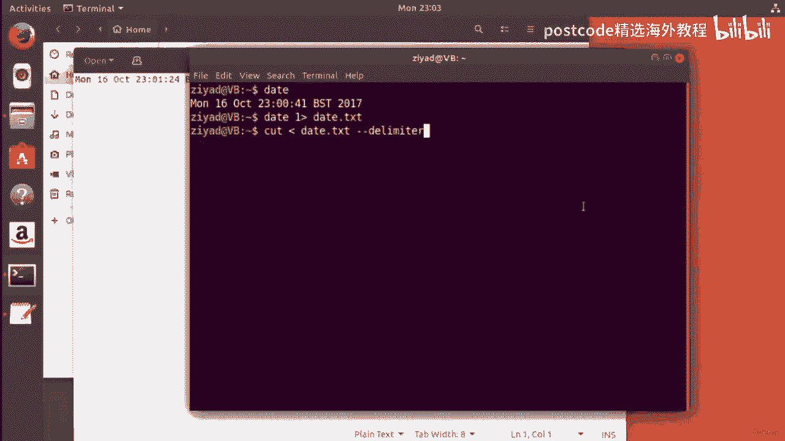

# 红帽企业Linux RHEL 9精通课程 — RHCSA与RHCE 2023认证全指南 - P26：04-04-002 Pipe - 精选海外教程postcode - BV1j64y1j7Zg

好的。因此，管道就是获取一个命令的标准输出并将其连接到标准输入，另一个命令的。我们以 date 命令为例。正如我们所知，date 命令将向我们显示日期。

现在我们可以使用重定向将 date 命令的标准输出写入名为 Date Dot text 的文本文件，所以作为迷你挑战。看看，看看你是否能记住该怎么做。

如何获取 date 命令并将其重定向到名为 date txt 的文件中。尝试一下，然后回来看看你做得如何。你做到了吗？嗯，这是你可以做到的一种方法。您可以键入 date 命令，然后说。

我想将标准输出重定向到数据文本。现在，您可以只使用这样的符号，或者您可以输入数字一来表示，您想要第一个数据流，即要写入数据的标准输出。如果你给予了如此多的祝贺，那么你已经在学习了。

但是现在我们已经完成了，我们将在这里查看我们的文件资源管理器，我们会看到一个文件。

名为Data txt，我们看到数据信息确实已写入该文件中。但现在如果我们只想删除一周中的某一天（在本例中是星期一）怎么办？我们如何只删除一周中的某一天？好吧，一种方法是使用 cut 命令。现在。

您以前没有见过该命令，但它的工作原理非常简单，并且可能更容易显示。

你通过做。首先，我们要将日期 txt 文件读入 cut 命令的标准输入中。为此，我们需要输入 cut，然后读入标准输入日期。TXT 还可以吧，而且你不必有零，所以你可以去掉零，然后就这样做，有课程标志。

然后是数据，并记住这里的空格，这是可选的。我可能会保留它，因为它看起来更好一点。现在，该命令将剪切一个文件并为您提供特定的列。

因此，如果我们查看数据 txt，您可以想象该文件被分成多个列，列之间有空格，每列表示一周中的某一天。在本例中，星期一是第一列或第一个字段，如命令中所示。这将是第二个字段，这将是第三个字段，依此类推。

但我们现在希望第一个字段能够使 cut 命令正确工作。

我们需要使用选项为其提供两条信息。首先，我们需要给它定界符长格式选项。那么分隔符以及什么是分隔符，它告诉您什么分隔列。所以我们需要告诉它空格是分隔或分隔列的，因为空格是分隔列的。

文件中的这些特定列。为此，我们只需输入长格式的分隔符，放置一个空格，然后在引号中放置另一个空格。所以我们说空格是限制这个文件或这个输入的。然后我们需要说出我们想要哪个字段，现在我们已经告诉了它。

文件是如何分割的。因此，我们再次为其提供长格式选项，即字段，然后是一个空格，然后是一个。现在，当我们运行它时，我们将看到我们对命令说，好的，读取数据，文本。它被我们分成几列，每列之间都有一个空格。

我们想要第一个，场地。现在，当我按 Enter 时，您可以看到我们得到星期一作为输出。那不是很棒吗？正确的。太酷了。您以前没有见过该命令，但这是一个非常酷的命令。但这确实有效，但有点笨拙。首先。

我们将 date 命令的标准输出写入一个文件，该文件占用我们的空间，电脑。正确的？然后我们必须将该文件读入命令中。也许我们也会在取出这些数据后，然后必须删除这个原始文件，因为。

我们不再需要它，这是我们必须进行的另一个过程。

因此，通过将数据保存到文件中，然后分两步读取该文件，需要，更多的打字。它使它们成为必要的文件，然后您必须将其删除，否则它们只会占用空间，而且，只是一种低效且笨拙的做事方式。因此。

我们可以将数据命令的标准输出直接传输到，命令。好的。因此，如果我只使用向上箭头键来保留我们之前拥有的内容，可以。现在不是说读入命令数据的标准输入，txt，我是什么，我要做的就是输入日期。

然后使用这个管道符号。现在，在大多数键盘上，您可以通过按住 Shift 键然后按住反斜杠来找到此管道符号，反正。是的，大多数键盘上都是这样，但如果您的键盘上没有，如果有。

通过按住 Shift 和反斜杠是不可能的，只需跳到搜索引擎并查找如何执行，键盘布局上的管道符号。如果您找不到它，您应该立即上来。但现在发生的事情是我们说将数据从 date 命令标准输出传输到。

cut 命令标准输入。现在，因为数据 FD 实际上是日期命令的标准输出，所以这将具有，一样的效果。因此，当我们按 Enter Delta 时，我们就得到了星期一，这一步就发生了。所以这真的很酷。

我们设法直接从 date 命令获取数据并将其通过管道传输到标准输入，cut 命令，以便可以对其进行操作。我们为命令提供了一些选项，使我们能够直接删除星期几的名称。现在我只需按向上箭头键。

现在我将向您展示一些非常酷的东西。我们能做的就是将数据实际输出到。文件。好的。因此，我们实际上可以使用重定向将其保存到名为 Today。txt 的文件中。TXT。所以检查一下。

我们使用 date 命令来获取所有这些信息。我们将其剪掉以获取星期一，然后将该数据写入名为“today txt”的文件中。太棒了。正确的？那么我们来尝试一下吧。让我们继续并按 Enter 键。

现在这种情况已经消失了。这次还没有出现在屏幕上。

如果我们查看这里，我们有一个名为“today txt”的文件，如果我们单击它，我们现在就看到了“星期一”。那不是很棒吗？我认为这太棒了。现在，作为旁注，我将重定向放在哪里实际上并不重要。

因此我可以进行重定向。

最后在这里。我可以在这里进行重定向，但它仍然会完全一样地工作。好的，这绝对没问题。我什至可以将它放在不同的选项之间，这样我就可以把它放在这里。

我也会做同样的工作。我们仍然收到今天的短信，里面有星期一。

所以这只是需要记住的事情。好的。不要害怕输入错误的内容。所有这些都是有效的方法，但有些方法比其他方法更具可读性。但假设我们不想发送重定向，而是发送 cut 命令的标准输出，到另一个命令。我们该怎么做呢？

我们如何不将其保存到文件中，而是如何将命令中的数据发送到 Yet，另一个命令？嗯，这很简单。您只需添加另一个管道即可。所以你就说，好吧，让我把它删掉。对不起。让我再放一个管道，然后假设我会放一个命令。

我有一些选项，然后，我有一些命令行参数，这就是它的工作原理。这个新命令可以有自己的选项、自己的命令行参数，并且还可以读取，命令的标准输入。所以你可以看到这是如何工作的。

我们将日期命令管道输出到命令的标准输入中，给出命令，它自己的选择。然后我们将该输出传输到另一个命令中，为该命令提供自己的选项和自己的选项，命令行参数等等。你可以继续下去，将这些事情组合在一起。

做你想做的事，并给他们选择，如你所愿。这就是赋予整个 Linux 终端力量的原因。到目前为止，我们一直在做一些很酷但不一定有用的事情。但是，当您可以将真正强大的命令组合在一起并让它们准确地运行时。

您想要的方式以及在它们之间以及整个计算机上传输数据的方式，它确实得到了，惊人的。所以你可以看到这些管道的东西可以继续下去，你可以看到如何建立强大的管道。这种方法实际上非常简单。

您只需将不同的命令连接在一起即可。那不是很棒吗？那么让我问你一个问题。如果我们想将整个日期实际保存在文件中然后将其传递到管道中怎么办？好吧，我们不能简单地在最后使用重定向，因为我们已经通过了标准。

将 date 命令的输出写入命令中。正确的。因此，我们无法真正将其保存在文件中，因为我们已经将其传递到管道中。如果我们尝试这样做，如果我们尝试摆脱保密协议，如果我们尝试通过管道输出，写入TXT。

如果我们这样做，那么让我删除这里的所有内容，以便我们可以看到效果。如果我尝试这样做，我们会发现我们得到的只是数据。

TXT 整个数据被保存到数据中，但是没有任何内容可以传递到命令中。这是因为重定向是在 shell 中的管道之前处理的。因此它会在看到管道之前找到重定向并执行此操作。这基本上破坏了我们的管道。

所以数据实际上不能同时传送到两个地方。或者可以吗？好吧，为了使这项工作正常进行，我们需要使用一个名为 PT 命令的命令。我们将在下一个视频中向您展示这些先进的东西。

好的。让我们快速回顾一下我们在上一个视频中所做的事情。因此，在上一个视频中，我们使用 date 命令来获取有关我们计算机的大量系统信息，钟。我们所做的是将这些数据传递到 cut 命令中。

因为我们只想剪掉这一天，一周中的某一天，即星期一。现在要切出星期几，我们不得不说这个数据实际上被分成了几个，列，每列之间用空格分隔。现在，另一种说法是，每一列都由空格分隔。

就像计算机中的一个奇特单词一样，行话。所以我们所做的就是给 cut 命令一个分隔符，我们说分隔符是一个空格。现在，一旦我们说，好吧，每一列都被双空格分隔，我们想要哪个字段？我们想要哪一栏？

现在第一列是什么？命令中的字段称为抱歉，命令中的哪些列称为字段。所以我们只是说字段等于一。当我们按下回车键时，周一就会被删除。这就是我们在上一个视频中所做的。然后我给了你一点挑战。我说，嘿。

我们如何才能将这些信息实际保存到文件中，但同时，也将其传递到管道中？那么如何才能将其保存到文件中，同时又传递到命令中，以便可以操作呢，这样我们周一就可以出去了。所以我们试图同时做两件事。为此。

我们实际上需要另一个命令，称为 PT 命令。那么让我们来看看 PT 命令是如何工作的。

这是 T 命令如何工作的图像。现在我将在视频资源中放置原始图片的链接，但是您可以在这里看到我们有，两个命令之间的管道。左边有一个命令，右边有另一个命令。在中间我们使用 PT 命令。现在。

我们还没有介绍这些特定命令的作用。其实这并不重要。我希望您关注的是中间的 PT 命令，并了解我们正在尝试，现在将两个命令连接在一起，就像在水管的连接处一样，我们可以使用 PT 命令。

使我们的数据向两个方向流动。我们可以使其水平流动以及垂直向下流动到其他文件中。你可以想象它是这样工作的。因此，PT 命令允许我们将数据传递到管道的其余部分，但它也允许，我们将其保存在一个文件中。

所以你可以在这里看到我们左边有一个命令试图将其数据通过管道传输到，右侧的另一个命令。不过，在中间，我们通过 PT 命令和 PT 命令管道它，我们给它一个命令。

文件 txt 的行参数可以是您想要的任何文件名。所发生的情况是，数据确实从一个命令的标准输出一直传递到，对方的标准输入。但它也会跌倒。

你可以想象它从你的命令行落入一个名为 file at txt 的文件或任何文件，您为 PT 命令指定的名称。这就是 PT 命令的工作原理。理论上来说，这就是我这个图文作品。

让我们继续看看它在实践中的效果。

好的。现在您已经了解了 PT 命令的工作原理，让我们快速回顾一下我们的命令，管道。我们有 date 命令，它为我们提供了有关系统时钟的大量信息。我们想删除星期一或一周中的任何一天。因此。

我们采用 date 命令并将其通过管道传输到 cut 命令中。现在我们注意到数据被分成由空格分隔的列。所以我们说，嘿，剪切命令，我们有一个分隔符。那是一个空间。数据由空格分隔，我们想要第一列。

或者如命令所称，第一列，场地。这给了我们一周中的哪一天，在本例中是星期一。现在，我们面临的挑战是我们不仅希望将其显示出来，还希望保存整个日期，到一个名为完整日期 txt 的文件中。好的。

我们就是这样做的。我将按向上箭头键回到之前的位置。现在我要做的就是在此处插入 t 命令。好的？现在 t 命令将在我们的管道中放置一个类似 T 形接头的接头。你需要在脑海中想象它。好的。因此。

将要发生的情况是数据将水平地通过管道一路传递。所以它将从 date 命令标准输出传递并进入 cut 的标准输入，命令。所以它会直接流过。但现在 T 命令要做的是允许我们垂直向下保存数据。

所以你可以想象它就像一个大字母T，就像一个大T字路口。数据将向下进入名为完整日期点 txt 的文件。好的，我们到了。数据将水平下降。糟糕，我打开了一个新终端。我的错。这将是水平跨越的。好的。

它还将垂直向下进入一个名为完整日期 txt 的文件。因此，当我们这样做时，我们会看到一周中某一天的输出仍然发生，因为那是，通过 cut 命令，该命令将其吐出到其标准输出，该输出仍然处于连接状态。

到我们的航站楼。但是当我们打开文件资源管理器时，我们可以看到现在有一​​个名为“完整数据”的文件。TXT 我删除了之前所有的其他内容，所以我们重新开始，现在我们已经完整了，数据。

现在当我打开 TXT 时，嘿我们实际上可以看到所有日期数据确实已保存，在名为完整日期点 txt 的文件中。

那不是很棒吗？这是正确的。凉爽的。正确的。所以发生的事情是 date 命令在整个管道中吐出所有信息。当它到达 T 命令时，T 命令只是对管道中的数据进行快照，然后。

将其传递到名为 Full Date txt 的文件中。因此该文件包含来自 date 命令的所有数据。但随后数据被传递到 cut 命令中，该命令进行了一些处理并吐出，一周中的某一天，在本例中为星期一。

现在，我要给你一个快速挑战。好的？我认为你可以做到。我希望你做的是我希望你不要将一周中的哪一天吐到终端，我想让你看看你是否能弄清楚如何使用重定向来实际导致该数据。

保存在名为 Today dot txt 的文件中。好的。因此，spee 不是将星期几吐到 shell，而是吐到终端。我希望您将其保存在名为“today”的文件中。

TXT 但您仍然需要在此处使用 t 命令。因此，我希望您按向上箭头键来获取之前获得的内容，然后现在进行重定向。所以我现在要提取视频，然后回来看看你做得如何。你是怎么做到的？你做了吗？好吧。

这就是你的做法，这就是你的做法，对吗？所以我就在这里结束，因为这里是数据实际上来自的地方。我只想从标准输出重定向到名为 Today txt 的文件。事实上就是这么简单。因此，一旦我们完成了此操作。

如果我继续并按 Enter 键，当我们打开文件命令器时，我们可以看到。

这里。我们现在还有一个名为“today txt”的文件，里面保存了星期几的数据。

在本例中是星期一。让我删除这两个文件，这样我们就可以看到它的全部辉煌。我们没有文件，按向上箭头键按 Enter，当我们查看时。

哈，我们实际上已经成功地将所有数据保存为完整数据了。TXT 我们还成功地使用重定向保存了我们想要的内容。TXT 是不是很棒？

正确的。就是这样，真是太棒了。我想是这样。无论如何，我们这里得到的是 T 命令基本上拍摄了正在流动的数据的快照，通过该点的管道并将其保存在您提供的文件中，然后重定向将，也做同样的事情。

但是一旦重定向了标准输出，就无法再将其传递到管道中。这就是我们使用 PT 命令的原因。T 命令允许标准输出继续沿着管道流动，而且还允许您有效地，将其重定向到一个文件并拍摄快照以便将其保存在那里。

换句话说，一旦完成重定向，就无法再进行管道传输。因此，一旦您像今天的点 txt 中那样重定向了标准输出，我们就无法再，在管道中进行更多的管道铺设。

它将最大化终端。一旦我们完成了到今天的 SDA 的重定向，我们的管道时代就结束了。但是如果我们想将所有数据保存到txt中但继续管道，那么我们可以做什么，什么？这时候 t 命令就派上用场了。例如。

我们今天在 T 命令中执行此操作，现在我们可以继续进行管道传输。好的。因此，如果您对通道输出进行重定向，则意味着不再需要管道。如果您想拍摄快照，但继续管道传输，则可以使用 T 命令。

现在我可以继续往下走。因此，我还想在此视频中介绍 x args 命令，但我认为我们在这里推迟它的时间。我希望这已经清楚地说明了 T 命令是什么。这里最后总结一下，对于T命令来说。

T命令可以让你保存数据的快照，并继续执行管道操作，而仅使用重定向将保存数据快照。但您不能再进行任何管道操作。因此，如果您想继续构建管道，请保留快照。

好吧，让我们看看 x args 命令是如何工作的。例如，假设我们再次使用 date 命令，并且我们得到了，来自我们系统的数据。现在，如果我们采用 date 命令并将其通过管道传输到 Echo 中。

您认为会发生什么？现在，请记住，Echo 非常简单。如果我在说“give echo hello”时只接受 echo，它只会回复“hello”。那么。

如果我采用 date 命令并将其通过管道传输到 echo 中，您认为会发生什么？好吧，你可能会认为当我按when时当我按回车键时，日期命令将传递日期，进入 echo，它会吐出日期。正确的。错误的。

实际上发生的事情是 Echo 不接受标准输入。那么这里发生了什么，实际上，这是人们在使用管道时犯的一个常见错误，首次。他们尝试将东西通过管道传输到 Echo 中。现在 Echo 不接受标准输入。事实上。

它只接受命令行参数。因此，如果我尝试执行此操作并输入 echo， hello Again。即使我正在通过管道将日期命令输入其中，如果我继续并按 Enter 键，您可以看到，它只处理它的命令行参数。

所以问题就变成了我们如何将数据从管道传递到不接受的命令中，标准输入？好吧，关键是将数据从标准输入转换为命令行参数，以便命令，可以继续正常工作。因此，您执行此操作的方法是。

不是直接通过管道将其传递到 echo 中，而是通过管道将其传递，进入称为 x args 命令的东西。现在 x args 命令将从标准输入转换数据，并将其放入命令中，行参数。所以现在我做 echo。

所以我基本上把它放入 x args 中，然后给 x args echo 来使用。当我现在按 Enter 键时，您可以看到它现在回显了日期。这不是很酷吗？现在？现在我还可以给 Echo 自己的命令行参数。

这样我也可以给它打招呼。将会发生的情况是，它现在将处理两者，除了它将处理自己的命令行参数，第一的。所以这是需要牢记的事情。但它确实呼应了他们两个，这比我们之前好多了。我们实际上可以继续向下传输。

因为输出的数据仍然是标准输出。所以基本上 x args 就像一个小膏药或一个小修复，用于当命令不接受时，标准不接受标准输入，但只接受参数命令。您可以使用 x args 来解决问题并继续进行管道操作。

假设我们希望它只回响一周中的某一天。我们可以做的是，我们可以将其输入到命令中，就像我们已经做了一百万次一样，次。告诉它分隔符是一个空格。告诉它我们想要第一个字段，然后你可以将其传输到 echo 中。

现在请记住，这是行不通的，因为 Echo 不接受标准输入。因此，我们使用 x args 将数据从标准输入转换为命令行参数。告诉 x ogs 嘿，我们希望你使用 echo，现在我们会看到它会在当天弹出。

周，即星期一。那么让我给你举一个例子，你可能会遇到这样的情况，好吗？这个，这个 x args 能力，它可能能为你做什么。例如，如果我们获取完整的数据文本文件，我们就会在这里得到一些数据。

让我在这里创建一个新文档。我要调用它并按 control 和 s 进行保存。

是的，这有效。我将其称为“删除点文本”，这样我就可以制作该文件。

我称之为删除文本。

现在，当我们查看时，我们会发现这里有一个名为“删除文本”的新文件。现在有一个命令，您将在课程的稍后部分中遇到，所有内容都是关于，浏览文件系统以及类似的内容，这是本节之后的部分。

但其中有一个命令称为 REM M 命令。现在 R 命令代表删除。这是删除内容的命令，如果我输入，删除我的文本，然后单击左侧的 Enter watch，手表。就在这里，您会注意到该文件刚刚被删除。好的。

您注意到这里我们实际上给了 M 命令一个命令行参数。我们在命令行中输入它，并给它一个文件名。现在，我们可能想要做的是我们可能想要在这里有另一个文件。

好的。调用files删除txt。

因此，要删除 txt 的文件，我将在其中指定完整数据 txt 和今天点的名称，TXT。因此，如果我将其放入完整日期 txt 中，我们还将获得今天另一个点的内容，TXT。

所以我们有一个包含这两个名字的关注。

好的。现在我们可以使用 cat 命令读取该文件。你以前见过这个。因此，如果我执行 cat 命令并说要删除的文件，您会看到它如何为我提供输出吗？现在我不能只是将该信息通过管道传输到 rm 命令中。

什么都不会发生。好的，因为 rm 命令只接受命令行命令行参数。

但我能做的是我可以读取数据。让我清除屏幕。我能做的是我可以从文件中读取数据来删除这些文件名并将其传递到 x args 中。现在 x args 会将这些数据转换为 RRM 命令的命令行参数。

现在 R 命令确实接受命令行参数。因此，当我们这样做时，请注意，如果我直接通过管道传输到 RRM 命令，则它不起作用。它说它缺少一个操作数，它缺少一个命令行参数。好的。

但是如果我将其输入到 x args 命令中，然后输入 M，看看现在会发生什么，在左边。文件什么时候被删除，因为现在 rm 命令可以工作了。实际上发生了什么？

就好像我们今天写的 m​​ 点 txt 和完整日期 tcd 实际上是相反的，因为，文件 他们在文件中以相反的方式写入 就好像我们这样做了 就好像我们写了，输出这个命令，这里的这个命令。

但我们只是读取文件并将内容通过管道传输到另一个，命令。因此，您可以看到这就是您可能使用 X 命令的方式，只是作为一个示例。

