# Linux命令行精通课程：04-04-002：管道与数据流控制

## 概述
在本节课中，我们将要学习Linux命令行中一个极其强大的功能：管道。我们将了解如何将一个命令的输出作为另一个命令的输入，并学习使用`tee`和`xargs`命令来更灵活地控制数据流。这些技巧是构建高效、强大命令行操作的基础。

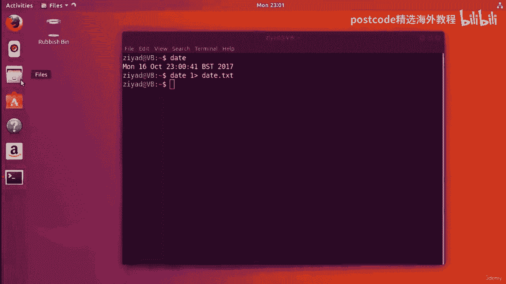

---

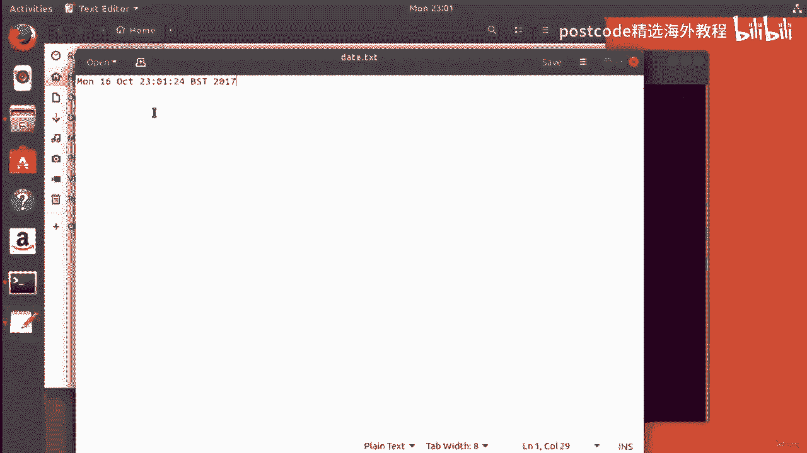

## 管道基础概念
管道的作用是获取一个命令的标准输出，并将其连接到另一个命令的标准输入。

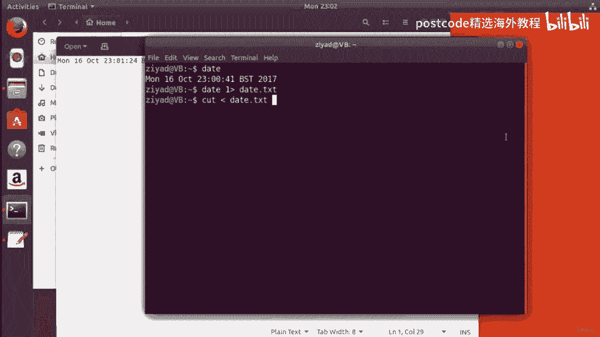

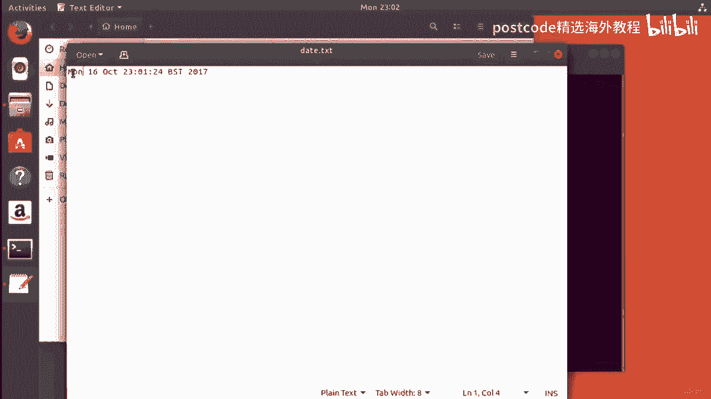

我们以`date`命令为例。`date`命令会显示当前系统的日期和时间。

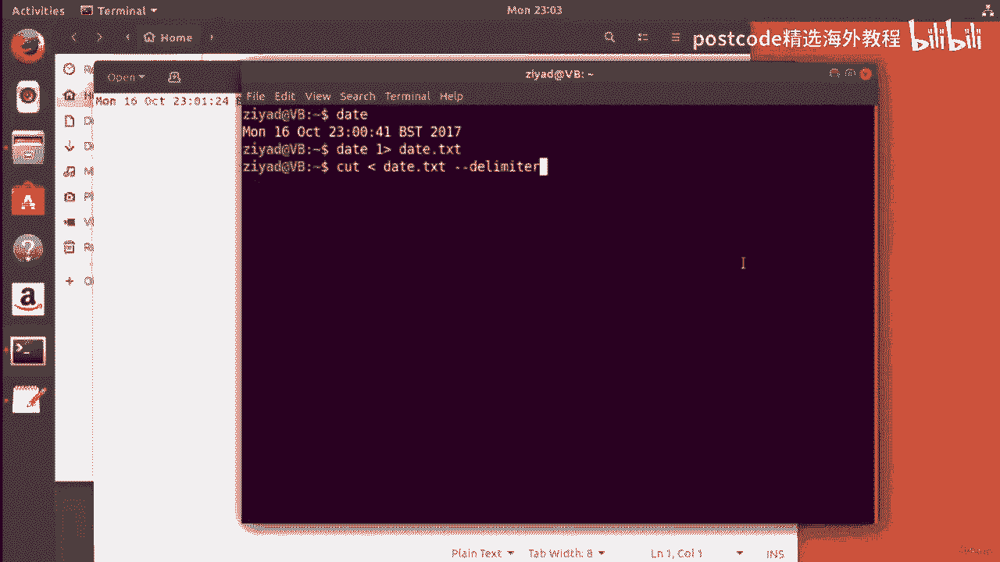

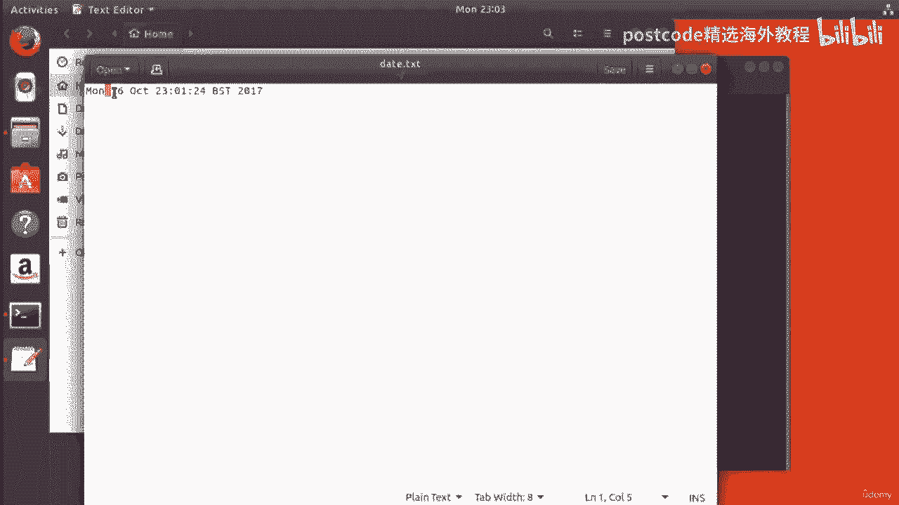

现在，我们可以使用重定向将`date`命令的标准输出写入一个名为`date.txt`的文本文件。作为一个小练习，请尝试回忆如何操作。

**如何将`date`命令的输出重定向到名为`date.txt`的文件中？**

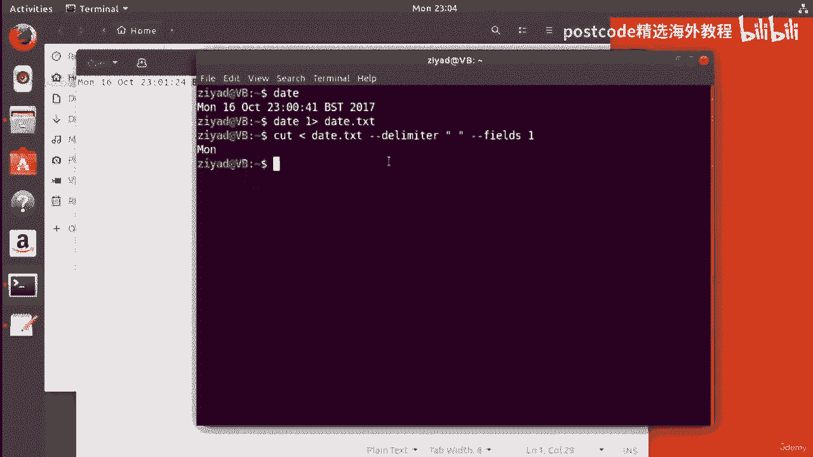

尝试一下，然后继续阅读以核对你的操作。


以下是你可以做到的一种方法：
```bash
date > date.txt
```
或者，你也可以明确指定标准输出流：
```bash
date 1> date.txt
```
这里的数字`1`代表第一个数据流，即标准输出。

如果你成功做到了，那么恭喜你，你已经掌握了重定向的基础。

现在，我们查看文件管理器，会看到一个名为`date.txt`的文件，其中确实包含了`date`命令写入的日期信息。

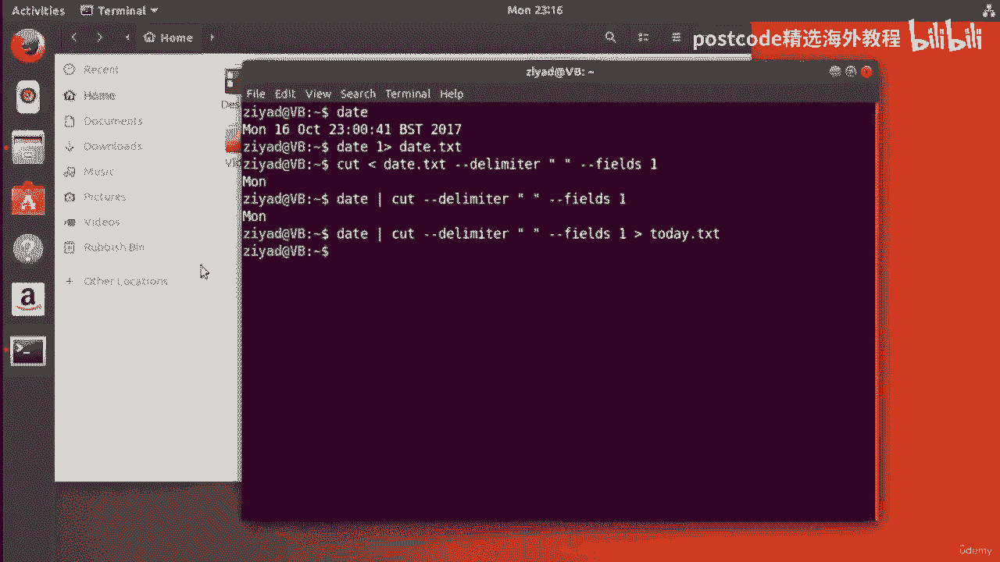

---

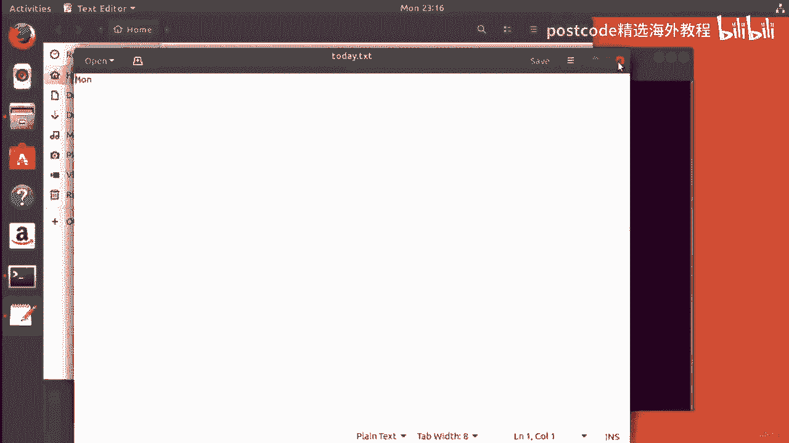

## 使用`cut`命令处理数据
上一节我们介绍了如何将输出保存到文件。本节中我们来看看如何从输出中提取特定信息。

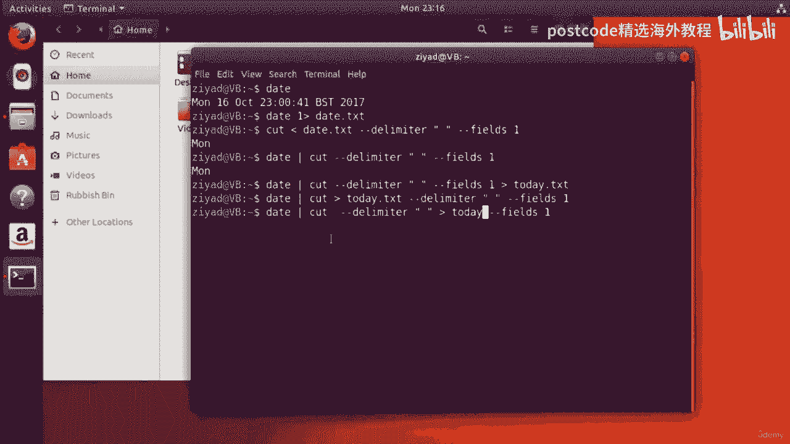

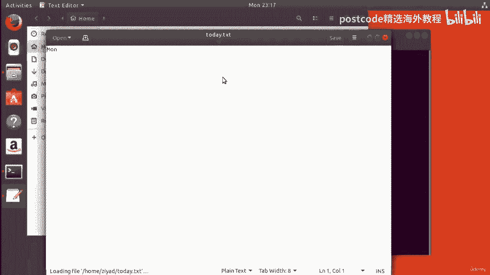

如果我们只想提取输出中的星期几（例如“星期一”），该如何操作？一种方法是使用`cut`命令。

`cut`命令的工作原理很简单，它用于从文本行中剪切出特定的部分。

首先，我们需要将`date.txt`文件的内容读入`cut`命令的标准输入。为此，我们输入：
```bash
cut date.txt
```
然后，我们需要为`cut`命令提供选项。`cut`命令需要一个分隔符来识别列（或称字段），以及指定我们想要哪个字段。

查看`date.txt`文件，你可以想象文件内容被空格分隔成了多个列。例如，“星期一”是第一列（第一个字段），“1月”是第二个字段，依此类推。

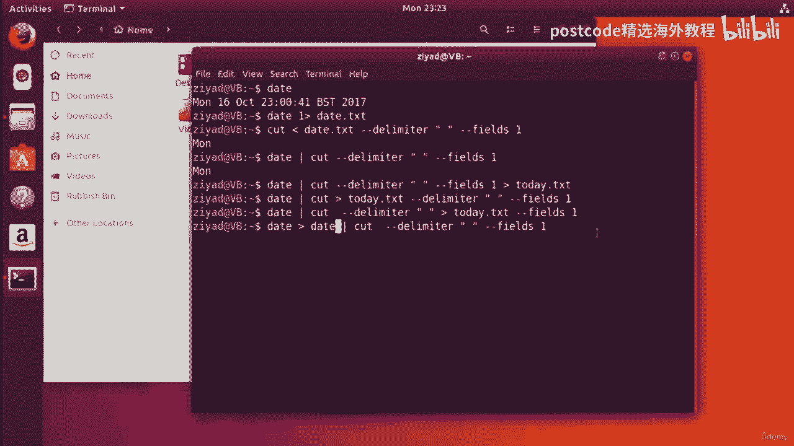

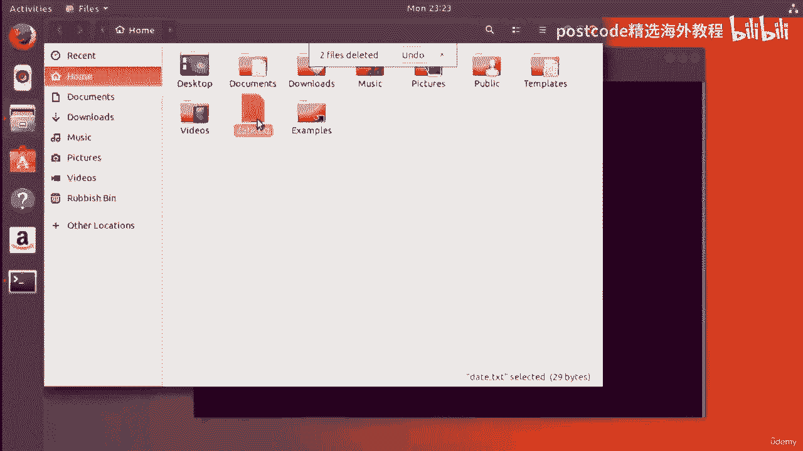

我们希望提取第一个字段。为了让`cut`命令正确工作，我们需要提供两条信息：
1.  分隔符（`-d`选项）：告诉命令用什么字符分隔列。这里，空格是分隔符。
2.  字段号（`-f`选项）：告诉命令我们想要哪个字段。

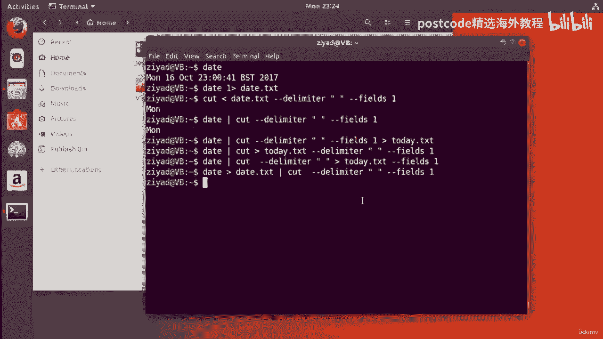

以下是完整的命令：
```bash
cut -d ' ' -f 1 date.txt
```
当我们运行这个命令时，`cut`会读取`date.txt`，根据空格将其分割成列，然后输出第一个字段，也就是“星期一”。

这个方法虽然有效，但有些笨拙。首先，我们将`date`命令的输出写入了一个文件，占用了磁盘空间。然后，我们必须读取这个文件。处理完后，可能还需要删除这个临时文件。这是一个低效且繁琐的过程。

---

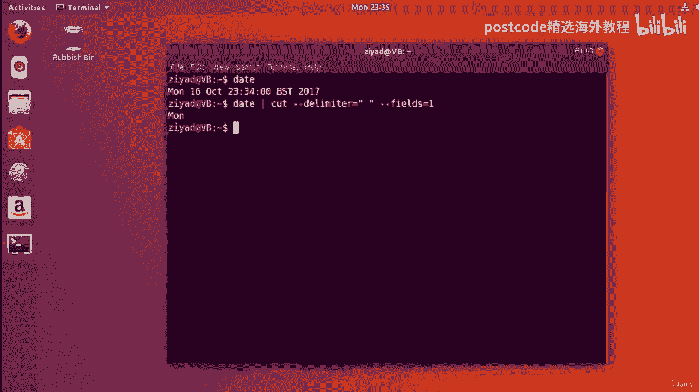

## 使用管道连接命令
上一节我们看到了分步处理文件的低效性。本节中，我们将学习如何使用管道来简化流程。

我们可以将`date`命令的标准输出直接通过管道（`|`）传递给`cut`命令。管道符号在大多数键盘上可以通过按住`Shift`键再按反斜杠`\`键输入。

现在，我们不再需要中间文件：
```bash
date | cut -d ' ' -f 1
```
这个命令的意思是：将`date`命令的标准输出，传输到`cut`命令的标准输入。按下回车后，我们直接得到了“星期一”这个结果。

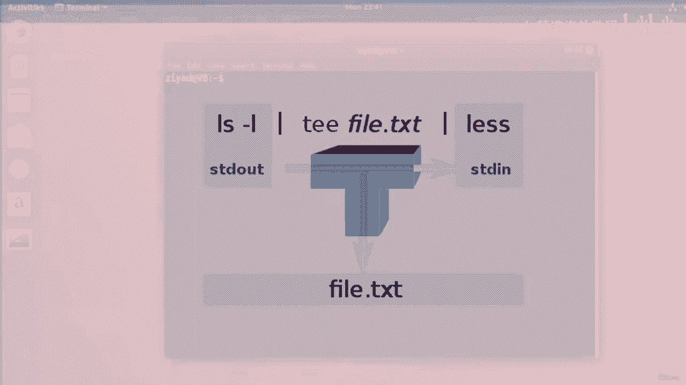

这非常高效。我们直接从`date`命令获取数据，并通过管道将其送入`cut`命令进行处理。

现在，我们还可以将最终结果输出到文件。例如，将提取出的星期几保存到名为`today.txt`的文件中：
```bash
date | cut -d ' ' -f 1 > today.txt
```
运行后，`today.txt`文件中就包含了“星期一”。

> **注意**：重定向符号`>`的位置可以灵活放置，只要逻辑正确即可。例如`date | cut -d ' ' -f 1 > today.txt`、`date | cut -d ' ' > today.txt -f 1`或`date > today.txt | cut -d ' ' -f 1`在某些情况下可能产生不同结果，但核心是理解数据流向。对于初学者，建议将重定向放在命令末尾，这样更清晰易读。

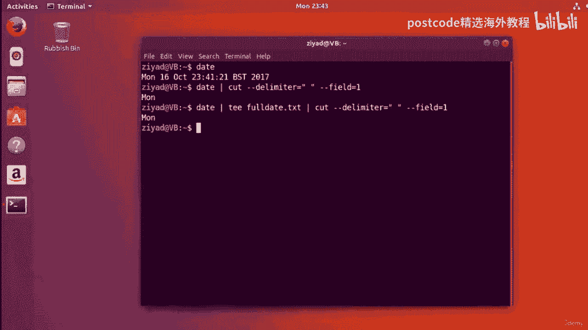

---

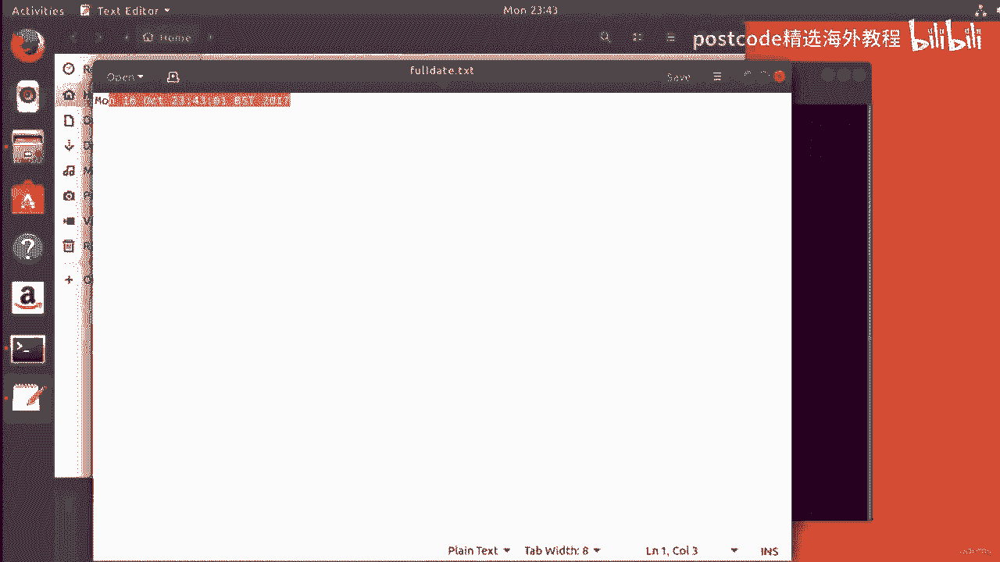

## 构建更长的管道链
如果我们不想将`cut`命令的输出保存到文件，而是想继续传递给另一个命令，该怎么做？

这很简单，只需添加另一个管道即可。命令结构如下：
```
命令1 | 命令2 [选项] | 命令3 [选项] ...
```
每个命令都可以有自己的选项和参数，并读取上一个命令的标准输出。你可以像这样将多个命令连接起来，构建强大的数据处理管道。这正是Linux命令行强大功能的体现。

---

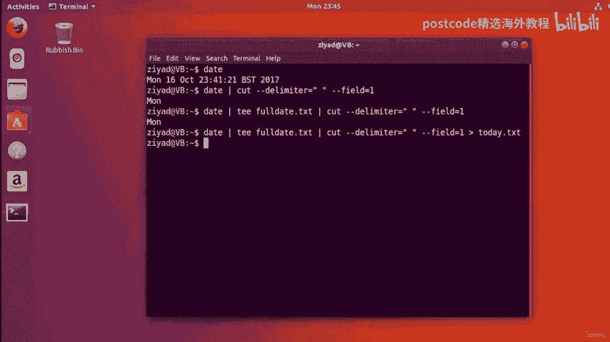

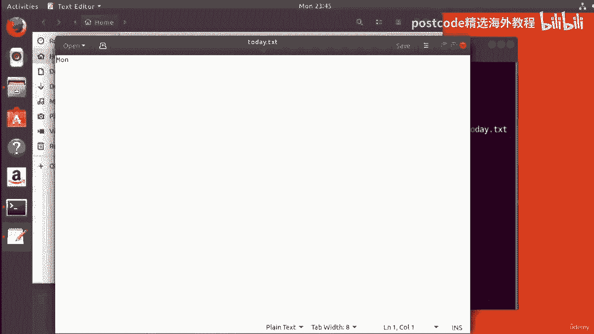

## 使用`tee`命令分流数据
上一节我们构建了管道链。本节中我们来看一个常见需求：如何将数据同时保存到文件并继续传递给后续命令？

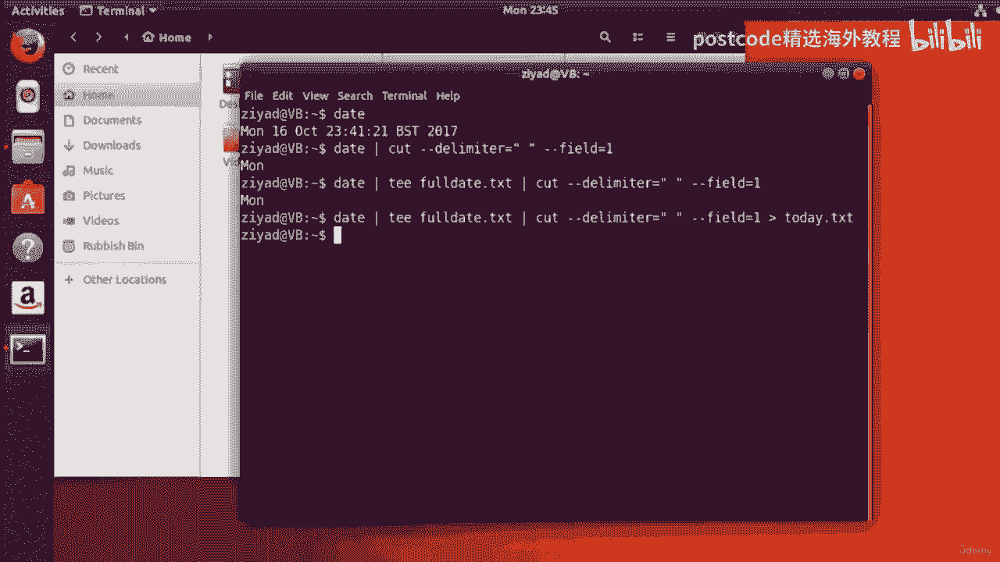


如果我们尝试在管道末端使用重定向，例如：
```bash
date > date.txt | cut -d ' ' -f 1
```
你会发现只有`date.txt`文件被创建，但管道被破坏，`cut`命令得不到任何输入。这是因为Shell会先处理重定向，然后再处理管道，导致数据无法同时流向两个地方。

为了使这项工作正常进行，我们需要使用`tee`命令。`tee`命令就像一个管道中的“T型接头”，它从标准输入读取数据，同时将数据写入一个或多个文件，并且将数据继续传递到标准输出，以供管道中的下一个命令使用。

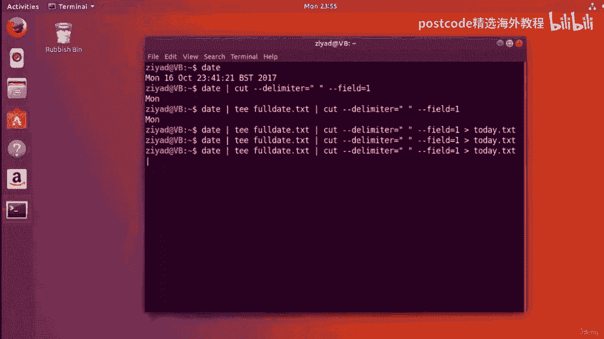

其工作原理可以想象为：数据水平流过管道，同时`tee`命令让数据垂直“滴落”到一个文件中。

让我们看一个实践例子。我们想将完整的日期信息保存到`full_date.txt`，同时提取星期几：
```bash
date | tee full_date.txt | cut -d ' ' -f 1
```
运行这个命令后，屏幕上会输出“星期一”（来自`cut`命令），同时当前目录下会生成一个`full_date.txt`文件，里面保存了完整的日期信息。

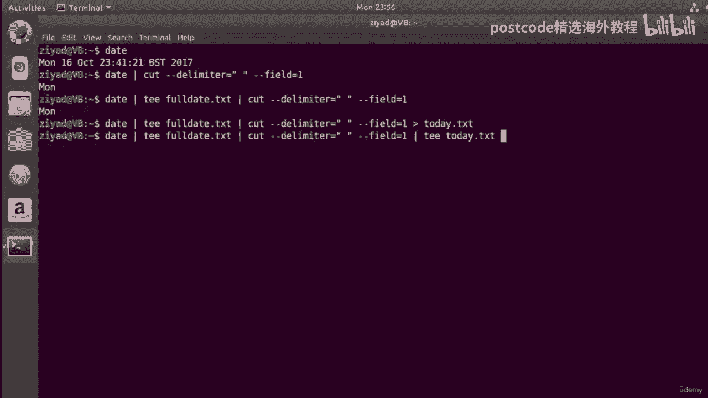

**小练习**：如何将上面命令中输出的“星期一”也保存到一个名为`today.txt`的文件中，而不是显示在屏幕上？

> **提示**：你可以在管道链的末端再次使用重定向。

**答案**：
```bash
date | tee full_date.txt | cut -d ' ' -f 1 > today.txt
```
运行后，你会得到两个文件：`full_date.txt`（完整日期）和`today.txt`（星期几）。

**总结一下**：
*   仅使用重定向（`>`）会保存数据，但会终止管道。
*   使用`tee`命令可以保存数据的快照，同时让数据继续在管道中流动。如果你想在构建长管道的同时保存中间结果，`tee`命令非常有用。

---

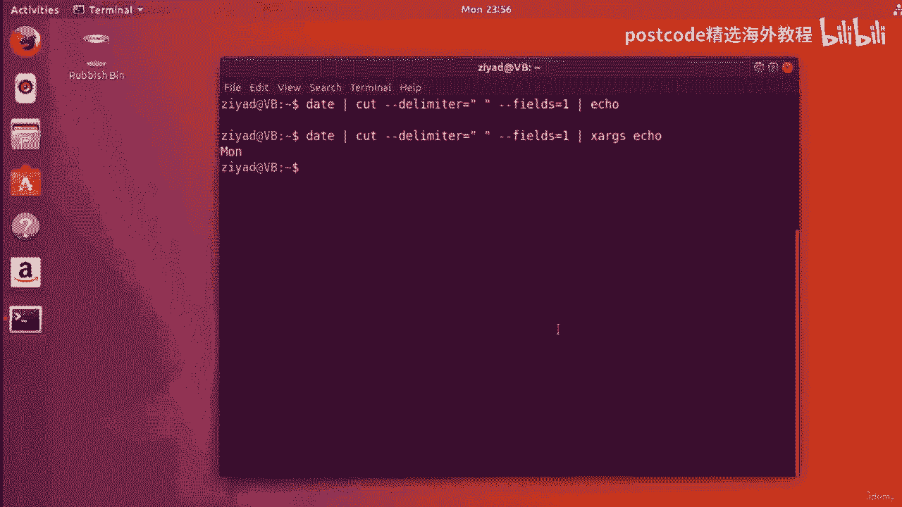

## 使用`xargs`命令转换参数
上一节我们学习了`tee`命令。本节中我们来看看另一个强大的工具`xargs`，它用于解决命令间参数传递的问题。

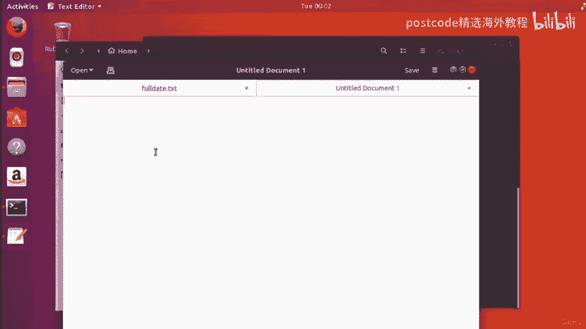

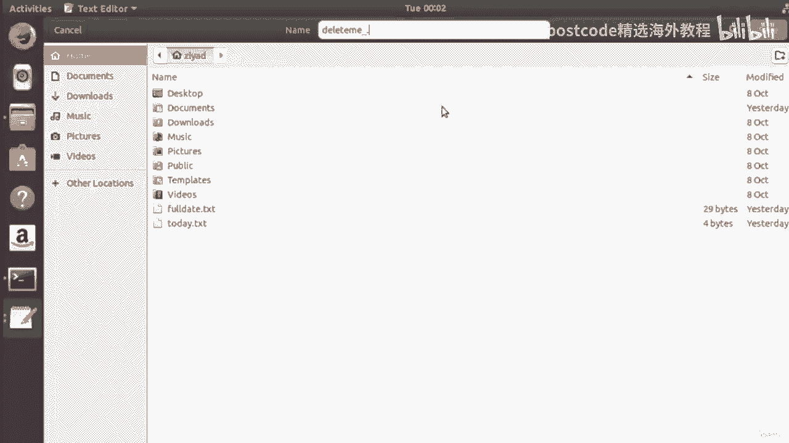

有些命令不接受标准输入，只接受命令行参数。例如`echo`命令：
```bash
echo Hello
```
它会输出“Hello”。但如果你尝试将`date`命令的输出通过管道传给`echo`：
```bash
date | echo
```
你会发现`echo`没有任何输出，因为它忽略了管道传来的标准输入。

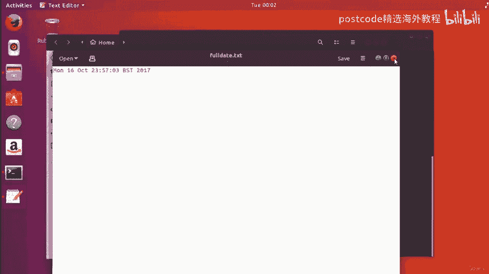

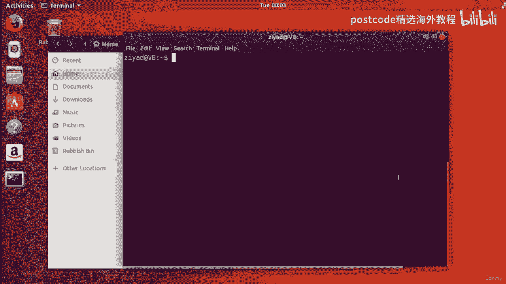

这时就需要`xargs`命令。`xargs`可以将从标准输入接收到的数据，转换为后面所跟命令的命令行参数。
```bash
date | xargs echo
```
现在，`echo`成功输出了日期。你还可以为`echo`添加自己的参数：
```bash
date | xargs echo "Today is:"
```
`xargs`会将自己接收到的数据（日期）和“Today is:”一起作为参数传递给`echo`命令。

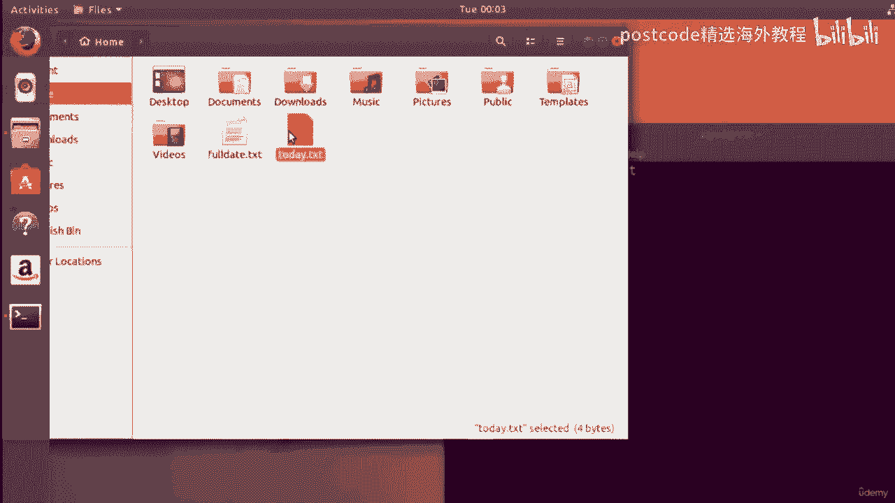

**一个实用例子**：
假设我们有一个文件`to_delete.txt`，里面列出了要删除的文件名，每行一个：
```
full_date.txt
today.txt
```
我们不能直接将这个文件的内容通过管道传给`rm`命令，因为`rm`不接受标准输入。
```bash
cat to_delete.txt | rm # 这行不通
```
但是，我们可以使用`xargs`：
```bash
cat to_delete.txt | xargs rm
```
`xargs`会读取`to_delete.txt`的内容，将其转换为`rm file1 file2`这样的命令行参数形式，从而成功删除文件。

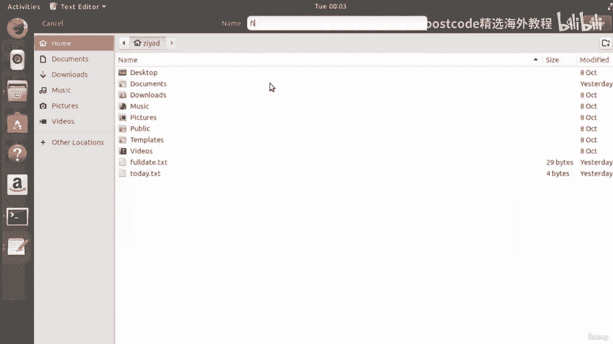

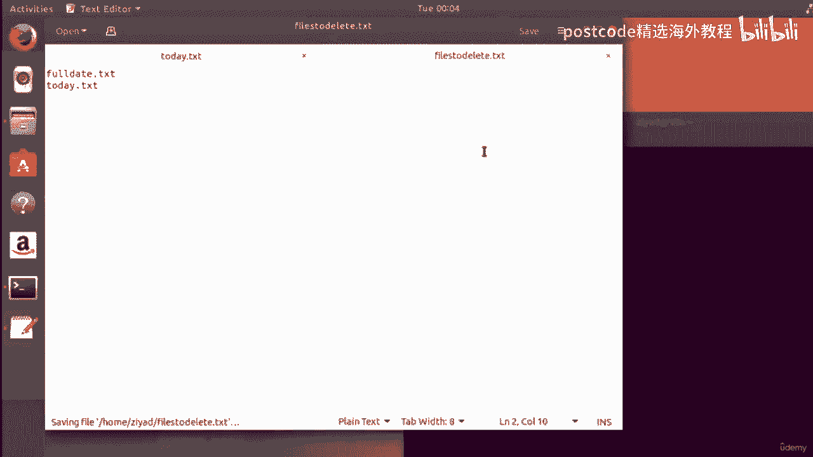

---

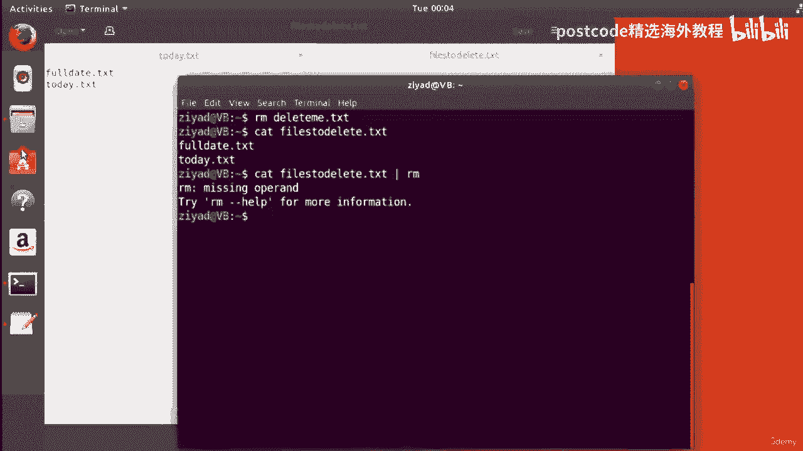

## 总结
在本节课中，我们一起学习了Linux命令行的核心概念——数据流控制。

1.  **管道（`|`）**：是连接命令的桥梁，允许将一个命令的输出直接作为另一个命令的输入，极大地提升了操作效率。
2.  **`tee`命令**：像一个管道分流器，可以在不中断管道数据流的同时，将数据写入文件。当你需要保存中间结果并继续处理时非常有用。
3.  **`xargs`命令**：是一个参数转换器，能将标准输入的数据转换成命令行参数，解决了那些只接受参数而不接受标准输入的命令（如`echo`、`rm`）在管道中使用的问题。

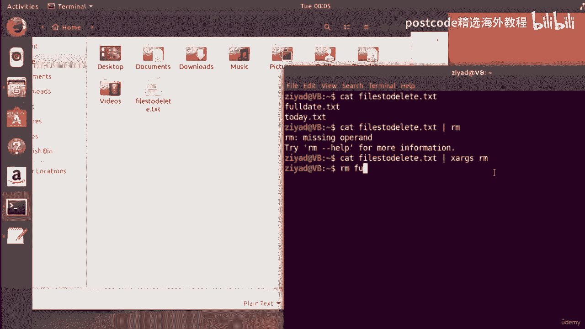

通过灵活组合管道、`tee`和`xargs`，你可以构建出强大而高效的命令行工作流，这是成为一名Linux高手的关键技能。