# 红帽企业Linux RHEL 9精通课程 — RHCSA与RHCE 2023认证全指南 - P27：04-04-003 Alias - 精选海外教程postcode - BV1j64y1j7Zg

好的。因此，要开始创建自己的命令别名，您需要做的第一件事就是创建一个特殊的命令别名，您的主文件夹中名为 Bash Aliases 的文件。为此，需要创建文件。

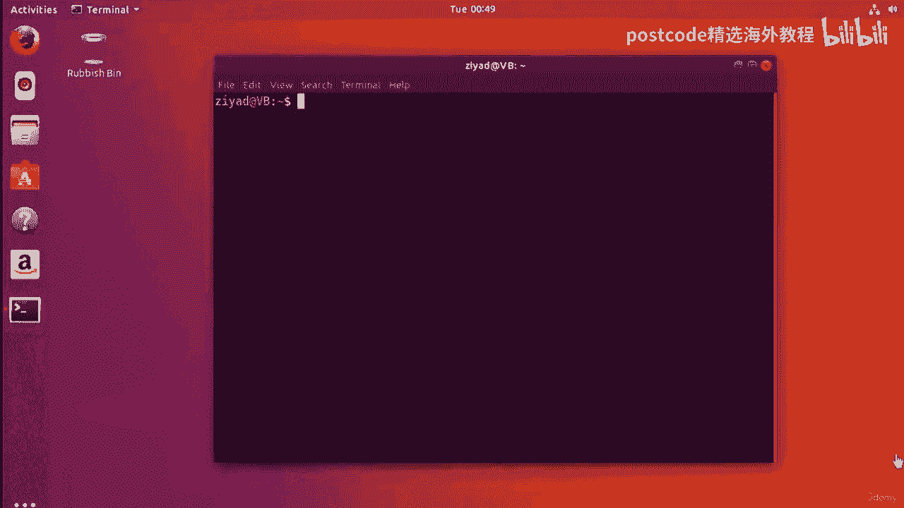

我们想要做的是点击左上角的活动，然后点击这里的搜索栏。

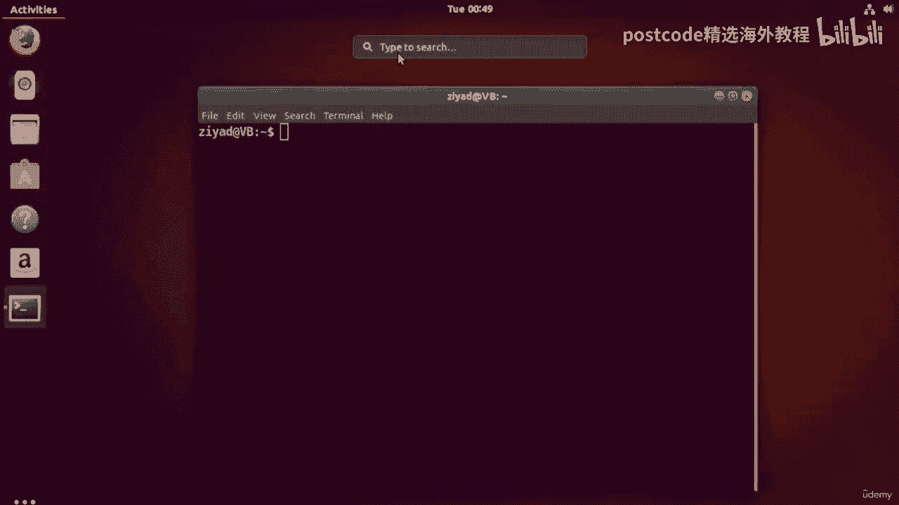

只需输入单词文本即可。它应该会出现一个东西，上面写着“这里，文本编辑器，只需单击它，它就会打开”，打开一个新窗口，我们实际上已经得到了一个文件。现在顶部有一个按钮，您可以单击“保存”。因此。

我将单击“保存”，然后在我的主文件夹中键入一个启动该文件的文件。

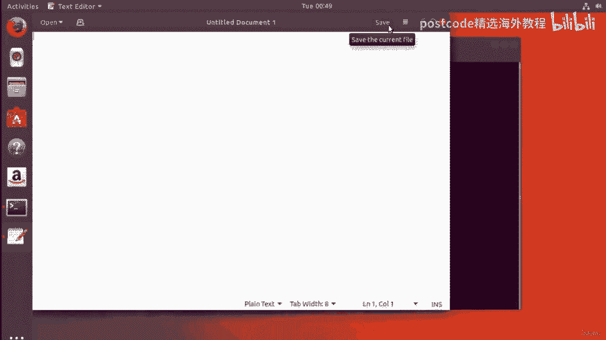

它需要完全按照我要告诉你的方式拼写。首先，你输入一个句点或句号，然后输入 bash，bash 全部小写，然后是下划线，然后是别名。所以别名。好的，这就是 bash 下划线别名，开头有句点或句号。

所有内容都在，小写，然后继续并点击保存。好的，现在我们有了 bash 别名文件，实际上我暂时不认为我们会，需要终端。所以我也将结束它。因此，请确保它的拼写完全符合句号，然后 bash 下划线别名，别名。

一切都小写。一旦你得到了这个，我们就可以开始了。所以现在您可能想知道为什么我们实际上需要在开头使用句号来命名文件？这很奇怪。我们通常不会这样命名文件，不是吗？好吧。

这个句号使该文件成为一种特殊类型的文件，称为隐藏文件。因此，如果我们回到这里的文件浏览器并查看我们的主文件夹，您会看到 bash，别名文件实际上不存在。哦，它去哪儿了？嗯，这是一个隐藏文件。

所以它是隐藏的。但它实际上在哪里，如果你点击这里带有三个栏的按钮，如果你点击那个，然后单击此处，将出现一个复选框，显示“显示隐藏文件”。如果我们检查一下。

我们将能够看到我们的 Bash Aliases 文件已经创建。但实际上这里还有很多我们以前没有见过的其他隐藏文件。但我们到了。这是我们当前正在编辑的 bash 别名文件，甚至还有一些隐藏文件夹。

也许您甚至不知道有人在您的系统中偷偷摸摸。但无论如何，我们现在不需要担心这些。让我们继续，再次单击这三个栏并撤消查看隐藏文件，使其全部消失，再次。所以我们不必继续看着床下的怪物，现在我们可以继续前进。

实际上，继续编辑 bash 别名文件。好的。现在我们已经在批处理别名文件中了，创建别名实际上非常容易。这是我们要为其创建别名的命令。这将是一个非常长的命令，其中包含大量复杂的内容。但我们可以做到这一点。

好吗？就是没什么新意了，它只是相当长。所以我们要输入日期命令。我们将把它传递给 cut 命令。我们已经见过无数次了，对吧？我们将告诉它分隔符是一个空格，我们将获得第一个字段。好的。现在。

我们还希望拥有该数据的副本。我们想要拍一张快照。因此，我们将采用 T 命令并将其保存在我们的主文件夹中名为 full date txt 的文件中。好的。所以到目前为止我们做得很好。

然后我们将仅拍摄一周中某一天的快照。我们将把它保存在我们的主文件夹中一个名为 Short Date txt 的文件中。然后出现的所有内容，我们将传递给 echo 命令，同时也给出 echo。

命令它自己的论点。哇，这是一个相当长的命令。正确的？所以我们在这里做了很多事情。但重点是它很长，因为这样你就可以看到别名有多么有用，对吧？因此。

使其适用于您的计算机的唯一方法就是不要使用 Ziad Well，除非在一台计算机上。您的名字也是 Ziad 并且您选择它作为您的虚拟用户名的可能性非常大，机，我觉得不太可能。但如果您是，请给我发消息。

否则请继续使用您的用户名进行更改，以便它与您计算机上的正确路径匹配。否则你就会开始出错。好的，如果您的用户名是 Sally，只需将其更改为 Sally。但我的是齐亚德，所以我就这样吧。

所以这就是我们要为其创建别名的命令。比方说，我们想要，而不是每次我们想要的时候都输入这个庞大的命令，要做到这一点，而不是仅仅输入，如果我们只想输入，获取日期，那就是，将成为我们的别名？好吧。

我们所要做的就是输入别名这个词，这是一个特殊的词。然后按空格，然后获取日期。该命令两侧是等号，然后是撇号。所以你可以看到这里有一个撇号，这里也有一个撇号。就像整个庞大命令两侧的单引号一样。

然后在开头使用别名，别名的名称和等号，然后在大量命令的两侧加上引号。所以我们要说的是，嘿，我想创建一个名为 Get Dates 的别名。这与此命令完全相同。现在，当我们保存并关闭它时。

我们需要关闭编辑器。所以我们去吧，我们点击这三个，这三个栏，点击关闭 OC 并关闭。

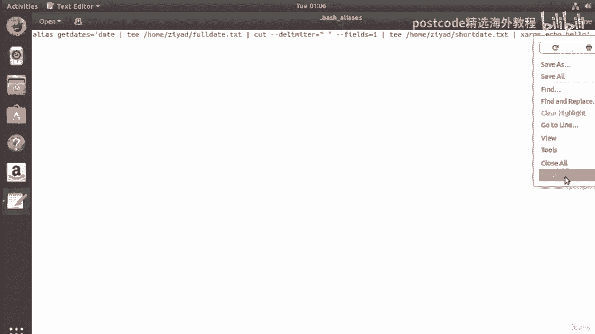

总的来说，我想让我把所有这些都拖下来并关闭。

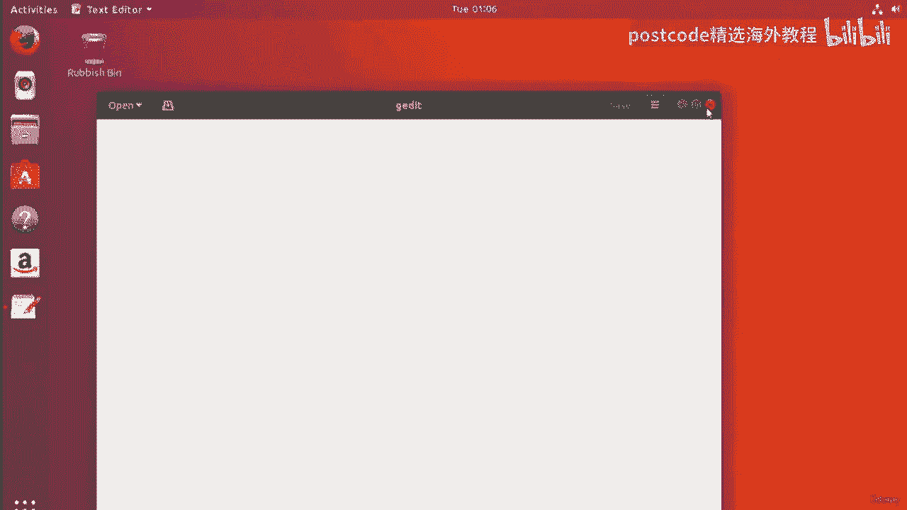

现在，当我们在终端打开时，当我们重新启动终端时，应该加载该别名。好的。所以我希望您将这些别名视为您自己的命令。那么，如果我们尝试运行获取日期命令，我们应该调用它吗？如果我们继续并按 Enter 键。

记住获取日期是我们实际得到的别名的名称，一些输出，所以这很酷。

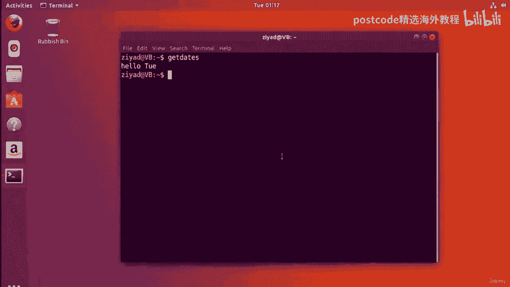

现在，如果我们继续查看我们的主文件夹，我们还会看到两个新文件已被添加，创建的。这样我们就得到了完整数据和短数据SDA。

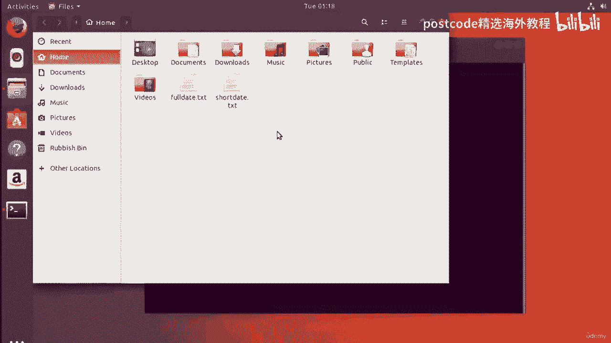

那么让我们继续看一下完整的数据。TXT 我们实际上已经得到了完整的日期。

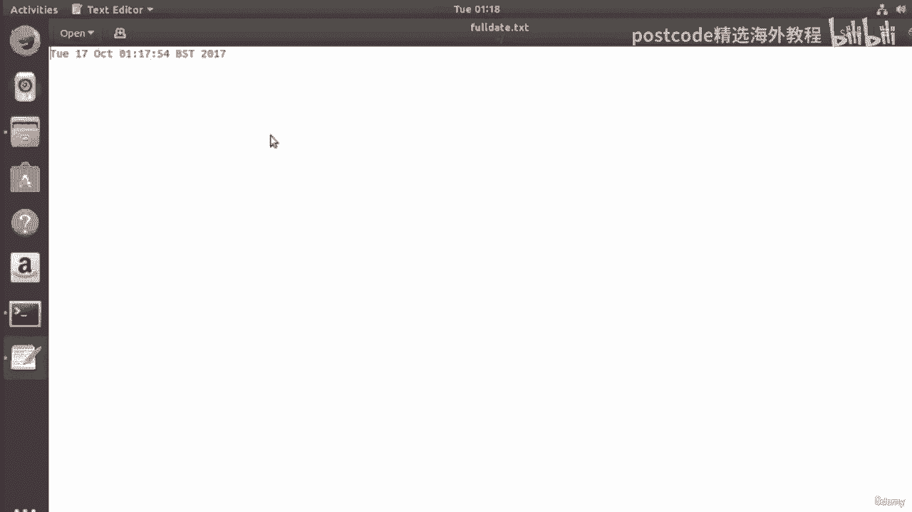

所有数据都已传递到其中，并且短日期点 txt 刚刚过去了星期几，在。那不是很棒吗？

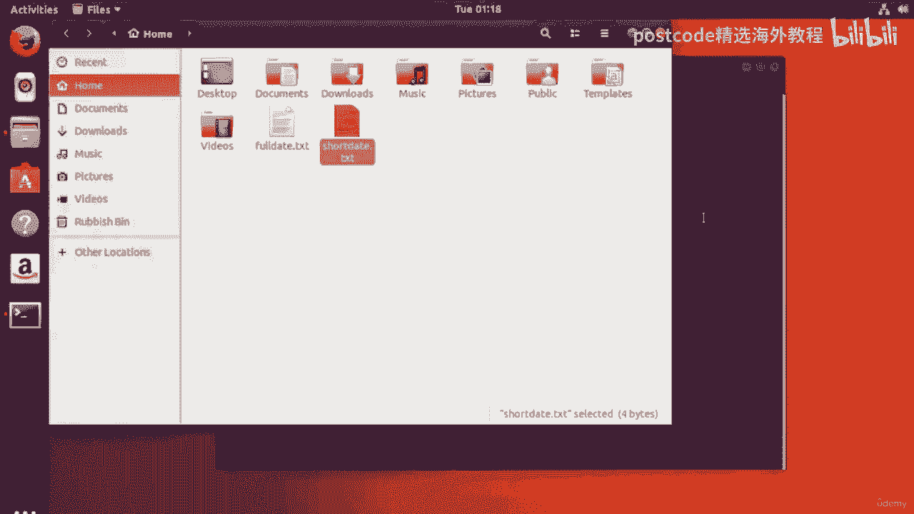

好的。因为这是来自别名。如果我删除这些文件并再次运行获取日期命令，我们会看到文件是否已被删除。

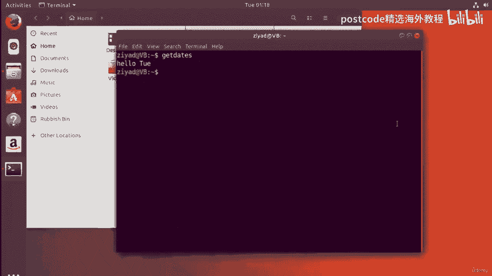

使用相同的数据再次创建一次。

这太酷了，对吧？就像不要输入那个非常非常长的别名，那个非常非常长的命令，每次我们想要获得该功能时，因为我们创建了一个别名，并且基本上给出了一个，命令获取日期的可爱昵称而不是庞大的管道。

我们现在可以获得相同的功能，但以一种更容易记住的方式，并且实际上很容易重现。所以这真的很棒。但现在让我向你展示一些超级酷的东西。实际上，您还可以在更大的管道中使用别名，因此请将您的别名视为自己的别名。

管道，对吗？如果您保存的迷你管道可以接受标准输入，如果您的别名中的第一个命令，它可以接受标准输入，然后您可以通过管道传输到别名并运行整个管道，然后，通过管道输出别名并继续。这就像拥有自己的小管道构建块。

所以让我向您展示。好的。假设我们想要为我们的命令指定一个别名，用于显示一个月前的日历，以及当月之后的一个月。因此，其命令将是 KAL，然后是 A 1，B 1。因此，一个月后一个月前，我们得到当前月份。

一个月后和一个月，前。好的，这就是命令。

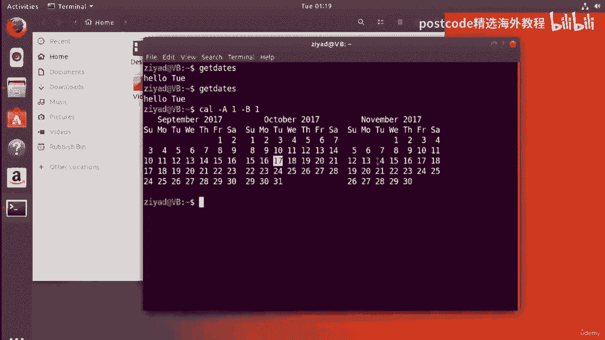

如果我们回到这里，请单击这三个水平箭头、水平条，抱歉，然后。

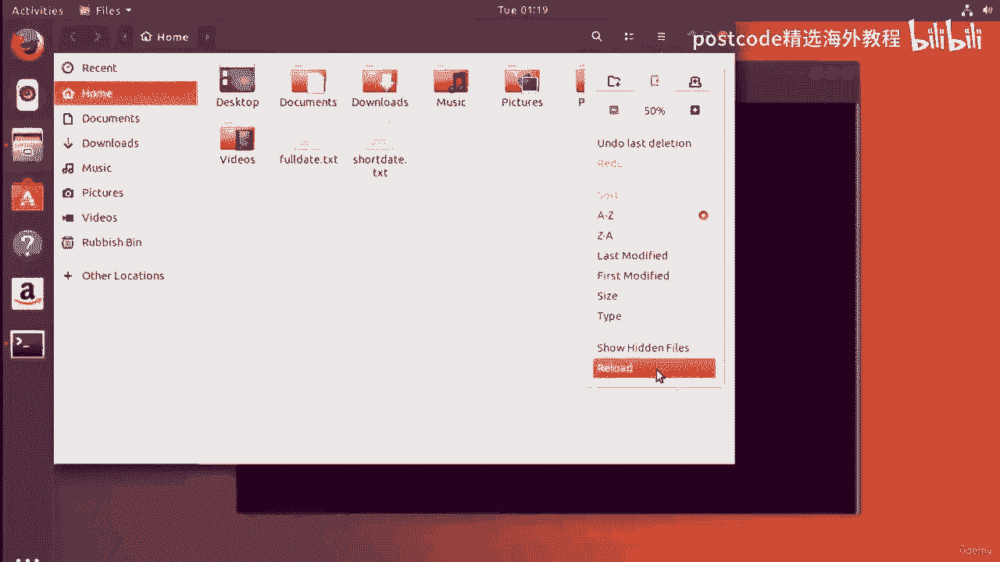

显示隐藏文件。单击我们的 bash 别名文件将其打开并转到文件中的新行。让我们为该命令创建一个新别名。所以我们要说别名。我们要说“牛魔法”，它是“日历魔法”的缩写，我们要输入一个等号。

然后您就可以实际键入一些语音标记。您不必使用单引号。您也可以有语音标记，我们将输入他们的 KAL。然后是a选项，给它一个数字1作为它自己的参数，然后a，B，大写B，然后一是，它自己的参数。

我们将把它输出到我的主目录中一个名为 dot txt 的文件中。当然，请记住将此位替换为您在虚拟机上使用的用户名。所以我们称之为牛魔法。但是这里的cow命令，对吧，cow命令只接受命令行参数。

默认情况下，您无法通过管道传输到ow 命令。因此，为了使其成为一个有效的管道，您可以访问这整个牛魔法的东西，一个有效的管道，您可以通过管道连接到它，我们实际上需要将 x args 命令放在开头。好吧。

我们就这么做吧。如果你不明白我现在在做什么，请耐心听我说，好吗？我们只是在制作一个构建块，这整个事情我们可以通过管道来实现。好的，这就是我们所做的。现在，无论什么将是管道到牛的魔法。

实际上都会是管道到 x args 命令，这将，然后将牛不接受的标准输入中的数据转换为命令行参数，卡尔确实接受了。因此整个管道将发挥作用。这将会非常棒。相信我。好的，让我们继续执行此操作。

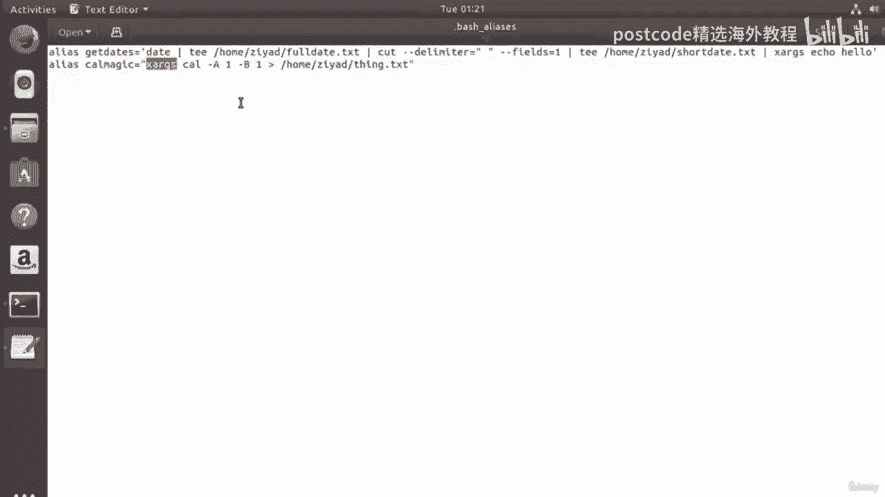

让我们关闭吧。让我们保存并关闭关闭所有内容的关闭，然后关闭我们的终端并重新启动它。

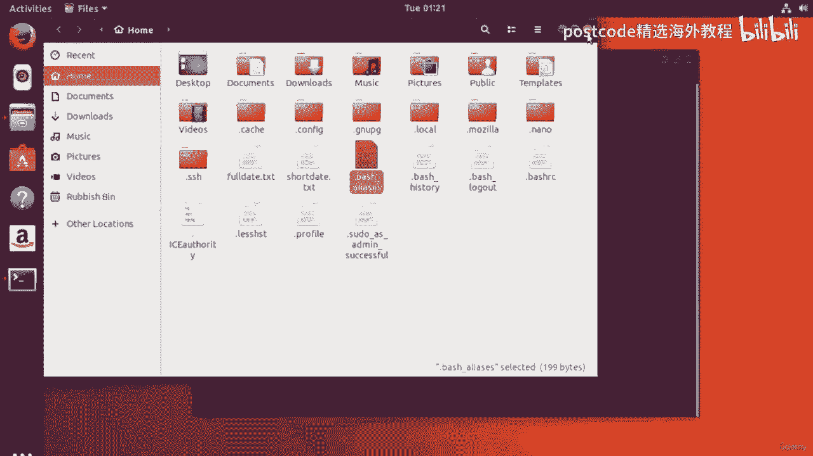

所以我要按 Control Alton T 打开我们的终端。

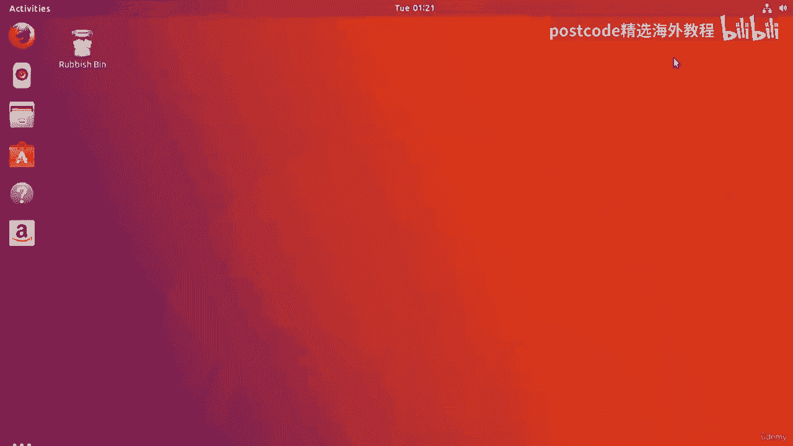

现在，如果我将 12 2017 回显到牛魔法中，将会发生的情况是我将回显该数据为，牛魔法命令的命令行参数。所以我们预计会发生的是 2017 年 12 月，日历上有一个月前和一个月后。好的。

保存到我们的主目录中的文件中。因此，如果我按 Enter 键，我们不会得到任何输出。

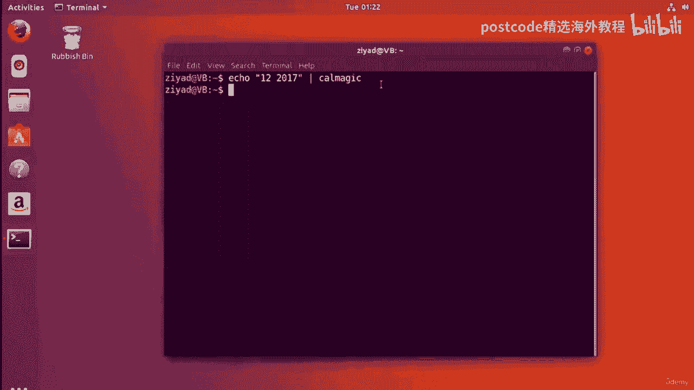

但是如果我们进入这里的文件，我们会看到这里有一个名为 dot txt 的文件。

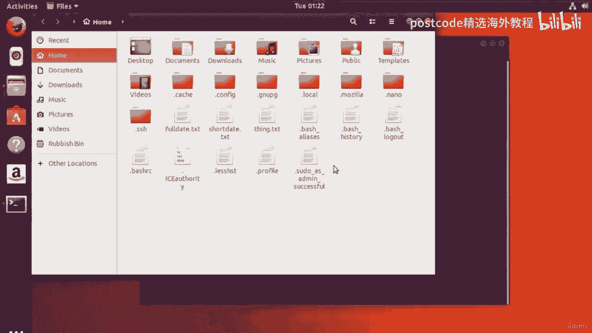

我们实际上已经成功保存了 2017 年 12 月的日历，也就是一个月前的日历。

一个月后，将其放入我们的主文件夹中名为 thing 的文件中。发生这种情况的原因可能是更容易看出我是否真的摆脱了这些隐藏的东西，文件。不，不，我会的。

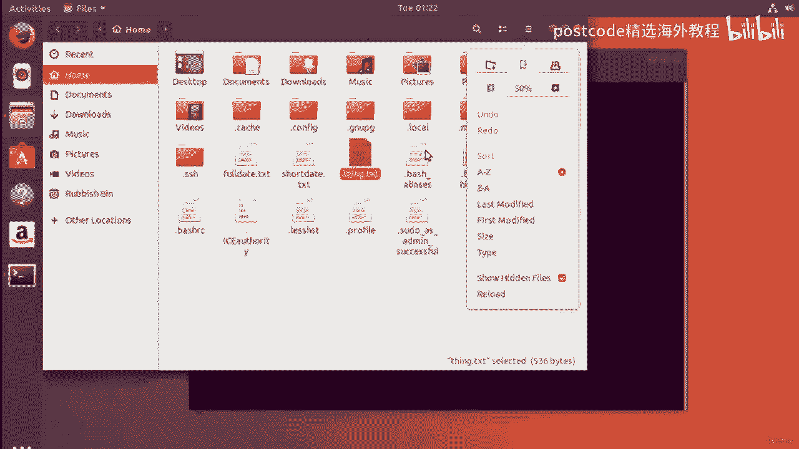

我会。保留它们，否则我会迷失方向。但发生的事情是我们回显我们基本上传递给 X Command 的信息并传递，it 12 和 2017，然后作为日历命令的命令行参数给出。

所以你可以看到所有这些东西是如何开始结合在一起的。正确的。我们制作了一个名为 Cow Magic 的迷你管道，现在可以随时运行命令。所以我们不必把这个丑陋的东西打出来。我们只需要记住牛的魔法就可以了。

因为我们可以通过管道传输到别名中的第一个命令，所以整个管道将，工作，我们可以在我们想要制作的任何程序中像迷你构建块一样使用它。那么这有多棒呢？

您能看到为管道编写别名并在其中使用这些别名的能力有多么强大吗？其他管道实际上可能是正确的。利用这种能力可以实现的可能性确实是无限的。所以我们就把它留在那里吧。我会让你大吃一惊。

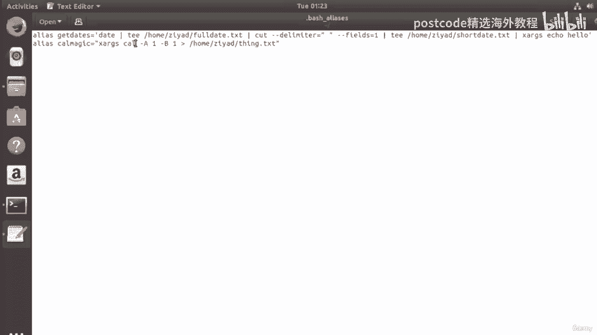