# RHEL 9 精通课程：P27：04-04-003 Alias 命令详解 🛠️

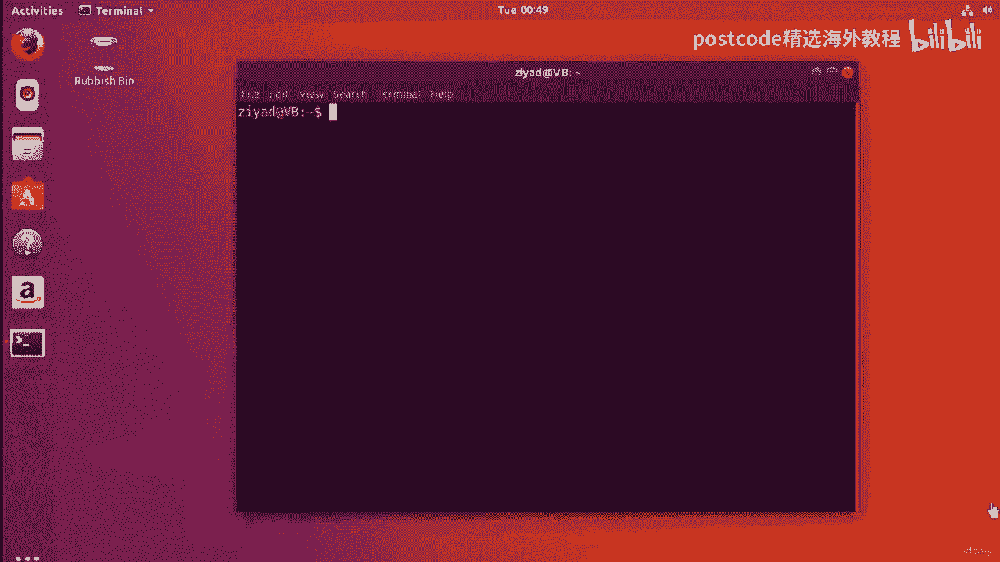

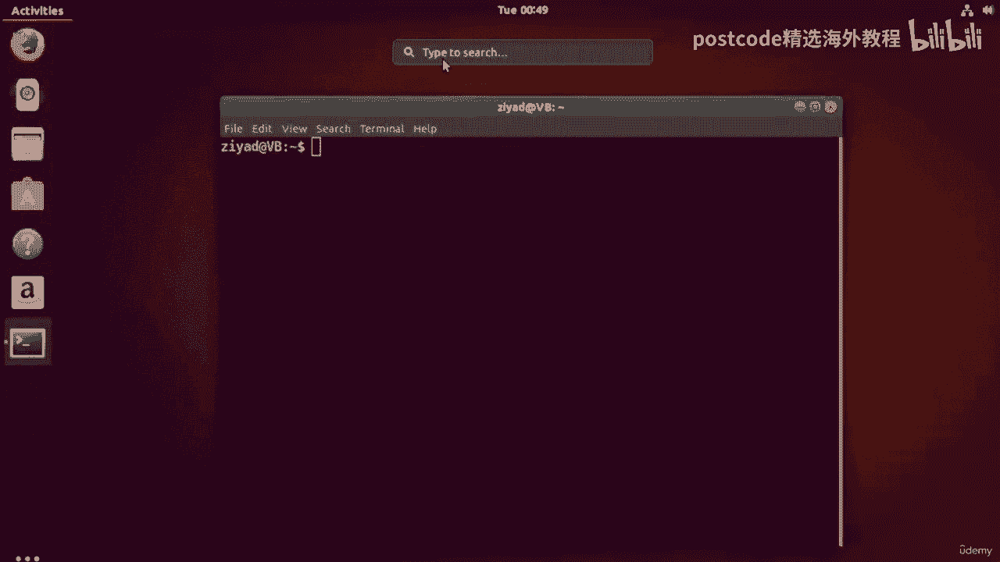

在本节课中，我们将学习如何在 Linux 系统中创建和使用命令别名。别名允许您为复杂的命令序列创建一个简短的、易于记忆的名称，从而极大地提高工作效率。


## 概述

我们将从创建存储别名的配置文件开始，然后学习如何定义简单的别名，最后探索如何创建可以接受管道输入的复杂别名，使其成为可重用的“管道构建块”。

---

## 创建别名配置文件

要开始创建自己的命令别名，您需要做的第一件事是在您的主文件夹中创建一个特殊的配置文件。这个文件名为 `.bash_aliases`。

以下是创建该文件的步骤：

1.  点击桌面左上角的“活动”，然后在搜索栏中输入“文本”。
2.  从搜索结果中打开“文本编辑器”应用程序。
3.  在文本编辑器中，点击顶部的“保存”按钮。
4.  在保存对话框中，导航到您的主文件夹，并将文件名设置为 **`.bash_aliases`**。
    *   请注意，文件名以句点 `.` 开头，后面跟着 `bash_aliases`（全部小写）。
5.  点击“保存”以创建文件。

**为什么文件名以句点开头？**
在 Linux 中，以句点 `.` 开头的文件是“隐藏文件”。这意味着在普通的文件浏览器视图中，您不会看到它们。要查看隐藏文件，您可以在文件浏览器中启用“显示隐藏文件”的选项。

---

## 定义您的第一个别名

现在我们已经有了 `.bash_aliases` 文件，可以开始定义别名了。别名的基本语法是：
```bash
alias 别名名称=‘要替代的长命令’
```

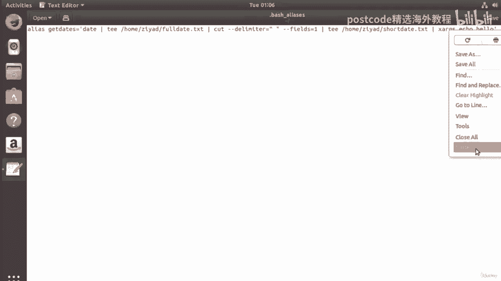


让我们创建一个别名，用于执行一个包含多个步骤的复杂命令。这个命令将完成以下操作：
1.  获取当前日期。
2.  将完整日期保存到一个文件。
3.  提取并保存星期几到另一个文件。
4.  输出一些信息。

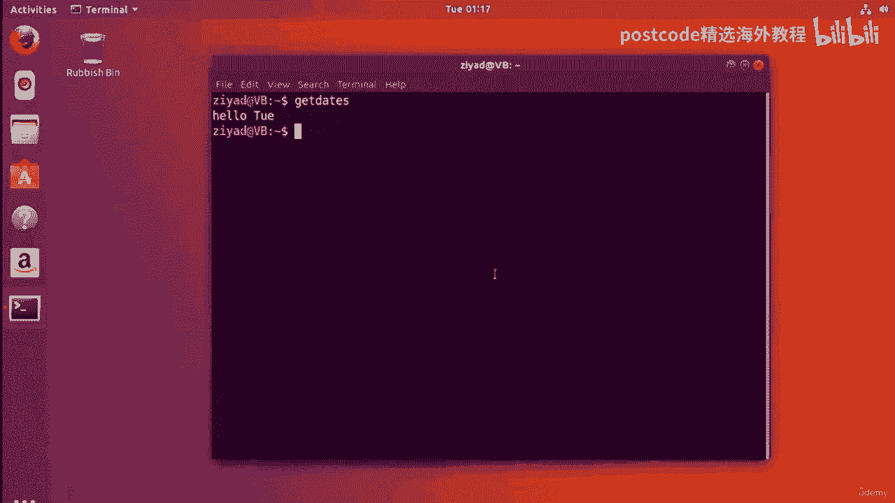

我们将为这个长命令创建一个名为 `getdates` 的别名。

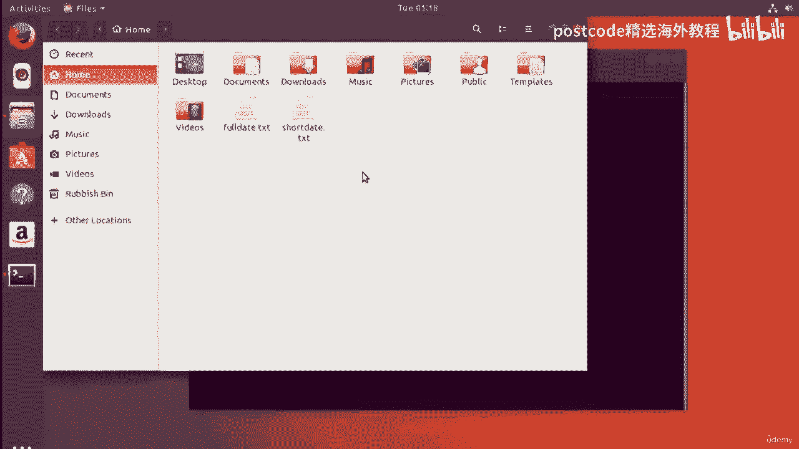

请打开您的 `.bash_aliases` 文件，并添加以下行（请务必将 `Ziad` 替换为您自己的用户名）：
```bash
alias getdates=‘date | cut -d“ “ -f1-6 > /home/Ziad/fulldate.txt && date | cut -d“ “ -f1 > /home/Ziad/shortdate.txt && echo “Date files created.”’
```


**代码解释：**
*   `alias getdates=`：定义了一个名为 `getdates` 的别名。
*   `‘...’`：单引号内是别名所代表的完整命令。
*   这个长命令使用了管道 `|`、重定向 `>` 和逻辑与 `&&` 来串联多个操作。

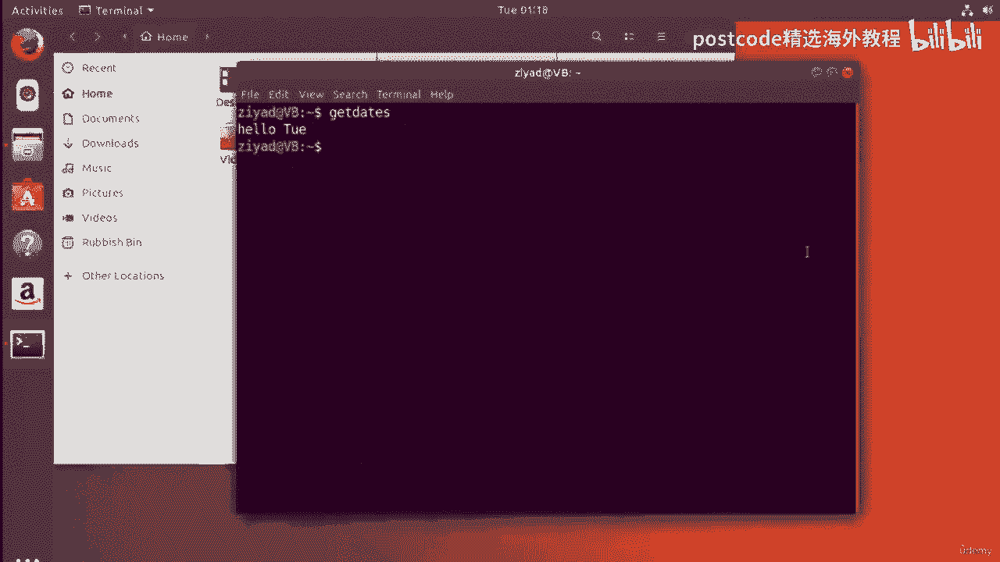


保存并关闭文本编辑器。为了使新别名生效，您需要**重新启动终端**或运行 `source ~/.bash_aliases` 命令。

现在，在终端中，您只需输入 `getdates` 并回车，系统就会执行那一长串命令。您可以检查您的主文件夹，会发现新创建的 `fulldate.txt` 和 `shortdate.txt` 文件。

---

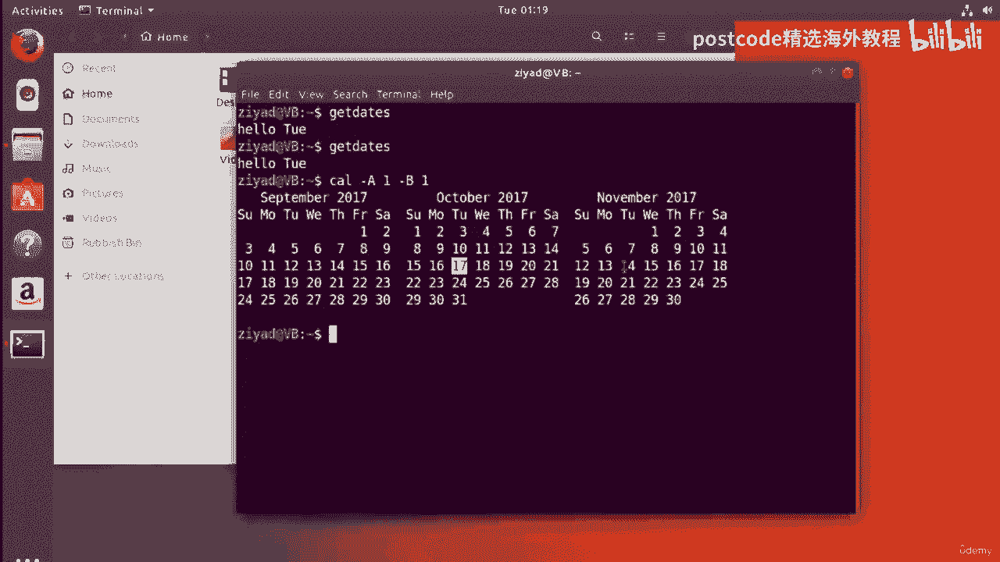

## 创建可接受管道输入的别名


上一节我们介绍了如何创建简单的命令别名。本节中我们来看看如何创建更强大的别名，使其能够作为管道的一部分，接受来自其他命令的输入。

这需要一点技巧：如果别名中的命令本身不接受标准输入（例如 `cal` 命令需要参数），我们需要使用 `xargs` 命令来将管道传递的数据转换为命令行参数。

假设我们想创建一个别名，用于生成指定年月的日历，并包含前后一个月的信息，然后将结果保存到文件。我们将这个别名命名为 `cowmagic`。

请再次编辑您的 `.bash_aliases` 文件，在新的一行添加以下内容（同样，请替换 `Ziad` 为您的用户名）：
```bash
alias cowmagic=‘xargs -I {} cal -A 1 -B 1 {} > /home/Ziad/calendar.txt’
```

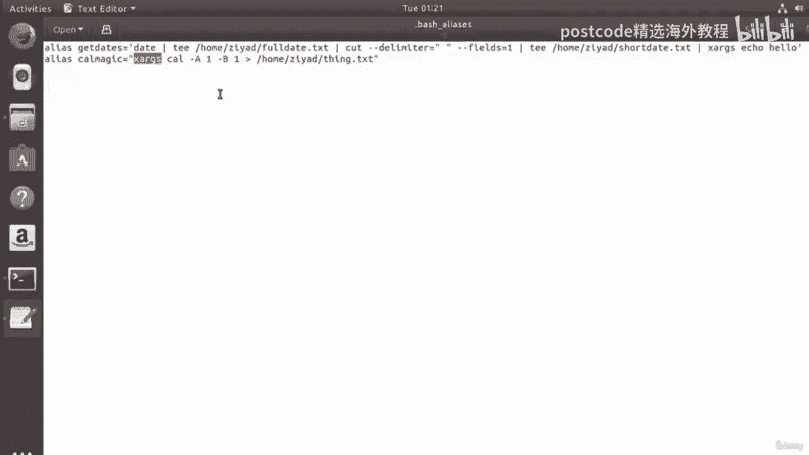

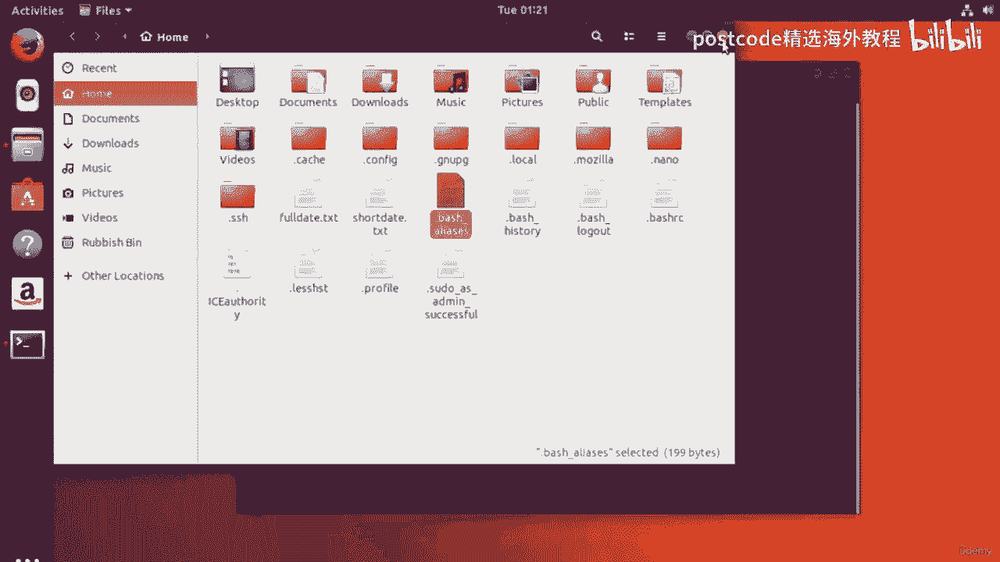

**代码解释：**
*   `alias cowmagic=`：定义别名 `cowmagic`。
*   `xargs -I {}`：`xargs` 命令用于从标准输入读取数据，并将其作为参数传递给后面的命令。`-I {}` 指定了替换字符串。
*   `cal -A 1 -B 1 {}`：这是实际的日历命令，`-A 1` 显示后一个月，`-B 1` 显示前一个月。`{}` 将被 `xargs` 传递过来的参数（如 “12 2017”）替换。
*   `> /home/Ziad/calendar.txt`：将日历输出重定向到文件。


保存文件并关闭编辑器。同样，需要重新启动终端或重新加载配置文件。

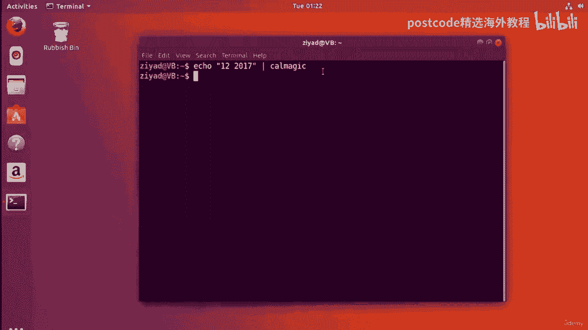

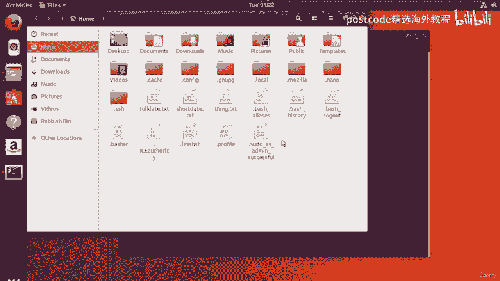

现在，您可以在管道中使用这个别名了。例如，要生成 2017 年 12 月的日历，您可以运行：
```bash
echo “12 2017” | cowmagic
```
这条命令会将 “12 2017” 通过管道传递给 `cowmagic` 别名。`xargs` 会接收这个输入，并将其作为参数填充到 `cal -A 1 -B 1 {}` 中的 `{}` 位置，最终执行 `cal -A 1 -B 1 12 2017` 并将结果保存。


---


## 总结

本节课中我们一起学习了 Linux 中别名的强大功能。
1.  我们首先学会了如何创建和配置 `.bash_aliases` 文件来永久保存别名。
2.  接着，我们掌握了定义简单别名的语法，能够用简短的命令替代复杂的操作序列。
3.  最后，我们探索了高级用法，通过结合 `xargs` 命令创建了可以集成到管道中的别名，使其成为可重用的功能模块。

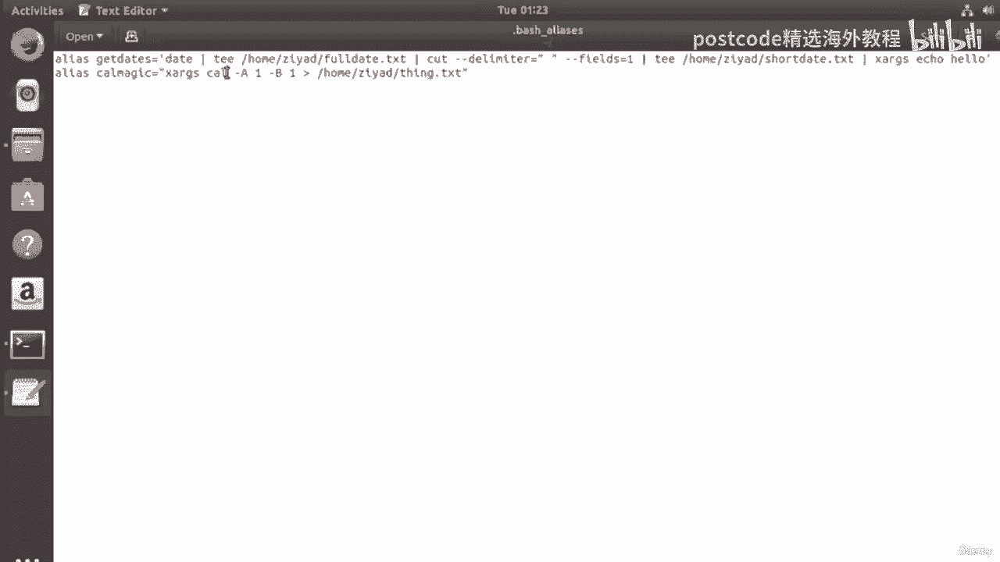

通过熟练使用别名，您可以将常用的复杂工作流程封装成简单的命令，从而显著提升在命令行环境下的操作效率和愉悦感。发挥您的想象力，创建属于自己的快捷命令吧！