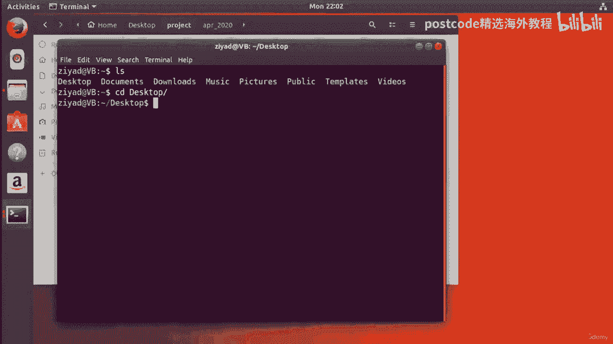

# 红帽企业Linux RHEL 9精通课程 — RHCSA与RHCE 2023认证全指南 - P28：04-04-004 Files and folders - 精选海外教程postcode - BV1j64y1j7Zg

因此，我们要查看的第一个命令是 touch 命令。touch 命令可以创建新的空文件。假设我想在桌面上创建一个名为“文件一”的新文件。因此，如果我只是转到桌面并尝试创建一个名为 File one。

txt 的文件。我们所要做的就是输入 touch、file one。我们可以在这里看到文件一已经创建并且出现了。那真是太棒了。顺便说一下，现在您不必在您所在的目录中执行此操作。因此，举例来说。

如果我做了类似 Touch 的操作，然后说，我想将其放入文档中，文件夹并在文档文件夹中创建另一个名为“远程文件”的文件。

现在，当我继续查看文档文件夹内部时，我们可以看到远处的，文件已创建，请记住这里的这些文件都是完全空的。

当您使用它们时，当您使用 touch 命令创建它们时，它们只是空白文件。

所以这很酷。现在，正如我所说，我们使用 touch 命令创建的文件完全是空的。但是，如果您想创建实际上包含某些内容的文件，那么我们可以使用，Echo 命令将内容重定向到其中。因此。

如果我想使用 echo 命令创建一个名为 hello txt 的文件并希望在桌面上，将内容放在文本中。你好，在那里。然后我只需输入 hello 并将其重定向到 hello 文本。现在重定向。

当您重定向到尚未创建的文件时，shell 将自动创建该文件并，放什么。把要放进去的东西放在那里。在里面。因此，如果我回显 hello，然后将其重定向到 hello 文本，则节目将创建该文件，当我们。

打开它，我们会看到 hello 位于该文件中。这是创建文件的另一种方式。

好的，这就是如何使用 touch 命令创建文件。让我们看看如何创建文件夹、目录。好的。因此，如果我只是清除屏幕，则在 shell 中创建目录的方式是使用 mkdir air 命令。

它代表 make 目录，所以 make 文件夹，它的工作原理与 touch 命令基本相同。因此，如果我们尝试在桌面上创建一个名为文件夹的文件夹，那么我所要做的就是键入 mkdir 并，称之为文件夹。

按 Enter 键，我们看到一个名为“文件夹”的新文件夹出现了，非常酷，对吧？同样，这可能会在远处发生。它不必位于您当前的工作目录中。因此，如果我想在图片目录中创建一个名为 Holiday 的文件夹。

然后按 Enter 键，那么我，可以通过两种方式检查。我可以按 CD 返回我们的主目录，使用 CD 进入图片，当我们看一下时。

我们会看到假期文件夹就在那里。我们也可以看看我们的图形用户界面。我们去拍照，我们有一个名为“假日”的文件夹也存在于此。

很酷，对吧？现在你可以。您实际上可以一次性创建整个文件夹路径，而不是一次创建一个文件夹。所以我回到桌面，假设我想创建这条路径，我想创建斜杠，东西，砍向朝拜，但我不能一次性完成它，因为外壳会给出。

我们收到一个错误，它会说 blah 文件夹不存在。这是因为 shell 试图先转到 blah，然后转到 thing，然后创建 qibla。这是迄今为止课程中最可笑的一句话，你不觉得吗？无论如何。

如果我们尝试为 mkdir 命令提供 p 选项，那么我们执行 mkdir the p 为其提供 p 选项。然后，即使没有任何文件夹存在，它也会创建整个路径。因此。

如果我们执行 blahlash 、slashblam 并像这样输入并按 Enter 键，我们就会看到这一点。

现在我们有废话，里面有东西，里面有问题。所以这真的很酷。我们一口气走完了整条路。

那有多棒？现在创建新文件或目录时需要记住一些事情，那就是，尽量避免在名称中添加空格。例如，如果我创建一个名为生日快乐的文件夹，如果我输入，如果我输入 mkdir 生日快乐，你看到了吗？

实际发生的是我们创建了两个文件，一个两个文件夹，抱歉，快乐和生日。那是因为文本之间有这个空格，这基本上使它成为两个命令行，论据。我们给了它一个快乐的输入和一个生日的输入，但我们只想成为其中之一，输入。

生日快乐，只需一个输入。那么我们该怎么做呢？好吧，实际上，您执行此操作的方法是执行 mkdir，然后用引号将其括起来，生日快乐。当您这样做时，您会看到我们得到一个名为“生日快乐”的文件夹。但一般来说。

文件夹中的文件中带有空格简直就是一场噩梦，在 Linux 中，因为整个空间问题和命令行参数以及所有这些东西。好的。所以通常你想要做的就是用下划线代替空格。因此，通常您想要做的不是生日快乐。

而是使用下划线，强调这里是这个小这个小符号。

所以在这里你可以看到我们有另一个文件夹，但带有下划线而不是空格，这只是。

使它通过选项卡、自动完成和其他类似的东西工作得更好。它可以防止您搞乱命令行参数之类的事情。当然，另一件事我想我已经多次提到过这一点，但是文件夹和文件名。

Linux 中区分大小写。因此，如果我执行 mkdir happy underscorebirthday，那是与生日快乐完全不同的文件夹，是小写的，而在 Windows 之类的东西上实际上是不行的。

这是如何使用 touch 和 mkdir 命令创建文件和文件夹的快速概述，下一个视频。我只是要在这里打破它。在下一个视频中，我们将更上一层楼，开始将所有这些优点与狂野结合起来，卡片和一个非常强大的能力。

称为支撑扩展，这将使我们能够创建数百个，所有文件和文件夹都在一个命令中。那么，让我们继续在这里进行剪辑，我们将在下一个视频中见到您。好的。

现在您已经知道如何使用 touch 和 mkdir 命令创建文件和目录了，让我们来看看，它上升了一个档次，并且有点混乱。假设您正在开展一个为期五年的大型项目，并且每个月都在进行，因为管理人员，讨厌你。

你需要写 100 个备忘录文件来跟踪项目，并且文件夹应该命名，比如2017年1月2017年2月2017年3月20日等等五年。每个文件夹中应该有 100 个文件，从第一个文件到第二个文件。

一直到第三个文件，直到，文件 100。如何预先创建这些文件和文件夹？好吧，如果用图形方式来做的话会很可怕。实际上没有办法解决这个问题。将会有大量的复制和粘贴以及大量的重命名。在整个磨难结束时。

你的右击手指基本上会处于痛苦之中。但让我向您展示在命令行上执行此操作有多么容易。因此，为了实现这一点，我们将使用 shell 的一个强大功能，即大括号扩展。这太棒了。看一下这个。因此。

让我们继续使用控制备用键盘快捷键打开终端。

然后我们要做的是使用 CD 命令转到桌面，然后，我们将创建一个名为 Project 的大文件夹，然后就完成了。现在它已经出现在这里了。让我们对其进行更改，更改为该项目文件夹。

我们可以看到现在我们位于桌面上的项目文件夹中，这就是奇迹发生的地方。我们需要制作 60 个文件夹，对吧？它们都应该采用这种格式。2017 年 1 月 2017 年 2 月 2017 年 3 月。好的。

就像三个三个字母，然后 2017 年一直到 12 月 20 日、22 日，所以 2022 年 12 月，是项目结束的时候。那么，如果我告诉你我们可以将所有这些文件夹放在一行中呢？

使用大括号扩展的力量这一切都是可能的。

所以命令来了。我要做的实际上是最大化屏幕，因为它有点大。我们要做的是输入 mkdir ，好吧，然后我们要打开一对大括号，这里的大括号就是这些弯曲的方括号，然后我们将不带任何空格地键入。

Jan 逗号、fib、逗号、三月、逗号、四月、五月、六月、七月、八月、九月、十月、，十一月、十二月根本没有任何空格。好的，然后我们要输入下划线，然后我们要打开另一对大括号。好的。

那么 2017 年、2018 年、2019 年、20 年、20 年、2021 年和 2022 年。呼。这是一个相当长的命令，对吧？但这里发生的是所谓的大括号扩展。这里我们有一些牙套，所以我们这里有一套。

这里有另一套，可以使用多年。shell 展开这些大括号的方式与展开括号的方式类似，在代数课上。好的。所以首先发生的是 2017 年 1 月，然后是 2017 年 2 月，然后是 2017 年 3 月。

依此类推，依此类推，直到2017年12月，然后一切又会重新开始。您将获得 2018 年 1 月、2018 年 2 月，然后是 3 月、4 月、5 月、6 月、7 月，一直到，你得到2018年12月等等。

直到你得到一直到12月20日、22日。好吧，悬念就够了。让我们继续并按 Enter 键。让我们继续运行它。现在，让我们看看它是否有效。

所以我们将进入我们的项目文件夹。哦，我的天啊。看看那是多么神奇。正确的。因此，我们设法为每一年都以这种美妙的格式创建文件夹。如果我们突出显示它们，它会告诉我们实际创建了 72 个文件夹。

所以从 2017 年 1 月，就在这里，一直到 2022 年 12 月，就在那里，一切，介于两者之间，这不是很棒吗？顺便说一句，如果我在这里最大化它以节省我们的打字时间，我们可以。

实际上，不必输入每个日期，因为它只是数字。它们只是数字，对吧。这是一种恒定的模式。我们本来可以只做点点。所以2017年到2022年。这是另一件事。现在想象一下做这些事情需要多长时间。

使用点击方法。可以想象那会是多么烦人。好吧，我们只是在一个命令行中完成了这一工作。好的。所以现在我们坐在这里感到非常沾沾自喜，我们的命令行刚刚创建了无数，一次性完成所有文件夹，我们还有一点要做。

那就是我们必须创建 100 个文件，在每个文件夹中。现在，我们要怎么做呢？嗯，实际上，这很容易。我们将再次使用大括号扩展。所以我们要做的是再次打开终端，进入桌面，进入。

项目文件夹。现在在这里，我实际上要最大化屏幕。

看看我做什么，然后我们就会看到它是如何运作的。好的，我们要输入 touch，然后我要打开大括号。一月、二月、三月、四月、五月、六月、七月、八月、九月、十月、十一月、十二月。我们的下划线和我们的岁月。

所以2017年、2022年。哦，顺便说一句，它不仅仅需要数字。它可以是 A 到 Z 或 A 到 Z 或类似 B 到 F 或类似的东西。因此，任何具有字母或数字等模式的东西，您都可以使用点点东西。

为了实现这一目标。但我们从 2017 年到 2022 年，现在在每个文件夹中，我们现在要建立一个档案法庭，以 file 开头，然后数字为 1 到 100。好吧，那么这是怎么回事？这太疯狂了。Ziad。

这个命令是从哪里来的？嗯，基本上我所说的是 2017 年 1 月以来的每个文件夹，一直到，2022 年 12 月，在每个文件中创建文件 1 到 100。现在，这只是一点乐趣。好吧。

所以不用担心它看起来有点像什么？只是为了向您展示 shell 的强大功能。我们来看一下。好的，让我们运行它并再次关闭终端。

我们先来看看吧。让我们从 2022 年 6 月开始吧，因为那是个好日子。因此，如果我们开放 2022 年 6 月，我们就会点击它。哦，天哪，我们有文件一、二、100。好吧，也许这只是一个侥幸。

如果我们 2020 年 12 月开放怎么办？没有。这个文件 1 到 100 也在那里。如果我们在 1 月或 2020 年 4 月开放会怎样？

我们又来了。我们已经从 1 到 100 了。那不是很棒吗？像你这样的人可以看到我们刚刚使用大括号扩展来使我们的终端命令令人难以置信的方式，强大的。如果我们有 72 个文件夹，我说我们只会做五年。

我们最终做了六人。但是，如果我们现在有 72 个文件夹，每个文件夹有 100 个文件，那么我们只需使用一个命令行来创建，一口气大约7200个文件。现在。

我希望您可以从这个小示例中看到 shell 的强大功能。顺便说一句，大括号扩展不仅适用于 touch 和 mkdir 命令，它实际上可以在整个 shell 中使用。那么比如说我们就拿LZ命令来说吧。

我们就拿LZ命令来说吧。我们可以查看每个文件夹并获取其中内容的列表。所以如果我一月、二月、三月、四月、五月、六月、七月、八月、九月、十月、十一月，12 月，然后是 2017 年直到 2022 年。

所以我的意思是基本上列出这些文件夹中每一个的内容。然后我按下回车键，哎呀，我来错地方了。

所以我将转到桌面斜线项目，现在按向上键两次返回那里。

再转到我们现在可以看到每个文件夹的内容的地方，您可以看到它们全部，里面有100个文件。我们可以在这里看到我们获取了文件 1 到 100 以及每个文件夹，它可能看起来像以下文件，以文件 99 结尾。

但实际发生的情况是，如果你在文件附近查看，它所做的就是对它们进行排序，在这里按字母顺序或数字对它们进行排序。所以你会看到文件一、文件十、文件 100，因为它们都以 1 开头，对吧？然后九就在那里结束。

但不，我们正在获取文件，每个文件有 1 到 100 个。假设我们想要获取所有这些输出，对吧？我们刚刚获得的大量输出并将其重定向，将所有输出重定向到一个名为“输出”的文件中。

文本。现在当我们查看时，我们现在有一个名为 TXT 的文件，如果我们查看，在那里，我们可以看到我们已经拥有所有内容。所以 2017 年 4 月，它告诉我们有哪些文件。

然后它告诉我们 2018 年 4 月有什么，告诉那里的文件，这些文件都是按字母顺序排序的。那不是很棒吗？

我只是在这里向你展示。现在，只需一个命令，我们就拥有了一个包含 72 个文件夹和大约 7200 个文件内容的史诗级文件，线。告诉我，这是一部史诗，需要你花很长时间才能使用点和。就像现在的方法。

我很欣赏这真的是有点像哇，那就是，好的。好的。我只是向您展示这些基本技能，例如创建一个文件或创建，一个文件夹，不费吹灰之力就能轻松涡轮增压，只要你懂一点，关于大括号扩展和通配符的一些内容。

但我会把你为什么要这样做的想象留给你。因为这些技能可以应用于许多不同的事情。而且，您知道，只是为了展示一个更简单的大括号扩展情况。如果我们到达这里的桌面，假设我们只想而不是说“触摸”，“归档”。

text、文件 B txt 和文件 C 点 txt 都可以正常工作。我们将创建三个文件，大括号扩展只是通过说 file。 使这变得更容易一些。你给它一些括号 a、b、c、txt。

所以你可以看到我们使用了括号，这里的大括号因为它将归档一个文本文件，b txt 文件 txt a 按 Enter 键。现在我们已经使用大括号扩展来扩展它了。因此支撑扩展在各处都发挥着作用。

因为我们在这里，我们有一些文本遵循一个非常简单的模式。我们可以在这里使用点点，我们将得到相同的结果。我们可以说，好吧，我想要文件 F 一直到 V。

现在我们也将在桌面上获取文件 V 一直到 F。所以我们在这里，这里是F，那里是V。所以只是向您展示这是大括号扩展。这并不是什么特别复杂的事情。相信我，我在这里向您展示的内容是有用的，但我只是想向您展示。

