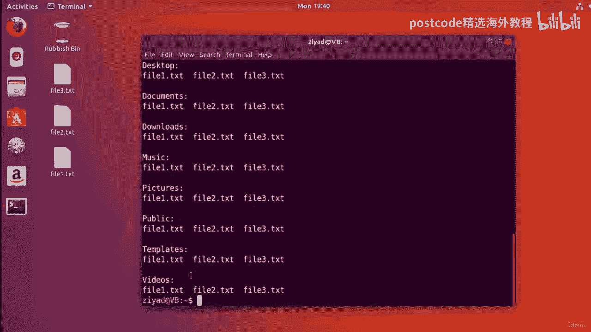
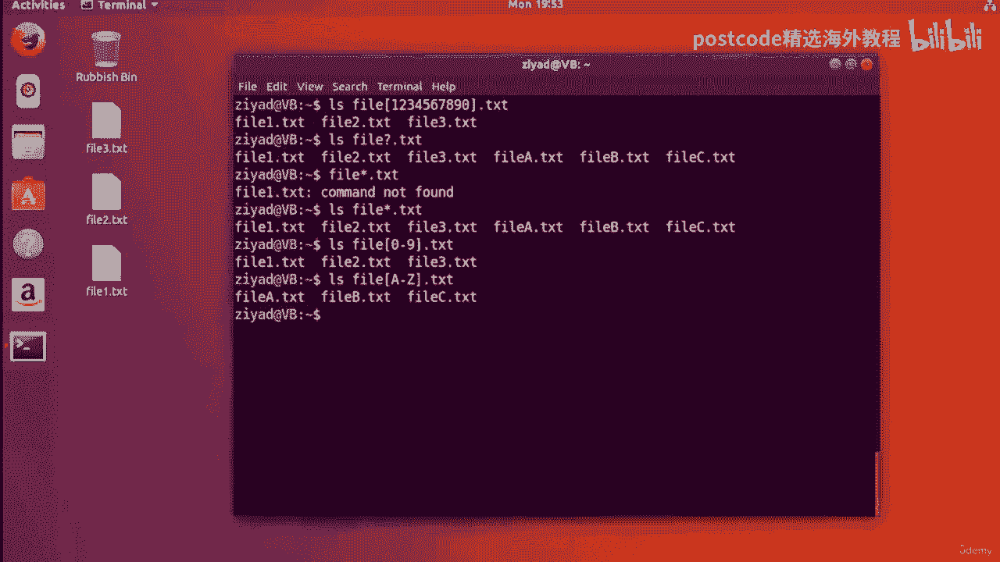

# 红帽企业Linux RHEL 9精通课程 — RHCSA与RHCE 2023认证全指南 - P29：04-04-005 Wildcards - 精选海外教程postcode - BV1j64y1j7Zg

首先，让我们再看一下 LSE 命令。现在，LSE 命令将列出我们为其指定有效路径的每个目录的内容。举例来说，假设我们想要列出文档目录的内容。我们可以执行 LSE，然后为其指定文档目录的路径。

所以我们使用斜杠，然后也许我们会添加一些制表符完成并让它列出我们的。

文件。或者，如果我们已经像现在一样位于主文件夹中。正如您所看到的，我们可以只说列出，列出文档，就可以了。但是，如果我们想查看文档文件夹和下载文件夹中的内容，并且，我们的图片文件夹同时？

好吧，让我们清除屏幕。我们这样做的方式是我们只说LSE，然后记录一些厚颜无耻的选项卡，自动完成下载，有点厚脸皮的选项卡，自动完成，以及一些带有一点厚脸皮的选项卡自动完成的图片。然后如果我们现在按回车键。

您会发现我们实际上可以看到每个的内容。

目录已列出。到目前为止，一切都很好。但你可以看到这是一个多么手动的过程，对吧？我们必须输入文档，然后输入下载，然后输入图片，即使是，表完成，以便将它们作为命令行参数传递给 LSE 命令。现在。

通配符基本上是 Shell 解释为具有特殊含义的特殊符号。通配符背后的想法是建立强大的模式，称为正则表达式，这样，手动输入每个命令行参数，你可以说，嘿，Linux，使此命令作用于与此模式匹配的任何内容。

这些模式称为正则表达式，您可以将通配符视为一些，用于创建正则表达式的有用构建块。现在，使用通配符构建正则表达式为您提供了很大的灵活性并可以控制如何，你的命令有效并且可以拯救你。

大量键入和使用正则表达式使您的命令更具表现力。因此，例如，不要表达 RLS 命令，例如列出该文件夹的内容并，这个文件夹和这个文件夹，这是我们通常将其与命令行参数一起使用的方式，正确的？我们会说。

让我们做文档、下载和图片、下载器、下载、下载。

和图片。这就是它的工作原理。你必须手动列出它们。相反，你可以这样做，嘿，你为什么不列出每个的内容。

以字母 D 开头的文件？例如，如果您要删除文件，而不是说“删除此文件、此文件和此文件”。

您可以说，删除此文件夹中的每个文件，只要其名称以点 txt 结尾即可。或者，如果您要复制文件，而不是说复制此文件以及此文件中的此文件，您可以说，复制此文件夹中的每个文件并复制到另一个文件夹。

只要其名称以 PDF 结尾。

好的。现在我们明白了我们正在使用通配符来构建这些模式，这些正则表达式。

让我们开始使用通配符构建一些正则表达式。现在，最常用的通配符之一是星号或星号通配符。

现在我通过按键盘上的 Shift 和 8 找到星星。

如果我按 8 键，我就会看到这颗星。如果您曾经使用过 Microsoft Excel 或电子表格软件软件包，那么它就是您所使用的符号，用来做乘法。但我发现它是在键盘上使用 Shift 和 8 来实现的。

您的符号可能会有所不同，但这就是我们正在寻找的符号。现在，每个通配符都匹配特定的模式，星号或星号通配符匹配任何部分，文本，无论文本的长度。而且它还匹配数字。假设我们想要检查主文件夹中每个目录的内容。

让我清除屏幕。如果我清除屏幕而不是将它们全部列出来。好的，因为这里有很多文件夹，对吗？而不是说，好吧，LRS桌面和文档和下载等等等等。我们所要做的就是 ls star 即可。

因此，如果我按下“如果我这样做”，您可以看到它刚刚列出了主页的所有内容。

文件夹，桌面文档、下载、音乐图片、公共模板和视频集于一身。

去。那么让我清除屏幕。那么这是怎么发生的呢？发生这种情况的原因是因为星星与任何你需要想到的东西非常匹配，当你，为命令提供一个要使用的正则表达式。想象一下它将任何与该模式匹配的内容作为命令行参数。因此。

因为星号通配符匹配任何内容，所以它将所有内容作为命令的命令行参数。那有意义吗？我们再举一个例子。假设我只想列出以 D 开头的文件夹的内容。所以桌面上有下载和文档文件夹。我能做的是我可以说，好吧。

让我们做 LS，然后是大写 D，然后是星星。现在的模式是这样的。图案是 D，然后是星。星星是构建块之一，字母 D 也是构建块之一。所以我们在这里所说的是列出，然后将其作为命令参数，任何有 D 的东西。

大写 D，然后跟任何内容。所以基本上任何以大写 D 开头的东西。

因此，如果我这样做，您可以看到我们只看到桌面文档和下载，您可以看到，他们都符合这个模式，这个D星。它们以大写 D 开头，然后是 A，后面跟任何内容。

它们以大写 D 开头，然后是 a 后面可以跟任何内容。如果我们只想要文档和下载怎么办？嗯，它们从 D0 开始，然后是任何内容。

正确的。因此，如果我执行 lhs doe 比您可以看到的任何操作，我们只会获取文档和下载，但桌面会被忽略。现在，这里要记住的重要一点是这些通配符和正则表达式。

区分大小写。因此，如果我们先执行 lhs D，然后再执行一个星号，请注意 D 是小写的。

你可以看到我们什么也没得到。没有任何结果，因为没有任何内容以小写 d 开头，但如果我们现在执行大写 D，那就会了。

工作。好吧，那真是太棒了。让我清一下屏幕。您已经了解了使用星号通配符来匹配任何文本的几种方法，并且您还了解了一些。

它可用于构建正则表达式的方式。现在，在使用正则表达式时，您可能会使用一些其他常见的通配符，和通配符。第一个是问号通配符。现在，星号通配符将匹配任何内容，无论长度如何。例如。

如果我执行诸如星号文本之类的操作，只要它以文本结尾，就可以匹配任何内容。

因此，如果我执行 ls star text，您会发现我们只能看到以点文本结尾的内容。现在，文本前面的 the 开头的内容是否是一个字母长并不重要，一个数字长或 100 个字母长就充满了数字或其他什么。

即使它有一千个字符长也没关系，它仍然会匹配，因为星号可以匹配任何东西，但问号。通配符仅匹配一个位置。因此，如果我现在做 LHS 做问号文本，实际上不会显示任何内容，因为问号。

这基本上说的是显示任何以文本结尾但之前只有一件事的内容，它。好的。因此，这将匹配文本、Q 文本、L 文本或一点文本等内容。你会注意到他们都只获得了一个位置。只是。点之前。TXT 问号是一种表达方式。

它就像是那个地方的占位符，而星号，有多长并不重要。所以问号通配符可以让你保持星号通配符的通用性，因为它，匹配什么并不重要。它可以匹配数字，也可以匹配字母。但。但它允许您限制长度。星号对长度没有限制。

而问号则有，但这并不重要，那个地方充满了什么。现在，当您想要构建通用模式但关心时，通常使用问号通配符，文件名的长度。所以如果我们做了类似的事情。问号，问号点 pdf。

那么它将匹配诸如单点 pdf 或 B 两个 pdf 之类的内容，或者 pdf 或者你知道，z 七点 pdf 或类似 77。 PDF 的东西。你看我们如何只占用两个空格，然后点 pdf，这就是问号，问题。

标记 pdf 即可。我们说我们要用两个东西、两个空间来填充它。我们不确定那里会放什么，但必须有两个空格，两个地方，然后是点，PDF。这就是它的工作原理。这就是问号。现在另一种类型的通配符称为方括号。

这里有哪些？这里的方括号。现在，方括号通配符与问号类似，它只匹配一个位置。但是方括号不会匹配问号之类的东西，而是只允许字母模式，成为？它们允许它更加具体，并且仅匹配属于给定集合的字母或数字，的选项。

对我来说，向您展示可能比解释要容易一些。假设我们有六个文件，文件 a 点 txt，文件 b txt，文件 c 点 txt 和，我们将一个 txt 文件归档为 txt。

并将三个点 txt 文件归档为提示提示。

如果我做一个LZ，我们实际上已经在我们的主目录中拥有它们了。

假设我们想要匹配到目前为止文件名中只有数字的文件。

2。2 cd 一个txt 文件和三点txt 文件。但我们不希望那些有 a、b 和 C 的人这样做。

我们可以先做LZ然后file，因为名称必须以file开头，然后打开方括号并，给它一堆选择。我们可以说一、二、34567890。txt。好吧，那这是什么？

基本上这些方括号中的所有内容都是可以填充该位置的选项。因此，任何内容都会归档，然后是一、二、三、四、五、六、七、八、九，或将其中任何一项归零，然后点 txt。因此，如果我们这样做。

您会看到我们得到文件一、文件二和文件三，但我们没有得到 A，B 和 C 因为它们不属于选项的一部分。从我们给定的一组文件中，仅匹配文件一、文件二和文件三。现在，但我想让你注意的是。

使用星号通配符是不可能实现这一点的，或者如果我们执行 ls 文件，则使用问号通配符。

问号。TXT 问号将匹配任何 oc，但只能匹配一个位置。如果我们做明星，你就会遭殃。

我需要 ls 你也会得到基本上相同的东西，因为这些并不限制什么。

去那个地方。无论长度如何，明星都会有任何东西。问号只需要一个位置，但它并不关心用什么填充它。方括号也只有一处，但它们允许您限制那​​里的内容。所以他们是最有限制的。这就像一种非常严格的通配符。现在。

您可能已经注意到，输入所有这些数字 0123456789 有点麻烦，对吧？所以 shell 让我们更容易一些。

我们有一条捷径。我们可以只处理文件 0 到 9，这给了我们完全相同的结果。

因此，不必输入所有数字，这要容易得多，这对于以下情况非常有用：

如果你想使用字母表，你可以从 A 到 Z，这将非常有效。

如果你想匹配两个数字怎么办？

那么如果您想要文件 11 之类的东西怎么办？我该怎么做呢？好吧，你这样做的方法是你会说 ls file then 对于第一个数字 0 到 9，然后就给它，另一个，另一个数字，0 到 9，然后是文本。

所以这个成为第一个数字。这个数字成为第二个数字。如果我想要一个数字然后一个字母怎么办？嗯，这很容易。只需将其更改为字母即可。如果我想要一个数字，然后一个字母，然后一个小写字母怎么办？嗯，这很简单。

就这样改一下就可以了。你可以看到现在我们将有一个文件，然后是一个可以包含数字 0 到 9 的空格，然后，另一个可以有号码的空间。我们可以使用大写字母 A 到 Z。

然后使用另一个可以包含字母 A 到 Z 的空格。Zed 小写，然后以点 txt 结尾。因此，您可以看到只需添加一些简单的通配符，这些正则表达式就可以变得多么强大。如果我们想要数字 0 到 9。

同时还想要字母 A、B 和 C，该怎么办？你也可以这样做，就像那样。

这将会出现。这正是您所期望的。任何包含单词 file，然后是 0 到 9 的数字之一或字母 A、B 和 C 的内容，以及。

大写，然后点 txt。如果我现在将其减少为小写 ABC，我们将只得到文件一、二和三，因为这些通配符，这些规定是敏感的。所以你可以看到外卡真的非常非常强大。您真正需要知道的唯一三个是星星。

它可以匹配任何东西。问号，它匹配任何东西，但只匹配一个地方，方括号允许。

