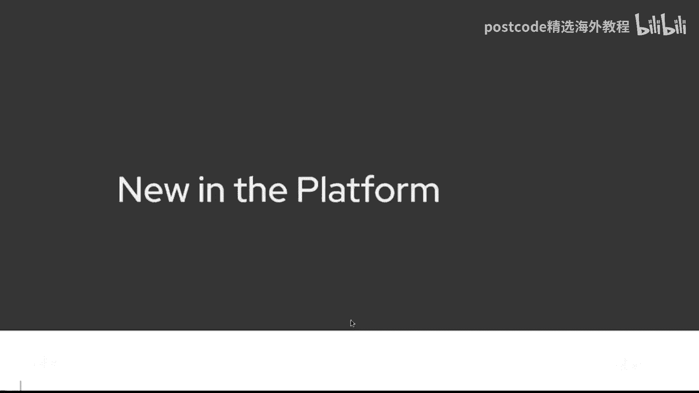
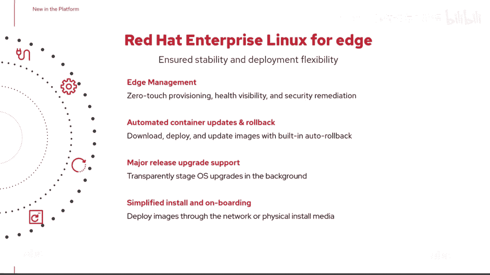
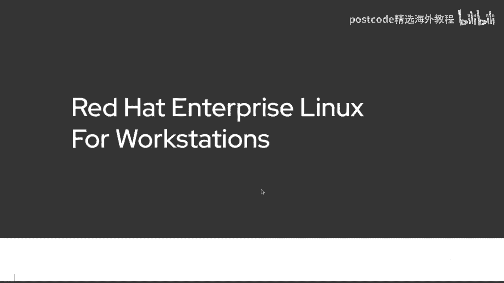
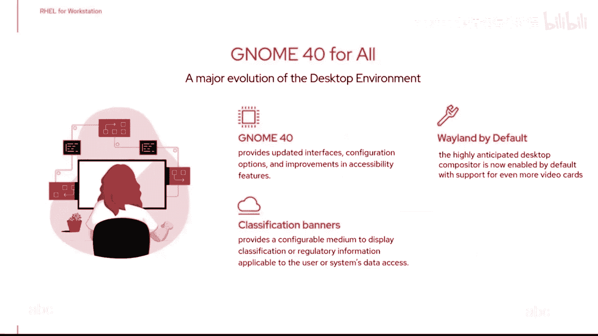
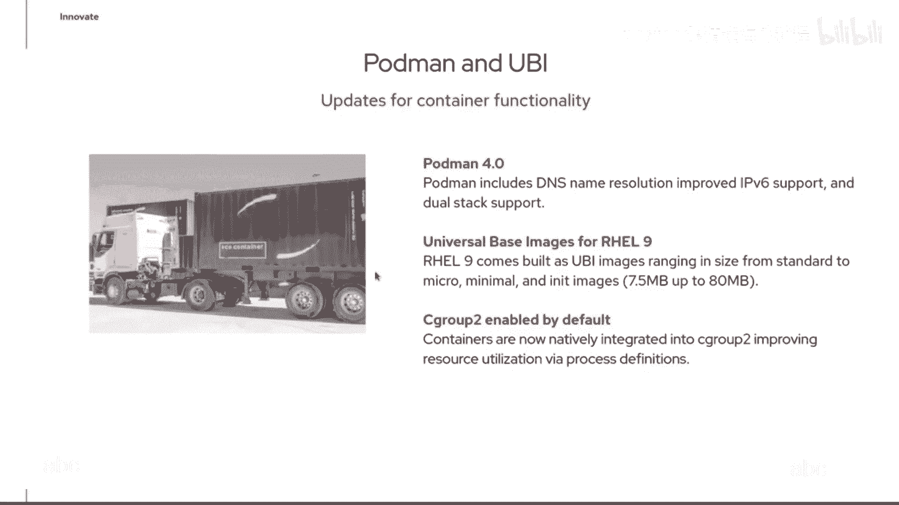
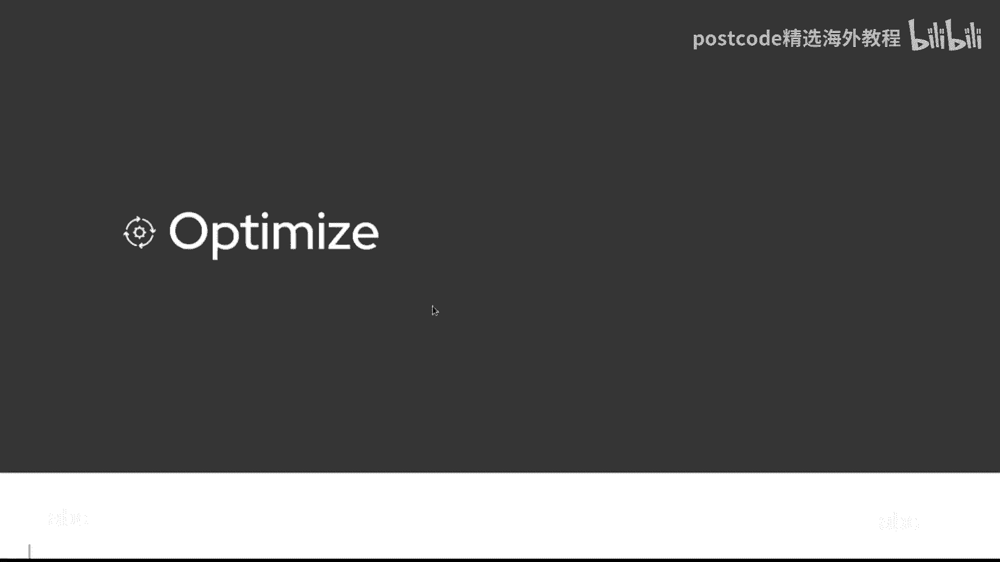
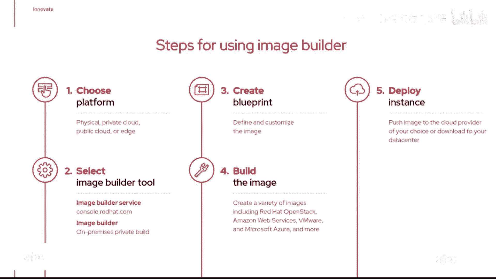

# 红帽企业Linux RHEL 9精通课程 — RHCSA与RHCE 2023认证全指南 - P2：01-01-002 rhcsa-1 - 精选海外教程postcode - BV1j64y1j7Zg

事物编程明智的事物是新的，在平台中，显然是9号轨，我们有一个颠簸，到内核，记住，内核是操作系统的核心，服务之间的桥梁，您正在运行的应用程序，以及您系统的硬件，该内核已更新至 5。14。

它为最新的硬件提供支持，例如，它改进了 USB 4 支持，但还有几个关键功能，我们想提一下，这些功能之一是启用了 Wireguard，您知道传统的 VPN 支持，已经是用户空间应用程序。

运行在Linux环境之上，出色地，Wireguard 是一个实际的内核模块，所以现在我们可以简单地拥有一个轻量级的，与此相关的服务，内核模块，这应该给我们，更好的加密支持和更快的响应时间。

用于通过 VPN 工作，这是 9。0 上的技术预览版，但，是这样的东西，我们预计会有更多的人与我们合作，514 还改变了什么，是课程安排，我们正在启用，跨 CPU 过程的同时多线程。

虽然我们预计情况会有所改善，大多数人的表现，工作负载，这到底是什么，有趣的是帮助减轻，一些，引入或发现的漏洞，诸如幽灵和崩溃之类的东西，另一件事是我们，已宣布今年的支持，1 月 1 日。

我们在arm上引入了对RAL的支持，所以，现在这意味着我们可以运行相同的操作系统，在另一个平台上，所以我已经在官方轨道上滑行了，9 个支持的架构，所以对于我们许多人来说传统的 x8664，我们合作的。

但我们还有支持继续支持的力量，处理器和 Ibmz 系列，现在添加的是arm架构，警告好吧，这不支持树莓派，好的，所以马上把它放在那里，但对于我们正在寻找的 Arm 架构，在我们的边缘环境中。

以及在一些云服务器中，该产品现已在全球范围内上市，并可在所有不同的，订阅选项，从标准到高级再到智能管理，因此，扩大我们的足迹，提高我们的可用性，说到边缘，面向边缘的红帽企业 Linux 是，现在专注于。

我们超越了现有的云服务器，但继续，并支持这些组织，正在存放东西的，出去，在那边缘，当然，边缘管理代表，额外关注权，我该如何进行远程更新，主要版本升级等，无需前往和触摸，那些边缘设备，所以零接触配置。

更好地了解那些人的健康状况，边缘设备，能够执行所需的安全修复，及时地，好的，所有这些现在都被合并在这里，深入了解我们所提供的产品，并且确实，我们的强烈关注，在过去的几年里，当我们介绍。

变成现实，另一个程序更新，是红帽的介绍，适用于工作站的企业 Linux，现在，这不是我们要去的，谁又是Linux桌面年，不，当我们在这里说工作站时。

我们正在谈论那种，高的，结束要求苛刻的应用，也许你的，你知道建筑动画，其他视觉效果，或者也许您从事科学计算，想做的计算领域，那里有额外的工作量，这就是我们正在讨论的事情，带 RAL 工作站。

你知道这里的部分优势，是 RAL 代表工作站吗，现在意味着我们有一个 Linux 工作站，专为那些专业人士设计，这给了我们充分的，10年生命周期，你知道仍然是相同的经过认证的硬件，还是企业支持。

整个合作伙伴生态系统都可以在此基础上构建，所以，能够运行这个的工作站，当然是桌面世界，其中一部分还包括诸如，升级到 GNOME 40，我们有可用的，有桌面版本和工作站版本，新环境。

图形世界中的新改进，正确的，这些是程序的功能，我们一直在谈论的，现在让我们更深入地研究一下，并谈谈一些技术特点，Real 9 正在推出，记住我们的支柱。

所以我们首先讨论创新，并希望能够，跟上很多事情的潮流，所以我们在这里简化了开发者体验，这意味着什么，我们有最新的开发工具，我们，从新版本开始，这些工具的，但我们也，重新定义应用程序流。

我们在真实8中介绍过，所以我们有基础操作系统，即核心操作系统，获取内核所需的最少元素，以及一些基本的支持基础设施，但随后是用户空间，工具和应用程序放置在应用程序流中，我们传统上将其中一些构建为模块。

你可能还记得 RAL 8，允许您同时拥有 Python 3 的模块，和 Python 2 同时安装在该系统上，这样你就可以为，您过渡时的任一环境，到Python 3，所以，应用程序流和模块。

让你有能力构建一些这样的东西，但我们也意识到有时应用程序流，本身对你来说不够快，Linux Builder 代码准备就绪，让您可以访问更高版本的工具，我们添加的另一件事是扁平包装，对于桌面环境中的用户。

你可能听说过，新的包装机制，它允许你下拉元素，也许是较新的并且可能与平台无关，到一点，我们已经完成了向 Python 3 的迁移，所以没有，蟒蛇2，乘坐 9 号铁路，如果你想要Python 2。

请回到A轨，再次，Python 自行退休，死的，Python 社区不再支持它，已经有一段时间没来了，这样我们就完成了迁移，第9轮也是第一轮，一个建立并基于，便士流，所以如果你是。

有兴趣为应用程序流做出贡献，为 BASO 等做出贡献，或与之合作，下载并实现 Centau 流，可能是您融入社区的一种方式，接下来会发生什么，现实，现在我提到了开发者环境，我有你的网址。

所以这是针对个人开发人员的，订阅是最有趣的事情之一，我发现Redhat的开发者，com 是内容的绝对量，我们，正在为这个环境做出贡献并投入，有一些有趣的博客，文章 如何做，全部都放在这里。

让你能够研究和学习，并看到，您可以使用红帽做很多不同的事情，企业Linux，也许你是，刚刚开始容器采用之旅，那么你可以找到，一些关于如何运行容器的信息，直接在您的铁路箱上。

一切都在 Redhat 开发人员中，com 所以我们重新设计了，试图让它变得更容易一点，供开发者获取信息，他们需要的，所以这里正在做很多工作，创新的一部分再次在于制造，确保我们有最新的。

正在运行的事物的版本，因此 Podman 4。0 包含在 Rail 9 中，这给了我们，更好的 DNS 名称解析 改进的 IPV 6 支持，UBI 图像也已扩展，这些通用基础图像可用于创建。

你自己的容器，它们有不同的口味，从标准到微型到最小化到针织，这意味着默认情况下包含在其中的内容，启动容器镜像，但你知道它可能是尺寸明智的，这，初始化映像只有 7 兆半，一直达到标准，这是在。

80兆的大小，顺便说一句更小，比真实的8，嗯，所以我们一直在努力，有点修饰，使更紧并且呃，更智能的通用基础镜像，我们默认启用的另一件事，上校中有 C 组版本 2，我们之前已经介绍过版本 2。

但 C Group 2 现在默认在您的新设备上启用，安装您可能已经用 C 实现的内容，groups 是版本 1 中的，确实没有太多标准化，在许多这些定义之间，以及我们试图限制的资源，与 C 组 2。

我们现在做出了更好的定义等等，所以现在更容易理解了，哪些资源在哪里受到控制，所以现在默认启用。

那么让我们继续讨论第二个支柱，优化了一些技术特性。

这里已经介绍过，出色地，我已经提到过图像生成器，环境什么，我们在这里介绍了9号轨，是一个实际的图像生成服务，所以你知道软件是一种服务，这，传统上使用 RAL 中的 Image Builder，你不得不。

建立自己的基础设施，能够支持图像生成器，现在红帽为您提供服务，对于图像生成器，您可以利用，我们，拥有该基础设施，创建和建造，现在是 Image Builder 服务的魅力所在，是你可以经历并构建。

你知道裸机，您可以构建虚拟机镜像，您可以构建容器镜像，无论你需要什么，并且它在它们之间一致构建，您知道图像生成器已得到增强，支持更好的裸机部署，你可以，本质上是创建安装介质，部署到裸机所必需的。

它将有一个内置的启动，整个过程是自动化的，你只要插入那个媒体然后它就消失了，我们还提供定制文件系统支持，这意味着我们可以有，多个安装点而不仅仅是一个，历史上单个大型根文件系统，你怎么样，使用图像生成器。

出色地，首先我们选择要构建的平台，这张图片是实体的吗，到私有云、公共云或边缘，然后，我们要使用图像生成器服务吗，我们提供的，你可以通过 Console Redhead 来实现，com，或者你已经有了。

本地私有构建环境，你建造的，然后你创建一个蓝图，您定义该图像的所有元素的位置，然后点击构建，它会出去为我们树立形象，在我们选择的任何平台上运行，然后我们可以继续下载发布或推送，该图像输出到特定平台。

我们为之建造的，这就是构建图像的概念，我们正在努力做到这一点，让您更容易实现自动化，让您更轻松地创作。

